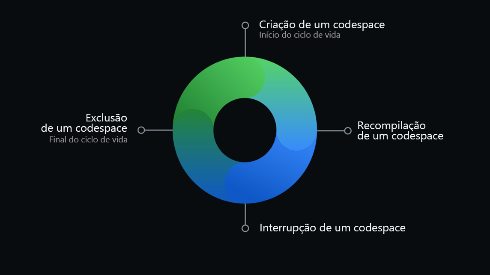
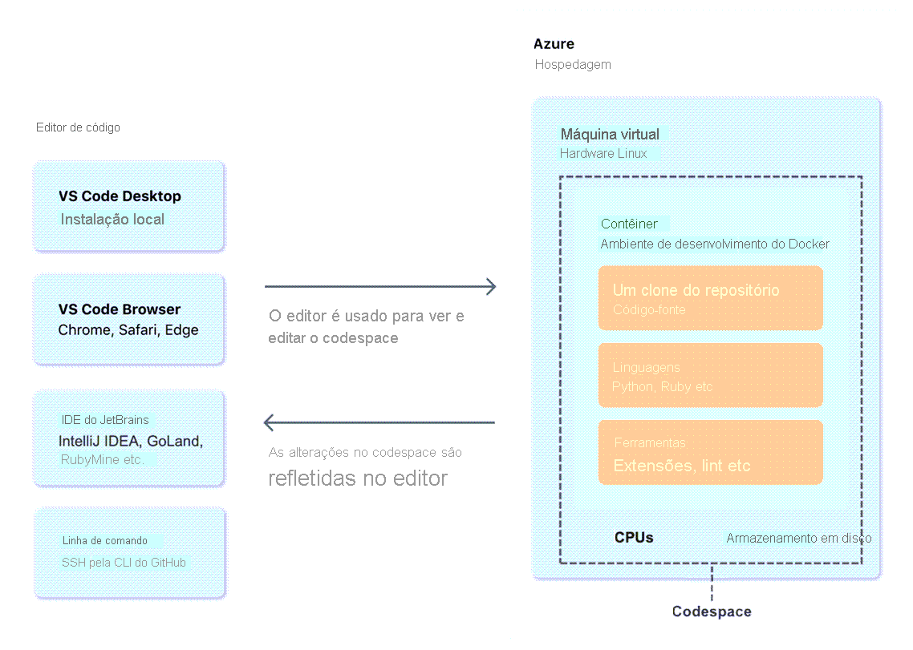

O GitHub é uma plataforma baseada na nuvem onde você pode armazenar, compartilhar e trabalhar em conjunto com outras pessoas para escrever código. O GitHub é uma plataforma baseada em nuvem que utiliza o Git, um sistema de controle de versão distribuído, como núcleo.
GitHub oferece uma plataforma de desenvolvimento alimentada por IA para criar, dimensionar e entregar software seguro.

Git é um sistema de controle de versão que rastreia mudanças em arquivos de forma inteligente.
Como o Git e o GitHub funcionam juntos?  Ao enviar arquivos para o GitHub, você os armazenará em um "repositório Git". Isso significa que quando você fizer alterações (ou "commits") nos seus arquivos no GitHub, o Git começará automaticamente a rastrear e gerenciar suas alterações.

Um repositório contém todos os arquivos do seu projeto e o histórico de revisão de cada arquivo.

Para usar um arquivo CODEOWNERS, crie um arquivo chamado CODEOWNERS na raiz, em .github/ ou no diretório docs/ do repositório, no branch em que deseja adicionar os proprietários de código.

- [x] README.md (Serve como a introdução do projeto.)
- [x] CONTRIBUTING.md (Contém diretrizes para contribuir com o projeto.)
- [x] LICENCE.md (Especifica os termos sob os quais o código do projeto pode ser utilizado, modificado e redistribuído. Vc pode escolher o modelo.)
- [x] CODE OF CONDUCT.md (Possui duas templates)
- [x] CODEOWNERS (Os arquivos CODEOWNERS devem ter menos de 3 MB. Um arquivo CODEOWNERS acima deste limite não será carregado, o que significa que as informações do proprietário do código não serão mostradas e não será solicitado que os proprietários do código apropriado revise as alterações em um pull request.@username ou o formato @org/team-name)
```
**/logs @octocat
/apps/ @octocat
/apps/* @octocat
/scripts/ @doctocat @octocat
```
Você pode atribuir proprietários de código diferentes para diferentes branches, como @octo-org/codeowners-team para uma base de código no branch padrão e @octocat para um site do GitHub Pages no branch gh-pages.
Para proteger totalmente um repositório contra alterações não autorizadas, você também precisa definir um proprietário para o próprio arquivo CODEOWNERS. O método mais seguro é definir um arquivo CODEOWNERS no diretório .github do repositório e definir o proprietário do repositório como o proprietário do arquivo CODEOWNERS (/.github/CODEOWNERS @owner_username) ou de todo o diretório (/.github/ @owner_username).


| Tipo de Conta | Entenda |
| -----         | -----   |
Contas de usuário  | As contas de usuário são destinadas a humanos, mas você pode criar contas para automatizar atividades no GitHub. |
|               | Contas pessoais | conta pessoal usa o GitHub Free ou o GitHub Pro. Todas as contas pessoais podem ter um número ilimitado de repositórios públicos e privados, com um número ilimitado de colaboradores nesses repositórios. |
Contas da organização 
Contas empresariais

| Tipo de Conta | GitHub Free                                                  | GitHub Pro |
| -----         | -----                                                        | -----          |
| Pessoal       | Suporte da Comunidade GitHub                                 | Suporte do GitHub por e-mail   |
|               | Alertas Dependabot                                           | 3.000 minutos de GitHub Actions por mês   |
|               | Regras de proteção de implantação para repositórios públicos |    |
|               | Aplicação de autenticação de dois fatores                    |    |
|               | 500 MB de armazenamento de pacotes do GitHub                 | 2 GB de armazenamento de pacotes do GitHub   |
|               | 120 horas de núcleo do GitHub Codespaces por mês             | 180 horas de núcleo do GitHub Codespaces por mês   |
|               | 15 GB de armazenamento GitHub Codespaces por mês             |  20 GB de armazenamento GitHub Codespaces por mês  |
|               | Recursos do GitHub Actions:                                  | Ferramentas e insights avançados em repositórios privados:   |
|               | 2.000 minutos por mês                                        |  Revisores de solicitação de pull necessários  |
|               | Regras de proteção de implantação para repositórios públicos | Vários revisores de solicitação de pull,Ramos protegidos,Proprietários do código,Referências vinculadas automaticamente
   |
|               | Páginas do GitHub em repositórios públicos                   |  Páginas do GitHub  |
|               |                                                              | Wikis |
|               |           | Gráficos de insights do repositório: pulso, colaboradores, tráfego, confirmações, frequência de código, rede e bifurcações |
| Organização | = Pessoal Conta |   |
|             | Suporte da Comunidade GitHub
|             | Controles de acesso de equipe para gerenciamento de grupos
|             | 2.000 minutos de GitHub Actions por mês
|             | 500 MB de armazenamento de pacotes do GitHub
|             | = GitHub Team | GitHub Free for organizations, GitHub Team includes |
|             | GitHub Support via email | |
|             | 3,000 GitHub Actions minutes per month | |
|             | 2 GB GitHub Packages storage
|             | Advanced tools and insights in private repositories: Required pull request reviewers,Multiple pull request reviewers,Draft pull requests,Team pull request reviewers,Protected branches,Code owners, Scheduled reminders,GitHub Page, Wikis |  |
|             | GitHub Enterprise  | GitHub Enterprise Cloud ou GitHub Enterprise Server |
|             |  GitHub Enterprise Support |  |
|             |  Additional security, compliance, and deployment controls |  |
|             |  Authentication with SAML single sign-on|  |
|             |  Access provisioning with SAML or SCIM|  |
|             |  Deployment protection rules with GitHub Actions for private or internal |             |  repositories|  |
|             |  GitHub Connect|  |
|             |  GitHub Enterprise Cloud specifically includes:|  |
|             |  50,000 GitHub Actions minutes per month|  |
|             |  Included minutes can be used with standard GitHub-hosted runners only. |  |
|             |  50 GB GitHub Packages storage
|             |  A service level agreement for 99.9% monthly uptime


IA: a produtividade por meio do Copilot e a segurança automatizando verificações de segurança mais rapidamente.
Colaboração: Repositórios, Problemas, Pull Requests e outras ferramentas ajudam a habilitar desenvolvedores, gerentes de projeto, líderes de operações e outros na mesma empresa.
Produtividade: a plataforma oferece aos usuários a capacidade de configurar tarefas e esquecê-las, cuidando da administração rotineira e acelerando o trabalho diário.
Segurança: recursos de segurança nativos e internos que minimizam o risco de segurança com uma solução de segurança criada internamente.seu código permanece privado dentro da sua organização. usufruir da visão geral de segurança e o Dependabot.
Escala: 

## Introdução aos repositórios
Um repositório contém todos os arquivos do seu projeto e o histórico de revisão de cada arquivo. 
Ao criar um repositório, você pode definir um proprietário, normalmente é o da conta.

- [x] Os repositórios públicos são acessíveis a todos na Interne
- [x] Os repositórios privados só podem ser acessados por você, por pessoas com quem você compartilha explicitamente o acesso no caso de repositórios de organizações, por determinados membros da organização.

##  adicionar um arquivo ao seu repositório
No campo do nome de arquivo, digite o nome e a extensão do arquivo. Para criar subdiretórios, digite o separador de diretório /.

## O que são gists
os gists são uma forma simplificada de compartilhar trechos de código com outras pessoas. Se você enviar a URL de um gist de segredo para um amigo, ele poderá vê-lo.

## wikis
GitHub.com vem equipado com uma seção para hospedagem da documentação, chamada wiki.

## branches
 branch é um lugar seguro para experimentar novos recursos ou correções.
 `git checkout -b newBranchName`

## commits
Uma confirmação é uma alteração em um ou mais arquivos de um branch. confirmação é criada, é atribuído a ela uma ID exclusiva.

O commit semântico possui os elementos estruturais abaixo (tipos), que informam a intenção do seu commit ao utilizador(a) de seu código.

    feat- Commits do tipo feat indicam que seu trecho de código está incluindo um novo recurso (se relaciona com o MINOR do versionamento semântico).

    fix - Commits do tipo fix indicam que seu trecho de código commitado está solucionando um problema (bug fix), (se relaciona com o PATCH do versionamento semântico).

    docs - Commits do tipo docs indicam que houveram mudanças na documentação, como por exemplo no Readme do seu repositório. (Não inclui alterações em código).

    test - Commits do tipo test são utilizados quando são realizadas alterações em testes, seja criando, alterando ou excluindo testes unitários. (Não inclui alterações em código)

    build - Commits do tipo build são utilizados quando são realizadas modificações em arquivos de build e dependências.

    perf - Commits do tipo perf servem para identificar quaisquer alterações de código que estejam relacionadas a performance.

    style - Commits do tipo style indicam que houveram alterações referentes a formatações de código, semicolons, trailing spaces, lint... (Não inclui alterações em código).

    refactor - Commits do tipo refactor referem-se a mudanças devido a refatorações que não alterem sua funcionalidade, como por exemplo, uma alteração no formato como é processada determinada parte da tela, mas que manteve a mesma funcionalidade, ou melhorias de performance devido a um code review.

    chore - Commits do tipo chore indicam atualizações de tarefas de build, configurações de administrador, pacotes... como por exemplo adicionar um pacote no gitignore. (Não inclui alterações em código)

    ci - Commits do tipo ci indicam mudanças relacionadas a integração contínua (continuous integration).

    raw - Commits do tipo raw indicam mudanças relacionadas a arquivos de configurações, dados, features, parâmetros.

    cleanup - Commits do tipo cleanup são utilizados para remover código comentado, trechos desnecessários ou qualquer outra forma de limpeza do código-fonte, visando aprimorar sua legibilidade e manutenibilidade.

    remove - Commits do tipo remove indicam a exclusão de arquivos, diretórios ou funcionalidades obsoletas ou não utilizadas, reduzindo o tamanho e a complexidade do projeto e mantendo-o mais organizado.


## Estados primários de um arquivo (lazygit)
Os estados primários de um arquivo em um repositório Git são Não rastreado e Rastreado.
https://learn.microsoft.com/pt-br/training/modules/introduction-to-github/3-components-of-github-flow

Não rastreado: Um estado inicial de um arquivo quando ele ainda não faz parte do repositório Git. O Git desconhece a existência dele.

Rastreado: Um arquivo rastreado é aquele que o Git está monitorando ativamente. A imagem pode estar em um dos seguintes subestados:

    Não modificado: O arquivo é rastreado, mas não foi modificado desde a última confirmação.
    Modificado: O arquivo foi alterado desde o último commit, mas essas alterações ainda não foram preparadas para o próximo commit.
    Encenado: O arquivo foi modificado e as alterações foram adicionadas à área de preparo (também conhecida como índice). Essas mudanças estão prontas para serem confirmadas.
    Empenhado: O arquivo está no banco de dados do repositório. Ele representa a versão confirmada mais recente do arquivo.

## solicitações de pull?
solicitação de pull é o mecanismo usado para sinalizar que as confirmações de um branch estão prontas para serem mescladas em outro branch.

## Github FLow

    Comece criando uma ramificação para que as alterações, recursos e correções que você criar não afetem a ramificação principal.
    Em seguida, faça suas alterações. Recomendamos implantar alterações no branch do recurso antes de mesclar no branch principal. Fazer isso garante que as alterações sejam válidas em um ambiente de produção.
    Agora, crie uma solicitação de pull para pedir feedback aos colaboradores. A revisão de pull request é tão valiosa que alguns repositórios exigem uma revisão de aprovação antes que os pull requests possam ser mesclados.
    Em seguida, revise e implemente o feedback dos seus colaboradores.
    Quando você se sentir satisfeito com suas alterações, é hora de aprovar sua solicitação de pull e mesclá-la ao branch principal.
    Por fim, você pode excluir sua ramificação. Excluir sua ramificação sinaliza que seu trabalho nela foi concluído e evita que você ou outras pessoas usem ramificações antigas acidentalmente.

## Problemas
Os problemas do GitHub foram criados para acompanhar ideias, comentários, tarefas ou bugs relacionados ao trabalho no GitHub. 
Se você for um mantenedor de projeto, poderá atribuir o problema a alguém, adicioná-lo a um quadro de projetos, associá-lo a um marco ou aplicar um rótulo.

## Discussões
Se destinam a conversas que precisam ser acessíveis a todos e não estão relacionadas ao código.
### Habilitar uma discussão em seu repositório
Os proprietários do repositório e as pessoas com acesso de gravação podem habilitar o GitHub Discussions. 
Configurações --> Recursos e, em Discussões, selecione Configurar as discussões.
### Criar uma nova discussão
Qualquer usuário autenticado que possa visualizar um repositório pode criar uma discussão nesse repositório.
## Como gerenciar assinaturas e notificações
Uma conversa em um problema específico, pull request ou gist,Atividade de CI, como o status de fluxos,Problemas de repositório, solicitações de pull, versões, alertas de segurança ou discussões (se habilitados) e Todas as atividades em um repositório.
##  GitHub Pages
GitHub Pages para hospedar e divulgar um site sobre você, sua organização ou seu projeto diretamente de um repositório do GitHub.com.

PerguntasL
Lois fez um comentário sobre um problema do GitHub, mas esqueceu de mencionar seu colega, Peter, que precisa fornecer informações sobre o tópico. Em vez de criar um novo comentário, se Lois editar um comentário no problema do GitHub e mencionar Peter, Peter receberá uma notificação?

Qual das seguintes opções descreve com precisão os diferentes status de uma solicitação pull? Escolha TRÊS respostas corretas.
Fechado, Rascunho, Pendente.

## Contas
https://learn.microsoft.com/pt-br/training/modules/github-introduction-products/2-what-are-github-products

Contas pessoais: Todas as pessoas que utilizam o GitHub.com se conectam a uma conta pessoal (às vezes chamada de conta de usuário). como criar um problema ou revisar uma solicitação de pull, são atribuídas à sua conta pessoal. Cada conta pessoal utiliza o GitHub Free ou o GitHub Pro.
GitHub Free, os repositórios privados pertencentes a sua conta pessoal terão um conjunto limitado de recursos.

Contas da organização: são contas compartilhadas em que um número ilimitado de pessoas pode colaborar em vários projetos uma vez. as organizações podem ser proprietárias de recursos como repositórios, pacotes e projetos. você não pode entrar em uma organização.   a pessoa toma sobre os recursos da organização são atribuídas à sua conta pessoal. Cada conta pessoal pode ser um integrante de múltiplas organizações.somente os proprietários da organização e os gerenciadores de segurança podem gerenciar as configurações da organização e controlar o acesso aos dados da organização

Conta corporativa: permitem que os administradores gerenciem de forma centralizada as políticas e a cobrança para várias organizações e habilitem o fornecimento interno entre suas organizações. Uma conta corporativa deve ter um identificador, como uma organização ou conta de usuário no GitHub. Nas configurações da conta corporativa, os proprietários da empresa podem convidar organizações existentes para ingressar em sua conta corporativa, transferir organizações entre contas corporativas ou criar organizações.

## Planos
Existem vários produtos gratuitos do GitHub, além dos pagos:

- [x] GitHub Free para contas pessoais e organizações: conta de usuário pessoal. Uma conta de usuário pessoal inclui repositórios públicos e privados ilimitados e colaboradores ilimitados. Controles de acesso da equipe para gerenciamento de grupos

- [x] GitHub Pro para contas pessoais;
- [x] GitHub para equipes;
- [x] GitHub Enterprise;


### Cobrança do GitHub
 GitHub cobra separadamente por cada conta. Você recebe uma fatura separada para sua conta pessoal e para cada conta corporativa ou de organização que você possui.
 A cobrança de cada conta é uma combinação de cobranças:
 Assinaturas : GitHub Pro ou o GitHub Team, como o GitHub Copilot e aplicativos do GitHub Marketplace.
 A cobrança baseada no uso: depende de quantos minutos seus trabalhos passam em execução e da quantidade de armazenamento que seus artefatos utilizam.

https://learn.microsoft.com/pt-br/training/modules/github-introduction-products/2-what-are-github-products

## Mobile vs Desktop
O GitHub para Dispositivos Móveis é uma maneira segura e protegida de acessar seus dados no GitHub por meio de um aplicativo cliente confiável, criado pela própria plataforma
O GitHub para Desktop é um aplicativo autônomo de código aberto, facilita a colaboração entre você e sua equipe e o compartilhamento de boas práticas do Git e do GitHub dentro da sua equipe.

|     Mobile             | Desktop         |
| -----                  | -------         |
| Ler, analisar e colaborar em problemas e solicitações de pull.                  | Adicionar e clonar repositórios. |
| Editar arquivos nas solicitações de pull.                                       | Adicionar alterações ao seu commit de forma interativa. |
| Pesquisar, navegar e interagir com usuários, repositórios e organizações.       |  Adicione rapidamente coautores ao seu commit. |
| Receber uma notificação por push quando alguém mencionar seu nome de usuário.   | Fazer o checkout de branches com solicitações de pull e conferir os status de CI. |
| Agende suas notificações por push para horários personalizados específicos.     | Comparar imagens alteradas. |
| Proteger sua conta no GitHub.com com uma autenticação de dois fatores.          | |
| Verificar suas tentativas de login em dispositivos não reconhecidos.            | |


## O que é varredura de código? (CodeQL)
Sua empresa acabou de adquirir uma licença do **GitHub Advanced Security** que ajuda a economizar tempo e esforço, permitindo que você use a varredura de código.
CodeQL para analisar o código em um repositório GitHub para encontrar vulnerabilidades de segurança e erros de codificação.
Varredura de código está disponível para todos os repositórios públicos e para repositórios privados pertencentes a organizações em que a Segurança Avançada do GitHub está habilitada. 
Você pode agendar varreduras para determinados dias e horas ou disparar varreduras quando ocorre um evento específico no repositório, como um push.

| Configuração | Entenda                         |
| --------     | --------                        |
| Padrão       | manipula a escolha dos idiomas a serem analisados, o pacote de consultas a ser executado e os eventos que disparam verificações com a opção de configurar manualmente os idiomas e os pacotes de consultas. |
| avançada     | adicionar o fluxo de trabalho do CodeQL diretamente ao seu repositório. |
| Execute a CLI do CodeQL  | diretamente em um sistema de CI externo e carregue os resultados no GitHub. |

Segurança --> Code Scan Alerts


### Habilitar a verificação de código com ferramentas de terceiros
Você pode carregar arquivos SARIF (Static Analysis Results Interchange Format  - Formato de Intercâmbio de Resultados de Análise Estáticos) gerados fora do GitHub ou com GitHub Actions para ver alertas de verificação de código de ferramentas de terceiros em seu repositório.
#### API de Verificação de Código
curl -L \
  -H "Accept: application/vnd.github+json" \
  -H "Authorization: Bearer <YOUR-TOKEN>" \
  -H "X-GitHub-Api-Version: 2022-11-28" \
  https://api.github.com/orgs/ORG/code-scanning/alerts

ou

https://docs.github.com/pt/rest/code-scanning/code-scanning?apiVersion=2022-11-28

#### CLI do CodeQL

brew install codeql
https://docs.github.com/pt/code-security/codeql-cli

| Idioma  | Identificador   | Identificadores alternativos opcionais (se houver)  |
| ------  | ---------       | -----------                                         |
| C/C++	  | c-cpp	        | c ou cpp                                            |
| C#	  | csharp	        |                                                      | 
| go 	  | go	            |                                                      |
| Java/Kotlin	|java-kotlin	| java ou kotlin |
| JavaScript/TypeScript	    | javascript-typescript	| javascript ou typescript     |
| Python  | python		    |                                                      |
| Ruby	  | ruby		    |                                                      |
| Swift	  | swift	        |                                                      |

```
# Create CodeQL databases for Java and Python in the 'codeql-dbs' directory
# Call the normal build script for the codebase: 'myBuildScript'

codeql database create codeql-dbs --source-root=src \
    --db-cluster --language=java,python --command=./myBuildScript

# Analyze the CodeQL database for Java, 'codeql-dbs/java'
# Tag the data as 'java' results and store in: 'java-results.sarif'

codeql database analyze codeql-dbs/java java-code-scanning.qls \
    --format=sarif-latest --sarif-category=java --output=java-results.sarif

# Analyze the CodeQL database for Python, 'codeql-dbs/python'
# Tag the data as 'python' results and store in: 'python-results.sarif'

codeql database analyze codeql-dbs/python python-code-scanning.qls \
    --format=sarif-latest --sarif-category=python --output=python-results.sarif

# Upload the SARIF file with the Java results: 'java-results.sarif'
# The GitHub App or personal access token created for authentication
# with GitHub's REST API is available in the `GITHUB_TOKEN` environment variable.

codeql github upload-results \
    --repository=my-org/example-repo \
    --ref=refs/heads/main --commit=deb275d2d5fe9a522a0b7bd8b6b6a1c939552718 \
    --sarif=java-results.sarif

# Upload the SARIF file with the Python results: 'python-results.sarif'

codeql github upload-results \
    --repository=my-org/example-repo \
    --ref=refs/heads/main --commit=deb275d2d5fe9a522a0b7bd8b6b6a1c939552718 \
    --sarif=python-results.sarif
```


### Análise de verificação de código com GitHub Actions
Os fluxos de trabalho são armazenados no diretório .github/workflows para seu repositório.

## Configurar a varredura de código
você pode executar a varredura de código no GitHub, usando GitHub Actions, ou de seu sistema de CI (integração contínua).

## GitHub Copilot 
ferramenta de desenvolvedor de IA em escala do mundo que pode ajudar você a escrever código mais rapidamente com menos trabalho.
O OpenAI criou modelo de linguagem pré-treinado generativo do GitHub Copilot, da plataforma OpenAI Codex. 
extensão está disponível para Visual Studio Code, Visual Studio, Neovim e o pacote JetBrains de IDEs (ambientes de desenvolvimento integrados).

O GitHub Copilot é um serviço que fornece um programador em pares de IA que funciona com todas as linguagens de programação populares e acelera drasticamente a produtividade geral do desenvolvedor. 

GitHub Copilot Business

Foco em equipes: Destinado a equipes de desenvolvimento em empresas de médio a grande porte.
Recursos de colaboração: Inclui funcionalidades para gerenciamento de usuários e permissões, permitindo que as equipes trabalhem de forma integrada.
Integração com ferramentas: Funciona bem com diversas ferramentas de desenvolvimento e CI/CD.

GitHub Copilot Enterprise
Soluções personalizadas: Focado em organizações maiores ou que têm necessidades específicas de segurança e conformidade.
Gerenciamento avançado: Oferece controle mais rigoroso sobre a implementação e uso do Copilot, com suporte a políticas corporativas.
Segurança e conformidade: Pode incluir opções de segurança adicionais, como integração com sistemas de autenticação empresarial e conformidade com regulamentos específicos.

Desde ler documentos a escrever código até enviar solicitações de pull e além, o GitHub está trabalhando para personalizar o GitHub Copilot para cada equipe, projeto e repositório em que ele é usado, criando um ciclo de vida de desenvolvimento de software radicalmente aprimorado. 

###  Codespace
Codespaces é um ambiente de desenvolvimento instantâneo e baseado em nuvem que usa um contêiner para fornecer linguagens, ferramentas e utilitários de desenvolvimento comuns. permitindo que você crie um ambiente de desenvolvimento personalizado para seu projeto. O ciclo de vida de um Codespace começa quando você cria um Codespace e termina quando você o exclui. 


Você pode criar um Codespace no GitHub.com, no Visual Studio Code ou usando a CLI do GitHub. 
* Uso de modelos do GitHub
* branch em seu repositório
* pull request abert
* Usando um commit no histórico do repositório para investigar um bug em um momento específico.
há limites quanto ao número de Codespaces que você pode criar e o que você pode executar ao mesmo tempo. 
Se estiver iniciando um novo projeto, crie um Codespace usando um modelo e publique-o em um repositório no GitHub posteriormente.
Administradores de repositório podem habilitar pré-compilações do GitHub Codespaces para um repositório para acelerar a criação do Codespace.


 O período de tempo limite de inatividade padrão é de 30 minutos. Você pode definir sua configuração de tempo limite pessoal para os Codespaces que criar, mas isso pode ser anulado por uma política de tempo limite da organização.
 
### Codespaces versus editor GitHub.dev
Você pode usar GitHub.dev para navegar por arquivos e repositórios de código-fonte do GitHub e fazer e confirmar alterações de código. Você pode abrir qualquer repositório, bifurcação ou PR no editor GitHub.dev.

	   |  GitHub.dev        | Codespaces do GitHub |
| Custo  | Gratuita	        | Cota mensal gratuita de uso para contas pessoais. |
| Disponibilidade | Disponível para todos no GitHub.com	| Disponível para todos no GitHub.com. |
Inicialização	GitHub.dev abre instantaneamente com o pressionar de uma tecla e você pode começar a usá-lo imediatamente, sem ter que esperar pela configuração ou instalação.	Quando você cria ou retoma um Codespace, uma VM é atribuída ao Codespace. O contêiner é então configurado com base no conteúdo de um arquivo devcontainer.json. Essa configuração leva alguns minutos para criar o ambiente de desenvolvimento.
Computação	Não há recursos de computação associados, portanto você não pode criar e executar seu código ou usar o terminal integrado.	Com o GitHub Codespaces, você tem a potência de uma VM dedicada para executar e depurar seu aplicativo.
Acesso ao terminal	Nenhum	O GitHub Codespaces fornece um conjunto comum de ferramentas por padrão, o que significa que você pode usar o Terminal exatamente como faria no ambiente local.
Extensões	Apenas um subconjunto de extensões que podem ser executadas na Web aparecerão na visualização de extensões e poderão ser instaladas	Com o GitHub Codespaces, você pode usar a maioria das extensões do Marketplace do Visual Studio Code.

## Gerenciar seu trabalho com projetos do GitHub
Projetos versus Projetos Clássicos

| O que        | Projetos	| Projetos (Clássico) |
| -----        | -----     | --------             |
| Tabelas e quadros	| Quadros, Listas, Layout da Linha do Tempo	| Boards |
| Dados| 	Classificar, priorizar e agrupar itens por campos personalizados, como texto, número, data, iteração e seleção única| 	Colunas e Cartões| 
| Insights	| Crie visuais para ajudar a entender seu trabalho por meio de gráficos históricos e atuais com Projetos	| Barra de progresso| 
| Automação	| Use a API do GraphQL, ações e predefinições de coluna para gerenciar seu projeto	| Configurar Predefinições de coluna para quando problemas e solicitações pull forem adicionados, editados ou fechados|

### Tabelas e quadros
* Planejar e controlar o trabalho em uma exibição de tabela ou quadro
* Classificar, priorizar e agrupar dentro de uma tabela por qualquer campo personalizado
* Crie esboços de problemas com descrições e metadados detalhados
* Materialize qualquer perspectiva com filtragem tokenizada e visualizações salvas
* Personalizar cartões e agrupar por em quadros de projeto
* Atualizações de projeto em tempo real e indicadores de presença do usuário

Automação
* API do GraphQL ProjectsV2
* Escopos do projeto do aplicativo GitHub
* Eventos de webhooks para atualizações de metadados de itens do * projeto
* GitHub Action para automatizar a adição de problemas a projetos

# Para a criação de Milestone e Lables, tenho que ir nos repositorios e depois issues.

Controlar a visibilidade do seu projeto
 projeto será público ou privado. Quando seu projeto é público, todos na Internet podem exibi-lo. Quando o projeto é privado, somente os usuários que receberam pelo menos acesso de leitura podem vê-lo.

Projeto no nível da organização
Sem acesso: Somente os proprietários e usuários da organização que receberam acesso individual podem ver o projeto. Os proprietários da organização também são administradores do projeto.
Ler: Todos na organização podem ver o projeto. Os proprietários da organização também são administradores do projeto.
Gravação: Todos na organização podem ver e editar o projeto. Os proprietários da organização também são administradores do projeto.
Administrador: Todos na organização são administradores do projeto.

Projeto no nível pessoal/de usuário
Ler: O indivíduo pode ver o projeto.
Gravação: O indivíduo pode ver e editar o projeto.
Administrador: O indivíduo pode ver, editar e adicionar novos colaboradores ao projeto.

Para vincular um projeto a um repositório, entre no repositório e projetos e voinvule.

# Insights
O Insights com Projetos permite que você visualiza, crie e personalize gráficos que usam itens adicionados ao seu projeto como dados de origem. Ao criar um gráfico, você define os filtros, o tipo de gráfico e as informações exibidas.

Gráficos atuais
Você pode criar gráficos atuais para visualizar itens do projeto.

Gráficos históricos
Os gráficos históricos estão disponíveis com o GitHub Team e o GitHub Enterprise Cloud para organizações.

Automação com projetos
Há três maneiras diferentes possibilitando você a fazer isso:

Fluxos de trabalho automatizados internos
API GraphQL
GitHub Actions com fluxos de trabalho


GitHub Actions com fluxos de trabalho
Um exemplo de fluxo de trabalho que é acionado na criação de um problema que adiciona um rótulo, deixa um comentário e move o problema para um quadro de projeto.


Markdown?
é uma linguagem de marcação que oferece uma abordagem enxuta para edição de conteúdo, protegendo os criadores de conteúdo da sobrecarga do HTML
Também abordaremos recursos do GFM (GitHub-Flavored Markdown), que são extensões de sintaxe que permitem integrar recursos do GitHub ao conteúdo.

Negrito - \*\*
Italico - \_\_
Código = \`\`, pode ser: markdown, javascript, mermaid e etc.
Endereçar ID - #ID, como #3602
# e o número do problema ou da solicitação de pull
GH- e o número do problema ou da solicitação de pull
Username/Repository# e o número do problema ou da solicitação de pull
User@SHA
Mencionar  - @githubteacher

Comandos Barra

Comando	Descrição
/code	Insere um bloco de código Markdown. Você escolhe a linguagem.
/details	Insere uma área de detalhes recolhível. Você escolhe o título e o conteúdo.
/saved-replies	Insere uma resposta salva. Você escolhe uma das respostas salvas para sua conta de usuário. Se você adicionar %cursor% à sua resposta salva, o comando de barra "/" coloca o cursor nesse local.
/table	Insere uma tabela Markdown. Você escolhe o número de colunas e linhas.
/tasklist	Insere uma lista de tarefas. Esse comando de barra "/" só funciona em uma descrição do problema.
/template	Mostra todos os modelos no repositório. Você escolhe o modelo a ser inserido. Esse comando de barra funciona para modelos de problemas e para um modelo de solicitação de pull.

# Contribuir para um projeto de software livre no GitHub
Contribuir é mais fácil quando você está familiarizado com o projeto e com a comunidade dele.
Você também pode usar a pesquisa do GitHub para explorar tópicos e projetos relacionados.
você pode localizar repositórios relevantes para a sua palavra-chave de pesquisa e repositórios coletados por membros da comunidade.

A maioria dos projetos tem estes documentos no nível superior do repositório:

LICENSE: o projeto precisa conter uma licença de código aberto. 
README: o arquivo LEIAME geralmente serve como a página inicial do projeto.
CONTRIBUTING: como nome sugere, esse documento fornece diretrizes sobre como contribuir com o projeto. 
CODE_OF_CONDUCT: o código de conduta define as regras básicas para os membros da comunidade. 
Embora nem todos os projetos tenham os documentos CONTRIBUTING e CODE_OF_CONDUCT, a presença deles é uma boa indicação do quanto um projeto é amigável e acolhedor.

Uma boa maneira de se familiarizar com a comunidade é ler alguns destes canais de comunicação:
Issue tracker: local em que as pessoas discutem problemas e tarefas relacionados ao projeto. Para encontrar os problemas no GitHub, você pode ir até a página principal do repositório no GitHub e adicionar **/issues** ao final da URL, por exemplo, https://github.com/jupyter/notebook/issues.
Pull request: local em que as pessoas discutem e examinam as alterações do projeto. Encontre-a no GitHub adicionando **pulls** à URL do projeto, por exemplo, https://github.com/jupyter/notebook/pulls.

Char channels and forums: alguns projetos usam canais de chat, como Slack, Gitter e IRC, ou fóruns, como o Discourse, para conversas e discussões.

### Identificar tarefas nas quais trabalhar
Talvez você já tenha identificado algo em que deseja trabalhar, como corrigir links desfeitos ou atualizar a documentação. Uma boa maneira de encontrar problemas adequados para iniciantes é visitando a URL de **/contribute** do projeto.

### Patrocinar um Projeto
Você pode dar suporte financeiro às pessoas que criam e mantêm o ecossistema de software livre por meio de código, liderança, mentoria, design e muito mais.


#!/bin/bash
clear screen


gh repo create "60pportunities" --add-readme --public --license "Apache-2.0" --description "Paginas de Documentação da 60pportunities"
GITHUB_SHA=$(gh api repos/s60pportunities/60pportunities/commits/main | jq -r '.sha')
echo "SHA= ${GITHUB_SHA}"
gh api -X POST /repos/s60pportunities/60pportunities/git/refs -f ref=refs/heads/gh-pages -f sha="${GITHUB_SHA}"
gh repo edit --enable-pages
gh repo edit --pages-branch gh-pages --pages-folder /
#gh repo edit --set-pages-domain "60pportunities.com.br"
gh repo view --web
gh label create "documentação" --color "0099cc" --description "Para questões relacionadas à criação ou atualização de documentos."
gh label create "documentação" --color "0099cc" --description "Para questões relacionadas à criação ou atualização de documentos."
gh label create "documentação" --color "0099cc" --description "Para questões relacionadas à criação ou atualização de documentos."
gh label create "documentação" --color "0099cc" --description "Para questões relacionadas à criação ou atualização de documentos."
gh label create "melhoria" --color "0099cc" --description "Para sugestões de melhorias na documentação existente.
gh label create "novo recurso" --color "0099cc" --description "Para a documentação de novas funcionalidades ou recursos."
gh label create "atualização" --color "0099cc" --description "Para tarefas que envolvem a atualização de informações já existentes."
gh label create "exemplo" --color "0099cc" --description "Para questões que envolvem a adição ou revisão de exemplos de código ou uso."
gh label create "tradução" --color "0099cc" --description "Para questões relacionadas à tradução da documentação para outros idiomas."
gh label create "urgente" --color "0099cc" --description "Para problemas que precisam de atenção imediata."
gh label create "feedback" --color "0099cc" --description "Para sugestões ou comentários gerais sobre a documentação."
gh label create "formatação" --color "0099cc" --description "Para problemas relacionados à formatação ou estilo da documentação."

## Permissões de acesso no GitHub
Uma permissão é a capacidade de executar uma ação específica. 

| Tipo e Conta    | Entenda |
| -----           | ----    |
| Contas pessoais | o proprietário do repositório e os colaboradores. O GitHub limita o número de pessoas que podem ser convidadas para um repositório dentro de um período de 24 horas. Settings --> Colaboradores --> Adicionar pessoas |
|                 | Settings --> Opções de moderação --> clique em Limites de interação. |
|                 |  

GitHub Advanced Security: Varredura de código, CodeQL CLI , Escaneamento secreto , Regras de triagem automática personalizadas w Revisão de dependência.


### Gerenciando as configurações do seu tema
 Configurações --> Aparência --> Modo de tema
 <details>
<summary>My top languages</summary>

| Rank | Languages |
|-----:|-----------|
|     1| JavaScript|
|     2| Python    |
|     3| SQL       |

</details>


# Criando um link permanente para um snippet de código
No GitHub, navegue até a página principal do repositório.
Localize o código que você gostaria de vincular:
Escolha se deseja selecionar uma única linha ou um intervalo.
À esquerda da linha ou intervalo de linhas, clique em `...`. No menu suspenso, clique em Copiar permalink.
Navegue até a conversa onde você deseja criar um link para o snippet de código.
Cole seu permalink em um comentário e clique em Comentar .
Acrescente #Lo número da linha ou números no final da url. Por exemplo, github.com/<organization>/<repository>/blob/<branch_name>/README.md?plain=1#L14

### Usando palavras-chave em problemas e solicitações de pull
Para vincular uma solicitação de pull a um problema para mostrar que uma correção está em andamento e para fechar o problema automaticamente quando alguém mesclar a solicitação de pull, digite uma das seguintes palavras-chave seguidas por uma referência ao problema. Por exemplo, Closes #10ou Fixes octo-org/octo-repo#100.


| Problema vinculado | Sintaxe | Exemplo |
| ----               |  ----   |  ----   | 
| Problema no mesmo repositório	| PALAVRA-CHAVE #NÚMERO-DA-EDIÇÃO | Closes #10 |
| Problema em um repositório diferente	| PALAVRA-CHAVE PROPRIETÁRIO/REPOSITÓRIO#NÚMERO-DE-EDIÇÃO	| Fixes octo-org/octo-repo#100 |
|  Múltiplos problemas	| Use a sintaxe completa para cada problema | Resolves #10, resolves #123, resolves octo-org/octo-repo#100 |

<div class="mdx-columns3" markdown>
- [x] close
- [x] closes
- [x] closed
- [x] fix
- [x] fixes
- [x] fixed
- [x] resolve
- [x] resolves
- [x] resolved
</div>

### Comandos de barra
Os comandos de barra facilitam a digitação de Markdown mais complexos, como tabelas, listas de tarefas e blocos de código.


| Comando | Descrição |
| ----    | -----     |
| /code	  | Insere um bloco de código Markdown. Você escolhe o idioma. |
| /details | Insere uma área de detalhes recolhível. Você escolhe o título e o conteúdo. |
| /saved-replies | Insere uma resposta salva. Você escolhe entre as respostas salvas para sua conta de usuário. Se você adicionar %cursor%à sua resposta salva, o comando slash colocará o cursor naquele local. |
| /table | Insere uma tabela Markdown. Você escolhe o número de colunas e linhas. |
| /template | Mostra todos os modelos no repositório. Você escolhe o modelo para inserir. Este comando de barra funcionará para modelos de problemas e um modelo de solicitação de pull. |

No menu suspenso, clique em Copiar permalink .
### Fixando um problema no seu repositório
navegue até a página principal do repositório. --> Problemas (Issues) --> Fixar problema.
### Marcando problemas ou solicitações de pull como duplicados
Para marcar um problema ou solicitação de pull como duplicado, digite "Duplicate of #nnn"
### Desmarcando duplicatas
Você pode desmarcar problemas duplicados e solicitações de pull clicando em Desfazer na linha do tempo.
### Transferindo um problema aberto para outro repositório
principal do repositório --> Problemas --> Escolha o Problema -->  Problema de transferência --> Repositório para o qual deseja transferir o problema. -->  Transferir problema .
### Fechando um problema
Problemas  --> Opcionalmente, para alterar o motivo do encerramento do problema, ao lado de "Fechar problema", selecione e clique em um motivo --> Fechar Problema
### Excluir Problemas
o problema que você deseja excluir. --> "Notificações", clique em Excluir problema --> clique em Excluir este problema.
## Projetos 
É uma ferramenta adaptável e flexível para planejar e rastrear o trabalho no GitHub.

### Criando um projeto


Recomendamos fortemente que você configure 2FA para sua conta. 2FA é uma camada extra de segurança que pode ajudar a manter sua conta segura. Para obter mais informações, consulte " Configurando autenticação de dois fatores ".

### Renomear uma branch
- [x] git branch -m OLD-BRANCH-NAME NEW-BRANCH-NAME
- [x] git fetch origin
- [x] git branch -u origin/NEW-BRANCH-NAME NEW-BRANCH-NAME
- [x] git remote set-head origin -a
- [x] git remote prune origin

Exigir revisões de solicitação de pull antes de mesclar
você pode exigir que o push revisável mais recente seja aprovado por alguém diferente da pessoa que o fez.
Descartar aprovações de pull request obsoletas quando novos commits forem enviados e/ou Exigir aprovação do push revisável mais recente , 


### Regras na Branch
Branches -->  Branch protection rules --> Add rule --> Branch name pattern"


| Tipo | Contexto | Requisitos de mesclagem	| Considerações |
| ---- | ----     | -----  | ------- |
| Strict | A caixa de seleção Exigir que as ramificações estejam atualizadas antes da mesclagem está marcada. |  O branch deve estar atualizado com o branch base antes da mesclagem. | Este é o comportamento padrão para verificações de status necessárias. Mais builds podem ser necessárias, pois você precisará atualizar o branch principal depois que outros colaboradores atualizarem o branch de destino. |
| Loose | A caixa de seleção Exigir que as ramificações estejam atualizadas antes da mesclagem não está marcada. | A ramificação não precisa estar atualizada com a ramificação base antes da mesclagem. | A ramificação não precisa estar atualizada com a ramificação base antes da mesclagem. |
| Disabled | A caixa de seleção Exigir que as verificações de status sejam aprovadas antes da mesclagem não está marcada. | A filial não tem restrições de mesclagem. | Se as verificações de status necessárias não estiverem habilitadas, os colaboradores podem mesclar o branch a qualquer momento, independentemente de ele estar atualizado com o branch base. Isso aumenta a possibilidade de alterações incompatíveis. |

Exigir confirmações assinadas: Usando GPG, SSH ou S/MIME,


## Perguntas e Respostas

1. **O que é Git?**
   - a) Um sistema de controle de versões.
   - b) Um serviço de armazenamento na nuvem.
   - c) Uma linguagem de programação.
   - **Resposta:** a) Um sistema de controle de versões.
2. **Como você cria um novo repositório no GitHub?**
   - a) `git new`
   - b) `git create`
   - c) Através da interface web do GitHub.
   - **Resposta:** c) Através da interface web do GitHub.
3. **Qual é o comando para adicionar todos os arquivos novos e modificados ao staging area?**
   - a) `git add .`
   - b) `git commit -m "Mensagem"`
   - c) `git push`
   - **Resposta:** a) `git add .`
4. **O que faz o comando `git status`?**
   - a) Mostra o histórico de commits.
   - b) Informa quais mudanças estão staged, unstaged ou untracked.
   - c) Faz push para o repositório remoto.
   - **Resposta:** b) Informa quais mudanças estão staged, unstaged ou untracked.
5. **Qual é a função do comando `git push`?**
   - a) Enviar suas mudanças locais para o repositório remoto.
   - b) Criar um novo branch.
   - c) Exibir o histórico de commits.
   - **Resposta:** a) Enviar suas mudanças locais para o repositório remoto.
6. **Como você reverte um commit no Git?**
   - a) `git reverse <commit-id>`
   - b) `git revert <commit-id>`
   - c) `git undo <commit-id>`
   - **Resposta:** b) `git revert <commit-id>`
7. **Qual comando é usado para criar uma nova branch no Git?**
   - a) `git checkout -b <branch-name>`
   - b) `git branch <branch-name>`
   - c) Ambos a e b.
   - **Resposta:** c) Ambos a e b.
8. **O que é um fork em GitHub?**
   - a) Uma cópia do repositório original que permite mudanças.
   - b) Uma forma de mesclar branches.
   - c) Um tipo de commit.
   - **Resposta:** a) Uma cópia do repositório original que permite mudanças.
9. **Como você mescla uma branch em outra?**
   - a) `git merge <branch-name>`
   - b) `git combine <branch-name>`
   - c) `git join <branch-name>`
   - **Resposta:** a) `git merge <branch-name>`
10. **O que são issues no GitHub?**
    - a) Problemas técnicos a serem resolvidos.
    - b) Relatórios de bugs e sugestões.
    - c) Ambos a e b.
    - **Resposta:** c) Ambos a e b.
11. **O que faz o comando `git blame`?**
    - a) Mostra quem fez cada mudança em uma linha de um arquivo.
    - b) Mostra o histórico de branches.
    - c) Apaga o histórico de mudanças.
    - **Resposta:** a) Mostra quem fez cada mudança em uma linha de um arquivo.
12. **Para que serve um README.md?**
    - a) Para documentar o projeto.
    - b) Para armazenar arquivos binários.
    - c) Não tem uso específico.
    - **Resposta:** a) Para documentar o projeto.
13. **Qual é o formato padrão para mensagens de commit?**
    - a) Qualquer formato é aceitável.
    - b) Uma linha curta com um resumo e uma descrição mais longa embaixo.
    - c) Apenas uma linha curta.
    - **Resposta:** b) Uma linha curta com um resumo e uma descrição mais longa embaixo.
14. **O que significa "merge conflict"?**
    - a) Quando duas branches têm mudanças que não podem ser mescladas automaticamente.
    - b) Quando o repositório está corrompido.
    - c) Quando um commit é revertido.
    - **Resposta:** a) Quando duas branches têm mudanças que não podem ser mescladas automaticamente.
15. **O que é GitHub Actions?**
    - a) Uma ferramenta para automatizar fluxos de trabalho.
    - b) Um método de revisão de código.
    - c) Um tipo de branching.
    - **Resposta:** a) Uma ferramenta para automatizar fluxos de trabalho.
16. **Como você pode comentar em um pull request?**
    - a) Somente através de email.
    - b) Usando a aba 'Comments' no pull request.
    - c) Não é possível comentar.
    - **Resposta:** b) Usando a aba 'Comments' no pull request.
17. **Qual comando pode ser usado para atualizar seu branch local com as alterações do repositório remoto?**
    - a) `git fetch`
    - b) `git pull`
    - c) Ambos a e b.
    - **Resposta:** c) Ambos a e b.
18. **Como você exclui uma branch local?**
    - a) `git delete <branch-name>`
    - b) `git branch -d <branch-name>`
    - c) `git remove <branch-name>`
    - **Resposta:** b) `git branch -d <branch-name>`
19. **O que é um "remote" no Git?**
    - a) Uma branch local.
    - b) Um repositório no servidor remoto.
    - c) Um commit específico.
    - **Resposta:** b) Um repositório no servidor remoto.
20. **Como você adiciona um repositório remoto ao seu repositório local?**
    - a) `git remote add origin <URL>`
    - b) `git fetch <URL>`
    - c) `git push <URL>`
    - **Resposta:** a) `git remote add origin <URL>`
21. **Qual comando você usaria para cancelar um commit local que ainda não foi enviado ao repositório remoto?**
    - a) `git restore --staged <file>`
    - b) `git reset --soft HEAD~1`
    - c) `git delete <commit-id>`
    - **Resposta:** b) `git reset --soft HEAD~1`
22. **Qual é a vantagem de usar branches no Git?**
    - a) Permite que várias pessoas trabalhem em recursos diferentes simultaneamente.
    - b) Mantém o repositório limpo e organizado.
    - c) Ambas a e b.
    - **Resposta:** c) Ambas a e b.
23. **O que o comando `git checkout <branch-name>` faz?**
    - a) Apaga uma branch.
    - b) Alterna o trabalho para a branch especificada.
    - c) Copia um arquivo específico.
    - **Resposta:** b) Alterna o trabalho para a branch especificada.
24. **O que é um commit "orphan" no Git?**
    - a) Um commit sem um pai.
    - b) Um commit que não é parte da árvore de commits.
    - c) Ambos a e b.
    - **Resposta:** c) Ambos a e b.
25. **Qual das opções abaixo é uma boa prática ao escrever mensagens de commit?**
    - a) Mensagens longas e detalhadas sem formatação.
    - b) Uma linha resumindo as mudanças, seguida de uma linha em branco e uma descrição detalhada, se necessário.
    - c) Usar apenas emojis.
    - **Resposta:** b) Uma linha resumindo as mudanças, seguida de uma linha em branco e uma descrição detalhada, se necessário.
26. **O que faz o comando `git stash`?**
    - a) Salva temporariamente mudanças não commitadas.
    - b) Realiza um commit sem mensagem.
    - c) Restaura uma versão anterior do repositório.
    - **Resposta:** a) Salva temporariamente mudanças não commitadas.
27. **Como você aplica as mudanças guardadas em um stash?**
    - a) `git apply stash`
    - b) `git stash apply`
    - c) `git pop stash`
    - **Resposta:** b) `git stash apply`
28. **Qual é a função do comando `git reset`?**
    - a) Reverter o repositório a um commit anterior.
    - b) Excluir um branch não utilizado.
    - c) Alterar a configuração do repositório.
    - **Resposta:** a) Reverter o repositório a um commit anterior.
29. **Qual é a finalidade do arquivo `.gitignore`?**
    - a) Listar arquivos que devem ser incluídos no repositório.
    - b) Listar arquivos que devem ser ignorados pelo Git.
    - c) Armazenar mensagens de commit.
    - **Resposta:** b) Listar arquivos que devem ser ignorados pelo Git.
30. **Como você compara diferenças entre duas branches?**
    - a) `git diff <branch1> <branch2>`
    - b) `git compare <branch1> <branch2>`
    - c) `git merge <branch1> <branch2>`
    - **Resposta:** a) `git diff <branch1> <branch2>`
31. **O que um pull request permite?**
    - a) Mesclar automaticamente duas branches.
    - b) Discutir mudanças antes de mesclá-las.
    - c) Criar novos branches.
    - **Resposta:** b) Discutir mudanças antes de mesclá-las.
32. **Qual comando é usado para visualizar o histórico de commits?**
    - a) `git show`
    - b) `git log`
    - c) `git history`
    - **Resposta:** b) `git log`
33. **O que é um repositório "bare"?**
    - a) Um repositório que possui apenas branches.
    - b) Um repositório sem arquivos de trabalho.
    - c) Um repositório que não possui histórico.
    - **Resposta:** b) Um repositório sem arquivos de trabalho.
34. **Qual comando é usado para listar as branches em seu repositório?**
    - a) `git show-branches`
    - b) `git branches`
    - c) `git branch`
    - **Resposta:** c) `git branch`
35. **O que acontece se você fizer um commit sem ter adicionado mudanças primeiro?**
    - a) Git retorna um erro.
    - b) O commit será vazio.
    - c) Git sobrescreve o último commit.
    - **Resposta:** b) O commit será vazio.
36. **Qual é a função do comando `git tag`?**
    - a) Criar versões de um projeto.
    - b) Adicionar um branch ao repositório.
    - c) Remover arquivos.
    - **Resposta:** a) Criar versões de um projeto.
37. **O que faz o `git cherry-pick <commit-id>`?**
    - a) Aplica mudanças de um commit específico a outra branch.
    - b) Mescla dois branches.
    - c) Exclui um commit.
    - **Resposta:** a) Aplica mudanças de um commit específico a outra branch.
38. **Como você exclui um repositório no GitHub?**
    - a) Usando a linha de comando.
    - b) Através das configurações do repositório na interface web do GitHub.
    - c) Não é possível excluir um repositório.
    - **Resposta:** b) Através das configurações do repositório na interface web do GitHub.
39. **O que é uma branch "main"?**
    - a) Uma branch que armazena o código mais estável.
    - b) Uma branch temporária.
    - c) Um tipo de commit.
    - **Resposta:** a) Uma branch que armazena o código mais estável.
40. **Qual comando você usaria para renomear uma branch?**
    - a) `git rename <old-name> <new-name>`
    - b) `git branch -m <new-name>`
    - c) `git move <old-name> <new-name>`
    - **Resposta:** b) `git branch -m <new-name>`
41. **O que faz o comando `git revert <commit-id>`?**
    - a) Apaga o commit especificado.
    - b) Cria um novo commit que desfaz as mudanças do commit especificado.
    - c) Muda a configuração do repositório.
    - **Resposta:** b) Cria um novo commit que desfaz as mudanças do commit especificado.
42. **O que o comando `git pull --rebase` faz?**
    - a) Faz uma atualização normal das mudanças.
    - b) Reaplica suas alterações sobre as últimas mudanças da branch remota.
    - c) Exclui a branch local.
    - **Resposta:** b) Reaplica suas alterações sobre as últimas mudanças da branch remota.
43. **Qual é a finalidade do comando `git reflog`?**
    - a) Mostrar os logs de pull requests.
    - b) Exibir o histórico dos movimentos de HEAD.
    - c) Excluir branches remotas.
    - **Resposta:** b) Exibir o histórico dos movimentos de HEAD.
44. **Como você pode ignorar um arquivo específico por meio do arquivo `.gitignore`?**
    - a) Adicionando o nome do arquivo diretamente.
    - b) Usando a palavra-chave "ignore".
    - c) Criando um novo arquivo de configuração.
    - **Resposta:** a) Adicionando o nome do arquivo diretamente.
45. **O que significa "force push"?**
    - a) Enviar todas as branches para o repositório remoto.
    - b) Sobrescrever a branch remota com as mudanças locais, mesmo que haja divergências.
    - c) Enviar um commit específico.
    - **Resposta:** b) Sobrescrever a branch remota com as mudanças locais, mesmo que haja divergências.
46. **O que faz o comando `git clean`?**
    - a) Remove branches não utilizadas.
    - b) Remove arquivos não rastreados do diretório de trabalho.
    - c) Limpa o histórico de commits.
    - **Resposta:** b) Remove arquivos não rastreados do diretório de trabalho.
47. **Qual é o significado de "fork" no GitHub?**
    - a) Criar uma cópia do repositório para modificar como desejar.
    - b) Mesclar duas branches.
    - c) Enviar um commit.
    - **Resposta:** a) Criar uma cópia do repositório para modificar como desejar.
48. **O que acontece se você fizer um `git pull` enquanto estiver em uma branch diverge?**
    - a) O Git tenta mesclar automaticamente as mudanças.
    - b) Você receberá um erro e precisará resolver manualmente.
    - c) O branch será excluído.
    - **Resposta:** a) O Git tenta mesclar automaticamente as mudanças.
49. **Como você pode verificar a diferença entre o repositório local e o remoto?**
    - a) `git compare`
    - b) `git diff origin/<branch>`
    - c) `git log`
    - **Resposta:** b) `git diff origin/<branch>`
50. **Qual comando é usado para mostrar o conteúdo de um arquivo em um commit específico?**
    - a) `git cat <commit-id>:<file-path>`
    - b) `git show <commit-id>:<file-path>`
    - c) `git log <commit-id>:<file-path>`
    - **Resposta:** b) `git show <commit-id>:<file-path>`
51. **O que é "pull request" no GitHub?**
    - a) Uma solicitação para mesclar seus commits em outra branch.
    - b) Um novo branch criado automaticamente.
    - cClaro! Abaixo estão 60 perguntas e respostas que você pode usar para simular um teste de certificação GitHub Foundation.


Passo 1: Gere um Token de Acesso Pessoal

    Acesse Configurações do GitHub.
    Clique em "Generate new token".
    Dê um nome ao token e selecione as permissões necessárias (para criar repositórios, você precisará da permissão repo).
    Copie o token gerado. Guarde-o em um lugar seguro, pois você não poderá vê-lo novamente.

Passo 2: Crie um Repositório Usando curl

Com o token em mãos, você pode usar o seguinte comando curl para criar um repositório. Substitua YOUR_GITHUB_TOKEN pelo seu token e REPO_NAME pelo nome do repositório que você deseja criar.

bash

curl -H "Authorization: token YOUR_GITHUB_TOKEN" \
     -d '{"name":"REPO_NAME", "private":false}' \
     https://api.github.com/user/repos

Explicação do Comando

    -H "Authorization: token YOUR_GITHUB_TOKEN": Define o cabeçalho de autorização com seu token.
    -d '{"name":"REPO_NAME", "private":false}': Define os dados do repositório. Você pode mudar "private":false para true se quiser que o repositório seja privado.
    https://api.github.com/user/repos: URL da API para criar um repositório.

Passo 3: Verifique se o Repositório Foi Criado

Você pode verificar se o repositório foi criado acessando sua conta do GitHub ou usando um comando curl para listar seus repositórios:

bash

curl -H "Authorization: token YOUR_GITHUB_TOKEN" https://api.github.com/user/repos

Isso deve listar todos os repositórios que você criou.
Dicas Adicionais

    Certifique-se de que o curl está instalado no seu sistema.
    Se precisar de mais informações sobre a API do GitHub, você pode consultar a documentação oficial.

Se tiver mais perguntas ou precisar de ajuda com algo específico, sinta-se à vontade para perguntar!


@Github, demonstrar a criação de uma aplicação em GOLANG, que suba um serviço na porta 8050, a solicitação virá de uma requisição, contendo os seguintes campos:
Plataforma, Nome do Projeto, nome do Time, data de inicio, numero de iteracoes e um vetor com o nome dos repositórios a serem criados.
Cada solicitação será armazenada no Banco de Dados Oracle, na tabela: requisicao_projeto, que além das informações passadas, terá ainda a data e hora da solicitação, status e a data e hora da conclusão da solicitação.

A data e hora da solicitação e o campo Status,  devem ser inserida no ato da gravação com a data e hora atual e o P, respectivamente, indicando a necessidade de processamento.
O usuário poderá possuir metodos GET, para obter as informações sobre o processo criado.

Deverá ter uma processo que leia, todos os pedidos pendenter, com o o STATUS = P e inicie o processo de verificação na Plataforma Azure-Devops e Github.


