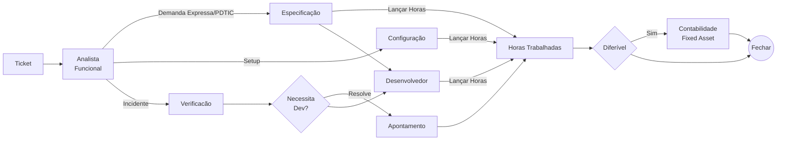
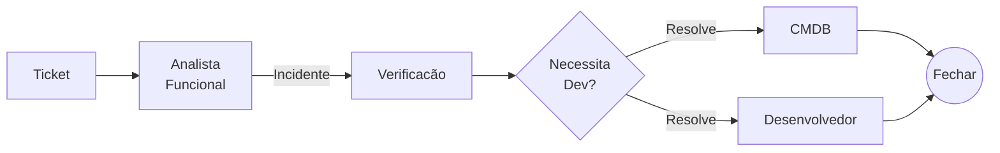
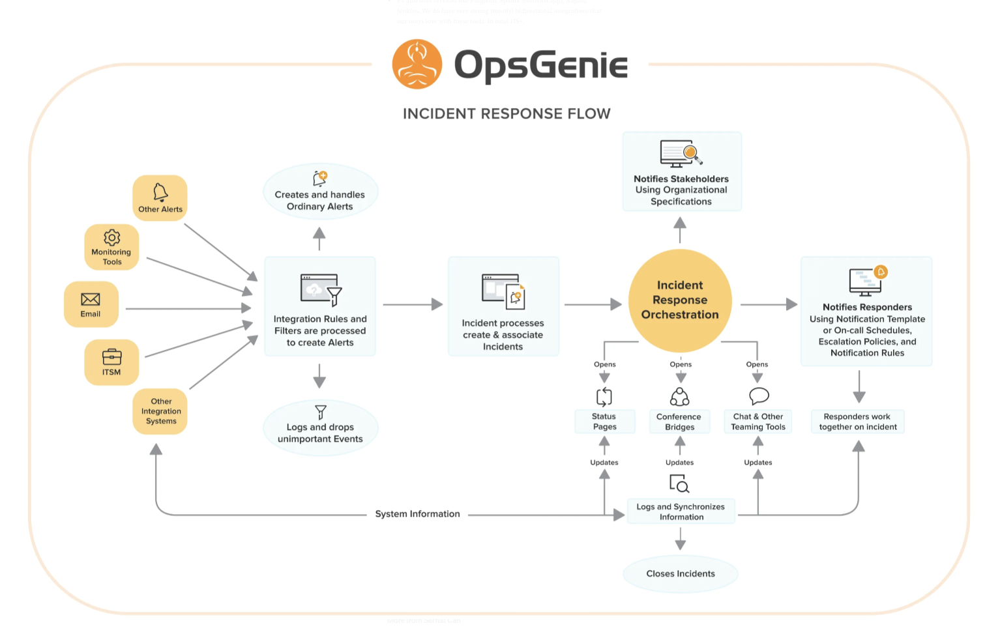
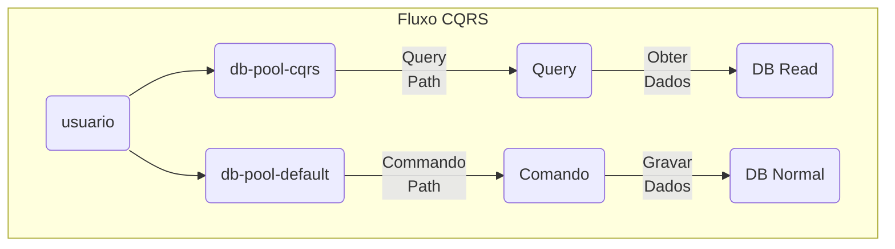

{width="800" height="500" style="display: block; margin: 0 auto"}
<p align="justify">A evolução tecnológica trouxe consigo uma constante transformação nas metodologias de desenvolvimento de software.  Desde o tradicional modelo em cascata (Waterfall), com suas etapas sequenciais e rígidas, até as abordagens mais dinâmicas e adaptativas do Agile, as organizações têm buscado formas de superar desafios e garantir entregas mais eficientes e de qualidade. </p>

<p align="justify">No entanto, apesar da adoção de novas metodologias e práticas, muitas empresas ainda enfrentam dificuldades significativas na entrega de projetos de software.  Prazos estendidos, custos elevados, falhas técnicas e desalinhamento com os objetivos do negócio são problemas recorrentes que comprometem o sucesso dos projetos.</p>

Esse cenário levanta questões cruciais: 

- [x] Por que as falhas continuam acontecendo, mesmo com a migração para métodos mais modernos? 
- [x] Quais são os fatores que persistem em dificultar a execução eficiente de projetos, independentemente da metodologia adotada?

A cultura de uma empresa é basicamente como ela **aproveita as oportunidades e lida com as dificuldades**.

- [x] Equipes tenham boa comunicação e cooperação (Sinceridade, Confiabilidade, Cuidado e Competência);
- [x] Enfrentar as falhas sem atribuir culpa, comunicar e resolver problemas com mais facilidade, além de descobrir novos caminhos e ter uma melhoria contínua;
- [x] Implementação de responsabilidades compartilhadas melhora a qualidade dos serviços;
- [x] OKR Centrais, ao invés de departamentos;
- [x] Projetos fracassados resultam em investigações (Identifique e entenda os erros sem atribuir culpa);
- [x] Recompense e incentive novas ideias que promovam a colaboração;

| Dica           | Entenda |
| -----          | ------  |
| Sinceridade    | Admitir erros cedo, ser direto com desafios e compartilhar notícias boas e ruins, sem adoçar as últimas. |
| Confiabilidade | Você faz o que diz que fará, define expectativas realistas e se comunica proativamente por meio de hábitos de atualização regulares. |
| Cuidado        | Entenda seus objetivos e desafios, ser proativo em ajudá-los a ter sucesso e mostrar empatia quando as coisas ficam difíceis. |
| Competência    | Isso vai além de habilidades técnicas: é sobre entregar valor de negócio, aprender e crescer com feedback e entender o panorama geral. |

??? note "Registro de Auditoria"

     | Registro                                                                                      |      Numero         |
     | ----------                                                                                    |      -----          |
     | Adotar ações para Aprimorar Demandas Expressas                                                | RA-2112/     02-A   |
     | Estoque de Solicitações Demandas expressas                                                    | RA-2112/     02-B-1 |
     | Adotar ações, relativas ao gerenciamento de incidentes afeto a fila de sistemas corporativos  | RA-2112/     02-C1  |
     | Projetos do PDTIC                                                                             |      Projeto        |

    ## Histórico CEERPx CESUC
     - [x] Perda do QUADRO de FUNCIONÁRIOS com o devido conhecimento - **DÉBITO TÉCNICO** e incremento de **BUGS**;
           - [x] NÃO FIZ e NÃO CONHEÇO;
    ## Onde esta(áva)mos desperdiçando tempo, falhando nos Prazos ou Bloqueados?

     - [x] William Thomson: "Aquilo que não se pode medir, não se pode melhorar."
     - [x] Será que? 
         - [x] Ausência de Engajamento?
         - [x] WIP desbalanceado?
         - [x] DÉBITO TÉCNICO?
         - [x] DIMINUIÇÃO DA FORÇA DE TRABALHO?
     - [x] O conceito de Projeto esta alinhado?
         - [x] O gerenciamento de recurso compartilhado - O QUE RECEBÍAMOS PARA DAR UM PRAZO?
     - [x] Histórico: 
         - [x] Incidente (Supravizio, OTRS, Outlook, GERENCIA, e TEAMS);
         - [x] Demanda   (Supravizio, OTRS, Outlook, GERENCIA, TEAMS, PDTIC (PEOPLE ANALYTICS, OPERADOR LOGISTICO, PROVISÃO E REVERSÃO) E ÁREAS INTERNAS (COBAN, BOTs, OLAP/DATA LAKES). 
     - [x] Ausência de Planejamento
         - [x] Ferramentas - Supravizio, OTRS, Gitlab, Azure-Devops, TEAMS, Outlook e ÁREAS INTERNAS (COBAN, BOTs, OLAP/DATA  LAKES).
         - [x] Recursos em outros projetos e NÃO estão sendo vistos?
     # Como melhorar?
     - [x] MÉTRICAS DE FLUXO - KANBAN
       - [x] Quais metas e métricas a utilizar? Fluxo, Codificação,  Qualidade e/ou Produção ?
       - [x] Peças unificadas do NOC/SOC/Central de Incidentes a Equipe de Sustentação.

    
     
    - [x] Scrum
         - [x] Iterativo e Incremental(Definição de Papéis, Cerimônias e Artefato)
         - [x] Resumimos o Scrum, fizemos um framework CESUC, Treinamento e foco.
         - [x] Sprints com 2(duas) semanas;
         - [x] Nenhuma alteração seria realizada, para colocar risco na meta da Sprint;
     
    
     
    | Dica 1                                      | Motivo                                            |
    | ------                                      | --------                                          |
    | Integração inadequada de novos membros      | Sem o devido treinamento ou clareza sobre processos, ferramentas ou expectativas                   |
    | Falta de documentação ou processos claros   | Não tem uma boa documentação ou processos definidos para a integração de novos colaboradores. | 
    | Falta de acompanhamento e feedback contínuo | Feedback adequado ou acompanhamento no início da jornada. |
    | Nenhum experiência para manter o legado     | Inexistencia de conhecimento.                    |

??? note "Ciclo de Vida"
    Tudo o que faz parte do ciclo de vida do aplicativo deve ser verificado no controle de versão.Isso inclui, mas não está limitado a:
    
    - [x] Código-fonte;
    - [x] Scripts de construção;
    - [x] Definição de pipeline;
    - [x] Valores de configuração;
    - [x] Testes e dados de teste;
    - [x] Esquemas de banco de dados;
    - [x] Scripts de atualização de banco de dados;
    - [x] Scripts de definição de infraestrutura;
    - [x] Scripts de limpeza/instalação/expurgo;
    - [x] Documentação associada;

    | Sq  |  Melhores práticas | Categoria | Importância |
    | ----: | :----            | :-----:   | :----:      |
    |  1  | Todos os ativos do projeto estão no controle de versão | Artefatos | Crítico |
    |  2  | Um único artefato é produzido para todos os ambientes | Artefatos | Alta |
    |  3  | Os artefatos se movem dentro dos pipelines (e não nas revisões de origem)| Artefatos | Alta |
    |  4  | O desenvolvimento do aplicativo acontece com ramificações de curta duração (uma por recurso) | Artefatos | Altura |
    |  5  | As compilações podem ser executadas em uma única etapa | Compilar | Alta |
    |  6  | As compilações são rápidas (menos de 5 minutos) | Compilar | Médio |
    |  7  | Armazene suas dependências | Compilar |Alta |
    |  8  | Os testes são automatizados | Testes | Alta |
    |  9  | Os testes são rápidos | Testes | Alta |
    | 10   | Os testes limpam automaticamente seus efeitos colaterais | Testes | Alta |
    | 11   | Existem vários conjuntos de testes | Testes | Médio |
    | 12   | Ambientes de teste sob demanda | Testes | Médio |
    | 13  | Executando suítes de teste simultaneamente | Teste | Médio |
    | 14   | A varredura de segurança faz parte do processo | Qualidade e auditoria | Alto |
    | 15   | A varredura de qualidade/revisões de código fazem parte do processo | Qualidade e auditoria | Médio |
    | 16   | As atualizações do banco de dados têm seu ciclo de vida | Banco de dados | Alto |
    | 17   | As atualizações do banco de dados são automatizadas | Banco de dados | Alto |
    | 18   | As atualizações do banco de dados são compatíveis com versões anteriores e posteriores | Banco de dados | Alto |
    | 19   | As implantações acontecem por meio de um único caminho (servidor CI/CD) | Implantações | Crítico |
    | 20   | As implantações acontecem gradualmente em estágios  | Implantações | Alto   |
    | 21   | Métricas e logs podem detectar uma implantação ruim | Implantações | Alto   |
    | 22   | Reversões automáticas estão em vigor                | Implantações | Médio  |
    | 23   | A preparação corresponde à produção                 | Implantações  | Médio |

 
??? note "Tudo é Motivação ME vs WE"
    Conforme a literatura, os pronomes pessoais podem ser classificados como retos ou oblíquos, de acordo com a função que desempenham na oração:
    Os **retos**, __assumem a função de sujeito ou predicativo do sujeito__, ah já, os **oblíquos**, assumem a função de complementos, como o objeto direto, o objeto indireto, o agente da passiva, o complemento nominal. Mas acabamos com o possessivo, desde que nos interesse.
    * "Eu" corresponde a "me", "mim", "comigo" - “meu”, “minha”, “meus”, “minhas”.
    * "Nós" corresponde a "nos", "conosco" - “nosso”, “nossa”, “nossos”, “nossas”.

    Peça as pessoas para classificarem sua concordância em uma escala de 1 a 5 (1 sendo de forma alguma, 5 sendo concordância     completa) com as declarações abaixo:
    
    - [x] Na minha equipe, a informação é buscada ativamente.
    - [x] Na minha equipe, os fracassos são oportunidades de aprendizado, e os mensageiros deles não são punidos.
    - [x] Na minha equipe, as responsabilidades são compartilhadas.
    - [x] Na minha equipe, a colaboração multifuncional é incentivada e recompensada.
    - [x] Na minha equipe, o fracasso gera questionamento.
    - [x] Na minha equipe, novas ideias são bem-vindas.
    
    Tudo começou com um Tesão. 
    
    Você só CONQUISTA, aquilo que LUTA, mas você só luta se desejar. Então como convencer depois de 2020?
    
    Se você não LUTA, você NÃO CONQUISTA. 
    
    Não é pecado você ter uma vida mais Próspera OU não conseguir.
    
    Quando você NÃO consegue algo: Você muda a DIREÇÃO ou o CAMINHO ou a JORNADA.
    
    Valor esta ligado a **IMPORTÂNCIA + RARIDADE**.
    
    - Técnico de Campo é importante? Sim, mas temos RARIDADE?
    - Cristiano Ronaldo., é importante? Sim. Quantos Cristianos Ronaldos nós conhecemos?
  
    <p align="justify">WILLIAM GLASSER - Aplicou sua teoria da escolha para a educação, na qual o professor é um     guia para o aluno e não um chefe. Ele, explica que não se deve trabalhar apenas com memorização, porque a     maioria dos alunos simplesmente esquecem os conceitos após a aula, em vez disso, nós aprendemos efetivamente     fazendo.</p>
    
    Segundo a teoria nós aprendemos:

    - [x] 10% quando lemos;
    - [x] 20% quando ouvimos;
    - [x] 30% quando observamos;
    - [x] 50% quando vemos e ouvimos;
    - [x] 70% quando discutimos com outros;
    - [x] 80% quando fazemos;
    - [x] **95%** quando ensinamos aos outros.
    
    <div class="center-table" markdown>
    ```mermaid
    %%| fig-cap: Mermaid diagram
    %%| fig-align: center
    flowchart TD
        A(Ideal) --> A00(Propósito) & A01(Direção)
        A00 & A01 --> A02(Como vamos trabalhar</br>Qual a direção</br>Valores, Virtudes</br>Seja um FATOR de SOMA)
        A02 --> A03(Espírito de Missão</br>EU SEI o que quero construir</br>ESCOLHAS ACERTADAS</br>Direcionamento)
        A03 --> A04(Vida Interior</br>O MEU IDEAL</br>QUE FIZ NO DIA DE HOJE)
        A04 --> A05(CULTIVAR A DISCIPLINA</br>A falta do método caos</br>DESORDEM)
        A05 --> A06(Exercitar a CONCENTRAÇÃO</BR>CORPO E MENTE JUNTOS</BR>TREINE A CONCENTRAÇÃO</br>Tecnica TRATAK)
    ```
    </div>

    Trataka é uma técnica de yoga que consiste na fixação ocular para purificar os olhos e a visão. 

??? note "Secure Software Development LifeCycle"
    Como o nosso processo estava muito falho e desconexo com a realidade: 

    | Objeto       | Novas Tecnologias | Sustentação  | Observação                                  |
    | ----         | ----              | ----         | ------                                      |
    | RPA          | TaGui             | ---          | Mais de 150 profissionais treinados.        |
    | Fluxo        | Camunda e Cawemo  | Supravizio   | Excessp de demanda. Treinamento sem efeito. |
    | Sistemas     | IBL               | --           | Contratados deslocados para outros serviços.|
    |              | Prov e Rev        | PL/SQL       | Necessitava de Aprimoramento.               |
    |              | PowerBI   GESCON  | GESCON       | Par com a área.                             |


    - [x] Planejamento e Definição de Requisitos: Histórias de usuário,revisar e definir os requisitos de segurança
    - [x] Desenvolvimento Contínuo com Feature Branches: Cada nova funcionalidade é desenvolvida/bug em uma branch separada.Ferramentas como SonarQube, Checkmarx ou Bandit podem ser configuradas para rodar a cada commit e identificar vulnerabilidades no código.
    - [x] Pull Requests (PRs) e Revisão de Código: Análise de segurança, Revisão de práticas de codificação segura, Ferramentas como CodeQL e Snyk.
    - [x] Testes de Segurança: Testes estáticos (SAST),Testes dinâmicos (DAST), Testes de dependências (SCA): Ferramentas como Snyk ou Dependabot e Testes de desempenho e resiliência; OWASP ZAP, Burp Suite.
    - [x] Monitoramento contínuo: Utilize ferramentas como SIEM (Security Information and Event Management) para monitorar atividades suspeitas em produção, bem como monitorar logs de segurança. SIEM, SigNoz, Datadog, ELK Stack.
    - [x] Introdução Jujutsu—a version control system (dois backends para armazenar commits. Um deles usa um repositório Git regular)
  
    

A arquitetura de software é um aspecto crítico do desenvolvimento de software. Envolve a estruturação de sistemas de software de alto nível para atender aos requisitos técnicos e de negócios. 

??? note "Tipos de Arquitetos"

    | Tipo | Entenda |
    | ---- | -----   |
    | Arquiteto Corporativo | O Enterprise Architect garante que a infraestrutura tecnológica da organização esteja     alinhada com sua estratégia de negócios. Esta função integra a estratégia de TI com os objetivos de negócios e     rege a conformidade com as políticas e regulamentos da empresa. |
    | Arquiteto de Soluções | Como um elo entre os desafios do negócio e as soluções tecnológicas. |
    | Arquiteto de Aplicativos | Concentra-se no design e na estrutura de aplicativos individuais, garantindo que     atendam aos requisitos técnicos e de negócios. |
    | Arquiteto Técnico |  Lida com os aspectos de infraestrutura técnica e hardware, garantindo que a     infraestrutura tecnológica suporte os requisitos específicos do domínio. |
    | Arquiteto de Dados |  Responsável por gerenciar, traçar estratégias e estruturar a arquitetura de dados da     organização, garantindo a precisão e integridade dos dados.Eles desenvolvem e gerenciam a estratégia,     políticas, padrões e práticas de dados, projetam modelos e estruturas de dados para apoiar as operações de     negócios e garantem a precisão e integridade dos dados em todos os sistemas. |
    | Arquiteto de Segurança | Concentra-se em projetar estruturas de segurança robustas, garantindo que a     arquitetura do domínio esteja protegida contra possíveis ameaças e vulnerabilidades. |
    | Cloud Architect |  Eles são essenciais para facilitar a transição de uma organização para a computação em     nuvem, otimizando soluções em nuvem para desempenho, custo e escalabilidade. Esta função envolve projetar     estratégias de arquitetura em nuvem, desenvolver soluções em nuvem, supervisionar a migração de sistemas para     plataformas em nuvem e gerenciar relacionamentos com provedores de serviços em nuvem. |

## Por fim: Sejamos a pior **EQUIPE DE DESENVOLVIMENTO**
{width="900" height="500" style="display: block; margin: 0 auto"}

### Oportunidade única de aprendizado
- [x] Adotar a **humildade** como ferramenta de crescimento;
- [x] Aprendizado **participativo** e não por comando;
- [x] Conhecimento **estratégico** para um mercado competitivo e processos **internos e sem prestígio**;
- [x] Inventário de **riscos**, pode ser uma estratégia bem pensada(LGPD, ESG, InnerSource, Inclusão Social, Ética de dados);
- [x] **Melhorar não por competição, mas por inspiração**;
- [x] Mudar as Metas e Métricas (DORA,DEVEX e SPACE)
      - [x] Incidentes;
      - [x] Projetos;
- [x] **"Ser o pior"** não é sinônimo de ser **ineficiência ou incompetência**, mas sim de reconhecer que sempre há algo novo para aprender;
- [x] O motivo de qualquer um de nós: _*Ter a coragem de mudar e começar de novo*_, para mim, é  quando eu me sinto  que estou  desatualizado em relação às demandas mais modernas do mercado;
- [x] A diferença entre : _*Entregar qualquer coisa` vs `Entregar a coisa certa_*;
- [x] Mude a **ROTA**, mas nunca desista de **MUDAR**;
- [x] Única ferramenta para o Desenvolvedor;
      - [x] Teams como ferramenta de Comunicação;
      - [x] Webhook, Gráficos e Abertura de Tickets;
      - [x] PowerBI para acompanhamento;
      - [x] Uniformizar os Projetos;
      - [x] Estratégia de Branches;
      - [x] Estratégia de Documentação;
      - [x] Planejar por Equipes e não por indivíduos;
      - [x] Capacitação e Amarração de Pessoas a Produtos;
      - [x] Treinador;
- [x] Forçar mudanças organizacionais;
      - [x] Integração com o Teams;
      - [x] Tudo em um Board no PowerBI;
      - [x] Planilha de Competências, Habilidades e Atitudes;
      - [x] Planilha com o Mapa de Férias e Ausências;
      - [ ] Integração Microsoft Project Management para Diferimento;
- [x] Problemas;
      - [x] Handoffs são uma área chave de risco e dispersão de conhecimento (Concept to Cash).
      - [x] Multifuncional e capaz de entregar de ponta a ponta;
      - [x] Dedicado (sem recursos fracionários); 
      - [x] Essa superalocação de pessoas vai causar multitarefa e troca de contexto..
  - [x] Molde O Ambiente
      - [x] Processos manuais onerosos e sujeitos a erros;
      - [x] Superalocação de pessoas para projetos, hora-extra diminuir;
  - [x] Treine Pessoas E Equipes
      - [x] Treinar equipes para resolver seus próprios problemas;
      - [x] Evitar Abordagens De Comando E Controle;
  - [x] Unificação da Ferramenta
      - [x] Supravizio, OTRS, SysAid, Gitlab e Azure-Devops;
  - [x] Quem faz parte do time? 
  - [x] Quem faz o que, ou seja, matriz de responsabilidade. Conseguimos identificar das competências necessárias?
  - [x] Como está o nosso conhecimento?
  - [x] FTE(Full Time Equivalent) vs MMM(Mythical Man-Month)
  - [x] Man-month ou pessoa-mês é a definição da  quantidade de trabalho que uma pessoa faz  em um mês. É a falácia de achar que  pessoas e tempo são recursos iguais;
  - [x] FTE (Full Time Equivalent):  indicador que compara a quantidade de horas trabalhadas por um funcionário com a jornada de trabalho de um profissional em tempo integral.
  - [x] Alguns erros comuns ao calcular o FTE são:  Não considerar a capacidade individual dos funcionários, Não verificar o FTE com frequência e  Não contabilizar funcionários de meio período.
  - [x] O MAIOR problema em PROJETOS é a coordenação destas pessoas e como ajustar? 
  - [x] Linhas de Comunicação - (Pior caso = (n * (n-1)/2));
### Ainda Sem Solução
- [x] Dono (Product Owner/Manager) ou que possa ser engajado e capacitado para gerenciar esse backlog;
- [x] Ter um  backlog claro e priorizado;
- [x] Técnico só ASSUMIR, quando PEGAR (Puxar ao invés de EMPURRAR) e ter o hábito de finalizar ao final do dia.

??? note "Leis que chamam a **atenção**"

    | Lei                         | Enumerado       |
    | -----                       | --------        |
    | Lei de Linus, ou Linus' Law | É uma lei epigramática que afirma que erros em sistemas são mais fáceis de detectar e corrigir quando há um grande número de colaboradores. A Lei de Linus está relacionada com o funcionamento da internet e da base do código aberto (open source). A ideia é que, quanto mais colaboradores houver, mais fácil será corrigir problemas em um sistema. |
    | Lei de Brooks               | É um princípio fundamental da gestão de projetos que estabelece que adicionar mais pessoas a um projeto já atrasado pode torná-lo ainda mais atrasado. É uma observação sobre o gerenciamento de projetos de software que afirma que adicionar pessoas a um projeto atrasado o torna ainda mais atrasado. |
    |                             | - Leva tempo para novas pessoas se tornarem produtivas (ramp up).
    |                             | - Gargá-los de comunicação aumenta quando o número de pessoas aumenta. |
    |                             | - A divisibilidade de tarefas pode causar mais caos. |
    |                             | - Alguns trabalhos à serem feitos não podem ser divisiveis e paralelizados. |
    |                             | - Brooks afirma que o número máximo de pessoas em um projeto deve ser determinado de acordo com o número de tarefas que podem ser divididas de forma independente.  |
    |                             | - Algumas exceções à Lei de Brooks incluem: |
    |                             | - Substituir pessoas em vez de adicioná-las; |
    |                             | - Delegar trabalho já delimitado para as novas pessoas; |

## Supravizio

Todo atendimento era realizado através da ferramenta da Venki, tanto para **Incidentes**, **Demandas expressas** e **Projetos**.

<p align="justify">A documentação muita das vezes, ficava associada ao ticket/chamado e/ou com o analista funcional, requisitos ou desenvolvedor. As horas estavam sendo apontadas no Supravizio e posteriormente dependendo da classificação subiriam para a Contabilidade, para realizar o diferimento do custo de software.</p>

<p align="justify">O diferimento de custos de software existe pelo pressuposto de que, ao desenvolvermos um sistema, estamos investindo em algo que trará resultados para a organização em exercícios sociais futuros.</p>

## Open-Source Ticket Request System (OTRS)
<p align="justify">O sistema de gestão de serviços de que pode ser usado para gerenciar automação de fluxos de trabalho, notificações e chamados.</p>



## GitLab
<p align="justify">É um gerenciador de repositório de software baseado em git, com suporte a Wiki, gerenciamento de tarefas e CI/CD. Similar ao GitHub, mas o GitLab permite que os desenvolvedores armazenem o código em seus próprios servidores, ao invés da nuvem.</p>

# Análise
- [x] Nenhuma norma da série de desenvolvimento estava sendo seguida;
- [x] Nenhuma norma de Dados, estavam sendo seguidas;
- [x] Não havia uniformização das áreas;
- [x] Documentos, Códigos espalhados..
 
{width="900" height="500" style="display: block; margin: 0 auto"}

??? note "Análise da época"

    === "Togaf/It4It"

        |  *Aspecto*                 | *TOGAF* (The Open Group Architecture Framework)                          | *IT4IT* (IT for IT Framework)                               |
        |-----------------------------|---------------------------------------------------------------------------|--------------------------------------------------------------|
        | *Foco Principal*          | Estruturação e governança da arquitetura corporativa (Enterprise Architecture). | Gestão do ciclo de vida de serviços de TI, com foco na cadeia de valor de TI. |
        | *Objetivo*                | Fornecer uma abordagem sistemática para projetar, planejar, implementar e governar a arquitetura corporativa. | Melhorar a eficiência e a entrega de serviços de TI com um modelo de referência padronizado. |
        | *Base Conceitual*         | Framework de desenvolvimento arquitetural baseado em fases (ADM).         | Modelo de referência baseado em quatro cadeias de valor: Strategy to Portfolio, Requirement to Deploy, Request to Fulfill, Detect to Correct. |
        | *Área de Aplicação*       | Organização como um todo, integrando TI e negócios.                      | Focado exclusivamente na organização e automação dos processos de TI. |
        | *Abordagem*               | Top-down, com foco em alinhamento estratégico entre TI e negócios.         | Orientada à cadeia de valor, com uma visão prática e baseada em automação. |
        | *Benefícios*              | - Alinhamento entre objetivos de negócios e TI.<br>- Governança abrangente.<br>- Flexibilidade na adaptação a diferentes indústrias. | - Padronização na entrega de serviços de TI.<br>- Eficiência operacional.<br>- Melhor rastreabilidade e visibilidade do ciclo de vida de TI. |
        | *Principais Componentes*  | - Arquitetura corporativa.<br>- ADM (Architecture Development Method).<br>- Building Blocks.<br>- Enterprise Continuum. | - Cadeias de valor.<br>- Service Backbone.<br>- Ferramentas integradas para gestão de TI.<br>- Automação. |
        | *Público-Alvo*            | Arquitetos corporativos, estrategistas de TI, CIOs e líderes empresariais. | Profissionais de TI, gerentes de operações, equipes de desenvolvimento e líderes de TI. |
        | *Complexidade*            | Alta, devido à ampla abrangência e nível de personalização.                | Moderada, com foco em padronização e automação prática.       |
        | *Adesão a Ferramentas*    | Independente de ferramentas específicas, permitindo maior flexibilidade.  | Promove o uso de ferramentas integradas para automação e rastreamento. |
        | *Alinhamento com Padrões* | Baseado em padrões amplamente aceitos para arquitetura corporativa.        | Baseado na IT Value Chain e no IT Operating Model.            |
        | *Cenários Ideais de Uso*  | - Transformação digital.<br>- Integração de negócios e TI.<br>- Estruturação de arquiteturas complexas. | - Operações de TI orientadas à eficiência.<br>- Melhorias contínuas no ciclo de vida de serviços de TI.<br>- Integração de ferramentas DevOps e ITSM. |

    === "SSG"
        Os geradores de sites estáticos (SSGs) são mecanismos de software que usam arquivos de entrada de texto para gerar páginas da Web estáticas.

        | Característica                    | MkDocs                                 |          Hugo                                 |
        |------------------------------------|----------------------------------------|         --------------------------------------|
        | **Objetivo Principal**             | Focado em documentação                | Focado em sites estáticos em          geral   |
        | **Facilidade de Uso**              | Muito simples e direto, especialmente para quem usa Markdown | Mais          complexo, com maior curva de aprendizado |
        | **Sintaxe de Conteúdo**            | Markdown                              | Markdown (padrão), mas permite          outros formatos |
        | **Temas e Design**                 | Temas prontos, como o "Material for MkDocs" | Grande variedade de temas,          mas com mais customização necessária |
        | **Funcionalidade de Pesquisa**     | Pesquisa integrada sem configurações extras | Requer configuração          externa (como Lunr.js ou Algolia) |
        | **Velocidade de Geração**          | Rápido, mas não tão rápido quanto o Hugo | Extremamente rápido, ideal          para sites grandes |
        | **Deploy para GitHub Pages**       | Suporte nativo fácil de configurar    | Também suporta, mas pode          requerer mais configuração |
        | **Extensibilidade (Plugins)**      | Plugins limitados, focados em documentação | Plugins altamente          extensíveis, permite muita personalização |
        | **Ideal para**                     | Sites de documentação, blogs simples  | Blogs, portfólios, sites grandes          e dinâmicos |

    === "Branch"
        Os repositórios do GitHub devem estar limitados aos arquivos necessários para criar projetos (Evite fazer commit de arquivos binários grandes, como artefatos de compilação).
        E se mesmo assim deseja faze-lo, considere usar a extensão Git LFS (Armazenamento de Arquivos Grandes) do Git.
        Escolher a melhor forma de fazer o **branching** do projeto pode mudar o modo que entregamos o produto final e todo o caminho até a finalização.
     
        | *Estratégia*         | *Descrição*                                                                                             | *Uso Principal*                                                                                  | *Principais Branches*           | *Vantagens*                                                                                     | *Desvantagens*                                                                                 |
        |-------------------------|---------------------------------------------------------------------------------------------------------|----------------------------------------------------------------------------------------------------|-----------------------------------|---------------------------------------------------------------------------------------------------|--------------------------------------------------------------------------------------------------|
        | *Git Flow*           | Uma estratégia robusta para gerenciar desenvolvimento e versões.                                         | Projetos com ciclos de release definidos.                                                         | ⁠ main ⁠, ⁠ develop ⁠, ⁠ feature/* ⁠, ⁠ release/* ⁠, ⁠ hotfix/* ⁠ | Organização clara para releases e hotfixes.                                                    | Complexidade em projetos pequenos ou equipes ágeis.                                              |
        | *GitHub Flow*        | Simples e leve, focada no uso de branches de features e PRs.                                             | Projetos com deploy contínuo.                                                                      | ⁠ main ⁠, ⁠ feature/* ⁠               | Simplicidade e agilidade.                                                                        | Não adequado para ciclos de release complexos.                                                  |
        | *GitLab Flow*        | Integrações baseadas em ambientes, como produção, staging e desenvolvimento.                             | Projetos com integração contínua e diferentes ambientes de deploy.                                | ⁠ main ⁠, ⁠ feature/* ⁠, ⁠ production ⁠, ⁠ staging ⁠ | Integração direta com pipelines CI/CD.                                                          | Exige boa organização de ambientes e automação.                                                 |
        | *Trunk-Based*        | Foco em um único branch principal com commits frequentes e curtos.                                       | Projetos ágeis com integração contínua.                                                           | ⁠ main ⁠, ⁠ feature toggles ⁠        | Simplicidade, integração rápida e menos conflitos.                                               | Requer alto nível de testes automatizados e uso de feature toggles.                             |
        | *Feature Branching*  | Cada funcionalidade desenvolvida em um branch isolado.                                                  | Projetos com equipes colaborativas trabalhando em várias features ao mesmo tempo.                 | ⁠ main ⁠, ⁠ feature/* ⁠               | Isolamento de mudanças e controle de código granular.                                            | Possível acúmulo de branches e necessidade de revisão constante para evitar conflitos.           |
        | *Release Branching*  | Focado em branches separados para cada versão liberada.                                                 | Projetos com múltiplas versões coexistindo, como softwares legados.                               | ⁠ main ⁠, ⁠ release/* ⁠, ⁠ hotfix/* ⁠   | Facilita manutenção de versões antigas.                                                         | Dificulta o deploy contínuo e aumenta a complexidade de merges.                                 |

    === "GitHub/Lab/aDevOps"
        A tabela a seguir compara as principais funcionalidades e gerenciadores das plataformas **GitHub**, **GitLab**     e **Azure DevOps**, para ajudar a entender as principais diferenças e semelhanças entre elas.
    
        | **Funcionalidade**                | **GitHub**                                  |     **GitLab**                                  | **Azure DevOps**                             |
        |------------------------------------|---------------------------------------------|    ---------------------------------------------|----------------------------------------------|
        | **Hospedagem de Repositórios**     | GitHub.com (Cloud) e Auto-hospedagem        | GitLab.com (Cloud) e     Auto-hospedagem        | Azure DevOps Services (Cloud) e Auto-hospedagem |
        | **Controle de Versão**             | Git (com suporte a branches, commits, etc.) | Git (com suporte a     branches, commits, etc.) | Git (com suporte a branches, commits, etc.)   |
        | **Gestão de Issues/Tarefas**       | **Issues** para rastrear bugs e tarefas     | **Issues** com     funcionalidades avançadas    | **Work Items** (Tarefas, Bugs, Epics, etc.)   |
        | **Gestão de Backlog**              | Projetos (Boards simples) e Milestones      | **Boards** (Kanban) e     **Milestones**        | **Backlog** com Epics, Features, Stories, e Work Items |
        | **Gestão de Sprint**               | Não possui suporte nativo para sprints      | **Milestones** e     **Boards** com Burndown Chart | **Sprints** e gráficos ágeis como **Burndown** |
        | **CI/CD (Integração Contínua/Entrega Contínua)** | **GitHub Actions** para automação de CI/CD | **GitLab CI/    CD** com pipelines customizáveis | **Azure Pipelines** (flexível e multi-plataforma) |
        | **Revisão de Código**              | **Pull Requests** para revisão de código    | **Merge Requests** para     revisão de código   | **Pull Requests** (Revisão de código)        |
        | **Gerenciamento de Projetos**      | **Projects** (Kanban boards simples)        | **Boards** (Kanban) com     integração a Issues | **Boards** com **Kanban**, **Scrum** e Backlog |
        | **Integração com Outras Ferramentas** | Marketplace de Apps e integrações via APIs | Integração com     ferramentas externas e APIs  | Integração profunda com o **Azure** e outras ferramentas Microsoft |
        | **Segurança**                      | Funções básicas de segurança no repositório | Análise de código e     vulnerabilidades integradas | Funcionalidades avançadas de segurança e conformidade (Ex: SonarQube, cobertura     de testes) |
        | **Automação de Tarefas**           | **GitHub Actions** (Automação de workflows) | **GitLab CI/CD**     (Automação de pipelines)   | **Azure Pipelines** (Automação de builds e deploys) |
        | **Hospedagem de Sites**            | **GitHub Pages** para sites estáticos       | GitLab Pages para sites     estáticos           | Azure Web Apps para aplicações web            |
        | **Apoio a Metodologias Ágeis**     | Funcionalidades limitadas (via Projects)    | Suporte a **Scrum**,     **Kanban**, **Agile**   | Suporte a **Scrum**, **Kanban**, **Agile**    |
        | **Relatórios e Métricas**          | Métricas simples via GitHub Insights        | **Grafana** integrado e     métricas personalizáveis | **Dashboards** avançados e métricas ágeis (ex: Velocity) |
        | **Escalabilidade**                 | Ideal para projetos individuais e pequenas equipes | Adequado para     equipes de tamanho médio a grande | Ideal para grandes empresas e equipes corporativas |
    
    
        | GitLab |        | GitHub |        | Agile Concepts |             |
        | -----  | -----  | ----   |        | -----        | ------      |
        |        |        | Repository      | Issues   | Epict    | Feature  |
        |        |        | Pull Request    | Label    | User Story | Task   |
        |        |        | Template        | Project  | Backlog    | Sprint | 
        |        |        | Milestone    | Actions  | Retrospective | Pipeline |

    === "MonoPolyRepo"
        - Repo (abreviação para repositório) é um armazenamento para todas as alterações e arquivos de um projeto, permitindo aos desenvolvedores “controlar a versão” dos ativos do projeto ao longo de sua fase de desenvolvimento.
        - A abordagem multi-repo/polyrepo utiliza vários repositórios para hospedar as múltiplas bibliotecas ou serviços de um projeto desenvolvido por uma empresa.
        - A abordagem monorepo utiliza um único repositório para hospedar todo o código das múltiplas bibliotecas ou serviços que compõem os projetos de uma empresa.

        | Característica                      | **Monorepo**                            | **Polyrepo**                              |
        |--------------------------------------|-----------------------------------------|    -------------------------------------------|
        | **Definição**                        | Repositório único que contém múltiplos projetos | Múltiplos     repositórios, um para cada projeto |
        | **Gerenciamento de Dependências**    | Fácil de gerenciar dependências entre projetos | Cada repositório     gerencia suas dependências separadamente |
        | **Escalabilidade**                   | Pode ser desafiador com grande quantidade de código e equipes |     Escalável com projetos independentes e desacoplados |
        | **Facilidade de Build**              | Ferramentas podem ser configuradas para builds parciais, mas pode ser     complexo | Builds são independentes, mas pode ser mais lento sem integração |
        | **Controle de Versionamento**        | Fica mais difícil de manter versões de projetos independentes |     Controle total sobre versões independentes de cada repositório |
        | **Visibilidade de Código**           | Código de diferentes equipes e serviços em um único repositório |     Código é isolado em repositórios separados |
        | **Custo de Manutenção**              | Requer ferramentas específicas para lidar com a complexidade | Menos     complexidade para manutenção e integração |
        | **Integração Contínua (CI/CD)**      | Mais desafiador para configurar, mas pode ser centralizado | CI/CD     mais simples, mas menos centralizado |
        | **Facilidade de Colaboração**        | Mais fácil de colaborar entre equipes em diferentes projetos | Pode     ser mais difícil para equipes de diferentes projetos colaborarem |
        | **Exemplos de Uso**                  | Empresas como Google, Facebook e Twitter | Empresas com arquiteturas mais distribuídas ou equipes independentes |

    === "Monorepo"
        É um único repositório para vários projetos ou dependências (é diferente de uma aplicação monolítica).

        | Ferramenta              | Descrição                                                        | Características Principais                                             |
        |-------------------------|------------------------------------------------------------------|------------------------------------------------------------------------|
        | **Lerna**               | Ferramenta popular para gerenciar JavaScript/Node.js em Monorepos | Gerenciamento de pacotes, versões e links simbólicos entre pacotes    |
        | **Nx**                  | Ferramenta para Monorepo voltada para JavaScript, TypeScript e outras tecnologias | Focada em monorepos de larga escala, com suporte a microfrontends, CI/CD, e mais |
        | **Bazel**               | Ferramenta de build de alta performance para grandes Monorepos   | Alta escalabilidade, suporta várias linguagens, builds incrementais    |
        | **Rush.js**             | Gerenciador de Monorepo focado no JavaScript e TypeScript        | Gerenciamento de pacotes, builds eficientes, com foco em grandes equipes |
        | **Git Submodules**      | Recurso do Git para gerenciar dependências de código entre repositórios | Uso de submódulos Git para organizar projetos independentes no mesmo repositório |
        | **Pants**               | Ferramenta de build e gerenciamento de Monorepo                   | Build de código, gerenciamento de dependências e testes para várias linguagens |
        | **MonoRepo**            | Ferramenta simples para gerenciamento de múltiplos repositórios | Configuração simples de CI/CD e automação de tarefas repetitivas       |

    === "Solicitações Pull Request"
        <p align="justify">Escrever boas descrições de solicitações pull request é uma ótima maneira de ajudar os revisores a saber o que esperar ao revisar o código e documentações obrigatórias. Um modelo de solicitação pull é um arquivo contendo texto Markdown que é adicionado à descrição da solicitação pull quando a solicitação pull é criada. O Azure Repos permite criar diversos tipos de templates, porem iremos utilizar Modelos de pull request para específicas branches.Os modelos de solicitação pull específicos de ramificação podem ser configurados para solicitações pull direcionadas a uma ramificação específica, ```<repositoryroot>/.azuredevops/pull_request_template/branches/```, como exemplo foram criados:</p>

        | Arquivo                  | Branch    | Entenda                                                                                               |
        | -------                  | ------    | -------                                                                                               |
        | develop.md               | develop   | Este é normalmente o modelo padrão, mas pode ser substituido pelo modelo específico - nome da branch. |
        | additional.md            | -         | Este é um modelo adicional.                                                                           |
        | main.md                  | main      | Este é o modelo específico do branch main.                                                            |
        | wip.md                   | wip/xxxxx | Work in Progress acordado.                                                                            |
        | wit.md                   | wit/xxxxx | Item de trabalho finalizado.        |

    === "Pipeline"
        A ideia é automatizar o processo de análise de segurança, revisão de dependências, verificação do código, e testes para garantir que o código está seguro, funcional e sem regressões.

        === "Configuração Inicial do Workflow"
            O arquivo do workflow deve ser configurado na pasta .github/workflows. Aqui, você define quando o fluxo será acionado, como em push para branches específicas, pull requests, entre outros.

        === "Job de Setup Inicial"
            A primeira etapa do fluxo é configurar o ambiente de execução, como a versão do Node.js, Python, ou qualquer outra dependência necessária para o seu projeto.

        === "GitHub Security Scan (Dependabot)"
             O Dependabot é uma ferramenta que verifica e sugere atualizações para dependências de segurança. Ele já pode ser configurado diretamente no GitHub por meio do arquivo dependabot.yml, mas aqui também é possível integrá-lo em um fluxo de CI/CD para garantir que as dependências não tenham vulnerabilidades.
             Dependabot pode ser configurado automaticamente pelo GitHub para executar varreduras de segurança, mas também podemos integrá-lo ao workflow para alertar em caso de dependências inseguras.

        === "Code Scan"
            O Code Scanning do GitHub realiza uma análise estática do código para identificar possíveis vulnerabilidades. Podemos configurar essa análise diretamente em uma ação.

        === "DAST (Dynamic Application Security Testing)"
            O DAST é um teste de segurança dinâmico que verifica o comportamento da aplicação em tempo de execução, em busca de vulnerabilidades como injeção de SQL, XSS, entre outras. Essa abordagem é tipicamente feita com ferramentas como OWASP ZAP, Burp Suite, ou outras soluções de segurança.
            Aqui, podemos integrar o OWASP ZAP diretamente no GitHub Actions para realizar o DAST.
            Essa ação executa o OWASP ZAP para testar vulnerabilidades de segurança em sua aplicação enquanto ela está rodando.

        === "Testes Unitários"
            Os testes unitários são fundamentais para garantir que cada unidade do código se comporte corretamente. Aqui, vamos rodar os testes utilizando o framework apropriado (Jest, PyTest, etc.).

        === "Testes de Regressão"
            Os testes de regressão verificam se o código novo não quebrou funcionalidades existentes. Dependendo da sua stack, você pode ter testes automatizados (ex: Selenium para testes de UI) ou rodar o mesmo conjunto de testes unitários.

        === "Notificações e Relatórios"
            Para que o time seja notificado de falhas ou vulnerabilidades, você pode integrar notificações através de Slack, e-mail ou criar relatórios com o GitHub Pages ou SonarCloud.
            ```
              name: DevSecOps
              author: Horacio Vasconcellos
              description: Segurança e Qualidade de Código
              on:
                push:
                  branches:
                    - main
                    - sprint
                pull_request:
                  branches:
                    - main
                    - sprint
                schedule:
                  - cron: '0 0 * * 0'
              
              jobs:
                setup:
                  runs-on: ubuntu-latest
                  steps:
                    - name: Checkout repository
                      uses: actions/checkout@v4
                    - name: Set up Node.js
                      uses: actions/setup-node@v2
                      with:
                        node-version: '16'
                    - name: Install dependencies
                      run: npm install
              
                security_scan:
                  runs-on: ubuntu-latest
                  steps:
                    - name: Checkout repository
                      uses: actions/checkout@v2
                    - name: Run GitHub Security Scans (Dependabot)
                      uses: github/super-linter@v4
                      env:
                        RUN_LOCAL: true
              
                code_scan:
                  runs-on: ubuntu-latest
                  steps:
                    - name: Checkout repository
                      uses: actions/checkout@v2
                    - name: Set up CodeQL Analysis
                      uses: github/codeql-action/init@v2
                      with:
                        languages: 'python, javascript'
                    - name: Run CodeQL Analysis
                      uses: github/codeql-action/analyze@v2
              
                dast:
                  runs-on: ubuntu-latest
                  steps:
                    - name: Checkout repository
                      uses: actions/checkout@v2
                    - name: Run OWASP ZAP DAST Scan
                      uses: zaproxy/action-full-scan@v0.7.0
                      with:
                        target: 'http://localhost:3000'
              
                unit_tests:
                  runs-on: ubuntu-latest
                  steps:
                    - name: Checkout repository
                      uses: actions/checkout@v2
                    - name: Run unit tests
                      run: npm run test
              
                regression_tests:
                  runs-on: ubuntu-latest
                  steps:
                    - name: Checkout repository
                      uses: actions/checkout@v2
                    - name: Run regression tests
                      run: npm run test -- --regression
              
                notifications:
                  runs-on: ubuntu-latest
                  steps:
                    - name: Checkout repository
                      uses: actions/checkout@v2
                    - name: Send Slack notification on failure
                      if: failure()
                      uses: slackapi/slack-github-action@v1
                      with:
                        payload: '{"text": "Falha no pipeline de CI/CD! Verifique os logs para mais detalhes."}'
                      env:
                        SLACK_TOKEN: ${{ secrets.SLACK_TOKEN }}

            ```        

## Estrutura do Banco de Dados Oracle
<p align="justify">Padronizar System Identifier, ServiceName, DBName e DB Unique Name é crucial paragarantir consistência, facilidade de gerenciamento e integração entre sistemas em ambientes corporativos.A padronização desses elementos facilita a automação de processos, como backup, recuperação emonitoramento, minimizando erros humanos e garantindo que os serviços de banco de dados sejam acessíveisde maneira uniforme. A uniformidade também contribui para uma gestão mais eficiente, especialmente em ambientes complexos e de grande escala.</p>
{width="900" height="600" style="display: block; margin: 0 auto"}

## Estrutura Diretórios Docker
<p align="justify">A padronização da estrutura de diretórios no Docker é essencial para garantir aorganização e a eficiência no gerenciamento de containers e imagens. Ao seguir convenções consistentes,como separar os arquivos de configuração, volumes e scripts em diretórios específicos, facilita-se amanutenção e a escalabilidade de projetos. 
A estrutura organizada também melhora a portabilidade e a colaboração entre equipes, tornando o ambientemais previsível e seguro.</p>
{width="900" height="600" style="display: block; margin: 0 auto"}

## Estrutura do IaM/IdM
<p align="justify">O Keycloak é uma plataforma de gerenciamento de identidades e acesso (IAM) que ofereceautenticação e autorização centralizadas. Com a utilização de três Realms, é possível separar e gerenciardiferentes domínios de usuários de forma isolada. 
O Realm Administrativo é utilizado para gerenciar a infraestrutura do Keycloak e controlar permissões deadmin. O Realm B2B serve para gerenciar acesso de usuários externos, como parceiros e clientes, comdiferentes requisitos de segurança.
Já o Realm de Aplicações Internas gerencia os acessos dos usuários internos, proporcionando controlesobre sistemas corporativos e garantindo a segurança das interações internas.</p>
{width="900" height="600" style="display: block; margin: 0 auto"}

## Padrão CQRS
<p align="justify">A estrutura CQRS (Command Query Responsibility Segregation) visa separar claramente asoperações de leitura (queries) e escrita (commands) dentro de um sistema, melhorando a escalabilidade e amanutenção. Com essa abordagem, diferentes modelos de dados podem ser usados para otimizar cada tipo deoperação, resultando em maior eficiência e desempenho. A padronização facilita o desenvolvimento e aintegração, pois define convenções para a organização de handlers, repositórios e eventos. Também promoveuma melhor segurança e controle, já que comandos e consultas podem ser isolados e auditados de formaindependente. Em sistemas complexos, essa estrutura permite evoluções mais ágeis e maior flexibilidadenas soluções implementadas.</p>
{width="900" height="600" style="display: block; margin: 0auto"}

## Padrão SAGA
É uma abordagem para gerenciar transações distribuídas em arquiteturas de Microserviços, garantindoconsistência sem a necessidade de um banco de dados centralizado. 
Existem duas abordagens principais: **Coreografia**, onde os microserviços se comunicam diretamente entresi, e **Orquestração**, onde um serviço central coordena as transações. 
É essencial para a escalabilidade e a resiliência de sistemas baseados em microserviços, mantendo aconsistência eventual sem comprometer o desempenho.
{width="900" height="600" style="display: block; margin: 0 auto"}

## Estruturação das Actions/Pipelines
<p align="justify">A estruturação adequada das actions e pipelines em repositórios GitHub ou Azure DevOpsé essencial para garantir a automação eficiente de testes, builds e deploys, aumentando a qualidade econsistência do código. Além disso, uma boa estrutura facilita a manutenção e escalabilidade dos fluxosde trabalho, garantindo que diferentes ambientes e branches sejam tratados de forma organizada. Apadronização também melhora a colaboração entre equipes, permitindo que os desenvolvedores sigam práticasconsistentes.</p>
{width="200" height="125" style="display: block; margin: 0 auto"}

## Divisão das Aplicações (OSS, COTS, MOTS, Internas)
<p align="justify">Padronizar um modelo que leve em consideração aplicações MOTS (Modificable Of TheShelf), COTS (Commercial Off-The-Shelf), OSS (Open Source Software) e Internas é fundamental paragarantir uma integração eficaz, reduzir complexidade e aumentar a interoperabilidade entre diferentessoluções tecnológicas.</p>
A padronização assegura que todas essas soluções possam coexistir de forma coesa, sem sobrecarga ouredundância.  
<p align="justify">Esse modelo também contribui para a escalabilidade, já que um framework padronizadopermite a fácil adição de novas soluções conforme a necessidade da empresa, sem comprometer aestabilidade ou a performance do ambiente tecnológico como um todo.</p>
{width="900" height="600" style="display: block; margin: 0 auto"}

## Static Site Generatos - Document as Code vs Wiki
<p align="justify">Ao utilizar um Static Site Generator (SSG) junto com o conceito de Document as Codetraz benefícios significativos para o desenvolvimento de documentação técnica. O SSG permite gerar sitesrápidos, leves e facilmente hospedados, onde a documentação é gerada de forma automática a partir dearquivos de texto simples, como Markdown.</p>
<p align="justify">O Document as Code trata a documentação como parte do processo de desenvolvimento,permitindo que ela seja versionada, testada e revisada junto ao código-fonte, promovendo maiorconsistência e colaboração entre equipes. Essa abordagem facilita a automação de atualizações eintegrações com o fluxo de CI/CD. Combinando essas práticas, a documentação torna-se mais ágil, acessívele integrada ao ciclo de vida do software.</p>
{width="900" height="600" style="display: block; margin: 0 auto"}

Com isso, seria uma abordagem que aplica os princípios do desenvolvimento de software e práticas deengenharia de software ao processo de documentação, tratando a documentação como código.

- [x] Versionamento e Controle de Mudanças;
- [x] Automação de Build e Deploy, juntamente com o ATDD(Acceptance Test-Driven Development +  UAT (UserAcceptance Testing));
- [x] Testes de Documentação;
- [x] Colaboração e Controle de Qualidade;
- [x] Escalabilidade e Manutenção (Tudo em ÚNICO ponto, mas mantendo a INDEPENDÊNCIA).

## Observabilidade com OpenTelemetry
<p align="justify">OpenTelemetry coleta métricas, logs e traces de aplicações distribuídas, enquanto oSignOz fornece ferramentas avançadas de visualização e análise. Com isso, é possível monitorar odesempenho e identificar problemas rapidamente em sistemas complexos. A integração facilita orastreamento de requisições, análise de latências e diagnóstico de erros. Juntas, as ferramentas oferecemuma solução poderosa para melhorar a eficiência operacional e a resolução de incidentes.</p>
|        |    |
|        |    |
| {width="450" height="300" style="display: block; margin: 0 auto"} | {width="450" height="300" style="display: block; margin: 0 auto"} |
| {width="450" height="300" style="display: block; margin: 0 auto"} | {width="450" height="300" style="display: block; margin: 0 auto"} |

**Pontos Importantes**:

- [x] Integração com o **Opsgenie**
{width="450" height="300" style="display: block; margin: 0 auto"}
## Arquitetura Unica (MOTS, COTS, INT, OSS, CQRS)
<p align="justify">Integrar o modelo CQRS (Command Query Responsibility Segregation) com aplicações MOTS(Modificable Of The Shelf), COTS (Commercial Off-The-Shelf), OSS (Open Source Software) e sistemasinternos em ambientes operacionais cria uma base sólida para arquiteturas escaláveis e flexíveis. Apadronização entre esses sistemas e a definição clara de interfaces e processos operacionais proporcionammaior coesão e governança no ambiente. Isso resulta em um ambiente operacional robusto, onde todos oscomponentes, internos e externos, colaboram de maneira eficiente, escalável e segura. A abordagem permiteque mudanças sejam implementadas de forma ágil, mantendo o controle e a consistência entre sistemasdiversos.</p>
{width="1500" height="1200" style="display: block; margin: 0 auto"}

## Ciclo de Vida de um Produto
<p align="justify">O Ciclo do software, começa com a ideia, onde identificam-se necessidades ou problemasque o software irá resolver, levando à definição dos requisitos iniciais. Em seguida, entra-se na fase dedesenvolvimento, que envolve o design, programação, testes e implementação do software, garantindo queele atenda aos requisitos definidos. Após a implementação, o software passa pela manutenção, onde são feitas correções, atualizações e melhorias.</p>
<p align="justify">Com o tempo, o software pode se tornar obsoleto devido anovas tecnologias ou mudanças nas necessidades de mercado, levando à sua descontinuação. Durante todo ociclo, é importante realizar revisões contínuas para garantir que o software permaneça relevante e eficazaté seu fim.</p>
<p align="justify">Tudo começa com ideias,necessidades ou hipóteses. Em um fluxo de valor não há requisitos, apenas ideiasnecessidades ou hipóteses e quais serão os resultados.</p>
<div class="mdx-columns3" markdown>
- [x] Requisitos;
- [x] Capacitação;
- [x] Motivação;
- [x] Qualidade;
- [x] Manutenibilidade;
</div>
{width="800" height="500" style="display: block; margin: 0 auto"}

- [x] Dorothy Sayers, em seu excelente livro, **A mente do criador (The Mind of the Maker)**, divide a atividade criativa em três estágios: a ideia, a implementação e a interação.

## Estruturação do Azure-Devops
Para estruturar ideias em um projeto no Azure DevOps sem uma **SQUAD**, mas com pessoas alocadas adiversos times de desenvolvimento, é essencial criar um planejamento flexível e organizado. Entendeu-seque a URL base para acessar os recursos de um Azure DevOps Organization e seus projects na plataforma.

- [x] https://devops.azure.com/: Esta é a URL base para acessar os serviços de DevOps na nuvem daMicrosoft. Todos os recursos relacionados ao Azure DevOps estão acessíveis por meio dessa URL.
- [x] {organization}: Representa o nome da organização dentro do Azure DevOps. Uma organização no AzureDevOps é uma coleção de projetos e recursos, geralmente vinculada a uma empresa ou equipe. Exemplo:https://devops.azure.com/mycompany.
- [x] {projects}: Refere-se ao nome do projeto específico dentro da organização. Cada organização podeter múltiplos projetos, que são as unidades de trabalho e colaboração no Azure DevOps, com diferentesrepositórios, pipelines, boards e outros recursos. Exemplo: https://devops.azure.com/mycompany/myproject.
- [x] [Outras informações importantes](recipe_60pportunities_conc_projetos_modelo.md)
- [x] Um produto no Azure DevOps representa uma **solução contínua** que está em desenvolvimentoconstante, com evolução, melhorias e manutenção regulares. Em vez de ter uma data de término definidacomo em um projeto, o produto é algo que existe de forma contínua, que precisa ser mantido, evoluído edocumentado.
{width="700" height="500" style="display: block; margin: 0 auto" }

### Criação de Projetos
Desenvolvido duas scripts para a uniformização dos projetos,  que seguem a estrutura:

{width="900" height="500" style="display: block; margin: 0 auto" }

```
usage: git-azcesuc -h|help|?
onde: https://dev.azure.com/{yourorganization}/{project}
      - yourorganization   = {yourorganization}
      - project            = Sistemas MOTS, INTERNOS,  OSS ou DSS.
OPCOES:
-p, --produto    Nome do MOTS, INTERNOS, OSS ou DSS            (Exemplo: -p E_BUSINESS_SUITE, GESCON,PEOPLESOFT)
-t, --projeto    Projeto do PDTIC,DEMANDA                      (Exemplo: -t PROJETO)
-d, --data       Data Incial da Iteracao dd-mm-yyyy            (Exemplo: -d 01-06-2023)
-i, --iteracao   Número de Iterações                           (Exemplo: -i 5 (MÁXIMO: 12))
-q, --query      Share Queries padrões                         (Exemplo: -q)
-r, --repos      secao1-secao2-secao3                          (Exemplo: -r po,po,po-html,plsql,req-frontback,lib)
-m, --maven      Estrutura Maven (maven-archetype-quickstart)  (Exemplo: -m)
-l, --liqui      Estrutura Liquibase                           (Exemplo: -l)
-u, --subm       Submodule Project                             (Exemplo: -u https://github.comhoraciovasconcellos/Teste.git)
-y, --codes      Arquivos Padronizados de Estilo               (Exemplo: -y)
-a, --admin      Adicionar Administradores                     (Exemplo: -a horacio@60pportunities.com.brcarlos@60pportunities.com.br)
-o, --organ      Organismo/Membro do Projeto                   (Exemplo: -a horacio@60pportunities.com.brcarlos@60pportunities.com.br)
Exemplo: git-azcesuc -s -p SISGEN -t p23001 -d 01-03-2023 -i 10 -q -l -m -r po,po-req,plsql-docs,sql  OU
      git-azcesuc -p SISGEN -t p23001 -c
```

Observação:

* Para o perfeito funcionamento da estrutura e há a necessidade dos softwares git, mkdocs e Material forMkDocs, estarem instalados.
* As data inicial deverá ser sempre segunda-feira e somará de duas(2) semanas.
```
usage: git-azanual -h|help|?
onde: https://dev.azure.com/{yourorganization}/{project}
      - yourorganization   = {yourorganization}
      - project            = Sistemas MOTS, INTERNOS,  OSS ou DSS.
-p, --produto    Nome do MOTS, INTERNOS, OSS ou DSS            (Exemplo: -p E_BUSINESS_SUITE, GESCON,PEOPLESOFT)
-a, --ano        Ano                                           (Exemplo: 2023, 2024)
```

* Identificação de Commits (Um projeto atrasa DIARIAMENTE.)
```
usage: git-azestatistica-json -h|help|?
onde: https://dev.azure.com/{yourorganization}/{project}
      - yourorganization   = {yourorganization}
      - dataSearch         = 'yyyy-mm-dd hh24:mi:ss'
Identifica os commits realizados a partir de uma determinada data e os arquivos alterados.
- Follow de Code.
```

## Uma Lista De Parar De Fazer E Começar A Fazer Para Liderança

| Fazendo agora/Por favor pare  | Não estou fazendo agora/por favor comece |
| -----                         | -----                                    |
| Mudando as prioridades dentro de um sprint  | Não mude as prioridades: proteja as equipes para quepossam se concentrar. Aprenda e apoie as regras do scrum |
| Substituindo as prioridades que o proprietário do negócio definiu para a equipe     | Colabore com onegócio |
| Forçar as equipes a cumprir prazos irrealistas e criar dívidas técnicas             | Definir data ouescopo, não ambos |
| Retirar pessoas das equipes para trabalhar em simulações de incêndio ou projetos especiais | Deixe asequipes trabalharem em seu ritmo ideal |

## Desenvolvimento
- [x] Primeiro, minimizar a reinvenção; 
- [x] Segundo , minimizar  o retrabalho; 
- [x] Terceiro, trabalhar de forma inteligente quando necessário, em vez de trabalhar duro.
- [x] Regra prática para agendar uma tarefa de desenvolvimento de software;

| Atividade      | Plano e tempo gasto |    %     | Objetivo                           |
| -----          | -----               | -----    | ----                               |
| Planejamento   | tempo / 3           | 0,33     | Produzir uma especificação detalhada e sólida, e nãoo suficiente para incluir a pesquisa ou exploração de técnicas totalmente novas.         |
| Codificação    | tempo / 6           | 0,17     |                                    |
| Teste Inicial  | tempo / 4           | 0,25     | O nosso e não repetitível          |
| Teste Sistema  | tempo / 4           | 0,25     | ATDD ou UAT                        | 

- [x] [O mundo que vivo](recipe_60pportunities_conf_arquitetura_original_dev.md)

## Sustentação

- [x] Porque defeitos não são corrigidos melhor? 
      - [x] Primeiro, porque mesmo um defeito pequeno que parece local tem ramificações pelo sistema todo.
      - [x] Qualquer tentativa de consertar com pouco esforço vai reparar o defeito local e  óbvio, mas a menos que a estrutura seja pura ou muito bem documentada, os efeitos  do reparo vão passar despercebidos.
      - [x] Segundo, porque o reparador é normalmente  alguém que não escreveu o código original e normalmente é um junior ou trainee. … Como consequência da introdução de novos bugs,  
      - [x] Programas de manutenção requerem mais testes de  sistemas. 
      - [x] Teoricamente, depois de cada correção você deve rodar a suíte inteira de casos de teste,  para garantir que o sistema não foi danificado. 

## Camada de Persistência (PL/SQL)
Estratégia CI/CD (Integração Contínua/Entrega Contínua) para a camada de persistência utilizandoLiquibase, será da seguinte forma.
{width="600" height="300" style="display: block; margin: 0 auto"}

## ORDS Padronização
### Requisições síncronas e assíncronas
Uma plataforma de microsserviço é um sistema distribuído executado em vários processos ou serviços, em vários servidores ou hosts. Por um processo de entendimento, hoje, temos apenas um servidor para que possui inúmeros pools de conexão.

Os serviços podem se comunicar por meio de diversos tipos de comunicação, cada um visando um cenário e objetivos diferentes. Inicialmente, esses tipos de comunicações podem ser classificados em dois eixos. O primeiro eixo define se o protocolo é síncrono ou assíncrono:

|  Eixo                |  Entenda                                                                                                                                                               | Qtdade   |
| ------------         |  ------------                                                                                                                                                          |  ------- |
| Síncrono   | O ponto importante aqui é que o protocolo (HTTP/HTTPS) é síncrono e o código do cliente só pode continuar sua tarefa quando receber a resposta do servidor HTTP. |    <= 2  |
| Assíncrono | O código do cliente ou remetente da mensagem geralmente não espera por uma resposta. Ele apenas envia a mensagem como se estivesse enviando uma mensagem para uma fila ou qualquer outro intermediário de mensagens. | > 2 |

### Processamento Sincrono
- [x] No processamento síncrono, uma requisição é enviada ao servidor e o cliente aguarda a resposta antes de continuar sua execução.
- [x] Durante o tempo de espera pela resposta do servidor, a execução do cliente fica bloqueada, o que significa que ele não pode prosseguir com outras tarefas.
- [x] O cliente só pode iniciar uma nova requisição após receber a resposta da requisição anterior.
- [x] Limitado a 50 Registros de Processamento;

#### Diagrama de Sequencia

[](https://mermaid.live/edit#pako:eNplks1qwkAUhV_lMtuqlS5TEESlFCmKka6yuczc6GAyY-dHsOLDlC58EF-sN8bUvyyGMDnnO_dkZiekVSQS4ekrkpE01LhwWGYG-BkUmkygdq_3NKatLCyukmYTvC201AEBLTRfIZYQ7IoMKAKU5L2tSY2gfcv6JKdzLRGkI8XxGrW_M_R658DkkkKl5gEes6Da5IFCxEJ_4_Fw_LWwRodgIfp4_HHa3jcbW7O4lDpxEPrTd1g74omWZJQFaUtG3KW9nidlQF3rRKpW2HC-wkfLlYMNc1tKDGdLcGh8To6l_7_2poAnt9HHg61o88nHoD-vaTWl4k1mwzSBUU7c38GMT1R7XTO4Q3r2165KW3lGRk2tNjzF22gOz9Dp8JJe59f6Rnd9Hi_dLov7zuEWuO2NCzIjWqIkV6JWfL92FSYTYUklZSLhV0U5xiJkIjN7lmIMNt0aKZLgIrVEXCsMzXUUSY6Fp_0fg-rwTQ)

### Processamento Assíncrono
- [x] No processamento assíncrono, uma requisição é enviada ao servidor, mas o cliente não espera imediatamente pela resposta.
- [x] Em vez disso, o cliente pode continuar sua execução normalmente, sem ficar bloqueado aguardando a resposta do servidor.
- [x] O servidor processa a requisição em segundo plano e, quando a resposta estiver pronta, ela é enviada de volta ao cliente.
- [x] O cliente pode lidar com a resposta quando ela chegar, mas pode continuar realizando outras tarefas enquanto espera.
- [x] Não há limite de Processamento;

### **Desafios**
Configurar um recurso para ser protegido por um privilégio específico requer a criação de um mapeamento de privilégios.

Um mapeamento de privilégios define um conjunto de padrões que identifica os recursos que um privilégio protege. Podemos dizer que existem dois desafios que atrapalham os esforços de segurança da API:

| Desafio             | Entenda                                                                                                   |
| -------             | ----------                                                                                                |
| Padronização de API |  Existem cinco etapas fundamentais a serem seguidas ao desenvolver sua estratégia de segurança de API.    |
| Expansão de APIs    |  Um aumento drástico no número de APIs resultou em menos visibilidade das APIs em seu patrimônio digital. |
| Telemetria          |  Refere-se aos dados emitidos por um sistema, sobre seu comportamento. Os dados podem vir na forma de rastreamentos , métricas e logs.     |

<p align="justify">Devemos orientar a organização no desenvolvimento de uma estratégia abrangente de segurança de API e demonstrar por que sua estratégia deve ser desenvolvida o mais rápido possível.</p>

| Etapas                   | Entenda                 |
| ------                   | ---------               |
| Proteção de API          | Definir as permissões e controle quanto acesso um indivíduo/aplicação tem ao acessar uma API.                             |
| Governança de API        | As equipes de TI devem abordar proativamente a segurança de API por meio da padronização.                                 |
| Segurança de dados da API| Ao controlar quais dados estão acessíveis em uma API, as equipes de TI podem empregar uma camada adicional de proteção, garantindo que a API não libere todos os dados para todos os |suários que a acessam.|
| Teste de segurança de API| Os testes contínuos para identificar vulnerabilidades de APIs.                                                           |
| Descoberta de API        | **APIs ocultas** ficam escondidas e as equipes de TI não conseguem proteger o que você não consegue encontrar.           |

### Monitorando Oracle REST Data Services
<p align="justify">ORDS pode ser configurado para fornecer dados de telemetria (métricas, logs e rastreamentos) por meio do OpenTelemetry. OpenTelemetry, também conhecido como OTEL, é uma estrutura de observabilidade de código aberto, neutra em termos de fornecedor, para instrumentação, geração, coleta e exportação de dados de telemetria para auxiliar na análise e ajuste de sistemas de software. Como padrão da indústria, ele é suportado nativamente por vários fornecedores.</p>

### **Desempenho dos Serviços ORDS-REST**
<p align="justify">Os problemas de desempenho podem estar ligados ao SQL ou PL/SQL com baixo desempenho, antes de liberar um endpoint, execute uma análise com um plano SQL.</p>

### Divisão das APIs
Em geral, os dados estão classificados em três categorias:

??? note "Divisão das APIs"

    | Tipo                | Descrição                                                                                                                                                                          |
    | -----               | -----                                                                                                                                                                              |
    | Dados Transacionais | São dados gerados por vários aplicativos durante a execução ou suporte de processos de negócios diários.                                                                           |
    | Dados Analíticos    | São dados que surgem por meio de cálculos ou análises executados nos dados transacionais.                                                                                          |
    | Dados Mestres       | São os objetos de negócios reais e críticos sobre os quais essas transações são realizadas, levando em consideração também os parâmetros nos quais a análise de dados é conduzida. |

### **REPR - Request-Endpoint-Response**
<p align="justify">É um padrão muito mais simples para desenvolver endpoints de API. Os únicos modelos com os quais você se importa são a Solicitação e a Resposta.</p>

| Componente API REST	      | Definição	                                                                                                 | Melhores Práticas |
| -----------               | -----------                                                                                                | -----------       |
| HTTPS	                    | Um protocolo de segurança para comunicação entre aplicações web	                                           | Proteja as credenciais de autenticação em trânsito fornecendo apenas endpoints HTTPS e adicione segurança adicional por meio de certificados do lado do cliente autenticados mutuamente. |
| Tokens da Web JSON (JWT)	| Um formato padrão para tokens de segurança que carregam declarações de autenticação                        |	Sempre proteja a integridade do JWT com assinaturas criptográficas.                                                                                                                     |
| Controle de acesso	      | Um método de segurança para regular quais usuários ou sistemas acessam um dispositivo, software ou recurso |	Use um provedor de identidade (IdP) para gerar tokens de autenticação e localizar decisões de controle de acesso para endpoints REST.                                                   |

Observação: Estabeleça um padrão para REVOGAÇÃO DO SECRET_ID.

### **CQRS - Segregação de Responsabilidade de Consulta de Comando**
<p align="justify">É um padrão de design usado na arquitetura de software para resolver problemas de complexidade e desempenho que podem surgir em sistemas que lidam com operações de leitura (Consulta) e gravação (Comando). O CQRS sugere segregar os modelos de dados e operações para leituras e gravações em componentes separados, otimizando cada um para seu caso de uso específico.</p>




| Banco de Dados | Nome do Host |  Porta | Serviço                                 |
| -------------  | ----------   |  ----- | ------                                  |
| e-Business     | 10.183.1.110 |  1521  | prodebs.subpvdata.vcnspbd.oraclevcn.com |

### **Uniform Resource Identifier OU Identificador do Recurso**
A URI une o Protocolo (`https://`) a localização do recurso (URL - `ords[x].bbts.com.br`) e o nome do recurso (URN - `path[?query][#fragment]`) para que seja possível efetuar o acesso.
Os esquemas de URI mais comuns incluem HTTP, HTTPS, FTP, mailto e arquivo. Componente de Autoridade:

* scheme:[//authority]path[?query][#fragment]

| Unidade  | Entenda                                                                                                                                              |
| -----    | ------                                                                                                                                               |
| Userinfo | Inclui um nome de usuário e uma senha separados por dois pontos.                                                                                     |
| Host     | Consiste em um endereço IP ou um nome registrado. O endereço IP deve ser inserido entre colchetes.                                                   |
| Protocolo de transferência de hipertexto (HTTP)         | Permite aos usuários acessar dados de páginas da web usando links de hipertexto.                      |
| Protocolo de transferência de hipertexto seguro (HTTPS) | Protege a transmissão de dados entre o navegador e o site do usuário.                                 |
| Protocolo de transferência de arquivos (FTP)            | Usado para transferência de arquivos entre diferentes dispositivos através de uma rede.               |
| Porta    | Um protocolo usado para conectar o servidor. É um subcomponente opcional seguido por dois pontos.                                                    |
| Path     | Sequência de segmentos de dados que descreve a localização de um recurso em uma estrutura de diretórios. Deve estar vazio ou separado por uma barra. |

### **Uniform Resource Identifier - ORDS**

| Definição          | Complemento                    | URI                                                            | BBTS                                                                   |
| -----              |  ----                          | ----                                                           | ----                                                                   |
| URL ORDS base      |                                | `http://localhost:8080/ords/db-pool`                           | `http[s]://ords[x].bbts.com.br:8080/bbts/db-pool`                      |
| Esquema DB (Alias) | xxbbtsebs = ebs                | `http://localhost:8080/ords/db-pool/xxbbtsebs`                 | `http[s]://ords[x].bbts.com.br:8080/bbts/db-pool/ebs`                  |
| Módulo             | app.versãoEndPoint = csf.v1    | `http://localhost:8080/ords/db-pool/xxbbtsebs/csf/v1/`         | `http[s]://ords[x].bbts.com.br:8080/bbts/db-pool/ebs/csf/v1/`          |
| Modelo             | chamados                       | `http://localhost:8080/ords/db-pool/xxbbtsebs/csf/v1/chamados` | `http[s]://ords[x].bbts.com.br:8080/bbts/idb-pool/ebs/csf/v1/chamados` |
| Kong               |                                | `http://apis.bbts.com.br:8001`                                 | `http://apis.bbts.com.br:8001`                                         |
| Konga              |                                | `http://10.58.5.13:5000`                                       | `http://10.58.5.13:5000`                                               |
| GraphQL            | Editor GraphQL                 | `http[s]://localhost:8080/ords/_/graphql/`                     | `http[s]://ords[x].bbts.com.br:8080/bbts/_/graphql/`                   |
| SQL                | Consultas SQL                  | `http[s]://localhost:8080/ords/_/sql/`                         | `http[s]://ords[x].bbts.com.br:8080/bbts/_/sqll/`                      |

Observação: Quando NÃO informado o db-pool, o ORDS efetuará o DB-POOL - DEFAULT.

### **Links com informações**

| Links Úteis.                    | URI                                                                                                     |
| ----                            | ----                                                                                                    |
| Metadados do Esquema            | `http[s]://ords[x].bbts.com.br:8080/bbts/<SchemaAlias>/metadata-catalog/`                               |
| Metadados do objeto             | `http[s]://ords[x].bbts.com.br:8080/bbts/<SchemaAlias>/metadata-catalog/<ObjectAlias>/`                 |
| Dados do objeto                 | `http[s]://ords[x].bbts.com.br:8080/bbts/<ObjectAlias>/`                                                |
| Dados da Tabela Paginação       | `http[s]://ords[x].bbts.com.br:8080/bbts/<SchemaAlias>/<ObjectAlias>/?offset=<Offset>&limit=<Limit>`    |
| Dados da tabela usando consulta | `http[s]://ords[x].bbts.com.br:8080/bbts/<SchemaAlias>/<ObjectAlias>/?$Filtro=condição&$orderby=valor`  |

* `http://<HOST>:<PORT>/ords/<SchemaAlias>/<ObjectAlias>/?q=<FilterClause>`
* `http://horaciovasconcellos.com.br:8020/ords/apps/dominio/?q={%22lookup_type%22:%20{%22$eq%22:%20%22NATJUR%22}}`
* `http://horaciovasconcellos.com.br:8020/ords/apps/dominio/?q={%22lookup_type%22:%20{%22$eq%22:%20%22NATJUR%22}}&limit=10`
* `http://horaciovasconcellos.com.br:8020/ords/apps/dominio/?q={%22lookup_type%22:%20{%22$eq%22:%20%22AMPLEG%22}}&limit=5&offset=3`
* `http://horaciovasconcellos.com.br:8020/ords/apps/dominio/?q={%22lookup_type%22:%22AMPLEG%22,%22meaning%22:{%22$instr%22:%2274,%20III,%20d%22}}`

## Início Básico


## Final de Pipeline
{width="900" height="600" style="display: block; margin: 0 auto"}

## Problemas
- [x] Cada user story é um cheque - Alguem paga ou o que é pior **já está pago**;
- [x] O time esta entregando pouco, eu preciso acelerar? O que é entregar muito? O que precisa serentregue? Temos uma lista CLARA, do que precisa ser entregue?
- [x] O problema não é trocar prioridade,  o problema é deixar explícito o que não vai ser feito;
- [x] O time de tecnologia tentando apontar prazo;
- [x] inovação acontece quando você tem intolerância a erros. Linus, erro rápido e acerte logo.

## Meta vs Métricas
- [x] Segregar Métricas e Metas;
      - [x] **Métricas**: São medidas quantitativas ou qualitativas utilizadas para avaliar o desempenho de um processo, atividade ou sistema.
      - [x] **Metas**: São objetivos específicos e mensuráveis que uma pessoa ou organização deseja alcançar em um determinado período de tempo.

## Métricas de Mercado
### Dora(DevOps Research and Assessment) matrics
<p align="justify">Elas são baseadas em um estudo realizado pela Google e ajudam a medir a eficácia dasequipes de desenvolvimento e operações em várias áreas críticas, como velocidade de entrega, estabilidadee confiabilidade. As 4 principais métricas DORA são:</p>
- [x] **Frequência de implantação**: com que frequência uma equipe de software envia alterações para aprodução;
- [x] **Tempo de entrega da alteração**: o tempo que leva para que o código comprometido seja executadona produção;
- [x] **Taxa de falha de alteração**: a parcela de incidentes, reversões e falhas de todas asimplantações;
- [x] **Tempo para restaurar o serviço**: o tempo que leva para restaurar o serviço na produção após umincidente;

### Space
<p align="justify">O SPACE é um modelo de métricas desenvolvido para capturar uma visão holística dodesempenho das equipes de engenharia, incluindo tanto a produtividade quanto a experiência e satisfaçãodos desenvolvedores.</p>
- [x] Satisfação e Bem-estar (Satisfaction and well-being):
      - [x] O que mede: A satisfação geral dos desenvolvedores com seu trabalho, incluindo aspectos como equilíbrio entre vida pessoal e profissional, saúde mental e motivação.
      - [x] Por que é importante: A satisfação dos desenvolvedores tem impacto direto na produtividade e qualidade do código produzido.
- [x] Produtividade (Performance):
      - [x] O que mede: A quantidade e a qualidade do trabalho entregue, medido em termos de tarefas completadas, código entregue, ou valor entregue aos usuários.
      - [x] Por que é importante: A produtividade é um reflexo direto da capacidade da equipe de gerar valor e cumprir suas metas.
- [x] Atenção ao Processo (Activity):
      - [x] O que mede: A atividade das equipes no uso de ferramentas e práticas, como commits, revisões de código, reuniões, integração contínua e deploys.
      - [x] Por que é importante: Reflete a eficiência dos processos e a disciplina da equipe no uso de práticas ágeis e de desenvolvimento contínuo.
- [x] Colaboração (Collaboration):
      - [x] O que mede: A capacidade de colaboração dentro da equipe e entre equipes, incluindo interações no código, revisão de código, feedback e outras formas de comunicação.
      - [x] Por que é importante: A colaboração eficaz é um fator crítico para o sucesso de uma equipe de desenvolvimento, pois promove o compartilhamento de conhecimento e a sinergia entre os membros.
- [x] Eficiência (Efficiency):
      - [x] O que mede: Como os recursos são usados de maneira eficiente no processo de desenvolvimento. Pode incluir o tempo gasto em tarefas que realmente agregam valor e a eliminação de desperdícios.
      - [x] Por que é importante: Melhorar a eficiência significa entregar mais valor com menos recursos, tempo ou esforço.
- [x] Segurança e Qualidade (Errors and Security):
      - [x] O que mede: A qualidade e segurança do software desenvolvido, medindo o número de bugs, falhas e vulnerabilidades de segurança.
      - [x] Por que é importante: Alta qualidade e segurança são fundamentais para a confiança do cliente e a estabilidade do sistema.

### Métricas DevEx (Developer Experience)
<p align="justify">Developer Experience (DevEx) se refere à experiência geral dos desenvolvedores duranteo ciclo de desenvolvimento, desde a codificação até a implantação e a manutenção de sistemas.</p>
- [x] Tempo para Configuração (Onboarding Time):
      - [x] O que mede: O tempo necessário para que um desenvolvedor se familiarize com as ferramentas, processos e o código base de um projeto.
      - [x] Por que é importante: Um processo de onboarding eficiente reduz o tempo de adaptação e aumenta a produtividade do desenvolvedor.
- [x] Tempo de Feedback (Feedback Time):
      - [x] O que mede: O tempo entre o momento em que o desenvolvedor envia uma alteração de código e o feedback recebido sobre essa alteração (seja uma revisão de código, build, teste, etc.).
      - [x] Por que é importante: Reduzir o tempo de feedback ajuda os desenvolvedores a iterar rapidamente, melhorar a qualidade do código e aumentar a satisfação no processo de desenvolvimento.
- [x] Tempo de Espera (Wait Time):
      - [x] O que mede: O tempo que os desenvolvedores gastam aguardando processos como build, testes, deploys e integrações.
      - [x] Por que é importante: A redução do tempo de espera melhora a eficiência do desenvolvedor e permite ciclos de feedback mais rápidos.
- [x] Satisfação do Desenvolvedor (Developer Satisfaction):
      - [x] O que mede: A satisfação geral do desenvolvedor com as ferramentas, processos e a colaboração dentro da equipe.
      - [x] Por que é importante: Desenvolvedores satisfeitos são mais produtivos e tendem a permanecer por mais tempo na organização, melhorando a retenção e a qualidade do software.
- [x] Eficiência do Fluxo de Trabalho (Workflow Efficiency):
      - [x] O que mede: A facilidade e rapidez com que os desenvolvedores podem completar tarefas, desde a escrita do código até a implantação e a manutenção do software.
      - [x] Por que é importante: Processos de trabalho eficientes aumentam a produtividade e reduzem o tempo gasto em tarefas repetitivas ou burocráticas.

### O que gostaria
- [x] Indicador tem que ser evangelizado com o time; 
      - [x] Se o time não comprar ele na verdade vai trabalhar para melhorar o indicador não o resultado;
      - [x] Sempre tem um jeito de colocar o número bom sem necessariamente ficar bom então é importante que o time entenda na verdade;
- [x] Quando olhei par ao Azure-Wit, vi valores errados e fiquei triste;
      - [x] Início da atividade estava defasada da data de início impostada;
- [x] Portal de Colaboração parecido com o InnerSource;

??? note "Algumas Metas e Métricas"

    |  Tipo de Métrica |  Medida |  Entenda  |
    |  ----- |  ----- |  -----  |
    | | Lead Time| É o tempo total desde o momento em que uma solicitação ou requisito é identificado até a sua entrega ao cliente. |
    | Fluxo| Cycle Time (Tempo de Ciclo)| É o tempo que uma tarefa leva desde o início do trabalho (por exemplo, quando entra no status "Em Progresso") até sua conclusão, por card. |
    |  | Throughput | É o número de itens de trabalho concluídos em um período específico (Projetos, Demanda Expressa e Correção de Bugs). |
    |  | Trabalho em Progresso - WIP |  É a quantidade de trabalho que está em andamento em um determinado momento.  |
    |  | Flow Efficiency (Eficiência do Fluxo)| É a porcentagem de tempo em que um item está em trabalho ativo (em vez de aguardando ou em espera) ao longo do seu ciclo. |
    | |  Tempo Bloqueado |  É o tempo que um item de trabalho fica bloqueado, sem progresso, devido a impedimentos.  |
    | |  Deploy Frequency |  Qual a frequencia que são feitas as entregas em produção ?  |
    | | |  |
    |  Codificação |  Frequencia de PR |  Qual a frequencia que mandamos um PR?  |
    |  |  Mapas de Alteração |  Onde os desenvolvedores estão alterando código?  |
    |  |  Tamanho do Commit |  Qual o tamanho e o dia da semana dos commits?  |
    |  |  Demanda to Produção |  Quanto tempo uma demanda demora para chegar a produção?  |
    | | |  |
    |  Qualidade |  Bugs por Aplicação |  Qual a quantidade mensal de bugs, encontrados na Aplicação? |
    |  |  Falha de Deploy |  Qual o percentual de Deploys que falharam e exigem intervenção imediata?  |
    |  |  Débito Técnico |  Quantas demandas estão exigindo refatoração de código?  |
    |  |  Mean Time do Recovery |  Quanto tempo para recuperação de um deploy que falhou?  |
    | | |  |
    |  Produção |  Disponibilidade |  O quão disponível nosso ambiente esta?  |
    |  |  Tempo de Resposta |  Qual o nosso tempo de resposta a solicitação?(Request/ Response)  |
    |  |  Distribuição |  Tempo médio da resposta e a sua distribuição estatística.  |
    |  |  Taxa de falha |  Qual a nossa taxa de falhas ao atenter uma requisição?  |
    |  |  Capacidade de Escala |  Quantas Requisições conseguimos atender?  |

## Finalizando
<p align="justify">Medir a produtividade do desenvolvimento de software é um tópico delicado e, como tal,decisões de cima para baixo podem facilmente causar alguma controvérsia. 
Por outro lado, sem a direção da liderança de engenharia, é muito fácil desistir.
O papel da liderança é construir um ambiente onde equipes e indivíduos possam ter sucesso. Garantir quealguns ciclos de feedback estejam em vigor é um exemplo perfeito disso. Portanto, faz sentido serproativo nessa discussão.</p> 
**Os desenvolvedores geralmente têm preocupações sobre rastrear métricas prejudiciais e desempenhoindividual**.


# Perguntas


# O Mítico Homem-Mês
- [X] Homens e meses são intercambiáveis apenas quando uma tarefa pode ser dividida entre muitostrabalhadores que não se comuniquem entre si. (…) não é sequer aproximadamente real quando se trata deprogramação de sistemas.
- [X] Boa comunicação nesse caso não se trata apenas de reuniões. 
      - [X] Você pode se comunicar bem escrevendo código compreensível; mantendo cards atualizados e bem descritos no board; fazendo commits e pull requests claros; e em geral, garantindo que as pessoas têm acesso às informações que precisam para desempenhar seu trabalho com autonomia;
- [X] Muitas das ferramentas e práticas ágeis que se popularizaram nas últimas décadas tem a finalidadede lidar com questões como essa. Jira, Trello, Github, Slack, Hangouts, Scrum, Kanban, e etc, estãofundamentalmente melhorando a comunicação, e não devemos usa-las apenas como mais uma forma de gerarinterrupção e ansiedade;
- [X] Cada indivíduo deve ser designado para um trabalho que amplie seus horizontes, de maneira que todaa força de trabalho seja tecnicamente flexível.
- [X] É fundamental que os times tenham capacidade de se adaptar e de perceber as mudanças necessárias.
- [X] No capítulo que se chama “Aristocracia, Democracia e Projeto de Sistemas”, Brooks dá ênfase àimportância de um software ter “integridade conceitual”. O produto deve fazer sentido para o usuário. 
      - [X] separando as responsabilidades de “arquitetura” e “implementação”, sendo o arquiteto responsável por dizer o que fazer (ou seja, definir especificações externas do sistema) e o implementador em dizer como fazer. - Product owners, designers e desenvolvedores
- [X] BROOKS, acreditava que a parte mais difícil na construção de software é a especificação, o projetoe o teste do seu construto conceitual, não o trabalho de representá-lo e testar a fidelidade darepresentação.” 
- [x] Em 1986, Brooks, sugere alternativas para tentar atacar os problemas essenciais: “prototipagemrápida” e “desenvolvimento incremental”.
- [x] No capítulo O Todo e as Partes,questões técnicas datadas, no fundo ele está apresentando princípiosatuais de integração contínua, testes e versionamento, tudo isso vinte a trinta anos antes dapopularização do XP
- [x] Ele argumenta que a produtividade não é linearmente proporcional ao número de pessoas envolvidas emum projeto.
- [x] Brooks destaca que a comunicação é a espinha dorsal de qualquer projeto bem-sucedido.
- [x] Brooks enfatiza que construir protótipos é essencial para compreender verdadeiramente os requisitosde um projeto.
- [x] Muitos projetos falham porque subestimam a complexidade envolvida. o planejamento deve incluir nãoapenas o desenvolvimento, mas também o tempo para testes e ajustes.
- [x] Ele defende a criação de um ambiente onde a equipe se sinta segura para experimentar e errar, poisé através desses erros que surgem as inovações mais significativas.

# **Modelo** Ron **Westrum**
“A cultura come a estratégia no café da manhã” - Peter Drucker,

São as pessoas que executam sua estratégia e é por meio delas que ela terá sucesso ou falhará.
Uma organização é construída de relacionamentos entre pessoas (mais alguns processos e software) e as pessoas criam cultura. 

De fato, o primeiro passo em uma jornada inteligente para construir segurança psicológica é frequentemente declarar sua meta e pedir ajuda para chegar lá.

As Tipologias de Westrum apareceram posteriormente no livro “Accelerate” de Nicole Forsgren em 2018, onde ela conseguiu mostrar que culturas generativas estavam associadas a um melhor desempenho na entrega de software (as quatro  Métricas Accelerate ) e outras capacidades organizacionais para aprendizagem.

| 0-10: Patológico	         | 10-20: Burocrático	            | 20-30: Generativo |
| ----                       | ----                           | ----              |
| Orientado para o poder     | Orientado a regras	            | Orientado para o desempenho |
| Baixa cooperação	         | Cooperação modesta	            | Alta cooperação  |
| Mensageiros “dispararam”   | Mensageiros negligenciados	    | Mensageiros treinados |
| Responsabilidades evitadas | Responsabilidades limitadas	  | Os riscos são compartilhados |
| Ponte desencorajada	       | Ponte tolerada	                | A ponte é encorajada |
| O fracasso leva à procura de bodes expiatórios	| O fracasso leva à justiça	| O fracasso leva à investigação | 
| Novidade esmagada	         | A novidade leva a problemas	| Novidade implementada |

- [x] Equipes inclusivas com uma cultura generativa sofreram menos esgotamento durante a pandemia de COVID-19;
- [x] Confiança, empatia e segurança psicológica são necessárias para estabelecer uma cultura colaborativa;
- [ ] Os desenvolvedores veem um aumento de produtividade de cerca de 50% quando a documentação está atualizada e confiável
- [x] “A tinta mais clara é melhor que a melhor lembrança.”
- [ ] Uma boa automação ajuda as equipes a se comunicarem melhor e com mais clareza;
- [ ] Os desenvolvedores têm quase 60% mais chances de se sentirem preparados para fazer seu trabalho quando conseguem encontrar facilmente o que precisam.

## Taxonomia de Bloom
É uma ferramenta essencial no planejamento educacional, pois organiza os objetivos de aprendizagem em níveis hierárquicos que vão desde o conhecimento básico até habilidades complexas de pensamento crítico. 


# Innersource com o TIME
- [x] Maior colaboração: Incentive as equipes a colaborar dentro da sua organização usando os mesmos processos e práticas das comunidades de código aberto;
- [ ] Quebrando Silos: Colaboração simplificada entre equipes, compartilhamento de conhecimento, reutilização de código aprimorada e fluxos de trabalho seguros;
- [x] Maior satisfação do desenvolvedor: Aproveitar práticas de código interno e de código aberto aumenta a
satisfação dos desenvolvedores, permitindo que trabalhem em projetos interessantes e aumentem suas habilidades.

# Segurança
- [x] Revisão integrada de dependências, fornece alertas e atualizações de segurança;
- [x] Estrutura extensível para escaneamento de código integrado ao fluxo de trabalho do desenvolvedor. Apoiado pelo mecanismo CodeQL
- [x] Verificação de segredos vazados em repositórios públicos e privados, parceria com mais de 45 provedores
- [x] Pré-commit, Sast, Dast, Monitoramento contínuo.


??? note "Livros"

    === "Dockerfile PHP"

        ```
        Dockerfile na raiz do projeto. Um exemplo poderia ser:
        FROM h768
        # Configuração do ambiente PHP
        WORKDIR /var/www/html
        COPY . .
        # Instalação das dependências
        RUN composer install
        CMD ["php", "-S", "0.0.0.0:8000", "-t", "public"]
        ```

    === "Action Node"

        ```
         name: PHP SDLC Pipeline
         
         on:
           push:
             branches:
               - main
           pull_request:
         
         jobs:
           sdlc_pipeline:
             name: SDLC Pipeline
             runs-on: ubuntu-latest
         
             steps:
               # 1. Checkout do código
               - name: Checkout Code
                 uses: actions/checkout@v3
         
               # 2. Build: Construir a aplicação com a imagem Docker ⁠ h768 ⁠
               - name: Build Application
                 run: |
                   docker build -t php-app:h768 .
         
               # 3. Test: Executar testes
               - name: Run Tests
                 run: |
                   docker run --rm php-app:h768 sh -c "composer install && php artisan test"
         
               # 4. Scan: Verificar segurança
               - name: Security Scan
                 uses: aquasecurity/trivy-action@v0.11.0
                 with:
                   image-ref: php-app:h768
                   format: table
         
               # 5. Deploy: Deploy da aplicação
               - name: Deploy Application
                 env:
                   ENVIRONMENT: production
                 run: |
                   echo "Deploying to $ENVIRONMENT"
                   docker run --rm php-app:h768 sh -c "php artisan migrate --force && php artisan deploy"


        ```

    === "Dockerfile Node"

        ```

        ```
  
    === "Actions Node"

        ```
        name: SDLC Pipeline
        
        on:
          push:
            branches:
              - main
          pull_request:
        
        jobs:
          sdlc_pipeline:
            name: SDLC Stages
            runs-on: ubuntu-latest
        
            steps:
              # 1. Checkout o código do repositório
              - name: Checkout Code
                uses: actions/checkout@v3
        
              # 2. Usar uma imagem Docker customizada
              - name: Set Up Docker
                uses: docker/setup-buildx-action@v2
        
              # 3. Build: Construir a aplicação
              - name: Build Application
                run: |
                  docker build -t my-app:latest .
        
              # 4. Test: Rodar testes
              - name: Run Tests
                run: |
                  docker run --rm my-app:latest sh -c "npm install && npm test"
        
              # 5. Scan: Analisar vulnerabilidades de segurança
              - name: Security Scan
                uses: aquasecurity/trivy-action@v0.11.0
                with:
                  image-ref: my-app:latest
                  format: table
        
              # 6. Deploy: Publicar a aplicação (exemplo de deploy básico)
              - name: Deploy to Environment
                env:
                  ENVIRONMENT: production
                run: |
                  echo "Starting deployment to $ENVIRONMENT"
                  docker run --rm my-app:latest sh -c "npm run deploy"
        ```

        ```
         FROM eclipse-temurin:latest
         COPY java-in-the-can-0.0.1-SNAPSHOT.jar /app.jar
         EXPOSE 8080
         CMD ["java", "-jar", "/app.jar"]
        ```

???+ note "Livros"

    === "**O Programador Apaixonado**"
        - Chad Fowler

    === "**Código Limpo**"
        - Habilidades Práticas do Agile Software - Robert C. Martin

    === "**Arquitetura Limpa**"
        - O Guia do Artesão Para Estrutura e Design de Software - Robert C. Martin

    === "**Desenvolvimento ágil Limpo**"
        - De Volta às Origens: Robert C. Martin

    === "**Craftsmanship Limpo**"
        - Disciplinas, Padrões e ética**: Robert C. Martin e Cibelle Roberta Marques Ravaglia

    === "**Software Productivity**"
        - Harlan D. Mills
        1. In Retrospect
        2. Search for an Easier, Simpler Way (1968)
        3. The Iterative IF as a Primitive Instruction (1967)
        4. Programmer Productivity Through Individual Responsibility (1968)
        5. The Case Against GO TO Statements in PL/ 1 (1969)
        6. A. The New York Times Thesaurus of Descriptors (1969) e B. A Structural Description of The New York Times Thesaurus of Descriptors (1969)
        7. Measurements of Program Complexity (1969)
        8. Chief Programmer Teams: Techniques and Procedures (1970)
        9. On the Statistical Validation of Computer Programs (1970)
        10. OS/ 360 Programming (1970)
        11. Top Down Programming in Large Systems (1970)
        12. Programming Techniques: From Private Art to Public Practice (1970)
        13. Mathematical Foundations for Structured Programming (1972)
        14. Reading Programs as a Managerial Activity (1972)
        15. How to Buy Quality Software (1974)
        16. How to Write Correct Programs and Know It (1975)
        17. The New Math of Computer Programming (1975)
        18. Software Development (1976)
        19. Software Engineering Education (1980)
        20. Software Productivity in the Enterprise (1981)

    === "**Sprint**"
        - O método usado no Google para testar e aplicar novas ideias em apenas cinco dias - Jake Knapp (Autor), John Zeratsky, Braden Kowitz, Andrea Gottlieb de Castro Neves

    === "**Accelerate**"
        - The Science of Lean Software and DevOps: Building and Scaling High Performing Technology Organizations - by Nicole Forsgren PhD (Author), Jez Humble (Author)

    === "**Team Topologies**"
        - Organizing Business and Technology Teams for Fast Flow  -  por Matthew Skelton, Manuel Pais, Ruth Malan;

    === "**A coragem de ser Imperfeito**"
        - Como aceitar a própria vulnerabilidade, vencer a vergonha e ousar ser quem você é - Brené Brown

    === "**A arte da imperfeição**"
        - Abandone a pessoa que você acha que deve ser e seja você mesmo - Brené Brown

    === "**The Mythical Man-Month**"
        - Essays on Software Engineering -  Frederick P. Brooks Jr.

    === "**The Cathedral & the Bazaar**"
        - Musings on Linux and Open Source by an Accidental Revolutionary  - Eric S. Raymond;
        - O estilo de Linus Torvalds de desenvolvimento -- libere cedo e freqüentemente, delegue tudo que você possa, esteja aberto ao ponto da promiscuidade.
        - Tratar seus usuários como co-desenvolvedores é seu caminho mais fácil para uma melhora do código e depuração eficaz.
        -  Liberece cedo. Libere freqüentemente. E ouça seus fregueses.

    === "**Scrum**"
        - A arte de fazer o dobro do trabalho na metade do tempo**: Jeff Sutherland

    === "**The Scrum Anti-Patterns Guide**"
        -  Challenges Every Scrum Team Faces and How to Overcome Them**: Stefan Wolpers

    === "**[noprojects](https://noprojects.org/)**"
        - Evan Leybourn & Shane Hastie

    === "C4 Model"
        - Simon Brown
  
    === "Devops"
        - Caixa de Ferramentas - Gleicon Moraes

    === "Git Flow"
        - https://nvie.com/posts/a-successful-git-branching-model/
        - Se sua equipe está fazendo entrega contínua de software, eu sugeriria adotar um fluxo de trabalho muito mais simples (como o GitHub flow ) em vez de tentar calçar o git-flow em sua equipe.

    === "A perfeição é inimiga do pronto" 
        - https://basecamp.com/gettingreal
        - 
brew install prettier
brew install commitlint
brew install eslint
npm install --save-dev jest

snyk

Jest is a delightful JavaScript Testing Framework with a focus on simplicity. It works with projects using: Babel, TypeScript, Node, React, Angular, Vue and more!


O objetivo final é que qualquer pessoa possa verificar tudo o que se relaciona a um aplicativo e recriá-lo localmente ou em qualquer outro ambiente alternativo.
Um antipadrão comum que vemos são implantações acontecendo com um script especial que está disponível apenas em uma máquina específica ou na estação de trabalho de um membro específico da equipe, ou mesmo um anexo em uma página wiki, e assim por diante.

O controle de versão também significa que todos esses recursos são auditados e têm um histórico detalhado de todas as alterações. Se você quiser ver como o aplicativo parecia 6 meses atrás, você pode facilmente usar os recursos do seu sistema de controle de versão para obter essas informações.


Observe que, embora todos esses recursos devam ser controlados por versão, eles não precisam estar no mesmo repositório. Se você usa vários repositórios ou um único, é uma decisão que precisa de consideração cuidadosa e não tem uma resposta definitiva. A parte importante, no entanto, é garantir que tudo seja realmente controlado por versão.
Embora o GitOps seja a prática emergente de usar operações do Git para promoções e implantações, você não precisa seguir o GitOps especificamente para seguir esta prática recomendada. Ter informações históricas e de auditoria para seus ativos de projeto é sempre uma coisa boa, independentemente do paradigma de software real que você segue.

Melhor prática 2
Um único artefato é produzido para todos os ambientes
Uma das principais funcionalidades de um pipeline de CI/CD é verificar se um novo recurso é adequado para implantação na produção. Isso acontece gradualmente, pois cada etapa em um pipeline está essencialmente realizando verificações adicionais para esse recurso.
Para que esse paradigma funcione, no entanto, você precisa ter certeza de que o que está sendo testado e estimulado dentro de um pipeline também é a mesma coisa que é implantada. Na prática, isso significa que um recurso/lançamento deve ser empacotado uma vez e implantado em todos os ambientes sucessivos da mesma maneira.

Source Code -Build-> QA(Artifact from hash 5d23f) --Promotion--> Stage(Same artifact) --Promotion--> Prod (Same artifact) 


Infelizmente, muitas organizações caem na armadilha comum de criar artefatos diferentes para ambientes dev/staging/prod porque não adotaram uma infraestrutura comum para configuração. Isso implica que elas implantam uma versão ligeiramente diferente do que foi testado durante o pipeline. Discrepâncias de configuração e alterações de última hora são alguns dos maiores culpados quando se trata de implantações com falha, e ter um pacote diferente por ambiente agrava esse problema.

QA
Stage
Artifact from
hash 5d23f
Build
Prod
Artifact from hash 6sds3f
Source
Artifact from
Build
Build
Code
hash 23f45c
X Don't

Em vez de criar várias versões por ambiente, a prática aceita é ter um único artefato que apenas altera a configuração entre diferentes ambientes. Com o surgimento dos contêineres e a capacidade de criar um pacote autossuficiente de um aplicativo na forma de imagens Docker, não há desculpa para não seguir essa prática.
Em relação à configuração, há duas abordagens:
1. O artefato/contêiner binário tem todas as configurações incorporadas dentro dele e altera a ativa de acordo com o ambiente em execução (fácil de iniciar, mas não muito flexível. Não recomendamos essa abordagem)
2. O contêiner não tem configuração alguma. Ele busca a configuração necessária durante o tempo de execução sob demanda usando um mecanismo de descoberta, como variáveis ​​ambientais passadas por manifestos do Kubernetes, um banco de dados de chave/valor, um volume de sistema de arquivos, um mecanismo de descoberta de serviço, etc. (a abordagem recomendada)

O resultado é a garantia de que o binário/pacote exato que é implantado na produção é o mesmo que foi testado no pipeline.
Melhor prática 3
Artefatos se movem dentro de pipelines (e não revisões de origem)
Um corolário do ponto anterior (o mesmo artefato/pacote deve ser implantado em todos os ambientes) é o fato de que um artefato de implantação deve ser construído apenas uma vez.
Todo o conceito em torno de contêineres (e imagens de VM no passado) é ter artefatos imutáveis. Um aplicativo é construído apenas uma vez com o recurso ou recursos mais recentes que serão lançados em breve.
Depois que esse artefato é construído, ele deve passar de cada etapa do pipeline para a próxima como uma entidade inalterada. Os contêineres são o veículo perfeito para essa imutabilidade, pois permitem que você crie uma imagem apenas uma vez (no início do pipeline) e a promova para a produção com cada etapa sucessiva do pipeline.


Git hash is promoted and rebuilt multiple times
Git hash
Git
Git
Git
Git
Artifact X Don't
hash
hash
hash
hash
CI/CD pipeline that creates artifact at the end
Artifact is built once and then promoted in all steps
Git
Artifact Artifact Artifact Artifact
Artifact
Do
hash
CI/CD pipeline that creates artifact as first step


Infelizmente, o antipadrão comum visto aqui são empresas promovendo confirmações em vez de imagens de contêiner. Uma confirmação de código-fonte está viajando nos estágios do pipeline e cada etapa está sendo reconstruída verificando o código-fonte repetidamente.
Em teoria, os contêineres reconstruídos a partir da mesma confirmação devem ser idênticos, mas na prática, às vezes, pequenas variações podem ocorrer.
É uma prática ruim por dois outros motivos. Primeiro, torna o pipeline muito lento, pois empacotar e compilar software é um processo muito longo e repeti-lo em cada etapa é um desperdício de tempo e recursos.
Segundo, quebra a regra anterior. Recompilar uma confirmação de código em cada etapa do pipeline deixa a janela aberta para resultar em um artefato diferente do anterior. Você perde a garantia de que o que está sendo implantado na produção é a mesma coisa que foi testada no pipeline.
Melhor prática 4
O desenvolvimento de aplicativos acontece com ramificações de curta duração (uma por recurso)
Um pipeline sólido tem vários portões de qualidade (como testes de unidade ou varreduras de segurança) que testam a qualidade de um recurso e sua aplicabilidade a implantações de produção. Em um ambiente de desenvolvimento com alta velocidade (e uma grande equipe de desenvolvimento), não se espera que todos os recursos cheguem à produção imediatamente. Alguns recursos podem até entrar em conflito entre si em sua versão de implantação inicial.
Para permitir uma classificação de qualidade refinada entre os recursos, um pipeline deve ter o poder de vetar recursos individuais e ser capaz de selecionar apenas um subconjunto deles para implantação de produção. A maneira mais fácil de obter essa garantia é seguir a metodologia de recurso por ramificação, em que recursos de curta duração (ou seja, que podem caber em um único sprint de desenvolvimento) correspondem a ramificações de controle de versão individuais.

Do
Merge back after
Long feature branch
weeks or months
DEV
X Don't
Do
DEV
Short feature branch
Mainline branch
Mainline branch
Merge back after hours or max 2 days
Do


Isso torna o design do pipeline muito simples, pois tudo gira em torno de recursos individuais. Executar conjuntos de testes em um branch de código testa apenas o novo recurso. A verificação de segurança de um branch revela problemas com um novo recurso.
As partes interessadas do projeto podem então implantar e reverter recursos individuais ou bloquear branches completos de serem mesclados ao código principal.
Infelizmente, ainda há empresas que têm branches de recursos de longa duração que coletam vários recursos não relacionados em um único lote. Isso não apenas torna a mesclagem uma dor, mas também se torna problemático caso um único recurso tenha problemas (pois é difícil revertê-lo individualmente).
A evolução de branches de curta duração é seguir o desenvolvimento baseado em tronco e alternâncias de recursos. Este pode ser seu objetivo final, mas apenas se você tiver dominado os branches de curta duração primeiro.
Melhor prática 5
As compilações podem ser executadas em uma única etapa
Os pipelines de CI/CD são todos sobre automação. É muito fácil automatizar algo que já era muito fácil de executar em primeiro lugar.
Idealmente, uma compilação simples de um projeto deve ser um único comando. Esse comando geralmente chama o sistema de compilação ou um script (por exemplo, bash, PowerShell) que é responsável por pegar o código-fonte, executar alguns testes básicos e empacotar o artefato/contêiner final.

Д
Do
How do I build this app?
DEV 1
DEV 2
Run "make build"


Não tem problema se verificações mais avançadas (como testes de carga) precisarem de etapas adicionais. A compilação básica, no entanto (que resulta em um artefato implantável) deve envolver apenas um único comando. Um novo desenvolvedor deve ser capaz de verificar uma cópia totalmente nova do código-fonte, executar este único comando e obter imediatamente um artefato implantável.
Para atender a essa prática recomendada, a maioria das equipes opta por usar um arquivo make (bom) ou um dockerfile (melhor). Como um dockerfile bem construído (ou outro padrão de contêiner) é essencialmente autocontido, ele elimina variações potenciais em máquinas de usuários individuais.
A mesma abordagem é verdadeira para implantações (as implantações devem acontecer com um único comando). Então, se você precisar criar qualquer pipeline, pode simplesmente inserir essa única etapa em qualquer parte do pipeline.
Infelizmente, ainda há empresas que sofrem com muitas etapas manuais para executar uma compilação básica. Baixar arquivos extras, alterar propriedades e, em geral, ter grandes listas de verificação que precisam ser seguidas são etapas que devem ser automatizadas dentro desse mesmo script.

Д
How do I build this app?
DEV 1
1. Copie as propriedades dos modelos 2. Descomente as linhas 34 e 56
3. Execute a etapa de geração de código
4. Baixe as dependências
5. Entre na pasta do backend
6. Execute a compilação
7. Entre na pasta do frontend
8. Crie ativos
9. Execute a minificação
10. ...
X Don't
DEV 2


Se um novo contratado em sua equipe de desenvolvimento precisar de mais de 15 minutos para a compilação básica (após verificar o código em sua estação de trabalho), então você quase certamente sofre com esse problema.
Um pipeline de CI/CD bem construído apenas repete o que já é possível na estação de trabalho local. O processo básico de compilação e implantação já deve estar bem lubrificado antes de ser movido para uma plataforma de CI/CD.
Melhor prática 6
As compilações são rápidas (menos de 5 minutos)
Ter uma compilação rápida é uma grande vantagem para desenvolvedores e operadores/administradores de sistemas.
Os desenvolvedores ficam felizes quando o ciclo de feedback entre uma confirmação e seus efeitos colaterais é o mais curto possível. É muito fácil corrigir um bug no código que você acabou de confirmar, pois ele está muito fresco em sua mente. Ter que esperar uma hora antes que os desenvolvedores possam detectar compilações com falha é uma experiência muito frustrante.
As compilações devem ser rápidas tanto na plataforma de CI quanto na estação local. A qualquer momento, vários recursos estão tentando entrar na linha principal do código. O servidor Cl pode ser facilmente sobrecarregado se a construção levar muito tempo.
Os operadores também ganham enormes benefícios com compilações rápidas. Enviar hot fixes na produção ou reverter para versões anteriores é sempre uma experiência estressante. Quanto mais curta for essa experiência, melhor. Reversões que levam 30 minutos são muito mais difíceis de trabalhar do que aquelas que levam três minutos.
Em resumo, uma compilação básica deve ser muito rápida. Idealmente, menos de cinco minutos. Se levar mais de 10 minutos, sua equipe deve investigar as causas e encurtar esse tempo. Os sistemas de compilação modernos têm ótimos mecanismos de cache.
• As dependências da biblioteca devem ser obtidas de um repositório proxy interno em vez da Internet
• Evite o uso de geradores de código, a menos que seja necessário
• Divida seus testes de unidade (rápidos) e de integração (lentos) e use apenas testes de unidade para a compilação básica
• Ajuste suas imagens de contêiner para aproveitar ao máximo o cache da camada Docker
Obter compilações mais rápidas também é um dos motivos que você deve explorar se estiver migrando para microsserviços.


Melhor Prática 7
Armazene suas Dependências
O incidente do left-pad e o hack de confusão de dependências demonstram a necessidade de ter controle sobre dependências. Embora ambos os incidentes tenham grandes implicações de segurança, a verdade é que armazenar suas dependências também é um princípio muito importante e fundamental para a estabilidade de suas compilações.
Cada pedaço considerável de código usa dependências externas na forma de bibliotecas ou ferramentas associadas. Seu código deve, é claro, ser sempre armazenado no Git. Mas todas as bibliotecas externas também devem ser armazenadas por você em algum tipo de repositório de artefatos.

Private NPN Registry
Private JAR Registry
Get NPM packages
Get JAR libraries
Build Frontend
Build Backend
Private Docker Registry
Get Dockerhub images
Do
Create Containers
Gaste algum tempo para coletar nossas dependências e entender de onde elas vêm. Além das bibliotecas de código, outras partes móveis não tão óbvias são necessárias para uma compilação completa, como suas imagens docker base ou quaisquer utilitários de linha de comando.
A melhor maneira de testar sua compilação para estabilidade é cortar completamente o acesso à internet em seus servidores de compilação (essencialmente simulando um ambiente air-gapped). Tente iniciar uma compilação de pipeline onde todos os seus serviços internos (git, bancos de dados, armazenamento de artefatos, registro de contêiner) estejam disponíveis, mas nada mais da internet pública esteja acessível, e veja o que acontece.

# Questionário

## Liderança e facilitadores culturais
- [x] A liderança fornece uma visão unificada do produto, garantindo que as equipes entendam os objetivos gerais e como seu trabalho se encaixa no cenário geral?
- [x] Líderes treinam ativamente, removem impedimentos e equilibram a supervisão estratégica com a autonomia da equipe. Eles defendem o sucesso a longo prazo em vez de vitórias rápidas?
- [x] As decisões são descentralizada quando apropriado; as partes interessadas confiam equipes para possuir seus domínios sem microgerenciamento.
- [x] A cultura apoia a experimentação e a melhoria iterativa. Erros são usados para aprendizado, não para culpar?
- [ ] Os gerentes intermediários coordenam equipes cruzadas esforços, ajudar a alinhar prioridades e reforçar a visão do produto - em vez de proteger seu próprio silo?
## Alinhamento estratégico e priorização
- [x] Há objetivos claros e centrados no usuário guiando a estratégia do produto. As equipes sabem o “porquê” por trás de cada iniciativa?
- [ ] Pressões de curto prazo (prazos/receita) não ofuscam o investimento em saúde técnica, pesquisa de usuários ou resultados mais amplos para os usuários.
- [ ] Incentivos e medidas de desempenho recompensam a entrega de resultados significativos não apenas a entrega de recursos.
- [ ] Os backlogs são refinados regularmente, priorizados por valor/impacto e não são desorganizados com “coisas boas de se ter” sem foco?
## Estruturas de Governança e Decisão
- [x] As equipes têm autoridade de tomada de decisão suficiente para agir rapidamente, com a governança essencial (funções, responsabilidades) ainda bem definida?
- [ ] A organização entende quem decide o que, como as prioridades são definidas e como os conflitos são resolvido sem confusão ou sem fim aprovações.
- [ ] Práticas de produtos ou ágeis vão além de meros rituais; há um suporte cultural genuíno (não reuniões de “lista de verificação” ou sprints).
## Saúde Organizacional e Estrutural
- [ ] As equipes são estruturadas em torno de produtos ou jornadas de usuários, não funções estreitas. A colaboração entre engenharia, design, etc. é tranquila.
- [ ] Arquitetura e o design organizacional minimiza as pesadas dependências entre as equipes; as equipes podem entregar resultados finais recursos de ponta a ponta rapidamente.
- [ ] Proprietários/gerentes de produtos, líderes técnicos, desenvolvedores e outras funções têm  responsabilidades claras e trabalham harmoniosamente, sem mandatos conflitantes.
## Competências e Capacidades
- [ ] As equipes têm treinamento ou coaching em descoberta de produtos, técnicas ágeis, pesquisa de usuários. Novas contratações aprenda rapidamente essas abordagens.
- [ ] Gerentes de produto se destacam em descoberta, priorização centrada no usuário, análise de dados e alinhamento de partes interessadas. Eles fornecem uma visão clara do produto
- [ ] As equipes de engenharia seguem práticas modernas (CI/CD, código limpo, automação, etc.) e aprimoram a base técnica para agilidade/confiabilidade.
## Processos e métodos de trabalho
- [ ] Daily, sprints e retrospectivas são genuinamente apreciados e usados para inspeção/adaptação, não apenas como um exercício de "marcar caixas".
- [ ] As equipes validam ativamente as ideias com os usuários, testam hipóteses e aceitam que alguns experimentos podem falhar, mas geram aprendizado?
- [ ] Atualizações multifuncionais e informações importantes são compartilhadas  prontamente; pessoas de fora da equipe também sabem das prioridades, do progresso e dos obstáculos.
## Alinhamento e incentivos das partes interessadas
- [ ] As partes interessadas respeitam o papel do PO/PM e não promovem agendas conflitantes nem ignoram o backlog? 
- [ ] A cultura incentiva o trabalho em equipe entre departamentos; o sucesso é medido coletivamente, não colocando equipes/gerentes uns contra os outros?
- [ ] Os executivos apoiam publicamente a abordagem do produto, defendem recursos e removem os principais impedimentos?
## Excelência em execução e implementação
- [ ] Os planos consideram complexidade e capacidade; “esforços heróicos” ou crises não são o padrão e considerar prejudicial a longo prazo. 
- [ ] A mudança para um modelo de produto é vista como uma jornada evolutiva com um claro “por que agora”, envolvimento ativo e reforço de novos normas.
- [ ] As equipes têm orçamento suficiente, ferramentas modernas e suporte técnico efetivamente. infraestrutura para entregar?
- [ ] As equipes monitoram métricas significativas de usuários/ negócios (por exemplo, satisfação, retenção) e refinam abordagens com base em insights de dados.
## Inovação e Adaptação Contínua
- [ ] As falhas são tratadas como momentos de aprendizagem; as equipes se sentem seguras propondo novas ideias e enviando testes em pequena escala.
- [ ] A organização analisa frequentemente os resultados dos produtos, o feedback dos usuários e os processos internos para melhorar de forma rápida e contínua.
- [ ] A base técnica é atualizada ou refatorada regularmente; as equipes não são forçadas a construir sobre sistemas frágeis e desatualizados.
## Prontidão externa e ambiental
- [ ] As obrigações de conformidade são tratadas cuidadosamente; elas não prejudicam a iteração ou os lançamentos frequentes.
- [ ] A organização fica atenta às mudanças do mercado, aos movimentos dos concorrentes e às tendências dos usuários sem recorrendo à surra reativa?
- [ ] Como o negócio expande, o modelo do produto pode se adaptar sem recorrer a silos ou custos indiretos punitivos.

Obtendo a pontuação:
- [x] Some os fatores de cada sessão e os divida pelo numero de questionamentos;
- [ ] Some as sessões e divida pelo numero de sessões;

| Quadro | Tipo |
| -----  | ---- |
| 1,0 – 1,9 | Saúde mínima — A mentalidade do produto não está bem estabelecida; provavelmente é necessário um roteiro de transformação mais formal. |
| 2,0 – 2,9 | Saúde emergente — Existem algumas práticas básicas, mas lacunas críticas permanecem Estabelecer bases mais fortes ajudará você progresso. |
| 3,0 – 3,9 | Saúde Moderada — Muitas práticas estão em vigor, mas a consistência varia. Ao mirar áreas mais fracas, você pode ver uma melhora significativa. |
| 4,0 – 5,0 | High Health — A abordagem do produto é bem integrada. Você provavelmente tem algumas áreas avançadas para refinar, 

