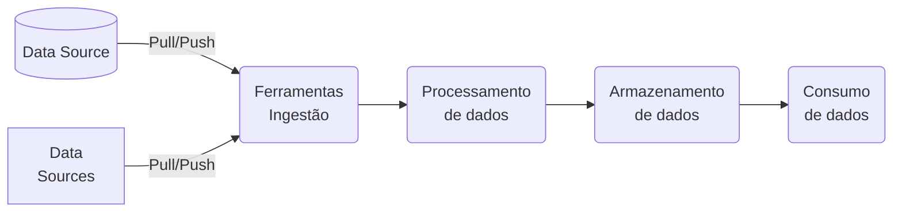

# Questão 1

- [x] In a GitHub Actions workflow, how can you efficiently reduce duplication of code when the same steps are used across multiple jobs? `Implement a custom action and reference it in each job where the steps are required.`

- [x] When setting up a GitHub Actions workflow, how can you ensure that a job is only executed if a previous job in the workflow has failed? `Use the if: failure() condition combined with the needs keyword, like needs: [previous_job] and if: failure() in the job definition.`

- [x] How should an appropriate distribution model for a GitHub Action be selected? `Based on the intended audience and usage scope, choosing between public, private, or marketplace distribution.`

- [x] When developing a custom Docker-based GitHub Action, what is the recommended method for passing input parameters from the workflow to the Docker container? `Define input parameters in the action's metadata file (action.yml) and access them as environment variables inside the Docker container.`

- [x] In GitHub Actions, how can you ensure that a specific job in a workflow only runs if changes were made to files in either of two different directories? `Create a preliminary job to check for changes in the specified directories and use its output in the if condition of the dependent jobs.`

- [x] What is the best practice for updating self-hosted runners? `Implementing a regular update schedule to ensure runners have the latest features and security patches.`

- [x] What is a key consideration when creating a release strategy for a GitHub Action? `Implement versioning to track changes, facilitate backward compatibility, and manage releases effectively.`

- [x] In a GitHub Actions workflow, how can you share data generated in one job with subsequent jobs in the same workflow? `Use the upload-artifact and download-artifact actions to pass data between jobs.,`

- [x] When authoring a custom GitHub Action to be used across multiple projects within an organization, what is the best practice for handling updates to the action to minimize disruptions in those projects? `Release new versions of the action using version tags, and instruct projects to use specific versions rather than the latest commit on the main branch.`

- [x] In GitHub Actions, what is the correct approach to ensure that a workflow is triggered by a push event only when specific files or directories change? `Use the on: push: paths: ['specific-path/*'] syntax to trigger the workflow only when changes occur in files or directories under 'specific-path'.`

- [x] In GitHub Actions, how can you ensure that a job in a workflow only runs on a specific day of the week, for instance, every Friday? `Use the on: schedule syntax with a cron expression in the workflow file, such as on: schedule: - cron: '0 0 * * 5'.`

- [x] In GitHub Actions, what is the best practice for managing and sharing commonly used environment variables across multiple jobs within a workflow? `Use the env keyword at the workflow level to set common environment variables for all jobs.`

- [x] Which of the following is a best practice for managing and leveraging reusable components in an enterprise setting? `Utilize a dedicated repository for storage and establish clear naming conventions for files and folders.`

- [x] In a GitHub Actions workflow, how can you configure a job to reuse artifacts generated by a previous job in the same workflow? `Implement the uses: actions/download-artifact@v2 step within the job, specifying the name of the artifact produced by the previous job.`

- [x] In a GitHub Actions workflow that is triggered by pull requests affecting any file, how can you configure a job to run only if a specific file has been modified and a preceding job has completed successfully? `Combine the if condition and jobs.<job_id>.if attribute to check the success of a previous job and use a script step with git diff to verify if a specific file was modified`

- [x] When authoring and maintaining workflows in GitHub Actions, which statement is correct regarding the use of jobs.<job_id>.strategy in a workflow file? `Within strategy, the matrix keyword can be used to run tests across multiple versions of a language or operating system.`

- [x] What is a best practice for distributing custom actions in GitHub Actions? `Ensure the action is well-documented, including clear instructions on usage, inputs, and outputs.`

- [x] How are encrypted secrets accessed within GitHub Actions and workflows? `By using the secrets context in the workflow file to reference the secrets.`

- [x] What is a crucial aspect of monitoring self-hosted runners in an enterprise environment? `Regularly checking the status and performance metrics of runners to ensure they operate optimally.`

- [x] In GitHub Actions, how would you correctly configure a workflow to cache dependencies for a Node.js application to improve build times? `Include a step with uses: actions/cache@v2 and configure the path to node_modules, along with an appropriate key based on the package-lock.json file.`

- [x] Which statement accurately describes the difference between GitHub-hosted and self-hosted runners? `GitHub-hosted runners are fully managed by GitHub, offering convenience but less control over the environment.`

- [x] When creating a custom GitHub Action in a public repository, what is the best practice for ensuring the action's code adheres to consistent coding standards and best practices? `Implement a linter in the action's development workflow to automatically check code submissions for adherence to defined coding standards.`

- [x] In the context of consuming workflows in GitHub Actions, how can you trigger a workflow in one repository as a result of an event in a separate repository? `Use the on: repository_dispatch event in the consuming repository, and send a repository dispatch event from the source repository.`

- [x] In GitHub Actions, how should you correctly configure a workflow to trigger only on pull requests targeting the main branch? `Use on: pull_request: branches: [main] to specify that the workflow should only run for pull requests targeting the main branch.`

- [x] What is an essential step when publishing an action to the GitHub Marketplace? `Ensure the action's repository is public and includes a README file with detailed usage instructions.`

- [x] When managing repository-level encrypted secrets, what is an important practice? `Secrets should be scoped to specific environments or branches, limiting access where necessary.`

- [x] Which of the following are effective troubleshooting steps for self-hosted runners? (Choose 2) `Verifying network connectivity and access controls., Reviewing logs for error messages or warnings.`

- [x] In GitHub Actions, how would you configure a workflow to automatically cancel previous runs of the same workflow on the same branch when a new run is triggered? `Use the concurrency keyword with a unique group name that includes the branch name to automatically cancel overlapping runs.`

- [x] In the context of consuming workflows in GitHub Actions, which of the following is a correct method to specify a dependency between jobs? `Use the needs keyword in the job that depends on the completion of another job.`

- [x] When authoring a JavaScript-based custom GitHub Action, what is the recommended approach to manage third-party dependencies that the action requires? `Bundle the dependencies with a tool like Webpack, and commit the bundled file along with your action code to the repository.`

- [x] When developing a custom GitHub Action that interacts with external APIs, what is the best strategy to manage and rotate API keys or tokens to enhance security? `Store the API keys or tokens as encrypted secrets in the GitHub repository and reference them in the action's code.`

- [x] In the context of GitHub Actions, what is the correct use of environment keyword in a workflow file? `environment is utilized to specify the deployment environment, such as production, staging, or development, and can enforce additional rules like manual approvals.`

- [x] For a custom GitHub Action you are developing, which method is most appropriate for debugging issues that occur during the action's execution in a workflow? `Utilize console.log statements in the action's code and review the output in the GitHub Actions workflow logs.`

- [x] How can you trigger a GitHub Actions workflow in Repository B whenever a new release is published in Repository A, assuming both repositories are within the same organization? `Use the repository_dispatch event in Repository B, and trigger it using a webhook from Repository A upon release.`

- [x] What is the most effective approach for distributing actions within an enterprise? `Create a centralized shared repository and utilize GitHub's internal networking features for distribution.`

- [x] In the context of creating a custom GitHub Action, what is the best approach to handle sensitive information, such as API keys or credentials, required by the action? `Advise users to store sensitive information as encrypted secrets in their GitHub repository and pass them as environment variables to the action.`

- [x] How should an organization configure use policies for GitHub Actions to ensure compliance and efficiency? `Define clear guidelines on usage, security, and maintenance, and enforce them through automated checks and balances.`

- [x] Which of the following are best practices for managing encrypted secrets in GitHub Actions? `Use environment-specific secrets to tailor access based on deployment stages., Audit access to secrets and review usage in workflows regularly., Regularly rotate secrets to minimize the risk of exposure.`

- [x] In GitHub Actions, how can you selectively run jobs within a workflow based on the type of event that triggered the workflow? `Employ the if: github.event_name == 'event_type' condition at the start of each job to specify when the job should run based on the event type.`

- [x] In GitHub Actions, how can you configure a workflow to trigger only on pull requests that are opened or reopened, and additionally only when changes are made to files in a specific directory? `Use the on: pull_request trigger with a types field specifying opened and reopened, combined with a paths filter including the specific directory.`

- [x] In the process of authoring a custom GitHub Action, what is the recommended approach to ensure that the action is compatible with both Linux and Windows runners? `Develop the action using JavaScript, which is cross-platform and supported by the GitHub Actions runner environment on both Linux and Windows.`

- [x] You are reviewing a GitHub Actions workflow and encounter an action defined in the workflow file. How can you identify the type of action used (e.g., JavaScript, Docker container, or composite)? `By checking the runs section in the action's action.yml or action.yaml file.`

- [x] In GitHub Actions, you want to consume a workflow from another repository and trigger it whenever a new issue is opened in your repository. How can you achieve this? `Use the on: repository_dispatch event in the target repository's workflow and dispatch an event from your repository when a new issue is opened.`

- [x] What is an essential step when configuring self-hosted runners for enterprise use? `Configure network settings, including proxies and IP allow lists, to ensure secure and efficient operation within the enterprise environment.`

- [x] In GitHub Actions, how can you set up a workflow to trigger at a specific time only if there have been changes in a particular branch since the last successful run of the workflow? `Configure the workflow with the on: schedule trigger and a cron expression, then use a script step to check for changes in the branch since the last run.`

- [x] In GitHub Actions, how do you correctly configure a workflow to only execute a job when a previous job has failed? `Use the needs keyword with if: failure() condition, like needs: job1 and if: failure() in the job definition.`

- [x] Which of the following are benefits of reusing templates for actions and workflows in GitHub Actions? (Choose 2) `Significantly reduces the time required for onboarding new team members., Ensures consistency and best practices across multiple projects.`

- [x] In GitHub Actions, how can you ensure that a specific job in a workflow only runs after two other jobs have successfully completed? `Implement the needs: [job1, job2] keyword in the job definition to establish a dependency on job1 and job2.`

- [x] In GitHub Actions, how can you dynamically generate a matrix for a job to run against multiple configurations, using data from an external JSON file hosted in the same repository? `Implement a custom action that reads the JSON file and outputs the matrix configuration, then use this output in the job's matrix setting.`

- [x] When consuming workflows in GitHub Actions, how can you ensure that a workflow is triggered only when a new release is published in another repository within the same organization? `Configure a repository_dispatch event in the source repository and trigger it manually when a new release is published.`

- [x] When developing a composite run steps action in GitHub Actions, what is the recommended way to include external scripts or code files that the action depends on? `Include the external scripts or code files in the same repository as the action and reference them using relative paths in the runs.steps entries.`

- [x] In GitHub Actions, what is the correct method to reuse workflows stored in a public repository in your organization's private repository? `Reference the public workflow using the uses keyword with the repository's URL and path to the workflow file.`

- [x] In GitHub Actions, what is the recommended approach to manage and use secrets (like API keys or passwords) in a workflow that needs to access an external service? `Use GitHub's encrypted secrets feature to store and access secrets in the workflow.`

- [x] What accurately defines the scope of encrypted secrets in GitHub Actions? `Encrypted secrets can be defined at the repository or organization level, with access limited to specific workflows.`

- [x] When authoring a custom GitHub Action, what is the best practice for managing and versioning the action to ensure stability and ease of maintenance for users? `Create specific releases or tags for stable versions of the action, and advise users to reference these in their workflows.`

- [x] In GitHub Actions, how can you set up a workflow to run on both push and pullrequest events, but ensure specific jobs are executed only for pullrequest events? `Configure the workflow with on: [push, pull_request] and use if: github.event_name == 'pull_request' conditionals on specific jobs.`

- [x] When configuring IP allow lists for GitHub-hosted and self-hosted runners, what is the primary effect? `It restricts which IP addresses can interact with your runners, enhancing security.`

- [x] You have two GitHub repositories: Repository A and Repository B. You want to configure a workflow in Repository A to automatically trigger whenever a new pull request is created in Repository B. What is the best way to set up this integration? `Configure a webhook in Repository B to trigger a repository_dispatch event in Repository A whenever a pull request is created.`

- [x] In GitHub Actions, how can you utilize artifacts generated in one workflow in a separate, subsequent workflow within the same repository? `Use the on: workflow_run trigger in the subsequent workflow and utilize the actions/download-artifact@v2 action to fetch the artifacts`

- [x] In the development of a custom GitHub Action, how should you handle and report errors that occur during the action's execution to ensure users of the action can effectively debug issues? `Implement custom error handling in the action's code that catches and logs detailed error messages, using GitHub's logging commands for enhanced visibility.`

- [x] In a GitHub Actions workflow, how should you securely manage sensitive information like API keys or database credentials? `Use GitHub Secrets and reference them in the workflow file using the ${{ secrets.SECRET_NAME }} syntax.`

- [x] In GitHub Actions, how can you effectively debug a failing job within a workflow? `Insert echo commands in the workflow file to print out variable values and command outputs at various stages.`

- [x] For a custom GitHub Action that requires periodic updates and maintenance, what is the best strategy to inform users about upcoming changes or deprecations that might affect their workflows? `Use the action's code to display warning messages in the workflow logs when deprecated features are used., Update the README file of the action's repository with details about the changes and deprecations.`

- [x] How can you correctly call a reusable workflow in GitHub Actions? `By specifying the workflow's file path in the uses keyword under a job.`

- [x] What is the primary benefit of being able to move self-hosted runners into and between groups? `It allows for flexible resource management and adapts to changing project needs or organizational structures.`

# Questão 2

- [x] What is crucial for the correct syntax of jobs in a GitHub Actions workflow file? `Jobs should be defined under the jobs key with proper indentation to ensure the structure is correctly interpreted.`

- [x] When setting up a GitHub Actions workflow, how can you ensure that a job is only executed if a previous job in the workflow has failed? `Use the if: failure() condition combined with the needs keyword, like needs: [previous_job] and if: failure() in the job definition.`

- [x] In GitHub Actions, what is the best practice for managing and sharing commonly used environment variables across multiple jobs within a workflow? `Use the env keyword at the workflow level to set common environment variables for all jobs.`

- [x] How can workflow artifacts be removed from GitHub after they are no longer needed? `Artifacts can be configured to automatically expire after a certain number of days.`

- [x] How can caching be configured to speed up workflow execution in GitHub Actions? `Use the cache action to store and retrieve dependencies, reducing installation time in subsequent runs.`

- [x] In GitHub Actions, how can you effectively debug a failing job within a workflow? `Insert echo commands in the workflow file to print out variable values and command outputs at various stages.`

- [x] In GitHub Actions, how can you set up a workflow to run on both push and pullrequest events, but ensure specific jobs are executed only for pullrequest events? `Configure the workflow with on: [push, pull_request] and use if: github.event_name == 'pull_request' conditionals on specific jobs.`

- [x] In GitHub Actions, how do you correctly configure a workflow to only execute a job when a previous job has failed? `Use the needs keyword with if: failure() condition, like needs: job1 and if: failure() in the job definition.`

- [x] Which configuration allows a workflow to be triggered by multiple events in GitHub Actions? `Use the on keyword to specify a list of events, like push, pull_request, and schedule.`

- [x] What is the recommended way to pass data between jobs in a GitHub Actions workflow? `Use artifacts to share data between jobs, ensuring the output from one job is available to subsequent jobs.`

- [x] How are database and service containers utilized in a GitHub Actions workflow? `By defining services in the workflow file, allowing jobs to use the containers as part of the runtime environment.`

- [x] What is the purpose of adding a workflow status badge to a repository? `To provide a visual representation of the workflow's status (e.g., passing, failing) on the repository's README or other web pages.`

- [x] Which of the following are true regarding the components and integration of actions, workflows, jobs, steps, runs, and the marketplace in GitHub Actions? `Marketplace is a platform where pre-built actions can be published and used within workflows without custom coding., Conditional keywords can be used in steps to control their execution based on certain conditions. and Workflows are automated processes defined by jobs, which in turn consist of steps that can include actions or shell commands.`

- [x] In GitHub Actions, how can you ensure that a job in a workflow only runs on a specific day of the week, for instance, every Friday? `Use the on: schedule syntax with a cron expression in the workflow file, such as on: schedule: - cron: '0 0 * * 5'.`

- [x] What is the purpose of using conditional keywords in steps within a GitHub Actions workflow? `To control the execution of specific steps based on the outcome of previous steps or the context of the workflow run.`

- [x] Which of the following are advanced configurations in GitHub Actions workflows? `Adding environment protections to ensure workflows run only in safe, approved contexts., Defining a matrix of different job configurations to test across multiple environments. and Removing workflow artifacts after a certain period to manage storage and maintain cleanliness.`

- [x] Which event configuration correctly triggers a workflow in GitHub Actions? `Using the on keyword in the workflow file to specify the type of event, such as push, pull_request, or schedule.`

- [x] You are integrating a new action into your workflow. How can you identify the action's type, required inputs, and expected outputs?`By reading the action's README.md file and the action metadata file (action.yml or action.yaml).`

- [x] How can you correctly call a reusable workflow in GitHub Actions? `By specifying the workflow's file path in the uses keyword under a job.`

- [x] How can you identify a GitHub Action’s type, inputs, and outputs? `By reading the action's action.yml file, which defines the action's interface including its type, required inputs, and outputs.`

- [x] In GitHub Actions, how can you ensure that a specific job in a workflow only runs if changes were made to files in either of two different directories? `Create a preliminary job to check for changes in the specified directories and use its output in the if condition of the dependent jobs.`

- [x] What is the correct syntax for defining custom environment variables in a step of a GitHub Actions workflow? `steps:
  - name: Example step
    run: echo "Hello world"
    env:
      CUSTOM_VAR: "value"`

- [x] What can you understand by reading a GitHub Actions workflow configuration file? `The specific steps and actions that the workflow will execute, along with the events that trigger it.`

- [x] Which of the following statements are correct regarding the use of environment variables in GitHub Actions workflows? `Default environment variables provide predefined context about the workflow run, like the branch name or commit SHA., Custom environment variables can be set at the workflow, job, or step level using the env keyword. and The GITHUB_ENV workflow command can be used to set environment variables for subsequent steps in a job.`

- [x] In GitHub Actions, what is the correct method to reuse workflows stored in a public repository in your organization's private repository? `Reference the public workflow using the uses keyword with the repository's URL and path to the workflow file.`

- [x] You want to ensure stability in your workflows by using a specific version of an action. How can you correctly reference a specific version of an action in your workflow file? `By using the action's name followed by the @ symbol and the version tag or commit SHA (e.g., actions/checkout@v2).`

- [x] What is the difference between disabling and deleting a workflow in GitHub Actions? `Disabling a workflow stops it from being triggered but retains the workflow file in the repository, while deleting a workflow removes the file entirely.`

- [x] In GitHub Actions, how can you configure a workflow to trigger only on pull requests that are opened or reopened, and additionally only when changes are made to files in a specific directory? `Use the on: pull_request trigger with a types field specifying opened and reopened, combined with a paths filter including the specific directory.`

- [x] You are managing GitHub Actions workflows in your organization's repositories. Which of the following practices should you follow? `Use encrypted secrets to store and access sensitive information like API keys and passwords in workflows., Review and integrate updates to actions cautiously, ensuring they do not break existing workflows. and Regularly review and update the actions used in your workflows to ensure they receive security updates and improvements.`

- [x] When implementing a GitHub Actions workflow, how can you conditionally skip a job unless a manual trigger is activated, such as a comment in a pull request? `Use the on: issue_comment trigger combined with a job-level if condition checking the comment content.`

- [x] In a GitHub Actions workflow that is triggered by pull requests affecting any file, how can you configure a job to run only if a specific file has been modified and a preceding job has completed successfully? `Combine the if condition and jobs.<job_id>.if attribute to check the success of a previous job and use a script step with git diff to verify if a specific file was modified`

- [x] How can you identify the event that triggered a GitHub Actions workflow? `By checking the GITHUB_EVENT_NAME environment variable in the workflow run logs.`

- [x] Which method can be used to access the logs of a GitHub Actions workflow run using GitHub’s REST API? `Send a GET request to the appropriate endpoint with the workflow run ID to retrieve the logs.`

- [x] How are encrypted secrets accessed within GitHub Actions and workflows? `By using the secrets context in the workflow file to reference the secrets.`

- [x] You are managing secrets for a specific repository in your organization. What should you consider when creating repository-level encrypted secrets? `Repository-level secrets are best for sensitive data specific to one repository and are not accessible by other repositories.`

- [x] You want to ensure that specific GitHub Actions are only used by authorized personnel within your organization. What's an effective way to achieve this? `Implement role-based access controls and integrate with the organization's identity management system.`

- [x] Your organization has stringent security requirements. What would be the effect of configuring IP allow lists on GitHub-hosted and self-hosted runners? `It restricts network access, allowing only traffic from specified IP addresses to interact with the runners.`

- [x] Your organization wants to ensure that only specific teams have access to certain self-hosted runners. How can you manage access effectively? `Use GitHub's runner management interface to set access permissions for each runner group.`

- [x] Which statement accurately describes the difference between GitHub-hosted and self-hosted runners? `GitHub-hosted runners are fully managed by GitHub, offering convenience but less control over the environment.`

- [x] Your enterprise requires a secure and efficient method to distribute GitHub Actions across multiple teams. What is the best approach? `Create a centralized shared repository for actions and enforce access controls.`

- [x] Which of the following are best practices for managing encrypted secrets in GitHub Actions? `Regularly rotate secrets to minimize the risk of exposure., Use environment-specific secrets to tailor access based on deployment stages. and Audit access to secrets and review usage in workflows regularly.`

- [x] When managing repository-level encrypted secrets, what is an important practice? `Secrets should be scoped to specific environments or branches, limiting access where necessary.`

- [x] Your team wants to standardize CI/CD processes across multiple projects. How can workflow and action templates be reused effectively? `Use a centralized .github repository to store workflow templates and reference them in individual project repositories.`

- [x] What is a key consideration when selecting the appropriate runners to support specific workloads? `Select runners based on workload requirements, such as processing power or specific software dependencies.`

- [x] How are encrypted secrets accessed within GitHub Actions workflows? `By using the secrets context in the workflow file to reference the secrets by name.`

- [x] In an enterprise setting, how should a GitHub Actions workflow be configured to ensure that sensitive data, such as production database credentials, is securely managed and accessed only by authorized workflows? `Store sensitive data as encrypted secrets in GitHub and restrict access to these secrets using GitHub's environment protection rules.`

- [x] What is a key difference between GitHub-hosted and self-hosted runners in GitHub Actions? `GitHub-hosted runners provide a predefined environment, while self-hosted runners offer more control and customization options.`

- [x] You are setting up encrypted secrets for your projects. How does the scope of encrypted secrets differ between organization-level and repository-level in GitHub Actions? `Organization-level secrets can be made available to multiple repositories, while repository-level secrets are accessible only to the repository they are set in.`

- [x] You are responsible for ensuring that GitHub Actions are used securely and appropriately within your enterprise. How can you control access to these actions? `Implement role-based access controls at the organization level and integrate with the enterprise's identity management system.`

- [x] What is a best practice for distributing custom actions in GitHub Actions? `Ensure the action is well-documented, including clear instructions on usage, inputs, and outputs.`

- [x] In the process of building a custom GitHub Action that integrates with a bug tracking system to automatically create issues based on code commits, what approach should be taken to efficiently categorize and prioritize these issues? `Use keywords in commit messages to determine the priority and category of issues, and configure the action to parse these keywords.`

- [x] When creating a custom GitHub Action that integrates with third-party services, what approach should be adopted to handle service outages or downtime to ensure minimal impact on workflow execution? `Implement retry logic in the action to attempt reconnection to the third-party service a set number of times before failing., Provide users with the option to skip steps dependent on the third-party service during outages, through input parameters in the action.`

- [x] When developing a custom GitHub Action for code analysis and linting, how can you best ensure that the action remains up-to-date with the latest coding standards and practices in a rapidly evolving programming language ecosystem? `Integrate the action with a popular, actively maintained linting tool or library, automatically updating to the latest version on each run. AND Allow users to specify their own set of rules or link to an external ruleset in their workflow configuration.`

- [x] A GitHub Actions workflow fails during a step that executes a JavaScript action. The logs indicate a problem with a missing package. What is the most appropriate action to resolve this issue? `Modify the JavaScript action to include a step for installing the missing package.`

- [x] When creating a custom GitHub Action in a public repository, what is the best practice for ensuring the action's code adheres to consistent coding standards and best practices? `Implement a linter in the action's development workflow to automatically check code submissions for adherence to defined coding standards.`

- [x] In the development of a custom GitHub Action, what is the most effective way to handle different runtime environments (e.g., production, staging, development) within the action's logic? `Include environment-specific parameters as inputs in the action's action.yml file, allowing users to specify the environment during workflow configuration. and Utilize GitHub's environment secrets and have the action dynamically adjust its behavior based on these secrets.`

- [x] What is an essential step when publishing an action to the GitHub Marketplace? `Ensure the action's repository is public and includes a README file with detailed usage instructions.`

- [x] What is a key consideration when creating a release strategy for a GitHub Action? `Implement versioning to track changes, facilitate backward compatibility, and manage releases effectively.`

- [x] A GitHub Actions workflow consistently fails at a step utilizing a JavaScript action with an error message indicating an issue with the node version. What is the most appropriate way to address this issue? `Add a step to update the node version in the runner environment before executing the JavaScript action.`

- [x] When authoring a custom GitHub Action that integrates with an external API, how should you handle potential API rate limits to prevent disruptions in user workflows? `Provide an option for users to input their own API keys, allowing them to manage their rate limits independently. AND Implement logic in the action to detect rate limit errors and automatically retry the request after a sensible delay.`

- [x] When managing and publishing GitHub Actions, which of the following practices are recommended? `Regularly update and maintain your actions, ensuring they are compatible with the latest GitHub features and security standards. and Use clear and descriptive naming conventions for your actions and repositories. AND Provide comprehensive documentation, including usage instructions, input and output descriptions, and example workflows.`

- [x] When developing a custom GitHub Action that involves complex computational tasks, what is the best approach to optimize performance and reduce execution time? `Offload the computational tasks to an external server or cloud service, and have the action interact with that service. and Implement caching mechanisms in the action to store and reuse computational results where possible.`

- [x] You've developed a custom GitHub Action for automating deployments. Your action is likely to be beneficial to other projects outside your organization. How should you distribute your action? `Publish the action to the GitHub Marketplace to make it publicly available.`

- [x] In creating a custom GitHub Action to enforce coding standards across multiple projects within an organization, what strategy should be employed to allow for project-specific customizations while maintaining a common set of standards? `Create a base action with common standards and allow projects to extend or override these standards through a configuration file in each project's repository.`

- [x] You are creating a new GitHub Action. What is the necessary file and directory structure you should set up? `A directory at the root of the repository containing a Dockerfile or a JavaScript file, and an action.yml file.`

# Questão 3

What is a key step when publishing to GitHub Packages using a GitHub Actions workflow? `Configure the workflow to authenticate with GitHub Packages and push the package using the appropriate command.`

How are database and service containers utilized in a GitHub Actions workflow? `By defining services in the workflow file, allowing jobs to use the containers as part of the runtime environment.`

What is crucial for the correct syntax of jobs in a GitHub Actions workflow file? `Jobs should be defined under the jobs key with proper indentation to ensure the structure is correctly interpreted.`

You are setting up a CI/CD pipeline for a project that requires a specific operating system. How should you select an appropriate runner? `Choose a GitHub-hosted runner that supports the required operating system.`

How can you use an organization's templated workflow in a repository? `By selecting the template from the repository's Actions tab and then customizing it as needed.`

You are managing secrets for a specific repository in your organization. What should you consider when creating repository-level encrypted secrets? `Repository-level secrets are best for sensitive data specific to one repository and are not accessible by other repositories.`

Which of the following are true regarding the components and integration of actions, workflows, jobs, steps, runs, and the marketplace in GitHub Actions? `Workflows are automated processes defined by jobs, which in turn consist of steps that can include actions or shell commands., Marketplace is a platform where pre-built actions can be published and used within workflows without custom coding. e Conditional keywords can be used in steps to control their execution based on certain conditions.`

Your enterprise requires a secure and efficient method to distribute GitHub Actions across multiple teams. What is the best approach? `Create a centralized shared repository for actions and enforce access controls.`

When designing a custom GitHub Action to facilitate code reviews by automatically assigning reviewers based on the type of changes made, what method should be used to determine the most appropriate reviewers for each pull request? `Use a configuration file in the repository that maps specific types of changes to relevant reviewers, allowing for easy updates and customization.`

You want to ensure that specific GitHub Actions are only used by authorized personnel within your organization. What's an effective way to achieve this? `Implement role-based access controls and integrate with the organization's identity management system.`

What is the role of CodeQL when used as a step in a GitHub Actions workflow? `To automatically analyze the codebase for vulnerabilities and code quality issues.`

Your team frequently creates new repositories and wants to standardize the CI/CD process.What's the most effective way to achieve this with GitHub Actions? `Utilize workflow templates stored in a designated .github repository and reference them in new repositories.`

When implementing a GitHub Actions workflow, how can you conditionally skip a job unless a manual trigger is activated, such as a comment in a pull request? `Use the on: issue_comment trigger combined with a job-level if condition checking the comment content.`

How can you enable step debug logging in a GitHub Actions workflow? `By setting the ACTIONS_STEP_DEBUG secret to true in the repository settings.`

You are setting up encrypted secrets for your projects. How does the scope of encrypted secrets differ between organization-level and repository-level in GitHub Actions? `Organization-level secrets can be made available to multiple repositories, while repository-level secrets are accessible only to the repository they are set in.`

What is the recommended way to pass data between jobs in a GitHub Actions workflow? `Use artifacts to share data between jobs, ensuring the output from one job is available to subsequent jobs.`

As a GitHub organization administrator, you want to make a secret available to multiple repositories. What is the correct approach? `Create an organization-level secret and select the repositories that should have access to it.`

What is the correct syntax for defining custom environment variables in a step of a GitHub Actions workflow? `steps:
  - name: Example step
    run: echo "Hello world"
    env:
      CUSTOM_VAR: "value"`

What is the purpose of using conditional keywords in steps within a GitHub Actions workflow? `To run steps only if certain conditions are met, adding flexibility and control to the workflow.`

What are indicators that a GitHub Action is trustworthy? `The action is published by a known organization, has a significant number of stars, and thorough documentation.`

When creating a custom GitHub Action that integrates with third-party services, what approach should be adopted to handle service outages or downtime to ensure minimal impact on workflow execution? `Implement retry logic in the action to attempt reconnection to the third-party service a set number of times before failing. e Provide users with the option to skip steps dependent on the third-party service during outages, through input parameters in the action.`

How can workflow artifacts be removed from GitHub after they are no longer needed? `Artifacts can be configured to automatically expire after a certain number of days.`

What is an essential aspect of defining the syntax for jobs in a GitHub Actions workflow file? `Jobs should be defined with correct indentation and encapsulated within the jobs keyword.`

When creating a custom GitHub Action that is expected to evolve and scale over time, how should version control and release management be handled to ensure backward compatibility and minimize disruption for users? `Implement semantic versioning for the action, using tags to mark stable release versions, and instruct users to reference specific versions.`

You are drafting organizational use policies for GitHub Actions. Which of the following should be included in your policies? `Implement monitoring and auditing mechanisms to track the usage and performance of actions. , Define clear guidelines on the creation, sharing, and usage of GitHub Actions within the organization. e Regularly review and update actions to ensure compliance with security standards and best practices.`

In the development of a custom GitHub Action, what is the most effective way to handle different runtime environments (e.g., production, staging, development) within the action's logic? `Utilize GitHub's environment secrets and have the action dynamically adjust its behavior based on these secrets. e Include environment-specific parameters as inputs in the action's action.yml file, allowing users to specify the environment during workflow configuration.`

How are dependent jobs implemented in a GitHub Actions workflow? `By using the needs keyword to specify job dependencies, ensuring that jobs run in the correct order.`

In the process of creating a custom GitHub Action, what is the best practice for ensuring that the action remains maintainable and easy to update as GitHub Actions evolves and new features are released? `Subscribe to GitHub's changelog and update the action only when necessary to maintain compatibility with the GitHub Actions platform. e Build the action with modular components, allowing for easy updates and integration of new features without major refactoring.`

When developing a custom GitHub Action for code analysis and linting, how can you best ensure that the action remains up-to-date with the latest coding standards and practices in a rapidly evolving programming language ecosystem? `Allow users to specify their own set of rules or link to an external ruleset in their workflow configuration. E Integrate the action with a popular, actively maintained linting tool or library, automatically updating to the latest version on each run.`

You are managing a set of self-hosted runners for your enterprise on GitHub Actions. How can you effectively manage access and organize these runners? `Create groups for runners and assign runners to groups based on usage or department needs.`

Which event configuration correctly triggers a workflow in GitHub Actions? `Using the on keyword in the workflow file to specify the type of event, such as push, pull_request, or schedule.`

In an enterprise setting, how should a GitHub Actions workflow be configured to ensure that sensitive data, such as production database credentials, is securely managed and accessed only by authorized workflows? `Store sensitive data as encrypted secrets in GitHub and restrict access to these secrets using GitHub's environment protection rules`

In an enterprise environment, what is the best practice for monitoring and analyzing the usage and performance of GitHub Actions across multiple repositories and teams? `Implement a centralized logging and monitoring system that aggregates data from all GitHub Actions workflows`

Which of the following statements are correct regarding the use of environment variables in GitHub Actions workflows? `The GITHUB_ENV workflow command can be used to set environment variables for subsequent steps in a job. AND Default environment variables provide predefined context about the workflow run, like the branch name or commit SHA AND Custom environment variables can be set at the workflow, job, or step level using the env keyword.`

When developing a custom GitHub Action for automating dependency updates in a multi-language project environment, what is the most efficient approach to handle updates across different programming languages and package managers? `Implement a modular action with plug-ins or scripts for each language and package manager, allowing the action to be extended as needed.`

What can you understand by reading a GitHub Actions workflow configuration file? `The specific steps and actions that the workflow will execute, along with the events that trigger it.`

What is a best practice for maintaining self-hosted runners in GitHub Actions? `Regularly update the runners' software and monitor their performance and logs`

How can a script be incorporated into a GitHub Actions workflow? `By using the run keyword in a step to execute shell commands or scripts.`

Which aspect is least likely to contribute to the trustworthiness of an action listed on the GitHub Marketplace? `The action is published by an individual with no prior contributions to open source.`

In creating a custom GitHub Action to enforce coding standards across multiple projects within an organization, what strategy should be employed to allow for project-specific customizations while maintaining a common set of standards? `Create a base action with common standards and allow projects to extend or override these standards through a configuration file in each project's repository`

Your organization wants to ensure that only specific teams have access to certain self-hosted runners. How can you manage access effectively? `Use GitHub's runner management interface to set access permissions for each runner group.`

What is a primary method for diagnosing a failed GitHub Actions workflow run? `Checking the workflow run history and logs to identify error messages and the steps where the failure occurred.`

When developing a custom GitHub Action that involves complex computational tasks, what is the best approach to optimize performance and reduce execution time? `Implement caching mechanisms in the action to store and reuse computational results where possible. AND Offload the computational tasks to an external server or cloud service, and have the action interact with that service.`

In developing a custom GitHub Action to integrate with a project management tool for automated task creation, how should the action be designed to customize task attributes based on different types of events in a GitHub repository? `Allow users to define mappings between GitHub events and task attributes in a configuration file within their repository.`

Which configuration allows a workflow to be triggered by multiple events in GitHub Actions? `Use the on keyword to specify a list of events, like push, pull_request, and schedule`

Where can you locate a workflow file in a GitHub repository? `In the .github/workflows directory at the root of the repository.`

Which of the following are components of a GitHub Actions workflow? `Conditional keywords that control the execution of jobs and steps based on certain conditions. AND Jobs, which group together individual steps that run as part of the workflow. AND Steps, which represent individual tasks like running a script or an action.`

For a custom GitHub Action designed to deploy applications to multiple cloud platforms, what is the most effective method to manage and configure platform-specific deployment settings? `Utilize a configuration file in the user's repository to define platform-specific settings, which the action reads and applies during deployment. AND Require users to store platform-specific settings as encrypted secrets in their GitHub repository and reference these in the action.`

How can you identify the event that triggered a GitHub Actions workflow? `By checking the GITHUB_EVENT_NAME environment variable in the workflow run logs.`

In the process of building a custom GitHub Action that integrates with a bug tracking system to automatically create issues based on code commits, what approach should be taken to efficiently categorize and prioritize these issues? `Use keywords in commit messages to determine the priority and category of issues, and configure the action to parse these keywords.`

In developing a custom GitHub Action that generates and publishes reports, how should the action be designed to handle large report files to ensure efficient performance and resource usage? `Store the report files externally and provide download links in the action's output., Compress the report files within the action before publishing to minimize file size.`

How do you ensure a workflow uses a specific version of a GitHub Action? `By referencing the action in the workflow file with a version tag or commit SHA after the action's name (e.g., actions/checkout@v4).`

How can you access encrypted secrets within a GitHub Actions workflow? `Use the secrets context to access the secrets within your workflow file.`

If you're navigating a GitHub repository for the first time, where would you typically find the GitHub Actions workflow files? `In the .github/workflows directory at the root of the repository.`

When authoring and maintaining workflows in GitHub Actions, which of the following statements is accurate? `Workflows are defined in YAML files and should be placed in the .github/workflows directory of the repository`

What is the difference between disabling and deleting a workflow in GitHub Actions? `Disabling a workflow stops it from being triggered but retains the workflow file in the repository, while deleting a workflow removes the file entirely.`

Where can you access the logs of a GitHub Actions workflow run from the GitHub user interface? `In the 'Actions' tab of the repository, by selecting the specific workflow run.`

When authoring a custom GitHub Action that integrates with an external API, how should you handle potential API rate limits to prevent disruptions in user workflows? `Implement logic in the action to detect rate limit errors and automatically retry the request after a sensible delay AND Provide an option for users to input their own API keys, allowing them to manage their rate limits independently.`

As a DevOps engineer, you're tasked with managing reusable components for your organization's workflows. What approach should you take? `Store reusable components in a centralized repository, establish clear naming conventions, and create a maintenance plan.`

What is the role of implementing workflow commands as a run step in a GitHub Actions workflow? `To communicate with the runner, setting environment variables or altering the workflow behavior.`

How can caching be configured to speed up workflow execution in GitHub Actions? `Use the cache action to store and retrieve dependencies, reducing installation time in subsequent runs.`

Your organization has stringent security requirements. What would be the effect of configuring IP allow lists on GitHub-hosted and self-hosted runners? `It restricts network access, allowing only traffic from specified IP addresses to interact with the runners.`

When designing a custom GitHub Action to automatically update documentation based on code changes, what is the best approach to ensure that the documentation remains synchronized with the codebase across different branches? `Trigger the action on every push event across all branches, ensuring documentation updates occur in parallel with code changes. AND
Implement logic in the action to detect code changes that affect documentation and update relevant branches accordingly.`

For a GitHub Action that requires frequent updates due to changes in external dependencies, what strategy should be employed to test and validate the action's functionality before releasing updates to ensure minimal impact on users? `Set up an automated testing suite that runs tests against a variety of scenarios whenever changes are made, using GitHub Actions' own CI/CD capabilities.`

How can you download workflow artifacts from the GitHub Actions user interface? `Navigate to the Actions tab, select the specific workflow run, and download the artifacts from the Artifacts section at the bottom of the page.`

# Portugues

# Questão 1

- [x] Em um fluxo de trabalho do GitHub Actions , como pode você eficientemente reduzir duplicação de código quando o os mesmos passos são usados entre múltiplo empregos ? ` Implementar um personalizado Ação e referencie -o em cada trabalho onde os passos são necessários .

- [x] Ao configurar um fluxo de trabalho do GitHub Actions , como pode você garantir que um trabalho é apenas executado se um anterior trabalho no fluxo de trabalho tem falhou ? `Use o se : condição de falha ( ) combinado com o precisa palavra-chave , como necessidades : [ emprego_anterior ] e se : falha () no trabalho definição .`

- [x] Como deve um apropriado modelo de distribuição para uma ação do GitHub ser selecionado ? ` Baseado sobre o pretendido público e uso escopo , escolhendo entre distribuição pública , privada ou de mercado .

- [x] Ao desenvolver uma ação GitHub personalizada baseada em Docker , o que é o recomendado método para passar parâmetros de entrada de o fluxo de trabalho para o contêiner Docker? `Defina os parâmetros de entrada no ação arquivo de metadados ( action.yml ) e acesso eles como meio ambiente variáveis dentro o contêiner Docker.`

- [x] Em GitHub Actions , como pode você garantir que um específico o trabalho em um fluxo de trabalho só é executado se mudanças eram feito para arquivos em qualquer um de dois diferente diretórios ? ` Crie um preliminar trabalho para verificar se há alterações no especificado diretórios e usar sua saída no se doença de o dependente empregos .`

- [x] O que é o melhor prática para atualização auto- hospedada corredores ? ` Implementando um cronograma de atualização regular para garantir corredores ter o Últimos recursos e segurança remendos.`

- [x] O que é uma chave consideração quando criando uma estratégia de lançamento para uma ação do GitHub ? ` Implementar controle de versão para rastrear mudanças , facilitar para trás compatibilidade e gerenciar lançamentos de forma eficaz .

- [x] Em um fluxo de trabalho do GitHub Actions , como pode você compartilhar dados gerados em um trabalho com subsequente empregos na mesmo fluxo de trabalho? `Use o artefato de upload e baixar- artefato ações para passar dados entre empregos .,`

- [x] Ao criar uma ação personalizada do GitHub para ser usado entre múltiplo projetos dentro de um organização , o que é o melhor prática para lidar com atualizações para o Ação para minimizar as interrupções naqueles projetos ? `Lançar novas versões de o Ação usando versão etiquetas , e instruir projetos para usar específico versões em vez de que o mais recente comprometer-se sobre o principal ramo .`

- [x] No GitHub Actions , o que é o abordagem correta para garantir que um fluxo de trabalho é provocado por um empurrão evento apenas quando arquivos específicos ou diretórios mudar ? `Use o em : push : caminhos: [' -path/* específico '] sintaxe para acionar apenas o fluxo de trabalho quando mudanças ocorrem em arquivos ou diretórios em ' caminho específico '.`

- [x] Em GitHub Actions , como pode você garantir que um trabalho em um fluxo de trabalho só é executado em um dia de o semana , por exemplo , toda sexta-feira? `Use o em : sintaxe de programação com um cron expressão no arquivo de fluxo de trabalho, como em : schedule: - cron : '0 0 * * 5 '.`

- [x] No GitHub Actions , o que é o melhor prática para gerenciamento e compartilhamento comumente usado ambiente variáveis entre múltiplo empregos dentro de um fluxo de trabalho? `Use o ambiente palavra-chave no o nível do fluxo de trabalho para definir um ambiente comum variáveis para todos empregos .`

- [x] Qual de o seguindo é o melhor prática para gerenciamento e alavancando reutilizável componentes em um ambiente empresarial ? `Utilize um dedicado repositório para armazenamento e estabelecer claro nomeação convenções para arquivos e pastas.`

- [x] Em um fluxo de trabalho do GitHub Actions , como pode você configura um trabalho para reutilizar artefatos gerado por um anterior trabalho no mesmo fluxo de trabalho? ` Implementar os usos: ações /download-artifact@v2 passo dentro o trabalho , especificando o nome de o artefato produzido por o anterior trabalho .`

- [x] Em um fluxo de trabalho do GitHub Actions que é provocado por puxar pedidos afetando qualquer arquivo, como pode você configura um trabalho para correr apenas se um arquivo específico tiver estive modificado e um precedente trabalho tem concluído com sucesso ? `Combine o se doença e empregos .< job_id >. se atributo para verificar o sucesso de um anterior trabalho e use uma etapa de script com idiota diferente para verificar se um arquivo específico foi modificado `

- [x] Ao criar e manutenção de fluxos de trabalho no GitHub Actions , que declaração é correto a respeito de o uso de jobs .< job_id >. estratégia em um arquivo de fluxo de trabalho? ` Dentro estratégia , a matriz palavra-chave pode ser usado para correr testes entre múltiplo versões de uma linguagem ou operacional sistema.`

- [x] O que é o melhor prática para distribuição personalizado ações no GitHub Ações ? ` Garantir o Ação é bem documentado , incluindo claro instruções sobre uso , entradas e saídas.`

- [x] Como são criptografados segredos acessado dentro das Ações do GitHub e fluxos de trabalho? ` Por usando o segredos contexto no arquivo de fluxo de trabalho para referência o segredos .`

- [x] O que é um aspecto crucial de monitoramento auto- hospedado corredores em um empresa ambiente ? ` Regularmente verificando as métricas de status e desempenho de corredores para garantir eles operar otimamente .`

- [x] Em GitHub Actions , como seria você configurar corretamente um fluxo de trabalho para armazenar em cache dependências para um aplicativo Node.js para melhorar os tempos de construção? `Inclua uma etapa com usos: ações /cache@v2 e configure o caminho para node_modules , ao longo com um apropriado chave baseado sobre o pacote- arquivo lock.json.`

- [x] Qual declaração com precisão descreve o diferença entre GitHub- hospedado e auto -hospedado corredores ? `GitHub- hospedado os corredores estão totalmente gerenciou pelo GitHub, oferecendo conveniência mas menos controle sobre o meio ambiente .`

- [x] Ao criar uma ação personalizada do GitHub em um público repositório , o que é o melhor prática para garantir o ação código adere para consistente padrões de codificação e melhor práticas ? ` Implementar um linter no ação fluxo de trabalho de desenvolvimento para automaticamente verificar código submissões para adesão para definido codificação padrões.`

- [x ] Em o contexto de consumindo fluxos de trabalho no GitHub Actions , como pode você aciona um fluxo de trabalho em um repositório como resultado de um evento em separado repositório ? `Use o em : repository_dispatch evento no consumindo repositório , e enviar um repositório expedição evento de o fonte repositório .`

- [x] Em GitHub Actions , como deve você configurar corretamente um fluxo de trabalho para disparar apenas sobre puxar pedidos segmentação o principal ramo ? `Use em : pull_request : branches : [ main ] para especificar que o fluxo de trabalho deve apenas correr para puxar pedidos segmentação o principal ramo .`

- [x] O que é um passo essencial quando publicação um Ação para o GitHub Marketplace? ` Garantir o ação repositório é público e inclui um arquivo README com detalhado uso instruções .`

- [x] Ao gerenciar nível de repositório criptografado segredos , o que é um importante prática ? `Segredos devem ser escopo para específico ambientes ou ramos , limitando acesso onde necessário .`

- [x] Qual de o a seguir estão as etapas eficazes de solução de problemas para hospedagem própria corredores ? ( Escolha 2) ` Verificando a conectividade de rede e acesso controles ., Revisando logs para erros mensagens ou avisos .`

- [x] Em GitHub Actions , como seria você configura um fluxo de trabalho para automaticamente cancelar execuções anteriores de o mesmo fluxo de trabalho em o mesmo filial quando uma nova corrida é acionado ? `Use o simultaneidade palavra-chave com um único grupo nome que inclui o filial nome para automaticamente cancelar sobreposição corre.`

- [x ] Em o contexto de consumindo fluxos de trabalho no GitHub Actions , que de o seguindo é um correto método para especificar uma dependência entre empregos ? `Use o precisa palavra- chave no trabalho que depende sobre o conclusão de outro trabalho .`

- [x] Ao criar um código baseado em JavaScript Ação GitHub personalizada , o que é o abordagem recomendada para gerenciar terceiro dependências que o ação requer? ` Pacote o dependências com uma ferramenta como o Webpack e comprometer-se o arquivo agrupado junto com seu Ação código para o repositório .`

- [x] Ao desenvolver uma ação personalizada do GitHub que interage com APIs externas , o que é o melhor estratégia para gerenciar e girar chaves de API ou fichas para melhorar segurança ? `Armazene as chaves da API ou tokens criptografados segredos no repositório GitHub e referência eles no ação código .`

- [x ] Em o contexto de Ações do GitHub , o que é o uso correto de ambiente palavra-chave em um arquivo de fluxo de trabalho? ` ambiente é utilizado para especificar o Implantação ambiente , como produção , preparação ou desenvolvimento , e pode fazer cumprir adicional regras como aprovações manuais .

- [x ] Para uma ação personalizada do GitHub você está desenvolvendo , o que método é maioria apropriado para depuração problemas que ocorrer durante o ação execução em um fluxo de trabalho? `Utilize instruções console.log no ação código e revise a saída nos logs do fluxo de trabalho do GitHub Actions.

- [x] Como pode você aciona um fluxo de trabalho do GitHub Actions no Repositório B sempre que uma nova versão é publicado no Repositório A, assumindo ambos os repositórios estão dentro o mesmo organização ? `Use o repositório_despacho evento no Repositório B e acioná-lo usando um webhook de Repositório A sobre liberação.`

- [x] O que é o maioria abordagem eficaz para distribuição ações dentro de um empresa ? ` Crie uma centralizada compartilhado repositório e utilizar o GitHub recursos de rede interna para distribuição .

- [x ] Em o contexto de criando uma ação GitHub personalizada , o que é o melhor abordagem para lidar confidencial informações , como chaves de API ou credenciais , necessárias por o ação ? ` Aconselhar Usuários para armazenar informações sensíveis informações criptografadas segredos em seu repositório GitHub e passar eles como meio ambiente variáveis para o ação .`

- [x] Como deve um organização configura políticas de uso para GitHub Actions para garantir a conformidade e eficiência ? `Defina claramente diretrizes sobre uso , segurança e manutenção , e fazer cumprir eles através automatizado verificações e saldos.`

- [x] Qual de o os seguintes são os melhores práticas para gerenciar criptografado segredos em GitHub Actions ? `Use ambiente específico segredos para alfaiate acesso baseado sobre Implantação estágios ., Auditoria acesso para segredos e revisar o uso em fluxos de trabalho regularmente ., Regularmente girar segredos para minimizar o risco de exposição .`

- [x] Em GitHub Actions , como pode você seletivamente correr empregos dentro de um fluxo de trabalho baseado sobre o tipo de evento que provocado o fluxo de trabalho? ` Empregar o se : github.event _name == ' event_type ' condição no o começo de cada trabalho para especificar quando o trabalho deve correr baseado sobre o evento tipo .`

- [x] Em GitHub Actions , como pode você configura um fluxo de trabalho para disparar apenas sobre puxar pedidos que estão abertos ou reaberto , e adicionalmente apenas quando mudanças são feitas para arquivos em um específico diretório ? `Use o em : gatilho pull_request com um tipo campo especificando aberto e reaberto , combinado com um filtro de caminhos incluindo o específico diretório .`

- [x ] Em o processo de criando uma ação personalizada do GitHub , o que é o abordagem recomendada para garantir que o Ação é compatível com ambos os executores Linux e Windows ? ` Desenvolver o Ação usando JavaScript , que é multiplataforma e suportado por as ações do GitHub corredor ambiente sobre tanto Linux quanto Janelas.`

- [x] Você está revisando um fluxo de trabalho do GitHub Actions e encontro um Ação definido no arquivo de fluxo de trabalho. Como pode você identificar o tipo de Ação usado (por exemplo, JavaScript , contêiner Docker ou composto )? ` Por verificando a seção de corridas no ação ação.yml ou arquivo action.yaml.`

- [x] No GitHub Actions , você querer para consumir um fluxo de trabalho de outro repositório e acioná-lo sempre que surgir um novo problema é aberto em seu repositório . Como pode você alcançar isto ? `Use o em : repository_dispatch evento no repositório de destino fluxo de trabalho e expedição um evento de seu repositório quando um novo problema é aberto .`

- [x] O que é um passo essencial quando configurando auto -hospedado corredores para uso empresarial ? `Configurar as configurações de rede, incluindo proxies e IP permitido listas , para garantir seguro e eficiente operação dentro de o empresa meio ambiente .`

- [x] Em GitHub Actions , como pode você configura um fluxo de trabalho para ser acionado somente em um horário específico se lá ter estive mudanças em um ramo específico desde o durar bem-sucedido correr de o fluxo de trabalho? `Configure o fluxo de trabalho com o em : gatilho de agendamento e um cron expressão e, em seguida, use uma etapa de script para verificar se há alterações no filial desde o durar corre .`

[ x] No GitHub Actions , como você configurar corretamente um fluxo de trabalho para executar apenas um trabalho quando um anterior trabalho tem falhou ? `Use o precisa palavra-chave com se : condição de falha ( ) , como necessidades : job1 e se : falha () no trabalho definição .`

- [x] Qual de o a seguir estão os benefícios de reutilizando modelos para ações e fluxos de trabalho no GitHub Actions ? ( Escolha 2) ` Significativamente reduz o tempo necessário para integrar uma nova equipe membros ., Garante consistência e melhor práticas entre múltiplo projetos .`

- [x] Em GitHub Actions , como pode você garantir que um específico o trabalho em um fluxo de trabalho só é executado após dois outro empregos ter com sucesso concluído ? ` Implementar o necessidades : [job1, job2] palavra -chave no trabalho definição para estabelecer uma dependência no trabalho1 e no trabalho 2.`

- [x] Em GitHub Actions , como pode você dinamicamente gerar uma matriz para um trabalho para correr contra múltiplo configurações , usando dados de um arquivo JSON externo hospedado no mesmo repositório ? ` Implementar um personalizado Ação que lê o arquivo JSON e gera o matriz configuração , então use esta saída no trabalho matriz configuração.`

- [x] Ao consumir fluxos de trabalho no GitHub Actions , como pode você garantir que um fluxo de trabalho é provocado apenas quando um novo lançamento é publicado em outro repositório dentro de o mesmo organização ? `Configurar um repository_dispatch evento no fonte repositório e acioná-lo manualmente quando um novo lançamento é publicado .`

- [x] Ao desenvolver um composto executar ações de etapas no GitHub Actions , o que é o recomendado caminho para incluir scripts externos ou arquivos de código que o Ação depende em ? `Incluir o scripts externos ou arquivos de código no mesmo repositório como o Ação e referência eles usando caminhos relativos no corre.passos entradas .`

- [x] No GitHub Actions , o que é o correto método para reutilizar fluxos de trabalho armazenados em um público repositório em seu da organização privado repositório ? ` Referência o fluxo de trabalho público usando a palavra-chave usa com o URL do repositório e caminho para o arquivo de fluxo de trabalho.`

- [x] No GitHub Actions , o que é o abordagem recomendada para gerenciar e usar segredos (como chaves de API ou senhas ) em um fluxo de trabalho que precisa para acesso um externo serviço ? `Use o GitHub criptografado segredos apresentam para armazenar e acesso segredos no fluxo de trabalho.`

- [x] O que define com precisão o escopo de criptografado segredos em GitHub Actions ? ` Criptografado segredos pode ser definido no o repositório ou organização nível , com acesso limitado para específico fluxos de trabalho.`

- [x] Ao criar uma ação personalizada do GitHub , o que é o melhor prática para gerenciamento e controle de versão o Ação para garantir estabilidade e facilidade de manutenção para usuários ? ` Criar lançamentos específicos ou tags para estável versões de o ação , e conselho Usuários para referência estes em seus fluxos de trabalho.`

- [x] Em GitHub Actions , como pode você configura um fluxo de trabalho para correr sobre ambos empurrar e solicitação de pull eventos , mas garantir específico os trabalhos são executados somente para pullrequest eventos ? `Configurar o fluxo de trabalho com em : [ push , pull_request ] e use if : github.event _name == ' pull_request ' condicionais sobre específico empregos .`

- [x] Ao configurar o IP permitir listas para GitHub- hospedado e auto -hospedado corredores , o que é o primário efeito ? `Ele restringe quais endereços IP pode interagir com seu corredores , melhorando segurança .`

- [x] Você ter dois repositórios GitHub : Repositório A e Repositório B. Você querer para configurar um fluxo de trabalho no Repositório A para acionar automaticamente sempre que um novo puxão solicitar é criado no Repositório B. O que é o melhor caminho para configurar esse integração ? `Configurar um webhook no Repositório B para acionar um repository_dispatch evento no Repositório A sempre que um pull solicitar é criado .`

- [x] Em GitHub Actions , como pode você utiliza artefatos gerado em um fluxo de trabalho em um fluxo de trabalho subsequente separado dentro o mesmo repositório ? `Use o em : gatilho workflow_run no fluxo de trabalho subsequente e utilizar o ações /download-artifact@v2 ação para buscar o artefatos `

- [x ] Em o desenvolvimento de uma ação GitHub personalizada , como deve você lidar e relatório erros que ocorrer durante o ação execução para garantir Usuários de o Ação pode depurar problemas de forma eficaz ? ` Implementar personalizado erro manuseio no ação código que captura e registra detalhes erro mensagens , usando do GitHub registro comandos para melhorado visibilidade .`

- [x] Em um fluxo de trabalho do GitHub Actions , como deve você com segurança gerenciar confidencial informações como chaves de API ou banco de dados credenciais ? `Use os segredos do GitHub e referência eles no arquivo de fluxo de trabalho usando a sintaxe $ { { secrets .SECRET_NAME }} .`

- [x] Em GitHub Actions , como pode você depurar efetivamente uma falha trabalho dentro de um fluxo de trabalho? ` Inserir eco comandos no arquivo de fluxo de trabalho para imprimir variáveis valores e saídas de comando em vários estágios .`

- [x ] Para uma ação personalizada do GitHub que requer atualizações periódicas e manutenção , o que é o melhor estratégia para informar Usuários sobre por vir mudanças ou depreciações que poder afetar seus fluxos de trabalho? `Use o ação código para exibir aviso mensagens nos logs do fluxo de trabalho quando recursos obsoletos são usados ., Atualize o arquivo README de o ação repositório com detalhes sobre o mudanças e depreciações .`

- [x] Como pode você corretamente chamar um fluxo de trabalho reutilizável no GitHub Actions ? ` Por especificando o caminho do arquivo do fluxo de trabalho na palavra -chave uses sob um trabalho.`

- [x] O que é o primário beneficiar de ser capaz para mover auto- hospedado corredores em e entre grupos ? ` Permite flexibilidade gestão de recursos e adapta-se para mudando projeto precisa ou organizacional estruturas .`

# Questão 2

- [x] O que é crucial para o correto sintaxe de trabalhos em um arquivo de fluxo de trabalho do GitHub Actions ? `Os trabalhos devem ser definido sob o empregos chave com apropriado recuo para garantir o estrutura é corretamente interpretado.`

- [x] Ao configurar um fluxo de trabalho do GitHub Actions , como pode você garantir que um trabalho é apenas executado se um anterior trabalho no fluxo de trabalho tem falhou ? `Use o se : condição de falha ( ) combinado com o precisa palavra-chave , como necessidades : [ emprego_anterior ] e se : falha () no trabalho definição .`

- [x] No GitHub Actions , o que é o melhor prática para gerenciamento e compartilhamento comumente usado ambiente variáveis entre múltiplo empregos dentro de um fluxo de trabalho? `Use o ambiente palavra-chave no o nível do fluxo de trabalho para definir um ambiente comum variáveis para todos empregos .`

- [x] Como pode fluxo de trabalho artefatos ser removido do GitHub depois eles não são mais necessário ? ` Artefatos pode ser configurado para expira automaticamente após um certo número de dias .`

- [x] Como pode cache ser configurado para velocidade execução do fluxo de trabalho no GitHub Actions ? `Use a ação de cache para armazenar e recuperar dependências , reduzindo tempo de instalação subsequente corre.`

- [x] Em GitHub Actions , como pode você depurar efetivamente uma falha trabalho dentro de um fluxo de trabalho? ` Inserir eco comandos no arquivo de fluxo de trabalho para imprimir variáveis valores e saídas de comando em vários estágios .`

- [x] Em GitHub Actions , como pode você configura um fluxo de trabalho para correr sobre ambos empurrar e solicitação de pull eventos , mas garantir específico os trabalhos são executados somente para pullrequest eventos ? `Configurar o fluxo de trabalho com em : [ push , pull_request ] e use if : github.event _name == ' pull_request ' condicionais sobre específico empregos .`

[ x] No GitHub Actions , como você configurar corretamente um fluxo de trabalho para executar apenas um trabalho quando um anterior trabalho tem falhou ? `Use o precisa palavra-chave com se : condição de falha ( ) , como necessidades : job1 e se : falha () no trabalho definição .`

- [x] Qual configuração permite um fluxo de trabalho para ser provocado por múltiplo eventos no GitHub Actions ? `Use o sobre palavra-chave para especificar uma lista de eventos , como push , pull_request e cronograma.`

- [x] O que é o recomendado caminho para passar dados entre trabalhos em um fluxo de trabalho do GitHub Actions ? `Usar artefatos para compartilhar dados entre empregos , garantindo a saída de um trabalho é disponível para subsequente empregos .`

- [x] Como estão os bancos de dados e contêineres de serviço utilizados em um fluxo de trabalho do GitHub Actions ? ` Por definindo serviços no arquivo de fluxo de trabalho, permitindo empregos para usar os recipientes como parte de o tempo de execução meio ambiente .`

- [x] O que é o propósito de adicionando um emblema de status do fluxo de trabalho para um repositório ? ` Para fornecer uma representação visual de o status do fluxo de trabalho (por exemplo, aprovado , reprovado ) em o README do repositório ou outras páginas da web.`

- [x] Qual de o as seguintes são verdadeiras a respeito de o componentes e integração de ações , fluxos de trabalho, tarefas , etapas, execuções e o mercado em GitHub Actions ? `Marketplace é uma plataforma onde pré-construído ações pode ser publicado e usado dentro de fluxos de trabalho sem personalizado codificação ., Condicional palavras-chave pode ser usado em etapas para controlar deles execução baseado sobre certo condições . e fluxos de trabalho são processos automatizados definidos por empregos , que por sua vez consiste de passos que pode incluir ações ou concha comandos .`

- [x] Em GitHub Actions , como pode você garantir que um trabalho em um fluxo de trabalho só é executado em um dia de o semana , por exemplo , toda sexta-feira? `Use o em : sintaxe de programação com um cron expressão no arquivo de fluxo de trabalho, como em : schedule: - cron : '0 0 * * 5 '.`

- [x] O que é o propósito de usando condicional palavras-chave em etapas dentro de um fluxo de trabalho do GitHub Actions ? ` Para controlar o execução de etapas específicas baseadas sobre o resultado de etapas anteriores ou o contexto de o fluxo de trabalho é executado.`

- [x] Qual de o a seguir estão os avançados configurações nos fluxos de trabalho do GitHub Actions ? ` Adicionando ambiente proteções para garantir que os fluxos de trabalho sejam executados somente em locais seguros e aprovados contextos ., Definindo uma matriz de diferente trabalho configurações para teste entre múltiplo ambientes . e Removendo artefatos de fluxo de trabalho depois de um certo período para gerenciar armazenar e manter limpeza .`

- [x] Qual evento configuração aciona corretamente um fluxo de trabalho no GitHub Actions ? ` Usando o sobre palavra-chave no arquivo de fluxo de trabalho para especificar o tipo de evento , como push , pull_request ou cronograma.`

- [x] Você está integrando uma nova ação em seu fluxo de trabalho. Como pode você identificar o ação tipo , entradas necessárias e esperado saídas?` Por leitura o arquivo README.md da ação e o Ação arquivo de metadados ( action.yml ou ação.yaml ).`

- [x] Como pode você corretamente chamar um fluxo de trabalho reutilizável no GitHub Actions ? ` Por especificando o caminho do arquivo do fluxo de trabalho na palavra -chave uses sob um trabalho.`

- [x] Como pode você identificar uma ação do GitHub tipo , entradas e saídas? ` Por leitura o ação arquivo action.yml , que define o interface da ação , incluindo seu tipo , entradas necessárias e saídas.`

- [x] Em GitHub Actions , como pode você garantir que um específico o trabalho em um fluxo de trabalho só é executado se mudanças eram feito para arquivos em qualquer um de dois diferente diretórios ? ` Crie um preliminar trabalho para verificar se há alterações no especificado diretórios e usar sua saída no se doença de o dependente empregos .`

- [x] O que é o correto sintaxe para definir personalizado ambiente variáveis em uma etapa de um fluxo de trabalho do GitHub Actions ? `etapas:
- nome : Etapa de exemplo
    executar : eco " Olá mundo"
    ambiente :
CUSTOM_VAR: " valor "`

- [x] O que pode você entender por lendo um arquivo de configuração de fluxo de trabalho do GitHub Actions ? `As etapas específicas e ações que o fluxo de trabalho será executado, junto com o eventos que o desencadeiam.`

- [x] Qual de o seguindo as afirmações estão corretas a respeito de o uso de ambiente variáveis nos fluxos de trabalho do GitHub Actions ? ` Ambiente padrão variáveis fornecer predefinido contexto sobre o fluxo de trabalho é executado , como o filial nome ou commit SHA., Ambiente personalizado variáveis pode ser definido em o fluxo de trabalho, trabalho ou nível de etapa usando o ambiente palavra-chave . e o comando de fluxo de trabalho GITHUB_ENV pode ser usado para definir o ambiente variáveis para etapas subsequentes em um trabalho .

- [x] No GitHub Actions , o que é o correto método para reutilizar fluxos de trabalho armazenados em um público repositório em seu da organização privado repositório ? ` Referência o fluxo de trabalho público usando a palavra-chave usa com o URL do repositório e caminho para o arquivo de fluxo de trabalho.`

- [x] Você querer para garantir estabilidade em seus fluxos de trabalho por usando um específico versão de um ação . Como pode você corretamente referência a um específico versão de um ação no seu arquivo de fluxo de trabalho? ` Por usando o ação nome seguido por o símbolo @ e o versão marcação ou confirmar SHA (por exemplo, ações /checkout@v2 ).

- [x] O que é o diferença entre desabilitando e excluindo um fluxo de trabalho no GitHub Actions ? ` Desabilitar um fluxo de trabalho o impede de ser provocado mas retém o arquivo de fluxo de trabalho no repositório , enquanto excluir um fluxo de trabalho remove o arquivo completamente .

- [x] Em GitHub Actions , como pode você configura um fluxo de trabalho para disparar apenas sobre puxar pedidos que estão abertos ou reaberto , e adicionalmente apenas quando mudanças são feitas para arquivos em um específico diretório ? `Use o em : gatilho pull_request com um tipo campo especificando aberto e reaberto , combinado com um filtro de caminhos incluindo o específico diretório .`

- [x] Você está gerenciando fluxos de trabalho do GitHub Actions em seu da organização repositórios . Quais de o seguindo práticas deve você segue? `Use criptografado segredos para armazenar e acesso confidencial informações como chaves de API e senhas em fluxos de trabalho., Revise e integrar atualizações para ações cautelosamente , garantindo eles não quebram os fluxos de trabalho existentes . e Revise e atualize regularmente o ações usado em seus fluxos de trabalho para garantir eles receber atualizações de segurança e melhorias .`

- [x] Ao implementar um fluxo de trabalho do GitHub Actions , como pode você condicionalmente pular um trabalho a menos que um gatilho manual seja ativado , como um comentário em um pull solicitação ? `Use o em : issue_comment gatilho combinado com um nível de trabalho se doença verificando o comentário conteúdo .`

- [x] Em um fluxo de trabalho do GitHub Actions que é provocado por puxar pedidos afetando qualquer arquivo, como pode você configura um trabalho para correr apenas se um arquivo específico tiver estive modificado e um precedente trabalho tem concluído com sucesso ? `Combine o se doença e empregos .< job_id >. se atributo para verificar o sucesso de um anterior trabalho e use uma etapa de script com idiota diferente para verificar se um arquivo específico foi modificado `

- [x] Como pode você identificar o evento que acionou um fluxo de trabalho do GitHub Actions ? ` Por verificando o ambiente GITHUB_EVENT_NAME variável na execução do fluxo de trabalho registros.`

- [x] Qual método pode ser usado para acesso os logs de uma execução de fluxo de trabalho do GitHub Actions usando API REST do GitHub ? ` Envie uma solicitação GET para o apropriado ponto final com o ID de execução do fluxo de trabalho para recuperar o registros.`

- [x] Como são criptografados segredos acessado dentro das Ações do GitHub e fluxos de trabalho? ` Por usando o segredos contexto no arquivo de fluxo de trabalho para referência o segredos .`

- [x] Você está gerenciando segredos para um específico repositório em seu organização . O que deve você considerar quando criando nível de repositório criptografado segredos ? ` Nível de repositório segredos são melhores para dados sensíveis específicos para um repositório e não são acessível por outro repositórios .`

- [x] Você querer para garantir que Ações específicas do GitHub são apenas usado por autorizado pessoal dentro de seu organização . O que é um eficaz caminho para alcançar isto ? ` Implementar baseado em função acesso controles e integrar com o da organização sistema de gerenciamento de identidade .

- [x] Seu organização tem rigoroso segurança requisitos . O que seria ser o efeito de configurando IP permitir listas no GitHub- hospedado e auto -hospedado corredores ? `Ele restringe o acesso à rede , permitindo apenas tráfego de endereços IP especificados para interagir com o corredores .`

- [x] Seu organização quer para garantir que apenas específico equipes ter acesso para certos auto- hospedados corredores . Como pode você gerenciar acesso efetivamente ? `Use o GitHub interface de gerenciamento do corredor para definir o acesso permissões para cada corredor grupo .`

- [x] Qual declaração com precisão descreve o diferença entre GitHub- hospedado e auto -hospedado corredores ? `GitHub- hospedado os corredores estão totalmente gerenciou pelo GitHub, oferecendo conveniência mas menos controle sobre o meio ambiente .`

- [x] Seu a empresa requer um ambiente seguro e eficiente método para distribuir ações do GitHub entre múltiplo equipes . O que é o melhor abordagem? ` Crie um centralizado compartilhado repositório para ações e fazer cumprir acesso controles .`

- [x] Qual de o os seguintes são os melhores práticas para gerenciar criptografado segredos em GitHub Actions ? ` Regularmente girar segredos para minimizar o risco de exposição ., Uso específico do ambiente segredos para alfaiate acesso baseado sobre Implantação estágios . e Auditoria acesso para segredos e revisar o uso em fluxos de trabalho regularmente .

- [x] Ao gerenciar nível de repositório criptografado segredos , o que é um importante prática ? `Segredos devem ser escopo para específico ambientes ou ramos , limitando acesso onde necessário .`

- [x] Seu equipe quer para padronizar processos de CI/CD em múltiplo projetos . Como pode fluxo de trabalho e Ação modelos ser reutilizado efetivamente ? `Use um .github centralizado repositório para armazenar modelos de fluxo de trabalho e referência eles em projeto individual repositórios .`

- [x] O que é uma chave consideração quando selecionando o apropriado corredores para apoiar específico cargas de trabalho ? ` Selecione corredores baseado sobre carga de trabalho requisitos , como processamento poder ou dependências de software específicas .

- [x] Como são criptografados segredos acessado dentro dos fluxos de trabalho do GitHub Actions ? ` Por usando o segredos contexto no arquivo de fluxo de trabalho para referência o segredos por nome .`

- [x ] Em um ambiente empresarial , como deve ser um fluxo de trabalho do GitHub Actions configurado para garantir que dados sensíveis , como produção banco de dados credenciais , é com segurança gerenciou e acessado apenas por fluxos de trabalho autorizados ? `Armazenar dados confidenciais como criptografados segredos no GitHub e restringir acesso para esses segredos usando do GitHub ambiente proteção regras .`

- [x] O que é uma chave diferença entre GitHub- hospedado e auto -hospedado corredores em GitHub Actions ? `GitHub- hospedado corredores fornecer um predefinido ambiente , enquanto auto- hospedado corredores oferecer mais controle e personalização opções .`

- [x] Você está configurando criptografado segredos para o seu projetos . Como o escopo de criptografado segredos diferir entre nível de organização e nível de repositório em Ações do GitHub ? ` Nível de organização segredos pode ser feito disponível para múltiplo repositórios , enquanto nível de repositório segredos são acessíveis apenas para o repositório eles estão definidos.`

- [x] Você é responsável por garantir que as ações do GitHub são usadas com segurança e apropriadamente dentro de seu empreendimento . Como pode você controlar acesso para esses ações ? ` Implementar funções baseadas acesso controles no o organização nível e integrar com o da empresa sistema de gerenciamento de identidade .

- [x] O que é o melhor prática para distribuição personalizado ações no GitHub Ações ? ` Garantir o Ação é bem documentado , incluindo claro instruções sobre uso , entradas e saídas.`

- [x ] Em o processo de construindo uma ação GitHub personalizada que integra com um sistema de rastreamento de bugs para automaticamente criar problemas baseado sobre código compromete-se , qual abordagem deveria ser levado para categorizar e eficientemente priorizar esses problemas ? `Use palavras-chave no commit mensagens para determinar o prioridade e categoria de problemas e configurar o Ação para analisar estes palavras-chave .`

- [x] Ao criar uma ação personalizada do GitHub que integra com terceiro serviços , qual abordagem deveria ser adotado para lidar serviço interrupções ou tempo de inatividade para garantir mínimo impacto na execução do fluxo de trabalho ? ` Implementar tentar novamente lógica no Ação para tentar reconexão para o terceiro atender um número definido de tempos antes falhando ., fornecer Usuários com o opção para pular etapas dependentes sobre o terceiro serviço durante interrupções , através de parâmetros de entrada no ação .`

- [x] Ao desenvolver uma ação GitHub personalizada para código análise e fiapos , como pode você melhor garantir que o Ação restos atualizado com o mais recente padrões de codificação e práticas de forma rápida evoluindo programação linguagem ecossistema ? ` Integrar o Ação com um popular, ativamente mantido ferramenta de remoção de fiapos ou biblioteca , automaticamente atualizando para o mais recente versão sobre cada executar . E permitir Usuários para especificar deles próprio conjunto de regras ou link para um externo conjunto de regras em sua configuração de fluxo de trabalho .

- [x] Um fluxo de trabalho do GitHub Actions falha durante uma etapa que executa um JavaScript ação . Os logs indicam um problema com um faltando pacote . O que é o maioria apropriado Ação para resolver isso problema ? ` Modificar o JavaScript Ação para incluir uma etapa para instalação o ausente pacote .`

- [x] Ao criar uma ação personalizada do GitHub em um público repositório , o que é o melhor prática para garantir o ação código adere para consistente padrões de codificação e melhor práticas ? ` Implementar um linter no ação fluxo de trabalho de desenvolvimento para automaticamente verificar código submissões para adesão para definido codificação padrões.`

- [x ] Em o desenvolvimento de uma ação GitHub personalizada , o que é o maioria eficaz caminho para lidar diferente tempo de execução ambientes (por exemplo, produção , preparação , desenvolvimento ) dentro o ação lógica ? `Incluir ambiente específico parâmetros como entradas no ação arquivo action.yml , permitindo Usuários para especificar o ambiente durante a configuração do fluxo de trabalho . e utilizar o GitHub ambiente segredos e ter o Ação dinamicamente ajustar seu comportamento baseado sobre esses segredos .`

- [x] O que é um passo essencial quando publicação um Ação para o GitHub Marketplace? ` Garantir o ação repositório é público e inclui um arquivo README com detalhado uso instruções .`

- [x] O que é uma chave consideração quando criando uma estratégia de lançamento para uma ação do GitHub ? ` Implementar controle de versão para rastrear mudanças , facilitar para trás compatibilidade e gerenciar lançamentos de forma eficaz .

- [x] Um fluxo de trabalho de ações do GitHub consistentemente falha em uma etapa utilizando um JavaScript Ação com um erro mensagem indicando um emitir com a versão do nó . O que é o maioria apropriado caminho para endereço esse problema ? ` Adicione uma etapa para atualizar a versão do nó no corredor ambiente antes executando o JavaScript ação .`

- [x] Ao criar uma ação personalizada do GitHub que integra com um API externa , como deve você lidar limites de taxa de API potenciais para evitar interrupções nos fluxos de trabalho do usuário ? ` Fornecer um opção para usuários para inserir seus próprias chaves de API , permitindo eles para gerenciar seus limites de taxa independentemente . E implementar lógica no Ação para detectar limite de taxa erros e automaticamente tentar novamente o solicitar depois de um sensato atraso.`

- [x] Ao gerenciar e publicando GitHub Actions , que de o seguindo práticas são recomendadas ? ` Atualizar regularmente e manter seu ações , garantindo eles são compatíveis com o últimos recursos do GitHub e padrões de segurança e uso claro e descritivo nomeação convenções para o seu ações e repositórios . E fornecer abrangente documentação , incluindo uso instruções , descrições de entrada e saída e exemplo fluxos de trabalho.`

- [x] Ao desenvolver uma ação personalizada do GitHub que envolve complexo computacional tarefas , o que é o melhor abordagem para otimizar o desempenho e reduzir tempo de execução ? ` Descarregar o computacional tarefas para um externo servidor ou serviço de nuvem e ter o Ação interagir com que serviço . e Implement cache mecanismos no Ação para armazenar e reutilizar dados computacionais resultados onde possível .`

- [x] Você tem desenvolveu uma ação GitHub personalizada para automatizar implantações . Seu Ação é provável para ser benéfico para outro projetos fora seu organização . Como deve você distribuir seu ação ? ` Publicar o Ação para o GitHub Marketplace para torná-lo público disponível .`

- [x ] Em criando uma ação GitHub personalizada para fazer cumprir padrões de codificação em múltiplo projetos dentro de um organização , o que estratégia deve ser empregado para permitir projetos específicos personalizações enquanto mantendo um conjunto comum de padrões? ` Crie uma ação base com padrões comuns e permitir projetos para estender ou substituir esses padrões por meio de um arquivo de configuração em cada do projeto repositório .`

- [x] Você está criando uma nova ação do GitHub . O que é o arquivo necessário e diretório estrutura você deve configurar ? ` Um diretório no a raiz de o repositório contendo um Dockerfile ou um arquivo JavaScript e um ação.yml arquivo.`

