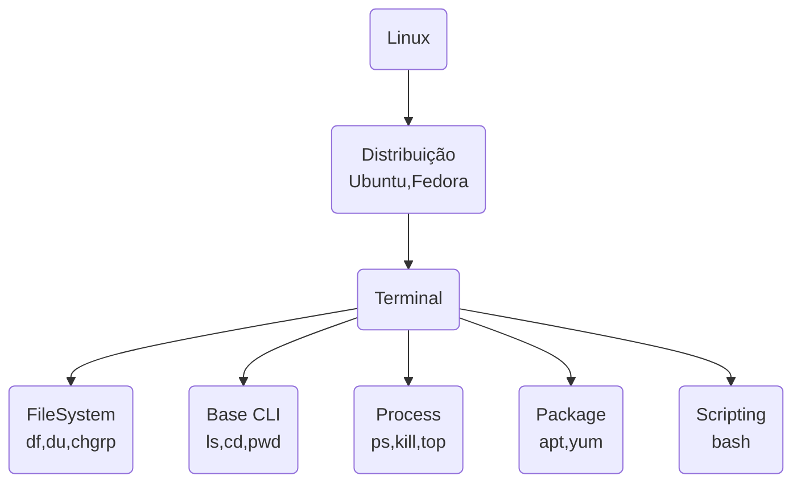
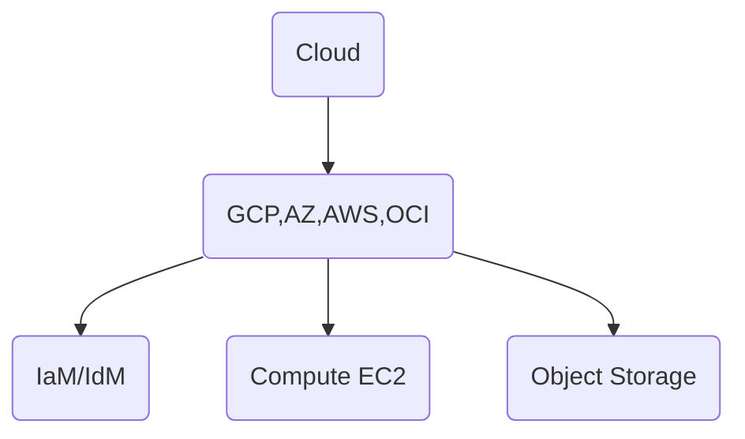
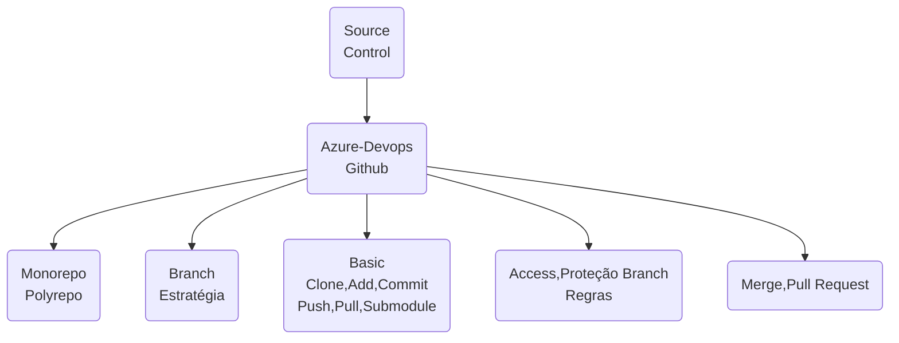
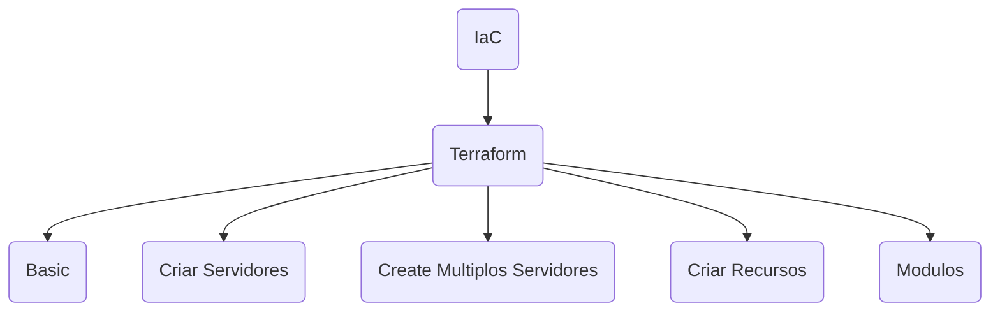
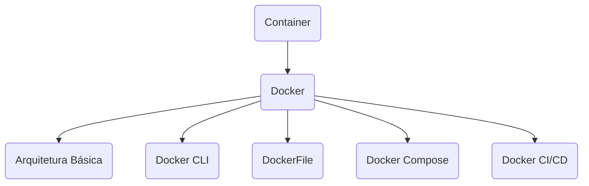
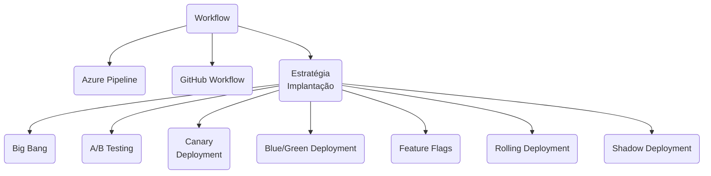
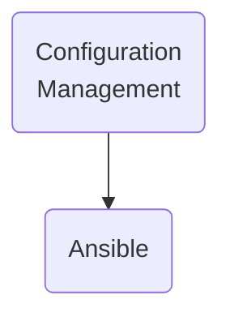
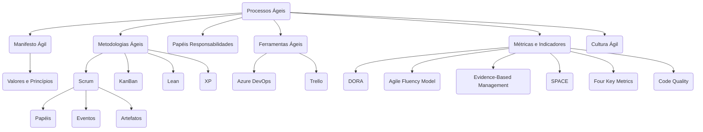
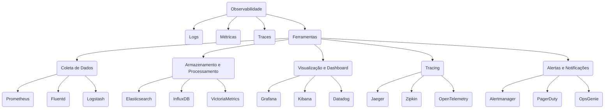
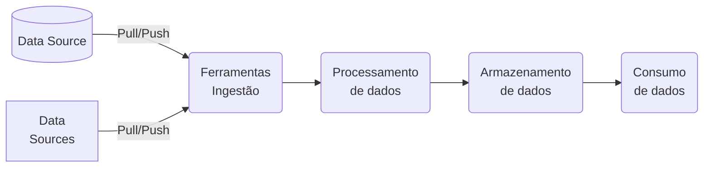

```mermaid
flowchart TD
  id1(Autoaprendizagem) --> id2(Tutoriais)
  id1  --> id3(Certificações)
  id1  --> id4(Projetos)
 ```
```mermaid
flowchart TD
  id1(Profissional</br>Tecnologia</br>da Informação) --> id2(Continuous Learning)
  id2           --> id3(Linux)
  id2           --> id4(Cloud)
  id2           --> id5(Source</br>Control)
  id2           --> id6(IaC)
  id2           --> id7(Container)
  id2           --> id8(Workflow)
  id2           --> id9(Configuration</br>Management)
  id2           --> id10(Processos Ágeis)
  id2           --> id11(Observabilidade)
  id2           --> id12(Documentação)
```
















```mermaid
flowchart TD
```
```mermaid
flowchart TD
```
```mermaid
flowchart TD
```

# Questão 1

- [x] In a GitHub Actions workflow, how can you efficiently reduce duplication of code when the same steps are used across multiple jobs? `Implement a custom action and reference it in each job where the steps are required.`

- [x] When setting up a GitHub Actions workflow, how can you ensure that a job is only executed if a previous job in the workflow has failed? `Use the if: failure() condition combined with the needs keyword, like needs: [previous_job] and if: failure() in the job definition.`

- [x] How should an appropriate distribution model for a GitHub Action be selected? `Based on the intended audience and usage scope, choosing between public, private, or marketplace distribution.`

- [x] When developing a custom Docker-based GitHub Action, what is the recommended method for passing input parameters from the workflow to the Docker container? `Define input parameters in the action's metadata file (action.yml) and access them as environment variables inside the Docker container.`

- [x] In GitHub Actions, how can you ensure that a specific job in a workflow only runs if changes were made to files in either of two different directories? `Create a preliminary job to check for changes in the specified directories and use its output in the if condition of the dependent jobs.`

- [x] What is the best practice for updating self-hosted runners? `Implementing a regular update schedule to ensure runners have the latest features and security patches.`

- [x] What is a key consideration when creating a release strategy for a GitHub Action? `Implement versioning to track changes, facilitate backward compatibility, and manage releases effectively.`

- [x] In a GitHub Actions workflow, how can you share data generated in one job with subsequent jobs in the same workflow? `Use the upload-artifact and download-artifact actions to pass data between jobs.,`

- [x] When authoring a custom GitHub Action to be used across multiple projects within an organization, what is the best practice for handling updates to the action to minimize disruptions in those projects? `Release new versions of the action using version tags, and instruct projects to use specific versions rather than the latest commit on the main branch.`

- [x] In GitHub Actions, what is the correct approach to ensure that a workflow is triggered by a push event only when specific files or directories change? `Use the on: push: paths: ['specific-path/*'] syntax to trigger the workflow only when changes occur in files or directories under 'specific-path'.`

- [x] In GitHub Actions, how can you ensure that a job in a workflow only runs on a specific day of the week, for instance, every Friday? `Use the on: schedule syntax with a cron expression in the workflow file, such as on: schedule: - cron: '0 0 * * 5'.`

- [x] In GitHub Actions, what is the best practice for managing and sharing commonly used environment variables across multiple jobs within a workflow? `Use the env keyword at the workflow level to set common environment variables for all jobs.`

- [x] Which of the following is a best practice for managing and leveraging reusable components in an enterprise setting? `Utilize a dedicated repository for storage and establish clear naming conventions for files and folders.`

- [x] In a GitHub Actions workflow, how can you configure a job to reuse artifacts generated by a previous job in the same workflow? `Implement the uses: actions/download-artifact@v2 step within the job, specifying the name of the artifact produced by the previous job.`

- [x] In a GitHub Actions workflow that is triggered by pull requests affecting any file, how can you configure a job to run only if a specific file has been modified and a preceding job has completed successfully? `Combine the if condition and jobs.<job_id>.if attribute to check the success of a previous job and use a script step with git diff to verify if a specific file was modified`

- [x] When authoring and maintaining workflows in GitHub Actions, which statement is correct regarding the use of jobs.<job_id>.strategy in a workflow file? `Within strategy, the matrix keyword can be used to run tests across multiple versions of a language or operating system.`

- [x] What is a best practice for distributing custom actions in GitHub Actions? `Ensure the action is well-documented, including clear instructions on usage, inputs, and outputs.`

- [x] How are encrypted secrets accessed within GitHub Actions and workflows? `By using the secrets context in the workflow file to reference the secrets.`

- [x] What is a crucial aspect of monitoring self-hosted runners in an enterprise environment? `Regularly checking the status and performance metrics of runners to ensure they operate optimally.`

- [x] In GitHub Actions, how would you correctly configure a workflow to cache dependencies for a Node.js application to improve build times? `Include a step with uses: actions/cache@v2 and configure the path to node_modules, along with an appropriate key based on the package-lock.json file.`

- [x] Which statement accurately describes the difference between GitHub-hosted and self-hosted runners? `GitHub-hosted runners are fully managed by GitHub, offering convenience but less control over the environment.`

- [x] When creating a custom GitHub Action in a public repository, what is the best practice for ensuring the action's code adheres to consistent coding standards and best practices? `Implement a linter in the action's development workflow to automatically check code submissions for adherence to defined coding standards.`

- [x] In the context of consuming workflows in GitHub Actions, how can you trigger a workflow in one repository as a result of an event in a separate repository? `Use the on: repository_dispatch event in the consuming repository, and send a repository dispatch event from the source repository.`

- [x] In GitHub Actions, how should you correctly configure a workflow to trigger only on pull requests targeting the main branch? `Use on: pull_request: branches: [main] to specify that the workflow should only run for pull requests targeting the main branch.`

- [x] What is an essential step when publishing an action to the GitHub Marketplace? `Ensure the action's repository is public and includes a README file with detailed usage instructions.`

- [x] When managing repository-level encrypted secrets, what is an important practice? `Secrets should be scoped to specific environments or branches, limiting access where necessary.`

- [x] Which of the following are effective troubleshooting steps for self-hosted runners? (Choose 2) `Verifying network connectivity and access controls., Reviewing logs for error messages or warnings.`

- [x] In GitHub Actions, how would you configure a workflow to automatically cancel previous runs of the same workflow on the same branch when a new run is triggered? `Use the concurrency keyword with a unique group name that includes the branch name to automatically cancel overlapping runs.`

- [x] In the context of consuming workflows in GitHub Actions, which of the following is a correct method to specify a dependency between jobs? `Use the needs keyword in the job that depends on the completion of another job.`

- [x] When authoring a JavaScript-based custom GitHub Action, what is the recommended approach to manage third-party dependencies that the action requires? `Bundle the dependencies with a tool like Webpack, and commit the bundled file along with your action code to the repository.`

- [x] When developing a custom GitHub Action that interacts with external APIs, what is the best strategy to manage and rotate API keys or tokens to enhance security? `Store the API keys or tokens as encrypted secrets in the GitHub repository and reference them in the action's code.`

- [x] In the context of GitHub Actions, what is the correct use of environment keyword in a workflow file? `environment is utilized to specify the deployment environment, such as production, staging, or development, and can enforce additional rules like manual approvals.`

- [x] For a custom GitHub Action you are developing, which method is most appropriate for debugging issues that occur during the action's execution in a workflow? `Utilize console.log statements in the action's code and review the output in the GitHub Actions workflow logs.`

- [x] How can you trigger a GitHub Actions workflow in Repository B whenever a new release is published in Repository A, assuming both repositories are within the same organization? `Use the repository_dispatch event in Repository B, and trigger it using a webhook from Repository A upon release.`

- [x] What is the most effective approach for distributing actions within an enterprise? `Create a centralized shared repository and utilize GitHub's internal networking features for distribution.`

- [x] In the context of creating a custom GitHub Action, what is the best approach to handle sensitive information, such as API keys or credentials, required by the action? `Advise users to store sensitive information as encrypted secrets in their GitHub repository and pass them as environment variables to the action.`

- [x] How should an organization configure use policies for GitHub Actions to ensure compliance and efficiency? `Define clear guidelines on usage, security, and maintenance, and enforce them through automated checks and balances.`

- [x] Which of the following are best practices for managing encrypted secrets in GitHub Actions? `Use environment-specific secrets to tailor access based on deployment stages., Audit access to secrets and review usage in workflows regularly., Regularly rotate secrets to minimize the risk of exposure.`

- [x] In GitHub Actions, how can you selectively run jobs within a workflow based on the type of event that triggered the workflow? `Employ the if: github.event_name == 'event_type' condition at the start of each job to specify when the job should run based on the event type.`

- [x] In GitHub Actions, how can you configure a workflow to trigger only on pull requests that are opened or reopened, and additionally only when changes are made to files in a specific directory? `Use the on: pull_request trigger with a types field specifying opened and reopened, combined with a paths filter including the specific directory.`

- [x] In the process of authoring a custom GitHub Action, what is the recommended approach to ensure that the action is compatible with both Linux and Windows runners? `Develop the action using JavaScript, which is cross-platform and supported by the GitHub Actions runner environment on both Linux and Windows.`

- [x] You are reviewing a GitHub Actions workflow and encounter an action defined in the workflow file. How can you identify the type of action used (e.g., JavaScript, Docker container, or composite)? `By checking the runs section in the action's action.yml or action.yaml file.`

- [x] In GitHub Actions, you want to consume a workflow from another repository and trigger it whenever a new issue is opened in your repository. How can you achieve this? `Use the on: repository_dispatch event in the target repository's workflow and dispatch an event from your repository when a new issue is opened.`

- [x] What is an essential step when configuring self-hosted runners for enterprise use? `Configure network settings, including proxies and IP allow lists, to ensure secure and efficient operation within the enterprise environment.`

- [x] In GitHub Actions, how can you set up a workflow to trigger at a specific time only if there have been changes in a particular branch since the last successful run of the workflow? `Configure the workflow with the on: schedule trigger and a cron expression, then use a script step to check for changes in the branch since the last run.`

- [x] In GitHub Actions, how do you correctly configure a workflow to only execute a job when a previous job has failed? `Use the needs keyword with if: failure() condition, like needs: job1 and if: failure() in the job definition.`

- [x] Which of the following are benefits of reusing templates for actions and workflows in GitHub Actions? (Choose 2) `Significantly reduces the time required for onboarding new team members., Ensures consistency and best practices across multiple projects.`

- [x] In GitHub Actions, how can you ensure that a specific job in a workflow only runs after two other jobs have successfully completed? `Implement the needs: [job1, job2] keyword in the job definition to establish a dependency on job1 and job2.`

- [x] In GitHub Actions, how can you dynamically generate a matrix for a job to run against multiple configurations, using data from an external JSON file hosted in the same repository? `Implement a custom action that reads the JSON file and outputs the matrix configuration, then use this output in the job's matrix setting.`

- [x] When consuming workflows in GitHub Actions, how can you ensure that a workflow is triggered only when a new release is published in another repository within the same organization? `Configure a repository_dispatch event in the source repository and trigger it manually when a new release is published.`

- [x] When developing a composite run steps action in GitHub Actions, what is the recommended way to include external scripts or code files that the action depends on? `Include the external scripts or code files in the same repository as the action and reference them using relative paths in the runs.steps entries.`

- [x] In GitHub Actions, what is the correct method to reuse workflows stored in a public repository in your organization's private repository? `Reference the public workflow using the uses keyword with the repository's URL and path to the workflow file.`

- [x] In GitHub Actions, what is the recommended approach to manage and use secrets (like API keys or passwords) in a workflow that needs to access an external service? `Use GitHub's encrypted secrets feature to store and access secrets in the workflow.`

- [x] What accurately defines the scope of encrypted secrets in GitHub Actions? `Encrypted secrets can be defined at the repository or organization level, with access limited to specific workflows.`

- [x] When authoring a custom GitHub Action, what is the best practice for managing and versioning the action to ensure stability and ease of maintenance for users? `Create specific releases or tags for stable versions of the action, and advise users to reference these in their workflows.`

- [x] In GitHub Actions, how can you set up a workflow to run on both push and pullrequest events, but ensure specific jobs are executed only for pullrequest events? `Configure the workflow with on: [push, pull_request] and use if: github.event_name == 'pull_request' conditionals on specific jobs.`

- [x] When configuring IP allow lists for GitHub-hosted and self-hosted runners, what is the primary effect? `It restricts which IP addresses can interact with your runners, enhancing security.`

- [x] You have two GitHub repositories: Repository A and Repository B. You want to configure a workflow in Repository A to automatically trigger whenever a new pull request is created in Repository B. What is the best way to set up this integration? `Configure a webhook in Repository B to trigger a repository_dispatch event in Repository A whenever a pull request is created.`

- [x] In GitHub Actions, how can you utilize artifacts generated in one workflow in a separate, subsequent workflow within the same repository? `Use the on: workflow_run trigger in the subsequent workflow and utilize the actions/download-artifact@v2 action to fetch the artifacts`

- [x] In the development of a custom GitHub Action, how should you handle and report errors that occur during the action's execution to ensure users of the action can effectively debug issues? `Implement custom error handling in the action's code that catches and logs detailed error messages, using GitHub's logging commands for enhanced visibility.`

- [x] In a GitHub Actions workflow, how should you securely manage sensitive information like API keys or database credentials? `Use GitHub Secrets and reference them in the workflow file using the ${{ secrets.SECRET_NAME }} syntax.`

- [x] In GitHub Actions, how can you effectively debug a failing job within a workflow? `Insert echo commands in the workflow file to print out variable values and command outputs at various stages.`

- [x] For a custom GitHub Action that requires periodic updates and maintenance, what is the best strategy to inform users about upcoming changes or deprecations that might affect their workflows? `Use the action's code to display warning messages in the workflow logs when deprecated features are used., Update the README file of the action's repository with details about the changes and deprecations.`

- [x] How can you correctly call a reusable workflow in GitHub Actions? `By specifying the workflow's file path in the uses keyword under a job.`

- [x] What is the primary benefit of being able to move self-hosted runners into and between groups? `It allows for flexible resource management and adapts to changing project needs or organizational structures.`

# Questão 2

- [x] What is crucial for the correct syntax of jobs in a GitHub Actions workflow file? `Jobs should be defined under the jobs key with proper indentation to ensure the structure is correctly interpreted.`

- [x] When setting up a GitHub Actions workflow, how can you ensure that a job is only executed if a previous job in the workflow has failed? `Use the if: failure() condition combined with the needs keyword, like needs: [previous_job] and if: failure() in the job definition.`

- [x] In GitHub Actions, what is the best practice for managing and sharing commonly used environment variables across multiple jobs within a workflow? `Use the env keyword at the workflow level to set common environment variables for all jobs.`

- [x] How can workflow artifacts be removed from GitHub after they are no longer needed? `Artifacts can be configured to automatically expire after a certain number of days.`

- [x] How can caching be configured to speed up workflow execution in GitHub Actions? `Use the cache action to store and retrieve dependencies, reducing installation time in subsequent runs.`

- [x] In GitHub Actions, how can you effectively debug a failing job within a workflow? `Insert echo commands in the workflow file to print out variable values and command outputs at various stages.`

- [x] In GitHub Actions, how can you set up a workflow to run on both push and pullrequest events, but ensure specific jobs are executed only for pullrequest events? `Configure the workflow with on: [push, pull_request] and use if: github.event_name == 'pull_request' conditionals on specific jobs.`

- [x] In GitHub Actions, how do you correctly configure a workflow to only execute a job when a previous job has failed? `Use the needs keyword with if: failure() condition, like needs: job1 and if: failure() in the job definition.`

- [x] Which configuration allows a workflow to be triggered by multiple events in GitHub Actions? `Use the on keyword to specify a list of events, like push, pull_request, and schedule.`

- [x] What is the recommended way to pass data between jobs in a GitHub Actions workflow? `Use artifacts to share data between jobs, ensuring the output from one job is available to subsequent jobs.`

- [x] How are database and service containers utilized in a GitHub Actions workflow? `By defining services in the workflow file, allowing jobs to use the containers as part of the runtime environment.`

- [x] What is the purpose of adding a workflow status badge to a repository? `To provide a visual representation of the workflow's status (e.g., passing, failing) on the repository's README or other web pages.`

- [x] Which of the following are true regarding the components and integration of actions, workflows, jobs, steps, runs, and the marketplace in GitHub Actions? `Marketplace is a platform where pre-built actions can be published and used within workflows without custom coding., Conditional keywords can be used in steps to control their execution based on certain conditions. and Workflows are automated processes defined by jobs, which in turn consist of steps that can include actions or shell commands.`

- [x] In GitHub Actions, how can you ensure that a job in a workflow only runs on a specific day of the week, for instance, every Friday? `Use the on: schedule syntax with a cron expression in the workflow file, such as on: schedule: - cron: '0 0 * * 5'.`

- [x] What is the purpose of using conditional keywords in steps within a GitHub Actions workflow? `To control the execution of specific steps based on the outcome of previous steps or the context of the workflow run.`

- [x] Which of the following are advanced configurations in GitHub Actions workflows? `Adding environment protections to ensure workflows run only in safe, approved contexts., Defining a matrix of different job configurations to test across multiple environments. and Removing workflow artifacts after a certain period to manage storage and maintain cleanliness.`

- [x] Which event configuration correctly triggers a workflow in GitHub Actions? `Using the on keyword in the workflow file to specify the type of event, such as push, pull_request, or schedule.`

- [x] You are integrating a new action into your workflow. How can you identify the action's type, required inputs, and expected outputs?`By reading the action's README.md file and the action metadata file (action.yml or action.yaml).`

- [x] How can you correctly call a reusable workflow in GitHub Actions? `By specifying the workflow's file path in the uses keyword under a job.`

- [x] How can you identify a GitHub Action’s type, inputs, and outputs? `By reading the action's action.yml file, which defines the action's interface including its type, required inputs, and outputs.`

- [x] In GitHub Actions, how can you ensure that a specific job in a workflow only runs if changes were made to files in either of two different directories? `Create a preliminary job to check for changes in the specified directories and use its output in the if condition of the dependent jobs.`

- [x] What is the correct syntax for defining custom environment variables in a step of a GitHub Actions workflow? `steps:
  - name: Example step
    run: echo "Hello world"
    env:
      CUSTOM_VAR: "value"`

- [x] What can you understand by reading a GitHub Actions workflow configuration file? `The specific steps and actions that the workflow will execute, along with the events that trigger it.`

- [x] Which of the following statements are correct regarding the use of environment variables in GitHub Actions workflows? `Default environment variables provide predefined context about the workflow run, like the branch name or commit SHA., Custom environment variables can be set at the workflow, job, or step level using the env keyword. and The GITHUB_ENV workflow command can be used to set environment variables for subsequent steps in a job.`

- [x] In GitHub Actions, what is the correct method to reuse workflows stored in a public repository in your organization's private repository? `Reference the public workflow using the uses keyword with the repository's URL and path to the workflow file.`

- [x] You want to ensure stability in your workflows by using a specific version of an action. How can you correctly reference a specific version of an action in your workflow file? `By using the action's name followed by the @ symbol and the version tag or commit SHA (e.g., actions/checkout@v2).`

- [x] What is the difference between disabling and deleting a workflow in GitHub Actions? `Disabling a workflow stops it from being triggered but retains the workflow file in the repository, while deleting a workflow removes the file entirely.`

- [x] In GitHub Actions, how can you configure a workflow to trigger only on pull requests that are opened or reopened, and additionally only when changes are made to files in a specific directory? `Use the on: pull_request trigger with a types field specifying opened and reopened, combined with a paths filter including the specific directory.`

- [x] You are managing GitHub Actions workflows in your organization's repositories. Which of the following practices should you follow? `Use encrypted secrets to store and access sensitive information like API keys and passwords in workflows., Review and integrate updates to actions cautiously, ensuring they do not break existing workflows. and Regularly review and update the actions used in your workflows to ensure they receive security updates and improvements.`

- [x] When implementing a GitHub Actions workflow, how can you conditionally skip a job unless a manual trigger is activated, such as a comment in a pull request? `Use the on: issue_comment trigger combined with a job-level if condition checking the comment content.`

- [x] In a GitHub Actions workflow that is triggered by pull requests affecting any file, how can you configure a job to run only if a specific file has been modified and a preceding job has completed successfully? `Combine the if condition and jobs.<job_id>.if attribute to check the success of a previous job and use a script step with git diff to verify if a specific file was modified`

- [x] How can you identify the event that triggered a GitHub Actions workflow? `By checking the GITHUB_EVENT_NAME environment variable in the workflow run logs.`

- [x] Which method can be used to access the logs of a GitHub Actions workflow run using GitHub’s REST API? `Send a GET request to the appropriate endpoint with the workflow run ID to retrieve the logs.`

- [x] How are encrypted secrets accessed within GitHub Actions and workflows? `By using the secrets context in the workflow file to reference the secrets.`

- [x] You are managing secrets for a specific repository in your organization. What should you consider when creating repository-level encrypted secrets? `Repository-level secrets are best for sensitive data specific to one repository and are not accessible by other repositories.`

- [x] You want to ensure that specific GitHub Actions are only used by authorized personnel within your organization. What's an effective way to achieve this? `Implement role-based access controls and integrate with the organization's identity management system.`

- [x] Your organization has stringent security requirements. What would be the effect of configuring IP allow lists on GitHub-hosted and self-hosted runners? `It restricts network access, allowing only traffic from specified IP addresses to interact with the runners.`

- [x] Your organization wants to ensure that only specific teams have access to certain self-hosted runners. How can you manage access effectively? `Use GitHub's runner management interface to set access permissions for each runner group.`

- [x] Which statement accurately describes the difference between GitHub-hosted and self-hosted runners? `GitHub-hosted runners are fully managed by GitHub, offering convenience but less control over the environment.`

- [x] Your enterprise requires a secure and efficient method to distribute GitHub Actions across multiple teams. What is the best approach? `Create a centralized shared repository for actions and enforce access controls.`

- [x] Which of the following are best practices for managing encrypted secrets in GitHub Actions? `Regularly rotate secrets to minimize the risk of exposure., Use environment-specific secrets to tailor access based on deployment stages. and Audit access to secrets and review usage in workflows regularly.`

- [x] When managing repository-level encrypted secrets, what is an important practice? `Secrets should be scoped to specific environments or branches, limiting access where necessary.`

- [x] Your team wants to standardize CI/CD processes across multiple projects. How can workflow and action templates be reused effectively? `Use a centralized .github repository to store workflow templates and reference them in individual project repositories.`

- [x] What is a key consideration when selecting the appropriate runners to support specific workloads? `Select runners based on workload requirements, such as processing power or specific software dependencies.`

- [x] How are encrypted secrets accessed within GitHub Actions workflows? `By using the secrets context in the workflow file to reference the secrets by name.`

- [x] In an enterprise setting, how should a GitHub Actions workflow be configured to ensure that sensitive data, such as production database credentials, is securely managed and accessed only by authorized workflows? `Store sensitive data as encrypted secrets in GitHub and restrict access to these secrets using GitHub's environment protection rules.`

- [x] What is a key difference between GitHub-hosted and self-hosted runners in GitHub Actions? `GitHub-hosted runners provide a predefined environment, while self-hosted runners offer more control and customization options.`

- [x] You are setting up encrypted secrets for your projects. How does the scope of encrypted secrets differ between organization-level and repository-level in GitHub Actions? `Organization-level secrets can be made available to multiple repositories, while repository-level secrets are accessible only to the repository they are set in.`

- [x] You are responsible for ensuring that GitHub Actions are used securely and appropriately within your enterprise. How can you control access to these actions? `Implement role-based access controls at the organization level and integrate with the enterprise's identity management system.`

- [x] What is a best practice for distributing custom actions in GitHub Actions? `Ensure the action is well-documented, including clear instructions on usage, inputs, and outputs.`

- [x] In the process of building a custom GitHub Action that integrates with a bug tracking system to automatically create issues based on code commits, what approach should be taken to efficiently categorize and prioritize these issues? `Use keywords in commit messages to determine the priority and category of issues, and configure the action to parse these keywords.`

- [x] When creating a custom GitHub Action that integrates with third-party services, what approach should be adopted to handle service outages or downtime to ensure minimal impact on workflow execution? `Implement retry logic in the action to attempt reconnection to the third-party service a set number of times before failing., Provide users with the option to skip steps dependent on the third-party service during outages, through input parameters in the action.`

- [x] When developing a custom GitHub Action for code analysis and linting, how can you best ensure that the action remains up-to-date with the latest coding standards and practices in a rapidly evolving programming language ecosystem? `Integrate the action with a popular, actively maintained linting tool or library, automatically updating to the latest version on each run. AND Allow users to specify their own set of rules or link to an external ruleset in their workflow configuration.`

- [x] A GitHub Actions workflow fails during a step that executes a JavaScript action. The logs indicate a problem with a missing package. What is the most appropriate action to resolve this issue? `Modify the JavaScript action to include a step for installing the missing package.`

- [x] When creating a custom GitHub Action in a public repository, what is the best practice for ensuring the action's code adheres to consistent coding standards and best practices? `Implement a linter in the action's development workflow to automatically check code submissions for adherence to defined coding standards.`

- [x] In the development of a custom GitHub Action, what is the most effective way to handle different runtime environments (e.g., production, staging, development) within the action's logic? `Include environment-specific parameters as inputs in the action's action.yml file, allowing users to specify the environment during workflow configuration. and Utilize GitHub's environment secrets and have the action dynamically adjust its behavior based on these secrets.`

- [x] What is an essential step when publishing an action to the GitHub Marketplace? `Ensure the action's repository is public and includes a README file with detailed usage instructions.`

- [x] What is a key consideration when creating a release strategy for a GitHub Action? `Implement versioning to track changes, facilitate backward compatibility, and manage releases effectively.`

- [x] A GitHub Actions workflow consistently fails at a step utilizing a JavaScript action with an error message indicating an issue with the node version. What is the most appropriate way to address this issue? `Add a step to update the node version in the runner environment before executing the JavaScript action.`

- [x] When authoring a custom GitHub Action that integrates with an external API, how should you handle potential API rate limits to prevent disruptions in user workflows? `Provide an option for users to input their own API keys, allowing them to manage their rate limits independently. AND Implement logic in the action to detect rate limit errors and automatically retry the request after a sensible delay.`

- [x] When managing and publishing GitHub Actions, which of the following practices are recommended? `Regularly update and maintain your actions, ensuring they are compatible with the latest GitHub features and security standards. and Use clear and descriptive naming conventions for your actions and repositories. AND Provide comprehensive documentation, including usage instructions, input and output descriptions, and example workflows.`

- [x] When developing a custom GitHub Action that involves complex computational tasks, what is the best approach to optimize performance and reduce execution time? `Offload the computational tasks to an external server or cloud service, and have the action interact with that service. and Implement caching mechanisms in the action to store and reuse computational results where possible.`

- [x] You've developed a custom GitHub Action for automating deployments. Your action is likely to be beneficial to other projects outside your organization. How should you distribute your action? `Publish the action to the GitHub Marketplace to make it publicly available.`

- [x] In creating a custom GitHub Action to enforce coding standards across multiple projects within an organization, what strategy should be employed to allow for project-specific customizations while maintaining a common set of standards? `Create a base action with common standards and allow projects to extend or override these standards through a configuration file in each project's repository.`

- [x] You are creating a new GitHub Action. What is the necessary file and directory structure you should set up? `A directory at the root of the repository containing a Dockerfile or a JavaScript file, and an action.yml file.`





https://docs.edgeimpulse.com/docs/tutorials/lifecycle-management/gitactions-docker
https://davecross.substack.com/p/github-actions-essentials-is-published?utm_campaign=post&utm_medium=web

https://docs.openedx.org/en/latest/developers/references/developer_guide/testing/github-actions.html
https://medium.com/@ravipatel.it/key-concepts-of-github-actions-a-guide-from-beginner-to-advanced-abb95c59e0f4
https://davecross.substack.com/p/github-actions-essentials-is-published?utm_campaign=post&utm_medium=web

https://docs.openedx.org/en/latest/developers/references/developer_guide/testing/github-actions.html


https://docs.github.com/pt/actions/about-github-actions/understanding-github-actions
https://docs.github.com/pt/actions/writing-workflows/quickstart

https://docs.github.com/en/actions/guides

https://docs.github.com/en/actions/writing-workflows/workflow-syntax-for-github-actions
