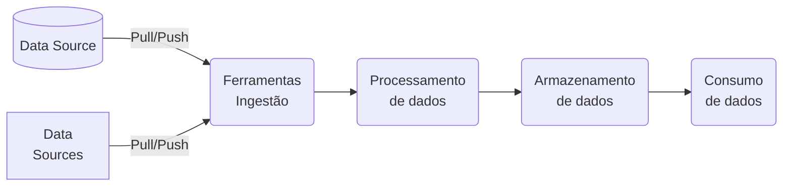

- [x] A developer notices that a specific action in their workflow is consistently failing. Upon inspecting the workflow configuration file, they find that the action is supposed to trigger every time a pull request is labeled 'urgent'. However, the action fails to trigger even when the label is correctly applied. What is the most likely reason for this issue? `The event trigger in the workflow file is incorrectly configured.`
- [x] A GitHub Actions workflow consistently fails at a step utilizing a JavaScript action with an error message indicating an issue with the node version. What is the most appropriate way to address this issue? `Add a step to update the node version in the runner environment before executing the JavaScript action.`
- [x] A GitHub Actions workflow consistently fails at a step utilizing a JavaScript action with an error message indicating an issue with the node version. What is the most appropriate way to address this issue? `Add a step to update the node version in the runner environment before executing the JavaScript action.`
- [x] A GitHub Actions workflow fails during a step that executes a JavaScript action. The logs indicate a problem with a missing package. What is the most appropriate action to resolve this issue? `Modify the JavaScript action to include a step for installing the missing package.`
- [x] A GitHub Actions workflow fails during a step that executes a JavaScript action. The logs indicate a problem with a missing package. What is the most appropriate action to resolve this issue? `Modify the JavaScript action to include a step for installing the missing package.`
- [x] A workflow run has failed, and you need to diagnose the issue. Which of the following is the first step you should take? `Review the logs of the failed run in the Actions tab of the GitHub repository.`
- [x] As a DevOps engineer, you're tasked with managing reusable components for your organization's workflows. What approach should you take? `Store reusable components in a centralized repository, establish clear naming conventions, and create a maintenance plan.`
- [x] As a GitHub Actions administrator, which of the following practices should be included in your organizational use policies for GitHub Actions? `Regularly audit and review actions to ensure compliance with security standards and organizational policies. AND Define clear guidelines for creating, using, and sharing GitHub Actions within the organization AND Establish a process for regular updates and maintenance of shared actions to address vulnerabilities and improve performance.`
- [x] As a GitHub organization administrator, you want to make a secret available to multiple repositories. What is the correct approach? `Create an organization-level secret and select the repositories that should have access to it.`
- [x] As the lead of a DevOps team, you're tasked with managing reusable components for workflows. What approach should you adopt? `Create a dedicated repository for reusable components, establish clear naming conventions, and document maintenance procedures.`
- [x] Consider you are managing workflows in a GitHub repository. Which of the following actions are correct in the context of GitHub Actions? `Custom environment variables can be defined at the workflow, job, or step level for flexibility. AND Use the GITHUB_TOKEN secret to authenticate and perform actions with the GitHub API within a workflow. AND To view a history of all workflow runs, go to the Actions tab of the repository.`
- [x] During the execution of a Docker container action in a GitHub Actions workflow, you receive an error related to environment variables not being passed correctly. Which of the following steps is most likely to resolve the issue? `Add the missing environment variables to the workflow's env section.`
- [x] For a custom GitHub Action designed to deploy applications to multiple cloud platforms, what is the most effective method to manage and configure platform-specific deployment settings? `Utilize a configuration file in the user's repository to define platform-specific settings, which the action reads and applies during deployment. AND Require users to store platform-specific settings as encrypted secrets in their GitHub repository and reference these in the action.`
- [x] For a custom GitHub Action that requires periodic updates and maintenance, what is the best strategy to inform users about upcoming changes or deprecations that might affect their workflows? `Use the action's code to display warning messages in the workflow logs when deprecated features are used., Update the README file of the action's repository with details about the changes and deprecations.`
- [x] For a custom GitHub Action you are developing, which method is most appropriate for debugging issues that occur during the action's execution in a workflow? `Utilize console.log statements in the action's code and review the output in the GitHub Actions workflow logs.`
- [x] For a GitHub Action that requires frequent updates due to changes in external dependencies, what strategy should be employed to test and validate the action's functionality before releasing updates to ensure minimal impact on users? `Set up an automated testing suite that runs tests against a variety of scenarios whenever changes are made, using GitHub Actions' own CI/CD capabilities.`
- [x] How are database and service containers utilized in a GitHub Actions workflow? `By defining services in the workflow file, allowing jobs to use the containers as part of the runtime environment.`
- [x] How are database and service containers utilized in a GitHub Actions workflow? `By defining services in the workflow file, allowing jobs to use the containers as part of the runtime environment.`
- [x] How are dependent jobs implemented in a GitHub Actions workflow? `By using the needs keyword to specify job dependencies, ensuring that certain jobs run only after their dependencies have completed successfully.`
- [x] How are dependent jobs implemented in a GitHub Actions workflow? `By using the needs keyword to specify job dependencies, ensuring that jobs run in the correct order.`
- [x] How are encrypted secrets accessed within GitHub Actions and workflows? `By using the secrets context in the workflow file to reference the secrets.`
- [x] How are encrypted secrets accessed within GitHub Actions and workflows? `By using the secrets context in the workflow file to reference the secrets.`
- [x] How are encrypted secrets accessed within GitHub Actions workflows? `By using the secrets context in the workflow file to reference the secrets by name.`
- [x] How are encrypted secrets accessed within GitHub Actions workflows? `By using the secrets context in the workflow file to reference the secrets by name.`
- [x] How can a custom script be integrated into a GitHub Actions workflow? `By using the run keyword in a step within a job to execute the script.`
- [x] How can a script be incorporated into a GitHub Actions workflow? `By using the run keyword in a step to execute shell commands or scripts.`
- [x] How can a workflow status badge be added to a repository's README file? `Use the markdown code provided in the Actions tab of the repository to embed the status badge.`
- [x] How can caching be configured to speed up workflow execution in GitHub Actions? `Use the cache action to store and retrieve dependencies, reducing installation time in subsequent runs.`
- [x] How can caching be configured to speed up workflow execution in GitHub Actions? `Use the cache action to store and retrieve dependencies, reducing installation time in subsequent runs.`
- [x] How can data be passed between jobs in a GitHub Actions workflow? `By using artifacts to share data between jobs in a workflow.`
- [x] How can workflow artifacts be removed from GitHub after they are no longer needed? `Artifacts can be configured to automatically expire after a certain number of days.`
- [x] How can workflow artifacts be removed from GitHub after they are no longer needed? `Artifacts can be configured to automatically expire after a certain number of days.`
- [x] How can you access encrypted secrets within a GitHub Actions workflow? `Use the secrets context to access the secrets within your workflow file.`
- [x] How can you correctly call a reusable workflow in GitHub Actions? `By specifying the workflow's file path in the uses keyword under a job.`
- [x] How can you correctly call a reusable workflow in GitHub Actions? `By specifying the workflow's file path in the uses keyword under a job.`
- [x] How can you download workflow artifacts from the GitHub Actions user interface? `Navigate to the Actions tab, select the specific workflow run, and download the artifacts from the Artifacts section at the bottom of the page.`
- [x] How can you enable step debug logging in a GitHub Actions workflow? `By setting the ACTIONS_STEP_DEBUG secret to true in the repository settings.`
- [x] How can you identify a GitHub Action's type, inputs, and outputs? `By reading the action's action.yml file, which defines the action's interface including its type, required inputs, and outputs.`
- [x] How can you identify a GitHub Action's type, inputs, and outputs? `By reading the action's action.yml file, which defines the action's interface including its type, required inputs, and outputs.`
- [x] How can you identify the event that triggered a GitHub Actions workflow? `By checking the GITHUB_EVENT_NAME environment variable in the workflow run logs.`
- [x] How can you identify the event that triggered a GitHub Actions workflow? `By checking the GITHUB_EVENT_NAME environment variable in the workflow run logs.`
- [x] How can you trigger a GitHub Actions workflow in Repository B whenever a new release is published in Repository A, assuming both repositories are within the same organization? `Use the repository_dispatch event in Repository B, and trigger it using a webhook from Repository A upon release.`
- [x] How can you use an organization's templated workflow in a repository? `By selecting the template from the repository's Actions tab and then customizing it as needed.`
- [x] How do you ensure a workflow uses a specific version of a GitHub Action? `By referencing the action in the workflow file with a version tag or commit SHA after the action's name (e.g., actions/checkout@v4).`
- [x] How should an appropriate distribution model for a GitHub Action be selected? `Based on the intended audience and usage scope, choosing between public, private, or marketplace distribution.`
- [x] How should an organization configure use policies for GitHub Actions to ensure compliance and efficiency? `Define clear guidelines on usage, security, and maintenance, and enforce them through automated checks and balances.`
- [x] If you're navigating a GitHub repository for the first time, where would you typically find the GitHub Actions workflow files? `In the .github/workflows directory at the root of the repository.`
- [x] In a GitHub Actions workflow that is triggered by pull requests affecting any file, how can you configure a job to run only if a specific file has been modified and a preceding job has completed successfully? `Combine the if condition and jobs.<job_id>.if attribute to check the success of a previous job and use a script step with git diff to verify if a specific file was modified`
- [x] In a GitHub Actions workflow that is triggered by pull requests affecting any file, how can you configure a job to run only if a specific file has been modified and a preceding job has completed successfully? `Combine the if condition and jobs.<job_id>.if attribute to check the success of a previous job and use a script step with git diff to verify if a specific file was modified`
- [x] In a GitHub Actions workflow, how can you configure a job to reuse artifacts generated by a previous job in the same workflow? `Implement the uses: actions/download-artifact@v2 step within the job, specifying the name of the artifact produced by the previous job.`
- [x] In a GitHub Actions workflow, how can you efficiently reduce duplication of code when the same steps are used across multiple jobs? `Implement a custom action and reference it in each job where the steps are required.`
- [x] In a GitHub Actions workflow, how can you share data generated in one job with subsequent jobs in the same workflow? `Use the upload-artifact and download-artifact actions to pass data between jobs.,`
- [x] In a GitHub Actions workflow, how should you handle exit codes from a script to ensure correct workflow behavior? `Use the if conditional in the workflow file to check for specific exit codes and handle them accordingly.`
- [x] In a GitHub Actions workflow, how should you securely manage sensitive information like API keys or database credentials? `Use GitHub Secrets and reference them in the workflow file using the ${{ secrets.SECRET_NAME }} syntax.`
- [x] In an enterprise environment, what is the best practice for monitoring and analyzing the usage and performance of GitHub Actions across multiple repositories and teams? `Implement a centralized logging and monitoring system that aggregates data from all GitHub Actions workflows`
- [x] In an enterprise setting, how should a GitHub Actions workflow be configured to ensure that sensitive data, such as production database credentials, is securely managed and accessed only by authorized workflows? `Store sensitive data as encrypted secrets in GitHub and restrict access to these secrets using GitHub's environment protection rules.`
- [x] In an enterprise setting, how should a GitHub Actions workflow be configured to ensure that sensitive data, such as production database credentials, is securely managed and accessed only by authorized workflows? `Store sensitive data as encrypted secrets in GitHub and restrict access to these secrets using GitHub's environment protection rules`
- [x] In creating a custom GitHub Action to enforce coding standards across multiple projects within an organization, what strategy should be employed to allow for project-specific customizations while maintaining a common set of standards? `Create a base action with common standards and allow projects to extend or override these standards through a configuration file in each project's repository.`
- [x] In creating a custom GitHub Action to enforce coding standards across multiple projects within an organization, what strategy should be employed to allow for project-specific customizations while maintaining a common set of standards? `Create a base action with common standards and allow projects to extend or override these standards through a configuration file in each project's repository`
- [x] In developing a custom GitHub Action that generates and publishes reports, how should the action be designed to handle large report files to ensure efficient performance and resource usage? `Store the report files externally and provide download links in the action's output., Compress the report files within the action before publishing to minimize file size.`
- [x] In developing a custom GitHub Action to integrate with a project management tool for automated task creation, how should the action be designed to customize task attributes based on different types of events in a GitHub repository? `Allow users to define mappings between GitHub events and task attributes in a configuration file within their repository.`
- [x] In GitHub Actions, how can you configure a workflow to trigger only on pull requests that are opened or reopened, and additionally only when changes are made to files in a specific directory? `Use the on: pull_request trigger with a types field specifying opened and reopened, combined with a paths filter including the specific directory.`
- [x] In GitHub Actions, how can you configure a workflow to trigger only on pull requests that are opened or reopened, and additionally only when changes are made to files in a specific directory? `Use the on: pull_request trigger with a types field specifying opened and reopened, combined with a paths filter including the specific directory.`
- [x] In GitHub Actions, how can you dynamically generate a matrix for a job to run against multiple configurations, using data from an external JSON file hosted in the same repository? `Implement a custom action that reads the JSON file and outputs the matrix configuration, then use this output in the job's matrix setting.`
- [x] In GitHub Actions, how can you effectively debug a failing job within a workflow? `Insert echo commands in the workflow file to print out variable values and command outputs at various stages.`
- [x] In GitHub Actions, how can you effectively debug a failing job within a workflow? `Insert echo commands in the workflow file to print out variable values and command outputs at various stages.`
- [x] In GitHub Actions, how can you ensure that a job in a workflow only runs on a specific day of the week, for instance, every Friday? `Use the on: schedule syntax with a cron expression in the workflow file, such as on: schedule: - cron: '0 0 * * 5'.`
- [x] In GitHub Actions, how can you ensure that a job in a workflow only runs on a specific day of the week, for instance, every Friday? `Use the on: schedule syntax with a cron expression in the workflow file, such as on: schedule: - cron: '0 0 * * 5'.`
- [x] In GitHub Actions, how can you ensure that a specific job in a workflow only runs after two other jobs have successfully completed? `Implement the needs: [job1, job2] keyword in the job definition to establish a dependency on job1 and job2.`
- [x] In GitHub Actions, how can you ensure that a specific job in a workflow only runs if changes were made to files in either of two different directories? `Create a preliminary job to check for changes in the specified directories and use its output in the if condition of the dependent jobs.`
- [x] In GitHub Actions, how can you ensure that a specific job in a workflow only runs if changes were made to files in either of two different directories? `Create a preliminary job to check for changes in the specified directories and use its output in the if condition of the dependent jobs.`
- [x] In GitHub Actions, how can you selectively run jobs within a workflow based on the type of event that triggered the workflow? `Employ the if: github.event_name == 'event_type' condition at the start of each job to specify when the job should run based on the event type.`
- [x] In GitHub Actions, how can you set up a workflow to run on both push and pullrequest events, but ensure specific jobs are executed only for pullrequest events? `Configure the workflow with on: [push, pull_request] and use if: github.event_name == 'pull_request' conditionals on specific jobs.`
- [x] In GitHub Actions, how can you set up a workflow to run on both push and pullrequest events, but ensure specific jobs are executed only for pullrequest events? `Configure the workflow with on: [push, pull_request] and use if: github.event_name == 'pull_request' conditionals on specific jobs.`
- [x] In GitHub Actions, how can you set up a workflow to trigger at a specific time only if there have been changes in a particular branch since the last successful run of the workflow? `Configure the workflow with the on: schedule trigger and a cron expression, then use a script step to check for changes in the branch since the last run.`
- [x] In GitHub Actions, how can you utilize artifacts generated in one workflow in a separate, subsequent workflow within the same repository? `Use the on: workflow_run trigger in the subsequent workflow and utilize the actions/download-artifact@v2 action to fetch the artifacts`
- [x] In GitHub Actions, how do you correctly configure a workflow to only execute a job when a previous job has failed? `Use the needs keyword with if: failure() condition, like needs: job1 and if: failure() in the job definition.`
- [x] In GitHub Actions, how do you correctly configure a workflow to only execute a job when a previous job has failed? `Use the needs keyword with if: failure() condition, like needs: job1 and if: failure() in the job definition.`
- [x] In GitHub Actions, how should you correctly configure a workflow to trigger only on pull requests targeting the main branch? `Use on: pull_request: branches: [main] to specify that the workflow should only run for pull requests targeting the main branch.`
- [x] In GitHub Actions, how would you configure a workflow to automatically cancel previous runs of the same workflow on the same branch when a new run is triggered? `Use the concurrency keyword with a unique group name that includes the branch name to automatically cancel overlapping runs.`
- [x] In GitHub Actions, how would you correctly configure a workflow to cache dependencies for a Node.js application to improve build times? `Include a step with uses: actions/cache@v2 and configure the path to node_modules, along with an appropriate key based on the package-lock.json file.`
- [x] In GitHub Actions, what is the best practice for managing and sharing commonly used environment variables across multiple jobs within a workflow? `Use the env keyword at the workflow level to set common environment variables for all jobs.`
- [x] In GitHub Actions, what is the best practice for managing and sharing commonly used environment variables across multiple jobs within a workflow? `Use the env keyword at the workflow level to set common environment variables for all jobs.`
- [x] In GitHub Actions, what is the correct approach to ensure that a workflow is triggered by a push event only when specific files or directories change? `Use the on: push: paths: ['specific-path/*'] syntax to trigger the workflow only when changes occur in files or directories under 'specific-path'.`
- [x] In GitHub Actions, what is the correct method to reuse workflows stored in a public repository in your organization's private repository? `Reference the public workflow using the uses keyword with the repository's URL and path to the workflow file.`
- [x] In GitHub Actions, what is the correct method to reuse workflows stored in a public repository in your organization's private repository? `Reference the public workflow using the uses keyword with the repository's URL and path to the workflow file.`
- [x] In GitHub Actions, what is the recommended approach to manage and use secrets (like API keys or passwords) in a workflow that needs to access an external service? `Use GitHub's encrypted secrets feature to store and access secrets in the workflow.`
- [x] In GitHub Actions, you want to consume a workflow from another repository and trigger it whenever a new issue is opened in your repository. How can you achieve this? `Use the on: repository_dispatch event in the target repository's workflow and dispatch an event from your repository when a new issue is opened.`
- [x] In the context of consuming workflows in GitHub Actions, how can you trigger a workflow in one repository as a result of an event in a separate repository? `Use the on: repository_dispatch event in the consuming repository, and send a repository dispatch event from the source repository.`
- [x] In the context of consuming workflows in GitHub Actions, which of the following is a correct method to specify a dependency between jobs? `Use the needs keyword in the job that depends on the completion of another job.`
- [x] In the context of creating a custom GitHub Action, what is the best approach to handle sensitive information, such as API keys or credentials, required by the action? `Advise users to store sensitive information as encrypted secrets in their GitHub repository and pass them as environment variables to the action.`
- [x] In the context of GitHub Actions, what is the correct use of environment keyword in a workflow file? `environment is utilized to specify the deployment environment, such as production, staging, or development, and can enforce additional rules like manual approvals.`
- [x] In the development of a custom GitHub Action, how should you handle and report errors that occur during the action's execution to ensure users of the action can effectively debug issues? `Implement custom error handling in the action's code that catches and logs detailed error messages, using GitHub's logging commands for enhanced visibility.`
- [x] In the development of a custom GitHub Action, what is the most effective way to handle different runtime environments (e.g., production, staging, development) within the action's logic? `Include environment-specific parameters as inputs in the action's action.yml file, allowing users to specify the environment during workflow configuration. and Utilize GitHub's environment secrets and have the action dynamically adjust its behavior based on these secrets.`
- [x] In the development of a custom GitHub Action, what is the most effective way to handle different runtime environments (e.g., production, staging, development) within the action's logic? `Utilize GitHub's environment secrets and have the action dynamically adjust its behavior based on these secrets. e Include environment-specific parameters as inputs in the action's action.yml file, allowing users to specify the environment during workflow configuration.`
- [x] In the process of authoring a custom GitHub Action, what is the recommended approach to ensure that the action is compatible with both Linux and Windows runners? `Develop the action using JavaScript, which is cross-platform and supported by the GitHub Actions runner environment on both Linux and Windows.`
- [x] In the process of building a custom GitHub Action that integrates with a bug tracking system to automatically create issues based on code commits, what approach should be taken to efficiently categorize and prioritize these issues? `Use keywords in commit messages to determine the priority and category of issues, and configure the action to parse these keywords.`
- [x] In the process of building a custom GitHub Action that integrates with a bug tracking system to automatically create issues based on code commits, what approach should be taken to efficiently categorize and prioritize these issues? `Use keywords in commit messages to determine the priority and category of issues, and configure the action to parse these keywords.`
- [x] In the process of creating a custom GitHub Action, what is the best practice for ensuring that the action remains maintainable and easy to update as GitHub Actions evolves and new features are released? `Subscribe to GitHub's changelog and update the action only when necessary to maintain compatibility with the GitHub Actions platform. e Build the action with modular components, allowing for easy updates and integration of new features without major refactoring.`
- [x] In which scenario is it appropriate to use the GITHUB_TOKEN secret in a GitHub Actions workflow? `When the workflow needs to interact with the GitHub API to perform actions like committing code, creating releases, or managing issues and pull requests.`
- [x] It's possible to distribute actions and workflows to multiple repositories within an enterprise by storing them in a centralized .github repository and referencing them as needed. `Yes`
- [x] What accurately defines the scope of encrypted secrets in GitHub Actions? `Encrypted secrets can be defined at the repository or organization level, with access limited to specific workflows.`
- [x] What are indicators that a GitHub Action is trustworthy? `The action is published by a known organization, has a significant number of stars, and thorough documentation.`
- [x] What can you understand by reading a GitHub Actions workflow configuration file? `The specific steps and actions that the workflow will execute, along with the events that trigger it.`
- [x] What can you understand by reading a GitHub Actions workflow configuration file? `The specific steps and actions that the workflow will execute, along with the events that trigger it.`
- [x] What impact does configuring IP allow lists have on GitHub-hosted and self-hosted runners? `It restricts runner access to only those IP addresses specified in the allow list, enhancing security.`
- [x] What is a best practice for distributing custom actions in GitHub Actions? `Ensure the action is well-documented, including clear instructions on usage, inputs, and outputs.`
- [x] What is a best practice for distributing custom actions in GitHub Actions? `Ensure the action is well-documented, including clear instructions on usage, inputs, and outputs.`
- [x] What is a best practice for maintaining self-hosted runners in GitHub Actions? `Regularly update the runners' software and monitor their performance and logs`
- [x] What is a best practice for managing encrypted secrets at the repository level in GitHub Actions? `Use the repository settings to add encrypted secrets that are specific to the repository.`
- [x] What is a crucial aspect of monitoring self-hosted runners in an enterprise environment? `Regularly checking the status and performance metrics of runners to ensure they operate optimally.`
- [x] What is a crucial step when configuring a workflow to publish an image to the GitHub Container Registry? `Authenticating with the GitHub Container Registry and pushing the image using appropriate commands within a workflow run`
- [x] What is a key consideration when creating a release strategy for a GitHub Action? `Implement versioning to track changes, facilitate backward compatibility, and manage releases effectively.`
- [x] What is a key consideration when creating a release strategy for a GitHub Action? `Implement versioning to track changes, facilitate backward compatibility, and manage releases effectively.`
- [x] What is a key consideration when selecting the appropriate runners to support specific workloads? `Select runners based on workload requirements, such as processing power or specific software dependencies.`
- [x] What is a key difference between GitHub-hosted and self-hosted runners in GitHub Actions? `GitHub-hosted runners provide a predefined environment, while self-hosted runners offer more control and customization options.`
- [x] What is a key difference between GitHub-hosted and self-hosted runners in GitHub Actions? `GitHub-hosted runners provide a predefined environment, while self-hosted runners offer more control and customization options.`
- [x] What is a key step when publishing to GitHub Packages using a GitHub Actions workflow? `Configure the workflow to authenticate with GitHub Packages and push the package using the appropriate command.`
- [x] What is a necessary step when configuring a GitHub Actions workflow to deploy a release to a cloud provider? `Configure the workflow to authenticate with the cloud provider and use the provider's deployment tools or CLI within the workflow steps.`
- [x] What is a primary method for diagnosing a failed GitHub Actions workflow run? `Checking the workflow run history and logs to identify error messages and the steps where the failure occurred.`
- [x] What is an essential aspect of defining the syntax for jobs in a GitHub Actions workflow file? `Jobs should be defined with correct indentation and encapsulated within the jobs keyword.`
- [x] What is an essential step when configuring self-hosted runners for enterprise use? `Configure network settings, including proxies and IP allow lists, to ensure secure and efficient operation within the enterprise environment.`
- [x] What is an essential step when publishing an action to the GitHub Marketplace? `Ensure the action's repository is public and includes a README file with detailed usage instructions.`
- [x] What is an essential step when publishing an action to the GitHub Marketplace? `Ensure the action's repository is public and includes a README file with detailed usage instructions.`
- [x] What is crucial for the correct syntax of jobs in a GitHub Actions workflow file? `Jobs should be defined under the jobs key with proper indentation to ensure the structure is correctly interpreted.`
- [x] What is crucial for the correct syntax of jobs in a GitHub Actions workflow file? `Jobs should be defined under the jobs key with proper indentation to ensure the structure is correctly interpreted.`
- [x] What is crucial to include in the action.yml file when defining a new GitHub Action? `The name, description, inputs, outputs, and runs steps for the action.`
- [x] What is essential for correctly defining the syntax of jobs in a GitHub Actions workflow file? `Jobs should be defined under the jobs key, with proper indentation and structure to ensure correct parsing and execution.`
- [x] What is the best practice for updating self-hosted runners? `Implementing a regular update schedule to ensure runners have the latest features and security patches.`
- [x] What is the correct syntax for defining custom environment variables in a step of a GitHub Actions workflow? `steps: - name: Example step     run: echo "Hello world" env:      CUSTOM_VAR: "value"`
- [x] What is the correct syntax for defining custom environment variables in a step of a GitHub Actions workflow? `steps:- name: Example step run: echo "Hello world" env:CUSTOM_VAR: "value"`
- [x] What is the difference between disabling and deleting a workflow in GitHub Actions? `Disabling a workflow stops it from being triggered but retains the workflow file in the repository, while deleting a workflow removes the file entirely.`
- [x] What is the difference between disabling and deleting a workflow in GitHub Actions? `Disabling a workflow stops it from being triggered but retains the workflow file in the repository, while deleting a workflow removes the file entirely.`
- [x] What is the most effective approach for distributing actions within an enterprise? `Create a centralized shared repository and utilize GitHub's internal networking features for distribution.`
- [x] What is the primary benefit of being able to move self-hosted runners into and between groups? `It allows for flexible resource management and adapts to changing project needs or organizational structures.`
- [x] What is the primary benefit of configuring caching for workflow dependencies in GitHub Actions? `To speed up workflow execution by reusing previously downloaded or built dependencies.`
- [x] What is the primary purpose of using CodeQL in a GitHub Actions workflow? `To automatically analyze the codebase for vulnerabilities and code quality issues as part of the CI/CD process.`
- [x] What is the purpose of adding a workflow status badge to a repository? `To provide a visual representation of the workflow's status (e.g., passing, failing) on the repository's README or other web pages.`
- [x] What is the purpose of adding a workflow status badge to a repository? `To provide a visual representation of the workflow's status (e.g., passing, failing) on the repository's README or other web pages.`
- [x] What is the purpose of using conditional keywords in steps within a GitHub Actions workflow? `To control the execution of specific steps based on the outcome of previous steps or the context of the workflow run.`
- [x] What is the purpose of using conditional keywords in steps within a GitHub Actions workflow? `To control the execution of specific steps based on the outcome of previous steps or the context of the workflow run`
- [x] What is the purpose of using conditional keywords in steps within a GitHub Actions workflow? `To run steps only if certain conditions are met, adding flexibility and control to the workflow.`
- [x] What is the recommended way to pass data between jobs in a GitHub Actions workflow? `Use artifacts to share data between jobs, ensuring the output from one job is available to subsequent jobs.`
- [x] What is the recommended way to pass data between jobs in a GitHub Actions workflow? `Use artifacts to share data between jobs, ensuring the output from one job is available to subsequent jobs.`
- [x] What is the role of approval gates in GitHub Actions workflows? `To introduce manual approval steps in the workflow, allowing stakeholders to review and approve changes before they proceed.`
- [x] What is the role of CodeQL when used as a step in a GitHub Actions workflow? `To automatically analyze the codebase for vulnerabilities and code quality issues.`
- [x] What is the role of implementing workflow commands as a run step in a GitHub Actions workflow? `To communicate with the runner, setting environment variables or altering the workflow behavior.`
- [x] What should be considered when configuring self-hosted runners for enterprise use? `Configure networking, proxies, and labels appropriately to adhere to enterprise policies and infrastructure.`
- [x] When assessing the trustworthiness of a GitHub Action, what should you look for? `The action has positive reviews, is maintained actively, and the source code is publicly available for review.`
- [x] When authoring a custom GitHub Action that integrates with an external API, how should you handle potential API rate limits to prevent disruptions in user workflows? `Implement logic in the action to detect rate limit errors and automatically retry the request after a sensible delay AND Provide an option for users to input their own API keys, allowing them to manage their rate limits independently.`
- [x] When authoring a custom GitHub Action that integrates with an external API, how should you handle potential API rate limits to prevent disruptions in user workflows? `Provide an option for users to input their own API keys, allowing them to manage their rate limits independently. AND Implement logic in the action to detect rate limit errors and automatically retry the request after a sensible delay.`
- [x] When authoring a custom GitHub Action to be used across multiple projects within an organization, what is the best practice for handling updates to the action to minimize disruptions in those projects? `Release new versions of the action using version tags, and instruct projects to use specific versions rather than the latest commit on the main branch.`
- [x] When authoring a custom GitHub Action, what is the best practice for managing and versioning the action to ensure stability and ease of maintenance for users? `Create specific releases or tags for stable versions of the action, and advise users to reference these in their workflows.`
- [x] When authoring a JavaScript-based custom GitHub Action, what is the recommended approach to manage third-party dependencies that the action requires? `Bundle the dependencies with a tool like Webpack, and commit the bundled file along with your action code to the repository.`
- [x] When authoring and maintaining workflows in GitHub Actions, which of the following statements is accurate? `Workflows are defined in YAML files and should be placed in the .github/workflows directory of the repository`
- [x] When authoring and maintaining workflows in GitHub Actions, which statement is correct regarding the use of jobs.<job_id>.strategy in a workflow file? `Within strategy, the matrix keyword can be used to run tests across multiple versions of a language or operating system.`
- [x] When configuring IP allow lists for GitHub-hosted and self-hosted runners, what is the primary effect? `It restricts which IP addresses can interact with your runners, enhancing security.`
- [x] When consuming workflows in GitHub Actions, how can you ensure that a workflow is triggered only when a new release is published in another repository within the same organization? `Configure a repository_dispatch event in the source repository and trigger it manually when a new release is published.`
- [x] When creating a custom GitHub Action in a public repository, what is the best practice for ensuring the action's code adheres to consistent coding standards and best practices? `Implement a linter in the action's development workflow to automatically check code submissions for adherence to defined coding standards.`
- [x] When creating a custom GitHub Action in a public repository, what is the best practice for ensuring the action's code adheres to consistent coding standards and best practices? `Implement a linter in the action's development workflow to automatically check code submissions for adherence to defined coding standards.`
- [x] When creating a custom GitHub Action that integrates with third-party services, what approach should be adopted to handle service outages or downtime to ensure minimal impact on workflow execution? `Implement retry logic in the action to attempt reconnection to the third-party service a set number of times before failing., Provide users with the option to skip steps dependent on the third-party service during outages, through input parameters in the action.`
- [x] When creating a custom GitHub Action that integrates with third-party services, what approach should be adopted to handle service outages or downtime to ensure minimal impact on workflow execution? `Implement retry logic in the action to attempt reconnection to the third-party service a set number of times before failing. e Provide users with the option to skip steps dependent on the third-party service during outages, through input parameters in the action.`
- [x] When creating a custom GitHub Action that is expected to evolve and scale over time, how should version control and release management be handled to ensure backward compatibility and minimize disruption for users? `Implement semantic versioning for the action, using tags to mark stable release versions, and instruct users to reference specific versions.`
- [x] When designing a custom GitHub Action to automatically update documentation based on code changes, what is the best approach to ensure that the documentation remains synchronized with the codebase across different branches? `Trigger the action on every push event across all branches, ensuring documentation updates occur in parallel with code changes. AND Implement logic in the action to detect code changes that affect documentation and update relevant branches accordingly.`
- [x] When designing a custom GitHub Action to facilitate code reviews by automatically assigning reviewers based on the type of changes made, what method should be used to determine the most appropriate reviewers for each pull request? `Use a configuration file in the repository that maps specific types of changes to relevant reviewers, allowing for easy updates and customization.`
- [x] When developing a composite run steps action in GitHub Actions, what is the recommended way to include external scripts or code files that the action depends on? `Include the external scripts or code files in the same repository as the action and reference them using relative paths in the runs.steps entries.`
- [x] When developing a custom Docker-based GitHub Action, what is the recommended method for passing input parameters from the workflow to the Docker container? `Define input parameters in the action's metadata file (action.yml) and access them as environment variables inside the Docker container.`
- [x] When developing a custom GitHub Action for automating dependency updates in a multi-language project environment, what is the most efficient approach to handle updates across different programming languages and package managers? `Implement a modular action with plug-ins or scripts for each language and package manager, allowing the action to be extended as needed.`
- [x] When developing a custom GitHub Action for code analysis and linting, how can you best ensure that the action remains up-to-date with the latest coding standards and practices in a rapidly evolving programming language ecosystem? `Allow users to specify their own set of rules or link to an external ruleset in their workflow configuration. E Integrate the action with a popular, actively maintained linting tool or library, automatically updating to the latest version on each run.`
- [x] When developing a custom GitHub Action for code analysis and linting, how can you best ensure that the action remains up-to-date with the latest coding standards and practices in a rapidly evolving programming language ecosystem? `Integrate the action with a popular, actively maintained linting tool or library, automatically updating to the latest version on each run. AND Allow users to specify their own set of rules or link to an external ruleset in their workflow configuration.`
- [x] When developing a custom GitHub Action that interacts with external APIs, what is the best strategy to manage and rotate API keys or tokens to enhance security? `Store the API keys or tokens as encrypted secrets in the GitHub repository and reference them in the action's code.`
- [x] When developing a custom GitHub Action that involves complex computational tasks, what is the best approach to optimize performance and reduce execution time? `Implement caching mechanisms in the action to store and reuse computational results where possible. AND Offload the computational tasks to an external server or cloud service, and have the action interact with that service.`
- [x] When developing a custom GitHub Action that involves complex computational tasks, what is the best approach to optimize performance and reduce execution time? `Offload the computational tasks to an external server or cloud service, and have the action interact with that service. and Implement caching mechanisms in the action to store and reuse computational results where possible.`
- [x] When diagnosing a failed GitHub Actions workflow run, which of the following steps are appropriate? `Review the workflow run history to identify patterns or recurring issues. AND Use GitHub's REST API to programmatically fetch logs for the failed workflow run. `
- [x] When implementing a GitHub Actions workflow, how can you conditionally skip a job unless a manual trigger is activated, such as a comment in a pull request? `Use the on: issue_comment trigger combined with a job-level if condition checking the comment content.`
- [x] When implementing a GitHub Actions workflow, how can you conditionally skip a job unless a manual trigger is activated, such as a comment in a pull request? `Use the on: issue_comment trigger combined with a job-level if condition checking the comment content.`
- [x] When implementing workflow commands within an action to communicate with the runner, what is important to consider? `Always use exit codes to communicate the status of the action to the runner.`
- [x] When managing and publishing GitHub Actions, which of the following practices are recommended? `Provide comprehensive documentation, including usage instructions, input and output descriptions, and example workflows. AND Regularly update and maintain your actions, ensuring they are compatible with the latest GitHub features and security standards. AND Use clear and descriptive naming conventions for your actions and repositories.`
- [x] When managing and publishing GitHub Actions, which of the following practices are recommended? `Regularly update and maintain your actions, ensuring they are compatible with the latest GitHub features and security standards. and Use clear and descriptive naming conventions for your actions and repositories. AND Provide comprehensive documentation, including usage instructions, input and output descriptions, and example workflows.`
- [x] When managing repository-level encrypted secrets, what is an important practice? `Secrets should be scoped to specific environments or branches, limiting access where necessary.`
- [x] When managing repository-level encrypted secrets, what is an important practice? `Secrets should be scoped to specific environments or branches, limiting access where necessary.`
- [x] When managing runners for an enterprise, which of the following practices should be implemented? `Select runners based on the specific workload requirements, including the necessary operating system and hardware needs. AND Regularly monitor, troubleshoot, and update self-hosted runners to ensure they are secure and functioning optimally. AND Configure IP allow lists to control access to both GitHub-hosted and self-hosted runners.`
- [x] When setting up a CI/CD pipeline, how should you select the appropriate runners to support your workloads? `Choose runners based on the workload requirements, such as the necessary operating system or specific hardware needs.`
- [x] When setting up a GitHub Actions workflow, how can you ensure that a job is only executed if a previous job in the workflow has failed? `Use the if: failure() condition combined with the needs keyword, like needs: [previous_job] and if: failure() in the job definition.`
- [x] When setting up a GitHub Actions workflow, how can you ensure that a job is only executed if a previous job in the workflow has failed? `Use the if: failure() condition combined with the needs keyword, like needs: [previous_job] and if: failure() in the job definition.`
- [x] When troubleshooting a Docker container action in a GitHub Actions workflow, you notice that the action fails to start. Which of the following steps should you take first? `Check the Dockerfile for any syntax errors or missing dependencies.`
- [x] When working with encrypted secrets in GitHub Actions, what determines the scope of an encrypted secret? `Whether the secret is stored at the organization level or the repository level.`
- [x] Where can custom environment variables be set in a GitHub Actions workflow? `In the env key at the workflow, job, or step level.`
- [x] Where can you access the logs of a GitHub Actions workflow run from the GitHub user interface? `In the 'Actions' tab of the repository, by selecting the specific workflow run.`
- [x] Where can you locate a workflow file in a GitHub repository? `In the .github/workflows directory at the root of the repository.`
- [x] Where should sensitive information, such as access tokens and passwords, be stored when configuring GitHub Actions workflows? `As encrypted secrets, which can be accessed in the workflow via the secrets context.`
- [x] Which aspect is least likely to contribute to the trustworthiness of an action listed on the GitHub Marketplace? `The action is published by an individual with no prior contributions to open source.`
- [x] Which configuration allows a workflow to be triggered by multiple events in GitHub Actions? `Use the on keyword to specify a list of events, like push, pull_request, and schedule.`
- [x] Which configuration allows a workflow to be triggered by multiple events in GitHub Actions? `Use the on keyword to specify a list of events, like push, pull_request, and schedule`
- [x] Which event configuration correctly triggers a workflow in GitHub Actions? `Using the on keyword in the workflow file to specify the type of event, such as push, pull_request, or schedule.`
- [x] Which event configuration correctly triggers a workflow in GitHub Actions? `Using the on keyword in the workflow file to specify the type of event, such as push, pull_request, or schedule.`
- [x] Which method can be used to access the logs of a GitHub Actions workflow run using GitHub's REST API? `Send a GET request to the appropriate endpoint with the workflow run ID to retrieve the logs.`
- [x] Which method can be used to access the logs of a GitHub Actions workflow run using GitHub's REST API? `Send a GET request to the appropriate endpoint with the workflow run ID to retrieve the logs.`
- [x] Which of the following are advanced configurations in GitHub Actions workflows? `Adding environment protections to ensure workflows run only in safe, approved contexts., Defining a matrix of different job configurations to test across multiple environments. and Removing workflow artifacts after a certain period to manage storage and maintain cleanliness.`
- [x] Which of the following are advanced configurations in GitHub Actions workflows? `Removing workflow artifacts after a certain period to manage storage and maintain cleanliness. AND Adding environment protections to ensure workflows run only in safe, approved contexts AND Defining a matrix of different job configurations to test across multiple environments.`
- [x] Which of the following are benefits of reusing templates for actions and workflows in GitHub Actions? (Choose 2) `Significantly reduces the time required for onboarding new team members., Ensures consistency and best practices across multiple projects.`
- [x] Which of the following are best practices for managing encrypted secrets in GitHub Actions? `Regularly rotate secrets to minimize the risk of exposure., Use environment-specific secrets to tailor access based on deployment stages. and Audit access to secrets and review usage in workflows regularly.`
- [x] Which of the following are best practices for managing encrypted secrets in GitHub Actions? `Use environment-specific secrets to tailor access based on deployment stages., Audit access to secrets and review usage in workflows regularly., Regularly rotate secrets to minimize the risk of exposure.`
- [x] Which of the following are components of a GitHub Actions workflow? `Conditional keywords that control the execution of jobs and steps based on certain conditions. AND Jobs, which group together individual steps that run as part of the workflow. AND Steps, which represent individual tasks like running a script or an action.`
- [x] Which of the following are effective troubleshooting steps for self-hosted runners? (Choose 2) `Verifying network connectivity and access controls., Reviewing logs for error messages or warnings.`
- [x] Which of the following are true regarding the components and integration of actions, workflows, jobs, steps, runs, and the marketplace in GitHub Actions? `Marketplace is a platform where pre-built actions can be published and used within workflows without custom coding., Conditional keywords can be used in steps to control their execution based on certain conditions. and Workflows are automated processes defined by jobs, which in turn consist of steps that can include actions or shell commands.`
- [x] Which of the following are true regarding the components and integration of actions, workflows, jobs, steps, runs, and the marketplace in GitHub Actions? `Workflows are automated processes defined by jobs, which in turn consist of steps that can include actions or shell commands., Marketplace is a platform where pre-built actions can be published and used within workflows without custom coding. e Conditional keywords can be used in steps to control their execution based on certain conditions.`
- [x] Which of the following are valid steps to troubleshoot a JavaScript action in a GitHub Actions workflow? `Examine the action's documentation for any known issues or requirements. AND Check the package.json file to ensure all dependencies are correctly listed and versions are compatible. AND Review the workflow logs for any error messages or indications of where the process is failing.`
- [x] Which of the following is a best practice for managing and leveraging reusable components in an enterprise setting? `Utilize a dedicated repository for storage and establish clear naming conventions for files and folders.`
- [x] Which of the following statements are correct regarding the use of environment variables in GitHub Actions workflows? `Default environment variables provide predefined context about the workflow run, like the branch name or commit SHA., Custom environment variables can be set at the workflow, job, or step level using the env keyword. and The GITHUB_ENV workflow command can be used to set environment variables for subsequent steps in a job.`
- [x] Which of the following statements are correct regarding the use of environment variables in GitHub Actions workflows? `The GITHUB_ENV workflow command can be used to set environment variables for subsequent steps in a job. AND Default environment variables provide predefined context about the workflow run, like the branch name or commit SHA AND Custom environment variables can be set at the workflow, job, or step level using the env keyword.`
- [x] Which option correctly configures a GitHub Actions workflow to run for multiple events? `Use the on keyword in the workflow file to list multiple events like push, pull_request, and schedule.`
- [x] Which statement accurately describes the difference between GitHub-hosted and self-hosted runners? `GitHub-hosted runners are fully managed by GitHub, offering convenience but less control over the environment.`
- [x] Which statement accurately describes the difference between GitHub-hosted and self-hosted runners? `GitHub-hosted runners are fully managed by GitHub, offering convenience but less control over the environment.`
- [x] You are an administrator for your GitHub organization and need to make a secret available to multiple repositories. How do you manage this secret? `Store the secret at the organization level and grant access to the required repositories.`
- [x] You are creating a new GitHub Action. What is the necessary file and directory structure you should set up? `A directory at the root of the repository containing a Dockerfile or a JavaScript file, and an action.yml file.`
- [x] You are creating a new GitHub Action. What is the necessary file and directory structure you should set up? `A directory at the root of the repository containing a Dockerfile or a JavaScript file, and an action.yml file.`
- [x] You are creating a workflow and want to include the branch name that triggered the workflow run in the job. Which default environment variable should you use? `GITHUBREFNAME`
- [x] You are drafting organizational use policies for GitHub Actions. Which of the following should be included in your policies? `Implement monitoring and auditing mechanisms to track the usage and performance of actions. , Define clear guidelines on the creation, sharing, and usage of GitHub Actions within the organization. e Regularly review and update actions to ensure compliance with security standards and best practices.`
- [x] You are integrating a new action into your workflow. How can you identify the action's type, required inputs, and expected outputs? `By reading the action's README.md file and the action metadata file (action.yml or action.yaml).`
- [x] You are integrating a new action into your workflow. How can you identify the action's type, required inputs, and expected outputs?`By reading the action's README.md file and the action metadata file (action.yml or action.yaml).`
- [x] You are managing a set of self-hosted runners for your enterprise on GitHub Actions. How can you effectively manage access and organize these runners? `Create groups for runners and assign runners to groups based on usage or department needs.`
- [x] You are managing GitHub Actions workflows in your organization's repositories. Which of the following practices should you follow? `Use encrypted secrets to store and access sensitive information like API keys and passwords in workflows., Review and integrate updates to actions cautiously, ensuring they do not break existing workflows. and Regularly review and update the actions used in your workflows to ensure they receive security updates and improvements.`
- [x] You are managing GitHub Actions workflows in your organization's repositories. Which of the following practices should you follow? `Use encrypted secrets to store and access sensitive information like API keys and passwords in workflows.`
- [x] You are managing secrets for a specific repository in your organization. What should you consider when creating repository-level encrypted secrets? `Repository-level secrets are best for sensitive data specific to one repository and are not accessible by other repositories.`
- [x] You are managing secrets for a specific repository in your organization. What should you consider when creating repository-level encrypted secrets? `Repository-level secrets are best for sensitive data specific to one repository and are not accessible by other repositories.`
- [x] You are planning to release a series of updates for your GitHub Action. What approach should you take to create an effective release strategy? `Use semantic versioning to tag releases, providing clear information about the nature of each update.nnels.`
- [x] You are responsible for ensuring that GitHub Actions are used securely and appropriately within your enterprise. How can you control access to these actions? `Implement role-based access controls at the organization level and integrate with the enterprise's identity management system.`
- [x] You are responsible for ensuring that GitHub Actions are used securely and appropriately within your enterprise.How can you control access to these actions? `Implement role-based access controls at the organization level and integrate with the enterprise's identity management system.`
- [x] You are reviewing a GitHub Actions workflow and encounter an action defined in the workflow file. How can you identify the type of action used (e.g., JavaScript, Docker container, or composite)? `By checking the runs section in the action's action.yml or action.yaml file.`
- [x] You are setting up a CI/CD pipeline for a project that requires a specific operating system. How should you select an appropriate runner? `Choose a GitHub-hosted runner that supports the required operating system.`
- [x] You are setting up encrypted secrets for your projects. How does the scope of encrypted secrets differ between organization-level and repository-level in GitHub Actions? `Organization-level secrets can be made available to multiple repositories, while repository-level secrets are accessible only to the repository they are set in.`
- [x] You are setting up encrypted secrets for your projects. How does the scope of encrypted secrets differ between organization-level and repository-level in GitHub Actions? `Organization-level secrets can be made available to multiple repositories, while repository-level secrets are accessible only to the repository they are set in.`
- [x] You are tasked with creating a new custom GitHub Action for your organization's workflow. What metadata and syntax are essential to define in the action's configuration file for it to function correctly? `An action.yml or action.yaml file containing the metadata and inputs, outputs, and runs sections.`
- [x] You have two GitHub repositories: Repository A and Repository B. You want to configure a workflow in Repository A to automatically trigger whenever a new pull request is created in Repository B. What is the best way to set up this integration? `Configure a webhook in Repository B to trigger a repository_dispatch event in Repository A whenever a pull request is created.`
- [x] You need to programmatically retrieve the logs of a specific GitHub Actions workflow run. How can you achieve this? `Use GitHub's REST API and send a GET request to the appropriate endpoint with the workflow run ID.`
- [x] You need to reorganize your self-hosted runners due to changes in project allocations. How can you move a runner from one group to another? `Use GitHub's runner management interface to reassign the runner to a different group.`
- [x] You notice that a workflow was triggered and completed a series of tasks in your repository. How can you identify the event that triggered this workflow? `Examine the GITHUB_EVENT_NAME environment variable in the workflow run logs to see the type of event that triggered the workflow.`
- [x] You want to ensure stability in your workflows by using a specific version of an action. How can you correctly reference a specific version of an action in your workflow file? `By using the action's name followed by the @ symbol and the version tag or commit SHA (e.g., actions/checkout@v2).`
- [x] You want to ensure stability in your workflows by using a specific version of an action. How can you correctly reference a specific version of an action in your workflow file? `By using the action's name followed by the @ symbol and the version tag or commit SHA (e.g., actions/checkout@v2). AND `
- [x] You want to ensure that specific GitHub Actions are only used by authorized personnel within your organization. What's an effective way to achieve this? `Implement role-based access controls and integrate with the organization's identity management system.`
- [x] You want to ensure that specific GitHub Actions are only used by authorized personnel within your organization. What's an effective way to achieve this? `Implement role-based access controls and integrate with the organization's identity management system.`
- [x] You're maintaining a repository and decide that a particular workflow is not needed for the next two months, but it might be useful later. What action would you take? `Disable the workflow to temporarily stop it from being triggered`
- [x] You've developed a custom GitHub Action for automating deployments. Your action is likely to be beneficial to other projects outside your organization. How should you distribute your action? `Publish the action to the GitHub Marketplace to make it publicly available.`
- [x] You've developed a custom GitHub Action for automating deployments. Your action is likely to be beneficial to other projects outside your organization. How should you distribute your action? `Publish the action to the GitHub Marketplace to make it publicly available.`
- [x] You've finalized a new GitHub Action that automates code quality checks. How can you publish this action to the GitHub Marketplace? `Create a public repository for the action, release it using tags, and then publish it through the marketplace section in your repository settings.`
- [x] You've just fixed a bug in your application and the CI workflow has run successfully, generating test reports as artifacts. How would you download these artifacts from the GitHub user interface? `Navigate to the Actions tab, select the specific workflow run, and find the Artifacts section to download the reports.`
- [x] Your enterprise requires a secure and efficient method to distribute GitHub Actions across multiple teams. What is the best approach? `Create a centralized shared repository for actions and enforce access controls.`
- [x] Your enterprise requires a secure and efficient method to distribute GitHub Actions across multiple teams. What is the best approach? `Create a centralized shared repository for actions and enforce access controls.`
- [x] Your enterprise requires a systematic approach to distributing GitHub Actions across various teams. What is the most effective strategy? `Develop a private, centralized repository for actions and manage access using GitHub's built-in permission system.`
- [x] Your organization has a standard workflow template for CI/CD that you want to use in your new project. How do you apply this template to your project's repository? `Select the templated workflow from your repository's Actions tab and customize it if necessary.`
- [x] Your organization has stringent security requirements. What would be the effect of configuring IP allow lists on GitHub-hosted and self-hosted runners? `It restricts network access, allowing only traffic from specified IP addresses to interact with the runners.`
- [x] Your organization has stringent security requirements. What would be the effect of configuring IP allow lists on GitHub-hosted and self-hosted runners? `It restricts network access, allowing only traffic from specified IP addresses to interact with the runners.`
- [x] Your organization wants to ensure that only specific teams have access to certain self-hosted runners. How can you manage access effectively? `Use GitHub's runner management interface to set access permissions for each runner group.`
- [x] Your organization wants to ensure that only specific teams have access to certain self-hosted runners. How can you manage access effectively? `Use GitHub's runner management interface to set access permissions for each runner group.`
- [x] Your team frequently creates new repositories and wants to standardize the CI/CD process.What's the most effective way to achieve this with GitHub Actions? `Utilize workflow templates stored in a designated .github repository and reference them in new repositories.`
- [x] Your team has developed a GitHub Action that contains sensitive business logic specific to your organization's internal processes. You want to ensure that this action is not accessible outside of your organization. Which distribution model should you select for this action? `Store the action in a private repository within your organization and manage access through repository permissions.`
- [x] Your team needs to execute a series of shell commands as part of your CI/CD pipeline to set up the environment before deploying your application. Which type of action should you use in your GitHub Actions workflow to accomplish this task? `A run step that directly executes the shell commands in the runner's environment.`
- [x] Your team wants to standardize CI/CD processes across multiple projects. How can workflow and action templates be reused effectively? `Use a centralized .github repository to store workflow templates and reference them in individual project repositories.`
- [x] Your team wants to standardize CI/CD processes across multiple projects. How can workflow and action templates be reused effectively? `Use a centralized .github repository to store workflow templates and reference them in individual project repositories.`

# Portugues

# Questão 1
- [x] Um desenvolvedor percebe que uma ação específica em seu fluxo de trabalho está falhando consistentemente. Ao inspecionar o arquivo de configuração do fluxo de trabalho, ele descobre que a ação deve ser acionada sempre que uma solicitação de pull for rotulada como 'urgente'. No entanto, a ação falha ao ser acionada mesmo quando o rótulo é aplicado corretamente. Qual é o motivo mais provável para esse problema? `O gatilho de evento no arquivo de fluxo de trabalho está configurado incorretamente.`
- [x] Um fluxo de trabalho do GitHub Actions falha consistentemente em uma etapa que utiliza uma ação JavaScript com uma mensagem de erro indicando um problema com a versão do nó. Qual é a maneira mais apropriada de abordar esse problema? `Adicione uma etapa para atualizar a versão do nó no ambiente do executor antes de executar a ação JavaScript.`
- [x] Um fluxo de trabalho do GitHub Actions falha consistentemente em uma etapa que utiliza uma ação JavaScript com uma mensagem de erro indicando um problema com a versão do nó. Qual é a maneira mais apropriada de abordar esse problema? `Adicione uma etapa para atualizar a versão do nó no ambiente do executor antes de executar a ação JavaScript.`
- [x] Um fluxo de trabalho do GitHub Actions falha durante uma etapa que executa uma ação JavaScript. Os logs indicam um problema com um pacote ausente. Qual é a ação mais apropriada para resolver esse problema? `Modifique a ação JavaScript para incluir uma etapa para instalar o pacote ausente.`
- [x] Um fluxo de trabalho do GitHub Actions falha durante uma etapa que executa uma ação JavaScript. Os logs indicam um problema com um pacote ausente. Qual é a ação mais apropriada para resolver esse problema? `Modifique a ação JavaScript para incluir uma etapa para instalar o pacote ausente.`
- [x] Uma execução de fluxo de trabalho falhou e você precisa diagnosticar o problema. Qual das seguintes opções é o primeiro passo que você deve tomar? `Revise os logs da execução com falha na aba Actions do repositório GitHub.`
- [x] Como engenheiro de DevOps, você tem a tarefa de gerenciar componentes reutilizáveis para os fluxos de trabalho da sua organização. Qual abordagem você deve adotar? `Armazene componentes reutilizáveis em um repositório centralizado, estabeleça convenções de nomenclatura claras e crie um plano de manutenção.`
- [x] Como administrador do GitHub Actions, qual das seguintes práticas deve ser incluída em suas políticas de uso organizacional para o GitHub Actions? `Auditoria e revisão regulares de ações para garantir a conformidade com os padrões de segurança e políticas organizacionais. E Defina diretrizes claras para criar, usar e compartilhar o GitHub Actions dentro da organização E Estabeleça um processo para atualizações regulares e manutenção de ações compartilhadas para abordar vulnerabilidades e melhorar o desempenho.`
- [x] Como administrador de uma organização do GitHub, você quer disponibilizar um segredo para vários repositórios. Qual é a abordagem correta? `Crie um segredo de nível de organização e selecione os repositórios que devem ter acesso a ele.`
- [x] Como líder de uma equipe de DevOps, você tem a tarefa de gerenciar componentes reutilizáveis para fluxos de trabalho. Qual abordagem você deve adotar? `Criar um repositório dedicado para componentes reutilizáveis, estabelecer convenções de nomenclatura claras e documentar procedimentos de manutenção.`
- [x] Considere que você está gerenciando fluxos de trabalho em um repositório do GitHub. Quais das seguintes ações estão corretas no contexto do GitHub Actions? `Variáveis de ambiente personalizadas podem ser definidas no nível do fluxo de trabalho, trabalho ou etapa para flexibilidade. E Use o segredo GITHUB_TOKEN para autenticar e executar ações com a API do GitHub dentro de um fluxo de trabalho. E Para visualizar um histórico de todas as execuções de fluxo de trabalho, vá para a guia Actions do repositório.`
- [x] Durante a execução de uma ação de contêiner Docker em um fluxo de trabalho do GitHub Actions, você recebe um erro relacionado a variáveis de ambiente não sendo passadas corretamente. Qual das seguintes etapas tem mais probabilidade de resolver o problema? `Adicione as variáveis de ambiente ausentes à seção env do fluxo de trabalho.`
- [x] Para uma ação GitHub personalizada projetada para implantar aplicativos em várias plataformas de nuvem, qual é o método mais eficaz para gerenciar e configurar as configurações de implantação específicas da plataforma? `Utilize um arquivo de configuração no repositório do usuário para definir as configurações específicas da plataforma, que a ação lê e aplica durante a implantação. E exija que os usuários armazenem as configurações específicas da plataforma como segredos criptografados em seu repositório GitHub e façam referência a elas na ação.`
- [x] Para uma ação personalizada do GitHub que requer atualizações e manutenção periódicas, qual é a melhor estratégia para informar os usuários sobre as próximas alterações ou descontinuações que podem afetar seus fluxos de trabalho? `Use o código da ação para exibir mensagens de aviso nos logs do fluxo de trabalho quando recursos descontinuados forem usados., Atualize o arquivo README do repositório da ação com detalhes sobre as alterações e descontinuações.`
- [x] Para uma ação personalizada do GitHub que você está desenvolvendo, qual método é mais apropriado para depurar problemas que ocorrem durante a execução da ação em um fluxo de trabalho? `Utilize instruções console.log no código da ação e revise a saída nos logs do fluxo de trabalho do GitHub Actions.`
- [x] Para uma ação do GitHub que requer atualizações frequentes devido a alterações em dependências externas, qual estratégia deve ser empregada para testar e validar a funcionalidade da ação antes de liberar atualizações para garantir o mínimo impacto nos usuários? `Configure um conjunto de testes automatizados que execute testes em uma variedade de cenários sempre que alterações forem feitas, usando os próprios recursos de CI/CD do GitHub Actions.`
- [x] Como os contêineres de banco de dados e serviços são utilizados em um fluxo de trabalho do GitHub Actions? `Definindo serviços no arquivo de fluxo de trabalho, permitindo que os trabalhos usem os contêineres como parte do ambiente de tempo de execução.`
- [x] Como os contêineres de banco de dados e serviços são utilizados em um fluxo de trabalho do GitHub Actions? `Definindo serviços no arquivo de fluxo de trabalho, permitindo que os trabalhos usem os contêineres como parte do ambiente de tempo de execução.`
- [x] Como os trabalhos dependentes são implementados em um fluxo de trabalho do GitHub Actions? `Usando a palavra-chave needs para especificar dependências de trabalho, garantindo que certos trabalhos sejam executados somente após suas dependências terem sido concluídas com sucesso.`
- [x] Como os trabalhos dependentes são implementados em um fluxo de trabalho do GitHub Actions? `Usando a palavra-chave needs para especificar dependências de trabalho, garantindo que os trabalhos sejam executados na ordem correta.`
- [x] Como os segredos criptografados são acessados dentro do GitHub Actions e fluxos de trabalho? `Usando o contexto de segredos no arquivo de fluxo de trabalho para referenciar os segredos.`
- [x] Como os segredos criptografados são acessados dentro do GitHub Actions e fluxos de trabalho? `Usando o contexto de segredos no arquivo de fluxo de trabalho para referenciar os segredos.`
- [x] Como os segredos criptografados são acessados dentro dos fluxos de trabalho do GitHub Actions? `Usando o contexto de segredos no arquivo de fluxo de trabalho para referenciar os segredos pelo nome.`
- [x] Como os segredos criptografados são acessados dentro dos fluxos de trabalho do GitHub Actions? `Usando o contexto de segredos no arquivo de fluxo de trabalho para referenciar os segredos pelo nome.`
- [x] Como um script personalizado pode ser integrado a um fluxo de trabalho do GitHub Actions? `Usando a palavra-chave run em uma etapa dentro de um trabalho para executar o script.`
- [x] Como um script pode ser incorporado em um fluxo de trabalho do GitHub Actions? `Usando a palavra-chave run em uma etapa para executar comandos de shell ou scripts.`
- [x] Como um emblema de status de fluxo de trabalho pode ser adicionado ao arquivo README de um repositório? `Use o código markdown fornecido na guia Ações do repositório para incorporar o emblema de status.`
- [x] Como o cache pode ser configurado para acelerar a execução do fluxo de trabalho no GitHub Actions? `Use a ação de cache para armazenar e recuperar dependências, reduzindo o tempo de instalação em execuções subsequentes.`
- [x] Como o cache pode ser configurado para acelerar a execução do fluxo de trabalho no GitHub Actions? `Use a ação de cache para armazenar e recuperar dependências, reduzindo o tempo de instalação em execuções subsequentes.`
- [x] Como os dados podem ser passados entre trabalhos em um fluxo de trabalho do GitHub Actions? `Usando artefatos para compartilhar dados entre trabalhos em um fluxo de trabalho.`
- [x] Como os artefatos de fluxo de trabalho podem ser removidos do GitHub depois que não forem mais necessários? `Os artefatos podem ser configurados para expirar automaticamente após um certo número de dias.`
- [x] Como os artefatos de fluxo de trabalho podem ser removidos do GitHub depois que não forem mais necessários? `Os artefatos podem ser configurados para expirar automaticamente após um certo número de dias.`
- [x] Como você pode acessar segredos criptografados dentro de um fluxo de trabalho do GitHub Actions? `Use o contexto de segredos para acessar os segredos dentro do seu arquivo de fluxo de trabalho.`
- [x] Como você pode chamar corretamente um fluxo de trabalho reutilizável no GitHub Actions? `Especificando o caminho do arquivo do fluxo de trabalho na palavra-chave uses em um trabalho.`
- [x] Como você pode chamar corretamente um fluxo de trabalho reutilizável no GitHub Actions? `Especificando o caminho do arquivo do fluxo de trabalho na palavra-chave uses em um trabalho.`
- [x] Como você pode baixar artefatos de fluxo de trabalho da interface de usuário do GitHub Actions? `Navegue até a aba Actions, selecione a execução de fluxo de trabalho específica e baixe os artefatos da seção Artifacts na parte inferior da página.`
- [x] Como você pode habilitar o registro de depuração de etapas em um fluxo de trabalho do GitHub Actions? `Definindo o segredo ACTIONS_STEP_DEBUG como true nas configurações do repositório.`
- [x] Como você pode identificar o tipo, as entradas e as saídas de uma ação do GitHub? `Lendo o arquivo action.yml da ação, que define a interface da ação, incluindo seu tipo, entradas e saídas necessárias.`
- [x] Como você pode identificar o tipo, as entradas e as saídas de uma ação do GitHub? `Lendo o arquivo action.yml da ação, que define a interface da ação, incluindo seu tipo, entradas e saídas necessárias.`
- [x] Como você pode identificar o evento que acionou um fluxo de trabalho do GitHub Actions? `Verificando a variável de ambiente GITHUB_EVENT_NAME nos logs de execução do fluxo de trabalho.`
- [x] Como você pode identificar o evento que acionou um fluxo de trabalho do GitHub Actions? `Verificando a variável de ambiente GITHUB_EVENT_NAME nos logs de execução do fluxo de trabalho.`
- [x] Como você pode acionar um fluxo de trabalho do GitHub Actions no Repositório B sempre que uma nova versão for publicada no Repositório A, supondo que ambos os repositórios estejam na mesma organização? `Use o evento repository_dispatch no Repositório B e acione-o usando um webhook do Repositório A após o lançamento.`
- [x] Como você pode usar o fluxo de trabalho de modelo de uma organização em um repositório? `Selecionando o modelo na guia Ações do repositório e, em seguida, personalizando-o conforme necessário.`
- [x] Como você garante que um fluxo de trabalho use uma versão específica de uma ação do GitHub? `Referenciando a ação no arquivo de fluxo de trabalho com uma tag de versão ou commit SHA após o nome da ação (por exemplo, actions/checkout@v4).`
- [x] Como um modelo de distribuição apropriado para uma GitHub Action deve ser selecionado? `Com base no público-alvo e no escopo de uso, escolhendo entre distribuição pública, privada ou de mercado.`
- [x] Como uma organização deve configurar políticas de uso para GitHub Actions para garantir conformidade e eficiência? `Defina diretrizes claras sobre uso, segurança e manutenção e aplique-as por meio de verificações e balanços automatizados.`
- [x] Se você estiver navegando em um repositório do GitHub pela primeira vez, onde normalmente encontrará os arquivos de fluxo de trabalho do GitHub Actions? `No diretório .github/workflows na raiz do repositório.`
- [x] Em um fluxo de trabalho do GitHub Actions que é acionado por solicitações de pull que afetam qualquer arquivo, como você pode configurar um trabalho para ser executado somente se um arquivo específico tiver sido modificado e um trabalho anterior tiver sido concluído com sucesso? `Combine a condição if e o atributo jobs.<job_id>.if para verificar o sucesso de um trabalho anterior e use uma etapa de script com git diff para verificar se um arquivo específico foi modificado`
- [x] Em um fluxo de trabalho do GitHub Actions que é acionado por solicitações de pull que afetam qualquer arquivo, como você pode configurar um trabalho para ser executado somente se um arquivo específico tiver sido modificado e um trabalho anterior tiver sido concluído com sucesso? `Combine a condição if e o atributo jobs.<job_id>.if para verificar o sucesso de um trabalho anterior e use uma etapa de script com git diff para verificar se um arquivo específico foi modificado`
- [x] Em um fluxo de trabalho do GitHub Actions, como você pode configurar um trabalho para reutilizar artefatos gerados por um trabalho anterior no mesmo fluxo de trabalho? `Implemente a etapa uses: actions/download-artifact@v2 dentro do trabalho, especificando o nome do artefato produzido pelo trabalho anterior.`
- [x] Em um fluxo de trabalho do GitHub Actions, como você pode reduzir eficientemente a duplicação de código quando as mesmas etapas são usadas em vários trabalhos? `Implemente uma ação personalizada e faça referência a ela em cada trabalho em que as etapas são necessárias.`
- [x] Em um fluxo de trabalho do GitHub Actions, como você pode compartilhar dados gerados em um trabalho com trabalhos subsequentes no mesmo fluxo de trabalho? `Use as ações upload-artifact e download-artifact para passar dados entre trabalhos.,`
- [x] Em um fluxo de trabalho do GitHub Actions, como você deve lidar com códigos de saída de um script para garantir o comportamento correto do fluxo de trabalho? `Use o condicional if no arquivo de fluxo de trabalho para verificar códigos de saída específicos e lidar com eles adequadamente.`
- [x] Em um fluxo de trabalho do GitHub Actions, como você deve gerenciar com segurança informações confidenciais, como chaves de API ou credenciais de banco de dados? `Use o GitHub Secrets e referencie-os no arquivo de fluxo de trabalho usando a sintaxe ${{ secrets.SECRET_NAME }}.`
- [x] Em um ambiente empresarial, qual é a melhor prática para monitorar e analisar o uso e o desempenho do GitHub Actions em vários repositórios e equipes? `Implementar um sistema de registro e monitoramento centralizado que agregue dados de todos os fluxos de trabalho do GitHub Actions`
- [x] Em um ambiente empresarial, como um fluxo de trabalho do GitHub Actions deve ser configurado para garantir que dados confidenciais, como credenciais de banco de dados de produção, sejam gerenciados com segurança e acessados apenas por fluxos de trabalho autorizados? `Armazene dados confidenciais como segredos criptografados no GitHub e restrinja o acesso a esses segredos usando as regras de proteção de ambiente do GitHub.`
- [x] Em um ambiente empresarial, como um fluxo de trabalho do GitHub Actions deve ser configurado para garantir que dados confidenciais, como credenciais de banco de dados de produção, sejam gerenciados com segurança e acessados apenas por fluxos de trabalho autorizados? `Armazene dados confidenciais como segredos criptografados no GitHub e restrinja o acesso a esses segredos usando as regras de proteção de ambiente do GitHub`
- [x] Ao criar uma ação GitHub personalizada para impor padrões de codificação em vários projetos dentro de uma organização, qual estratégia deve ser empregada para permitir personalizações específicas do projeto, mantendo um conjunto comum de padrões? `Crie uma ação base com padrões comuns e permita que os projetos estendam ou substituam esses padrões por meio de um arquivo de configuração no repositório de cada projeto.`
- [x] Ao criar uma ação GitHub personalizada para impor padrões de codificação em vários projetos dentro de uma organização, qual estratégia deve ser empregada para permitir personalizações específicas do projeto, mantendo um conjunto comum de padrões? `Criar uma ação base com padrões comuns e permitir que os projetos estendam ou substituam esses padrões por meio de um arquivo de configuração no repositório de cada projeto`
- [x] Ao desenvolver uma ação personalizada do GitHub que gera e publica relatórios, como a ação deve ser projetada para lidar com arquivos de relatório grandes para garantir desempenho e uso de recursos eficientes? `Armazene os arquivos de relatório externamente e forneça links de download na saída da ação. Compacte os arquivos de relatório dentro da ação antes de publicar para minimizar o tamanho do arquivo.`
- [x] Ao desenvolver uma ação personalizada do GitHub para integrar com uma ferramenta de gerenciamento de projetos para criação automatizada de tarefas, como a ação deve ser projetada para personalizar atributos de tarefa com base em diferentes tipos de eventos em um repositório do GitHub? `Permitir que os usuários definam mapeamentos entre eventos do GitHub e atributos de tarefa em um arquivo de configuração dentro de seu repositório.`
- [x] No GitHub Actions, como você pode configurar um fluxo de trabalho para disparar apenas em pull requests que são abertos ou reabertos e, adicionalmente, apenas quando alterações são feitas em arquivos em um diretório específico? `Use o gatilho on: pull_request com um campo types especificando aberto e reaberto, combinado com um filtro paths incluindo o diretório específico.`
- [x] No GitHub Actions, como você pode configurar um fluxo de trabalho para disparar apenas em pull requests que são abertos ou reabertos e, adicionalmente, apenas quando alterações são feitas em arquivos em um diretório específico? `Use o gatilho on: pull_request com um campo types especificando aberto e reaberto, combinado com um filtro paths incluindo o diretório específico.`
- [x] No GitHub Actions, como você pode gerar dinamicamente uma matriz para um trabalho para ser executado em várias configurações, usando dados de um arquivo JSON externo hospedado no mesmo repositório? `Implemente uma ação personalizada que leia o arquivo JSON e emita a configuração da matriz, então use essa saída na configuração da matriz do trabalho.`
- [x] No GitHub Actions, como você pode depurar efetivamente um trabalho com falha dentro de um fluxo de trabalho? `Insira comandos echo no arquivo de fluxo de trabalho para imprimir valores de variáveis e saídas de comando em vários estágios.`
- [x] No GitHub Actions, como você pode depurar efetivamente um trabalho com falha dentro de um fluxo de trabalho? `Insira comandos echo no arquivo de fluxo de trabalho para imprimir valores de variáveis e saídas de comando em vários estágios.`
- [x] No GitHub Actions, como você pode garantir que um trabalho em um fluxo de trabalho seja executado apenas em um dia específico da semana, por exemplo, toda sexta-feira? `Use a sintaxe on: schedule com uma expressão cron no arquivo de fluxo de trabalho, como on: schedule: - cron: '0 0 * * 5'.`
- [x] No GitHub Actions, como você pode garantir que um trabalho em um fluxo de trabalho seja executado apenas em um dia específico da semana, por exemplo, toda sexta-feira? `Use a sintaxe on: schedule com uma expressão cron no arquivo de fluxo de trabalho, como on: schedule: - cron: '0 0 * * 5'.`
- [x] No GitHub Actions, como você pode garantir que um trabalho específico em um fluxo de trabalho seja executado somente após dois outros trabalhos terem sido concluídos com sucesso? `Implemente a palavra-chave needs: [job1, job2] na definição do trabalho para estabelecer uma dependência em job1 e job2.`
- [x] No GitHub Actions, como você pode garantir que um trabalho específico em um fluxo de trabalho seja executado somente se alterações forem feitas em arquivos em um dos dois diretórios diferentes? `Crie um trabalho preliminar para verificar se há alterações nos diretórios especificados e use sua saída na condição if dos trabalhos dependentes.`
- [x] No GitHub Actions, como você pode garantir que um trabalho específico em um fluxo de trabalho seja executado somente se alterações forem feitas em arquivos em um dos dois diretórios diferentes? `Crie um trabalho preliminar para verificar se há alterações nos diretórios especificados e use sua saída na condição if dos trabalhos dependentes.`
- [x] No GitHub Actions, como você pode executar seletivamente trabalhos dentro de um fluxo de trabalho com base no tipo de evento que acionou o fluxo de trabalho? `Empregue a condição if: github.event_name == 'event_type' no início de cada trabalho para especificar quando o trabalho deve ser executado com base no tipo de evento.`
- [x] No GitHub Actions, como você pode configurar um fluxo de trabalho para ser executado em eventos push e pullrequest, mas garantir que trabalhos específicos sejam executados apenas para eventos pullrequest? `Configure o fluxo de trabalho com on: [push, pull_request] e use condicionais if: github.event_name == 'pull_request' em trabalhos específicos.`
- [x] No GitHub Actions, como você pode configurar um fluxo de trabalho para ser executado em eventos push e pullrequest, mas garantir que trabalhos específicos sejam executados apenas para eventos pullrequest? `Configure o fluxo de trabalho com on: [push, pull_request] e use condicionais if: github.event_name == 'pull_request' em trabalhos específicos.`
- [x] No GitHub Actions, como você pode configurar um fluxo de trabalho para disparar em um momento específico somente se houver alterações em uma ramificação específica desde a última execução bem-sucedida do fluxo de trabalho? `Configure o fluxo de trabalho com o gatilho on: schedule e uma expressão cron, então use uma etapa de script para verificar se há alterações na ramificação desde a última execução.`
- [x] No GitHub Actions, como você pode utilizar artefatos gerados em um fluxo de trabalho em um fluxo de trabalho subsequente separado dentro do mesmo repositório? `Use o gatilho on: workflow_run no fluxo de trabalho subsequente e utilize a ação actions/download-artifact@v2 para buscar os artefatos`
- [x] No GitHub Actions, como você configura corretamente um fluxo de trabalho para executar um trabalho somente quando um trabalho anterior falhou? `Use a palavra-chave needs com a condição if: failure(), como needs: job1 e if: failure() na definição do trabalho.`
- [x] No GitHub Actions, como você configura corretamente um fluxo de trabalho para executar um trabalho somente quando um trabalho anterior falhou? `Use a palavra-chave needs com a condição if: failure(), como needs: job1 e if: failure() na definição do trabalho.`
- [x] No GitHub Actions, como você deve configurar corretamente um fluxo de trabalho para disparar apenas em pull requests direcionados ao branch principal? `Use on: pull_request: branches: [main] para especificar que o fluxo de trabalho deve ser executado apenas para pull requests direcionados ao branch principal.`
- [x] No GitHub Actions, como você configuraria um fluxo de trabalho para cancelar automaticamente execuções anteriores do mesmo fluxo de trabalho no mesmo branch quando uma nova execução for acionada? `Use a palavra-chave concurrency com um nome de grupo exclusivo que inclua o nome do branch para cancelar automaticamente execuções sobrepostas.`
- [x] No GitHub Actions, como você configuraria corretamente um fluxo de trabalho para armazenar em cache dependências para um aplicativo Node.js para melhorar os tempos de compilação? `Inclua uma etapa com uses: actions/cache@v2 e configure o caminho para node_modules, junto com uma chave apropriada com base no arquivo package-lock.json.`
- [x] No GitHub Actions, qual é a melhor prática para gerenciar e compartilhar variáveis de ambiente comumente usadas em vários trabalhos dentro de um fluxo de trabalho? `Use a palavra-chave env no nível do fluxo de trabalho para definir variáveis de ambiente comuns para todos os trabalhos.`
- [x] No GitHub Actions, qual é a melhor prática para gerenciar e compartilhar variáveis de ambiente comumente usadas em vários trabalhos dentro de um fluxo de trabalho? `Use a palavra-chave env no nível do fluxo de trabalho para definir variáveis de ambiente comuns para todos os trabalhos.`
- [x] No GitHub Actions, qual é a abordagem correta para garantir que um fluxo de trabalho seja acionado por um evento push somente quando arquivos ou diretórios específicos forem alterados? `Use a sintaxe on: push: paths: ['specific-path/*'] para acionar o fluxo de trabalho somente quando ocorrerem alterações em arquivos ou diretórios em 'specific-path'.`
- [x] No GitHub Actions, qual é o método correto para reutilizar fluxos de trabalho armazenados em um repositório público no repositório privado da sua organização? `Referencie o fluxo de trabalho público usando a palavra-chave uses com a URL do repositório e o caminho para o arquivo de fluxo de trabalho.`
- [x] No GitHub Actions, qual é o método correto para reutilizar fluxos de trabalho armazenados em um repositório público no repositório privado da sua organização? `Referencie o fluxo de trabalho público usando a palavra-chave uses com a URL do repositório e o caminho para o arquivo de fluxo de trabalho.`
- [x] No GitHub Actions, qual é a abordagem recomendada para gerenciar e usar segredos (como chaves de API ou senhas) em um fluxo de trabalho que precisa acessar um serviço externo? `Use o recurso de segredos criptografados do GitHub para armazenar e acessar segredos no fluxo de trabalho.`
- [x] No GitHub Actions, você quer consumir um fluxo de trabalho de outro repositório e acioná-lo sempre que um novo problema for aberto em seu repositório. Como você pode fazer isso? `Use o evento on: repository_dispatch no fluxo de trabalho do repositório de destino e despache um evento do seu repositório quando um novo problema for aberto.`
- [x] No contexto de fluxos de trabalho de consumo no GitHub Actions, como você pode disparar um fluxo de trabalho em um repositório como resultado de um evento em um repositório separado? `Use o evento on: repository_dispatch no repositório de consumo e envie um evento de despacho de repositório do repositório de origem.`
- [x] No contexto de consumo de fluxos de trabalho no GitHub Actions, qual dos seguintes é um método correto para especificar uma dependência entre trabalhos? `Use a palavra-chave needs no trabalho que depende da conclusão de outro trabalho.`
- [x] No contexto da criação de uma ação personalizada do GitHub, qual é a melhor abordagem para lidar com informações confidenciais, como chaves de API ou credenciais, exigidas pela ação? `Aconselhe os usuários a armazenar informações confidenciais como segredos criptografados em seu repositório do GitHub e passá-las como variáveis de ambiente para a ação.`
- [x] No contexto do GitHub Actions, qual é o uso correto da palavra-chave environment em um arquivo de fluxo de trabalho? `environment é utilizado para especificar o ambiente de implantação, como produção, preparação ou desenvolvimento, e pode impor regras adicionais, como aprovações manuais.`
- [x] No desenvolvimento de uma ação GitHub personalizada, como você deve manipular e relatar erros que ocorrem durante a execução da ação para garantir que os usuários da ação possam depurar problemas de forma eficaz? `Implemente o tratamento de erros personalizado no código da ação que captura e registra mensagens de erro detalhadas, usando os comandos de registro do GitHub para maior visibilidade.`
- [x] No desenvolvimento de uma ação personalizada do GitHub, qual é a maneira mais eficaz de lidar com diferentes ambientes de tempo de execução (por exemplo, produção, preparação, desenvolvimento) dentro da lógica da ação? `Inclua parâmetros específicos do ambiente como entradas no arquivo action.yml da ação, permitindo que os usuários especifiquem o ambiente durante a configuração do fluxo de trabalho. e Utilize os segredos do ambiente do GitHub e faça com que a ação ajuste dinamicamente seu comportamento com base nesses segredos.`
- [x] No desenvolvimento de uma ação personalizada do GitHub, qual é a maneira mais eficaz de lidar com diferentes ambientes de tempo de execução (por exemplo, produção, preparação, desenvolvimento) dentro da lógica da ação? `Utilize os segredos do ambiente do GitHub e faça com que a ação ajuste dinamicamente seu comportamento com base nesses segredos. e Inclua parâmetros específicos do ambiente como entradas no arquivo action.yml da ação, permitindo que os usuários especifiquem o ambiente durante a configuração do fluxo de trabalho.`
- [x] No processo de criação de uma GitHub Action personalizada, qual é a abordagem recomendada para garantir que a ação seja compatível com os executores Linux e Windows? `Desenvolva a ação usando JavaScript, que é multiplataforma e suportado pelo ambiente do executor GitHub Actions no Linux e no Windows.`
- [x] No processo de construção de uma ação GitHub personalizada que se integra a um sistema de rastreamento de bugs para criar automaticamente problemas com base em confirmações de código, qual abordagem deve ser adotada para categorizar e priorizar esses problemas de forma eficiente? `Use palavras-chave em mensagens de confirmação para determinar a prioridade e a categoria dos problemas e configure a ação para analisar essas palavras-chave.`
- [x] No processo de construção de uma ação GitHub personalizada que se integra a um sistema de rastreamento de bugs para criar automaticamente problemas com base em confirmações de código, qual abordagem deve ser adotada para categorizar e priorizar esses problemas de forma eficiente? `Use palavras-chave em mensagens de confirmação para determinar a prioridade e a categoria dos problemas e configure a ação para analisar essas palavras-chave.`
- [x] No processo de criação de uma GitHub Action personalizada, qual é a melhor prática para garantir que a ação permaneça sustentável e fácil de atualizar conforme o GitHub Actions evolui e novos recursos são lançados? `Assine o changelog do GitHub e atualize a ação somente quando necessário para manter a compatibilidade com a plataforma GitHub Actions. e Crie a ação com componentes modulares, permitindo atualizações fáceis e integração de novos recursos sem grandes refatorações.`
- [x] Em qual cenário é apropriado usar o segredo GITHUB_TOKEN em um fluxo de trabalho do GitHub Actions? `Quando o fluxo de trabalho precisa interagir com a API do GitHub para executar ações como confirmar código, criar lançamentos ou gerenciar problemas e solicitações de pull.`
- [x] É possível distribuir ações e fluxos de trabalho para vários repositórios dentro de uma empresa, armazenando-os em um repositório .github centralizado e referenciando-os conforme necessário. `Sim`
- [x] O que define com precisão o escopo de segredos criptografados no GitHub Actions? `Segredos criptografados podem ser definidos no nível do repositório ou da organização, com acesso limitado a fluxos de trabalho específicos.`
- [x] Quais são os indicadores de que uma GitHub Action é confiável? `A ação é publicada por uma organização conhecida, tem um número significativo de estrelas e documentação completa.`
- [x] O que você pode entender lendo um arquivo de configuração de fluxo de trabalho do GitHub Actions? `As etapas e ações específicas que o fluxo de trabalho executará, juntamente com os eventos que o acionam.`
- [x] O que você pode entender lendo um arquivo de configuração de fluxo de trabalho do GitHub Actions? `As etapas e ações específicas que o fluxo de trabalho executará, juntamente com os eventos que o acionam.`
- [x] Qual impacto a configuração de listas de permissão de IP tem em executores hospedados no GitHub e auto-hospedados? `Ele restringe o acesso do executor somente aos endereços IP especificados na lista de permissão, aumentando a segurança.`
- [x] Qual é a melhor prática para distribuir ações personalizadas no GitHub Actions? `Certifique-se de que a ação esteja bem documentada, incluindo instruções claras sobre uso, entradas e saídas.`
- [x] Qual é a melhor prática para distribuir ações personalizadas no GitHub Actions? `Certifique-se de que a ação esteja bem documentada, incluindo instruções claras sobre uso, entradas e saídas.`
- [x] Qual é a melhor prática para manter runners auto-hospedados no GitHub Actions? `Atualize regularmente o software dos runners e monitore seu desempenho e logs`
- [x] Qual é a melhor prática para gerenciar segredos criptografados no nível do repositório no GitHub Actions? `Use as configurações do repositório para adicionar segredos criptografados que são específicos do repositório.`
- [x] Qual é um aspecto crucial do monitoramento de runners auto-hospedados em um ambiente empresarial? `Verificar regularmente o status e as métricas de desempenho dos runners para garantir que eles operem de forma otimizada.`
- [x] Qual é uma etapa crucial ao configurar um fluxo de trabalho para publicar uma imagem no GitHub Container Registry? `Autenticar com o GitHub Container Registry e enviar a imagem usando comandos apropriados dentro de uma execução de fluxo de trabalho`
- [x] Qual é uma consideração importante ao criar uma estratégia de lançamento para uma GitHub Action? `Implemente o versionamento para rastrear alterações, facilitar a compatibilidade com versões anteriores e gerenciar lançamentos de forma eficaz.`
- [x] Qual é uma consideração importante ao criar uma estratégia de lançamento para uma GitHub Action? `Implemente o versionamento para rastrear alterações, facilitar a compatibilidade com versões anteriores e gerenciar lançamentos de forma eficaz.`
- [x] Qual é uma consideração importante ao selecionar os executores apropriados para dar suporte a cargas de trabalho específicas? `Selecione os executores com base nos requisitos de carga de trabalho, como poder de processamento ou dependências de software específicas.`
- [x] Qual é a principal diferença entre os executores hospedados no GitHub e os auto-hospedados no GitHub Actions? `Os executores hospedados no GitHub fornecem um ambiente predefinido, enquanto os auto-hospedados oferecem mais controle e opções de personalização.`
- [x] Qual é a principal diferença entre os executores hospedados no GitHub e os auto-hospedados no GitHub Actions? `Os executores hospedados no GitHub fornecem um ambiente predefinido, enquanto os auto-hospedados oferecem mais controle e opções de personalização.`
- [x] Qual é uma etapa fundamental ao publicar no GitHub Packages usando um fluxo de trabalho do GitHub Actions? `Configure o fluxo de trabalho para autenticar com o GitHub Packages e envie o pacote usando o comando apropriado.`
- [x] Qual é uma etapa necessária ao configurar um fluxo de trabalho do GitHub Actions para implantar uma versão em um provedor de nuvem? `Configure o fluxo de trabalho para autenticar com o provedor de nuvem e usar as ferramentas de implantação do provedor ou CLI dentro das etapas do fluxo de trabalho.`
- [x] Qual é o método principal para diagnosticar uma execução de fluxo de trabalho com falha do GitHub Actions? `Verificar o histórico de execução do fluxo de trabalho e os logs para identificar mensagens de erro e as etapas em que a falha ocorreu.`
- [x] Qual é um aspecto essencial da definição da sintaxe para jobs em um arquivo de fluxo de trabalho do GitHub Actions? `Jobs devem ser definidos com recuo correto e encapsulados dentro da palavra-chave jobs.`
- [x] Qual é uma etapa essencial ao configurar runners auto-hospedados para uso empresarial? `Configure as configurações de rede, incluindo proxies e listas de permissão de IP, para garantir uma operação segura e eficiente dentro do ambiente empresarial.`
- [x] Qual é uma etapa essencial ao publicar uma ação no GitHub Marketplace? `Certifique-se de que o repositório da ação seja público e inclua um arquivo README com instruções detalhadas de uso.`
- [x] Qual é uma etapa essencial ao publicar uma ação no GitHub Marketplace? `Certifique-se de que o repositório da ação seja público e inclua um arquivo README com instruções detalhadas de uso.`
- [x] O que é crucial para a sintaxe correta de jobs em um arquivo de fluxo de trabalho do GitHub Actions? `Jobs devem ser definidos sob a chave jobs com recuo adequado para garantir que a estrutura seja interpretada corretamente.`
- [x] O que é crucial para a sintaxe correta de jobs em um arquivo de fluxo de trabalho do GitHub Actions? `Jobs devem ser definidos sob a chave jobs com recuo adequado para garantir que a estrutura seja interpretada corretamente.`
- [x] O que é crucial incluir no arquivo action.yml ao definir uma nova ação do GitHub? `O nome, a descrição, as entradas, as saídas e as etapas de execução da ação.`
- [x] O que é essencial para definir corretamente a sintaxe de jobs em um arquivo de fluxo de trabalho do GitHub Actions? `Jobs devem ser definidos sob a chave jobs, com recuo e estrutura adequados para garantir análise e execução corretas.`
- [x] Qual é a melhor prática para atualizar runners auto-hospedados? `Implementar um cronograma de atualização regular para garantir que os runners tenham os recursos e patches de segurança mais recentes.`
- [x] Qual é a sintaxe correta para definir variáveis de ambiente personalizadas em uma etapa de um fluxo de trabalho do GitHub Actions? `steps: - name: Exemplo de etapa run: echo "Hello world" env: CUSTOM_VAR: "value"`
- [x] Qual é a sintaxe correta para definir variáveis de ambiente personalizadas em uma etapa de um fluxo de trabalho do GitHub Actions? `steps:- name: Exemplo de etapa run: echo "Hello world" env:CUSTOM_VAR: "value"`
- [x] Qual é a diferença entre desabilitar e excluir um fluxo de trabalho no GitHub Actions? `Desabilitar um fluxo de trabalho impede que ele seja acionado, mas mantém o arquivo do fluxo de trabalho no repositório, enquanto excluir um fluxo de trabalho remove o arquivo completamente.`
- [x] Qual é a diferença entre desabilitar e excluir um fluxo de trabalho no GitHub Actions? `Desabilitar um fluxo de trabalho impede que ele seja acionado, mas mantém o arquivo do fluxo de trabalho no repositório, enquanto excluir um fluxo de trabalho remove o arquivo completamente.`
- [x] Qual é a abordagem mais eficaz para distribuir ações dentro de uma empresa? `Criar um repositório compartilhado centralizado e utilizar os recursos de rede interna do GitHub para distribuição.`
- [x] Qual é o principal benefício de poder mover corredores auto-hospedados para dentro e entre grupos? `Permite gerenciamento flexível de recursos e se adapta às necessidades de mudança de projetos ou estruturas organizacionais.`
- [x] Qual é o principal benefício de configurar o cache para dependências de fluxo de trabalho no GitHub Actions? `Para acelerar a execução do fluxo de trabalho reutilizando dependências baixadas ou criadas anteriormente.`
- [x] Qual é o objetivo principal de usar CodeQL em um fluxo de trabalho do GitHub Actions? `Para analisar automaticamente a base de código em busca de vulnerabilidades e problemas de qualidade de código como parte do processo de CI/CD.`
- [x] Qual é o propósito de adicionar um emblema de status de fluxo de trabalho a um repositório? `Para fornecer uma representação visual do status do fluxo de trabalho (por exemplo, aprovado, reprovado) no README do repositório ou em outras páginas da web.`
- [x] Qual é o propósito de adicionar um emblema de status de fluxo de trabalho a um repositório? `Para fornecer uma representação visual do status do fluxo de trabalho (por exemplo, aprovado, reprovado) no README do repositório ou em outras páginas da web.`
- [x] Qual é o propósito de usar palavras-chave condicionais em etapas dentro de um fluxo de trabalho do GitHub Actions? `Para controlar a execução de etapas específicas com base no resultado de etapas anteriores ou no contexto da execução do fluxo de trabalho.`
- [x] Qual é o propósito de usar palavras-chave condicionais em etapas dentro de um fluxo de trabalho do GitHub Actions? `Para controlar a execução de etapas específicas com base no resultado de etapas anteriores ou no contexto da execução do fluxo de trabalho`
- [x] Qual é o propósito de usar palavras-chave condicionais em etapas dentro de um fluxo de trabalho do GitHub Actions? `Para executar etapas somente se certas condições forem atendidas, adicionando flexibilidade e controle ao fluxo de trabalho.`
- [x] Qual é a maneira recomendada de passar dados entre trabalhos em um fluxo de trabalho do GitHub Actions? `Use artefatos para compartilhar dados entre trabalhos, garantindo que a saída de um trabalho esteja disponível para trabalhos subsequentes.`
- [x] Qual é a maneira recomendada de passar dados entre trabalhos em um fluxo de trabalho do GitHub Actions? `Use artefatos para compartilhar dados entre trabalhos, garantindo que a saída de um trabalho esteja disponível para trabalhos subsequentes.`
- [x] Qual é o papel dos portões de aprovação nos fluxos de trabalho do GitHub Actions? `Para introduzir etapas de aprovação manual no fluxo de trabalho, permitindo que as partes interessadas revisem e aprovem as alterações antes de prosseguir.`
- [x] Qual é o papel do CodeQL quando usado como uma etapa em um fluxo de trabalho do GitHub Actions? `Para analisar automaticamente a base de código em busca de vulnerabilidades e problemas de qualidade de código.`
- [x] Qual é a função de implementar comandos de fluxo de trabalho como uma etapa de execução em um fluxo de trabalho do GitHub Actions? `Para se comunicar com o executor, definindo variáveis de ambiente ou alterando o comportamento do fluxo de trabalho.`
- [x] O que deve ser considerado ao configurar runners auto-hospedados para uso empresarial? `Configure a rede, os proxies e os rótulos adequadamente para aderir às políticas e infraestrutura empresariais.`
- [x] Ao avaliar a confiabilidade de uma GitHub Action, o que você deve procurar? `A ação tem avaliações positivas, é mantida ativamente e o código-fonte está disponível publicamente para revisão.`
- [x] Ao criar uma ação personalizada do GitHub que se integra a uma API externa, como você deve lidar com potenciais limites de taxa de API para evitar interrupções nos fluxos de trabalho do usuário? `Implemente a lógica na ação para detectar erros de limite de taxa e repita a solicitação automaticamente após um atraso sensato E forneça uma opção para os usuários inserirem suas próprias chaves de API, permitindo que eles gerenciem seus limites de taxa de forma independente.`
- [x] Ao criar uma ação personalizada do GitHub que se integra a uma API externa, como você deve lidar com potenciais limites de taxa de API para evitar interrupções nos fluxos de trabalho do usuário? `Forneça uma opção para os usuários inserirem suas próprias chaves de API, permitindo que eles gerenciem seus limites de taxa de forma independente. E implemente lógica na ação para detectar erros de limite de taxa e tentar novamente a solicitação automaticamente após um atraso sensato.`
- [x] Ao criar uma ação personalizada do GitHub para ser usada em vários projetos dentro de uma organização, qual é a melhor prática para lidar com atualizações da ação para minimizar interrupções nesses projetos? `Lançar novas versões da ação usando tags de versão e instruir os projetos a usar versões específicas em vez do último commit no branch principal.`
- [x] Ao criar uma ação personalizada do GitHub, qual é a melhor prática para gerenciar e versionar a ação para garantir estabilidade e facilidade de manutenção para os usuários? `Crie lançamentos ou tags específicos para versões estáveis da ação e aconselhe os usuários a referenciá-los em seus fluxos de trabalho.`
- [x] Ao criar uma ação GitHub personalizada baseada em JavaScript, qual é a abordagem recomendada para gerenciar dependências de terceiros que a ação requer? `Agrupe as dependências com uma ferramenta como o Webpack e envie o arquivo agrupado junto com seu código de ação para o repositório.`
- [x] Ao criar e manter fluxos de trabalho no GitHub Actions, qual das seguintes afirmações é precisa? `Os fluxos de trabalho são definidos em arquivos YAML e devem ser colocados no diretório .github/workflows do repositório`
- [x] Ao criar e manter fluxos de trabalho no GitHub Actions, qual afirmação está correta em relação ao uso de jobs.<job_id>.strategy em um arquivo de fluxo de trabalho? `Dentro de strategy, a palavra-chave matrix pode ser usada para executar testes em várias versões de uma linguagem ou sistema operacional.`
- [x] Ao configurar listas de permissão de IP para runners hospedados no GitHub e auto-hospedados, qual é o efeito principal? `Ele restringe quais endereços IP podem interagir com seus runners, aumentando a segurança.`
- [x] Ao consumir fluxos de trabalho no GitHub Actions, como você pode garantir que um fluxo de trabalho seja acionado somente quando uma nova versão for publicada em outro repositório dentro da mesma organização? `Configure um evento repository_dispatch no repositório de origem e acione-o manualmente quando uma nova versão for publicada.`
- [x] Ao criar uma ação personalizada do GitHub em um repositório público, qual é a melhor prática para garantir que o código da ação esteja de acordo com os padrões de codificação consistentes e as melhores práticas? `Implemente um linter no fluxo de trabalho de desenvolvimento da ação para verificar automaticamente os envios de código quanto à adesão aos padrões de codificação definidos.`
- [x] Ao criar uma ação personalizada do GitHub em um repositório público, qual é a melhor prática para garantir que o código da ação esteja de acordo com os padrões de codificação consistentes e as melhores práticas? `Implemente um linter no fluxo de trabalho de desenvolvimento da ação para verificar automaticamente os envios de código quanto à adesão aos padrões de codificação definidos.`
- [x] Ao criar uma ação personalizada do GitHub que se integra a serviços de terceiros, qual abordagem deve ser adotada para lidar com interrupções ou tempo de inatividade do serviço para garantir o mínimo impacto na execução do fluxo de trabalho? `Implemente a lógica de repetição na ação para tentar a reconexão ao serviço de terceiros um número definido de vezes antes de falhar., Forneça aos usuários a opção de pular etapas dependentes do serviço de terceiros durante interrupções, por meio de parâmetros de entrada na ação.`
- [x] Ao criar uma ação personalizada do GitHub que se integra a serviços de terceiros, qual abordagem deve ser adotada para lidar com interrupções ou tempo de inatividade do serviço para garantir o mínimo impacto na execução do fluxo de trabalho? `Implemente a lógica de repetição na ação para tentar a reconexão ao serviço de terceiros um número definido de vezes antes de falhar. e Forneça aos usuários a opção de pular etapas dependentes do serviço de terceiros durante interrupções, por meio de parâmetros de entrada na ação.`
- [x] Ao criar uma ação personalizada do GitHub que deve evoluir e escalar ao longo do tempo, como o controle de versão e o gerenciamento de lançamento devem ser tratados para garantir compatibilidade com versões anteriores e minimizar a interrupção para os usuários? `Implemente o versionamento semântico para a ação, usando tags para marcar versões de lançamento estáveis e instrua os usuários a referenciar versões específicas.`
- [x] Ao projetar uma ação personalizada do GitHub para atualizar automaticamente a documentação com base em alterações de código, qual é a melhor abordagem para garantir que a documentação permaneça sincronizada com a base de código em diferentes ramificações? `Dispare a ação em cada evento push em todas as ramificações, garantindo que as atualizações da documentação ocorram em paralelo com as alterações de código. E implemente lógica na ação para detectar alterações de código que afetam a documentação e atualizar as ramificações relevantes de acordo.`
- [x] Ao projetar uma ação personalizada do GitHub para facilitar as revisões de código atribuindo revisores automaticamente com base no tipo de alterações feitas, qual método deve ser usado para determinar os revisores mais apropriados para cada solicitação de pull? `Use um arquivo de configuração no repositório que mapeie tipos específicos de alterações para revisores relevantes, permitindo atualizações e personalização fáceis.`
- [x] Ao desenvolver uma ação de etapas de execução composta no GitHub Actions, qual é a maneira recomendada de incluir scripts externos ou arquivos de código dos quais a ação depende? `Inclua os scripts externos ou arquivos de código no mesmo repositório que a ação e referencie-os usando caminhos relativos nas entradas runs.steps.`
- [x] Ao desenvolver uma ação GitHub personalizada baseada em Docker, qual é o método recomendado para passar parâmetros de entrada do fluxo de trabalho para o contêiner Docker? `Defina parâmetros de entrada no arquivo de metadados da ação (action.yml) e acesse-os como variáveis de ambiente dentro do contêiner Docker.`
- [x] Ao desenvolver uma ação personalizada do GitHub para automatizar atualizações de dependências em um ambiente de projeto multilíngue, qual é a abordagem mais eficiente para lidar com atualizações em diferentes linguagens de programação e gerenciadores de pacotes? `Implemente uma ação modular com plug-ins ou scripts para cada linguagem e gerenciador de pacotes, permitindo que a ação seja estendida conforme necessário.`
- [x] Ao desenvolver uma ação personalizada do GitHub para análise de código e linting, como você pode garantir melhor que a ação permaneça atualizada com os padrões e práticas de codificação mais recentes em um ecossistema de linguagem de programação em rápida evolução? `Permitir que os usuários especifiquem seu próprio conjunto de regras ou vinculem a um conjunto de regras externo em sua configuração de fluxo de trabalho. E Integre a ação com uma ferramenta ou biblioteca de linting popular e ativamente mantida, atualizando automaticamente para a versão mais recente em cada execução.`
- [x] Ao desenvolver uma ação personalizada do GitHub para análise de código e linting, como você pode garantir melhor que a ação permaneça atualizada com os padrões e práticas de codificação mais recentes em um ecossistema de linguagem de programação em rápida evolução? `Integre a ação com uma ferramenta ou biblioteca de linting popular e ativamente mantida, atualizando automaticamente para a versão mais recente em cada execução. E permita que os usuários especifiquem seu próprio conjunto de regras ou vinculem a um conjunto de regras externo em sua configuração de fluxo de trabalho.`
- [x] Ao desenvolver uma ação personalizada do GitHub que interage com APIs externas, qual é a melhor estratégia para gerenciar e rotacionar chaves ou tokens de API para aumentar a segurança? `Armazene as chaves ou tokens de API como segredos criptografados no repositório do GitHub e faça referência a eles no código da ação.`
- [x] Ao desenvolver uma ação GitHub personalizada que envolva tarefas computacionais complexas, qual é a melhor abordagem para otimizar o desempenho e reduzir o tempo de execução? `Implemente mecanismos de cache na ação para armazenar e reutilizar resultados computacionais sempre que possível. E descarregue as tarefas computacionais para um servidor externo ou serviço de nuvem e faça com que a ação interaja com esse serviço.`
- [x] Ao desenvolver uma ação personalizada do GitHub que envolve tarefas computacionais complexas, qual é a melhor abordagem para otimizar o desempenho e reduzir o tempo de execução? `Descarregue as tarefas computacionais para um servidor externo ou serviço de nuvem e faça a ação interagir com esse serviço. e Implemente mecanismos de cache na ação para armazenar e reutilizar resultados computacionais sempre que possível.`
- [x] Ao diagnosticar uma execução de fluxo de trabalho do GitHub Actions com falha, quais das seguintes etapas são apropriadas? `Revise o histórico de execução do fluxo de trabalho para identificar padrões ou problemas recorrentes. E use a API REST do GitHub para buscar programaticamente os logs da execução do fluxo de trabalho com falha. `
- [x] Ao implementar um fluxo de trabalho do GitHub Actions, como você pode pular condicionalmente um trabalho, a menos que um gatilho manual seja ativado, como um comentário em uma solicitação de pull? `Use o gatilho on: issue_comment combinado com uma condição if de nível de trabalho verificando o conteúdo do comentário.`
- [x] Ao implementar um fluxo de trabalho do GitHub Actions, como você pode pular condicionalmente um trabalho, a menos que um gatilho manual seja ativado, como um comentário em uma solicitação de pull? `Use o gatilho on: issue_comment combinado com uma condição if de nível de trabalho verificando o conteúdo do comentário.`
- [x] Ao implementar comandos de fluxo de trabalho dentro de uma ação para se comunicar com o executor, o que é importante considerar? `Sempre use códigos de saída para comunicar o status da ação ao executor.`
- [x] Ao gerenciar e publicar GitHub Actions, quais das seguintes práticas são recomendadas? `Forneça documentação abrangente, incluindo instruções de uso, descrições de entrada e saída e fluxos de trabalho de exemplo. E atualize e mantenha regularmente suas ações, garantindo que sejam compatíveis com os recursos e padrões de segurança mais recentes do GitHub. E use convenções de nomenclatura claras e descritivas para suas ações e repositórios.`
- [x] Ao gerenciar e publicar GitHub Actions, quais das seguintes práticas são recomendadas? `Atualize e mantenha regularmente suas ações, garantindo que sejam compatíveis com os recursos e padrões de segurança mais recentes do GitHub. e Use convenções de nomenclatura claras e descritivas para suas ações e repositórios. E Forneça documentação abrangente, incluindo instruções de uso, descrições de entrada e saída e fluxos de trabalho de exemplo.`
- [x] Ao gerenciar segredos criptografados em nível de repositório, qual é uma prática importante? `Os segredos devem ter escopo para ambientes ou ramificações específicas, limitando o acesso quando necessário.`
- [x] Ao gerenciar segredos criptografados em nível de repositório, qual é uma prática importante? `Os segredos devem ter escopo para ambientes ou ramificações específicas, limitando o acesso quando necessário.`
- [x] Ao gerenciar executores para uma empresa, qual das seguintes práticas deve ser implementada? `Selecione executores com base nos requisitos específicos de carga de trabalho, incluindo o sistema operacional necessário e as necessidades de hardware. E monitore, solucione problemas e atualize regularmente os executores auto-hospedados para garantir que estejam seguros e funcionando de forma ideal. E configure listas de permissão de IP para controlar o acesso aos executores auto-hospedados e hospedados no GitHub.`
- [x] Ao configurar um pipeline de CI/CD, como você deve selecionar os executores apropriados para dar suporte às suas cargas de trabalho? `Escolha os executores com base nos requisitos da carga de trabalho, como o sistema operacional necessário ou necessidades específicas de hardware.`
- [x] Ao configurar um fluxo de trabalho do GitHub Actions, como você pode garantir que um trabalho seja executado somente se um trabalho anterior no fluxo de trabalho tiver falhado? `Use a condição if: failure() combinada com a palavra-chave needs, como needs: [previous_job] e if: failure() na definição do trabalho.`
- [x] Ao configurar um fluxo de trabalho do GitHub Actions, como você pode garantir que um trabalho seja executado somente se um trabalho anterior no fluxo de trabalho tiver falhado? `Use a condição if: failure() combinada com a palavra-chave needs, como needs: [previous_job] e if: failure() na definição do trabalho.`
- [x] Ao solucionar problemas de uma ação de contêiner Docker em um fluxo de trabalho do GitHub Actions, você percebe que a ação falha ao iniciar. Qual das seguintes etapas você deve executar primeiro? `Verifique o Dockerfile para quaisquer erros de sintaxe ou dependências ausentes.`
- [x] Ao trabalhar com segredos criptografados no GitHub Actions, o que determina o escopo de um segredo criptografado? `Se o segredo é armazenado no nível da organização ou no nível do repositório.`
- [x] Onde variáveis de ambiente personalizadas podem ser definidas em um fluxo de trabalho do GitHub Actions? `Na chave env no nível do fluxo de trabalho, trabalho ou etapa.`
- [x] Onde você pode acessar os logs de uma execução de fluxo de trabalho do GitHub Actions na interface do usuário do GitHub? `Na aba 'Ações' do repositório, selecionando a execução de fluxo de trabalho específica.`
- [x] Onde você pode localizar um arquivo de fluxo de trabalho em um repositório do GitHub? `No diretório .github/workflows na raiz do repositório.`
- [x] Onde informações confidenciais, como tokens de acesso e senhas, devem ser armazenadas ao configurar fluxos de trabalho do GitHub Actions? `Como segredos criptografados, que podem ser acessados no fluxo de trabalho por meio do contexto de segredos.`
- [x] Qual aspecto tem menos probabilidade de contribuir para a confiabilidade de uma ação listada no GitHub Marketplace? `A ação é publicada por um indivíduo sem contribuições anteriores ao código aberto.`
- [x] Qual configuração permite que um fluxo de trabalho seja acionado por vários eventos no GitHub Actions? `Use a palavra-chave on para especificar uma lista de eventos, como push, pull_request e schedule.`
- [x] Qual configuração permite que um fluxo de trabalho seja acionado por vários eventos no GitHub Actions? `Use a palavra-chave on para especificar uma lista de eventos, como push, pull_request e schedule`
- [x] Qual configuração de evento aciona corretamente um fluxo de trabalho no GitHub Actions? `Usando a palavra-chave on no arquivo de fluxo de trabalho para especificar o tipo de evento, como push, pull_request ou schedule.`
- [x] Qual configuração de evento aciona corretamente um fluxo de trabalho no GitHub Actions? `Usando a palavra-chave on no arquivo de fluxo de trabalho para especificar o tipo de evento, como push, pull_request ou schedule.`
- [x] Qual método pode ser usado para acessar os logs de uma execução de fluxo de trabalho do GitHub Actions usando a API REST do GitHub? `Envie uma solicitação GET para o endpoint apropriado com o ID de execução do fluxo de trabalho para recuperar os logs.`
- [x] Qual método pode ser usado para acessar os logs de uma execução de fluxo de trabalho do GitHub Actions usando a API REST do GitHub? `Envie uma solicitação GET para o endpoint apropriado com o ID de execução do fluxo de trabalho para recuperar os logs.`
- [x] Quais das seguintes são configurações avançadas nos fluxos de trabalho do GitHub Actions? `Adicionar proteções de ambiente para garantir que os fluxos de trabalho sejam executados apenas em contextos seguros e aprovados., Definir uma matriz de diferentes configurações de trabalho para testar em vários ambientes. e Remover artefatos de fluxo de trabalho após um determinado período para gerenciar o armazenamento e manter a limpeza.`
- [x] Quais das seguintes são configurações avançadas em fluxos de trabalho do GitHub Actions? `Remover artefatos de fluxo de trabalho após um certo período para gerenciar o armazenamento e manter a limpeza. E Adicionar proteções de ambiente para garantir que os fluxos de trabalho sejam executados apenas em contextos seguros e aprovados E Definir uma matriz de diferentes configurações de trabalho para testar em vários ambientes.`
- [x] Quais das seguintes opções são benefícios de reutilizar modelos para ações e fluxos de trabalho no GitHub Actions? (Escolha 2) `Reduz significativamente o tempo necessário para integrar novos membros da equipe. Garante consistência e melhores práticas em vários projetos.`
- [x] Quais das seguintes são práticas recomendadas para gerenciar segredos criptografados no GitHub Actions? `Roteie segredos regularmente para minimizar o risco de exposição., Use segredos específicos do ambiente para personalizar o acesso com base nos estágios de implantação. e Audite o acesso aos segredos e revise o uso em fluxos de trabalho regularmente.`
- [x] Quais das seguintes são práticas recomendadas para gerenciar segredos criptografados no GitHub Actions? `Use segredos específicos do ambiente para personalizar o acesso com base nos estágios de implantação., Audite o acesso aos segredos e revise o uso em fluxos de trabalho regularmente., Gire os segredos regularmente para minimizar o risco de exposição.`
- [x] Quais dos seguintes são componentes de um fluxo de trabalho do GitHub Actions? `Palavras-chave condicionais que controlam a execução de trabalhos e etapas com base em certas condições. AND Jobs, que agrupam etapas individuais que são executadas como parte do fluxo de trabalho. AND Steps, que representam tarefas individuais, como executar um script ou uma ação.`
- [x] Quais das seguintes opções são etapas de solução de problemas eficazes para executores auto-hospedados? (Escolha 2) `Verificar a conectividade de rede e os controles de acesso., Revisar logs em busca de mensagens de erro ou avisos.`
- [x] Quais das seguintes opções são verdadeiras em relação aos componentes e integração de ações, fluxos de trabalho, trabalhos, etapas, execuções e o marketplace no GitHub Actions? `O Marketplace é uma plataforma onde ações pré-criadas podem ser publicadas e usadas dentro de fluxos de trabalho sem codificação personalizada., Palavras-chave condicionais podem ser usadas em etapas para controlar sua execução com base em certas condições. e Os fluxos de trabalho são processos automatizados definidos por trabalhos, que por sua vez consistem em etapas que podem incluir ações ou comandos de shell.`
- [x] Quais das seguintes opções são verdadeiras em relação aos componentes e integração de ações, fluxos de trabalho, trabalhos, etapas, execuções e o marketplace no GitHub Actions? `Os fluxos de trabalho são processos automatizados definidos por trabalhos, que por sua vez consistem em etapas que podem incluir ações ou comandos de shell. O Marketplace é uma plataforma onde ações pré-construídas podem ser publicadas e usadas dentro de fluxos de trabalho sem codificação personalizada. e Palavras-chave condicionais podem ser usadas em etapas para controlar sua execução com base em certas condições.`
- [x] Quais das seguintes opções são etapas válidas para solucionar problemas de uma ação JavaScript em um fluxo de trabalho do GitHub Actions? `Examine a documentação da ação para quaisquer problemas ou requisitos conhecidos. E Verifique o arquivo package.json para garantir que todas as dependências estejam listadas corretamente e as versões sejam compatíveis. E Revise os logs do fluxo de trabalho para quaisquer mensagens de erro ou indicações de onde o processo está falhando.`
- [x] Qual das seguintes é uma prática recomendada para gerenciar e alavancar componentes reutilizáveis em um ambiente empresarial? `Utilize um repositório dedicado para armazenamento e estabeleça convenções de nomenclatura claras para arquivos e pastas.`
- [x] Quais das seguintes afirmações estão corretas em relação ao uso de variáveis de ambiente em fluxos de trabalho do GitHub Actions? `Variáveis de ambiente padrão fornecem contexto predefinido sobre a execução do fluxo de trabalho, como o nome da ramificação ou o SHA de confirmação., Variáveis de ambiente personalizadas podem ser definidas no nível do fluxo de trabalho, trabalho ou etapa usando a palavra-chave env. e O comando de fluxo de trabalho GITHUB_ENV pode ser usado para definir variáveis de ambiente para etapas subsequentes em um trabalho.`
- [x] Quais das seguintes afirmações estão corretas em relação ao uso de variáveis de ambiente em fluxos de trabalho do GitHub Actions? `O comando de fluxo de trabalho GITHUB_ENV pode ser usado para definir variáveis de ambiente para etapas subsequentes em um trabalho. E as variáveis de ambiente padrão fornecem contexto predefinido sobre a execução do fluxo de trabalho, como o nome da ramificação ou o SHA de confirmação E as variáveis de ambiente personalizadas podem ser definidas no nível do fluxo de trabalho, trabalho ou etapa usando a palavra-chave env.`
- [x] Qual opção configura corretamente um fluxo de trabalho do GitHub Actions para ser executado para vários eventos? `Use a palavra-chave on no arquivo de fluxo de trabalho para listar vários eventos, como push, pull_request e schedule.`
- [x] Qual afirmação descreve com precisão a diferença entre runners hospedados no GitHub e auto-hospedados? `Os runners hospedados no GitHub são totalmente gerenciados pelo GitHub, oferecendo conveniência, mas menos controle sobre o ambiente.`
- [x] Qual afirmação descreve com precisão a diferença entre runners hospedados no GitHub e auto-hospedados? `Os runners hospedados no GitHub são totalmente gerenciados pelo GitHub, oferecendo conveniência, mas menos controle sobre o ambiente.`
- [x] Você é um administrador da sua organização GitHub e precisa disponibilizar um segredo para vários repositórios. Como você gerencia esse segredo? `Armazene o segredo no nível da organização e conceda acesso aos repositórios necessários.`
- [x] Você está criando uma nova GitHub Action. Qual é a estrutura de arquivo e diretório necessária que você deve configurar? `Um diretório na raiz do repositório contendo um Dockerfile ou um arquivo JavaScript e um arquivo action.yml.`
- [x] Você está criando uma nova GitHub Action. Qual é a estrutura de arquivo e diretório necessária que você deve configurar? `Um diretório na raiz do repositório contendo um Dockerfile ou um arquivo JavaScript e um arquivo action.yml.`
- [x] Você está criando um fluxo de trabalho e quer incluir o nome do branch que disparou a execução do fluxo de trabalho no trabalho. Qual variável de ambiente padrão você deve usar? `GITHUBREFNAME`
- [x] Você está elaborando políticas de uso organizacional para GitHub Actions. Qual dos seguintes deve ser incluído em suas políticas? `Implemente mecanismos de monitoramento e auditoria para rastrear o uso e o desempenho de ações. , Defina diretrizes claras sobre a criação, compartilhamento e uso de GitHub Actions dentro da organização. e Revise e atualize regularmente as ações para garantir a conformidade com os padrões de segurança e as melhores práticas.`
- [x] Você está integrando uma nova ação ao seu fluxo de trabalho. Como você pode identificar o tipo da ação, as entradas necessárias e as saídas esperadas? `Lendo o arquivo README.md da ação e o arquivo de metadados da ação (action.yml ou action.yaml).`
- [x] Você está integrando uma nova ação ao seu fluxo de trabalho. Como você pode identificar o tipo da ação, entradas necessárias e saídas esperadas?`Lendo o arquivo README.md da ação e o arquivo de metadados da ação (action.yml ou action.yaml).`
- [x] Você está gerenciando um conjunto de runners auto-hospedados para sua empresa no GitHub Actions. Como você pode gerenciar o acesso e organizar esses runners de forma eficaz? `Crie grupos para runners e atribua runners a grupos com base no uso ou nas necessidades do departamento.`
- [x] Você está gerenciando fluxos de trabalho do GitHub Actions nos repositórios da sua organização. Quais das seguintes práticas você deve seguir? `Use segredos criptografados para armazenar e acessar informações confidenciais, como chaves de API e senhas em fluxos de trabalho., Revise e integre atualizações para ações com cautela, garantindo que elas não quebrem fluxos de trabalho existentes. e Revise e atualize regularmente as ações usadas em seus fluxos de trabalho para garantir que elas recebam atualizações e melhorias de segurança.`
- [x] Você está gerenciando fluxos de trabalho do GitHub Actions nos repositórios da sua organização. Quais das seguintes práticas você deve seguir? `Use segredos criptografados para armazenar e acessar informações confidenciais, como chaves de API e senhas em fluxos de trabalho.`
- [x] Você está gerenciando segredos para um repositório específico em sua organização. O que você deve considerar ao criar segredos criptografados em nível de repositório? `Segredos em nível de repositório são melhores para dados sensíveis específicos de um repositório e não são acessíveis por outros repositórios.`
- [x] Você está gerenciando segredos para um repositório específico em sua organização. O que você deve considerar ao criar segredos criptografados em nível de repositório? `Segredos em nível de repositório são melhores para dados sensíveis específicos de um repositório e não são acessíveis por outros repositórios.`
- [x] Você está planejando lançar uma série de atualizações para sua GitHub Action. Qual abordagem você deve adotar para criar uma estratégia de lançamento eficaz? `Use versionamento semântico para marcar lançamentos, fornecendo informações claras sobre a natureza de cada update.nnels.`
- [x] Você é responsável por garantir que o GitHub Actions seja usado de forma segura e apropriada dentro da sua empresa. Como você pode controlar o acesso a essas ações? `Implemente controles de acesso baseados em função no nível da organização e integre com o sistema de gerenciamento de identidade da empresa.`
- [x] Você é responsável por garantir que as GitHub Actions sejam usadas de forma segura e apropriada dentro da sua empresa. Como você pode controlar o acesso a essas ações? `Implemente controles de acesso baseados em função no nível da organização e integre com o sistema de gerenciamento de identidade da empresa.`
- [x] Você está revisando um fluxo de trabalho do GitHub Actions e encontra uma ação definida no arquivo de fluxo de trabalho. Como você pode identificar o tipo de ação usada (por exemplo, JavaScript, contêiner Docker ou composto)? `Verificando a seção runs no arquivo action.yml ou action.yaml da ação.`
- [x] Você está configurando um pipeline de CI/CD para um projeto que requer um sistema operacional específico. Como você deve selecionar um executor apropriado? `Escolha um executor hospedado no GitHub que suporte o sistema operacional necessário.`
- [x] Você está configurando segredos criptografados para seus projetos. Como o escopo de segredos criptografados difere entre o nível da organização e o nível do repositório no GitHub Actions? `Segredos no nível da organização podem ser disponibilizados para vários repositórios, enquanto segredos no nível do repositório são acessíveis apenas ao repositório em que estão definidos.`
- [x] Você está configurando segredos criptografados para seus projetos. Como o escopo de segredos criptografados difere entre o nível da organização e o nível do repositório no GitHub Actions? `Segredos no nível da organização podem ser disponibilizados para vários repositórios, enquanto segredos no nível do repositório são acessíveis apenas ao repositório em que estão definidos.`
- [x] Você tem a tarefa de criar uma nova ação GitHub personalizada para o fluxo de trabalho da sua organização. Quais metadados e sintaxe são essenciais para definir no arquivo de configuração da ação para que ela funcione corretamente? `Um arquivo action.yml ou action.yaml contendo os metadados e as seções inputs, outputs e runs.`
- [x] Você tem dois repositórios do GitHub: Repositório A e Repositório B. Você quer configurar um fluxo de trabalho no Repositório A para disparar automaticamente sempre que uma nova solicitação de pull for criada no Repositório B. Qual é a melhor maneira de configurar essa integração? `Configure um webhook no Repositório B para disparar um evento repository_dispatch no Repositório A sempre que uma solicitação de pull for criada.`
- [x] Você precisa recuperar programaticamente os logs de uma execução específica do fluxo de trabalho do GitHub Actions. Como você pode fazer isso? `Use a API REST do GitHub e envie uma solicitação GET para o endpoint apropriado com o ID de execução do fluxo de trabalho.`
- [x] Você precisa reorganizar seus runners auto-hospedados devido a mudanças nas alocações de projetos. Como você pode mover um runner de um grupo para outro? `Use a interface de gerenciamento de runner do GitHub para reatribuir o runner a um grupo diferente.`
- [x] Você percebe que um fluxo de trabalho foi acionado e concluiu uma série de tarefas em seu repositório. Como você pode identificar o evento que acionou esse fluxo de trabalho? `Examine a variável de ambiente GITHUB_EVENT_NAME nos logs de execução do fluxo de trabalho para ver o tipo de evento que acionou o fluxo de trabalho.`
- [x] Você quer garantir estabilidade em seus fluxos de trabalho usando uma versão específica de uma ação. Como você pode referenciar corretamente uma versão específica de uma ação em seu arquivo de fluxo de trabalho? `Usando o nome da ação seguido pelo símbolo @ e a tag de versão ou commit SHA (por exemplo, actions/checkout@v2).`
- [x] Você quer garantir estabilidade em seus fluxos de trabalho usando uma versão específica de uma ação. Como você pode referenciar corretamente uma versão específica de uma ação em seu arquivo de fluxo de trabalho? `Usando o nome da ação seguido pelo símbolo @ e a tag de versão ou commit SHA (por exemplo, actions/checkout@v2). E `
- [x] Você quer garantir que GitHub Actions específicas sejam usadas somente por pessoal autorizado dentro da sua organização. Qual é uma maneira eficaz de conseguir isso? `Implemente controles de acesso baseados em função e integre com o sistema de gerenciamento de identidade da organização.`
- [x] Você quer garantir que GitHub Actions específicas sejam usadas somente por pessoal autorizado dentro da sua organização. Qual é uma maneira eficaz de conseguir isso? `Implemente controles de acesso baseados em função e integre com o sistema de gerenciamento de identidade da organização.`
- [x] Você está mantendo um repositório e decide que um fluxo de trabalho específico não é necessário pelos próximos dois meses, mas pode ser útil mais tarde. Que ação você tomaria? `Desabilite o fluxo de trabalho para impedir temporariamente que ele seja acionado`
- [x] Você desenvolveu uma GitHub Action personalizada para automatizar implantações. Sua ação provavelmente será benéfica para outros projetos fora da sua organização. Como você deve distribuir sua ação? `Publique a ação no GitHub Marketplace para torná-la publicamente disponível.`
- [x] Você desenvolveu uma GitHub Action personalizada para automatizar implantações. Sua ação provavelmente será benéfica para outros projetos fora da sua organização. Como você deve distribuir sua ação? `Publique a ação no GitHub Marketplace para torná-la publicamente disponível.`
- [x] Você finalizou uma nova GitHub Action que automatiza verificações de qualidade de código. Como você pode publicar essa ação no GitHub Marketplace? `Crie um repositório público para a ação, libere-o usando tags e, em seguida, publique-o por meio da seção marketplace nas configurações do seu repositório.`
- [x] Você acabou de corrigir um bug em seu aplicativo e o fluxo de trabalho de CI foi executado com sucesso, gerando relatórios de teste como artefatos. Como você baixaria esses artefatos da interface do usuário do GitHub? `Navegue até a aba Actions, selecione a execução específica do fluxo de trabalho e encontre a seção Artifacts para baixar os relatórios.`
- [x] Sua empresa requer um método seguro e eficiente para distribuir GitHub Actions entre várias equipes. Qual é a melhor abordagem? `Criar um repositório compartilhado centralizado para ações e aplicar controles de acesso.`
- [x] Sua empresa requer um método seguro e eficiente para distribuir GitHub Actions entre várias equipes. Qual é a melhor abordagem? `Criar um repositório compartilhado centralizado para ações e aplicar controles de acesso.`
- [x] Sua empresa requer uma abordagem sistemática para distribuir GitHub Actions entre várias equipes. Qual é a estratégia mais eficaz? `Desenvolva um repositório privado e centralizado para ações e gerencie o acesso usando o sistema de permissão integrado do GitHub.`
- [x] Sua organização tem um modelo de fluxo de trabalho padrão para CI/CD que você deseja usar em seu novo projeto. Como você aplica esse modelo ao repositório do seu projeto? `Selecione o fluxo de trabalho com modelo na guia Actions do seu repositório e personalize-o, se necessário.`
- [x] Sua organização tem requisitos de segurança rigorosos. Qual seria o efeito de configurar listas de permissão de IP em runners hospedados no GitHub e auto-hospedados? `Ele restringe o acesso à rede, permitindo que apenas o tráfego de endereços IP especificados interaja com os runners.`
- [x] Sua organização tem requisitos de segurança rigorosos. Qual seria o efeito de configurar listas de permissão de IP em runners hospedados no GitHub e auto-hospedados? `Ele restringe o acesso à rede, permitindo que apenas o tráfego de endereços IP especificados interaja com os runners.`
- [x] Sua organização quer garantir que apenas equipes específicas tenham acesso a certos runners auto-hospedados. Como você pode gerenciar o acesso de forma eficaz? `Use a interface de gerenciamento de runners do GitHub para definir permissões de acesso para cada grupo de runners.`
- [x] Sua organização quer garantir que apenas equipes específicas tenham acesso a certos runners auto-hospedados. Como você pode gerenciar o acesso de forma eficaz? `Use a interface de gerenciamento de runners do GitHub para definir permissões de acesso para cada grupo de runners.`
- [x] Sua equipe frequentemente cria novos repositórios e quer padronizar o processo de CI/CD. Qual é a maneira mais eficaz de conseguir isso com o GitHub Actions? `Utilize modelos de fluxo de trabalho armazenados em um repositório .github designado e faça referência a eles em novos repositórios.`
- [x] Sua equipe desenvolveu uma GitHub Action que contém lógica de negócios sensível específica para os processos internos da sua organização. Você quer garantir que essa ação não seja acessível fora da sua organização. Qual modelo de distribuição você deve selecionar para essa ação? `Armazene a ação em um repositório privado dentro da sua organização e gerencie o acesso por meio de permissões de repositório.`
- [x] Sua equipe precisa executar uma série de comandos shell como parte do seu pipeline de CI/CD para configurar o ambiente antes de implantar seu aplicativo. Que tipo de ação você deve usar no seu fluxo de trabalho do GitHub Actions para realizar essa tarefa? `Uma etapa de execução que executa diretamente os comandos shell no ambiente do executor.`
- [x] Sua equipe quer padronizar processos de CI/CD em vários projetos. Como os modelos de fluxo de trabalho e ação podem ser reutilizados de forma eficaz? `Use um repositório .github centralizado para armazenar modelos de fluxo de trabalho e referenciá-los em repositórios de projetos individuais.`
- [x] Sua equipe quer padronizar processos de CI/CD em vários projetos. Como os modelos de fluxo de trabalho e ação podem ser reutilizados de forma eficaz? `Use um repositório .github centralizado para armazenar modelos de fluxo de trabalho e referenciá-los em repositórios de projetos individuais.`

