```mermaid
flowchart LR
DS[(Data Source)] & newLines["`Data
    Sources`"] --> |Pull/Push| id1(Ferramentas</br>Ingestão)
    id1 --> id2(Processamento</br>de dados)
    id2 --> id3(Armazenamento</br>de dados)
    id3 --> id4(Consumo</br>de dados)
```

- [x] A developer notices that a specific action in their workflow is consistently failing. Upon inspecting the workflow configuration file, they find that the action is supposed to trigger every time a pull request is labeled 'urgent'. However, the action fails to trigger even when the label is correctly applied. What is the most likely reason for this issue? `The event trigger in the workflow file is incorrectly configured.`
- [x] A GitHub Actions workflow consistently fails at a step utilizing a JavaScript action with an error message indicating an issue with the node version. What is the most appropriate way to address this issue? `Add a step to update the node version in the runner environment before executing the JavaScript action.`
- [x] A GitHub Actions workflow consistently fails at a step utilizing a JavaScript action with an error message indicating an issue with the node version. What is the most appropriate way to address this issue? `Add a step to update the node version in the runner environment before executing the JavaScript action.`
- [x] A GitHub Actions workflow fails during a step that executes a JavaScript action. The logs indicate a problem with a missing package. What is the most appropriate action to resolve this issue? `Modify the JavaScript action to include a step for installing the missing package.`
- [x] A GitHub Actions workflow fails during a step that executes a JavaScript action. The logs indicate a problem with a missing package. What is the most appropriate action to resolve this issue? `Modify the JavaScript action to include a step for installing the missing package.`
- [x] A new self-hosted runner was recently registered with your organization, but you don't see it in the runner group assigned to your team. Why can't you use the new runner? `new runners are automatically assigned to a default group, therefore it needs to be moved to the group used by your team`
- [x] A workflow run has failed, and you need to diagnose the issue. Which of the following is the first step you should take? `Review the logs of the failed run in the Actions tab of the GitHub repository.`
- [x] After creating a new workflow, GitHub Actions will suggest starter workflows for your repository. What option should you click on if there is a starter workflow that you want to use? `Configure - Clicking on "Configure" will allow you to customize and set up the suggested starter workflow for your repository. This option enables you to tailor the workflow to fit the specific requirements of your project before using it.`
- [x] April is in charge of auditing the operations team. While conducting a review, she noticed that many workflows are accessing secrets to carry out deployment and testing functions and is concerned that these secrets may appear in logs. What information can you provide to alleviate April's concerns about workflow logs? `GitHub automatically redacts secrets printed to workflow logs, replacing them with placeholders`
- [x] As a DevOps engineer, you're tasked with managing reusable components for your organization's workflows. What approach should you take? `Store reusable components in a centralized repository, establish clear naming conventions, and create a maintenance plan.`
- [x] As a GitHub Actions administrator, which of the following practices should be included in your organizational use policies for GitHub Actions? `Regularly audit and review actions to ensure compliance with security standards and organizational policies. AND Define clear guidelines for creating, using, and sharing GitHub Actions within the organization AND Establish a process for regular updates and maintenance of shared actions to address vulnerabilities and improve performance.`
- [x] As a GitHub organization administrator, you want to make a secret available to multiple repositories. What is the correct approach? `Create an organization-level secret and select the repositories that should have access to it.`
- [x] As an enterprise owner, you want to restrict the use of GitHub Actions within your organization but still allow access to essential workflows. Which of the following configurations would achieve this goal? `enforce a policy to allow only local actions and reusable workflows`
- [x] As the lead developer of the GitHub Action library, you are concerned about the reliability of versioning using tags. What is a recommended alternative to ensure consistency and security in versioning?  `implement commit SHAs for versioning to ensure reliability and security  - Implementing commit SHAs for versioning provides a reliable and secure alternative to using tags. Commit SHAs uniquely identify each commit in the repository, ensuring consistency and security in versioning. By referencing commit SHAs, you can track changes accurately and avoid potential issues that may arise from using tags.`
- [x] As the lead of a DevOps team, you're tasked with managing reusable components for workflows. What approach should you adopt? `Create a dedicated repository for reusable components, establish clear naming conventions, and document maintenance procedures.`
- [x] As you prepare to distribute your custom GitHub Action, what best practice should you follow to enhance its visibility and utility for potential users? `offer a clear description of what the action accomplishes and select the most relevant category to accurately represent its utility`
- [x] Consider you are managing workflows in a GitHub repository. Which of the following actions are correct in the context of GitHub Actions? `Custom environment variables can be defined at the workflow, job, or step level for flexibility. AND Use the GITHUB_TOKEN secret to authenticate and perform actions with the GitHub API within a workflow. AND To view a history of all workflow runs, go to the Actions tab of the repository.`
- [x] Dan would like Drew's input on a particular line in the logs of a recently run workflow.  What is an efficient way to provide Drew access to the line in the logs? `click on the step's line number to get a link to the specific line and share the link with Drew`
- [x] Dani wants to be notified when a comment is created on an issue within a GitHub repository. Which event should be used within the configuration? `issue_comment`
- [x] Daniel is managing secrets for GitHub Actions workflows and is considering whether to store a sensitive API key at the organization or environment level. Which factors should be considered when making this decision? (select three) `the frequency with which the API key needs to be updated, the level of access control required for different teams using the key e he number of repositories requiring access to the API key`
- [x] Dave is building a workflow configuration that includes a reference to a filesystem path. What is the best practice for referencing a filesystem within a workflow configuration? `use environment variables to reference the filesystem - Using environment variables to reference the filesystem path in a workflow configuration is a best practice as it allows for flexibility and portability. By using environment variables, the path can be easily changed or customized without having to modify the workflow configuration itself, making it more maintainable and adaptable to different environments.`
- [x] Dave is creating a templated workflow for his organization.  Where must Dave store the workflow files and associated metadata files for the templated workflow? `inside a directory named workflow-templates within a repository named .github`
- [x] During the execution of a Docker container action in a GitHub Actions workflow, you receive an error related to environment variables not being passed correctly. Which of the following steps is most likely to resolve the issue? `Add the missing environment variables to the workflow's env section.`
- [x] Evaluating the configuration below, which container registry does this workflow publish to? `Registro de contêiner do GitHub`
- [x] For a custom GitHub Action designed to deploy applications to multiple cloud platforms, what is the most effective method to manage and configure platform-specific deployment settings? `Utilize a configuration file in the user's repository to define platform-specific settings, which the action reads and applies during deployment. AND Require users to store platform-specific settings as encrypted secrets in their GitHub repository and reference these in the action.`
- [x] For a custom GitHub Action that requires periodic updates and maintenance, what is the best strategy to inform users about upcoming changes or deprecations that might affect their workflows? `Use the action's code to display warning messages in the workflow logs when deprecated features are used., Update the README file of the action's repository with details about the changes and deprecations.`
- [x] For a custom GitHub Action you are developing, which method is most appropriate for debugging issues that occur during the action's execution in a workflow? `Utilize console.log statements in the action's code and review the output in the GitHub Actions workflow logs.`
- [x] For a GitHub Action that requires frequent updates due to changes in external dependencies, what strategy should be employed to test and validate the action's functionality before releasing updates to ensure minimal impact on users? `Set up an automated testing suite that runs tests against a variety of scenarios whenever changes are made, using GitHub Actions' own CI/CD capabilities.`
- [x] For an action that was triggered on: pull request, where can you see the workflow run status? (select three) `in a pull request before a merge, from the Actions tab of the repository e on the Checks tab of the pull request `
- [x] GitHub Actions users in your organization are complaining that they can no longer use popular actions, such as checkout and labeler. What is the reason for this? `the owner has restricted actions and reusable workflows to only those from your organization`
- [x] GitHub Actions will allow for deleting a workflow run under the following conditions (select two) `a workflow run that has been completed e a workflow run that is more than two weeks old`
- [x] GitHub Packages is compatible with the following package managers: (select three) `NuGet, the .NET package manager, Maven and Gradle, two package managers for Java e npm, a NodeJS package manager`
- [x] Heather is troubleshooting a failure on one of her GitHub Actions workflow runs for recent pull request.  Where can she view the logs to determine why the run may have failed? (select two) `in the "Actions" tab of the repository e in the "Checks" tab of a pull request`
- [x] How are database and service containers utilized in a GitHub Actions workflow? `By defining services in the workflow file, allowing jobs to use the containers as part of the runtime environment.`
- [x] How are database and service containers utilized in a GitHub Actions workflow? `By defining services in the workflow file, allowing jobs to use the containers as part of the runtime environment.`
- [x] How are dependent jobs implemented in a GitHub Actions workflow? `By using the needs keyword to specify job dependencies, ensuring that certain jobs run only after their dependencies have completed successfully.`
- [x] How are dependent jobs implemented in a GitHub Actions workflow? `By using the needs keyword to specify job dependencies, ensuring that jobs run in the correct order.`
- [x] How are encrypted secrets accessed within GitHub Actions and workflows? `By using the secrets context in the workflow file to reference the secrets.`
- [x] How are encrypted secrets accessed within GitHub Actions and workflows? `By using the secrets context in the workflow file to reference the secrets.`
- [x] How are encrypted secrets accessed within GitHub Actions workflows? `By using the secrets context in the workflow file to reference the secrets by name.`
- [x] How are encrypted secrets accessed within GitHub Actions workflows? `By using the secrets context in the workflow file to reference the secrets by name.`
- [x] How can a custom script be integrated into a GitHub Actions workflow? `By using the run keyword in a step within a job to execute the script.`
- [x] How can a script be incorporated into a GitHub Actions workflow? `By using the run keyword in a step to execute shell commands or scripts.`
- [x] How can a workflow status badge be added to a repository's README file? `Use the markdown code provided in the Actions tab of the repository to embed the status badge.`
- [x] How can caching be configured to speed up workflow execution in GitHub Actions? `Use the cache action to store and retrieve dependencies, reducing installation time in subsequent runs.`
- [x] How can caching be configured to speed up workflow execution in GitHub Actions? `Use the cache action to store and retrieve dependencies, reducing installation time in subsequent runs.`
- [x] How can data be passed between jobs in a GitHub Actions workflow? `By using artifacts to share data between jobs in a workflow.`
- [x] How can encrypted secrets be accessed within actions and workflows for GitHub Actions? `using the secrets context within GitHub Actions, which allows encrypted secrets to be accessed as environment variables  - The correct way to access encrypted secrets within actions and workflows for GitHub Actions is by using the secrets context within GitHub Actions. This context allows encrypted secrets to be accessed as environment variables, providing a secure and convenient method for utilizing sensitive information in workflows.`
- [x] How can the retention period for artifacts be customized? `custom retention periods can be defined for individual artifacts using the actions/upload-artifact action - GitHub Actions allows users to customize the retention period for artifacts by defining custom retention periods for individual artifacts using the actions/upload-artifact action. This feature enables users to manage artifact storage efficiently by specifying how long each artifact should be retained before being automatically removed.`
- [x] How can workflow artifacts be removed from GitHub after they are no longer needed? `Artifacts can be configured to automatically expire after a certain number of days.`
- [x] How can workflow artifacts be removed from GitHub after they are no longer needed? `Artifacts can be configured to automatically expire after a certain number of days.`
- [x] How can you access an environment variable corresponding to an input in a Docker container action? `use the args keyword in the action metadata file to pass the input to the Docker container - Using the args keyword in the action metadata file allows you to pass the input value as an argument to the Docker container. This argument can then be accessed within the container as an environment variable, enabling you to retrieve the corresponding input value efficiently.`
- [x] How can you access encrypted secrets within a GitHub Actions workflow? `Use the secrets context to access the secrets within your workflow file.`
- [x] How can you access the current values of variables in a matrix within a job in the example below: `reference variables through the matrix context with syntax like matrix.version and matrix.os`
- [x] How can you add the action you've created to the GitHub Marketplace? `tagging it as a new release and then publishing it`
- [x] How can you configure a workflow to run on a scheduled basis? `use the on: schedule event`
- [x] How can you correctly call a reusable workflow in GitHub Actions? `By specifying the workflow's file path in the uses keyword under a job.`
- [x] How can you correctly call a reusable workflow in GitHub Actions? `By specifying the workflow's file path in the uses keyword under a job.`
- [x] How can you customize a workflow status badge to show the status of workflow runs triggered by the push event? `add ?event=push to the end of the status badge URL`
- [x] How can you customize the schedule of a GitHub actions workflow to run on weekdays only? `use the on: schedule: cron syntax`
- [x] How can you define a matrix for a job in a GitHub Actions workflow? `use the matrix keyword within the strategy configuration of the job`
- [x] How can you download workflow artifacts from the GitHub Actions user interface? `Navigate to the Actions tab, select the specific workflow run, and download the artifacts from the Artifacts section at the bottom of the page.`
- [x] How can you enable step debug logging in a GitHub Actions workflow? `By setting the ACTIONS_STEP_DEBUG secret to true in the repository settings.`
- [x] How can you ensure a script file in your repository is executable in a workflow job? `by manually granting execute permissions to the script file on the runner - By manually granting execute permissions to the script file on the runner, you ensure that the script can be executed during the workflow job. This approach involves changing the file permissions to allow the script to run as an executable file.`
- [x] How can you execute a command stored in your GitHub repository using a workflow? `by running a script directly using the run keyword and specifying its location on the runner`
- [x] How can you identify a GitHub Action's type, inputs, and outputs? `By reading the action's action.yml file, which defines the action's interface including its type, required inputs, and outputs.`
- [x] How can you identify a GitHub Action's type, inputs, and outputs? `By reading the action's action.yml file, which defines the action's interface including its type, required inputs, and outputs.`
- [x] How can you identify the event that triggered a GitHub Actions workflow? `By checking the GITHUB_EVENT_NAME environment variable in the workflow run logs.`
- [x] How can you identify the event that triggered a GitHub Actions workflow? `By checking the GITHUB_EVENT_NAME environment variable in the workflow run logs.`
- [x] How can you identify the event that triggered a GitHub Actions workflow? `By checking the GITHUB_EVENT_NAME environment variable in the workflow run logs.`
- [x] How can you make an environment variable available to subsequent steps in a workflow job using Bash? `define or update the variable using the echo command with >>$GITHUB_ENV`
- [x] How can you share actions and reusable workflows from your private repository without making them public? `grant access to specific users or organizations for your private repository`
- [x] How can you specify dependencies between jobs in a workflow? `by defining dependencies in the workflow YAML file`
- [x] How can you trigger a GitHub Actions workflow in Repository B whenever a new release is published in Repository A, assuming both repositories are within the same organization? `Use the repository_dispatch event in Repository B, and trigger it using a webhook from Repository A upon release.`
- [x] How can you use an organization's templated workflow in a repository? `By selecting the template from the repository's Actions tab and then customizing it as needed.`
- [x] How can you use workflow commands to customize the runner environment for a specific step? `using the :: syntax to send commands to the runner during the run step`
- [x] How can you view detailed logs to troubleshoot issues with a Docker container action in GitHub Actions? `check the GitHub Actions logs for detailed information about the execution of the Docker container action`
- [x] How do custom labels determine the eligibility of a self-hosted runner to process a job? `labels are cumulative, and the runner must have all assigned labels to be eligible`
- [x] How do events, workflows, jobs, and steps collaborate in a typical scenario? `an event will trigger a  workflow which will execute one or more jobs which consists of one or more steps`
- [x] How do events, workflows, jobs, steps, and runs collaborate in a typical scenario? `an event will trigger a  workflow which will execute one or more jobs which consists of one or more steps`
- [x] How do you ensure a workflow uses a specific version of a GitHub Action? `By referencing the action in the workflow file with a version tag or commit SHA after the action's name (e.g., actions/checkout@v4).`
- [x] How does a GitHub Actions workflow contribute to the deployment process to a cloud provider? `by defining a series of actions in the workflow YAML file for deployment`
- [x] How does the cache action in a GitHub Actions handle a cache miss? `by automatically creating a new cache if the job is completed successfully`
- [x] How long does the GITHUB_TOKEN last, and when does it expire? `after a job finishes or after a maximum of 24 hours`
- [x] How many jobs will be executed in the following workflow? `6 - The workflow defines a matrix job with two axes: 'animal' with values [cat, dog, bear] and 'color' with values [black, brown]. This results in a total of 3 (animal) x 2 (color) = 6 different combinations. Each combination will result in a separate job execution, hence a total of 6 jobs will be executed in this workflow.`
- [x] How many PowerShell commands are executed on the Windows runner with the following workflow configuration? `3 - The workflow configuration consists of two steps that execute PowerShell commands. The first step installs the PSScriptAnalyzer module using two PowerShell commands: Set-PSRepository and Install-Module. The second step retrieves a list of rules using the Get-ScriptAnalyzerRule command. Therefore, a total of 3 PowerShell commands are executed on the Windows runner in this workflow.`
- [x] How many required inputs are declared in the metadata of this actions example? `1`
- [x] How should an appropriate distribution model for a GitHub Action be selected? `Based on the intended audience and usage scope, choosing between public, private, or marketplace distribution.`
- [x] How should an organization configure use policies for GitHub Actions to ensure compliance and efficiency? `Define clear guidelines on usage, security, and maintenance, and enforce them through automated checks and balances.`
- [x] How should you demonstrate creating a release strategy for a GitHub Action? `by defining a release-management strategy and documenting major version updates, critical fixes, and security patches - Defining a release-management strategy and documenting major version updates, critical fixes, and security patches is the correct approach to creating a release strategy for a GitHub Action. This ensures transparency, helps users understand the significance of updates, and allows for effective communication of changes. Versioning is crucial for managing dependencies and ensuring compatibility with different workflows.`
- [x] If an organization's templated workflow contains secret information such as ${{ secrets.token }}, what needs to be configured before using the workflow? `create a secret named token in your repository`
- [x] If you're navigating a GitHub repository for the first time, where would you typically find the GitHub Actions workflow files? `In the .github/workflows directory at the root of the repository.`
- [x] In a GitHub Actions workflow that is triggered by pull requests affecting any file, how can you configure a job to run only if a specific file has been modified and a preceding job has completed successfully? `Combine the if condition and jobs.<job_id>.if attribute to check the success of a previous job and use a script step with git diff to verify if a specific file was modified`
- [x] In a GitHub Actions workflow that is triggered by pull requests affecting any file, how can you configure a job to run only if a specific file has been modified and a preceding job has completed successfully? `Combine the if condition and jobs.<job_id>.if attribute to check the success of a previous job and use a script step with git diff to verify if a specific file was modified`
- [x] In a GitHub Actions workflow that is triggered by pull requests affecting any file, how can you configure a job to run only if a specific file has been modified and a preceding job has completed successfully? `Combine the if condition and jobs.<job_id>.if attribute to check the success of a previous job and use a script step with git diff to verify if a specific file was modified`
- [x] In a GitHub Actions workflow, how can you configure a job to reuse artifacts generated by a previous job in the same workflow? `Implement the uses: actions/download-artifact@v2 step within the job, specifying the name of the artifact produced by the previous job.`
- [x] In a GitHub Actions workflow, how can you efficiently reduce duplication of code when the same steps are used across multiple jobs? `Implement a custom action and reference it in each job where the steps are required.`
- [x] In a GitHub Actions workflow, how can you share data generated in one job with subsequent jobs in the same workflow? `Use the upload-artifact and download-artifact actions to pass data between jobs.,`
- [x] In a GitHub Actions workflow, how should you handle exit codes from a script to ensure correct workflow behavior? `Use the if conditional in the workflow file to check for specific exit codes and handle them accordingly.`
- [x] In a GitHub Actions workflow, how should you securely manage sensitive information like API keys or database credentials? `Use GitHub Secrets and reference them in the workflow file using the ${{ secrets.SECRET_NAME }} syntax.`
- [x] In a private repository, why are workflow badges not accessible externally? `to prevent external embedding or linking from unauthorized sources. - Workflow badges in private repositories are not accessible externally to prevent unauthorized embedding or linking from external sources. This helps maintain the security and privacy of the repository by restricting access to only authorized users.`
- [x] In a workflow requiring review, what action is taken if a job is rejected? `the workflow fails`
- [x] In an enterprise environment, what is the best practice for monitoring and analyzing the usage and performance of GitHub Actions across multiple repositories and teams? `Implement a centralized logging and monitoring system that aggregates data from all GitHub Actions workflows`
- [x] In an enterprise setting, how should a GitHub Actions workflow be configured to ensure that sensitive data, such as production database credentials, is securely managed and accessed only by authorized workflows? `Store sensitive data as encrypted secrets in GitHub and restrict access to these secrets using GitHub's environment protection rules.`
- [x] In an enterprise setting, how should a GitHub Actions workflow be configured to ensure that sensitive data, such as production database credentials, is securely managed and accessed only by authorized workflows? `Store sensitive data as encrypted secrets in GitHub and restrict access to these secrets using GitHub's environment protection rules`
- [x] In an enterprise setting, how should a GitHub Actions workflow be configured to ensure that sensitive data, such as production database credentials, is securely managed and accessed only by authorized workflows? `Store sensitive data as encrypted secrets in GitHub and restrict access to these secrets using GitHub's environment protection rules., `
- [x] In creating a custom GitHub Action to enforce coding standards across multiple projects within an organization, what strategy should be employed to allow for project-specific customizations while maintaining a common set of standards? `Create a base action with common standards and allow projects to extend or override these standards through a configuration file in each project's repository.`
- [x] In creating a custom GitHub Action to enforce coding standards across multiple projects within an organization, what strategy should be employed to allow for project-specific customizations while maintaining a common set of standards? `Create a base action with common standards and allow projects to extend or override these standards through a configuration file in each project's repository`
- [x] In creating a custom GitHub Action to enforce coding standards across multiple projects within an organization, what strategy should be employed to allow for project-specific customizations while maintaining a common set of standards? `Create a base action with common standards and allow projects to extend or override these standards through a configuration file in each project's repository.`
- [x] In developing a custom GitHub Action that generates and publishes reports, how should the action be designed to handle large report files to ensure efficient performance and resource usage? `Store the report files externally and provide download links in the action's output., Compress the report files within the action before publishing to minimize file size.`
- [x] In developing a custom GitHub Action to integrate with a project management tool for automated task creation, how should the action be designed to customize task attributes based on different types of events in a GitHub repository? `Allow users to define mappings between GitHub events and task attributes in a configuration file within their repository.`
- [x] In GitHub Actions, how can you configure a workflow to trigger only on pull requests that are opened or reopened, and additionally only when changes are made to files in a specific directory? `Use the on: pull_request trigger with a types field specifying opened and reopened, combined with a paths filter including the specific directory.`
- [x] In GitHub Actions, how can you configure a workflow to trigger only on pull requests that are opened or reopened, and additionally only when changes are made to files in a specific directory? `Use the on: pull_request trigger with a types field specifying opened and reopened, combined with a paths filter including the specific directory.`
- [x] In GitHub Actions, how can you dynamically generate a matrix for a job to run against multiple configurations, using data from an external JSON file hosted in the same repository? `Implement a custom action that reads the JSON file and outputs the matrix configuration, then use this output in the job's matrix setting.`
- [x] In GitHub Actions, how can you effectively debug a failing job within a workflow? `Insert echo commands in the workflow file to print out variable values and command outputs at various stages.`
- [x] In GitHub Actions, how can you effectively debug a failing job within a workflow? `Insert echo commands in the workflow file to print out variable values and command outputs at various stages.`
- [x] In GitHub Actions, how can you ensure that a job in a workflow only runs on a specific day of the week, for instance, every Friday? `Use the on: schedule syntax with a cron expression in the workflow file, such as on: schedule: - cron: '0 0 * * 5'.`
- [x] In GitHub Actions, how can you ensure that a job in a workflow only runs on a specific day of the week, for instance, every Friday? `Use the on: schedule syntax with a cron expression in the workflow file, such as on: schedule: - cron: '0 0 * * 5'.`
- [x] In GitHub Actions, how can you ensure that a specific job in a workflow only runs after two other jobs have successfully completed? `Implement the needs: [job1, job2] keyword in the job definition to establish a dependency on job1 and job2.`
- [x] In GitHub Actions, how can you ensure that a specific job in a workflow only runs if changes were made to files in either of two different directories? `Create a preliminary job to check for changes in the specified directories and use its output in the if condition of the dependent jobs.`
- [x] In GitHub Actions, how can you ensure that a specific job in a workflow only runs if changes were made to files in either of two different directories? `Create a preliminary job to check for changes in the specified directories and use its output in the if condition of the dependent jobs.`
- [x] In GitHub Actions, how can you selectively run jobs within a workflow based on the type of event that triggered the workflow? `Employ the if: github.event_name == 'event_type' condition at the start of each job to specify when the job should run based on the event type.`
- [x] In GitHub Actions, how can you set up a workflow to run on both push and pullrequest events, but ensure specific jobs are executed only for pullrequest events? `Configure the workflow with on: [push, pull_request] and use if: github.event_name == 'pull_request' conditionals on specific jobs.`
- [x] In GitHub Actions, how can you set up a workflow to run on both push and pullrequest events, but ensure specific jobs are executed only for pullrequest events? `Configure the workflow with on: [push, pull_request] and use if: github.event_name == 'pull_request' conditionals on specific jobs.`
- [x] In GitHub Actions, how can you set up a workflow to trigger at a specific time only if there have been changes in a particular branch since the last successful run of the workflow? `Configure the workflow with the on: schedule trigger and a cron expression, then use a script step to check for changes in the branch since the last run.`
- [x] In GitHub Actions, how can you utilize artifacts generated in one workflow in a separate, subsequent workflow within the same repository? `Use the on: workflow_run trigger in the subsequent workflow and utilize the actions/download-artifact@v2 action to fetch the artifacts`
- [x] In GitHub Actions, how do you correctly configure a workflow to only execute a job when a previous job has failed? `Use the needs keyword with if: failure() condition, like needs: job1 and if: failure() in the job definition.`
- [x] In GitHub Actions, how do you correctly configure a workflow to only execute a job when a previous job has failed? `Use the needs keyword with if: failure() condition, like needs: job1 and if: failure() in the job definition.`
- [x] In GitHub Actions, how should you correctly configure a workflow to trigger only on pull requests targeting the main branch? `Use on: pull_request: branches: [main] to specify that the workflow should only run for pull requests targeting the main branch.`
- [x] In GitHub Actions, how would you configure a workflow to automatically cancel previous runs of the same workflow on the same branch when a new run is triggered? `Use the concurrency keyword with a unique group name that includes the branch name to automatically cancel overlapping runs.`
- [x] In GitHub Actions, how would you correctly configure a workflow to cache dependencies for a Node.js application to improve build times? `Include a step with uses: actions/cache@v2 and configure the path to node_modules, along with an appropriate key based on the package-lock.json file.`
- [x] In GitHub Actions, if you define both branches and paths filter, what is the effect on the workflow execution? `the workflow will only run when both branches and paths are satisfied`
- [x] In GitHub Actions, what is the best practice for managing and sharing commonly used environment variables across multiple jobs within a workflow? `Use the env keyword at the workflow level to set common environment variables for all jobs.`
- [x] In GitHub Actions, what is the best practice for managing and sharing commonly used environment variables across multiple jobs within a workflow? `Use the env keyword at the workflow level to set common environment variables for all jobs.`
- [x] In GitHub Actions, what is the correct approach to ensure that a workflow is triggered by a push event only when specific files or directories change? `Use the on: push: paths: ['specific-path/*'] syntax to trigger the workflow only when changes occur in files or directories under 'specific-path'.`
- [x] In GitHub Actions, what is the correct method to reuse workflows stored in a public repository in your organization's private repository? `Reference the public workflow using the uses keyword with the repository's URL and path to the workflow file.`
- [x] In GitHub Actions, what is the correct method to reuse workflows stored in a public repository in your organization's private repository? `Reference the public workflow using the uses keyword with the repository's URL and path to the workflow file.`
- [x] In GitHub Actions, what is the recommended approach to manage and use secrets (like API keys or passwords) in a workflow that needs to access an external service? `Use GitHub's encrypted secrets feature to store and access secrets in the workflow.`
- [x] In GitHub Actions, you want to consume a workflow from another repository and trigger it whenever a new issue is opened in your repository. How can you achieve this? `Use the on: repository_dispatch event in the target repository's workflow and dispatch an event from your repository when a new issue is opened.`
- [x] In the context of actions and workflows, what roles do steps play in the overall process? `they represent individual tasks within a job - Steps in GitHub Actions represent individual tasks within a job. Each step defines a specific action to be executed, such as checking out code, running tests, or deploying an application. By breaking down the job into smaller, manageable tasks, steps help streamline the workflow process and ensure efficient execution.`
- [x] In the context of consuming workflows in GitHub Actions, how can you trigger a workflow in one repository as a result of an event in a separate repository? `Use the on: repository_dispatch event in the consuming repository, and send a repository dispatch event from the source repository.`
- [x] In the context of consuming workflows in GitHub Actions, which of the following is a correct method to specify a dependency between jobs? `Use the needs keyword in the job that depends on the completion of another job.`
- [x] In the context of creating a custom GitHub Action, what is the best approach to handle sensitive information, such as API keys or credentials, required by the action? `Advise users to store sensitive information as encrypted secrets in their GitHub repository and pass them as environment variables to the action.`
- [x] In the context of GitHub Actions, what is the correct use of environment keyword in a workflow file? `environment is utilized to specify the deployment environment, such as production, staging, or development, and can enforce additional rules like manual approvals.`
- [x] In the development of a custom GitHub Action, how should you handle and report errors that occur during the action's execution to ensure users of the action can effectively debug issues? `Implement custom error handling in the action's code that catches and logs detailed error messages, using GitHub's logging commands for enhanced visibility.`
- [x] In the development of a custom GitHub Action, what is the most effective way to handle different runtime environments (e.g., production, staging, development) within the action's logic? `Include environment-specific parameters as inputs in the action's action.yml file, allowing users to specify the environment during workflow configuration. and Utilize GitHub's environment secrets and have the action dynamically adjust its behavior based on these secrets.`
- [x] In the development of a custom GitHub Action, what is the most effective way to handle different runtime environments (e.g., production, staging, development) within the action's logic? `Include environment-specific parameters as inputs in the action's action.yml file, allowing users to specify the environment during workflow configuration. e Utilize GitHub's environment secrets and have the action dynamically adjust its behavior based on these secrets.`
- [x] In the development of a custom GitHub Action, what is the most effective way to handle different runtime environments (e.g., production, staging, development) within the action's logic? `Utilize GitHub's environment secrets and have the action dynamically adjust its behavior based on these secrets. e Include environment-specific parameters as inputs in the action's action.yml file, allowing users to specify the environment during workflow configuration.`
- [x] In the process of authoring a custom GitHub Action, what is the recommended approach to ensure that the action is compatible with both Linux and Windows runners? `Develop the action using JavaScript, which is cross-platform and supported by the GitHub Actions runner environment on both Linux and Windows.`
- [x] In the process of building a custom GitHub Action that integrates with a bug tracking system to automatically create issues based on code commits, what approach should be taken to efficiently categorize and prioritize these issues? `Use keywords in commit messages to determine the priority and category of issues, and configure the action to parse these keywords.`
- [x] In the process of building a custom GitHub Action that integrates with a bug tracking system to automatically create issues based on code commits, what approach should be taken to efficiently categorize and prioritize these issues? `Use keywords in commit messages to determine the priority and category of issues, and configure the action to parse these keywords.`
- [x] In the process of building a custom GitHub Action that integrates with a bug tracking system to automatically create issues based on code commits, what approach should be taken to efficiently categorize and prioritize these issues? `Use keywords in commit messages to determine the priority and category of issues, and configure the action to parse these keywords.`
- [x] In the process of creating a custom GitHub Action, what is the best practice for ensuring that the action remains maintainable and easy to update as GitHub Actions evolves and new features are released? `Subscribe to GitHub's changelog and update the action only when necessary to maintain compatibility with the GitHub Actions platform. e Build the action with modular components, allowing for easy updates and integration of new features without major refactoring.`
- [x] In which scenario is it appropriate to use the GITHUB_TOKEN secret in a GitHub Actions workflow? `When the workflow needs to interact with the GitHub API to perform actions like committing code, creating releases, or managing issues and pull requests.`
- [x] In which scenario is using GitHub-hosted runners more suitable? `when you leverage the resources provided by GitHub for continuous integration`
- [x] It's possible to distribute actions and workflows to multiple repositories within an enterprise by storing them in a centralized .github repository and referencing them as needed. `Yes`
- [x] Jeff is troubleshooting a failed GitHub actions workflow run and is searching the build logs for a particular step. His search results are empty. What are the possible reasons for empty search results? (select two) `Jeff's searched text is misspelled or not present in the build logs w Jeff has not expanded each of the steps for the job and, therefore, cannot see the results`
- [x] Jeff is troubleshooting an error within his workflow configuration causing it not to run.  What is wrong with this workflow configuration? `missing the on: keyword to specify what events will trigger the workflow`
- [x] Jess is looking to programmatically access a set of workflow logs for a public repository.  What pieces of information are required for accessing a set of workflow logs? `owner, repo and run_id`
- [x] John has configured his workflow to save artifacts created from the build job. Where can John access the artifacts from the GitHub user interface that were saved within the build job? `from the Artifacts section within the Actions workflow run - The artifacts saved from the build job can be accessed from the Artifacts section within the Actions workflow run. This section provides a convenient way for users like John to view and download any artifacts generated during the workflow execution, making it easy to access and utilize the output of the build job.`
- [x] John is troubleshooting a failed workflow run and would like to view the workflow file associated with the failed run.  What option can he select within the failed run's menu to easily view the workflow file? `View workflow file`
- [x] Laura would like to add a step to her workflow configuration that adds the /tmp directory to the PATH on an Ubuntu runner.  Which of the following configurations is valid? `name: my-workflow on: push: branches: [ main ] jobs: Set-path-Ubuntu: name: Add user's local bin to Ubuntu PATH runs-on: ubuntu-latest steps: - uses: actions/checkout@v4 - run: echo "/tmp" >> $GITHUB_PATH`
- [x] On GitHub-hosted runners, what is recorded in the "Set up job" step of a given job? (select three) `GITHUB_TOKEN permissions,runner image, runner image`
- [x] ow long does GitHub store logs and artifacts by default? `90 days`
- [x] Phil would like to filter all workflow runs triggered by a pull request.  Which filter can Phil use to achieve this in the GitHub Actions tab of his repository? `Event`
- [x] Rather than using code to create an error annotation, what can you use to send commands to the runner to create the same error annotation? `workflow commands provided by the actions/toolkit`
- [x] Ryan is looking for the GitHub Actions workflow files for his repository. Where should he look? `the .github/workflows directory of the repository - The correct location to find GitHub Actions workflow files within a repository is the .github/workflows directory. This directory is the standard location where GitHub looks for workflow files to execute when triggered by events.`
- [x] Sam would like to trigger a workflow when a push is made to any branch in the repository, or somebody creates a tag. How can Sam specify these events within the GitHub workflow configuration? `on: [push, create]`
- [x] Steve wants to create a configuration variable for use across multiple workflows.  He has learned that he can define this variable at the organization, repository, or environment level.  Which value takes precedence if Steve configures a variable with the same name at each level? `environment-level`
- [x] Steve would like to use an action in his GitHub project but wants to validate that it is trustworthy before using it.  What steps can Steve take to verify the integrity of a GitHub action before deciding to use it? (select three) `Review the action's action.yml file to make sure the code does what it says it does e Check if the action is in the GitHub Marketplace e Check if the action is verified in the GitHub Marketplace`
- [x] The ACTIONS_STEP_DEBUG can be set to true to enable step debug logging.  How can this setting be configured? `as a secret or variable with the value of the secret taking precedence`
- [x] The IT governance team needs to create policies for using GitHub Actions to ensure compliance and security. What is the most effective approach to achieving this objective? `implement organization-wide templates defining approved GitHub Actions workflows with pre-configured security measures`
- [x] The workflow logs do not provide enough detail to diagnose the problem with the recent Javascript action you completed. What steps should you take to continue troubleshooting the issue? `enable debug logging to increase the verbosity of the job's logs`
- [x] Tom has built a workflow that sends requests to a service that is currently unavailable.  What is an appropriate action for Tom to take so that his workflow doesn't log errors until the service is restored? `disable the workflow`
- [x] Tony would like to include a job that echoes the current repository name.  Which of the following code snippets provides an example that Tony could use? `name: Code Repository on: push: branches: - main jobs: example-job:  runs-on: ubuntu-latest steps: - name: Print Repository Information run: | echo "Current Repository: $GITHUB_REPOSITORY"`
- [x] What accurately defines the scope of encrypted secrets in GitHub Actions? `Encrypted secrets can be defined at the repository or organization level, with access limited to specific workflows.`
- [x] What action must be taken if the "Publish" checkbox is disabled when attempting to release an action to GitHub Marketplace? `accept the GitHub Marketplace Developer Agreement`
- [x] What action should be taken if you want to find the expiration date of a specific artifact? `execute a specific API call to retrieve the expiration date`
- [x] What additional parameter can be added to the workflow status badge URL to display the status of a specific branch? `?branch=BRANCH-NAME`
- [x] What additional steps does GitHub add to each job in a workflow run? `"Set up job" and "Complete job" GitHub adds the "Set up job" step at the beginning of each job to prepare the environment and set up any necessary configurations. The "Complete job" step is added at the end of the job to finalize any actions or clean up resources used during the job execution`
- [x] What advantage do composite run steps actions offer when compared to other methods of task automation in GitHub Actions? `they allow for the direct execution of shell scripts without the need for additional setup`
- [x] What advantage do JavaScript actions offer over Docker container actions in GitHub Actions? `JavaScript actions run directly on runner machines, simplifying action code and improving execution speed`
- [x] What are actions in the context of GitHub development workflows? `individual tasks that can be customized to perform specific actions within development workflows`
- [x] What are indicators that a GitHub Action is trustworthy? `The action is published by a known organization, has a significant number of stars, and thorough documentation.`
- [x] What are the benefits of reusing workflows in an organization? (select four) `can build on the work of others e promotes best practice throughout the organization w makes workflows easier to maintain w avoids duplication`
- [x] What are the benefits of using organization-templated workflows?  (select three) `promotes consistency, saves time, promotes best practices`
- [x] What are the downsides to consider when choosing to use self-hosted runners in GitHub Actions? (select three) `maintenance overhead for managing and updating the runner environment, the requirement of stable network connectivity for runner operation, managing the potential security risks associated with self-hosted infrastructure`
- [x] What are the requirements to publish an action to the GitHub Marketplace? `the action must be in a public repository - To publish an action to the GitHub Marketplace, the action must be in a public repository. This allows other users to discover and use the action through the Marketplace.`
- [x] What are the steps needed to publish your action to the GitHub Marketplace? `add the action's metadata file to the repository root directory, draft a release, select "Publish this Action to the GitHub Marketplace," choose categories, set a version tag, and publish the release`
- [x] What are valid custom actions types within GitHub? (select three) `docker container actions, composite actions, JavaScript actions`
- [x] What are valid ways to specify the version of the checkout action within a GitHub workflow configuration? (select three) `- uses: actions/checkout@main , - uses: actions/checkout@v4, - uses: actions/checkout@8f4b7f84864484a7bf31766abe9204da3cbe65b3`
- [x] What can be viewed directly on the Actions tab in GitHub?  (select three) `the branch for each workflow run e the length of time for each workflow run  e the status of each workflow run`
- [x] What can you understand by reading a GitHub Actions workflow configuration file? `The specific steps and actions that the workflow will execute, along with the events that trigger it.`
- [x] What can you understand by reading a GitHub Actions workflow configuration file? `The specific steps and actions that the workflow will execute, along with the events that trigger it.`
- [x] What capability does GitHub provide to enable runners to download actions from internal or private repositories, ensuring access control and security? `GitHub creates a scoped installation token with read access to the repository, automatically expiring after one hour - GitHub provides runners with a scoped installation token that has read access to the repository where the actions are stored. This token is automatically generated and expires after one hour, ensuring access control and security by limiting the duration of access to the actions.`
- [x] What condition prevents a user from approving a deployment from a workflow run they initiated? `the targeted environment variable has a self-approval prevention configuration`
- [x] What considerations should be made when developing JavaScript actions for GitHub Actions to ensure compatibility with all GitHub-hosted runners? `write the JavaScript code to be pure JavaScript and not dependent on other binaries to ensure compatibility with all GitHub-hosted runners`
- [x] What directory is used to store workflow files within a code repository? `.github/workflows - The correct directory to store workflow files within a code repository for GitHub Actions is ".github/workflows". This directory structure is the standard convention recommended by GitHub for organizing workflow files, making it easier to locate and manage them within the repository.`
- [x] What distinguishes JavaScript actions from traditional Node.js projects regarding their development and distribution? `JavaScript actions involve committing dependent packages alongside the code and can be published as tagged releases to the GitHub Marketplace`
- [x] What distinguishes YAML syntax from JSON when configuring workflow jobs in GitHub Actions? `YAML allows significant newlines and indentation`
- [x] What does this  badge indicate about a GitHub Action within the Marketplace? `verified creator badge`
- [x] What essential step is involved in deploying a release to a cloud provider using a GitHub Actions workflow? `defining deployment steps in the GitHub Actions workflow YAML file`
- [x] What functionality does a composite action offer in GitHub Actions? `combining multiple workflow steps into one action for streamlined execution - Composite actions in GitHub Actions allow users to combine multiple workflow steps into a single reusable action. This helps streamline the execution of workflows by encapsulating complex logic or repeated steps into a single unit, making workflows easier to read and maintain.`
- [x] What happens if a job is not approved within 30 days while awaiting review in a workflow? `the job will automatically fail - If a job is not approved within 30 days while awaiting review in a workflow, the job will automatically fail as the approval process has not been completed within the specified timeframe. This ensures that the workflow does not get stuck indefinitely and allows for proper handling of job statuses.`
- [x] What happens if a job marked as a dependency fails in a workflow with a dependent job? `the entire workflow is marked as failed`
- [x] What impact does configuring IP allow lists have on GitHub-hosted and self-hosted runners? `It restricts runner access to only those IP addresses specified in the allow list, enhancing security.`
- [x] What information is essential when drafting a new release and publishing an action to GitHub Marketplace? `the action's metadata file's category must match an existing GitHub Marketplace category - When drafting a new release and publishing an action to GitHub Marketplace, it is essential that the action's metadata file's category matches an existing GitHub Marketplace category. This ensures that the action is listed in the correct category for users to discover and use effectively.`
- [x] What is a best practice for distributing custom actions in GitHub Actions? `Ensure the action is well-documented, including clear instructions on usage, inputs, and outputs.`
- [x] What is a best practice for distributing custom actions in GitHub Actions? `Ensure the action is well-documented, including clear instructions on usage, inputs, and outputs.`
- [x] What is a best practice for maintaining self-hosted runners in GitHub Actions? `Regularly update the runners' software and monitor their performance and logs`
- [x] What is a best practice for managing encrypted secrets at the repository level in GitHub Actions? `Use the repository settings to add encrypted secrets that are specific to the repository.`
- [x] What is a common purpose of using custom environment variables? `to store and reuse non-sensitive configuration information`
- [x] What is a critical consideration when deleting an artifact? `once deleted, an artifact cannot be restored ou  irreversibility of the deletion. `
- [x] What is a crucial aspect of monitoring self-hosted runners in an enterprise environment? `Regularly checking the status and performance metrics of runners to ensure they operate optimally.`
- [x] What is a crucial step when configuring a workflow to publish an image to the GitHub Container Registry? `Authenticating with the GitHub Container Registry and pushing the image using appropriate commands within a workflow run`
- [x] What is a drawback of using tags for versioning GitHub Actions, and what is the recommended alternative? `Tags may not accurately represent the commit history and can be prone to deletion or movement. The recommended alternative is to use commit SHAs for versioning`
- [x] What is a key advantage of using self-hosted runners in a CI/CD pipeline? `allow users to customize the runner and environment`
- [x] What is a key benefit of using service containers in a workflow for testing databases and services? `easy access to actual or simulated external dependencies`
- [x] What is a key consideration when creating a release strategy for a GitHub Action? `Implement versioning to track changes, facilitate backward compatibility, and manage releases effectively.`
- [x] What is a key consideration when creating a release strategy for a GitHub Action? `Implement versioning to track changes, facilitate backward compatibility, and manage releases effectively.`
- [x] What is a key consideration when selecting the appropriate runners to support specific workloads? `Select runners based on workload requirements, such as processing power or specific software dependencies.`
- [x] What is a key difference between GitHub-hosted and self-hosted runners in GitHub Actions? `GitHub-hosted runners provide a predefined environment, while self-hosted runners offer more control and customization options.`
- [x] What is a key difference between GitHub-hosted and self-hosted runners in GitHub Actions? `GitHub-hosted runners provide a predefined environment, while self-hosted runners offer more control and customization options.`
- [x] What is a key step when publishing to GitHub Packages using a GitHub Actions workflow? `Configure the workflow to authenticate with GitHub Packages and push the package using the appropriate command.`
- [x] What is a necessary step when configuring a GitHub Actions workflow to deploy a release to a cloud provider? `Configure the workflow to authenticate with the cloud provider and use the provider's deployment tools or CLI within the workflow steps.`
- [x] What is a primary method for diagnosing a failed GitHub Actions workflow run? `Checking the workflow run history and logs to identify error messages and the steps where the failure occurred.`
- [x] What is a recommended practice for users when referencing a GitHub Action in their workflows? `specify a major version when using the action, and direct to a more specific version only if issues arise`
- [x] What is a requirement for publishing an action to GitHub Marketplace? `the action’s metadata file must be in the root directory of the repository`
- [x] What is a valid workflow configuration to automatically publish a Node.js package to GitHub Packages when a release is published? `name: Node.js Package on: release: types: [published] jobs:  publish: runs-on: ubuntu-latest steps: - uses: actions/checkout@v4 - uses: actions/setup-node@v4  with: node-version: '20.x' registry-url: 'https://npm.pkg.github.com/' - run: npm ci - run: npm publish  env: NODE_AUTH_TOKEN: ${{secrets.GITHUB_TOKEN}`
- [x] What is an essential aspect of defining the syntax for jobs in a GitHub Actions workflow file? `Jobs should be defined with correct indentation and encapsulated within the jobs keyword.`
- [x] What is an essential step when configuring self-hosted runners for enterprise use? `Configure network settings, including proxies and IP allow lists, to ensure secure and efficient operation within the enterprise environment.`
- [x] What is an essential step when publishing an action to the GitHub Marketplace? `Ensure the action's repository is public and includes a README file with detailed usage instructions.`
- [x] What is an essential step when publishing an action to the GitHub Marketplace? `Ensure the action's repository is public and includes a README file with detailed usage instructions.`
- [x] What is crucial for the correct syntax of jobs in a GitHub Actions workflow file? `Jobs should be defined under the jobs key with proper indentation to ensure the structure is correctly interpreted.`
- [x] What is crucial for the correct syntax of jobs in a GitHub Actions workflow file? `Jobs should be defined under the jobs key with proper indentation to ensure the structure is correctly interpreted.`
- [x] What is crucial to include in the action.yml file when defining a new GitHub Action? `The name, description, inputs, outputs, and runs steps for the action.`
- [x] What is essential for correctly defining the syntax of jobs in a GitHub Actions workflow file? `Jobs should be defined under the jobs key, with proper indentation and structure to ensure correct parsing and execution.`
- [x] What is one of the main reasons for hosting a GitHub Action in a separate repository when making it public? `it makes it easier for developers to extend and fix issues with the action`
- [x] What is required to manually run a private repository's workflow using the GitHub REST API? `Personal Access Token - A Personal Access Token is required to authenticate and authorize API requests when running a private repository's workflow using the GitHub REST API. This token acts as a substitute for your GitHub password and provides a secure way to access GitHub resources without compromising your actual password.`
- [x] What is the best practice for updating self-hosted runners? `Implementing a regular update schedule to ensure runners have the latest features and security patches.`
- [x] What is the correct syntax for defining custom environment variables in a step of a GitHub Actions workflow? `steps: - name: Example step     run: echo "Hello world" env:      CUSTOM_VAR: "value"`
- [x] What is the correct syntax for defining custom environment variables in a step of a GitHub Actions workflow? `steps:- name: Example step run: echo "Hello world" env:CUSTOM_VAR: "value"`
- [x] What is the difference between disabling and deleting a workflow in GitHub Actions? `Disabling a workflow stops it from being triggered but retains the workflow file in the repository, while deleting a workflow removes the file entirely.`
- [x] What is the difference between disabling and deleting a workflow in GitHub Actions? `Disabling a workflow stops it from being triggered but retains the workflow file in the repository, while deleting a workflow removes the file entirely.`
- [x] What is the filename of the metadata file that defines the inputs, outputs, and runs configuration for your action? `action.yaml - The filename "action.yaml" is correct because it is the standard filename for the metadata file that defines the inputs, outputs, and runs configuration for a GitHub Action. This file is essential for configuring and defining the behavior of the action within a repository.`
- [x] What is the GITHUB_TOKEN secret used for in a workflow? `to authenticate on behalf of GitHub Actions - The GITHUB_TOKEN secret is used to authenticate GitHub Actions when they interact with the GitHub API on behalf of the workflow. It provides the necessary permissions for actions to perform tasks such as checking out code, pushing code changes, creating issues, and more.`
- [x] What is the maximum number of jobs that a matrix can generate per workflow run? `256 jobs`
- [x] What is the minimum time granularity available for scheduling GitHub Actions? `five minutes - GitHub Actions allows for scheduling workflows with a minimum time granularity of five minutes. This means that workflows can be scheduled to run at specific times or intervals with a precision of five minutes, providing flexibility in automation and execution timing.`
- [x] What is the most effective approach for distributing actions within an enterprise? `Create a centralized shared repository and utilize GitHub's internal networking features for distribution.`
- [x] What is the primary benefit of being able to move self-hosted runners into and between groups? `It allows for flexible resource management and adapts to changing project needs or organizational structures.`
- [x] What is the primary benefit of configuring caching for workflow dependencies in GitHub Actions? `To speed up workflow execution by reusing previously downloaded or built dependencies.`
- [x] What is the primary purpose of an automated release management strategy? `prioritize security by only committing dependencies to tagged release commits and performing builds during a release`
- [x] What is the primary purpose of caching dependencies in a GitHub Actions workflow? `decrease network utilization, runtime, and cost - Caching dependencies in a GitHub Actions workflow helps decrease network utilization, runtime, and cost by storing and reusing dependencies that have already been downloaded or built. This reduces the need to fetch dependencies from external sources repeatedly, leading to faster workflow execution and lower costs associated with data transfer and processing.`
- [x] What is the primary purpose of creating a comprehensive README.md file for a custom GitHub Action? `facilitate the action's adoption by other users by offering detailed documentation`
- [x] What is the primary purpose of custom labels in GitHub Actions for self-hosted runners? `routing jobs to specific types of self-hosted runners based on their labels - Custom labels in GitHub Actions are primarily used for routing jobs to specific types of self-hosted runners based on their labels. This allows for better resource management and optimization by ensuring that jobs are executed on the most suitable runners based on their capabilities and configurations.`
- [x] What is the primary purpose of dependent jobs in a workflow? `to define sequential execution order within a workflow - Dependent jobs in a workflow are used to define the sequential execution order within the workflow. This means that one job will only start after the successful completion of the job it depends on, ensuring a specific order of execution.`
- [x] What is the primary purpose of organization-level secrets? `organization-level secrets enable sharing secrets between multiple repositories, reducing the need for duplicate secrets`
- [x] What is the primary purpose of the marketplace in the context of actions, workflows, jobs, steps, and runs? `providing a platform for publishing and sharing actions`
- [x] What is the primary purpose of using CodeQL in a GitHub Actions workflow? `To automatically analyze the codebase for vulnerabilities and code quality issues as part of the CI/CD process.`
- [x] What is the primary purpose of using workflow commands as a run step in a GitHub Actions workflow? `to communicate instructions and information to the runner environment`
- [x] What is the purpose of a job and its associated steps when using job steps for actions and shell commands? `define a specific task or unit of work with a sequence of steps`
- [x] What is the purpose of adding a workflow status badge to a repository? `To provide a visual representation of the workflow's status (e.g., passing, failing) on the repository's README or other web pages.`
- [x] What is the purpose of adding a workflow status badge to a repository? `To provide a visual representation of the workflow's status (e.g., passing, failing) on the repository's README or other web pages.`
- [x] What is the purpose of setting a default working default directory for run commands in a workflow? `specify the location of the script files within the repository`
- [x] What is the purpose of the continue-on-error keyword in a GitHub Actions step? `it allows the workflow to continue even if the step fails`
- [x] What is the purpose of the GITHUB_ACTIONS variable? `it always evaluates to true when GitHub Actions is running in the workflow`
- [x] What is the purpose of the jobs section in a GitHub Actions workflow? `to organize and define the steps to be executed in parallel or sequentially`
- [x] What is the purpose of the jobs.<job_id>.runs-on configuration in a GitHub Actions workflow? `specifies the operating system and virtual environment for job execution`
- [x] What is the purpose of the restore-keys parameter in the GitHub Actions cache action? `provide alternative keys to use in case of a cache miss`
- [x] What is the purpose of the timeout-minutes keyword in a step? `it specifies the maximum number of minutes to run the step before killing the process`
- [x] What is the purpose of the workflow_dispatch event? `enables manual triggering of the workflow`
- [x] What is the purpose of using conditional keywords in steps within a GitHub Actions workflow? `To control the execution of specific steps based on the outcome of previous steps or the context of the workflow run.`
- [x] What is the purpose of using conditional keywords in steps within a GitHub Actions workflow? `To control the execution of specific steps based on the outcome of previous steps or the context of the workflow run`
- [x] What is the purpose of using conditional keywords in steps within a GitHub Actions workflow? `To run steps only if certain conditions are met, adding flexibility and control to the workflow.`
- [x] What is the recommended approach for storing secrets larger than 48 KB? `use a workaround involving encryption with GPG and storing the decryption passphrase as a secret`
- [x] What is the recommended practice for treating environment variables in GitHub Actions, regardless of the operating system and shell used? `treat environment variables as case-sensitive`
- [x] What is the recommended way to pass data between jobs in a GitHub Actions workflow? `Use artifacts to share data between jobs, ensuring the output from one job is available to subsequent jobs.`
- [x] What is the recommended way to pass data between jobs in a GitHub Actions workflow? `Use artifacts to share data between jobs, ensuring the output from one job is available to subsequent jobs.`
- [x] What is the role of approval gates in GitHub Actions workflows? `To introduce manual approval steps in the workflow, allowing stakeholders to review and approve changes before they proceed.`
- [x] What is the role of CodeQL when used as a step in a GitHub Actions workflow? `To automatically analyze the codebase for vulnerabilities and code quality issues.`
- [x] What is the role of implementing workflow commands as a run step in a GitHub Actions workflow? `To communicate with the runner, setting environment variables or altering the workflow behavior.`
- [x] What is the standard syntax for referencing secrets so you can use the GITHUB_TOKEN? `${{ secrets.GITHUB_TOKEN }}`
- [x] What is the URL for the GitHub Container Registry? `ghcr.io`
- [x] What is true about the following workflow configuration if triggered against the myorg/my-dev-repo repository? `the production-deploy job will be marked as skipped`
- [x] What level of access is required on a GitHub repository in order to delete log files from workflow runs? `write`
- [x] What level of access is required to download workflow artifacts? `read`
- [x] What metadata keywords within an action.yml file is used to indicate the type of action being executed? `runs: using:`
- [x] What network requirement is necessary for self-hosted runners in GitHub Actions for connectivity to GitHub? `permitindo conectividade de saída para hosts GitHub usando long polling`
- [x] What scope levels can you create an encrypted secret in a GitHub organization? (select three) `repository w organization w environment`
- [x] What should be considered when configuring self-hosted runners for enterprise use? `Configure networking, proxies, and labels appropriately to adhere to enterprise policies and infrastructure.`
- [x] What status should you filter on to see only failed workflow runs on the GitHub Actions tab? `failure - Filtering on "failure" will show only the workflow runs that have failed specifically. This is the correct status to filter on if you want to see only the failed workflow runs on the GitHub Actions tab.`
- [x] What step should you take to verify the environment variables passed to your Docker container action? `use the env command within the Docker container action to display the environment variables`
- [x] What will be the 4 colors echoed back for the jobs in the workflow configuration below? `My color is green 🎉 My favorite color is blue  🎉 My color is  🎉 My favorite color is orange`
- [x] What will occur if the .github/workflows directory contains an invalid workflow file? `GitHub Actions generates a failed workflow run for every new commit`
- [x] What will the value of the NAME variable be when this workflow is triggered? `My Action 3`
- [x] When a GitHub repository contains multiple custom actions, where is the recommended location to store the action files? `.github/actions with separate subdirectories for each action`
- [x] When are service containers created and destroyed for each configured service? `created for each job and destroyed when the job is completed`
- [x] When assessing the trustworthiness of a GitHub Action, what should you look for? `The action has positive reviews, is maintained actively, and the source code is publicly available for review.`
- [x] When authoring a custom GitHub Action that integrates with an external API, how should you handle potential API rate limits to prevent disruptions in user workflows? `Implement logic in the action to detect rate limit errors and automatically retry the request after a sensible delay AND Provide an option for users to input their own API keys, allowing them to manage their rate limits independently.`
- [x] When authoring a custom GitHub Action that integrates with an external API, how should you handle potential API rate limits to prevent disruptions in user workflows? `Provide an option for users to input their own API keys, allowing them to manage their rate limits independently. AND Implement logic in the action to detect rate limit errors and automatically retry the request after a sensible delay.`
- [x] When authoring a custom GitHub Action that integrates with an external API, how should you handle potential API rate limits to prevent disruptions in user workflows? `Provide an option for users to input their own API keys, allowing them to manage their rate limits independently.,Implement logic in the action to detect rate limit errors and automatically retry the request after a sensible delay. e `
- [x] When authoring a custom GitHub Action to be used across multiple projects within an organization, what is the best practice for handling updates to the action to minimize disruptions in those projects? `Release new versions of the action using version tags, and instruct projects to use specific versions rather than the latest commit on the main branch.`
- [x] When authoring a custom GitHub Action, what is the best practice for managing and versioning the action to ensure stability and ease of maintenance for users? `Create specific releases or tags for stable versions of the action, and advise users to reference these in their workflows.`
- [x] When authoring a JavaScript-based custom GitHub Action, what is the recommended approach to manage third-party dependencies that the action requires? `Bundle the dependencies with a tool like Webpack, and commit the bundled file along with your action code to the repository.`
- [x] When authoring and maintaining workflows in GitHub Actions, which of the following statements is accurate? `Workflows are defined in YAML files and should be placed in the .github/workflows directory of the repository`
- [x] When authoring and maintaining workflows in GitHub Actions, which statement is correct regarding the use of jobs.<job_id>.strategy in a workflow file? `Within strategy, the matrix keyword can be used to run tests across multiple versions of a language or operating system.`
- [x] When configuring IP allow lists for GitHub-hosted and self-hosted runners, what is the primary effect? `It restricts which IP addresses can interact with your runners, enhancing security.`
- [x] When consuming workflows in GitHub Actions, how can you ensure that a workflow is triggered only when a new release is published in another repository within the same organization? `Configure a repository_dispatch event in the source repository and trigger it manually when a new release is published.`
- [x] When creating a custom action for GitHub Actions, which of the following files are required? (select three) `Dockerfile for containerized actions, main.js or index.js for JavaScript actions  e action.yml or action.yaml for action metadata`
- [x] When creating a custom GitHub Action in a public repository, what is the best practice for ensuring the action's code adheres to consistent coding standards and best practices? `Implement a linter in the action's development workflow to automatically check code submissions for adherence to defined coding standards.`
- [x] When creating a custom GitHub Action in a public repository, what is the best practice for ensuring the action's code adheres to consistent coding standards and best practices? `Implement a linter in the action's development workflow to automatically check code submissions for adherence to defined coding standards.`
- [x] When creating a custom GitHub Action in a public repository, what is the best practice for ensuring the action's code adheres to consistent coding standards and best practices? `Implement a linter in the action's development workflow to automatically check code submissions for adherence to defined coding standards.`
- [x] When creating a custom GitHub Action that integrates with third-party services, what approach should be adopted to handle service outages or downtime to ensure minimal impact on workflow execution? `Implement retry logic in the action to attempt reconnection to the third-party service a set number of times before failing., Provide users with the option to skip steps dependent on the third-party service during outages, through input parameters in the action.`
- [x] When creating a custom GitHub Action that integrates with third-party services, what approach should be adopted to handle service outages or downtime to ensure minimal impact on workflow execution? `Implement retry logic in the action to attempt reconnection to the third-party service a set number of times before failing. e Provide users with the option to skip steps dependent on the third-party service during outages, through input parameters in the action.`
- [x] When creating a custom GitHub Action that is expected to evolve and scale over time, how should version control and release management be handled to ensure backward compatibility and minimize disruption for users? `Implement semantic versioning for the action, using tags to mark stable release versions, and instruct users to reference specific versions.`
- [x] When creating a new GitHub action, what are the valid names of the metadata file that can be used? (select two) `action.yaml and action.yml`
- [x] When designing a custom GitHub Action to automatically update documentation based on code changes, what is the best approach to ensure that the documentation remains synchronized with the codebase across different branches? `Trigger the action on every push event across all branches, ensuring documentation updates occur in parallel with code changes. AND Implement logic in the action to detect code changes that affect documentation and update relevant branches accordingly.`
- [x] When designing a custom GitHub Action to facilitate code reviews by automatically assigning reviewers based on the type of changes made, what method should be used to determine the most appropriate reviewers for each pull request? `Use a configuration file in the repository that maps specific types of changes to relevant reviewers, allowing for easy updates and customization.`
- [x] When developing a composite run steps action in GitHub Actions, what is the recommended way to include external scripts or code files that the action depends on? `Include the external scripts or code files in the same repository as the action and reference them using relative paths in the runs.steps entries.`
- [x] When developing a custom Docker-based GitHub Action, what is the recommended method for passing input parameters from the workflow to the Docker container? `Define input parameters in the action's metadata file (action.yml) and access them as environment variables inside the Docker container.`
- [x] When developing a custom GitHub Action for automating dependency updates in a multi-language project environment, what is the most efficient approach to handle updates across different programming languages and package managers? `Implement a modular action with plug-ins or scripts for each language and package manager, allowing the action to be extended as needed.`
- [x] When developing a custom GitHub Action for code analysis and linting, how can you best ensure that the action remains up-to-date with the latest coding standards and practices in a rapidly evolving programming language ecosystem? `Allow users to specify their own set of rules or link to an external ruleset in their workflow configuration. E Integrate the action with a popular, actively maintained linting tool or library, automatically updating to the latest version on each run.`
- [x] When developing a custom GitHub Action for code analysis and linting, how can you best ensure that the action remains up-to-date with the latest coding standards and practices in a rapidly evolving programming language ecosystem? `Integrate the action with a popular, actively maintained linting tool or library, automatically updating to the latest version on each run. AND Allow users to specify their own set of rules or link to an external ruleset in their workflow configuration.`
- [x] When developing a custom GitHub Action for code analysis and linting, how can you best ensure that the action remains up-to-date with the latest coding standards and practices in a rapidly evolving programming language ecosystem? `Integrate the action with a popular, actively maintained linting tool or library, automatically updating to the latest version on each run. e Allow users to specify their own set of rules or link to an external ruleset in their workflow configuration.`
- [x] When developing a custom GitHub Action that interacts with external APIs, what is the best strategy to manage and rotate API keys or tokens to enhance security? `Store the API keys or tokens as encrypted secrets in the GitHub repository and reference them in the action's code.`
- [x] When developing a custom GitHub Action that involves complex computational tasks, what is the best approach to optimize performance and reduce execution time? `Implement caching mechanisms in the action to store and reuse computational results where possible. AND Offload the computational tasks to an external server or cloud service, and have the action interact with that service.`
- [x] When developing a custom GitHub Action that involves complex computational tasks, what is the best approach to optimize performance and reduce execution time? `Offload the computational tasks to an external server or cloud service, and have the action interact with that service. and Implement caching mechanisms in the action to store and reuse computational results where possible.`
- [x] When developing a custom GitHub Action that involves complex computational tasks, what is the best approach to optimize performance and reduce execution time? `Offload the computational tasks to an external server or cloud service, and have the action interact with that service. e Implement caching mechanisms in the action to store and reuse computational results where possible.`
- [x] When diagnosing a failed GitHub Actions workflow run, which of the following steps are appropriate? `Review the workflow run history to identify patterns or recurring issues. AND Use GitHub's REST API to programmatically fetch logs for the failed workflow run. `
- [x] When establishing corporate standards for managing GitHub Actions workflows within a large organization, which of the following elements are essential to document for optimal clarity and organization? (select three) `repositories used for storing different workflow components e plans for ongoing maintenance and version control of workflows e naming conventions for files and folders within workflows`
- [x] When implementing a GitHub Actions workflow, how can you conditionally skip a job unless a manual trigger is activated, such as a comment in a pull request? `Use the on: issue_comment trigger combined with a job-level if condition checking the comment content.`
- [x] When implementing a GitHub Actions workflow, how can you conditionally skip a job unless a manual trigger is activated, such as a comment in a pull request? `Use the on: issue_comment trigger combined with a job-level if condition checking the comment content.`
- [x] When implementing workflow commands within an action to communicate with the runner, what is important to consider? `Always use exit codes to communicate the status of the action to the runner.`
- [x] When managing and publishing GitHub Actions, which of the following practices are recommended? `Provide comprehensive documentation, including usage instructions, input and output descriptions, and example workflows. AND Regularly update and maintain your actions, ensuring they are compatible with the latest GitHub features and security standards. AND Use clear and descriptive naming conventions for your actions and repositories.`
- [x] When managing and publishing GitHub Actions, which of the following practices are recommended? `Regularly update and maintain your actions, ensuring they are compatible with the latest GitHub features and security standards. and Use clear and descriptive naming conventions for your actions and repositories. AND Provide comprehensive documentation, including usage instructions, input and output descriptions, and example workflows.`
- [x] When managing and publishing GitHub Actions, which of the following practices are recommended? `Use clear and descriptive naming conventions for your actions and repositories., Provide comprehensive documentation, including usage instructions, input and output descriptions, and example workflows., Regularly update and maintain your actions, ensuring they are compatible with the latest GitHub features and security standards.`
- [x] When managing repository-level encrypted secrets, what is an important practice? `Secrets should be scoped to specific environments or branches, limiting access where necessary. `
- [x] When managing repository-level encrypted secrets, what is an important practice? `Secrets should be scoped to specific environments or branches, limiting access where necessary.`
- [x] When managing repository-level encrypted secrets, what is an important practice? `Secrets should be scoped to specific environments or branches, limiting access where necessary.`
- [x] When managing runners for an enterprise, which of the following practices should be implemented? `Select runners based on the specific workload requirements, including the necessary operating system and hardware needs. AND Regularly monitor, troubleshoot, and update self-hosted runners to ensure they are secure and functioning optimally. AND Configure IP allow lists to control access to both GitHub-hosted and self-hosted runners.`
- [x] When might it be appropriate to use a combination of GitHub-hosted and self-hosted runners in a workflow? `when dealing with resource-intensive tasks - Using a combination of GitHub-hosted and self-hosted runners can be beneficial when dealing with resource-intensive tasks. GitHub-hosted runners may have limitations in terms of resources, so adding self-hosted runners with higher capabilities can help handle tasks that require more processing power or memory.`
- [x] When selecting a runner for GitHub Actions that is cost-effective and requires minimal management, which option would be most suitable? `GitHub-hosted runners provided by GitHub`
- [x] When selecting the appropriate runners for support workloads in GitHub Actions, what factor is essential to consider specifically concerning supported operating systems? `compatibility of the operating system with the tools and dependencies required for support tasks`
- [x] When setting up a CI/CD pipeline, how should you select the appropriate runners to support your workloads? `Choose runners based on the workload requirements, such as the necessary operating system or specific hardware needs.`
- [x] When setting up a GitHub Actions workflow, how can you ensure that a job is only executed if a previous job in the workflow has failed? `Use the if: failure() condition combined with the needs keyword, like needs: [previous_job] and if: failure() in the job definition.`
- [x] When setting up a GitHub Actions workflow, how can you ensure that a job is only executed if a previous job in the workflow has failed? `Use the if: failure() condition combined with the needs keyword, like needs: [previous_job] and if: failure() in the job definition.`
- [x] When setting up a GitHub Actions workflow, which of the following components are required? (select three) `action metadata file, workflow file in YAML format e trigger events to initiate the workflow`
- [x] When the workflow below is triggered, what will the Print name step evaluate to? `Hello My Action.  We are currently running the Build job.  Using Java Version 11 - This choice is correct because it correctly evaluates the environment variables and prints the values of NAME, BUILD, and JAVA_VERSION. The output will be "Hello My Action. We are currently running the Build job. Using Java Version 11".`
- [x] When troubleshooting a Docker container action in a GitHub Actions workflow, you notice that the action fails to start. Which of the following steps should you take first? `Check the Dockerfile for any syntax errors or missing dependencies.`
- [x] When troubleshooting issues related to custom environment variables in a workflow, what is a recommended step? `review workflow logs and documentation for configuration details`
- [x] When using job steps for actions, which YAML key is used to specify the GitHub Action to be executed within a job step? `uses`
- [x] When using required: true for inputs in a GitHub Actions workflow file, what behavior should you expect when manually running the workflow with workflow_dispatch? `GitHub will automatically prompt the user to specify inputs before running the workflow`
- [x] When working with encrypted secrets in GitHub Actions, what determines the scope of an encrypted secret? `Whether the secret is stored at the organization level or the repository level.`
- [x] When you specify an input in a workflow file or use a default input value, what naming convention does GitHub use to create the corresponding environment variable? `it converts input names to uppercase letters and replaces spaces with _ characters`
- [x] Where can custom environment variables be set in a GitHub Actions workflow? `In the env key at the workflow, job, or step level.`
- [x] Where can you access the logs of a GitHub Actions workflow run from the GitHub user interface? `In the 'Actions' tab of the repository, by selecting the specific workflow run.`
- [x] Where can you locate a workflow file in a GitHub repository? `In the .github/workflows directory at the root of the repository.`
- [x] Where can you set custom environment variables in a workflow? `in the workflow file`
- [x] Where should sensitive information, such as access tokens and passwords, be stored when configuring GitHub Actions workflows? `As encrypted secrets, which can be accessed in the workflow via the secrets context.`
- [x] Which action can be used to download artifacts from a GitHub Actions workflow? `the actions/download-artifact action`
- [x] Which API does GitHub Actions use to output statuses, results, and logs for a workflow? `Checks API - The Checks API is the correct choice because GitHub Actions use this API to output statuses, results, and logs for a workflow. It allows workflows to create detailed status checks, annotations, and summaries for each job and step in the workflow, providing visibility into the execution and results of the workflow.`
- [x] Which are valid names for a workflow within GitHub actions?  (select two) `name: learn-github-actions e name: ${{ 'learn-github-actions' }}`
- [x] Which aspect is least likely to contribute to the trustworthiness of an action listed on the GitHub Marketplace? `The action is published by an individual with no prior contributions to open source.`
- [x] Which configuration allows a workflow to be triggered by multiple events in GitHub Actions? `Use the on keyword to specify a list of events, like push, pull_request, and schedule.`
- [x] Which configuration allows a workflow to be triggered by multiple events in GitHub Actions? `Use the on keyword to specify a list of events, like push, pull_request, and schedule`
- [x] Which configuration is appropriate for triggering a workflow on a commit to a feature branch? `on:  push: branches: - 'feature/*'`
- [x] Which configuration is appropriate for triggering a workflow on a pull request? `on: pull_request: branches: - main - This configuration is correct as it specifies that the workflow should be triggered on a pull request specifically for the 'main' branch. This ensures that the workflow runs when a pull request is opened, updated, or synchronized for the 'main' branch`
- [x] Which configuration is appropriate for triggering a workflow to run on webhook events related to check_run actions? `on: check_run: types: [created, completed]`
- [x] Which configuration is appropriate for triggering a workflow when a release is published? `on: release: types: [published]`
- [x] Which configuration provides a valid check to proceed with the steps only if the main branch triggered the workflow? (select two) `name: CI on: push jobs: prod-check: if: github.ref == 'refs/heads/main'  runs-on: ubuntu-latest  steps: - run: echo "the main branch triggered this workflow"`
- [x] Which configuration will trigger a workflow when an issue is opened in the repository? `all of the above`
- [x] Which context property can be used to access information about the event that triggered a workflow run? `github.event`
- [x] Which default environment variables cannot be overwritten using the GITHUB_ENV file in a workflow? `GITHUB_* and RUNNER_* - The default environment variables starting with "GITHUB_" and "RUNNER_" cannot be overwritten using the GITHUB_ENV file in a workflow. These variables are reserved and cannot be modified to maintain the integrity and security of GitHub Actions workflows.`
- [x] Which event configuration correctly triggers a workflow in GitHub Actions? `Using the on keyword in the workflow file to specify the type of event, such as push, pull_request, or schedule.`
- [x] Which event configuration correctly triggers a workflow in GitHub Actions? `Using the on keyword in the workflow file to specify the type of event, such as push, pull_request, or schedule.`
- [x] Which key in a workflow file is used to set a custom environment variable for a single workflow? `env`
- [x] Which keyword is used to conditionally execute a step based on a specific expression or condition? `if - The 'if' keyword is used in GitHub Actions to conditionally execute a step based on a specific expression or condition. It allows you to define when a step should run based on the result of the expression provided.`
- [x] Which keyword within a GitHub workflow configuration is used to match a triggering event? `on:`
- [x] Which method can be used to access the logs of a GitHub Actions workflow run using GitHub's REST API? `Send a GET request to the appropriate endpoint with the workflow run ID to retrieve the logs.`
- [x] Which method can be used to access the logs of a GitHub Actions workflow run using GitHub's REST API? `Send a GET request to the appropriate endpoint with the workflow run ID to retrieve the logs.`
- [x] Which method can be used to access the logs of a GitHub Actions workflow run using GitHub's REST API? `Send a GET request to the appropriate endpoint with the workflow run ID to retrieve the logs.`
- [x] Which of the following are advanced configurations in GitHub Actions workflows? `Adding environment protections to ensure workflows run only in safe, approved contexts., Defining a matrix of different job configurations to test across multiple environments. and Removing workflow artifacts after a certain period to manage storage and maintain cleanliness.`
- [x] Which of the following are advanced configurations in GitHub Actions workflows? `Removing workflow artifacts after a certain period to manage storage and maintain cleanliness. AND Adding environment protections to ensure workflows run only in safe, approved contexts AND Defining a matrix of different job configurations to test across multiple environments.`
- [x] Which of the following are benefits of reusing templates for actions and workflows in GitHub Actions? (Choose 2) `Significantly reduces the time required for onboarding new team members., Ensures consistency and best practices across multiple projects.`
- [x] Which of the following are best practices for managing encrypted secrets in GitHub Actions? `Regularly rotate secrets to minimize the risk of exposure., Use environment-specific secrets to tailor access based on deployment stages. and Audit access to secrets and review usage in workflows regularly.`
- [x] Which of the following are best practices for managing encrypted secrets in GitHub Actions? `Use environment-specific secrets to tailor access based on deployment stages., Audit access to secrets and review usage in workflows regularly., Regularly rotate secrets to minimize the risk of exposure.`
- [x] Which of the following are components of a GitHub Actions workflow? `Conditional keywords that control the execution of jobs and steps based on certain conditions. AND Jobs, which group together individual steps that run as part of the workflow. AND Steps, which represent individual tasks like running a script or an action.`
- [x] Which of the following are deployment protections that can be configured on an environment? (select three) `restrict which branches can deploy to the environment e prevent self-reviews for deployment e require reviewers before deployment`
- [x] Which of the following are effective troubleshooting steps for self-hosted runners? (Choose 2) `Verifying network connectivity and access controls., Reviewing logs for error messages or warnings.`
- [x] Which of the following are true about Javascript actions? (select three) `You can speed up development by using the GitHub Actions toolkit, Javascript actions run directly on the runner and will use existing binaries e Javascript actions can run on Linux, Windows, or macOS runners`
- [x] Which of the following are true regarding the components and integration of actions, workflows, jobs, steps, runs, and the marketplace in GitHub Actions? `Marketplace is a platform where pre-built actions can be published and used within workflows without custom coding., Conditional keywords can be used in steps to control their execution based on certain conditions. and Workflows are automated processes defined by jobs, which in turn consist of steps that can include actions or shell commands.`
- [x] Which of the following are true regarding the components and integration of actions, workflows, jobs, steps, runs, and the marketplace in GitHub Actions? `Workflows are automated processes defined by jobs, which in turn consist of steps that can include actions or shell commands., Marketplace is a platform where pre-built actions can be published and used within workflows without custom coding. e Conditional keywords can be used in steps to control their execution based on certain conditions.`
- [x] Which of the following are valid steps to troubleshoot a JavaScript action in a GitHub Actions workflow? `Examine the action's documentation for any known issues or requirements. AND Check the package.json file to ensure all dependencies are correctly listed and versions are compatible. AND Review the workflow logs for any error messages or indications of where the process is failing.`
- [x] Which of the following default environment variables contains the operating system of the runner executing the job? `RUNNER_OS`
- [x] Which of the following events can trigger workflows? (select three) `when a commit is pushed to the repository - When a commit is pushed to the repository, it can trigger workflows in GitHub Actions. This event is essential for automating tasks such as running tests, building the project, or deploying changes after a code commit.`
- [x] Which of the following is a benefit of manually triggering workflows? `allows for the testing of workflows in a controlled environment`
- [x] Which of the following is a best practice for managing and leveraging reusable components in an enterprise setting? `Utilize a dedicated repository for storage and establish clear naming conventions for files and folders.`
- [x] Which of the following is an advantage of using shell commands in job steps within a GitHub Actions workflow? `shell commands provide flexibility in executing custom scripts and commands`
- [x] Which of the following practices are recommended when managing releases for a GitHub Action using tags? (select three) `introduce a new major version tag for changes that will break existing workflows, move the major version tag to point to the Git ref of the current release e release major versions with a beta tag to indicate their status`
- [x] Which of the following should be included in a comprehensive README.md file for a custom GitHub Action? (select five) `detailed description of what the action does e secrets the action uses w optional input and output arguments w required input and output arguments w environment variables the action uses`
- [x] Which of the following statements accurately describes the behavior of workflow jobs referencing an environment's protection rules? `workflow jobs won't start until all of the environment's protection rules pass`
- [x] Which of the following statements accurately describes the syntax rules for indentation in YAML used for defining workflow jobs in GitHub Actions? `YAML allows significant newlines and indentation, similar to Python, but unlike Python, it prohibits the use of literal tab characters for indentation`
- [x] Which of the following statements are correct regarding the use of environment variables in GitHub Actions workflows? `Default environment variables provide predefined context about the workflow run, like the branch name or commit SHA., Custom environment variables can be set at the workflow, job, or step level using the env keyword. and The GITHUB_ENV workflow command can be used to set environment variables for subsequent steps in a job.`
- [x] Which of the following statements are correct regarding the use of environment variables in GitHub Actions workflows? `The GITHUB_ENV workflow command can be used to set environment variables for subsequent steps in a job. AND Default environment variables provide predefined context about the workflow run, like the branch name or commit SHA AND Custom environment variables can be set at the workflow, job, or step level using the env keyword.`
- [x] Which of the following statements are true regarding GitHub default environment variables? (select three) `default environment variables are all uppercase e default environment variables are not accessible through the env context w default environment variables are available to every step in a workflow`
- [x] Which option correctly configures a GitHub Actions workflow to run for multiple events? `Use the on keyword in the workflow file to list multiple events like push, pull_request, and schedule.`
- [x] Which statement accurately describes the accessibility of default environment variables? `default environment variables are set by GitHub are are available at every step in a workflow`
- [x] Which statement accurately describes the difference between GitHub-hosted and self-hosted runners? `GitHub-hosted runners are fully managed by GitHub, offering convenience but less control over the environment.`
- [x] Which statement accurately describes the difference between GitHub-hosted and self-hosted runners? `GitHub-hosted runners are fully managed by GitHub, offering convenience but less control over the environment.`
- [x] Which statement best explains why a workflow triggered by the check_suite event is not executing when run from a feature branch? `the check_suite event is designed to exclusively trigger workflow runs on the default branch`
- [x] Which statement describes how GitHub utilizes an action's metadata on the GitHub Marketplace page? `the actions' metadata is used to provide key information and details about the action`
- [x] Which variable would you set to true in order to enable step debug logging? `ACTIONS_STEP_DEBUG`
- [x] Which version of the actions/checkout action will be used for the following workflow configuration? `no version, - uses: actions/checkout is an invalid syntax`
- [x] Which workflow command is commonly used to set an output variable that can be consumed by subsequent steps in a workflow? `echo`
- [x] Which YAML keyword is used to specify the events that should trigger a workflow? `on - The YAML keyword "on" is used to specify the events that should trigger a workflow in GitHub Actions. This keyword allows you to define the specific events, such as push, pull request, schedule, or other custom events, that will cause the workflow to run.`
- [x] While executing a complex GitHub Actions workflow, you realize that the workflow logs are becoming cluttered, and you need to improve readability and organization. Which workflow command should you use to accomplish this task? `group`
- [x] While executing a GitHub Actions workflow, you encounter an issue where one of the actions fails unexpectedly. How does GitHub interpret the exit code of an action? `GitHub interprets a zero exit code as success, indicating that the action was completed successfully and other tasks can proceed`
- [x] Why does GitHub recommend using variables to access the filesystem instead of hardcoded file paths? `variables provide a dynamic way to adapt to different runner environments - Using variables to access the filesystem allows for a more dynamic approach, enabling workflows to adapt to different runner environments seamlessly. This flexibility is crucial for ensuring consistent behavior across various environments and configurations.`
- [x] Why is it important to avoid passing secrets between processes from the command line? `passing secrets through the command line may expose them to other users and security audits`
- [x] Why is it important to ensure that the repository only includes the metadata file, code, and files necessary for the action? `to package the action in a single unit for tagging and releasing`
- [x] Why might it be beneficial to configure workflows to authenticate directly to a cloud provider that supports OpenID Connect? `enhance security by avoiding the storage of long-lived credentials as secrets`
- [x] You are a developer working on a project hosted on GitHub, and you've created a custom action to automate the process of deploying your application to a staging environment. The action is designed to run in a Docker container and requires several input variables to function correctly. This action could benefit other developers in the GitHub community and want to share it. What steps should you take to share your custom action with the GitHub community? `ensure your repository is public, define the action's inputs, outputs, and environment variables, and publish the action as a Docker container`
- [x] You are an administrator for your GitHub organization and need to make a secret available to multiple repositories. How do you manage this secret? `Store the secret at the organization level and grant access to the required repositories.`
- [x] You are building a new custom action and must pass data from one step to subsequent steps in a GitHub Actions workflow. Which key should you use in the action's metadata syntax? `outputs  - The correct key to use in the action's metadata syntax for passing data from one step to subsequent steps in a GitHub Actions workflow is 'outputs'. This key allows you to define output parameters in your custom action that can be used by other steps in the workflow.`
- [x] You are collaborating with a colleague using their repository in GitHub, but you are having trouble adding a secret for a workflow. What action is required to resolve the issue? `request your colleague, who is the repository owner, to add the secret to the workflow`
- [x] You are creating a new GitHub Action. What is the necessary file and directory structure you should set up? `A directory at the root of the repository containing a Dockerfile or a JavaScript file, and an action.yml file.`
- [x] You are creating a new GitHub Action. What is the necessary file and directory structure you should set up? `A directory at the root of the repository containing a Dockerfile or a JavaScript file, and an action.yml file.`
- [x] You are creating a new GitHub Action. What is the necessary file and directory structure you should set up? `A directory at the root of the repository containing a Dockerfile or a JavaScript file, and an action.yml file.`
- [x] You are creating a workflow and want to include the branch name that triggered the workflow run in the job. Which default environment variable should you use? `GITHUBREFNAME`
- [x] You are drafting organizational use policies for GitHub Actions. Which of the following should be included in your policies? `Implement monitoring and auditing mechanisms to track the usage and performance of actions. , Define clear guidelines on the creation, sharing, and usage of GitHub Actions within the organization. e Regularly review and update actions to ensure compliance with security standards and best practices.`
- [x] You are integrating a new action into your workflow. How can you identify the action's type, required inputs, and expected outputs? `By reading the action's README.md file and the action metadata file (action.yml or action.yaml).`
- [x] You are integrating a new action into your workflow. How can you identify the action's type, required inputs, and expected outputs?`By reading the action's README.md file and the action metadata file (action.yml or action.yaml).`
- [x] You are managing a set of self-hosted runners for your enterprise on GitHub Actions. How can you effectively manage access and organize these runners? `Create groups for runners and assign runners to groups based on usage or department needs.`
- [x] You are managing GitHub Actions workflows in your organization's repositories. Which of the following practices should you follow? `Use encrypted secrets to store and access sensitive information like API keys and passwords in workflows., Review and integrate updates to actions cautiously, ensuring they do not break existing workflows. and Regularly review and update the actions used in your workflows to ensure they receive security updates and improvements.`
- [x] You are managing GitHub Actions workflows in your organization's repositories. Which of the following practices should you follow? `Use encrypted secrets to store and access sensitive information like API keys and passwords in workflows.`
- [x] You are managing secrets for a specific repository in your organization. What should you consider when creating repository-level encrypted secrets? `Repository-level secrets are best for sensitive data specific to one repository and are not accessible by other repositories.`
- [x] You are managing secrets for a specific repository in your organization. What should you consider when creating repository-level encrypted secrets? `Repository-level secrets are best for sensitive data specific to one repository and are not accessible by other repositories.`
- [x] You are planning to manage reusable workflows for your organization within GitHub Actions. Which approach is recommended for optimal organization and maintainability? `create a dedicated repository to store and manage all reusable workflows`
- [x] You are planning to release a series of updates for your GitHub Action. What approach should you take to create an effective release strategy? `Use semantic versioning to tag releases, providing clear information about the nature of each update.nnels.`
- [x] You are responsible for ensuring that GitHub Actions are used securely and appropriately within your enterprise. How can you control access to these actions? `Implement role-based access controls at the organization level and integrate with the enterprise's identity management system.`
- [x] You are responsible for ensuring that GitHub Actions are used securely and appropriately within your enterprise.How can you control access to these actions? `Implement role-based access controls at the organization level and integrate with the enterprise's identity management system.`
- [x] You are reviewing a Docker container action and see this code as part of the entrypoint.sh file. What does this code indicate? `a task has failed, and the code is setting a failure exit code`
- [x] You are reviewing a GitHub Actions workflow and encounter an action defined in the workflow file. How can you identify the type of action used (e.g., JavaScript, Docker container, or composite)? `By checking the runs section in the action's action.yml or action.yaml file.`
- [x] You are setting up a CI/CD pipeline for a project that requires a specific operating system. How should you select an appropriate runner? `Choose a GitHub-hosted runner that supports the required operating system.`
- [x] You are setting up encrypted secrets for your projects. How does the scope of encrypted secrets differ between organization-level and repository-level in GitHub Actions? `Organization-level secrets can be made available to multiple repositories, while repository-level secrets are accessible only to the repository they are set in.`
- [x] You are setting up encrypted secrets for your projects. How does the scope of encrypted secrets differ between organization-level and repository-level in GitHub Actions? `Organization-level secrets can be made available to multiple repositories, while repository-level secrets are accessible only to the repository they are set in.`
- [x] You are tasked with creating a new custom GitHub Action for your organization's workflow. What metadata and syntax are essential to define in the action's configuration file for it to function correctly? `An action.yml or action.yaml file containing the metadata and inputs, outputs, and runs sections.`
- [x] You are the maintainer of a GitHub Action used by various teams in your organization. Recently, you made significant changes to the action that will break compatibility with existing workflows. How should you manage the release of this new version using tags? `introduce a new major version tag v2.0.0 on the main branch and update the action's metadata accordingly`
- [x] You are trying to print a debug message using workflow commands but cannot locate it in the debug logs. What could be the issue? `debug messages are not displayed in the logs by default`
- [x] You are trying to run a new Docker container action but getting a permission denied error when running the entrypoint.sh script. How can you resolve this? `modify the entrypoint.sh script to explicitly set executable permissions before running - Modifying the entrypoint.sh script to explicitly set executable permissions before running will resolve the permission denied error. By setting the executable permissions, the script will be allowed to run as intended within the Docker container action.`
- [x] You are working on a project within your organization that requires a custom GitHub Action. However, due to the sensitive nature of the project, you cannot make the action public. What approach should you take to ensure you can still utilize this action within your project? `allow GitHub Actions workflows in your private repository to access another private repository containing the custom action`
- [x] You encounter an issue while executing a GitHub Actions workflow and need to print a debug message to the log for troubleshooting. How can you accomplish this? `echo "::debug::executing the setup script" - The correct way to print a debug message to the log in GitHub Actions is by using the `echo "::debug::message"` syntax. This will output the specified message as a debug message in the workflow log, allowing you to troubleshoot the issue effectively.`
- [x] You have a workflow configured to run on branch protection rule events in your GitHub repository. However, you want to limit the workflow execution to exclude the deletion of branch protection rules. Which configuration should you use in your workflow file? `on: branch_protection_rule:  types: [created, edited] - By specifying the event types as [created, edited], the workflow will only run when branch protection rules are created or edited, excluding the deletion of branch protection rules. This configuration ensures that the workflow execution is limited to the desired events.`
- [x] You have been tasked with creating a GitHub Action to automate the deployment process of your organization's web application. What would be the appropriate directory to store the workflow files? `the appropriate directory is .github/workflows for workflow files`
- [x] You have committed the required files to your GitHub repo for the Docker container action, but the action is failing to run. What could be the issue? `the file names are case-sensitive, therefore change dockerfile to Dockerfile`
- [x] You have created a GitHub Action that requires a specific Linux operating system and custom tools to run. What type of action is best suited for this environment?  `Docker container action  - Docker container actions are best suited for environments that require specific operating systems and custom tools. By using a Docker container, you can package all the necessary dependencies and tools within the container, ensuring that the action runs consistently across different environments without the need for manual setup.`
- [x] You have created a secret named api_key to use in a workflow that deploys a new application. Which of the following is the correct syntax to reference the secret as an environment variable? `steps: - shell: bash  env:   ENV_API_KEY: ${{ secrets.api_key }} run: | ./app_install.sh The correct syntax to reference a secret as an environment variable in a GitHub Actions workflow is to use the `${{ secrets.secret_name }}` syntax. In this case, the secret named api_key is referenced as `${{ secrets.api_key }}` within the `env` section of the workflow step. This allows the secret value to be securely accessed and used as an environment variable during the workflow execution.`
- [x] You have created a YAML workflow file for a common task for your team's testing. However, you are unsure where to store it in your organization. Where do the workflow file and associated metadata file need to be placed? `in the .github/workflows directory within the repository where the task will be executed`
- [x] You have developed a new GitHub Action and want to share it with the greater community. Where should you publish it? `GitHub Marketplace - GitHub Marketplace is the official platform where developers can share their GitHub Actions with the broader community. Publishing your GitHub Action on GitHub Marketplace makes it easily discoverable by other users and allows for seamless integration into their workflows.`
- [x] You have multiple types of self-hosted runners in your organization provisioned for different workloads. Which GitHub Actions feature allows you to categorize these different runners and easily incorporate them into workflows? `runner labels`
- [x] You have two GitHub repositories: Repository A and Repository B. You want to configure a workflow in Repository A to automatically trigger whenever a new pull request is created in Repository B. What is the best way to set up this integration? `Configure a webhook in Repository B to trigger a repository_dispatch event in Repository A whenever a pull request is created.`
- [x] You need to create a custom Javascript action for your organization, but there are problems in the actions.yml file in the code snippet shown below. What is the problem with the code? `The Javascript action does not use the steps argument. Change it and use the main argument instead`
- [x] You need to create a new action metadata file. What syntax should you use? `YAML`
- [x] You need to monitor the status of the self-hosted runners that have been deployed in your organization. After logging into the GitHub UI, what valid status types can you expect to see? (select three) `active, idle, offline`
- [x] You need to programmatically retrieve the logs of a specific GitHub Actions workflow run. How can you achieve this? `Use GitHub's REST API and send a GET request to the appropriate endpoint with the workflow run ID.`
- [x] You need to reference the value created by the step, as shown in the code below. What value should you use for the output? `steps.random-number-generator.outputs.random-id`
- [x] You need to reorganize your self-hosted runners due to changes in project allocations. How can you move a runner from one group to another? `Use GitHub's runner management interface to reassign the runner to a different group.`
- [x] You need to store a sensitive database password for your organization's GitHub Actions workflows. As an organization owner, how can you create a secure secret accessible only to specific repositories within your organization? `create an organization-level secret and configure a policy to limit access to only the specific repositories that can use it`
- [x] You notice that a workflow was triggered and completed a series of tasks in your repository. How can you identify the event that triggered this workflow? `Examine the GITHUB_EVENT_NAME environment variable in the workflow run logs to see the type of event that triggered the workflow.`
- [x] You want to configure a GitHub Actions workflow to run only for specific activity types triggered by a webhook event payload. Which keyword should you use in your workflow configuration, and how can you restrict it to specific activity types? `use a typespalavra-chave com uma lista de tipos de atividades específicas`
- [x] You want to ensure stability in your workflows by using a specific version of an action. How can you correctly reference a specific version of an action in your workflow file? `By using the action's name followed by the @ symbol and the version tag or commit SHA (e.g., actions/checkout@v2).`
- [x] You want to ensure stability in your workflows by using a specific version of an action. How can you correctly reference a specific version of an action in your workflow file? `By using the action's name followed by the @ symbol and the version tag or commit SHA (e.g., actions/checkout@v2). AND `
- [x] You want to ensure that specific GitHub Actions are only used by authorized personnel within your organization. What's an effective way to achieve this? `Implement role-based access controls and integrate with the organization's identity management system.`
- [x] You want to ensure that specific GitHub Actions are only used by authorized personnel within your organization. What's an effective way to achieve this? `Implement role-based access controls and integrate with the organization's identity management system.`
- [x] You want to limit the use of public actions and reusable workflows so that people can only use reusable workflows in your enterprise. Where would this be configured? `In the Policies section for the targeted enterprise for your organization - Configuring the limitation of public actions and reusable workflows to only be used within your enterprise would be done in the Policies section for the targeted enterprise for your organization. This setting allows you to define and enforce specific policies and restrictions related to GitHub Actions usage within your organization.`
- [x] You want to publish your new action on the GitHub Marketplace to allow others to use it. What are some of the requirements that must be met to be immediately published? (select five) `you must accept the terms of service to publish actions in GitHub Marketplace and the action must be in a public repository`
- [x] You want to publish your new action on the GitHub Marketplace to allow others to use it. What are some of the requirements that must be met to be immediately published? (select five) `you must accept the terms of service to publish actions in GitHub Marketplace e the action must be in a public repository e the name cannot match an existing GitHub Marketplace category e the name in the action's metadata file must be unique e the action's metadata file (action.yml) must be in the root directory of the repository`
- [x] You were provided a secret used by your production application, so you create a secret in the repository where the application code is managed. After creating the secret, users are complaining they can't access the secret when deploying from their own repository. What can you do to fix this? `create the secret at the organization level and configure a policy that permits access to use the secret in the required repositories`
- [x] You're assisting a colleague who wants to understand the differences between GitHub-hosted runners and self-hosted runners. They must choose the best option for running their team's GitHub Actions workflows. What key points would you include in your explanation to differentiate these two runner types effectively? (select three) `Github-hosted runners use an ephemeral environment, which means each job typically runs on a fresh virtual machine, which means you start with a clean slate every time. e Self-hosted runners enable access to resources within your private network, unlike GitHub-hosted runners e Self-host runners often run on a persistent environment and can, if desired, retain custom configurations, software, and caching between jobs.`
- [x] You're developing a custom GitHub Action for your organization's CI/CD pipeline. You're considering how to manage versioning for your action. Which practice aligns best with industry standards and simplifies version control? `implement semantic versioning for your tag version to clearly communicate changes and maintain compatibility - Implementing semantic versioning for your custom GitHub Action is the best practice as it clearly communicates changes and maintains compatibility with existing workflows. Semantic versioning follows a structured format (major.minor.patch) to indicate the significance of changes, making it easier for users to understand the impact of updates.`
- [x] You're maintaining a repository and decide that a particular workflow is not needed for the next two months, but it might be useful later. What action would you take? `Disable the workflow to temporarily stop it from being triggered`
- [x] You're using ephemeral runners in containers for your GitHub Actions workflows. However, you've noticed that these runners repeatedly update whenever a new runner version is released, causing disruptions. What action can you take to address this issue? `disable automatic updates to have manual control over updating the runner version on the container image - Disabling automatic updates will give you manual control over when to update the runner version on the container image. This way, you can plan and schedule updates during less critical times to avoid disruptions in your workflows.`
- [x] You've developed a custom GitHub Action for automating deployments. Your action is likely to be beneficial to other projects outside your organization. How should you distribute your action? `Publish the action to the GitHub Marketplace to make it publicly available.`
- [x] You've developed a custom GitHub Action for automating deployments. Your action is likely to be beneficial to other projects outside your organization. How should you distribute your action? `Publish the action to the GitHub Marketplace to make it publicly available.`
- [x] You've developed a custom GitHub Action to automate a specific task in your organization's CI/CD pipeline. What is the recommended first step in creating comprehensive documentation for the action? `develop a thorough README.md file containing a detailed description, input and output arguments, secrets, environment variables, and usage examples for the action`
- [x] You've developed a GitHub Action that automates the deployment process for your organization's web applications. You're thinking about distributing this action publicly or keeping it within your organization's private repositories. What factors might lead you to publish this action in a public repository? `you want to foster collaboration and contribution from the broader GitHub community to enhance the features and functionality over time`
- [x] You've finalized a new GitHub Action that automates code quality checks. How can you publish this action to the GitHub Marketplace? `Create a public repository for the action, release it using tags, and then publish it through the marketplace section in your repository settings.`
- [x] You've just fixed a bug in your application and the CI workflow has run successfully, generating test reports as artifacts. How would you download these artifacts from the GitHub user interface? `Navigate to the Actions tab, select the specific workflow run, and find the Artifacts section to download the reports.`
- [x] You've recently encountered an issue with a custom JavaScript action in your GitHub Actions workflow, where the action fails to execute as expected. What is the recommended approach for troubleshooting this issue? `examine os logs do fluxo de trabalho para ver qual etapa causou a falha e revise os logs de compilação da etapa com falha para solucionar o problema`
- [x] Your company uses GitHub Actions for internal projects. You want to share custom actions and scripts across teams but keep them private. How should you distribute these components? `store them in a private repository with access control`
- [x] Your development team frequently executes steps involving setting up environments, running tests, and deploying applications across various workflows in GitHub Actions. However, configuring these steps individually in each workflow has become cumbersome and repetitive. Which feature of GitHub Actions can help streamline this process? `create composite actions to combine multiple workflow steps into a single reusable action`
- [x] Your development team is responsible for deploying your organization's flagship application, which requires custom software tools for deployment. What type of runner would be ideal for this environment? `self-hosted runners on virtual machines managed by the organization`
- [x] Your development team is troubleshooting connectivity issues with a self-hosted runner. What parameter can be used to validate that a self-hosted runner can access all required network services on GitHub? `--check`
- [x] Your enterprise requires a secure and efficient method to distribute GitHub Actions across multiple teams. What is the best approach? `Create a centralized shared repository for actions and enforce access controls.`
- [x] Your enterprise requires a secure and efficient method to distribute GitHub Actions across multiple teams. What is the best approach? `Create a centralized shared repository for actions and enforce access controls.`
- [x] Your enterprise requires a systematic approach to distributing GitHub Actions across various teams. What is the most effective strategy? `Develop a private, centralized repository for actions and manage access using GitHub's built-in permission system.`
- [x] Your operations team plans to use GitHub-hosted runners for continuous integration tasks, but the security team insists on implementing an IP address allowlist to enhance security measures. Why might this approach be considered cumbersome for your operations team? `having to update the allowlist for GitHub-hosted runner IP addresses on a weekly basis could be time-consuming and error-prone  - Updating the IP address allowlist for GitHub-hosted runners on a weekly basis can be cumbersome for the operations team because it requires manual effort and is prone to errors. This repetitive task can consume valuable time and resources, leading to potential security vulnerabilities if not done accurately and promptly.`
- [x] Your organization has a standard workflow template for CI/CD that you want to use in your new project. How do you apply this template to your project's repository? `Select the templated workflow from your repository's Actions tab and customize it if necessary.`
- [x] Your organization has stringent security requirements. What would be the effect of configuring IP allow lists on GitHub-hosted and self-hosted runners? `It restricts network access, allowing only traffic from specified IP addresses to interact with the runners.`
- [x] Your organization has stringent security requirements. What would be the effect of configuring IP allow lists on GitHub-hosted and self-hosted runners? `It restricts network access, allowing only traffic from specified IP addresses to interact with the runners.`
- [x] Your organization primarily runs its workloads on the Windows operating system and wants to start using Docker for building and testing jobs as it rearchitects its primary applications. What requirements must be met before using Docker container actions? `the organization must use runners with a Linux operating system and have Docker installed`
- [x] Your organization requires a runner to execute multiple GitHub Actions workflows that include CPU-intensive tasks and high-memory processes that access sensitive internal resources. Which runner type best aligns with these requirements? `self-hosted runner with dedicated hardware`
- [x] Your organization requires IP allowlists to protect internal resources accessed by GitHub Actions workflows. Most of your workflows run on GitHub-hosted runners, with both Windows and macOS needs. How can you achieve this desired security while ensuring workflow reliability? `utilize large runners with static IP address ranges and add these ranges to the allowlist `
- [x] Your organization uses a self-hosted runner deployed within a network that requires a proxy server for internet access. Which environment variable should you configure on the runner to ensure it can successfully communicate with GitHub? `https_proxy  - The `https_proxy` environment variable should be configured on the self-hosted runner to specify the proxy server that should be used for HTTPS requests. This ensures that the runner can successfully communicate with GitHub over HTTPS through the proxy server.`
- [x] Your organization uses GitHub Actions in Enterprise Cloud and wants to ensure automation is reused and maintained when creating new workflows in the organization's repositories. What feature should be used? `workflow templates - Workflow templates in GitHub Actions allow organizations to create standardized, reusable automation workflows that can be easily applied to multiple repositories. By using workflow templates, organizations can ensure consistency, reduce duplication of effort, and maintain automation standards across their projects.`
- [x] Your organization uses self-hosted runners for GitHub Actions and wants to implement security best practices. How can you control access to specific runners for different repositories across teams? `assign runners to groups and grant repository access permissions at the group level`
- [x] Your organization uses various custom actions and scripts within GitHub Actions workflows across projects. To enhance collaboration and manage components, which file and folder naming convention approach would be most beneficial? `implement and enforce an organization-wide naming convention that clearly identifies the component type, purpose, and version`
- [x] Your organization wants to ensure that only specific teams have access to certain self-hosted runners. How can you manage access effectively? `Use GitHub's runner management interface to set access permissions for each runner group.`
- [x] Your organization wants to ensure that only specific teams have access to certain self-hosted runners. How can you manage access effectively? `Use GitHub's runner management interface to set access permissions for each runner group.`
- [x] Your team frequently creates new repositories and wants to standardize the CI/CD process.What's the most effective way to achieve this with GitHub Actions? `Utilize workflow templates stored in a designated .github repository and reference them in new repositories.`
- [x] Your team has developed a GitHub Action that contains sensitive business logic specific to your organization's internal processes. You want to ensure that this action is not accessible outside of your organization. Which distribution model should you select for this action? `Store the action in a private repository within your organization and manage access through repository permissions.`
- [x] Your team manages its own infrastructure costs using a chargeback model and wants to ensure that development workflows do not utilize the runners paid for by your team. Which GitHub Actions feature can help achieve this goal? `runner groups`
- [x] Your team needs to execute a series of shell commands as part of your CI/CD pipeline to set up the environment before deploying your application. Which type of action should you use in your GitHub Actions workflow to accomplish this task? `A run step that directly executes the shell commands in the runner's environment.`
- [x] Your team wants to standardize CI/CD processes across multiple projects. How can workflow and action templates be reused effectively? `Use a centralized .github repository to store workflow templates and reference them in individual project repositories.`
- [x] Your team wants to standardize CI/CD processes across multiple projects. How can workflow and action templates be reused effectively? `Use a centralized .github repository to store workflow templates and reference them in individual project repositories.`
- [x] Your team wants to standardize CI/CD processes across multiple projects. How can workflow and action templates be reused effectively? `Use a centralized .github repository to store workflow templates and reference them in individual project repositories.`
---

# Portugues

- [x] Um desenvolvedor percebe que uma ação específica em seu fluxo de trabalho está falhando consistentemente. Ao inspecionar o arquivo de configuração do fluxo de trabalho, ele descobre que a ação deve ser acionada sempre que uma solicitação de pull for rotulada como 'urgente'. No entanto, a ação falha ao ser acionada mesmo quando o rótulo é aplicado corretamente. Qual é o motivo mais provável para esse problema? `O gatilho de evento no arquivo de fluxo de trabalho está configurado incorretamente.`
- [x] Um fluxo de trabalho do GitHub Actions falha consistentemente em uma etapa que utiliza uma ação JavaScript com uma mensagem de erro indicando um problema com a versão do nó. Qual é a maneira mais apropriada de abordar esse problema? `Adicione uma etapa para atualizar a versão do nó no ambiente do executor antes de executar a ação JavaScript.`
- [x] Um fluxo de trabalho do GitHub Actions falha consistentemente em uma etapa que utiliza uma ação JavaScript com uma mensagem de erro indicando um problema com a versão do nó. Qual é a maneira mais apropriada de abordar esse problema? `Adicione uma etapa para atualizar a versão do nó no ambiente do executor antes de executar a ação JavaScript.`
- [x] Um fluxo de trabalho do GitHub Actions falha durante uma etapa que executa uma ação JavaScript. Os logs indicam um problema com um pacote ausente. Qual é a ação mais apropriada para resolver esse problema? `Modifique a ação JavaScript para incluir uma etapa para instalar o pacote ausente.`
- [x] Um fluxo de trabalho do GitHub Actions falha durante uma etapa que executa uma ação JavaScript. Os logs indicam um problema com um pacote ausente. Qual é a ação mais apropriada para resolver esse problema? `Modifique a ação JavaScript para incluir uma etapa para instalar o pacote ausente.`
- [x] Um novo corredor auto-hospedado foi registrado recentemente na sua organização, mas você não o vê no grupo de corredores atribuído à sua equipe. Por que você não pode usar o novo corredor? `novos corredores são automaticamente atribuídos a um grupo padrão, portanto, ele precisa ser movido para o grupo usado pela sua equipe`
- [x] Uma execução de fluxo de trabalho falhou e você precisa diagnosticar o problema. Qual das seguintes opções é o primeiro passo que você deve tomar? `Revise os logs da execução com falha na aba Actions do repositório GitHub.`
- [x] Após criar um novo fluxo de trabalho, o GitHub Actions sugerirá fluxos de trabalho iniciais para seu repositório. Em qual opção você deve clicar se houver um fluxo de trabalho inicial que você deseja usar? `Configurar - Clicar em "Configurar" permitirá que você personalize e configure o fluxo de trabalho inicial sugerido para seu repositório. Esta opção permite que você adapte o fluxo de trabalho para atender aos requisitos específicos do seu projeto antes de usá-lo.`
- [x] April é responsável por auditar a equipe de operações. Ao conduzir uma revisão, ela percebeu que muitos fluxos de trabalho estão acessando segredos para executar funções de implantação e teste e está preocupada que esses segredos possam aparecer em logs. Quais informações você pode fornecer para aliviar as preocupações de April sobre logs de fluxo de trabalho? `O GitHub redige automaticamente segredos impressos em logs de fluxo de trabalho, substituindo-os por espaços reservados`
- [x] Como engenheiro de DevOps, você tem a tarefa de gerenciar componentes reutilizáveis para os fluxos de trabalho da sua organização. Qual abordagem você deve adotar? `Armazene componentes reutilizáveis em um repositório centralizado, estabeleça convenções de nomenclatura claras e crie um plano de manutenção.`
- [x] Como administrador do GitHub Actions, qual das seguintes práticas deve ser incluída em suas políticas de uso organizacional para o GitHub Actions? `Auditoria e revisão regulares de ações para garantir a conformidade com os padrões de segurança e políticas organizacionais. E Defina diretrizes claras para criar, usar e compartilhar o GitHub Actions dentro da organização E Estabeleça um processo para atualizações regulares e manutenção de ações compartilhadas para abordar vulnerabilidades e melhorar o desempenho.`
- [x] Como administrador de uma organização do GitHub, você quer disponibilizar um segredo para vários repositórios. Qual é a abordagem correta? `Crie um segredo de nível de organização e selecione os repositórios que devem ter acesso a ele.`
- [x] Como proprietário de uma empresa, você quer restringir o uso do GitHub Actions dentro da sua organização, mas ainda permitir acesso a fluxos de trabalho essenciais. Qual das seguintes configurações atingiria esse objetivo? `impor uma política para permitir apenas ações locais e fluxos de trabalho reutilizáveis`
- [x] Como desenvolvedor líder da biblioteca GitHub Action, você está preocupado com a confiabilidade do versionamento usando tags. Qual é uma alternativa recomendada para garantir consistência e segurança no versionamento? `implementar SHAs de commit para versionamento para garantir confiabilidade e segurança - Implementar SHAs de commit para versionamento fornece uma alternativa confiável e segura ao uso de tags. SHAs de commit identificam exclusivamente cada commit no repositório, garantindo consistência e segurança no versionamento. Ao referenciar SHAs de commit, você pode rastrear alterações com precisão e evitar problemas potenciais que podem surgir do uso de tags.`
- [x] Como líder de uma equipe de DevOps, você tem a tarefa de gerenciar componentes reutilizáveis para fluxos de trabalho. Qual abordagem você deve adotar? `Criar um repositório dedicado para componentes reutilizáveis, estabelecer convenções de nomenclatura claras e documentar procedimentos de manutenção.`
- [x] Ao se preparar para distribuir sua ação personalizada do GitHub, qual prática recomendada você deve seguir para aumentar sua visibilidade e utilidade para usuários em potencial? `ofereça uma descrição clara do que a ação realiza e selecione a categoria mais relevante para representar com precisão sua utilidade`
- [x] Considere que você está gerenciando fluxos de trabalho em um repositório do GitHub. Quais das seguintes ações estão corretas no contexto do GitHub Actions? `Variáveis de ambiente personalizadas podem ser definidas no nível do fluxo de trabalho, trabalho ou etapa para flexibilidade. E Use o segredo GITHUB_TOKEN para autenticar e executar ações com a API do GitHub dentro de um fluxo de trabalho. E Para visualizar um histórico de todas as execuções de fluxo de trabalho, vá para a guia Actions do repositório.`
- [x] Dan gostaria da entrada de Drew em uma linha específica nos logs de um fluxo de trabalho executado recentemente. Qual é uma maneira eficiente de fornecer a Drew acesso à linha nos logs? `clique no número da linha da etapa para obter um link para a linha específica e compartilhar o link com Drew`
- [x] Dani quer ser notificada quando um comentário for criado em um issue dentro de um repositório do GitHub. Qual evento deve ser usado dentro da configuração? `issue_comment`
- [x] Daniel está gerenciando segredos para fluxos de trabalho do GitHub Actions e está considerando se deve armazenar uma chave de API sensível no nível da organização ou do ambiente. Quais fatores devem ser considerados ao tomar essa decisão? (selecione três) `a frequência com que a chave de API precisa ser atualizada, o nível de controle de acesso necessário para diferentes equipes usando a chave e o número de repositórios que exigem acesso à chave de API`
- [x] Dave está construindo uma configuração de fluxo de trabalho que inclui uma referência a um caminho do sistema de arquivos. Qual é a melhor prática para referenciar um sistema de arquivos dentro de uma configuração de fluxo de trabalho? `usar variáveis de ambiente para referenciar o sistema de arquivos - Usar variáveis de ambiente para referenciar o caminho do sistema de arquivos em uma configuração de fluxo de trabalho é uma melhor prática, pois permite flexibilidade e portabilidade. Ao usar variáveis de ambiente, o caminho pode ser facilmente alterado ou personalizado sem ter que modificar a configuração do fluxo de trabalho em si, tornando-o mais sustentável e adaptável a diferentes ambientes.`
- [x] Dave está criando um fluxo de trabalho com modelo para sua organização. Onde Dave deve armazenar os arquivos de fluxo de trabalho e os arquivos de metadados associados para o fluxo de trabalho com modelo? `dentro de um diretório chamado workflow-templates dentro de um repositório chamado .github`
- [x] Durante a execução de uma ação de contêiner Docker em um fluxo de trabalho do GitHub Actions, você recebe um erro relacionado a variáveis de ambiente não sendo passadas corretamente. Qual das seguintes etapas tem mais probabilidade de resolver o problema? `Adicione as variáveis de ambiente ausentes à seção env do fluxo de trabalho.`
- [x] Avaliando a configuração abaixo, em qual registro de contêiner esse fluxo de trabalho publica? `Registro de contêiner do GitHub`
- [x] Para uma ação GitHub personalizada projetada para implantar aplicativos em várias plataformas de nuvem, qual é o método mais eficaz para gerenciar e configurar as configurações de implantação específicas da plataforma? `Utilize um arquivo de configuração no repositório do usuário para definir as configurações específicas da plataforma, que a ação lê e aplica durante a implantação. E exija que os usuários armazenem as configurações específicas da plataforma como segredos criptografados em seu repositório GitHub e façam referência a elas na ação.`
- [x] Para uma ação personalizada do GitHub que requer atualizações e manutenção periódicas, qual é a melhor estratégia para informar os usuários sobre as próximas alterações ou descontinuações que podem afetar seus fluxos de trabalho? `Use o código da ação para exibir mensagens de aviso nos logs do fluxo de trabalho quando recursos descontinuados forem usados., Atualize o arquivo README do repositório da ação com detalhes sobre as alterações e descontinuações.`
- [x] Para uma ação personalizada do GitHub que você está desenvolvendo, qual método é mais apropriado para depurar problemas que ocorrem durante a execução da ação em um fluxo de trabalho? `Utilize instruções console.log no código da ação e revise a saída nos logs do fluxo de trabalho do GitHub Actions.`
- [x] Para uma ação do GitHub que requer atualizações frequentes devido a alterações em dependências externas, qual estratégia deve ser empregada para testar e validar a funcionalidade da ação antes de liberar atualizações para garantir o mínimo impacto nos usuários? `Configure um conjunto de testes automatizados que execute testes em uma variedade de cenários sempre que alterações forem feitas, usando os próprios recursos de CI/CD do GitHub Actions.`
- [x] Para uma ação que foi acionada em: solicitação de pull, onde você pode ver o status de execução do fluxo de trabalho? (selecione três) `em uma solicitação de pull antes de uma mesclagem, na guia Ações do repositório e na guia Verificações da solicitação de pull `
- [x] Usuários do GitHub Actions em sua organização estão reclamando que não podem mais usar ações populares, como checkout e labeler. Qual é o motivo disso? `o proprietário restringiu ações e fluxos de trabalho reutilizáveis somente para aqueles da sua organização`
- [x] O GitHub Actions permitirá a exclusão de uma execução de fluxo de trabalho nas seguintes condições (selecione duas): `uma execução de fluxo de trabalho que foi concluída e uma execução de fluxo de trabalho com mais de duas semanas`
- [x] Os pacotes do GitHub são compatíveis com os seguintes gerenciadores de pacotes: (selecione três) `NuGet, o gerenciador de pacotes .NET, Maven e Gradle, dois gerenciadores de pacotes para Java e npm, um gerenciador de pacotes NodeJS`
- [x] Heather está solucionando problemas de uma falha em uma de suas execuções de fluxo de trabalho do GitHub Actions para uma solicitação de pull recente. Onde ela pode visualizar os logs para determinar por que a execução pode ter falhado? (selecione duas) `na aba "Ações" do repositório e na aba "Verificações" de uma solicitação de pull`
- [x] Como os contêineres de banco de dados e serviços são utilizados em um fluxo de trabalho do GitHub Actions? `Definindo serviços no arquivo de fluxo de trabalho, permitindo que os trabalhos usem os contêineres como parte do ambiente de tempo de execução.`
- [x] Como os contêineres de banco de dados e serviços são utilizados em um fluxo de trabalho do GitHub Actions? `Definindo serviços no arquivo de fluxo de trabalho, permitindo que os trabalhos usem os contêineres como parte do ambiente de tempo de execução.`
- [x] Como os trabalhos dependentes são implementados em um fluxo de trabalho do GitHub Actions? `Usando a palavra-chave needs para especificar dependências de trabalho, garantindo que certos trabalhos sejam executados somente após suas dependências terem sido concluídas com sucesso.`
- [x] Como os trabalhos dependentes são implementados em um fluxo de trabalho do GitHub Actions? `Usando a palavra-chave needs para especificar dependências de trabalho, garantindo que os trabalhos sejam executados na ordem correta.`
- [x] Como os segredos criptografados são acessados dentro do GitHub Actions e fluxos de trabalho? `Usando o contexto de segredos no arquivo de fluxo de trabalho para referenciar os segredos.`
- [x] Como os segredos criptografados são acessados dentro do GitHub Actions e fluxos de trabalho? `Usando o contexto de segredos no arquivo de fluxo de trabalho para referenciar os segredos.`
- [x] Como os segredos criptografados são acessados dentro dos fluxos de trabalho do GitHub Actions? `Usando o contexto de segredos no arquivo de fluxo de trabalho para referenciar os segredos pelo nome.`
- [x] Como os segredos criptografados são acessados dentro dos fluxos de trabalho do GitHub Actions? `Usando o contexto de segredos no arquivo de fluxo de trabalho para referenciar os segredos pelo nome.`
- [x] Como um script personalizado pode ser integrado a um fluxo de trabalho do GitHub Actions? `Usando a palavra-chave run em uma etapa dentro de um trabalho para executar o script.`
- [x] Como um script pode ser incorporado em um fluxo de trabalho do GitHub Actions? `Usando a palavra-chave run em uma etapa para executar comandos de shell ou scripts.`
- [x] Como um emblema de status de fluxo de trabalho pode ser adicionado ao arquivo README de um repositório? `Use o código markdown fornecido na guia Ações do repositório para incorporar o emblema de status.`
- [x] Como o cache pode ser configurado para acelerar a execução do fluxo de trabalho no GitHub Actions? `Use a ação de cache para armazenar e recuperar dependências, reduzindo o tempo de instalação em execuções subsequentes.`
- [x] Como o cache pode ser configurado para acelerar a execução do fluxo de trabalho no GitHub Actions? `Use a ação de cache para armazenar e recuperar dependências, reduzindo o tempo de instalação em execuções subsequentes.`
- [x] Como os dados podem ser passados entre trabalhos em um fluxo de trabalho do GitHub Actions? `Usando artefatos para compartilhar dados entre trabalhos em um fluxo de trabalho.`
- [x] Como segredos criptografados podem ser acessados dentro de ações e fluxos de trabalho para GitHub Actions? `usando o contexto de segredos dentro de GitHub Actions, que permite que segredos criptografados sejam acessados como variáveis de ambiente - A maneira correta de acessar segredos criptografados dentro de ações e fluxos de trabalho para GitHub Actions é usando o contexto de segredos dentro de GitHub Actions. Este contexto permite que segredos criptografados sejam acessados como variáveis de ambiente, fornecendo um método seguro e conveniente para utilizar informações confidenciais em fluxos de trabalho.`
- [x] Como o período de retenção para artefatos pode ser personalizado? `Períodos de retenção personalizados podem ser definidos para artefatos individuais usando a ação actions/upload-artifact - O GitHub Actions permite que os usuários personalizem o período de retenção para artefatos definindo períodos de retenção personalizados para artefatos individuais usando a ação actions/upload-artifact. Este recurso permite que os usuários gerenciem o armazenamento de artefatos de forma eficiente, especificando por quanto tempo cada artefato deve ser retido antes de ser removido automaticamente.`
- [x] Como os artefatos de fluxo de trabalho podem ser removidos do GitHub depois que não forem mais necessários? `Os artefatos podem ser configurados para expirar automaticamente após um certo número de dias.`
- [x] Como os artefatos de fluxo de trabalho podem ser removidos do GitHub depois que não forem mais necessários? `Os artefatos podem ser configurados para expirar automaticamente após um certo número de dias.`
- [x] Como você pode acessar uma variável de ambiente correspondente a uma entrada em uma ação de contêiner Docker? `use a palavra-chave args no arquivo de metadados da ação para passar a entrada para o contêiner Docker - Usar a palavra-chave args no arquivo de metadados da ação permite que você passe o valor de entrada como um argumento para o contêiner Docker. Esse argumento pode então ser acessado dentro do contêiner como uma variável de ambiente, permitindo que você recupere o valor de entrada correspondente de forma eficiente.`
- [x] Como você pode acessar segredos criptografados dentro de um fluxo de trabalho do GitHub Actions? `Use o contexto de segredos para acessar os segredos dentro do seu arquivo de fluxo de trabalho.`
- [x] Como você pode acessar os valores atuais de variáveis em uma matriz dentro de um trabalho no exemplo abaixo: `variáveis de referência através do contexto da matriz com sintaxe como matrix.version e matrix.os`
- [x] Como você pode adicionar a ação que você criou ao GitHub Marketplace? `marcando-a como uma nova versão e então publicando-a`
- [x] Como você pode configurar um fluxo de trabalho para ser executado de forma programada? `use o evento on: schedule`
- [x] Como você pode chamar corretamente um fluxo de trabalho reutilizável no GitHub Actions? `Especificando o caminho do arquivo do fluxo de trabalho na palavra-chave uses em um trabalho.`
- [x] Como você pode chamar corretamente um fluxo de trabalho reutilizável no GitHub Actions? `Especificando o caminho do arquivo do fluxo de trabalho na palavra-chave uses em um trabalho.`
- [x] Como você pode personalizar um emblema de status de fluxo de trabalho para mostrar o status das execuções de fluxo de trabalho acionadas pelo evento push? `adicione ?event=push ao final do URL do emblema de status`
- [x] Como você pode personalizar a programação de um fluxo de trabalho de ações do GitHub para ser executado apenas em dias úteis? `use a sintaxe on: schedule: cron`
- [x] Como você pode definir uma matriz para um trabalho em um fluxo de trabalho do GitHub Actions? `use a palavra-chave matrix dentro da configuração de estratégia do trabalho`
- [x] Como você pode baixar artefatos de fluxo de trabalho da interface de usuário do GitHub Actions? `Navegue até a aba Actions, selecione a execução de fluxo de trabalho específica e baixe os artefatos da seção Artifacts na parte inferior da página.`
- [x] Como você pode habilitar o registro de depuração de etapas em um fluxo de trabalho do GitHub Actions? `Definindo o segredo ACTIONS_STEP_DEBUG como true nas configurações do repositório.`
- [x] Como você pode garantir que um arquivo de script em seu repositório seja executável em um trabalho de fluxo de trabalho? `ao conceder manualmente permissões de execução ao arquivo de script no runner - Ao conceder manualmente permissões de execução ao arquivo de script no runner, você garante que o script pode ser executado durante o trabalho de fluxo de trabalho. Essa abordagem envolve alterar as permissões do arquivo para permitir que o script seja executado como um arquivo executável.`
- [x] Como você pode executar um comando armazenado em seu repositório GitHub usando um fluxo de trabalho? `executando um script diretamente usando a palavra-chave run e especificando sua localização no runner`
- [x] Como você pode identificar o tipo, as entradas e as saídas de uma ação do GitHub? `Lendo o arquivo action.yml da ação, que define a interface da ação, incluindo seu tipo, entradas e saídas necessárias.`
- [x] Como você pode identificar o tipo, as entradas e as saídas de uma ação do GitHub? `Lendo o arquivo action.yml da ação, que define a interface da ação, incluindo seu tipo, entradas e saídas necessárias.`
- [x] Como você pode identificar o evento que acionou um fluxo de trabalho do GitHub Actions? `Verificando a variável de ambiente GITHUB_EVENT_NAME nos logs de execução do fluxo de trabalho.`
- [x] Como você pode identificar o evento que acionou um fluxo de trabalho do GitHub Actions? `Verificando a variável de ambiente GITHUB_EVENT_NAME nos logs de execução do fluxo de trabalho.`
- [x] Como você pode identificar o evento que acionou um fluxo de trabalho do GitHub Actions? `Verificando a variável de ambiente GITHUB_EVENT_NAME nos logs de execução do fluxo de trabalho.`
- [x] Como você pode tornar uma variável de ambiente disponível para etapas subsequentes em um trabalho de fluxo de trabalho usando Bash? `defina ou atualize a variável usando o comando echo com >>$GITHUB_ENV`
- [x] Como você pode compartilhar ações e fluxos de trabalho reutilizáveis do seu repositório privado sem torná-los públicos? `conceda acesso a usuários ou organizações específicas para seu repositório privado`
- [x] Como você pode especificar dependências entre trabalhos em um fluxo de trabalho? `definindo dependências no arquivo YAML do fluxo de trabalho`
- [x] Como você pode acionar um fluxo de trabalho do GitHub Actions no Repositório B sempre que uma nova versão for publicada no Repositório A, supondo que ambos os repositórios estejam na mesma organização? `Use o evento repository_dispatch no Repositório B e acione-o usando um webhook do Repositório A após o lançamento.`
- [x] Como você pode usar o fluxo de trabalho de modelo de uma organização em um repositório? `Selecionando o modelo na guia Ações do repositório e, em seguida, personalizando-o conforme necessário.`
- [x] Como você pode usar comandos de fluxo de trabalho para personalizar o ambiente do executor para uma etapa específica? `usando a sintaxe :: para enviar comandos ao executor durante a etapa de execução`
- [x] Como você pode visualizar logs detalhados para solucionar problemas com uma ação do contêiner Docker no GitHub Actions? `verifique os logs do GitHub Actions para obter informações detalhadas sobre a execução da ação do contêiner Docker`
- [x] Como os rótulos personalizados determinam a elegibilidade de um executor auto-hospedado para processar um trabalho? `os rótulos são cumulativos e o executor deve ter todos os rótulos atribuídos para ser elegível`
- [x] Como eventos, fluxos de trabalho, trabalhos e etapas colaboram em um cenário típico? `um evento acionará um fluxo de trabalho que executará um ou mais trabalhos que consistem em uma ou mais etapas`
- [x] Como eventos, fluxos de trabalho, trabalhos, etapas e execuções colaboram em um cenário típico? `um evento acionará um fluxo de trabalho que executará um ou mais trabalhos que consistem em uma ou mais etapas`
- [x] Como você garante que um fluxo de trabalho use uma versão específica de uma ação do GitHub? `Referenciando a ação no arquivo de fluxo de trabalho com uma tag de versão ou SHA de confirmação após o nome da ação (por exemplo, actions/checkout@v4).`
- [x] Como um fluxo de trabalho do GitHub Actions contribui para o processo de implantação em um provedor de nuvem? `definindo uma série de ações no arquivo YAML do fluxo de trabalho para implantação`
- [x] Como a ação de cache em um GitHub Actions lida com uma falha de cache? `criando automaticamente um novo cache se o trabalho for concluído com sucesso`
- [x] Quanto tempo dura o GITHUB_TOKEN e quando ele expira? `após o término de um trabalho ou após um máximo de 24 horas`
- [x] Quantos trabalhos serão executados no seguinte fluxo de trabalho? `6 - O fluxo de trabalho define um trabalho de matriz com dois eixos: 'animal' com valores - [gato, cachorro, urso] e 'cor' com valores - [preto, marrom]. Isso resulta em um total de 3 (animal) x 2 (cor) = 6 combinações diferentes. Cada combinação resultará em uma execução de trabalho separada, portanto, um total de 6 trabalhos serão executados neste fluxo de trabalho.`
- [x] Quantos comandos do PowerShell são executados no Windows runner com a seguinte configuração de fluxo de trabalho? `3 - A configuração do fluxo de trabalho consiste em duas etapas que executam comandos do PowerShell. A primeira etapa instala o módulo PSScriptAnalyzer usando dois comandos do PowerShell: Set-PSRepository e Install-Module. A segunda etapa recupera uma lista de regras usando o comando Get-ScriptAnalyzerRule. Portanto, um total de 3 comandos do PowerShell são executados no Windows runner neste fluxo de trabalho.`
- [x] Quantas entradas obrigatórias são declaradas nos metadados deste exemplo de ações? `1`
- [x] Como um modelo de distribuição apropriado para uma GitHub Action deve ser selecionado? `Com base no público-alvo e no escopo de uso, escolhendo entre distribuição pública, privada ou de mercado.`
- [x] Como uma organização deve configurar políticas de uso para GitHub Actions para garantir conformidade e eficiência? `Defina diretrizes claras sobre uso, segurança e manutenção e aplique-as por meio de verificações e balanços automatizados.`
- [x] Como você deve demonstrar a criação de uma estratégia de lançamento para uma GitHub Action? `definindo uma estratégia de gerenciamento de lançamento e documentando atualizações de versão principais, correções críticas e patches de segurança - Definir uma estratégia de gerenciamento de lançamento e documentar atualizações de versão principais, correções críticas e patches de segurança é a abordagem correta para criar uma estratégia de lançamento para uma GitHub Action. Isso garante transparência, ajuda os usuários a entender a importância das atualizações e permite a comunicação eficaz das mudanças. O versionamento é crucial para gerenciar dependências e garantir a compatibilidade com diferentes fluxos de trabalho.`
- [x] Se o fluxo de trabalho modelado de uma organização contiver informações secretas como ${{ secrets.token }}, o que precisa ser configurado antes de usar o fluxo de trabalho? `crie um segredo chamado token em seu repositório`
- [x] Se você estiver navegando em um repositório do GitHub pela primeira vez, onde normalmente encontrará os arquivos de fluxo de trabalho do GitHub Actions? `No diretório .github/workflows na raiz do repositório.`
- [x] Em um fluxo de trabalho do GitHub Actions que é acionado por solicitações de pull que afetam qualquer arquivo, como você pode configurar um trabalho para ser executado somente se um arquivo específico tiver sido modificado e um trabalho anterior tiver sido concluído com sucesso? `Combine a condição if e o atributo jobs.<job_id>.if para verificar o sucesso de um trabalho anterior e use uma etapa de script com git diff para verificar se um arquivo específico foi modificado`
- [x] Em um fluxo de trabalho do GitHub Actions que é acionado por solicitações de pull que afetam qualquer arquivo, como você pode configurar um trabalho para ser executado somente se um arquivo específico tiver sido modificado e um trabalho anterior tiver sido concluído com sucesso? `Combine a condição if e o atributo jobs.<job_id>.if para verificar o sucesso de um trabalho anterior e use uma etapa de script com git diff para verificar se um arquivo específico foi modificado`
- [x] Em um fluxo de trabalho do GitHub Actions que é acionado por solicitações de pull que afetam qualquer arquivo, como você pode configurar um trabalho para ser executado somente se um arquivo específico tiver sido modificado e um trabalho anterior tiver sido concluído com sucesso? `Combine a condição if e o atributo jobs.<job_id>.if para verificar o sucesso de um trabalho anterior e use uma etapa de script com git diff para verificar se um arquivo específico foi modificado`
- [x] Em um fluxo de trabalho do GitHub Actions, como você pode configurar um trabalho para reutilizar artefatos gerados por um trabalho anterior no mesmo fluxo de trabalho? `Implemente a etapa uses: actions/download-artifact@v2 dentro do trabalho, especificando o nome do artefato produzido pelo trabalho anterior.`
- [x] Em um fluxo de trabalho do GitHub Actions, como você pode reduzir eficientemente a duplicação de código quando as mesmas etapas são usadas em vários trabalhos? `Implemente uma ação personalizada e faça referência a ela em cada trabalho em que as etapas são necessárias.`
- [x] Em um fluxo de trabalho do GitHub Actions, como você pode compartilhar dados gerados em um trabalho com trabalhos subsequentes no mesmo fluxo de trabalho? `Use as ações upload-artifact e download-artifact para passar dados entre trabalhos.,`
- [x] Em um fluxo de trabalho do GitHub Actions, como você deve lidar com códigos de saída de um script para garantir o comportamento correto do fluxo de trabalho? `Use o condicional if no arquivo de fluxo de trabalho para verificar códigos de saída específicos e lidar com eles adequadamente.`
- [x] Em um fluxo de trabalho do GitHub Actions, como você deve gerenciar com segurança informações confidenciais, como chaves de API ou credenciais de banco de dados? `Use o GitHub Secrets e referencie-os no arquivo de fluxo de trabalho usando a sintaxe ${{ secrets.SECRET_NAME }}.`
- [x] Em um repositório privado, por que os emblemas de fluxo de trabalho não são acessíveis externamente? `para evitar incorporação ou vinculação externa de fontes não autorizadas. - Os emblemas de fluxo de trabalho em repositórios privados não são acessíveis externamente para evitar incorporação ou vinculação não autorizada de fontes externas. Isso ajuda a manter a segurança e a privacidade do repositório restringindo o acesso somente a usuários autorizados.`
- [x] Em um fluxo de trabalho que requer revisão, qual ação é tomada se um trabalho for rejeitado? `o fluxo de trabalho falha`
- [x] Em um ambiente corporativo, qual é a melhor prática para monitorar e analisar o uso e o desempenho do GitHub Actions em vários repositórios e equipes? `Implementar um sistema de registro e monitoramento centralizado que agregue dados de todos os fluxos de trabalho do GitHub Actions`
- [x] Em um ambiente empresarial, como um fluxo de trabalho do GitHub Actions deve ser configurado para garantir que dados confidenciais, como credenciais de banco de dados de produção, sejam gerenciados com segurança e acessados apenas por fluxos de trabalho autorizados? `Armazene dados confidenciais como segredos criptografados no GitHub e restrinja o acesso a esses segredos usando as regras de proteção de ambiente do GitHub.`
- [x] Em um ambiente empresarial, como um fluxo de trabalho do GitHub Actions deve ser configurado para garantir que dados confidenciais, como credenciais de banco de dados de produção, sejam gerenciados com segurança e acessados apenas por fluxos de trabalho autorizados? `Armazene dados confidenciais como segredos criptografados no GitHub e restrinja o acesso a esses segredos usando as regras de proteção de ambiente do GitHub`
- [x] Em um ambiente empresarial, como um fluxo de trabalho do GitHub Actions deve ser configurado para garantir que dados confidenciais, como credenciais de banco de dados de produção, sejam gerenciados com segurança e acessados apenas por fluxos de trabalho autorizados? `Armazene dados confidenciais como segredos criptografados no GitHub e restrinja o acesso a esses segredos usando as regras de proteção de ambiente do GitHub., `
- [x] Ao criar uma ação GitHub personalizada para impor padrões de codificação em vários projetos dentro de uma organização, qual estratégia deve ser empregada para permitir personalizações específicas do projeto, mantendo um conjunto comum de padrões? `Crie uma ação base com padrões comuns e permita que os projetos estendam ou substituam esses padrões por meio de um arquivo de configuração no repositório de cada projeto.`
- [x] Ao criar uma ação GitHub personalizada para impor padrões de codificação em vários projetos dentro de uma organização, qual estratégia deve ser empregada para permitir personalizações específicas do projeto, mantendo um conjunto comum de padrões? `Criar uma ação base com padrões comuns e permitir que os projetos estendam ou substituam esses padrões por meio de um arquivo de configuração no repositório de cada projeto`
- [x] Ao criar uma ação GitHub personalizada para impor padrões de codificação em vários projetos dentro de uma organização, qual estratégia deve ser empregada para permitir personalizações específicas do projeto, mantendo um conjunto comum de padrões? `Crie uma ação base com padrões comuns e permita que os projetos estendam ou substituam esses padrões por meio de um arquivo de configuração no repositório de cada projeto.`
- [x] Ao desenvolver uma ação personalizada do GitHub que gera e publica relatórios, como a ação deve ser projetada para lidar com arquivos de relatório grandes para garantir desempenho e uso de recursos eficientes? `Armazene os arquivos de relatório externamente e forneça links de download na saída da ação. Compacte os arquivos de relatório dentro da ação antes de publicar para minimizar o tamanho do arquivo.`
- [x] Ao desenvolver uma ação personalizada do GitHub para integrar com uma ferramenta de gerenciamento de projetos para criação automatizada de tarefas, como a ação deve ser projetada para personalizar atributos de tarefa com base em diferentes tipos de eventos em um repositório do GitHub? `Permitir que os usuários definam mapeamentos entre eventos do GitHub e atributos de tarefa em um arquivo de configuração dentro de seu repositório.`
- [x] No GitHub Actions, como você pode configurar um fluxo de trabalho para disparar apenas em pull requests que são abertos ou reabertos e, adicionalmente, apenas quando alterações são feitas em arquivos em um diretório específico? `Use o gatilho on: pull_request com um campo types especificando aberto e reaberto, combinado com um filtro paths incluindo o diretório específico.`
- [x] No GitHub Actions, como você pode configurar um fluxo de trabalho para disparar apenas em pull requests que são abertos ou reabertos e, adicionalmente, apenas quando alterações são feitas em arquivos em um diretório específico? `Use o gatilho on: pull_request com um campo types especificando aberto e reaberto, combinado com um filtro paths incluindo o diretório específico.`
- [x] No GitHub Actions, como você pode gerar dinamicamente uma matriz para um trabalho para ser executado em várias configurações, usando dados de um arquivo JSON externo hospedado no mesmo repositório? `Implemente uma ação personalizada que leia o arquivo JSON e emita a configuração da matriz, então use essa saída na configuração da matriz do trabalho.`
- [x] No GitHub Actions, como você pode depurar efetivamente um trabalho com falha dentro de um fluxo de trabalho? `Insira comandos echo no arquivo de fluxo de trabalho para imprimir valores de variáveis e saídas de comando em vários estágios.`
- [x] No GitHub Actions, como você pode depurar efetivamente um trabalho com falha dentro de um fluxo de trabalho? `Insira comandos echo no arquivo de fluxo de trabalho para imprimir valores de variáveis e saídas de comando em vários estágios.`
- [x] No GitHub Actions, como você pode garantir que um trabalho em um fluxo de trabalho seja executado apenas em um dia específico da semana, por exemplo, toda sexta-feira? `Use a sintaxe on: schedule com uma expressão cron no arquivo de fluxo de trabalho, como on: schedule: - cron: '0 0 * * 5'.`
- [x] No GitHub Actions, como você pode garantir que um trabalho em um fluxo de trabalho seja executado apenas em um dia específico da semana, por exemplo, toda sexta-feira? `Use a sintaxe on: schedule com uma expressão cron no arquivo de fluxo de trabalho, como on: schedule: - cron: '0 0 * * 5'.`
- [x] No GitHub Actions, como você pode garantir que um trabalho específico em um fluxo de trabalho seja executado somente após dois outros trabalhos terem sido concluídos com sucesso? `Implemente a palavra-chave needs: - [job1, job2] na definição do trabalho para estabelecer uma dependência em job1 e job2.`
- [x] No GitHub Actions, como você pode garantir que um trabalho específico em um fluxo de trabalho seja executado somente se alterações forem feitas em arquivos em um dos dois diretórios diferentes? `Crie um trabalho preliminar para verificar se há alterações nos diretórios especificados e use sua saída na condição if dos trabalhos dependentes.`
- [x] No GitHub Actions, como você pode garantir que um trabalho específico em um fluxo de trabalho seja executado somente se alterações forem feitas em arquivos em um dos dois diretórios diferentes? `Crie um trabalho preliminar para verificar se há alterações nos diretórios especificados e use sua saída na condição if dos trabalhos dependentes.`
- [x] No GitHub Actions, como você pode executar seletivamente trabalhos dentro de um fluxo de trabalho com base no tipo de evento que acionou o fluxo de trabalho? `Empregue a condição if: github.event_name == 'event_type' no início de cada trabalho para especificar quando o trabalho deve ser executado com base no tipo de evento.`
- [x] No GitHub Actions, como você pode configurar um fluxo de trabalho para ser executado em eventos push e pullrequest, mas garantir que trabalhos específicos sejam executados apenas para eventos pullrequest? `Configure o fluxo de trabalho com on: - [push, pull_request] e use condicionais if: github.event_name == 'pull_request' em trabalhos específicos.`
- [x] No GitHub Actions, como você pode configurar um fluxo de trabalho para ser executado em eventos push e pullrequest, mas garantir que trabalhos específicos sejam executados apenas para eventos pullrequest? `Configure o fluxo de trabalho com on: - [push, pull_request] e use condicionais if: github.event_name == 'pull_request' em trabalhos específicos.`
- [x] No GitHub Actions, como você pode configurar um fluxo de trabalho para disparar em um momento específico somente se houver alterações em uma ramificação específica desde a última execução bem-sucedida do fluxo de trabalho? `Configure o fluxo de trabalho com o gatilho on: schedule e uma expressão cron, então use uma etapa de script para verificar se há alterações na ramificação desde a última execução.`
- [x] No GitHub Actions, como você pode utilizar artefatos gerados em um fluxo de trabalho em um fluxo de trabalho subsequente separado dentro do mesmo repositório? `Use o gatilho on: workflow_run no fluxo de trabalho subsequente e utilize a ação actions/download-artifact@v2 para buscar os artefatos`
- [x] No GitHub Actions, como você configura corretamente um fluxo de trabalho para executar um trabalho somente quando um trabalho anterior falhou? `Use a palavra-chave needs com a condição if: failure(), como needs: job1 e if: failure() na definição do trabalho.`
- [x] No GitHub Actions, como você configura corretamente um fluxo de trabalho para executar um trabalho somente quando um trabalho anterior falhou? `Use a palavra-chave needs com a condição if: failure(), como needs: job1 e if: failure() na definição do trabalho.`
- [x] No GitHub Actions, como você deve configurar corretamente um fluxo de trabalho para disparar apenas em pull requests direcionados ao branch principal? `Use on: pull_request: branches: - [main] para especificar que o fluxo de trabalho deve ser executado apenas para pull requests direcionados ao branch principal.`
- [x] No GitHub Actions, como você configuraria um fluxo de trabalho para cancelar automaticamente execuções anteriores do mesmo fluxo de trabalho no mesmo branch quando uma nova execução for acionada? `Use a palavra-chave concurrency com um nome de grupo exclusivo que inclua o nome do branch para cancelar automaticamente execuções sobrepostas.`
- [x] No GitHub Actions, como você configuraria corretamente um fluxo de trabalho para armazenar em cache dependências para um aplicativo Node.js para melhorar os tempos de compilação? `Inclua uma etapa com uses: actions/cache@v2 e configure o caminho para node_modules, junto com uma chave apropriada com base no arquivo package-lock.json.`
- [x] No GitHub Actions, se você definir o filtro de branches e paths, qual será o efeito na execução do fluxo de trabalho? `o fluxo de trabalho será executado somente quando ambos os branches e paths forem satisfeitos`
- [x] No GitHub Actions, qual é a melhor prática para gerenciar e compartilhar variáveis de ambiente comumente usadas em vários trabalhos dentro de um fluxo de trabalho? `Use a palavra-chave env no nível do fluxo de trabalho para definir variáveis de ambiente comuns para todos os trabalhos.`
- [x] No GitHub Actions, qual é a melhor prática para gerenciar e compartilhar variáveis de ambiente comumente usadas em vários trabalhos dentro de um fluxo de trabalho? `Use a palavra-chave env no nível do fluxo de trabalho para definir variáveis de ambiente comuns para todos os trabalhos.`
- [x] No GitHub Actions, qual é a abordagem correta para garantir que um fluxo de trabalho seja acionado por um evento push somente quando arquivos ou diretórios específicos forem alterados? `Use a sintaxe on: push: paths: - ['specific-path/*'] para acionar o fluxo de trabalho somente quando ocorrerem alterações em arquivos ou diretórios em 'specific-path'.`
- [x] No GitHub Actions, qual é o método correto para reutilizar fluxos de trabalho armazenados em um repositório público no repositório privado da sua organização? `Referencie o fluxo de trabalho público usando a palavra-chave uses com a URL do repositório e o caminho para o arquivo de fluxo de trabalho.`
- [x] No GitHub Actions, qual é o método correto para reutilizar fluxos de trabalho armazenados em um repositório público no repositório privado da sua organização? `Referencie o fluxo de trabalho público usando a palavra-chave uses com a URL do repositório e o caminho para o arquivo de fluxo de trabalho.`
- [x] No GitHub Actions, qual é a abordagem recomendada para gerenciar e usar segredos (como chaves de API ou senhas) em um fluxo de trabalho que precisa acessar um serviço externo? `Use o recurso de segredos criptografados do GitHub para armazenar e acessar segredos no fluxo de trabalho.`
- [x] No GitHub Actions, você quer consumir um fluxo de trabalho de outro repositório e acioná-lo sempre que um novo problema for aberto em seu repositório. Como você pode fazer isso? `Use o evento on: repository_dispatch no fluxo de trabalho do repositório de destino e despache um evento do seu repositório quando um novo problema for aberto.`
- [x] No contexto de ações e fluxos de trabalho, quais papéis as etapas desempenham no processo geral? `elas representam tarefas individuais dentro de um trabalho - Etapas no GitHub As ações representam tarefas individuais dentro de um trabalho. Cada etapa define uma ação específica a ser executada, como verificar o código, executar testes ou implantar um aplicativo. Ao dividir o trabalho em tarefas menores e gerenciáveis, as etapas ajudam a otimizar o processo de fluxo de trabalho e garantir uma execução eficiente.`
- [x] No contexto de fluxos de trabalho de consumo no GitHub Actions, como você pode disparar um fluxo de trabalho em um repositório como resultado de um evento em um repositório separado? `Use o evento on: repository_dispatch no repositório de consumo e envie um evento de despacho de repositório do repositório de origem.`
- [x] No contexto de consumo de fluxos de trabalho no GitHub Actions, qual dos seguintes é um método correto para especificar uma dependência entre trabalhos? `Use a palavra-chave needs no trabalho que depende da conclusão de outro trabalho.`
- [x] No contexto da criação de uma ação personalizada do GitHub, qual é a melhor abordagem para lidar com informações confidenciais, como chaves de API ou credenciais, exigidas pela ação? `Aconselhe os usuários a armazenar informações confidenciais como segredos criptografados em seu repositório do GitHub e passá-las como variáveis de ambiente para a ação.`
- [x] No contexto do GitHub Actions, qual é o uso correto da palavra-chave environment em um arquivo de fluxo de trabalho? `environment é utilizado para especificar o ambiente de implantação, como produção, preparação ou desenvolvimento, e pode impor regras adicionais, como aprovações manuais.`
- [x] No desenvolvimento de uma ação GitHub personalizada, como você deve manipular e relatar erros que ocorrem durante a execução da ação para garantir que os usuários da ação possam depurar problemas de forma eficaz? `Implemente o tratamento de erros personalizado no código da ação que captura e registra mensagens de erro detalhadas, usando os comandos de registro do GitHub para maior visibilidade.`
- [x] No desenvolvimento de uma ação personalizada do GitHub, qual é a maneira mais eficaz de lidar com diferentes ambientes de tempo de execução (por exemplo, produção, preparação, desenvolvimento) dentro da lógica da ação? `Inclua parâmetros específicos do ambiente como entradas no arquivo action.yml da ação, permitindo que os usuários especifiquem o ambiente durante a configuração do fluxo de trabalho. e Utilize os segredos do ambiente do GitHub e faça com que a ação ajuste dinamicamente seu comportamento com base nesses segredos.`
- [x] No desenvolvimento de uma ação personalizada do GitHub, qual é a maneira mais eficaz de lidar com diferentes ambientes de tempo de execução (por exemplo, produção, preparação, desenvolvimento) dentro da lógica da ação? `Inclua parâmetros específicos do ambiente como entradas no arquivo action.yml da ação, permitindo que os usuários especifiquem o ambiente durante a configuração do fluxo de trabalho. e Utilize os segredos do ambiente do GitHub e faça com que a ação ajuste dinamicamente seu comportamento com base nesses segredos.`
- [x] No desenvolvimento de uma ação personalizada do GitHub, qual é a maneira mais eficaz de lidar com diferentes ambientes de tempo de execução (por exemplo, produção, preparação, desenvolvimento) dentro da lógica da ação? `Utilize os segredos do ambiente do GitHub e faça com que a ação ajuste dinamicamente seu comportamento com base nesses segredos. e Inclua parâmetros específicos do ambiente como entradas no arquivo action.yml da ação, permitindo que os usuários especifiquem o ambiente durante a configuração do fluxo de trabalho.`
- [x] No processo de criação de uma GitHub Action personalizada, qual é a abordagem recomendada para garantir que a ação seja compatível com os executores Linux e Windows? `Desenvolva a ação usando JavaScript, que é multiplataforma e suportado pelo ambiente do executor GitHub Actions no Linux e no Windows.`
- [x] No processo de construção de uma ação GitHub personalizada que se integra a um sistema de rastreamento de bugs para criar automaticamente problemas com base em confirmações de código, qual abordagem deve ser adotada para categorizar e priorizar esses problemas de forma eficiente? `Use palavras-chave em mensagens de confirmação para determinar a prioridade e a categoria dos problemas e configure a ação para analisar essas palavras-chave.`
- [x] No processo de construção de uma ação GitHub personalizada que se integra a um sistema de rastreamento de bugs para criar automaticamente problemas com base em confirmações de código, qual abordagem deve ser adotada para categorizar e priorizar esses problemas de forma eficiente? `Use palavras-chave em mensagens de confirmação para determinar a prioridade e a categoria dos problemas e configure a ação para analisar essas palavras-chave.`
- [x] No processo de construção de uma ação GitHub personalizada que se integra a um sistema de rastreamento de bugs para criar automaticamente problemas com base em confirmações de código, qual abordagem deve ser adotada para categorizar e priorizar esses problemas de forma eficiente? `Use palavras-chave em mensagens de confirmação para determinar a prioridade e a categoria dos problemas e configure a ação para analisar essas palavras-chave.`
- [x] No processo de criação de uma GitHub Action personalizada, qual é a melhor prática para garantir que a ação permaneça sustentável e fácil de atualizar conforme o GitHub Actions evolui e novos recursos são lançados? `Assine o changelog do GitHub e atualize a ação somente quando necessário para manter a compatibilidade com a plataforma GitHub Actions. e Crie a ação com componentes modulares, permitindo atualizações fáceis e integração de novos recursos sem grandes refatorações.`
- [x] Em qual cenário é apropriado usar o segredo GITHUB_TOKEN em um fluxo de trabalho do GitHub Actions? `Quando o fluxo de trabalho precisa interagir com a API do GitHub para executar ações como confirmar código, criar lançamentos ou gerenciar problemas e solicitações de pull.`
- [x] Em qual cenário o uso de executores hospedados no GitHub é mais adequado? `quando você aproveita os recursos fornecidos pelo GitHub para integração contínua`
- [x] É possível distribuir ações e fluxos de trabalho para vários repositórios dentro de uma empresa, armazenando-os em um repositório .github centralizado e referenciando-os conforme necessário. `Sim`
- [x] Jeff está solucionando problemas de uma execução de fluxo de trabalho de ações do GitHub com falha e está pesquisando os logs de compilação para uma etapa específica. Seus resultados de pesquisa estão vazios. Quais são os possíveis motivos para resultados de pesquisa vazios? (selecione duas) `O texto pesquisado por Jeff está escrito incorretamente ou não está presente nos logs de compilação w Jeff não expandiu cada uma das etapas do trabalho e, portanto, não pode ver os resultados`
- [x] Jeff está solucionando um erro dentro de sua configuração de fluxo de trabalho, fazendo com que ele não seja executado. O que há de errado com essa configuração de fluxo de trabalho? `faltando a palavra-chave on: para especificar quais eventos acionarão o fluxo de trabalho`
- [x] Jess está procurando acessar programaticamente um conjunto de logs de fluxo de trabalho para um repositório público. Quais informações são necessárias para acessar um conjunto de logs de fluxo de trabalho? `owner, repo e run_id`
- [x] John configurou seu fluxo de trabalho para salvar artefatos criados a partir do trabalho de construção. Onde John pode acessar os artefatos da interface de usuário do GitHub que foram salvos dentro do trabalho de construção? `da seção Artefatos dentro da execução do fluxo de trabalho Ações - Os artefatos salvos do trabalho de construção podem ser acessados a partir da seção Artefatos dentro da execução do fluxo de trabalho Ações. Esta seção fornece uma maneira conveniente para usuários como John visualizarem e baixarem quaisquer artefatos gerados durante a execução do fluxo de trabalho, facilitando o acesso e a utilização da saída do trabalho de construção.`
- [x] John está solucionando problemas de uma execução de fluxo de trabalho com falha e gostaria de visualizar o arquivo de fluxo de trabalho associado à execução com falha. Qual opção ele pode selecionar no menu da execução com falha para visualizar facilmente o arquivo de fluxo de trabalho? `Exibir arquivo de fluxo de trabalho`
- [x] Laura gostaria de adicionar uma etapa à configuração do fluxo de trabalho que adiciona o diretório /tmp ao PATH em um runner do Ubuntu. Qual das seguintes configurações é válida? `name: my-workflow on: push: branches: - [ main ] jobs: Set-path-Ubuntu: name: Adicionar bin local do usuário ao PATH do Ubuntu runs-on: ubuntu-latest steps: - uses: actions/checkout@v4 - run: echo "/tmp" >> $GITHUB_PATH`
- [x] Em executores hospedados no GitHub, o que é registrado na etapa "Configurar trabalho" de um determinado trabalho? (selecione três) `GITHUB_TOKEN permissions,runner image, runner image`
- [x] Por quanto tempo o GitHub armazena logs e artefatos por padrão? `90 dias`
- [x] Phil gostaria de filtrar todas as execuções de fluxo de trabalho acionadas por uma solicitação de pull. Qual filtro Phil pode usar para fazer isso na aba GitHub Actions do seu repositório? `Event`
- [x] Em vez de usar código para criar uma anotação de erro, o que você pode usar para enviar comandos ao executor para criar a mesma anotação de erro? `comandos de fluxo de trabalho fornecidos pelo actions/toolkit`
- [x] Ryan está procurando os arquivos de fluxo de trabalho do GitHub Actions para seu repositório. Onde ele deve procurar? `o diretório .github/workflows do repositório - O local correto para encontrar os arquivos de fluxo de trabalho do GitHub Actions dentro de um repositório é o diretório .github/workflows. Este diretório é o local padrão onde o GitHub procura por arquivos de fluxo de trabalho para executar quando acionado por eventos.`
- [x] Sam gostaria de disparar um fluxo de trabalho quando um push é feito para qualquer branch no repositório, ou alguém cria uma tag. Como Sam pode especificar esses eventos dentro da configuração do fluxo de trabalho do GitHub? `on: - [push, create]`
- [x] Steve quer criar uma variável de configuração para uso em vários fluxos de trabalho. Ele aprendeu que pode definir essa variável no nível da organização, repositório ou ambiente. Qual valor tem precedência se Steve configurar uma variável com o mesmo nome em cada nível? `environment-level`
- [x] Steve gostaria de usar uma ação em seu projeto do GitHub, mas quer validar se ela é confiável antes de usá-la. Quais etapas Steve pode seguir para verificar a integridade de uma ação do GitHub antes de decidir usá-la? (selecione três) `Revise o arquivo action.yml da ação para certificar-se de que o código faz o que diz que faz e Verifique se a ação está no GitHub Marketplace e Verifique se a ação é verificada no GitHub Marketplace`
- [x] O ACTIONS_STEP_DEBUG pode ser definido como true para habilitar o registro de depuração de etapas. Como essa configuração pode ser configurada? `como um segredo ou variável com o valor do segredo tendo precedência`
- [x] A equipe de governança de TI precisa criar políticas para usar o GitHub Actions para garantir conformidade e segurança. Qual é a abordagem mais eficaz para atingir esse objetivo? `implementar modelos em toda a organização definindo fluxos de trabalho aprovados do GitHub Actions com medidas de segurança pré-configuradas`
- [x] Os logs de fluxo de trabalho não fornecem detalhes suficientes para diagnosticar o problema com a ação Javascript recente que você concluiu. Quais etapas você deve seguir para continuar solucionando o problema? `habilite o log de depuração para aumentar a verbosidade dos logs do trabalho`
- [x] Tom construiu um fluxo de trabalho que envia solicitações para um serviço que está indisponível no momento. Qual é uma ação apropriada para Tom tomar para que seu fluxo de trabalho não registre erros até que o serviço seja restaurado? `desabilitar o fluxo de trabalho`
- [x] Tony gostaria de incluir um trabalho que ecoa o nome do repositório atual. Qual dos seguintes trechos de código fornece um exemplo que Tony poderia usar? `name: Code Repository on: push: branches: - main jobs: example-job: runs-on: ubuntu-latest steps: - name: Print Repository Information run: | echo "Current Repository: $GITHUB_REPOSITORY"`
- [x] O que define com precisão o escopo de segredos criptografados no GitHub Actions? `Segredos criptografados podem ser definidos no nível do repositório ou da organização, com acesso limitado a fluxos de trabalho específicos.`
- [x] Que ação deve ser tomada se a caixa de seleção "Publicar" estiver desabilitada ao tentar liberar uma ação para o GitHub Marketplace? `aceite o Contrato do Desenvolvedor do GitHub Marketplace`
- [x] Qual ação deve ser tomada se você quiser encontrar a data de expiração de um artefato específico? `execute uma chamada de API específica para recuperar a data de expiração`
- [x] Qual parâmetro adicional pode ser adicionado ao URL do emblema de status do fluxo de trabalho para exibir o status de uma ramificação específica? `?branch=BRANCH-NAME`
- [x] Quais etapas adicionais o GitHub adiciona a cada trabalho em uma execução de fluxo de trabalho? `"Configurar trabalho" e "Concluir trabalho" O GitHub adiciona a etapa "Configurar trabalho" no início de cada trabalho para preparar o ambiente e definir quaisquer configurações necessárias. A etapa "Concluir trabalho" é adicionada no final do trabalho para finalizar quaisquer ações ou limpar recursos usados durante a execução do trabalho`
- [x] Qual vantagem as ações de etapas de execução compostas oferecem quando comparadas a outros métodos de automação de tarefas no GitHub Actions? `elas permitem a execução direta de scripts de shell sem a necessidade de configuração adicional`
- [x] Qual vantagem as ações JavaScript oferecem sobre as ações de contêiner Docker no GitHub Actions? `As ações JavaScript são executadas diretamente em máquinas executoras, simplificando o código de ação e melhorando a velocidade de execução`
- [x] O que são ações no contexto dos fluxos de trabalho de desenvolvimento do GitHub? `tarefas individuais que podem ser personalizadas para executar ações específicas dentro dos fluxos de trabalho de desenvolvimento`
- [x] Quais são os indicadores de que uma GitHub Action é confiável? `A ação é publicada por uma organização conhecida, tem um número significativo de estrelas e documentação completa.`
- [x] Quais são os benefícios da reutilização de fluxos de trabalho em uma organização? (selecione quatro) `pode desenvolver o trabalho de outros e promove as melhores práticas em toda a organização w torna os fluxos de trabalho mais fáceis de manter w evita duplicação`
- [x] Quais são os benefícios de usar fluxos de trabalho com modelos de organização? (selecione três) `promove consistência, economiza tempo, promove melhores práticas`
- [x] Quais são as desvantagens a serem consideradas ao escolher usar executores auto-hospedados no GitHub Actions? (selecione três) `sobrecarga de manutenção para gerenciar e atualizar o ambiente do executor, a exigência de conectividade de rede estável para operação do executor, gerenciamento dos riscos de segurança potenciais associados à infraestrutura auto-hospedada`
- [x] Quais são os requisitos para publicar uma ação no GitHub Marketplace? `a ação deve estar em um repositório público - Para publicar uma ação no GitHub Marketplace, a ação deve estar em um repositório público. Isso permite que outros usuários descubram e usem a ação por meio do Marketplace.`
- [x] Quais são as etapas necessárias para publicar sua ação no GitHub Marketplace? `adicione o arquivo de metadados da ação ao diretório raiz do repositório, rascunhe uma versão, selecione "Publicar esta ação no GitHub Marketplace", escolha categorias, defina uma tag de versão e publique a versão`
- [x] Quais são os tipos de ações personalizadas válidos no GitHub? (selecione três) `ações do contêiner docker, ações compostas, ações JavaScript`
- [x] Quais são as maneiras válidas de especificar a versão da ação de checkout dentro de uma configuração de fluxo de trabalho do GitHub? (selecione três) `- uses: actions/checkout@main , - uses: actions/checkout@v4, - uses: actions/checkout@8f4b7f84864484a7bf31766abe9204da3cbe65b3`
- [x] O que pode ser visualizado diretamente na aba Ações no GitHub? (selecione três) `a ramificação para cada execução de fluxo de trabalho e o tempo de execução de cada fluxo de trabalho e o status de cada execução de fluxo de trabalho`
- [x] O que você pode entender lendo um arquivo de configuração de fluxo de trabalho do GitHub Actions? `As etapas e ações específicas que o fluxo de trabalho executará, juntamente com os eventos que o acionam.`
- [x] O que você pode entender lendo um arquivo de configuração de fluxo de trabalho do GitHub Actions? `As etapas e ações específicas que o fluxo de trabalho executará, juntamente com os eventos que o acionam.`
- [x] Qual capacidade o GitHub fornece para permitir que os executores baixem ações de repositórios internos ou privados, garantindo controle de acesso e segurança? `O GitHub cria um token de instalação com escopo com acesso de leitura ao repositório, expirando automaticamente após uma hora - O GitHub fornece aos executores um token de instalação com escopo que tem acesso de leitura ao repositório onde as ações são armazenadas. Este token é gerado automaticamente e expira após uma hora, garantindo controle de acesso e segurança ao limitar a duração do acesso às ações.`
- [x] Qual condição impede um usuário de aprovar uma implantação de uma execução de fluxo de trabalho que ele iniciou? `a variável de ambiente de destino tem uma configuração de prevenção de autoaprovação`
- [x] Quais considerações devem ser feitas ao desenvolver ações JavaScript para GitHub Actions para garantir a compatibilidade com todos os executores hospedados no GitHub? `escreva o código JavaScript para ser JavaScript puro e não dependente de outros binários para garantir a compatibilidade com todos os executores hospedados no GitHub`
- [x] Qual diretório é usado para armazenar arquivos de fluxo de trabalho em um repositório de código? `.github/workflows - O diretório correto para armazenar arquivos de fluxo de trabalho em um repositório de código para GitHub Actions é ".github/workflows". Essa estrutura de diretório é a convenção padrão recomendada pelo GitHub para organizar arquivos de fluxo de trabalho, facilitando sua localização e gerenciamento dentro do repositório.`
- [x] O que distingue as ações JavaScript dos projetos Node.js tradicionais em relação ao seu desenvolvimento e distribuição? `As ações JavaScript envolvem o commit de pacotes dependentes junto com o código e podem ser publicadas como releases marcados no GitHub Marketplace`
- [x] O que distingue a sintaxe YAML do JSON ao configurar trabalhos de fluxo de trabalho no GitHub Actions? `YAML permite novas linhas e recuos significativos`
- [x] O que este emblema indica sobre uma ação do GitHub dentro do Marketplace? `emblema de criador verificado`
- [x] Qual etapa essencial está envolvida na implantação de uma versão em um provedor de nuvem usando um fluxo de trabalho do GitHub Actions? `definindo etapas de implantação no arquivo YAML do fluxo de trabalho do GitHub Actions`
- [x] Qual funcionalidade uma ação composta oferece no GitHub Actions? `combinando várias etapas do fluxo de trabalho em uma ação para execução simplificada - Ações compostas no GitHub Actions permitem que os usuários combinem várias etapas do fluxo de trabalho em uma única ação reutilizável. Isso ajuda a simplificar a execução de fluxos de trabalho ao encapsular lógica complexa ou etapas repetidas em uma única unidade, tornando os fluxos de trabalho mais fáceis de ler e manter.`
- [x] O que acontece se um trabalho não for aprovado em 30 dias enquanto aguarda revisão em um fluxo de trabalho? `o trabalho falhará automaticamente - Se um trabalho não for aprovado em 30 dias enquanto aguarda revisão em um fluxo de trabalho, o trabalho falhará automaticamente, pois o processo de aprovação não foi concluído dentro do prazo especificado. Isso garante que o fluxo de trabalho não fique preso indefinidamente e permite o tratamento adequado dos status do trabalho.`
- [x] O que acontece se um trabalho marcado como dependência falhar em um fluxo de trabalho com um trabalho dependente? `todo o fluxo de trabalho é marcado como falha`
- [x] Qual impacto a configuração de listas de permissão de IP tem em executores hospedados no GitHub e auto-hospedados? `Ele restringe o acesso do executor somente aos endereços IP especificados na lista de permissão, aumentando a segurança.`
- [x] Quais informações são essenciais ao redigir uma nova versão e publicar uma ação no GitHub Marketplace? `a categoria do arquivo de metadados da ação deve corresponder a uma categoria existente do GitHub Marketplace - Ao redigir uma nova versão e publicar uma ação no GitHub Marketplace, é essencial que a categoria do arquivo de metadados da ação corresponda a uma categoria existente do GitHub Marketplace. Isso garante que a ação seja listada na categoria correta para que os usuários a descubram e usem efetivamente.`
- [x] Qual é a melhor prática para distribuir ações personalizadas no GitHub Actions? `Certifique-se de que a ação esteja bem documentada, incluindo instruções claras sobre uso, entradas e saídas.`
- [x] Qual é a melhor prática para distribuir ações personalizadas no GitHub Actions? `Certifique-se de que a ação esteja bem documentada, incluindo instruções claras sobre uso, entradas e saídas.`
- [x] Qual é a melhor prática para manter runners auto-hospedados no GitHub Actions? `Atualize regularmente o software dos runners e monitore seu desempenho e logs`
- [x] Qual é a melhor prática para gerenciar segredos criptografados no nível do repositório no GitHub Actions? `Use as configurações do repositório para adicionar segredos criptografados que são específicos do repositório.`
- [x] Qual é um propósito comum de usar variáveis de ambiente personalizadas? `para armazenar e reutilizar informações de configuração não confidenciais`
- [x] Qual é uma consideração crítica ao excluir um artefato? `uma vez excluído, um artefato não pode ser restaurado ou irreversibilidade da exclusão.`
- [x] Qual é um aspecto crucial do monitoramento de runners auto-hospedados em um ambiente empresarial? `Verificar regularmente o status e as métricas de desempenho dos runners para garantir que eles operem de forma otimizada.`
- [x] Qual é uma etapa crucial ao configurar um fluxo de trabalho para publicar uma imagem no GitHub Container Registry? `Autenticar com o GitHub Container Registry e enviar a imagem usando comandos apropriados dentro de uma execução de fluxo de trabalho`
- [x] Qual é a desvantagem de usar tags para versionamento de GitHub Actions e qual é a alternativa recomendada? `Tags podem não representar com precisão o histórico de commits e podem ser propensas a exclusão ou movimentação. A alternativa recomendada é usar SHAs de commits para versionamento`
- [x] Qual é a principal vantagem de usar runners auto-hospedados em um pipeline de CI/CD? `permitir que os usuários personalizem o runner e o ambiente`
- [x] Qual é o principal benefício de usar contêineres de serviço em um fluxo de trabalho para testar bancos de dados e serviços? `acesso fácil a dependências externas reais ou simuladas`
- [x] Qual é uma consideração importante ao criar uma estratégia de lançamento para uma GitHub Action? `Implemente o versionamento para rastrear alterações, facilitar a compatibilidade com versões anteriores e gerenciar lançamentos de forma eficaz.`
- [x] Qual é uma consideração importante ao criar uma estratégia de lançamento para uma GitHub Action? `Implemente o versionamento para rastrear alterações, facilitar a compatibilidade com versões anteriores e gerenciar lançamentos de forma eficaz.`
- [x] Qual é uma consideração importante ao selecionar os executores apropriados para dar suporte a cargas de trabalho específicas? `Selecione os executores com base nos requisitos de carga de trabalho, como poder de processamento ou dependências de software específicas.`
- [x] Qual é a principal diferença entre os executores hospedados no GitHub e os auto-hospedados no GitHub Actions? `Os executores hospedados no GitHub fornecem um ambiente predefinido, enquanto os auto-hospedados oferecem mais controle e opções de personalização.`
- [x] Qual é a principal diferença entre os executores hospedados no GitHub e os auto-hospedados no GitHub Actions? `Os executores hospedados no GitHub fornecem um ambiente predefinido, enquanto os auto-hospedados oferecem mais controle e opções de personalização.`
- [x] Qual é uma etapa fundamental ao publicar no GitHub Packages usando um fluxo de trabalho do GitHub Actions? `Configure o fluxo de trabalho para autenticar com o GitHub Packages e envie o pacote usando o comando apropriado.`
- [x] Qual é uma etapa necessária ao configurar um fluxo de trabalho do GitHub Actions para implantar uma versão em um provedor de nuvem? `Configure o fluxo de trabalho para autenticar com o provedor de nuvem e usar as ferramentas de implantação do provedor ou CLI dentro das etapas do fluxo de trabalho.`
- [x] Qual é o método principal para diagnosticar uma execução de fluxo de trabalho com falha do GitHub Actions? `Verificar o histórico de execução do fluxo de trabalho e os logs para identificar mensagens de erro e as etapas em que a falha ocorreu.`
- [x] Qual é a prática recomendada para usuários ao referenciar uma ação do GitHub em seus fluxos de trabalho? `especificar uma versão principal ao usar a ação e direcionar para uma versão mais específica somente se surgirem problemas`
- [x] Qual é o requisito para publicar uma ação no GitHub Marketplace? `o arquivo de metadados da ação deve estar no diretório raiz do repositório`
- [x] Qual é uma configuração de fluxo de trabalho válida para publicar automaticamente um pacote Node.js no GitHub Package Registry quando uma versão é publicada? `name: Node.js Package on: release: types: - [published] jobs: publish: runs-on: ubuntu-latest steps: - uses: actions/checkout@v4 - uses: actions/setup-node@v4 with: node-version: '20.x' registry-url: 'https://npm.pkg.github.com/' - run: npm ci - run: npm publish env: NODE_AUTH_TOKEN: ${{secrets.GITHUB_TOKEN}`
- [x] Qual é um aspecto essencial da definição da sintaxe para jobs em um arquivo de fluxo de trabalho do GitHub Actions? `Jobs devem ser definidos com recuo correto e encapsulados dentro da palavra-chave jobs.`
- [x] Qual é uma etapa essencial ao configurar runners auto-hospedados para uso empresarial? `Configure as configurações de rede, incluindo proxies e listas de permissão de IP, para garantir uma operação segura e eficiente dentro do ambiente empresarial.`
- [x] Qual é uma etapa essencial ao publicar uma ação no GitHub Marketplace? `Certifique-se de que o repositório da ação seja público e inclua um arquivo README com instruções detalhadas de uso.`
- [x] Qual é uma etapa essencial ao publicar uma ação no GitHub Marketplace? `Certifique-se de que o repositório da ação seja público e inclua um arquivo README com instruções detalhadas de uso.`
- [x] O que é crucial para a sintaxe correta de jobs em um arquivo de fluxo de trabalho do GitHub Actions? `Jobs devem ser definidos sob a chave jobs com recuo adequado para garantir que a estrutura seja interpretada corretamente.`
- [x] O que é crucial para a sintaxe correta de jobs em um arquivo de fluxo de trabalho do GitHub Actions? `Jobs devem ser definidos sob a chave jobs com recuo adequado para garantir que a estrutura seja interpretada corretamente.`
- [x] O que é crucial incluir no arquivo action.yml ao definir uma nova ação do GitHub? `O nome, a descrição, as entradas, as saídas e as etapas de execução da ação.`
- [x] O que é essencial para definir corretamente a sintaxe de jobs em um arquivo de fluxo de trabalho do GitHub Actions? `Jobs devem ser definidos sob a chave jobs, com recuo e estrutura adequados para garantir análise e execução corretas.`
- [x] Qual é um dos principais motivos para hospedar uma ação do GitHub em um repositório separado ao torná-la pública? `isso torna mais fácil para os desenvolvedores estender e corrigir problemas com a ação`
- [x] O que é necessário para executar manualmente o fluxo de trabalho de um repositório privado usando a API REST do GitHub? `Personal Access Token - Um Personal Access Token é necessário para autenticar e autorizar solicitações de API ao executar o fluxo de trabalho de um repositório privado usando a API REST do GitHub. Este token atua como um substituto para sua senha do GitHub e fornece uma maneira segura de acessar os recursos do GitHub sem comprometer sua senha real.`
- [x] Qual é a melhor prática para atualizar runners auto-hospedados? `Implementar um cronograma de atualização regular para garantir que os runners tenham os recursos e patches de segurança mais recentes.`
- [x] Qual é a sintaxe correta para definir variáveis de ambiente personalizadas em uma etapa de um fluxo de trabalho do GitHub Actions? `steps: - name: Exemplo de etapa run: echo "Hello world" env: CUSTOM_VAR: "value"`
- [x] Qual é a sintaxe correta para definir variáveis de ambiente personalizadas em uma etapa de um fluxo de trabalho do GitHub Actions? `steps:- name: Exemplo de etapa run: echo "Hello world" env:CUSTOM_VAR: "value"`
- [x] Qual é a diferença entre desabilitar e excluir um fluxo de trabalho no GitHub Actions? `Desabilitar um fluxo de trabalho impede que ele seja acionado, mas mantém o arquivo do fluxo de trabalho no repositório, enquanto excluir um fluxo de trabalho remove o arquivo completamente.`
- [x] Qual é a diferença entre desabilitar e excluir um fluxo de trabalho no GitHub Actions? `Desabilitar um fluxo de trabalho impede que ele seja acionado, mas mantém o arquivo do fluxo de trabalho no repositório, enquanto excluir um fluxo de trabalho remove o arquivo completamente.`
- [x] Qual é o nome do arquivo de metadados que define as entradas, saídas e configurações de execução para sua ação? `action.yaml - O nome do arquivo "action.yaml" está correto porque é o nome de arquivo padrão para o arquivo de metadados que define as entradas, saídas e configurações de execução para uma GitHub Action. Este arquivo é essencial para configurar e definir o comportamento da ação dentro de um repositório.`
- [x] Para que serve o segredo GITHUB_TOKEN em um fluxo de trabalho? `para autenticar em nome do GitHub Actions - O segredo GITHUB_TOKEN é usado para autenticar o GitHub Actions quando eles interagem com a API do GitHub em nome do fluxo de trabalho. Ele fornece as permissões necessárias para que as ações executem tarefas como verificar o código, enviar alterações de código, criar problemas e muito mais.`
- [x] Qual é o número máximo de trabalhos que uma matriz pode gerar por execução de fluxo de trabalho? `256 trabalhos`
- [x] Qual é a granularidade de tempo mínima disponível para agendar GitHub Actions? `cinco minutos - GitHub Actions permite agendar fluxos de trabalho com uma granularidade de tempo mínima de cinco minutos. Isso significa que os fluxos de trabalho podem ser agendados para serem executados em horários ou intervalos específicos com uma precisão de cinco minutos, fornecendo flexibilidade na automação e no tempo de execução.`
- [x] Qual é a abordagem mais eficaz para distribuir ações dentro de uma empresa? `Criar um repositório compartilhado centralizado e utilizar os recursos de rede interna do GitHub para distribuição.`
- [x] Qual é o principal benefício de poder mover corredores auto-hospedados para dentro e entre grupos? `Permite gerenciamento flexível de recursos e se adapta às necessidades de mudança de projetos ou estruturas organizacionais.`
- [x] Qual é o principal benefício de configurar o cache para dependências de fluxo de trabalho no GitHub Actions? `Para acelerar a execução do fluxo de trabalho reutilizando dependências baixadas ou criadas anteriormente.`
- [x] Qual é o propósito principal de uma estratégia de gerenciamento de lançamento automatizado? `priorizar a segurança apenas confirmando dependências para confirmações de lançamento marcadas e realizando compilações durante um lançamento`
- [x] Qual é o propósito principal de armazenar dependências em cache em um fluxo de trabalho do GitHub Actions? `diminuir a utilização da rede, o tempo de execução e o custo - Armazenar dependências em cache em um fluxo de trabalho do GitHub Actions ajuda a diminuir a utilização da rede, o tempo de execução e o custo ao armazenar e reutilizar dependências que já foram baixadas ou criadas. Isso reduz a necessidade de buscar dependências de fontes externas repetidamente, levando a uma execução mais rápida do fluxo de trabalho e menores custos associados à transferência e processamento de dados.`
- [x] Qual é o objetivo principal de criar um arquivo README.md abrangente para uma ação personalizada do GitHub? `facilitar a adoção da ação por outros usuários oferecendo documentação detalhada`
- [x] Qual é o propósito principal dos rótulos personalizados no GitHub Actions para executores auto-hospedados? `rotear trabalhos para tipos específicos de executores auto-hospedados com base em seus rótulos - Os rótulos personalizados no GitHub Actions são usados principalmente para rotear trabalhos para tipos específicos de executores auto-hospedados com base em seus rótulos. Isso permite melhor gerenciamento e otimização de recursos, garantindo que os trabalhos sejam executados nos executores mais adequados com base em suas capacidades e configurações.`
- [x] Qual é o propósito principal dos trabalhos dependentes em um fluxo de trabalho? `para definir a ordem de execução sequencial dentro de um fluxo de trabalho - Os trabalhos dependentes em um fluxo de trabalho são usados para definir a ordem de execução sequencial dentro do fluxo de trabalho. Isso significa que um trabalho só começará após a conclusão bem-sucedida do trabalho do qual depende, garantindo uma ordem específica de execução.`
- [x] Qual é o propósito principal dos segredos de nível de organização? `os segredos de nível de organização permitem o compartilhamento de segredos entre vários repositórios, reduzindo a necessidade de segredos duplicados`
- [x] Qual é o propósito principal do mercado no contexto de ações, fluxos de trabalho, trabalhos, etapas e execuções? `fornecer uma plataforma para publicar e compartilhar ações`
- [x] Qual é o objetivo principal de usar CodeQL em um fluxo de trabalho do GitHub Actions? `Para analisar automaticamente a base de código em busca de vulnerabilidades e problemas de qualidade de código como parte do processo de CI/CD.`
- [x] Qual é o objetivo principal de usar comandos de fluxo de trabalho como uma etapa de execução em um fluxo de trabalho do GitHub Actions? `para comunicar instruções e informações ao ambiente do executor`
- [x] Qual é o propósito de um trabalho e suas etapas associadas ao usar etapas de trabalho para ações e comandos de shell? `defina uma tarefa específica ou unidade de trabalho com uma sequência de etapas`
- [x] Qual é o propósito de adicionar um emblema de status de fluxo de trabalho a um repositório? `Para fornecer uma representação visual do status do fluxo de trabalho (por exemplo, aprovado, reprovado) no README do repositório ou em outras páginas da web.`
- [x] Qual é o propósito de adicionar um emblema de status de fluxo de trabalho a um repositório? `Para fornecer uma representação visual do status do fluxo de trabalho (por exemplo, aprovado, reprovado) no README do repositório ou em outras páginas da web.`
- [x] Qual é o propósito de definir um diretório padrão de trabalho para executar comandos em um fluxo de trabalho? `especificar a localização dos arquivos de script dentro do repositório`
- [x] Qual é o propósito da palavra-chave continue-on-error em uma etapa do GitHub Actions? `ela permite que o fluxo de trabalho continue mesmo se a etapa falhar`
- [x] Qual é o propósito da variável GITHUB_ACTIONS? `ela sempre é avaliada como verdadeira quando o GitHub Actions está em execução no fluxo de trabalho`
- [x] Qual é o propósito da seção de trabalhos em um fluxo de trabalho do GitHub Actions? `para organizar e definir as etapas a serem executadas em paralelo ou sequencialmente`
- [x] Qual é o propósito da configuração jobs.<job_id>.runs-on em um fluxo de trabalho do GitHub Actions? `especifica o sistema operacional e o ambiente virtual para execução do trabalho`
- [x] Qual é o propósito do parâmetro restore-keys na ação de cache do GitHub Actions? `fornecer chaves alternativas para usar em caso de falha de cache`
- [x] Qual é o propósito da palavra-chave timeout-minutes em uma etapa? `ela especifica o número máximo de minutos para executar a etapa antes de matar o processo`
- [x] Qual é o propósito do evento workflow_dispatch? `permite o acionamento manual do fluxo de trabalho`
- [x] Qual é o propósito de usar palavras-chave condicionais em etapas dentro de um fluxo de trabalho do GitHub Actions? `Para controlar a execução de etapas específicas com base no resultado de etapas anteriores ou no contexto da execução do fluxo de trabalho.`
- [x] Qual é o propósito de usar palavras-chave condicionais em etapas dentro de um fluxo de trabalho do GitHub Actions? `Para controlar a execução de etapas específicas com base no resultado de etapas anteriores ou no contexto da execução do fluxo de trabalho`
- [x] Qual é o propósito de usar palavras-chave condicionais em etapas dentro de um fluxo de trabalho do GitHub Actions? `Para executar etapas somente se certas condições forem atendidas, adicionando flexibilidade e controle ao fluxo de trabalho.`
- [x] Qual é a abordagem recomendada para armazenar segredos maiores que 48 KB? `use uma solução alternativa envolvendo criptografia com GPG e armazenando a frase-senha de descriptografia como um segredo`
- [x] Qual é a prática recomendada para tratar variáveis de ambiente no GitHub Actions, independentemente do sistema operacional e do shell usados? `tratar variáveis de ambiente como sensíveis a maiúsculas e minúsculas`
- [x] Qual é a maneira recomendada de passar dados entre trabalhos em um fluxo de trabalho do GitHub Actions? `Use artefatos para compartilhar dados entre trabalhos, garantindo que a saída de um trabalho esteja disponível para trabalhos subsequentes.`
- [x] Qual é a maneira recomendada de passar dados entre trabalhos em um fluxo de trabalho do GitHub Actions? `Use artefatos para compartilhar dados entre trabalhos, garantindo que a saída de um trabalho esteja disponível para trabalhos subsequentes.`
- [x] Qual é o papel dos portões de aprovação nos fluxos de trabalho do GitHub Actions? `Para introduzir etapas de aprovação manual no fluxo de trabalho, permitindo que as partes interessadas revisem e aprovem as alterações antes de prosseguir.`
- [x] Qual é o papel do CodeQL quando usado como uma etapa em um fluxo de trabalho do GitHub Actions? `Para analisar automaticamente a base de código em busca de vulnerabilidades e problemas de qualidade de código.`
- [x] Qual é a função de implementar comandos de fluxo de trabalho como uma etapa de execução em um fluxo de trabalho do GitHub Actions? `Para se comunicar com o executor, definindo variáveis de ambiente ou alterando o comportamento do fluxo de trabalho.`
- [x] Qual é a sintaxe padrão para referenciar segredos para que você possa usar o GITHUB_TOKEN? `${{ secrets.GITHUB_TOKEN }}`
- [x] Qual é a URL do GitHub Container Registry? `ghcr.io`
- [x] O que é verdade sobre a seguinte configuração de fluxo de trabalho se acionada contra o repositório myorg/my-dev-repo? `o trabalho de produção-implantação será marcado como ignorado`
- [x] Qual nível de acesso é necessário em um repositório GitHub para excluir arquivos de log de execuções de fluxo de trabalho? `write`
- [x] Qual nível de acesso é necessário para baixar artefatos de fluxo de trabalho? `read`
- [x] Quais palavras-chave de metadados em um arquivo action.yml são usadas para indicar o tipo de ação que está sendo executada? `runs: using:`
- [x] Qual requisito de rede é necessário para executores auto-hospedados no GitHub Actions para conectividade com o GitHub? `permitindo conectividade de saída para hosts GitHub usando long polling`
- [x] Em quais níveis de escopo você pode criar um segredo criptografado em uma organização do GitHub? (selecione três) `repositório com organização com ambiente`
- [x] O que deve ser considerado ao configurar runners auto-hospedados para uso empresarial? `Configure a rede, os proxies e os rótulos adequadamente para aderir às políticas e infraestrutura empresariais.`
- [x] Qual status você deve filtrar para ver apenas execuções de fluxo de trabalho com falha na aba GitHub Actions? `failure - Filtrar por "failure" mostrará apenas as execuções de fluxo de trabalho que falharam especificamente. Este é o status correto para filtrar se você quiser ver apenas as execuções de fluxo de trabalho com falha na aba GitHub Actions.`
- [x] Qual etapa você deve seguir para verificar as variáveis de ambiente passadas para sua ação de contêiner Docker? `use o comando env dentro da ação do contêiner Docker para exibir as variáveis de ambiente`
- [x] Quais serão as 4 cores ecoadas de volta para os trabalhos na configuração do fluxo de trabalho abaixo? `Minha cor é verde 🎉 Minha cor favorita é azul 🎉 Minha cor é 🎉 Minha cor favorita é laranja`
- [x] O que ocorrerá se o diretório .github/workflows contiver um arquivo de fluxo de trabalho inválido? `GitHub Actions gera uma execução de fluxo de trabalho com falha para cada novo commit`
- [x] Qual será o valor da variável NAME quando este fluxo de trabalho for acionado? `Minha Ação 3`
- [x] Quando um repositório GitHub contém várias ações personalizadas, qual é o local recomendado para armazenar os arquivos de ação? `.github/actions com subdiretórios separados para cada ação`
- [x] Quando os contêineres de serviço são criados e destruídos para cada serviço configurado? `criados para cada trabalho e destruídos quando o trabalho é concluído`
- [x] Ao avaliar a confiabilidade de uma GitHub Action, o que você deve procurar? `A ação tem avaliações positivas, é mantida ativamente e o código-fonte está disponível publicamente para revisão.`
- [x] Ao criar uma ação personalizada do GitHub que se integra a uma API externa, como você deve lidar com potenciais limites de taxa de API para evitar interrupções nos fluxos de trabalho do usuário? `Implemente a lógica na ação para detectar erros de limite de taxa e repita a solicitação automaticamente após um atraso sensato E forneça uma opção para os usuários inserirem suas próprias chaves de API, permitindo que eles gerenciem seus limites de taxa de forma independente.`
- [x] Ao criar uma ação personalizada do GitHub que se integra a uma API externa, como você deve lidar com potenciais limites de taxa de API para evitar interrupções nos fluxos de trabalho do usuário? `Forneça uma opção para os usuários inserirem suas próprias chaves de API, permitindo que eles gerenciem seus limites de taxa de forma independente. E implemente lógica na ação para detectar erros de limite de taxa e tentar novamente a solicitação automaticamente após um atraso sensato.`
- [x] Ao criar uma ação personalizada do GitHub que se integra a uma API externa, como você deve lidar com potenciais limites de taxa de API para evitar interrupções nos fluxos de trabalho do usuário? `Forneça uma opção para os usuários inserirem suas próprias chaves de API, permitindo que eles gerenciem seus limites de taxa de forma independente., Implemente lógica na ação para detectar erros de limite de taxa e tentar novamente a solicitação automaticamente após um atraso sensato. e `
- [x] Ao criar uma ação personalizada do GitHub para ser usada em vários projetos dentro de uma organização, qual é a melhor prática para lidar com atualizações da ação para minimizar interrupções nesses projetos? `Lançar novas versões da ação usando tags de versão e instruir os projetos a usar versões específicas em vez do último commit no branch principal.`
- [x] Ao criar uma ação personalizada do GitHub, qual é a melhor prática para gerenciar e versionar a ação para garantir estabilidade e facilidade de manutenção para os usuários? `Crie lançamentos ou tags específicos para versões estáveis da ação e aconselhe os usuários a referenciá-los em seus fluxos de trabalho.`
- [x] Ao criar uma ação GitHub personalizada baseada em JavaScript, qual é a abordagem recomendada para gerenciar dependências de terceiros que a ação requer? `Agrupe as dependências com uma ferramenta como o Webpack e envie o arquivo agrupado junto com seu código de ação para o repositório.`
- [x] Ao criar e manter fluxos de trabalho no GitHub Actions, qual das seguintes afirmações é precisa? `Os fluxos de trabalho são definidos em arquivos YAML e devem ser colocados no diretório .github/workflows do repositório`
- [x] Ao criar e manter fluxos de trabalho no GitHub Actions, qual afirmação está correta em relação ao uso de jobs.<job_id>.strategy em um arquivo de fluxo de trabalho? `Dentro de strategy, a palavra-chave matrix pode ser usada para executar testes em várias versões de uma linguagem ou sistema operacional.`
- [x] Ao configurar listas de permissão de IP para runners hospedados no GitHub e auto-hospedados, qual é o efeito principal? `Ele restringe quais endereços IP podem interagir com seus runners, aumentando a segurança.`
- [x] Ao consumir fluxos de trabalho no GitHub Actions, como você pode garantir que um fluxo de trabalho seja acionado somente quando uma nova versão for publicada em outro repositório dentro da mesma organização? `Configure um evento repository_dispatch no repositório de origem e acione-o manualmente quando uma nova versão for publicada.`
- [x] Ao criar uma ação personalizada para o GitHub Actions, quais dos seguintes arquivos são necessários? (selecione três) `Dockerfile para ações em contêiner, main.js ou index.js para ações JavaScript e action.yml ou action.yaml para metadados de ação`
- [x] Ao criar uma ação personalizada do GitHub em um repositório público, qual é a melhor prática para garantir que o código da ação esteja de acordo com os padrões de codificação consistentes e as melhores práticas? `Implemente um linter no fluxo de trabalho de desenvolvimento da ação para verificar automaticamente os envios de código quanto à adesão aos padrões de codificação definidos.`
- [x] Ao criar uma ação personalizada do GitHub em um repositório público, qual é a melhor prática para garantir que o código da ação esteja de acordo com os padrões de codificação consistentes e as melhores práticas? `Implemente um linter no fluxo de trabalho de desenvolvimento da ação para verificar automaticamente os envios de código quanto à adesão aos padrões de codificação definidos.`
- [x] Ao criar uma ação personalizada do GitHub em um repositório público, qual é a melhor prática para garantir que o código da ação esteja de acordo com os padrões de codificação consistentes e as melhores práticas? `Implemente um linter no fluxo de trabalho de desenvolvimento da ação para verificar automaticamente os envios de código quanto à adesão aos padrões de codificação definidos.`
- [x] Ao criar uma ação personalizada do GitHub que se integra a serviços de terceiros, qual abordagem deve ser adotada para lidar com interrupções ou tempo de inatividade do serviço para garantir o mínimo impacto na execução do fluxo de trabalho? `Implemente a lógica de repetição na ação para tentar a reconexão ao serviço de terceiros um número definido de vezes antes de falhar., Forneça aos usuários a opção de pular etapas dependentes do serviço de terceiros durante interrupções, por meio de parâmetros de entrada na ação.`
- [x] Ao criar uma ação personalizada do GitHub que se integra a serviços de terceiros, qual abordagem deve ser adotada para lidar com interrupções ou tempo de inatividade do serviço para garantir o mínimo impacto na execução do fluxo de trabalho? `Implemente a lógica de repetição na ação para tentar a reconexão ao serviço de terceiros um número definido de vezes antes de falhar. e Forneça aos usuários a opção de pular etapas dependentes do serviço de terceiros durante interrupções, por meio de parâmetros de entrada na ação.`
- [x] Ao criar uma ação personalizada do GitHub que deve evoluir e escalar ao longo do tempo, como o controle de versão e o gerenciamento de lançamento devem ser tratados para garantir compatibilidade com versões anteriores e minimizar a interrupção para os usuários? `Implemente o versionamento semântico para a ação, usando tags para marcar versões de lançamento estáveis e instrua os usuários a referenciar versões específicas.`
- [x] Ao criar uma nova ação do GitHub, quais são os nomes válidos do arquivo de metadados que podem ser usados? (selecione dois) `action.yaml e action.yml`
- [x] Ao projetar uma ação personalizada do GitHub para atualizar automaticamente a documentação com base em alterações de código, qual é a melhor abordagem para garantir que a documentação permaneça sincronizada com a base de código em diferentes ramificações? `Dispare a ação em cada evento push em todas as ramificações, garantindo que as atualizações da documentação ocorram em paralelo com as alterações de código. E implemente lógica na ação para detectar alterações de código que afetam a documentação e atualizar as ramificações relevantes de acordo.`
- [x] Ao projetar uma ação personalizada do GitHub para facilitar as revisões de código atribuindo revisores automaticamente com base no tipo de alterações feitas, qual método deve ser usado para determinar os revisores mais apropriados para cada solicitação de pull? `Use um arquivo de configuração no repositório que mapeie tipos específicos de alterações para revisores relevantes, permitindo atualizações e personalização fáceis.`
- [x] Ao desenvolver uma ação de etapas de execução composta no GitHub Actions, qual é a maneira recomendada de incluir scripts externos ou arquivos de código dos quais a ação depende? `Inclua os scripts externos ou arquivos de código no mesmo repositório da ação e referencie-os usando caminhos relativos nas entradas runs.steps.`
- [x] Ao desenvolver uma ação GitHub personalizada baseada em Docker, qual é o método recomendado para passar parâmetros de entrada do fluxo de trabalho para o contêiner Docker? `Defina parâmetros de entrada no arquivo de metadados da ação (action.yml) e acesse-os como variáveis de ambiente dentro do contêiner Docker.`
- [x] Ao desenvolver uma ação GitHub personalizada para automatizar atualizações de dependências em um ambiente de projeto multilíngue, qual é a abordagem mais eficiente para lidar com atualizações em diferentes linguagens de programação e gerenciadores de pacotes? `Implemente uma ação modular com plug-ins ou scripts para cada linguagem e gerenciador de pacotes, permitindo que a ação seja estendida conforme necessário.`
- [x] Ao desenvolver uma ação personalizada do GitHub para análise de código e linting, como você pode garantir melhor que a ação permaneça atualizada com os padrões e práticas de codificação mais recentes em um ecossistema de linguagem de programação em rápida evolução? `Permitir que os usuários especifiquem seu próprio conjunto de regras ou vinculem a um conjunto de regras externo em sua configuração de fluxo de trabalho. E Integre a ação com uma ferramenta ou biblioteca de linting popular e ativamente mantida, atualizando automaticamente para a versão mais recente em cada execução.`
- [x] Ao desenvolver uma ação personalizada do GitHub para análise de código e linting, como você pode garantir melhor que a ação permaneça atualizada com os padrões e práticas de codificação mais recentes em um ecossistema de linguagem de programação em rápida evolução? `Integre a ação com uma ferramenta ou biblioteca de linting popular e ativamente mantida, atualizando automaticamente para a versão mais recente em cada execução. E permita que os usuários especifiquem seu próprio conjunto de regras ou vinculem a um conjunto de regras externo em sua configuração de fluxo de trabalho.`
- [x] Ao desenvolver uma ação personalizada do GitHub para análise de código e linting, como você pode garantir melhor que a ação permaneça atualizada com os padrões e práticas de codificação mais recentes em um ecossistema de linguagem de programação em rápida evolução? `Integre a ação com uma ferramenta ou biblioteca de linting popular e ativamente mantida, atualizando automaticamente para a versão mais recente em cada execução. e Permita que os usuários especifiquem seu próprio conjunto de regras ou vinculem a um conjunto de regras externo em sua configuração de fluxo de trabalho.`
- [x] Ao desenvolver uma ação personalizada do GitHub que interage com APIs externas, qual é a melhor estratégia para gerenciar e rotacionar chaves ou tokens de API para aumentar a segurança? `Armazene as chaves ou tokens de API como segredos criptografados no repositório do GitHub e faça referência a eles no código da ação.`
- [x] Ao desenvolver uma ação GitHub personalizada que envolva tarefas computacionais complexas, qual é a melhor abordagem para otimizar o desempenho e reduzir o tempo de execução? `Implemente mecanismos de cache na ação para armazenar e reutilizar resultados computacionais sempre que possível. E descarregue as tarefas computacionais para um servidor externo ou serviço de nuvem e faça com que a ação interaja com esse serviço.`
- [x] Ao desenvolver uma ação personalizada do GitHub que envolve tarefas computacionais complexas, qual é a melhor abordagem para otimizar o desempenho e reduzir o tempo de execução? `Descarregue as tarefas computacionais para um servidor externo ou serviço de nuvem e faça a ação interagir com esse serviço. e Implemente mecanismos de cache na ação para armazenar e reutilizar resultados computacionais sempre que possível.`
- [x] Ao desenvolver uma ação personalizada do GitHub que envolve tarefas computacionais complexas, qual é a melhor abordagem para otimizar o desempenho e reduzir o tempo de execução? `Descarregue as tarefas computacionais para um servidor externo ou serviço de nuvem e faça com que a ação interaja com esse serviço. e Implemente mecanismos de cache na ação para armazenar e reutilizar resultados computacionais sempre que possível.`
- [x] Ao diagnosticar uma execução de fluxo de trabalho do GitHub Actions com falha, quais das seguintes etapas são apropriadas? `Revise o histórico de execução do fluxo de trabalho para identificar padrões ou problemas recorrentes. E use a API REST do GitHub para buscar programaticamente os logs da execução do fluxo de trabalho com falha. `
- [x] Ao estabelecer padrões corporativos para gerenciar fluxos de trabalho do GitHub Actions em uma grande organização, quais dos seguintes elementos são essenciais para documentar para clareza e organização ideais? (selecione três) `repositórios usados para armazenar diferentes componentes de fluxo de trabalho e planos para manutenção contínua e controle de versão de fluxos de trabalho e convenções de nomenclatura para arquivos e pastas dentro de fluxos de trabalho`
- [x] Ao implementar um fluxo de trabalho do GitHub Actions, como você pode pular condicionalmente um trabalho, a menos que um gatilho manual seja ativado, como um comentário em uma solicitação de pull? `Use o gatilho on: issue_comment combinado com uma condição if de nível de trabalho verificando o conteúdo do comentário.`
- [x] Ao implementar um fluxo de trabalho do GitHub Actions, como você pode pular condicionalmente um trabalho, a menos que um gatilho manual seja ativado, como um comentário em uma solicitação de pull? `Use o gatilho on: issue_comment combinado com uma condição if de nível de trabalho verificando o conteúdo do comentário.`
- [x] Ao implementar comandos de fluxo de trabalho dentro de uma ação para se comunicar com o executor, o que é importante considerar? `Sempre use códigos de saída para comunicar o status da ação ao executor.`
- [x] Ao gerenciar e publicar GitHub Actions, quais das seguintes práticas são recomendadas? `Forneça documentação abrangente, incluindo instruções de uso, descrições de entrada e saída e fluxos de trabalho de exemplo. E atualize e mantenha regularmente suas ações, garantindo que sejam compatíveis com os recursos e padrões de segurança mais recentes do GitHub. E use convenções de nomenclatura claras e descritivas para suas ações e repositórios.`
- [x] Ao gerenciar e publicar GitHub Actions, quais das seguintes práticas são recomendadas? `Atualize e mantenha regularmente suas ações, garantindo que sejam compatíveis com os recursos e padrões de segurança mais recentes do GitHub. e Use convenções de nomenclatura claras e descritivas para suas ações e repositórios. E Forneça documentação abrangente, incluindo instruções de uso, descrições de entrada e saída e fluxos de trabalho de exemplo.`
- [x] Ao gerenciar e publicar GitHub Actions, quais das seguintes práticas são recomendadas? `Use convenções de nomenclatura claras e descritivas para suas ações e repositórios., Forneça documentação abrangente, incluindo instruções de uso, descrições de entrada e saída e fluxos de trabalho de exemplo., Atualize e mantenha regularmente suas ações, garantindo que sejam compatíveis com os recursos e padrões de segurança mais recentes do GitHub.`
- [x] Ao gerenciar segredos criptografados em nível de repositório, qual é uma prática importante? `Os segredos devem ter escopo para ambientes ou ramificações específicas, limitando o acesso quando necessário. `
- [x] Ao gerenciar segredos criptografados em nível de repositório, qual é uma prática importante? `Os segredos devem ter escopo para ambientes ou ramificações específicas, limitando o acesso quando necessário.`
- [x] Ao gerenciar segredos criptografados em nível de repositório, qual é uma prática importante? `Os segredos devem ter escopo para ambientes ou ramificações específicas, limitando o acesso quando necessário.`
- [x] Ao gerenciar executores para uma empresa, qual das seguintes práticas deve ser implementada? `Selecione executores com base nos requisitos específicos de carga de trabalho, incluindo o sistema operacional necessário e as necessidades de hardware. E monitore, solucione problemas e atualize regularmente os executores auto-hospedados para garantir que estejam seguros e funcionando de forma ideal. E configure listas de permissão de IP para controlar o acesso aos executores auto-hospedados e hospedados no GitHub.`
- [x] Quando pode ser apropriado usar uma combinação de executores hospedados no GitHub e auto-hospedados em um fluxo de trabalho? `ao lidar com tarefas que exigem muitos recursos - Usar uma combinação de executores hospedados no GitHub e auto-hospedados pode ser benéfico ao lidar com tarefas que exigem muitos recursos. Os executores hospedados no GitHub podem ter limitações em termos de recursos, portanto, adicionar executores auto-hospedados com maiores capacidades pode ajudar a lidar com tarefas que exigem mais poder de processamento ou memória.`
- [x] Ao selecionar um runner para GitHub Actions que seja econômico e exija gerenciamento mínimo, qual opção seria mais adequada? `Executores hospedados no GitHub fornecidos pelo GitHub`
- [x] Ao selecionar os executores apropriados para cargas de trabalho de suporte no GitHub Actions, qual fator é essencial considerar especificamente em relação aos sistemas operacionais suportados? `compatibilidade do sistema operacional com as ferramentas e dependências necessárias para tarefas de suporte`
- [x] Ao configurar um pipeline de CI/CD, como você deve selecionar os executores apropriados para dar suporte às suas cargas de trabalho? `Escolha os executores com base nos requisitos da carga de trabalho, como o sistema operacional necessário ou necessidades específicas de hardware.`
- [x] Ao configurar um fluxo de trabalho do GitHub Actions, como você pode garantir que um trabalho seja executado somente se um trabalho anterior no fluxo de trabalho tiver falhado? `Use a condição if: failure() combinada com a palavra-chave needs, como needs: - [previous_job] e if: failure() na definição do trabalho.`
- [x] Ao configurar um fluxo de trabalho do GitHub Actions, como você pode garantir que um trabalho seja executado somente se um trabalho anterior no fluxo de trabalho tiver falhado? `Use a condição if: failure() combinada com a palavra-chave needs, como needs: - [previous_job] e if: failure() na definição do trabalho.`
- [x] Ao configurar um fluxo de trabalho do GitHub Actions, quais dos seguintes componentes são necessários? (selecione três) `arquivo de metadados de ação, arquivo de fluxo de trabalho no formato YAML e eventos de gatilho para iniciar o fluxo de trabalho`
- [x] Quando o fluxo de trabalho abaixo for acionado, como a etapa Imprimir nome será avaliada? `Olá, minha ação. No momento, estamos executando o trabalho de construção. Usando Java versão 11 - Esta opção está correta porque avalia corretamente as variáveis de ambiente e imprime os valores de NAME, BUILD e JAVA_VERSION. A saída será "Olá, minha ação. No momento, estamos executando o trabalho de construção. Usando Java versão 11".`
- [x] Ao solucionar problemas de uma ação de contêiner Docker em um fluxo de trabalho do GitHub Actions, você percebe que a ação falha ao iniciar. Qual das seguintes etapas você deve executar primeiro? `Verifique o Dockerfile para quaisquer erros de sintaxe ou dependências ausentes.`
- [x] Ao solucionar problemas relacionados a variáveis de ambiente personalizadas em um fluxo de trabalho, qual é a etapa recomendada? `revisar os logs e a documentação do fluxo de trabalho para obter detalhes de configuração`
- [x] Ao usar etapas de trabalho para ações, qual chave YAML é usada para especificar a ação do GitHub a ser executada em uma etapa de trabalho? `uses`
- [x] Ao usar required: true para entradas em um arquivo de fluxo de trabalho do GitHub Actions, qual comportamento você deve esperar ao executar manualmente o fluxo de trabalho com workflow_dispatch? `O GitHub solicitará automaticamente que o usuário especifique entradas antes de executar o fluxo de trabalho`
- [x] Ao trabalhar com segredos criptografados no GitHub Actions, o que determina o escopo de um segredo criptografado? `Se o segredo é armazenado no nível da organização ou no nível do repositório.`
- [x] Quando você especifica uma entrada em um arquivo de fluxo de trabalho ou usa um valor de entrada padrão, qual convenção de nomenclatura o GitHub usa para criar a variável de ambiente correspondente? `Ele converte nomes de entrada em letras maiúsculas e substitui espaços por caracteres _`
- [x] Onde variáveis de ambiente personalizadas podem ser definidas em um fluxo de trabalho do GitHub Actions? `Na chave env no nível do fluxo de trabalho, trabalho ou etapa.`
- [x] Onde você pode acessar os logs de uma execução de fluxo de trabalho do GitHub Actions na interface do usuário do GitHub? `Na aba 'Ações' do repositório, selecionando a execução de fluxo de trabalho específica.`
- [x] Onde você pode localizar um arquivo de fluxo de trabalho em um repositório do GitHub? `No diretório .github/workflows na raiz do repositório.`
- [x] Onde você pode definir variáveis de ambiente personalizadas em um fluxo de trabalho? `no arquivo de fluxo de trabalho`
- [x] Onde informações confidenciais, como tokens de acesso e senhas, devem ser armazenadas ao configurar fluxos de trabalho do GitHub Actions? `Como segredos criptografados, que podem ser acessados no fluxo de trabalho por meio do contexto de segredos.`
- [x] Qual ação pode ser usada para baixar artefatos de um fluxo de trabalho do GitHub Actions? `a ação actions/download-artifact`
- [x] Qual API o GitHub Actions usa para gerar status, resultados e logs para um fluxo de trabalho? `API Checks - A API Checks é a escolha correta porque o GitHub Actions usa essa API para gerar status, resultados e logs para um fluxo de trabalho. Ela permite que os fluxos de trabalho criem verificações de status detalhadas, anotações e resumos para cada trabalho e etapa do fluxo de trabalho, fornecendo visibilidade sobre a execução e os resultados do fluxo de trabalho.`
- [x] Quais são os nomes válidos para um fluxo de trabalho dentro das ações do GitHub? (selecione dois) `name: learn-github-actions e name: ${{ 'learn-github-actions' }}`
- [x] Qual aspecto tem menos probabilidade de contribuir para a confiabilidade de uma ação listada no GitHub Marketplace? `A ação é publicada por um indivíduo sem contribuições anteriores ao código aberto.`
- [x] Qual configuração permite que um fluxo de trabalho seja acionado por vários eventos no GitHub Actions? `Use a palavra-chave on para especificar uma lista de eventos, como push, pull_request e schedule.`
- [x] Qual configuração permite que um fluxo de trabalho seja acionado por vários eventos no GitHub Actions? `Use a palavra-chave on para especificar uma lista de eventos, como push, pull_request e schedule`
- [x] Qual configuração é apropriada para acionar um fluxo de trabalho em uma confirmação para uma ramificação de recurso? `on: push: branches: - 'feature/*'`
- [x] Qual configuração é apropriada para disparar um fluxo de trabalho em uma solicitação de pull? `on: pull_request: branches: - main - Esta configuração está correta, pois especifica que o fluxo de trabalho deve ser disparado em uma solicitação de pull especificamente para a ramificação 'main'. Isso garante que o fluxo de trabalho seja executado quando uma solicitação de pull for aberta, atualizada ou sincronizada para a ramificação 'main'`
- [x] Qual configuração é apropriada para acionar um fluxo de trabalho para execução em eventos de webhook relacionados a ações check_run? `on: check_run: types: - [created, completed]`
- [x] Qual configuração é apropriada para acionar um fluxo de trabalho quando uma versão é publicada? `on: release: types: - [published]`
- [x] Qual configuração fornece uma verificação válida para prosseguir com as etapas somente se a ramificação principal acionou o fluxo de trabalho? (selecione duas) `name: CI on: push jobs: prod-check: if: github.ref == 'refs/heads/main' runs-on: ubuntu-latest steps: - run: echo "a ramificação principal acionou este fluxo de trabalho"`
- [x] Qual configuração acionará um fluxo de trabalho quando um problema for aberto no repositório? `todos os itens acima`
- [x] Qual propriedade de contexto pode ser usada para acessar informações sobre o evento que acionou uma execução de fluxo de trabalho? `github.event`
- [x] Quais variáveis de ambiente padrão não podem ser substituídas usando o arquivo GITHUB_ENV em um fluxo de trabalho? `GITHUB_* e RUNNER_* - As variáveis de ambiente padrão que começam com "GITHUB_" e "RUNNER_" não podem ser substituídas usando o arquivo GITHUB_ENV em um fluxo de trabalho. Essas variáveis são reservadas e não podem ser modificadas para manter a integridade e a segurança dos fluxos de trabalho do GitHub Actions.`
- [x] Qual configuração de evento aciona corretamente um fluxo de trabalho no GitHub Actions? `Usando a palavra-chave on no arquivo de fluxo de trabalho para especificar o tipo de evento, como push, pull_request ou schedule.`
- [x] Qual configuração de evento aciona corretamente um fluxo de trabalho no GitHub Actions? `Usando a palavra-chave on no arquivo de fluxo de trabalho para especificar o tipo de evento, como push, pull_request ou schedule.`
- [x] Qual chave em um arquivo de fluxo de trabalho é usada para definir uma variável de ambiente personalizada para um único fluxo de trabalho? `env`
- [x] Qual palavra-chave é usada para executar condicionalmente uma etapa com base em uma expressão ou condição específica? `if - A palavra-chave 'if' é usada no GitHub Actions para executar condicionalmente uma etapa com base em uma expressão ou condição específica. Ela permite que você defina quando uma etapa deve ser executada com base no resultado da expressão fornecida.`
- [x] Qual palavra-chave dentro de uma configuração de fluxo de trabalho do GitHub é usada para corresponder a um evento de disparo? `on:`
- [x] Qual método pode ser usado para acessar os logs de uma execução de fluxo de trabalho do GitHub Actions usando a API REST do GitHub? `Envie uma solicitação GET para o endpoint apropriado com o ID de execução do fluxo de trabalho para recuperar os logs.`
- [x] Qual método pode ser usado para acessar os logs de uma execução de fluxo de trabalho do GitHub Actions usando a API REST do GitHub? `Envie uma solicitação GET para o endpoint apropriado com o ID de execução do fluxo de trabalho para recuperar os logs.`
- [x] Qual método pode ser usado para acessar os logs de uma execução de fluxo de trabalho do GitHub Actions usando a API REST do GitHub? `Envie uma solicitação GET para o endpoint apropriado com o ID de execução do fluxo de trabalho para recuperar os logs.`
- [x] Quais das seguintes são configurações avançadas nos fluxos de trabalho do GitHub Actions? `Adicionar proteções de ambiente para garantir que os fluxos de trabalho sejam executados apenas em contextos seguros e aprovados., Definir uma matriz de diferentes configurações de trabalho para testar em vários ambientes. e Remover artefatos de fluxo de trabalho após um determinado período para gerenciar o armazenamento e manter a limpeza.`
- [x] Quais das seguintes são configurações avançadas em fluxos de trabalho do GitHub Actions? `Remover artefatos de fluxo de trabalho após um certo período para gerenciar o armazenamento e manter a limpeza. E Adicionar proteções de ambiente para garantir que os fluxos de trabalho sejam executados apenas em contextos seguros e aprovados E Definir uma matriz de diferentes configurações de trabalho para testar em vários ambientes.`
- [x] Quais das seguintes opções são benefícios de reutilizar modelos para ações e fluxos de trabalho no GitHub Actions? (Escolha 2) `Reduz significativamente o tempo necessário para integrar novos membros da equipe. Garante consistência e melhores práticas em vários projetos.`
- [x] Quais das seguintes são práticas recomendadas para gerenciar segredos criptografados no GitHub Actions? `Roteie segredos regularmente para minimizar o risco de exposição., Use segredos específicos do ambiente para personalizar o acesso com base nos estágios de implantação. e Audite o acesso aos segredos e revise o uso em fluxos de trabalho regularmente.`
- [x] Quais das seguintes são práticas recomendadas para gerenciar segredos criptografados no GitHub Actions? `Use segredos específicos do ambiente para personalizar o acesso com base nos estágios de implantação., Audite o acesso aos segredos e revise o uso em fluxos de trabalho regularmente., Gire os segredos regularmente para minimizar o risco de exposição.`
- [x] Quais dos seguintes são componentes de um fluxo de trabalho do GitHub Actions? `Palavras-chave condicionais que controlam a execução de trabalhos e etapas com base em certas condições. AND Jobs, que agrupam etapas individuais que são executadas como parte do fluxo de trabalho. AND Steps, que representam tarefas individuais, como executar um script ou uma ação.`
- [x] Quais das seguintes são proteções de implantação que podem ser configuradas em um ambiente? (selecione três) `restringir quais ramificações podem ser implantadas no ambiente e impedir autoavaliações para implantação e exigir revisores antes da implantação`
- [x] Quais das seguintes opções são etapas de solução de problemas eficazes para executores auto-hospedados? (Escolha 2) `Verificar a conectividade de rede e os controles de acesso., Revisar logs em busca de mensagens de erro ou avisos.`
- [x] Quais das seguintes opções são verdadeiras sobre ações Javascript? (selecione três) `Você pode acelerar o desenvolvimento usando o kit de ferramentas GitHub Actions, as ações Javascript são executadas diretamente no executor e usarão binários existentes e as ações Javascript podem ser executadas em executores Linux, Windows ou macOS`
- [x] Quais das seguintes opções são verdadeiras em relação aos componentes e integração de ações, fluxos de trabalho, trabalhos, etapas, execuções e o marketplace no GitHub Actions? `O Marketplace é uma plataforma onde ações pré-criadas podem ser publicadas e usadas dentro de fluxos de trabalho sem codificação personalizada., Palavras-chave condicionais podem ser usadas em etapas para controlar sua execução com base em certas condições. e Os fluxos de trabalho são processos automatizados definidos por trabalhos, que por sua vez consistem em etapas que podem incluir ações ou comandos de shell.`
- [x] Quais das seguintes opções são verdadeiras em relação aos componentes e integração de ações, fluxos de trabalho, trabalhos, etapas, execuções e o marketplace no GitHub Actions? `Os fluxos de trabalho são processos automatizados definidos por trabalhos, que por sua vez consistem em etapas que podem incluir ações ou comandos de shell. O Marketplace é uma plataforma onde ações pré-construídas podem ser publicadas e usadas dentro de fluxos de trabalho sem codificação personalizada. e Palavras-chave condicionais podem ser usadas em etapas para controlar sua execução com base em certas condições.`
- [x] Quais das seguintes são etapas válidas para solucionar problemas de uma ação JavaScript em um fluxo de trabalho do GitHub Actions? `Examine a documentação da ação para quaisquer problemas ou requisitos conhecidos. E Verifique o arquivo package.json para garantir que todas as dependências estejam listadas corretamente e as versões sejam compatíveis. E Revise os logs do fluxo de trabalho para quaisquer mensagens de erro ou indicações de onde o processo está falhando.`
- [x] Qual das seguintes variáveis de ambiente padrão contém o sistema operacional do executor que executa o trabalho? `RUNNER_OS`
- [x] Qual dos seguintes eventos pode disparar fluxos de trabalho? (selecione três) `quando um commit é enviado para o repositório - Quando um commit é enviado para o repositório, ele pode disparar fluxos de trabalho no GitHub Actions. Este evento é essencial para automatizar tarefas como executar testes, construir o projeto ou implantar alterações após um commit de código.`
- [x] Qual das seguintes opções é um benefício de acionar fluxos de trabalho manualmente? `permite o teste de fluxos de trabalho em um ambiente controlado`
- [x] Qual das seguintes é uma prática recomendada para gerenciar e alavancar componentes reutilizáveis em um ambiente empresarial? `Utilize um repositório dedicado para armazenamento e estabeleça convenções de nomenclatura claras para arquivos e pastas.`
- [x] Qual das seguintes opções é uma vantagem de usar comandos shell em etapas de trabalho dentro de um fluxo de trabalho do GitHub Actions? `Os comandos shell fornecem flexibilidade na execução de scripts e comandos personalizados`
- [x] Quais das seguintes práticas são recomendadas ao gerenciar lançamentos para uma ação do GitHub usando tags? (selecione três) `introduzir uma nova tag de versão principal para alterações que quebrarão os fluxos de trabalho existentes, mover a tag de versão principal para apontar para a referência do Git do lançamento atual e lançar versões principais com uma tag beta para indicar seu status`
- [x] Qual dos seguintes deve ser incluído em um arquivo README.md abrangente para uma ação personalizada do GitHub? (selecione cinco) `descrição detalhada do que a ação faz e segredos que a ação usa w argumentos de entrada e saída opcionais w argumentos de entrada e saída obrigatórios w variáveis de ambiente que a ação usa`
- [x] Qual das seguintes afirmações descreve com precisão o comportamento dos trabalhos de fluxo de trabalho que fazem referência às regras de proteção de um ambiente? `os trabalhos de fluxo de trabalho não serão iniciados até que todas as regras de proteção do ambiente sejam aprovadas`
- [x] Qual das seguintes afirmações descreve com precisão as regras de sintaxe para recuo em YAML usadas para definir trabalhos de fluxo de trabalho em GitHub Actions? `YAML permite novas linhas significativas e recuo, semelhante ao Python, mas, diferentemente do Python, proíbe o uso de caracteres de tabulação literais para recuo`
- [x] Quais das seguintes afirmações estão corretas em relação ao uso de variáveis de ambiente em fluxos de trabalho do GitHub Actions? `Variáveis de ambiente padrão fornecem contexto predefinido sobre a execução do fluxo de trabalho, como o nome da ramificação ou o SHA de confirmação., Variáveis de ambiente personalizadas podem ser definidas no nível do fluxo de trabalho, trabalho ou etapa usando a palavra-chave env. e O comando de fluxo de trabalho GITHUB_ENV pode ser usado para definir variáveis de ambiente para etapas subsequentes em um trabalho.`
- [x] Quais das seguintes afirmações estão corretas em relação ao uso de variáveis de ambiente em fluxos de trabalho do GitHub Actions? `O comando de fluxo de trabalho GITHUB_ENV pode ser usado para definir variáveis de ambiente para etapas subsequentes em um trabalho. E as variáveis de ambiente padrão fornecem contexto predefinido sobre a execução do fluxo de trabalho, como o nome da ramificação ou o SHA de confirmação E as variáveis de ambiente personalizadas podem ser definidas no nível do fluxo de trabalho, trabalho ou etapa usando a palavra-chave env.`
- [x] Quais das seguintes afirmações são verdadeiras em relação às variáveis de ambiente padrão do GitHub? (selecione três) `as variáveis de ambiente padrão são todas maiúsculas e as variáveis de ambiente padrão não são acessíveis por meio do contexto env w as variáveis de ambiente padrão estão disponíveis para cada etapa de um fluxo de trabalho`
- [x] Qual opção configura corretamente um fluxo de trabalho do GitHub Actions para ser executado para vários eventos? `Use a palavra-chave on no arquivo de fluxo de trabalho para listar vários eventos, como push, pull_request e schedule.`
- [x] Qual afirmação descreve com precisão a acessibilidade das variáveis de ambiente padrão? `As variáveis de ambiente padrão são definidas pelo GitHub e estão disponíveis em todas as etapas de um fluxo de trabalho`
- [x] Qual afirmação descreve com precisão a diferença entre runners hospedados no GitHub e auto-hospedados? `Os runners hospedados no GitHub são totalmente gerenciados pelo GitHub, oferecendo conveniência, mas menos controle sobre o ambiente.`
- [x] Qual afirmação descreve com precisão a diferença entre runners hospedados no GitHub e auto-hospedados? `Os runners hospedados no GitHub são totalmente gerenciados pelo GitHub, oferecendo conveniência, mas menos controle sobre o ambiente.`
- [x] Qual afirmação explica melhor por que um fluxo de trabalho acionado pelo evento check_suite não está sendo executado quando executado a partir de uma ramificação de recurso? `O evento check_suite foi projetado para acionar exclusivamente execuções de fluxo de trabalho na ramificação padrão`
- [x] Qual afirmação descreve como o GitHub utiliza os metadados de uma ação na página do GitHub Marketplace? `os metadados das ações são usados para fornecer informações e detalhes importantes sobre a ação`
- [x] Qual variável você definiria como verdadeira para habilitar o registro de depuração de etapas? `ACTIONS_STEP_DEBUG`
- [x] Qual versão da ação actions/checkout será usada para a seguinte configuração de fluxo de trabalho? `nenhuma versão, - usa: actions/checkout é uma sintaxe inválida`
- [x] Qual comando de fluxo de trabalho é comumente usado para definir uma variável de saída que pode ser consumida por etapas subsequentes em um fluxo de trabalho? `echo`
- [x] Qual palavra-chave YAML é usada para especificar os eventos que devem disparar um fluxo de trabalho? `on - A palavra-chave YAML "on" é usada para especificar os eventos que devem disparar um fluxo de trabalho no GitHub Actions. Esta palavra-chave permite que você defina os eventos específicos, como push, pull request, schedule ou outros eventos personalizados, que farão com que o fluxo de trabalho seja executado.`
- [x] Ao executar um fluxo de trabalho complexo do GitHub Actions, você percebe que os logs do fluxo de trabalho estão ficando desorganizados e você precisa melhorar a legibilidade e a organização. Qual comando de fluxo de trabalho você deve usar para realizar essa tarefa? `group`
- [x] Ao executar um fluxo de trabalho do GitHub Actions, você encontra um problema em que uma das ações falha inesperadamente. Como o GitHub interpreta o código de saída de uma ação? `O GitHub interpreta um código de saída zero como sucesso, indicando que a ação foi concluída com sucesso e outras tarefas podem prosseguir`
- [x] Por que o GitHub recomenda usar variáveis para acessar o sistema de arquivos em vez de caminhos de arquivo codificados? `variáveis fornecem uma maneira dinâmica de se adaptar a diferentes ambientes de execução - Usar variáveis para acessar o sistema de arquivos permite uma abordagem mais dinâmica, permitindo que os fluxos de trabalho se adaptem a diferentes ambientes de execução perfeitamente. Essa flexibilidade é crucial para garantir um comportamento consistente em vários ambientes e configurações.`
- [x] Por que é importante evitar passar segredos entre processos pela linha de comando? `passar segredos pela linha de comando pode expô-los a outros usuários e auditorias de segurança`
- [x] Por que é importante garantir que o repositório inclua apenas o arquivo de metadados, o código e os arquivos necessários para a ação? `para empacotar a ação em uma única unidade para marcação e liberação`
- [x] Por que pode ser benéfico configurar fluxos de trabalho para autenticação direta em um provedor de nuvem que ofereça suporte ao OpenID Connect? `aumentar a segurança evitando o armazenamento de credenciais de longa duração como segredos`
- [x] Você é um desenvolvedor trabalhando em um projeto hospedado no GitHub e criou uma ação personalizada para automatizar o processo de implantação do seu aplicativo em um ambiente de preparação. A ação foi projetada para ser executada em um contêiner Docker e requer várias variáveis de entrada para funcionar corretamente. Esta ação pode beneficiar outros desenvolvedores na comunidade do GitHub e deseja compartilhá-la. Quais etapas você deve seguir para compartilhar sua ação personalizada com a comunidade do GitHub? `garanta que seu repositório seja público, defina as entradas, saídas e variáveis de ambiente da ação e publique a ação como um contêiner Docker`
- [x] Você é um administrador da sua organização GitHub e precisa disponibilizar um segredo para vários repositórios. Como você gerencia esse segredo? `Armazene o segredo no nível da organização e conceda acesso aos repositórios necessários.`
- [x] Você está criando uma nova ação personalizada e deve passar dados de uma etapa para etapas subsequentes em um fluxo de trabalho do GitHub Actions. Qual chave você deve usar na sintaxe de metadados da ação? `outputs - A chave correta para usar na sintaxe de metadados da ação para passar dados de uma etapa para etapas subsequentes em um fluxo de trabalho do GitHub Actions é 'outputs'. Esta chave permite que você defina parâmetros de saída em sua ação personalizada que podem ser usados por outras etapas no fluxo de trabalho.`
- [x] Você está colaborando com um colega usando o repositório dele no GitHub, mas está tendo problemas para adicionar um segredo para um fluxo de trabalho. Qual ação é necessária para resolver o problema? `solicite ao seu colega, que é o proprietário do repositório, para adicionar o segredo ao fluxo de trabalho`
- [x] Você está criando uma nova GitHub Action. Qual é a estrutura de arquivo e diretório necessária que você deve configurar? `Um diretório na raiz do repositório contendo um Dockerfile ou um arquivo JavaScript e um arquivo action.yml.`
- [x] Você está criando uma nova GitHub Action. Qual é a estrutura de arquivo e diretório necessária que você deve configurar? `Um diretório na raiz do repositório contendo um Dockerfile ou um arquivo JavaScript e um arquivo action.yml.`
- [x] Você está criando uma nova GitHub Action. Qual é a estrutura de arquivo e diretório necessária que você deve configurar? `Um diretório na raiz do repositório contendo um Dockerfile ou um arquivo JavaScript e um arquivo action.yml.`
- [x] Você está criando um fluxo de trabalho e quer incluir o nome do branch que disparou a execução do fluxo de trabalho no trabalho. Qual variável de ambiente padrão você deve usar? `GITHUBREFNAME`
- [x] Você está elaborando políticas de uso organizacional para GitHub Actions. Qual dos seguintes deve ser incluído em suas políticas? `Implemente mecanismos de monitoramento e auditoria para rastrear o uso e o desempenho de ações. , Defina diretrizes claras sobre a criação, compartilhamento e uso de GitHub Actions dentro da organização. e Revise e atualize regularmente as ações para garantir a conformidade com os padrões de segurança e as melhores práticas.`
- [x] Você está integrando uma nova ação ao seu fluxo de trabalho. Como você pode identificar o tipo da ação, as entradas necessárias e as saídas esperadas? `Lendo o arquivo README.md da ação e o arquivo de metadados da ação (action.yml ou action.yaml).`
- [x] Você está integrando uma nova ação ao seu fluxo de trabalho. Como você pode identificar o tipo da ação, as entradas necessárias e as saídas esperadas?`Lendo o arquivo README.md da ação e o arquivo de metadados da ação (action.yml ou action.yaml).`
- [x] Você está gerenciando um conjunto de runners auto-hospedados para sua empresa no GitHub Actions. Como você pode gerenciar o acesso e organizar esses runners de forma eficaz? `Crie grupos para runners e atribua runners a grupos com base no uso ou nas necessidades do departamento.`
- [x] Você está gerenciando fluxos de trabalho do GitHub Actions nos repositórios da sua organização. Quais das seguintes práticas você deve seguir? `Use segredos criptografados para armazenar e acessar informações confidenciais, como chaves de API e senhas em fluxos de trabalho., Revise e integre atualizações para ações com cautela, garantindo que elas não quebrem fluxos de trabalho existentes. e Revise e atualize regularmente as ações usadas em seus fluxos de trabalho para garantir que elas recebam atualizações e melhorias de segurança.`
- [x] Você está gerenciando fluxos de trabalho do GitHub Actions nos repositórios da sua organização. Qual das seguintes práticas você deve seguir? `Use segredos criptografados para armazenar e acessar informações confidenciais, como chaves de API e senhas em fluxos de trabalho.`
- [x] Você está gerenciando segredos para um repositório específico em sua organização. O que você deve considerar ao criar segredos criptografados em nível de repositório? `Segredos em nível de repositório são melhores para dados sensíveis específicos de um repositório e não são acessíveis por outros repositórios.`
- [x] Você está gerenciando segredos para um repositório específico em sua organização. O que você deve considerar ao criar segredos criptografados em nível de repositório? `Segredos em nível de repositório são melhores para dados sensíveis específicos de um repositório e não são acessíveis por outros repositórios.`
- [x] Você está planejando gerenciar fluxos de trabalho reutilizáveis para sua organização dentro do GitHub Actions. Qual abordagem é recomendada para organização e manutenibilidade ideais? `crie um repositório dedicado para armazenar e gerenciar todos os fluxos de trabalho reutilizáveis`
- [x] Você está planejando lançar uma série de atualizações para sua GitHub Action. Qual abordagem você deve adotar para criar uma estratégia de lançamento eficaz? `Use versionamento semântico para marcar lançamentos, fornecendo informações claras sobre a natureza de cada update.nnels.`
- [x] Você é responsável por garantir que o GitHub Actions seja usado de forma segura e apropriada dentro da sua empresa. Como você pode controlar o acesso a essas ações? `Implemente controles de acesso baseados em função no nível da organização e integre com o sistema de gerenciamento de identidade da empresa.`
- [x] Você é responsável por garantir que as GitHub Actions sejam usadas de forma segura e apropriada dentro da sua empresa. Como você pode controlar o acesso a essas ações? `Implemente controles de acesso baseados em função no nível da organização e integre com o sistema de gerenciamento de identidade da empresa.`
- [x] Você está revisando uma ação de contêiner Docker e vê este código como parte do arquivo entrypoint.sh. O que este código indica? `uma tarefa falhou, e o código está definindo um código de saída de falha`
- [x] Você está revisando um fluxo de trabalho do GitHub Actions e encontra uma ação definida no arquivo de fluxo de trabalho. Como você pode identificar o tipo de ação usada (por exemplo, JavaScript, contêiner Docker ou composto)? `Verificando a seção runs no arquivo action.yml ou action.yaml da ação.`
- [x] Você está configurando um pipeline de CI/CD para um projeto que requer um sistema operacional específico. Como você deve selecionar um executor apropriado? `Escolha um executor hospedado no GitHub que suporte o sistema operacional necessário.`
- [x] Você está configurando segredos criptografados para seus projetos. Como o escopo de segredos criptografados difere entre o nível da organização e o nível do repositório no GitHub Actions? `Segredos no nível da organização podem ser disponibilizados para vários repositórios, enquanto segredos no nível do repositório são acessíveis apenas ao repositório em que estão definidos.`
- [x] Você está configurando segredos criptografados para seus projetos. Como o escopo de segredos criptografados difere entre o nível da organização e o nível do repositório no GitHub Actions? `Segredos no nível da organização podem ser disponibilizados para vários repositórios, enquanto segredos no nível do repositório são acessíveis apenas ao repositório em que estão definidos.`
- [x] Você tem a tarefa de criar uma nova ação personalizada do GitHub para o fluxo de trabalho da sua organização. Quais metadados e sintaxe são essenciais para definir no arquivo de configuração da ação para que ela funcione corretamente? `Um arquivo action.yml ou action.yaml contendo os metadados e as seções inputs, outputs e runs.`
- [x] Você é o mantenedor de uma GitHub Action usada por várias equipes em sua organização. Recentemente, você fez alterações significativas na ação que quebrarão a compatibilidade com fluxos de trabalho existentes. Como você deve gerenciar o lançamento desta nova versão usando tags? `introduza uma nova tag de versão principal v2.0.0 no branch principal e atualize os metadados da ação de acordo`
- [x] Você está tentando imprimir uma mensagem de depuração usando comandos de fluxo de trabalho, mas não consegue localizá-la nos logs de depuração. Qual pode ser o problema? `mensagens de depuração não são exibidas nos logs por padrão`
- [x] Você está tentando executar uma nova ação de contêiner do Docker, mas está recebendo um erro de permissão negada ao executar o script entrypoint.sh. Como você pode resolver isso? `modifique o script entrypoint.sh para definir explicitamente permissões executáveis antes de executar - Modificar o script entrypoint.sh para definir explicitamente permissões executáveis antes de executar resolverá o erro de permissão negada. Ao definir as permissões executáveis, o script poderá ser executado conforme o esperado na ação do contêiner do Docker.`
- [x] Você está trabalhando em um projeto dentro de sua organização que requer uma ação personalizada do GitHub. No entanto, devido à natureza sensível do projeto, você não pode tornar a ação pública. Qual abordagem você deve adotar para garantir que ainda possa utilizar essa ação dentro de seu projeto? `permitir que fluxos de trabalho do GitHub Actions em seu repositório privado acessem outro repositório privado contendo a ação personalizada`
- [x] Você encontra um problema ao executar um fluxo de trabalho do GitHub Actions e precisa imprimir uma mensagem de depuração no log para solução de problemas. Como você pode fazer isso? `echo "::debug::executing the setup script" - A maneira correta de imprimir uma mensagem de depuração no log no GitHub Actions é usando a sintaxe `echo "::debug::message"`. Isso produzirá a mensagem especificada como uma mensagem de depuração no log do fluxo de trabalho, permitindo que você solucione o problema de forma eficaz.`
- [x] Você tem um fluxo de trabalho configurado para ser executado em eventos de regras de proteção de ramificação no seu repositório GitHub. No entanto, você deseja limitar a execução do fluxo de trabalho para excluir a exclusão de regras de proteção de ramificação. Qual configuração você deve usar no seu arquivo de fluxo de trabalho? `on: branch_protection_rule: types: - [created, edited] - Ao especificar os tipos de evento como - [created, edited], o fluxo de trabalho será executado somente quando as regras de proteção de ramificação forem criadas ou editadas, excluindo a exclusão de regras de proteção de ramificação. Esta configuração garante que a execução do fluxo de trabalho seja limitada aos eventos desejados.`
- [x] Você foi encarregado de criar uma GitHub Action para automatizar o processo de implantação do aplicativo da web da sua organização. Qual seria o diretório apropriado para armazenar os arquivos de fluxo de trabalho? `o diretório apropriado é .github/workflows para arquivos de fluxo de trabalho`
- [x] Você enviou os arquivos necessários para seu repositório GitHub para a ação do contêiner Docker, mas a ação não está sendo executada. Qual pode ser o problema? `os nomes de arquivo diferenciam maiúsculas de minúsculas, portanto, altere dockerfile para Dockerfile`
- [x] Você criou uma ação do GitHub que requer um sistema operacional Linux específico e ferramentas personalizadas para ser executada. Que tipo de ação é mais adequada para esse ambiente? `Ação do contêiner Docker - As ações do contêiner Docker são mais adequadas para ambientes que exigem sistemas operacionais específicos e ferramentas personalizadas. Ao usar um contêiner Docker, você pode empacotar todas as dependências e ferramentas necessárias dentro do contêiner, garantindo que a ação seja executada de forma consistente em diferentes ambientes sem a necessidade de configuração manual.`
- [x] Você criou um segredo chamado api_key para usar em um fluxo de trabalho que implanta um novo aplicativo. Qual das seguintes é a sintaxe correta para referenciar o segredo como uma variável de ambiente? `steps: - shell: bash env: ENV_API_KEY: ${{ secrets.api_key }} run: | ./app_install.sh A sintaxe correta para referenciar um segredo como uma variável de ambiente em um fluxo de trabalho do GitHub Actions é usar a sintaxe `${{ secrets.secret_name }}`. Nesse caso, o segredo chamado api_key é referenciado como `${{ secrets.api_key }}` dentro da seção `env` da etapa do fluxo de trabalho. Isso permite que o valor do segredo seja acessado com segurança e usado como uma variável de ambiente durante a execução do fluxo de trabalho.`
- [x] Você criou um arquivo de fluxo de trabalho YAML para uma tarefa comum para os testes da sua equipe. No entanto, você não tem certeza de onde armazená-lo na sua organização. Onde o arquivo de fluxo de trabalho e o arquivo de metadados associado precisam ser colocados? `no diretório .github/workflows dentro do repositório onde a tarefa será executada`
- [x] Você desenvolveu uma nova GitHub Action e quer compartilhá-la com a comunidade maior. Onde você deve publicá-la? `GitHub Marketplace - GitHub Marketplace é a plataforma oficial onde os desenvolvedores podem compartilhar suas GitHub Actions com a comunidade maior. Publicar sua GitHub Action no GitHub Marketplace a torna facilmente descoberta por outros usuários e permite uma integração perfeita em seus fluxos de trabalho.`
- [x] Você tem vários tipos de executores auto-hospedados em sua organização provisionados para diferentes cargas de trabalho. Qual recurso do GitHub Actions permite que você categorize esses diferentes executores e os incorpore facilmente em fluxos de trabalho? `runner labels`
- [x] Você tem dois repositórios do GitHub: Repositório A e Repositório B. Você quer configurar um fluxo de trabalho no Repositório A para disparar automaticamente sempre que uma nova solicitação de pull for criada no Repositório B. Qual é a melhor maneira de configurar essa integração? `Configure um webhook no Repositório B para disparar um evento repository_dispatch no Repositório A sempre que uma solicitação de pull for criada.`
- [x] Você precisa criar uma ação Javascript personalizada para sua organização, mas há problemas no arquivo actions.yml no trecho de código mostrado abaixo. Qual é o problema com o código? `A ação Javascript não usa o argumento steps. Altere-o e use o argumento main em vez disso`
- [x] Você precisa criar um novo arquivo de metadados de ação. Qual sintaxe você deve usar? `YAML`
- [x] Você precisa monitorar o status dos executores auto-hospedados que foram implantados em sua organização. Após efetuar login na interface do usuário do GitHub, quais tipos de status válidos você pode esperar ver? (selecione três) `ativo, ocioso, offline`
- [x] Você precisa recuperar programaticamente os logs de uma execução específica do fluxo de trabalho do GitHub Actions. Como você pode fazer isso? `Use a API REST do GitHub e envie uma solicitação GET para o endpoint apropriado com o ID de execução do fluxo de trabalho.`
- [x] Você precisa referenciar o valor criado pelo passo, como mostrado no código abaixo. Qual valor você deve usar para a saída? `steps.random-number-generator.outputs.random-id`
- [x] Você precisa reorganizar seus runners auto-hospedados devido a mudanças nas alocações de projetos. Como você pode mover um runner de um grupo para outro? `Use a interface de gerenciamento de runner do GitHub para reatribuir o runner a um grupo diferente.`
- [x] Você precisa armazenar uma senha de banco de dados sensível para os fluxos de trabalho do GitHub Actions da sua organização. Como proprietário de uma organização, como você pode criar um segredo seguro acessível apenas a repositórios específicos dentro da sua organização? `crie um segredo de nível de organização e configure uma política para limitar o acesso apenas aos repositórios específicos que podem usá-lo`
- [x] Você percebe que um fluxo de trabalho foi acionado e concluiu uma série de tarefas em seu repositório. Como você pode identificar o evento que acionou esse fluxo de trabalho? `Examine a variável de ambiente GITHUB_EVENT_NAME nos logs de execução do fluxo de trabalho para ver o tipo de evento que acionou o fluxo de trabalho.`
- [x] Você quer configurar um fluxo de trabalho do GitHub Actions para ser executado somente para tipos de atividade específicos acionados por um payload de evento de webhook. Qual palavra-chave você deve usar na configuração do seu fluxo de trabalho e como você pode restringi-la a tipos de atividade específicos? `use a typespalavra-chave com uma lista de tipos de atividades específicas`
- [x] Você quer garantir estabilidade em seus fluxos de trabalho usando uma versão específica de uma ação. Como você pode referenciar corretamente uma versão específica de uma ação em seu arquivo de fluxo de trabalho? `Usando o nome da ação seguido pelo símbolo @ e a tag de versão ou commit SHA (por exemplo, actions/checkout@v2).`
- [x] Você quer garantir estabilidade em seus fluxos de trabalho usando uma versão específica de uma ação. Como você pode referenciar corretamente uma versão específica de uma ação em seu arquivo de fluxo de trabalho? `Usando o nome da ação seguido pelo símbolo @ e a tag de versão ou commit SHA (por exemplo, actions/checkout@v2). E `
- [x] Você quer garantir que GitHub Actions específicas sejam usadas somente por pessoal autorizado dentro da sua organização. Qual é uma maneira eficaz de conseguir isso? `Implemente controles de acesso baseados em função e integre com o sistema de gerenciamento de identidade da organização.`
- [x] Você quer garantir que GitHub Actions específicas sejam usadas somente por pessoal autorizado dentro da sua organização. Qual é uma maneira eficaz de conseguir isso? `Implemente controles de acesso baseados em função e integre com o sistema de gerenciamento de identidade da organização.`
- [x] Você quer limitar o uso de ações públicas e fluxos de trabalho reutilizáveis para que as pessoas possam usar apenas fluxos de trabalho reutilizáveis em sua empresa. Onde isso seria configurado? `Na seção Políticas para a empresa-alvo para sua organização - Configurar a limitação de ações públicas e fluxos de trabalho reutilizáveis para serem usados apenas em sua empresa seria feito na seção Políticas para a empresa-alvo para sua organização. Esta configuração permite que você defina e aplique políticas e restrições específicas relacionadas ao uso do GitHub Actions em sua organização.`
- [x] Você quer publicar sua nova ação no GitHub Marketplace para permitir que outros a utilizem. Quais são alguns dos requisitos que devem ser atendidos para serem publicados imediatamente? (selecione cinco) `você deve aceitar os termos de serviço para publicar ações no GitHub Marketplace e a ação deve estar em um repositório público`
- [x] Você quer publicar sua nova ação no GitHub Marketplace para permitir que outros a utilizem. Quais são alguns dos requisitos que devem ser atendidos para serem publicados imediatamente? (selecione cinco) `você deve aceitar os termos de serviço para publicar ações no GitHub Marketplace e a ação deve estar em um repositório público e o nome não pode corresponder a uma categoria existente do GitHub Marketplace e o nome no arquivo de metadados da ação deve ser exclusivo e o arquivo de metadados da ação (action.yml) deve estar no diretório raiz do repositório`
- [x] Você recebeu um segredo usado pelo seu aplicativo de produção, então você cria um segredo no repositório onde o código do aplicativo é gerenciado. Após criar o segredo, os usuários estão reclamando que não conseguem acessar o segredo ao implantar de seu próprio repositório. O que você pode fazer para corrigir isso? `crie o segredo no nível da organização e configure uma política que permita acesso para usar o segredo nos repositórios necessários`
- [x] Você está auxiliando um colega que quer entender as diferenças entre executores hospedados no GitHub e executores auto-hospedados. Eles devem escolher a melhor opção para executar os fluxos de trabalho do GitHub Actions de sua equipe. Quais pontos-chave você incluiria em sua explicação para diferenciar esses dois tipos de executores efetivamente? (selecione três) `Executores hospedados no GitHub usam um ambiente efêmero, o que significa que cada trabalho normalmente é executado em uma máquina virtual nova, o que significa que você começa do zero todas as vezes. e Os executores auto-hospedados permitem o acesso a recursos dentro de sua rede privada, ao contrário dos executores hospedados no GitHub e Os executores auto-hospedados geralmente são executados em um ambiente persistente e podem, se desejado, reter configurações personalizadas, software e cache entre os trabalhos.`
- [x] Você está desenvolvendo uma GitHub Action personalizada para o pipeline de CI/CD da sua organização. Você está considerando como gerenciar o versionamento para sua ação. Qual prática se alinha melhor com os padrões do setor e simplifica o controle de versão? `implemente o versionamento semântico para sua tag version para comunicar claramente as mudanças e manter a compatibilidade - Implementar o versionamento semântico para sua GitHub Action personalizada é a melhor prática, pois comunica claramente as mudanças e mantém a compatibilidade com os fluxos de trabalho existentes. O versionamento semântico segue um formato estruturado (major.minor.patch) para indicar a importância das mudanças, facilitando para os usuários entenderem o impacto das atualizações.`
- [x] Você está mantendo um repositório e decide que um fluxo de trabalho específico não é necessário pelos próximos dois meses, mas pode ser útil mais tarde. Que ação você tomaria? `Desabilite o fluxo de trabalho para impedir temporariamente que ele seja acionado`
- [x] Você está usando executores efêmeros em contêineres para seus fluxos de trabalho do GitHub Actions. No entanto, você notou que esses executores atualizam repetidamente sempre que uma nova versão do executor é lançada, causando interrupções. Que ação você pode tomar para resolver esse problema? `desabilite as atualizações automáticas para ter controle manual sobre a atualização da versão do executor na imagem do contêiner - Desabilitar as atualizações automáticas dará a você controle manual sobre quando atualizar a versão do executor na imagem do contêiner. Dessa forma, você pode planejar e agendar atualizações durante períodos menos críticos para evitar interrupções em seus fluxos de trabalho.`
- [x] Você desenvolveu uma GitHub Action personalizada para automatizar implantações. Sua ação provavelmente será benéfica para outros projetos fora da sua organização. Como você deve distribuir sua ação? `Publique a ação no GitHub Marketplace para torná-la publicamente disponível.`
- [x] Você desenvolveu uma GitHub Action personalizada para automatizar implantações. Sua ação provavelmente será benéfica para outros projetos fora da sua organização. Como você deve distribuir sua ação? `Publique a ação no GitHub Marketplace para torná-la publicamente disponível.`
- [x] Você desenvolveu uma ação GitHub personalizada para automatizar uma tarefa específica no pipeline de CI/CD da sua organização. Qual é o primeiro passo recomendado para criar uma documentação abrangente para a ação? `desenvolva um arquivo README.md completo contendo uma descrição detalhada, argumentos de entrada e saída, segredos, variáveis de ambiente e exemplos de uso para a ação`
- [x] Você desenvolveu uma GitHub Action que automatiza o processo de implantação para os aplicativos da web da sua organização. Você está pensando em distribuir essa ação publicamente ou mantê-la dentro dos repositórios privados da sua organização. Quais fatores podem levá-lo a publicar essa ação em um repositório público? `Você quer promover a colaboração e a contribuição da comunidade mais ampla do GitHub para aprimorar os recursos e a funcionalidade ao longo do tempo`
- [x] Você finalizou uma nova GitHub Action que automatiza verificações de qualidade de código. Como você pode publicar essa ação no GitHub Marketplace? `Crie um repositório público para a ação, libere-o usando tags e, em seguida, publique-o por meio da seção marketplace nas configurações do seu repositório.`
- [x] Você acabou de corrigir um bug em seu aplicativo e o fluxo de trabalho de CI foi executado com sucesso, gerando relatórios de teste como artefatos. Como você baixaria esses artefatos da interface do usuário do GitHub? `Navegue até a aba Actions, selecione a execução específica do fluxo de trabalho e encontre a seção Artifacts para baixar os relatórios.`
- [x] Recentemente, você encontrou um problema com uma ação JavaScript personalizada em seu fluxo de trabalho do GitHub Actions, em que a ação não é executada conforme o esperado. Qual é a abordagem recomendada para solucionar esse problema? `examine os logs do fluxo de trabalho para ver qual etapa causou a falha e revise os logs de compilação da etapa com falha para solucionar o problema`
- [x] Sua empresa usa o GitHub Actions para projetos internos. Você quer compartilhar ações e scripts personalizados entre as equipes, mas mantê-los privados. Como você deve distribuir esses componentes? `armazene-os em um repositório privado com controle de acesso`
- [x] Sua equipe de desenvolvimento frequentemente executa etapas envolvendo configuração de ambientes, execução de testes e implantação de aplicativos em vários fluxos de trabalho no GitHub Actions. No entanto, configurar essas etapas individualmente em cada fluxo de trabalho se tornou trabalhoso e repetitivo. Qual recurso do GitHub Actions pode ajudar a simplificar esse processo? `crie ações compostas para combinar várias etapas do fluxo de trabalho em uma única ação reutilizável`
- [x] Sua equipe de desenvolvimento é responsável por implantar o aplicativo principal da sua organização, que requer ferramentas de software personalizadas para implantação. Que tipo de runner seria ideal para esse ambiente? `runners auto-hospedados em máquinas virtuais gerenciadas pela organização`
- [x] Sua equipe de desenvolvimento está solucionando problemas de conectividade com um runner auto-hospedado. Qual parâmetro pode ser usado para validar que um runner auto-hospedado pode acessar todos os serviços de rede necessários no GitHub? `--check`
- [x] Sua empresa requer um método seguro e eficiente para distribuir GitHub Actions entre várias equipes. Qual é a melhor abordagem? `Criar um repositório compartilhado centralizado para ações e aplicar controles de acesso.`
- [x] Sua empresa requer um método seguro e eficiente para distribuir GitHub Actions entre várias equipes. Qual é a melhor abordagem? `Criar um repositório compartilhado centralizado para ações e aplicar controles de acesso.`
- [x] Sua empresa requer uma abordagem sistemática para distribuir GitHub Actions entre várias equipes. Qual é a estratégia mais eficaz? `Desenvolva um repositório privado e centralizado para ações e gerencie o acesso usando o sistema de permissão integrado do GitHub.`
- [x] Sua equipe de operações planeja usar executores hospedados no GitHub para tarefas de integração contínua, mas a equipe de segurança insiste em implementar uma lista de permissões de endereços IP para aprimorar as medidas de segurança. Por que essa abordagem pode ser considerada incômoda para sua equipe de operações? `ter que atualizar a lista de permissões para endereços IP de executores hospedados no GitHub semanalmente pode ser demorado e propenso a erros - Atualizar a lista de permissões de endereços IP para executores hospedados no GitHub semanalmente pode ser incômoda para a equipe de operações porque exige esforço manual e é propensa a erros. Essa tarefa repetitiva pode consumir tempo e recursos valiosos, levando a potenciais vulnerabilidades de segurança se não for feita com precisão e rapidez.`
- [x] Sua organização tem um modelo de fluxo de trabalho padrão para CI/CD que você deseja usar em seu novo projeto. Como você aplica esse modelo ao repositório do seu projeto? `Selecione o fluxo de trabalho com modelo na guia Actions do seu repositório e personalize-o, se necessário.`
- [x] Sua organização tem requisitos de segurança rigorosos. Qual seria o efeito de configurar listas de permissão de IP em runners hospedados no GitHub e auto-hospedados? `Ele restringe o acesso à rede, permitindo que apenas o tráfego de endereços IP especificados interaja com os runners.`
- [x] Sua organização tem requisitos de segurança rigorosos. Qual seria o efeito de configurar listas de permissão de IP em runners hospedados no GitHub e auto-hospedados? `Ele restringe o acesso à rede, permitindo que apenas o tráfego de endereços IP especificados interaja com os runners.`
- [x] Sua organização executa principalmente suas cargas de trabalho no sistema operacional Windows e quer começar a usar o Docker para criar e testar tarefas enquanto rearquiteta seus aplicativos primários. Quais requisitos devem ser atendidos antes de usar ações de contêiner do Docker? `a organização deve usar executores com um sistema operacional Linux e ter o Docker instalado`
- [x] Sua organização requer um runner para executar vários fluxos de trabalho do GitHub Actions que incluem tarefas intensivas de CPU e processos de alta memória que acessam recursos internos sensíveis. Qual tipo de runner se alinha melhor com esses requisitos? `runner auto-hospedado com hardware dedicado`
- [x] Sua organização requer listas de permissões de IP para proteger recursos internos acessados por fluxos de trabalho do GitHub Actions. A maioria dos seus fluxos de trabalho é executada em executores hospedados no GitHub, com necessidades do Windows e do macOS. Como você pode atingir essa segurança desejada e, ao mesmo tempo, garantir a confiabilidade do fluxo de trabalho? `utilize grandes executores com intervalos de endereços IP estáticos e adicione esses intervalos à lista de permissões `
- [x] Sua organização usa um runner auto-hospedado implantado em uma rede que requer um servidor proxy para acesso à Internet. Qual variável de ambiente você deve configurar no runner para garantir que ele possa se comunicar com sucesso com o GitHub? `https_proxy - A variável de ambiente `https_proxy` deve ser configurada no runner auto-hospedado para especificar o servidor proxy que deve ser usado para solicitações HTTPS. Isso garante que o runner possa se comunicar com sucesso com o GitHub por HTTPS por meio do servidor proxy.`
- [x] Sua organização usa GitHub Actions no Enterprise Cloud e quer garantir que a automação seja reutilizada e mantida ao criar novos fluxos de trabalho nos repositórios da organização. Qual recurso deve ser usado? `modelos de fluxo de trabalho - Os modelos de fluxo de trabalho no GitHub Actions permitem que as organizações criem fluxos de trabalho de automação padronizados e reutilizáveis que podem ser facilmente aplicados a vários repositórios. Ao usar modelos de fluxo de trabalho, as organizações podem garantir consistência, reduzir a duplicação de esforços e manter os padrões de automação em seus projetos.`
- [x] Sua organização usa runners auto-hospedados para GitHub Actions e quer implementar as melhores práticas de segurança. Como você pode controlar o acesso a runners específicos para diferentes repositórios entre equipes? `atribuir runners a grupos e conceder permissões de acesso ao repositório no nível do grupo`
- [x] Sua organização usa várias ações e scripts personalizados dentro dos fluxos de trabalho do GitHub Actions em todos os projetos. Para aprimorar a colaboração e gerenciar componentes, qual abordagem de convenção de nomenclatura de arquivo e pasta seria mais benéfica? `implementar e aplicar uma convenção de nomenclatura em toda a organização que identifique claramente o tipo, a finalidade e a versão do componente`
- [x] Sua organização quer garantir que apenas equipes específicas tenham acesso a certos runners auto-hospedados. Como você pode gerenciar o acesso de forma eficaz? `Use a interface de gerenciamento de runners do GitHub para definir permissões de acesso para cada grupo de runners.`
- [x] Sua organização quer garantir que apenas equipes específicas tenham acesso a certos runners auto-hospedados. Como você pode gerenciar o acesso de forma eficaz? `Use a interface de gerenciamento de runners do GitHub para definir permissões de acesso para cada grupo de runners.`
- [x] Sua equipe frequentemente cria novos repositórios e quer padronizar o processo de CI/CD. Qual é a maneira mais eficaz de conseguir isso com o GitHub Actions? `Utilize modelos de fluxo de trabalho armazenados em um repositório .github designado e faça referência a eles em novos repositórios.`
- [x] Sua equipe desenvolveu uma GitHub Action que contém lógica de negócios sensível específica para os processos internos da sua organização. Você quer garantir que essa ação não seja acessível fora da sua organização. Qual modelo de distribuição você deve selecionar para essa ação? `Armazene a ação em um repositório privado dentro da sua organização e gerencie o acesso por meio de permissões de repositório.`
- [x] Sua equipe gerencia seus próprios custos de infraestrutura usando um modelo de chargeback e quer garantir que os fluxos de trabalho de desenvolvimento não utilizem os runners pagos por sua equipe. Qual recurso do GitHub Actions pode ajudar a atingir esse objetivo? `runner groups`
- [x] Sua equipe precisa executar uma série de comandos shell como parte do seu pipeline de CI/CD para configurar o ambiente antes de implantar seu aplicativo. Que tipo de ação você deve usar no seu fluxo de trabalho do GitHub Actions para realizar essa tarefa? `Uma etapa de execução que executa diretamente os comandos shell no ambiente do executor.`
- [x] Sua equipe quer padronizar processos de CI/CD em vários projetos. Como os modelos de fluxo de trabalho e ação podem ser reutilizados de forma eficaz? `Use um repositório .github centralizado para armazenar modelos de fluxo de trabalho e referenciá-los em repositórios de projetos individuais.`
- [x] Sua equipe quer padronizar processos de CI/CD em vários projetos. Como os modelos de fluxo de trabalho e ação podem ser reutilizados de forma eficaz? `Use um repositório .github centralizado para armazenar modelos de fluxo de trabalho e referenciá-los em repositórios de projetos individuais.`
- [x] Sua equipe quer padronizar processos de CI/CD em vários projetos. Como os modelos de fluxo de trabalho e ação podem ser reutilizados de forma eficaz? `Use um repositório .github centralizado para armazenar modelos de fluxo de trabalho e referenciá-los em repositórios de projetos individuais.`
---

