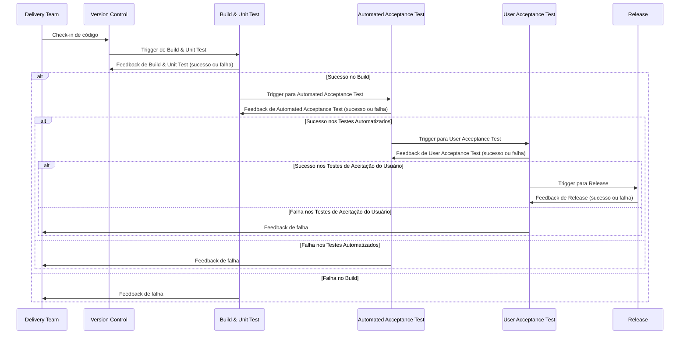

## Introdução
Este guia abrangente visa equipá-lo com o conhecimento e as habilidades necessárias para aproveitar o poder do GitHub Actions de forma eficaz.

O GitHub Actions é um serviço CI/CD (Integração Contínua/Implantação Contínua) versátil, poderoso e totalmente integrado que permite automatizar várias tarefas e processos dentro do seu ciclo de vida de desenvolvimento de software.

Neste capítulo introdutório, fornecerei uma visão geral do GitHub Actions, seus principais recursos e os benefícios de adotá-lo em seu fluxo de trabalho de desenvolvimento.

Também abordaremos alguns casos de uso e cenários comuns em que o GitHub Actions pode agilizar seu processo de desenvolvimento de software, melhorando a eficiência e reduzindo o erro humano.

Ao final, você terá uma sólida compreensão dos conceitos fundamentais por trás do GitHub Actions e uma perspectiva clara sobre como ele pode beneficiar seus projetos de desenvolvimento.

Esta base preparará o cenário para a exploração aprofundada do GitHub Actions nos capítulos subsequentes, onde nos aprofundaremos em tópicos mais avançados e implementações práticas.

| **Aspecto**                | **Continuous Integration (CI)**                                  | **Continuous Delivery (CD)**                                       | **Continuous Deployment (CD)**                                        |
|----------------------------|------------------------------------------------------------------|--------------------------------------------------------------------|-----------------------------------------------------------------------|
| **Objetivo**                | Integrar e testar código frequentemente para detectar erros cedo | Garantir que o código esteja sempre pronto para ser liberado       | Automatizar a liberação do código diretamente para produção          |
| **Frequência de Deploy**    | Nenhum deploy automático; apenas integração e testes contínuos  | Deploy manual para produção, mas o código está sempre pronto      | Deploy automático em produção após testes e validações automáticas   |
| **Ação Manual**             | Não envolve deploy ou release manual                            | A liberação para produção é manual ou por aprovação                | Nenhuma ação manual; o deploy ocorre automaticamente para produção   |
| **Ponto de Feedback**       | Feedback imediato após integração e testes unitários             | Feedback contínuo com a garantia de que o código está pronto para produção | Feedback rápido com liberação contínua após aprovação de testes      |
| **Exemplo de Ferramentas**  | Jenkins, Travis CI, CircleCI, GitLab CI                          | Jenkins, Spinnaker, GitLab CI, Bamboo                               | Jenkins, CircleCI, GitLab CI, AWS CodePipeline                        |
| **Benefício Principal**     | Identificação precoce de problemas de integração e qualidade do código | Liberação mais rápida e controlada para produção, com menos risco de falhas | Entrega contínua, com mudanças sendo rapidamente disponibilizadas para os usuários |
| **Foco**                    | Automatizar testes e integração de código                       | Garantir que o código esteja pronto para produção a qualquer momento | Automatizar todo o processo, incluindo o deploy em produção          |
| **Exemplo de Workflow**     | Desenvolvedor envia código → Testes e integração contínuos      | Código aprovado → Pré-produção → Aprovação manual → Deploy em produção | Código aprovado → Deploy automático em produção                       |



## O que são GitHub Actions?
O GitHub Actions é uma plataforma de automação poderosa integrada ao ecossistema GitHub que permite aos desenvolvedores criar, compartilhar e reutilizar fluxos de trabalho personalizados para automatizar tarefas em seus processos de desenvolvimento de software.

Esta plataforma rica em recursos oferece uma maneira versátil e flexível de definir e executar tarefas, incluindo integração contínua (CI), implantação contínua (CD), teste de código, linting, gerenciamento de problemas e muito mais.

O GitHub Actions simplifica o processo de automatização de fluxos de trabalho ao fornecer um ambiente onde essas tarefas podem ser configuradas e executadas diretamente em seus repositórios GitHub.

Em sua essência, o GitHub Actions usa uma série de fluxos de trabalho orientados a eventos para executar tarefas em resposta a gatilhos específicos. Esses fluxos de trabalho são definidos usando arquivos YAML, que são armazenados em um diretório especial dentro do seu repositório (.github/workflows/).

Cada arquivo de fluxo de trabalho consiste em um conjunto de instruções que definem as condições sob as quais o fluxo de trabalho deve ser executado (o gatilho), as tarefas ou "ações" a serem executadas e o ambiente de execução para essas ações.

O GitHub Actions pode ser acionado por vários eventos do GitHub, como enviar código para um repositório, abrir uma solicitação de pull, criar um problema ou até mesmo em uma base programada.

Um dos principais pontos fortes do GitHub Actions é seu design modular.

As ações podem ser criadas e compartilhadas como componentes individuais e reutilizáveis que podem ser facilmente integrados aos seus fluxos de trabalho.

Você pode usar ações pré-criadas fornecidas pelo GitHub, criar suas próprias ações personalizadas ou aproveitar as ações contribuídas pela comunidade disponíveis no GitHub Actions Marketplace.

Essa abordagem modular permite que os desenvolvedores criem fluxos de trabalho sofisticados combinando várias ações de maneira lógica e simplificada, resultando em maior produtividade e eficiência.

O GitHub Actions oferece uma variedade de "executores" predefinidos que servem como ambientes de execução para seus fluxos de trabalho.

Os executores são essencialmente máquinas virtuais que podem ser executadas no Linux, macOS ou Windows, permitindo que você execute seus fluxos de trabalho na plataforma de sua escolha.

O GitHub fornece executores hospedados e gratuitos para repositórios públicos, enquanto repositórios privados recebem uma certa quantidade de uso gratuito a cada mês, com a opção de comprar minutos adicionais, se necessário.

Você também pode escolher hospedar seus próprios executores autogerenciados se precisar de mais controle sobre o ambiente de execução ou precisar cumprir com requisitos de segurança específicos.

Uma das principais vantagens do GitHub Actions é sua integração perfeita com o ecossistema do GitHub.

Como ele é construído diretamente na plataforma, não há necessidade de configurar serviços externos ou lidar com chaves de API e outras credenciais. Essa integração estreita com o GitHub permite que os desenvolvedores criem fluxos de trabalho eficientes que automatizam tarefas, como construir e implantar código, executar testes e gerenciar problemas, diretamente na interface familiar do GitHub.

Além disso, o GitHub Actions Marketplace oferece uma ampla gama de ações contribuídas pela comunidade que podem ser facilmente integradas aos seus fluxos de trabalho, fornecendo acesso a uma biblioteca crescente de componentes reutilizáveis.

O GitHub Actions também fornece amplo suporte para personalizar a execução de fluxos de trabalho. Isso inclui a capacidade de controlar o fluxo de tarefas usando instruções condicionais, criar caminhos de execução paralelos e gerenciar dependências entre trabalhos.

Além disso, você pode usar variáveis de ambiente e segredos para armazenar com segurança dados confidenciais e passá-los entre ações, garantindo que seus fluxos de trabalho permaneçam seguros e suas informações confidenciais permaneçam protegidas.

Em resumo, o GitHub Actions é uma plataforma de automação poderosa e flexível que permite que os desenvolvedores criem, compartilhem e reutilizem fluxos de trabalho personalizados para automatizar uma ampla gama de tarefas dentro do processo de desenvolvimento de software.

Sua natureza orientada a eventos, design modular, integração perfeita com o ecossistema GitHub e opções de personalização extensivas o tornam uma ferramenta essencial para equipes modernas de desenvolvimento de software.

Nas seções a seguir, vamos nos aprofundar nos vários recursos e capacidades do GitHub Actions, fornecendo a você o conhecimento e as habilidades necessárias para aproveitar todo o seu potencial e otimizar seus fluxos de trabalho de desenvolvimento de software.


## Introdução
Automatize quase tudo e mantenha tudo o que você precisa para construir, implantar, testar e liberar seu aplicativo no controle de versão.
## GitHub Actions
GitHub Actions é uma plataforma de integração contínua e entrega contínua (CI/CD) que permite automatizar a sua compilação, testar e pipeline de implantação.

GitHub Actions vai além de apenas DevOps e permite que você execute fluxos de trabalho quando outros eventos ocorrerem no seu repositório.

GitHub fornece máquinas virtuais do Linux, Windows e macOS para executar seus fluxos de trabalho, ou você pode hospedar seus próprios executores auto-hospedados na sua própria infraestrutura de dados ou na nuvem.

{width="600" height="450" style="display: block; margin: 0 auto"}

### GitHub Actions Custo
O GitHub Actions é gratuito se uma ou ambas as duas condições a seguir forem atendidas:

- [x] Os repositórios que você usa com ações são públicos.
- [x] Os sistemas nos quais você executa as ações (os executores) são seus (em vez de usar os fornecidos pelo GitHub).

#### Modelo Pago
Repositórios privados
Clientes corporativos/empresariais do GitHub podem frequentemente usar esse modelo.

Existem dois tipos de itens pelos quais você paga com o GitHub Action:

- [x] Armazenamento: Ações permitem que você armazene artefatos e pacotes nos recursos do GitHub.
- [x] Minutos: As ações exigem tempo de processamento em sistemas virtuais.

#### Planos e Preços

<div class="center-table" markdown>
| Planejar	                         | Armazenamento | Minutos (por mês) |
| ------                            | ----:         | ----:             |
| GitHub Free	                      | 500 MB        | 2.000             |
| GitHub Pro	                       | 1 GB          | 3.000             |
| GitHub Free para organizações	    | 500 MB        | 2.000             |
| GitHub Team	                      | 2 GB	         | 3.000             |
| GitHub Enterprise Cloud	          | 50 GB	        | 50.000            |
</div>

<div class="center-table" markdown>
| Sistema Operacional |  Multiplicador de minutos | Taxa por minuto (USD) |
| ----                | -----:                    | -----:                |
| Linux               | 1                         |  0,008                |
| MacOs               | 10                        | 0,008                 |
| Windows             | 2                         | 0,016                 |
</div>

Observação: Eles só podem funcionar quando executados pelo mecanismo do GitHub.

{width="600" height="450" style="display: block; margin: 0 auto"}

## Why use GitHub Actions?
À medida que as práticas de desenvolvimento de software continuam a evoluir, a automação se tornou cada vez mais crítica para melhorar a eficiência, reduzir erros e agilizar processos.

O GitHub Actions oferece uma solução poderosa e flexível para automatizar vários aspectos dos fluxos de trabalho de desenvolvimento de software, tornando-o uma ferramenta essencial para equipes de desenvolvimento modernas.

Nesta seção, discutiremos os principais motivos pelos quais desenvolvedores e organizações devem considerar o uso do GitHub Actions.

Integração perfeita com o GitHub:
O GitHub Actions é fortemente integrado à plataforma GitHub, facilitando para os desenvolvedores criar e gerenciar fluxos de trabalho de automação dentro de seus repositórios existentes.

Essa integração perfeita elimina a necessidade de configurar e manter ferramentas externas, garantindo uma experiência suave e coesa.

Ao aproveitar o ecossistema do GitHub, os desenvolvedores podem aproveitar recursos nativos, como regras de proteção de ramificações, solicitações de pull e rastreamento de problemas, para criar fluxos de trabalho mais eficazes e eficientes.

## Event-driven architecture:
O GitHub Actions emprega uma arquitetura orientada a eventos, permitindo que os fluxos de trabalho sejam acionados por uma ampla gama de eventos dentro da plataforma GitHub. Isso inclui eventos comuns, como push de código, abertura de pull requests e criação de problemas, bem como eventos agendados e acionadores manuais.

Essa flexibilidade permite que os desenvolvedores criem fluxos de trabalho altamente responsivos que executam tarefas automaticamente em resposta a ações específicas, agilizando o processo de desenvolvimento e reduzindo o potencial de erro humano.

### Tarefa comuns de eventos
- [x] Adicionar novos colaboradores;
- [x] Fechar problemas obsoletos e PRS;
- [x] Solicitação de pull;
- [x] Tarefas organizacionais: Problema criado por usuários;
- [x] Rotular o problema {menor, maior, reproduzível, prioritário etc.};
- [x] Corrigir o problema e levantar um PR;
- [x] Verificar PR e mesclar o código ao principal;
- [x] Nova versão com uma nova versão;
- [x] Construir pipeline para testar e construir código;

## Modular and reusable actions:
Um dos principais pontos fortes do GitHub Actions é sua modularidade.

As ações podem ser criadas e compartilhadas como componentes individuais e reutilizáveis que podem ser facilmente integrados aos fluxos de trabalho. Os desenvolvedores podem escolher entre uma vasta biblioteca de ações pré-construídas fornecidas pelo GitHub, criar suas próprias ações personalizadas ou aproveitar ações contribuídas pela comunidade do GitHub Actions Marketplace.

Essa abordagem modular permite que os desenvolvedores criem fluxos de trabalho sofisticados combinando várias ações de maneira lógica e simplificada, aumentando, em última análise, a produtividade e a eficiência.

### Cross-platform support:
O GitHub Actions fornece suporte multiplataforma, permitindo que os fluxos de trabalho sejam executados em diferentes sistemas operacionais, incluindo Linux, macOS e Windows.

Isso permite que os desenvolvedores testem e implantem seus aplicativos em várias plataformas, garantindo compatibilidade e desempenho.

Com suporte para uma variedade de linguagens e estruturas, o GitHub Actions oferece uma solução versátil para diversos ambientes de desenvolvimento.

### Extensive customization options:
O GitHub Actions oferece uma ampla gama de opções de personalização para definir e executar fluxos de trabalho.

Isso inclui a capacidade de controlar o fluxo de tarefas usando instruções condicionais, criar caminhos de execução paralelos e gerenciar dependências entre trabalhos.

Além disso, os desenvolvedores podem usar variáveis de ambiente e segredos para armazenar dados confidenciais com segurança e passá-los entre ações.

Essas opções de personalização permitem que os desenvolvedores criem fluxos de trabalho personalizados que atendam às suas necessidades e requisitos específicos.

### Continuous Integration (CI) and Continuous Deployment (CD):
Implementar práticas de CI e CD é essencial para equipes de desenvolvimento modernas, pois ajuda a garantir a qualidade do código, reduzir erros e acelerar o ciclo de lançamento.

O GitHub Actions simplifica o processo de configuração de pipelines de CI/CD ao fornecer um ambiente onde tarefas como construção, teste e implantação podem ser configuradas e executadas diretamente em seus repositórios do GitHub.

Com suporte integrado para ferramentas e serviços populares de CI/CD, os desenvolvedores podem facilmente criar pipelines eficientes e robustos que automatizam aspectos-chave de seu processo de desenvolvimento.

## Scalability and performance:
O GitHub Actions foi projetado para escalar com suas necessidades de desenvolvimento, oferecendo uma solução flexível e de alto desempenho para automação. Ao utilizar os recursos de paralelismo e construção de matriz, os desenvolvedores podem otimizar seus fluxos de trabalho para velocidade e eficiência.

O GitHub também fornece executores hospedados que são automaticamente escalados e mantidos, garantindo que seus fluxos de trabalho sejam executados de forma suave e confiável, mesmo que seus projetos cresçam em tamanho e complexidade.

### Security and compliance:
A segurança é uma consideração crítica para qualquer processo de desenvolvimento, e o GitHub Actions fornece uma variedade de recursos para ajudar a garantir a segurança e a conformidade dos seus fluxos de trabalho.

Isso inclui a capacidade de armazenar dados confidenciais com segurança usando segredos, gerenciar o controle de acesso usando permissões de repositório e monitorar e auditar atividades usando as ferramentas de registro e relatórios integradas do GitHub.

Para organizações com requisitos de segurança rigorosos, os executores auto-hospedados podem ser empregados para manter o controle total sobre o ambiente de execução e garantir a conformidade com as políticas e regulamentações internas.

### Community and ecosystem:
O GitHub Actions se beneficia de uma comunidade grande e ativa de desenvolvedores que contribuem para o GitHub Actions Marketplace, fornecendo uma riqueza de ações pré-construídas para várias tarefas e integrações com serviços de terceiros.

Este ecossistema orientado pela comunidade permite que os desenvolvedores encontrem e utilizem rapidamente ações que podem simplificar seus fluxos de trabalho, economizando tempo e esforço.

Além disso, a natureza colaborativa da plataforma incentiva o compartilhamento de conhecimento e as melhores práticas, fomentando uma cultura de melhoria e inovação contínuas.

### Cost-effectiveness:
O GitHub Actions oferece uma solução econômica para automação, especialmente para projetos de código aberto e equipes pequenas.

Repositórios públicos podem usar o GitHub Actions gratuitamente, enquanto repositórios privados recebem uma certa quantidade de uso gratuito a cada mês, com a opção de comprar minutos adicionais, se necessário.

Este modelo de preços de pagamento conforme o uso garante que os desenvolvedores paguem apenas pelos recursos que usam, tornando-o uma escolha atraente para projetos de todos os tamanhos. Concluindo, o GitHub Actions fornece uma solução poderosa, flexível e integrada para automatizar vários aspectos dos fluxos de trabalho de desenvolvimento de software.

Ao alavancar sua arquitetura orientada a eventos, design modular, suporte multiplataforma e opções de personalização extensivas, os desenvolvedores podem criar fluxos de trabalho de automação personalizados que melhoram a eficiência, reduzem erros e simplificam processos.

O suporte da plataforma para CI/CD, recursos de segurança e preços econômicos a tornam uma ferramenta essencial para equipes de desenvolvimento modernas, enquanto sua comunidade ativa e ecossistema próspero garantem que os desenvolvedores tenham acesso a uma riqueza de recursos e melhores práticas.

Ao adotar o GitHub Actions, as equipes de desenvolvimento podem se concentrar em entregar software de alta qualidade de forma mais rápida e confiável, impulsionando, em última análise, a inovação e o sucesso.

### GitHub Actions vs. Other CI/CD Tools
No mundo do desenvolvimento de software, há inúmeras ferramentas de Integração Contínua e Implantação Contínua (CI/CD) disponíveis, cada uma com seus próprios recursos e capacidades exclusivos.

Nesta seção, compararemos o GitHub Actions com algumas das ferramentas populares de CI/CD no mercado, destacando suas principais diferenças, pontos fortes e fracos para ajudar você a tomar uma decisão informada ao escolher a ferramenta certa para suas necessidades.

#### Jenkins:
Jenkins é uma ferramenta de CI/CD de código aberto e auto-hospedada que tem sido uma favorita de longa data entre os desenvolvedores devido ao seu amplo ecossistema de plugins e flexibilidade.

Jenkins permite que os desenvolvedores criem pipelines personalizados usando uma linguagem de script chamada Groovy ou por meio de pipelines declarativos usando uma linguagem específica de domínio. Principais diferenças:

- [X] GitHub Actions é um serviço totalmente gerenciado e baseado em nuvem, enquanto Jenkins é uma solução auto-hospedada que requer configuração e manutenção manuais.
- [X] GitHub Actions oferece integração perfeita com a plataforma GitHub, enquanto Jenkins requer configuração e instalação adicionais para trabalhar com seus repositórios.
- [X] Jenkins tem uma curva de aprendizado mais íngreme devido ao uso de Groovy ou uma linguagem específica de domínio para configuração de pipeline, enquanto GitHub Actions depende de arquivos YAML, que geralmente são mais fáceis de ler e escrever.
- [X] Jenkins tem um vasto ecossistema de plugins, mas GitHub Actions se beneficia de um mercado crescente de ações reutilizáveis e contribuições da comunidade.

### GitLab CI/CD:
GitLab CI/CD é uma solução CI/CD integrada fornecida pelo GitLab, uma alternativa popular ao GitHub.

- [X] O GitLab CI/CD é fortemente integrado à plataforma GitLab e permite que os desenvolvedores criem pipelines usando arquivos YAML, semelhante ao GitHub Actions.
- [X] O GitHub Actions faz parte do ecossistema GitHub, enquanto o GitLab CI/CD é exclusivo do GitLab.
- [X] Ambas as plataformas oferecem integração perfeita com seus respectivos serviços de hospedagem de repositórios, tornando a escolha entre os dois amplamente dependente da sua plataforma preferida.
- [X] O GitHub Actions e o GitLab CI/CD têm abordagens de configuração semelhantes usando arquivos YAML, tornando-os relativamente fáceis de aprender e usar.
- [X] O GitLab oferece um conjunto mais abrangente de recursos integrados, incluindo registros de contêineres integrados e armazenamento de artefatos, enquanto o GitHub Actions depende de serviços externos para essas funcionalidades.

### CircleCI:
CircleCI é um serviço de CI/CD baseado em nuvem que fornece uma plataforma altamente configurável e flexível para automatizar fluxos de trabalho de desenvolvimento.

CircleCI suporta uma ampla gama de linguagens de programação e frameworks, e sua configuração de pipeline também é baseada em arquivos YAML.

- [x] O GitHub Actions é integrado diretamente à plataforma GitHub, enquanto o CircleCI é um serviço separado que requer instalação e configuração adicionais.
- [x] O CircleCI fornece uma plataforma altamente otimizada e orientada para o desempenho, com recursos como paralelismo e mecanismos avançados de cache, enquanto o GitHub Actions oferece recursos semelhantes, mas pode exigir mais otimização manual.
- [x] O CircleCI tem um sistema de permissões mais avançado e granular para gerenciar o controle de acesso, enquanto o GitHub Actions depende do sistema de permissões do repositório GitHub.
- [X] Ambas as plataformas oferecem suporte a uma ampla variedade de linguagens, estruturas e plataformas, tornando-as adequadas para diversos ambientes de desenvolvimento.

### Travis CI:
O Travis CI é um serviço de CI/CD baseado em nuvem que tem sido popular entre projetos de código aberto devido à sua simplicidade e facilidade de uso. O Travis CI suporta uma ampla gama de linguagens e plataformas e usa arquivos YAML para configuração de pipeline.

- [X] O GitHub Actions é integrado à plataforma GitHub, enquanto o Travis CI é um serviço externo que requer configuração e integração adicionais.
- [X] O Travis CI tem uma abordagem mais simples e otimizada para configuração de pipeline, facilitando a configuração de fluxos de trabalho básicos, enquanto o GitHub Actions oferece opções de personalização mais avançadas e modularidade.
- [X] O GitHub Actions se beneficia de um mercado crescente de ações reutilizáveis, enquanto o Travis CI depende de um conjunto mais limitado de recursos e integrações integrados.
- [X] O Travis CI recentemente mudou seu foco de projetos de código aberto, limitando sua oferta gratuita e tornando-o menos atraente para desenvolvedores de código aberto, enquanto o GitHub Actions continua a oferecer uso gratuito para repositórios públicos.

### Azure Pipelines:
O Azure Pipelines é um serviço de CI/CD baseado em nuvem oferecido pela Microsoft como parte do pacote Azure DevOps.

Ele oferece suporte a uma ampla variedade de linguagens, frameworks e plataformas, e sua configuração de pipeline é baseada em arquivos YAML, semelhante ao GitHub Actions.

- [x] O GitHub Actions é integrado nativamente à plataforma GitHub, enquanto o Azure Pipelines faz parte do conjunto Azure DevOps, exigindo configuração e instalação adicionais.
- [x] O Azure Pipelines fornece integração perfeita com outros serviços do Azure DevOps, como Azure Repos, Azure Boards e Azure Artifacts, tornando-o uma solução mais abrangente para organizações que usam o ecossistema Azure DevOps.
- [x] Ambas as plataformas oferecem uma ampla gama de opções de personalização e suporte para diversos ambientes de desenvolvimento, mas o GitHub Actions se beneficia de um mercado crescente de ações reutilizáveis e contribuições da comunidade.
- [x] O Azure Pipelines fornece limites de uso gratuito mais generosos para repositórios privados em comparação ao GitHub Actions, tornando-o uma opção atraente para equipes menores e projetos com orçamentos limitados.

Concluindo, o GitHub Actions é uma ferramenta de CI/CD poderosa e flexível que oferece integração perfeita com a plataforma GitHub, uma arquitetura orientada a eventos e um design modular que permite que os desenvolvedores criem fluxos de trabalho de automação personalizados.

Embora outras ferramentas de CI/CD, como Jenkins, GitLab CI/CD, CircleCI, Travis CI e Azure Pipelines tenham seus próprios recursos e pontos fortes exclusivos, a escolha depende, em última análise, de fatores como sua plataforma de hospedagem de repositório preferida, requisitos de integração, necessidades de personalização e restrições de orçamento.

Ao entender as principais diferenças entre o GitHub Actions e outras ferramentas de CI/CD, você pode tomar uma decisão informada sobre a melhor solução para seus fluxos de trabalho de desenvolvimento.

Independentemente da sua escolha, adotar uma ferramenta de CI/CD é essencial para equipes modernas de desenvolvimento de software, pois ajuda a garantir a qualidade do código, reduzir erros e acelerar o ciclo de lançamento, impulsionando, em última análise, a inovação e o sucesso.

### Introdução ao GitHub Actions
Neste capítulo, nós o guiaremos pelos primeiros passos do uso do GitHub Actions em seus projetos. Começaremos apresentando os blocos de construção básicos de um fluxo de trabalho do GitHub Actions, que incluem sintaxe YAML, arquivos de fluxo de trabalho e vários gatilhos de eventos.

Ao entender esses conceitos fundamentais, você estará bem preparado para criar e personalizar seus próprios fluxos de trabalho.

Em seguida, nós o guiaremos pela configuração do seu primeiro fluxo de trabalho, desde a criação de um arquivo de fluxo de trabalho até a definição dos trabalhos e etapas necessários.

Essa abordagem prática ajudará você a ganhar experiência prática com a interface e a estrutura do fluxo de trabalho do GitHub Actions.

Além disso, discutiremos contextos e expressões essenciais do GitHub Actions, que permitirão que você crie fluxos de trabalho dinâmicos e condicionais adaptados às suas necessidades específicas.

Essas ferramentas são cruciais para otimizar seus fluxos de trabalho e garantir que eles respondam efetivamente a vários eventos e circunstâncias.

Ao final deste capítulo, você terá uma compreensão sólida dos conceitos básicos do GitHub Actions e estará pronto para implementar fluxos de trabalho simples em seus projetos de desenvolvimento.

Com essa base, você estará bem equipado para explorar recursos e técnicas mais avançados nos capítulos subsequentes.

### Configurando seu primeiro fluxo de trabalho do GitHub Actions
Agora que cobrimos os fundamentos do GitHub Actions e discutimos seus benefícios e como ele se compara a outras ferramentas de CI/CD, é hora de mergulhar na criação do seu primeiro fluxo de trabalho.

Nesta seção, guiaremos você pelo processo de configuração de um fluxo de trabalho básico do GitHub Actions para automatizar a construção e o teste de um projeto de amostra.

### Crie um novo repositório no GitHub:
Antes de começar, crie um novo repositório no GitHub (se você ainda não tiver um) para hospedar seu projeto. Este repositório servirá como base para seu fluxo de trabalho do GitHub Actions.

Certifique-se de ter inicializado o repositório com um arquivo README e adicionado seus arquivos de projeto.

#### Adicionar um arquivo de fluxo de trabalho:
Os fluxos de trabalho do GitHub Actions são definidos usando arquivos YAML armazenados no diretório `.github/workflows` dentro do seu repositório.

Para criar seu primeiro fluxo de trabalho, siga estas etapas:

- [X] No seu repositório, navegue até a aba "Ações".
- [X] Clique no botão "Novo fluxo de trabalho".
- [X] O GitHub fornece vários modelos de fluxo de trabalho para você escolher. Você pode usar um desses modelos como ponto de partida ou criar um novo fluxo de trabalho do zero clicando em "Configurar um fluxo de trabalho você mesmo".
- [X] Isso criará um novo arquivo YAML no diretório .github/workflows. Dê ao seu arquivo de fluxo de trabalho um nome descritivo, como build-and-test.yml.

Fluxos de trabalho **reutilizáveis** permitem que você reutilize um fluxo de trabalho inteiro, incluindo todas as suas tarefas e etapas.

<div class="center-table" markdown>
| Fluxos de trabalho reutilizáveis	| Ações compostas   |
| --------                          | ---------       |
| Um arquivo YAML, muito semelhante a qualquer arquivo de fluxo de trabalho padrão	                       | Uma ação que contém um pacote de etapas do fluxo de trabalho |
| Cada fluxo de trabalho reutilizável é um único arquivo no diretório .github/workflows de um repositório | Cada ação composta é um repositório, ou um diretório, separado contendo um arquivo action.yml e, opcionalmente, outros arquivos |
| Chamada feita referenciando um arquivo YAML específico                                                   | Chamada feita referenciando um repositório ou diretório no qual a ação está definida |
| Chamada feita diretamente em uma tarefa, não em uma etapa	| Execução feita como uma etapa dentro de uma tarefa |
| Pode conter várias tarefas                                                                               | Não contém tarefas |
| Cada etapa é registrada em tempo real	                                                                   | Registro como uma etapa, mesmo que contenha várias etapas |
| Pode conectar um máximo de quatro níveis de fluxos de trabalho                                           | O aninhamento pode ser feito para ter até 10 ações compostas em um único fluxo de trabalho |
| Pode usar segredos	                                                                                   | Não pode usar segredos
</div>

Os fluxos de trabalho são os scripts ou pipelines que controlam o fluxo e a sequência de atividades no GitHub Actions. As ações individuais são as funções que podem ser chamadas para fazer tarefas direcionadas de dentro dos fluxos de trabalho (como verificar o código).

#### Visão Geral
Algum evento de disparo acontece em um repositório GitHub, ser um evento no GitHub que não é uma atualização para uma ref.

Um diretório dedicado no repositório (.github/ workflows) é pesquisado para arquivos de fluxo de trabalho que são codificados para responder ao tipo de evento.

Os fluxos de trabalho correspondentes são identificados e novas execuções dos fluxos de trabalho correspondentes

A sintaxe cron tem cinco campos separados por um espaço, e cada campo representa uma unidade de tempo.

As variáveis de ambiente padrão definidas pelo GitHub estão disponíveis em todas as etapas de um fluxo de trabalho.

{width="600" height="450" style="display: block; margin: 0 auto"}

#### Defina os gatilhos do fluxo de trabalho:
No seu novo arquivo YAML, comece definindo os eventos que devem disparar seu fluxo de trabalho. Para este exemplo, configuraremos o fluxo de trabalho para ser executado em cada solicitação push e pull para o branch principal.

Adicione as seguintes linhas ao seu arquivo de fluxo de trabalho:

```
 on:
  push:
    branches:
      - main
  pull_request:
    branches:
      - main
```
#### Configure o ambiente do fluxo de trabalho:
Em seguida, especifique o sistema operacional e o ambiente da linguagem de programação para seu fluxo de trabalho.

Neste exemplo, usaremos um ambiente baseado em Ubuntu com Node.js. Adicione as seguintes linhas ao seu arquivo de fluxo de trabalho:

```
jobs:
  build-and-test:
     runs-on: ubuntu-latest
  steps:
```
#### Verifique seu repositório:
Para acessar os arquivos do seu repositório dentro do fluxo de trabalho, você precisará verificar o repositório usando a ação actions/checkout.

Adicione as seguintes linhas ao seu arquivo de fluxo de trabalho:

```
- name: Checkout repository
  uses: actions/checkout@v4
```

#### Configure seu ambiente de linguagem de programação:
Neste exemplo, estamos usando Node.js, então precisaremos configurar o ambiente Node.js usando a ação actions/setup-node.

Adicione as seguintes linhas ao seu arquivo de fluxo de trabalho:

```
- name: Set up Node.js
  uses: actions/setup-node@v4
  with:
   node-version: 14
```

### Instalar dependências e executar build:
Com o ambiente configurado, agora você pode instalar as dependências do seu projeto e executar o processo de build. Supondo que seu projeto use npm, adicione as seguintes linhas ao seu arquivo de fluxo de trabalho:

```
- name: Install dependencies
  run: npm ci
- name: Build project
  run: npm run build
```
### Executar testes:
Finalmente, adicione uma etapa para executar os testes do seu projeto usando o executor de testes de sua escolha.

Neste exemplo, usaremos o npm test. Adicione as seguintes linhas ao seu arquivo de fluxo de trabalho:

```
- name: Run tests
   run: npm test
```
### Salve e confirme o arquivo de fluxo de trabalho:
Depois de terminar de configurar seu fluxo de trabalho, salve o arquivo YAML e confirme-o em seu repositório.

Isso habilitará automaticamente o fluxo de trabalho e ele será acionado com base nos eventos que você definiu.

Com esse fluxo de trabalho básico do GitHub Actions em vigor, seu projeto será criado e testado automaticamente em cada solicitação de push e pull para o branch principal. Este é apenas o começo do que você pode fazer com o GitHub Actions, pois há muito mais opções de personalização e integrações disponíveis para ajudar a simplificar e automatizar seus processos de desenvolvimento.

Conforme você continua a explorar o GitHub Actions, você pode aproveitar o crescente mercado de ações reutilizáveis para expandir seus recursos de fluxo de trabalho, como implantar seu aplicativo em várias plataformas de hospedagem, enviar notificações e integrar com serviços de terceiros.

O design modular e a arquitetura orientada a eventos do GitHub Actions permitem que você crie fluxos de trabalho de automação personalizados que atendem às suas necessidades específicas, garantindo que seus processos de desenvolvimento sejam tão eficientes e simplificados quanto possível.

Nas seções a seguir, nos aprofundaremos nos recursos avançados e nas opções de personalização do GitHub Actions, ajudando você a desbloquear todo o seu potencial e transformar seus fluxos de trabalho de desenvolvimento de software.

### Entendendo a sintaxe YAML
Para trabalhar efetivamente com o GitHub Actions, é essencial entender a sintaxe YAML usada para definir fluxos de trabalho. YAML, que significa "YAML Ain't Markup Language", é um formato de serialização de dados legível por humanos comumente usado para arquivos de configuração e troca de dados entre linguagens com diferentes estruturas de dados.

Nesta seção, abordaremos os conceitos básicos da sintaxe YAML e forneceremos exemplos para ajudar você a entender melhor como escrever e manter seus arquivos de fluxo de trabalho do GitHub Actions.

#### Estrutura básica:
Os arquivos YAML usam recuo para representar a estrutura dos dados, semelhante a como linguagens de programação como Python usam espaços em branco.

Os blocos de construção básicos do YAML são escalares (strings, números e booleanos), sequências (matrizes ou listas) e mapeamentos (pares chave-valor ou dicionários). Aqui está um exemplo simples da sintaxe YAML:

```
version: 1
  languages:
- Python
- JavaScript
- Go

frameworks:
Python:
  - Django
  - Flask
JavaScript:
  - React
  - Vue
```

#### Escalares:
Escalares são o tipo de dado mais simples em YAML e incluem strings, números e booleanos. Strings podem ser escritas com ou sem aspas, mas geralmente é melhor usar aspas ao lidar com caracteres especiais ou espaços em branco. Números podem ser escritos como inteiros ou valores de ponto flutuante. Booleanos são representados usando true e false. Exemplo:

```
string: "Hello, World!"
integer: 42
float: 3.14
boolean: true
```
#### Sequências:
Sequências são coleções ordenadas de itens, semelhantes a arrays ou listas em linguagens de programação. Em YAML, você pode representar uma sequência iniciando cada item em uma nova linha com um hífen seguido por um espaço. Exemplo:

```
Languages:
   - Python
   - JavaScript
   - Go
```
#### Mappings:
Mapeamentos representam pares chave-valor, semelhantes a dicionários ou mapas hash em linguagens de programação. Em YAML, você pode criar um mapeamento escrevendo a chave, seguida por dois pontos e um espaço, e então o valor. Exemplo:

```
Frameworks:
Python:
  Django
  JavaScript: React
  Go: Gin
```
### Estruturas de dados complexas:
Você pode criar estruturas de dados mais complexas em YAML combinando sequências e mapeamentos. Por exemplo, você pode ter uma sequência de mapeamentos ou um mapeamento com sequências como valores. Exemplo:


```
projects:
- name: Project A
  language: Python
  frameworks:
    - Django
    - Flask
- name: Project B
  language: JavaScript
  frameworks:
     - React
     - Vue
```

### Anchors and aliases:
YAML fornece uma maneira de reutilizar partes da sua configuração usando âncoras e aliases.

Uma âncora é definida adicionando `&` seguido por um nome exclusivo após um valor, enquanto um alias é referenciado usando seguido pelo nome da âncora.
Exemplo:

```
defaults: &default_setting
timeout: 10
retries: 3
Job_a:
<<: *default_settings
name: Job A
Job_b:
<<: *default_settings name: Job B
```
#### Multi-line strings:
YAML suporta strings multi-linha usando o caractere pipe '|' ou maior que '>'. O caractere pipe preserva novas linhas na string, enquanto o caractere maior que converte novas linhas em espaços. Exemplo:

```
multiline_pipe: |
This is a multi-line
string with preserved
Newlines.
multiline_gt: >
This is a multi-line
string with newlines
converted to spaces.
Comments:
You can add comments in YAML files by starting a line with the # character. Comments can help document your configuration and make it easier for others to understand your workflow. Example:
# This is a comment in YAML
version: 1 # You can also add inline comments
```

#### Environment variables:
Nos fluxos de trabalho do GitHub Actions, você pode usar variáveis de ambiente para armazenar e passar dados entre etapas. Para definir uma variável de ambiente, use a chave env seguida pelo nome e valor da variável. Exemplo:

```
jobs:
build:
runs-on: ubuntu-latest
env:
MY_VARIABLE: my_value
steps:
- name: Print environment variable
run: echo $MY_VARIABLE
```

Entender a sintaxe YAML é crucial para trabalhar efetivamente com o GitHub Actions, pois permite que você crie e mantenha fluxos de trabalho complexos e eficientes. Ao dominar os diferentes aspectos do YAML, você pode escrever arquivos de fluxo de trabalho mais sustentáveis, legíveis e escaláveis, garantindo que seus processos de desenvolvimento sejam simplificados e otimizados.

Nas seções a seguir, vamos nos aprofundar nos recursos avançados e opções de personalização do GitHub Actions, ajudando você a desbloquear todo o seu potencial e transformar seus fluxos de trabalho de desenvolvimento de software.

## Anatomy of a GitHub Actions Workflow
Para aproveitar totalmente os recursos do GitHub Actions, é essencial entender os diferentes componentes que compõem um fluxo de trabalho.

Nesta seção, dissecaremos a anatomia de um fluxo de trabalho do GitHub Actions, explicando cada elemento em detalhes e fornecendo exemplos para ajudar você a compreender sua função e uso.

### Workflow triggers
Os gatilhos de fluxo de trabalho definem os eventos que iniciam a execução de um fluxo de trabalho do GitHub Actions.

Você pode especificar vários eventos, como pushes, pull requests ou até mesmo eventos personalizados, para iniciar o fluxo de trabalho. Os gatilhos são definidos usando a palavra-chave on, seguida pelos nomes dos eventos e qualquer configuração adicional. Exemplo:

```
on:
push:
branches:
   - main
pull_request:
  branches:
   - main
schedule:
   - cron: '0 12 ***
```
{width="600" height="450" style="display: block; margin: 0 auto"}

### [Categorias dos Fluxos de Trabalho](https://github.com/actions/starter-workflows)

<div class="center-table" markdown>
| Categoria           | Descrição |
| ----                | ----      |
| Implantação         | Fluxos de trabalho de exemplo para criar objetos implantáveis (como contêineres) e, em seguida, implantá-los em várias plataformas de nuvem. |
| Segurança           | Conjunto de fluxos de trabalho de varredura de código usando vários métodos de segurança plataformas e suas ferramentas.                     |
| Integração Contínua | número de fluxos de trabalho que abrangem as áreas de construção, teste e/ou publicação para um grande número de diferentes programas linguagens e ferramentas. |
| Automação           | Alguns exemplos simples de automação básica.  |
| Páginas             | Fluxos de trabalho para empacotar/implantar sites usando ferramentas comuns como Gatsby, Astro, Jekyll, etc. |
</div>
### Jobs
Um fluxo de trabalho consiste em um ou mais trabalhos, que são unidades individuais de trabalho que são executadas em paralelo por padrão. Os trabalhos são definidos usando a palavra-chave jobs, seguida por um identificador exclusivo para cada trabalho e sua configuração. Exemplo:

```
jobs:
build:
runs-on: ubuntu-latest
steps:
- name: Build project run: npm run build
test:
runs-on: ubuntu-latest steps:
- name: Run tests run: npm test
```

### Job dependencies
Por padrão, os trabalhos são executados em paralelo, mas você pode especificar dependências entre os trabalhos usando a palavra-chave needs. Isso pode ser útil para criar fluxos de trabalho sequenciais em que certos trabalhos devem ser concluídos antes que outros possam começar. Exemplo:

```
jobs:
build:
runs-on: ubuntu-latest
steps:
- name: Build project
run: npm run build
test:
runs-on: ubuntu-latest
needs: build
steps:
- name: Run tests
run: npm test
```

### Job environment
Cada trabalho é executado em um ambiente específico definido pela palavra-chave runs-on, que especifica o sistema operacional e a versão do trabalho. O GitHub Actions fornece vários ambientes pré-construídos, como ubuntu-latest, windows-latest e macos-latest. Exemplo:

```
jobs:
build:
runs-on: ubuntu-latest
```

### Steps
Os trabalhos são compostos de uma ou mais etapas, que são tarefas individuais executadas sequencialmente dentro de um trabalho. As etapas podem usar ações pré-criadas do mercado GitHub Actions, ações personalizadas ou simplesmente executar comandos shell. As etapas são definidas usando a palavra-chave steps, seguida por uma lista de configurações de etapas. Exemplo:

```
jobs:
  build:
    runs-on: ubuntu-latest
steps:
- name: Checkout repository
  uses: actions/checkout@v4
- name: Set up Node.js
  uses: actions/setup-node@v4
  with:
    node-version: 14
- name: Install dependencies
run: npm ci
- name: Build project
  run: npm run build
```
### Actions
Ações são unidades reutilizáveis de código que podem ser incluídas como etapas no seu fluxo de trabalho. Você pode usar ações pré-criadas do marketplace GitHub Actions, criar suas próprias ações personalizadas ou referenciar ações de outros repositórios. As ações são referenciadas usando a palavra-chave uses, seguida pelo repositório de ações e versão. Exemplo:

```
steps:
- name: Checkout repository
  uses: actions/checkout@v4
```

As ações podem ser:

- [x] Reutilizável: as ações podem ser usadas em diferentes fluxos de trabalho e repositórios, permitindo que você evite reescrever o mesmo código.
- [x] Pré-escrito: muitas ações estão disponíveis no GitHub Marketplace, abrangendo uma ampla gama de tarefas, como verificar código, configurar ambientes, executar testes e implantar aplicativos.
- [x] Configurável: você pode configurar ações com entradas, saídas e variáveis ​​de ambiente para adaptá-las às suas necessidades específicas.
- [x] Orientado pela comunidade: você pode criar suas próprias ações e compartilhá-las com outras pessoas ou usar ações desenvolvidas pela comunidade.

### Inputs and outputs
Você pode passar dados entre etapas usando entradas e saídas.

As entradas são definidas usando a palavra-chave with, seguida por um mapeamento de nomes e valores de entrada.

As saídas são definidas usando a palavra-chave id para atribuir um identificador exclusivo a uma etapa e, em seguida, acessadas usando o contexto steps em etapas subsequentes. Exemplo:

```
name: Exercicio 01
on:
  workflow_dispatch:
jobs:
  build_random:
    name: build_random
    runs-on: ubuntu-latest
    env:
      API_BASE_URL: "https://api.example.com"
    steps:
    - name: Imprime variavel
      run: echo "Nome da variacel $API_BASE_URL"

    - name: Generate a random number
      id: random_number
      # Obsoleto: run: echo "::set-output name=number::$(shuf -i 1-100 -n 1)"
      run: echo "numero=$(shuf -i 1-100 -n 1)" >> "$GITHUB_OUTPUT"
    - name: Print the random number
      run: |
            echo "The random number is ${{ steps.random_number.outputs.numero }}"
            echo "Parte: ${API_BASE_URL}"
```

### Environment variables and secrets
Variáveis de ambiente e segredos permitem que você armazene e passe dados sensíveis ou reutilizáveis entre etapas.
Variáveis de ambiente são definidas usando a palavra-chave env, enquanto segredos são gerenciados nas configurações do repositório e acessados usando o contexto secrets.Exemplo:

```
  build_random:
    name: build_random
    runs-on: ubuntu-latest
    env:
      API_BASE_URL: "https://api.example.com"
    run: |
          echo "Deploying to $API_BASE_URL"
          curl -H "Authorization: Bearer ${{ secrets.DEPLOY_TOKEN }}" -X POST $API_ BASE_URL/deploy
```
### Contexts
Contextos no GitHub Actions fornecem acesso a vários tipos de metadados relacionados à execução atual do fluxo de trabalho, como o evento que acionou o fluxo de trabalho, o repositório, o trabalho, o executor e quaisquer entradas personalizadas.

Eles permitem que você crie fluxos de trabalho dinâmicos e flexíveis que podem se adaptar a diferentes situações com base nos metadados disponíveis.

Por exemplo, você pode usar o contexto do github para acessar informações sobre o evento que acionou o fluxo de trabalho, como o tipo de evento, o ator que iniciou o evento e o SHA de confirmação associado.

Da mesma forma, o contexto de segredos permite que você acesse com segurança segredos criptografados armazenados nas configurações do seu repositório.

Para acessar dados de contexto, você pode usar a sintaxe `${{context}}` no seu arquivo de fluxo de trabalho. Aqui está um exemplo de uso do contexto do github para acessar o nome do evento:

```
jobs:
build:
runs-on: ubuntu-latest
steps:
- name: Log event name
run: echo "Event name: ${{ github.event_name}}"
```

### Workflow Contexts
Contextos são uma maneira de acessar informações sobre execuções de fluxo de trabalho, variáveis, ambientes de execução, trabalhos e etapas.

Cada contexto é um objeto que contém propriedades, que podem ser strings ou outros objetos.

Você pode acessar contextos usando a sintaxe de expressão. ${{ <context> }}

| Tipo     | Descrição                                                                                                  |
| ----     | ----                                                                                                       |
| github   | Informações sobre a execução do fluxo de trabalho.                                                         |
| env      | Contém variáveis definidas em um fluxo de trabalho, tarefa ou etapa.                                       |
| vars     | Contém variáveis definidas nos níveis de repositório, organização ou ambiente.                             |
| job      | Informações sobre a tarefa em execução no momento.                                                         |
| jobs     | Somente para fluxos de trabalho reutilizáveis, contém saídas de tarefas do fluxo de trabalho reutilizável. |
| steps    | Informações sobre as etapas que foram executadas na tarefa atual.                                          |
| runner   | Informações sobre o executor que está executando a tarefa atual.                                           |
| secrets  | Contém os nomes e valores de segredos que estão disponíveis para uma execução de fluxo de trabalho.        |
| strategy | Informações sobre a estratégia de execução da matriz para a tarefa atual.                                  |
| matrix   | Contém as propriedades da matriz definidas no fluxo de trabalho que se aplicam à tarefa atual.             |
| needs    | Contém as saídas de todas as tarefas que são definidas como uma dependência da tarefa atual.               |
| inputs   | Contém as entradas de um fluxo de trabalho reutilizável ou acionado manualmente.                           |

```
steps:
  - name: Use Secret as Env Var
    run: echo "Secret Value: $MY_SECRET"
    env:
      MY_SECRET: ${{ secrets.MY_SECRET }}
```


### Expressions
Expressões no GitHub Actions são uma maneira poderosa de avaliar e manipular dados dentro dos seus arquivos de fluxo de trabalho. Elas permitem que você execute cálculos, acesse dados de contexto e controle o fluxo do seu fluxo de trabalho com base em condições. As expressões são encapsuladas em chaves duplas, como `${{ expression}}`.

As expressões do GitHub Actions oferecem suporte a uma variedade de funções, operadores e literais que você pode usar para criar lógica complexa em seus fluxos de trabalho. Por exemplo, você pode usar a função contains para verificar se uma string contém uma substring específica ou pode usar o operador `==` para comparar dois valores para igualdade.

Aqui está um exemplo de uso de expressões para executar condicionalmente uma etapa com base no evento que acionou o fluxo de trabalho:

```
jobs:
build:
runs-on: ubuntu-latest
steps:
- name: Log event name
   run: echo "This step only runs for pull_request events."
    if: ${{ github.event_name == 'pull_request' }}
```

Neste exemplo, a palavra-chave if é combinada com uma expressão para controlar se a etapa será executada. A etapa será executada somente se o evento que disparou o fluxo de trabalho for um evento de solicitação de pull.

Ao incorporar contextos e expressões em seus fluxos de trabalho do GitHub Actions, você pode criar processos de automação mais dinâmicos, flexíveis e adaptáveis que atendem às necessidades exclusivas de seus projetos de desenvolvimento.

### Workflow status badges:
Para exibir o status dos seus fluxos de trabalho do GitHub Actions no README do seu repositório ou em outra documentação, você pode usar emblemas de status do fluxo de trabalho. A URL do emblema pode ser gerada usando o seguinte padrão: `https://github.com/<OWNER>/<REPOSITORY>/actions/workflows/<WORKFLOW_FILE>/badge.svg`. Exemplo:


Ao entender a anatomia de um fluxo de trabalho do GitHub Actions, você pode criar fluxos de trabalho mais eficientes, sustentáveis e escaláveis, adaptados às suas necessidades específicas. Nas seções a seguir, continuaremos explorando recursos avançados e opções de personalização do GitHub Actions, ajudando você a desbloquear todo o seu potencial e revolucionar seus processos de desenvolvimento de software.

## Building Your First Workflow
Neste capítulo, vamos orientá-lo no processo de criação do seu primeiro fluxo de trabalho do GitHub Actions do zero. Nosso objetivo é ajudar você a obter uma compreensão prática de como criar e configurar fluxos de trabalho para automatizar várias tarefas em seus projetos de desenvolvimento.

Começaremos discutindo diferentes tipos de gatilhos de fluxo de trabalho, incluindo gatilhos baseados em eventos e gatilhos agendados, que determinam quando seu fluxo de trabalho deve ser executado. Entender esses gatilhos é essencial para projetar fluxos de trabalho que respondam efetivamente a eventos específicos ou sejam executados em um cronograma predeterminado.

Em seguida, vamos nos aprofundar na definição de trabalhos e etapas em seu fluxo de trabalho. Esta seção abordará a estrutura e a configuração de trabalhos, incluindo como definir etapas, usar ações pré-criadas e executar comandos de shell. Ao aprender sobre esses componentes, você poderá criar fluxos de trabalho personalizados adaptados às suas necessidades específicas.

Também exploraremos como aproveitar compilações de matriz e paralelismo para testar seu código com eficiência em vários ambientes, versões de tempo de execução ou configurações. Este recurso poderoso permite que você otimize seus fluxos de trabalho executando várias instâncias de um trabalho simultaneamente, reduzindo o tempo geral de execução e melhorando a confiabilidade.

Ao final deste capítulo, você terá experiência prática na criação e configuração de fluxos de trabalho do GitHub Actions, permitindo que você automatize várias tarefas e processos em seus projetos de desenvolvimento de software. Com uma sólida compreensão desses conceitos fundamentais, você estará pronto para explorar recursos mais avançados e melhores práticas nos capítulos seguintes.

### Workflow Triggers: Events and Scheduling
Nesta seção, vamos nos aprofundar nos diferentes tipos de gatilhos de fluxo de trabalho disponíveis no GitHub Actions. Os gatilhos de fluxo de trabalho são cruciais para definir quando e em quais circunstâncias seus fluxos de trabalho devem ser executados. Entender e utilizar as várias opções de gatilho ajudará você a criar fluxos de trabalho mais eficientes e adaptáveis, adaptados às suas necessidades específicas.

#### Event-based triggers:
Os gatilhos baseados em eventos são o tipo mais comum de gatilhos no GitHub Actions. Esses gatilhos iniciam fluxos de trabalho em resposta a vários eventos que ocorrem no seu repositório, como pushes, pull requests e issues. Alguns dos gatilhos baseados em eventos mais comumente usados incluem:

- [x] push: Aciona o fluxo de trabalho quando os commits são enviados para o repositório.
- [x] pull_request: Aciona o fluxo de trabalho quando um pull request é criado ou atualizado.
- [x] issues: Aciona o fluxo de trabalho quando um problema é aberto, fechado ou atualizado.
- [x] fork: Aciona o fluxo de trabalho quando alguém faz um fork do repositório.

Um evento é uma atividade específica em um repositório que dispara a execução de um fluxo de trabalho.

| Eventos                                  | Tipos de atividade	       | Disparo |
| --------------                           | -----                     | ----    |
| branch_protection_rule                   | created, edited e deleted | Executa o fluxo de trabalho quando as regras de proteção de branch no repositório do fluxo de trabalho são alteradas. | `on: branch_protection_rule: types: [created, deleted]` |
| check_run                                | created, rerequested, completed, requested_action | Executa o fluxo de trabalho quando ocorre a atividade relacionada a uma execução de verificação. | `on: check_run:    types: [rerequested, completed]` |
| check_suite                              | completed                 | Um conjunto de verificações é uma coleção das execuções de verificação criadas para um commit específico. |  `on: check_suite: types: [completed]` |
| create                                   | - | Quando alguém cria uma referência Git (branch ou tag) no repositório do fluxo de trabalho. | `on: create` |
| delete                                   | - | Quando alguém exclui uma referência Git (branch ou tag) no repositório do fluxo de trabalho. | `on: delete` |
| deployment                               | - | quando alguém cria uma implantação no repositório do fluxo de trabalho. | `on: deployment` |
| deployment_status                        | - | mplantações criadas com um commit SHA podem não ter uma referência Git.  |  `on: deployment_status` |
| discussion                               | created,edited,deleted,transferred,pinned,unpinned,labeled,unlabeled,locked,unlocked,category_changed,answered,unanswered | quando uma discussão no repositório do fluxo de trabalho é criada ou modificada. | `on: discussion: types: [created, edited, answered]` |
| discussion_comment                       | created,edited,deleted | quando um comentário em uma discussão no repositório do fluxo de trabalho é criado ou modificado. | `on:discussion_comment: types: [created, deleted]` |
| fork                                     | - | Fluxo de trabalho quando alguém bifurca um repositório. | `on: fork`  |
| gollum                                   | -  | Quando alguém cria ou atualiza uma página wiki.         |  `on: fork` |
| issue_comment                            |    | Quando um problema ou comentário de pull request é criado, editado ou excluído.  | `on: issue_comment: types: [created, deleted]` |
| issues                                   | opened,edited,deleted,transferred,pinned,unpinned,closed,reopened,assigned,unassigned,labeled,unlabeled,locked,unlocked,milestoned,demilestoned | quando um problema no repositório do fluxo de trabalho é criado ou modificado. | `on: issues: types: [opened, edited, milestoned]` |
| label                                    | created,edited,deleted  | Quando uma etiqueta no repositório do fluxo de trabalho é criada ou modificada.  | `on: label: types: [created, deleted]` |
| merge_group                              | checks_requested | Quando uma solicitação de pull é adicionada a uma fila de mesclagem, o que adiciona a solicitação de pull a um grupo de mesclagem. | `on: pull_request: branches: [ "main" ] merge_group: types: [checks_requested]` |
| milestone                                | created,closed,opened,edited,deleted | quando um marco no repositório do fluxo de trabalho é criado ou modificado.  |  `on: milestone:    types: [opened, deleted]` |
| page_build                               | - | Quando alguém faz push em um branch que é a fonte de publicação para GitHub Pages, se o GitHub Pages estiver habilitado no repositório. | `on: page_build` |
| public                                   | - | Quando o repositório do fluxo de trabalho é alterado de privado para público.  | ``
| pull_request                             | assigned,unassigned,labeled,unlabeled,opened,edited,closed,reopened,synchronize,converted_to_draft,locked,unlocked,enqueued,dequeued,milestoned,demilestoned,ready_for_review,review_requested,review_request_removed,auto_merge_enabled,auto_merge_disabled | quando ocorre uma atividade em uma pull request no repositório do fluxo de trabalho. | `on:
  pull_request:
    types: [opened, reopened]`
| pull_request_comment (use issue_comment) | -  | quando um comentário em uma solicitação de pull (não na comparação de uma solicitação de pull) é criado, editado ou excluído, use o evento issue_comment |  |
| pull_request_review                      | submitted, edited, dismissed | Quando uma revisão de pull request é enviada, editada ou ignorada. | `on: pull_request_review:  types: [edited, dismissed]` |
| pull_request_review_comment              | created, edited, deleted | Quando um comentário de revisão de pull request é modificado.  | `on: pull_request_review_comment:    types: [created, deleted]` |
| pull_request_target                      | assigned,unassigned,labeled,unlabeled,opened,edited,closed,reopened,synchronize,converted_to_draft,ready_for_review,locked,unlocked,review_requested,review_request_removed,auto_merge_enabled,auto_merge_disabled | Quando ocorre uma atividade em uma pull request no repositório do fluxo de trabalho.  | `on: pull_request_target: types: [assigned, opened, synchronize, reopened]` |
| push                                     | - | quando você efetua push em um commit ou tag ou quando cria um repositório a partir de um modelo. | `on:
  push` |
| registry_package                         | published, updated | Quando uma atividade relacionada ao GitHub Packages ocorre no seu repositório.  | `on:
  registry_package:
    types: [published]` |
| release                                  | published,unpublished,created,edited,deleted,prereleased,released | quando a atividade de da versão no repositório ocorre.  | `on:
  release:
    types: [published]` |
| repository_dispatch                      | | quando você deseja disparar um fluxo de trabalho para a atividade que ocorre fora do GitHub. | `on: repository_dispatch:  types: [test_result]` |
| schedule                                 | | O evento schedule pode ser atrasado durante períodos de cargas altas de execuções de fluxo de trabalho do GitHub Actions.  | `on:
  schedule:
    - cron: "15 4,5 * * *"` |
| status                                   | | quando o status do commit de Git é alterado. Por exemplo, os commits podem ser marcados como error, failure, pending ou success.  | `on:
  status`
| watch                                    | started | quando o repositório do fluxo de trabalho é favoritado.  | `on: watch: types: [started]` |
| workflow_call                            |         | É usado para indicar que um fluxo de trabalho pode ser chamado por outro fluxo de trabalho.   | `on: workflow_call` |
| workflow_dispatch                        |  | Para permitir que um fluxo de trabalho seja disparado manualmente, configure o evento workflow_dispatch | `on: workflow_dispatch` |
| workflow_run                             | completed, requested, in_progress | quando uma execução do fluxo de trabalho é solicitada ou concluída.  | `on:
  workflow_run:
    workflows: [Staging, Lab]
    types:
      - completed` |

através da tecnologia de IA. Incentive suas equipes a participarem de conferências, hackathons e fazerem parte de conselhos consultivos universitários. Ao apresentar e participar dessas iniciativas, você ganh


Um workflow do GitHub Actions é um conjunto de códigos que define. uma sequência e um conjunto de etapas para executar, semelhante a um script ou programa.

Um evento pode ser definido de várias maneiras diferentes:

- [x] Uma pessoa ou um processo realiza alguma operação em um repositório do GitHub.
- [x] Um gatilho externo correspondente acontece, ou seja, um evento de fora do GitHub.
- [x] Um cronograma é configurado para executar um fluxo de trabalho em horários ou intervalos específicos.
- [x] Um fluxo de trabalho é iniciado manualmente, sem que nenhuma operação precise ser realizada primeiro.


A palavra-chave on e as linhas que a seguem definem quais tipos de gatilhos o fluxo de trabalho corresponderá e começará a executar.
Alguns tipos básicos de gatilhos e exemplos simples da sintaxe para cada um seguem:
- [x] O fluxo de trabalho pode responder a um único evento, como quando ocorre um push: `on: push`
- [ ] O fluxo de trabalho pode responder a uma lista (vários eventos): `on: [push, pull_request]`
- [ ] O fluxo de trabalho pode responder a tipos de eventos com qualificadores:

```
on:
  push:
    branches:
      - main
      - 'rel/v*'
    tags:
      - v1.*
      - beta
```

- [x] O fluxo de trabalho pode ser executado em um cronograma:

```
on:
  scheduled:
    - cron: '30 5,15 * * *'
```
- [x] O fluxo de trabalho pode responder a eventos manuais específicos: `on: [workflow-dispatch, repository-dispatch]`
- [ ] O fluxo de trabalho pode ser chamado de outros fluxos de trabalho (chamado de evento de reutilização): `on: workflow_call`

Onservação:
- [x] Para esses eventos, se você tiver o arquivo de fluxo de trabalho somente em um branch não padrão e acionar a atividade que normalmente faria o fluxo de trabalho ser executado, nada acontecerá.

Você pode especificar um ou vários gatilhos baseados em eventos usando a palavra-chave on no seu arquivo de fluxo de trabalho. Além disso, você pode usar filtros para restringir o escopo do gatilho, como especificar branches ou tags específicas. Exemplo:

```
on:
push:
branches:
· main
pull_request:
branches:
- main
types:
- opened
- synchronize
```
#### Scheduled triggers:
Os gatilhos agendados permitem que você execute fluxos de trabalho em intervalos especificados, usando sintaxe semelhante à do cron. Isso é útil para executar tarefas periódicas, como compilações noturnas, relatórios semanais ou manutenção mensal. Para configurar um gatilho agendado, use a palavra-chave schedule e forneça uma ou mais expressões cron. Exemplo:

```
on:
schedule:
- cron: '0 0 * * * # Run the workflow daily at midnight
```
Keep in mind that the schedule is based on the UTC time zone, and the shortest possible interval between scheduled workflow runs is 5 minutes.


```
┌───────────── minute (0 - 59)
│ ┌───────────── hour (0 - 23)
│ │ ┌───────────── day of the month (1 - 31)
│ │ │ ┌───────────── month (1 - 12 or JAN-DEC)
│ │ │ │ ┌───────────── day of the week (0 - 6 or SUN-SAT)
│ │ │ │ │
│ │ │ │ │
│ │ │ │ │
* * * * *
```

Você pode usar estes operadores em qualquer um dos cinco campos:

| Operador	| Descrição	                    | Exemplo                                                                                          |
| ----      | ----                          | -------                                                                                          |
| *	        | Qualquer valor	            | 15 * * * * é executado a cada quarto de hora todos os dias.                                      |
| ,	        | Separador de lista de valor	| 2,10 4,5 * * * é executado nos minutos 2 e 10 da quarta e da quinta hora todos os dias.          |
| -	        | Intervalo de valores	        | 30 4-6 * * * é executado a cada meia hora da quarta, da quinta e da sexta hora.                  |
| /	        | Valores de etapa	            | 20/15 * * * * é executado a cada 15 minutos, começando do minuto 20 ao 59 (minutos 20, 35 e 50). |

Observação: Use  o site [Crontab](https://crontab.guru).

#### Manual triggers:
Os gatilhos manuais permitem que você execute fluxos de trabalho sob demanda, usando a interface da web do GitHub Actions ou a API do GitHub. Isso pode ser útil para executar tarefas que não precisam necessariamente ser executadas automaticamente, como implantações, migrações de dados ou scripts únicos. Para configurar um gatilho manual, use a palavra-chave workflow_dispatch e, opcionalmente, forneça parâmetros de entrada. Exemplo:

```
on:
workflow_dispatch:
inputs:
environment:
description: 'The target environment for deployment'
required: true
default: 'staging'
```

Depois de configurar um gatilho manual, você pode iniciar o fluxo de trabalho clicando no botão "Executar fluxo de trabalho" na guia Ações do seu repositório ou usando a API do GitHub.

### External triggers:
Os gatilhos externos permitem que você inicie fluxos de trabalho em resposta a eventos que ocorrem fora do seu repositório, como webhooks de serviços de terceiros ou eventos personalizados de outros repositórios. Para configurar um gatilho externo, use a palavra-chave `repository_dispatch` ou `workflow_dispatch` e forneça uma matriz de tipos com os nomes dos eventos personalizados que você deseja ouvir. Exemplo:

```
on:
repository_dispatch:
types:
- my_custom_event
```

Para acionar um fluxo de trabalho com um evento externo, você pode enviar uma solicitação POST para a API do GitHub com o tipo de evento e a carga útil apropriados.

### Webhooks de repositório
É um mecanismo que permite a comunicação entre diferentes sistemas de forma automatizada e em tempo real. Ele funciona como um callback HTTP, onde um sistema envia automaticamente dados para outro sistema assim que um evento específico ocorre.
você só pode criar até 20 webhooks que se inscrevam em cada tipo de evento individual.

### Activity triggers:
Os gatilhos de atividade iniciam fluxos de trabalho em resposta a várias atividades do usuário ou do sistema, como marcar um repositório como favorito, criar uma versão ou atribuir um rótulo. Alguns exemplos de gatilhos de atividade incluem:

- [x] watch: Aciona o fluxo de trabalho quando alguém marca o repositório como favorito.
- [x] release: Aciona o fluxo de trabalho quando uma versão é criada, publicada ou atualizada.
- [x] label: Aciona o fluxo de trabalho quando um rótulo é criado, editado ou excluído.

Você pode usar gatilhos de atividade em combinação com outros gatilhos para criar fluxos de trabalho mais flexíveis e responsivos. Exemplo:
```
on:
watch:
types:
- started
release:
types:
- published
```
#### Combining triggers:
Você pode combinar vários gatilhos em um único fluxo de trabalho para manipular vários eventos e cenários. Ao combinar gatilhos, esteja ciente de que cada gatilho pode ter seu próprio conjunto de filtros e opções de configuração. Exemplo:

```
on:
push:
branches:
main
pull_request:
branches:
- main schedule:
- cron: '0 0***1 workflow_dispatch:
inputs:
environment:
description: 'The target environment for deployment'
required: true
default: 'staging'
```

Neste exemplo, o fluxo de trabalho é acionado por push e `pull_request events` no branch principal, é executado diariamente à meia-noite (UTC) e pode ser acionado manualmente com uma entrada de ambiente especificada.

Ao entender e utilizar os diferentes tipos de acionadores de fluxo de trabalho no GitHub Actions, você pode criar fluxos de trabalho que respondem a vários eventos e cenários, tornando seu processo de desenvolvimento mais eficiente e adaptável. Nas próximas seções, discutiremos como criar trabalhos e etapas, usar ações e gerenciar variáveis de ambiente e segredos para construir fluxos de trabalho poderosos e personalizáveis.

### Defining Jobs and Steps
Jobs e steps são blocos de construção fundamentais dos fluxos de trabalho do GitHub Actions. Nesta seção, discutiremos como definir e configurar jobs e steps, criar dependências de job e gerenciar paralelismo e simultaneidade em seus fluxos de trabalho.

Um JOB é um conjunto de etapas em um fluxo de trabalho executadas no mesmo executor.

Os JOBs agregam etapas e definem em qual executor executá-los.

Ele é composto de uma série de comandos individuais para executar e/ou ações predefinidas para chamar.

O sucesso ou fracasso é exibido no nível do trabalho, não nas etapas individuais.

O hífen no início desta linha indica que este é o início de um segundo passo.

Cada etapa é um script de shell que será executado ou uma ação que será executada.
Você pode configurar as dependências de um trabalho com outros trabalhos; por padrão, os trabalhos não têm dependências e são executados em paralelo. Cada trabalho é executado em um ambiente do executor(runner) especificado por runs-on.

O job que vai conter todas as operações deste exercício que estamos fazendo aqui é composta de quatro etapas:

- [x] Primeira etapa para permitir que seu workflow tenha acesso aos arquivos e diretórios do repositório através da ação checkout.
- [x] Segunda etapa para instalar a versão do Python específica que desejamos usar. Neste caso, usaremos a ação setup-python, que permite informar como input a versão de python específica: aqui 3.8.
- [x] Terceira etapa para instalar as dependências ou bibliotecas. Neste caso, vamos usar um comando shell utilizando pip para fazer a instalação da biblioteca requests.
- [x] Uma quarta etapa para executar o script usando Python.

Os jobs são o que você geralmente vê em outros aplicativos como estágios, ou seja, partes de um processo maior que executam uma função distinta e separada.

Embora CI ou CI/CD seja o propósito principal que vem à mente, fluxos de trabalho e ações podem ser usados para automatizar quase qualquer processo.

Um trabalho no GitHub Actions consiste em uma série de etapas executadas no mesmo executor. Os trabalhos podem ser executados em paralelo ou sequencialmente, dependendo das dependências definidas no fluxo de trabalho. Os trabalhos que não dependem da saída de outros trabalhos podem ser executados em paralelo, o que ajuda a reduzir o tempo geral de compilação.

### Jobs overview:
Um job é uma unidade individual de trabalho que é executada em um ambiente especificado e consiste em uma ou mais etapas. Os jobs em um fluxo de trabalho são executados em paralelo por padrão, mas você pode criar dependências entre os jobs para impor uma ordem de execução específica. Os jobs são definidos usando a palavra-chave jobs, seguida por um identificador exclusivo para cada job e sua configuração. Exemplo:

```
jobs:
- name: Build project
  run: npm run
build
 test:
 runs-on: ubuntu-latest
steps:
- name: Run tests
   run: npm test
```
#### Configuring jobs:
Cada trabalho tem um conjunto de propriedades que você pode configurar, como o ambiente em que o trabalho é executado, suas dependências e suas configurações de tempo limite e repetição.

- [x] runs-on: Especifica o sistema operacional e a versão do trabalho. Exemplos incluem ubuntu-latest, windows-latest e macos-latest.
- [x] needs: Especifica as dependências entre os trabalhos, garantindo que um trabalho seja executado somente após os trabalhos especificados terem sido concluídos com sucesso.
- [x] timeout-minutes: Define um tempo limite para o trabalho, após o qual ele será cancelado se não tiver sido concluído.
- [x] continue-on-error: Configura se o trabalho deve continuar se uma etapa falhar.
- [x] strategy: Define a configuração da matriz para executar várias instâncias de um trabalho com diferentes variáveis de ambiente, sistemas operacionais ou configurações.

#### Dependent Jobs
Uma execução de fluxo de trabalho é composta de um ou mais trabalhos, que são executados em paralelo por padrão. Para executar trabalhos sequencialmente, você pode definir dependências em outros trabalhos usando:

jobs..needs
jobs..if

```
jobs:
  job1:
  job2:
    needs: job1
  job3:
    if: ${{ always() }}
    needs: [job1, job2]
```

### Defining steps:
Etapas são tarefas individuais que são executadas sequencialmente dentro de um trabalho. Cada etapa pode executar um comando shell, usar uma ação pré-criada do marketplace GitHub Actions ou referenciar uma ação personalizada. As etapas são definidas usando a palavra-chave steps, seguida por uma lista de configurações de etapas. Exemplo:

```
jobs:
build:
runs-on: ubuntu-latest
steps:
- name: Checkout repository
uses: actions/checkout@v4
- name: Set up Node.js
uses: actions/setup-node@v4 with:
node-version: 14
- name: Install dependencies
run: npm ci
- name: Build project
run: npm run build
```

#### Configuring steps:
Cada etapa tem um conjunto de propriedades que você pode configurar, como seu nome, a ação que ela usa e os parâmetros de entrada para a ação.

- [x] name: especifica um nome legível para a etapa, que é exibido na interface da web do GitHub Actions.
- [x] uses: faz referência a uma ação pré-criada do mercado do GitHub Actions, uma ação personalizada ou uma ação de outro repositório. A sintaxe é <owner>/<repo>@<ref>, onde <owner> é o proprietário do repositório, <repo> é o nome do repositório e <ref> é uma referência de branch, tag ou commit.
- [x] with: fornece parâmetros de entrada para uma ação. Os parâmetros disponíveis dependem da ação específica que está sendo usada.
- [x] run: executa um comando shell ou script dentro do ambiente do trabalho.
- [x] env: define variáveis de ambiente para uma etapa específica.
- [x] if: adiciona uma expressão condicional que determina se uma etapa deve ser executada. A etapa só será executada se a expressão for avaliada como verdadeira.

#### Job dependencies and parallelism:
Por padrão, os trabalhos são executados em paralelo. No entanto, você pode criar dependências entre os trabalhos usando a palavra-chave needs para impor uma ordem de execução específica.

Um trabalho com uma propriedade needs só será iniciado após todos os trabalhos especificados terem sido concluídos com sucesso. Isso permite que você crie fluxos de trabalho complexos com vários estágios, como construir, testar e implantar seu aplicativo. Exemplo:

```
jobs:
build:
runs-on: ubuntu-latest
steps:
- name: Build project
run: npm run build
test:
runs-on: ubuntu-latest
needs: build
steps:
- name: Run tests
run: npm test
deploy:
runs-on: ubuntu-latest
needs: test
steps:
- name: Deploy to production
run: npm run deploy
```

Neste exemplo, o trabalho de teste depende do trabalho de construção, e o trabalho de implantação depende do trabalho de teste. Isso impõe uma ordem de execução sequencial, garantindo que a implantação só aconteça depois que os trabalhos de construção e teste forem concluídos com sucesso.

#### Matrix strategy:
A estratégia matrix permite que você execute várias instâncias de um trabalho com diferentes variáveis de ambiente, sistemas operacionais ou configurações.
Isso pode ser útil para testar seu aplicativo em várias plataformas ou versões. Para configurar uma estratégia matrix, use a palavra-chave strategy e forneça uma configuração matrix. Exemplo:

```
jobs:
  test:
     runs-on: ${{ matrix.os }}
     strategy:
        matrix:
           os: [ubuntu-latest,windows-latest,macos-latest]
           node-version: [12, 14, 16]
     steps:
        - name: Set up Node.js
          uses: actions/setup-node@v4
          with:
             node-version: ${{ matrix.node-version }}
        - name: Run tests
          run: npm test
```

Neste exemplo, o trabalho de teste será executado em três sistemas operacionais diferentes (ubuntu-latest, windows-latest e macos-latest) e três versões diferentes do Node.js (12, 14 e 16), resultando em um total de nove instâncias de trabalho.

Ao entender e utilizar efetivamente trabalhos e etapas em seus fluxos de trabalho do GitHub Actions, você pode criar fluxos de trabalho poderosos, adaptáveis e eficientes que atendem aos seus requisitos específicos. Nas próximas seções, exploraremos ações, variáveis de ambiente, segredos e outros recursos avançados que ajudarão você a aproveitar todo o potencial do GitHub Actions.

### [Ações Marketplace](https://github.com/marketplace?type=actions)
Ao contrário dos fluxos de trabalho que chamam ações, você pode encontrar um conjunto útil de ações existentes para chamar no GitHub Marketplace na seção Ações.
Pense nisso como se fossem plug-ins ou outros módulos complementares que adicionam funcionalidade em outros aplicativos.

### Using Pre-Built Actions
Ações pré-construídas são componentes reutilizáveis criados pela comunidade do GitHub e pela equipe do GitHub Actions que ajudam a automatizar tarefas comuns, tornando seus fluxos de trabalho mais eficientes e fáceis de manter. Nesta seção, discutiremos como encontrar, usar e configurar ações pré-construídas e explorar algumas ações populares que você pode incorporar em seus fluxos de trabalho.

### Finding pre-built actions:
O GitHub Actions Marketplace é a principal fonte para descobrir e compartilhar ações pré-criadas. Você pode acessar o marketplace visitando a seguinte URL: `https://github.com/marketplace?type=actions`

Alternativamente, você pode navegar até a aba "Ações" no seu repositório, clicar em "Novo fluxo de trabalho" e então clicar em "Marketplace" para visualizar uma lista com curadoria de ações adaptadas à linguagem e estrutura do seu repositório.

Ao selecionar uma ação, considere sua popularidade, status de manutenção e a confiabilidade do seu autor. Ler a documentação, as avaliações e o código-fonte da ação pode ajudar você a tomar uma decisão informada.

### Using pre-built actions:
Para usar uma ação pré-criada no seu fluxo de trabalho, adicione uma nova etapa ao seu trabalho e use a palavra-chave uses, seguida pelo repositório da ação no formato `<owner>/<repo>@<ref>`. Exemplo:

```
 jobs:
  build:
     runs-on: ubuntu-latest
       steps:
          - name: Checkout repository
            uses: actions/checkout@v4
          - name: Set up Node.js
            uses: actions/setup-node@v4
            with:
              node-version: 14
```

Neste exemplo, a ação actions/checkout@v4 verifica o código do seu repositório, e a ação actions/setup-node@v4 configura o Node.js com a versão especificada.

### Configuring pre-built actions:
Muitas ações fornecem parâmetros de entrada que você pode usar para personalizar seu comportamento. Para definir parâmetros de entrada, use a palavra-chave with seguida por um mapa de valores-chave de nomes e valores de parâmetros. Exemplo:

```
jobs:
  deploy:
     runs-on: ubuntu-latest
     steps:
       - name: Deploy to Firebase
         uses: w9jds/firebase-action@v1.5.0
         with:
           args: deploy --only hosting
         env: FIREBASE_TOKEN: ${{ secrets.FIREBASE_TOKEN }}
```

Neste exemplo, a ação w9jds/firebase-action@v1.5.0 implanta seu aplicativo no Firebase Hosting, com os argumentos especificados. A ação também requer uma variável de ambiente FIREBASE_TOKEN, que é fornecida como um segredo.

### Popular pre-built actions:
Há inúmeras ações pré-criadas disponíveis no GitHub Actions Marketplace, abrangendo várias tarefas, como verificações de qualidade de código, implantações e notificações. Aqui estão algumas ações populares que você pode achar úteis em seus fluxos de trabalho:

- [X] actions/checkout: verifica o código do seu repositório para que seu fluxo de trabalho possa acessá-lo e manipulá-lo.
- [X] actions/setup-node: configura uma versão específica do Node.js no ambiente do seu trabalho.
- [X] actions/cache: armazena dependências em cache e artefatos de compilação para acelerar seu fluxo de trabalho.
- [X] actions/upload-artifact e actions/download-artifact: carrega e baixa artefatos de compilação, como binários compilados ou resultados de teste, para compartilhar entre trabalhos ou armazenar como saídas do fluxo de trabalho.
- [X] actions/create-release: cria uma nova versão do GitHub e carrega ativos para ela.
- [X] actions/slack: envia notificações para um canal do Slack.

Lembre-se de consultar a documentação e o código-fonte da ação para entender sua funcionalidade, requisitos e limitações.

### Considerações de segurança:
Ao usar ações pré-criadas, esteja ciente dos riscos potenciais de segurança associados à execução de código de terceiros em seus fluxos de trabalho. Para mitigar esses riscos, siga estas práticas recomendadas:

- [X] Revise o código-fonte e a documentação da ação para entender sua funcionalidade e garantir que ela não contenha código malicioso ou inseguro.
- [X] Use tags de versão específicas ou hashes de confirmação em vez de nomes de ramificação ao referenciar ações. Isso ajuda a evitar alterações inesperadas no comportamento da ação devido a atualizações ou modificações.
- [X] Mantenha suas ações atualizadas para se beneficiar de correções de bugs, patches de segurança e novos recursos. Verifique regularmente se há novos lançamentos e atualize seus fluxos de trabalho adequadamente.
- [X] Limite o acesso a informações confidenciais, como segredos e variáveis de ambiente, em seus fluxos de trabalho. Certifique-se de fornecer apenas as permissões e dados necessários para as ações que você usa.

Ao usar ações pré-criadas em seus fluxos de trabalho do GitHub Actions, você pode aproveitar o poder da comunidade do GitHub para automatizar várias tarefas, economizar tempo e agilizar seu processo de desenvolvimento.

À medida que você se familiariza mais com o GitHub Actions, você também pode considerar criar suas próprias ações personalizadas para adaptar ainda mais seus fluxos de trabalho às suas necessidades específicas. Nas próximas seções, discutiremos
tópicos avançados, como gerenciamento de variáveis de ambiente, segredos e criação de ações personalizadas.

### Running Shell Commands
Além de usar ações pré-criadas, você pode executar comandos e scripts de shell diretamente em seus fluxos de trabalho do GitHub Actions. Isso fornece a flexibilidade para executar tarefas personalizadas, manipular arquivos ou interagir com ferramentas e serviços externos. Nesta seção, discutiremos como executar comandos de shell, controlar o ambiente de shell e gerenciar códigos de saída e tratamento de erros em seus fluxos de trabalho.

### Executing shell commands:
Para executar um comando shell no seu fluxo de trabalho, adicione uma nova etapa ao seu trabalho e use a palavra-chave run, seguida pelo comando ou script que você deseja executar. Exemplo:

## Multi-line and chained commands:
Você pode executar vários comandos em uma única etapa usando strings YAML multi-linha ou encadeando comandos com operadores de shell. Exemplo:

```
 jobs:
   test:
     runs-on: ubuntu-latest
     steps:
        - name: Install dependencies and run tests
           run: |
                 npm ci
                 npm test
        - name: Build and deploy
           run: npm run build && npm run deploy
```
Neste exemplo, a primeira etapa instala as dependências e executa os testes usando uma string YAML de várias linhas, enquanto a segunda etapa compila e implanta o projeto usando um comando encadeado com o operador de shell &&.

### Specifying the shell:
O GitHub Actions oferece suporte a vários shells, incluindo Bash, PowerShell e Windows Command Prompt. Por padrão, o shell usado depende do sistema operacional do executor. Você pode especificar o shell a ser usado com a palavra-chave shell. Exemplo:

```
jobs:
custom-shell:
runs-on: ubuntu-latest
steps:
 - name: Run script in custom shell
   run: echo "Hello, World!"
   shell: python {0}
```
Neste exemplo, o comando echo "Hello, World!" é executado usando o interpretador Python como um shell personalizado.

Neste exemplo, a primeira etapa instala as dependências e executa os testes usando uma string YAML multi-linha, enquanto a segunda etapa constrói e implementa o projeto usando um comando encadeado com o operador shell &&.

### Environment variables:
Você pode definir variáveis de ambiente para uma etapa específica ou um trabalho inteiro usando a palavra-chave env. Variáveis de ambiente podem ser acessadas em comandos e scripts de shell usando a sintaxe apropriada para o shell que está sendo usado. Exemplo:

```
jobs:
  deploy:
    runs-on: ubuntu-latest
     steps:
       - name: Deploy with environment variable
          run: npm run deploy -- --token $TOKEN
          env:TOKEN: ${{ secrets.DEPLOY_TOKEN }}
```

Neste exemplo, a variável de ambiente TOKEN é definida como o valor do segredo DEPLOY_TOKEN e é usada como um argumento no comando npm run deploy.

#### Default Env Vars
As variáveis de ambiente padrão que o GitHub define estão disponíveis em cada etapa de um fluxo de trabalho.

- [x[ CI
- [x[ GITHUB_ACTION
- [x[ GITHUB_ACTION_PATH
- [x[ GITHUB_ACTION_REPOSITORY
- [x[ GITHUB_ACTIONS
- [x[ GITHUB_ACTOR
- [x[ GITHUB_ACTOR_ID
- [x[ GITHUB_API_URL
- [x[ GITHUB_BASE_REF
- [x[ GITHUB_ENV
- [x[ GITHUB_EVENT_NAME
- [x[ GITHUB_EVENT_PATH
- [x[ GITHUB_GRAPHQL_URL
- [x[ GITHUB_HEAD_REF
- [x[ GITHUB_JOB
- [x[ GITHUB_OUTPUT
- [x[ GITHUB_PATH
- [x[ GITHUB_REF
- [x[ GITHUB_REF_NAME
- [x[ GITHUB_REF_PROTECTED
- [x[ GITHUB_REF_TYPE
- [x[ GITHUB_REPOSITORY
- [x[ GITHUB_REPOSITORY_ID
- [x[ GITHUB_REPOSITORY_OWNER
- [x[ GITHUB_REPOSITORY_OWNER_ID
- [x[ GITHUB_RETENTION_DAYS
- [x[ GITHUB_RUN_ATTEMPT
- [x[ GITHUB_RUN_ID
- [x[ GITHUB_RUN_NUMBER
- [x[ GITHUB_SERVER_URL
- [x[ GITHUB_SHA
- [x[ GITHUB_STEP_SUMMARY
- [x[ GITHUB_TRIGGERING_ACTOR
- [x[ GITHUB_WORKFLOW
- [x[ GITHUB_WORKFLOW_REF
- [x[ GITHUB_WORKFLOW_SHA
- [x[ GITHUB_WORKSPACE
- [x[ RUNNER_ARCH
- [x[ RUNNER_DEBUG
- [x[ RUNNER_NAME
- [x[ RUNNER_OS
- [x[ RUNNER_TEMP
- [x[ RUNNER_TOOL_CACHE

Você pode definir Variáveis de Ambiente em linha no seu fluxo de trabalho do GitHub Actions.
```
name: Conditional env variable

on: workflow_dispatch

env:
  DAY_OF_WEEK: Monday

jobs:
  greeting_job:
    runs-on: ubuntu-latest
    env:
      Greeting: Hello
    steps:
    - name: "Say Hello Mona it's Monday"
      if: ${{ env.DAY_OF_WEEK == 'Monday' }}
      run: echo "$Greeting $First_Name. Today is $DAY_OF_WEEK!"
      env:
        First_Name: Mona
```

### Creating Debugging Messages
Crie mensagens de depuração que aparecem nos logs de suas ações, que só ficam visíveis se você habilitar o registro de depuração por etapas.

```
steps:
  - name: Create debug message
    run: echo "::debug::This is a debug message"
```

#### Definir variáveis de ambiente com comandos de fluxo de trabalho
No GitHub Actions, você pode definir variáveis de ambiente dinamicamente durante a execução de seus fluxos de trabalho usando o comando de fluxo de trabalho especial $GITHUB_ENV.

Isso é útil para passar valores entre etapas, ajustar dinamicamente o comportamento com base em dados de tempo de execução ou configurar ferramentas e scripts executados pelo seu fluxo de trabalho.

```
name: Set Environment Variables Example
on: [push]
jobs:
  setup-and-use-env:
    runs-on: ubuntu-latest
    steps:
      - name: Set dynamic environment variable
        run: |
          # Using workflow command to set an environment variable
          echo "DYNAMIC_VAR=Hello from GitHub Actions" > $GITHUB_ENV

      - name: Use the environment variable
        run: |
          # Using the environment variable in a subsequent step
          echo "The value of DYNAMIC_VAR is: $DYNAMIC_VAR"

```
GITHUB_TOKEN Secret

No início de cada trabalho de fluxo de trabalho, o GitHub cria automaticamente um segredo GITHUB_TOKEN exclusivo para usar no seu fluxo de trabalho. Você pode usar o GITHUB_TOKEN para autenticar no trabalho de fluxo de trabalho.

Quando você habilita o GitHub Actions, o GitHub instala um GitHub App no seu repositório.

O segredo GITHUB_TOKEN é um token de acesso de instalação do GitHub App.

```
name: Create issue on commit

on: [push]

jobs:
  create_issue:
    runs-on: ubuntu-latest
    permissions:
      issues: write
    steps:
      - name: Create issue using REST API
        run: |
          curl --request POST \
          --url https://api.github.com/repos/${{ github.repository }}/issues \
          --header 'authorization: Bearer ${{ secrets.GITHUB_TOKEN }}' \
          --header 'content-type: application/json' \
          --data '{
            "title": "Automated issue for commit: ${{ github.sha }}",
            "body": "Automatically crated by the GitHub Action workflow **${{ github.workflow }}**. \n\n The commit hash was: _${{ github.sha }} }}_."
          }' \
          -- fail
```

### Exit codes and error handling
Por padrão, uma etapa falha se o comando shell ou script retornar um código de saída diferente de zero. Para controlar o comportamento de tratamento de erros, você pode usar as palavras-chave continue-on-error e if.

- [x] continue-on-error : Defina como true se o trabalho deve continuar mesmo se a etapa falhar. O valor padrão é false.
- [x] if: Adiciona uma expressão condicional que determina se uma etapa deve ser executada. A etapa será executada somente se a expressão for avaliada como true.

Example:
```
jobs:
  build:
  runs-on: ubuntu-latest
    steps:
      - name: Run linter
         run: npm run lint
         continue-on-error: true
         - name: Run tests
            run: npm test
         - name: Deploy
            run: npm run deploy
            if: success()
```
Neste exemplo, a etapa Run linter é configurada para continuar em caso de erro, permitindo que o fluxo de trabalho prossiga mesmo se o linter falhar. A etapa Deploy usa uma expressão condicional com a palavra-chave if, garantindo que ela seja executada somente se as etapas anteriores forem bem-sucedidas.

### Working directory:
Por padrão, comandos e scripts de shell são executados no diretório raiz do repositório. Você pode alterar o diretório de trabalho para uma etapa específica ou um trabalho inteiro usando a palavra-chave working-directory. Exemplo:

```
jobs:
  build:
    runs-on: ubuntu-latest
      steps:
        - name: Build frontend
          run: npm run build
          working-directory: frontend
        - name: Build backend
           run: npm run build
           working-directory: backend
```
In this example, the Build frontend and Build backend steps are executed in the frontend and backend directories, respectively.

### Running scripts from files:
Em vez de escrever comandos shell diretamente no arquivo de fluxo de trabalho, você pode executar scripts de arquivos externos. Isso é particularmente útil para gerenciar scripts complexos ou reutilizáveis. Exemplo:
```
jobs:
  deploy:
    runs-on: ubuntu-latest
    steps:
      - name: Checkout repository
        uses: actions/checkout@v4
        - name: Execute deployment script
            run: ./scripts/deploy.sh
```
Neste exemplo, a etapa Execute deployment script executa o script deploy.sh do diretório scripts.

Executar comandos shell em seus fluxos de trabalho do GitHub Actions fornece a flexibilidade para executar uma ampla gama de tarefas, de simples one-liners a scripts complexos.

Ao combinar comandos shell com ações pré-criadas e recursos avançados, como variáveis de ambiente e execução condicional, você pode criar fluxos de trabalho poderosos, versáteis e eficientes, adaptados às necessidades do seu projeto.

Nas próximas seções, exploraremos tópicos como gerenciamento de segredos, execução condicional e criação de ações personalizadas para aprimorar ainda mais seus fluxos de trabalho do GitHub Actions.

## Managing Workflow Execution
Neste capítulo, focaremos em gerenciar e otimizar a execução dos seus fluxos de trabalho do GitHub Actions.

Ao aprender a controlar e ajustar seus fluxos de trabalho, você pode garantir que eles sejam executados de forma eficiente, eficaz e segura, ao mesmo tempo em que minimiza o consumo de recursos.

Primeiro, discutiremos variáveis de ambiente e segredos, que são essenciais para gerenciar dados de configuração e armazenar com segurança informações confidenciais, como chaves de API ou credenciais.

Você aprenderá a definir, acessar e usar variáveis de ambiente e segredos dentro dos seus fluxos de trabalho para torná-los mais flexíveis e seguros.

Em seguida, exploraremos condições de nível de trabalho e etapa, que permitem que você controle a execução de trabalhos ou etapas específicas com base em determinados critérios.

Abordaremos vários tipos de expressões condicionais, como execução condicional básica, combinação de expressões com operadores lógicos e filtragem por tipo de evento ou ramificação.

Ao incorporar essas condições aos seus fluxos de trabalho, você pode criar processos de automação mais dinâmicos e adaptáveis.

Por fim, vamos nos aprofundar em builds de matriz e paralelização, que abordamos brevemente no capítulo anterior. Esta seção fornecerá uma visão mais aprofundada desses recursos, explicando como eles podem ajudar você a otimizar o uso de recursos, reduzir o tempo de execução do fluxo de trabalho e melhorar a manutenibilidade geral.

Ao final deste capítulo, você terá um entendimento completo de como gerenciar e otimizar a execução do fluxo de trabalho do GitHub Actions, permitindo que você crie processos de automação robustos, eficientes e seguros para seus projetos de desenvolvimento.

### Environment Variables and Secrets
Gerenciar dados sensíveis e valores de configuração é crucial para manter a segurança e a flexibilidade dos seus fluxos de trabalho.

Variáveis de ambiente e segredos fornecem uma maneira de armazenar e acessar esses dados sem codificá-los em seus arquivos de fluxo de trabalho. Nesta seção, discutiremos como definir, usar e gerenciar variáveis de ambiente e segredos em seus fluxos de trabalho do GitHub Actions.

#### Environment variables:
Variáveis de ambiente são pares de chave-valor que estão disponíveis para as etapas do seu fluxo de trabalho conforme elas são executadas. Elas podem armazenar valores de configuração, caminhos ou outros dados que você deseja acessar em várias etapas ou trabalhos. Você pode definir variáveis de ambiente em três níveis diferentes:

- [x] Nível do repositório: definido nas configurações do seu repositório e aplicado a todos os fluxos de trabalho no repositório;
- [x] Nível do fluxo de trabalho: definido no arquivo de fluxo de trabalho com a palavra-chave env e aplicado a todos os trabalhos no fluxo de trabalho.
- [x] Nível do trabalho ou etapa: definido no arquivo de fluxo de trabalho com a palavra-chave env e aplicado somente ao trabalho ou etapa específica. Exemplo:

```
  name: My Workflow
   env:
     GLOBAL_VARIABLE: "Global value"
   jobs:
     build:runs-on: ubuntu-latest
     env:
       JOB_VARIABLE: "Job value"
     steps:
        - name: Print environment variables
           run:
               |
                 echo "Global variable: $GLOBAL_VARIABLE"
                 echo "Job variable: $JOB_VARIABLE"
                 echo "Step variable: $STEP_VARIABLE"
            env:
                 STEP_VARIABLE: "Step value"
```

Neste exemplo, as variáveis de ambiente são definidas nos níveis de repositório, fluxo de trabalho, tarefa e etapa. A etapa Print environment variables acessa e imprime seus valores usando a sintaxe apropriada para o shell que está sendo usado.

### Secrets:
Segredos são variáveis de ambiente criptografadas que armazenam dados confidenciais, como tokens de acesso, senhas ou chaves de API.

Os segredos não são expostos em logs ou disponibilizados para usuários com acesso de leitura ao repositório, fornecendo uma maneira segura de armazenar e usar dados confidenciais em seus fluxos de trabalho.
Para criar um segredo, navegue até a guia "Configurações" do seu repositório e clique em "Segredos" na barra lateral esquerda.

Clique em "Novo segredo do repositório" para adicionar um novo segredo, fornecendo um nome e um valor.

Para usar um segredo em seu fluxo de trabalho, faça referência a ele usando o contexto de segredos em uma expressão.
Os segredos podem ser atribuídos a variáveis de ambiente ou usados diretamente em expressões. Exemplo:

```
jobs:
  deploy:
     runs-on: ubuntu-latest
       steps:
          - name: Deploy with secret token
             run: npm run deploy -- --token $TOKEN
             env: TOKEN: ${{ secrets.DEPLOY_TOKEN }}
```

Neste exemplo, o segredo DEPLOY_TOKEN é atribuído à variável de ambiente TOKEN, que é então usada como um argumento no comando npm run deploy.

### Masking and redacting secrets:
O GitHub Actions mascara e redige automaticamente segredos em logs para evitar exposição acidental. Se um valor secreto for detectado nos logs, ele será substituído pela sequência de caracteres ***. Para garantir que os segredos sejam mascarados corretamente, evite usar segredos com valores muito curtos ou comuns e valide a entrada do usuário se ela for usada para construir segredos.

#### Organization and environment secrets:
Além dos segredos do repositório, o GitHub Actions oferece suporte a segredos da organização e segredos do ambiente. Os segredos da organização podem ser compartilhados entre vários repositórios dentro de uma organização, enquanto os segredos do ambiente são delimitados para ambientes específicos e exigem aprovação para serem acessados por um fluxo de trabalho.

### Limiting secret access:
Por padrão, os segredos não são passados para fluxos de trabalho que são acionados por uma solicitação de pull de um repositório bifurcado.
Isso ajuda a evitar acesso não autorizado aos seus segredos. Para fornecer acesso limitado aos segredos para repositórios bifurcados, você pode usar o evento pull_request_target em combinação com verificações e condições adicionais no seu fluxo de trabalho. Exemplo:

```
  on:
    pull_request_target:
       types: [opened, synchronize]
        jobs:
          check_pr:
              runs-on: ubuntu-latest
                steps:
                  - name: Check for approval
                    id: check
                    run: |
                         # Add logic to check if the PR is approved,
                         #e.g., by a specific user or using labels
                         if [ "${{ github.event.pull_request.user.login}}" =="trusted-user"]; then
                           echo "::set-output name=approved::true"
                         Else
                           echo "::set-output name=approved::false"
                        Fi
                        deploy:
                          runs-on: ubuntu-latest
                            needs: check_pr
                            if: ${{ steps.check.outputs.approved == 'true'}}
                            steps:
                              - name: Deploy with secret token
                                 run: npm run deploy -- --token $TOKEN
                                 env:
                                   TOKEN: ${{ secrets.DEPLOY_TOKEN }}
```
Neste exemplo, o trabalho check_pr verifica se a solicitação de pull é aprovada com base na lógica personalizada (por exemplo, por um usuário específico ou usando rótulos). O trabalho de implantação usa a palavra-chave needs para depender do trabalho check_pr e a palavra-chave if para executar condicionalmente a etapa de implantação se a solicitação de pull for aprovada.

Ao gerenciar efetivamente variáveis de ambiente e segredos em seus fluxos de trabalho do GitHub Actions, você pode armazenar com segurança dados confidenciais e valores de configuração, fornecendo uma maneira flexível e sustentável de gerenciar a execução do seu fluxo de trabalho. Nas seções a seguir, exploraremos tópicos mais avançados, como execução condicional, estratégias de matriz e criação de ações personalizadas para aprimorar ainda mais seus fluxos de trabalho do GitHub Actions.

### Job and Step-Level Conditions
A execução condicional é um recurso poderoso que permite que você controle quando os trabalhos e as etapas são executados com base em critérios específicos. Nesta seção, abordaremos vários aspectos do uso de condições em seus fluxos de trabalho do GitHub Actions.Execução condicional básicaO recurso de execução condicional básica no GitHub Actions permite que você controle quando os trabalhos ou as etapas em seus fluxos de trabalho são executados com base em critérios específicos.

Ao usar a palavra-chave if seguida por uma expressão condicional, você pode determinar se um trabalho ou etapa deve ser executado. O trabalho ou etapa será executado somente se a expressão for avaliada como true.Para definir uma condição para um trabalho, adicione a palavra-chave if no nível do trabalho no seu arquivo de fluxo de trabalho:

```
jobs:
  build:
     runs-on: ubuntu-latest
      if: ${{ github.event_name == 'push' }}
         steps:
              - name: Build project
                 run: npm run build
```

Neste exemplo, o trabalho de construção só será executado se o evento que disparou o fluxo de trabalho for um evento push.

Da mesma forma, você pode definir condições para etapas individuais dentro de um trabalho adicionando a palavra-chave if no nível da etapa:

```
jobs:
  test:
    runs-on: ubuntu-latest
      steps:
         - name: Checkout repository
           uses: actions/checkout@v4
         - name: Run tests on the main branch
           if: ${{ github.ref == 'refs/heads/main' }}
           run: npm run test:main
          - name: Run tests on other branches
           if: ${{ github.ref!= 'refs/heads/main' }}
             run: npm run test
```
Neste exemplo, a etapa Executar testes na ramificação principal será executada somente se a ramificação atual for a ramificação principal. Por outro lado, a etapa Executar testes em outras ramificações será executada se a ramificação atual não for a ramificação principal.

Usando a execução condicional básica, você pode adaptar seus fluxos de trabalho para responder a diferentes eventos ou ramificações, otimizando o uso de recursos e reduzindo o tempo de execução geral. Isso torna seus fluxos de trabalho mais eficientes e adaptáveis, simplificando, em última análise, sua manutenção.

### Contexts and Functions in Conditions
Ao definir expressões condicionais em seus fluxos de trabalho do GitHub Actions, você pode usar vários contextos e funções para criar condições mais dinâmicas e complexas.
Contextos fornecem acesso a dados sobre a execução do fluxo de trabalho atual, repositório e evento, enquanto funções oferecem uma maneira de manipular e avaliar esses dados. Aqui está uma visão geral de alguns contextos e funções comumente usados:

1. Contextos:

- [x] github: fornece acesso a dados relacionados à execução do fluxo de trabalho atual, repositório e evento. Algumas propriedades comumente usadas incluem github.event_name, github.ref e github.actor.
- [x] secrets: permite que você faça referência a segredos criptografados armazenados em seu repositório.needs: permite que você acesse a saída de trabalhos concluídos anteriormente dentro do mesmo fluxo de trabalho.- [x] steps: concede acesso à saída de etapas anteriores dentro do mesmo trabalho.env: faz referência a variáveis de ambiente definidas no nível do fluxo de trabalho, trabalho ou etapa.

2. Funções:
- [x] success(): retorna true se todas as etapas ou trabalhos anteriores no fluxo de trabalho foram concluídos com sucesso e false caso contrário.
- [x] failure(): retorna true se qualquer uma das etapas ou trabalhos anteriores no fluxo de trabalho falhou e false caso contrário.
- [x] cancelled(): retorna true se qualquer uma das etapas ou trabalhos anteriores no fluxo de trabalho foram cancelados e false caso contrário.
- [x] startsWith(), endsWith() e contains(): funções de manipulação de string que podem ser usadas para verificar se uma stringExample:jobs:deploy:starts with, ends with ou contains uma substring específica, respectivamente.
- [x] fromJson(): analisa uma string JSON e retorna um objeto JSON que pode ser usado em expressões.

```
jobs:
  runs-on: ubuntu-latest
  if: ${{ github.event_name steps:=='push' && startsWith(github.ref, 'refs/heads/main')}}
     - name: Checkout repository
       uses: actions/checkout@v4
     - name: Deployrun: npm run deploy
        env:API_KEY: ${{ secrets.API_KEY}}
```
Neste exemplo, o trabalho de implantação será executado somente se o evento que disparou o fluxo de trabalho for um evento push e a ramificação atual for a ramificação principal.

O segredo API_KEY também é usado como uma variável de ambiente para a etapa Deploy.

Ao usar contextos e funções em suas condições, você pode criar fluxos de trabalho mais versáteis que respondem dinamicamente a diferentes eventos, ramificações, status e outros critérios relevantes. Isso permite que você otimize o uso de recursos, reduza o tempo de execução e melhore a capacidade de manutenção dos seus fluxos de trabalho do GitHub Actions.

### Combining Expressions with Logical Operators
No GitHub Actions, você pode combinar expressões em suas instruções condicionais usando operadores lógicos para criar condições mais complexas. Essa flexibilidade permite que você adapte seus fluxos de trabalho para executar ou pular tarefas e etapas com base em vários critérios, otimizando ainda mais o uso de recursos e o tempo de execução.

Os seguintes operadores lógicos estão disponíveis para uso em expressões condicionais:

1. `&& (e)`: Avalia como verdadeiro se as expressões esquerda e direita forem verdadeiras e falso caso contrário.
2. `|| (ou)`: Avalia como verdadeiro se a expressão esquerda ou direita for verdadeira e falso caso contrário.
3. `! (não)`: Nega o valor verdade da expressão que o segue. Retorna verdadeiro se a expressão for falsa e falso se a expressão for verdadeira.

Exemplo:
```
jobs:
  Build_and_test:
      runs-on: ubuntu-latest
      if: ${{ github.event_name=='push' && (startsWith(github.ref, 'refs/heads/main') || contains(github.event.head_commit.message, '[build]')) }}
      steps:
      - name: Checkout repository
        uses: actions/checkout@v4
      - name: Install dependencies
        run: npm ci
      - name: Run tests
        run: npm test
      - name: Build project
        run: npm run build
```
Neste exemplo, o trabalho build_and_test será executado somente se o evento que disparou o fluxo de trabalho for um evento push e o branch atual for o branch principal ou a mensagem de commit contiver a string [build].

Ao combinar expressões com operadores lógicos, você pode criar condições mais diferenciadas para executar trabalhos e etapas em seus fluxos de trabalho do GitHub Actions. Esse nível adicional de controle permite que você crie fluxos de trabalho mais eficientes e adaptáveis, simplificando sua manutenção e melhorando o gerenciamento de recursos.

### Conditional Job Dependencies
Dependências condicionais de trabalho no GitHub Actions permitem que você crie dependências entre trabalhos e controle sua ordem de execução com base no sucesso ou falha de trabalhos anteriores. Essa funcionalidade pode ajudar a otimizar o uso de recursos, reduzir o tempo de execução e melhorar a manutenibilidade dos seus fluxos de trabalho.

Para criar uma dependência de trabalho, use a palavra-chave needs no nível do trabalho, seguida pelo nome do(s) trabalho(s) do(s) qual(is) ele(s) depende. O trabalho dependente só será executado se todos os trabalhos dos quais ele depende tiverem sido concluídos com sucesso. Exemplo:
```
jobs:
   build:
     runs-on: ubuntu-latest
     steps:
       - name: Checkout repository
         uses: actions/checkout@v4
       - name: Install dependencies
         run: npm ci
       - name: Build project
         run: npm run
    buildtest:
      runs-on: ubuntu-latest
      needs: build
      steps:
      - name: Checkout repository
        uses: actions/checkout@v4
      - name: Install dependencies
        run: npm ci
      - name: Run tests
        run: npm
      testdeploy:
        runs-on: ubuntu-latest
        needs:
         teststeps:
        - name: Checkout repository
          uses: actions/checkout@v4
          - name: Deploy
             run: npm run deploy
```
Neste exemplo, o trabalho de teste depende da conclusão bem-sucedida do trabalho de construção, e o trabalho de implantação depende da conclusão bem-sucedida do trabalho de teste.

Os trabalhos serão executados em sequência e, se algum trabalho falhar, os trabalhos subsequentes não serão executados.

Você também pode usar expressões condicionais com a palavra-chave needs para criar dependências mais complexas:

```
jobs:
  build:
     runs-on: ubuntu-latest
      steps:
         - name: Checkout repository
           uses: actions/checkout@v4
          - name: Install dependencies
             run: npm ci
          - name: Build project
            run: npm run
      buildtest:
        runs-on: ubuntu-latest
          needs: build
          if: ${{ github.event_name != 'pull_request' || !contains(github.event.pull_request.labels.*.name, 'skip-tests') }}
          steps:
            - name: Checkout repository
              uses: actions/checkout@v4
            - name: Install dependencies
               run: npm ci
            - name: Run tests
               run: npm test
      deploy:
        runs-on: ubuntu-latest
          needs: test
          if: ${{ success() }}
            steps:
              - name: Checkout repository
                uses: actions/checkout@v4
              - name: Deploy
                 run: npm run deploy
```

Neste exemplo modificado, o trabalho de teste será executado somente se o trabalho de construção for bem-sucedido e o evento não for uma solicitação de pull ou a solicitação de pull não tiver um rótulo chamado "skip-tests".

O trabalho de implantação será executado somente se o trabalho de teste for bem-sucedido.

Ao aproveitar as dependências de trabalho condicionais em seus fluxos de trabalho do GitHub Actions, você pode criar fluxos de trabalho mais eficientes e flexíveis que respondem dinamicamente ao sucesso ou falha de trabalhos anteriores, simplificando, em última análise, a manutenção do fluxo de trabalho e melhorando o gerenciamento de recursos.

### Skipping Jobs and Steps
No GitHub Actions, você pode pular trabalhos ou etapas dentro dos seus fluxos de trabalho com base em condições específicas usando a palavra-chave if seguida por uma expressão condicional.

Se a expressão for avaliada como falsa, o trabalho ou etapa será ignorado.

Pular trabalhos ou etapas desnecessárias pode ajudar a otimizar o uso de recursos, reduzir o tempo de execução e melhorar a capacidade de manutenção dos seus fluxos de trabalho.

Para pular um trabalho, adicione a palavra-chave if no nível do trabalho no seu arquivo de fluxo de trabalho:
```
jobs:
  deploy:
  runs-on: ubuntu-latest
  if: ${{ github.event_name == 'push' && startsWith(github.ref, 'refs/heads/main')}}
  steps:
   - name: Checkout repository
     uses: actions/checkout@v4
   - name: Deploy to production
     run: npm run deploy
```

Neste exemplo, o trabalho de implantação será executado somente se o evento que disparou o fluxo de trabalho for um evento push e a ramificação atual for a ramificação principal.

Caso contrário, o trabalho será ignorado.

Da mesma forma, você pode pular etapas individuais dentro de um trabalho adicionando a palavra-chave if no nível da etapa:
```
jobs:
 test:
   runs-on: ubuntu-latest
    steps:
      - name: Checkout repository
        uses: actions/checkout@v4
      - name: Install dependencies
        run: npm ci
      - name: Run tests
        run: npm test
      - name: Upload test coverage
        if: ${{ success()}}
         uses: actions/upload-artifact@v2
           with:
             name: test-coverage
             path: coverage/
```

Neste exemplo, a etapa Upload test coverage será executada somente se todas as etapas anteriores dentro do trabalho de teste tiverem sido concluídas com sucesso. Se qualquer etapa anterior falhar, a etapa será ignorada.

Ao usar expressões condicionais para ignorar trabalhos e etapas em seus fluxos de trabalho do GitHub Actions, você pode criar fluxos de trabalho mais eficientes e adaptáveis que respondem dinamicamente a diferentes eventos, ramificações e status.

Este nível adicional de controle permite que você otimize o uso de recursos e reduza o tempo de execução, simplificando, em última análise, a manutenção do fluxo de trabalho e melhorando o gerenciamento de recursos.

### Filtering by Event Type or Branch
Filtrar trabalhos e etapas com base no tipo de evento ou ramificação no GitHub Actions permite que você crie fluxos de trabalho mais direcionados que respondem especificamente ao contexto em que são executados.
Ao usar expressões condicionais com a palavra-chave if, você pode controlar quando um trabalho ou etapa é executado com base no evento que acionou o fluxo de trabalho ou a ramificação atual.

### Filtering by Event Type
Para filtrar um trabalho ou etapa com base no tipo de evento, use o contexto github.event_name na sua expressão condicional.
Este contexto fornece acesso ao nome do evento que disparou o fluxo de trabalho.
Exemplo:
```
jobs:
  deploy:
     runs-on: ubuntu-latest
      if: ${{ github.event_name == 'push'}}
       steps:
         - name: Checkout repository
           uses: actions/checkout@v4
         - name: Deploy to production
           run: npm run deploy
```

Neste exemplo, o job de implantação será executado somente se o evento que disparou o fluxo de trabalho for um evento push. Caso contrário, o job será ignorado.

#### Filtering by Branch
Para filtrar um trabalho ou etapa com base no branch atual, use o contexto github.ref na sua expressão condicional.
Este contexto fornece acesso ao branch ou tag ref que disparou o fluxo de trabalho. Exemplo:

```
jobs:
  deploy:
    runs-on: ubuntu-latest
    if: ${{ startsWith(github.ref, 'refs/heads/main') }}
     steps:
         - name: Checkout repository
           uses: actions/checkout@v4
         - name: Deploy to production
            run: npm run deploy
```
Neste exemplo, o trabalho de implantação será executado somente se o branch atual for o branch principal.
Caso contrário, o trabalho será ignorado.

### Combining Event Type and Branch Filtering:
Você também pode combinar filtragem de tipo de evento e ramificação em uma única expressão condicional usando operadores lógicos como && (e) ou || (ou). Exemplo:
```
jobs:
  Deploy:
    runs-on: ubuntu-latest
    if: ${{ github.event_name == 'push' && startsWith(github.ref, 'refs/heads/main')}}
     steps:
    - name: Checkout repository
      uses: actions/checkout@v4
    - name: Deploy to production
       run: npm run deploy
```

Neste exemplo, o trabalho de implantação será executado somente se o evento que disparou o fluxo de trabalho for um evento push e a ramificação atual for a ramificação principal.
Caso contrário, o trabalho será ignorado. Ao filtrar trabalhos e etapas com base no tipo de evento ou ramificação em seus fluxos de trabalho do GitHub Actions, você pode criar fluxos de trabalho mais focados e eficientes que são executados somente quando necessário.

Esse nível maior de controle ajuda a otimizar o uso de recursos, reduzir o tempo de execução e melhorar a capacidade de manutenção geral do fluxo de trabalho.

### Error Handling and continue-on-error
O tratamento de erros é um aspecto crucial da construção de fluxos de trabalho robustos do GitHub Actions.
Por padrão, se uma etapa falhar, todo o trabalho será marcado como falhado e quaisquer etapas subsequentes não serão executadas.
No entanto, pode haver casos em que você deseja que um trabalho continue em execução mesmo se uma etapa encontrar um erro.
A palavra-chave continue-on-error permite que você controle esse comportamento e garanta que seus fluxos de trabalho possam lidar com erros com elegância e continuar em execução quando necessário.
Usando continue-on-errorPara usar continue-on-error em seu fluxo de trabalho, adicione a palavra-chave no nível da etapa e defina seu valor como true.
Isso instruirá o GitHub Actions a continuar executando as etapas restantes no trabalho, mesmo se a etapa atual encontrar um erro.Exemplo:
```
jobs:
  build:
    runs-on: ubuntu-latest
      steps:
        - name: Checkout repository
          uses: actions/checkout@v4
        - name: Install dependencies
          run: npm ci
        - name: Run linter
          run: npm run lint
      continue-on-error: true
        - name: Run tests
           run: npm test
```
Neste exemplo, a etapa Run linter é configurada com continue-on-error: true.
Se o linter encontrar um erro (por exemplo, ele encontrar violações de estilo de código), a etapa será marcada como falha, mas o trabalho continuará executando as etapas restantes, como executar os testes.

### Customizing error handling behaviour
Você também pode usar expressões condicionais com a palavra-chave continue-on-error para personalizar o comportamento de tratamento de erros com base em condições específicas.
Exemplo:
```
jobs:
  build:
   runs-on: ubuntu-latest
   steps:
     - name: Checkout repository
       uses: actions/checkout@v4
     - name: Install dependencies
       run: npmci
      - name: Run linter
         run: npm run lint
      continue-on-error: ${{ github.event_name=='pull_request'}}
        - name: Run tests
           run: npm test
```
Neste exemplo modificado, o valor continue-on-error é definido como uma expressão condicional que avalia como true se o evento que acionou o fluxo de trabalho for uma solicitação de pull.

Isso significa que se o fluxo de trabalho for acionado por um evento de solicitação de pull e o linter encontrar um erro, o trabalho continuará executando as etapas restantes.

No entanto, se o fluxo de trabalho for acionado por outro tipo de evento, como um evento push, o trabalho será marcado como falha e as etapas restantes não serão executadas.

Ao usar a palavra-chave continue-on-error e expressões condicionais em seus fluxos de trabalho do GitHub Actions, você pode criar fluxos de trabalho mais resilientes e adaptáveis que podem lidar com erros com elegância e continuar em execução quando apropriado.
Este nível adicional de controle permite otimizar o uso de recursos, reduzir o tempo de execução e melhorar a capacidade de manutenção geral do fluxo de trabalho.

### Creating Custom GitHub Actions
Neste capítulo, nós o guiaremos pelo processo de criação de GitHub Actions personalizadas para expandir os recursos dos seus fluxos de trabalho além das ações pré-criadas disponíveis no GitHub Marketplace.

As ações personalizadas permitem que você adapte seus processos de automação às necessidades específicas dos seus projetos de desenvolvimento e implemente funcionalidades exclusivas que podem não estar disponíveis em ações existentes.

Começaremos discutindo os dois tipos principais de ações personalizadas: ações baseadas em Docker e ações baseadas em JavaScript.

Você aprenderá sobre suas principais diferenças, vantagens e limitações, permitindo que você tome decisões informadas sobre qual tipo de ação é mais adequado para seu caso de uso específico.
Em seguida, forneceremos instruções passo a passo sobre como criar suas próprias ações personalizadas, abrangendo a estrutura, os componentes e o processo de desenvolvimento para ações baseadas em Docker e JavaScript.

Esta abordagem prática garantirá que você ganhe experiência prática e um profundo entendimento de como criar ações personalizadas de forma eficaz.
Ao longo do capítulo, também compartilharemos dicas, melhores práticas e recomendações para o desenvolvimento de ações, incluindo como escrever código sustentável, garantir o tratamento adequado de erros e otimizar o desempenho.

Esses insights ajudarão você a criar ações personalizadas reutilizáveis e de alta qualidade que podem ser compartilhadas com a comunidade ou usadas de forma privada em sua organização.
Ao final deste capítulo, você estará equipado com o conhecimento e as habilidades necessárias para criar ações personalizadas do GitHub, permitindo que você expanda seus recursos de automação e adapte seus fluxos de trabalho para atender aos requisitos exclusivos de seus projetos de desenvolvimento.

| Desabilitando um fluxo de trabalho | Excluindo um fluxo de trabalho |
| ---- | ----- |
| Interrompa temporariamente o acionamento de um fluxo de trabalho. | Remova permanentemente o fluxo de trabalho do repositório. |
| Facilmente reversível. Você pode reativar o fluxo de trabalho a qualquer momento. | Não diretamente reversível; você precisaria recriar o arquivo ou restaurá-lo do histórico de versões. |
| Quando atualizações ou manutenção forem necessárias, ou se o fluxo de trabalho estiver sendo acionado com muita frequência ou desnecessariamente. | Quando o fluxo de trabalho não for mais necessário, ou você estiver limpando o repositório. |
| Você pode desabilitar o fluxo de trabalho usando o GitHub CLI | Você precisa usar a interface do usuário do GitHub para excluir um Wokflow |

## Types of Actions

| Tipo               | Linux  | MacOS | Windows |
| ----               | ----   | ----- | -----   |
| Docker container   |  Yes   | No    | No      |
| JavaScript         |  Yes   | Yes   | Yes     |
| Composite Actions  |  Yes   | Yes   | Yes     |


- [x] O contêiner Docker executa seu código de ação em um contêiner Docker
- [x] O JavaScript é executado diretamente no sistema operacional host do runner
- [x] Uma ação composta permite que você combine várias etapas do fluxo de trabalho em uma ação.


### Docker-based Actions vs. JavaScript-based Actions
Nesta seção, compararemos e contrastaremos os dois tipos principais de ações personalizadas do GitHub: ações baseadas em Docker e ações baseadas em JavaScript.
Entender as diferenças entre esses tipos de ação, bem como suas respectivas vantagens e limitações, ajudará você a tomar decisões informadas ao criar ações personalizadas para seus fluxos de trabalho.

### Introduction to Docker-based Actions
Ações baseadas em Docker são Ações do GitHub que são executadas dentro de um contêiner Docker. Isso significa que o ambiente de tempo de execução da ação é isolado e pode ser personalizado para incluir quaisquer dependências necessárias para a ação.

### Advantages of Docker-based Actions
- [x] Ambiente altamente personalizável e autocontido.
- [x] Ambiente de execução consistente, garantindo que a ação se comporte da mesma forma em diferentes executores.

Pode ser escrito em qualquer linguagem de programação, desde que o tempo de execução da linguagem esteja disponível no contêiner Docker.

### Limitations of Docker-based Actions
Só pode ser executado em executores Linux, pois o Docker não é suportado em executores macOS ou Windows.

Tempo de inicialização mais lento, devido à sobrecarga de construção e execução do contêiner Docker.

### Introduction to JavaScript-based Actions
Ações baseadas em JavaScript são Ações do GitHub que são executadas diretamente na máquina host do executor usando Node.js.
Essas ações exigem menos recursos em comparação com Ações baseadas em Docker, pois não são executadas dentro de um contêiner.

#### Advantages of JavaScript-based Actions
Tempo de inicialização mais rápido, pois não há necessidade de construir ou executar um contêiner Docker.
Pode ser executado em qualquer plataforma, incluindo Linux, macOS e Windows.
Mais fácil de criar e manter, pois eles exigem apenas um script de ponto de entrada único escrito em JavaScript ou TypeScript.

#### Limitations of JavaScript-based Actions
Limitado a JavaScript ou TypeScript, pois a ação é executada diretamente no tempo de execução do Node.js.
As dependências da ação e o ambiente de tempo de execução devem ser compatíveis com o ambiente host do executor.

### Choosing the Right Action Type for Your Workflow
Ao decidir entre ações baseadas em Docker e baseadas em JavaScript, considere os seguintes fatores:
- [X] Compatibilidade de plataforma: se seu fluxo de trabalho precisa ser executado em executores macOS ou Windows, as ações baseadas em JavaScript são a melhor escolha.
- [X] Tempo de inicialização: se minimizar o tempo de inicialização for crucial, as ações baseadas em JavaScript geralmente oferecem execução mais rápida.
- [X] Personalização e dependências: se sua ação requer um ambiente altamente personalizado ou tem dependências complexas, as ações baseadas em Docker podem ser mais adequadas.
- [X] Linguagem de programação: se você preferir usar uma linguagem de programação diferente de JavaScript ou TypeScript, as ações baseadas em Docker oferecem maior flexibilidade.

Concluindo, as ações baseadas em Docker e JavaScript têm seus méritos e limitações.
Considere cuidadosamente as necessidades específicas do seu fluxo de trabalho e os fatores mencionados acima para determinar o tipo de ação mais apropriado para suas ações personalizadas do GitHub.

### Building a Docker-based Action
Nesta seção, nós o guiaremos pelo processo de criação de uma GitHub Action personalizada baseada em Docker.
Seguindo essas etapas, você aprenderá a desenvolver, testar e publicar sua própria Action baseada em Docker para uso em seus fluxos de trabalho.

#### Set up the project structure
Primeiro, crie um novo diretório para sua ação e navegue até ele:
```
mkdir my-docker-action
cd my-docker-action
```
Next, create the following files and folders inside the project directory:

Dockerfile: The Dockerfile defines the container image for your action, including the base image, runtime, and dependencies.
entrypoint.sh: This shell script serves as the entry point for your action, containing the code that will be executed whenthe action runs.
README.md : A README file that documents your action, including usage instructions, input parameters, and output values.

### Configure the Dockerfile
Edit the Dockerfile and specify the base image, dependencies, and other configurations.
For example, if your action requires Python, you could use the following Dockerfile:
```
FROM python:3.8-slim
# Install any additional dependencies
RUN pip install requests
# Set the working directory
WORKDIR /app
# Copy the entrypoint script into the container
COPY entrypoint.sh /app
# Make the script executable
RUN chmod +x /app/entrypoint.sh
# Set the entrypoint for the container
ENTRYPOINT ["/app/entrypoint.sh"]
```
#### Implement the entrypoint script
Edit the entrypoint.sh file and write the code that your action will execute.
For instance, the following script fetches data from an API and prints the response:
```
#!/bin/sh -1
set-e
API_URL="https://api.example.com/data"
echo "Fetching data from $API_URL..."
response=$(curl -s "$API_URL")
echo "Response from API:"
echo "$response"
```
Make sure to set the correct permissions on the entrypoint.sh file:

```
chmod +x entrypoint.sh
```
### Test your action locally
Before publishing your action, test it locally by building and running the Docker container:
```
docker build -t my-docker-action.
docker run --rm my-docker-action
```
If everything works as expected, you can proceed to the next step.

### Publish your action
To make your action available for use in workflows, push the project to a GitHub repository.
Make sure to include a README.md file with instructions on how to use your action, including any required input parameters and expected output values.
Once your action is published, you can reference it in your workflows by using the uses keyword with the repository's URL:
```
jobs:
  my-job:
    runs-on: ubuntu-latest
      steps:
        - name: Run My Docker Action
          uses: your-username/my-docker-action@main
```
That's it! You have now successfully created a custom Docker-based GitHub Action.
By following these steps, you can develop and publish your own actions to automate various tasks and processes in your workflows.

### Building a JavaScript-based Action
In this section, we will guide you through the process of creating a custom JavaScript-based GitHub Action.
By following these steps, you will learn how to develop, test, and publish your own Java-Script-based Action for use in your workflows.

### Set up the project structure
First, create a new directory for your action and navigate to it:
```
mkdir my-js-action
cd my-js-action
```
Next, create the following files and folders inside the project directory:

- [x] index.js: The entry point for your action, containing the Java-Script code that will be executed when the action runs.
- [x] action.yml : A YAML file that defines your action's metadata, including its name, description, inputs, and outputs.
- [x] README.md: A README file that documents your action, including usage instructions, input parameters, and output values.
- [x] package.json: The project's package manifest, which lists dependencies and other configurations.
### Configure the action.yml file
Edit the action.yml file and specify the metadata for your action, including its name, description, inputs, and outputs.
```
For example:name: 'My JavaScript Action'
description: 'Perform a custom task using a JavaScript-based GitHub Action'
inputs:
  input1:
     description: 'An example input parameter'
     required: true
     outputs:
       output1:
           description: 'An example output value'
           runs:
             using: 'node12'
            main:
               'index.js'
```
### Implement the index.js file
Edit the index.js file and write the JavaScript code that your action will execute.
Make sure to import the @actions/core and @actions/ github packages to interact with GitHub Actions.
For instance, the following script fetches data from an API and sets an output value:
```
const core = require('@actions/core');
const axios = require('axios');
(async() => {try {const apiUrl = 'https://api.example.com/data';
console.log(`Fetching data from ${apiUrl}...`);
const response = await axios.get(apiUrl);
console.log('Response from API:', response.data);
core.setOutput('output1', response.data);}
catch (error) {console.error(error.message);
core.setFailed(error.message);}})0;
```

### Install dependencies and configurethe package.json file
Install the required dependencies using npm:

npm init -y npm install @actions/core @actions/github axios

### Test your action locally
Before publishing your action, test it locally by running the index.js file with Node.js:
node index.js

If everything works as expected, you can proceed to the next step.
Publish your actionTo make your action available for use in workflows, push the pro- ject to a GitHub repository.
Make sure to include a README.md file with instructions on how to use your action, including any required input parameters and expected output values.
Once your action is published, you can reference it in your workflows by using the uses keyword with the repository's URL:
```
jobs:
  My-job:
    runs-on: ubuntu-latest
      steps:
        - name: Run My JavaScript Action
          uses: your-username/my-js-action@main
           With:
          input1: 'example-value'
```
That's it! You have now successfully created a custom JavaScript-based GitHub Action.
By following these steps, you can develop and publish your own actions to automate various tasks and processes in your workflows.
Versioning and Publishing Your Custom ActionIn this section, we will discuss the best practices for versioning and publishing your custom GitHub Actions, ensuring that your action is easily accessible and manageable for users.
Semantic VersioningSemantic Versioning (SemVer) is a widely adopted versioning scheme that uses a simple format to convey information about changes in your action.
It uses a version number format of MAJOR.MINOR.PATCH, where:
MAJOR : Incremented when you introduce breaking changes or remove functionality.
MINOR : Incremented when you add new features that are backwards-compatible.
PATCH: Incremented when you fix bugs or make minor improvements that are backwards-compatible.

Adopting SemVer helps users understand the impact of updatesand makes it easier for them to choose the appropriate version of your action.
### Using Git Tags
Git tags are a convenient way to mark specific points in your re- pository's history as a release.
When you create a new release of your action, create a Git tag with the corresponding version number:
```
git tag -a v1.0.0 -m "Release v1.0.0"
git push origin v1.0.0
```
### Creating Release Branches
In addition to Git tags, you may want to create release branches for each major version of your action.
This allows you to maintain multiple versions concurrently, providing bug fixes and im- provements for older versions while continuing to develop new features.
For example, you can create a branch named v1 for the major version 1:
```
git checkout -b v1
git push -u origin v1
```

### Updating the README
In your action's README.md file, include clear instructions on how to reference different versions of your action in a workflow.
For instance:
To use the latest version of My Action, add the following step to your workflow:
```
steps:
  - name: Run My Action
    uses: your-username/my-action@main
```
To use a specific version of My Action, replace main with the desired version number:
```
steps:
  - name: Run My Action
    uses: your-username/my-action@v1.0.0
```
### Publishing Your Action
To make your action available for use in workflows, push the project to a GitHub repository.
Ensure that your README.md file contains comprehensive instructions on how to use your action, including any required input parameters and expected outputvalues.
Once your action is published, users can reference it in their workflows using the uses keyword with the repository's URL and the desired version:
```
jobs:
  my-job:
    runs-on: ubuntu-latest
       steps:
         - name: Run My Custom Action
           uses: your-username/my-action@v1
```
By following these best practices for versioning and publishing your custom GitHub Actions, you can provide a stable, reliable, and easy-to-use experience for your users, while maintaining flexibility for future improvements and updates.


### Using the GitHub Actions Marketplace
In this chapter, we will explore the GitHub Actions Marketplace, a vast and growing ecosystem of ready-to-use actions created by the developer community.
The marketplace offers a wide variety of actions that can help you automate tasks, integrate with third-party services, and simplify your workflows without having to create custom actions from scratch.
By using the actions available in the marketplace, you can save time, reduce complexity, and focus on the core features of your projects.
We will guide you through the process of discovering, integrating, and customizing actions from the marketplace to enhance your GitHub Actions experience and maximise the efficiency of your development pipeline.

### Discovering and Evaluating Actions
In this section, we will discuss how to find, assess, and select the right actions from the GitHub Actions Marketplace for your specific use case.
By following these guidelines, you can be confident in the actions you choose and ensure they meet your requirements.

### Browsing and Searching the Marketplace
The GitHub Actions Marketplace can be accessed at `https://github.com/marketplace?type=actions`.
Here, you can browse through various categories or use the search bar to find actions that fulfil your specific needs.
You can filter your search results by category, publisher, or sorting by popularity, rating, or recency.
### Evaluating Action Quality
When evaluating an action, consider the following factors to en- sure that it meets your expectations:
- [X] Popularity: Check the number of stars, forks, and down- loads to get an idea of the action's popularity within the com- munity. Popular actions are more likely to be maintained and updated regularly.
- [X] Documentation: Well-documented actions typically pro- vide clear instructions, usage examples, and details about input parameters, outputs, and potential issues. Proper docu- mentation makes it easier to understand and integrate an ac- tion into your workflow.
- [X] Publisher: Consider the reputation of the publisher, whether it is an individual developer or an organization. Ac- tions published by reputable sources are more likely to be re- liable and secure.
- [X] Open Issues and Pull Requests: Review the action's reposi- tory for open issues and pull requests. This can give you an idea of the responsiveness of the maintainer and any ongoing development or issues that may affect the action's perform-
ance.
- [X] License: Verify that the action is released under an open- source license that is compatible with your project and or- ganization's policies.

### Testing Actions
Before integrating an action into your workflow, it is a good idea to test it in a separate, isolated environment. This allows you to understand how the action works, identify any potential issues, and customize it to fit your specific needs.
Create a test repository, set up a sample workflow, and include the action you want to test. Monitor the workflow execution and ana- lyze the results to ensure that the action behaves as expected.

### Reading User Reviews
User reviews can provide valuable insights into the performance, reliability, and usability of an action. By reading the experiences of other users, you can gain a better understanding of the action's strengths and weaknesses, which can help you make an informed decision.
Remember, though, that individual experiences can vary, and it is essential to consider multiple reviews and sources before making a final decision.
By following these steps, you can discover, evaluate, and select the most suitable actions from the GitHub Actions Marketplace to enhance your workflows and streamline your development process.
### Popular Actions for Common Tasks
In this section, we will introduce some popular actions from the GitHub Actions Marketplace that cater to common tasks in various development workflows.
These actions can help you save time and effort by automating repetitive processes and integrating with widely-used tools and services.
### Continuous Integration and Deployment
- [X] GitHub Actions for Node.js: This action sets up a Node.js environment on the runner, allowing you to build, test, and deploy Node.js applications.
- [X] GitHub Actions for Python: Similar to the Node.js action, this action sets up a Python environment on the runner, enabling you to build, test, and deploy Python applications.
- [X] Deploy to GitHub Pages: This action automates the deploy- ment of static websites or documentation to GitHub Pages.
### Code Quality and Analysis
- [X] ESLint: This action runs ESLint on your codebase, helping you maintain a consistent code style and identify potential issues.
- [X] Codecov: This action uploads your code coverage reports to Codecov, a popular code coverage analysis tool that provides insights into your project's test coverage.

### Project Management and Collaboration
- [X] GitHub Action for Triage: This action adds labels to new issues based on the contents of the issue, helping you cat- egorize and prioritize issues more effectively.
- [X] Stale: This action automatically marks inactive issues and pull requests as stale and eventually closes them if they remain inactive, keeping your project's issue tracker clean and manageable.

### Third-Party Integrations
- [x] Slack Notification: This action sends notifications to a Slack channel when specific events occur in your workflow, such as build failures or deployment completions.
- [x] AWS CLI: This action enables you to use the AWS Command Line Interface (CLI) within your GitHub Actions workflows, allowing you to interact with AWS services.
### Miscellaneous
- [X] Cache: This action caches dependencies and build outputs, reducing the time it takes to run subsequent builds.
- [X] Labeler: This action automatically adds labels to pull requests based on the changes made, improving project organ- ization and collaboration.

These popular actions are just a small sample of the vast ecosystem available in the GitHub Actions Marketplace. Depending on your project's needs, you can find actions to help automate tasks, maintain code quality, and integrate with various tools and ser- vices, enabling you to create efficient and effective workflows.

### Integrating Third-Party Services
In this section, we will discuss how to integrate third-party services into your GitHub Actions workflows. These integrations can help you streamline your development process, automate repetitive tasks, and leverage the capabilities of various tools and platforms.
### Choose the Right Integration
When deciding on third-party integrations, consider the following:
- [x] Identify the services that are already part of your development and deployment process.
- [x] Determine the additional services that could help improve your workflow, such as collaboration tools, code quality analysis tools, or monitoring services.
- [x] Assess the availability and quality of GitHub Actions for the services you have identified.
### Authentication and Authorization
Most third-party services require authentication and authorizaTion to interact with their APIs.
This is typically done using API keys, tokens, or other credentials.
You should store these creden- tials securely using GitHub Actions secrets, which are encrypted and exposed only to the specific actions that need them.
Here's an example of setting up a secret for a Slack API token:
- [X] Go to your GitHub repository, click on "Settings," and then click on "Secrets."
- [X] Click on "New repository secret" and enter a name (e.g., "SLACK_API_TOKEN") and the corresponding API token value.
- [X] In your workflow file, reference the secret using the secrets context:
```
jobs:
notify_slack:
runs-on: ubuntu-latest
steps:
   - name: Send notification to Slack
     uses: some/example-slack-action@v1
        with:
          token: ${{ secrets.SLACK_API_TOKEN }}
```
### Configure the Action
After adding the action to your workflow and setting up the required authentication, configure the action with the necessary input parameters.
These parameters are usually documented in the action's README file.
Be sure to read the documentation thoroughly to understand the available options and ensure proper integration.
### Test the Integration
Before fully incorporating the third-party integration into your main workflow, test it in an isolated environment. Create a test re- pository and workflow, include the action, and monitor its execu- tion. Analyze the results to confirm that the integration works as expected and satisfies your requirements.
### Monitor and Maintain the Integration
Monitor your workflow executions regularly to ensure the third- party integration continues to work as expected. If you encounter issues or need to update the integration, follow the action's documentation and guidelines to resolve the problem or implement new features.
By integrating third-party services into your GitHub Actions workflows, you can leverage the power of various tools, platforms, and services to automate tasks, improve collaboration, and optimize your development process.
In conclusion, leveraging the GitHub Actions Marketplace can significantly enhance your development workflows by providing access to a vast ecosystem of pre-built actions. These actions, created by the developer community, can help you automate common tasks, maintain code quality, and integrate with popular third-party services.
By discovering, evaluating, and integrating the right actions for your specific needs, you can create more efficient and effective workflows, ultimately saving time and effort.
As you progress in your journey with GitHub Actions, one essential aspect to consider is implementing Continuous Integration (CI) for your projects.
In the next chapter, "Implementing Continuous Integration with GitHub Actions," we will dive into the concept of CI, explore how GitHub Actions can be utilized to set up CI pipelines and demonstrate how to configure a CI workflow for your project.
This will enable you to further improve your development process, ensure code quality, and streamline collaboration among your team members.
### Implementing Continuous Integration with GitHub Actions
Continuous Integration (CI) is a crucial aspect of modern software development practices that aims to increase collaboration, maintain code quality, and streamline the development process. By in- corporating CI into your projects, you can ensure that new code changes are frequently integrated into a shared repository, tested automatically, and validated against the existing codebase. This approach helps in the early detection of potential issues, reduces the risk of merging conflicts, and ultimately leads to faster and more reliable software development.
GitHub Actions is an excellent platform for implementing CI in your projects, as it provides a flexible, scalable, and easy-to-use solution for automating various tasks, such as building, testing, and deploying your code.
With its extensive marketplace, native integration with GitHub repositories, and support for multiple platforms and languages, GitHub Actions enables you to create powerful and efficient CI workflows tailored to your project's spe- cific requirements.
In this chapter, we will explore the fundamentals of Continuous Integration, discuss the benefits of implementing CI with GitHub Actions, and walk you through the process of setting up a CI pipeline for your project.
By the end of this chapter, you will have a solid understanding of how to use GitHub Actions to create effective CI workflows that improve your development process and ensure code quality.
### Automated Testing
Automated testing is a core component of Continuous Integration, as it enables developers to validate new code changes against the existing codebase quickly and efficiently.
In this section, we will discuss the importance of automated testing in the context of CI, the types of tests you can incorporate into your workflows, and how to configure GitHub Actions to run your tests automatically.
### Why Automated Testing is Crucial for CI
Automated testing plays a critical role in the CI process for several reasons:
- [x] Faster feedback: Running tests automatically as part of your CI pipeline provides immediate feedback on the impact of new code changes, allowing developers to address issues before they become more significant problems.
- [x] Reduced manual effort: Automating tests eliminates the need for manual testing, freeing up developers' time to focus on implementing new features and fixing bugs.
- [x] Consistent testing environment: Automated tests are executed in a consistent environment, reducing the likelihood of discrepancies between test runs and ensuring a reliable validation process.
- [x] Improved collaboration: With automated tests in place, team members can have more confidence in the stability of the codebase, making it easier to collaborate on new features and bug fixes.

### Types of Tests in CI
There are several types of tests that you can incorporate into your CI workflows, depending on your project's requirements and the level of validation needed:
- [x] Unit tests: Unit tests focus on small, isolated pieces of code, such as individual functions or classes. These tests ensure that each component works as expected in isolation.
- [x] Integration tests: Integration tests examine the interactions between different components of your application to ensure they work together correctly.
- [x] Functional tests: Functional tests validate the overall functionality of your application from the user's perspective, often through automated UI interactions or API calls.
- [x] Performance tests: Performance tests assess the responsive- ness, scalability, and stability of your application under vari- ous load conditions.
### Configuring GitHub Actions for Automated Testing
To set up automated testing in your GitHub Actions workflow, follow these steps:
- [x] Choose a test runner: Select a test runner that is compatible with your project's programming language and testing framework. Some popular test runners include Jest for JavaScript, pytest for Python, and JUnit for Java.
- [x] Configure the test runner: Ensure that the test runner is properly configured in your project, with the necessary dependencies installed and test scripts defined in your pack- age.json file (for JavaScript projects) or other configuration files.
- [x] Create a GitHub Actions workflow: In your repository, create a new GitHub Actions workflow file (e.g., . github/work- flows/ci.yml ) and define the necessary steps to set up the test- ing environment. This typically involves checking out your code, setting up the runtime environment (e.g., Node.js or Python), and installing dependencies.
- [x] Run the tests: Add a step to your workflow to run your test scripts using the chosen test runner. Ensure that the test runner is configured to output the results in a format that can be easily parsed and reported.
```
name: CI
on: [ push, pull_request]
jobs:
yest:
runs-on: ubuntu-latest steps:
- name: Check out code
uses: actions/checkout@v4
- name: Set up Node.js
uses: actions/setup-node@v4 with:
node-version: 14
- name: Install dependencies
run: npm ci
- name: Run tests
run: npm test
```
- [x] Report test results: Optionally, you can configure your workflow to report test results to external services or tools, such as Codecov for code coverage analysis or Slack for noti- fications.

By incorporating automated testing into your GitHub Actions CI workflow, you can ensure that your code is thoroughly validated before being merged into the main branch. This not only helps in maintaining a high-quality codebase but also fosters a collab- orative development environment where team members can have more confidence in the stability of the code.
In summary, automated testing is an essential aspect of imple- menting Continuous Integration with GitHub Actions. It provides numerous benefits, such as faster feedback, reduced manual effort, consistent testing environments, and improved collaboration. By carefully selecting the types of tests that are most relevant to your project and configuring GitHub Actions to run them automatically, you can create a robust CI pipeline that ensures the quality and reliability of your codebase.

### Code Quality and Linting
Maintaining a high level of code quality is crucial for any software project, as it ensures that the code is readable, maintainable, and
less prone to errors. Linting is a common practice employed by developers to automatically check for coding standards, best practices, and potential issues in their code. In this section, we will discuss the importance of code quality and linting in the context of Continuous Integration and demonstrate how to configure GitHub Actions to perform linting as part of your CI pipeline.
### The Importance of Code Quality and Linting in CI
Code quality and linting are essential aspects of CI for several reasons:
- [x] Readability and maintainability: Ensuring that the code follows a consistent style and adheres to established best practices makes it easier for team members to read, under- stand, and maintain the code.
- [x] Reduced errors: Linting tools can catch potential issues, such as syntax errors, unused variables, or incorrect function calls before they cause problems in the application.
- [x] Faster code reviews: By enforcing coding standards and best practices through linting, developers can focus on more crit- ical aspects of code reviews, such as logic and functionality, rather than spending time on stylistic or formatting issues.
- [ ] Streamlined collaboration: Linting as part of CI helps en- sure that all code contributed to the project adheres to the same standards, leading to a more cohesive and consistent codebase.

### Choosing a Linter for Your Project
There are numerous linters available for various programming languages and frameworks, each with its own set of rules and configurations. Some popular linters include ESLint for JavaScript, Flake8 for Python, and RuboCop for Ruby. When selecting a linter for your project, consider the following factors:
- [x] Compatibility: Ensure that the linter supports your programming language and the specific version you are using.
- [x] Configurability: Choose a linter that allows you to cus- tomize the rules and settings to match your project's require- ments and coding standards.
- [x] Integration: Select a linter that can be easily integrated with your development environment, CI pipeline, and other tools you may be using.
### Configuring GitHub Actions for Linting
To set up linting in your GitHub Actions CI pipeline, follow these steps:
- [x] Install and configure the linter: Add the chosen linter to your project, and configure it according to your coding stand- ards and best practices. Ensure that the linter's configuration file (e.g., .eslintrc for ESLint or flakes for Flake8) is present in your repository.
- [x] Create a GitHub Actions workflow: In your repository, create a new GitHub Actions workflow file (e.g., .github/work-
flows/lint.yml) and define the necessary steps to set up the linting environment. This typically involves checking out your code, setting up the runtime environment (e.g., Node.js or Python), and installing dependencies.
- [x] Run the linter: Add a step to your workflow to run the linter on your code. Ensure that the linter is configured to output the results in a format that can be easily parsed and reported.
```
name: Lint
on: [push, pull_request]
jobs:
lint:
runs-on: ubuntu-latest steps:
- name: Check out code
uses: actions/checkout@v4
- name: Set up Node.js uses: actions/setup-node@v4 with:
node-version: 14
- name: Install dependencies run: npm ci
- name: Run ESLint run: npm run lint
```
- [x] Annotate and report linting issues: Optionally, you can configure your workflow to annotate the code with linting issues, making them visible in the "Files changed" tab of a pull request. To achieve this, you can use third-party GitHub Actions like reviewdog/action-eslint for ESLint or suo/flake8- github-action for Flake8. Additionally, you can set up notifications for linting issues, sending them to communication platforms like Slack or email.
By incorporating linting into your GitHub Actions CI pipeline, you can maintain a consistent code style and catch potential issues before they become more significant problems. This not only helps in ensuring a high-quality codebase but also promotes a more streamlined collaboration environment among team members.

In summary, code quality and linting are vital aspects of implementing Continuous Integration with GitHub Actions. They provide several benefits, such as improved readability and maintainability, reduced errors, faster code reviews, and streamlined collaboration. By carefully selecting a linter that meets your pro- ject's requirements and configuring GitHub Actions to run it auto- matically, you can create a robust CI pipeline that enforces coding standards and best practices while catching potential issues early in the development process.
### Code Coverage and Reporting
Code coverage is an important metric that measures the percent- age of your code that is executed during testing. It helps devel- opers identify areas of the code that may not be adequately tested and require additional tests to ensure correctness and reliability. In this section, we will discuss the significance of code coverage in the context of Continuous Integration and demonstrate how to configure GitHub Actions to generate code coverage reports as part of your CI pipeline.
### Introduction to Code Coverage
Code coverage is a metric that quantifies the degree to which the source code of a program is tested by a particular test suite. It is usually expressed as a percentage and represents the proportion of code lines, branches, functions, or other logical units that have been executed during the testing process. Code coverage provides valuable insights into the effectiveness of your test suite, highlighting areas of the code that may not be adequately tested and potentially harbouring undiscovered bugs or issues.

By measuring code coverage, developers can identify gaps in their test coverage and prioritize the creation of new tests to ensure that critical functionality is thoroughly tested.  It is important to note, however, that a high code coverage percentage does not guarantee the absence of bugs or the overall quality of the software.
It is merely an indicator of the extent to which the code has been exercised by the test suite.
Other factors, such as the thoroughness of the tests themselves, also play a crucial role in the reliability and maintainability of the codebase.
In the context of Continuous Integration, code coverage serves as a useful metric for monitoring the ongoing effectiveness of your test suite and guiding improvements to your testing strategy.

### Importance of Code Coverage in CI
Code coverage plays a crucial role in Continuous Integration (CI) for several reasons:
- [x] Early detection of untested code: By regularly measuring code coverage as part of your CI pipeline, you can quickly identify areas of the code that have not been sufficiently tested. This allows developers to address potential issues be- fore they become more significant problems and helps maintain a robust and reliable codebase.
- [x] Monitoring test suite effectiveness: Code coverage metrics provide insights into the overall effectiveness of your test suite, ensuring that it continues to provide adequate coverage as the codebase evolves. This enables developers to make informed decisions about where to focus their testing efforts, ensuring that the most critical parts of the code are thoroughly tested.
- [x] Improved code quality: A comprehensive test suite, combined with regular code coverage analysis, encourages developers to write cleaner, more modular code that is easier to test and maintain. This ultimately results in a higher-quality codebase with fewer bugs and issues.
- [x] Increased confidence in code changes: By maintaining a high level of code coverage, developers can have greater confidence that their changes will not introduce new bugs or regressions. This can lead to faster development cycles and improved collaboration between team members, as there is less risk associated with making changes to the code.
- [ ] Accountability and visibility: Integrating code coverage metrics into your CI pipeline provides a transparent and ob- jective measure of the test suite's effectiveness. This can help establish clear expectations and accountability for the team, ensuring that testing remains a priority throughout the development process.

In summary, code coverage is an essential aspect of implementing Continuous Integration, as it helps to ensure a high-quality, reliable codebase.
By regularly measuring and monitoring code coverage as part of your CI pipeline, you can identify gaps in your test coverage, prioritize testing efforts, and maintain a comprehensive test suite that minimizes the risk of bugs and regressions.

### Choosing a Code Coverage Tool
Selecting the right code coverage tool for your project is an important decision, as it will impact how effectively you can measure and monitor your test suite's performance. There are several factors to consider when choosing a code coverage tool:
- [x] Language support: Ensure that the tool supports the pro- gramming language(s) used in your project. Different tools cater to different languages, and some provide support for multiple languages. For example, JaCoCo is a popular choice for Java projects, while Istanbul is commonly used for Java-Script projects.
- [x] Integration with testing frameworks: Verify that the tool is compatible with your chosen testing framework(s) and can be easily integrated into your existing testing setup. Ideally, the tool should provide seamless integration with minimal configuration required.

- [x] Integration with CI/CD pipelines: The code coverage tool should be compatible with your CI/CD platform, allowing you to easily incorporate code coverage analysis into your pipeline. Many tools offer pre-built plugins or integrations for popular CI/CD platforms like GitHub Actions, Jenkins, or GitLab CI.
- [x] Coverage metrics: Different tools may offer varying cover- age metrics, such as line coverage, branch coverage, state- ment coverage, or function coverage. Choose a tool that pro- vides the metrics most relevant to your project and team's needs.
- [x] Reporting capabilities: Consider the reporting features offered by the tool, such as the ability to generate detailed, human-readable reports or export coverage data in various formats (e.g., XML, JSON, or HTML). A good code coverage tool should provide clear and actionable insights into your test suite's performance.
- [x] Ease of use and configuration: Evaluate the ease of use and configuration of the tool, particularly in terms of set- ting up coverage thresholds, generating reports, and visualizing coverage data. A user-friendly tool with comprehensive documentation will make it easier for your team to adopt and maintain a robust code coverage process.
- [x] Community and support: Lastly, consider the tool's community and support resources. A tool with an active com- munity and ongoing development is more likely to receive regular updates, bug fixes, and new features.

By carefully evaluating your project's requirements and considering these factors, you can choose a code coverage tool that will help you effectively monitor and improve your test suite's performance in the context of Continuous Integration.

### Integrating Code Coverage Tools with GitHub Actions
Integrating a code coverage tool with GitHub Actions allows you to automate code coverage analysis as part of your CI/CD pipeline. In this section, we will discuss the general steps for integrating code coverage tools with GitHub Actions. Note that the specific steps may vary depending on the language, testing framework, and code coverage tool you are using.
- [x] Install the code coverage tool: First, ensure that the code coverage tool is installed and configured in your project. This may involve adding it as a dependency in your package manager (e.g., npm, pip, or Maven) or downloading and installing it manually.
- [x] Configure the testing framework: Next, configure your testing framework to generate code coverage data during test execution. This may involve modifying the test command or adding configuration options to your test runner. For example, if you are using Jest for JavaScript testing, you can add the --coverage flag to your Jest command.
- [x] Create a GitHub Actions workflow: If you don't already have one, create a GitHub Actions workflow in your repository by adding a .github/workflows directory and creating a YAML file within it (e.g., ci.yml). In this workflow file, define the steps required to install dependencies, build your project, and run tests.
- [x] Add code coverage analysis to the workflow: In your GitHub Actions workflow, add a step to run the code coverage analysis after your tests have been executed. Depending on the code coverage tool, this may involve running a separate command or adding a flag to your existing test command. For example, if you are using Istanbul for JavaScript code coverage, you might add the following step:

```
- name: Run code coverage analysis
run: npm run coverage
```

- [x] Configure coverage thresholds (optional): If desired, con- figure your code coverage tool to enforce minimum coverage thresholds, causing the CI pipeline to fail if coverage falls below the specified levels. This can help ensure that your test suite maintains a high level of coverage over time. Refer to your code coverage tool's documentation for instructions on setting up coverage thresholds.
- [x] Generate and publish coverage reports: Configure your code coverage tool to generate coverage reports in a for- mat compatible with GitHub Actions. Some code coverage tools have built-in support for publishing reports to GitHub or integrating with other reporting services like Codecov or Coveralls. Alternatively, you can use dedicated GitHub Ac- tions, such as actions/upload-artifact, to store the generated reports as workflow artifacts.
- [x] Visualize coverage data (optional): Optionally, you can use third-party services like Codecov or Coveralls to visualize your code coverage data, track coverage trends over time, and display coverage badges in your repository's README file.

By following these steps, you can integrate code coverage analysis into your GitHub Actions workflow, helping to ensure that your test suite remains effective and comprehensive as your codebase evolves.

### Configuring Code Coverage Thresholds
Code coverage thresholds are an effective way to ensure that your test suite maintains a high level of coverage over time. By set- ting minimum coverage requirements, you can enforce a certain standard of code quality and prevent untested code from being merged into your main branch. In this section, we will discuss the general process for configuring code coverage thresholds. Note that the specific steps may vary depending on the language, test- ing framework, and code coverage tool you are using.

- [x] Review your code coverage tool's documentation: Refer to the documentation for your specific code coverage tool to understand how to configure coverage thresholds. Most tools offer a way to specify minimum coverage levels, and some even allow you to set different thresholds for different cover- age metrics (e.g., line, branch, or function coverage).
- [x] Decide on appropriate threshold values: Determine the minimum coverage levels that you want to enforce for your project. These values should be realistic and achievable, while still promoting high code quality. Keep in mind that setting thresholds too high may be counterproductive, as it could discourage developers from writing tests and create a barrier to contribution.
- [x] Update your code coverage configuration: Add the threshold values to your code coverage tool's configuration file or settings. This may involve updating a JSON, YAML, or XML file, or modifying a command-line argument or environment variable. For example, if you are using Istanbul for JavaScript code coverage, you might add the following configuration to your package.json file:
```
"nyc": {
}
"check-coverage": true,
"branches": 80,
"functions": 80,
"lines": 80
"statements": 80
}
```
This configuration enforces a minimum of 80% coverage for branches, functions, lines, and statements.
- [x] Integrate threshold enforcement into your CI/CD pipeline: Ensure that your CI/CD pipeline checks for coverage thresh- old compliance during the code coverage analysis step. If the thresholds are not met, the pipeline should fail, preventing the code changes from being merged. This can be accom- plished by modifying the coverage command or adding a separate step in your GitHub Actions workflow or other CI/ CD platform.
- [x] Monitor and adjust thresholds over time: As your project evolves, you may need to adjust your coverage thresholds to reflect changes in your codebase or testing strategy. Regu- larly review your coverage metrics and update your thresh- olds as necessary to maintain a high standard of code quality. By configuring code coverage thresholds and enforcing them as part of your CI/CD pipeline, you can promote a culture of thorough testing and help ensure that your codebase remains robust and re- liable over time.

### Generating and Publishing Code Coverage Reports
Generating and publishing code coverage reports is an important aspect of maintaining code quality and ensuring your test suite re- mains comprehensive. Coverage reports provide valuable insights into how well your code is tested and can help identify areas that need improvement. In this section, we will discuss the general process for generating and publishing code coverage reports. Note that the specific steps may vary depending on the language, test- ing framework, and code coverage tool you are using.

- [x] Configure your code coverage tool to generate reports: Most code coverage tools support generating reports in various formats, such as HTML, JSON, XML, or text. Check your code coverage tool's documentation to understand how to configure the output format and specify the output directory for the generated reports.
- [x] Run your test suite with code coverage enabled: Execute your test suite with the code coverage tool configured to generate the desired report format.This may involve running a specific command or adding a flag to your existing test com- mand. For example, if you are using Jest for JavaScript testing, you can add the --coverage flag to your Jest command.

- [x] Review the generated reports locally: After running the test suite with code coverage enabled, review the generated reports locally to ensure they are accurate and complete. If necessary, adjust your code coverage tool's configuration to capture additional data or modify the report format.

- [ ] Publish coverage reports to GitHub or a third-party service: Once you have generated the desired code coverage reports, you can publish them to GitHub or integrate with third-party services like Codecov or Coveralls. Some code coverage tools have built-in support for publishing reports to GitHub or integrating with these services. Alternatively, you can use dedicated GitHub Actions or other CI/CD platform integrations to upload the generated reports. For example, to publish an HTML coverage report to GitHub Pages, you might use the peaceiris/actions-gh-pages action in your GitHub Actions workflow.

- [x] Visualize coverage data and track trends: Third-party services like Codecov or Coveralls offer additional features for visualizing your code coverage data, tracking coverage trends over time, and displaying coverage badges in your re- pository's README file. By integrating these services with your GitHub Actions workflow or other CI/CD platform, you can gain deeper insights into your project's code quality and make data-driven decisions about your testing strategy.

By following these steps, you can generate and publish code cover- age reports as part of your CI/CD pipeline, helping to ensure that your test suite remains comprehensive and effective over time. Additionally, integrating with third-party services can provide valuable insights into your project's code quality and guide your team's efforts to maintain high coverage levels.

### Visualizing Code Coverage Data
Effective visualization of code coverage data is crucial for understanding the quality and comprehensiveness of your test suite. By presenting coverage data in an easily digestible format, you can quickly identify areas of your codebase that need more testing and track your progress towards meeting your coverage goals. In this section, we will discuss different ways to visualize code coverage data, including local report formats and third-party services.

- [x] Local report formats: Most code coverage tools offer various formats for generating coverage reports locally. These for- mats may include HTML, JSON, XML, or text-based reports. HTML reports are particularly useful for visualizing code coverage data, as they often provide an interactive interface for exploring your codebase with coverage metrics displayed alongside the source code. To view an HTML coverage re- port, simply open the generated index.html file in your web browser.

- [x] Coverage badges: A coverage badge is a small graphic that displays your project's current code coverage percentage. Coverage badges can be added to your repository's README file or other project documentation to provide a quick visual summary of your code coverage status. Third-party services like Codecov or Coveralls can automatically generate cover- age badges for your project, and you can embed these badges in your documentation using Markdown or HTML.

- [x] Third-party services: Services like Codecov or Coveralls offer powerful visualization features for analyzing your code coverage data. These services can integrate with your GitHub repository and CI/CD pipeline, allowing you to track coverage trends over time, compare coverage changes between commits, and receive notifications when coverage levels change. By signing up for one of these services and integrating it with your GitHub Actions workflow or other CI/CD platform, you can gain valuable insights into your project's code quality and monitor the effectiveness of your testing strategy.

- [ ] GitHub integrations: Some code coverage tools offer built-in support for publishing coverage reports to GitHub or displaying coverage data in the GitHub interface. For example, the coverage Python package can be configured to generate reports in a format compatible with GitHub's code anno- tation feature, allowing you to view coverage data directly in your repository's file view. Additionally, you can use GitHub Actions or other CI/CD platform integrations to publish coverage reports to GitHub Pages or display coverage information in pull request comments.

By leveraging these different visualization methods, you can gain a better understanding of your project's code coverage and make informed decisions about where to focus your testing efforts. Visualizing code coverage data can help you maintain a high-quality codebase and ensure that your test suite remains comprehen- sive and effective over time.

### Best Practices for Code Coverage
Code coverage is a valuable metric for assessing the quality and comprehensiveness of your test suite. However, simply aiming for high coverage percentages without considering other factors can lead to a false sense of confidence in your testing strategy. In this section, we will discuss best practices for effectively utilizing code coverage to improve your project's overall quality.

- [x] Aim for meaningful coverage: While a high code coverage percentage is desirable, it's important to ensure that your tests are genuinely testing the functionality of your code, rather than just executing lines to inflate coverage metrics. Focus on writing tests that cover a range of scenarios, edge cases, and potential error conditions to ensure your code is robust and reliable.

- [x] Set realistic coverage goals: Setting a target code coverage percentage can help guide your testing efforts and motivate your team to maintain high-quality code. However, it's im- portant to set realistic goals that take into account the com- plexity of your project and the resources available for testing. Aiming for 100% coverage may not always be feasible or cost-effective, and a more modest target may still provide significant benefits to your project's quality.

- [x] Use coverage as a diagnostic tool: Code coverage is most effective when used as a diagnostic tool to identify areas of your codebase that need more testing. By analyzing your coverage data and identifying areas with low or no coverage, you can prioritize your testing efforts and ensure that your test suite remains comprehensive over time.

- [x] Combine coverage with other quality metrics: Code cover- age should not be the only metric used to assess the quality of your codebase. Combining coverage data with other quality metrics, such as static analysis results, cyclomatic complex- ity, and defect density, can provide a more comprehensive view of your project's overall health.

- [x] Monitor coverage trends over time: Tracking code coverage trends over time can help you identify areas of your project that may need more attention and ensure that your test suite remains effective as your codebase evolves. Integrating code coverage reporting into your CI/CD pipeline and using third- party services like Codecov or Coveralls can make it easier to monitor coverage trends and receive notifications when coverage levels change.

- [x] Encourage a culture of testing: Foster a culture of testing within your team, emphasizing the importance of thorough test coverage and the value it brings to your project. Encour- age team members to write tests for new features and bug fixes, and consider incorporating code coverage metrics into your code review process to help maintain high coverage levels.

By following these best practices, you can effectively utilize code coverage to improve the quality of your codebase and ensure that your test suite remains comprehensive and effective.

Remember that code coverage is just one aspect of a robust testing strategy, and it should be used in conjunction with other quality metrics to maintain a high-quality codebase.

In this chapter, we have explored the essential aspects of implementing a Continuous Integration (CI) pipeline using GitHub Actions. We began by discussing the importance of automated testing, code quality, and linting, highlighting the need for robust test suites and adherence to coding standards. We then delved into code coverage and reporting, emphasizing the value of meaning- ful coverage and best practices for leveraging coverage data to im- prove the overall quality of your codebase.

By implementing CI with GitHub Actions, you can take advan- tage of a powerful and flexible platform that integrates seam- lessly with your GitHub repositories. The ability to customize your workflows, integrate third-party tools, and leverage the GitHub Actions Marketplace enables you to create a CI pipeline tailored to your project's specific needs. As a result, you can ensure that your codebase remains high-quality, reliable, and maintainable throughout its lifecycle.

Going forward, it's essential to stay up-to-date with new features, best practices, and emerging trends in the world of GitHub Actions and CI/CD in general. Continuous improvement is a key aspect of CI, and by keeping your skills and knowledge current, you can continue to optimize your workflows and enhance your project's quality over time.

With a solid foundation in CI using GitHub Actions, you can now confidently create, maintain, and expand your CI pipeline to meet the ever-evolving needs of your project. By embracing CI and its principles, you'll be well on your way to building more robust, reliable, and high-quality software.

### Implementing Continuous Deployment with GitHub Actions
In Chapter 8, we will explore the powerful concept of Continuous Deployment (CD) and how you can implement it using GitHub Actions. Continuous Deployment is the natural extension of Continuous Integration, enabling the automatic deployment of your code to various environments whenever changes are pushed to the main branch or a specific release is created. This approach ensures that your application is always up-to-date with the latest features, bug fixes, and improvements, allowing your team to deliver value faster and more consistently.
Throughout this chapter, we will discuss the key components and strategies for setting up a Continuous Deployment pipeline using GitHub Actions. We will cover topics such as environment management, deployment strategies, handling secrets and sensitive data, and deploying to various platforms and services, including cloud providers and on-premises servers.
Additionally, we will explore best practices for monitoring and maintaining your CD pipeline, ensuring that your deployments are reliable, secure, and efficient.

By the end of this chapter, you will have gained a comprehensive understanding of Continuous Deployment principles and practices, along with the skills required to implement an effective CD pipeline using GitHub Actions.
This knowledge will empower you to streamline your software delivery process, minimize manual intervention, and enhance the overall quality of your deployed applications.

### Deploying to Cloud Platforms
In this section, we will discuss deploying your applications to popular cloud platforms using GitHub Actions. Cloud platforms offer a range of services and features that can help you scale, man- age, and monitor your applications with ease. Some of the most popular cloud providers include Amazon Web Services (AWS), Microsoft Azure, and Google Cloud Platform (GCP). Each of these providers offers its own unique set of tools, services, and ecosys- tems that can be leveraged to deploy and manage your applications.
#### Amazon Web Services (AWS)
AWS is a comprehensive cloud platform that provides a wide range of infrastructure and platform services, including compute, storage, databases, networking, and more. Deploy- ing your application to AWS using GitHub Actions involves the following steps:

- [x] Setting up AWS credentials: To authenticate and deploy your application to AWS, you need to create an IAM user with the necessary permissions and configure GitHub Actions with the generated access key and secret key.
- [x] Configuring AWS services: Determine the AWS services you will use for your application, such as EC2, Elastic Beanstalk, or Lambda, and configure them accordingly.
- [x] Creating a GitHub Actions workflow: Design a workflow that builds, tests, and deploys your application to the appropriate AWS environment. Use the official AWS Actions available in the GitHub Actions Marketplace to interact with AWS services. For example, you can use aws-actions/configure-aws-credentials to set up AWS credentials and aws-actions/amazon- ecs-deploy-task-definition to deploy an Amazon ECS task.

#### Microsoft Azure
Azure is Microsoft's cloud platform, offering a variety of services for computing, storage, databases, and networking. To deploy your application to Azure using GitHub Actions, fol- low these steps:

- [x] Setting up Azure credentials: Create a service principal in Azure with the necessary permissions to deploy your appli- cation. Add the credentials (tenant ID, client ID, and client secret) to your GitHub repository as secrets.
- [x] Configuring Azure services: Identify the Azure services you will use for your application, such as Azure App Service, Azure Functions, or Azure Kubernetes Service (AKS), and configure them for your deployment needs. As with AWS, create separate environments for each stage of your deploy- ment pipeline.
- [x] Creating a GitHub Actions workflow: Develop a workflow that builds, tests, and deploys your application to the ap- propriate Azure environment. Utilize official Azure Actions from the GitHub Actions Marketplace to interact with Azure services. For instance, use azure/login to authenticate with Azure and azure/webapps-deploy to deploy your application to Azure App Service.

#### Google Cloud Platform (GCP)
GCP is Google's cloud offering, providing an extensive range of services for computing, storage, databases, and network- ing. To deploy your application to GCP using GitHub Actions, execute the following steps:
- [x] Setting up GCP credentials: Create a service account in GCP with the necessary permissions for deploying your application. Generate a JSON key for the service account and add it to your GitHub repository as a secret.
- [x] Configuring GCP services: Determine the GCP services you will use for your application, such as Google App En- gine, Google Cloud Run,or Google Kubernetes Engine (GKE), and configure them accordingly. As with AWS and Azure, it's important to create separate environments for each stage of your deployment pipeline.
- [x] Creating a GitHub Actions workflow: Construct a work- flow that builds, tests, and deploys your application to the appropriate GCP environment. Leverage official Google Cloud Actions from the GitHub Actions Marketplace to interact with GCP services. For example, use google-github-actions/ setup-gcloud to authenticate with GCP and set up the Google Cloud SDK. Depending on the service you use, other actions like google-github-actions/deploy-appengine or google-github-ac-tions/deploy-cloudrun can be employed to deploy your application.

In conclusion, deploying your applications to cloud platforms using GitHub Actions can greatly streamline the process and improve efficiency.
By automating the deployment process, you can ensure that your applications are always up-to-date, allowing your team to deliver value faster and more consistently.

Remember to follow best practices, such as setting up separate environments for each stage of your deployment pipeline, to minimize poten- tial issues and maintain a stable, secure, and efficient deployment process.

### Deploying to On-Premises Servers
In this section, we will discuss deploying your applications to on- premises servers using GitHub Actions. On-premises deployment refers to hosting your application on your own physical or virtual servers, rather than utilizing cloud platforms. While deploying to on-premises servers may require more infrastructure management compared to cloud platforms, it can offer increased control over your infrastructure, improved security, and potential cost savings.

Make sure to create a dedicated environment for each stage of your deployment pipeline (development, staging, and production).


- [x] Preparing Your On-Premises Infrastructure
Before deploying your application to on-premises servers, ensure that your infrastructure is set up and configured properly. This includes:
    - [x] Server provisioning: Provision and configure the servers you'll use for your application. This may involve setting up virtual machines, installing the required operating system and software, and configuring network and firewall settings.
    - [ ] Environment setup: Create separate environments for each stage of your deployment pipeline (development, sta- ging, and production) to minimize potential issues and maintain a stable deployment process.
    - [ ] Security: Ensure that your infrastructure is secure by implementing strong authentication and authorization mechanisms, as well as encrypting communication between your application and its dependencies.
- [x] Configuring Access to Your On-Premises Servers
In order to deploy your application to your on-premises ser- vers using GitHub Actions, you need to establish a secure connection between the GitHub Actions runner and your servers. This can be achieved using various methods
    - [ ]SSH: Set up an SSH connection between your GitHub Ac- tions runner and your on-premises servers. Generate an SSH key pair, add the public key to your server's authorized keys, and store the private key as a GitHub secret. You can use the ssh-action available in the GitHub Actions Marketplace to run commands on your servers through SSH.
    - [ ]VPN: If your organization uses a virtual private network (VPN), configure the GitHub Actions runner to connect to the VPN. Store VPN credentials and configuration files as GitHub secrets, and use the openvpn-action from the GitHub Actions Marketplace to set up the VPN connection.
    - [ ] Self-hosted runner: Alternatively, you can use a self- hosted GitHub Actions runner installed directly on your on- premises server or within your private network. This ap- proach eliminates the need for setting up a secure connec- tion between the GitHub Actions runner and your server. However, keep in mind that self-hosted runners require add- itional maintenance and security considerations.
- [x] Creating a GitHub Actions Workflow for On-Premises Deployment
Once your infrastructure is prepared and access to your on-premises servers is configured, create a GitHub Actions workflow to build, test, and deploy your application. The workflow should include the following steps:
    - [ ] Checkout: Use the actions/checkout action to fetch your application's source code.
    - [ ] Build and test: Build and test your application using ap- propriate build tools and testing frameworks. You can use ac- tions available in the GitHub Actions Marketplace for various programming languages and frameworks, such as actions/ setup-node for Node.js or actions/setup-python for Python.
    - [ ] Deployment: Deploy your application to your on-prem- ises servers using one of the access methods mentioned earlier (SSH, VPN, or self-hosted runner). For instance, if you're using SSH, employ the ssh-action to execute the deployment commands on your server.
    - [ ] Notifications: Configure notifications to keep your team informed about the status of your deployments. You can use actions like actions-gh-notifier to send notifications to your team via email, Slack, or other communication channels.
    - [ ] Environment-specific configurations: Use GitHub Ac- tions' environment-specific secrets and configurations to manage different settings for your development, staging, and production environments. This helps maintain a clean separation between environments and ensures that sensitive data, like API keys or database credentials, are not acciden- tally exposed.
- [x] Maintaining and Monitoring Your Deployment
After successfully deploying your application to your on- premises servers, it's important to monitor and maintain your infrastructure to ensure optimal performance, security, and reliability. This may involve:
    - [ ] Monitoring: Implement monitoring tools to track your application's performance, resource usage, and potential errors. Tools like Prometheus, Grafana, and ELK Stack (Elasticsearch, Logstash, and Kibana) can provide valuable insights into your application's health and help you identify and resolve issues quickly.
    - [ ]Logging: Ensure that your application and infrastructure generate comprehensive logs that can be easily accessed and analyzed. Set up centralized logging solutions, such as the ELK Stack or Graylog, to aggregate logs from various sources and make it easier to search, visualize, and analyze log data.
    - [ ] Alerting: Configure alerting mechanisms to notify your team of potential issues, such as application errors, resource constraints, or security incidents. Tools like PagerDuty, Opsgenie, or VictorOps can help you manage and respond to alerts effectively.
    - [ ] Backup and disaster recovery: Establish backup and disaster recovery plans to safeguard your application and data against potential loss or corruption. Regularly back up your data and test your recovery procedures to ensure they work as expected.
    - [ ] Continuous improvement: Continuously evaluate and improve your deployment process by incorporating feedback from your team, learning from incidents, and staying up-to-date with best practices and new technologies.

In conclusion, deploying to on-premises servers using GitHub Actions can offer several advantages, including increased control, security, and potential cost savings. By carefully preparing your infrastructure, configuring secure access, and creating an efficient deployment workflow, you can streamline the deployment process and ensure that your application remains performant, reliable, and secure. Furthermore, implementing monitoring, logging, alerting, and backup strategies will help you maintain the health of your on-premises infrastructure and enable you to respond quickly to any issues that may arise. By continuously evaluating and improving your deployment process, you can ensure that your on-premises deployment strategy remains effective and efficient, enabling your team to focus on developing and delivering high-quality software to your users.

### Deploying Static Websites and GitHub Pages
- [x] Introduction
Deploying static websites and GitHub Pages with GitHub Ac- tions is a powerful and efficient way to automate the build and deployment process for your web projects. Static web-sites offer several advantages over dynamic ones, including faster loading times, better security, and reduced server load. GitHub Pages is a popular hosting platform that allows you to host static websites directly from a GitHub repository. In this section, we will explore how to use GitHub Actions to automate the deployment of static websites and GitHub Pages.
- [x] Static Site Generators
Static site generators are tools that convert source files, typ- ically written in Markdown or other markup languages, into static HTML, CSS, and JavaScript files. Some popular static site generators include Jekyll, Hugo, and Gatsby. These generators offer various features, such as templating, content organization, and support for custom plugins, which make it easy to create and manage static websites.
    - [ ] Choosing a Static Site Generator: Select a static site gen- erator that best fits your project's needs and requirements. Consider factors such as ease of use, performance, com- munity support, and available plugins when making your decision.
    - [ ] Integrating with GitHub Actions: Once you have chosen a static site generator, create a GitHub Actions workflow to automate the build process. This typically involves installing the necessary dependencies, running the build command, and generating the static files. You can find pre-built actions for popular static site generators in the GitHub Actions Marketplace, such as actions/setup-node for Gatsby, actions/ setup-ruby for Jekyll, and actions/setup-hugo for Hugo.
- [x] Deploying to GitHub Pages
GitHub Pages provides an easy way to host static websites directly from your GitHub repository. To deploy your static website to GitHub Pages using GitHub Actions, follow these steps:
    - [ ] Configure GitHub Pages: In your GitHub repository set- tings, enable GitHub Pages by selecting the branch and dir- ectory where your static files will be stored. Typically, this is the gh-pages branch or the docs directory on the main branch.
    - [ ] Create a GitHub Actions Workflow: Create a new GitHub Actions workflow to automate the build and deployment process. The workflow should include steps to check out the source code, install the necessary dependencies, build the static files, and deploy them to the GitHub Pages branch or directory.
    - [ ] Use the GitHub Pages Deploy Action: To simplify the deployment process, you can use the peaceiris/actions-gh-pages action, which automatically handles the deployment of your static files to the configured GitHub Pages branch or directory. Configure the action with the necessary inputs, such as the build directory, branch, and GitHub token.
    - [ ] Custom Domains and SSL: If you want to use a custom domain for your GitHub Pages site, configure the domain settings in your repository and update your domain's DNS records accordingly. GitHub Pages provides free SSL certificates for custom domains, ensuring secure connections for your users.

- [x] Deploying to Other Static Hosting Platforms
In addition to GitHub Pages, there are various other static hosting platforms available, such as Netlify, Vercel, and Fire- base Hosting. To deploy your static website to these plat- forms using GitHub Actions, follow the respective platform's documentation and guidelines.
    - [ ] Create a GitHub Actions Workflow: Similar to deploy- ing to GitHub Pages, create a new GitHub Actions workflow to automate the build and deployment process for your chosen hosting platform. The workflow should include steps to check out the source code, install dependencies, build the static files, and deploy them to the hosting platform.
    - [ ] Platform-Specific Actions: Most static hosting platforms offer official GitHub Actions to simplify the deployment process. For example, Netlify provides the netlify/actions/build and netlify/actions/deploy actions, while Vercel offers the ver- cel/action action. Use these actions to integrate your deploy- ment workflow with your chosen hosting platform.
    - [ ] Managing Environment Variables and Secrets: Ensure that any sensitive information, such as API keys or access tokens, is stored securely using GitHub Secrets. You can then reference these secrets in your GitHub Actions workflow to maintain the security of your deployment process.
In conclusion, deploying static websites and GitHub Pages using GitHub Actions is an efficient way to automate the build and deployment process for your web projects. By leveraging the power of static site generators and integrating with popular hosting platforms, you can ensure a seamless deployment experience that keeps your website up-to-date and accessible to your users. By fol- lowing the best practices and techniques outlined in this section, you can create a streamlined and secure workflow that allows your team to focus on developing high-quality content and features for your static website, while GitHub Actions handles the deployment process behind the scenes.

In this chapter, we explored the process of implementing Continu- ous Deployment with GitHub Actions, covering various deploy- ment scenarios, from cloud platforms and on-premises servers to static websites and GitHub Pages. We discussed the advantages of automating the deployment process, such as increased efficiency, reduced human error, and improved collaboration among team members.

Throughout this chapter, we delved into the intricacies of de- ploying applications to different platforms, emphasizing the importance of configuring environment variables, managing secrets, and integrating with third-party services. We also examined how to use GitHub Actions with popular static site generators and hosting platforms, creating a seamless deployment experience for your web projects.

By leveraging the power of GitHub Actions, you can establish a robust Continuous Deployment pipeline that keeps your applica- tions up-to-date, secure, and highly available to your users. As a result, your team can focus on delivering high-quality features and improvements while maintaining a rapid release cycle, ensuring that your projects remain competitive and responsive to the everchanging needs of your users.

### Securing and Optimizing Your GitHub Actions Workflows
As you continue to expand and refine your GitHub Actions work- flows, it becomes increasingly important to ensure their security and optimize their performance. In this chapter, we will explore essential practices for safeguarding your workflows and enhancing their efficiency.

We'll delve into topics such as protecting sensitive data with secrets, mitigating security risks, and adhering to the principle of least privilege. Additionally, we'll discuss best practices for opti- mizing your workflows, reducing build times, and minimizing resource consumption. By implementing these strategies, you'll not only ensure the integrity and reliability of your CI/CD pipeline but also maximize its effectiveness.

By the end of this chapter, you'll have a solid understanding of the various techniques for securing and optimizing your GitHub Actions workflows, empowering you to create more resilient and high-performing CI/CD pipelines for your projects.

#### Workflow Security Best Practices
GitHub Actions can significantly streamline your CI/CD pipeline, but it's crucial to prioritize security when designing and managing your workflows. In this section, we will discuss essential security best practices to help safeguard your GitHub Actions work- flows and protect your projects from potential threats.

- [x] Protect sensitive data with secrets: Store sensitive infor- mation like API keys, access tokens, and credentials using GitHub's encrypted secrets. Secrets can be defined at the repository, organization, or environment level and are only ex- posed to workflows running in the same repository or organ- ization. By using secrets, you can prevent sensitive data from being accidentally leaked or exposed in logs.
- [x] Limit the use of third-party actions: While the GitHub Actions Marketplace offers a wide range of pre-built actions to enhance your workflows, it's crucial to be cautious when incorporating third-party actions. Use only reputable actions from trusted sources, and consider pinning them to a specific version or commit to avoid potential security issues intro- duced by updates.
- [x] Restrict access to repositories and environments: Follow the principle of least privilege when granting access to your repositories and environments. Limit write access to a minimum number of trusted collaborators and restrict environ- ment access using GitHub's environment protection rules. By doing so, you can minimize the risk of unauthorized access to your workflows and sensitive data.
- [x] Validate user input and sanitize external data: When your workflow accepts user input or processes external data, validate and sanitize the information to prevent potential security vulnerabilities, such as code injection or cross-site scripting (XSS) attacks. Use built-in functions and libraries to safely process input and avoid running untrusted code in your workflows.
- [x] Implement secure coding practices: Apply secure coding practices to your custom actions and workflow scripts. This includes avoiding the use of potentially insecure functions, validating and sanitizing input, and following best practices for secure development, such as the OWASP Top Ten Project recommendations.
- [x] Monitor and audit workflow activity: Regularly review your workflow logs and GitHub Actions activity to identify potential security issues or unauthorized access. Use GitHub's built-in monitoring tools and integrate with third- party logging and monitoring solutions to maintain a com- prehensive view of your workflow activity.
- [x] Keep your actions and dependencies up-to-date: Regularly update your GitHub Actions and their dependencies to ensure you're using the latest security patches and improvements. Consider using tools like Dependabot to automatically monitor and update your dependencies, reducing the risk of known security vulnerabilities.
- [x] Enable branch protection and code reviews: Use GitHub's branch protection features to enforce code reviews and prevent direct commits to critical branches, such as main or master. This helps maintain the integrity of your codebase and ensures that changes to your workflows are reviewed by trusted collaborators before being merged.
- [x] Use signed commits: To ensure the authenticity of code changes, consider using signed commits with GPG. This adds a layer of security by verifying that the commits are genuinely authored by the designated contributor, helping prevent unauthorized or malicious changes to your workflows.
- [x] Implement automated security checks: Integrate auto- mated security scanning tools, such as GitHub's CodeQL, into your CI/CD pipeline to detect potential vulnerabilities in your codebase. By regularly scanning your code for security issues, you can proactively address vulnerabilities before they become exploitable in production.

By following these workflow security best practices, you can significantly reduce the risk of security breaches and protect your projects from potential threats. Implementing a robust security strategy is an ongoing process, and it's essential to stay up-to-date with the latest security recommendations and best practices to maintain the integrity and safety of your GitHub Actions workflows.

### Caching and Artifact Management
Effectively managing caches and artifacts is essential for optimizing your GitHub Actions workflows, as it can significantly reduce build times and resource consumption. In this section, we'll ex- plore caching strategies and artifact management techniques to help you improve the efficiency and performance of your CI/CD pipeline.
#### Caching in GitHub Actions
Caching is a powerful technique that enables you to store and reuse the results of time-consuming tasks, such as dependency installation or build processes. By caching these results, you can avoid unnecessary work in subsequent runs, leading to faster workflow execution and reduced resource usage.
- [x] Cache dependencies: One of the most common uses of caching in GitHub Actions is to cache the dependencies of your project. By caching dependencies, you can save time and resources by not having to fetch and install them for every workflow run. GitHub Actions provides a built-in cache action that simplifies caching and restoring dependencies for various package managers, such as npm, yarn, or pip. To use the cache action, include it in your workflow and specify the path to the dependencies and a cache key. The cache key should include the relevant package configuration file's hash, ensuring that the cache is invalidated when dependen- cies change.
- [x] Cache build outputs: In addition to caching dependencies, you can also cache intermediate build outputs or compiled assets, such as binaries or compiled CSS and JavaScript files. This can significantly reduce build times in cases where the compilation process is time-consuming or resource-inten- sive.
To cache build outputs, use the cache action and specify the appropriate paths and cache key. Be mindful of the cache's size, as storing large build outputs can consume your GitHub Actions storage quota.
- [x] Cache Docker layers: If your workflows rely on Docker, caching Docker layers can help speed up the build process. By caching Docker layers, you can avoid rebuilding unchanged layers and reduce the time it takes to pull or push images.
To cache Docker layers, use GitHub's cache action in com- bination with Docker's buildx plugin. Alternatively, you can use a dedicated action, such as the satackey/action-docker- layer-caching action, which simplifies caching Docker layers in your GitHub Actions workflows.

### Artifact Management in GitHub Actions
Artifacts are files or collections of files produced by your work- flows, such as build outputs, test results, or documentation. Managing artifacts efficiently is crucial for optimizing your GitHub Actions workflows, as it allows you to share, store, and access these files across different jobs, workflows, or even repositories.
- [x] Upload and download artifacts: GitHub Actions provides built-in actions, upload-artifact and download-artifact, that enable you to upload and download artifacts within your workflows. These actions allow you to share files between jobs or store them for later use, such as deploying your appli- cation or distributing build assets. When using the upload-artifact action, specify the path to the files you want to upload and provide a name for the artifact. To download the artifact in another job, use the download- artifact action and specify the artifact's name.
- [x] Store artifacts for longer periods: By default, GitHub Actions stores artifacts for 90 days. However, you may need to store artifacts for longer periods, such as for compliance reasons or historical analysis. In these cases, consider using an external storage service, like Amazon S3 or Google Cloud Storage, to persist your artifacts. To store artifacts in an external storage service, use a dedicated action or script in your workflow to upload the artifacts to the desired storage location. Be sure to manage access control and permissions to ensure the security and privacy of your artifacts.
- [x] Optimize artifact storage: Efficiently managing artifact storage is essential for optimizing your GitHub Actions workflows and avoiding storage quota limitations. Here are some strategies to help you optimize artifact storage:
    - [x] Compress artifacts: Compressing your artifacts can sig- nificantly reduce their size and storage consumption. Use tools like gzip or zip to compress your files before uploading them as artifacts. Additionally, some file formats, such as images or text files, can benefit from specialized compression algorithms, like WebP for images or Brotli for text files.
    - [x] Delete unnecessary artifacts: Over time, your workflows may generate a large number of artifacts, some of which may no longer be needed. Periodically review and delete unnecessary artifacts to free up storage space. You can use the GitHub API or a GitHub Actions script to automate the process of identifying and deleting unneeded artifacts.
    - [x] Limit artifact retention: By default, GitHub Actions re- tains artifacts for 90 days. However, you can configure a cus- tom retention period to better suit your needs. For example, if you only need to keep artifacts for a short time, you can reduce the retention period to save storage space. Be cautious when setting a shorter retention period, as it may impact your ability to access and analyze historical artifacts.
-
In conclusion, effectively managing caches and artifacts is crucial for optimizing your GitHub Actions workflows. By employing caching strategies and efficient artifact management techniques, you can significantly reduce build times, resource consumption, and storage requirements, leading to a more efficient and cost-effective CI/CD pipeline.

#### Performance Optimization Tips
When working with GitHub Actions, optimizing the performance of your workflows is essential to ensuring a fast and efficient CI/ CD pipeline. A well-optimized pipeline reduces execution time, minimizes resource consumption, and allows you to get faster feedback on your code changes. In this section, we will explore various tips and best practices for optimizing the performance of your GitHub Actions workflows. We will cover aspects such as workflow structure, runner usage, parallelism, Docker image optimization, conditional execution, third-party action evaluation, and performance monitoring.
By implementing these optimization strategies, you can significantly improve the efficiency of your GitHub Actions workflows and ensure a smooth and cost-effective CI/CD process for your projects.

#### Optimize Workflow Structure
An efficient GitHub Actions workflow structure can significantly impact the overall performance of your CI/CD pipeline. By design- ing your workflows with performance in mind, you can reduce execution time and resource consumption. Here are some tips for optimizing your workflow structure:

- [x] Organize jobs efficiently: Divide your workflow into smaller, focused jobs that can be executed in parallel or se- quentially, depending on their dependencies. By organizing your jobs efficiently, you can minimize idle time and make the most of GitHub Actions' parallel execution capabilities. Ensure that independent tasks run concurrently, while de- pendent tasks are arranged sequentially.
- [x] Minimize job dependencies: While some jobs may depend on the output of other jobs, minimizing job dependencies can help reduce overall execution time. By minimizing dependencies, you allow for greater parallelism, which can lead to faster completion of your workflows.
- [x] Reuse common steps: If your workflows contain common steps, such as setting up the environment or installing dependencies, consider consolidating these steps into reusable components, such as composite actions or shared shell scripts. Reusing common steps can help you maintain a clean and efficient workflow structure and reduce duplication of code across workflows.
- [x] Split workflows by event or branch: Instead of having a single workflow that handles multiple events or branches, consider splitting your workflows based on the triggering event or target branch. This approach allows you to tailor each workflow to its specific purpose, making it easier to optimize and maintain. For example, you can have separate workflows for pull requests, pushes to the main branch, and scheduled events.
- [x] Optimize matrix builds: Matrix builds enable you to run a job across multiple combinations of operating systems, runtime versions, or other configurations. While matrix builds can be incredibly powerful, they can also consume a significant amount of resources if not managed carefully. To optimize matrix builds, limit the number of combinations you test, and focus on the most important or relevant config- urations for your project. You can also leverage the exclude or include options to fine-tune your matrix configuration.
- [ ] Prioritize critical tasks: Arrange your workflow in a way that prioritizes critical tasks, such as building and testing your application. By ensuring that these tasks are executed first, you can quickly identify any issues and fail the workflow early, avoiding unnecessary work and resource consumption.
- [x] Use artifacts effectively: Artifacts allow you to share data between jobs or store build outputs for later use. By effect- ively using artifacts, you can avoid duplicating work across jobs and improve the overall efficiency of your workflow. Be mindful of the size and number of artifacts you generate, as storing large or numerous artifacts can impact your storage quotas.

By optimizing your workflow structure, you can significantly en- hance the performance and efficiency of your GitHub Actions CI/ CD pipeline. A well-designed workflow structure not only reduces execution time and resource consumption but also improves maintainability and readability, making it easier for you and your team to collaborate on your projects.

### Runners
Um executor é um servidor que executa seus fluxos de trabalho quando eles são disparados. Cada executor pode executar um único trabalho por vez. GitHub fornece executores Ubuntu Linux, Microsoft Windows e macOS para executar seus fluxos de trabalho. Cada execução de fluxo de trabalho é executada em uma máquina virtual nova e recém-provisionada.

A integração contínua (CI, Continuous Integration) é uma prática de software que exige commits frequentes de códigos para um repositório compartilhado.

O Runner determina o cálculo subjacente e o SO em que o fluxo de trabalho será executado. O runner pode ser:

### GitHub-hosted — Ambientes de tempo de execução predefinidos dos provedores do GitHub
- [x] Standard size
- [x] Linux: ubuntu-latest, ubuntu-22.04, ubuntu-20.04
- [x] Windows: windows-latest, windows-2022, windows-2019
- [x] MacOS: macos-latest, macos-14, macos-13, macos-12, macos-11
- [x] Larger Size
- [x] Only available for organizations and enterprises using the GitHub
- [x] Team or GitHub Enterprise Cloud plans
- [x] More RAM, CPU, and disk space
- [x] Static IP addresses
- [x] The ability to group runners
- [x] Autoscaling to support concurrent workflows

### Self-hosted — computação externa conectada ao GitHub usando o aplicativo executor auto-hospedado GitHub Actions
Crie configurações de hardware personalizadas que atendam às suas necessidades

Self-hosted runners podem ser:

- [x] Physical;
- [x] Virtual;
- [x] In a container;
- [x] On-premises;
- [x] In a cloud;
- [x] Você pode adicionar executores auto-hospedados em vários níveis na hierarquia de gerenciamento:
    - [x] Executores de nível de repositório são dedicados a um único repositório.
    - [x] Executores de nível de organização podem processar trabalhos para vários repositórios em uma organização.
    - [x] Executores de nível empresarial podem ser atribuídos a várias organizações em uma conta empresarial.
    - [x] Para configurar o auto-hospedado, você precisa adicionar um executor e instalar o GitHub Actions Runner para conectar a computação externa ao executor auto-hospedado.

```
Self-Hosted Runner Follow Along: Hands-On Setup -  GitHub Actions Course
Estas notas de laboratório orientam você na configuração de um executor auto-hospedado para GitHub Actions. Este tutorial é benéfico para entender o processo de configuração, mesmo que não concluamos todas as etapas devido a limitações com ambientes como GitHub Codespaces. Se você estiver trabalhando localmente ou em um provedor de nuvem, as etapas devem funcionar de forma semelhante.

Etapa 1: verificar o acesso ao repositório e preparar a computação
1.1 Vá para o seu repositório onde você configurará o executor auto-hospedado.
1.2 Confirme se você tem acesso à computação (um sistema com SO apropriado, como Linux, Windows ou macOS).
1.3 Se estiver usando GitHub Codespaces ou uma máquina local, abra o ambiente onde você trabalhará.
Etapa 2: acessar as configurações do GitHub Actions Runner
2.1 Navegue até as configurações do seu repositório GitHub:
Na visualização do repositório, vá para Configurações.
Na barra lateral esquerda, localize e clique em Ações > Runners.
2.2 Configurar um novo executor:
Selecione Adicionar novo executor.
Escolha um SO (neste exemplo, usaremos Linux).
Siga as instruções fornecidas pelo GitHub para baixar e configurar o runner.
Etapa 3: Instalar dependências
3.1 Abra o Terminal/Console: Inicie um terminal no seu ambiente de computação.
3.2 Crie um diretório para o Runner:
Execute:
mkdir actions-runner && cd actions-runner
3.3 Baixe o aplicativo GitHub Actions Runner:
Use o comando curl fornecido pelo GitHub para baixar os arquivos necessários.
3.4 Extraia os arquivos:
Descompacte ou extraia o arquivo baixado (o GitHub pode fornecer os comandos tar -xzf).
3.5 Configure o Runner com Token:
Obtenha seu token na página de configuração do GitHub e siga as etapas de configuração.
Execute:
./config.sh --url URL_DO_SEU_REPOSITÓRIO --token SEU_TOKEN
3.6 Insira detalhes adicionais de configuração conforme solicitado:
Se solicitado, especifique:
Grupo do Runner: (pressione Enter para o padrão).
Nome do Runner: Escolha um nome descritivo (por exemplo, "Enterprise".
Rótulos: Opcional, mas você pode adicionar rótulos personalizados.
Pasta de trabalho: Padrão para ./_work pressionando Enter.
Etapa 4: Inicie o Runner auto-hospedado
4.1 Execute o Runner:
Inicie com:
./run.sh
4.2 Verifique se o Runner está online:
Verifique a guia Ações do seu repositório para ver se o Runner está listado.
Etapa 5: Crie e teste um fluxo de trabalho de ação do GitHub
5.1 Navegue até a pasta .github/workflows/ no seu repositório.
5.2 Crie um novo arquivo YAML (por exemplo, self-hosted-runner.yml) com o seguinte código:

```
name: Self-Hosted Runner Test
on:
  push:
    branches:
      - main

jobs:
  test-self-hosted:
    runs-on: self-hosted
    steps:
      - name: Check Runner
        run: echo "Running on self-hosted runner"
```
5.3. Commit e Push este arquivo para acionar o fluxo de trabalho.
5.4. Monitore o fluxo de trabalho: vá para a aba Ações e verifique se o fluxo de trabalho é acionado. Você pode ver um status "aguardando executor" se o executor não puder se conectar.
Solução de problemas de rede e conectividade
Certifique-se de que as portas estejam abertas: para um executor auto-hospedado se comunicar com o GitHub, certifique-se de que ele possa acessar a porta 443 para HTTPS.
Revise os requisitos de rede: certifique-se de que todas as configurações de firewall permitam que o executor se comunique de volta com os servidores do GitHub.
Se os problemas de conectividade persistirem, considere testar em uma máquina local ou provedor de nuvem com as permissões apropriadas.
Resumo
Este passo a passo apresentou a você os princípios básicos da configuração de um executor GitHub Actions auto-hospedado. Este método, embora possível em Codespaces, pode encontrar problemas de rede ou dependência e geralmente é mais fácil de testar em um ambiente local ou hospedado na nuvem.

```
# specify a specific GitHub-self hosted
runs-on: ubuntu-latest
runs-on: windows-latest
runs-on: macos-latest

# specify multiple possible runners
runs-on: [macos-14, macos-13, macos-12]

# specify Self-Hosted runner


## Contextos
Os contextos são uma forma de acessar informações sobre execuções de fluxo de trabalho, variáveis, ambientes dos executores, trabalhos e etapas. ${{ <context> }}


### github actions to build & deploy book, following https://github.com/executablebooks/cookiecutter-jupyter-book/blob/main/.github/workflows/deploy.yml

```
name: deploy

on:
  # Trigger the deploy on push to main branch
  push:
    branches:
      - main
  schedule:
    # jupyter-book is updated regularly, let's run this deployment every month in case something fails
    # <minute [0,59]> <hour [0,23]> <day of the month [1,31]> <month of the year [1,12]> <day of the week [0,6]>
    # https://pubs.opengroup.org/onlinepubs/9699919799/utilities/crontab.html#tag_20_25_07
    # https://crontab.guru/every-month
    # Run cron job every month
    - cron: '0 0 1 * *'

jobs:
  # This job deploys the example book
  deploy-example-book:
    runs-on: ${{ matrix.os }}
    strategy:
      matrix:
        os: [ubuntu-latest]
        python-version: [3.8]
    steps:
    - uses: actions/checkout@v4

    # Install python
    - name: Set up Python ${{ matrix.python-version }}
      uses: actions/setup-python@v1
      with:
        python-version: ${{ matrix.python-version }}

    # install virtual environment with caching, so only updates when requirements.txt changes,
    # based on https://github.com/marketplace/actions/restore-or-create-a-python-virtualenv#custom_virtualenv_dir
    # Note: virtual environment by default will be created under ~/.venv
    - uses: syphar/restore-virtualenv@v1
      id: cache-virtualenv
      with:
        requirement_files: docs/requirements_py.txt
    - uses: syphar/restore-pip-download-cache@v1
      if: steps.cache-virtualenv.outputs.cache-hit != 'true'

    # install python dependencies
    - name: Install python dependencies
      run: pip install -r docs/requirements_py.txt
      if: steps.cache-virtualenv.outputs.cache-hit != 'true'

    # update kernel of all jupyter notebooks to .venv to match GH action environment
    - name: Update Jupyter Notebook kernels
      run: python docs/update_jupyter_kernels.py .venv |
           python -m ipykernel install --user --name=.venv

    # install R
    - name: Install R
      uses: r-lib/actions/setup-r@v2
      with:
        use-public-rspm: true
    # install R dependencies
    - name: Install R dependencies
      run: sh docs/install_R_dependencies.sh

    # Build the example book
    - name: Build book
      run: jupyter-book build --all docs/

    # Deploy html to gh-pages
    - name: GitHub Pages action
      uses: peaceiris/actions-gh-pages@v3.6.1
      with:
        github_token: ${{ secrets.GITHUB_TOKEN }}
        publish_dir: docs/_build/html
        publish_branch: gh-pages
```

### Minimize Use of GitHub-hosted Runners
GitHub-hosted runners are a convenient option for running your workflows, as they provide a pre-configured environment with various tools and support for multiple operating systems. How- ever, using GitHub-hosted runners can have some drawbacks, in- cluding limited resources, potential queue times, and cost implications, especially for large-scale projects or organizations.
Here are some strategies to minimize the use of GitHub-hosted runners and optimize your workflow performance:
- [x] Use self-hosted runners: By setting up self-hosted runners, you gain more control over the environment, hardware, and resources available for your workflows. Self-hosted runners can be customized to your project's specific needs and can help reduce queue times, especially if your organization has many concurrent workflows. Additionally, using self-hosted runners can be more cost-effective in the long run, particu- larly for large-scale or resource-intensive projects.
- [x] Optimize resource usage: Make the most of the resources available on GitHub-hosted runners by optimizing your workflows to use fewer resources. This can include reducing the number of parallel jobs, limiting matrix build configurations, and optimizing build and test processes. By using resources more efficiently, you can reduce the chances of hitting resource limits or experiencing performance bottle- necks.
- [x] Cache dependencies: Caching dependencies can significantly reduce the time spent on installing and setting up your environment in each job. By leveraging GitHub Actions' built-in caching mechanisms, you can minimize the need for network transfers and reduce the load on GitHub-hosted runners.
- [x] Schedule non-critical workflows: If you have non-critical workflows, such as nightly builds or scheduled maintenance tasks, consider running them during off-peak hours to reduce the load on GitHub-hosted runners. This can help alleviate queue times and ensure that critical workflows, such as those triggered by pull requests or pushes, have faster access to runners.
- [x] Limit workflow concurrency: Use the concurrency keyword to limit the number of concurrent runs for a specific work- flow or job. By limiting concurrency, you can prevent excessive resource usage on GitHub-hosted runners and ensure that resources are available for other critical workflows. - [x] Optimize build times: Invest time in optimizing your build and test processes to reduce the overall execution time of your workflows. Faster builds and tests not only save time but also reduce resource consumption on GitHub-hosted runners.

By minimizing the use of GitHub-hosted runners and implementing these optimization strategies, you can improve the performance of your GitHub Actions workflows, reduce resource consumption, and manage costs more effectively. These optimizations can be particularly valuable for large-scale projects or organ- izations where resource demands and costs can quickly add up.

### Limit Parallelism and Concurrency
While parallelism and concurrency can significantly improve the performance of your GitHub Actions workflows, it's essential to strike a balance between maximizing speed and minimizing re- source consumption. Overloading your workflows with too many parallel jobs or concurrent runs can lead to increased queue times, resource contention, and higher costs.

Here are some strategies for limiting parallelism and concurrency in your workflows:
- [x] Limit matrix build configurations: While matrix builds can simplify your workflow configuration, they can also quickly multiply the number of parallel jobs. Limit the number of matrix configurations by focusing on the most critical com- binations of platforms, languages, and dependencies. Add- itionally, use the exclude keyword to remove unnecessary combinations that do not add significant value to your CI/CD pipeline.
- [x] Use job dependencies: Organize your workflow into a logical sequence of jobs with dependencies, using the needs keyword. By defining job dependencies, you can ensure that only the required jobs are executed in parallel, limiting re- source consumption while maintaining a streamlined CI/CD pipeline.
- [x] Limit job concurrency: Use the concurrency keyword to limit the number of concurrent runs for a specific job. This can help prevent resource contention and ensure that resources are available for other critical jobs in your workflow.
- [ ] Evaluate parallel test execution: Parallelizing tests can speed up your workflow, but it can also lead to increased resource consumption. Analyze your test suite to determine if parallel execution is necessary and beneficial. If pos- sible, consider optimizing your tests or organizing them into smaller, more focused test suites that can run faster with less parallelism.
- [x] Optimize parallel job configuration: Carefully review your workflow configuration to identify opportunities to op- timize parallel jobs. Ensure that each parallel job provides meaningful value, and avoid running redundant or unneces- sary jobs in parallel.
- [x] Monitor resource usage: Continuously monitor the resource usage of your GitHub Actions workflows. Use the built-in performance metrics and monitoring tools provided by GitHub to identify performance bottlenecks, resource conten- tion, and opportunities for optimization.

By limiting parallelism and concurrency in your GitHub Actions workflows, you can effectively manage resource consumption, reduce queue times, and control costs while maintaining a fast and efficient CI/CD pipeline. Finding the right balance between paral- lelism and resource usage is key to optimizing your workflows for both performance and cost.

### Optimize Docker Image Usage
Docker images play a significant role in the performance and re- source consumption of your GitHub Actions workflows. Efficient use and management of Docker images can help reduce the time it takes to set up and run your workflows, minimize resource usage, and ultimately save costs. Here are some strategies to optimize Docker image usage in your GitHub Actions workflows:
- [x] Use lightweight base images: When creating custom Docker images for your workflows or building your applica- tions, always use lightweight base images to minimize the size and resource overhead. Popular lightweight base images include Alpine Linux and other minimal distributions that contain only the essential components needed to run your applications.
- [x] Cache Docker images: Leverage GitHub Actions' built-in caching mechanisms to cache Docker images and layers be- tween workflow runs. By caching Docker images, you can re- duce the time spent downloading images and minimize the network overhead, leading to faster workflow execution and lower resource usage.
- [x] Optimize Docker layers: When building your custom Docker images, structure your Dockerfile to optimize the layering of your images. Group related commands and files in each layer to minimize the number of layers and reduce the overall image size. Additionally, place frequently chan- ging layers towards the bottom of your Dockerfile to improve caching efficiency.
- [x] Remove unnecessary files and packages: Keep your Docker images lean and focused by only including the necessary files and packages required to run your application or workflow. Remove any extraneous files, dependencies, or tools that are not needed, as these can significantly increase the image size and resource usage.
- [x] Use multi-stage builds: Multi-stage builds allow you to use multiple FROM statements in your Dockerfile, enabling you to create smaller, more optimized images. By using multi- stage builds, you can separate the build process from the run- time environment, only including the required artifacts and dependencies in your final image.
- [x] Regularly update and maintain images: Continuously review and update your Docker images to ensure they are up to date with the latest security patches, performance improvements, and dependency updates. Regularly maintain- ing your images helps you avoid potential security risks and ensures optimal performance.

By optimizing Docker image usage in your GitHub Actions workflows, you can significantly improve the performance and re- source efficiency of your CI/CD pipeline. Implementing these best practices can help you reduce the time spent setting up and running your workflows, minimize resource consumption, and man- age costs more effectively.

### Leverage Conditional Execution
Conditional execution is a powerful feature of GitHub Actions that enables you to control when specific jobs or steps should run based on various conditions. By leveraging conditional execution, you can optimize your workflows' performance and resource usage by only running the necessary jobs or steps based on the current context, such as the event type, branch, or even the changes made in a pull request.
Here are some strategies for using conditional execution to opti- mize your GitHub Actions workflows:

- [x] Filter by event type or branch: Use the if keyword in your workflow configuration to define conditions based on the event type or branch. For example, you can run specific jobs or steps only when a pull request is merged or when a push event occurs in a specific branch. This helps you avoid running unnecessary jobs or steps in certain scenarios, sav- ing time and resources.
- [x] Skip jobs or steps based on changes: Utilize the paths and paths-ignore keywords to define conditions based on the changes made in a pull request or push event. This allows you to skip jobs or steps when specific files or directories are not affected by the changes, resulting in faster workflow execu- tion and reduced resource consumption.
- [x] Use context and expressions: Leverage the rich set of context and expressions provided by GitHub Actions to create com- plex conditions based on the runtime environment, previous job results, or other dynamic factors. This enables you to tailor your workflow execution to the specific needs of each run, optimizing performance and resource usage.
- [x] Combine conditions with logical operators: Use logical operators such as && (and), || (or), and ! (not) to com- bine multiple conditions and create more sophisticated rules for conditional execution. This allows you to fine-tune your workflow configuration and ensure that jobs or steps are exe- cuted only when all the necessary conditions are met.
- [x] Error handling and continue-on-error: Utilize the continue- on-error keyword to control the behaviour of your workflow when a step fails. This can help you avoid unnecessary resource consumption by stopping the execution of subsequent steps or jobs when a critical failure occurs.

By leveraging conditional execution in your GitHub Actions workflows, you can significantly improve the performance and resource efficiency of your CI/CD pipeline. Implementing these best practices can help you reduce the time spent running your work- flows, minimize resource consumption, and manage costs more effectively while maintaining a fast and efficient CI/CD process.

### Evaluate and Optimize Third-Party Actions
Third-party actions from the GitHub Actions Marketplace can significantly enhance your workflows by providing pre-built solutions for common tasks and integrations with various services. However, using third-party actions can also impact the performance and resource usage of your workflows. To optimize the use of third-party actions in your GitHub Actions workflows, follow these strategies:
- [x] Review and evaluate actions: Before adding a third-party action to your workflow, carefully review and evaluate its documentation, source code, and user feedback. Ensure that the action is well-maintained, secure, and efficient. Avoid using actions that have known performance issues, security vulnerabilities or are no longer actively maintained.
- [x] Limit the number of actions: While it can be tempting to use multiple actions for various tasks, it's essential to limit the number of actions in your workflows to those that are truly necessary. Each action adds overhead to your workflow execution and can increase the time it takes to run your jobs. Evaluate if a specific action is required or if the same functionality can be achieved using built-in GitHub Actions fea- tures or simple shell commands.
- [x] Optimize action inputs and configuration: When using third-party actions, ensure that you provide the correct in- puts and configuration settings to optimize their perform- ance. Some actions may offer optional parameters or settings that can help you fine-tune their behaviour and resource usage. Refer to the action's documentation for details on available options and best practices.
- [x] Cache action dependencies: Some third-party actions may require external dependencies, such as Node.js packages, to function. Use GitHub Actions' built-in caching mechanisms to cache these dependencies between workflow runs, reducing the time spent downloading and installing them, and minimizing network overhead.
- [x] Monitor and analyze action performance: Regularly monitor the performance of the third-party actions you use in your workflows. Analyze the time spent executing each action and identify any bottlenecks or performance issues. If you discover an action that consistently underperforms
or consumes excessive resources, consider replacing it with a more efficient alternative or implementing the required functionality using custom scripts or built-in features.

By carefully evaluating and optimizing the use of third-party actions in your GitHub Actions workflows, you can improve the performance and resource efficiency of your CI/CD pipeline. Fol- lowing these best practices will help you reduce the time spent running your workflows, minimize resource consumption, and manage costs more effectively, while still benefiting from the extensive ecosystem of GitHub Actions.

### Monitor and Analyze Workflow Performance
Monitoring and analyzing the performance of your GitHub Actions workflows is crucial to identifying bottlenecks, inefficiencies, and opportunities for optimization. Continuous monitoring helps you maintain a fast and efficient CI/CD pipeline, minimize resource consumption, and manage costs more effectively. Here are some strategies to monitor and analyze the performance of your GitHub Actions workflows:

- [x] Leverage GitHub's built-in analytics: Use the built-in analytics features provided by GitHub to monitor the per- formance of your workflows, such as average run duration, success rate, and queue time. Analyze these metrics to identify trends and potential issues, and use the information to guide your optimization efforts.
- [x] Inspect individual workflow runs: Examine the logs and execution details of individual workflow runs to gain insights into the performance of specific jobs and steps. This can help you identify slow or resource-intensive tasks that may require optimization or refactoring.
- [x] Monitor resource usage: Keep track of the resource usage of your GitHub-hosted runners, such as CPU, memory, and storage, to ensure that your workflows are running efficiently and not exhausting available resources. If you notice con- sistent resource constraints, consider optimizing your work- flows or using self-hosted runners with more resources.
- [x] Use third-party monitoring tools: Integrate your GitHub Actions workflows with external monitoring and observability tools, such as Datadog or Grafana, to gain deeper insights into your CI/CD pipeline's performance. These tools can help you visualize and analyze workflow metrics, set up alerts, and identify trends over time.
- [x] Establish performance baselines and goals: Define performance baselines and goals for your workflows, such as target run duration, success rate, and resource consumption. Regularly review your workflows' performance against these benchmarks and take corrective action when necessary to ensure that your CI/CD pipeline remains fast and efficient.
- [ ] Continuously optimize: Continuously review and optimize your workflows to address any performance bottlenecks or inefficiencies. Use the insights gathered from monitoring and analysis to guide your optimization efforts, such as refactoring slow steps, using more efficient actions, or imple-
menting conditional execution.

By actively monitoring and analyzing the performance of your GitHub Actions workflows, you can ensure that your CI/CD pipeline remains fast, efficient, and cost-effective. Implementing these best practices will help you identify and address potential issues before they become critical, improving the overall reliability and effectiveness of your CI/CD process.

In conclusion, Chapter 9 has provided you with valuable insights and best practices for securing and optimizing your GitHub Actions workflows. Ensuring the security of your workflows is paramount, as it prevents unauthorized access, protects sensitive information, and maintains the integrity of your CI/CD pipeline. Optimization, on the other hand, helps you create efficient and cost-effective workflows that make the best use of available re- sources and minimize execution time.

By following the guidelines and recommendations outlined in this chapter, you can create a secure and efficient CI/CD pipeline that enhances your development process and improves the overall quality of your software projects. Remember that security and optimization are ongoing processes; it's essential to continuously review, monitor, and refine your workflows to address potential threats and inefficiencies as they emerge. As you continue to explore and leverage the power of GitHub Actions, you'll be well- equipped to build a robust and efficient CI/CD pipeline that accel- erates your software development lifecycle.


### Advanced GitHub Actions Techniques
As you become more comfortable with GitHub Actions and begin to explore its full potential, you may find yourself seeking more advanced techniques to further enhance your CI/CD pipeline. This chapter delves into advanced GitHub Actions strategies that can help you fine-tune your workflows, extend their functionality, and improve their overall efficiency.
In this chapter, we will cover a variety of advanced topics, such as using dynamic matrix builds, working with advanced shell scripting, integrating with other CI/CD platforms, and exploring the GitHub API for customized actions. By mastering these advanced techniques, you'll be able to tackle complex automation scenarios and unlock the full potential of GitHub Actions to streamline your software development process.
Whether you're looking to optimize your existing workflows or tackle new challenges with GitHub Actions, this chapter provides the knowledge and tools you need to elevate your CI/CD pipeline to the next level. So let's dive in and explore the advanced techniques that will help you get the most out of GitHub Actions.
#### Workflow Templates and Reusable Workflows
As your organization grows and you manage multiple repositories, it becomes increasingly important to standardize and maintain consistency across your GitHub Actions workflows. Workflow templates and reusable workflows help streamline your CI/CD pipeline management and reduce duplication of code, making it easier to maintain and update your workflows across multiple re- positories. In this section, we'll explore these two powerful fea- tures and demonstrate how to use them effectively.

#### Workflow Templates
Workflow templates can significantly streamline the process of creating and maintaining GitHub Actions workflows within your organization. They provide a predefined structure that allows you to create reusable workflow files that can be easily shared across multiple repositories. Workflow templates are particularly useful for organizations with multiple repositories sharing similar CI/ CD pipelines or automation tasks, as they enable consistency and maintainability across projects.

To create a workflow template, follow these steps:

- [x] Create a .github repository: Start by creating a new reposi- tory named .github within your organization. This reposi- tory will store your organization's workflow templates and other shared resources.
- [x] Create a workflow-templates directory: Inside the .github re- pository, create a new directory called workflow-templates.
- [ ] Create a template file: In the workflow-templates directory, create a new workflow file with a yaml extension. This file will contain the template for your reusable workflow. Define the workflow as you would for a regular GitHub Actions workflow, including triggers, jobs, steps, and actions. How- ever, remember that this file should be generic enough to be used across multiple repositories.
- [x] Add a template metadata file: Create a JSON metadata file for your template with the same name as your work- flow template file, but with a properties.json extension. This file should be placed in the workflow-templates directory. The metadata file contains information about your template, such as its name, description, and any required inputs. Here's an example of a metadata file:
```
{
"name": "My Workflow Template",
"description": "A reusable workflow template for building and testing code",
"iconName": "example-icon",
"categories":["CI", "Build"],
"inputs": {
    "buildConfiguration": {
             "description": "The build configuration to use",
             "default": "Release",
             "required": false
    }
  }
}
```

- [x] Commit and push your changes: Commit and push the changes to your .github repository. The new workflow template will now be available for use in your organization's repositories.

To use a workflow template in a repository, follow these steps:
- [x] Navigate to the repository's Actions tab: Go to the GitHub Actions tab of the repository where you want to use the workflow template.
- [x] Select the template: Click on the "New workflow" button, and you'll see a list of available workflow templates. Find the template you want to use and click on the "Set up this workflow" button.
- [x] Customize the workflow: The template's content will be copied into a new workflow file in your repository. Customize the workflow as needed, such as by providing any required input values or making project-specific adjustments.
- [x] Commit the new workflow: Save your changes and commit the new workflow file to your repository. The workflow will now run based on the configuration defined in the template.

By using workflow templates, you can save time and effort by reusing predefined workflows across your organization's repositories. They promote consistency, maintainability, and best practices, enabling you to create more efficient and effective GitHub Actions workflows.

### Reusable Workflows
Reusable workflows are another powerful feature in GitHub Ac- tions that allows you to reuse entire workflows or parts of workflows within a single repository or across multiple repositories.
By creating reusable workflows, you can reduce duplication, maintain consistency, and ensure that best practices are followed across your organization.
Unlike workflow templates, which require you to copy the tem- plate content into a new workflow file, reusable workflows are dir- ectly referenced from another workflow using the uses keyword. This means that any updates to the reusable workflow will be automatically applied to all workflows that reference it.
To create a reusable workflow, follow these steps:

- [x] Define the reusable workflow: In your repository, cre- ate a new GitHub Actions workflow file (e.g., reusable-work- flow.yml) or use an existing one. Define the workflow as usual, specifying triggers, jobs, and steps. If you want to make this workflow reusable, you can add the workflow_call trigger to the on section:
```
on:
  workflow_call:
      inputs:
        input_name:
            description: 'Input description' required: true
            type: 'string'
```

This example defines an input called input_name. When another workflow references this reusable workflow, it must provide a value for this input.

- [x] Commit and push your changes: Commit and push the changes to your repository. The new reusable workflow will now be available for use in your own repository or other repositories.

To use a reusable workflow in another workflow, follow these steps:

- [x] Create or edit a workflow file: In your repository, create a new workflow file (e.g., main.yml ) or edit an existing one.
- [ ] Reference the reusable workflow: In the workflow file, add a new job that references the reusable workflow using the uses keyword. Provide any required input values using the with keyword:
```
jobs: my_job:
uses: organization/repository/.github/workflows/reusable-work- flow.yml@branch
with:
input_name: 'My Input Value'
```
Replace organization, repository, and branch with the appropriate values for your scenario. The job will now execute the steps defined in the reusable workflow.

- [ ] Commit and push your changes: Commit and push the changes to your repository. The workflow will now run using the reusable workflow's configuration.

By using reusable workflows, you can efficiently share workflows and their components across repositories, ensuring that updates and improvements are automatically propagated. This approach promotes consistency, maintainability, and best practices, allow- ing you to build more effective and efficient GitHub Actions workflows.

### Handling Workflow Dependencies
In complex projects, it's common to have multiple workflows with dependencies on each other. Properly managing these dependencies is crucial to ensure the efficient and accurate execution of your GitHub Actions workflows. This section will provide an overview of how to identify and handle workflow dependencies, including managing inter-workflow dependencies, sequential and dynamic job execution, cross-repository workflow dependencies, and handling failures and errors in dependent workflows. By understanding these concepts, you will be able to design more ro- bust and maintainable GitHub Actions workflows that address the challenges of complex dependencies in your projects.
#### Identifying Workflow Dependencies
Before you can effectively manage workflow dependencies, it's essential to identify the relationships between your workflows. Workflow dependencies can exist at different levels and in different forms. They may include dependencies between jobs within the same workflow, between workflows within the same repository, or even between workflows across multiple repositories. Identifying these dependencies is the first step toward managing them effectively.
Here are some steps to help you identify workflow dependencies:

- [x] Analyze your project's structure and requirements: Start by reviewing your project's structure and understanding its requirements. Determine which tasks need to be executed in a particular order, which tasks can be executed in parallel, and which tasks are independent of each other.
- [x] Review your existing workflows: Examine your existing GitHub Actions workflows to identify any implicit or ex- plicit dependencies between jobs and workflows. Look for instances where one job or workflow depends on the completion, success, or failure of another job or workflow. These dependencies may be indicated by the use of specific triggers, artifacts, or outputs.
- [x] Map out dependencies: Create a visual representation of the dependencies between your workflows and jobs, such as a flowchart or dependency graph. This will help you gain a clear understanding of the relationships between workflows and identify any potential bottlenecks or issues in your current setup.
- [x] Consider external dependencies: Don't forget to account for external dependencies, such as third-party services, APIs, or other resources that your workflows depend on. These de- pendencies can also affect the execution of your workflows and need to be managed accordingly.

By carefully identifying workflow dependencies, you can design more efficient and robust workflows that account for the various relationships between jobs and workflows. This understanding will serve as a foundation for managing inter-workflow dependencies, sequential and dynamic job execution, cross-repository workflow dependencies, and handling failures and errors in dependent workflows.


### Managing Inter-Workflow Dependencies
Once you have identified the dependencies between your workflows, the next step is to manage these inter-workflow dependencies effectively. Managing inter-workflow dependencies involves coordinating the execution of different workflows, ensuring that dependent workflows are triggered at the appropriate time, and handling the exchange of information between workflows.

Here are some strategies to help you manage inter-workflow dependencies:
- [x] Use triggers and events: Leverage GitHub Actions triggers and events to coordinate the execution of dependent work- flows. For instance, you can use the workflow_run event to trigger a workflow when another workflow completes. By specifying the appropriate workflow_id or workflow name and the branch that the triggering workflow should run on, you can ensure that dependent workflows are executed in the correct order.
- [x] Use workflow artifacts: Share data between workflows by using artifacts. Artifacts can store files, such as build outputs or intermediate results, which can be consumed by down- stream workflows. Upload artifacts in the producing work- flow using the actions/upload-artifact action, and download them in the consuming workflow using the actions/download- artifact action.
- [x] Leverage outputs: Use workflow outputs to pass information between workflows. In the producing workflow, define outputs using the outputs key- word and set their values using the echo "::set-output name=<output_name>::<output_value>" command. In the con- suming workflow, access the outputs using the needs key- word followed by the job id and the output name, for ex- ample, ${{ needs.<job_id>.outputs.<output_name> }} .
- [x] Handle failures: Manage the behaviour of dependent work- flows in case of failures. You can use the if keyword in com- bination with the needs keyword to control the execution of jobs based on the success or failure of their dependencies. Additionally, you can use the continue-on-error keyword to specify whether a job should continue executing even if one of its steps encounters an error.
- [x] Optimize workflow execution: Balance the execution of dependent workflows to optimize resource usage and minimize execution time. Use parallelization, job-level conditions, and other performance optimization techniques to ensure that workflows are executed efficiently and only when necessary.

By employing these strategies, you can effectively manage inter-workflow dependencies in your GitHub Actions setup. This will help you create more robust, maintainable, and efficient workflows that can handle the complexities of your project's requirements.
### Sequential Job Execution
In some scenarios, you may need to enforce the execution of jobs within a workflow in a specific order. Sequential job execution ensures that one job starts only after the previous job has completed successfully. This can be particularly useful when the output of one job is required as input for another or when job execution order is essential for the correct functioning of the application.

Here's how you can implement sequential job execution in your GitHub Actions workflows:

- [x] Use the needs keyword: The needs keyword allows you to define dependencies between jobs within a workflow. By specifying the job(s) that another job depends on, you can ensure that the dependent job runs only after the required job(s) have completed successfully. For example:
```
jobs:
job1:
runs-on: ubuntu-latest steps:
- name: Execute task 1
run:...
job2:
needs: job1
runs-on: ubuntu-latest
steps:
- name: Execute task 2
run: ...
```
In this example, job2 depends on job1, so job2 will only start executing after job1 has successfully completed.


Chain multiple jobs: For more complex workflows that involve multiple sequential jobs, simply chain the jobs using the needs keyword. This creates a linear execution order in which each job starts only after its predecessor has completed successfully:
```
jobs: job1:
runs-on: ubuntu-latest
steps:
- name: Execute task 1
run: ...

2.
job2:
needs: job1
runs-on: ubuntu-latest
steps:
- name: Execute task 2
run: ...

job3:
needs: job2
runs-on: ubuntu-latest
steps:
- name: Execute task 3
run: ...
```
In this example, job3 depends on job2, which in turn depends on job1. As a result, the jobs will execute in the order job1 -> job2 -> job3.

By using the needs keyword to define job dependencies and enforce sequential job execution, you can effectively manage the order of job execution within your workflows. This helps ensure that your workflows run correctly and efficiently, adhering to the specific requirements of your project.

#### Dynamic Job Execution
In some cases, you might want to have more control over the execution of jobs within your workflow based on dynamic conditions, such as the output of a previous job or the result of a script. Dynamic job execution enables you to run jobs only when certain conditions are met, adding flexibility and adaptability to your workflows.
To implement dynamic job execution in your GitHub Actions workflows, you can utilize the following strategies:

- [x] Use job outputs: Job outputs allow you to store and pass data between jobs in a workflow. By using the output of a previous job as input for another job, you can control job execution based on the outcome of the earlier job. For example:
```
jobs:
  job1:
    runs-on: ubuntu-latest
    steps:
       - name: Execute task 1
         id: task1
        run: echo "::set-output name=result::success"
outputs:
       result: ${{ steps.task1.outputs.result}}
job2:
  needs: job1
runs-on: ubuntu-latest
if: ${{ needs.job1.outputs.result == 'success' }}
  steps:
    - name: Execute task 2
      run: ...
```

In this example, job2 depends on job1, and job2 will only start executing if the output result from job1 is set to 'success'.

- [x] Leverage conditional execution: You can use the if keyword to execute jobs based on dynamic conditions. By combining this with job outputs, environment variables, or context data, you can create complex execution scenarios that better suit your project requirements:
```
jobs:
  job1:
    runs-on: ubuntu-latest
steps:
- name: Execute task 1
run: ...
job2:
runs-on: ubuntu-latest
run: echo "::set-output name=result::success"
if: ${{ github.event_name == 'push' && github.ref == 'refs/heads/main' }}
steps:
- name: Execute task 2
run: ...
```
In this example, job2 will only execute if the event that trig- gered the workflow is a push to the 'main' branch.

Dynamic job execution provides the flexibility to adapt your work- flows to various scenarios, improving their efficiency and effectiveness. By using job outputs and conditional execution, you can create dynamic workflows that are better suited to the unique requirements of your project.

#### Cross-Repository Workflow Dependencies
In some cases, you may have multiple repositories with workflows that depend on one another. Managing dependencies across repositories can be challenging, but GitHub Actions provides you with tools and techniques to efficiently handle cross-repository workflow dependencies.
To manage cross-repository workflow dependencies, you can use the following approaches:

- [x] Repository Dispatch Events: You can use the Repository Dispatch Event to trigger a workflow in another repository by sending a webhook event. This method allows you to trigger workflows in different repositories based on the outcome or events in the source repository.

To set up a Repository Dispatch Event, follow these steps:

- [x] Create a workflow in the target repository that listens for the repository_dispatch event:
```
name: Target Repository Workflow
on:
repository_dispatch:
types: [custom_event]
jobs:
handle_dispatch:
runs-on: ubuntu-latest
steps:
- name: Execute task
run: ...
```

- [x] In the source repository, use a curl command in your workflow to send the webhook event to the target repository:

```
steps:
- name: Trigger target repository workflow
run: |
curl -XPOST \
-H "Authorization: token ${{ secrets.TARGET_REPO_TOKEN }}" \ -H "Accept: application/vnd.github.everest-preview+json" \ "https://api.github.com/repos/OWNER/TARGET_REPO/dispatches"\
-d '{"event_type": "custom_event"}"
```

Make sure to replace OWNER, TARGET_REPO, and TAR- GET_REPO_TOKEN with the appropriate values. The TARGET_REPO_TOKEN should be a personal access token or a GitHub App installation token with the repo scope and stored as a secret in the source repository.

Using the workflow_run event: This event allows you to trigger a workflow in the same repository based on the completion of another workflow. Although it does not directly support cross-repository dependencies, you can use it in combination with the Repository Dispatch Event to man- age dependencies across repositories.

First, set up a workflow run event in your source repository to trigger a Repository Dispatch Event when the workflow completes:
```
name: Source Repository Workflow
on:
workflow_run:
workflows: ["Another Workflow"]
types:
jobs:
- completed
trigger_target_repo:
runs-on: ubuntu-latest
steps:
- name: Trigger target repository workflow
run: ...
# Add the curl command from the previous example to
# send the webhook event
```

By leveraging these techniques, you can manage cross-repository workflow dependencies and ensure that your workflows are exe- cuted in the desired sequence across different repositories.

### Handling Failures and Errors in Dependent Workflows
When working with dependent workflows, it's crucial to handle failures and errors gracefully to maintain the stability and reliabil- ity of your CI/CD pipeline. By effectively managing errors, you can prevent a single failure from causing cascading issues across your entire system.
In this section, we will discuss various strategies for handling fail- ures and errors in dependent workflows:

- [x] Using if conditions: You can use conditional statements in your workflow to determine if a job or step should execute based on the outcome of a previous job or step. For example, you can use the needs keyword to specify job dependencies and then use an if condition to check the status of the required job:
```
jobs:
job1:
runs-on: ubuntu-latest
steps:
- name: Execute task
run: ...
job2:
needs: job1
runs-on: ubuntu-latest
if: success()
steps:
- name: Execute task
run:...
```

In this example, job2 will only execute if job1 is successful.

- [x] Implementing retries: In some cases, transient errors can cause a job or step to fail. To handle these situations, you can implement retries to give your workflow additional chances to succeed. You can use the retry keyword in combination with a custom action or a third-party action like action-retry to retry a step or job:
```
steps:
- name: Execute task with retries
uses: nick-invision/retry@v2
with:
max_attempts: 3
delay_seconds: 10
command: your-command-here
```

- [x] Error handling with continue-on-error: To prevent a single failing step from causing the entire job to fail, you can use the continue-on-error keyword to allow the workflow to continue even if a specific step encounters an error:

```
steps:
- name: Execute task
run: ...
continue-on-error: true
```

- [x] Notifications and monitoring: Keep track of workflow failures and errors by setting up notifications and monitoring. You can use built-in GitHub features, like email notifications, or integrate third-party tools and services, like Slack or PagerDuty, to receive alerts when your workflows encounter issues.

By incorporating these error-handling techniques into your dependent workflows, you can create more robust and resilient CI/ CD pipelines that can gracefully handle failures and maintain the overall health of your projects.

In conclusion, handling workflow dependencies effectively is essential for maintaining a reliable and efficient CI/CD pipeline. By identifying and managing inter-workflow dependencies, implementing sequential and dynamic job execution, and handling cross-repository dependencies, you can create a more robust and streamlined pipeline. Additionally, addressing failures and errors using conditional statements, retries, error handling with continue-on-error, and proper notifications and monitoring will help ensure your pipeline remains resilient in the face of issues. As you continue to refine your GitHub Actions workflows, keep these techniques and best practices in mind to optimize your depend- ency management and improve the overall performance of your development process.

#### Automating Project Management and Collaboration
Automating project management and collaboration tasks can significantly improve the efficiency of your development process and help your team stay focused on delivering high-quality code. GitHub Actions provides a flexible platform for creating custom workflows to automate various aspects of your project management and collaboration efforts.

In this section, we will discuss several examples of how you can leverage GitHub Actions to automate project management and collaboration tasks.

#### Automating Issue and Pull Request Management
Issues and pull requests are at the core of GitHub's collaborative features, allowing team members to report bugs, suggest enhancements, and submit code changes. By automating their management with GitHub Actions, you can save time, improve organization, and ensure consistency in your project.
Here are some key aspects of automating issue and pull request management with GitHub Actions:

- [x] Labelling: Automatically apply labels to new issues and pull requests based on predefined criteria. For example, you can label issues as "bug" or "enhancement" based on their description or use specific labels for pull requests targeting par- ticular branches. This helps categorize and prioritize tasks within your project.
- [x] Assignment: Assign issues and pull requests to specific team members or groups based on predefined rules. This ensures that the right person is responsible for addressing each task and helps distribute workload evenly across your team.
- [x] Triage: Automatically move issues and pull requests through different stages of your development process. For example, you can create a workflow that automatically moves a pull request to a "review" stage when it's ready for review, and then to a "testing" stage when it's been approved.
- [x] Notifications: Send custom notifications to team mem- bers, Slack channels, or email addresses when specific events occur. This can help keep your team informed about the pro- gress of issues and pull requests, and ensure that everyone is on the same page.
- [x] Automated checks: Implement automated checks and validations for pull requests to ensure that they meet certain quality standards before they can be merged. For example, you can enforce that all pull requests pass your CI pipeline or meet specific code coverage thresholds.
- [x] Merging: Automate the process of merging pull requests once they meet certain criteria, such as passing all required checks or receiving a specific number of approvals. This can help streamline your development process and ensure that code changes are merged promptly and consistently.

To get started with automating issue and pull request manage- ment, explore the available GitHub Actions in the marketplace that are designed for these purposes. You can also create custom workflows tailored to your project's specific needs. By implement- ing automation in your issue and pull request management, you'll be able to focus more on the actual development work and maintain a more organized, efficient, and collaborative project environment.

### Integrating GitHub Actions with Project Boards
GitHub Project Boards provide a visual representation of your project's progress, allowing you to manage tasks, prioritize work, and track milestones. Integrating GitHub Actions with Project Boards can streamline your project management and help you maintain an up-to-date view of your project's status.

Here are some key aspects of integrating GitHub Actions with Pro- ject Boards:

- [x] Automatic Card Creation: Automatically create cards on your Project Board when new issues or pull requests are opened. This ensures that all tasks are tracked in a central- ized location and allows team members to get an overview of the work that needs to be done.
- [x] Card Movement: Automate the movement of cards between different columns on your Project Board based on specific triggers or events. For example, when a pull request is approved, you can automatically move its corresponding card to a "Ready for Merge" column. This helps maintain an accurate representation of your project's progress and minimizes manual work for your team.
- [x] Card Assignment: Assign cards to team members automatically based on predefined rules or conditions. This can help distribute the workload more evenly and ensure that the right person is responsible for each task.

- [x] Updating Card Details: Automatically update card details, such as labels, assignees, or due dates, based on changes in the associated issue or pull request. This keeps your Project Board up-to-date and ensures that all relevant information is easily accessible.
- [x] Project Board Notifications: Send custom notifications to your team when specific events occur on your Project Board, such as when a card is moved to a different column or when a due date is approaching. This can help keep your team informed and ensure that everyone is aware of important up- dates or deadlines.

To integrate GitHub Actions with your Project Boards, you'll need to create custom workflows that interact with the GitHub API to perform actions related to Project Boards. Explore the available actions in the GitHub Actions Marketplace for managing Project Boards or create your own custom actions tailored to your project's needs.

By integrating GitHub Actions with your Project Boards, you can automate and streamline your project management processes, leading to increased efficiency and better collaboration among team members.

### Collaborating with External Teams and Services
In many software projects, collaboration extends beyond your immediate team to include external teams or third-party services. Integrating GitHub Actions with these external resources can facilitate seamless collaboration, streamline communication, and ensure that all parties stay informed and in sync.
Here are some key aspects of collaborating with external teams and services using GitHub Actions:

- [x] Interacting with External Repositories: Set up workflows that interact with external repositories, such as creating pull requests, opening issues, or updating code in a forked re- pository. This can be particularly helpful when working with open-source projects or collaborating with other organiza- tions on shared initiatives.
- [x] Third-Party Service Integration: Integrate GitHub Actions with popular third-party services such as Jira, Trello, Slack, or Microsoft Teams to automate various project manage- ment, communication, and collaboration tasks. For example, you can create a workflow that posts a message to a specific Slack channel when a new pull request is opened or syn- chronize GitHub issues with Jira tickets.
- [x] Shared Workflows and Actions: Share workflows and actions across multiple repositories or organizations. This allows you to establish best practices and maintain consistency across your projects. You can also leverage GitHub's reusable workflows feature to minimize duplication of effort and streamline the setup process for new projects.
- [x] Access Control and Permissions: Configure access controls and permissions for your GitHub Actions workflows to ensure that only authorized users can perform specific actions or access sensitive information. This is particularly import- ant when working with external collaborators, as it helps maintain the security and integrity of your codebase.
- [x] Collaboration on Custom Actions: Encourage collaboration on the development of custom GitHub Actions by making the source code available in a public repository. This allows external contributors to submit improvements, report issues, or suggest new features, fostering a community- driven approach to action development.

To successfully collaborate with external teams and services using GitHub Actions, it's essential to plan and implement appropriate workflows, access controls, and integrations. This will enable your team to work efficiently with external collaborators, harness the power of third-party services, and maintain the security and in- tegrity of your projects.

### Automating Code Review and Feedback
Automating code review and feedback processes using GitHub Actions can significantly improve the overall quality of your code- base and streamline collaboration among team members. By incorporating automated checks and reviews, you can ensure that your project adheres to established coding standards and best practices while minimizing human errors and oversight.
Here are some key aspects of automating code review and feed- back using GitHub Actions:

- [x] Linting and Static Code Analysis: Integrate linters and static code analysis tools in your workflows to automatic- ally check for syntax errors, code style violations, and other issues. These tools can provide immediate feedback on pull requests, ensuring that your codebase remains clean and maintainable. Popular tools include ESLint for JavaScript, Pylint for Python, and RuboCop for Ruby.
- [x] Automated Testing: Configure your workflows to run automated tests on every pull request or commit. This helps iden- tify potential issues early in the development process and ensures that new changes do not introduce regressions. You can also use GitHub Actions to run tests in parallel or across multiple environments, further increasing the reliability and robustness of your codebase.
- [x] Code Review Automation: Use GitHub Actions to automate various aspects of the code review process, such as automatically assigning reviewers, enforcing review policies, or checking for compliance with specific guidelines. This can help streamline the review process and ensure that all code changes are thoroughly vetted before being merged into the main branch.
- [x] Automated Feedback: Integrate GitHub Actions with communication platforms like Slack or Microsoft Teams to provide real-time feedback on code changes. For example, you can create a workflow that sends a message to a spe- cific channel whenever a new pull request is opened or when automated tests fail. This helps keep your team informed and encourages prompt action on issues.
- [x] Performance and Security Checks: Use GitHub Actions to automatically analyze your code for performance bottlenecks, security vulnerabilities, and other potential issues. Tools like SonarQube or Snyk can help you identify and address these concerns early in the development process, en- suring that your code remains secure and performant.

By automating code review and feedback processes using GitHub Actions, you can establish a more efficient and effective collaboration environment for your team. This, in turn, leads to higher quality code, fewer defects, and faster development cycles, ultimately resulting in a more successful and robust software project.

### Streamlining Documentation and Knowledge Management
Effective documentation and knowledge management are critical to the success of any software project. They ensure that all team members have access to the information they need to understand, contribute to, and maintain the codebase. GitHub Actions can help automate and streamline various aspects of documentation and knowledge management, making it easier for your team to stay informed and up-to-date.
Here are some key strategies for streamlining documentation and knowledge management using GitHub Actions:

- [x] Automated Documentation Generation: Use GitHub Actions to automatically generate and update project documentation based on code comments, markdown files, or other sources. Tools like JSDoc, Sphinx, and Jekyll can help you create comprehensive and well-structured documenta- tion with minimal effort.

By integrating these tools into your workflow, you can ensure that your documentation remains current and accurate as your codebase evolves.

- [x] Documentation Linting and Validation: Validate your documentation for syntax, structure, and consistency using GitHub Actions. Tools like markdownlint, textlint, or reStructuredText linters can help you enforce documentation standards and best practices. By automatically checking documentation in pull requests or commits, you can maintain high-quality documentation that is easy to understand and navigate.

- [x] Automated Knowledge Base Updates: Integrate GitHub Actions with your knowledge management system or wiki to automatically update documentation and other resources when changes are made to your codebase. For example, you could create a workflow that updates a Confluence page or a GitHub Wiki whenever a new feature is added or an existing feature is modified. This ensures that your team always has access to the most up-to-date information.

- [x] Change Tracking and Notification: Use GitHub Actions to monitor changes to documentation and other knowledge re- sources, and notify team members of relevant updates. This can help keep your team informed about important changes and encourage collaboration and knowledge sharing. Inte- grating GitHub Actions with communication platforms like Slack or Microsoft Teams can facilitate real-time notifica- tions and discussions around documentation updates.
- [ ] Automating Release Notes: Generate and publish release notes automatically using GitHub Actions. By extracting relevant information from commit messages, pull requests, and issue tracker updates, you can create detailed and accurate release notes that help users understand the changes and improvements in each new version of your software.

By leveraging GitHub Actions to automate and streamline documentation and knowledge management processes, you can foster a more informed and collaborative development environment. This leads to better decision-making, more efficient workflows, and ultimately, a more successful and maintainable software project.

### Best Practices for Collaborative Workflows Using GitHub Actions
GitHub Actions can play a crucial role in enhancing collaboration and communication within development teams. To get the most out of GitHub Actions for project management and collaboration, consider the following best practices:

- [x] Choose the Right Actions: Carefully evaluate available actions from the GitHub Actions Marketplace or create your own custom actions to meet your specific project management and collaboration needs. Select actions that are well-maintained, widely-used and have a strong reputation within the community.
- [x] Use Descriptive Naming Conventions: Give your workflows and actions descriptive names that clearly indicate their pur- pose. This makes it easier for team members to understand the role of each action and how it contributes to the overall project management and collaboration process.
- [x]  Keep Workflows Simple and Focused: Design your work- flows to be simple and focused on specific tasks. Avoid creating complex workflows that try to accomplish multiple goals at once. Instead, break them down into smaller, more manageable pieces that can be easily understood and maintained.
- [x] Document Your Workflows: Clearly document your work- flows, including the purpose of each action, the expected inputs and outputs, and any dependencies or external services that are involved. This helps ensure that your team members understand how the workflows function and can more easily contribute to their development and maintenance.
- [x] Leverage Contexts and Expressions: Use contexts and expressions to make your workflows more dynamic and flexible. This enables you to adapt your workflows to different scenarios and conditions, such as running specific actions only for certain branches, events, or environments.
- [x] Monitor and Improve Your Workflows: Regularly review your workflows to identify potential improvements and op- timizations. This includes monitoring performance, track- ing errors and failures, and analyzing usage patterns. By continuously iterating on your workflows, you can enhance their effectiveness and better support your team's collaboration efforts.

- [x] Communicate Workflow Changes: Keep your team in- formed about changes to workflows, including new actions,updates to existing actions, and any modifications to workflow structure or behaviour. This helps maintain transparency and encourages collaboration and input from all team members.
- [x] Establish Best Practices and Guidelines: Develop and enforce best practices and guidelines for using GitHub Actions within your organization. This may include guidance on creating custom actions, integrating with external services, and managing secrets and environment variables. By establishing clear expectations and standards, you can ensure that your workflows remain consistent, secure, and effective.

By implementing these best practices, you can maximize the bene- fits of GitHub Actions for project management and collaboration. This will help to create a more efficient, transparent, and cohesive development environment that supports your team's goals and objectives.

In conclusion, automating project management and collaboration using GitHub Actions can significantly enhance the efficiency, transparency and communication within development teams. By leveraging the power of GitHub Actions, you can automate various tasks, such as issue and pull request management, project board integration, collaboration with external teams and services, code review and feedback, and documentation management.

To ensure that your GitHub Actions workflows are effective and well-maintained, it's crucial to follow best practices, including choosing the right actions, using descriptive naming conventions, keeping workflows simple and focused, documenting workflows, leveraging contexts and expressions, monitoring and improving your workflows, communicating workflow changes, and establishing guidelines and standards for your organization.
By investing time and effort into optimizing your project manage- ment and collaboration workflows, you'll create a more product- ive and harmonious development environment, empowering your team to achieve its goals and objectives more efficiently.

This chapter has delved into the more complex aspects of GitHub Actions, providing valuable insights and strategies to help you make the most of this powerful automation platform. We explored workflow templates and reusable workflows, handling workflow dependencies, and automating project management and collaboration tasks.

Understanding and implementing these advanced techniques will enable you and your team to create more efficient, scalable, and maintainable workflows, harnessing the full potential of GitHub Actions. As you continue to learn and experiment with GitHub Ac- tions, remember to stay updated with the latest developments and best practices to ensure your workflows remain cutting-edge and effective in driving your projects to success.

## Conclusion
Welcome to the final chapter of "GitHub Actions Essentials." In this concluding chapter, we will take a moment to reflect on the key concepts, strategies, and techniques covered throughout the book. Our journey began with a solid understanding of the fundamentals of GitHub Actions and progressively delved into more advanced topics, empowering you to create efficient, powerful, and maintainable workflows for your projects.

As we wrap up our exploration of GitHub Actions, we will revisit the primary themes and provide insights into how you can continue building your expertise in this area. Our goal is to ensure that you leave this book with the confidence and knowledge neces- sary to harness the full potential of GitHub Actions, enabling you to automate tasks, optimize workflows, and streamline collabor- ation within your development teams.

## Recap of Key Concepts
In this section, we will briefly recap the key concepts and tech- niques we have covered throughout "GitHub Actions Essentials," summarizing the essential elements you need to master in order to make the most of GitHub Actions for your projects.

- [x] Introduction to GitHub Actions: We began with an over- view of GitHub Actions, its benefits, and its role in automat- ing software development workflows.
- [x] Getting Started with GitHub Actions: We discussed the basics of GitHub Actions, including workflows, YAML syntax, and setting up your first workflow.
- [x] Building Your First Workflow: We dove into the process of creating workflows, with a focus on triggers, defining jobs and steps, and using pre-built actions.
- [x] Managing Workflow Execution: We examined best prac- tices for managing workflows, covering environment vari- ables and secrets, job and step-level conditions, and matrix builds.
- [x] Creating Custom GitHub Actions: We explored the process of building custom actions, comparing Docker-based and JavaScript-based actions, and learning how to publish them.
- [ ] Leveraging the GitHub Actions Marketplace: We discussed discovering, evaluating, and integrating popular actions and third-party services from the marketplace.
- [x] Implementing Continuous Integration with GitHub Ac- tions: We examined how to incorporate automated testing, code quality checks, linting, and code coverage reporting into your workflows.
- [x] Implementing Continuous Deployment with GitHub Ac- tions: We looked at how to set up and automate the deploy- ment process using GitHub Actions, including deployment strategies, environments, and rollback mechanisms.
- [x] Securing and Optimizing Your GitHub Actions Workflows: We delved into workflow security best practices, caching, artifact management, and performance optimization tech- niques.
- [x] Advanced GitHub Actions Techniques: We covered ad- vanced topics such as workflow templates, reusable workflows, handling workflow dependencies, and automating project management and collaboration tasks.

By understanding and implementing these key concepts, you are well-equipped to create, manage, and optimize powerful GitHub Actions workflows that will help drive your software development projects to success.

### Further Resources and Learning
As you continue to explore and use GitHub Actions, it's essential to stay updated on the latest developments, best practices, and new features. This section provides a list of resources that can help you stay informed and further your learning:

- [x] GitHub Actions Documentation: The official Git- Hub Actions documentation is an invaluable resource, pro- viding in-depth information, examples, and guidelines on using GitHub Actions effectively. Access it here:_https:// docs.github.com/en/actions
- [x] GitHub Actions Marketplace: Visit the GitHub Actions Marketplace regularly to discover new and updated actions, tools, and integrations that can help streamline your work- flows: https://github.com/marketplace?type=actions
- [ ] GitHub Blog: Stay up-to-date with the latest GitHub Actions features, improvements, and best practices by following the official GitHub blog: https://github.blog/
- [x]  GitHub Actions Community Forum: Join the GitHub Actions community forum to ask questions, share know- ledge, and learn from other users and experts:_https://github.community/c/code-to-cloud/github-actions/
- [x] Online Courses and Tutorials: There are several online courses and tutorials available on platforms like Udemy, Coursera, YouTube, and blogs that cover GitHub Actions in more depth. Some popular options include:
"Automating Your Workflow with GitHub Actions" by GitHub Training & Guides on YouTube:_https:// www.youtube.com/playlist?
list=PLg7s6cbtAD15G8lNyoaYDuKZSKyJrgwB-
"GitHub Actions: Automate Your Workflow" by Sam Julien on Pluralsight:_https://www.pluralsight.com/
courses/github-actions-automate-workflow
- [x] Follow GitHub on Social Media: Keep up with the latest news and updates by following GitHub on Twitter, LinkedIn, and Facebook.

By actively engaging with these resources, you'll stay informed about new developments in GitHub Actions, expand your know- ledge, and ensure that you continue to make the most of this powerful tool in your software development projects.

As we conclude our journey through "GitHub Actions Essentials," we hope you now have a solid understanding of GitHub Actions, its features, and how it can revolutionize your software development workflows. From automating repetitive tasks, ensuring code quality, and implementing continuous integration and deploy- ment, to collaborating effectively with your team, GitHub Actions opens up a world of possibilities.

The knowledge and skills you've gained throughout this book will help you develop more efficient, reliable, and secure workflows, allowing you and your team to focus on building high-quality software. As you put these concepts into practice, continue learning, and adapt to new advancements in the GitHub Actions ecosystem, you'll be well-equipped to tackle any challenges that come your way.

Remember, the key to success with GitHub Actions is continuous improvement and staying informed about the latest develop- ments. Embrace the power of automation, and let GitHub Actions be your trusted companion in your software development jour- ney. Good luck, and happy coding!

### GitHub Actions Secrets: Security Best Practices
Os segredos podem ser configurados no nível da empresa, organização, repositório ou ambiente, permitindo que você armazene informações confidenciais no GitHub.
Para ajudar a evitar vazamentos acidentais, de fato, o GitHub remove quaisquer segredos que aparecem nos logs de execução e substitui seus valores por asteriscos ( ***).

- [x] Do not use structure data; (Evite usar um blob de JSON, XML, YAML ou similar como valor secreto)
- [x] Register all Secrects ... Secrets
- [x] Audit the Secrets Handling (Auditar como os segredos são tratados)
- [x] Use minimally Scoped credencials (Privilégio mínimo - e não apenas para os segredos do GitHub Actions, usar credenciais com escopo mínimo 
- [x] Audit and Rotate Secrets
- [X] Review for access to secrets

### Appendix A: GitHub Actions
#### YAML Reference
This appendix provides a reference for commonly used YAML elements in GitHub Actions workflows. You can use this reference as a quick guide when building and managing your GitHub Actions workflows.
#### Workflow Syntax
A GitHub Actions workflow file is written in YAML and must be placed in the .github/workflows directory of your repository. The file should have a .yml or yaml extension.
#### Workflow Elements
name: Defines the display name of the workflow.
on: Specifies the events that trigger the workflow. env: Declares global environment variables for the workflow. defaults: Sets default configurations for all jobs in the workflow.
#### Job Elements
- [x] jobs: A collection of one or more jobs.
- [x] runs-on : Defines the type of runner the job will be executed on.
- [x] needs: Specifies the job dependencies.
- [x] if: Sets a condition for the job to run.
- [x] timeout-minutes : Limits the maximum duration of the job.
- [x] strategy: Configures a job strategy, such as matrix builds.
- [x] continue-on-error : Determines whether to continue the work- flow if the job fails.
- [x] env: Declares environment variables for the job.
#### Step Elements
- [x] steps : A collection of one or more steps in a job. name: Defines the display name of the step. if : Sets a condition for the step to run.
- [x] uses: Specifies an action to run as part of the step.
- [x] run: Executes a shell command.
- [x] with : Provides input parameters for the action. env: Declares environment variables for the step.
#### Contexts and Expressions
- [x] `${{ }}`: Expression syntax used to evaluate variables and functions.
- [x] `github`: Provides access to GitHub context data, such as github.event.
- [x] `secrets`: Contains the encrypted secrets available in the workflow.
- [x] `env`: References environment variables. steps: Accesses outputs from previous steps.
- [x] `jobs`: Accesses outputs from previous jobs. needs : Accesses outputs from dependent jobs.
- [x] `matrix`: References matrix build variables.
- [x] `runner`: Contains information about the current runner.

#### Functions
- [x] fromJson: Converts a JSON string to an object.
- [x] join: Concatenates elements of an array.
- [x] toJSON: Converts an object to a JSON string.
- [x] format: Replaces placeholders in a string with values. hashFiles: Generates a hash for a set of files.
- [x] startsWith: Checks if a string starts with a specified substring.
- [x] endsWith: Checks if a string ends with a specified substring. contains: Determines if a string contains a specified substring.

Example
```
Here is an example which uses commonly used GitHub Actions YAML elements:
name: Example Workflow
branches:
- main
jobs:
build:
runs-on: ubuntu-latest
steps:
- name: Checkout repository
uses: actions/checkout@v4
- name: Set up Node.js
uses: actions/setup-node@v4 with: node-version: '14'
- name: Install dependencies run: npm ci
- name: Run tests
run: npm test
Remember, this appendix is only a brief reference. Consult the Git- Hub Actions documentation for a comprehensive guide on the syntax and usage of GitHub Actions YAML.
on:
push:
```

### Appendix B: List of Useful GitHub
### Actions and Integrations
This appendix provides a curated list of useful GitHub Actions and integrations that can enhance your workflows and improve your development process. While this list is not exhaustive, it should help you discover the potential of GitHub Actions and encourage you to explore the GitHub Actions Marketplace for more actions.

- [x] actions/checkout: This action checks out your repository so your workflow can access its contents. It is one of the most commonly used actions in GitHub Actions workflows.Repository: https://github.com/actions/checkout
- [x] actions/setup-node: Sets up a Node.js environment on the runner, allowing you to run Node.js scripts and tools in your workflow.Repository: https://github.com/actions/setup-node
- [x] actions/setup-python: Sets up a Python environment on the runner, allowing you to run Python scripts and tools in your workflow.Repository: https://github.com/actions/setup-python
- [x] actions/cache: Caches dependencies and build outputs to improve workflow execution times.Repository: https://github.com/actions/cache
- [x] actions/upload-artifact and actions/download-artifact: Uploads build artifacts from a job and downloads them for use in subsequent jobs.Repository: https://github.com/actions/upload-artifact_and__https://github.com/actions/download-artifact
- [x] actions/create-release: Creates a new release on GitHub and uploads assets to the release. Repository: https://github.com/actions/create-release - [x] actions/github-script: Allows you to write inline scripts that interact with the GitHub API and other GitHub Actions features using Octokit and the actions-toolkit libraries. Repository: https://github.com/actions/github-script
- [ ] codecov/codecov-action: Uploads your code coverage re- ports to Codecov, a popular code coverage analysis and reporting tool.Repository: https://github.com/codecov/codecov-action
- [x] deployments/ftp-deploy: Deploys your repository to a re- mote server via FTP or SFTP.Repository: https://github.com/deployments/ftp-deploy
- [x] jakejarvis/lighthouse-action: Runs Google Lighthouse au- dits on your web application and generates reports.Repository: https://github.com/jakejarvis/lighthouse- action
- [x]  peter-evans/create-pull-request: Automates the creation of pull requests from within your GitHub Actions workflows. Repository: https://github.com/peter-evans/create- pull-request
- [x]  semantic-release/semantic-release: Fully automated ver- sion management and package publishing based on seman- tic versioning rules.Repository: https://github.com/semantic-release/ semantic-release
- [x] snyk/actions: Scans your dependencies for vulnerabilities using Snyk, a popular open-source security platform.Repository: https://github.com/snyk/actions
- [x] SonarCloud/github-action: Integrates SonarCloud, a cloud- based code quality and security analysis platform, into your GitHub Actions workflows.Repository: https://github.com/SonarCloud/github-action
- [x] stale/stale: Automatically marks issues and pull requests as stale after a period of inactivity, and eventually closes them if no further activity occurs. Repository: https://github.com/stale/stale
https://spacelift.io/blog/ci-cd-pipeline
https://spacelift.io/blog/ci-cd-pipeline
https://github.com/sottlmarek/DevSecOps?tab=readme-ov-file
https://app.exampro.co/student/material/gha/6770?autoplay=true
https://docs.edgeimpulse.com/docs/tutorials/lifecycle-management/gitactions-docker
https://davecross.substack.com/p/github-actions-essentials-is-published?utm_campaign=post&utm_medium=web
https://docs.openedx.org/en/latest/developers/references/developer_guide/testing/github-actions.html
https://medium.com/@ravipatel.it/key-concepts-of-github-actions-a-guide-from-beginner-to-advanced-abb95c59e0f4
https://davecross.substack.com/p/github-actions-essentials-is-published?utm_campaign=post&utm_medium=web

https://docs.openedx.org/en/latest/developers/references/developer_guide/testing/github-actions.html


https://docs.github.com/pt/actions/about-github-actions/understanding-github-actions
https://docs.github.com/pt/actions/writing-workflows/quickstart

https://docs.github.com/en/actions/guides

https://docs.github.com/en/actions/writing-workflows/workflow-syntax-for-github-actions

https://github.com/marketplace/actions/setup-node-js-environment
https://docs.github.com/pt/actions/learn-github-actions/using-starter-workflows
https://docs.github.com/pt/actions/automating-builds-and-tests
https://docs.github.com/pt/actions/publishing-packages
https://docs.github.com/pt/actions/deployment
https://docs.github.com/pt/actions/managing-issues-and-pull-requests
https://docs.github.com/pt/actions/examples

## Alguns Exemplos de Fluxos

```
jobs:
  example-job:
    runs-on: ubuntu-latest
    defaults:
      run:
        working-directory: ./scripts
    steps:
      - name: Check out the repository to the runner
        uses: actions/checkout@v4
      - name: Run a script
        run: ./my-script.sh
      - name: Run another script
        run: ./my-other-script.sh
```
## Publish GitHub Package using Workflow

```
name: Create and publish a Docker image
on:
  push:
    branches: ['release']

env:
  REGISTRY: ghcr.io
  IMAGE_NAME: ${{ github.repository }}

jobs:
  build-and-push-image:
    runs-on: ubuntu-latest
    permissions:
      contents: read
      packages: write
    steps:
steps:
  - name: Checkout repository
    uses: actions/checkout@v4
  - name: Log in the Container registry
    uses: docker/login-action@65b78...
    with:
      registry: ${{ env.REGISTRY }}
      username: ${{ github.actor }}
      password: ${{ secrets.GITHUB_TOKEN }}
  - name: Extract metadata (tags, labels) for Docker
    id: meta
    uses: docker/metadata-action@9ec57...
    with:
      images: $ {{ env.REGISTRY }} /${{ env.IMAGE_NAME }}
  - name: Build and push Docker image
    uses: docker/build-push-action@f2a1d...
    with:
      context: .
      push: true
      tags: ${{ steps.meta.outputs.tags }}
      labels: ${{ steps.meta.outputs.labels }}
```

## Publish Docker Hub Registry using Workflo

```
name: Publish Docker image

on:
  release:
    types: [published]

jobs:
  push_to_registry:
    name: Push Docker image to Docker Hub
    runs-on: ubuntu-latest
    steps:
  - name: Check out the repo
    uses: actions/checkout@v4

  - name: Log in to Docker Hub
    uses docker/login-action@f4e78...
    with:
      username: ${{ secrets.DOCKER_USERNAME }}
      password: ${{ secrets.DOCKER_PASSWORD }}

  - name: Extract metadata (tags, labels) for Docker
    id: meta
    uses: docker/metadata-action@9ec57...
    with:
      images: my-docker-hub-namespace/my-docker-hub-repository

  - name: Build and push Docker image
    uses: docker/build-push-action@3b5e8...
    with:
      context: .
      file: ./Dockerfile
      push: true
      tags: ${{ steps.meta.outputs.tags }}
      labels: ${{ steps.meta.outputs.labels }}
```
### Publish GitHub Container Registry using Workflow

```
name: Publish Docker Image
on: [push]
jobs:
  build-and-push
    runs-on: ubuntu-latest
    steps:
    - name: Check out the repo
      uses: actions/checkout@v4

    - name: Log in to GitHub Container Registry
      uses: docker/login-action@v1
      with:
        registry: ghcr.io
        username: ${{ github.actor }}
        password: ${{ secrets.CR_PAT }} # or use GITHUB_TOKEN

    - name: Set up Docker Buildx
      uses: docker/setup-buildx-action@v1

    - name: Build and push Docker image
      users: docker/build-push-action@v2
      with:
        context: .
        file: ./Dockerfile
        push: true
        tags: ghcr.io/${{ github.repository_owner }}/my-image latest

    - name: Verify the image was pushed
      run: docker pull ghcr.io/${{ github.repository_owner }}/my-image latest
```

### Publish Component as GitHub Release

```
name: Release Workflow
on:
  push:
    tags:
      - 'v*'

jobs:
  build:
    runs-on: ubuntu-latest
    steps:
steps:
  - name: Checkout code
    uses: actions/checkout@v4

  - name: Build project
    run: |
      echo "Build your project here"
      # Example: gcc -o output_binary source_code.c

  - name: Create Release
    id: create_release
    uses: actions/create-release@v1
    env:
      GITHUB_TOKEN: $ {{ secrets.GITHUB_TOKEN }}
    with:
      tag_name: ${{ github.ref }}
      release_name: Release ${{ github.ref }}
      draft: false
      prerelease: false

  - name: Upload Release Asset
    uses: actions/upload-release-asset@v1
    env:
      GITHUB_TOKEN: ${{ secrets.GITHUB_TOKEN }}
    with:
      upload_url: ${{ steps.create.release.outputs.upload_url }}
      asset_path: ./path/to/your/output_binary
      asset_name: output_binary_name
      asset_content_type: application/octet-stream
```
### Deploy Release to Cloud Provider

```
name: Deploy web app to Azure Static Web Apps

env:
  APP_LOCATION: "/"
  API_LOCATION: "api"
  OUTPUT_LOCATION: "build"

on:
  push:
    branches:
      - main
  pull_request:
    types: [opened, synchronize, reopened, closed]
    branches:
      - main
permissions:
  issues: write
  contents: read
  pull-requests: write

jobs:
jobs:
  build_and_deploy:
    if: github_event_name == 'push' || (github.event_name == 'pull_request' && github.event_action != 'closed')
    runs-on: ubuntu-latest
    name: Build and Deploy
    steps:
      - uses: actions/checkout@v4
        with:
          submodules: true
      - name: Build and Deploy
        uses: Azure/static-web-apps-deploy@1a947...
        with:
          azure_static_web_apps_api_token: ${{ secrets.AZURE_STATIC_WEB_APPS_API_TOKEN }}
          repo_token: ${{ secrets.GITHUB_TOKEN }}
          action: "upload"
          app_location: ${{ env.APP_LOCATION }}
          api_location: ${{ env.API_LOCATION }}
          output_location: ${{ env.OUTPUT_LOCATION }}

  close_pull_request:
    if: github.event_name == 'pull_request' && github.event_action == 'closed'
    runs-on: ubuntu-latest
    name: Close Pull Request
    steps:
      - name: Close Pull Request
        uses: Azure/static-web-apps-deploy@1a947...
        with:
          azure_static_web_apps_api_token: ${{ secrets.AZURE_STATIC_WEB_APPS_API_TOKEN }}
          action: 'close'
```

```
name: Test
on:
  push:
    branches: [ main ]
jobs:
  test:
      runs-on: ${{ matrix.os }}
      strategy:
        matrix:
          os: [ubuntu-latest, macos-latest, windows-latest]
      steps:
        - uses: actions/checkout@v4
        - name: Set up Python
          uses: actions/setup-python@master
          with:
            python-version: 3.9
        - name: Install dependencies
          run: |
            python -m pip install --upgrade pip
            pip install -r requirements.txt
        - name: Run tests
          run: |
            pip install pytest
            pytest
```

.github/fluxos de trabalho/02_deploy.yml

```
name: Deploy
on:
  push:
    branches: [ main ]
jobs:
  build:
    runs-on: ubuntu-latest
    steps:
      - uses: actions/checkout@v4
      - uses: actions/setup-python@v2
        with:
          python-version: '3.9'
      - name: Install latex dependencies
        run: sudo apt-get update -y && sudo apt-get install -y texlive latexmk texlive-latex-recommended texlive-latex-extra texlive-fonts-recommended ghostscript

      - name: Update pip and install python dependencies
        working-directory: 'docs/'
        run: |
          python -m pip install --upgrade pip
          pip install -r requirements.txt

      - name: Build html and pdf ebook
        working-directory: 'docs/'
        run: |
          make html latexpdf --keep-going LATEXMKOPTS="-interaction=nonstopmode" || true
          make latexpdf --keep-going LATEXMKOPTS="-interaction=nonstopmode" || true
          make latexpdf --keep-going LATEXMKOPTS="-interaction=nonstopmode" || true
        continue-on-error: true
      - name: Get current datetime in ISO format
        id: date
        run: echo "::set-output name=date::$(date -u +'%Y-%m-%d')"
      - name: Create GitHub release
        id: gh_release
        uses: softprops/action-gh-release@v1
        with:
          files: docs/build/latex/addressinguncertaintyinmultisectordynamicsresearch.pdf
          tag_name: ${{ steps.date.outputs.date }}v${{ github.run_number }}

      - name: Commit the compiled files
        run: |
          cd docs/build/html
          git init
          git add -A
          git config --local user.email "action@github.com"
          git config --local user.name "GitHub Action"
          git commit -m 'deploy' -a || true

      - name: Push changes to gh-pages
        uses: ad-m/github-push-action@master
        with:
          branch: gh-pages
          directory: docs/build/html
          force: true
          github_token: ${{ secrets.GITHUB_TOKEN }}
```

## [Integração com Slack](https://slack.github.com/)
Para levar nosso fluxo de trabalho para o próximo nível (e evitar a necessidade de ler ainda mais e-mails 😅 ), adicionamos o aplicativo GitHub ao nosso canal Slack de eBooks. Isso adiciona um bot que pode assinar repositórios do GitHub e relatar atividades; por exemplo: novos problemas, novas solicitações de pull e novos lançamentos. Podemos então discutir e iterar inline no Slack, sem precisar pular para outros aplicativos ou sites.


```
name: Lake model

on: [push]

jobs:
  build:

    runs-on: ubuntu-latest
    strategy:
      matrix:
        python-version: [3.8]

    steps:
    - uses: actions/checkout@v4
    - name: Set up Python ${{ matrix.python-version }}
      uses: actions/setup-python@v2
      with:
        python-version: ${{ matrix.python-version }}
    - name: Install dependencies
      run: |
        python -m pip install --upgrade pip
        pip install flake8 pytest
        if [ -f requirements.txt ]; then pip install -r requirements.txt; fi
    - name: Lint with flake8
      run: |
        # stop the build if there are Python syntax errors or undefined names
        flake8 . --count --select=E9,F63,F7,F82 --show-source --statistics
        # exit-zero treats all errors as warnings. The GitHub editor is 127 chars wide
        flake8 . --count --exit-zero --max-complexity=10 --max-line-length=127 --statistics
    - name: Test with pytest
      run: |
        python -m pytest test.py
```


```
# This is a basic workflow to help you get started with Actions

name: CI

# Controls when the workflow will run

on:
# Triggers the workflow on push or pull request events for main
push:
 branches: [ main ]
 pull_request:
 branches: [ main ]

 # Allows you to run this workflow manually from the Actions tab
 workflow_dispatch:

 # A workflow run is made up of one or more jobs
 jobs:
 # This workflow contains a single job called "build"
 build:
 # The type of runner that the job will run on
 runs-on: ubuntu-latest

 # Steps are a sequence of tasks executed as part of a job
 steps:
 # Checks-out your repository under $GITHUB_WORKSPACE
 - uses: actions/checkout@v3

 # Runs a single command using the runners shell
 - name: Run a one-line script
 run: echo Hello, world!

 # Runs a set of commands using the runners shell
 - name: Run a multi-line script
 run: |
 echo Add other actions to build,
 echo test, and deploy your project.
```


```
name: Push into main branch
  on:
    push:
      branches: [ master ]

  jobs:
    context:
      runs-on: ubuntu-latest
      steps:
      - name: Checkout
        uses: actions/checkout@v3

      - name: Build
        id: build
        uses: cloudposse/github-action-docker-build-push@main
        with:
          registry: registry.hub.docker.com
          organization: "${{ github.event.repository.owner.login }}"
          repository: "${{ github.event.repository.name }}"
          login: "${{ secrets.DOCKERHUB_USERNAME }}"
          password: "${{ secrets.DOCKERHUB_PASSWORD }}"
          platforms: linux/amd64,linux/arm64

    outputs:
      image: ${{ steps.build.outputs.image }}
      tag: ${{ steps.build.outputs.tag }}
```

#### Exemplo 3: Verificação de segurança
O GitHub Actions também habilita o ScOps com seu fluxo de trabalho flexível. Vários Github Actions estão disponíveis para executar a varredura de segurança de arquivos, código-fonte e imagens de contêiner. No exemplo abaixo, configuramos a varredura de código-fonte para aplicativos Go como uma etapa no fluxo de trabalho do GitHub Actions. Uma vez configurado, após a etapa de checkout , esta ação inspeciona o código-fonte e fornece resultados a serem aproveitados no processo de desenvolvimento.

```
name: Run Gosec
on:
  push:
    branches:
      - master
  pull_request:
    branches:
      - master
jobs:
  tests:
    runs-on: ubuntu-latest
    env:
      GO111MODULE: on
    steps:
      - name: Checkout Source
        uses: actions/checkout@v3
      - name: Run Gosec Security Scanner
        uses: securego/gosec@master
        with:
          args: ./...
```
