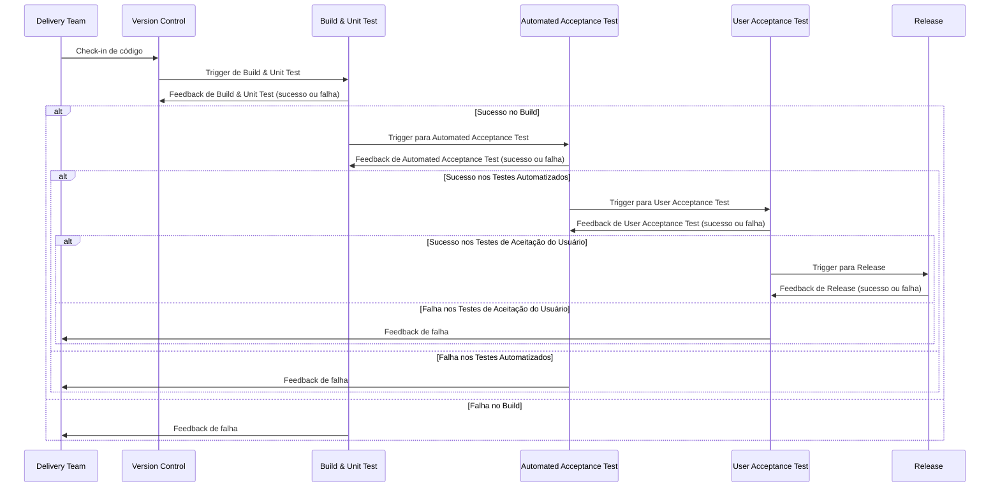

## Introdução
Este guia abrangente visa equipá-lo com o conhecimento e as habilidades necessárias para aproveitar o poder do GitHub Actions de forma eficaz.

O GitHub Actions é um serviço CI/CD (Integração Contínua/Implantação Contínua) versátil, poderoso e totalmente integrado que permite automatizar várias tarefas e processos dentro do seu ciclo de vida de desenvolvimento de software.

Neste capítulo introdutório, fornecerei uma visão geral do GitHub Actions, seus principais recursos e os benefícios de adotá-lo em seu fluxo de trabalho de desenvolvimento.

Também abordaremos alguns casos de uso e cenários comuns em que o GitHub Actions pode agilizar seu processo de desenvolvimento de software, melhorando a eficiência e reduzindo o erro humano.

Ao final, você terá uma sólida compreensão dos conceitos fundamentais por trás do GitHub Actions e uma perspectiva clara sobre como ele pode beneficiar seus projetos de desenvolvimento.

Esta base preparará o cenário para a exploração aprofundada do GitHub Actions nos capítulos subsequentes, onde nos aprofundaremos em tópicos mais avançados e implementações práticas.

| **Aspecto**                | **Continuous Integration (CI)**                                  | **Continuous Delivery (CD)**                                       | **Continuous Deployment (CD)**                                        |
|----------------------------|------------------------------------------------------------------|--------------------------------------------------------------------|-----------------------------------------------------------------------|
| **Objetivo**                | Integrar e testar código frequentemente para detectar erros cedo | Garantir que o código esteja sempre pronto para ser liberado       | Automatizar a liberação do código diretamente para produção          |
| **Frequência de Deploy**    | Nenhum deploy automático; apenas integração e testes contínuos  | Deploy manual para produção, mas o código está sempre pronto      | Deploy automático em produção após testes e validações automáticas   |
| **Ação Manual**             | Não envolve deploy ou release manual                            | A liberação para produção é manual ou por aprovação                | Nenhuma ação manual; o deploy ocorre automaticamente para produção   |
| **Ponto de Feedback**       | Feedback imediato após integração e testes unitários             | Feedback contínuo com a garantia de que o código está pronto para produção | Feedback rápido com liberação contínua após aprovação de testes      |
| **Exemplo de Ferramentas**  | Jenkins, Travis CI, CircleCI, GitLab CI                          | Jenkins, Spinnaker, GitLab CI, Bamboo                               | Jenkins, CircleCI, GitLab CI, AWS CodePipeline                        |
| **Benefício Principal**     | Identificação precoce de problemas de integração e qualidade do código | Liberação mais rápida e controlada para produção, com menos risco de falhas | Entrega contínua, com mudanças sendo rapidamente disponibilizadas para os usuários |
| **Foco**                    | Automatizar testes e integração de código                       | Garantir que o código esteja pronto para produção a qualquer momento | Automatizar todo o processo, incluindo o deploy em produção          |
| **Exemplo de Workflow**     | Desenvolvedor envia código → Testes e integração contínuos      | Código aprovado → Pré-produção → Aprovação manual → Deploy em produção | Código aprovado → Deploy automático em produção                       |



## O que são GitHub Actions?
O GitHub Actions é uma plataforma de automação poderosa integrada ao ecossistema GitHub que permite aos desenvolvedores criar, compartilhar e reutilizar fluxos de trabalho personalizados para automatizar tarefas em seus processos de desenvolvimento de software.

Esta plataforma rica em recursos oferece uma maneira versátil e flexível de definir e executar tarefas, incluindo integração contínua (CI), implantação contínua (CD), teste de código, linting, gerenciamento de problemas e muito mais.

O GitHub Actions simplifica o processo de automatização de fluxos de trabalho ao fornecer um ambiente onde essas tarefas podem ser configuradas e executadas diretamente em seus repositórios GitHub.

Em sua essência, o GitHub Actions usa uma série de **fluxos de trabalho orientados a eventos** para executar tarefas em resposta a gatilhos específicos.

Esses fluxos de trabalho são definidos usando **arquivos YAML**, que são armazenados em um diretório especial dentro do seu repositório **(.github/workflows/)**.

Cada arquivo de fluxo de trabalho consiste em um conjunto de instruções que definem as condições sob as quais o fluxo de trabalho deve ser executado (o gatilho), as tarefas ou "ações" a serem executadas e o ambiente de execução para essas ações.

O GitHub Actions pode ser acionado por vários eventos do GitHub, como enviar código para um repositório, abrir uma solicitação de pull, criar um problema ou até mesmo em uma base programada.

Um dos principais pontos fortes do GitHub Actions é seu design modular.

As ACTIONS **podem ser criadas e compartilhadas** como componentes individuais e reutilizáveis que podem ser facilmente integrados aos seus fluxos de trabalho.

Você pode usar ações pré-construídas fornecidas pelo GitHub, criar suas próprias ações personalizadas ou aproveitar as ações contribuídas pela comunidade disponíveis no GitHub Actions Marketplace.

Essa abordagem modular permite que os desenvolvedores criem fluxos de trabalho sofisticados combinando várias ações de maneira lógica e simplificada, resultando em maior produtividade e eficiência.

O GitHub Actions oferece uma variedade de "executores" predefinidos que servem como ambientes de execução para seus fluxos de trabalho.

Os executores são essencialmente máquinas virtuais que podem ser executadas no Linux, macOS ou Windows, permitindo que você execute seus fluxos de trabalho na plataforma de sua escolha.

O GitHub fornece executores hospedados e gratuitos para repositórios públicos, enquanto repositórios privados recebem uma certa quantidade de uso gratuito a cada mês, com a opção de comprar minutos adicionais, se necessário.

Você também pode escolher hospedar seus próprios executores autogerenciados se precisar de mais controle sobre o ambiente de execução ou precisar cumprir com requisitos de segurança específicos.

Uma das principais vantagens do **GitHub Actions é sua integração perfeita com o ecossistema do GitHub**.

Como ele é construído diretamente na plataforma, não há necessidade de configurar serviços externos ou lidar com chaves de API e outras credenciais. Essa integração estreita com o GitHub permite que os desenvolvedores criem fluxos de trabalho eficientes que automatizam tarefas, como construir e implantar código, executar testes e gerenciar problemas, diretamente na interface familiar do GitHub.

Além disso, o GitHub Actions Marketplace oferece uma ampla gama de ações contribuídas pela comunidade que podem ser facilmente integradas aos seus fluxos de trabalho, fornecendo acesso a uma biblioteca crescente de componentes reutilizáveis.

O GitHub Actions também fornece amplo suporte para personalizar a execução de fluxos de trabalho. Isso inclui a capacidade de controlar o fluxo de tarefas usando instruções condicionais, criar caminhos de execução paralelos e gerenciar dependências entre trabalhos.

Além disso, você pode usar variáveis de ambiente e segredos para armazenar com segurança dados confidenciais e passá-los entre ações, garantindo que seus fluxos de trabalho permaneçam seguros e suas informações confidenciais permaneçam protegidas.

Em resumo, o GitHub Actions é uma plataforma de automação poderosa e flexível que permite que os desenvolvedores criem, compartilhem e reutilizem fluxos de trabalho personalizados para automatizar uma ampla gama de tarefas dentro do processo de desenvolvimento de software.

Sua natureza orientada a eventos, design modular, integração perfeita com o ecossistema GitHub e opções de personalização extensivas o tornam uma ferramenta essencial para equipes modernas de desenvolvimento de software.

Nas seções a seguir, vamos nos aprofundar nos vários recursos e capacidades do GitHub Actions, fornecendo a você o conhecimento e as habilidades necessárias para aproveitar todo o seu potencial e otimizar seus fluxos de trabalho de desenvolvimento de software.


## Introdução
Automatize quase tudo e mantenha tudo o que você precisa para construir, implantar, testar e liberar seu aplicativo no controle de versão.
## GitHub Actions
GitHub Actions é uma plataforma de integração contínua e entrega contínua (CI/CD) que permite automatizar a sua compilação, testar e pipeline de implantação.

GitHub Actions vai além de apenas DevOps e permite que você execute fluxos de trabalho quando outros eventos ocorrerem no seu repositório.

GitHub fornece máquinas virtuais do Linux, Windows e macOS para executar seus fluxos de trabalho, ou você pode hospedar seus próprios executores auto-hospedados na sua própria infraestrutura de dados ou na nuvem.

{width="600" height="450" style="display: block; margin: 0 auto"}

### GitHub Actions Custo
O GitHub Actions é gratuito se uma ou ambas as duas condições a seguir forem atendidas:

- [x] Os repositórios que você usa com ações são públicos.
- [x] Os sistemas nos quais você executa as ações (os executores) são seus (em vez de usar os fornecidos pelo GitHub).

#### Modelo Pago
Repositórios privados
Clientes corporativos/empresariais do GitHub podem frequentemente usar esse modelo.

Existem dois tipos de itens pelos quais você paga com o GitHub Action:

- [x] Armazenamento: Ações permitem que você armazene artefatos e pacotes nos recursos do GitHub.
- [x] Minutos: As ações exigem tempo de processamento em sistemas virtuais.

#### Planos e Preços

<div class="center-table" markdown>
| Planejar	                         | Armazenamento | Minutos (por mês) |
| ------                            | ----:         | ----:             |
| GitHub Free	                      | 500 MB        | 2.000             |
| GitHub Pro	                       | 1 GB          | 3.000             |
| GitHub Free para organizações	    | 500 MB        | 2.000             |
| GitHub Team	                      | 2 GB	         | 3.000             |
| GitHub Enterprise Cloud	          | 50 GB	        | 50.000            |
</div>

<div class="center-table" markdown>
| Sistema Operacional |  Multiplicador de minutos | Taxa por minuto (USD) |
| ----                | -----:                    | -----:                |
| Linux               | 1                         |  0,008                |
| MacOs               | 10                        | 0,008                 |
| Windows             | 2                         | 0,016                 |
</div>

Observação: Eles só podem funcionar quando executados pelo mecanismo do GitHub.

{width="600" height="450" style="display: block; margin: 0 auto"}

## Por que usar o GitHub Actions?
À medida que as práticas de desenvolvimento de software continuam a evoluir, a automação se tornou cada vez mais crítica para melhorar a eficiência, reduzir erros e agilizar processos.

O GitHub Actions oferece uma solução poderosa e flexível para automatizar vários aspectos dos fluxos de trabalho de desenvolvimento de software, tornando-o uma ferramenta essencial para equipes de desenvolvimento modernas.

Discutiremos os principais motivos pelos quais desenvolvedores e organizações devem considerar o uso do GitHub Actions.

### Integração perfeita com o GitHub
O GitHub Actions é fortemente integrado à plataforma GitHub, facilitando para os desenvolvedores criar e gerenciar fluxos de trabalho de automação dentro de seus repositórios existentes.

Essa integração perfeita elimina a necessidade de configurar e manter ferramentas externas, garantindo uma experiência suave e coesa.

Ao aproveitar o ecossistema do GitHub, os desenvolvedores podem aproveitar recursos nativos, como regras de proteção de ramificações, solicitações de pull e rastreamento de problemas, para criar fluxos de trabalho mais eficazes e eficientes.

## Arquitetura orientada a eventos:
O GitHub Actions emprega uma **arquitetura orientada a eventos**, permitindo que os fluxos de trabalho sejam acionados por uma ampla gama de eventos dentro da plataforma GitHub. Isso inclui eventos comuns, como push de código, abertura de pull requests e criação de problemas, bem como eventos agendados e acionadores manuais.

Essa flexibilidade permite que os desenvolvedores criem fluxos de trabalho altamente responsivos que executam tarefas automaticamente em resposta a ações específicas, agilizando o processo de desenvolvimento e reduzindo o potencial de erro humano.

### Tarefa comuns de eventos
- [x] Adicionar novos colaboradores;
- [x] Fechar problemas obsoletos e PRS;
- [x] Solicitação de pull;
- [x] Tarefas organizacionais: Problema criado por usuários;
- [x] Rotular o problema {menor, maior, reproduzível, prioritário etc.};
- [x] Corrigir o problema e levantar um PR;
- [x] Verificar PR e mesclar o código ao principal;
- [x] Nova versão com uma nova versão;
- [x] Construir pipeline para testar e construir código;

### Os eventos podem ser
- [x] Trigger Events
- [x] Schedule Events
- [x] Manually Triggers

**Observação**: É recomendado a colocação workflow_dispatch: durante o processo de desenvolvimento do workflow.

## Ações modulares e reutilizáveis:
Um dos principais pontos fortes do GitHub Actions é sua modularidade.

As ações podem ser criadas e compartilhadas como componentes individuais e reutilizáveis que podem ser facilmente integrados aos fluxos de trabalho. Os desenvolvedores podem escolher entre uma vasta biblioteca de ações pré-construídas fornecidas pelo GitHub, criar suas próprias ações personalizadas ou aproveitar ações contribuídas pela comunidade do GitHub Actions Marketplace.

Essa abordagem modular permite que os desenvolvedores criem fluxos de trabalho sofisticados combinando várias ações de maneira lógica e simplificada, aumentando, em última análise, a produtividade e a eficiência.

### Cross-platform support:
O GitHub Actions fornece suporte multiplataforma, permitindo que os fluxos de trabalho sejam executados em diferentes sistemas operacionais, incluindo **Linux, macOS e Windows**.

Isso permite que os desenvolvedores testem e implantem seus aplicativos em várias plataformas, garantindo compatibilidade e desempenho.

Com suporte para uma variedade de linguagens e estruturas, o GitHub Actions oferece uma solução versátil para diversos ambientes de desenvolvimento.

### Amplas opções de personalização:
O GitHub Actions oferece uma ampla gama de opções de personalização para definir e executar fluxos de trabalho.

Isso inclui a capacidade de controlar o fluxo de tarefas usando instruções condicionais, criar caminhos de execução paralelos e gerenciar dependências entre trabalhos.

Além disso, os desenvolvedores podem usar variáveis de ambiente e segredos para armazenar dados confidenciais com segurança e passá-los entre ações.

Essas opções de personalização permitem que os desenvolvedores criem fluxos de trabalho personalizados que atendam às suas necessidades e requisitos específicos.

### Integração Contínua (CI) e Implantação Contínua (CD):
Implementar práticas de CI e CD é essencial para equipes de desenvolvimento modernas, pois ajuda a garantir a qualidade do código, reduzir erros e acelerar o ciclo de lançamento.

O GitHub Actions simplifica o processo de configuração de pipelines de CI/CD ao fornecer um ambiente onde tarefas como construção, teste e implantação podem ser configuradas e executadas diretamente em seus repositórios do GitHub.

Com suporte integrado para ferramentas e serviços populares de CI/CD, os desenvolvedores podem facilmente criar pipelines eficientes e robustos que automatizam aspectos-chave de seu processo de desenvolvimento.

## Escalabilidade e desempenho:
O GitHub Actions foi projetado para escalar com suas necessidades de desenvolvimento, oferecendo uma solução flexível e de alto desempenho para automação. **Ao utilizar os recursos de paralelismo e construção de matriz, os desenvolvedores podem otimizar seus fluxos de trabalho para velocidade e eficiência**.

O GitHub também fornece executores hospedados que são automaticamente escalados e mantidos, garantindo que seus fluxos de trabalho sejam executados de forma suave e confiável, mesmo que seus projetos cresçam em tamanho e complexidade.

## Segurança e conformidade:
A segurança é uma consideração crítica para qualquer processo de desenvolvimento, e o GitHub Actions fornece uma variedade de recursos para ajudar a garantir a segurança e a conformidade dos seus fluxos de trabalho.

Isso inclui a **capacidade de armazenar dados confidenciais com segurança usando segredos, gerenciar o controle de acesso usando permissões de repositório e monitorar e auditar atividades usando as ferramentas de registro e relatórios integradas do GitHub**.

Para **organizações com requisitos de segurança rigorosos, os executores auto-hospedados podem ser empregados para manter o controle total sobre o ambiente de execução** e garantir a conformidade com as políticas e regulamentações internas.

### Comunidade e ecossistema:
O GitHub Actions se beneficia de uma comunidade grande e ativa de desenvolvedores que contribuem para o GitHub Actions Marketplace, fornecendo uma riqueza de ações pré-construídas para várias tarefas e integrações com serviços de terceiros.

Este ecossistema orientado pela comunidade permite que os desenvolvedores encontrem e utilizem rapidamente ações que podem simplificar seus fluxos de trabalho, economizando tempo e esforço.

Além disso, a natureza colaborativa da plataforma incentiva o compartilhamento de conhecimento e as melhores práticas, fomentando uma cultura de melhoria e inovação contínuas.

### Custo-efetividade:
O GitHub Actions oferece uma solução econômica para automação, especialmente para projetos de código aberto e equipes pequenas.

Repositórios públicos podem usar o GitHub Actions gratuitamente, enquanto repositórios privados recebem uma certa quantidade de uso gratuito a cada mês, com a opção de comprar minutos adicionais, se necessário.

Este modelo de preços de pagamento conforme o uso garante que os desenvolvedores paguem apenas pelos recursos que usam, tornando-o uma escolha atraente para projetos de todos os tamanhos. Concluindo, o GitHub Actions fornece uma solução poderosa, flexível e integrada para automatizar vários aspectos dos fluxos de trabalho de desenvolvimento de software.

Ao alavancar sua arquitetura orientada a eventos, design modular, suporte multiplataforma e opções de personalização extensivas, os desenvolvedores podem criar fluxos de trabalho de automação personalizados que melhoram a eficiência, reduzem erros e simplificam processos.

O suporte da plataforma para CI/CD, recursos de segurança e preços econômicos a tornam uma ferramenta essencial para equipes de desenvolvimento modernas, enquanto sua comunidade ativa e ecossistema próspero garantem que os desenvolvedores tenham acesso a uma riqueza de recursos e melhores práticas.

Ao adotar o GitHub Actions, as equipes de desenvolvimento podem se concentrar em entregar software de alta qualidade de forma mais rápida e confiável, impulsionando, em última análise, a inovação e o sucesso.

### Ações do GitHub vs. Outras ferramentas de CI/CD
No mundo do desenvolvimento de software, há inúmeras ferramentas de Integração Contínua e Implantação Contínua (CI/CD) disponíveis, cada uma com seus próprios recursos e capacidades exclusivos.

Nesta seção, compararemos o GitHub Actions com algumas das ferramentas populares de CI/CD no mercado, destacando suas principais diferenças, pontos fortes e fracos para ajudar você a tomar uma decisão informada ao escolher a ferramenta certa para suas necessidades.

#### Jenkins:
Jenkins é uma ferramenta de CI/CD de código aberto e auto-hospedada que tem sido uma favorita de longa data entre os desenvolvedores devido ao seu amplo ecossistema de plugins e flexibilidade.

Jenkins permite que os desenvolvedores criem pipelines personalizados usando uma linguagem de script chamada Groovy ou por meio de pipelines declarativos usando uma linguagem específica de domínio. Principais diferenças:

- [X] GitHub Actions é um serviço totalmente gerenciado e baseado em nuvem, enquanto Jenkins é uma solução auto-hospedada que requer configuração e manutenção manuais.
- [X] GitHub Actions oferece integração perfeita com a plataforma GitHub, enquanto Jenkins requer configuração e instalação adicionais para trabalhar com seus repositórios.
- [X] Jenkins tem uma curva de aprendizado mais íngreme devido ao uso de Groovy ou uma linguagem específica de domínio para configuração de pipeline, enquanto GitHub Actions depende de arquivos YAML, que geralmente são mais fáceis de ler e escrever.
- [X] Jenkins tem um vasto ecossistema de plugins, mas GitHub Actions se beneficia de um mercado crescente de ações reutilizáveis e contribuições da comunidade.

### GitLab CI/CD:
GitLab CI/CD é uma solução CI/CD integrada fornecida pelo GitLab, uma alternativa popular ao GitHub.

- [X] O GitLab CI/CD é fortemente integrado à plataforma GitLab e permite que os desenvolvedores criem pipelines usando arquivos YAML, semelhante ao GitHub Actions.
- [X] O GitHub Actions faz parte do ecossistema GitHub, enquanto o GitLab CI/CD é exclusivo do GitLab.
- [X] Ambas as plataformas oferecem integração perfeita com seus respectivos serviços de hospedagem de repositórios, tornando a escolha entre os dois amplamente dependente da sua plataforma preferida.
- [X] O GitHub Actions e o GitLab CI/CD têm abordagens de configuração semelhantes usando arquivos YAML, tornando-os relativamente fáceis de aprender e usar.
- [X] O GitLab oferece um conjunto mais abrangente de recursos integrados, incluindo registros de contêineres integrados e armazenamento de artefatos, enquanto o GitHub Actions depende de serviços externos para essas funcionalidades.

### CircleCI:
CircleCI é um serviço de CI/CD baseado em nuvem que fornece uma plataforma altamente configurável e flexível para automatizar fluxos de trabalho de desenvolvimento.

CircleCI suporta uma ampla gama de linguagens de programação e frameworks, e sua configuração de pipeline também é baseada em arquivos YAML.

- [x] O GitHub Actions é integrado diretamente à plataforma GitHub, enquanto o CircleCI é um serviço separado que requer instalação e configuração adicionais.
- [x] O CircleCI fornece uma plataforma altamente otimizada e orientada para o desempenho, com recursos como paralelismo e mecanismos avançados de cache, enquanto o GitHub Actions oferece recursos semelhantes, mas pode exigir mais otimização manual.
- [x] O CircleCI tem um sistema de permissões mais avançado e granular para gerenciar o controle de acesso, enquanto o GitHub Actions depende do sistema de permissões do repositório GitHub.
- [X] Ambas as plataformas oferecem suporte a uma ampla variedade de linguagens, estruturas e plataformas, tornando-as adequadas para diversos ambientes de desenvolvimento.

### Travis CI:
O Travis CI é um serviço de CI/CD baseado em nuvem que tem sido popular entre projetos de código aberto devido à sua simplicidade e facilidade de uso. O Travis CI suporta uma ampla gama de linguagens e plataformas e usa arquivos YAML para configuração de pipeline.

- [X] O GitHub Actions é integrado à plataforma GitHub, enquanto o Travis CI é um serviço externo que requer configuração e integração adicionais.
- [X] O Travis CI tem uma abordagem mais simples e otimizada para configuração de pipeline, facilitando a configuração de fluxos de trabalho básicos, enquanto o GitHub Actions oferece opções de personalização mais avançadas e modularidade.
- [X] O GitHub Actions se beneficia de um mercado crescente de ações reutilizáveis, enquanto o Travis CI depende de um conjunto mais limitado de recursos e integrações integrados.
- [X] O Travis CI recentemente mudou seu foco de projetos de código aberto, limitando sua oferta gratuita e tornando-o menos atraente para desenvolvedores de código aberto, enquanto o GitHub Actions continua a oferecer uso gratuito para repositórios públicos.

### Azure Pipelines:
O Azure Pipelines é um serviço de CI/CD baseado em nuvem oferecido pela Microsoft como parte do pacote Azure DevOps.

Ele oferece suporte a uma ampla variedade de linguagens, frameworks e plataformas, e sua configuração de pipeline é baseada em arquivos YAML, semelhante ao GitHub Actions.

- [x] O GitHub Actions é integrado nativamente à plataforma GitHub, enquanto o Azure Pipelines faz parte do conjunto Azure DevOps, exigindo configuração e instalação adicionais.
- [x] O Azure Pipelines fornece integração perfeita com outros serviços do Azure DevOps, como Azure Repos, Azure Boards e Azure Artifacts, tornando-o uma solução mais abrangente para organizações que usam o ecossistema Azure DevOps.
- [x] Ambas as plataformas oferecem uma ampla gama de opções de personalização e suporte para diversos ambientes de desenvolvimento, mas o GitHub Actions se beneficia de um mercado crescente de ações reutilizáveis e contribuições da comunidade.
- [x] O Azure Pipelines fornece limites de uso gratuito mais generosos para repositórios privados em comparação ao GitHub Actions, tornando-o uma opção atraente para equipes menores e projetos com orçamentos limitados.

Concluindo, o GitHub Actions é uma ferramenta de CI/CD poderosa e flexível que oferece integração perfeita com a plataforma GitHub, uma arquitetura orientada a eventos e um design modular que permite que os desenvolvedores criem fluxos de trabalho de automação personalizados.

Embora outras ferramentas de CI/CD, como Jenkins, GitLab CI/CD, CircleCI, Travis CI e Azure Pipelines tenham seus próprios recursos e pontos fortes exclusivos, a escolha depende, em última análise, de fatores como sua plataforma de hospedagem de repositório preferida, requisitos de integração, necessidades de personalização e restrições de orçamento.

Ao entender as principais diferenças entre o GitHub Actions e outras ferramentas de CI/CD, você pode tomar uma decisão informada sobre a melhor solução para seus fluxos de trabalho de desenvolvimento.

Independentemente da sua escolha, adotar uma ferramenta de CI/CD é essencial para equipes modernas de desenvolvimento de software, pois ajuda a garantir a qualidade do código, reduzir erros e acelerar o ciclo de lançamento, impulsionando, em última análise, a inovação e o sucesso.

### Introdução ao GitHub Actions
Neste capítulo, nós o guiaremos pelos primeiros passos do uso do GitHub Actions em seus projetos. Começaremos apresentando os blocos de construção básicos de um fluxo de trabalho do GitHub Actions, que incluem sintaxe YAML, arquivos de fluxo de trabalho e vários gatilhos de eventos.

Ao entender esses conceitos fundamentais, você estará bem preparado para criar e personalizar seus próprios fluxos de trabalho.

Em seguida, nós o guiaremos pela configuração do seu primeiro fluxo de trabalho, desde a criação de um arquivo de fluxo de trabalho até a definição dos trabalhos e etapas necessários.

Essa abordagem prática ajudará você a ganhar experiência prática com a interface e a estrutura do fluxo de trabalho do GitHub Actions.

Além disso, discutiremos contextos e expressões essenciais do GitHub Actions, que permitirão que você crie fluxos de trabalho dinâmicos e condicionais adaptados às suas necessidades específicas.

Essas ferramentas são cruciais para otimizar seus fluxos de trabalho e garantir que eles respondam efetivamente a vários eventos e circunstâncias.

Ao final deste capítulo, você terá uma compreensão sólida dos conceitos básicos do GitHub Actions e estará pronto para implementar fluxos de trabalho simples em seus projetos de desenvolvimento.

Com essa base, você estará bem equipado para explorar recursos e técnicas mais avançados nos capítulos subsequentes.

### Configurando seu primeiro fluxo de trabalho do GitHub Actions
Agora que cobrimos os fundamentos do GitHub Actions e discutimos seus benefícios e como ele se compara a outras ferramentas de CI/CD, é hora de mergulhar na criação do seu primeiro fluxo de trabalho.

Nesta seção, guiaremos você pelo processo de configuração de um fluxo de trabalho básico do GitHub Actions para automatizar a construção e o teste de um projeto de amostra.

### Crie um novo repositório no GitHub:
Antes de começar, crie um novo repositório no GitHub (se você ainda não tiver um) para hospedar seu projeto. Este repositório servirá como base para seu fluxo de trabalho do GitHub Actions.

Certifique-se de ter inicializado o repositório com um arquivo README e adicionado seus arquivos de projeto.

#### Adicionar um arquivo de fluxo de trabalho:
Os fluxos de trabalho do GitHub Actions são definidos usando arquivos YAML armazenados no diretório `.github/workflows` dentro do seu repositório.

Para criar seu primeiro fluxo de trabalho, siga estas etapas:

- [X] No seu repositório, navegue até a aba "Ações".
- [X] Clique no botão "Novo fluxo de trabalho".
- [X] O GitHub fornece vários modelos de fluxo de trabalho para você escolher. Você pode usar um desses modelos como ponto de partida ou criar um novo fluxo de trabalho do zero clicando em "Configurar um fluxo de trabalho você mesmo".
- [X] Isso criará um novo arquivo YAML no diretório .github/workflows. Dê ao seu arquivo de fluxo de trabalho um nome descritivo, como build-and-test.yml.

Fluxos de trabalho **reutilizáveis** permitem que você reutilize um fluxo de trabalho inteiro, incluindo todas as suas tarefas e etapas.

<div class="center-table" markdown>
| Fluxos de trabalho reutilizáveis	| Ações compostas   |
| --------                          | ---------       |
| Um arquivo YAML, muito semelhante a qualquer arquivo de fluxo de trabalho padrão	                       | Uma ação que contém um pacote de etapas do fluxo de trabalho |
| Cada fluxo de trabalho reutilizável é um único arquivo no diretório .github/workflows de um repositório | Cada ação composta é um repositório, ou um diretório, separado contendo um arquivo action.yml e, opcionalmente, outros arquivos |
| Chamada feita referenciando um arquivo YAML específico                                                   | Chamada feita referenciando um repositório ou diretório no qual a ação está definida |
| Chamada feita diretamente em uma tarefa, não em uma etapa	| Execução feita como uma etapa dentro de uma tarefa |
| Pode conter várias tarefas                                                                               | Não contém tarefas |
| Cada etapa é registrada em tempo real	                                                                   | Registro como uma etapa, mesmo que contenha várias etapas |
| Pode conectar um máximo de quatro níveis de fluxos de trabalho                                           | O aninhamento pode ser feito para ter até 10 ações compostas em um único fluxo de trabalho |
| Pode usar segredos	                                                                                   | Não pode usar segredos
</div>

Os fluxos de trabalho são os scripts ou pipelines que controlam o fluxo e a sequência de atividades no GitHub Actions.

As ações individuais são as funções que podem ser chamadas para fazer tarefas direcionadas de dentro dos fluxos de trabalho (como verificar o código).

#### Visão Geral
Algum evento de disparo acontece em um repositório GitHub, ser um evento no GitHub que não é uma atualização para uma ref.

Um diretório dedicado no repositório **(.github/ workflows)** é pesquisado para arquivos de fluxo de trabalho que são codificados para responder ao tipo de evento.

Os fluxos de trabalho correspondentes são identificados e novas execuções dos fluxos de trabalho correspondentes

A sintaxe `cron` tem cinco campos separados por um espaço, e cada campo representa uma unidade de tempo.

As variáveis de ambiente padrão definidas pelo GitHub estão disponíveis em todas as etapas de um fluxo de trabalho.

{width="600" height="450" style="display: block; margin: 0 auto"}

#### Defina os gatilhos do fluxo de trabalho
No seu novo arquivo YAML, comece definindo os eventos que devem disparar seu fluxo de trabalho. Para este exemplo, configuraremos o fluxo de trabalho para ser executado em cada solicitação push e pull para o branch principal.

Adicione as seguintes linhas ao seu arquivo de fluxo de trabalho:

```
 on:
  push:
    branches:
      - main
  pull_request:
    branches:
      - main
```
#### Configure o ambiente do fluxo de trabalho
Em seguida, especifique o sistema operacional e o ambiente da linguagem de programação para seu fluxo de trabalho.

Neste exemplo, usaremos um ambiente baseado em Ubuntu com Node.js. Adicione as seguintes linhas ao seu arquivo de fluxo de trabalho:

```
jobs:
  build-and-test:
     runs-on: self-hosted
  steps:
```
#### Verifique seu repositório
Para acessar os arquivos do seu repositório dentro do fluxo de trabalho, você precisará verificar o repositório usando a ação actions/checkout.

Adicione as seguintes linhas ao seu arquivo de fluxo de trabalho:

```
- name: Checkout repository
  uses: actions/checkout@v4
```

#### Configure seu ambiente de linguagem de programação
Neste exemplo, estamos usando Node.js, então precisaremos configurar o ambiente Node.js usando a ação actions/setup-node.

Adicione as seguintes linhas ao seu arquivo de fluxo de trabalho:

```
- name: Set up Node.js
  uses: actions/setup-node@v4
  with:
   node-version: 14
```

### Instalar dependências e executar build
Com o ambiente configurado, agora você pode instalar as dependências do seu projeto e executar o processo de build.

Supondo que seu projeto use npm, adicione as seguintes linhas ao seu arquivo de fluxo de trabalho:

```
- name: Install dependencies
  run: npm ci
- name: Build project
  run: npm run build
```
### Executar Testes
Finalmente, adicione uma etapa para executar os testes do seu projeto usando o executor de testes de sua escolha.

Neste exemplo, usaremos o npm test. Adicione as seguintes linhas ao seu arquivo de fluxo de trabalho:

```
- name: Run tests
   run: npm test
```
### Salve e confirme o arquivo de fluxo de trabalho
Depois de terminar de configurar seu fluxo de trabalho, salve o arquivo YAML e confirme-o em seu repositório.

Isso habilitará automaticamente o fluxo de trabalho e ele será acionado com base nos eventos que você definiu.

Com esse fluxo de trabalho básico do GitHub Actions em vigor, seu projeto será criado e testado automaticamente em cada solicitação de push e pull para o branch principal.

Este é apenas o começo do que você pode fazer com o GitHub Actions, pois há muito mais opções de personalização e integrações disponíveis para ajudar a simplificar e automatizar seus processos de desenvolvimento.

Conforme você continua a explorar o GitHub Actions, você pode aproveitar o crescente mercado de ações reutilizáveis para expandir seus recursos de fluxo de trabalho, como implantar seu aplicativo em várias plataformas de hospedagem, enviar notificações e integrar com serviços de terceiros.

O design modular e a arquitetura orientada a eventos do GitHub Actions permitem que você crie fluxos de trabalho de automação personalizados que atendem às suas necessidades específicas, garantindo que seus processos de desenvolvimento sejam tão eficientes e simplificados quanto possível.

Nas seções a seguir, nos aprofundaremos nos recursos avançados e nas opções de personalização do GitHub Actions, ajudando você a desbloquear todo o seu potencial e transformar seus fluxos de trabalho de desenvolvimento de software.

### Entendendo a sintaxe YAML
Para trabalhar efetivamente com o GitHub Actions, é essencial entender a sintaxe YAML usada para definir fluxos de trabalho.

YAML, que significa "YAML Ain't Markup Language", é um formato de serialização de dados legível por humanos comumente usado para arquivos de configuração e troca de dados entre linguagens com diferentes estruturas de dados.

Abordarei os conceitos básicos da sintaxe YAML e forneceremos exemplos para ajudar você a entender melhor como escrever e manter seus arquivos de fluxo de trabalho do GitHub Actions.

Entender a sintaxe YAML é crucial para trabalhar efetivamente com o GitHub Actions, pois permite que você crie e mantenha fluxos de trabalho complexos e eficientes.

Ao dominar os diferentes aspectos do YAML, você pode escrever arquivos de fluxo de trabalho mais sustentáveis, legíveis e escaláveis, garantindo que seus processos de desenvolvimento sejam simplificados e otimizados.

Vamos nos aprofundar nos recursos avançados e opções de personalização do GitHub Actions, ajudando você a desbloquear todo o seu potencial e transformar seus fluxos de trabalho de desenvolvimento de software.

#### Estrutura básica
Os arquivos YAML usam recuo para representar a estrutura dos dados, semelhante a como linguagens de programação como Python usam espaços em branco.

Os blocos de construção básicos do YAML são escalares (strings, números e booleanos), sequências (matrizes ou listas) e mapeamentos (pares chave-valor ou dicionários).

YAML permite novas linhas significativas e recuo, semelhante ao Python, mas, ao contrário do Python, proíbe o uso de caracteres de tabulação literais para recuo.

Aqui está um exemplo simples da sintaxe YAML:

```
version: 1
  languages:
    - Python
    - JavaScript
    - Go

frameworks:
  Python:
    - Django
    - Flask
  JavaScript:
    - React
    - Vue
```

#### Escalares
Escalares são o tipo de dado mais simples em YAML e incluem strings, números e booleanos. Strings podem ser escritas com ou sem aspas, mas geralmente é melhor usar aspas ao lidar com caracteres especiais ou espaços em branco. Números podem ser escritos como inteiros ou valores de ponto flutuante. Booleanos são representados usando true e false.

Exemplo:

```
string: "Hello, World!"
integer: 42
float: 3.14
boolean: true
```
#### Sequências
Sequências são coleções ordenadas de itens, semelhantes a arrays ou listas em linguagens de programação. Em YAML, você pode representar uma sequência iniciando cada item em uma nova linha com um hífen seguido por um espaço.

Exemplo:

```
Languages:
   - Python
   - JavaScript
   - Go
```
#### Mappings
Mapeamentos representam pares chave-valor, semelhantes a dicionários ou mapas hash em linguagens de programação. Em YAML, você pode criar um mapeamento escrevendo a chave, seguida por dois pontos e um espaço, e então o valor.

Exemplo:

```
Frameworks:
   Python:
     Django
     JavaScript: React
     Go: Gin
```
### Estruturas de dados complexas
Você pode criar estruturas de dados mais complexas em YAML combinando sequências e mapeamentos. Por exemplo, você pode ter uma sequência de mapeamentos ou um mapeamento com sequências como valores.

Exemplo:

```
projects:
   - name: Project A
     language: Python
     frameworks:
       - Django
       - Flask
   - name: Project B
     language: JavaScript
     frameworks:
        - React
        - Vue
```

### [Anchors and aliases](https://github.com/actions/runner/issues/1182#issuecomment-2722005293)
YAML fornece uma maneira de reutilizar partes da sua configuração usando âncoras e aliases.

Uma âncora é definida adicionando `&` seguido por um nome exclusivo após um valor, enquanto um alias é referenciado usando seguido pelo nome da âncora.
Exemplo:

```
defaults: &default_setting
timeout: 10
retries: 3
Job_a:
<<: *default_settings
name: Job A
Job_b:
<<: *default_settings
name: Job B
```
#### Multi-line strings
YAML suporta strings multi-linha usando o caractere pipe '|' ou maior que '>'.

O caractere **pipe preserva novas linhas na string**, enquanto o caractere **maior que converte novas linhas em espaços**. Exemplo:

```
multiline_pipe: |
   This is a multi-line
   string with preserved
   Newlines.
multiline_gt: >
   This is a multi-line
   string with newlines
   converted to spaces.


# Este é um exemplo de um Workflow

name: 17-manual_teste_variavel_linha

on:
  workflow_dispatch:


# A workflow run is made up of one or more jobs that can run sequentially or in parallel
jobs:
  # This workflow contains a single job called "greet"
  greet:
    # The type of runner that the job will run on
    runs-on: [ self-hosted, linux ]

    # Steps represent a sequence of tasks that will be executed as part of the job
    steps:
    # Runs a single command using the runners shell
    - name: Send greeting
      run: echo "Hello ${{ inputs.name }}"

    - name: Usando | para string multi-linha
      run: |
            echo "Esta é uma linha
            e aqui começa outra linha" > output10.txt

    - name: Redirecionando string para um arquivo com >
      run: |
          echo "Esta é a primeira linha
          Esta é a segunda linha
          Esta é a terceira linha" > output20.txt

    - name: Mostrar conteúdo do arquivo com >
      run: |
            cat output10.txt
            echo "--------------------------- Separando ----------------------"
            cat output20.txt
```

#### Comentários
Você pode adicionar **comentários** em arquivos YAML iniciando uma linha com o caractere `#`. Comentários podem ajudar a documentar sua configuração e facilitar para outros entenderem seu fluxo de trabalho. Exemplo:

```
# Este é um comentário em YAML
versão: 1 # Você também pode adicionar comentários inline
```

```
steps:
  - name: Show warning
    run: echo "::warning::Esta é uma mensagem de alerta importante"

  - name: Outras mensagens
    run: |
          echo "::notice::Mensagem informativa"     # Azul (padrãopara informações)
          echo "::warning::Mensagem de alerta"      # Amarelo(avisos)
          echo "::error::Mensagem de erro"          # Vermelho(erros críticos)
          echo "::debug::Mensagem de debug"         # Somentevisível com ativação de debug
          echo "::group::Título da seção"           # Inicia gruporecolhível
          echo " Teste da Seção"
          echo "::endgroup::"                       # Fecha grupo
          echo "::add-mask::valor_secreto"          # Mascaravalores sensíveis nos logs
          echo "::warning file=app.js,line=10,col=15::Erro desintaxe"  # Com localização
          echo "::notice title=TítuloCustomizado::Mensagem"            # Com título
```

**Observaçao**: Por uma questão de Markdown, optou-se em não deixar o comentário em uma única linha.

#### Variáveis de ambiente
Nos fluxos de trabalho do GitHub Actions, você pode usar variáveis de ambiente para armazenar e passar dados entre etapas. Para definir uma variável de ambiente, use a chave `env:` seguida pelo nome e valor da variável. Exemplo:

```
jobs:
  build:
    runs-on: self-hosted
    env:
      MY_VARIABLE: my_value
    steps:
      - name: Print environment variable
         run: echo $MY_VARIABLE
```
## Anatomia de um fluxo de trabalho de ações do GitHub
Para aproveitar totalmente os recursos do GitHub Actions, é essencial entender os diferentes componentes que compõem um fluxo de trabalho.

Dissecaremos a anatomia de um fluxo de trabalho do GitHub Actions, explicando cada elemento em detalhes e fornecendo exemplos para ajudar você a compreender sua função e uso.

### Workflow triggers
Os gatilhos de fluxo de trabalho definem os eventos que iniciam a execução de um fluxo de trabalho do GitHub Actions.

Você pode especificar vários eventos, como pushes, pull requests ou até mesmo eventos personalizados, para iniciar o fluxo de trabalho.

Os gatilhos são definidos usando a palavra-chave `on:`, seguida pelos nomes dos eventos e qualquer configuração adicional. Exemplo:

```
on:
  push:
    branches:
      - main
    pull_request:
      branches:
        - main
    schedule:
      - cron: '0 12 ***'
```

{width="600" height="450" style="display: block; margin: 0 auto"}

### [Categorias dos Fluxos de Trabalho](https://github.com/actions/starter-workflows)

<div class="center-table" markdown>
| Categoria           | Descrição |
| ----                | ----      |
| Automação           | Alguns exemplos simples de automação básica.  |
| Páginas             | Fluxos de trabalho para empacotar/implantar sites usando ferramentas comuns como Gatsby, Astro, Jekyll, etc. |
| Segurança           | Conjunto de fluxos de trabalho de varredura de código usando vários métodos de segurança plataformas e suas ferramentas.                     |
| Implantação         | Fluxos de trabalho de exemplo para criar objetos implantáveis (como contêineres) e, em seguida, implantá-los em várias plataformas de nuvem. |
| Integração Contínua | número de fluxos de trabalho que abrangem as áreas de construção, teste e/ou publicação para um grande número de diferentes programas linguagens e ferramentas. |
</div>

### Jobs
Um fluxo de trabalho consiste em um ou mais jobs, que são unidades individuais de trabalho que são executadas em paralelo por padrão. Os trabalhos são definidos usando a palavra-chave `jobs:`, seguida por um identificador exclusivo para cada trabalho e sua configuração. Exemplo:

```
jobs:
  build:
    runs-on: self-hosted
    steps:
      - name: Build project
        run: npm run build
  test:
    runs-on: self-hosted
    steps:
    - name: Run tests
      run: npm test
```

### Job dependencies
Por padrão, os trabalhos são executados em paralelo, mas você pode especificar dependências entre os trabalhos usando a palavra-chave `needs:`. Isso pode ser útil para criar fluxos de trabalho sequenciais em que certos trabalhos devem ser concluídos antes que outros possam começar. Exemplo:

```
jobs:
build:
  runs-on: self-hosted
  steps:
    - name: Build project
       run: npm run build
test:
  runs-on: self-hosted
  needs: build
  steps:
    - name: Run tests
      run: npm test
```

### Job environment
Cada trabalho é executado em um ambiente específico definido pela palavra-chave `runs-on:`, que especifica o sistema operacional e a versão do trabalho. O GitHub Actions fornece vários ambientes pré-construídos, como **ubuntu-latest**, **windows-latest** e **macos-latest**. Exemplo:

```
jobs:
  build:
    runs-on: self-hosted
```
### Steps
Os trabalhos são compostos de uma ou mais etapas, que são tarefas individuais executadas sequencialmente dentro de um trabalho. As etapas podem usar ações pré-construídas do mercado GitHub Actions, ações personalizadas ou simplesmente executar comandos shell. As etapas são definidas usando a palavra-chave `steps:`, seguida por uma lista de configurações de etapas. Exemplo:

```
jobs:
  build:
    runs-on: self-hosted
    steps:
      - name: Checkout repository
        uses: actions/checkout@v4
      - name: Set up Node.js
        uses: actions/setup-node@v4
        with:
          node-version: 14
      - name: Install dependencies
          run: npm ci
      - name: Build project
         run: npm run build
```
### Actions
Ações são unidades reutilizáveis de código que podem ser incluídas como etapas no seu fluxo de trabalho. Você pode usar ações **pré-criadas** do marketplace GitHub Actions, **criar suas próprias ações** personalizadas ou **referenciar ações** de outros repositórios.

As ações são referenciadas usando a palavra-chave `uses:`, seguida pelo repositório de ações e versão. Exemplo:

```
steps:
- name: Checkout repository
  uses: actions/checkout@v4
```

As ações podem ser:

- [x] **Reutilizável**: as ações podem ser usadas em diferentes fluxos de trabalho e repositórios, permitindo que você evite reescrever o mesmo código.
- [x] **Pré-escrito**: muitas ações estão disponíveis no GitHub Marketplace, abrangendo uma ampla gama de tarefas, como verificar código, configurar ambientes, executar testes e implantar aplicativos.
- [x] **Configurável**: você pode configurar ações com entradas, saídas e variáveis de ambiente para adaptá-las às suas necessidades específicas.
- [x] **Orientado pela comunidade**: você pode criar suas próprias ações e compartilhá-las com outras pessoas ou usar ações desenvolvidas pela comunidade.

### Inputs and outputs
Você pode passar dados entre etapas usando entradas e saídas.

As entradas são definidas usando a palavra-chave `with:`, seguida por um mapeamento de nomes e valores de entrada.

As saídas são definidas usando a palavra-chave `id:` para atribuir um identificador exclusivo a uma etapa e, em seguida, acessadas usando o contexto steps em etapas subsequentes. Exemplo:

```
name: Exercicio 01
on:
  workflow_dispatch:
jobs:
  build_random:
    name: build_random
    runs-on: self-hosted
    env:
      API_BASE_URL: "https://api.example.com"
    steps:
    - name: Imprime variavel
      run: echo "Nome da variacel $API_BASE_URL"

    - name: Generate a random number
      id: random_number
      # Obsoleto: run: echo "::set-output name=number::$(shuf -i 1-100 -n 1)"
      run: echo "numero=$(shuf -i 1-100 -n 1)" >> "$GITHUB_OUTPUT"
    - name: Print the random number
      run: |
            echo "The random number is ${{ steps.random_number.outputs.numero }}"
            echo "Parte: ${API_BASE_URL}"
```
Outro exemplo:
```
# This is a basic workflow that is manually triggered

name: 18-input-output-variaveis

on:
  workflow_dispatch:  # Permite a execução manual do workflow e a entrada de parâmetros
    inputs:
      environment:
        description: 'Ambiente específico (opcional)'
        required: false
        default: 'all'
        type: choice
        options:
        - all
        - DEVELOPER
        - HOMOLOGACAO
        - PRODUCAO
jobs:
  input_output_job:
    runs-on: [ self-hosted, linux ]
    steps:

      # Etapa 1: Recebe o input
      - name: Solicitar Input do Usuário
        id: input_step
        run: |
          # Solicita o input através de uma variável definida pelo usuário na execução do workflow
          echo "Input fornecido: ${{ github.event.inputs.environment }}"
          # echo "::set-output name=processed_input::${{ github.event.inputs.user_input }}"
          echo "name=${{ github.event.inputs.environment }}" >> $GITHUB_OUTPUT


      # Etapa 2: Usar o Output da Etapa 1
      - name: Usar o Output da Etapa 1
        run: |
          # Usa o valor de output da etapa anterior
          echo "O output processado da etapa 1 é: ${{ steps.input_step.outputs.name }}"
```

### Environment variables and secrets
Variáveis de ambiente e segredos permitem que você armazene e passe dados sensíveis ou reutilizáveis entre etapas.

Variáveis de ambiente são definidas usando a palavra-chave `env:`, enquanto segredos são gerenciados nas configurações do repositório e acessados usando o contexto `secrets.`. Exemplo:

```
  build_random:
    name: build_random
    runs-on: self-hosted
    env:
      API_BASE_URL: "https://api.example.com"
    run: |
          echo "Deploying to $API_BASE_URL"
          curl -H "Authorization: Bearer ${{ secrets.DEPLOY_TOKEN }}" -X POST $API_ BASE_URL/deploy
```

```
name: 19-environment-secrets
on:
  workflow_dispatch:  # Permite disparar o workflow manualmente
jobs:
  print_secret:
    runs-on: ubuntu-latest
    environment: DESENVOLVIMENTO
    steps:
      - name: Acessar e imprimir o valor de EMAIL_PASS
        run: |
              echo "O valor do EMAIL_PASS é: ${{ secrets.EMAIL_PASS }}"
```

### Contexts
Contextos no GitHub Actions fornecem acesso a vários tipos de metadados relacionados à execução atual do fluxo de trabalho, como o evento que acionou o fluxo de trabalho, o repositório, o trabalho, o executor e quaisquer entradas personalizadas.

Eles permitem que você crie fluxos de trabalho dinâmicos e flexíveis que podem se adaptar a diferentes situações com base nos metadados disponíveis.

Por exemplo, você pode usar o contexto do `GITHUB` para acessar informações sobre o evento que acionou o fluxo de trabalho, como o tipo de evento, o ator que iniciou o evento e o SHA de confirmação associado.

Da mesma forma, o contexto de segredos permite que você acesse com segurança segredos criptografados armazenados nas configurações do seu repositório.

Para acessar dados de contexto, você pode usar a sintaxe `${{ context }}` no seu arquivo de fluxo de trabalho. Aqui está um exemplo de uso do contexto do github para acessar o nome do evento:

```
name: 20-imprimir-contexto-github
on:
  workflow_dispatch:  # Permite disparar o workflow manualmente
jobs:
  print_github_context:
    runs-on: [ self-hosted, Linux]
    steps:
      - name: Imprimir informações do contexto GitHub
        run: |
          # Imprimindo o contexto github completo
          echo "Repositório: ${{ github.repository }}"
          echo "Evento: ${{ github.event_name }}"
          echo "Branch: ${{ github.ref }}"
          echo "SHA do Commit: ${{ github.sha }}"
          echo "Ator do Commit: ${{ github.actor }}"
          echo "Padrão de caminho: ${{ github.event.pull_request.head.ref }}"
          echo "Número da PR: ${{ github.event.pull_request.number }}"
          echo "Tipo de workflow: ${{ github.workflow }}"
```

### Workflow Contexts
Contextos são uma maneira de acessar informações sobre execuções de fluxo de trabalho, variáveis, ambientes de execução, trabalhos e etapas.

Cada contexto é um objeto que contém propriedades, que podem ser strings ou outros objetos.

Você pode acessar contextos usando a sintaxe de expressão.`${{ <context> }}`

| Tipo     | Descrição                                                                                                  |
| ----     | ----                                                                                                       |
| github   | Informações sobre a execução do fluxo de trabalho.                                                         |
| env      | Contém variáveis definidas em um fluxo de trabalho, tarefa ou etapa.                                       |
| vars     | Contém variáveis definidas nos níveis de repositório, organização ou ambiente.                             |
| job      | Informações sobre a tarefa em execução no momento.                                                         |
| jobs     | Somente para fluxos de trabalho reutilizáveis, contém saídas de tarefas do fluxo de trabalho reutilizável. |
| steps    | Informações sobre as etapas que foram executadas na tarefa atual.                                          |
| runner   | Informações sobre o executor que está executando a tarefa atual.                                           |
| secrets  | Contém os nomes e valores de segredos que estão disponíveis para uma execução de fluxo de trabalho.        |
| strategy | Informações sobre a estratégia de execução da matriz para a tarefa atual.                                  |
| matrix   | Contém as propriedades da matriz definidas no fluxo de trabalho que se aplicam à tarefa atual.             |
| needs    | Contém as saídas de todas as tarefas que são definidas como uma dependência da tarefa atual.               |
| inputs   | Contém as entradas de um fluxo de trabalho reutilizável ou acionado manualmente.                           |

```
steps:
  - name: Use Secret as Env Var
    run: echo "Secret Value: $MY_SECRET"
    env:
      MY_SECRET: ${{ secrets.MY_SECRET }}
```
### Expressões
Expressões no GitHub Actions são uma maneira poderosa de avaliar e manipular dados dentro dos seus arquivos de fluxo de trabalho.

Elas permitem que você execute cálculos, acesse dados de contexto e controle o fluxo do seu fluxo de trabalho com base em condições.

As expressões são encapsuladas em chaves duplas, como `${{ expression }}`.

As expressões do GitHub Actions oferecem suporte a uma variedade de funções, operadores e literais que você pode usar para criar lógica complexa em seus fluxos de trabalho.

Por exemplo, você pode usar a função contains para verificar se uma string contém uma substring específica ou pode usar o operador `==` para comparar dois valores para igualdade.

Aqui está um exemplo de uso de expressões para executar condicionalmente uma etapa com base no evento que acionou o fluxo de trabalho:

```
name: 21-expressoes-impressao-steps
on:
  workflow_dispatch:
jobs:
  build:
   runs-on: [ self-hosted, Linux ]
   steps:
     - name: Log event name
       run: |
             echo "Você esta no repositorio horaciovasconcellos/estudo-actions"
             echo "Exemplo: ${{ github.repository }}"
       if: ${{ github.repository  == 'horaciovasconcellos/estudo-actions' }}
```

Neste exemplo, a palavra-chave `if` é combinada com uma expressão para controlar se a etapa será executada.

A etapa será executada somente se o evento que disparou o fluxo de trabalho for um evento de solicitação de pull.

Ao incorporar contextos e expressões em seus fluxos de trabalho do GitHub Actions, você pode criar processos de automação mais dinâmicos, flexíveis e adaptáveis que atendem às necessidades exclusivas de seus projetos de desenvolvimento.

### Workflow status badges
Para exibir o status dos seus fluxos de trabalho do GitHub Actions no README do seu repositório ou em outra documentação, você pode usar emblemas de status do fluxo de trabalho. A URL do emblema pode ser gerada usando o seguinte padrão: `https://github.com/<OWNER>/<REPOSITORY>/actions/workflows/<WORKFLOW_FILE>/badge.svg`. Exemplo:


- [x] O badge mostrará:
    - [x] ✅ (verde) quando o último workflow foi bem-sucedido
    - [x] ❌ (vermelho) quando falhou
    - [x] 🟠 (amarelo/laranja) quando está em andamento ou foi cancelado

Ao entender a anatomia de um fluxo de trabalho do GitHub Actions, você pode criar fluxos de trabalho mais eficientes, sustentáveis e escaláveis, adaptados às suas necessidades específicas.

Continuaremos explorando recursos avançados e opções de personalização do GitHub Actions, ajudando você a desbloquear todo o seu potencial e revolucionar seus processos de desenvolvimento de software.

## Construindo seu primeiro fluxo de trabalho
Vamos agora orientá-lo no processo de criação do seu primeiro fluxo de trabalho do GitHub Actions do zero.

Meu objetivo é ajudar você a obter uma compreensão prática de como criar e configurar fluxos de trabalho para automatizar várias tarefas em seus projetos de desenvolvimento.

Um workflow do GitHub Actions é um conjunto de códigos que define:

- [x] Uma sequência e um conjunto de etapas para executar, semelhante a um script ou programa.

Começaremos discutindo diferentes tipos de gatilhos de fluxo de trabalho, incluindo:
- [x] Gatilhos baseados em eventos;
    - [x] Disparam quando ocorrem eventos específicos no repositório:
        - [x] push: Quando código é enviado para um branch ou tag
        - [x] pull_request: Quando há atividade em pull requests (abertura, atualização, etc.)
        - [x] issues: Quando issues são abertas, editadas, fechadas, etc.
        - [x] fork: Quando o repositório é bifurcado
        - [x] release: Quando uma nova release é publicada
        - [x] watch: Quando alguém começa a "observar" o repositório
        - [x] star: Quando o repositório recebe uma estrela
        - [x] discussion: Eventos relacionados a discussões
- [x] Gatilhos Baseados em Agenda (Scheduled)
    - [x] Disparam em horários específicos usando sintaxe cron
        - [x] schedule:
            - [x] cron: '0 0 * * *'  # Executa diariamente à meia-noite
- [x] Gatilhos Manuais
    - [x] Permitem executar workflows manualmente:
        - [x] workflow_dispatch: Disparado através da interface do GitHub ou API
        - [x] repository_dispatch: Disparado por eventos externos via API
- [x] Gatilhos de Webhook
    - [x] Disparam quando webhooks específicos são recebidos
- [x] Gatilhos Específicos
    - [x] workflow_run: Dispara quando outro workflow é concluído
    - [x] check_suite: Relacionado a verificações de código
    - [x] label: Quando labels são criadas, editadas ou removidas
    - [x] milestone: Eventos relacionados a milestone

Exemplo:
```
name: 31-multi_trigger_exemplo

on:
  # Gatilho manual
  workflow_dispatch:
    inputs:
      environment:
        description: 'Ambiente para deploy'
        required: true
        default: 'staging'
      debug:
        description: 'Executar em modo debug?'
        type: boolean
        default: false

  # Gatilho quando outro workflow é concluído
  workflow_run:
    workflows: ["CI Pipeline"]  # Nome do workflow que deve ser concluído
    branches: [main]
    types:
      - completed

  # Gatilho para eventos de check suite
  check_suite:
    types:
      - completed

  # Gatilho para eventos de label
  label:
    types:
      - created
      - edited
      - deleted

  # Gatilho para eventos de milestone
  milestone:
    types:
      - created
      - closed

jobs:
  process-event:
    runs-on: ubuntu-latest
    steps:
      - name: Check event type
        run: |
          echo "Evento que disparou o workflow: ${{ github.event_name }}"

          case "${{ github.event_name }}" in
            "workflow_dispatch")
              echo "Execução manual"
              echo "Ambiente: ${{ github.event.inputs.environment }}"
              echo "Debug: ${{ github.event.inputs.debug }}"
              ;;
            "workflow_run")
              echo "Workflow CI Pipeline concluído"
              echo "Status: ${{ github.event.workflow_run.conclusion }}"
              ;;
            "check_suite")
              echo "Check suite concluído"
              echo "Status: ${{ github.event.check_suite.conclusion }}"
              ;;
            "label")
              echo "Evento de label"
              echo "Ação: ${{ github.event.action }}"
              echo "Label: ${{ github.event.label.name }}"
              ;;
            "milestone")
              echo "Evento de milestone"
              echo "Ação: ${{ github.event.action }}"
              echo "Milestone: ${{ github.event.milestone.title }}"
              ;;
          esac
```

Entender esses gatilhos é essencial para projetar fluxos de trabalho que respondam efetivamente a eventos específicos ou sejam executados em um cronograma predeterminado.

Ao aprender sobre esses componentes, você poderá criar fluxos de trabalho personalizados adaptados às suas necessidades específicas.

Também exploraremos como aproveitar compilações de matriz e paralelismo para testar seu código com eficiência em vários ambientes, versões de tempo de execução ou configurações.

Este recurso poderoso permite que você otimize seus fluxos de trabalho executando várias instâncias de um trabalho simultaneamente, reduzindo o tempo geral de execução e melhorando a confiabilidade.

### Gatilhos de fluxo de trabalho: eventos e agendamento
Vamos nos aprofundar nos diferentes tipos de gatilhos de fluxo de trabalho disponíveis no GitHub Actions.

Os gatilhos de fluxo de trabalho são cruciais para definir quando e em quais circunstâncias seus fluxos de trabalho devem ser executados.

Entender e utilizar as várias opções de gatilho ajudará você a criar fluxos de trabalho mais eficientes e adaptáveis, adaptados às suas necessidades específicas.

#### Gatilhos baseados em eventos
Os gatilhos baseados em eventos são o tipo mais comum de gatilhos no GitHub Actions.

Esses gatilhos iniciam fluxos de trabalho em resposta a vários eventos que ocorrem no seu repositório, como **push**, **pull requests** e **issues**.

Um evento é uma atividade específica em um repositório que dispara a execução de um fluxo de trabalho.

| Eventos                                  | Tipos de atividade	       | Disparo |
| --------------                           | -----                     | ----    |
| branch_protection_rule                   | created, edited e deleted | Executa o fluxo de trabalho quando as regras de proteção de branch no repositório do fluxo de trabalho são alteradas. | `on: branch_protection_rule: types: [created, deleted]` |
| check_run                                | created, rerequested, completed, requested_action | Executa o fluxo de trabalho quando ocorre a atividade relacionada a uma execução de verificação. | `on: check_run:    types: [rerequested, completed]` |
| check_suite                              | completed                 | Um conjunto de verificações é uma coleção das execuções de verificação criadas para um commit específico. |  `on: check_suite: types: [completed]` |
| create                                   | - | Quando alguém cria uma referência Git (branch ou tag) no repositório do fluxo de trabalho. | `on: create` |
| delete                                   | - | Quando alguém exclui uma referência Git (branch ou tag) no repositório do fluxo de trabalho. | `on: delete` |
| deployment                               | - | quando alguém cria uma implantação no repositório do fluxo de trabalho. | `on: deployment` |
| deployment_status                        | - | Implantações criadas com um commit SHA podem não ter uma referência Git.  |  `on: deployment_status` |
| discussion                               | created,edited,deleted,transferred,pinned,unpinned,labeled,unlabeled,locked,unlocked,category_changed,answered,unanswered | Quando uma discussão no repositório do fluxo de trabalho é criada ou modificada. | `on: discussion: types: [created, edited, answered]` |
| discussion_comment                       | created,edited,deleted | Quando um comentário em uma discussão no repositório do fluxo de trabalho é criado ou modificado. | `on:discussion_comment: types: [created, deleted]` |
| fork                                     | - | Fluxo de trabalho quando alguém bifurca um repositório. | `on: fork`  |
| gollum                                   | -  | Quando alguém cria ou atualiza uma página wiki.         |  `on: gollum` |
| issue_comment                            |    | Quando um problema ou comentário de pull request é criado, editado ou excluído.  | `on: issue_comment: types: [created, deleted]` |
| issues                                   | opened,edited,deleted,transferred,pinned,unpinned,closed,reopened,assigned,unassigned,labeled,unlabeled,locked,unlocked,milestoned,demilestoned | Quando um problema no repositório do fluxo de trabalho é criado ou modificado. | `on: issues: types: [opened, edited, milestoned]` |
| label                                    | created,edited,deleted  | Quando uma etiqueta no repositório do fluxo de trabalho é criada ou modificada.  | `on: label: types: [created, deleted]` |
| merge_group                              | checks_requested | Quando uma solicitação de pull é adicionada a uma fila de mesclagem, o que adiciona a solicitação de pull a um grupo de mesclagem. | `on: pull_request: branches: [ "main" ] merge_group: types: [checks_requested]` |
| milestone                                | created,closed,opened,edited,deleted | Quando um marco no repositório do fluxo de trabalho é criado ou modificado.  |  `on: milestone:    types: [opened, deleted]` |
| page_build                               | - | Quando alguém faz push em um branch que é a fonte de publicação para GitHub Pages, se o GitHub Pages estiver habilitado no repositório. | `on: page_build` |
| public                                   | - | Quando o repositório do fluxo de trabalho é alterado de privado para público.  | ``
| pull_request                             | assigned,unassigned,labeled,unlabeled,opened,edited,closed,reopened,synchronize,converted_to_draft,locked,unlocked,enqueued,dequeued,milestoned,demilestoned,ready_for_review,review_requested,review_request_removed,auto_merge_enabled,auto_merge_disabled | quando ocorre uma atividade em uma pull request no repositório do fluxo de trabalho. | `on:
  pull_request:
    types: [opened, reopened]`
| pull_request_comment (use issue_comment) | -  | Quando um comentário em uma solicitação de pull (não na comparação de uma solicitação de pull) é criado, editado ou excluído, use o evento issue_comment |  |
| pull_request_review                      | submitted, edited, dismissed | Quando uma revisão de pull request é enviada, editada ou ignorada. | `on: pull_request_review:  types: [edited, dismissed]` |
| pull_request_review_comment              | created, edited, deleted | Quando um comentário de revisão de pull request é modificado.  | `on: pull_request_review_comment:    types: [created, deleted]` |
| pull_request_target                      | assigned,unassigned,labeled,unlabeled,opened,edited,closed,reopened,synchronize,converted_to_draft,ready_for_review,locked,unlocked,review_requested,review_request_removed,auto_merge_enabled,auto_merge_disabled | Quando ocorre uma atividade em uma pull request no repositório do fluxo de trabalho.  | `on: pull_request_target: types: [assigned, opened, synchronize, reopened]` |
| push                                     | - | Quando você efetua push em um commit ou tag ou quando cria um repositório a partir de um modelo. | `on:
  push` |
| registry_package                         | published, updated | Quando uma atividade relacionada ao GitHub Packages ocorre no seu repositório.  | `on:
  registry_package:
    types: [published]` |
| release                                  | published,unpublished,created,edited,deleted,prereleased,released | Quando a atividade de da versão no repositório ocorre.  | `on:
  release:
    types: [published]` |
| repository_dispatch                      | | Quando você deseja disparar um fluxo de trabalho para a atividade que ocorre fora do GitHub. | `on: repository_dispatch:  types: [test_result]` |
| schedule                                 | | O evento schedule pode ser atrasado durante períodos de cargas altas de execuções de fluxo de trabalho do GitHub Actions.  | `on:
  schedule:
    - cron: "15 4,5 * * *"` |
| status                                   | | Quando o status do commit de Git é alterado. Por exemplo, os commits podem ser marcados como error, failure, pending ou success.  | `on:
  status`
| watch                                    | started | Quando o repositório do fluxo de trabalho é favoritado.  | `on: watch: types: [started]` |
| workflow_call                            |         | É usado para indicar que um fluxo de trabalho pode ser chamado por outro fluxo de trabalho.   | `on: workflow_call` |
| workflow_dispatch                        |  | Para permitir que um fluxo de trabalho seja disparado manualmente, configure o evento workflow_dispatch | `on: workflow_dispatch` |
| workflow_run                             | completed, requested, in_progress | Quando uma execução do fluxo de trabalho é solicitada ou concluída.  | `on:
  workflow_run:
    workflows: [Staging, Lab]
    types:
      - completed` |

Um evento pode ser definido de várias maneiras diferentes:

- [x] Uma pessoa ou um processo realiza alguma operação em um repositório do GitHub.
- [x] Um gatilho externo correspondente acontece, ou seja, um evento de fora do GitHub.
- [x] Um fluxo de trabalho é iniciado manualmente, sem que nenhuma operação precise ser realizada primeiro.
- [x] Um cronograma é configurado para executar um fluxo de trabalho em horários ou intervalos específicos.

A palavra-chave `on:` e as linhas que a seguem definem quais tipos de gatilhos o fluxo de trabalho corresponderá e começará a executar. Alguns tipos básicos de gatilhos e exemplos simples da sintaxe para cada um seguem:

- [x] O fluxo de trabalho pode responder a um único evento, como quando ocorre um push: `on: push`
- [x] O fluxo de trabalho pode responder a uma lista (vários eventos): `on: [ push, pull_request ]`
- [x] O fluxo de trabalho pode responder a tipos de eventos com qualificadores:

```
on:
  push:
    branches:
      - main
         - 'rel/v*'
    tags:
      - v1.*
      - beta
```

- [x] O fluxo de trabalho pode ser executado em um cronograma:

```
on:
  scheduled:
    - cron: '30 5,15 * * *'
```

- [x] O fluxo de trabalho pode responder a eventos manuais específicos: `on: [workflow_dispatch, repository_dispatch]`
- [x] O fluxo de trabalho pode ser chamado de outros fluxos de trabalho (chamado de evento de reutilização): `on: workflow_call`

Observação:

- [x] Para esses eventos, se você tiver o arquivo de fluxo de trabalho **somente em um branch não padrão e acionar a atividade que normalmente faria o fluxo de trabalho ser executado, nada acontecerá**.
- [x] Além disso, você pode usar filtros para restringir o escopo do gatilho, como especificar branches ou tags específicas. Exemplo:

```
on:
push:
  branches:
    - main
pull_request:
  branches:
    - main
  types:
    - opened
    - synchronize
```
#### Gatilhos programados/agendados
Os gatilhos agendados permitem que você execute fluxos de trabalho em **intervalos especificados**, usando sintaxe semelhante à do cron.

Isso é útil para executar **tarefas periódicas, como compilações noturnas, relatórios semanais ou manutenção mensal**. Para configurar um gatilho agendado, use a palavra-chave `schedule:` e forneça uma ou mais expressões cron. Exemplo:

```
on:
  schedule:
     - cron: '0 0 * * * # Run the workflow daily at midnight
```
Tenha em mente que o agendamento é baseado no **fuso horário UTC**, e o menor intervalo possível entre execuções de fluxo de trabalho agendadas é de **5 minutos**.

```
┌───────────── minute (0 - 59)
│ ┌───────────── hour (0 - 23)
│ │ ┌───────────── day of the month (1 - 31)
│ │ │ ┌───────────── month (1 - 12 or JAN-DEC)
│ │ │ │ ┌───────────── day of the week (0 - 6 or SUN-SAT)
│ │ │ │ │
│ │ │ │ │
│ │ │ │ │
* * * * *
```

Você pode usar estes operadores em qualquer um dos cinco campos:

| Operador	| Descrição	                    | Exemplo                             |
| ----      | ----                          | -------                             |
| *	        | Qualquer valor	            | 15 * * * * é executado a cada quarto de hora todos os dias.                                      |
| ,	        | Separador de lista de valor	| 2,10 4,5 * * * é executado nos minutos 2 e 10 da quarta e da quinta hora todos os dias.          |
| -	        | Intervalo de valores	        | 30 4-6 * * * é executado a cada meia hora da quarta, da quinta e da sexta hora.                  |
| /	        | Valores de etapa	            | 20/15 * * * * é executado a cada 15 minutos, começando do minuto 20 ao 59 (minutos 20, 35 e 50). |

Observação: Use  o site [Crontab](https://crontab.guru).

#### Manual triggers
Os gatilhos manuais permitem que você execute fluxos de trabalho sob demanda, usando a interface da web do GitHub Actions ou a API do GitHub.

Isso pode ser útil para executar tarefas que não precisam necessariamente ser executadas automaticamente, como **implantações, migrações de dados ou scripts únicos**.

Para configurar um gatilho manual, use a palavra-chave **workflow_dispatch** e, opcionalmente, forneça parâmetros de entrada. Exemplo:

```
  workflow_dispatch:
    inputs:
      environment:
        description: 'Ambiente para deploy'
        type: string
        required: true
        default: 'staging'
      debug:
        description: 'Executar em modo debug?'
        type: boolean
        default: false
```

Depois de configurar um gatilho manual, você pode iniciar o fluxo de trabalho clicando no botão "Executar fluxo de trabalho" na guia Ações do seu repositório ou usando a API do GitHub.

Agora você pode especificar tipos de entrada para fluxos de trabalho acionados manualmente, permitindo que você forneça uma melhor experiência aos usuários do seu fluxo de trabalho.

Além do `string` tipo padrão, agora oferecemos suporte a `choice`, `boolean`, e `environment`.

### Gatilhos Externos
Os gatilhos externos permitem que você inicie fluxos de trabalho em resposta a eventos que ocorrem fora do seu repositório, como webhooks de serviços de terceiros ou eventos personalizados de outros repositórios.

 Para configurar um gatilho externo, use a palavra-chave `repository_dispatch:` ou `workflow_dispatch:` e forneça uma matriz de tipos com os nomes dos eventos personalizados que você deseja ouvir. Exemplo:

```
on:
  repository_dispatch:
  types:
    - my_custom_event
```
Para acionar um fluxo de trabalho com um evento externo, você pode enviar uma solicitação POST para a API do GitHub com o tipo de evento e a carga útil apropriados.

### Webhooks de repositório
É um mecanismo que permite a comunicação entre diferentes sistemas de forma automatizada e em tempo real.

Ele funciona como um callback HTTP, onde um sistema envia automaticamente dados para outro sistema assim que um evento específico ocorre. Você só pode criar até **20 webhooks** que se inscrevam em cada tipo de evento individual.


```
name: 22-webhook_triggered_action

on:
  repository_dispatch:
    types: [webhook-event] # Você pode definir tipos personalizados

jobs:
  process-webhook:
    runs-on: [ self-hosted , Linux ]
    steps:
      - name: Checkout code
        uses: actions/checkout@v4

      - name: Display payload
        run: |
          echo "Event payload: ${{ toJSON(github.event.client_payload) }}"
          # Processe os dados do webhook aqui

      - name: Execute custom logic
        run: |
          echo "Webhook received with data: ${{ github.event.client_payload.data }}"

```

```
curl -X POST \
  -H "Authorization: token TOKEN-PAT-" \
  -H "Accept: application/vnd.github.v3+json" \
  https://api.github.com/repos/horaciovasconcellos/estudo-actions/dispatches \
  -d '{"event_type":"webhook-event","client_payload":{"data":"valor","outro_dado":"outro_valor"}}'
```


### Gatilhos de atividade
Os gatilhos de atividade iniciam fluxos de trabalho em resposta a várias atividades do usuário ou do sistema, como marcar um repositório como favorito, criar uma versão ou atribuir um rótulo. Alguns exemplos de gatilhos de atividade incluem:

- [x] **watch**: Aciona o fluxo de trabalho quando alguém marca o repositório como favorito.
- [x] **release**: Aciona o fluxo de trabalho quando uma versão é criada, publicada ou atualizada.
- [x] **label**: Aciona o fluxo de trabalho quando um rótulo é criado, editado ou excluído.

Você pode usar gatilhos de atividade em combinação com outros gatilhos para criar fluxos de trabalho mais flexíveis e responsivos. Exemplo:

```
name: 23-on_repository_watch

on:
  watch:
    types: [started]  # Dispara quando alguém começa a observar o repositório

jobs:
  thank-watcher:
    runs-on: [ self-hosted, Linux ]
    steps:
      - name: Checkout repository
        uses: actions/checkout@v4

      - name: Get watcher info
        id: watcher-info
        run: |
          echo "Watcher: ${{ github.actor }}"
          echo "Event: ${{ github.event_name }}"
          echo "Repository: ${{ github.repository }}"
          echo "Timestamp: ${{ github.event.repository.updated_at }}"

          # Armazenar informações para uso posterior
          echo "WATCHER_LOGIN=${{ github.actor }}" >> $GITHUB_ENV
          echo "REPO_NAME=${{ github.repository }}" >> $GITHUB_ENV

      - name: Send thank you message (simulado)
        run: |
          echo "🤖 Obrigado por observar o repositório, @${{ env.WATCHER_LOGIN }}!"
          echo "📌 Agora você receberá notificações sobre atividades em ${{ env.REPO_NAME }}"
          echo "⭐ Se você gostou do projeto, considere dar uma estrela também!"

      - name: Create GitHub Issue (opcional)
        if: github.event.repository.stargazers_count > 100  # Só cria issue para repositórios populares
        uses: actions/github-script@v6
        with:
          script: |
            await github.rest.issues.create({
              owner: context.repo.owner,
              repo: context.repo.repo,
              title: `Novo observador: @${{ github.actor }}`,
              body: `O usuário @${{ github.actor }} começou a observar este repositório! Total de observadores agora: ${{ github.event.repository.subscribers_count }}`
            })
```
#### Combinando gatilhos
Você pode combinar vários gatilhos em um único fluxo de trabalho para manipular vários eventos e cenários. Ao combinar gatilhos, esteja ciente de que cada gatilho pode ter seu próprio conjunto de filtros e opções de configuração. Exemplo:

```
on:
  push:
    branches:
      - main
   pull_request:
     branches:
       - main
   schedule:
       - cron: '0 0 * * *'
   workflow_dispatch:
     inputs:
        environment:
            description: 'The target environment for deployment'
               required: true
                default: 'staging'
```

Neste exemplo, o fluxo de trabalho é acionado por push e `pull_request events` no branch principal, é executado diariamente à meia-noite (UTC) e pode ser acionado manualmente com uma entrada de ambiente especificada.
```
name: Pipeline Diária UTC-3

on:
  schedule:
    # Executa todos os dias às 08:00 no horário de Brasília (UTC-3)
    # No cron do GitHub (que usa UTC), isso equivale a 11:00 UTC
    - cron: '0 11 * * *'

  # Opcional: permite acionar manualmente
  workflow_dispatch:

jobs:
  run-pipeline:
    runs-on: ubuntu-latest
    steps:
      - name: Verificar horário
        run: |
          echo "Horário de execução (UTC): $(date)"
          echo "Horário equivalente em UTC-3: $(TZ='America/Sao_Paulo' date)"

      - name: Executar pipeline
        run: |
          echo "Pipeline sendo executada no horário UTC-3..."
          # Seus comandos aqui
```


Ao entender e utilizar os diferentes tipos de acionadores de fluxo de trabalho no GitHub Actions, você pode criar fluxos de trabalho que respondem a vários eventos e cenários, tornando seu processo de desenvolvimento mais eficiente e adaptável. Nas próximas seções, discutiremos como criar trabalhos e etapas, usar ações e gerenciar variáveis de ambiente e segredos para construir fluxos de trabalho poderosos e personalizáveis.

- [x] O agendamento (schedule) sempre usa UTC;
- [x] A execução real pode variar em até 15 minutos do horário agendado;
- [x] Para horários de verão, o UTC-3 pode se tornar UTC-2 (o GitHub ajusta automaticamente);
- [x] Você pode verificar os próximos agendamentos na aba "Actions" do repositório;

### Defining Jobs and Steps

Jobs e steps são blocos de construção fundamentais dos fluxos de trabalho do GitHub Actions. Aprender como definir e configurar jobs e steps, criar dependências de job e gerenciar paralelismo e simultaneidade em seus fluxos de trabalho.

Um job é uma unidade individual de trabalho que é executada em um ambiente especificado e consiste em uma ou mais etapas.

Os jobs em um fluxo de trabalho são executados em paralelo por padrão, mas você pode criar dependências entre os jobs para impor uma ordem de execução específica. Os jobs são definidos usando a palavra-chave jobs, seguida por um identificador exclusivo para cada job e sua configuração. Exemplo:

- [x] Um JOB no GitHub Actions consiste em uma série de etapas executadas no mesmo executor.
- [x] Os JOB podem ser executados em paralelo ou sequencialmente, dependendo das dependências definidas no fluxo de trabalho.
- [x] Os JOB que não dependem da saída de outros trabalhos podem ser executados em paralelo, o que ajuda a reduzir o tempo geral de compilação.
- [x] Um JOB é um conjunto de etapas em um fluxo de trabalho executadas no mesmo executor.
- [x] Os JOBs agregam etapas e definem em qual executor executá-los.
- [x] Ele é composto de uma série de comandos individuais para executar e/ou ações predefinidas para chamar.
- [x] O **sucesso ou fracasso** é exibido no nível do trabalho, não nas etapas individuais.
- [x] O hífen no início desta linha indica que este é o início de um segundo passo.
- [x] Cada etapa é um script de shell que será executado ou uma ação que será executada.
- [x] Você pode configurar as dependências de um trabalho com outros trabalhos; **por padrão, os trabalhos não têm dependências e são executados em paralelo**. Cada trabalho é executado em um ambiente do executor(runner) especificado por `runs-on:`.

Os jobs são o que você geralmente vê em outros aplicativos **como estágios**, ou seja, partes de um processo maior que executam uma função distinta e separada.

```
name: 24-SDLC_pipeline_microsoft_model

on:
  workflow_dispatch:

jobs:
  # Fase 1: Requisitos e Análise
  requirements_analysis:
    name: "1. Requisitos e Análise"
    runs-on: [ self-hosted, Linux ]
    steps:
      - name: Checkout code
        uses: actions/checkout@v4

      - name: Impressao Sep
        run: |
              echo "Passo: Checkout code - Baixando o código-fonte"

      - name: Analyze requirements
        run: |
          echo "Passo: Analyze requirements - Analisando requisitos do sistema"
          echo "Simulando análise de requisitos..."
          sleep 2

      - name: Generate documentation
        run: |
          echo "Passo: Generate documentation - Gerando documentação inicial"
          echo "Documentação técnica criada" > docs.txt

    outputs:
      requirements_approved: ${{ steps.analyze_requirements.outputs.approved }}

  # Fase 2: Design do Sistema
  system_design:
    name: "2. Design do Sistema"
    needs: requirements_analysis
    runs-on: [ self-hosted, Linux ]
    steps:
      - name: Checkout code
        uses: actions/checkout@v4

      - name: Impressao
        run: |
               echo "Passo: Checkout code - Baixando o código-fonte"

      - name: Architectural design
        run: |
          echo "Step: Architectural design - Criando arquitetura do sistema"
          echo "Diagrama de arquitetura gerado" > architecture.txt

      - name: Database design
        run: |
          echo "Step: Database design - Projetando modelo de banco de dados"
          echo "Modelo ERD criado" > database-design.txt

  # Fase 3: Implementação (Coding)
  implementation:
    name: "3. Implementação"
    needs: system_design
    runs-on: [ self-hosted, Linux ]
    steps:
      - name: Checkout code
        uses: actions/checkout@v4

      - name: Impressao
        run: |
               echo "Step: Checkout code - Baixando o código-fonte"

      - name: Install dependencies
        run: |
          echo "Step: Install dependencies - Instalando dependências"
          echo "npm install (simulado)" && sleep 1

      - name: Build application
        run: |
          echo "Step: Build application - Compilando aplicação"
          echo "Build concluído" > build.log

      - name: Run unit tests
        run: |
          echo "Step: Run unit tests - Executando testes unitários"
          echo "Todos os 42 testes passaram!" > test-results.txt

  # Fase 4: Testes
  testing:
    name: "4. Testes"
    needs: implementation
    runs-on: [ self-hosted, Linux ]
    steps:
      - name: Checkout code
        uses: actions/checkout@v4

      - name: Impressao
        run: |
               echo "Step: Checkout code - Baixando o código-fonte"

      - name: Integration tests
        run: |
          echo "Step: Integration tests - Testes de integração"
          echo "Testes de integração concluídos" > integration-tests.log

      - name: System tests
        run: |
          echo "Step: System tests - Testes de sistema"
          echo "Sistema validado" > system-tests.log

      - name: Performance tests
        run: |
          echo "Step: Performance tests - Testes de performance"
          echo "Performance: 98.7% de uptime" > performance-tests.log

  # Fase 5: Deploy
  deployment:
    name: "5. Deployment"
    needs: testing
    runs-on: [ self-hosted, Linux ]
    steps:
      - name: Checkout code
        uses: actions/checkout@v4
      - name: Impressao
        run: |
               echo "Step: Checkout code - Baixando o código-fonte"

      - name: Prepare deployment
        run: |
          echo "Step: Prepare deployment - Preparando pacote de deploy"
          echo "Pacote .zip criado" > deployment-package.zip

      - name: Deploy to staging
        run: |
          echo "Step: Deploy to staging - Implantando em ambiente de staging"
          echo "Deploy para staging concluído" > staging-deploy.log

      - name: Approve production
        if: github.ref == 'refs/heads/main'
        run: |
          echo "Step: Approve production - Aprovação para produção"
          echo "Aguardando aprovação manual..." && sleep 5
          echo "Aprovado!"

      - name: Deploy to production
        if: github.ref == 'refs/heads/main'
        run: |
          echo "Step: Deploy to production - Implantando em produção"
          echo "Deploy para produção concluído" > production-deploy.log

  # Fase 6: Manutenção
  maintenance:
    name: "6. Manutenção"
    needs: deployment
    runs-on: [ self-hosted, Linux ]
    steps:
      - name: Checkout code
        uses: actions/checkout@v4

      - name: Impressao
        run: |
               echo "Passo: Checkout code - Baixando o código-fonte"

      - name: Monitor application
        run: |
          echo "Step: Monitor application - Monitorando aplicação"
          echo "Coletando métricas..." && sleep 3
          echo "Tudo operacional!"

      - name: Generate report
        run: |
          echo "Step: Generate report - Gerando relatório final"
          echo "Relatório do ciclo SDLC:" > sdlc-report.md
          echo "- Requisitos analisados" >> sdlc-report.md
          echo "- Sistema projetado" >> sdlc-report.md
          echo "- Código implementado" >> sdlc-report.md
          echo "- Testes concluídos" >> sdlc-report.md
          echo "- Deploy realizado" >> sdlc-report.md

```
#### Configuring jobs:
Cada job tem um conjunto de propriedades que você pode configurar, como o ambiente em que o trabalho é executado, suas dependências e suas configurações de tempo limite e repetição.

- [x] **runs-on**: Especifica o sistema operacional e a versão do trabalho. Exemplos incluem self-hosted, windows-latest e macos-latest.
- [x] **needs**: Especifica as dependências entre os trabalhos, garantindo que um trabalho seja executado somente após os trabalhos especificados terem sido concluídos com sucesso.
- [x] **timeout-minutes**: Define um tempo limite para o trabalho, após o qual ele será cancelado se não tiver sido concluído.
- [x] **continue-on-error**: Configura se o trabalho deve continuar se uma etapa falhar.
- [x] **strategy**: Define a configuração da matriz para executar várias instâncias de um trabalho com diferentes variáveis de ambiente, sistemas operacionais ou configurações.

#### Dependent Jobs
Uma execução de fluxo de trabalho é composta de um ou mais trabalhos, que **são executados em paralelo por padrão**. Para executar trabalhos sequencialmente, você pode definir dependências em outros trabalhos usando:

jobs..needs
jobs..if

```
jobs:
  job1:
  job2:
    needs: job1
  job3:
    if: ${{ always() }}
    needs: [job1, job2]
```

### Defining steps:
STEPS são tarefas individuais que são executadas sequencialmente dentro de um trabalho.

Cada STEP pode executar um comando shell, usar uma ação pré-criada do marketplace GitHub Actions ou referenciar uma ação personalizada.

Os STEPS são definidas usando a palavra-chave `steps:`, seguida por uma lista de configurações de etapas. Exemplo:

```
jobs:
  build:
    runs-on: self-hosted
    steps:
       - name: Checkout repository
         uses: actions/checkout@v4
       - name: Set up Node.js
         uses: actions/setup-node@v4
           with:
              node-version: 14
       - name: Install dependencies
         run: npm ci
       - name: Build project
         run: npm run build
```

#### Configuring steps:
Cada etapa tem um conjunto de propriedades que você pode configurar, como seu nome, a ação que ela usa e os parâmetros de entrada para a ação.

| Campo                   | Tipo          | Descrição                                                                 | Obrigatório? |
|-------------------------|---------------|---------------------------------------------------------------------------|--------------|
| **`id`**               | string        | Identificador único para referenciar o step em outros lugares.            | Não          |
| **`name`**             | string        | Nome exibido no log do GitHub Actions.                                    | Não          |
| **`uses`**             | string        | Define uma ação pré-construída (ex: `actions/checkout@v4`).               | Não¹         |
| **`run`**              | string        | Comandos shell ou script a ser executado (ex: `npm install`).             | Não¹         |
| **`shell`**            | string        | Define o shell padrão (ex: `bash`, `pwsh`, `python`).                     | Não          |
| **`env`**              | objeto (key-value) | Variáveis de ambiente específicas para o step.                          | Não          |
| **`with`**             | objeto (key-value) | Parâmetros de entrada para ações (`uses`).                              | Não          |
| **`continue-on-error`**| boolean       | Permite que o job continue mesmo se o step falhar (`true`/`false`).       | Não          |
| **`timeout-minutes`**  | number        | Tempo máximo de execução do step (em minutos).                            | Não          |
| **`if`**               | string (condicional) | Executa o step apenas se a condição for atendida (ex: `if: github.ref == 'refs/heads/main'`). | Não          |

#### Job dependencies and parallelism:
Por padrão, os trabalhos são executados em paralelo. No entanto, você pode criar dependências entre os trabalhos usando a palavra-chave needs para impor uma ordem de execução específica.

Um trabalho com uma propriedade `needs:` só será iniciado após todos os trabalhos especificados terem sido concluídos com **sucesso**.

Isso permite que você crie fluxos de trabalho complexos com vários estágios, como construir, testar e implantar seu aplicativo. Exemplo:

```
name: 34_workflow_steps
on:
  workflow_dispatch:
    inputs:
      environment:
        description: 'Ambiente para deploy'
        required: true
        default: 'staging'
      debug-mode:
        description: 'Habilitar modo debug'
        type: boolean
        default: false

env:
  APP_VERSION: '1.0.0'
  NODE_ENV: 'production'

jobs:
  build-and-test:
    name: Construir e Testar
    runs-on: ubuntu-latest
    env:
      CI: true

    outputs:
      build-status: ${{ steps.build.outputs.status }}
      test-coverage: ${{ steps.test.outputs.coverage }}

    steps:
      # Step 1: Checkout do código
      - name: Checkout repository
        id: checkout
        uses: actions/checkout@v4
        with:
          fetch-depth: 2
          submodules: recursive

      # Step 2: Configurar Node.js
      - name: Setup Node.js
        uses: actions/setup-node@v4
        with:
          node-version: '18'
          cache: 'npm'

      # Step 3: Instalar dependências
      - name: Install dependencies
        id: install
        run: npm ci
        shell: bash
        env:
          NODE_ENV: development
        timeout-minutes: 5

      # Step 4: Build do projeto
      - name: Build application
        id: build
        run: |
          echo "status=success" >> $GITHUB_OUTPUT
        continue-on-error: false

      # Step 5: Executar testes
      - name: Run tests
        id: test
        run: |
          npm test
          echo "coverage=$(cat coverage.txt)" >> $GITHUB_OUTPUT
        if: always() && steps.build.outputs.status == 'success'

      # Step 6: Upload de artefatos
      - name: Upload build artifacts
        uses: actions/upload-artifact@v4
        with:
          name: build-output
          path: dist/
        if: success()
        continue-on-error: true
  deploy:
    name: Deploy para Produção
    needs: build-and-test
    runs-on: ubuntu-latest
    environment: production
    concurrency:
      group: production-deploy
      cancel-in-progress: true

    steps:
      # Step 1: Download de artefatos
      - name: Download artifacts
        run: |
              echo ":::warning::: Teste "

      # Step 3: Notificação
      - name: Send notification
        run: |
              echo ":::warning::: Tudo muito bom "
        if: always()
```

Isso impõe uma ordem de execução sequencial, garantindo que a implantação só aconteça depois que os trabalhos de construção e teste forem concluídos com sucesso.

#### Matrix strategy
A estratégia matrix permite que você execute várias instâncias de um trabalho com diferentes variáveis de ambiente, sistemas operacionais ou configurações.
Isso pode ser útil para testar seu aplicativo em várias plataformas ou versões. Para configurar uma estratégia matrix, use a palavra-chave strategy e forneça uma configuração matrix. Exemplo:

```
name: 35_multiplataforma_matrix
on:
  workflow_dispatch:

jobs:
  test-matrix:
    name: Testes em Multiplataformas
    runs-on: ${{ matrix.os }}
    strategy:
      matrix:
        # Configuração da matriz de testes
        os: [ubuntu-latest, windows-latest, macos-latest]
        node-version: [14, 16, 18]
        framework: ['react', 'angular', 'vue']
        include:
          - os: ubuntu-latest
            node-version: 18
            framework: 'react'
            test-type: 'integration'
          - os: windows-latest
            node-version: 16
            framework: 'angular'
            test-type: 'e2e'
        exclude:
          - os: macos-latest
            node-version: 14

    env:
      CI: true
      TEST_TYPE: ${{ matrix.test-type || 'unit' }}

    steps:
      - name: Checkout code
        uses: actions/checkout@v4

      - name: Setup Node.js ${{ matrix.node-version }}
        run:  |
               echo "Passei pelo Setup Node.js ${{ matrix.node-version }}"

      - name: Install dependencies
        run:  |
               echo "Passei pelo Install dependencies ${{ matrix.node-version }}"

      - name: Run ${{ matrix.framework }} tests
        run: |
          echo "Running $TEST_TYPE tests on ${{ matrix.os }} with Node ${{ matrix.node-version }}"
        shell: bash

      - name: Upload test results
        if: always()
        uses: actions/upload-artifact@v4
        with:
          name: test-results-${{ matrix.os }}-node${{ matrix.node-version }}-${{ matrix.framework }}
          path: test-results.xml

  deploy:
    name: Deploy após testes
    needs: test-matrix
    runs-on: ubuntu-latest
    if: success()

    steps:
      - name: Consolidate test results
        run: |
          echo "Todos os testes da matriz foram concluídos com sucesso!"
          echo "Versões testadas:"
          echo "${{ toJSON(needs.test-matrix.outputs) }}"
```

Neste exemplo, o trabalho de teste será executado em três sistemas operacionais diferentes (self-hosted, windows-latest e macos-latest) e três versões diferentes do Node.js (14, 16, 18) e com os framework: ['react', 'angular', 'vue'], resultando em um total de 27 (vinte e sete) instâncias de trabalho, porem há a clausula exclude, que exclui três instancias, totalizando 24  (vinte e quatro) instancias em execução.

### [Ações Marketplace](https://github.com/marketplace?type=actions)
Ao contrário dos fluxos de trabalho que chamam `actions`, você pode encontrar um conjunto útil de ações existentes para chamar no GitHub Marketplace na seção Actions.

Pense nisso como se fossem plug-ins ou outros módulos complementares que adicionam funcionalidade em outros aplicativos.

### Usando ações pré-construídas
Actions pré-construídas são componentes reutilizáveis criados pela comunidade do GitHub e pela equipe do GitHub Actions que ajudam a automatizar tarefas comuns, tornando seus fluxos de trabalho mais eficientes e fáceis de manter.

Discutiremos como encontrar, usar e configurar ações pré-construídas e explorar algumas ações populares que você pode incorporar em seus fluxos de trabalho.

### Encontrando ações pré-construídas
O GitHub Actions Marketplace é a principal fonte para descobrir e compartilhar ações pré-construídas.

Você pode acessar o marketplace visitando a seguinte URL: `https://github.com/marketplace?type=actions`

Alternativamente, você pode navegar até a aba "Ações" no seu repositório, clicar em "Novo fluxo de trabalho" e então clicar em "Marketplace" para visualizar uma lista com curadoria de ações adaptadas à linguagem e estrutura do seu repositório.

Ao **selecionar uma ação, considere sua popularidade, status de manutenção e a confiabilidade do seu autor**.

Ler a documentação, as avaliações e o código-fonte da ação pode ajudar você a tomar uma melhor decisão.

### Usando ações pré-construídas
Para usar uma ação pré-construídas  no seu fluxo de trabalho, adicione uma nova etapa ao seu trabalho e use a palavra-chave `uses:`, seguida pelo repositório da ação no formato `<owner>/<repo>@<ref>`. Exemplo:

| Método de Acesso                | Sintaxe de Exemplo                          | Quando Usar                              | Observações                             |
|----------------------------------|--------------------------------------------|------------------------------------------|-----------------------------------------|
| **Marketplace Oficial**         | `uses: actions/checkout@v4`               | Quando buscar ações validadas            | [Link](https://github.com/marketplace?type=actions) |
| **Versão Específica**           | `uses: actions/setup-node@v3.5.0`         | Para máxima reprodutibilidade            | Usar versão semântica completa          |
| **Branch Principal**            | `uses: actions/checkout@main`             | Apenas desenvolvimento                   | Não recomendado para produção           |
| **Commit SHA**                   | `uses: actions/checkout@d8812c3`          | Quando precisa de fixação absoluta       | Garante imutabilidade                   |
| **Ação Local**                  | `uses: ./.github/actions/minha-action`    | Para ações personalizadas no repositório | Caminho relativo ao diretório .github   |
| **Repositório Privado**         | `uses: minha-org/action-privada@v1`       | Para ações internas                      | Requer configuração de token            |
| **Container Docker**            | `uses: docker://alpine:3.15`              | Quando a ação é um container             | Pode exigir permissões adicionais       |
| **Ação Composta**               | `uses: actions/setup-node@v3`<br>`uses: actions/setup-python@v4` | Para agrupar lógicas relacionadas | Executa múltiplos passos como uma unidade |
| **Ação JavaScript**             | `uses: actions/github-script@v6`          | Para interações com API do GitHub        | Permite scripts inline                  |

Neste exemplo, a ação actions/checkout@v4 verifica o código do seu repositório, e a ação actions/setup-node@v4 configura o Node.js com a versão especificada.

### Configuring pre-built actions:
Muitas ações fornecem parâmetros de entrada que você pode usar para personalizar seu comportamento.

Para definir parâmetros de entrada, use a palavra-chave `with:` seguida por um mapa de valores-chave de nomes e valores de parâmetros. Exemplo:


```
jobs:
  deploy:
     runs-on: self-hosted
     steps:
       - name: Deploy to Firebase
         uses: horaciovasconcellos/firebase-action@v1.5.0
         with:
           args: deploy --only hosting
         env: FIREBASE_TOKEN: ${{ secrets.FIREBASE_TOKEN }}
```

Neste exemplo, a ação horaciovasconcellos/firebase-action@v1.5.0 implanta seu aplicativo no Firebase Hosting, com os argumentos especificados.

A ação também requer uma variável de ambiente FIREBASE_TOKEN, que é fornecida como um segredo.

### Ações pré-construídas populares
Há inúmeras ações pré-construídas disponíveis no GitHub Actions Marketplace, abrangendo várias tarefas, como verificações de qualidade de código, implantações e notificações.

Aqui estão algumas ações populares que você pode achar úteis em seus fluxos de trabalho:

- [X] **actions/checkout**: Verifica o código do seu repositório para que seu fluxo de trabalho possa acessá-lo e manipulá-lo.
- [X] **actions/setup-node**: Configura uma versão específica do Node.js no ambiente do seu trabalho.
- [X] **actions/cache**: Armazena dependências em cache e artefatos de compilação para acelerar seu fluxo de trabalho.
- [X] **actions/upload-artifact e actions/download-artifact**: Carrega e baixa artefatos de compilação, como binários compilados ou resultados de teste, para compartilhar entre trabalhos ou armazenar como saídas do fluxo de trabalho.
- [X] **actions/create-release**: Cria uma nova versão do GitHub e carrega ativos para ela.
- [X] **actions/slack**: Envia notificações para um canal do Slack.

Lembre-se de consultar a documentação e o código-fonte da ação para entender sua funcionalidade, requisitos e limitações.

### Considerações de segurança:
Ao usar ações pré-construídas, esteja ciente dos riscos potenciais de segurança associados à execução de código de terceiros em seus fluxos de trabalho. Para mitigar esses riscos, siga estas práticas recomendadas:

- [X] **Revise o código-fonte e a documentação** da ação para entender sua funcionalidade e garantir que ela não contenha código malicioso ou inseguro.
- [X] **Use tags de versão específicas ou hashes de confirmação** em vez de nomes de ramificação ao referenciar ações. Isso ajuda a evitar alterações inesperadas no comportamento da ação devido a atualizações ou modificações.
- [X] **Mantenha suas ações atualizadas para se beneficiar de correções de bugs**, patches de segurança e novos recursos. Verifique regularmente se há novos lançamentos e atualize seus fluxos de trabalho adequadamente.
- [X] **Limite o acesso a informações confidenciais**, como segredos e variáveis de ambiente, em seus fluxos de trabalho. Certifique-se de fornecer apenas as permissões e dados necessários para as ações que você usa.

Ao usar ações pré-construídas em seus fluxos de trabalho do GitHub Actions, você pode aproveitar o poder da comunidade do GitHub para automatizar várias tarefas, economizar tempo e agilizar seu processo de desenvolvimento.

À medida que você se familiariza mais com o GitHub Actions, você também pode considerar criar suas próprias ações personalizadas para adaptar ainda mais seus fluxos de trabalho às suas necessidades específicas.

### Running Shell Commands
Além de usar ações pré-construídas, você pode executar comandos e scripts de shell diretamente em seus fluxos de trabalho do GitHub Actions.

Isso fornece a flexibilidade para executar tarefas personalizadas, manipular arquivos ou interagir com ferramentas e serviços externos. Discutiremos como executar comandos de shell, controlar o ambiente de shell e gerenciar códigos de saída e tratamento de erros em seus fluxos de trabalho.

#### Executando comandos shell
Para executar um comando shell no seu fluxo de trabalho, adicione uma nova etapa ao seu trabalho e use a palavra-chave `run`, seguida pelo comando ou script que você deseja executar. Exemplo:

## Comandos multilinha e encadeados
Você pode executar vários comandos em uma única etapa usando strings YAML multi-linha ou encadeando comandos com operadores de shell. Exemplo:

```
 jobs:
   test:
     runs-on: self-hosted
     steps:
        - name: Install dependencies and run tests
           run: |
                 npm ci
                 npm test
        - name: Build and deploy
           run: npm run build && npm run deploy
```
Neste exemplo, a primeira etapa instala as dependências e executa os testes usando uma string YAML de várias linhas, enquanto a segunda etapa compila e implanta o projeto usando um comando encadeado com o operador de shell &&.

### Especificando o shell
O GitHub Actions oferece suporte a vários **shells**, incluindo **Bash, PowerShell e Windows Command Prompt**.

Por padrão, o **shell usado depende do sistema operacional do executor**.

 Você pode especificar o shell a ser usado com a palavra-chave `shell:`. Exemplo:

```
name: 36_bash_python_shell
on:
  workflow_dispatch:

jobs:
  multi-shell-demo:
    runs-on: ubuntu-latest
    defaults:
      run:
        shell: bash  # Default shell for all steps

    steps:
      # 1. Checkout the repository
      - name: Checkout code
        uses: actions/checkout@v4

      # 2. Pure Bash step
      - name: Execute Bash commands
        run: |
          echo "Running in Bash shell"
          echo "Current directory: $(pwd)"
          echo "System info: $(uname -a)"
          ls -la
          echo "PATH: ${PATH}"

  # 2. Pure Bash step
      - name: Execute Bash commands
        run: |
          echo "Running in Bash shell"
          echo "Current directory: $(pwd)"
          echo "System info: $(uname -a)"
          ls -la
          echo "PATH: ${PATH}"

      # 3. Run Python script
      - name: Run Python script
        run: |
          python --version
          echo "print('Hello, World!')" | python
```

Neste exemplo, o comando echo "Hello, World!" é executado usando o interpretador Python como um shell personalizado.


### Variáveis de ambiente
Você pode definir variáveis de ambiente para uma etapa específica ou um trabalho inteiro usando a palavra-chave `env`.

Variáveis de ambiente podem ser acessadas em comandos e scripts de shell usando a sintaxe apropriada para o shell que está sendo usado. Exemplo:

```
name: 37_variaveis_de_ambiente_contexto
on:
  workflow_dispatch:
env:
  VAR_GLOBAL: "Esta variável está disponível em todos os jobs"

jobs:
  print-env-vars:
    runs-on: ubuntu-latest
    env:
      VAR_JOB: "Variável disponível apenas neste job"

    steps:
      - name: Checkout code
        uses: actions/checkout@v4

      # Variáveis padrão do GitHub Actions
      - name: Print default GitHub env vars
        run: |
          echo "::group::Variáveis padrão do GitHub"
          echo "GITHUB_REPOSITORY: $GITHUB_REPOSITORY"
          echo "GITHUB_SHA: $GITHUB_SHA"
          echo "GITHUB_REF: $GITHUB_REF"
          echo "GITHUB_WORKFLOW: $GITHUB_WORKFLOW"
          echo "::endgroup::"

      # Variáveis customizadas
      - name: Print custom env vars
        run: |
          echo "::group::Variáveis customizadas"
          echo "VAR_GLOBAL: $VAR_GLOBAL"
          echo "VAR_JOB: $VAR_JOB"
          echo "VAR_STEP: $VAR_STEP"
          echo "::endgroup::"
        env:
          VAR_STEP: "Variável disponível apenas neste step"

      # Variáveis do sistema
      - name: Print system env vars
        run: |
          echo "::group::Variáveis do sistema"
          echo "PATH: $PATH"
          echo "USER: $USER"
          echo "HOME: $HOME"
          echo "::endgroup::"

      # Variáveis de contexto
      - name: Print context vars
        run: |
          echo "::group::Variáveis de contexto"
          echo "Evento: ${{ github.event_name }}"
          echo "Branch: ${{ github.ref }}"
          echo "Timestamp: ${{ steps.timestamp.outputs.time }}"
          echo "::endgroup::"
        id: context-step

      # Criando variáveis dinamicamente
      - name: Set dynamic variable
        id: timestamp
        run: echo "time=$(date)" >> $GITHUB_OUTPUT

      # Variáveis de secrets
      - name: Print secret example
        if: env.MY_SECRET
        run: echo "Secret value is set (but won't print it!)"
        env:
          MY_SECRET: ${{ secrets.MY_SECRET }}

  outro-job:
    runs-on: ubuntu-latest
    needs: print-env-vars
    steps:
      - name: Show var inheritance
        run: |
          echo "VAR_GLOBAL: $VAR_GLOBAL"  # Ainda disponível
          echo "VAR_JOB: $VAR_JOB"        # Vazio - só existia no job anterior

```

#### Default Env Vars
As variáveis de ambiente padrão que o GitHub define estão disponíveis em cada etapa de um fluxo de trabalho.

- [x[ CI
- [x[ GITHUB_ACTION
- [x[ GITHUB_ACTION_PATH
- [x[ GITHUB_ACTION_REPOSITORY
- [x[ GITHUB_ACTIONS
- [x[ GITHUB_ACTOR
- [x[ GITHUB_ACTOR_ID
- [x[ GITHUB_API_URL
- [x[ GITHUB_BASE_REF
- [x[ GITHUB_ENV
- [x[ GITHUB_EVENT_NAME
- [x[ GITHUB_EVENT_PATH
- [x[ GITHUB_GRAPHQL_URL
- [x[ GITHUB_HEAD_REF
- [x[ GITHUB_JOB
- [x[ GITHUB_OUTPUT
- [x[ GITHUB_PATH
- [x[ GITHUB_REF
- [x[ GITHUB_REF_NAME
- [x[ GITHUB_REF_PROTECTED
- [x[ GITHUB_REF_TYPE
- [x[ GITHUB_REPOSITORY
- [x[ GITHUB_REPOSITORY_ID
- [x[ GITHUB_REPOSITORY_OWNER
- [x[ GITHUB_REPOSITORY_OWNER_ID
- [x[ GITHUB_RETENTION_DAYS
- [x[ GITHUB_RUN_ATTEMPT
- [x[ GITHUB_RUN_ID
- [x[ GITHUB_RUN_NUMBER
- [x[ GITHUB_SERVER_URL
- [x[ GITHUB_SHA
- [x[ GITHUB_STEP_SUMMARY
- [x[ GITHUB_TRIGGERING_ACTOR
- [x[ GITHUB_WORKFLOW
- [x[ GITHUB_WORKFLOW_REF
- [x[ GITHUB_WORKFLOW_SHA
- [x[ GITHUB_WORKSPACE
- [x[ RUNNER_ARCH
- [x[ RUNNER_DEBUG
- [x[ RUNNER_NAME
- [x[ RUNNER_OS
- [x[ RUNNER_TEMP
- [x[ RUNNER_TOOL_CACHE

```
name: 38_debug_variaveis_ambiente
on:
  workflow_dispatch:

jobs:
  print-github-vars:
    runs-on: ubuntu-latest
    steps:
      - name: Checkout
        uses: actions/checkout@v4

      # Grupo 1: Identificação do Workflow
      - name: Variáveis de Identificação
        run: |
          echo "::group::🆔 Identificação do Workflow"
          echo "GITHUB_WORKFLOW: $GITHUB_WORKFLOW"
          echo "GITHUB_RUN_ID: $GITHUB_RUN_ID"
          echo "GITHUB_RUN_NUMBER: $GITHUB_RUN_NUMBER"
          echo "GITHUB_RUN_ATTEMPT: $GITHUB_RUN_ATTEMPT"
          echo "GITHUB_ACTION: $GITHUB_ACTION"
          echo "GITHUB_ACTIONS: $GITHUB_ACTIONS"
          echo "::endgroup::"

      # Grupo 2: Contexto do Repositório
      - name: Variáveis do Repositório
        run: |
          echo "::group::📦 Contexto do Repositório"
          echo "GITHUB_REPOSITORY: $GITHUB_REPOSITORY"
          echo "GITHUB_REPOSITORY_ID: $GITHUB_REPOSITORY_ID"
          echo "GITHUB_REPOSITORY_OWNER: $GITHUB_REPOSITORY_OWNER"
          echo "GITHUB_REPOSITORY_OWNER_ID: $GITHUB_REPOSITORY_OWNER_ID"
          echo "GITHUB_WORKSPACE: $GITHUB_WORKSPACE"
          echo "GITHUB_ACTION_PATH: $GITHUB_ACTION_PATH"
          echo "GITHUB_ACTION_REPOSITORY: $GITHUB_ACTION_REPOSITORY"
          echo "::endgroup::"

      # Grupo 3: Contexto de Git
      - name: Variáveis de Referência Git
        run: |
          echo "::group::🌿 Referência Git"
          echo "GITHUB_REF: $GITHUB_REF"
          echo "GITHUB_REF_NAME: $GITHUB_REF_NAME"
          echo "GITHUB_REF_TYPE: $GITHUB_REF_TYPE"
          echo "GITHUB_REF_PROTECTED: $GITHUB_REF_PROTECTED"
          echo "GITHUB_BASE_REF: $GITHUB_BASE_REF"
          echo "GITHUB_HEAD_REF: $GITHUB_HEAD_REF"
          echo "GITHUB_SHA: $GITHUB_SHA"
          echo "GITHUB_WORKFLOW_REF: $GITHUB_WORKFLOW_REF"
          echo "GITHUB_WORKFLOW_SHA: $GITHUB_WORKFLOW_SHA"
          echo "::endgroup::"

      # Grupo 4: Contexto de Execução
      - name: Variáveis de Ambiente de Execução
        run: |
          echo "::group::⚙️ Ambiente de Execução"
          echo "GITHUB_JOB: $GITHUB_JOB"
          echo "GITHUB_EVENT_NAME: $GITHUB_EVENT_NAME"
          echo "GITHUB_EVENT_PATH: $GITHUB_EVENT_PATH"
          echo "GITHUB_ENV: $GITHUB_ENV"
          echo "GITHUB_PATH: $GITHUB_PATH"
          echo "GITHUB_OUTPUT: $GITHUB_OUTPUT"
          echo "GITHUB_STEP_SUMMARY: $GITHUB_STEP_SUMMARY"
          echo "::endgroup::"

      # Grupo 5: Informações do Runner
      - name: Variáveis do Runner
        run: |
          echo "::group::🏃 Runner"
          echo "RUNNER_OS: $RUNNER_OS"
          echo "RUNNER_ARCH: $RUNNER_ARCH"
          echo "RUNNER_NAME: $RUNNER_NAME"
          echo "RUNNER_TEMP: $RUNNER_TEMP"
          echo "RUNNER_TOOL_CACHE: $RUNNER_TOOL_CACHE"
          echo "RUNNER_DEBUG: $RUNNER_DEBUG"
          echo "::endgroup::"

      # Grupo 6: URLs e API
      - name: Variáveis de API
        run: |
          echo "::group::🔗 URLs e API"
          echo "GITHUB_SERVER_URL: $GITHUB_SERVER_URL"
          echo "GITHUB_API_URL: $GITHUB_API_URL"
          echo "GITHUB_GRAPHQL_URL: $GITHUB_GRAPHQL_URL"
          echo "::endgroup::"

      # Grupo 7: Contexto de Usuário
      - name: Variáveis de Usuário
        run: |
          echo "::group::👤 Usuário"
          echo "GITHUB_ACTOR: $GITHUB_ACTOR"
          echo "GITHUB_ACTOR_ID: $GITHUB_ACTOR_ID"
          echo "GITHUB_TRIGGERING_ACTOR: $GITHUB_TRIGGERING_ACTOR"
          echo "::endgroup::"

      # Grupo 8: Configurações
      - name: Variáveis de Configuração
        run: |
          echo "::group::⚙️ Configurações"
          echo "GITHUB_RETENTION_DAYS: $GITHUB_RETENTION_DAYS"
          echo "::endgroup::"

      # Versão condensada para debug rápido
      - name: Todas as variáveis (raw)
        run: |
          echo "::group::📜 TODAS AS VARIÁVEIS (raw)"
          printenv | grep -E '^(GITHUB|RUNNER)_' | sort
          echo "::endgroup::"
```
Você pode definir Variáveis de Ambiente em linha no seu fluxo de trabalho do GitHub Actions.

```
name: Conditional env variable

on: workflow_dispatch

env:
  DAY_OF_WEEK: Monday

jobs:
  greeting_job:
    runs-on: self-hosted
    env:
      Greeting: Hello
    steps:
    - name: "Say Hello Mona it's Monday"
      if: ${{ env.DAY_OF_WEEK == 'Monday' }}
      run: echo "$Greeting $First_Name. Today is $DAY_OF_WEEK!"
      env:
        First_Name: Mona
```

### Criando mensagens de depuração
Crie mensagens de depuração que aparecem nos logs de suas ações, que só ficam visíveis se você habilitar o registro de depuração por etapas.

```
steps:
  - name: Create debug message
    run: |
          echo "::debug::Esta é uma mensagem de depuração."
```

#### Definir variáveis de ambiente com comandos de fluxo de trabalho
No GitHub Actions, você pode definir variáveis de ambiente dinamicamente durante a execução de seus fluxos de trabalho usando o comando de fluxo de trabalho especial $GITHUB_ENV.

Isso é útil para passar valores entre etapas, ajustar dinamicamente o comportamento com base em dados de tempo de execução ou configurar ferramentas e scripts executados pelo seu fluxo de trabalho.

```
name: 39_variaveis_de_ambiente

# Controls when the action will run. Workflow runs when manually triggered using the UI
# or API.
on:
  workflow_dispatch:
jobs:
  setup-and-use-env:
    runs-on: self-hosted
    steps:
      - name: Set dynamic environment variable
        run: |
          echo "DYNAMIC_VAR=Hello from GitHub Actions" > $GITHUB_ENV
      - name: Use the environment variable
        run: |
          echo "The value of DYNAMIC_VAR is: $DYNAMIC_VAR"
```
### GITHUB_TOKEN Secret
No início de cada trabalho de fluxo de trabalho, o **GitHub cria automaticamente um segredo GITHUB_TOKEN** exclusivo para usar no seu fluxo de trabalho.

Você pode usar o GITHUB_TOKEN para autenticar no trabalho de fluxo de trabalho.

Quando você habilita o GitHub Actions, o GitHub instala um GitHub App no seu repositório.

O segredo GITHUB_TOKEN é um token de acesso de instalação do GitHub App.

```
name: 40_criar_issue_automatica
on:
  workflow_dispatch:
    inputs:
      issue-title:
        description: 'Título da Issue'
        required: true
        default: 'Nova Issue criada via GitHub Actions'
      issue-body:
        description: 'Conteúdo da Issue'
        required: false
        default: 'Esta issue foi criada automaticamente por um workflow do GitHub Actions.'

jobs:
  create-issue:
    runs-on: ubuntu-latest
    steps:
      - name: Checkout code
        uses: actions/checkout@v2

      - name: Criar issue
        uses: actions/github-script@v7
        with:
          script: |
            const issue = await github.rest.issues.create({
              owner: context.repo.owner,
              repo: context.repo.repo,
              title: 'Nova Issue Criada Automáticamente',
              body: 'Esta issue foi criada automaticamente por um workflow do GitHub Actions.'
            });
            console.log('Issue criada com sucesso: ' + issue.data.html_url);
        env:
          GITHUB_TOKEN: ${{ secrets.GITHUB_TOKEN }}


name: Create issue on commit

on: [push]

jobs:
  create_issue:
    runs-on: self-hosted
    permissions:
      issues: write
    steps:
      - name: Create issue using REST API
        run: |
          curl --silent --request POST \
          --url https://api.github.com/repos/${{ github.repository }}/issues \
          --header 'authorization: Bearer ${{ secrets.GITHUB_TOKEN }}' \
          --header 'content-type: application/json' \
          --data '{
            "title": "Automated issue for commit: ${{ github.sha }}",
            "body": "Automatically crated by the GitHub Action workflow **${{ github.workflow }}**. \n\n The commit hash was: _${{ github.sha }} }}_."
          }' \
          -- fail
```

### Códigos de saída e tratamento de erros
Por padrão, uma etapa falha se o comando shell ou script retornar um código de saída diferente de zero.

Para controlar o comportamento de tratamento de erros, você pode usar as palavras-chave continue-on-error e if.

- [x] **continue-on-error**: Defina como true se o trabalho deve continuar mesmo se a etapa falhar. O valor padrão é false.
- [x] **if**: Adiciona uma expressão condicional que determina se uma etapa deve ser executada. A etapa será executada somente se a expressão for avaliada como true.

Example:
```
jobs:
  build:
  runs-on: self-hosted
    steps:
      - name: Run linter
         run: npm run lint
         continue-on-error: true
         - name: Run tests
            run: npm test
         - name: Deploy
            run: npm run deploy
            if: success()
```
Neste exemplo, a etapa Run linter é configurada para continuar em caso de erro, permitindo que o fluxo de trabalho prossiga mesmo se o linter falhar.

A etapa Deploy usa uma expressão condicional com a palavra-chave if, garantindo que ela seja executada somente se as etapas anteriores forem bem-sucedidas.

### Diretório de trabalho
Por padrão, comandos e scripts de shell são executados no diretório raiz do repositório. Você pode alterar o diretório de trabalho para uma etapa específica ou um trabalho inteiro usando a palavra-chave **working-directory**. Exemplo:

```
name: 41-working-directory
on:
  workflow_dispatch:

jobs:
  build:
    runs-on: ubuntu-latest

    steps:
      - name: Checkout do código
        uses: actions/checkout@v4

      # 1. Criando estrutura de diretórios para o exemplo
      - name: Criar estrutura de pastas
        run: |
          mkdir -p api/ src/ tests/
          echo "console.log('API module');" > api/index.js
          echo "console.log('Source code');" > src/main.js
          echo "console.log('Tests');" > tests/test.js

      # 2. Executando comandos no diretório raiz
      - name: Listar arquivos (raiz)
        run: ls -l

      # 3. Usando working-directory para a pasta 'api'
      - name: Trabalhando no diretório api
        working-directory: ./api
        run: |
          echo "Diretório atual: $(pwd)"
          ls -l
          node index.js

      # 4. Usando working-directory para a pasta 'src'
      - name: Trabalhando no diretório src
        working-directory: ./src
        run: |
          echo "Diretório atual: $(pwd)"
          ls -l
          node main.js

      # 5. Step que falha propositalmente (diretório não existe)
      - name: Tentativa em diretório inexistente
        working-directory: ./non-existent-dir
        run: echo "Este passo falhará"
        continue-on-error: true

      # 6. Trabalhando com múltiplos working-directory no mesmo step
      - name: Build multi-projeto
        run: |
          echo "Build do projeto API:"
          cd api && npm install

          echo "Build do projeto principal:"
          cd ../src && npm install
```
Neste exemplo, as etapas Build frontend e Build backend são executadas nos diretórios frontend e backend, respectivamente.

### Executando scripts de arquivos
Em vez de escrever comandos shell diretamente no arquivo de fluxo de trabalho, você pode executar scripts de arquivos externos. Isso é particularmente útil para gerenciar scripts complexos ou reutilizáveis. Exemplo:
```
name: 41-run-scripts
on:
  workflow_dispatch:
jobs:
  execute-scripts:
    runs-on: ubuntu-latest
    steps:
      - name: Checkout do código
        uses: actions/checkout@v4

      # 1. Executar script Bash
      - name: Executar script Shell
        run: |
             bash scripts/bash-script.sh
        env:
          CUSTOM_VAR: "Valor do GitHub Actions"

      # 2. Script com parâmetros
      - name: Executar com argumentos
        run: |
               bash scripts/bash-script.sh "param1" "param2"

      # 3. Dar permissão antes de executar (se necessário)
      - name: Dar permissão de execução
        run: |
              chmod +x scripts/*.sh

```
Neste exemplo, a etapa Execute deployment script executa o script bash-script.shdo diretório scripts.

## Gerenciando a execução do fluxo de trabalho
Ao aprender a controlar e ajustar seus fluxos de trabalho, você pode garantir que eles sejam executados de forma eficiente, eficaz e segura, ao mesmo tempo em que minimiza o consumo de recursos.

Primeiro, discutiremos variáveis de ambiente e segredos, que são essenciais para gerenciar dados de configuração e armazenar com segurança informações confidenciais, como chaves de API ou credenciais.

Acessar e usar variáveis de ambiente e segredos dentro dos seus fluxos de trabalho para torná-los mais flexíveis e seguros.

Exploraremos condições de nível de trabalho e etapa, que permitem que você controle a execução de trabalhos ou etapas específicas com base em determinados critérios.

Abordaremos vários tipos de expressões condicionais, como execução condicional básica, combinação de expressões com operadores lógicos e filtragem por tipo de evento ou ramificação.

Ao incorporar essas condições aos seus fluxos de trabalho, você pode criar processos de automação mais dinâmicos e adaptáveis.

Ao final você terá um entendimento completo de como gerenciar e otimizar a execução do fluxo de trabalho do GitHub Actions, permitindo que você crie processos de automação robustos, eficientes e seguros para seus projetos de desenvolvimento.

### Variáveis ​​de ambiente e segredos
Gerenciar dados sensíveis e valores de configuração é crucial para manter a segurança e a flexibilidade dos seus fluxos de trabalho.

Variáveis de ambiente e segredos fornecem uma maneira de armazenar e acessar esses dados sem codificá-los em seus arquivos de fluxo de trabalho. Nesta seção, discutiremos como definir, usar e gerenciar variáveis de ambiente e segredos em seus fluxos de trabalho do GitHub Actions.

#### Variáveis de Ambiente
Variáveis de ambiente são pares de chave-valor que estão disponíveis para as etapas do seu fluxo de trabalho conforme elas são executadas.

Elas podem armazenar valores de configuração, caminhos ou outros dados que você deseja acessar em várias etapas ou trabalhos.

Você pode definir variáveis de ambiente em três níveis diferentes:

- [x] **Nível do repositório**: Definido nas configurações do seu repositório e aplicado a todos os fluxos de trabalho no repositório;
- [x]**Nível do fluxo de trabalho**: Definido no arquivo de fluxo de trabalho com a palavra-chave env e aplicado a todos os trabalhos no fluxo de trabalho.
- [x] **Nível do trabalho ou etapa**: Definido no arquivo de fluxo de trabalho com a palavra-chave env e aplicado somente ao trabalho ou etapa específica. Exemplo:

```
name: 43-variaveis
on:
  workflow_dispatch:
env:
  GLOBAL_VARIABLE: "Global value"
jobs:
  build:
    runs-on: self-hosted
    env:
      JOB_VARIABLE: "Job value"
    steps:
      - name: Print environment variables
        run: |
              echo "Global variable: $GLOBAL_VARIABLE"
              echo "Job variable: $JOB_VARIABLE"
              echo "Step variable: $STEP_VARIABLE"
        env:
          STEP_VARIABLE: "Step value"
```

Neste exemplo, as variáveis de ambiente são definidas nos níveis de repositório, fluxo de trabalho, tarefa e etapa. A etapa Print environment variables acessa e imprime seus valores usando a sintaxe apropriada para o shell que está sendo usado.

### Secrets:
Segredos são variáveis de ambiente criptografadas que armazenam dados confidenciais, como tokens de acesso, senhas ou chaves de API.

Os **segredos não são expostos em logs ou disponibilizados para usuários com acesso de leitura ao repositório**, fornecendo uma maneira segura de armazenar e usar dados confidenciais em seus fluxos de trabalho.

Para criar um segredo, navegue até a guia "Configurações" do seu repositório e clique em "Segredos" na barra lateral esquerda.

Clique em "Novo segredo do repositório" para adicionar um novo segredo, fornecendo um nome e um valor.

Para usar um segredo em seu fluxo de trabalho, faça referência a ele usando o contexto de segredos em uma expressão.
Os segredos podem ser atribuídos a variáveis de ambiente ou usados diretamente em expressões. Exemplo:

```
jobs:
  deploy:
     runs-on: self-hosted
       steps:
          - name: Deploy with secret token
             run: npm run deploy --token $TOKEN
             env: TOKEN: ${{ secrets.DEPLOY_TOKEN }}
```

### Mascarando e redigindo segredos
O GitHub Actions mascara e redige automaticamente segredos em logs para evitar exposição acidental.

Se um valor secreto for detectado nos logs, ele será substituído pela sequência de caracteres `***`.

Para garantir que os segredos sejam mascarados corretamente, evite usar segredos com valores muito curtos ou comuns e valide a entrada do usuário se ela for usada para construir segredos.

#### Segredos da organização e do ambiente
Além dos segredos do repositório, o GitHub Actions oferece suporte a segredos da organização e segredos do ambiente.

Os segredos da organização podem ser compartilhados entre vários repositórios dentro de uma organização, enquanto os segredos do ambiente são delimitados para ambientes específicos e exigem aprovação para serem acessados por um fluxo de trabalho.

### Limitando o acesso secreto
Por padrão, os segredos não são passados para fluxos de trabalho que são acionados por uma solicitação de pull de um repositório bifurcado.

Isso ajuda a evitar acesso não autorizado aos seus segredos.

Para fornecer acesso limitado aos segredos para repositórios bifurcados, você pode usar o evento pull_request_target em combinação com verificações e condições adicionais no seu fluxo de trabalho. Exemplo:

```
  on:
    pull_request_target:
       types: [opened, synchronize]
        jobs:
          check_pr:
              runs-on: self-hosted
                steps:
                  - name: Check for approval
                    id: check
                    run: |
                         # Add logic to check if the PR is approved,
                         #e.g., by a specific user or using labels
                         if [ "${{ github.event.pull_request.user.login}}" =="trusted-user"]; then
                           echo "::set-output name=approved::true"
                         Else
                           echo "::set-output name=approved::false"
                        Fi
                        deploy:
                          runs-on: self-hosted
                            needs: check_pr
                            if: ${{ steps.check.outputs.approved == 'true'}}
                            steps:
                              - name: Deploy with secret token
                                 run: npm run deploy --token $TOKEN
                                 env:
                                   TOKEN: ${{ secrets.DEPLOY_TOKEN }}
```

Neste exemplo, o trabalho check_pr verifica se a solicitação de pull é aprovada com base na lógica personalizada (por exemplo, por um usuário específico ou usando rótulos).

O trabalho de implantação usa a palavra-chave needs para depender do trabalho check_pr e a palavra-chave if para executar condicionalmente a etapa de implantação se a solicitação de pull for aprovada.

Ao gerenciar efetivamente variáveis de ambiente e segredos em seus fluxos de trabalho do GitHub Actions, você pode armazenar com segurança dados confidenciais e valores de configuração, fornecendo uma maneira flexível e sustentável de gerenciar a execução do seu fluxo de trabalho.

### Condições de trabalho e de nível de etapa
A execução condicional é um recurso poderoso que permite que você controle quando os trabalhos e as etapas são executados com base em critérios específicos.

A execução condicional básica no GitHub Actions permite que você controle quando os trabalhos ou as etapas em seus fluxos de trabalho são executados com base em critérios específicos.

Ao usar a palavra-chave `if seguida por uma expressão condicional`, você pode determinar se um trabalho ou etapa deve ser executado.

O trabalho ou etapa será executado somente se a expressão for avaliada como true.Para definir uma condição para um trabalho, adicione a palavra-chave if no nível do trabalho no seu arquivo de fluxo de trabalho:

```
name: 44-controle_avançado_jobs_steps
on:
  workflow_dispatch:
env:
  ENV_GLOBAL: "Disponível em todos os jobs"

jobs:
  setup:
    runs-on: ubuntu-latest
    outputs:
      db_url: ${{ steps.set-db.outputs.db_url }}
      build_status: ${{ steps.build.outputs.status }}

    steps:
      - name: Checkout
        uses: actions/checkout@v4

      # Step condicional
      - name: Configurar Banco de Dados
        id: set-db
        if: github.ref == 'refs/heads/main'
        run: |
          echo "Configurando banco de dados..."
          echo "" >> $GITHUB_OUTPUT

      # Step com timeout
      - name: Build
        id: build
        timeout-minutes: 5
        run: |
          echo "Executando build..."
          echo "status=success" >> $GITHUB_OUTPUT

      # Step que sempre executa (mesmo se anteriores falharem)
      - name: Notificar início
        if: always()
        run: echo "Iniciando pipeline..."

  test:
    needs: setup
    runs-on: ubuntu-latest
    strategy:
      matrix:
        os: [ubuntu-latest, windows-latest]
        node-version: [14, 16, 18]

    steps:
      - name: Setup Node.js ${{ matrix.node-version }}
        uses: actions/setup-node@v3
        with:
          node-version: ${{ matrix.node-version }}

      # Step com continue-on-error
      - name: Testes unitários
        continue-on-error: true
        run: npm test

      # Step dependente do anterior
      - name: Upload coverage
        if: success() || failure()  # Executa mesmo se testes falharem
        uses: actions/upload-artifact@v3
        with:
          name: coverage-${{ matrix.os }}-node${{ matrix.node-version }}
          path: coverage/

  deploy:
    needs: [setup, test]
    runs-on: ubuntu-latest
    environment: production
    concurrency: production-deploy
    strategy:
      matrix:
        region: ["us-east-1", "us-west-2", "eu-central-1"]


    steps:
      - name: Validar ambiente
        run: |
          echo "DB_URL: ${{ needs.setup.outputs.db_url }}"
          [ "${{ needs.setup.outputs.build_status }}" == "success" ] || exit 1

      # Step com matriz dinâmica
      - name: Deploy para regiões
        run: ./deploy.sh ${{ matrix.region }}

      # Step com retry
      - name: Verificação pós-deploy
        timeout-minutes: 3
        run: ./healthcheck.sh

  notify:
    needs: deploy
    if: always()  # Executa mesmo se jobs anteriores falharem
    runs-on: ubuntu-latest

    steps:
      - name: Notificar sucesso
        if: success()
        run: ./notify.sh "Deploy concluído com sucesso!"

      - name: Notificar falha
        if: failure()
        run: |
               echo "::error:: Falha deu ruim"
      # Step final com resumo
      - name: Resumo da execução
        run: |
          echo "Status dos jobs:"
          echo "- Setup: ${{ needs.setup.result }}"
          echo "- Test: ${{ needs.test.result }}"
          echo "- Deploy: ${{ needs.deploy.result }}"

```
Usando a execução condicional básica, você pode adaptar seus fluxos de trabalho para responder a diferentes eventos ou ramificações, otimizando o uso de recursos e reduzindo o tempo de execução geral. Isso torna seus fluxos de trabalho mais eficientes e adaptáveis, simplificando, em última análise, sua manutenção.

### Contextos e funções em condições
Ao definir expressões condicionais em seus fluxos de trabalho do GitHub Actions, você pode usar vários contextos e funções para criar condições mais dinâmicas e complexas.

Contextos fornecem acesso a dados sobre a execução do fluxo de trabalho atual, repositório e evento, enquanto funções oferecem uma maneira de manipular e avaliar esses dados. Aqui está uma visão geral de alguns contextos e funções comumente usados:

#### Contextos:
- [x] **github**: Fornece acesso a dados relacionados à execução do fluxo de trabalho atual, repositório e evento. Algumas propriedades comumente usadas incluem github.event_name, github.ref e github.actor.
- [x] **secrets**: Permite que você faça referência a segredos criptografados armazenados em seu repositório.needs: permite que você acesse a saída de trabalhos concluídos anteriormente dentro do mesmo fluxo de trabalho.
- [x] **steps**: Concede acesso à saída de etapas anteriores dentro do mesmo trabalho.
- [x] **env**: Faz referência a variáveis de ambiente definidas no nível do fluxo de trabalho, trabalho ou etapa.

#### Funções:
- [x] **success()**: Retorna true se todas as etapas ou trabalhos anteriores no fluxo de trabalho foram concluídos com sucesso e false caso contrário.
- [x] **failure()**: Retorna true se qualquer uma das etapas ou trabalhos anteriores no fluxo de trabalho falhou e false caso contrário.
- [x] **cancelled()**: Retorna true se qualquer uma das etapas ou trabalhos anteriores no fluxo de trabalho foram cancelados e false caso contrário.
- [x] **startsWith(), endsWith() e contains()**: Funções de manipulação de string que podem ser usadas para verificar se uma stringExample:jobs:deploy:starts with, ends with ou contains uma substring específica, respectivamente.
- [x] **fromJson()**: Analisa uma string JSON e retorna um objeto JSON que pode ser usado em expressões.

```
name: CI with Tests

on:
  push:
    branches: [ "main", "dev" ]
  pull_request:
    branches: [ "*" ]

env:
  NODE_ENV: "test"
  PYTHON_VERSION: "3.9"

jobs:
  lint-and-unit-tests:
    name: Lint & Unit Tests (Node.js)
    runs-on: ubuntu-latest  # Runner padrão do GitHub
    strategy:
      matrix:
        node-version: ["16.x", "18.x", "20.x"]  # Matrix de versões do Node
    steps:
      - name: Checkout code
        uses: actions/checkout@v4

      - name: Setup Node.js ${{ matrix.node-version }}
        uses: actions/setup-node@v3
        with:
          node-version: ${{ matrix.node-version }}

      - name: Install dependencies
        run: npm ci

      - name: Run ESLint (Linter)
        run: npm run lint  # Exemplo: "eslint ." no package.json

      - name: Run unit tests (Jest)
        run: npm test
        env:
          CI: true  # Variável de ambiente para testes

  integration-tests:
    name: Integration Tests (Python)
    runs-on: ubuntu-latest
    steps:
      - name: Checkout code
        uses: actions/checkout@v4

      - name: Set up Python ${{ env.PYTHON_VERSION }}
        uses: actions/setup-python@v4
        with:
          python-version: ${{ env.PYTHON_VERSION }}

      - name: Install Python dependencies
        run: |
          pip install -r requirements.txt
          pip install pytest

      - name: Run integration tests
        run: pytest tests/integration/ --verbose

  e2e-tests:
    name: End-to-End Tests (Cypress)
    runs-on: ubuntu-latest
    env:
      CYPRESS_BASE_URL: "http://localhost:3000"
    steps:
      - name: Checkout code
        uses: actions/checkout@v4

      - name: Install dependencies
        run: npm ci

      - name: Run Cypress tests
        uses: cypress-io/github-action@v5
        with:
          start: npm start  # Inicia o servidor local
          wait-on: "http://localhost:3000"
        env:
          API_KEY: ${{ secrets.E2E_TEST_API_KEY }}  # Segredo para autenticação

  notify-on-failure:
    name: Notify Slack on Failure
    if: failure()  # Só executa se algum job anterior falhar
    runs-on: ubuntu-latest
    needs: [lint-and-unit-tests, integration-tests, e2e-tests]
    steps:
      - name: Send Slack notification
        uses: slackapi/slack-github-action@v1
        with:
          channel-id: "dev-alerts"
          slack-message: "🔥 Workflow failed! Check ${{ github.server_url }}/${{ github.repository }}/actions/runs/${{ github.run_id }}"
        env:
          SLACK_BOT_TOKEN: ${{ secrets.SLACK_BOT_TOKEN }}
```

Ao usar contextos e funções em suas condições, você pode criar fluxos de trabalho mais versáteis que respondem dinamicamente a diferentes eventos, ramificações, status e outros critérios relevantes.

Isso permite que você otimize o uso de recursos, reduza o tempo de execução e melhore a capacidade de manutenção dos seus fluxos de trabalho do GitHub Actions.

### Combinando Expressões com Operadores Lógicos
No GitHub Actions, você pode combinar expressões em suas instruções condicionais usando operadores lógicos para criar condições mais complexas. Essa flexibilidade permite que você adapte seus fluxos de trabalho para executar ou pular tarefas e etapas com base em vários critérios, otimizando ainda mais o uso de recursos e o tempo de execução.

Os seguintes operadores lógicos estão disponíveis para uso em expressões condicionais:

- [x] `&& (e)`: Avalia como verdadeiro se as expressões esquerda e direita forem verdadeiras e falso caso contrário.
- [x]  `|| (ou)`: Avalia como verdadeiro se a expressão esquerda ou direita for verdadeira e falso caso contrário.
- [x]  `! (não)`: Nega o valor verdade da expressão que o segue. Retorna verdadeiro se a expressão for falsa e falso se a expressão for verdadeira.

```
jobs:
   teste:
      runs-on: self-hosted
      if: ${{ github.event_name=='push' && (startsWith(github.ref, 'refs/heads/main') || contains(github.event.head_commit.message, '[build]')) }}
      steps:
      - name: Checkout repository
        uses: actions/checkout@v4
      - name: Install dependencies
        run: npm ci
      - name: Run tests
        run: npm test
      - name: Build project
        run: npm run build
```
Neste exemplo, o trabalho teste será executado somente se o evento que disparou o fluxo de trabalho for um evento push e o branch atual for o branch principal ou a mensagem de commit contiver a string [build].

Ao combinar expressões com operadores lógicos, você pode criar condições mais diferenciadas para executar trabalhos e etapas em seus fluxos de trabalho do GitHub Actions.

Esse nível adicional de controle permite que você crie fluxos de trabalho mais eficientes e adaptáveis, simplificando sua manutenção e melhorando o gerenciamento de recursos.

### Dependências condicionais de trabalho
Dependências condicionais de trabalho no GitHub Actions permitem que você crie dependências entre trabalhos e controle sua ordem de execução com base no sucesso ou falha de trabalhos anteriores.

Essa funcionalidade pode ajudar a otimizar o uso de recursos, reduzir o tempo de execução e melhorar a manutenibilidade dos seus fluxos de trabalho.

Para criar uma dependência de trabalho, use a palavra-chave needs no nível do trabalho, seguida pelo nome do(s) trabalho(s) do(s) qual(is) ele(s) depende. O trabalho dependente só será executado se todos os trabalhos dos quais ele depende tiverem sido concluídos com sucesso. Exemplo:
```
jobs:
   build:
     runs-on: self-hosted
     steps:
       - name: Checkout repository
         uses: actions/checkout@v4
       - name: Install dependencies
         run: npm ci
       - name: Build project
         run: npm run
    buildtest:
      runs-on: self-hosted
      needs: build
      steps:
      - name: Checkout repository
        uses: actions/checkout@v4
      - name: Install dependencies
        run: npm ci
      - name: Run tests
        run: npm
      testdeploy:
        runs-on: self-hosted
        needs:
         teststeps:
        - name: Checkout repository
          uses: actions/checkout@v4
          - name: Deploy
             run: npm run deploy
```
Neste exemplo, o trabalho de teste depende da conclusão bem-sucedida do trabalho de construção, e o trabalho de implantação depende da conclusão bem-sucedida do trabalho de teste.

Os trabalhos serão executados em sequência e, se algum trabalho falhar, os trabalhos subsequentes não serão executados.

Você também pode usar expressões condicionais com a palavra-chave needs para criar dependências mais complexas:

```
name: CI/CD Pipeline with Status Checks

on:
  push:
    branches:
      - 'main'          # Dispara apenas no branch main
      - 'refs/heads/feature/*'  # Exemplo: dispara em branches de feature
  pull_request:
    branches: [ 'main' ]

env:
  NODE_ENV: 'production'
  DOCKER_IMAGE: 'myapp'

jobs:
  test:
    name: Run Tests
    runs-on: ubuntu-latest
    strategy:
      matrix:
        node-version: ['18.x', '20.x']
    steps:
      - name: Checkout code
        uses: actions/checkout@v4

      - name: Setup Node.js ${{ matrix.node-version }}
        uses: actions/setup-node@v3
        with:
          node-version: ${{ matrix.node-version }}

      - name: Install dependencies
        run: npm ci

      - name: Run unit tests
        run: npm test
        env:
          CI: true

      - name: Upload test results
        uses: actions/upload-artifact@v3
        if: always()  # Upload mesmo se os testes falharem
        with:
          name: test-results-${{ matrix.node-version }}
          path: test-results.xml

  build:
    name: Build Docker Image
    needs: test
    runs-on: ubuntu-latest
    if: github.ref == 'refs/heads/main'  # Só executa no branch main
    steps:
      - name: Checkout code
        uses: actions/checkout@v4

      - name: Login to Docker Hub
        uses: docker/login-action@v2
        with:
          username: ${{ secrets.DOCKER_HUB_USERNAME }}
          password: ${{ secrets.DOCKER_HUB_TOKEN }}

      - name: Build and push
        uses: docker/build-push-action@v4
        with:
          push: true
          tags: ${{ env.DOCKER_IMAGE }}:latest

  deploy:
    name: Deploy to Staging
    needs: [test, build]
    runs-on: ubuntu-latest
    if: github.ref == 'refs/heads/main' && success()  # Só se tudo passou
    steps:
      - name: Check deployment status
        run: echo "Deploying to staging..."

      - name: Notify Slack
        uses: slackapi/slack-github-action@v1
        if: success()  # Só notifica se o deploy for bem-sucedido
        with:
          channel-id: 'deployments'
          slack-message: '🚀 Deploy to staging succeeded!'
        env:
          SLACK_BOT_TOKEN: ${{ secrets.SLACK_BOT_TOKEN }}

  check-status:
    name: Check Final Status
    needs: [test, build, deploy]
    runs-on: ubuntu-latest
    if: always()  # Sempre executa, mesmo se outros jobs falharem
    steps:
      - name: Determine workflow status
        id: check-status
        run: |
          if [[ ${{ needs.test.result }} == 'success' && ${{ needs.build.result }} == 'success' ]]; then
            echo "STATUS=success" >> $GITHUB_OUTPUT
          else
            echo "STATUS=failure" >> $GITHUB_OUTPUT
          fi

      - name: Update GitHub Commit Status
        uses: actions/github-script@v6
        with:
          script: |
            await github.rest.repos.createCommitStatus({
              owner: context.repo.owner,
              repo: context.repo.repo,
              sha: context.sha,
              state: '${{ steps.check-status.outputs.STATUS }}',
              target_url: '${{ github.server_url }}/${{ github.repository }}/actions/runs/${{ github.run_id }}',
              description: 'CI/CD Pipeline',
              context: 'ci-cd/status'
            })
```

Ao aproveitar as dependências de trabalho condicionais em seus fluxos de trabalho do GitHub Actions, você pode criar fluxos de trabalho mais eficientes e flexíveis que respondem dinamicamente ao sucesso ou falha de trabalhos anteriores, simplificando, em última análise, a manutenção do fluxo de trabalho e melhorando o gerenciamento de recursos.

### Pular tarefas e etapas
No GitHub Actions, você pode pular trabalhos ou etapas dentro dos seus fluxos de trabalho com base em condições específicas usando a palavra-chave if seguida por uma expressão condicional.

Se a expressão for avaliada como falsa, o trabalho ou etapa será ignorado.

Pular trabalhos ou etapas desnecessárias pode ajudar a otimizar o uso de recursos, reduzir o tempo de execução e melhorar a capacidade de manutenção dos seus fluxos de trabalho.

Para pular um trabalho, adicione a palavra-chave if no nível do trabalho no seu arquivo de fluxo de trabalho:
```
jobs:
  deploy:
  runs-on: self-hosted
  if: ${{ github.event_name == 'push' && startsWith(github.ref, 'refs/heads/main')}}
  steps:
   - name: Checkout repository
     uses: actions/checkout@v4
   - name: Deploy to production
     run: npm run deploy
```

Neste exemplo, o trabalho de implantação será executado somente se o evento que disparou o fluxo de trabalho for um evento push e a ramificação atual for a ramificação principal.

Caso contrário, o trabalho será ignorado.

Da mesma forma, você pode pular etapas individuais dentro de um trabalho adicionando a palavra-chave if no nível da etapa:
```
jobs:
 test:
   runs-on: self-hosted
    steps:
      - name: Checkout repository
        uses: actions/checkout@v4
      - name: Install dependencies
        run: npm ci
      - name: Run tests
        run: npm test
      - name: Upload test coverage
        if: ${{ success()}}
         uses: actions/upload-artifact@v2
           with:
             name: test-coverage
             path: coverage/
```

Neste exemplo, a etapa Upload test coverage será executada somente se todas as etapas anteriores dentro do trabalho de teste tiverem sido concluídas com sucesso. Se qualquer etapa anterior falhar, a etapa será ignorada.

Ao usar expressões condicionais para ignorar trabalhos e etapas em seus fluxos de trabalho do GitHub Actions, você pode criar fluxos de trabalho mais eficientes e adaptáveis que respondem dinamicamente a diferentes eventos, ramificações e status.

Este nível adicional de controle permite que você otimize o uso de recursos e reduza o tempo de execução, simplificando, em última análise, a manutenção do fluxo de trabalho e melhorando o gerenciamento de recursos.

### Filtragem por tipo de evento ou filial
Filtrar trabalhos e etapas com base no tipo de evento ou ramificação no GitHub Actions permite que você crie fluxos de trabalho mais direcionados que respondem especificamente ao contexto em que são executados.

Ao usar expressões condicionais com a palavra-chave if, você pode controlar quando um trabalho ou etapa é executado com base no evento que acionou o fluxo de trabalho ou a ramificação atual.

### Filtrando por tipo de evento
Para filtrar um trabalho ou etapa com base no tipo de evento, use o contexto github.event_name na sua expressão condicional.
Este contexto fornece acesso ao nome do evento que disparou o fluxo de trabalho.
Exemplo:
```
name: CI/CD with Conditional Skips

on:
  push:
    branches: [ 'main', 'dev' ]
  pull_request:
    types: [opened, synchronize]

env:
  DEPLOY_ENV: ${{ github.ref == 'refs/heads/main' && 'production' || 'staging' }}

jobs:
  lint:
    name: Lint Code
    runs-on: ubuntu-latest
    steps:
      - uses: actions/checkout@v4

      - name: Skip if [skip lint] in commit message
        if: contains(github.event.head_commit.message, '[skip lint]')
        run: echo "Skipping lint per commit message" && exit 78  # Código especial para skip
        continue-on-error: true  # Permite que o workflow continue mesmo com "erro" (skip)

      - name: Run ESLint
        if: success() || failure()  # Executa mesmo se o passo anterior "falhou" (skip)
        run: npm run lint

  test:
    name: Run Tests
    needs: lint
    runs-on: ubuntu-latest
    if: |
      !contains(github.event.head_commit.message, '[skip tests]') &&
      (github.ref == 'refs/heads/main' || github.ref == 'refs/heads/dev')
    strategy:
      matrix:
        os: [ubuntu-latest, windows-latest]
    steps:
      - uses: actions/checkout@v4

      - name: Setup Node
        uses: actions/setup-node@v3
        with:
          node-version: '20.x'

      - name: Run Unit Tests
        run: npm test

  deploy:
    name: Deploy
    needs: test
    runs-on: ubuntu-latest
    if: github.ref == 'refs/heads/main' && success()
    steps:
      - name: Check if manual deploy requested
        id: check-manual
        if: github.event_name == 'workflow_dispatch'
        run: echo "manual_deploy=true" >> $GITHUB_OUTPUT

      - name: Skip auto-deploy (manual only)
        if: ${{ !inputs.force_deploy && !steps.check-manual.outputs.manual_deploy }}
        run: echo "Skipping auto-deploy (use manual trigger)" && exit 78
        continue-on-error: true

      - name: Real Deploy
        if: success() || failure()  # Captura tanto sucesso quanto "skip"
        run: ./deploy.sh ${{ env.DEPLOY_ENV }}
        env:
          AWS_ACCESS_KEY: ${{ secrets.AWS_KEY }}

  notify:
    name: Notify Status
    needs: [lint, test, deploy]
    runs-on: ubuntu-latest
    if: always()  # Sempre executa
    steps:
      - name: Determine overall status
        id: status-check
        run: |
          if [[ ${{ needs.test.result }} == 'skipped' ]]; then
            echo "MESSAGE=Tests were skipped" >> $GITHUB_OUTPUT
          elif [[ ${{ needs.deploy.result }} == 'skipped' ]]; then
            echo "MESSAGE=Deploy was skipped" >> $GITHUB_OUTPUT
          else
            echo "MESSAGE=All steps completed" >> $GITHUB_OUTPUT
          fi

      - name: Send Slack Notification
        uses: slackapi/slack-github-action@v1
        with:
          channel-id: 'ci-notifications'
          slack-message: "Status: ${{ steps.status-check.outputs.MESSAGE }}"
```

Neste exemplo, o job de implantação será executado somente se o evento que disparou o fluxo de trabalho for um evento push.

#### Filtrando por  Branch
Para filtrar um trabalho ou etapa com base no branch atual, use o contexto github.ref na sua expressão condicional.

Este contexto fornece acesso ao branch ou tag ref que disparou o fluxo de trabalho. Exemplo:

```
jobs:
  deploy:
    runs-on: self-hosted
    if: ${{ startsWith(github.ref, 'refs/heads/main') }}
     steps:
         - name: Checkout repository
           uses: actions/checkout@v4
         - name: Deploy to production
            run: npm run deploy
```
Neste exemplo, o trabalho de implantação será executado somente se o branch atual for o branch principal.


### Combinando tipo de evento e filtragem de ramificação
Você também pode combinar filtragem de tipo de evento e ramificação em uma única expressão condicional usando operadores lógicos como `&& (e) ou || (ou)`. Exemplo:
```
jobs:
  Deploy:
    runs-on: self-hosted
    if: ${{ github.event_name == 'push' && startsWith(github.ref, 'refs/heads/main')}}
     steps:
    - name: Checkout repository
      uses: actions/checkout@v4
    - name: Deploy to production
       run: npm run deploy
```

Neste exemplo, o trabalho de implantação será executado somente se o evento que disparou o fluxo de trabalho for um evento push e a ramificação atual for a ramificação principal.

### Tratamento de erros e continue-on-error
O tratamento de erros é um aspecto crucial da construção de fluxos de trabalho robustos do GitHub Actions.
Por padrão, se uma etapa falhar, todo o trabalho será marcado como falhado e quaisquer etapas subsequentes não serão executadas.
No entanto, pode haver casos em que você deseja que um trabalho continue em execução mesmo se uma etapa encontrar um erro.
A palavra-chave continue-on-error permite que você controle esse comportamento e garanta que seus fluxos de trabalho possam lidar com erros com elegância e continuar em execução quando necessário.
Usando continue-on-errorPara usar continue-on-error em seu fluxo de trabalho, adicione a palavra-chave no nível da etapa e defina seu valor como true.
Isso instruirá o GitHub Actions a continuar executando as etapas restantes no trabalho, mesmo se a etapa atual encontrar um erro.Exemplo:
```
jobs:
  build:
    runs-on: self-hosted
      steps:
        - name: Checkout repository
          uses: actions/checkout@v4
        - name: Install dependencies
          run: npm ci
        - name: Run linter
          run: npm run lint
          continue-on-error: true
        - name: Run tests
           run: npm test
```
Neste exemplo, a etapa Run linter é configurada com continue-on-error: true.
Se o linter encontrar um erro (por exemplo, ele encontrar violações de estilo de código), a etapa será marcada como falha, mas o trabalho continuará executando as etapas restantes, como executar os testes.

### Personalizando o comportamento de tratamento de erros
Você também pode usar expressões condicionais com a palavra-chave continue-on-error para personalizar o comportamento de tratamento de erros com base em condições específicas.
Exemplo:
```
jobs:
  build:
   runs-on: self-hosted
   steps:
     - name: Checkout repository
       uses: actions/checkout@v4
     - name: Install dependencies
       run: npmci
      - name: Run linter
         run: npm run lint
         continue-on-error: ${{ github.event_name=='pull_request'}}
        - name: Run tests
           run: npm test
```
Neste exemplo modificado, o valor continue-on-error é definido como uma expressão condicional que avalia como true se o evento que acionou o fluxo de trabalho for uma solicitação de pull.

Isso significa que se o fluxo de trabalho for acionado por um evento de solicitação de pull e o linter encontrar um erro, o trabalho continuará executando as etapas restantes.

No entanto, se o fluxo de trabalho for acionado por outro tipo de evento, como um evento push, o trabalho será marcado como falha e as etapas restantes não serão executadas.

### Criando ações personalizadas do GitHub
Nós podemos expandir os recursos dos seus fluxos de trabalho além das ações pré-construídas disponíveis no GitHub Marketplace.

As ações personalizadas permitem que você adapte seus processos de automação às necessidades específicas dos seus projetos de desenvolvimento e implemente funcionalidades exclusivas que podem não estar disponíveis em ações existentes.

#### Tipos de ações do GitHub
Existem três tipos de ações do GitHub:

- [x] Ações de Contêiner;
- [x] Ações JavaScript;
- [x] Ações compostas;

Com ações de contêiner , o ambiente é parte do código da ação.

Essas ações só podem ser executadas em um ambiente Linux que o GitHub hospeda. As ações de contêiner suportam muitas linguagens diferentes.

As ações JavaScript não incluem o ambiente no código. Você terá que especificar o ambiente para executar essas ações.

Você pode executar essas ações em uma VM (máquina virtual) na nuvem ou no local. As ações JavaScript oferecem suporte a ambientes Linux, macOS e Windows.

Ações compostas permitem que você combine várias etapas de fluxo de trabalho em uma ação.
Por exemplo, você pode usar esse recurso para agrupar vários comandos de execução em uma ação e, então, ter um fluxo de trabalho que executa os comandos agrupados como uma única etapa usando essa ação.

Em seguida, forneceremos instruções passo a passo sobre como criar suas próprias ações personalizadas, abrangendo a estrutura, os componentes e o processo de desenvolvimento para ações baseadas em Docker e JavaScript.

Esta abordagem prática garantirá que você ganhe experiência prática e um profundo entendimento de como criar ações personalizadas de forma eficaz.

Esses insights ajudarão você a criar ações personalizadas reutilizáveis e de alta qualidade que podem ser compartilhadas com a comunidade ou usadas de forma privada em sua organização.

| Desabilitando um fluxo de trabalho | Excluindo um fluxo de trabalho |
| ---- | ----- |
| Interrompa temporariamente o acionamento de um fluxo de trabalho. | Remova permanentemente o fluxo de trabalho do repositório. |
| Facilmente reversível. Você pode reativar o fluxo de trabalho a qualquer momento. | Não diretamente reversível; você precisaria recriar o arquivo ou restaurá-lo do histórico de versões. |
| Quando atualizações ou manutenção forem necessárias, ou se o fluxo de trabalho estiver sendo acionado com muita frequência ou desnecessariamente. | Quando o fluxo de trabalho não for mais necessário, ou você estiver limpando o repositório. |
| Você pode desabilitar o fluxo de trabalho usando o GitHub CLI | Você precisa usar a interface do usuário do GitHub para excluir um Wokflow |

## Types of Actions

| Tipo               | Linux  | MacOS | Windows |
| ----               | ----   | ----- | -----   |
| Docker container   |  Yes   | No    | No      |
| JavaScript         |  Yes   | Yes   | Yes     |
| Composite Actions  |  Yes   | Yes   | Yes     |

- [x] O contêiner Docker executa seu código de ação em um contêiner Docker;
- [x] O JavaScript é executado diretamente no sistema operacional host do runner;
- [x] Uma ação composta permite que você combine várias etapas do fluxo de trabalho em uma ação;

### Ações baseadas em Docker vs. Ações baseadas em JavaScript
Compararemos e contrastaremos os dois tipos principais de ações personalizadas do GitHub: Ações baseadas em Docker e Ações baseadas em JavaScript.

Entender as diferenças entre esses tipos de ação, bem como suas respectivas vantagens e limitações, ajudará você a tomar decisões informadas ao criar ações personalizadas para seus fluxos de trabalho.


| Característica	  | Actions Baseadas em Docker 🐳	|  Actions Baseadas em JavaScript 📜 |
| ----              | ----                          |  ----                             |
| Definição    	    | Usa um contêiner Docker como ambiente de execução.	 | Roda diretamente no runner (Node.js).      |
| Arquivo de Conf.	| Dockerfile + action.yml (ou action.yaml).	           | action.yml com runs.using: node12/node16.  |
| Tempo de Execução	| Mais lento (precisa construir/puxar a imagem).	     | Mais rápido (execução nativa no runner).   |
| Dependências	    | Gerenciadas via Dockerfile (instalação no contêiner).|	Declaradas em package.json (npm/yarn).         |
| Portabilidade	    | Alta (roda em qualquer sistema com Docker).	         | Dependente do runner (Node.js instalado). |
| Complexidade	    | Maior (requer conhecimento de Docker).               | Mais simples (JavaScript puro).                  |
| Acesso ao Sistema	| Limitado ao contêiner (isolamento forte).	           | Acesso direto ao sistema do runner (mais flexível).  |
| Uso de Secrets	  | Via variáveis de ambiente (env).	                   | Via core.getInput() ou process.env.      |
| Manutenção      	| Mais complexa (atualizar imagens Docker).  	         | Mais simples (atualizar pacotes npm). |
Exemplos Oficiais	  | actions/checkout (Docker).	                         |  actions/github-script (JS). |


### Introdução às ações baseadas em Docker
Ações baseadas em Docker são Ações do GitHub que são executadas dentro de um contêiner Docker. Isso significa que o ambiente de tempo de execução da ação é isolado e pode ser personalizado para incluir quaisquer dependências necessárias para a ação.

### Vantagens das ações baseadas em Docker
- [x] Ambiente altamente personalizável e autocontido.
- [x] Ambiente de execução consistente, garantindo que a ação se comporte da mesma forma em diferentes executores.

Pode ser escrito em qualquer linguagem de programação, desde que o tempo de execução da linguagem esteja disponível no contêiner Docker.

### Limitações das ações baseadas em Docker
**Só pode ser executado em executores Linux**, pois o Docker não é suportado em executores macOS ou Windows.

Tempo de **inicialização mais lento**, devido à sobrecarga de construção e execução do contêiner Docker.

### Introdução às ações baseadas em JavaScript
Ações baseadas em JavaScript são Ações do GitHub que **são executadas diretamente na máquina host do executor** usando Node.js.
Essas ações **exigem menos recursos em comparação com Ações baseadas em Docker**, pois não são executadas dentro de um contêiner.

#### Vantagens das ações baseadas em JavaScript
Tempo de inicialização mais rápido, pois não há necessidade de construir ou executar um contêiner Docker.

Pode ser executado em qualquer plataforma, incluindo Linux, macOS e Windows.

Mais fácil de criar e manter, pois eles exigem apenas um script de ponto de entrada único escrito em JavaScript ou TypeScript.

#### Limitações das ações baseadas em JavaScript
Limitado a JavaScript ou TypeScript, pois a ação é executada diretamente no tempo de execução do Node.js.

As dependências da ação e o ambiente de tempo de execução devem ser compatíveis com o ambiente host do executor.

### Escolhendo o tipo de ação certo para seu fluxo de trabalho
Ao decidir entre ações baseadas em Docker e baseadas em JavaScript, considere os seguintes fatores:
- [X] **Compatibilidade de plataforma**: Se seu fluxo de trabalho precisa ser executado em executores macOS ou Windows, as ações baseadas em JavaScript são a melhor escolha.
- [X] **Tempo de inicialização**: Se minimizar o tempo de inicialização for crucial, as ações baseadas em JavaScript geralmente oferecem execução mais rápida.
- [X] **Personalização e dependências**: se sua ação requer um ambiente altamente personalizado ou tem dependências complexas, as ações baseadas em Docker podem ser mais adequadas.
- [X] **Linguagem de programação**: Se você preferir usar uma linguagem de programação diferente de JavaScript ou TypeScript, as ações baseadas em Docker oferecem maior flexibilidade.

Concluindo, as ações baseadas em Docker e JavaScript têm seus méritos e limitações.

### Construindo uma ação baseada em Docker

#### Configurar a estrutura do projeto
Primeiro, crie um novo diretório para sua ação e navegue até ele:

```
mkdir minha-imagem-docker
cd minha-imagem-docker
```
Em seguida, crie os seguintes arquivos e pastas dentro do diretório do projeto:

- [x] **Dockerfile**: O Dockerfile define a imagem do contêiner para sua ação, incluindo a imagem base, o tempo de execução e as dependências.
- [x] **entrypoint.sh**: Este script de shell serve como ponto de entrada para sua ação, contendo o código que será executado quando a ação for executada.
- [x] **README.md**: Um arquivo README que documenta sua ação, incluindo instruções de uso, parâmetros de entrada e valores de saída.

### Configure the Dockerfile
Edite o Dockerfile e especifique a imagem base, dependências e outras configurações.
Por exemplo, se sua ação requer Python, você pode usar o seguinte Dockerfile:

```
FROM python:3.8-slim
# Install any additional dependencies
RUN pip install requests
# Set the working directory
WORKDIR /app
# Copy the entrypoint script into the container
COPY entrypoint.sh /app
# Make the script executable
RUN chmod +x /app/entrypoint.sh
# Set the entrypoint for the container
ENTRYPOINT ["/app/entrypoint.sh"]
```
#### Implementar o script do ponto de entrada
Edite o arquivo `entrypoint.sh` e escreva o código que sua ação executará. Por exemplo, o script a seguir busca dados de uma API e imprime a resposta:
```
#!/bin/sh -1
set-e
API_URL="https://api.example.com/data"
echo "Fetching data from $API_URL..."
response=$(curl -s "$API_URL")
echo "Response from API:"
echo "$response"
```
Certifique-se de definir as permissões corretas no arquivo entrypoint.sh:

```
chmod +x entrypoint.sh
```
### Teste sua ação localmente
Antes de publicar sua ação, teste-a localmente criando e executando o contêiner Docker:
```
docker build -t minha-imagem-docker .
docker run   --rm minha-imagem-docker
```
Se tudo funcionar como esperado, você pode prosseguir para a próxima etapa.

### Publique sua ação
Para tornar sua ação disponível para uso em fluxos de trabalho, envie o projeto para um repositório do GitHub.

Certifique-se de incluir um arquivo README.md com instruções sobre como usar sua ação, incluindo quaisquer parâmetros de entrada necessários e valores de saída esperados.

Depois que sua ação for publicada, você pode referenciá-la em seus fluxos de trabalho usando a palavra-chave uses com a URL do repositório:

```
jobs:
  my-job:
    runs-on: self-hosted
      steps:
        - name: Run My Docker Action
          uses: horaciovasconcellos/minha-imagem-docker@main
```
Pronto! Agora você criou com sucesso uma GitHub Action personalizada baseada em Docker.
Seguindo essas etapas, você pode desenvolver e publicar suas próprias ações para automatizar várias tarefas e processos em seus fluxos de trabalho.
### Construindo uma ação baseada em JavaScript
Seguindo essas etapas, você aprenderá como desenvolver, testar e publicar sua própria Action baseada em Java-Script para uso em seus fluxos de trabalho.

### Configurar a estrutura do projeto
Primeiro, crie um novo diretório para sua ação e navegue até ele:
```
mkdir meu-javascript-action
cd meu-javascript-action
```
Em seguida, crie os seguintes arquivos e pastas dentro do diretório do projeto:

- [x] **index.js**: O ponto de entrada para sua ação, contendo o código Java-Script que será executado quando a ação for executada.
- [x] **action.yml**: Um arquivo YAML que define os metadados da sua ação, incluindo seu nome, descrição, entradas e saídas.
- [x] **README.md**: Um arquivo README que documenta sua ação, incluindo instruções de uso, parâmetros de entrada e valores de saída.
- [x] **package.json**: O manifesto do pacote do projeto, que lista dependências e outras configurações.

### Configurar o arquivo action.yml
Edite o arquivo `action.yml` e especifique os metadados da sua ação, incluindo nome, descrição, entradas e saídas.
```
For example:name: 'My JavaScript Action'
description: 'Perform a custom task using a JavaScript-based GitHub Action'
inputs:
  input1:
     description: 'An example input parameter'
     required: true
     outputs:
       output1:
           description: 'An example output value'
           runs:
             using: 'node12'
            main:
               'index.js'
```
### Implementar o arquivo index.js
Edite o arquivo index.js e escreva o código JavaScript que sua ação executará.
Certifique-se de importar os pacotes @actions/core e @actions/ github para interagir com o GitHub Actions.
Por exemplo, o script a seguir busca dados de uma API e define um valor de saída:
```
const core = require('@actions/core');
const axios = require('axios');
(async() => {try {const apiUrl = 'https://api.example.com/data';
console.log(`Fetching data from ${apiUrl}...`);
const response = await axios.get(apiUrl);
console.log('Response from API:', response.data);
core.setOutput('output1', response.data);}
catch (error) {console.error(error.message);
core.setFailed(error.message);}})0;
```

### Instalar dependências e configurar o arquivo package.json
Instale as dependências necessárias usando npm:

- [x] `npm init -y npm install @actions/core @actions/github axios`

### Teste sua ação localmente
Antes de publicar sua ação, teste-a localmente executando o arquivo index.js com Node.js:

- [x] `node index.js`

### Publique sua ação
Para tornar sua ação disponível para uso em fluxos de trabalho, envie o projeto para um repositório GitHub.
Certifique-se de incluir um arquivo README.md com instruções sobre como usar sua ação, incluindo quaisquer parâmetros de entrada necessários e valores de saída esperados.

Depois que sua ação for publicada, você pode referenciá-la em seus fluxos de trabalho usando a palavra-chave uses com a URL do repositório:

```
jobs:
  My-job:
    runs-on: self-hosted
      steps:
        - name: Run My JavaScript Action
          uses: your-username/meu-javascript-action@main
           With:
          input1: 'example-value'
```
Seguindo essas etapas, você pode desenvolver e publicar suas próprias ações para automatizar várias tarefas e processos em seus fluxos de trabalho.

### Controle de versão e publicação de sua ação personalizada
#### Controle de versão semântico
O controle de versão semântico (SemVer) é um esquema de controle de versão amplamente adotado que usa um formato simples para transmitir informações sobre alterações em sua ação.

Ele usa um formato de número de versão MAJOR.MINOR.PATCH, onde:

- [x] MAJOR: Incrementado quando você introduz alterações de quebra ou remove funcionalidades.
- [x] MINOR: Incrementado quando você adiciona novos recursos que são compatíveis com versões anteriores.
- [x] PATCH: Incrementado quando você corrige bugs ou faz pequenas melhorias que são compatíveis com versões anteriores.

Adotar o SemVer ajuda os usuários a entender o impacto das atualizações e torna mais fácil para eles escolherem a versão apropriada de sua ação.

### Usando tags Git
As tags Git são uma maneira conveniente de marcar pontos específicos no histórico do seu repositório como um lançamento.

Ao criar um novo lançamento da sua ação, crie uma tag Git com o número da versão correspondente:

```
git tag -a v1.0.0 -m "Release v1.0.0"
git push origin v1.0.0
```
### Criando ramificações de lançamento
Além das tags do Git, você pode querer criar branches de lançamento para cada versão principal da sua ação.

Isso permite que você mantenha várias versões simultaneamente, fornecendo correções de bugs e melhorias para versões mais antigas enquanto continua a desenvolver novos recursos.

Por exemplo, você pode criar um branch chamado v1 para a versão principal 1:
```
git checkout -b v1
git push -u origin v1
```
### Atualizando o README
No arquivo `README.md` da sua ação, inclua instruções claras sobre como referenciar diferentes versões da sua ação em um fluxo de trabalho.

Para usar a versão mais recente do `My Action`, adicione a seguinte etapa ao seu fluxo de trabalho:
```
steps:
  - name: Run My Action
    uses: your-username/my-action@main
```

Para usar uma versão específica do My Action, substitua main pelo número da versão desejada:
```
steps:
  - name: Run My Action
    uses: your-username/my-action@v1.0.0
```
### Publicando sua ação
Para tornar sua ação disponível para uso em fluxos de trabalho, envie o projeto para um repositório do GitHub.

Certifique-se de que seu arquivo `README.md` contenha instruções abrangentes sobre como usar sua ação, incluindo quaisquer parâmetros de entrada necessários e valores de saída esperados.

Depois que sua ação for publicada, os usuários podem referenciá-la em seus fluxos de trabalho usando a palavra-chave uses com a URL do repositório e a versão desejada:

```
jobs:
  my-job:
    runs-on: self-hosted
       steps:
         - name: Run My Custom Action
           uses: your-username/my-action@v1
```

### Usando o GitHub Actions Marketplace
O marketplace oferece uma ampla variedade de ações que podem ajudar você a automatizar tarefas, integrar com serviços de terceiros e simplificar seus fluxos de trabalho sem precisar criar ações personalizadas do zero.

Ao usar as ações disponíveis no marketplace, você pode economizar tempo, reduzir a complexidade e se concentrar nos principais recursos dos seus projetos.

#### Descobrindo e avaliando ações
Diretrizes que você pode ter confiança nas ACTIONS que escolher e garantir que elas atendam aos seus requisitos.
#### Navegando e pesquisando no Marketplace
O GitHub Actions Marketplace pode ser acessado em `https://github.com/marketplace?type=actions`.

Aqui, você pode navegar por várias categorias ou usar a barra de pesquisa para encontrar ações que atendam às suas necessidades específicas.

Você pode filtrar seus resultados de pesquisa por categoria, editora ou classificação por popularidade, classificação ou atualidade.
#### Avaliando a qualidade da ação
Ao avaliar uma ação, considere os seguintes fatores para garantir que ela atenda às suas expectativas:

- [X] **Popularidade**: Verifique o número de estrelas, bifurcações e downloads para ter uma ideia da popularidade da ação na comunidade. Ações populares têm mais probabilidade de serem mantidas e atualizadas regularmente.
- [X] **Documentação**: Ações bem documentadas geralmente fornecem instruções claras, exemplos de uso e detalhes sobre parâmetros de entrada, saídas e problemas potenciais. A documentação adequada facilita a compreensão e a integração de uma ação ao seu fluxo de trabalho.
- [X] **Editor**: Considere a reputação do editor, seja ele um desenvolvedor individual ou uma organização. Ações publicadas por fontes confiáveis têm mais probabilidade de serem confiáveis ​​e seguras.
- [X] **Problemas abertos e solicitações de pull**: Revise o repositório da ação para problemas abertos e solicitações de pull. Isso pode lhe dar uma ideia da capacidade de resposta do mantenedor e de qualquer desenvolvimento ou problemas em andamento que possam afetar o desempenho da ação.
- [X] **Licença**: Verifique se a ação é lançada sob uma licença de código aberto que seja compatível com as políticas do seu projeto e da organização.

#### Ações de teste
Crie um repositório de teste, configure um fluxo de trabalho de amostra e inclua a ação que deseja testar.

Monitore a execução do fluxo de trabalho e analise os resultados para garantir que a ação se comporte conforme o esperado.

#### Lendo avaliações de usuários
As avaliações de usuários podem fornecer insights valiosos sobre o desempenho, a confiabilidade e a usabilidade de uma ação.

Ao ler as experiências de outros usuários, você pode obter uma melhor compreensão dos pontos fortes e fracos da ação, o que pode ajudá-lo a tomar uma decisão informada.

Ao seguir estas etapas, você pode descobrir, avaliar e selecionar as ações mais adequadas do GitHub Actions Marketplace para aprimorar seus fluxos de trabalho e agilizar seu processo de desenvolvimento.
#### Ações populares para tarefas comuns
Essas ações podem ajudar você a economizar tempo e esforço automatizando processos repetitivos e integrando-se com ferramentas e serviços amplamente utilizados.

##### Integração e Implantação Contínua
- [X] **GitHub Actions para Node.js**: Esta ação configura um ambiente Node.js no runner, permitindo que você crie, teste e implante aplicativos Node.js.
- [X] **GitHub Actions para Python**: Semelhante à ação Node.js, esta ação configura um ambiente Python no runner, permitindo que você crie, teste e implante aplicativos Python.
- [X] **Implantar em GitHub Pages**: Esta ação automatiza a implantação de sites estáticos ou documentação em GitHub Pages.
### Qualidade e Análise de Código
- [X] **ESLint**: Esta ação executa o ESLint na sua base de código, ajudando você a manter um estilo de código consistente e identificar problemas potenciais.
- [X] **Codecov**: Esta ação carrega seus relatórios de cobertura de código para o Codecov, uma ferramenta popular de análise de cobertura de código que fornece insights sobre a cobertura de teste do seu projeto.

##### Project Management and Collaboration
- [X] **Ação do GitHub para Triagem**: Esta ação adiciona rótulos a novos problemas com base no conteúdo do problema, ajudando você a categorizar e priorizar problemas de forma mais eficaz.
- [X] **Obsoleto**: Esta ação marca automaticamente problemas inativos e solicitações de pull como obsoletos e, eventualmente, os fecha se permanecerem inativos, mantendo o rastreador de problemas do seu projeto limpo e gerenciável.

##### Integrações de terceiros
- [x] **Notificação do Slack**: Esta ação envia notificações para um canal do Slack quando eventos específicos ocorrem no seu fluxo de trabalho, como falhas de build ou conclusões de implantação.
- [x] **AWS CLI:** esta ação permite que você use a AWS Command Line Interface (CLI) dentro dos seus fluxos de trabalho do GitHub Actions, permitindo que você interaja com os serviços da AWS.
##### Miscellaneous
- [X] **Cache**: Esta ação armazena em cache dependências e saídas de build, reduzindo o tempo necessário para executar builds subsequentes.
- [X] **Labeler**: Esta ação adiciona automaticamente rótulos a pull requests com base nas alterações feitas, melhorando a organização e a colaboração do projeto.

### Integrando serviços de terceiros
Essas integrações podem ajudar você a simplificar seu processo de desenvolvimento, automatizar tarefas repetitivas e aproveitar os recursos de várias ferramentas e plataformas.
### Escolha a integração certa
Ao decidir sobre integrações de terceiros, considere o seguinte:
- [x] Identifique os serviços que já fazem parte do seu processo de desenvolvimento e implantação.
- [x] Determine os serviços adicionais que podem ajudar a melhorar seu fluxo de trabalho, como ferramentas de colaboração, ferramentas de análise de qualidade de código ou serviços de monitoramento.
- [x] Avalie a disponibilidade e a qualidade das GitHub Actions para os serviços que você identificou.
### Autenticação e Autorização
A maioria dos serviços de terceiros exige autenticação e autorização para interagir com suas APIs.
Isso normalmente é feito usando chaves de API, tokens ou outras credenciais.
Você deve armazenar essas credenciais com segurança usando segredos do GitHub Actions, que são criptografados e expostos apenas às ações específicas que precisam deles.
Aqui está um exemplo de configuração de um segredo para um token da API do Slack:
- [X] Vá para seu repositório do GitHub, clique em "Configurações" e depois clique em "Segredos".
- [X] Clique em "Novo segredo do repositório" e insira um nome (por exemplo, "SLACK_API_TOKEN") e o valor do token da API correspondente.
- [X] No seu arquivo de fluxo de trabalho, faça referência ao segredo usando o contexto de segredos:
```
jobs:
notify_slack:
runs-on: self-hosted
steps:
   - name: Send notification to Slack
     uses: some/example-slack-action@v1
        with:
          token: ${{ secrets.SLACK_API_TOKEN }}
```
#### Configurar a ação
Após adicionar a ação ao seu fluxo de trabalho e configurar a autenticação necessária, configure a ação com os parâmetros de entrada necessários. Esses parâmetros geralmente são documentados no arquivo README da ação.

#### Teste a integração
Antes de incorporar totalmente a integração de terceiros ao seu fluxo de trabalho principal, teste-a em um ambiente isolado. Crie um repositório de teste e fluxo de trabalho, inclua a ação e monitore sua execução. Analise os resultados para confirmar se a integração funciona conforme o esperado e satisfaz seus requisitos.

#### Monitorar e manter a integração
Monitore suas execuções de fluxo de trabalho regularmente para garantir que a integração de terceiros continue a funcionar conforme o esperado. Se você encontrar problemas ou precisar atualizar a integração, siga a documentação e as diretrizes da ação para resolver o problema ou implementar novos recursos.

Ao integrar serviços de terceiros em seus fluxos de trabalho do GitHub Actions, você pode aproveitar o poder de várias ferramentas, plataformas e serviços para automatizar tarefas, melhorar a colaboração e otimizar seu processo de desenvolvimento.

Ao descobrir, avaliar e integrar as ações certas para suas necessidades específicas, você pode criar fluxos de trabalho mais eficientes e eficazes, economizando tempo e esforço.

À medida que você avança em sua jornada com o GitHub Actions, um aspecto essencial a ser considerado é implementar a Integração Contínua (CI) para seus projetos.

### Implementando Integração Contínua com Ações do GitHub
Integração Contínua (CI) é um aspecto crucial das práticas modernas de desenvolvimento de software que visa aumentar a colaboração, manter a qualidade do código e agilizar o processo de desenvolvimento.

Ao incorporar CI em seus projetos, você pode garantir que novas alterações de código sejam frequentemente integradas em um repositório compartilhado, testadas automaticamente e validadas em relação à base de código existente. Essa abordagem ajuda na detecção precoce de problemas potenciais, reduz o risco de conflitos de mesclagem e, finalmente, leva a um desenvolvimento de software mais rápido e confiável.

Com seu amplo mercado, integração nativa com repositórios do GitHub e suporte para várias plataformas e idiomas, o GitHub Actions permite que você crie fluxos de trabalho de CI poderosos e eficientes, adaptados aos requisitos específicos do seu projeto.

### Testes automatizados
O teste automatizado é um componente central da Integração Contínua, pois permite que os desenvolvedores validem novas alterações de código em relação à base de código existente de forma rápida e eficiente.
Nesta seção, discutiremos a importância do teste automatizado no contexto de CI, os tipos de testes que você pode incorporar em seus fluxos de trabalho e como configurar o GitHub Actions para executar seus testes automaticamente.
### Por que o teste automatizado é crucial para CI
Os testes automatizados desempenham um papel crítico no processo de CI por vários motivos:
- [x] Feedback mais rápido: executar testes automaticamente como parte do seu pipeline de CI fornece feedback imediato sobre o impacto de novas alterações de código, permitindo que os desenvolvedores resolvam problemas antes que se tornem problemas mais significativos.
- [x] Esforço manual reduzido: automatizar testes elimina a necessidade de testes manuais, liberando tempo dos desenvolvedores para se concentrarem na implementação de novos recursos e na correção de bugs.
- [x] Ambiente de teste consistente: testes automatizados são executados em um ambiente consistente, reduzindo a probabilidade de discrepâncias entre execuções de teste e garantindo um processo de validação confiável.
- [x] Colaboração aprimorada: com testes automatizados em vigor, os membros da equipe podem ter mais confiança na estabilidade da base de código, facilitando a colaboração em novos recursos e correções de bugs.

### Tipos de testes em CI
Existem vários tipos de testes que você pode incorporar em seus fluxos de trabalho de CI, dependendo dos requisitos do seu projeto e do nível de validação necessário:
- [x] **Testes de unidade**: Os testes de unidade focam em pequenos pedaços isolados de código, como funções ou classes individuais. Esses testes garantem que cada componente funcione conforme o esperado isoladamente.
- [x] **Testes de integração**: Os testes de integração examinam as interações entre diferentes componentes do seu aplicativo para garantir que eles funcionem juntos corretamente.
- [x] **Testes Funcionais**: Os testes funcionais validam a funcionalidade geral do seu aplicativo da perspectiva do usuário, geralmente por meio de interações de IU automatizadas ou chamadas de API.
- [x] **Testes de Desempenho**: Os testes de desempenho avaliam a capacidade de resposta, a escalabilidade e a estabilidade do seu aplicativo sob várias condições de carga.

### Configurando ações do GitHub para testes automatizados
Para configurar testes automatizados no seu fluxo de trabalho do GitHub Actions, siga estas etapas:
- [x] **Escolha um executor de teste**: Selecione um executor de teste que seja compatível com a linguagem de programação e a estrutura de teste do seu projeto. Alguns executores de teste populares incluem Jest para JavaScript, pytest para Python e JUnit para Java.
- [x] **Configure o executor de teste**: Certifique-se de que o executor de teste esteja configurado corretamente no seu projeto, com as dependências necessárias instaladas e os scripts de teste definidos no seu arquivo package.json (para projetos JavaScript) ou outros arquivos de configuração.
- [x] **Crie um fluxo de trabalho do GitHub Actions**: No seu repositório, crie um novo arquivo de fluxo de trabalho do GitHub Actions (por exemplo, .github/workflows/ci.yml) e defina as etapas necessárias para configurar o ambiente de teste. Isso normalmente envolve verificar seu código, configurar o ambiente de tempo de execução (por exemplo, Node.js ou Python) e instalar dependências.
- [x] **Execute os testes**: adicione uma etapa ao seu fluxo de trabalho para executar seus scripts de teste usando o executor de teste escolhido. Certifique-se de que o executor de teste esteja configurado para gerar os resultados em um formato que possa ser facilmente analisado e relatado.
```
name: CI
on: [ push, pull_request]
jobs:
yest:
runs-on: self-hosted steps:
- name: Check out code
uses: actions/checkout@v4
- name: Set up Node.js
uses: actions/setup-node@v4 with:
node-version: 14
- name: Install dependencies
run: npm ci
- name: Run tests
run: npm test
```
- [x] **Relatar resultados de teste**: Opcionalmente, você pode configurar seu fluxo de trabalho para relatar resultados de teste para serviços ou ferramentas externas, como Codecov para análise de cobertura de código ou Slack para notificações.

Ao incorporar testes automatizados em seu fluxo de trabalho de CI do GitHub Actions, você pode garantir que seu código seja completamente validado antes de ser mesclado ao branch principal.

Isso não apenas ajuda a manter uma base de código de alta qualidade, mas também promove um ambiente de desenvolvimento colaborativo onde os membros da equipe podem ter mais confiança na estabilidade do código.

### Qualidade do código e Linting
Manter um alto nível de qualidade de código é crucial para qualquer projeto de software, pois garante que o código seja legível, sustentável e menos propenso a erros. Linting é uma prática comum empregada por desenvolvedores para verificar automaticamente padrões de codificação, melhores práticas e problemas potenciais em seu código. Nesta seção, discutiremos a importância da qualidade do código e linting no contexto da Integração Contínua e demonstraremos como configurar o GitHub Actions para executar linting como parte do seu pipeline de CI.
### A importância da qualidade do código e do Linting em CI
A qualidade do código e o linting são aspectos essenciais do CI por vários motivos:
- [x] Legibilidade e manutenibilidade: garantir que o código siga um estilo consistente e cumpra as melhores práticas estabelecidas torna mais fácil para os membros da equipe ler, entender e manter o código.
- [x] Erros reduzidos: ferramentas de linting podem detectar problemas potenciais, como erros de sintaxe, variáveis não utilizadas ou chamadas de função incorretas antes que causem problemas no aplicativo.
- [x] Revisões de código mais rápidas: ao impor padrões de codificação e melhores práticas por meio do linting, os desenvolvedores podem se concentrar em aspectos mais críticos das revisões de código, como lógica e funcionalidade, em vez de gastar tempo em questões estilísticas ou de formatação.
- [x] Colaboração simplificada: o linting como parte do CI ajuda a garantir que todo o código contribuído para o projeto cumpra os mesmos padrões, levando a uma base de código mais coesa e consistente.

### Escolhendo um Linter para seu projeto
Existem vários linters disponíveis para várias linguagens de programação e frameworks, cada um com seu próprio conjunto de regras e configurações. Alguns linters populares incluem ESLint para JavaScript, Flake8 para Python e RuboCop para Ruby. Ao selecionar um linter para seu projeto, considere os seguintes fatores:
- [x] **Compatibilidade**: Certifique-se de que o linter suporta sua linguagem de programação e a versão específica que você está usando.
- [x] **Configurabilidade**: Escolha um linter que permita personalizar as regras e configurações para corresponder aos requisitos do seu projeto e padrões de codificação.
- [x] **Integração**: Selecione um linter que possa ser facilmente integrado ao seu ambiente de desenvolvimento, pipeline de CI e outras ferramentas que você possa estar usando.
### Configurando ações do GitHub para Linting
Para configurar o linting no seu pipeline do GitHub Actions CI, siga estas etapas:
- [x] **Instale e configure o linter**: Adicione o linter escolhido ao seu projeto e configure-o de acordo com seus padrões de codificação e melhores práticas. Certifique-se de que o arquivo de configuração do linter (por exemplo, .eslintrc para ESLint ou flakes para Flake8) esteja presente no seu repositório.
- [x] **Crie um fluxo de trabalho do GitHub Actions**: No seu repositório, crie um novo arquivo de fluxo de trabalho do GitHub Actions (por exemplo, .github/workflows/lint.yml) e defina as etapas necessárias para configurar o ambiente de linting. Isso normalmente envolve verificar seu código, configurar o ambiente de tempo de execução (por exemplo, Node.js ou Python) e instalar dependências.
- [x] **Execute o linter**: adicione uma etapa ao seu fluxo de trabalho para executar o linter no seu código. Certifique-se de que o linter esteja configurado para gerar os resultados em um formato que possa ser facilmente analisado e relatado.

```
name: Lint
on: [push, pull_request]
jobs:
lint:
runs-on: self-hosted steps:
- name: Check out code
uses: actions/checkout@v4
- name: Set up Node.js uses: actions/setup-node@v4 with:
node-version: 14
- name: Install dependencies run: npm ci
- name: Run ESLint run: npm run lint
```
- [x] **Anotar e relatar problemas de linting**: Opcionalmente, você pode configurar seu fluxo de trabalho para anotar o código com problemas de linting, tornando-os visíveis na aba "Arquivos alterados" de uma solicitação de pull. Para fazer isso, você pode usar GitHub Actions de terceiros como reviewdog/action-eslint para ESLint ou suo/flake8-github-action para Flake8. Além disso, você pode configurar **notificações para problemas de linting**, enviando-as para plataformas de comunicação como Slack ou e-mail.
Ao incorporar o linting em seu pipeline de CI do GitHub Actions, você pode manter um estilo de código consistente e detectar problemas potenciais antes que eles se tornem problemas mais significativos. Isso não apenas ajuda a garantir uma base de código de alta qualidade, mas também promove um ambiente de colaboração mais simplificado entre os membros da equipe.

Em resumo, a qualidade do código e o linting são aspectos vitais da implementação da Integração Contínua com GitHub Actions. Eles fornecem vários benefícios, como melhor legibilidade e manutenibilidade, redução de erros, revisões de código mais rápidas e colaboração simplificada. Ao selecionar cuidadosamente um linter que atenda aos requisitos do seu projeto e configurar o GitHub Actions para executá-lo automaticamente, você pode criar um pipeline de CI robusto que aplica padrões de codificação e práticas recomendadas, ao mesmo tempo em que detecta possíveis problemas no início do processo de desenvolvimento.
### Cobertura e relatórios de código
A cobertura de código é uma métrica importante que mede a porcentagem do seu código que é executada durante o teste. Ela ajuda os desenvolvedores a identificar áreas do código que podem não ser testadas adequadamente e exigem testes adicionais para garantir a correção e a confiabilidade. Nesta seção, discutiremos a importância da cobertura de código no contexto da Integração Contínua e demonstraremos como configurar o GitHub Actions para gerar relatórios de cobertura de código como parte do seu pipeline de CI.
### Introdução à Cobertura de Código
A cobertura de código é uma métrica que quantifica o grau em que o código-fonte de um programa é testado por um conjunto de testes específico. Geralmente é expressa como uma porcentagem e representa a proporção de linhas de código, ramificações, funções ou outras unidades lógicas que foram executadas durante o processo de teste. A cobertura de código fornece insights valiosos sobre a eficácia do seu conjunto de testes, destacando áreas do código que podem não ser testadas adequadamente e potencialmente abrigando bugs ou problemas não descobertos.

Ao medir a cobertura de código, os desenvolvedores podem identificar lacunas em sua cobertura de teste e priorizar a criação de novos testes para garantir que a funcionalidade crítica seja completamente testada. É importante observar, no entanto, que uma alta porcentagem de cobertura de código não garante a ausência de bugs ou a qualidade geral do software.
É apenas um indicador da extensão em que o código foi exercido pelo conjunto de testes.
Outros fatores, como a minúcia dos próprios testes, também desempenham um papel crucial na confiabilidade e na manutenibilidade da base de código.
No contexto da Integração Contínua, a cobertura de código serve como uma métrica útil para monitorar a eficácia contínua do seu conjunto de testes e orientar melhorias na sua estratégia de testes.

### Importância da cobertura de código em CI
A cobertura de código desempenha um papel crucial na Integração Contínua (CI) por vários motivos:

- [x] Detecção precoce de código não testado: Ao medir regularmente a cobertura de código como parte do seu pipeline de CI, você pode identificar rapidamente áreas do código que não foram suficientemente testadas. Isso permite que os desenvolvedores abordem problemas potenciais antes que se tornem problemas mais significativos e ajuda a manter uma base de código robusta e confiável.
- [x] Monitoramento da eficácia do conjunto de testes: As métricas de cobertura de código fornecem insights sobre a eficácia geral do seu conjunto de testes, garantindo que ele continue a fornecer cobertura adequada conforme a base de código evolui. Isso permite que os desenvolvedores tomem decisões informadas sobre onde concentrar seus esforços de teste, garantindo que as partes mais críticas do código sejam completamente testadas.
- [x] Qualidade de código aprimorada: Um conjunto de testes abrangente, combinado com análise regular de cobertura de código, incentiva os desenvolvedores a escrever código mais limpo e modular, mais fácil de testar e manter. Isso resulta em uma base de código de maior qualidade com menos bugs e problemas.
- [x] Maior confiança nas alterações de código: Ao manter um alto nível de cobertura de código, os desenvolvedores podem ter maior confiança de que suas alterações não introduzirão novos bugs ou regressões. Isso pode levar a ciclos de desenvolvimento mais rápidos e melhor colaboração entre os membros da equipe, pois há menos risco associado a fazer alterações no código.
- [x] Responsabilidade e visibilidade: Integrar métricas de cobertura de código em seu pipeline de CI fornece uma medida transparente e objetiva da eficácia do conjunto de testes. Isso pode ajudar a estabelecer expectativas claras e responsabilidade para a equipe, garantindo que os testes permaneçam uma prioridade durante todo o processo de desenvolvimento.

Em resumo, a cobertura de código é um aspecto essencial da implementação da Integração Contínua, pois ajuda a garantir uma base de código confiável e de alta qualidade.

Ao medir e monitorar regularmente a cobertura de código como parte de seu pipeline de CI, você pode identificar lacunas em sua cobertura de teste, priorizar os esforços de teste e manter um conjunto de testes abrangente que minimiza o risco de bugs e regressões.

### Escolhendo uma ferramenta de cobertura de código
Selecionar a ferramenta de cobertura de código certa para seu projeto é uma decisão importante, pois impactará a eficácia com que você pode medir e monitorar o desempenho do seu conjunto de testes. Há vários fatores a serem considerados ao escolher uma ferramenta de cobertura de código:

- [x] **Suporte a Linguagem**: Certifique-se de que a ferramenta suporte as linguagens de programação usadas em seu projeto. Diferentes ferramentas atendem a diferentes idiomas e algumas fornecem suporte para vários idiomas. Por exemplo, JaCoCo é uma escolha popular para projetos Java, enquanto Istanbul é comumente usado para projetos Java-Script.
- [x] **Integração com estruturas de teste**: verifique se a ferramenta é compatível com suas estruturas de teste escolhidas e pode ser facilmente integrada à sua configuração de teste existente. O ideal é que a ferramenta forneça integração perfeita com configuração mínima necessária.
- [x] **Integração com pipelines de CI/CD**: A ferramenta de cobertura de código deve ser compatível com sua plataforma de CI/CD, permitindo que você incorpore facilmente a análise de cobertura de código em seu pipeline. Muitas ferramentas oferecem plug-ins pré-construídos ou integrações para plataformas populares de CI/CD, como GitHub Actions, Jenkins ou GitLab CI.
- [x] **Métricas de cobertura**: Diferentes ferramentas podem oferecer métricas de cobertura variadas, como cobertura de linha, cobertura de ramificação, cobertura de declaração ou cobertura de função. Escolha uma ferramenta que forneça as métricas mais relevantes para as necessidades do seu projeto e da equipe.
- [x] **Recursos de relatórios**: Considere os recursos de relatórios oferecidos pela ferramenta, como a capacidade de gerar relatórios detalhados e legíveis por humanos ou exportar dados de cobertura em vários formatos (por exemplo, XML, JSON ou HTML). Uma boa ferramenta de cobertura de código deve fornecer insights claros e acionáveis sobre o desempenho do seu conjunto de testes.
- [x] **Facilidade de uso e configuração**: Avalie a facilidade de uso e configuração da ferramenta, particularmente em termos de configuração de limites de cobertura, geração de relatórios e visualização de dados de cobertura. Uma ferramenta amigável com documentação abrangente tornará mais fácil para sua equipe adotar e manter um processo de cobertura de código robusto.
- [x] **Comunidade e suporte**: Por fim, considere a comunidade e os recursos de suporte da ferramenta. Uma ferramenta com uma comunidade ativa e desenvolvimento contínuo tem mais probabilidade de receber atualizações regulares, correções de bugs e novos recursos.

Ao avaliar cuidadosamente os requisitos do seu projeto e considerar esses fatores, você pode escolher uma ferramenta de cobertura de código que o ajudará a monitorar e melhorar efetivamente o desempenho do seu conjunto de testes no contexto da Integração Contínua.

### Integrando ferramentas de cobertura de código com ações do GitHub
Integrar uma ferramenta de cobertura de código com o GitHub Actions permite automatizar a análise de cobertura de código como parte do seu pipeline de CI/CD. Nesta seção, discutiremos as etapas gerais para integrar ferramentas de cobertura de código com o GitHub Actions. Observe que as etapas específicas podem variar dependendo da linguagem, estrutura de teste e ferramenta de cobertura de código que você está usando.

- [x] **Instale a ferramenta de cobertura de código**: Primeiro, certifique-se de que a ferramenta de cobertura de código esteja instalada e configurada no seu projeto. Isso pode envolver adicioná-la como uma dependência no seu gerenciador de pacotes (por exemplo, npm, pip ou Maven) ou baixá-la e instalá-la manualmente.
- [x] **Configure a estrutura de teste**: em seguida, configure sua estrutura de teste para gerar dados de cobertura de código durante a execução do teste. Isso pode envolver modificar o comando test ou adicionar opções de configuração ao seu executor de teste. Por exemplo, se você estiver usando o Jest para testes de JavaScript, poderá adicionar o sinalizador --coverage ao seu comando Jest.
- [x] **Crie um fluxo de trabalho do GitHub Actions**: se você ainda não tiver um, crie um fluxo de trabalho do GitHub Actions no seu repositório adicionando um diretório .github/workflows e criando um arquivo YAML dentro dele (por exemplo, ci.yml). Neste arquivo de fluxo de trabalho, defina as etapas necessárias para instalar dependências, construir seu projeto e executar testes.
- [x] **Adicione análise de cobertura de código ao fluxo de trabalho**: no seu fluxo de trabalho do GitHub Actions, adicione uma etapa para executar a análise de cobertura de código após seus testes terem sido executados. Dependendo da ferramenta de cobertura de código, isso pode envolver a execução de um comando separado ou a adição de um sinalizador ao seu comando de teste existente. Por exemplo, se você estiver usando o Istanbul para cobertura de código JavaScript, você pode adicionar a seguinte etapa:

```
- name: Run code coverage analysis
  run: npm run coverage
```

- [x] **Configurar limites de cobertura (opcional)**: Se desejar, configure sua ferramenta de cobertura de código para impor limites mínimos de cobertura, fazendo com que o pipeline de CI falhe se a cobertura ficar abaixo dos níveis especificados. Isso pode ajudar a garantir que seu conjunto de testes mantenha um alto nível de cobertura ao longo do tempo. Consulte a documentação da sua ferramenta de cobertura de código para obter instruções sobre como configurar limites de cobertura.
- [x] **Gerar e publicar relatórios de cobertura**: Configure sua ferramenta de cobertura de código para gerar relatórios de cobertura em um formato compatível com o GitHub Actions. Algumas ferramentas de cobertura de código têm suporte integrado para publicar relatórios no GitHub ou integrar com outros serviços de relatórios como Codecov ou Coveralls. Como alternativa, você pode usar GitHub Actions dedicados, como actions/upload-artifact, para armazenar os relatórios gerados como artefatos de fluxo de trabalho.
- [x] **Visualizar dados de cobertura (opcional)**: Opcionalmente, você pode usar serviços de terceiros como Codecov ou Coveralls para visualizar seus dados de cobertura de código, rastrear tendências de cobertura ao longo do tempo e exibir emblemas de cobertura no arquivo README do seu repositório.

Seguindo essas etapas, você pode integrar a análise de cobertura de código ao seu fluxo de trabalho do GitHub Actions, ajudando a garantir que seu conjunto de testes permaneça eficaz e abrangente à medida que sua base de código evolui.

### Configurando Limites de Cobertura de Código
Limites de cobertura de código são uma maneira eficaz de garantir que seu conjunto de testes mantenha um alto nível de cobertura ao longo do tempo. Ao definir requisitos mínimos de cobertura, você pode impor um certo padrão de qualidade de código e evitar que código não testado seja mesclado em seu branch principal. Nesta seção, discutiremos o processo geral para configurar limites de cobertura de código. Observe que as etapas específicas podem variar dependendo da linguagem, estrutura de teste e ferramenta de cobertura de código que você está usando.

- [x] **Revise a documentação da sua ferramenta de cobertura de código**: consulte a documentação da sua ferramenta de cobertura de código específica para entender como configurar limites de cobertura. A maioria das ferramentas oferece uma maneira de especificar níveis mínimos de cobertura, e algumas até permitem que você defina limites diferentes para diferentes métricas de cobertura (por exemplo, cobertura de linha, branch ou função).
- [x] **Decida sobre valores de limite apropriados**: determine os níveis mínimos de cobertura que você deseja impor ao seu projeto. Esses valores devem ser realistas e atingíveis, ao mesmo tempo em que promovem alta qualidade de código. Tenha em mente que definir limites muito altos pode ser contraproducente, pois pode desencorajar os desenvolvedores de escrever testes e criar uma barreira para contribuição.
- [x] **Atualize sua configuração de cobertura de código**: adicione os valores de limite ao arquivo de configuração ou às configurações da sua ferramenta de cobertura de código. Isso pode envolver a atualização de um arquivo JSON, YAML ou XML, ou a modificação de um argumento de linha de comando ou variável de ambiente. Por exemplo, se você estiver usando Istanbul para cobertura de código JavaScript, você pode adicionar a seguinte configuração ao seu arquivo package.json:
- [x]
```
"nyc": {
}
"check-coverage": true,
"branches": 80,
"functions": 80,
"lines": 80
"statements": 80
}
```

Esta configuração impõe uma cobertura mínima de 80% para ramificações, funções, linhas e instruções.

- [x] **Integre a imposição de limites ao seu pipeline de CI/CD**: garanta que seu pipeline de CI/CD verifique a conformidade do limite de cobertura durante a etapa de análise de cobertura de código. Se os limites não forem atingidos, o pipeline deve falhar, impedindo que as alterações de código sejam mescladas. Isso pode ser feito modificando o comando de cobertura ou adicionando uma etapa separada no seu fluxo de trabalho do GitHub Actions ou outra plataforma de CI/CD.
- [x] **Monitore e ajuste os limites ao longo do tempo**: conforme seu projeto evolui, você pode precisar ajustar seus limites de cobertura para refletir as alterações em sua base de código ou estratégia de teste. Revise regularmente suas métricas de cobertura e atualize seus limites conforme necessário para manter um alto padrão de qualidade de código.

Ao configurar limites de cobertura de código e aplicá-los como parte do seu pipeline de CI/CD, você pode promover uma cultura de testes completos e ajudar a garantir que sua base de código permaneça robusta e confiável ao longo do tempo.
### Gerando e publicando relatórios de cobertura de código
Gerar e publicar relatórios de cobertura de código é um aspecto importante para manter a qualidade do código e garantir que seu conjunto de testes permaneça abrangente. Os relatórios de cobertura fornecem insights valiosos sobre o quão bem seu código é testado e podem ajudar a identificar áreas que precisam de melhorias. Nesta seção, discutiremos o processo geral para gerar e publicar relatórios de cobertura de código. Observe que as etapas específicas podem variar dependendo da linguagem, estrutura de teste e ferramenta de cobertura de código que você está usando.

- [x] **Configure sua ferramenta de cobertura de código para gerar relatórios**: a maioria das ferramentas de cobertura de código oferece suporte à geração de relatórios em vários formatos, como HTML, JSON, XML ou texto. Verifique a documentação da sua ferramenta de cobertura de código para entender como configurar o formato de saída e especificar o diretório de saída para os relatórios gerados.
- [x] **Execute seu conjunto de testes com a cobertura de código habilitada**: execute seu conjunto de testes com a ferramenta de cobertura de código configurada para gerar o formato de relatório desejado. Isso pode envolver a execução de um comando específico ou a adição de um sinalizador ao seu comando de teste existente. Por exemplo, se você estiver usando o Jest para testes de JavaScript, poderá adicionar o sinalizador --coverage ao seu comando Jest.
- [x] **Revise os relatórios gerados localmente**: depois de executar o conjunto de testes com a cobertura de código habilitada, revise os relatórios gerados localmente para garantir que estejam precisos e completos. Se necessário, ajuste a configuração da sua ferramenta de cobertura de código para capturar dados adicionais ou modificar o formato do relatório.

- [x] **Publique relatórios de cobertura no GitHub ou em um serviço de terceiros**: depois de gerar os relatórios de cobertura de código desejados, você pode publicá-los no GitHub ou integrá-los a serviços de terceiros como Codecov ou Coveralls. Algumas ferramentas de cobertura de código têm suporte integrado para publicar relatórios no GitHub ou integrar-se a esses serviços. Como alternativa, você pode usar GitHub Actions dedicados ou outras integrações de plataforma CI/CD para carregar os relatórios gerados. Por exemplo, para publicar um relatório de cobertura HTML no GitHub Pages, você pode usar a ação peaceiris/actions-gh-pages no seu fluxo de trabalho GitHub Actions.

- [x] **Visualize dados de cobertura e acompanhe tendências**: serviços de terceiros como Codecov ou Coveralls oferecem recursos adicionais para visualizar seus dados de cobertura de código, acompanhar tendências de cobertura ao longo do tempo e exibir emblemas de cobertura no arquivo README do seu repositório. Ao integrar esses serviços com seu fluxo de trabalho do GitHub Actions ou outra plataforma de CI/CD, você pode obter insights mais profundos sobre a qualidade do código do seu projeto e tomar decisões baseadas em dados sobre sua estratégia de teste.

Ao seguir essas etapas, você pode gerar e publicar relatórios de cobertura de código como parte do seu pipeline de CI/CD, ajudando a garantir que seu conjunto de testes permaneça abrangente e eficaz ao longo do tempo. Além disso, a integração com serviços de terceiros pode fornecer insights valiosos sobre a qualidade do código do seu projeto e orientar os esforços da sua equipe para manter altos níveis de cobertura.

### Visualizando dados de cobertura de código
A visualização eficaz dos dados de cobertura de código é crucial para entender a qualidade e a abrangência do seu conjunto de testes. Ao apresentar dados de cobertura em um formato de fácil digestão, você pode identificar rapidamente áreas da sua base de código que precisam de mais testes e acompanhar seu progresso em direção ao cumprimento de suas metas de cobertura. Nesta seção, discutiremos diferentes maneiras de visualizar dados de cobertura de código, incluindo formatos de relatórios locais e serviços de terceiros.

- [x] **Formatos de relatórios locais**: a maioria das ferramentas de cobertura de código oferece vários formatos para gerar relatórios de cobertura localmente. Esses formatos podem incluir relatórios HTML, JSON, XML ou baseados em texto. Os relatórios HTML são particularmente úteis para visualizar dados de cobertura de código, pois geralmente fornecem uma interface interativa para explorar sua base de código com métricas de cobertura exibidas junto com o código-fonte. Para visualizar um relatório de cobertura HTML, basta abrir o arquivo index.html gerado no seu navegador da web.
- [x] **Emblemas de cobertura**: Um emblema de cobertura é um pequeno gráfico que exibe a porcentagem de cobertura de código atual do seu projeto. Emblemas de cobertura podem ser adicionados ao arquivo README do seu repositório ou outra documentação do projeto para fornecer um resumo visual rápido do status da cobertura do seu código. Serviços de terceiros como Codecov ou Coveralls podem gerar emblemas de cobertura automaticamente para o seu projeto, e você pode incorporar esses emblemas na sua documentação usando Markdown ou HTML.

- [x] **Serviços de terceiros**: Serviços como Codecov ou Coveralls oferecem recursos de visualização poderosos para analisar seus dados de cobertura de código. Esses serviços podem ser integrados ao seu repositório GitHub e pipeline de CI/CD, permitindo que você rastreie tendências de cobertura ao longo do tempo, compare alterações de cobertura entre confirmações e receba notificações quando os níveis de cobertura mudarem. Ao se inscrever em um desses serviços e integrá-lo ao seu fluxo de trabalho do GitHub Actions ou outra plataforma de CI/CD, você pode obter insights valiosos sobre a qualidade do código do seu projeto e monitorar a eficácia da sua estratégia de teste.

- [x] **Integrações do GitHub**: Algumas ferramentas de cobertura de código oferecem suporte integrado para publicar relatórios de cobertura no GitHub ou exibir dados de cobertura na interface do GitHub. Por exemplo, o pacote Python de cobertura pode ser configurado para gerar relatórios em um formato compatível com o recurso de anotação de código do GitHub, permitindo que você visualize dados de cobertura diretamente na visualização de arquivo do seu repositório. Além disso, você pode usar o GitHub Actions ou outras integrações de plataforma CI/CD para publicar relatórios de cobertura no GitHub Pages ou exibir informações de cobertura em comentários de solicitação de pull.

Ao aproveitar esses diferentes métodos de visualização, você pode obter uma melhor compreensão da cobertura de código do seu projeto e tomar decisões informadas sobre onde concentrar seus esforços de teste. A visualização de dados de cobertura de código pode ajudá-lo a manter uma base de código de alta qualidade e garantir que seu conjunto de testes permaneça abrangente e eficaz ao longo do tempo.

### Melhores práticas para cobertura de código
A cobertura de código é uma métrica valiosa para avaliar a qualidade e a abrangência do seu conjunto de testes.

No entanto, simplesmente almejar altas porcentagens de cobertura sem considerar outros fatores pode levar a uma falsa sensação de confiança na sua estratégia de teste. Nesta seção, discutiremos as melhores práticas para utilizar efetivamente a cobertura de código para melhorar a qualidade geral do seu projeto.

- [x] **Almeje uma cobertura significativa**: embora uma alta porcentagem de cobertura de código seja desejável, é importante garantir que seus testes estejam genuinamente testando a funcionalidade do seu código, em vez de apenas executar linhas para inflar as métricas de cobertura. Concentre-se em escrever testes que cubram uma variedade de cenários, casos extremos e condições de erro potenciais para garantir que seu código seja robusto e confiável.

- [x] **Defina metas de cobertura realistas**: definir uma porcentagem de cobertura de código alvo pode ajudar a orientar seus esforços de teste e motivar sua equipe a manter um código de alta qualidade. No entanto, é importante definir metas realistas que levem em consideração a complexidade do seu projeto e os recursos disponíveis para teste. Visar 100% de cobertura pode não ser sempre viável ou econômico, e uma meta mais modesta ainda pode fornecer benefícios significativos para a qualidade do seu projeto.

- [x] **Use a cobertura como uma ferramenta de diagnóstico**: a cobertura de código é mais eficaz quando usada como uma ferramenta de diagnóstico para identificar áreas da sua base de código que precisam de mais testes. Ao analisar seus dados de cobertura e identificar áreas com baixa ou nenhuma cobertura, você pode priorizar seus esforços de teste e garantir que seu conjunto de testes permaneça abrangente ao longo do tempo.

- [x] **Combine a cobertura com outras métricas de qualidade**: a cobertura de código não deve ser a única métrica usada para avaliar a qualidade da sua base de código. Combinar dados de cobertura com outras métricas de qualidade, como resultados de análise estática, complexidade ciclomática e densidade de defeitos, pode fornecer uma visão mais abrangente da saúde geral do seu projeto.

- [x] **Monitore as tendências de cobertura ao longo do tempo**: rastrear as tendências de cobertura de código ao longo do tempo pode ajudá-lo a identificar áreas do seu projeto que podem precisar de mais atenção e garantir que seu conjunto de testes permaneça eficaz à medida que sua base de código evolui. Integrar relatórios de cobertura de código em seu pipeline de CI/CD e usar serviços de terceiros como Codecov ou Coveralls pode facilitar o monitoramento de tendências de cobertura e receber notificações quando os níveis de cobertura mudarem.

- [x] **Incentive uma cultura de testes**: Promova uma cultura de testes dentro de sua equipe, enfatizando a importância da cobertura completa de testes e o valor que ela traz para seu projeto. Incentive os membros da equipe a escrever testes para novos recursos e correções de bugs, e considere incorporar métricas de cobertura de código em seu processo de revisão de código para ajudar a manter altos níveis de cobertura.

Seguindo essas práticas recomendadas, você pode utilizar efetivamente a cobertura de código para melhorar a qualidade da sua base de código e garantir que seu conjunto de testes permaneça abrangente e eficaz.

Lembre-se de que a cobertura de código é apenas um aspecto de uma estratégia de teste robusta e deve ser usada em conjunto com outras métricas de qualidade para manter uma base de código de alta qualidade.

Com uma base sólida em CI usando o GitHub Actions, agora você pode criar, manter e expandir com confiança seu pipeline de CI para atender às necessidades em constante evolução do seu projeto. Ao adotar o CI e seus princípios, você estará no caminho certo para construir um software mais robusto, confiável e de alta qualidade.

### Implementando a implantação contínua com ações do GitHub
A Implantação Contínua é a extensão natural da Integração Contínua, permitindo a implantação automática do seu código em vários ambientes sempre que alterações forem enviadas para o branch principal ou uma versão específica for criada.

Essa abordagem garante que seu aplicativo esteja sempre atualizado com os recursos mais recentes, correções de bugs e melhorias, permitindo que sua equipe entregue valor de forma mais rápida e consistente.

Discutiremos os principais componentes e estratégias para configurar um pipeline de Implantação Contínua usando o GitHub Actions.

Abordaremos tópicos como gerenciamento de ambiente, estratégias de implantação, tratamento de segredos e dados confidenciais e implantação em várias plataformas e serviços, incluindo provedores de nuvem e servidores locais.

Além disso, exploraremos as melhores práticas para monitorar e manter seu pipeline de CD, garantindo que suas implantações sejam confiáveis, seguras e eficientes.

### Implantando em plataformas de nuvem
As plataformas de nuvem oferecem uma variedade de serviços e recursos que podem ajudar você a dimensionar, gerenciar e monitorar seus aplicativos com facilidade.

Alguns dos provedores de nuvem mais populares incluem Amazon Web Services (AWS), Microsoft Azure e Google Cloud Platform (GCP).

Cada um desses provedores oferece seu próprio conjunto exclusivo de ferramentas, serviços e ecossistemas que podem ser aproveitados para implantar e gerenciar seus aplicativos.
#### Serviços Web da Amazon (AWS)
A AWS é uma plataforma de nuvem abrangente que fornece uma ampla gama de serviços de infraestrutura e plataforma, incluindo computação, armazenamento, bancos de dados, rede e muito mais. A implantação do seu aplicativo na AWS usando o GitHub Actions envolve as seguintes etapas:

- [x] **Configurando credenciais da AWS**: para autenticar e implantar seu aplicativo na AWS, você precisa criar um usuário do IAM com as permissões necessárias e configurar o GitHub Actions com a chave de acesso e a chave secreta geradas.
- [x] **Configurando serviços da AWS**: determine os serviços da AWS que você usará para seu aplicativo, como EC2, Elastic Beanstalk ou Lambda, e configure-os adequadamente.
- [x] **Criando um fluxo de trabalho do GitHub Actions**: projete um fluxo de trabalho que crie, teste e implante seu aplicativo no ambiente AWS apropriado. Use as AWS Actions oficiais disponíveis no GitHub Actions Marketplace para interagir com os serviços da AWS. Por exemplo, você pode usar aws-actions/configure-aws-credentials para configurar credenciais da AWS e aws-actions/amazon-ecs-deploy-task-definition para implantar uma tarefa do Amazon ECS.

#### Microsoft Azure
O Azure é a plataforma de nuvem da Microsoft, que oferece uma variedade de serviços para computação, armazenamento, bancos de dados e redes. Para implantar seu aplicativo no Azure usando o GitHub Actions, siga estas etapas:

- [x] Configurando credenciais do Azure: crie uma entidade de serviço no Azure com as permissões necessárias para implantar seu aplicativo. Adicione as credenciais (ID do locatário, ID do cliente e segredo do cliente) ao seu repositório GitHub como segredos.
- [x] Configurando serviços do Azure: identifique os serviços do Azure que você usará para seu aplicativo, como o Azure App Service, o Azure Functions ou o Azure Kubernetes Service (AKS), e configure-os para suas necessidades de implantação. Assim como na AWS, crie ambientes separados para cada estágio do seu pipeline de implantação.
- [x] Criando um fluxo de trabalho do GitHub Actions: desenvolva um fluxo de trabalho que crie, teste e implante seu aplicativo no ambiente Azure apropriado. Utilize o Azure Actions oficial do GitHub Actions Marketplace para interagir com os serviços do Azure. Por exemplo, use azure/login para autenticar com o Azure e azure/webapps-deploy para implantar seu aplicativo no Serviço de Aplicativo do Azure.

#### Google Cloud Platform (GCP)
O GCP é a oferta de nuvem do Google, fornecendo uma ampla gama de serviços para computação, armazenamento, bancos de dados e redes. Para implantar seu aplicativo no GCP usando o GitHub Actions, execute as seguintes etapas:
- [x] Configurando credenciais do GCP: crie uma conta de serviço no GCP com as permissões necessárias para implantar seu aplicativo. Gere uma chave JSON para a conta de serviço e adicione-a ao seu repositório GitHub como um segredo.
- [x] Configurando serviços do GCP: determine os serviços do GCP que você usará para seu aplicativo, como Google App Engine, Google Cloud Run ou Google Kubernetes Engine (GKE), e configure-os adequadamente. Assim como com AWS e Azure, é importante criar ambientes separados para cada estágio do seu pipeline de implantação.
- [x] Criando um fluxo de trabalho do GitHub Actions: construa um fluxo de trabalho que crie, teste e implante seu aplicativo no ambiente GCP apropriado. Aproveite o Google Cloud Actions oficial do GitHub Actions Marketplace para interagir com os serviços do GCP. Por exemplo, use google-github-actions/setup-gcloud para autenticar com o GCP e configurar o Google Cloud SDK. Dependendo do serviço que você usa, outras ações como google-github-actions/deploy-appengine ou google-github-ac-tions/deploy-cloudrun podem ser empregadas para implantar seu aplicativo.

Concluindo, implantar seus aplicativos em plataformas de nuvem usando o GitHub Actions pode agilizar muito o processo e melhorar a eficiência.
Ao automatizar o processo de implantação, você pode garantir que seus aplicativos estejam sempre atualizados, permitindo que sua equipe entregue valor de forma mais rápida e consistente.

Lembre-se de seguir as práticas recomendadas, como configurar ambientes separados para cada estágio do seu pipeline de implantação, para minimizar possíveis problemas e manter um processo de implantação estável, seguro e eficiente.

### Implantando em servidores locais
A implantação local se refere à hospedagem de seu aplicativo em seus próprios servidores físicos ou virtuais, em vez de utilizar plataformas de nuvem.

Embora a implantação em servidores locais possa exigir mais gerenciamento de infraestrutura em comparação às plataformas de nuvem, ela pode oferecer maior controle sobre sua infraestrutura, segurança aprimorada e possíveis economias de custos.

Certifique-se de criar um ambiente dedicado para cada estágio do seu pipeline de implantação (desenvolvimento, preparação e produção).

#### Preparando sua infraestrutura local
Antes de implantar seu aplicativo em servidores locais, certifique-se de que sua infraestrutura esteja configurada e configurada corretamente. Isso inclui:
- [x] **Provisionamento de servidor**: Provisione e configure os servidores que você usará para seu aplicativo. Isso pode envolver a configuração de máquinas virtuais, a instalação do sistema operacional e software necessários e a configuração de configurações de rede e firewall.
- [x] **Configuração do ambiente**: Crie ambientes separados para cada estágio do seu pipeline de implantação (desenvolvimento, homologação e produção) para minimizar possíveis problemas e manter um processo de implantação estável.
- [x] **Segurança**: Garanta que sua infraestrutura esteja segura implementando mecanismos fortes de autenticação e autorização, bem como criptografando a comunicação entre seu aplicativo e suas dependências.
#### Configurando o acesso aos seus servidores locais
Para implantar seu aplicativo em seus servidores locais usando o GitHub Actions, você precisa estabelecer uma conexão segura entre o executor do GitHub Actions e seus servidores. Isso pode ser alcançado usando vários métodos:
- [x] **SSH**: Configure uma conexão SSH entre seu executor do GitHub Actions e seus servidores locais. Gere um par de chaves SSH, adicione a chave pública às chaves autorizadas do seu servidor e armazene a chave privada como um segredo do GitHub. Você pode usar o ssh-action disponível no GitHub Actions Marketplace para executar comandos em seus servidores por meio de SSH.
- [x]**VPN**: Se sua organização usa uma rede privada virtual (VPN), configure o executor do GitHub Actions para se conectar à VPN. Armazene credenciais de VPN e arquivos de configuração como segredos do GitHub e use o openvpn-action do GitHub Actions Marketplace para configurar a conexão VPN.
- [x] **Executor auto-hospedado**: Como alternativa, você pode usar um executor do GitHub Actions auto-hospedado instalado diretamente em seu servidor local ou em sua rede privada. Essa abordagem elimina a necessidade de configurar uma conexão segura entre o executor do GitHub Actions e seu servidor. No entanto, tenha em mente que os corredores auto-hospedados exigem manutenção adicional e considerações de segurança.
#### Criando um fluxo de trabalho do GitHub Actions para implantação local
Depois que sua infraestrutura estiver preparada e o acesso aos seus servidores locais estiver configurado, crie um fluxo de trabalho do GitHub Actions para criar, testar e implantar seu aplicativo. O fluxo de trabalho deve incluir as seguintes etapas:
- [x] **Configurações específicas do ambiente**: Use os segredos e configurações específicos do ambiente do GitHub Actions para gerenciar diferentes configurações para seus ambientes de desenvolvimento, preparação e produção. Isso ajuda a manter uma separação limpa entre ambientes e garante que dados confidenciais, como chaves de API ou credenciais de banco de dados, não sejam expostos acidentalmente.
- [x] **Checkout**: Use a ação actions/checkout para buscar o código-fonte do seu aplicativo.
- [x] **Build and test**: Crie e teste seu aplicativo usando ferramentas de construção e estruturas de teste apropriadas. Você pode usar ações disponíveis no GitHub Actions Marketplace para várias linguagens de programação e estruturas, como actions/setup-node para Node.js ou actions/setup-python para Python.
- [x] **Implantação**: Implante seu aplicativo em seus servidores locais usando um dos métodos de acesso mencionados anteriormente (SSH, VPN ou executor auto-hospedado). Por exemplo, se você estiver usando SSH, empregue a ação ssh para executar os comandos de implantação em seu servidor.
- [x] **Notificações**: Configure notificações para manter sua equipe informada sobre o status de suas implantações. Você pode usar ações como actions-gh-notifier para enviar notificações para sua equipe por e-mail, Slack ou outros canais de comunicação.
#### Manutenção e monitoramento de sua implantação
Após implantar com sucesso seu aplicativo em seus servidores locais, é importante monitorar e manter sua infraestrutura para garantir desempenho, segurança e confiabilidade ideais. Isso pode envolver:
- [x] **Monitoramento**: Implemente ferramentas de monitoramento para rastrear o desempenho do seu aplicativo, o uso de recursos e possíveis erros. Ferramentas como Prometheus, Grafana e ELK Stack (Elasticsearch, Logstash e Kibana) podem fornecer insights valiosos sobre a saúde do seu aplicativo e ajudar a identificar e resolver problemas rapidamente.
- [x] **Registro de Logs**: Garanta que seu aplicativo e infraestrutura gerem registros abrangentes que podem ser facilmente acessados e analisados. Configure soluções de registro centralizadas, como ELK Stack ou Graylog, para agregar registros de várias fontes e facilitar a pesquisa, visualização e análise de dados de registro.
- [x] **Alertas**: Configure mecanismos de alerta para notificar sua equipe sobre possíveis problemas, como erros de aplicativo, restrições de recursos ou incidentes de segurança. Ferramentas como PagerDuty, Opsgenie ou VictorOps podem ajudar a gerenciar e responder a alertas de forma eficaz.
- [x] **Backup e Recuperação de Desastres**: Estabeleça planos de backup e recuperação de desastres para proteger seu aplicativo e dados contra possíveis perdas ou corrupção. Faça backup regularmente de seus dados e teste seus procedimentos de recuperação para garantir que funcionem conforme o esperado.
- [x] **Melhoria Contínua**: Avalie e melhore continuamente seu processo de implantação incorporando feedback de sua equipe, aprendendo com incidentes e mantendo-se atualizado com as melhores práticas e novas tecnologias.

Concluindo, a implantação em servidores locais usando o GitHub Actions pode oferecer várias vantagens, incluindo maior controle, segurança e potencial economia de custos.

Ao preparar cuidadosamente sua infraestrutura, configurar acesso seguro e criar um fluxo de trabalho de implantação eficiente, você pode agilizar o processo de implantação e garantir que seu aplicativo permaneça com desempenho, confiável e seguro.

Além disso, implementar estratégias de monitoramento, registro, alerta e backup ajudará você a manter a integridade de sua infraestrutura local e permitirá que você responda rapidamente a quaisquer problemas que possam surgir.

Ao avaliar e melhorar continuamente seu processo de implantação, você pode garantir que sua estratégia de implantação local permaneça eficaz e eficiente, permitindo que sua equipe se concentre no desenvolvimento e na entrega de software de alta qualidade para seus usuários.

### Implantando sites estáticos e páginas do GitHub
#### Introdução
Sites estáticos oferecem várias vantagens sobre os dinâmicos, incluindo tempos de carregamento mais rápidos, melhor segurança e carga reduzida do servidor. GitHub Pages é uma plataforma de hospedagem popular que permite hospedar sites estáticos diretamente de um repositório GitHub.
#### Geradores de sites estáticos
Geradores de sites estáticos são ferramentas que convertem arquivos de origem, normalmente escritos em Markdown ou outras linguagens de marcação, em arquivos HTML, CSS e JavaScript estáticos. Alguns geradores de sites estáticos populares incluem Jekyll, MkDocs, Hugo e Gatsby. Esses geradores oferecem vários recursos, como modelos, organização de conteúdo e suporte para plug-ins personalizados, o que facilita a criação e o gerenciamento de sites estáticos.
- [x] **Escolhendo um gerador de site estático**: Selecione um gerador de site estático que melhor se adapte às necessidades e requisitos do seu projeto. Considere fatores como facilidade de uso, desempenho, suporte da comunidade e plugins disponíveis ao tomar sua decisão.
- [x] **Integrando com GitHub Actions**: Depois de escolher um gerador de site estático, crie um fluxo de trabalho GitHub Actions para automatizar o processo de construção. Isso normalmente envolve instalar as dependências necessárias, executar o comando de construção e gerar os arquivos estáticos. Você pode encontrar ações pré-construídas para geradores de site estáticos populares no GitHub Actions Marketplace, como actions/setup-node para Gatsby, actions/setup-ruby para Jekyll e actions/setup-hugo para Hugo.
#### Implantando no GitHub Pages
O GitHub Pages fornece uma maneira fácil de hospedar sites estáticos diretamente do seu repositório GitHub. Para implantar seu site estático no GitHub Pages usando GitHub Actions, siga estas etapas:
- [x] **Configurar GitHub Pages**: Nas configurações do seu repositório GitHub, habilite GitHub Pages selecionando o branch e o diretório onde seus arquivos estáticos serão armazenados. Normalmente, esse é o branch gh-pages ou o diretório docs no branch principal.
- [x] **Criar um fluxo de trabalho GitHub Actions**: Crie um novo fluxo de trabalho GitHub Actions para automatizar o processo de construção e implantação. O fluxo de trabalho deve incluir etapas para verificar o código-fonte, instalar as dependências necessárias, construir os arquivos estáticos e implantá-los no branch ou diretório GitHub Pages.
- [x] **Usar a ação GitHub Pages Deploy**: Para simplificar o processo de implantação, você pode usar a ação peaceiris/actions-gh-pages, que manipula automaticamente a implantação de seus arquivos estáticos no branch ou diretório GitHub Pages configurado. Configure a ação com as entradas necessárias, como o diretório de construção, branch e token GitHub.
- [x] **Domínios personalizados e SSL**: Se você quiser usar um domínio personalizado para seu site GitHub Pages, configure as configurações de domínio em seu repositório e atualize os registros DNS do seu domínio adequadamente. O GitHub Pages fornece certificados SSL gratuitos para domínios personalizados, garantindo conexões seguras para seus usuários.
#### Implantando em outras plataformas de hospedagem estática
Além do GitHub Pages, há várias outras plataformas de hospedagem estática disponíveis, como Netlify, Vercel e Firebase Hosting. Para implantar seu site estático nessas plataformas usando GitHub Actions, siga a documentação e as diretrizes da respectiva plataforma.
- [x] Crie um fluxo de trabalho do GitHub Actions: semelhante à implantação no GitHub Pages, crie um novo fluxo de trabalho do GitHub Actions para automatizar o processo de construção e implantação para sua plataforma de hospedagem escolhida. O fluxo de trabalho deve incluir etapas para verificar o código-fonte, instalar dependências, construir os arquivos estáticos e implantá-los na plataforma de hospedagem.
- [x] Ações específicas da plataforma: a maioria das plataformas de hospedagem estática oferece GitHub Actions oficiais para simplificar o processo de implantação. Por exemplo, o Netlify fornece as ações netlify/actions/build e netlify/actions/deploy, enquanto o Vercel oferece a ação vercel/action. Use essas ações para integrar seu fluxo de trabalho de implantação com sua plataforma de hospedagem escolhida.
- [x] Gerenciando variáveis de ambiente e segredos: certifique-se de que qualquer informação sensível, como chaves de API ou tokens de acesso, seja armazenada com segurança usando o GitHub Secrets. Você pode então referenciar esses segredos em seu fluxo de trabalho do GitHub Actions para manter a segurança do seu processo de implantação.

Concluindo, implantar sites estáticos e GitHub Pages usando GitHub Actions é uma maneira eficiente de automatizar o processo de construção e implantação para seus projetos web.

Ao aproveitar o poder dos geradores de sites estáticos e integrar com plataformas de hospedagem populares, você pode garantir uma experiência de implantação perfeita que mantém seu site atualizado e acessível aos seus usuários.

Como resultado, sua equipe pode se concentrar em fornecer recursos e melhorias de alta qualidade, mantendo um ciclo de lançamento rápido, garantindo que seus projetos permaneçam competitivos e responsivos às necessidades em constante mudança de seus usuários.

### Protegendo e otimizando seus fluxos de trabalho do GitHub Actions
À medida que você continua a expandir e refinar seus fluxos de trabalho do GitHub Actions, torna-se cada vez mais importante garantir sua segurança e otimizar seu desempenho.

Aprofundaremos tópicos como proteger dados confidenciais com segredos, mitigar riscos de segurança e aderir ao princípio do menor privilégio.

Além disso, discutiremos as melhores práticas para otimizar seus fluxos de trabalho, reduzir os tempos de compilação e minimizar o consumo de recursos. Ao implementar essas estratégias, você não apenas garantirá a integridade e a confiabilidade do seu pipeline de CI/CD, mas também maximizará sua eficácia.

Ao final deste capítulo, você terá uma compreensão sólida das várias técnicas para proteger e otimizar seus fluxos de trabalho do GitHub Actions, capacitando você a criar pipelines de CI/CD mais resilientes e de alto desempenho para seus projetos.

#### Melhores práticas de segurança de fluxo de trabalho
O GitHub Actions pode otimizar significativamente seu pipeline de CI/CD, mas é crucial priorizar a segurança ao projetar e gerenciar seus fluxos de trabalho.

Nesta seção, discutiremos as melhores práticas essenciais de segurança para ajudar a proteger seus fluxos de trabalho do GitHub Actions e proteger seus projetos de ameaças potenciais.

- [x] **Proteja dados confidenciais com segredos**: Armazene informações confidenciais como chaves de API, tokens de acesso e credenciais usando os segredos criptografados do GitHub. Os segredos podem ser definidos no nível do repositório, organização ou ambiente e são expostos apenas a fluxos de trabalho em execução no mesmo repositório ou organização. Ao usar segredos, você pode evitar que dados confidenciais sejam acidentalmente vazados ou expostos em logs.
- [x] **Limite o uso de ações de terceiros**: embora o GitHub Actions Marketplace ofereça uma ampla variedade de ações pré-construídas para aprimorar seus fluxos de trabalho, é crucial ser cauteloso ao incorporar ações de terceiros. Use apenas ações confiáveis de fontes confiáveis e considere fixá-las em uma versão ou confirmação específica para evitar possíveis problemas de segurança introduzidos por atualizações.
- [x] **Restringir acesso a repositórios e ambientes**: Siga o princípio do menor privilégio ao conceder acesso aos seus repositórios e ambientes. Limite o acesso de gravação a um número mínimo de colaboradores confiáveis e restrinja o acesso ao ambiente usando as regras de proteção de ambiente do GitHub. Ao fazer isso, você pode minimizar o risco de acesso não autorizado aos seus fluxos de trabalho e dados confidenciais.
- [x] **Validar a entrada do usuário e higienizar dados externos**: Quando seu fluxo de trabalho aceitar entrada do usuário ou processar dados externos, valide e higienize as informações para evitar potenciais vulnerabilidades de segurança, como injeção de código ou ataques de script entre sites (XSS). Use funções e bibliotecas integradas para processar a entrada com segurança e evitar a execução de código não confiável em seus fluxos de trabalho.
- [x] **Implementar práticas de codificação seguras**: Aplique práticas de codificação seguras às suas ações personalizadas e scripts de fluxo de trabalho. Isso inclui evitar o uso de funções potencialmente inseguras, validar e higienizar a entrada e seguir as melhores práticas para desenvolvimento seguro, como as recomendações do OWASP Top Ten Project.
- [x] **Monitore e audite a atividade do fluxo de trabalho**: Revise regularmente seus logs de fluxo de trabalho e a atividade do GitHub Actions para identificar possíveis problemas de segurança ou acesso não autorizado. Use as ferramentas de monitoramento integradas do GitHub e integre-se com soluções de registro e monitoramento de terceiros para manter uma visão abrangente da atividade do seu fluxo de trabalho.
- [x] **Mantenha suas ações e dependências Atualizadas**: Atualize regularmente suas GitHub Actions e suas dependências para garantir que você esteja usando os patches e melhorias de segurança mais recentes. Considere usar ferramentas como Dependabot para monitorar e atualizar automaticamente suas dependências, reduzindo o risco de vulnerabilidades de segurança conhecidas.
- [x] **Habilite a proteção de ramificação e revisões de código**: Use os recursos de proteção de ramificação do GitHub para impor revisões de código e evitar confirmações diretas em ramificações críticas, como principal ou mestre. Isso ajuda a manter a integridade da sua base de código e garante que as alterações em seus fluxos de trabalho sejam revisadas por colaboradores confiáveis antes de serem mescladas.
- [x] **Use confirmações assinadas**: Para garantir a autenticidade das alterações de código, considere usar confirmações assinadas com **GPG**. Isso adiciona uma camada de segurança ao verificar se os commits são genuinamente criados pelo colaborador designado, ajudando a evitar alterações não autorizadas ou maliciosas em seus fluxos de trabalho.
- [x] **Implemente verificações de segurança automatizadas**: Integre ferramentas de varredura de segurança automatizadas, como o CodeQL do GitHub, em seu pipeline de CI/CD para detectar vulnerabilidades potenciais em sua base de código. Ao escanear regularmente seu código em busca de problemas de segurança, você pode abordar vulnerabilidades proativamente antes que elas se tornem exploráveis na produção.

Implementar uma estratégia de segurança robusta é um processo contínuo, e é essencial manter-se atualizado com as recomendações de segurança e práticas recomendadas mais recentes para manter a integridade e a segurança de seus fluxos de trabalho do GitHub Actions.

### Gerenciamento de cache e artefatos
Gerenciar caches e artefatos de forma eficaz é essencial para otimizar seus fluxos de trabalho do GitHub Actions, pois pode reduzir significativamente os tempos de compilação e o consumo de recursos.
#### Caching in GitHub Actions
O cache é uma técnica poderosa que permite armazenar e reutilizar os resultados de tarefas demoradas, como instalação de dependências ou processos de construção.

Ao armazenar esses resultados em cache, você pode evitar trabalho desnecessário em execuções subsequentes, levando a uma execução mais rápida do fluxo de trabalho e uso reduzido de recursos.

- [x] **Dependências de cache**: Um dos usos mais comuns do cache no GitHub Actions é armazenar em cache as dependências do seu projeto. Ao armazenar em cache as dependências, você pode economizar tempo e recursos ao não ter que buscá-las e instalá-las para cada execução do fluxo de trabalho. O GitHub Actions fornece uma ação de cache integrada que simplifica o cache e a restauração de dependências para vários gerenciadores de pacotes, como npm, yarn ou pip. Para usar a ação de cache, inclua-a no seu fluxo de trabalho e especifique o caminho para as dependências e uma chave de cache. A chave de cache deve incluir o hash do arquivo de configuração do pacote relevante, garantindo que o cache seja invalidado quando as dependências forem alteradas.
- [x] **Cache de saídas de build**: além de armazenar em cache as dependências, você também pode armazenar em cache saídas de build intermediárias ou ativos compilados, como binários ou arquivos CSS e JavaScript compilados. Isso pode reduzir significativamente os tempos de build em casos em que o processo de compilação consome muito tempo ou recursos.
Para armazenar em cache as saídas de build, use a ação cache e especifique os caminhos apropriados e a chave de cache. Esteja atento ao tamanho do cache, pois armazenar grandes saídas de build pode consumir sua cota de armazenamento do GitHub Actions.
- [x] **Cache de camadas do Docker**: se seus fluxos de trabalho dependem do Docker, armazenar em cache as camadas do Docker pode ajudar a acelerar o processo de build. Ao armazenar em cache as camadas do Docker, você pode evitar a reconstrução de camadas inalteradas e reduzir o tempo necessário para extrair ou enviar imagens.

Para armazenar em cache as camadas do Docker, use a ação cache do GitHub em combinação com o plugin buildx do Docker.

Como alternativa, você pode usar uma ação dedicada, como a ação satackey/action-docker-layer-caching, que simplifica o armazenamento em cache de camadas do Docker em seus fluxos de trabalho do GitHub Actions.

### Gerenciamento de artefatos em ações do GitHub
Artefatos são arquivos ou coleções de arquivos produzidos por seus fluxos de trabalho, como saídas de build, resultados de testes ou documentação. Gerenciar artefatos de forma eficiente é crucial para otimizar seus fluxos de trabalho do GitHub Actions, pois permite que você compartilhe, armazene e acesse esses arquivos em diferentes trabalhos, fluxos de trabalho ou até mesmo repositórios.

- [x] **Carregar e baixar artefatos**: o GitHub Actions fornece ações integradas, upload-artifact e download-artifact, que permitem que você carregue e baixe artefatos em seus fluxos de trabalho. Essas ações permitem que você compartilhe arquivos entre trabalhos ou os armazene para uso posterior, como implantar seu aplicativo ou distribuir ativos de build. Ao usar a ação upload-artifact, especifique o caminho para os arquivos que deseja carregar e forneça um nome para o artefato. Para baixar o artefato em outro trabalho, use a ação download-artifact e especifique o nome do artefato.
- [x] **Armazenar artefatos por períodos mais longos**: por padrão, o GitHub Actions armazena artefatos por 90 dias. No entanto, você pode precisar armazenar artefatos por períodos mais longos, como por motivos de conformidade ou análise histórica. Nesses casos, considere usar um serviço de armazenamento externo, como Amazon S3 ou Google Cloud Storage, para persistir seus artefatos. Para armazenar artefatos em um serviço de armazenamento externo, use uma ação ou script dedicado em seu fluxo de trabalho para carregar os artefatos no local de armazenamento desejado. Certifique-se de gerenciar o controle de acesso e as permissões para garantir a segurança e a privacidade de seus artefatos.
- [x] **Otimize o armazenamento de artefatos**: gerenciar com eficiência o armazenamento de artefatos é essencial para otimizar seus fluxos de trabalho do GitHub Actions e evitar limitações de cota de armazenamento. Aqui estão algumas estratégias para ajudar você a otimizar o armazenamento de artefatos:
- [x] **Compactar artefatos**: Compactar seus artefatos pode reduzir significativamente seu tamanho e consumo de armazenamento. Use ferramentas como gzip ou zip para compactar seus arquivos antes de carregá-los como artefatos. Além disso, alguns formatos de arquivo, como imagens ou arquivos de texto, podem se beneficiar de algoritmos de compactação especializados, como WebP para imagens ou Brotli para arquivos de texto.
- [x] **Excluir artefatos desnecessários**: Com o tempo, seus fluxos de trabalho podem gerar um grande número de artefatos, alguns dos quais podem não ser mais necessários. Revise e exclua periodicamente artefatos desnecessários para liberar espaço de armazenamento. Você pode usar a API do GitHub ou um script do GitHub Actions para automatizar o processo de identificação e exclusão de artefatos desnecessários.
- [x] **Limitar a retenção de artefatos**: Por padrão, o GitHub Actions retém artefatos por 90 dias. No entanto, você pode configurar um período de retenção personalizado para melhor atender às suas necessidades. Por exemplo, se você só precisa manter artefatos por um curto período, pode reduzir o período de retenção para economizar espaço de armazenamento. Seja cauteloso ao definir um período de retenção mais curto, pois isso pode afetar sua capacidade de acessar e analisar artefatos históricos.

Concluindo, gerenciar caches e artefatos de forma eficaz é crucial para otimizar seus fluxos de trabalho do GitHub Actions.

Ao empregar estratégias de cache e técnicas eficientes de gerenciamento de artefatos, você pode reduzir significativamente os tempos de compilação, o consumo de recursos e os requisitos de armazenamento, levando a um pipeline de CI/CD mais eficiente e econômico.

### Dicas de otimização de desempenho
Um pipeline bem otimizado reduz o tempo de execução, minimiza o consumo de recursos e permite que você obtenha feedback mais rápido sobre suas alterações de código.

Abordaremos aspectos como estrutura do fluxo de trabalho, uso do executor, paralelismo, otimização de imagem do Docker, execução condicional, avaliação de ação de terceiros e monitoramento de desempenho.

#### Otimizar a estrutura do fluxo de trabalho
Uma estrutura de fluxo de trabalho eficiente do GitHub Actions pode impactar significativamente o desempenho geral do seu pipeline de CI/CD. Ao projetar seus fluxos de trabalho com o desempenho em mente, você pode reduzir o tempo de execução e o consumo de recursos. Aqui estão algumas dicas para otimizar sua estrutura de fluxo de trabalho:

- [x] **Organize os trabalhos de forma eficiente**: divida seu fluxo de trabalho em trabalhos menores e focados que podem ser executados em paralelo ou sequencialmente, dependendo de suas dependências. Ao organizar seus trabalhos de forma eficiente, você pode minimizar o tempo ocioso e aproveitar ao máximo os recursos de execução paralela do GitHub Actions. Garanta que **tarefas independentes sejam executadas simultaneamente**, enquanto **tarefas dependentes sejam organizadas sequencialmente**.
- [x] **Minimize as dependências de trabalho**: Embora alguns trabalhos possam depender da saída de outros trabalhos, minimizar as dependências de trabalho pode ajudar a reduzir o tempo geral de execução. Ao minimizar as dependências, você permite maior paralelismo, o que pode levar à conclusão mais rápida de seus fluxos de trabalho.
- [x] **Reutilizar etapas comuns**: Se seus fluxos de trabalho contiverem etapas comuns, como configurar o ambiente ou instalar dependências, considere consolidar essas etapas em componentes reutilizáveis, como ações compostas ou scripts de shell compartilhados. Reutilizar etapas comuns pode ajudar a manter uma estrutura de fluxo de trabalho limpa e eficiente e reduzir a duplicação de código entre fluxos de trabalho.
- [x] **Dividir fluxos de trabalho por evento ou ramificação**: Em vez de ter um único fluxo de trabalho que lida com vários eventos ou ramificações, **considere dividir seus fluxos de trabalho com base no evento de disparo ou na ramificação de destino**. Essa abordagem permite que você adapte cada fluxo de trabalho à sua finalidade específica, facilitando a otimização e a manutenção. Por exemplo, você pode ter fluxos de trabalho separados para solicitações de pull, pushes para a ramificação principal e eventos agendados.
- [x] **Otimizar compilações de matriz**: Compilações de matriz permitem que você execute um trabalho em várias combinações de sistemas operacionais, versões de tempo de execução ou outras configurações. Embora as compilações de matriz possam ser incrivelmente poderosas, elas também podem consumir uma quantidade significativa de recursos se não forem gerenciadas com cuidado. Para otimizar as compilações de matriz, limite o número de combinações que você testa e concentre-se nas configurações mais importantes ou relevantes para seu projeto. Você também pode aproveitar as opções de exclusão ou inclusão para ajustar sua configuração de matriz.
- [x] **Priorize tarefas críticas**: Organize seu fluxo de trabalho de forma a priorizar tarefas críticas, como compilar e testar seu aplicativo. Ao garantir que essas tarefas sejam executadas primeiro, você pode identificar rapidamente quaisquer problemas e falhar o fluxo de trabalho antecipadamente, evitando trabalho desnecessário e consumo de recursos.
- [x] **Use artefatos de forma eficaz**: Os artefatos permitem que você compartilhe dados entre trabalhos ou armazene saídas de compilação para uso posterior. Ao usar artefatos de forma eficaz, você pode evitar a duplicação de trabalho entre trabalhos e melhorar a eficiência geral do seu fluxo de trabalho. Esteja atento ao tamanho e ao número de artefatos que você gera, pois armazenar artefatos grandes ou numerosos pode impactar suas cotas de armazenamento.

Ao otimizar sua estrutura de fluxo de trabalho, você pode melhorar significativamente o desempenho e a eficiência do seu pipeline de CI/CD do GitHub Actions. Uma estrutura de fluxo de trabalho bem projetada não apenas reduz o tempo de execução e o consumo de recursos, mas também melhora a manutenibilidade e a legibilidade, facilitando a colaboração entre você e sua equipe em seus projetos.

### Runners
Um runner é simplesmente um servidor que tem o aplicativo runner GitHub Actions instalado.

Um executor é um servidor que executa seus fluxos de trabalho quando eles são disparados. Cada executor pode executar um único trabalho por vez. GitHub fornece executores Ubuntu Linux, Microsoft Windows e macOS para executar seus fluxos de trabalho. Cada execução de fluxo de trabalho é executada em uma máquina virtual nova e recém-provisionada.

A integração contínua (CI, Continuous Integration) é uma prática de software que exige commits frequentes de códigos para um repositório compartilhado.

GitHub fornece executores que você pode usar para executar seus trabalhos ou você pode hospedar seus próprios executores, cada executor hospedado em GitHub é uma nova VM (máquina virtual) hospedada por GitHub com o aplicativo executor e outras ferramentas pré-instaladas e está disponível com Ubuntu Linux, Sistemas operacionais Windows ou macOS.

No plano GitHub Team ou GitHub Enterprise Cloud, poderá provisionar um executor com mais núcleos ou um executor alimentado por um processador de GPU.

Você pode instalar software adicional em executores hospedados no GitHub como parte do seu fluxo de trabalho.

O Runner determina o cálculo subjacente e o SO em que o fluxo de trabalho será executado. O runner pode ser:

### GitHub-hosted — Ambientes de tempo de execução predefinidos dos provedores do GitHub

- [x] Standard size
- [x] Linux: self-hosted, ubuntu-22.04, ubuntu-20.04
- [x] Windows: windows-latest, windows-2022, windows-2019
- [x] MacOS: macos-latest, macos-14, macos-13, macos-12, macos-11
- [x] Larger Size
- [x] Only available for organizations and enterprises using the GitHub
- [x] Team or GitHub Enterprise Cloud plans
- [x] More RAM, CPU, and disk space
- [x] Static IP addresses
- [x] The ability to group runners
- [x] Autoscaling to support concurrent workflows

### Self-hosted — computação externa conectada ao GitHub usando o aplicativo executor auto-hospedado GitHub Actions
Crie configurações de hardware personalizadas que atendam às suas necessidades

Self-hosted runners podem ser:

- [x] Physical;
- [x] Virtual;
- [x] In a container;
- [x] On-premises;
- [x] In a cloud;
- [x] Você pode adicionar executores auto-hospedados em vários níveis na hierarquia de gerenciamento:
    - [x] Executores de nível de repositório são dedicados a um único repositório.
    - [x] Executores de nível de organização podem processar trabalhos para vários repositórios em uma organização.
    - [x] Executores de nível empresarial podem ser atribuídos a várias organizações em uma conta empresarial.
    - [x] Para configurar o auto-hospedado, você precisa adicionar um executor e instalar o GitHub Actions Runner para conectar a computação externa ao executor auto-hospedado.

### Self-Hosted Runner Follow Along: Hands-On Setup -  GitHub Actions Course

Estas notas de laboratório orientam você na configuração de um executor auto-hospedado para GitHub Actions. Este tutorial é benéfico para entender o processo de configuração, mesmo que não concluamos todas as etapas devido a limitações com ambientes como GitHub Codespaces. Se você estiver trabalhando localmente ou em um provedor de nuvem, as etapas devem funcionar de forma semelhante.

Etapa 1: verificar o acesso ao repositório e preparar a computação
1.1 Vá para o seu repositório onde você configurará o executor auto-hospedado.
1.2 Confirme se você tem acesso à computação (um sistema com SO apropriado, como Linux, Windows ou macOS).
1.3 Se estiver usando GitHub Codespaces ou uma máquina local, abra o ambiente onde você trabalhará.
Etapa 2: acessar as configurações do GitHub Actions Runner
2.1 Navegue até as configurações do seu repositório GitHub:
Na visualização do repositório, vá para Configurações.
Na barra lateral esquerda, localize e clique em Ações > Runners.
2.2 Configurar um novo executor:
Selecione Adicionar novo executor.
Escolha um SO (neste exemplo, usaremos Linux).
Siga as instruções fornecidas pelo GitHub para baixar e configurar o runner.
Etapa 3: Instalar dependências
3.1 Abra o Terminal/Console: Inicie um terminal no seu ambiente de computação.
3.2 Crie um diretório para o Runner:
Execute:
mkdir actions-runner && cd actions-runner
3.3 Baixe o aplicativo GitHub Actions Runner:
Use o comando curl fornecido pelo GitHub para baixar os arquivos necessários.
3.4 Extraia os arquivos:
Descompacte ou extraia o arquivo baixado (o GitHub pode fornecer os comandos tar -xzf).
3.5 Configure o Runner com Token:
Obtenha seu token na página de configuração do GitHub e siga as etapas de configuração.
Execute:
./config.sh --url URL_DO_SEU_REPOSITÓRIO --token SEU_TOKEN
3.6 Insira detalhes adicionais de configuração conforme solicitado:
Se solicitado, especifique:
Grupo do Runner: (pressione Enter para o padrão).
Nome do Runner: Escolha um nome descritivo (por exemplo, "Enterprise".
Rótulos: Opcional, mas você pode adicionar rótulos personalizados.
Pasta de trabalho: Padrão para ./_work pressionando Enter.
Etapa 4: Inicie o Runner auto-hospedado
4.1 Execute o Runner:
Inicie com:
./run.sh
4.2 Verifique se o Runner está online:
Verifique a guia Ações do seu repositório para ver se o Runner está listado.
Etapa 5: Crie e teste um fluxo de trabalho de ação do GitHub
5.1 Navegue até a pasta .github/workflows/ no seu repositório.
5.2 Crie um novo arquivo YAML (por exemplo, self-hosted-runner.yml) com o seguinte código:

```
name: Self-Hosted Runner Test
on:
  push:
    branches:
      - main

jobs:
  test-self-hosted:
    runs-on: self-hosted
    steps:
      - name: Check Runner
        run: echo "Running on self-hosted runner"
```
5.3. Commit e Push este arquivo para acionar o fluxo de trabalho.
5.4. Monitore o fluxo de trabalho: vá para a aba Ações e verifique se o fluxo de trabalho é acionado. Você pode ver um status "aguardando executor" se o executor não puder se conectar.
Solução de problemas de rede e conectividade
Certifique-se de que as portas estejam abertas: para um executor auto-hospedado se comunicar com o GitHub, certifique-se de que ele possa acessar a porta 443 para HTTPS.
Revise os requisitos de rede: certifique-se de que todas as configurações de firewall permitam que o executor se comunique de volta com os servidores do GitHub.
Se os problemas de conectividade persistirem, considere testar em uma máquina local ou provedor de nuvem com as permissões apropriadas.
Resumo
Este passo a passo apresentou a você os princípios básicos da configuração de um executor GitHub Actions auto-hospedado. Este método, embora possível em Codespaces, pode encontrar problemas de rede ou dependência e geralmente é mais fácil de testar em um ambiente local ou hospedado na nuvem.

```
# specify a specific GitHub-self hosted
runs-on: self-hosted
runs-on: windows-latest
runs-on: macos-latest

# specify multiple possible runners
runs-on: [macos-14, macos-13, macos-12]

# specify Self-Hosted runner
```

## Contextos
Os contextos são uma forma de acessar informações sobre execuções de fluxo de trabalho, variáveis, ambientes dos executores, trabalhos e etapas. ${{ <context> }}

```
### github actions to build & deploy book, following https://github.com/executablebooks/cookiecutter-jupyter-book/blob/main/.github/workflows/deploy.yml

name: deploy
on:
  push:
    branches:
      - main
  schedule:
      - cron: '0 0 1 * *'

jobs:
  deploy-example-book:
    runs-on: ${{ matrix.os }}
    strategy:
      matrix:
        os: [self-hosted]
        python-version: [3.8]
    steps:
    - uses: actions/checkout@v4

    # Install python
    - name: Set up Python ${{ matrix.python-version }}
      uses: actions/setup-python@v1
      with:
        python-version: ${{ matrix.python-version }}
    - uses: syphar/restore-virtualenv@v1
      id: cache-virtualenv
      with:
        requirement_files: docs/requirements_py.txt
    - uses: syphar/restore-pip-download-cache@v1
      if: steps.cache-virtualenv.outputs.cache-hit != 'true'
    - name: Install python dependencies
      run: pip install -r docs/requirements_py.txt
      if: steps.cache-virtualenv.outputs.cache-hit != 'true'

    - name: Update Jupyter Notebook kernels
      run:
          |
           python docs/update_jupyter_kernels.py .venv
           python -m ipykernel install --user --name=.venv
    - name: Install R
      uses: r-lib/actions/setup-r@v2
      with:
        use-public-rspm: true
    - name: Install R dependencies
      run: sh docs/install_R_dependencies.sh
    - name: Build book
      run: jupyter-book build --all docs/
    - name: GitHub Pages action
      uses: peaceiris/actions-gh-pages@v3.6.1
      with:
        github_token: ${{ secrets.GITHUB_TOKEN }}
        publish_dir: docs/_build/html
        publish_branch: gh-pages
```

### Minimize o uso de Runners hospedados no GitHub
Os executores hospedados no GitHub são uma opção conveniente para executar seus fluxos de trabalho, pois fornecem um ambiente pré-configurado com várias ferramentas e suporte para vários sistemas operacionais.

No entanto, usar executores hospedados no GitHub pode ter algumas desvantagens, incluindo recursos limitados, possíveis tempos de fila e implicações de custo, especialmente para projetos ou organizações de grande escala.

Aqui estão algumas estratégias para minimizar o uso de executores hospedados no GitHub e otimizar o desempenho do seu fluxo de trabalho:
- [x] **Use executores auto-hospedados**: Ao configurar executores auto-hospedados, você obtém mais controle sobre o ambiente, hardware e recursos disponíveis para seus fluxos de trabalho. Os executores auto-hospedados podem ser personalizados de acordo com as necessidades específicas do seu projeto e podem ajudar a reduzir os tempos de fila, especialmente se sua organização tiver muitos fluxos de trabalho simultâneos. Além disso, usar executores auto-hospedados pode ser mais econômico a longo prazo, especialmente para projetos de grande escala ou que exigem muitos recursos.
- [x] **Otimize o uso de Recursos**: Aproveite ao máximo os recursos disponíveis nos executores hospedados no GitHub otimizando seus fluxos de trabalho para usar menos recursos. Isso pode incluir a redução do número de trabalhos paralelos, a limitação de configurações de build de matriz e a otimização de processos de build e teste. Ao usar os recursos de forma mais eficiente, você pode reduzir as chances de atingir limites de recursos ou experimentar gargalos de desempenho.
- [x] **Dependências de Cache**: O cache de dependências pode reduzir significativamente o tempo gasto na instalação e configuração do seu ambiente em cada trabalho. Ao aproveitar os mecanismos de cache integrados do GitHub Actions, você pode minimizar a necessidade de transferências de rede e reduzir a carga nos executores hospedados no GitHub.
- [x] **Agende fluxos de trabalho não Críticos**: Se você tiver fluxos de trabalho não críticos, como builds noturnos ou tarefas de manutenção programadas, considere executá-los fora do horário de pico para reduzir a carga nos executores hospedados no GitHub. Isso pode ajudar a aliviar os tempos de fila e garantir que os fluxos de trabalho críticos, como aqueles acionados por solicitações de pull ou pushes, tenham acesso mais rápido aos executores.
- [x] **Limitar a simultaneidade do fluxo de trabalho**: Use a palavra-chave `concurrency` para limitar o número de execuções simultâneas para um fluxo de trabalho ou tarefa específica. Ao limitar a simultaneidade, você pode evitar o uso excessivo de recursos em executores hospedados no GitHub e garantir que os recursos estejam disponíveis para outros fluxos de trabalho críticos.
- [x] **Otimizar os tempos de compilação**: Invista tempo na otimização de seus processos de compilação e teste para reduzir o tempo geral de execução de seus fluxos de trabalho. Compilações e testes mais rápidos não apenas economizam tempo, mas também reduzem o consumo de recursos em executores hospedados no GitHub.

Ao minimizar o uso de executores hospedados no GitHub e implementar essas estratégias de otimização, você pode melhorar o desempenho de seus fluxos de trabalho do GitHub Actions, reduzir o consumo de recursos e gerenciar custos de forma mais eficaz. Essas otimizações podem ser particularmente valiosas para projetos ou organizações de grande porte, onde as demandas e os custos de recursos podem aumentar rapidamente.

### Limite de paralelismo e simultaneidade
Embora o paralelismo e a simultaneidade possam melhorar significativamente o desempenho dos seus fluxos de trabalho do GitHub Actions, é essencial encontrar um equilíbrio entre maximizar a velocidade e minimizar o consumo de recursos.

Sobrecarregar seus fluxos de trabalho com muitos trabalhos paralelos ou execuções simultâneas pode levar a maiores tempos de fila, contenção de recursos e custos mais altos.

Aqui estão algumas estratégias para limitar o paralelismo e a simultaneidade em seus fluxos de trabalho:

- [x] **Limite as configurações de compilação de matriz**: Embora as compilações de matriz possam simplificar sua configuração de fluxo de trabalho, elas também podem multiplicar rapidamente o número de trabalhos paralelos. Limite o número de configurações de matriz concentrando-se nas combinações mais críticas de plataformas, linguagens e dependências. Além disso, use a palavra-chave `exclude` para remover combinações desnecessárias que não agregam valor significativo ao seu pipeline de CI/CD.
- [x] **Use dependências de trabalho**: Organize seu fluxo de trabalho em uma sequência lógica de trabalhos com dependências, usando a palavra-chave needs. Ao definir dependências de trabalho, você pode garantir que apenas os trabalhos necessários sejam executados em paralelo, limitando o consumo de recursos e mantendo um pipeline de CI/CD simplificado.
- [x] **Limitar a simultaneidade de trabalho**: Use a palavra-chave concurrency para limitar o número de execuções simultâneas para um trabalho específico. Isso pode ajudar a evitar a contenção de recursos e garantir que os recursos estejam disponíveis para outros trabalhos críticos em seu fluxo de trabalho.
- [x] **Avaliar a execução de testes Paralelos**: Paralelizar testes pode acelerar seu fluxo de trabalho, mas também pode levar ao aumento do consumo de recursos. Analise seu conjunto de testes para determinar se a execução paralela é necessária e benéfica. Se possível, considere otimizar seus testes ou organizá-los em conjuntos de testes menores e mais focados que podem ser executados mais rapidamente com menos paralelismo.
- [x] **Otimizar a configuração de trabalho paralelo**: Revise cuidadosamente sua configuração de fluxo de trabalho para identificar oportunidades de otimizar trabalhos paralelos. Certifique-se de que cada trabalho paralelo forneça valor significativo e evite executar trabalhos redundantes ou desnecessários em paralelo.
- [x] **Monitore o uso de Recursos**: Monitore continuamente o uso de recursos dos seus fluxos de trabalho do GitHub Actions. Use as métricas de desempenho integradas e as ferramentas de monitoramento fornecidas pelo GitHub para identificar gargalos de desempenho, contenção de recursos e oportunidades de otimização.

Ao limitar o paralelismo e a simultaneidade nos seus fluxos de trabalho do GitHub Actions, você pode gerenciar efetivamente o consumo de recursos, reduzir os tempos de fila e controlar os custos, mantendo um pipeline de CI/CD rápido e eficiente. Encontrar o equilíbrio certo entre paralelismo e uso de recursos é essencial para otimizar seus fluxos de trabalho para desempenho e custo.

### Optimize Docker Image Usage
O uso e o gerenciamento eficientes de imagens do Docker podem ajudar a reduzir o tempo necessário para configurar e executar seus fluxos de trabalho, minimizar o uso de recursos e, por fim, economizar custos. Aqui estão algumas estratégias para otimizar o uso de imagens do Docker em seus fluxos de trabalho do GitHub Actions:

- [x] **Use imagens de base leves**: Ao criar imagens personalizadas do Docker para seus fluxos de trabalho ou construir seus aplicativos, sempre use imagens de base leves para minimizar o tamanho e a sobrecarga de recursos. As imagens de base leves populares incluem Alpine Linux e outras distribuições mínimas que contêm apenas os componentes essenciais necessários para executar seus aplicativos.
- [x] **Armazene em cache imagens do Docker**: aproveite os mecanismos de cache integrados do GitHub Actions para armazenar em cache imagens e camadas do Docker entre execuções de fluxo de trabalho. Ao armazenar em cache imagens do Docker, você pode reduzir o tempo gasto no download de imagens e minimizar a sobrecarga da rede, resultando em uma execução mais rápida do fluxo de trabalho e menor uso de recursos.
- [x] **Otimize as camadas do Docker**: Ao criar suas imagens personalizadas do Docker, estruture seu Dockerfile para otimizar a disposição em camadas de suas imagens. Agrupe comandos e arquivos relacionados em cada camada para minimizar o número de camadas e reduzir o tamanho geral da imagem. Além disso, coloque camadas que mudam com frequência na parte inferior do seu Dockerfile para melhorar a eficiência do cache.
- [x] **Remova arquivos e pacotes desnecessários**: Mantenha suas imagens do Docker enxutas e focadas, incluindo apenas os arquivos e pacotes necessários para executar seu aplicativo ou fluxo de trabalho. Remova quaisquer arquivos, dependências ou ferramentas estranhas que não sejam necessárias, pois podem aumentar significativamente o tamanho da imagem e o uso de recursos.
- [x] **Use compilações de vários estágios**: As compilações de vários estágios permitem que você use várias instruções FROM em seu Dockerfile, permitindo que você crie imagens menores e mais otimizadas. Ao usar compilações de vários estágios, você pode separar o processo de compilação do ambiente de tempo de execução, incluindo apenas os artefatos e dependências necessários em sua imagem final.
- [x] **Atualize e mantenha imagens regularmente**: Revise e atualize continuamente suas imagens do Docker para garantir que estejam atualizadas com os últimos patches de segurança, melhorias de desempenho e atualizações de dependência. Manter suas imagens regularmente ajuda a evitar potenciais riscos de segurança e garante desempenho ideal.

Ao otimizar o uso de imagens do Docker em seus fluxos de trabalho do GitHub Actions, você pode melhorar significativamente o desempenho e a eficiência de recursos do seu pipeline de CI/CD.

Implementar essas práticas recomendadas pode ajudar a reduzir o tempo gasto na configuração e execução de seus fluxos de trabalho, minimizar o consumo de recursos e gerenciar custos de forma mais eficaz.

### Aproveite a execução condicional
Ao aproveitar a execução condicional, você pode otimizar o desempenho e o uso de recursos dos seus fluxos de trabalho executando apenas as tarefas ou etapas necessárias com base no contexto atual, como o tipo de evento, ramificação ou até mesmo as alterações feitas em uma solicitação de pull.

Aqui estão algumas estratégias para usar a execução condicional para otimizar seus fluxos de trabalho do GitHub Actions:

- [x] **Filtrar por tipo de evento ou ramificação**: Use a palavra-chave `if` na configuração do seu fluxo de trabalho para definir condições com base no tipo de evento ou ramificação. Por exemplo, você pode executar tarefas ou etapas específicas apenas quando uma solicitação de pull for mesclada ou quando um evento push ocorrer em uma ramificação específica. Isso ajuda a evitar a execução de tarefas ou etapas desnecessárias em determinados cenários, economizando tempo e recursos.
- [x] **Ignorar tarefas ou etapas com base em alterações**: Utilize as palavras-chave `paths` e `paths-ignore` para definir condições com base nas alterações feitas em uma solicitação de pull ou evento push. Isso permite que você pule trabalhos ou etapas quando arquivos ou diretórios específicos não forem afetados pelas alterações, resultando em execução mais rápida do fluxo de trabalho e consumo reduzido de recursos.
- [x] **Use contexto e expressões**: Aproveite o rico conjunto de contexto e expressões fornecido pelo GitHub Actions para criar condições complexas com base no ambiente de tempo de execução, resultados de trabalhos anteriores ou outros fatores dinâmicos. Isso permite que você adapte a execução do seu fluxo de trabalho às necessidades específicas de cada execução, otimizando o desempenho e o uso de recursos.
- [x] **Combine condições com operadores lógicos**: Use operadores lógicos como `&& (e), || (ou) e ! (não)` para combinar várias condições e criar regras mais sofisticadas para execução condicional. Isso permite que você ajuste sua configuração de fluxo de trabalho e garanta que os trabalhos ou etapas sejam executados somente quando todas as condições necessárias forem atendidas.
- [x] **Tratamento de erros e continue-on-error**: Utilize a palavra-chave `continue-on-error` para controlar o comportamento do seu fluxo de trabalho quando uma etapa falhar. Isso pode ajudar você a evitar o consumo desnecessário de recursos ao interromper a execução de etapas ou trabalhos subsequentes quando ocorrer uma falha crítica.

Implementar essas práticas recomendadas pode ajudar você a reduzir o tempo gasto na execução de seus fluxos de trabalho, minimizar o consumo de recursos e gerenciar custos de forma mais eficaz, mantendo um processo de CI/CD rápido e eficiente.

### Avalie e otimize ações de terceiros
Usar ações de terceiros também pode impactar o desempenho e o uso de recursos de seus fluxos de trabalho. Para otimizar o uso de ações de terceiros em seus fluxos de trabalho do GitHub Actions, siga estas estratégias:

- [x] **Revise e avalie ações**: Antes de adicionar uma ação de terceiros ao seu fluxo de trabalho, revise e avalie cuidadosamente sua documentação, código-fonte e feedback do usuário. Certifique-se de que a ação seja bem mantida, segura e eficiente. Evite usar ações que tenham problemas de desempenho conhecidos, vulnerabilidades de segurança ou que não sejam mais mantidas ativamente.
- [x] **Limite o número de ações**: Embora possa ser tentador usar várias ações para várias tarefas, é essencial limitar o número de ações em seus fluxos de trabalho àquelas que são realmente necessárias. Cada ação adiciona sobrecarga à execução do seu fluxo de trabalho e pode aumentar o tempo necessário para executar seus trabalhos. Avalie se uma ação específica é necessária ou se a mesma funcionalidade pode ser obtida usando recursos internos do GitHub Actions ou comandos de shell simples.
- [x] **Otimize entradas e configuração de ações**: Ao usar ações de terceiros, certifique-se de fornecer as entradas e configurações corretas para otimizar seu desempenho. Algumas ações podem oferecer parâmetros ou configurações opcionais que podem ajudar a ajustar seu comportamento e uso de recursos. Consulte a documentação da ação para obter detalhes sobre as opções disponíveis e as práticas recomendadas.
- [x] **Armazene em cache dependências de ações**: Algumas ações de terceiros podem exigir dependências externas, como pacotes Node.js, para funcionar. Use os mecanismos de cache internos do GitHub Actions para armazenar em cache essas dependências entre execuções de fluxo de trabalho, reduzindo o tempo gasto baixando e instalando-as e minimizando a sobrecarga da rede.
- [x] **Monitore e analise o desempenho das ações**: Monitore regularmente o desempenho das ações de terceiros que você usa em seus fluxos de trabalho. Analise o tempo gasto executando cada ação e identifique quaisquer gargalos ou problemas de desempenho. Se você descobrir uma ação que consistentemente tem desempenho inferior ou consome recursos excessivos, considere substituí-la por uma alternativa mais eficiente ou implementar a funcionalidade necessária usando scripts personalizados ou recursos integrados.

Seguir essas práticas recomendadas ajudará você a reduzir o tempo gasto na execução de seus fluxos de trabalho, minimizar o consumo de recursos e gerenciar custos de forma mais eficaz, ao mesmo tempo em que se beneficia do amplo ecossistema do GitHub Actions.

### Monitore e analise o desempenho do fluxo de trabalho
O monitoramento contínuo ajuda você a manter um pipeline de CI/CD rápido e eficiente, minimizar o consumo de recursos e gerenciar custos de forma mais eficaz. Aqui estão algumas estratégias para monitorar e analisar o desempenho dos seus fluxos de trabalho do GitHub Actions:

- [x] **Aproveite a análise integrada do GitHub**: Use os recursos de análise integrados fornecidos pelo GitHub para monitorar o desempenho dos seus fluxos de trabalho, como duração média de execução, taxa de sucesso e tempo de fila. Analise essas métricas para identificar tendências e problemas potenciais e use as informações para orientar seus esforços de otimização.
- [x] **Inspecione execuções de fluxo de trabalho individuais**: Examine os logs e detalhes de execução de execuções de fluxo de trabalho individuais para obter insights sobre o desempenho de tarefas e etapas específicas. Isso pode ajudar você a identificar tarefas lentas ou que exigem muitos recursos que podem exigir otimização ou refatoração.
- [x] **Monitore o uso de Recursos**: Acompanhe o uso de recursos dos seus executores hospedados no GitHub, como CPU, memória e armazenamento, para garantir que seus fluxos de trabalho estejam sendo executados de forma eficiente e não esgotem os recursos disponíveis. Se você notar restrições consistentes de recursos, considere otimizar seus fluxos de trabalho ou usar executores auto-hospedados com mais recursos.
- [x] **Use ferramentas de monitoramento de terceiros**: Integre seus fluxos de trabalho do GitHub Actions com ferramentas externas de monitoramento e observabilidade, como Datadog ou Grafana, para obter insights mais profundos sobre o desempenho do seu pipeline de CI/CD. Essas ferramentas podem ajudar você a visualizar e analisar métricas de fluxo de trabalho, configurar alertas e identificar tendências ao longo do tempo.
- [x] **Estabeleça linhas de base e metas de desempenho**: Defina linhas de base e metas de desempenho para seus fluxos de trabalho, como duração de execução alvo, taxa de sucesso e consumo de recursos. Revise regularmente o desempenho dos seus fluxos de trabalho em relação a esses benchmarks e tome medidas corretivas quando necessário para garantir que seu pipeline de CI/CD permaneça rápido e eficiente.
- [x] **Otimize Continuamente**: Revise e otimize continuamente seus fluxos de trabalho para resolver quaisquer gargalos ou ineficiências de desempenho. Use os insights coletados do monitoramento e da análise para orientar seus esforços de otimização, como refatorar etapas lentas, usar ações mais eficientes ou implementar execução condicional.

A implementação dessas práticas recomendadas ajudará você a identificar e resolver problemas potenciais antes que se tornem críticos, melhorando a confiabilidade e a eficácia geral do seu processo de CI/CD.

A otimização, por outro lado, ajuda você a criar fluxos de trabalho eficientes e econômicos que fazem o melhor uso dos recursos disponíveis e minimizam o tempo de execução.

Lembre-se de que segurança e otimização são processos contínuos; é essencial revisar, monitorar e refinar continuamente seus fluxos de trabalho para abordar potenciais ameaças e ineficiências à medida que elas surgem. À medida que você continua a explorar e aproveitar o poder do GitHub Actions, você estará bem equipado para construir um pipeline de CI/CD robusto e eficiente que acelera seu ciclo de vida de desenvolvimento de software.

### Técnicas avançadas de ações do GitHub
À medida que você se sentir mais confortável com o GitHub Actions e começar a explorar todo o seu potencial, você pode acabar buscando técnicas mais avançadas para aprimorar ainda mais seu pipeline de CI/CD.

AprofundaR em estratégias avançadas do GitHub Actions que podem ajudar você a ajustar seus fluxos de trabalho, estender sua funcionalidade e melhorar sua eficiência geral.

Ao dominar essas técnicas avançadas, você será capaz de lidar com cenários de automação complexos e desbloquear todo o potencial do GitHub Actions para agilizar seu processo de desenvolvimento de software.

Quer você esteja procurando otimizar seus fluxos de trabalho existentes ou enfrentar novos desafios com o GitHub Actions, este capítulo fornece o conhecimento e as ferramentas necessárias para elevar seu pipeline de CI/CD para o próximo nível.

Então, vamos mergulhar e explorar as técnicas avançadas que ajudarão você a aproveitar ao máximo o GitHub Actions.

#### Modelos de fluxo de trabalho e fluxos de trabalho reutilizáveis
À medida que sua organização cresce e você gerencia vários repositórios, torna-se cada vez mais importante padronizar e manter a consistência em seus fluxos de trabalho do GitHub Actions.

Modelos de fluxo de trabalho e fluxos de trabalho reutilizáveis ajudam a simplificar seu gerenciamento de pipeline de CI/CD e reduzem a duplicação de código, facilitando a manutenção e a atualização de seus fluxos de trabalho em vários repositórios. Nesta seção, exploraremos esses dois recursos poderosos e demonstraremos como usá-los de forma eficaz.

#### Workflow Templates
Os modelos de fluxo de trabalho podem simplificar significativamente o processo de criação e manutenção de fluxos de trabalho do GitHub Actions em sua organização.

```
.github/
├── ISSUE_TEMPLATE/
│   ├── bug-report.md          # Template para reportar bugs
│   ├── feature-request.md    # Template para sugerir novas funcionalidades
│   └── config.yml           # Configuração de templates de issues (opcional)
│
├── PULL_REQUEST_TEMPLATE.md  # Template padrão para PRs
│
├── DISCUSSION_TEMPLATE/
│   └── ideas.md             # Template para discussões de ideias
│
└── CODEOWNERS               # Define responsáveis por partes do código (opcional)
|
├── workflow-templates/
│   ├── template-ci.yml            # Workflow compartilhado
│   ├──template-ci.properties.json # Informações do Workflow
```

Eles fornecem uma estrutura predefinida que permite criar arquivos de fluxo de trabalho reutilizáveis que podem ser facilmente compartilhados em vários repositórios.

Os modelos de fluxo de trabalho são particularmente úteis para organizações com vários repositórios compartilhando pipelines de CI/CD semelhantes ou tarefas de automação, pois permitem consistência e manutenibilidade em todos os projetos.

Para criar um modelo de fluxo de trabalho, siga estas etapas:

- [x] Crie um repositório **.github**: Comece criando um novo repositório chamado `.github` em sua organização. Este repositório armazenará os modelos de fluxo de trabalho da sua organização e outros recursos compartilhados.
- [x] Crie um diretório `workflow-templates` : Dentro do repositório .github, crie um novo diretório chamado `workflow-templates`.
    - [x] `.github/workflow-templates`
- [x] **Crie um arquivo de modelo**: no diretório** workflow-templates**, crie um novo arquivo de fluxo de trabalho com uma extensão yaml ou yml. Este arquivo conterá o modelo para seu fluxo de trabalho reutilizável. Defina o fluxo de trabalho como faria para um fluxo de trabalho regular do GitHub Actions, incluindo gatilhos, trabalhos, etapas e ações. No entanto, lembre-se de que esse arquivo deve ser genérico o suficiente para ser usado em vários repositórios.


```
name: Octo Organization CI
on:
  push:
    branches: [ $default-branch ]
  pull_request:
    branches: [ $default-branch ]
jobs:
  build:
    runs-on: ubuntu-latest
    steps:
      - uses: actions/checkout@v4
      - name: Run a one-line script
        run: echo Hello from Octo Organization
```
- [x] **Adicione um arquivo de metadados de modelo**: Crie um arquivo de metadados JSON para seu modelo (**octo-organization-ci.properties.json**) com o mesmo nome do arquivo de modelo de fluxo de trabalho, mas com uma extensão properties.json. Esse arquivo deve ser colocado no diretório workflow-templates. O arquivo de metadados contém informações sobre seu modelo, como seu nome, descrição e quaisquer entradas necessárias. Aqui está um exemplo de um arquivo de metadados:

```
{
    "name": "Octo Organization Workflow",
    "description": "Octo Organization CI workflow template.",
    "iconName": "example-icon",
    "categories": [
        "Go"
    ],
    "filePatterns": [
        "package.json$",
        "^Dockerfile",
        ".*\\.md$"
    ]
}
```
| Campo | Entenda |
| ----- | ------  |
| name  | Necessário. O nome do fluxo de trabalho. Isso é exibido na lista de fluxos de trabalho disponíveis. |
|description | Necessário. A descrição do fluxo de trabalho. Isso é exibido na lista de fluxos de trabalho disponíveis.|
|iconName | Opcional. Especifica um ícone para o fluxo de trabalho que é exibido na lista de fluxos de trabalho. pode um dos seguintes tipos:iconName. Um arquivo SVG armazenado no diretório. Para fazer referência a um arquivo, o valor deve ser o nome do arquivo sem a extensão do arquivo. Por exemplo, um arquivo SVG chamado é referenciado como .workflow-templatesexample-icon.svgexample-icon. Um ícone do conjunto de Octicons do GitHub. Para fazer referência a um octicon, o valor deve ser . Por exemplo.octicon <icon name>octicon smiley |
| categories | Opcional. Define as categorias nas quais o fluxo de trabalho é mostrado. Você pode usar nomes de categoria das seguintes listas:|
|            | Nomes de categorias gerais do repositório starter-workflows. |
|            | Idiomas lingüísticos da lista no repositório lingüístico.    |
|            | Pilhas de tecnologia compatíveis da lista no repositório starter-workflows. |
| filePatterns | Opcional. Permite que o fluxo de trabalho seja usado se o repositório do usuário tiver um arquivo em seu diretório raiz que corresponda a uma expressão regular definida. |

- [x] **Confirme e envie suas alterações**: Confirme e envie as alterações para seu repositório .github. O novo modelo de fluxo de trabalho agora estará disponível para uso nos repositórios da sua organização.

Para usar um modelo de fluxo de trabalho em um repositório, siga estas etapas:

- [x] **Navegue até a guia Ações do repositório**: vá para a guia Ações do GitHub do repositório onde deseja usar o modelo de fluxo de trabalho.
- [x] **Selecione o modelo**: clique no botão "Novo fluxo de trabalho" e você verá uma lista de modelos de fluxo de trabalho disponíveis. Encontre o modelo que deseja usar e clique no botão "Configurar este fluxo de trabalho".
- [x] **Personalize o fluxo de trabalho**: o conteúdo do modelo será copiado para um novo arquivo de fluxo de trabalho em seu repositório. Personalize o fluxo de trabalho conforme necessário, como fornecendo quaisquer valores de entrada necessários ou fazendo ajustes específicos do projeto.
- [x] **Confirme o novo fluxo de trabalho**: salve suas alterações e confirme o novo arquivo de fluxo de trabalho em seu repositório. O fluxo de trabalho agora será executado com base na configuração definida no modelo.

Ao usar modelos de fluxo de trabalho, você pode economizar tempo e esforço reutilizando fluxos de trabalho predefinidos nos repositórios da sua organização. Eles promovem consistência, manutenibilidade e melhores práticas, permitindo que você crie fluxos de trabalho do GitHub Actions mais eficientes e eficazes.

### Reusable Workflows
Os fluxos de trabalho reutilizáveis são outro recurso poderoso no GitHub Actions que permite que você reutilize fluxos de trabalho inteiros ou partes de fluxos de trabalho em um único repositório ou em vários repositórios.

Ao criar fluxos de trabalho reutilizáveis, você pode reduzir a duplicação, manter a consistência e garantir que as melhores práticas sejam seguidas em toda a sua organização.

Ao contrário dos modelos de fluxo de trabalho, que exigem que você copie o conteúdo do modelo em um novo arquivo de fluxo de trabalho, os fluxos de trabalho reutilizáveis são referenciados diretamente de outro fluxo de trabalho usando a palavra-chave `uses`.

Isso significa que quaisquer atualizações no fluxo de trabalho reutilizável serão aplicadas automaticamente a todos os fluxos de trabalho que o referenciam.

Para criar um fluxo de trabalho reutilizável, siga estas etapas:

- [x] **Defina o fluxo de trabalho reutilizável**: No seu repositório, crie um novo arquivo de fluxo de trabalho do GitHub Actions (por exemplo, reusable-work-flow.yml) ou use um existente. Defina o fluxo de trabalho como de costume, especificando gatilhos, trabalhos e etapas. Se quiser tornar este fluxo de trabalho reutilizável, você pode adicionar o gatilho workflow_call à seção on:

```
on:
  workflow_call:
      inputs:
        input_name:
            description: 'Input description' required: true
            type: 'string'
```
Este exemplo define uma entrada chamada input_name. Quando outro fluxo de trabalho faz referência a esse fluxo de trabalho reutilizável, ele deve fornecer um valor para essa entrada.

- [x] **Confirme e envie suas alterações**: Confirme e envie as alterações para seu repositório. O novo fluxo de trabalho reutilizável agora estará disponível para uso em seu próprio repositório ou em outros repositórios.

Para usar um fluxo de trabalho reutilizável em outro fluxo de trabalho, siga estas etapas:

- [x] **Crie ou edite um arquivo de fluxo de trabalho**: Em seu repositório, crie um novo arquivo de fluxo de trabalho (por exemplo, main.yml ) ou edite um existente.
- [x] **Faça referência ao fluxo de trabalho reutilizável**: No arquivo de fluxo de trabalho, adicione um novo trabalho que faça referência ao fluxo de trabalho reutilizável usando a palavra-chave uses. Forneça quaisquer valores de entrada necessários usando a palavra-chave with :

```
jobs: my_job:
uses: organization/repository/.github/workflows/reusable-work-flow.yml@branch
with:
input_name: 'My Input Value'
```
Substitua organização, repositório e branch pelos valores apropriados para seu cenário. O trabalho agora executará as etapas definidas no fluxo de trabalho reutilizável.

- [x] Confirme e envie suas alterações: confirme e envie as alterações para seu repositório. O fluxo de trabalho agora será executado usando a configuração do fluxo de trabalho reutilizável.

Essa abordagem promove consistência, manutenibilidade e melhores práticas, permitindo que você crie fluxos de trabalho do GitHub Actions mais eficazes e eficientes.

### Lidando com dependências de fluxo de trabalho
Em projetos complexos, é comum ter vários fluxos de trabalho com dependências entre si.

Gerenciar adequadamente essas dependências é crucial para garantir a execução eficiente e precisa dos seus fluxos de trabalho do GitHub Actions.

Esta seção fornecerá uma visão geral de como identificar e lidar com dependências de fluxo de trabalho, incluindo o gerenciamento de dependências entre fluxos de trabalho, execução de trabalho sequencial e dinâmica, dependências de fluxo de trabalho entre repositórios e tratamento de falhas e erros em fluxos de trabalho dependentes.

Ao entender esses conceitos, você poderá projetar fluxos de trabalho do GitHub Actions mais robustos e sustentáveis que abordem os desafios de dependências complexas em seus projetos.

#### Identificando dependências de fluxo de trabalho
Antes de gerenciar efetivamente as dependências do fluxo de trabalho, é essencial identificar os relacionamentos entre seus fluxos de trabalho.

As dependências do fluxo de trabalho podem existir em diferentes níveis e em diferentes formas.

Elas podem incluir dependências entre trabalhos dentro do mesmo fluxo de trabalho, entre fluxos de trabalho dentro do mesmo repositório ou até mesmo entre fluxos de trabalho em vários repositórios. Identificar essas dependências é o primeiro passo para gerenciá-las efetivamente.

Aqui estão algumas etapas para ajudar você a identificar as dependências do fluxo de trabalho:

- [x] **Analise a estrutura e os requisitos do seu projeto**: Comece revisando a estrutura do seu projeto e entendendo seus requisitos. Determine quais tarefas precisam ser executadas em uma ordem específica, quais tarefas podem ser executadas em paralelo e quais tarefas são independentes umas das outras.
- [x] **Revise seus fluxos de trabalho existentes**: Examine seus fluxos de trabalho do GitHub Actions existentes para identificar quaisquer dependências implícitas ou explícitas entre trabalhos e fluxos de trabalho. Procure instâncias em que um trabalho ou fluxo de trabalho depende da conclusão, sucesso ou falha de outro trabalho ou fluxo de trabalho. Essas dependências podem ser indicadas pelo uso de gatilhos, artefatos ou saídas específicos.
- [x] **Mapeie dependências**: Crie uma representação visual das dependências entre seus fluxos de trabalho e trabalhos, como um fluxograma ou gráfico de dependência. Isso ajudará você a obter uma compreensão clara dos relacionamentos entre fluxos de trabalho e identificar quaisquer gargalos ou problemas potenciais em sua configuração atual.
- [x] **Considere dependências externas**: Não se esqueça de levar em conta dependências externas, como serviços de terceiros, APIs ou outros recursos dos quais seus fluxos de trabalho dependem. Essas dependências também podem afetar a execução de seus fluxos de trabalho e precisam ser gerenciadas adequadamente.

Ao identificar cuidadosamente as dependências do fluxo de trabalho, você pode projetar fluxos de trabalho mais eficientes e robustos que levem em conta os vários relacionamentos entre trabalhos e fluxos de trabalho.

Esse entendimento servirá como base para gerenciar dependências entre fluxos de trabalho, execução sequencial e dinâmica de trabalhos, dependências de fluxo de trabalho entre repositórios e lidar com falhas e erros em fluxos de trabalho dependentes.

### Gerenciando dependências entre fluxos de trabalho
Depois de identificar as dependências entre seus fluxos de trabalho, a próxima etapa é gerenciar essas dependências entre fluxos de trabalho de forma eficaz.

Gerenciar dependências entre fluxos de trabalho envolve coordenar a execução de diferentes fluxos de trabalho, garantir que os fluxos de trabalho dependentes sejam acionados no momento apropriado e lidar com a troca de informações entre fluxos de trabalho.

Aqui estão algumas estratégias para ajudar você a gerenciar dependências entre fluxos de trabalho:

- [x] **Use gatilhos e eventos**: aproveite os gatilhos e eventos do GitHub Actions para coordenar a execução de fluxos de trabalho dependentes. Por exemplo, você pode usar o evento workflow_run para acionar um fluxo de trabalho quando outro fluxo de trabalho for concluído. Ao especificar o workflow_id ou o nome do fluxo de trabalho apropriado e a ramificação na qual o fluxo de trabalho de acionamento deve ser executado, você pode garantir que os fluxos de trabalho dependentes sejam executados na ordem correta.
- [x] **Use artefatos de fluxo de trabalho**: compartilhe dados entre fluxos de trabalho usando artefatos. Os artefatos podem armazenar arquivos, como saídas de compilação ou resultados intermediários, que podem ser consumidos por fluxos de trabalho posteriores. Carregue artefatos no fluxo de trabalho de produção usando a ação actions/upload-artifact e baixe-os no fluxo de trabalho de consumo usando a ação actions/download-artifact.
- [x] **Alavancar saídas**: Use saídas de fluxo de trabalho para passar informações entre fluxos de trabalho. No fluxo de trabalho de produção, defina saídas usando a palavra-chave outputs e defina seus valores usando o comando echo "::set-output name=<output_name>::<output_value>". No fluxo de trabalho de consumo, acesse as saídas usando a palavra-chave needs seguida pelo id do trabalho e o nome da saída, por exemplo, ${{ needs.<job_id>.outputs.<output_name> }} .
- [x] **Lidar com falhas**: Gerencie o comportamento de fluxos de trabalho dependentes em caso de falhas. Você pode usar a palavra-chave if em combinação com a palavra-chave needs para controlar a execução de trabalhos com base no sucesso ou falha de suas dependências. Além disso, você pode usar a palavra-chave continue-on-error para especificar se um trabalho deve continuar sendo executado mesmo se uma de suas etapas encontrar um erro.
- [x] **Otimize a execução do fluxo de trabalho**: Equilibre a execução de fluxos de trabalho dependentes para otimizar o uso de recursos e minimizar o tempo de execução. Use paralelismo, condições de nível de trabalho e outras técnicas de otimização de desempenho para garantir que os fluxos de trabalho sejam executados de forma eficiente e somente quando necessário.

Ao empregar essas estratégias, você pode gerenciar efetivamente as dependências entre fluxos de trabalho na sua configuração do GitHub Actions.

Isso ajudará você a criar fluxos de trabalho mais robustos, sustentáveis e eficientes que podem lidar com as complexidades dos requisitos do seu projeto.

### Execução sequencial de tarefas
Em alguns cenários, você pode precisar impor a execução de trabalhos dentro de um fluxo de trabalho em uma ordem específica. A execução sequencial de trabalhos garante que um trabalho seja iniciado somente após o trabalho anterior ter sido concluído com sucesso. Isso pode ser particularmente útil quando a saída de um trabalho é necessária como entrada para outro ou quando a ordem de execução do trabalho é essencial para o funcionamento correto do aplicativo.

Veja como você pode implementar a execução sequencial de trabalhos em seus fluxos de trabalho do GitHub Actions:

- [x] **Use a palavra-chave needs**: A palavra-chave needs permite que você defina dependências entre trabalhos dentro de um fluxo de trabalho. Ao especificar o(s) trabalho(s) do(s) qual(is) outro trabalho depende, você pode garantir que o trabalho dependente seja executado somente após o(s) trabalho(s) necessário(s) ter(em) sido concluído(s) com sucesso. Por exemplo:
- [x] **Encadeie vários jobs**: Para fluxos de trabalho mais complexos que envolvam vários jobs sequenciais, simplesmente encadeie os jobs usando a palavra-chave needs. Isso cria uma ordem de execução linear na qual cada job começa somente após seu predecessor ter sido concluído com sucesso:

Ao usar a palavra-chave needs para definir dependências de job e impor a execução sequencial de job, você pode gerenciar efetivamente a ordem de execução de job dentro de seus fluxos de trabalho. Isso ajuda a garantir que seus fluxos de trabalho sejam executados corretamente e eficientemente, aderindo aos requisitos específicos do seu projeto.

#### Execução dinâmica de tarefas
Em alguns casos, você pode querer ter mais controle sobre a execução de trabalhos dentro do seu fluxo de trabalho com base em condições dinâmicas, como a saída de um trabalho anterior ou o resultado de um script.

A execução dinâmica de trabalhos permite que você execute trabalhos somente quando certas condições são atendidas, adicionando flexibilidade e adaptabilidade aos seus fluxos de trabalho.

Para implementar a execução dinâmica de trabalhos em seus fluxos de trabalho do GitHub Actions, você pode utilizar as seguintes estratégias:

- [x] **Usar saídas de trabalho**: As saídas de trabalho permitem que você armazene e passe dados entre trabalhos em um fluxo de trabalho. Ao usar a saída de um trabalho anterior como entrada para outro trabalho, você pode controlar a execução do trabalho com base no resultado do trabalho anterior. Por exemplo:

```
jobs:
  job1:
    runs-on: self-hosted
    steps:
       - name: Execute task 1
         id: task1
        run: echo "::set-output name=result::success"
outputs:
       result: ${{ steps.task1.outputs.result}}
job2:
  needs: job1
runs-on: self-hosted
if: ${{ needs.job1.outputs.result == 'success' }}
  steps:
    - name: Execute task 2
      run: ...
```

Neste exemplo, job2 depende de job1, e job2 só começará a ser executado se o resultado de saída de job1 for definido como 'success'.

- [x] **Aproveite a execução condicional**: Você pode usar a palavra-chave if para executar jobs com base em condições dinâmicas. Ao combinar isso com saídas de job, variáveis ​​de ambiente ou dados de contexto, você pode criar cenários de execução complexos que se adaptam melhor aos requisitos do seu projeto:

A execução dinâmica de trabalho fornece a flexibilidade para adaptar seus fluxos de trabalho a vários cenários, melhorando sua eficiência e eficácia. Ao usar saídas de trabalho e execução condicional, você pode criar fluxos de trabalho dinâmicos que são mais adequados aos requisitos exclusivos do seu projeto.

#### Dependências de fluxo de trabalho entre repositórios
Em alguns casos, você pode ter vários repositórios com fluxos de trabalho que dependem uns dos outros. Gerenciar dependências entre repositórios pode ser desafiador, mas o GitHub Actions fornece ferramentas e técnicas para lidar eficientemente com dependências de fluxo de trabalho entre repositórios.
Para gerenciar dependências de fluxo de trabalho entre repositórios, você pode usar as seguintes abordagens:

- [x] **Eventos de despacho de repositório**: você pode usar o Evento de despacho de repositório para acionar um fluxo de trabalho em outro repositório enviando um evento de webhook. Este método permite acionar fluxos de trabalho em diferentes repositórios com base no resultado ou eventos no repositório de origem.

Para configurar um Evento de despacho de repositório, siga estas etapas:

- [x] Crie um fluxo de trabalho no repositório de destino que escute o evento repository_dispatch:
- [x] No repositório de origem, use um comando curl em seu fluxo de trabalho para enviar o evento webhook para o repositório de destino:
```
steps:
- name: Trigger target repository workflow
run: |
curl -XPOST \
-H "Authorization: token ${{ secrets.TARGET_REPO_TOKEN }}" \ -H "Accept: application/vnd.github.everest-preview+json" \ "https://api.github.com/repos/OWNER/TARGET_REPO/dispatches"\
-d '{"event_type": "custom_event"}"
```

Certifique-se de substituir OWNER, TARGET_REPO e TARGET_REPO_TOKEN pelos valores apropriados. O TARGET_REPO_TOKEN deve ser um token de acesso pessoal ou um token de instalação do GitHub App com o escopo do repositório e armazenado como um segredo no repositório de origem.

### Usando o evento workflow_run:
Este evento permite que você acione um fluxo de trabalho no mesmo repositório com base na conclusão de outro fluxo de trabalho. Embora ele não suporte diretamente dependências entre repositórios, você pode usá-lo em combinação com o Repository Dispatch Event para gerenciar dependências entre repositórios.

Primeiro, configure um evento de execução de fluxo de trabalho em seu repositório de origem para acionar um Repository Dispatch Event quando o fluxo de trabalho for concluído:

```
name: Exemp;lo
on:
  workflow_run:
    workflows: ["Main CI Pipeline"]  # Nome exato do workflow principal
    types:
      - completed  # Só executa quando o workflow principal terminar
    branches: [ "main" ]  # Filtro adicional para branch

jobs:
  deploy:
    runs-on: ubuntu-latest
    # Só executa se o workflow principal foi bem-sucedido
    if: ${{ github.event.workflow_run.conclusion == 'success' }}
    steps:
      - name: Check Main Workflow Status
        run: |
          echo "Workflow principal concluído com: ${{ github.event.workflow_run.conclusion }}"
          echo "Branch: ${{ github.event.workflow_run.head_branch }}"

      - name: Download Artifact from Main Workflow
        uses: actions/download-artifact@v3
        with:
          name: build-output
          path: ./artifact

      - name: Deploy to Production
        run: |
          echo "🚀 Deploying artifact to production..."
          ls -R ./artifact  # Lista os arquivos baixados
        env:
          AWS_ACCESS_KEY: ${{ secrets.PROD_AWS_KEY }}
```

Ao aproveitar essas técnicas, você pode gerenciar dependências de fluxo de trabalho entre repositórios e garantir que seus fluxos de trabalho sejam executados na sequência desejada em diferentes repositórios.

### Lidando com falhas e erros em fluxos de trabalho dependentes
Ao trabalhar com fluxos de trabalho dependentes, é crucial lidar com falhas e erros graciosamente para manter a estabilidade e a confiabilidade do seu pipeline de CI/CD. Ao gerenciar erros de forma eficaz, você pode evitar que uma única falha cause problemas em cascata em todo o seu sistema.
Nesta seção, discutiremos várias estratégias para lidar com falhas e erros em fluxos de trabalho dependentes:

- [x] **Usando condições if**: você pode usar instruções condicionais em seu fluxo de trabalho para determinar se um trabalho ou etapa deve ser executado com base no resultado de um trabalho ou etapa anterior. Por exemplo, você pode usar a palavra-chave needs para especificar dependências de trabalho e, em seguida, usar uma condição if para verificar o status do trabalho necessário:
```
jobs:
job1:
runs-on: self-hosted
steps:
- name: Execute task
run: ...
job2:
needs: job1
runs-on: self-hosted
if: success()
steps:
- name: Execute task
run:...
```

Neste exemplo, job2 será executado somente se job1 for bem-sucedido.

- [x] **Implementando novas tentativas**: Em alguns casos, erros transitórios podem fazer com que um trabalho ou etapa falhe. Para lidar com essas situações, você pode implementar novas tentativas para dar ao seu fluxo de trabalho chances adicionais de sucesso. Você pode usar a palavra-chave retry em combinação com uma ação personalizada ou uma ação de terceiros como action-retry para tentar novamente uma etapa ou trabalho:
```
steps:
- name: Execute task with retries
uses: nick-invision/retry@v2
with:
max_attempts: 3
delay_seconds: 10
command: your-command-here
```

- [x] **Tratamento de erros com continue-on-error**: para evitar que uma única etapa com falha cause falha em todo o trabalho, você pode usar a palavra-chave continue-on-error para permitir que o fluxo de trabalho continue mesmo se uma etapa específica encontrar um erro:

```
steps:
- name: Execute task
run: ...
continue-on-error: true
```

- [x] **Notificações e monitoramento**: Acompanhe falhas e erros de fluxo de trabalho configurando notificações e monitoramento. Você pode usar recursos internos do GitHub, como notificações por e-mail, ou integrar ferramentas e serviços de terceiros, como Slack ou PagerDuty, para receber alertas quando seus fluxos de trabalho encontrarem problemas.

Ao incorporar essas técnicas de tratamento de erros em seus fluxos de trabalho dependentes, você pode criar pipelines de CI/CD mais robustos e resilientes que podem lidar com falhas com elegância e manter a integridade geral de seus projetos.

Concluindo, lidar com dependências de fluxo de trabalho de forma eficaz é essencial para manter um pipeline de CI/CD confiável e eficiente. Ao identificar e gerenciar dependências entre fluxos de trabalho, implementar execução de tarefas sequencial e dinâmica e lidar com dependências entre repositórios, você pode criar um pipeline mais robusto e simplificado. Além disso, lidar com falhas e erros usando instruções condicionais, novas tentativas, tratamento de erros com continue-on-error e notificações e monitoramento adequados ajudarão a garantir que seu pipeline permaneça resiliente diante de problemas. À medida que você continua a refinar seus fluxos de trabalho do GitHub Actions, tenha essas técnicas e práticas recomendadas em mente para otimizar seu gerenciamento de dependências e melhorar o desempenho geral do seu processo de desenvolvimento.

#### Automatizando o gerenciamento e a colaboração de projetos
Automatizar tarefas de colaboração e gerenciamento de projetos pode melhorar significativamente a eficiência do seu processo de desenvolvimento e ajudar sua equipe a manter o foco na entrega de código de alta qualidade. O GitHub Actions fornece uma plataforma flexível para criar fluxos de trabalho personalizados para automatizar vários aspectos dos seus esforços de colaboração e gerenciamento de projetos.

Nesta seção, discutiremos vários exemplos de como você pode aproveitar o GitHub Actions para automatizar tarefas de colaboração e gerenciamento de projetos.

#### Automatizando o gerenciamento de problemas e solicitações de pull
Problemas e solicitações de pull são o cerne dos recursos colaborativos do GitHub, permitindo que os membros da equipe relatem bugs, sugiram melhorias e enviem alterações de código. Ao automatizar o gerenciamento deles com o GitHub Actions, você pode economizar tempo, melhorar a organização e garantir a consistência em seu projeto.
Aqui estão alguns aspectos importantes da automação do gerenciamento de problemas e solicitações de pull com o GitHub Actions:

- [x] Rotulagem: aplique rótulos automaticamente a novos problemas e solicitações de pull com base em critérios predefinidos. Por exemplo, você pode rotular problemas como "bug" ou "aprimoramento" com base em sua descrição ou usar rótulos específicos para solicitações de pull visando ramificações específicas. Isso ajuda a categorizar e priorizar tarefas em seu projeto.
- [x] Atribuição: atribua problemas e solicitações de pull a membros ou grupos específicos da equipe com base em regras predefinidas. Isso garante que a pessoa certa seja responsável por abordar cada tarefa e ajuda a distribuir a carga de trabalho uniformemente em sua equipe.
- [x] Triagem: mova automaticamente problemas e solicitações de pull por diferentes estágios do seu processo de desenvolvimento. Por exemplo, você pode criar um fluxo de trabalho que mova automaticamente uma solicitação de pull para um estágio de "revisão" quando estiver pronta para revisão e, em seguida, para um estágio de "teste" quando for aprovada.
- [x] Notificações: envie notificações personalizadas para membros da equipe, canais do Slack ou endereços de e-mail quando eventos específicos ocorrerem. Isso pode ajudar a manter sua equipe informada sobre o progresso de problemas e solicitações de pull e garantir que todos estejam na mesma página.
- [x] Verificações automatizadas: implemente verificações e validações automatizadas para solicitações de pull para garantir que atendam a certos padrões de qualidade antes de poderem ser mescladas. Por exemplo, você pode impor que todas as solicitações de pull passem pelo seu pipeline de CI ou atendam a limites específicos de cobertura de código.
- [x] Mesclagem: automatize o processo de mesclagem de solicitações de pull assim que atenderem a certos critérios, como passar em todas as verificações necessárias ou receber um número específico de aprovações. Isso pode ajudar a otimizar seu processo de desenvolvimento e garantir que as alterações de código sejam mescladas de forma rápida e consistente.

Para começar a automatizar o gerenciamento de problemas e solicitações de pull, explore as GitHub Actions disponíveis no mercado que são projetadas para essas finalidades. Você também pode criar fluxos de trabalho personalizados adaptados às necessidades específicas do seu projeto. Ao implementar a automação no gerenciamento de problemas e solicitações de pull, você poderá se concentrar mais no trabalho de desenvolvimento real e manter um ambiente de projeto mais organizado, eficiente e colaborativo.

### Integrando ações do GitHub com Painéis de projeto
Os GitHub Project Boards fornecem uma representação visual do progresso do seu projeto, permitindo que você gerencie tarefas, priorize o trabalho e acompanhe marcos.

Integrar o GitHub Actions com os Project Boards pode agilizar o gerenciamento do seu projeto e ajudar você a manter uma visão atualizada do status do seu projeto.

Aqui estão alguns aspectos importantes da integração do GitHub Actions com os Project Boards:

- [x] **Criação automática de Cartões**: crie cartões automaticamente no seu Project Board quando novos problemas ou solicitações de pull forem abertos. Isso garante que todas as tarefas sejam rastreadas em um local centralizado e permite que os membros da equipe tenham uma visão geral do trabalho que precisa ser feito.
- [x] **Movimentação de cartões**: automatize a movimentação de cartões entre diferentes colunas no seu Project Board com base em gatilhos ou eventos específicos. Por exemplo, quando uma solicitação de pull é aprovada, você pode mover automaticamente seu cartão correspondente para uma coluna "Pronto para mesclagem". Isso ajuda a manter uma representação precisa do progresso do seu projeto e minimiza o trabalho manual para sua equipe.
- [x] **Atribuição de cartão**: atribua cartões aos membros da equipe automaticamente com base em regras ou condições predefinidas. Isso pode ajudar a distribuir a carga de trabalho de forma mais uniforme e garantir que a pessoa certa seja responsável por cada tarefa.
- [x] **Atualizando detalhes do cartão**: atualize automaticamente os detalhes do cartão, como rótulos, responsáveis ​​ou datas de vencimento, com base em alterações no problema associado ou solicitação de pull. Isso mantém seu quadro de projeto atualizado e garante que todas as informações relevantes sejam facilmente acessíveis.
- [x] **Notificações do quadro de projeto**: envie notificações personalizadas para sua equipe quando eventos específicos ocorrerem em seu quadro de projeto, como quando um cartão for movido para uma coluna diferente ou quando uma data de vencimento estiver se aproximando. Isso pode ajudar a manter sua equipe informada e garantir que todos estejam cientes de atualizações ou prazos importantes.

Para integrar o GitHub Actions com seus quadros de projeto, você precisará criar fluxos de trabalho personalizados que interajam com a API do GitHub para executar ações relacionadas aos quadros de projeto.

Explore as ações disponíveis no GitHub Actions Marketplace para gerenciar quadros de projeto ou crie suas próprias ações personalizadas adaptadas às necessidades do seu projeto.

Ao integrar o GitHub Actions com seus painéis de projeto, você pode automatizar e otimizar seus processos de gerenciamento de projetos, resultando em maior eficiência e melhor colaboração entre os membros da equipe.

### Colaborando com equipes e serviços externos
Em muitos projetos de software, a colaboração se estende além da sua equipe imediata para incluir equipes externas ou serviços de terceiros.

Integrar o GitHub Actions com esses recursos externos pode facilitar a colaboração perfeita, agilizar a comunicação e garantir que todas as partes permaneçam informadas e sincronizadas.

Aqui estão alguns aspectos importantes da colaboração com equipes e serviços externos usando o GitHub Actions:

- [x] **Interação com repositórios externos**: configure fluxos de trabalho que interagem com repositórios externos, como criar solicitações de pull, abrir problemas ou atualizar código em um repositório bifurcado. Isso pode ser particularmente útil ao trabalhar com projetos de código aberto ou colaborar com outras organizações em iniciativas compartilhadas.
- [x] **Integração de serviços de terceiros**: integre o GitHub Actions com serviços populares de terceiros, como Jira, Trello, Slack ou Microsoft Teams para automatizar várias tarefas de gerenciamento de projetos, comunicação e colaboração. Por exemplo, você pode criar um fluxo de trabalho que publique uma mensagem em um canal específico do Slack quando uma nova solicitação de pull for aberta ou sincronizar problemas do GitHub com tíquetes do Jira.
- [x] **Fluxos de trabalho e ações compartilhados**: compartilhe fluxos de trabalho e ações em vários repositórios ou organizações. Isso permite que você estabeleça as melhores práticas e mantenha a consistência em seus projetos. Você também pode aproveitar o recurso de fluxos de trabalho reutilizáveis ​​do GitHub para minimizar a duplicação de esforços e agilizar o processo de configuração para novos projetos.
- [x] **Controle de acesso e permissões**: configure controles de acesso e permissões para seus fluxos de trabalho do GitHub Actions para garantir que apenas usuários autorizados possam executar ações específicas ou acessar informações confidenciais. Isso é particularmente importante ao trabalhar com colaboradores externos, pois ajuda a manter a segurança e a integridade de sua base de código.
- [x] **Colaboração em ações personalizadas**: incentive a colaboração no desenvolvimento de ações personalizadas do GitHub, disponibilizando o código-fonte em um repositório público. Isso permite que colaboradores externos enviem melhorias, relatem problemas ou sugiram novos recursos, promovendo uma abordagem orientada pela comunidade para o desenvolvimento de ações.

Para colaborar com sucesso com equipes e serviços externos usando o GitHub Actions, é essencial planejar e implementar fluxos de trabalho, controles de acesso e integrações apropriados. Isso permitirá que sua equipe trabalhe de forma eficiente com colaboradores externos, aproveite o poder de serviços de terceiros e mantenha a segurança e a integridade de seus projetos.

### Automatizando a revisão e o feedback do código
Automatizar os processos de revisão e feedback de código usando o GitHub Actions pode melhorar significativamente a qualidade geral da sua base de código e agilizar a colaboração entre os membros da equipe. Ao incorporar verificações e revisões automatizadas, você pode garantir que seu projeto esteja de acordo com os padrões de codificação estabelecidos e as melhores práticas, minimizando erros humanos e supervisão.
Aqui estão alguns aspectos importantes da automação da revisão e feedback de código usando o GitHub Actions:

- [x]** Linting e análise de código estático**: integre linters e ferramentas de análise de código estático em seus fluxos de trabalho para verificar automaticamente erros de sintaxe, violações de estilo de código e outros problemas. Essas ferramentas podem fornecer feedback imediato sobre solicitações de pull, garantindo que sua base de código permaneça limpa e sustentável. Ferramentas populares incluem ESLint para JavaScript, Pylint para Python e RuboCop para Ruby.
- [x] **Testes automatizados**: configure seus fluxos de trabalho para executar testes automatizados em cada solicitação de pull ou confirmação. Isso ajuda a identificar problemas potenciais no início do processo de desenvolvimento e garante que novas alterações não introduzam regressões. Você também pode usar o GitHub Actions para executar testes em paralelo ou em vários ambientes, aumentando ainda mais a confiabilidade e a robustez da sua base de código.
- [x] **Automação de revisão de código**: use o GitHub Actions para automatizar vários aspectos do processo de revisão de código, como atribuir revisores automaticamente, impor políticas de revisão ou verificar a conformidade com diretrizes específicas. Isso pode ajudar a agilizar o processo de revisão e garantir que todas as alterações de código sejam cuidadosamente verificadas antes de serem mescladas ao branch principal.
- [x] **Feedback automatizado**: integre o GitHub Actions com plataformas de comunicação como Slack ou Microsoft Teams para fornecer feedback em tempo real sobre alterações de código. Por exemplo, você pode criar um fluxo de trabalho que envie uma mensagem para um canal específico sempre que uma nova solicitação de pull for aberta ou quando os testes automatizados falharem. Isso ajuda a manter sua equipe informada e incentiva ações rápidas sobre problemas.
- [x] Verificações de desempenho e segurança: use o GitHub Actions para analisar automaticamente seu código em busca de gargalos de desempenho, vulnerabilidades de segurança e outros problemas potenciais. Ferramentas como SonarQube ou Snyk podem ajudar você a identificar e abordar essas preocupações no início do processo de desenvolvimento, garantindo que seu código permaneça seguro e com desempenho.

Ao automatizar os processos de revisão e feedback de código usando GitHub Actions, você pode estabelecer um ambiente de colaboração mais eficiente e eficaz para sua equipe. Isso, por sua vez, leva a um código de maior qualidade, menos defeitos e ciclos de desenvolvimento mais rápidos, resultando, em última análise, em um projeto de software mais bem-sucedido e robusto.

### Simplificando a documentação e a gestão do conhecimento
Documentação eficaz e gerenciamento de conhecimento são essenciais para o sucesso de qualquer projeto de software. Eles garantem que todos os membros da equipe tenham acesso às informações necessárias para entender, contribuir e manter a base de código. O GitHub Actions pode ajudar a automatizar e agilizar vários aspectos da documentação e do gerenciamento de conhecimento, facilitando para sua equipe se manter informada e atualizada.
Aqui estão algumas estratégias importantes para agilizar a documentação e o gerenciamento de conhecimento usando o GitHub Actions:

- [x] Geração automatizada de documentação: use o GitHub Actions para gerar e atualizar automaticamente a documentação do projeto com base em comentários de código, arquivos markdown ou outras fontes. Ferramentas como JSDoc, Sphinx e Jekyll podem ajudar você a criar documentação abrangente e bem estruturada com o mínimo de esforço.

Ao integrar essas ferramentas ao seu fluxo de trabalho, você pode garantir que sua documentação permaneça atualizada e precisa conforme sua base de código evolui.

- [x] Linting e validação de documentação: valide sua documentação quanto à sintaxe, estrutura e consistência usando o GitHub Actions. Ferramentas como markdownlint, textlint ou linters reStructuredText podem ajudar você a impor padrões de documentação e melhores práticas. Ao verificar automaticamente a documentação em solicitações de pull ou confirmações, você pode manter uma documentação de alta qualidade que seja fácil de entender e navegar.

- [x] Atualizações automatizadas da base de conhecimento: integre o GitHub Actions ao seu sistema de gerenciamento de conhecimento ou wiki para atualizar automaticamente a documentação e outros recursos quando alterações forem feitas na sua base de código. Por exemplo, você pode criar um fluxo de trabalho que atualize uma página do Confluence ou um GitHub Wiki sempre que um novo recurso for adicionado ou um recurso existente for modificado. Isso garante que sua equipe sempre tenha acesso às informações mais atualizadas.

- [x] Rastreamento e notificação de alterações: use o GitHub Actions para monitorar alterações na documentação e outros recursos de conhecimento e notificar os membros da equipe sobre atualizações relevantes. Isso pode ajudar a manter sua equipe informada sobre mudanças importantes e incentivar a colaboração e o compartilhamento de conhecimento. Integrar o GitHub Actions a plataformas de comunicação como Slack ou Microsoft Teams pode facilitar notificações e discussões em tempo real sobre atualizações de documentação.
- [x] Automatizando notas de lançamento: gere e publique notas de lançamento automaticamente usando GitHub Actions. Ao extrair informações relevantes de mensagens de confirmação, solicitações de pull e atualizações do rastreador de problemas, você pode criar notas de lançamento detalhadas e precisas que ajudam os usuários a entender as alterações e melhorias em cada nova versão do seu software.

Ao aproveitar o GitHub Actions para automatizar e agilizar os processos de documentação e gerenciamento de conhecimento, você pode promover um ambiente de desenvolvimento mais informado e colaborativo. Isso leva a uma melhor tomada de decisão, fluxos de trabalho mais eficientes e, finalmente, um projeto de software mais bem-sucedido e sustentável.

### Melhores práticas para fluxos de trabalho colaborativos usando ações do GitHub
O GitHub Actions pode desempenhar um papel crucial no aprimoramento da colaboração e comunicação dentro das equipes de desenvolvimento. Para aproveitar ao máximo o GitHub Actions para gerenciamento de projetos e colaboração, considere as seguintes práticas recomendadas:

- [x] Escolha as ações certas: avalie cuidadosamente as ações disponíveis no GitHub Actions Marketplace ou crie suas próprias ações personalizadas para atender às suas necessidades específicas de gerenciamento de projetos e colaboração. Selecione ações que sejam bem mantidas, amplamente utilizadas e tenham uma forte reputação na comunidade.
- [x] Use convenções de nomenclatura descritivas: dê aos seus fluxos de trabalho e ações nomes descritivos que indiquem claramente sua finalidade. Isso torna mais fácil para os membros da equipe entenderem a função de cada ação e como ela contribui para o processo geral de gerenciamento de projetos e colaboração.
- [x] Mantenha os fluxos de trabalho simples e focados: projete seus fluxos de trabalho para serem simples e focados em tarefas específicas. Evite criar fluxos de trabalho complexos que tentam atingir vários objetivos de uma vez. Em vez disso, divida-os em partes menores e mais gerenciáveis ​​que podem ser facilmente compreendidas e mantidas.
- [x] Documente seus fluxos de trabalho: documente claramente seus fluxos de trabalho, incluindo o propósito de cada ação, as entradas e saídas esperadas e quaisquer dependências ou serviços externos envolvidos. Isso ajuda a garantir que os membros da sua equipe entendam como os fluxos de trabalho funcionam e possam contribuir mais facilmente para seu desenvolvimento e manutenção.
- [x] Aproveite contextos e expressões: use contextos e expressões para tornar seus fluxos de trabalho mais dinâmicos e flexíveis. Isso permite que você adapte seus fluxos de trabalho a diferentes cenários e condições, como executar ações específicas apenas para determinados ramos, eventos ou ambientes.
- [x] Monitore e melhore seus fluxos de trabalho: revise regularmente seus fluxos de trabalho para identificar possíveis melhorias e otimizações. Isso inclui monitorar o desempenho, rastrear erros e falhas e analisar padrões de uso. Ao iterar continuamente em seus fluxos de trabalho, você pode aumentar sua eficácia e dar melhor suporte aos esforços de colaboração de sua equipe.

- [x] Comunicar alterações no fluxo de trabalho: mantenha sua equipe informada sobre alterações nos fluxos de trabalho, incluindo novas ações, atualizações em ações existentes e quaisquer modificações na estrutura ou comportamento do fluxo de trabalho. Isso ajuda a manter a transparência e incentiva a colaboração e a contribuição de todos os membros da equipe.
- [x] Estabelecer práticas recomendadas e diretrizes: desenvolva e aplique práticas recomendadas e diretrizes para usar o GitHub Actions em sua organização. Isso pode incluir orientação sobre como criar ações personalizadas, integrar com serviços externos e gerenciar segredos e variáveis ​​de ambiente. Ao estabelecer expectativas e padrões claros, você pode garantir que seus fluxos de trabalho permaneçam consistentes, seguros e eficazes.

Ao implementar essas práticas recomendadas, você pode maximizar os benefícios do GitHub Actions para gerenciamento de projetos e colaboração. Isso ajudará a criar um ambiente de desenvolvimento mais eficiente, transparente e coeso que ofereça suporte às metas e objetivos de sua equipe.

Concluindo, automatizar o gerenciamento de projetos e a colaboração usando o GitHub Actions pode aumentar significativamente a eficiência, a transparência e a comunicação dentro das equipes de desenvolvimento. Ao aproveitar o poder do GitHub Actions, você pode automatizar várias tarefas, como gerenciamento de problemas e solicitações de pull, integração do quadro de projetos, colaboração com equipes e serviços externos, revisão e feedback de código e gerenciamento de documentação.

Para garantir que seus fluxos de trabalho do GitHub Actions sejam eficazes e bem mantidos, é crucial seguir as práticas recomendadas, incluindo escolher as ações certas, usar convenções de nomenclatura descritivas, manter os fluxos de trabalho simples e focados, documentar fluxos de trabalho, aproveitar contextos e expressões, monitorar e melhorar seus fluxos de trabalho, comunicar alterações no fluxo de trabalho e estabelecer diretrizes e padrões para sua organização.
Ao investir tempo e esforço na otimização de seus fluxos de trabalho de gerenciamento de projetos e colaboração, você criará um ambiente de desenvolvimento mais produtivo e harmonioso, capacitando sua equipe a atingir suas metas e objetivos de forma mais eficiente.

Este capítulo aprofundou-se nos aspectos mais complexos do GitHub Actions, fornecendo insights e estratégias valiosos para ajudar você a aproveitar ao máximo esta poderosa plataforma de automação. Exploramos modelos de fluxo de trabalho e fluxos de trabalho reutilizáveis, lidando com dependências de fluxo de trabalho e automatizando tarefas de gerenciamento de projetos e colaboração.

Entender e implementar essas técnicas avançadas permitirá que você e sua equipe criem fluxos de trabalho mais eficientes, escaláveis ​​e sustentáveis, aproveitando todo o potencial do GitHub Actions. Conforme você continua aprendendo e experimentando o GitHub Actions, lembre-se de se manter atualizado com os últimos desenvolvimentos e melhores práticas para garantir que seus fluxos de trabalho permaneçam de ponta e eficazes para levar seus projetos ao sucesso.

## Conclusion
Bem-vindo ao capítulo final de "GitHub Actions Essentials". Neste capítulo final, vamos refletir sobre os principais conceitos, estratégias e técnicas abordados ao longo do livro. Nossa jornada começou com uma sólida compreensão dos fundamentos do GitHub Actions e nos aprofundamos progressivamente em tópicos mais avançados, capacitando você a criar fluxos de trabalho eficientes, poderosos e sustentáveis ​para seus projetos.

Ao concluirmos nossa exploração do GitHub Actions, revisitaremos os temas principais e forneceremos insights sobre como você pode continuar a desenvolver sua expertise nesta área. Nosso objetivo é garantir que você saia deste livro com a confiança e o conhecimento necessários para aproveitar todo o potencial do GitHub Actions, permitindo que você automatize tarefas, otimize fluxos de trabalho e simplifique a colaboração dentro de suas equipes de desenvolvimento.

### Further Resources and Learning
À medida que você continua a explorar e usar o GitHub Actions, é essencial se manter atualizado sobre os últimos desenvolvimentos, melhores práticas e novos recursos. Esta seção fornece uma lista de recursos que podem ajudar você a se manter informado e a aprofundar seu aprendizado:

- [x] Documentação do GitHub Actions: A documentação oficial do Git-Hub Actions é um recurso inestimável, fornecendo informações detalhadas, exemplos e diretrizes sobre como usar o GitHub Actions de forma eficaz. Acesse aqui: _https:// docs.github.com/en/actions
- [x] GitHub Actions Marketplace: visite o GitHub Actions Marketplace regularmente para descobrir ações, ferramentas e integrações novas e atualizadas que podem ajudar a otimizar seus fluxos de trabalho: https://github.com/marketplace?type=actions
- [x] GitHub Blog: mantenha-se atualizado com os últimos recursos, melhorias e práticas recomendadas do GitHub Actions seguindo o blog oficial do GitHub: https://github.blog/
- [x] GitHub Actions Community Forum: junte-se ao fórum da comunidade do GitHub Actions para fazer perguntas, compartilhar conhecimento e aprender com outros usuários e especialistas: _https://github.community/c/code-to-cloud/github-actions/
- [x] Cursos e tutoriais online: há vários cursos e tutoriais online disponíveis em plataformas como Udemy, Coursera, YouTube e blogs que abordam o GitHub Actions com mais detalhes. Algumas opções populares incluem:
"Automating Your Workflow with GitHub Actions" por GitHub Training & Guides no YouTube:_https:// www.youtube.com/playlist?
list=PLg7s6cbtAD15G8lNyoaYDuKZSKyJrgwB-
"GitHub Actions: Automatize Your Workflow" por Sam Julien no Pluralsight:_https://www.pluralsight.com/
courses/github-actions-automate-workflow
- [x] Siga o GitHub nas mídias sociais: fique por dentro das últimas notícias e atualizações seguindo o GitHub no Twitter, LinkedIn e Facebook.

Ao se envolver ativamente com esses recursos, você ficará informado sobre novos desenvolvimentos no GitHub Actions, expandirá seu conhecimento e garantirá que continuará aproveitando ao máximo essa ferramenta poderosa em seus projetos de desenvolvimento de software.

Ao concluirmos nossa jornada pelo "GitHub Actions Essentials", esperamos que agora você tenha uma sólida compreensão do GitHub Actions, seus recursos e como ele pode revolucionar seus fluxos de trabalho de desenvolvimento de software. Desde automatizar tarefas repetitivas, garantir a qualidade do código e implementar integração e implantação contínuas até colaborar efetivamente com sua equipe, o GitHub Actions abre um mundo de possibilidades.

O conhecimento e as habilidades que você adquiriu ao longo deste livro ajudarão você a desenvolver fluxos de trabalho mais eficientes, confiáveis e seguros, permitindo que você e sua equipe se concentrem na construção de software de alta qualidade. À medida que você coloca esses conceitos em prática, continua aprendendo e se adapta a novos avanços no ecossistema do GitHub Actions, você estará bem equipado para enfrentar quaisquer desafios que surgirem.

Lembre-se, a chave para o sucesso com o GitHub Actions é a melhoria contínua e se manter informado sobre os últimos desenvolvimentos. Abrace o poder da automação e deixe o GitHub Actions ser seu companheiro de confiança em sua jornada de desenvolvimento de software. Boa sorte e boa codificação!

### GitHub Actions Secrets: Security Best Practices
Os segredos podem ser configurados no nível da empresa, organização, repositório ou ambiente, permitindo que você armazene informações confidenciais no GitHub.
Para ajudar a evitar vazamentos acidentais, de fato, o GitHub remove quaisquer segredos que aparecem nos logs de execução e substitui seus valores por asteriscos ( ***).

- [x] Do not use structure data; (Evite usar um blob de JSON, XML, YAML ou similar como valor secreto)
- [x] Register all Secrects ... Secrets
- [x] Audit the Secrets Handling (Auditar como os segredos são tratados)
- [x] Use minimally Scoped credencials (Privilégio mínimo - e não apenas para os segredos do GitHub Actions, usar credenciais com escopo mínimo
- [x] Audit and Rotate Secrets
- [X] Review for access to secrets

### Appendix A: GitHub Actions
#### YAML Reference
This appendix provides a reference for commonly used YAML elements in GitHub Actions workflows. You can use this reference as a quick guide when building and managing your GitHub Actions workflows.
#### Workflow Syntax
A GitHub Actions workflow file is written in YAML and must be placed in the .github/workflows directory of your repository. The file should have a .yml or yaml extension.
#### Workflow Elements
name: Defines the display name of the workflow.
on: Specifies the events that trigger the workflow. env: Declares global environment variables for the workflow. defaults: Sets default configurations for all jobs in the workflow.
#### Job Elements
- [x] jobs: A collection of one or more jobs.
- [x] runs-on : Defines the type of runner the job will be executed on.
- [x] needs: Specifies the job dependencies.
- [x] if: Sets a condition for the job to run.
- [x] timeout-minutes : Limits the maximum duration of the job.
- [x] strategy: Configures a job strategy, such as matrix builds.
- [x] continue-on-error : Determines whether to continue the work- flow if the job fails.
- [x] env: Declares environment variables for the job.
#### Step Elements
- [x] steps : A collection of one or more steps in a job. name: Defines the display name of the step. if : Sets a condition for the step to run.
- [x] uses: Specifies an action to run as part of the step.
- [x] run: Executes a shell command.
- [x] with : Provides input parameters for the action. env: Declares environment variables for the step.
#### Contexts and Expressions
- [x] `${{ }}`: Expression syntax used to evaluate variables and functions.
- [x] `github`: Provides access to GitHub context data, such as github.event.
- [x] `secrets`: Contains the encrypted secrets available in the workflow.
- [x] `env`: References environment variables. steps: Accesses outputs from previous steps.
- [x] `jobs`: Accesses outputs from previous jobs. needs : Accesses outputs from dependent jobs.
- [x] `matrix`: References matrix build variables.
- [x] `runner`: Contains information about the current runner.

#### Functions
- [x] fromJson: Converts a JSON string to an object.
- [x] join: Concatenates elements of an array.
- [x] toJSON: Converts an object to a JSON string.
- [x] format: Replaces placeholders in a string with values. hashFiles: Generates a hash for a set of files.
- [x] startsWith: Checks if a string starts with a specified substring.
- [x] endsWith: Checks if a string ends with a specified substring. contains: Determines if a string contains a specified substring.

Example
```
Here is an example which uses commonly used GitHub Actions YAML elements:
name: Example Workflow
branches:
- main
jobs:
build:
runs-on: self-hosted
steps:
- name: Checkout repository
uses: actions/checkout@v4
- name: Set up Node.js
uses: actions/setup-node@v4 with: node-version: '14'
- name: Install dependencies run: npm ci
- name: Run tests
run: npm test
Remember, this appendix is only a brief reference. Consult the Git- Hub Actions documentation for a comprehensive guide on the syntax and usage of GitHub Actions YAML.
on:
push:
```

### Appendix B: List of Useful GitHub
### Actions and Integrations
This appendix provides a curated list of useful GitHub Actions and integrations that can enhance your workflows and improve your development process. While this list is not exhaustive, it should help you discover the potential of GitHub Actions and encourage you to explore the GitHub Actions Marketplace for more actions.

- [x] actions/checkout: This action checks out your repository so your workflow can access its contents. It is one of the most commonly used actions in GitHub Actions workflows.Repository: https://github.com/actions/checkout
- [x] actions/setup-node: Sets up a Node.js environment on the runner, allowing you to run Node.js scripts and tools in your workflow.Repository: https://github.com/actions/setup-node
- [x] actions/setup-python: Sets up a Python environment on the runner, allowing you to run Python scripts and tools in your workflow.Repository: https://github.com/actions/setup-python
- [x] actions/cache: Caches dependencies and build outputs to improve workflow execution times.Repository: https://github.com/actions/cache
- [x] actions/upload-artifact and actions/download-artifact: Uploads build artifacts from a job and downloads them for use in subsequent jobs.Repository: https://github.com/actions/upload-artifact_and__https://github.com/actions/download-artifact
- [x] actions/create-release: Creates a new release on GitHub and uploads assets to the release. Repository: https://github.com/actions/create-release - [x] actions/github-script: Allows you to write inline scripts that interact with the GitHub API and other GitHub Actions features using Octokit and the actions-toolkit libraries. Repository: https://github.com/actions/github-script
- [x] codecov/codecov-action: Uploads your code coverage re- ports to Codecov, a popular code coverage analysis and reporting tool.Repository: https://github.com/codecov/codecov-action
- [x] deployments/ftp-deploy: Deploys your repository to a re- mote server via FTP or SFTP.Repository: https://github.com/deployments/ftp-deploy
- [x] jakejarvis/lighthouse-action: Runs Google Lighthouse au- dits on your web application and generates reports.Repository: https://github.com/jakejarvis/lighthouse- action
- [x]  peter-evans/create-pull-request: Automates the creation of pull requests from within your GitHub Actions workflows. Repository: https://github.com/peter-evans/create- pull-request
- [x]  semantic-release/semantic-release: Fully automated ver- sion management and package publishing based on seman- tic versioning rules.Repository: https://github.com/semantic-release/ semantic-release
- [x] snyk/actions: Scans your dependencies for vulnerabilities using Snyk, a popular open-source security platform.Repository: https://github.com/snyk/actions
- [x] SonarCloud/github-action: Integrates SonarCloud, a cloud- based code quality and security analysis platform, into your GitHub Actions workflows.Repository: https://github.com/SonarCloud/github-action
- [x] stale/stale: Automatically marks issues and pull requests as stale after a period of inactivity, and eventually closes them if no further activity occurs. Repository: https://github.com/stale/stale
