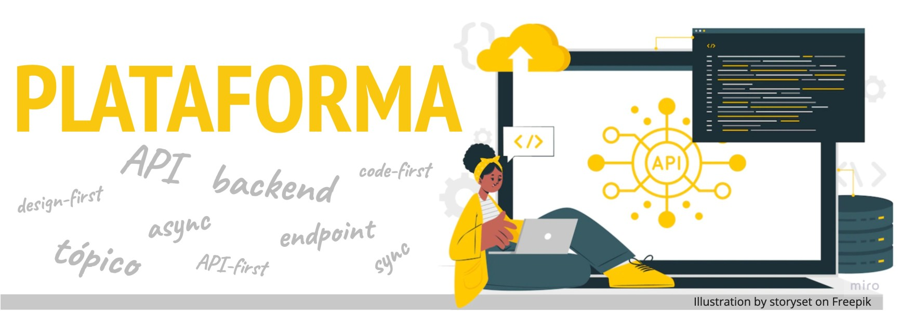
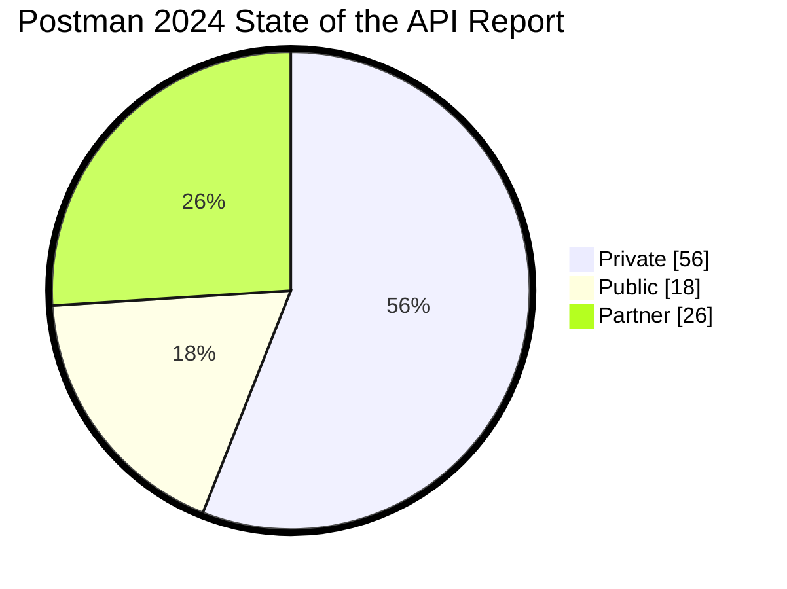
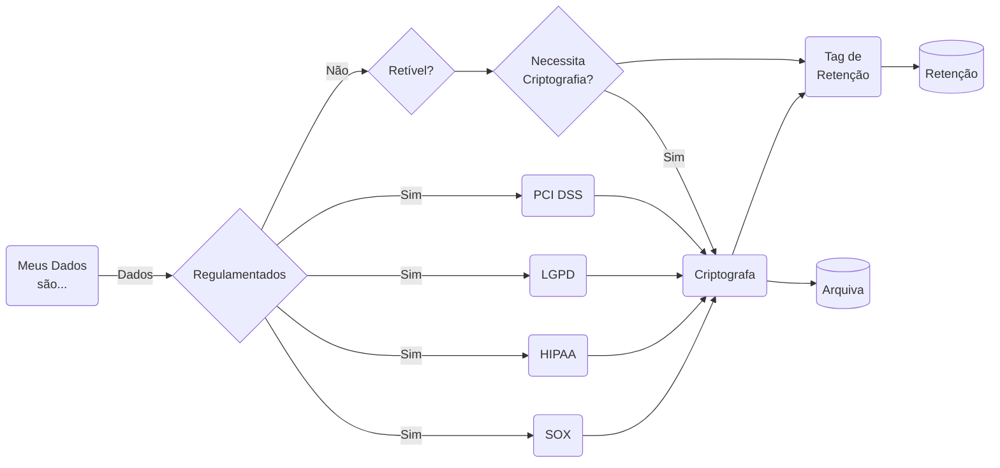

| Significado  | Entenda                                             | 
| -----        | -----                                               |
| Tecnologia da Informação  | Um conjunto de software e hardware que fornece a base sobre a qual outras aplicações ou serviços podem ser executados.              |
| Computação                | constante expansão de suas funcionalidades conforme cada novo app é integrado.                                                      |
| Marketing                 | Uma estrutura estratégica que permite a criação de ecossistemas de produtos e serviços interconectados.                             |
| P & D                     | Uma estrutura ou conjunto de recursos que permitem a execução de experimentos, coleta de dados ou análise de informações.           |
| Negócio                   | Uma estrutura ou conjunto de modelo de negócio, viabilizar o encontro entre demanda e oferta, quem quer comprar e quem quer vender. |
| Plataformas Digitais      | Serviços digitais que conectam diferentes usuários ou entidades para facilitar transações, comunicação ou colaboração.              |
| Produto                   | Um conceito estratégico usado para descrever um conjunto de tecnologias, ferramentas, infraestruturas e processos interconectados que facilitam a criação, desenvolvimento, entrega e manutenção de um produto ou serviço. (Mobile, APPs). |
| Industria                 | Um conceito estratégico onde atende a dois segmentos de clientes (mercado bilateral — bilateral market), desenvolvedores de apps e usuários dos apps. |
| Serviço                   | Aciona operações dentro do EMPRESA ao longo do ciclo de vida do pedido/chamado, assim o ESTABELECIMENTO é avisado de que chegou um pedido/chamado e é possível alocar uma pessoa/técnico para a entrega/visita, além de outras atividades para que o pedido ocorra com sucesso. |
| Dados                     | Local onde os dados são armazenados para análise histórica, fornecer insights e predições, treinar modelos de machine learning e alimentar dashboards de negócio. |

## Perguntas

- [x] Como fazer discovery? 
- [x] Como priorizar diante de tantas demandas de diferentes stakeholders?
- [x] Como conectar aos objetivos do negócio?
- [x] Qual valor que plataforma entrega?
- [x] Como provar o valor aos stakeholders de negócio?
- [x] Quais são as métricas de sucesso? 
- [x] Como definir o domínio: até onde o produto vai e depois disso é responsabilidade de outro produto?
- [x] Como lidar com a dependência entre produtos e times?
- [x] Como definir o domínio: até onde o produto vai e depois disso é responsabilidade de outro produto?
- [x] Como lidar com a dependência entre produtos e times? Como fazer discovery? 
- [x] Como o Developer Experience (DEVEX - Preparação) influencia no Customer-Facing (Apresentação), entregues de maneira satisfatória ao cliente final? 
- [x] O que é preciso saber sobre a tecnologia?

## Papel da TI
Uma característica importante a observar é que o **produto ou serviço não pertence a TI** [^1], pertence aos usuários. A TI viabiliza as interações entre a necessidade e o valor, que pode ser B2B (Business to Business),  B2C (Business to Customer) ou B2W (Business to World/Web).
A verdade é que exige uma operação parruda e, claro, muitas tecnologias! E daí, podemos dizer que entra em cena plataforma de produto (product platform) entra como estratégia.

- [x] **Redução de time-to-market**: Há menos a ser desenvolvido para novos produtos entrarem no mercado; a empresa consegue responder mais rápido quando percebe oportunidades em novos nichos; 
- [x] **Redução de custos**: Elimina desperdício de tempo em aprendizado e dinheiro para desenvolver um recurso que já existe na empresa;
- [x] **Redução de riscos**: Quanto mais se usa a plataforma, mais problemas podem ser identificados e, portanto, corrigidos, o que aumenta a qualidade.

- [x] Plataforma de produto digital[^2] é o compartilhamento de recursos já existentes na empresa, como componentes, design e infraestrutura, elaborados de modo que possam ser reutilizados internamente em diferentes produtos — building blocks.
- [x] Plataforma de produto depende da Plataforma de tecnologia.
- [x] Plataformas de produtos precisam de altíssima disponibilidade para se manterem acessíveis a dezenas ou, quem sabe, centenas de aplicações e de produtos que derivam delas.
- [x] Plataforma de negócio

Então, para evitar confusão, convencionei o uso de certos termos:

- [x] App para me referir a produtos customer-facing, seja aplicativos web ou mobile; 
- [x] Plataforma quando trato dos assuntos acerca da plataforma de produto;
- [x] Produto expressa conceitos genéricos que englobam apps, produtos e plataformas.

Plataforma de serviço segue o estilo de arquitetura de microsserviços baseada em nuvem (instância), composta por:

- [x] **Interfaces assíncronas e síncronas**: A forma de interagir com os demais serviços; 
- [x] **Back-end**: Os recursos de computação que executam as regras de negócio;
- [x] **Banco de Dados**: Onde são persistidos (salvos) os dados realtime que viabilizam a operação do negócio — por isso chamados de dados operacionais ou transacionais;
- [x] **Microsserviços**: São limitados a um único propósito, a exemplo da Order Platform, que só processa pedidos;
- [X] **Interface**: Usuário final utiliza a interface visual para interagir no app mobile ou web, os códigos das aplicações, frontend ou back-end, precisam de uma interface para facilitar a interação com a plataforma, mais precisamente a Interface de Programação de Aplicações (API).Tecnicamente, as APIs são categorizadas em: 
      - [x] **API Privada**: É disponibilizada apenas internamente para interações entre sistemas da empresa;
      - [x] **API Pública**: É disponibilizada no mercado para uso fora da empresa e pode ter alguma forma de monetização, como a plataforma Google Maps, ou pode ser gratuita com a opção de logar com os dados do Facebook ou do Google, por exemplo. 
      - [x] **API de Parceiros**: É semelhante à API pública, com a diferença de que o acesso externo é restrito aos parceiros da empresa.
- [X] Para suportar os aplicativos/produtos, a plataforma de produto depende da plataforma de tecnologia, é onde se hospeda tudo o que é necessário para a execução e o acesso — código, arquivos, dados, configurações. Por isso, além de alta performance, as plataformas de produtos precisam de altíssima disponibilidade para se manterem acessíveis a dezenas ou, quem sabe, centenas de aplicações e de produtos que derivam delas.
- [X] A ascensão da IA e do SaaS, fez com que houvesse uma expansão de APIs, e não apenas dentro da própria empresa.

- [x] Um Product Manager, você deve conhecer as características do seu produto e responsabilizar pela qualidade, consequências, aprender sobre as características o potencial e as limitações do uso dele.

[^1]: Deixo aqui um lembrete para a minha amiga: Cristiane Silva
[^2]: Plataformas
    [The Power of Product Platforms](https://www.productbookshelf.com/2011/08/the-power-of-product-platforms/)
    [Volkswagen Platform Business](https://www.vw-platform-business.com/en.html)
    [OpenMotors](https://www.openmotors.co/evplatform/)

