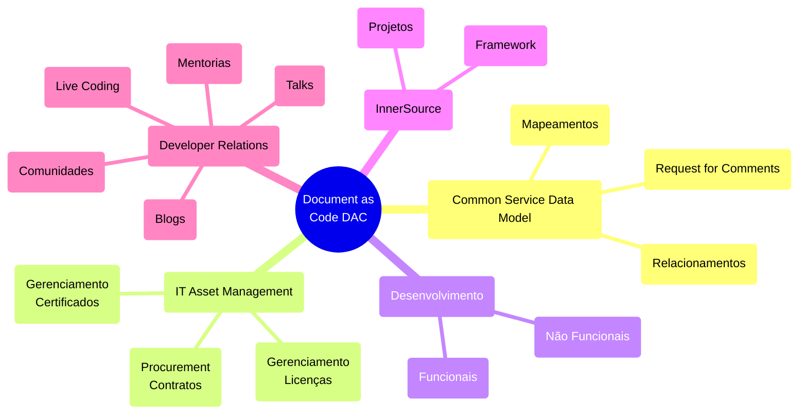

“Um jogador que faz um time grande é mais valioso do que um grande jogador. Perder-se no grupo para o bem do grupo, isso é trabalho em equipe.” John Wooden (ex-técnico de basquete do UCLA Bruins)

## Princípios da InnerSource
Plataformas de gerenciamento de código-fonte desempenham um papel crítico no desenvolvimento de software moderno, fornecendo um repositório central para armazenar, gerenciar e versionar código-fonte e documentação, bem como colaborar com o desenvolvimento de aplicações.
Neste guia, exploraremos as melhores práticas para proteger essas plataformas, abrangendo tópicos que incluem autenticação de usuário, controle de acesso, permissões, monitoramento e registro.

## Quem pode ver o quê?
A transparência desempenha um papel vital em promover a colaboração e encorajar a participação. O projeto deve ser estruturado para permitir que o maior número possível de indivíduos contribua, sendo assim, é importante reconhecer que certas restrições e considerações podem impedir que tudo seja abertamente acessível dentro da empresa.
Isso pode envolver a configuração de diferentes repositórios ou controles de acesso com base na sensibilidade do código, tipo de projeto ou funções individuais dentro da organização.

## Security-First
- [x] Código sensível é transmitido para fora da empresa;
- [x] Todos os repositórios devem ser seu próprio silo;
- [x] O acesso para saber que cada repositório existe é concedido apenas individualmente pela alta gerência;
- [x] Repositórios sensíveis: aqueles cujo lançamento tem impacto no mercado ou é uma infraestrutura central com implicações de segurança;

## Com ​​quais áreas em sua organização você gostaria de começar ao adotar estrategicamente o InnerSource?
!  Tipo                                                                            | Área |
| ----                                                                             | ---- |
| Aprendizagem, copiar e colar (exemplos, modelos)                                 |   x  |
| Use ferramentas reutilizáveis ​​criadas para as circunstâncias da empresa.         |   x  |
| Alteração, correção, adição ou atualização de conteúdo (sites, documentação)     |   x  |
| Construir dentro do serviço interno de outra pessoa                              |   x  |
| Deduplicação. Não construa a mesma coisa duas vezes, construa uma solução geral. | x    |
| Garantir o alinhamento entre projetos relacionados                               | x    |
| Não se deixe atrasar por quem é o dono                                           | x    |

## Nível de dificuldade
qui estão os grupos que podem ser usados ​​para definir permissões de repositório ordenadas pelo processo de trabalho a ser ingressado:

- [x] Todos atrás do firewall da empresa
- [x] Visibilidade interna (todos na plataforma estão neste grupo)
- [x] Grupo de segurança criado automaticamente
- [x] Grupo de segurança com autoadesão e SEM renovação forçada após X período de tempo
- [x] Grupo de segurança com autoadesão e renovação forçada após X período de tempo
- [x] Grupo de segurança autoiniciado, mas requer espera pela permissão do gerente.
- [x] Grupo de segurança que requer o envio de um e-mail para alguém para adicioná-lo manualmente

## Diretriz de Alto Nível
É aconselhável prever a necessidade de vários níveis de compartilhamento, desde toda a empresa até pequenos grupos, para repositórios dentro de grandes organizações de plataforma.

Conceder aos proprietários do repositório a autoridade para gerenciar a visibilidade e as permissões é mais eficaz do que ter proprietários de organizações ou empresas definindo-as. Essa abordagem evita que políticas estreitas definidas em níveis mais altos se tornem onerosas ao longo do tempo, conforme as necessidades evoluem.

Os esforços colaborativos geralmente começam com propostas de valor incertas. Consequentemente, até mesmo pequenos obstáculos processuais podem encerrar prematuramente essas iniciativas. Para mitigar isso, estabeleça processos que permitam a descoberta e avaliação do repositório sem exigir solicitações de permissão sempre que possível.

## Políticas de repositório definidas no nível empresarial
### Permissões básicas
Permissões básicas definidas no nível empresarial são aplicadas a todos os repositórios de uma empresa.

### Ferramentas
Abaixo está uma lista não exaustiva de possíveis ferramentas que podem ser usadas para auxiliar na revisão de repositórios de código-fonte.

#### Allstar - https://github.com/ossf/allstar
Um projeto de código aberto do OpenSSF que escaneia organizações do GitHub em busca de configurações incorretas de “nível de repositório”. O Allstar detecta um subconjunto das políticas de “nível de repositório” sugeridas por este documento. Ele pode ser configurado para escanear todos os repositórios em uma organização ou um subconjunto deles e é suportado pelos seguintes SCMs:

#### Nuvem GitHub
Legitify - https://github.com/Legit-Labs/legitify
Um projeto de código aberto da Legit Security que escaneia ativos de SCM para encontrar configurações incorretas, problemas de segurança e melhores práticas não seguidas. O Legitify detecta todas as políticas sugeridas por este documento e oferece suporte aos seguintes SCMs:

**Introdução ao InnerSource**
O InnerSource é uma metodologia que aplica os princípios e as práticas do desenvolvimento de software de código aberto dentro dos limites de uma organização. O conceito foi cunhado por Tim O’Reilly em 2000, refletindo uma adaptação de práticas de código aberto para código proprietário, acessível apenas dentro de uma empresa ou um grupo colaborativo restrito de empresas. Em essência, o InnerSource permite que desenvolvedores de software contribuam para os esforços de outras equipes, promovendo a transparência e a abertura.

**Por que Adotar o InnerSource?**

As empresas adotam o InnerSource por diversas razões, incluindo:

*   **Quebrar silos e gargalos:** O InnerSource ajuda a superar silos em grandes organizações, que muitas vezes se formam devido à especialização e à cultura de propriedade. A comunicação entre as equipes pode ser minimizada após a definição de interfaces, levando a uma alta especialização e uma atitude de "nós contra eles".
*   **Aumento da mobilidade da equipe e padronização de processos:** A padronização de ferramentas, como plataformas de desenvolvimento distribuídas (GitHub Enterprise, Bitbucket, etc.) facilita a integração de novos funcionários ou a transferência de colaboradores. O ambiente de desenvolvimento e os processos tornam-se mais padronizados.
*   **Melhoria na documentação:** O InnerSource promove a criação de documentação acionável, indexada e pesquisável, que facilita a integração de novos contribuidores. A comunicação é arquivada, o que suporta a documentação de forma gradual.
*   **Aumento da velocidade devido à documentação:** O InnerSource permite uma velocidade maior devido à acumulação de documentação útil.
*   **Compreensão mais profunda:** O InnerSource promove uma compreensão mais profunda de como modularizar e construir conhecimento completo (full-stack), pois os contribuidores tornam-se Trusted Committers (TCs).
*   **Satisfação dos desenvolvedores:** A implementação de InnerSource aumenta a satisfação dos desenvolvedores.
*   **Inovação e melhoria da qualidade:** O InnerSource fomenta a inovação e permite que os funcionários proponham novas ideias. A colaboração e a transparência melhoram a qualidade do código.

**Como Implementar o InnerSource**

A implementação de InnerSource não é um método definido como Scrum, mas sim um paradigma que precisa ser adaptado ao contexto específico de cada organização. O "Apache Way" é um modelo base para o InnerSource, com os seguintes fundamentos:

*   **Comunicação aberta:** Toda a comunicação relacionada ao projeto deve ser pública, arquivada e pesquisável.
*   **Revisão de código:** As contribuições devem ser revistas por alguém com conhecimento suficiente para garantir a qualidade e orientar o contribuinte.
*   **Meritocracia:** As contribuições devem ser valorizadas com base no mérito.
*   **Transparência:** Todas as decisões e discussões devem ser transparentes.

**Checklist para InnerSource**

Antes de iniciar um projeto InnerSource, é importante considerar um checklist.  Este é um exemplo de checklist, adaptado de várias fontes:

*   **Preparação Pessoal:**
    *   Acreditar na viabilidade da estratégia para a empresa.
    *   Compreender as mudanças necessárias para o sucesso do InnerSource.
*   **Comunidade:**
    *   Existência de um líder de projeto com habilidades técnicas e sociais.
    *   Disponibilidade de mentores para guiar os contribuidores.
    *   Disposição para participar em fóruns e responder a perguntas.
    *   Disposição para fazer revisões de código.
    *   Entendimento por parte dos desenvolvedores que podem contribuir para projetos InnerSource.
    *   Entendimento por parte dos desenvolvedores do valor de contribuir para outros projetos.
    *   Presença de um espírito meritocrático.
*   **Processos e Ferramentas:**
    *   Processos claros para contribuições.
    *   Uso de ferramentas de gestão de código que permitam acesso transparente (GitHub, GitLab, etc.).
    *   Implementação de Integração Contínua (CI) e Desenvolvimento Orientado por Testes (TDD).
*   **Documentação:**
    *   Documentação acessível e organizada.
    *   Criação de arquivos `CONTRIBUTING.md`, `README.md` e `COMMUNICATION.md` para guiar contribuidores.
*   **Recursos Humanos:**
    *   Recompensas e critérios de promoção com base nos valores do InnerSource.
    *   Caminhos de progressão de carreira que respeitem o papel na comunidade.
*   **Configuração Organizacional:**
    *   Equipe de coordenação central.
    *   Processo para registro de projetos InnerSource.
    *   Tempo e recursos para os funcionários contribuírem para projetos externos.
    *   Capacidade de medir e demonstrar ganhos e perdas das equipes.
    *   Possibilidade de os funcionários escolherem projetos com base na sua experiência e motivação.
*   **Liderança e Coordenação**
    *   Identificação de "campeões" ou entusiastas do InnerSource.
    *   Definição clara do papel do Trusted Committer.
    *   Definição de regras da casa (etiqueta) para reduzir atritos.
*   **Transparência:**
    *   Canais de comunicação abertos (chat, listas de e-mail, etc.).
    *   Documentação das decisões em listas de e-mail.
    *   Portal central que forneça informações sobre os recursos.
*   **Métricas:**
    *   Definição de métricas para monitorar o progresso (linhas de código, histórias de InnerSource, etc.).
    *   Monitoramento do uso dos componentes InnerSource.

**Padrões de InnerSource**

O InnerSource Commons cataloga padrões para ajudar a implementar o InnerSource de forma eficaz. Alguns exemplos incluem:

*   **Ferramentas de comunicação:** Utilização de ferramentas de comunicação assíncrona.
*   **Contribuidores Contratados:** Envolvimento de colaboradores com um acordo de contribuição formal.
*   **Líder de comunidade dedicado:** Seleção de pessoas com habilidades de comunicação e técnicas.
*   **Documentação dos princípios:** Documentação e publicação dos princípios do InnerSource.
*   **Extensões para crescimento sustentável:** Oferecer mecanismos de extensão fora do projeto principal.
*   **Mercado de "gigs":** Criação de um mercado interno para anunciar necessidades de projetos InnerSource.
*   **Suporte de grupo:** Formação de um grupo de indivíduos interessados para manter um projeto.
*   **Licença InnerSource:** Criação de uma licença para partilhar código dentro da organização.
*   **Portal InnerSource:** Criação de um site para descobrir projetos InnerSource.
*   **Modelo de Maturidade:** Modelo para as equipes fazerem um auto-check e descobrirem padrões.
*   **Elogiar participantes:** Agradecer os contribuidores pelo seu tempo e esforço.
*   **Comitê de revisão:** Estabelecer um comitê para dar suporte à iniciativa e familiarizar gestores.
*   **Serviço vs. Biblioteca:** Definir se um projeto InnerSource é um serviço ou uma biblioteca.
*   **Documentação base:** Fornecer documentação em arquivos padrão.
*   **Processo de lançamento padrão:** Publicação consistente de notas de lançamento.
*   **Começar como um experimento:** Iniciar como um experimento com tempo limitado.
*   **Decisão transparente usando RFCs:** Utilização de Requests for Comments (RFCs).
*   **Pontuação de atividade do repositório:** Criação de pontuação para mostrar projetos ativos.

**Considerações Finais**

*   O InnerSource é um meio, não um fim, e deve estar alinhado com os objetivos de longo prazo da organização.
*   É importante monitorar o processo para identificar áreas de melhoria.
*   A implementação do InnerSource requer tempo, paciência e persistência.
*   O InnerSource pode coexistir com outras iniciativas como Agile.
*   O InnerSource Commons é um recurso valioso para quem procura implementar o InnerSource.

Este resumo oferece uma visão geral dos principais conceitos e etapas envolvidas na implementação do InnerSource. Para um estudo mais aprofundado, é aconselhável consultar as fontes originais e outros materiais de referência disponíveis.
