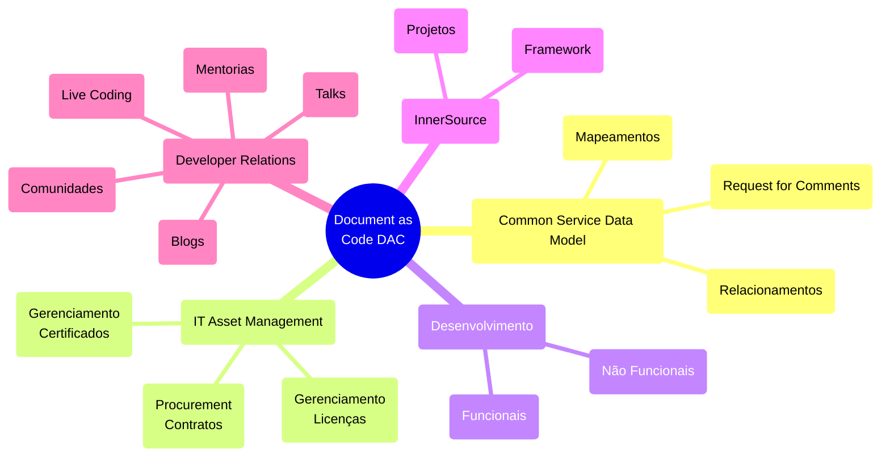

“Um jogador que faz um time grande é mais valioso do que um grande jogador. Perder-se no grupo para o bem do grupo, isso é trabalho em equipe.” John Wooden (ex-técnico de basquete do UCLA Bruins) 

## Princípios da InnerSource
Plataformas de gerenciamento de código-fonte desempenham um papel crítico no desenvolvimento de software moderno, fornecendo um repositório central para armazenar, gerenciar e versionar código-fonte e documentação, bem como colaborar com o desenvolvimento de aplicações.
Neste guia, exploraremos as melhores práticas para proteger essas plataformas, abrangendo tópicos que incluem autenticação de usuário, controle de acesso, permissões, monitoramento e registro. 

## Quem pode ver o quê?
A transparência desempenha um papel vital em promover a colaboração e encorajar a participação. O projeto deve ser estruturado para permitir que o maior número possível de indivíduos contribua, sendo assim, é importante reconhecer que certas restrições e considerações podem impedir que tudo seja abertamente acessível dentro da empresa.
Isso pode envolver a configuração de diferentes repositórios ou controles de acesso com base na sensibilidade do código, tipo de projeto ou funções individuais dentro da organização.

## Security-First
- [x] Código sensível é transmitido para fora da empresa;
- [x] Todos os repositórios devem ser seu próprio silo;
- [x] O acesso para saber que cada repositório existe é concedido apenas individualmente pela alta gerência;
- [x] Repositórios sensíveis: aqueles cujo lançamento tem impacto no mercado ou é uma infraestrutura central com implicações de segurança;

## Com ​​quais áreas em sua organização você gostaria de começar ao adotar estrategicamente o InnerSource?
!  Tipo                                                                            | Área |
| ----                                                                             | ---- |
| Aprendizagem, copiar e colar (exemplos, modelos)                                 |   x  |
| Use ferramentas reutilizáveis ​​criadas para as circunstâncias da empresa.         |   x  |
| Alteração, correção, adição ou atualização de conteúdo (sites, documentação)     |   x  |
| Construir dentro do serviço interno de outra pessoa                              |   x  |
| Deduplicação. Não construa a mesma coisa duas vezes, construa uma solução geral. | x    |
| Garantir o alinhamento entre projetos relacionados                               | x    |
| Não se deixe atrasar por quem é o dono                                           | x    |

## Nível de dificuldade
qui estão os grupos que podem ser usados ​​para definir permissões de repositório ordenadas pelo processo de trabalho a ser ingressado:

- [x] Todos atrás do firewall da empresa
- [x] Visibilidade interna (todos na plataforma estão neste grupo)
- [x] Grupo de segurança criado automaticamente
- [x] Grupo de segurança com autoadesão e SEM renovação forçada após X período de tempo
- [x] Grupo de segurança com autoadesão e renovação forçada após X período de tempo
- [x] Grupo de segurança autoiniciado, mas requer espera pela permissão do gerente.
- [x] Grupo de segurança que requer o envio de um e-mail para alguém para adicioná-lo manualmente

## Diretriz de Alto Nível
É aconselhável prever a necessidade de vários níveis de compartilhamento, desde toda a empresa até pequenos grupos, para repositórios dentro de grandes organizações de plataforma.

Conceder aos proprietários do repositório a autoridade para gerenciar a visibilidade e as permissões é mais eficaz do que ter proprietários de organizações ou empresas definindo-as. Essa abordagem evita que políticas estreitas definidas em níveis mais altos se tornem onerosas ao longo do tempo, conforme as necessidades evoluem.

Os esforços colaborativos geralmente começam com propostas de valor incertas. Consequentemente, até mesmo pequenos obstáculos processuais podem encerrar prematuramente essas iniciativas. Para mitigar isso, estabeleça processos que permitam a descoberta e avaliação do repositório sem exigir solicitações de permissão sempre que possível.

## Políticas de repositório definidas no nível empresarial
### Permissões básicas
Permissões básicas definidas no nível empresarial são aplicadas a todos os repositórios de uma empresa.

### Ferramentas
Abaixo está uma lista não exaustiva de possíveis ferramentas que podem ser usadas para auxiliar na revisão de repositórios de código-fonte.

#### Allstar - https://github.com/ossf/allstar
Um projeto de código aberto do OpenSSF que escaneia organizações do GitHub em busca de configurações incorretas de “nível de repositório”. O Allstar detecta um subconjunto das políticas de “nível de repositório” sugeridas por este documento. Ele pode ser configurado para escanear todos os repositórios em uma organização ou um subconjunto deles e é suportado pelos seguintes SCMs:

#### Nuvem GitHub
Legitify - https://github.com/Legit-Labs/legitify
Um projeto de código aberto da Legit Security que escaneia ativos de SCM para encontrar configurações incorretas, problemas de segurança e melhores práticas não seguidas. O Legitify detecta todas as políticas sugeridas por este documento e oferece suporte aos seguintes SCMs:

