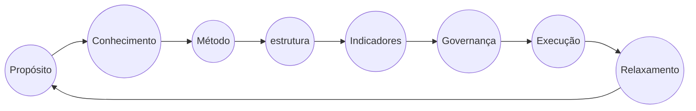

É uma sentença declarativa aparentemente verdadeira mas que leva a uma contradição lógica ou simplesmente a algo que contradiz a intuição.
## Paradoxo do Pinóquio

Pinóquio é reconhecidamente um dos ícones da cultura moderna, criado como um boneco de madeira que sonha em ser um menino de verdade, ele é mais conhecido por suas mentiras.

Trata-se de um conflito de lógica baseado na famosa história infantil do boneco Pinóquio, cujo nariz crescia sempre que o mesmo contava uma mentira.

Mas se Pinóquio dissesse “Meu nariz irá crescer agora”, você sabe dizer o que aconteceria? Seu nariz iria crescer ou não?

- [x] A sentença do **mentiroso** nos leva a uma contradição quando tentamos determinar se ela é verdadeira ou não.
- [x] Ou seja, se a afirmação de Pinóquio for verdadeira então seu nariz crescerá, o que significa que ela é falsa.

Neste caso, duas hipóteses, igualmente válidas poderiam acontecer:

- [x] O nariz de Pinóquio não cresce. Então ele disse uma mentira, portanto, o nariz deve crescer;
- [x] O nariz de Pinóquio cresce. Então ele disse uma verdade, portanto, o nariz dele não tinha motivo para ter crescido.

## Paradoxo da Escolha
**Barry Schwartz** - Um maior número de escolhas concede-nos mais liberdade. No entanto, demasiadas opções limitam-nos a capacidade de decisão.

Crise de indecisão e insatisfação nos consumidores, em vez de impulsionar as compras.

Não é suposto contentarmo-nos com nada, a menos que seja o melhor. O mundo digital está a agudizar o problema, porque, ao abrir um mundo de possibilidades infinitas, também criou o FOMO (fear of missing out - medo de perder) e um medo cada vez maior de fazer a escolha errada, num mar de ofertas.

A escolha num leque alargado de opções pode provocar mais stress, mais erros,menos satisfação e, até, burnout.

Quando a oferta é muito ampla, pode ser que as pessoas não consigam escolher o produto mais adequado e até deixem de fazer a compra.

Essa ideia pode soar contraditória, mas é exatamente isso que acontece na mente humana, que se vê sobrecarregada e confusa diante de tantas opções no mercado atual.

### Paradoxo da Escolha agindo no nosso dia a dia.
- [x] Quanto tempo você passa escolhendo o que assistir na Netflix, Apple TV, Disney+, etc?
      - [x] Resposta: É provável que o consumo tome muito mais tempo na sua vida hoje em dia, porque o número de opções aumentou.
      - [x] Resposta: Ou, deixei de escolhar, o software de Stream, escolhe para mim.

A responsabilidade é enorme, **pois cabe a você** entender as características de cada produto, comparar marcas, pesquisar preços e definir prioridades.

- [x] Paralisia                          - Aprendizado e ao desenvolvimento intelectual.
- [x] Custo da oportunidade e comparação - Ela sente que tem algo a perder, ou seja, um custo.
- [x] Transferência de responsabilidade  - A responsabilidade sobre uma decisão ruim se transfere totalmente para o consumidor, se escolher errado, fica o sentimento de que a culpa é dele e não da empresa, que ofereceu muitas chances.
- [x] Arrependimento                     - Ela vai se lembrar das vantagens daquelas que rejeitou.

## Branding, Marca, Persona e Arquétipo

A empresa, produto tem que existir além de seu criador. Entenda que **criação** é diferente de criatividade, mas é óbvio, que a criação pode inserir em criatividade, ou seja, trago algo criativo ou com uma outra leitura.

## Outros Paradoxos

- [x] **Fábrica de Botas**: Fábrica de Botas um botando a culpa no outro.
- [x] **Paradoxo Homer Simpson**: "CULPA É MINHA E COLOCO EM QUEM EU QUISER"?
- [x] **Paradoxo da Laranja** : Bolo de Limão (casca) e Suco de Laranja (Sumo). Apenas UM LARANJA.
- [x] **Paradoxo do KuDum**: Se você não estimula, tira de um cú de um, coloca no cú de outro.
## Commenting For Better Reach (CFBR)
O CFBR, também conhecido como “Commenting For Better Reach” é uma estratégia de usada por usuários ou empresas para comentar as postagens de outras pessoas para melhorar seu próprio alcance e visibilidade.
