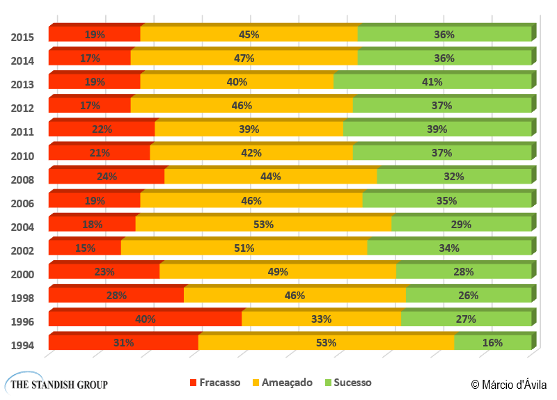
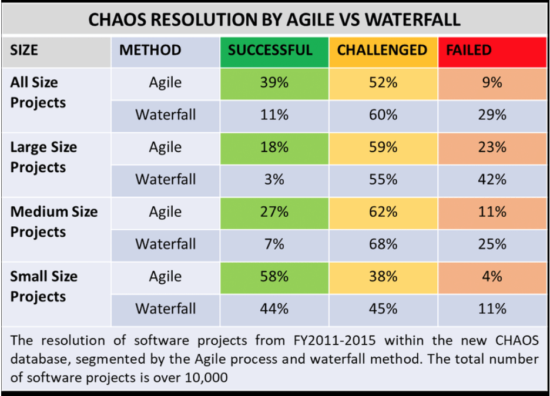
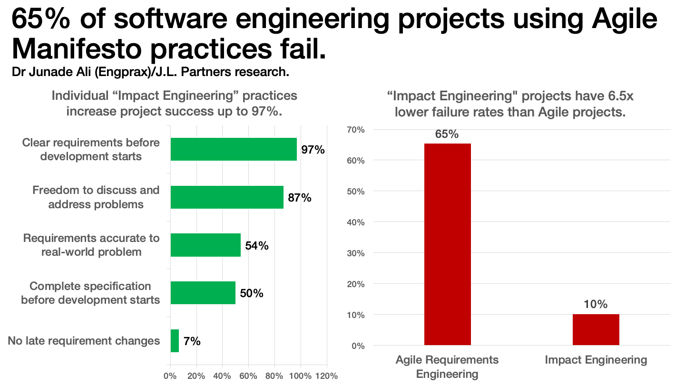
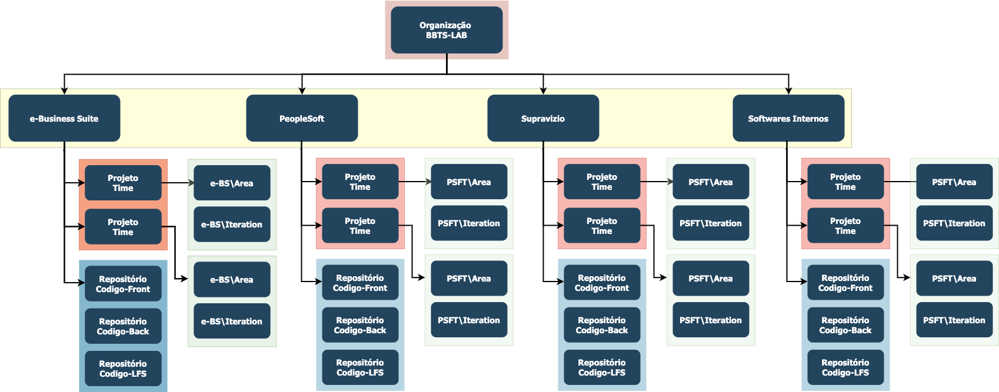

<p align="justify">A história do gerenciamento de projetos remonta a milênios atrás, quando as primeiras sociedades humanas começaram a realizar tarefas organizadas para alcançar objetivos comuns.</p>

<p align="justify">Os egípcios construíram as grandes pirâmides de Gizé, as quais requeriam o gerenciamento eficiente de recursos humanos, materiais e financeiros. Já os romanos destacaram-se pela construção de estradas, aquedutos e outros projetos de engenharia que exigiam planejamento cuidadoso e supervisão.</p>
<p align="justify">Com o advento da revolução industrial e do avanço tecnológico, a necessidade de controlar e coordenar projetos de grande escala tornou-se evidente.</p>
- [x] [A Roma antiga era conhecida pelo vasto e avançado sistema de canalização que trazia água doce para a cidade através de viadutos e a distribuía para a população através de tubos de metal e argila?](https://pt.quora.com/A-Roma-antiga-era-conhecida-pelo-vasto-e-avan%C3%A7ado-sistema-de-canaliza%C3%A7%C3%A3o-que-trazia-%C3%A1gua-doce-para-a-cidade-atrav%C3%A9s-de-viadutos-e-a-distribu%C3%ADa-para-a-popula%C3%A7%C3%A3o-atrav%C3%A9s-de)
- [x] [Como os romanos conseguiram fazer seus aquedutos com tanta precisão?](https://pt.quora.com/Os-romanos-eram-engenheiros-hidr%C3%A1ulicos-talentosos-e-constru%C3%ADram-impressionantes-sistemas-de-distribui%C3%A7%C3%A3o-de-%C3%A1gua-para-abastecer-suas-cidades-com-%C3%A1gua-pot%C3%A1vel)
- [x] Como os romanos construíram Veneza em cima da água e da lama 15 séculos atrás?

{width="300" height="450" style="display: block; margin: 0 auto"}

## Revolução Industrial
- [x] 1760 e 1850 - Europa Ocidental, estabelecendo uma nova relação entre a sociedade e o meio e possibilitando a existência de novas formas de produção que transformaram o setor industrial, dando início a um novo padrão de consumo.
- [x] [Segunda metade do século XIX e meados do século XX](https://brasilescola.uol.com.br/historiag/segunda-revolucao-industrial.htm) - Espalhando-se por países como Estados Unidos, Japão e demais países da Europa.
- [x] [Inicia-se na metade do século XX, após a Segunda Guerra Mundial](https://brasilescola.uol.com.br/geografia/terceira-revolucao-industrial.htm).
- [x] <p align="justify">O gerenciamento de projetos começou a emergir como um conceito discreto nas décadas de 1920 e 1930 (Segunda Revolução Industrial). O uso formal mais antigo que podemos encontrar vem do Bureau of Reclamations dos EUA, que criou um **"escritório de projetos"** com um **"engenheiro de projetos"** liderando um projeto.</p>

## Crise do Software
<p align="justify">A "crise de software" apareceu em meados do ano de 1960 e expressava as dificuldades no desenvolvimento de software meio a demanda que aumentava assim como a complexidade dos problemas a serem superados.</p>
<div class="mdx-columns2" markdown>
- [x] Projetos que ultrapassam o orçamento;
- [x] Projetos que ultrapassam o prazo;
- [x] Softwares que apresentam baixa qualidade;
- [x] Softwares que não atinge os requisitos propostos;
- [x] Código com baixa manutenibilidade.
</div>

## Timeline
- [x] 1836: O matemático e filósofo britânico Charles Babbage propõe a Máquina Analítica;
- [x] 1843: Algoritmo de máquina de Ada Lovelace inventa o primeiro algoritmo de máquina para a máquina de diferenças de Charles Babbage, que estabelece as bases para todas as linguagens de programação.
- [X] 1854: George Boole publica An Investigation of the Laws of Thought, criando a lógica booleana;
- [X] 1936: O matemático britânico Alan Turing publica seu trabalho sobre a "Máquina de Turing";
- [x] 1940-1950: Primeiras Noções de Fluxo e Modelagem;
- [X] 1943: Warren McCulloch e Walter Pitts criam um modelo matemático de redes neurais;
- [x] 1944-45, Konrad Zuse desenvolveu a primeira linguagem de programação ‘real’ chamada Plankalkül (Plan Calculus). 
- [x] Real Programmer, termo cunhado de 1945-1980.
- [x] 1949: Linguagem Assembly. Usada na calculadora automática de armazenamento de atraso eletrônico (EDSAC). 
- [x] 1949: Shortcode (ou código de ordem curta), foi a primeira linguagem de alto nível (HLL) sugerida por John McCauley em 1949. No entanto, foi William Schmitt quem a implementou para o computador BINAC no mesmo ano e para o UNIVAC em 1950.
- [X] 1950: Alan Turing publica o famoso artigo "Computing Machinery and Intelligence";
- [x] Década de 50, surgiram as linguagens de 1ª geração, programação lógica (abstração do hardware), linguagens montadoras como assembler (ainda exigiam conhecimentos do hardware), ênfase em cálculos matemáticos. Linguagens: Fortran, Lisp e Algol 58.
 - [x] 1950 a 1960: Métodos tradicionais de Desenvolvimento.A ideia principal era seguir um processo linear e sequencial onde cada fase fosse completada antes de passar para a próxima. 
- [x] Kanban foi desenvolvido por Taiichi Ohno - Toyota Production System (TPS) na década de 1940. 1950s-1960s: O Kanban foi refinado e integrado no Toyota Production System. 2007: David Anderson publicou o livro "Kanban: Successful Evolutionary Change for Your Technology Business". 
- [X] 1951: O matemático Christopher Strachey (futuro diretor do Departamento de Software da Universidade de Oxford) escreve o primeiro programa de IA para jogar damas em um computador de tubo de vácuo.
- [x] 1952: Autocode;
- [X] 1956: Durante a conferência de Dartmouth, os pesquisadores John McCarthy, Marvin Minsky, Nathaniel Rochester e Claude Shannon cunham o termo **"Inteligência Artificial"**.
- [x] 1957: FORTRAN: FORmula TRANslation foi criada por John Backus é considerada a linguagem de programação mais antiga em uso atualmente.
- [x] 1958: ALGOL (Linguagem algorítmica)
- [x] 1958: McCarthy desenvolve o LISP (List Processing). O LISP libertou os hackers do ITS ('Incompatible Time-sharing System'). 
- [x] 1959: COBOL (Common Business Oriented Language)
- [x] 1960: Introdução ao Fluxo de Dados e Processos. Larry Constantine foi um dos pioneiros dessa técnica, e o DFD.
- [x] 1961: MIT adquiriu o primeiro PDP-1. O termo "hackers" do Tech Model Railroad Club se tornaram o núcleo do Laboratório de Inteligência Artificial do MIT;
- [X] 1961: Unimate, o primeiro robô industrial;
- [x] 1964: BASIC (Beginners All-Purpose Symbolic Instruction Code). Thomas Kurtz, co-inventor da linguagem de programação BASIC, aos 96 anos, 17/11/2024.
- [X] 1964: O computador ELIZA, criado por Joseph Weizenbaum, é um dos primeiros programas a simular uma conversa em linguagem natural;
- [x] 1966: A memória Moby é adquirida e o dispositivo TTY adiciona mais quatro teletipos; preparando-se para o compartilhamento de tempo?
- [X] 1966: O chatbot SHRDLU, desenvolvido por Terry Winograd, é um dos primeiros sistemas de IA a manipular objetos em um ambiente virtual utilizando linguagem natural.
- [x] <p align="justify">1968: Conferência da OTAN (NATO Software Engineering Conference) em Garmisch, Alemanha, foi criada para trazer os fundamentos teóricos e as disciplinas práticas dos domínios tradicionais da Engenharia para o mundo do software, como forma de resolver a chamada Crise do Software e cunhado o termo Engenharia de Software. Especialistas reconheceram que os métodos tradicionais de desenvolvimento de software estavam falhando. A crescente complexidade dos projetos de software estava gerando atrasos, custos excessivos e falhas. O termo "crise do software" foi utilizado para descrever essa situação, e a necessidade de novas abordagens para gerenciar projetos e melhorar a qualidade do software ficou evidente.</p>
- [x] <p align="justify">E assim, para emular a Engenharia, o software foi envolvido em projetos com requisitos, especificações e planos detalhados, como qualquer outro empreendimento de Engenharia. Ou essa era a suposição – havia uma visão idealizada das disciplinas de engenharia entre os delegados da conferência da OTAN que influenciou muitas das conclusões e recomendações.</p>
- [x] As indústrias começaram, incorretamente, a ver o **desenvolvimento de software como previsível e repetível** – algo aparentemente comum;
 - [x] 1969: A ARPANET (Advanced Research Projects Agency Network) foi a primeira rede de computadores, construída em 1969 pela ARPA e também foi o ano em que um hacker da Bell Labs chamado Ken Thompson inventou o Unix.
 - [x] 1969: O Unix nasceu em 1969, criado por Ken Thompson, Dennis Ritchie e outros pesquisadores nos Laboratórios Bell (Bell Labs), uma divisão de pesquisa da AT&T.
- [x] O PMI é uma organização global dedicada à prática e ao desenvolvimento da gestão de projetos. Ele foi fundado em 1969, nos Estados Unidos, por um grupo de profissionais que reconheceu a necessidade de uma abordagem mais estruturada e eficiente para gerenciar projetos, que estavam se tornando cada vez mais complexos à medida que as indústrias e tecnologias evoluíam.
- [x] Com o Gerenciamento de Projetos se tornando uma profissão, começaram a surgir organismos de certificação da indústria; o mais famoso e relevante hoje seria o Project Management Institute (PMI). Naquele ano também viu o surgimento da famosa metáfora do “triângulo de ferro” para tempo, custo e produção no livro **“Time and Money in Contract Control”** de Martin Barnes.
- [x] A ideia central era oferecer aos profissionais de projetos um fórum para troca de conhecimentos e melhores práticas, além de desenvolver **padrões e certificações**. Desde então, o PMI se expandiu globalmente e se tornou uma referência para a prática de gerenciamento de projetos. 
- [x] Uma das contribuições mais importantes do PMI é o PMBOK, que descreve um conjunto de processos e áreas de conhecimento que são considerados essenciais para gerenciar projetos de forma eficaz.
 - [x] 1970: Metodologias Estruturadas e Yourdon -  Métodos Estruturados, que defendiam a decomposição de sistemas em partes menores e bem definidas.
- [x] 1970: PASCAL (Nomeado após o matemático francês Blaise Pascal, Niklaus Wirth desenvolveu a linguagem de programação em sua homenagem).
- [x] 1970: Consolidação do Modelo Waterfall - "Managing the Development of Large Software Systems - Winston W. Royce";
- [X] 1970: IBM's System R — A IBM desenvolveu o System R, um dos primeiros sistemas de banco de dados relacional, que foi uma das inspirações para a criação de SQL (Structured Query Language).
- [X] 1960s-1970s: O conceito de banco de dados relacional foi proposto por Edgar F. Codd em 1970, enquanto ele trabalhava para a IBM. 
- [x] 1971: Conectado à ARPANET, versão ~670
- [X] 1971, eles começaram a reescrever o Unix em C, uma linguagem de programação que Dennis Ritchie.
- [x] 1972: Smalltalk, C, 1972: SQL (SEQUEL na época)
- [X] 1973: Ingres — Criado por pesquisadores da Universidade da Califórnia, Berkeley, 
 - [x] 1973–1975: A primeira lista de gíria, as primeiras sátiras, as primeiras discussões autoconscientes sobre a ética hacker, 1973–1975. The Dicionário do Hacker em 1983; 
 - [X] 1973: O Unix foi reescrito em C, o que facilitou a portabilidade e a distribuição do sistema. 
 - [X] 1975: A MITS Altair 8800 é lançada e considerada por muitos como o primeiro verdadeiro "computador pessoal".
 - [X] 1977: A Apple Computer, fundada por Steve Jobs e Steve Wozniak, lança o Apple II;
 - [X] 1977: A Commodore lança o Commodore PET;
 - [X] 1977: O TRS-80 é lançado pela Tandy/RadioShack;
 - [X] 1979: Oracle Database — Lançado pela Oracle Corporation, fundado por Larry Ellison, Bob Miner e Ed Oates;
- [x] 1980/81: Ada - Início do Ágil
- [x] 1980: PMBOK (Project Management Body of Knowledge): Criado pelo PMI na década de 1980, com a primeira edição publicada em 1996, como um guia de boas práticas para gerenciamento de projetos. 
- [X] 1980: A IA começa a se revitalizar com a introdução de Redes Neurais Artificiais (RNAs);
- [X] 1981: A IBM lança o IBM PC;
- [X] 1981: O sistema operacional MS-DOS da Microsoft é lançado,
- [x] 1983: C++, Objetivo-C;
- [X] Em 1983, a IBM lançou o DB2, um banco de dados relacional que se tornaria um dos líderes do mercado, inicialmente voltado para mainframes e sistemas corporativos de grande porte.
- [X] 1983: O movimento por software livre começa com Richard Stallman, um programador do MIT (Massachusetts Institute of Technology). Stallman inicia o projeto GNU (GNU's Not Unix);
- [X] 1984: A Apple lança o Macintosh;
- [X] 1984: Richard Stallman lança a Free Software Foundation (FSF) com a missão de promover o software livre;
- [X] 1985: A Microsoft lança o Windows 1.0;
- [X] 1985: Stallman publica o Manifesto do Software Livre, no qual define a filosofia por trás do movimento.
- [X] 1986: O matemático Geoffrey Hinton e outros pesquisadores publicam o algoritmo de backpropagation;
- [x] 1986: A ideia inicial do Scrum foi desencadeada por um artigo da Harvard Business Review (HBR) de 1986 intitulado [“O novo jogo de desenvolvimento de produtos”](https://hbr.org/1986/01/the-new-new-product-development-game). Observe o termo “produto”, não projeto.

| Princípio                       | Entenda                                                                                                      |
| -----------                     | ---------                                                                                                    |
| Envolvimento do usuário         | A colaboração constante é essencial para fornecer soluções que realmente atendam às necessidades do cliente. |
| Times capacitados               | Equipes devem ter autonomia e serem habilitadas a tomar decisões importantes.                                |
| Entrega frequente               | Fornecer entregas contínuas para obter feedback rápido e garantir alinhamento com os requisitos do cliente.  |
| Aceitação de mudanças           | Estar flexível e aberto para mudanças mesmo em estágios avançados do desenvolvimento.                        |
| Entrega iterativa e incremental | Construir o projeto em etapas, garantindo uma evolução constante do produto.                                 |
| Comunicação clara e contínua    | Manter todos os envolvidos informados e engajados através de comunicação efetiva.                            |
| Qualidade                       | Assegurar que todos os entregáveis atendam a critérios de qualidade predefinidos.                            |
| Construção iterativa            | Basear o desenvolvimento em uma abordagem cíclica para identificar e resolver problemas de forma eficiente.  |

- [x] O termo SCRUM, ele foi retirado do livro [Wicked problems, righteous solutions](https://books.google.com.br/books/about/Wicked_Problems_Righteous_Solutions.html?id=__omAAAAMAAJ&redir_esc=y), de 1990. Sendo neste livro que trouxe pela primeira vez a ideia de utilizarmos no desenvolvimento de software o conjunto de práticas descritas pelos dois autores japoneses na reconhecida revista. E foi nesse mesmo livro que seus autores, DeGrace e Stahl, batizaram essa nova forma de trabalhar de “Scrum“.
- [x] 1986, Alfred Spector, presidente da Transarc Corporation, foi coautor de um artigo comparando a construção de pontes ao desenvolvimento de software. 
- [x] 1987: Introdução do Zachman Framework, a primeira estrutura formal para arquitetura corporativa.
- [x] 1987: Perl
- [x] 1987: O CMM foi inicialmente desenvolvido pelo Software Engineering Institute (SEI)
- [x] 1988: RUP e OO (Orientação a Objetos). Diagramas UML (Unified Modeling Language), como Diagramas de Casos de Uso, Diagramas de Classe, e outros, para representar visualmente o comportamento e a estrutura do sistema
- [x] O PRINCE foi criado pelo GOV.UK (Governo do Reino Unido) em 1989 como uma metodologia para gerenciar projetos de TI.
- [X] 1989: O cientista Geoffrey Hinton publica um estudo que mostra como redes neurais profundas podem ser treinadas para resolver problemas complexos.
- [x] 1990: Haskell
- [x] 1990: Wicked Problems, Righteous Solutions: A Catalogue of Modern Software Engineering Paradigms (Peter DeGrace, Leslie Hulet Stahl) - Problemas perversos, soluções corretas: um catálogo de paradigmas modernos de engenharia de software - de 1990. Foi esse livro que trouxe pela primeira vez a ideia de utilizarmos no desenvolvimento de software o conjunto de práticas descritas pelos dois autores japoneses na reconhecida revista. 
- [x] Reconhecendo as desvantagens da abordagem em cascata na construção de software, no final da década de 1990, surgiu uma nova abordagem para o desenvolvimento de software, conhecida como Agile, para melhorar o processo de criação de software.
- [X] 1990s: Durante a década de 1990, bancos de dados relacionais dominaram o mercado. Surgiram outras opções como o Microsoft SQL Server e Sybase;
- [X] 1991: A World Wide Web (WWW) é criada por Tim Berners-Lee;
- [X] 1991: PostgreSQL — Desenvolvido a partir do Ingres, o PostgreSQL introduziu novas funcionalidades, como suporte a tipos de dados avançados e transações ACID (Atomicidade, Consistência, Isolamento e Durabilidade).
- [x] O Scrum é uma metodologia ágil específica que surgiu na década de 1990. Foi formalizada por Ken Schwaber e Jeff Sutherland, que desenvolveram o Scrum como uma forma de aplicar as ideias de gestão ágil de forma estruturada.
- [x] 1991: Python e Visual Basic
- [X] 1991: O Linux foi criado por Linus Torvalds em 1991, quando ele era estudante na Universidade de Helsinque, na Finlândia.
- [X] 1992: O Linux Kernel foi combinado com componentes do sistema operacional GNU (GNU's Not Unix), criado por Richard Stallman e a Free Software Foundation (FSF);
- [X] 1992: O primeiro navegador gráfico, o Mosaic, é lançado, facilitando a navegação na web.
- [x] 1993: Rubi
- [x] CMM v1.1 (1993): Refinamento dos conceitos e práticas.
- [X] 1995: A Microsoft lança o Windows 95;
- [x] 1995: Java, PHP, JavaScript
- [x] 1995: A organização The Standish Group publicou um estudo analisando as estatísticas sobre sucesso e fracasso dos projetos de desenvolvimento de software: o Chaos Report.
- [x] 1995: Criação do TOGAF pelo Open Group, estabelecendo um dos frameworks de arquitetura corporativa mais amplamente adotados.
- [X] 1995: O MySQL foi criado por Michael "Monty" Widenius, Allan Larsson, e David Axmark.
- [x] 1996: eXtreme Programming (XP), criado por Kent Beck no início dos anos 90. 1996, Kent Beck publicou o livro "eXtreme Programming Explained", que formalizou a metodologia. 
- [x] O PRINCE2 foi lançado em 1996, com base na metodologia original, mas com uma abordagem mais flexível, adaptável e voltada para projetos em diversas indústrias.
- [x] 1997: Feature-Driven Development (FDD) O FDD foi criado por Jeff De Luca, Peter Coad e Others, sendo que em 1997, o FDD foi introduzido e começou a ser aplicado com sucesso na empresa United Overseas Bank em Cingapura.
- [X] 1997: O computador Deep Blue da IBM derrota o campeão mundial de xadrez Garry Kasparov;
- [X] 1997: Debian mais interesse em 'software livre', criação da sua própria, Diretrizes de Software Livre, que se tornaram a Definição de Código Aberto (http:// www.opensource.org).
- [X] 1998: Jürgen Schmidhuber e outros desenvolvem redes neurais recorrentes (RNNs), que seriam essenciais para avanços futuros em processamento de linguagem natural e tradução automática.
- [X] 1999: O Wi-Fi (tecnologia de rede sem fio) começa a se popularizar;
- [X] 1999: A FSF lança o Free Software Directory, uma base de dados de software livre;
- [x] 2000: C#
- [x] 2000: Event-Driven Architecture (EDA) A Event-Driven Architecture (EDA) é um padrão arquitetural que surgiu de práticas de sistemas baseados em eventos. Event-Driven Architecture começou a se consolidar a partir do final dos anos 1990 e início dos anos 2000.
- [x] 2000: O CMMI surgiu como uma evolução do CMM.
- [X] 2000: Richard Stallman publica o livro "Free Software, Free Society";
- [x] TDD (Desenvolvimento Orientado a Testes) surgiu com o XP, já que Kent Beck introduziu essa prática como parte do XP no início dos anos 90.  Em 2000, Kent Beck publicou o livro "Test-Driven Development: By Example", detalhando e popularizando a técnica.
- [x] 2001: Manifesto Ágil foi criado em 2001 por 17 profissionais de desenvolvimento de software, conhecidos como os "Agile Manifesto Authors"; Lançado formalmente em 2001, o Agile procurou colocar novos recursos nas mãos dos usuários rapidamente, concentrando-se na rápida iteração e entrega, enfatizando a colaboração, a flexibilidade e a melhoria contínua. Para praticar ágil de forma eficaz, seus criadores delinearam as seguintes diretrizes no [Manifesto Ágil](https://agilemanifesto.org/iso/ptbr/manifesto.html).
- [X] 2001: A Apple lança o iPod;
- [X] 2001: A Microsoft lança o Windows XP,
- [x] CMM v2.0 (2002): Reavaliação e atualização das práticas de maturidade, mas o modelo ainda era focado em processos de software.
- [X] 2002: A IA começa a se popularizar com o lançamento de assistentes pessoais, como o Roomba, o aspirador de pó robótico que usa IA para mapear e limpar ambientes de maneira autônoma.
- [x] 2002: O CMMI v1.0 foi lançado oficialmente pelo SEI
- [x] 2003: Scala, Groovy, 
- [x] 2003: Domain-Driven Design (DDD): Em 2003, Eric Evans publicou o livro "Domain-Driven Design: Tackling Complexity in the Heart of Software", que formalizou a abordagem e se tornou uma obra de referência no campo de desenvolvimento de software.
- [x] 2003-2009: Evolução do TOGAF, com a introdução do TOGAF 8 e TOGAF 9
- [x] Ports and Adapters (ou Arquitetura de Portos e Adaptadores): Em 2005, Cockburn publicou um artigo intitulado "Hexagonal Architecture" (Arquitetura Hexagonal), mas a ideia já estava sendo discutida em seus trabalhos anteriores. 
- [X] 2004: A FSF estabelece o FSF Europe, para atuar especificamente na defesa do software livre na Europa e ajudar a influenciar a política regional relacionada ao software.
- [X] 2005: O Git foi criado por Linus Torvalds, o criador do Linux.
- [X] 2006: O termo aprendizado profundo (deep learning) é cunhado, e as redes neurais profundas começam a se destacar, lideradas por novas abordagens em treinamento de modelos com grandes volumes de dados.
- [x] 2006: Behavior-Driven Development (BDD) Em 2006, Dan North formalizou a abordagem do BDD após observar que muitas equipes não estavam usando o TDD de forma eficaz. O BDD foca mais na comunicação entre desenvolvedores, clientes e testadores.
- [x] 2006: CMMI v1.1: Essa versão trouxe pequenas melhorias e ajustes;
- [X] 2007: A Apple lança o iPhone;
- [x] 2008: Patrick Debois (2008) fez um chamado à "infraestrutura ágil", considerando o emprego de testes, implantações frequentes e inclusão de pessoas de infra no time do produto.
- [X] 2008: Em 2008, o Git ganhou ainda mais popularidade com a criação do serviço de hospedagem GitHub (lançado em abril de 2008).
- [X] 2008: A Sun Microsystems adquiriu a MySQL AB por cerca de 1 bilhão de dólares.
- [X] 2009: Google desenvolve o Google Brain, uma rede neural profunda para aprender padrões a partir de grandes quantidades de dados.
- [x] 2009: DMBOK (Data Management Body of Knowledge) : Desenvolvido pela DAMA International, com a primeira edição em 2009, para fornecer uma estrutura e melhores práticas para a gestão de dados.
- [x] 2009: Go
- [x] John Allspaw e Paul Hammond (2009) enfatizaram como devs e ops colaboraram na Flickr (popular site de compartilhamento de fotos criado em 2004) para atingir uma alta taxa de implantações ("mais de 10 por dia") por meio da automação da infraestrutura, compartilhamento do sistema de versão, entregas pequenas, feature toggle (chaveamento de funcionalidade), compartilhamento de monitoração e outras técnicas precursoras do pipeline de implantação, além de uma cultura que envolve respeito, confiança e tolerância a falhas.
- [X] 2009: A Oracle Corporation adquiriu a Sun Microsystems, e com isso, passou a controlar o MySQL. 
- [X] 2010: Lançamento do iPad;
- [x] 2010: CMMI v1.3: Essa versão trouxe um maior foco em áreas como governança de TI
- [x] 2010: Vertical Slice Architecture,  emergiu no meio dos anos 2010, como uma resposta ao tradicional modelo de arquiteturas em camadas (layered architecture), sendo popularizado entre 2010 e 2015.
- [x] 2010: Kotlin;
- [X] 2010: A FSF continua a combater as ameaças ao software livre, como o DRM (Digital Rights Management) e as licenças proprietárias. A FSF luta contra tecnologias que restringem as liberdades do usuário, como o uso de "software como serviço" (SaaS) que não permite aos usuários modificar ou redistribuir o código.
- [X] 2010-2015: o MySQL continuou a ser amplamente utilizado em ambientes de código aberto. A MariaDB, um fork (bifurcação) do MySQL;
- [x] Arquitetura Hexagonal (Ports and Adapters) (2005-2010):Arquitetura Hexagonal, proposta por Alistair Cockburn.
- [x] Domain-Driven Design (DDD) (2000s-2010s): Bounded Contexts e Ubiquitous Language;
- [x] 2010: Kanban começou a ser amplamente integrado a práticas Ágeis como uma abordagem complementar ao Scrum.
- [x] 2010-2015: Arquitetura corporativa se adapta à transformação digital, com foco em cloud computing, big data e agilidade.
- [X] 2010s: O advento de Cloud Databases como Google Cloud Spanner, Amazon DynamoDB, Azure Cosmos DB, CockroachDB para atender a demandas globais e escalabilidade.
- [x] 2011: Origem do C4 Model;
- [X] 2011: A FSF lança a versão GPLv3 da licença GNU;
- [X] 2012: A FSF lança a campanha "Free Your Android";
- [X] 2012: O conceito de "computação em nuvem" se populariza;
- [X] 2012: AlexNet, uma rede neural profunda desenvolvida por Geoffrey Hinton, vence a competição de ImageNet;
- [x] 2012-2013: Padrão SAGA: conceito de SAGA surgiu na década de 1980.tornou-se mais visível e amplamente discutida a partir de 2012-2013.
- [x] 2014: Swift
- [x] 2014: Lançamento do Livro "Software Architecture for Developers";
- [X] 2014: O assistente virtual Siri da Apple e o Google Assistant;
- [X] 2015: O Windows 10 é lançado pela Microsoft;
- [X] 2015: AlphaGo, uma IA desenvolvida pela DeepMind (subsidiária do Google), derrota o campeão mundial do jogo Go, Lee Sedol;
- [X] 2016: O assistente virtual Alexa, da Amazon, e o assistente do Google se tornam mais populares;
- [x] 2017: Jez Humble  já afirmou que, tipicamente, o obstáculo para a adoção da entrega contínua não é o nível individual de habilidade dos funcionários, mas sim o conjunto de falhas no gerenciamento e na liderança.
- [x] 2018: CMMI v2.0: Esta versão foi lançada para refletir as mudanças no cenário atual da engenharia de software e processos de negócios, incorporando melhores práticas mais modernas, com ênfase em agilidade, inovação e transformação digital.
- [x] 2010s-2020: Arquitetura de Microserviços (2010s-2020s)
- [X] 2020: A OpenAI lança o GPT-3;
- [x] 2020: Event Storming (DDD) (2020s): Event Storming é uma técnica emergente de modelagem, especialmente associada ao DDD, que usa uma abordagem colaborativa de workshop para mapear eventos do domínio e identificar áreas de foco para desenvolvimento de software.
- [x] 2020s: A inteligência artificial, microserviços e automação ganham destaque, e frameworks como o TOGAF 10 incorporam esses avanços.
- [X] 2020: SingleStore (antigo MemSQL) — Um banco de dados distribuído SQL com forte ênfase em desempenho e baixa latência, especialmente para análises em tempo real.
- [X] 2020s: DBaaS e soluções híbridas como SingleStore, PlanetScale e novos modelos de dados distribuidos.
- [X] 2021: PlanetScale — Uma implementação de banco de dados distribuído baseado no Vitess, uma solução que foi criada para escalar o MySQL;
- [X] 2022: A OpenAI lança o ChatGPT, baseado no GPT-3.5;
- [X] 2023: Lançamento do GPT-4 e outros modelos generativos mais avançados.
- [x] 2023: Reconhecimento e Aplicação em Microserviços e Arquitetura Distribuída. C4 Model se tornou particularmente popular em contextos de microserviços, arquitetura distribuída e cloud-native architectures.
- [X] 2024: A IA generativa se expande para além da criação de texto, com modelos que geram imagens, música, vídeo e até mesmo código de programação de forma cada vez mais sofisticada.
- [X] **2024 em diante: Espera-se que a IA continue a evoluir, com avanços em áreas como inteligência artificial explicável (XAI), ética da IA, e regulação**. 


- [x] Desde a crise do software até as abordagens ágeis e a evolução para a nuvem — ilustram a contínua evolução das práticas de gestão de projetos e do desenvolvimento de software, sempre buscando maior eficiência, qualidade e satisfação tanto para clientes quanto para desenvolvedores.
- [x] A transformação tecnológica e a Infraestruturas de TI.
- [x] As organizações passaram a optar entre a implementação on-premise (em suas próprias instalações) ou a migração para a cloud (nuvem).

Outro nó importante da cultura foi o XEROX PARC, o famoso Palo Alto Research Center. Por mais de uma década, do início dos anos 1970 até meados dos anos 1980, o PARC produziu um volume surpreendente de inovações revolucionárias de hardware e software.
Os mouses, windows e ícones de interface de software,impressora a laser e a rede local foram inventados lá.

1969 que acabaria ofuscando a tradição
do PDP-10. O ano do nascimento da ARPAnet também foi o ano em que um
hacker da Bell Labs chamado Ken Thompson inventou o Unix.   

facilidades para listas de e-mail eletrônicas para promover a cooperação entre grupos


### Center Driven
Uma abordagem centralizada onde a tomada de decisões e o controle de processos são feitos a partir de um ponto central.

- [x] Mainframes (Década de 1950 - 1970) - IBM 701 (1952) e IBM 1401 (1959)
- [x] Supermicros (Década de 1970 - 1980) - Digital Equipment Corporation (DEC) com sua linha de computadores VAX.
- [x] Microcomputadores (Anos 1980) -  IBM PC (1981) e o Apple Macintosh (1984).
- [x] Redes Locais e Arquitetura Cliente-Servidor (Anos 1990) - Windows NT e Novell NetWare
- [x] On-Premise (Final dos Anos 1990 - 2000) - arquitetura on-premise se torna predominante, com as empresas adotando  - Servidores e infraestrutura de TI dentro de suas próprias instalações.
### Decentralized ou Product Center Driven ou Customer Center Driven
- [x] Cloud Computing: IaaS, PaaS e SaaS (Anos 2000 - 2010) - 2006: O conceito de cloud computing começa a ganhar forma, com o lançamento do Amazon Web Services (AWS), 
- [x] Arquitetura em Microserviços e Containers (2010 - Presente) 2010-2015: Começa a popularização da arquitetura de microserviços como uma evolução das arquiteturas monolíticas. 
 
## Arquitetura Desenvolvimento sustentação infra é governança 
<div class="mdx-columns2" markdown>
- [x] Aumento do Débito Técnico;
- [x] Ausência ou Inexpressividade em reuso de código (a galera não se falava mais tava tudo todo mundo trabalhando de home office - tentei LiveShared)
- [x] Turnover com perda de conhecimento
- [x] Arquitetura de de soluções e Arquitetura de infraestrutura
</div>

## Projetos Falham
<p align="justify">O fracasso de projetos de software é uma realidade comum na indústria de tecnologia, e as razões para isso são complexas e multifacetadas. Embora as metodologias e ferramentas de desenvolvimento tenham evoluído ao longo do tempo, os fatores que levam ao insucesso de projetos de software ainda são frequentemente os mesmos. Neste artigo, exploramos algumas das principais razões pelas quais os projetos de software falham, abordando questões técnicas, de gestão, e humanas.</p>

### Standish Group e "Chaos Report"
O Standish Group iniciou o Chaos Report em 1994, desde então, o relatório tem sido uma referência análise do sucesso e fracasso de projetos de software. 
### Standish Group - [CHAOS Report](https://vitalitychicago.com/)
O Standish Group, responsável por elaborar o relatório CHAOS, propôs em 2018 uma mudança de perspectiva.
<div class="mdx-columns2" markdown>
- [x] Para o grupo, prazo-custo-escopo não definem o sucesso do projeto. 
- [x] O que essa tríade define, na verdade, é o sucesso do gerenciamento do projeto. 
- [x] Todo projeto começa com uma ideia, uma necessidade ou uma oportunidade.
</div>


## The Standish Group 202x Chaos Report
Em 2020, com 25 anos de dados e mais de 50.000 projetos em seu banco de dados, os dados contam uma história diferente. Resumindo, os dados mostram que para ter sucesso com software você deve:
<div class="mdx-columns2" markdown>
- [x] Pare de usar o Waterfall e comece a usar o Agile;
- [x] Pare de usar gerentes de projeto;
- [x] Pare de usar ferramentas de gerenciamento de projetos.
</div>
## Standish Group Chaos Report (2020) Beyond Infinity
Olhando para trás, para 1999, o Standish Group chamou o gerente de projeto de “chave” para o sucesso. Isso mudou no relatório de 2020. No relatório de 2020, eles vinculam o sucesso do projeto a três fatores além dos gerentes de projeto:
<div class="mdx-columns2" markdown>
- [x] Patrocinador executivo;
- [x] Time;
- [x] Ambiente.
</div>


## Melhore a Solução/Tempo dos Projetos 
Ter um bom patrocinador, boa equipe e bom local são as únicas coisas que precisamos melhorar e desenvolver, para melhorar o desempenho do projeto.
<div class="center-table" markdown>
| Dicas            | Entenda                                                                 |
| ----------       | --------------                                                          |
| Bom Patrocinador | O patrocinador dá vida a um projeto, e sem patrocinador não há projeto; |
| Bom Time         | O patrocinador dá vida ao projeto, mas a equipe absorve esse fôlego e o utiliza para criar um produto viável que a organização possa usar e do qual extraia valor; |
| Bom Local        | É onde o patrocinador e a equipe trabalham para criar o produto. É formado pelas pessoas que apoiam o patrocinador e a equipe. Essas pessoas podem ser úteis ou destrutivas. É imperativo que a organização trabalhe para melhorar suas habilidades para que um projeto seja bem-sucedido; |
</div>

## Plano Diretor de Tecnologia da Informação e Comunicação(PDTIC)
Somos convocados para estimar custos e prazos para o período seguinte, logicamente as previsões são demoradas e imprecisas, tendo o principal alvo no que se consegue VISUALIZAR em termos de FEATURES.
<div class="mdx-columns2" markdown>
- [x] Métodos de estimativa, geram uma enganosa sensação de previsão, como por exemplo: Análise de Ponto de Função;
- [x] Ficam de fora do escopo: treinamentos,  débitos técnicos, riscos, testes unitários, estruturação e correção de bugs;
- [x] As estimativas viram compromissos que irão levar a stress e desvio de conduta;
- [x] O time acaba trabalhando mais na ENTREGA (Escopo, Prazo, Custo), promovem a baixa qualidade, Programação Orientada a Gambiarras (POG ou WOP – Workaround-oriented programming).
- [x] Métricas em relação a desempenho de códigos;
- [x] E para colocar qualquer exemplo: Os orçamentos e a previsibilidade colocam GORDURA.
</div>



Por qualquer critério, um projeto de TI apresenta um risco significativo de ultrapassar o **tempo, o custo ou o escopo**.

Por fim erramos até na pergunta: “Quanto custa?” é muito mais fácil de responder do que “Quanto vale?”.

Na maioria das empresas, o foco na entrega bem-sucedida de projetos distanciou-as do foco na entrega de valor aos seus clientes.

Por que no desenvolvimento de software adotou-se a realização de projetos? 

- [x] No passado, tudo era quase impossível, por limitação do software.
- [x] Para tentar imitar a precisão e a previsibilidade da engenharia construção civil e a mecânica;
- [x] Acreditou-se que a disciplina e o espírito de planejamento dos projetos pudessem trazer ao desenvolvimento de software elementos que resolvessem a chamada ESCOPO, PRAZO e CUSTO.

## [70% Projetos - Fora do Prazo](https://www.usehaystack.io/blog/haystack-introduces-solution-to-end-chronic-software-delays-worrying-89-of-us-business-leaders)
14 de dezembro de 2023 - Uma pesquisa descobriu que 70% dos projetos de software não são entregues no prazo, apesar de 83% dos engenheiros de software classificarem a importância da conclusão no prazo como alta ou muito alta.


## [Taxas de falha 268% mais altas em projetos de software ágeis](https://www.engprax.com/post/268-higher-failure-rates-for-agile-software-projects-study-finds)
Um estudo composto por 600 engenheiros de software do Reino Unido e dos EUA descobriu que os projetos que adotam as práticas do Manifesto Ágil têm 268% mais probabilidade de falhar do que aqueles que fazem o oposto.



O Manifesto Ágil existe há mais de 21 anos, mas continua a existir uma lacuna na investigação empírica quanto ao impacto real dos seus valores na indústria, apesar de pesquisas recentes terem descoberto que 81% dos decisores empresariais no Reino Unido e 89% nos EUA estão preocupados com a entrega pontual de projetos de software em suas organizações.

Projetos nos quais o engenheiro de software relatou sentir-se psicologicamente seguro para discutir e resolver problemas rapidamente quando eles surgiram tiveram 87% mais chances de sucesso aqueles que não o fizeram. 

Os projetos onde os requisitos foram baseados com precisão em um problema do mundo real tiveram 54% mais chances de sucesso do que aqueles que não o fizeram.

As seguintes práticas de engenharia de software tiveram os seguintes aumentos nas taxas de sucesso em comparação com quando não são usadas:

| Prática de engenharia                                                                              | Aumento no sucesso ao usar versus não usar a prática (%) |
| ----------                                                                                         | ----------                                               |
| Os requisitos do projeto estavam claros antes do início do processo de desenvolvimento de software | 97% |
| Ser capaz de discutir e resolver problemas rapidamente                                             | 87% |
| Os requisitos do projeto foram baseados com precisão no problema do mundo real                     | 54% | 
| O projeto tinha uma especificação completa ou documento de requisitos antes do início do desenvolvimento | 50% | 
| Mudanças significativas foram feitas nos requisitos no final do processo de desenvolvimento        | 7% |
| O engenheiro de software relatou não ter que trabalhar em mais de um projeto ao mesmo tempo        | Sem diferença estatisticamente significativa (-3%, p = 0,558). |

## Quem Nunca ?
Participou de algum Projeto de Desenvolvimento de Software ou Implantação de Software, que teve problemas?

* Ciclo de vida utilizado (Go Horse, Waterfall, Ágil).
* Restrições impostas (prazo, custo, escopo, equipe...)?
* Contexto (projeto interno ou adquirido de um terceiro – e de que lado você estava)?
* O que foi medido no projeto (indicadores)?
* Qual era o cenário humano (cultura, ambiente, moral da equipe, nível de conflitos)?
* Quais foram os resultados do projeto (lucratividade, qualidade do produto, entrega de valor ao negócio, realização da equipe)?
* Quais foram os principais problemas?
* Quais as consequências dos problemas?

## Primeiro Pensamento
Tudo começa com ideias,necessidades ou hipóteses. Em um fluxo de valor não há requisitos, apenas ideias,necessidades ou hipóteses e quais serão os resultados. 
<div class="mdx-columns3" markdown>
- [x] Requisitos;
- [x] Capacitação;
- [x] Motivação;
- [x] Qualidade;
- [x] Manutenibilidade;
</div>
## Segundo Pensamento
Quem faz parte do time? Quem faz o que, ou seja, matriz de responsabilidade. Conseguimos identificar das competências necessárias Como está o nosso conhecimento?


### Livros
O livro de Brooks é considerado uma **leitura obrigatória** para gerentes de projetos de software. 

A Lei de Brooks é uma observação sobre o gerenciamento de projetos de software que afirma que adicionar pessoas a um projeto atrasado o torna ainda mais atrasado. A frase foi cunhada por Fred Brooks no seu livro de 1975, The Mythical Man-Month.

- [x] Leva tempo para novas pessoas se tornarem produtivas (ramp up).
- [x] Gargá-los de comunicação aumenta quando o número de pessoas aumenta.
- [x] A divisibilidade de tarefas pode causar mais caos.
- [x] Alguns trabalhos à serem feitos não podem ser divisiveis e paralelizados.

Brooks afirma que o número máximo de pessoas em um projeto deve ser determinado de acordo com o número de tarefas que podem ser divididas de forma independente. Algumas exceções à Lei de Brooks incluem:

- [x] Substituir pessoas em vez de adicioná-las
- [x] Delegar trabalho já delimitado para as novas pessoas 

### Organização
As organizações foram divididas em departamentos independentes, cada uma com sua especialidade, objetivo e prioridade: Gestão de Pessoas, Finanças, Tecnologia da Informação, Administração etc. Dentro de cada departamento, as pessoas foram divididas em unidades ainda mais especializadas.
**Versus**
O time multidisciplinar tem o objetivo de reduzir os efeitos causados pelos silos, o que nos leva a pensar, em um time, com todas as competências, habilidades e autorizações necessárias para construir e evoluir produtos e serviços.

### Time multidisciplinar
Com o tempo, deixamos de ter profissionais do tipo Especialistas em parte, passamos a ter Profissionais do Tipo Especialistas-Generalistas e podemos até ter profissionais do Tipo Especialista em várias áreas do Produto.
## Treinamento Em Agile E Scrum
O 60PPORTUNITIES possui colaboradores capacitados e certificados em Scrum Master e Scrum Product Owner (Scrum.org, ScrumStudy), e estamos focando no treinamento *Agile for Teams e Leaders* para que entendamos e apoiemos mais as equipes.
## Modelar o ambiente de Projeto;
* Uniformizar os Projetos;
* Planejar por Equipes e não por indivíduos;
    * Capacitação e Amarração de Pessoas a Produtos;
* Treinador;
* Forçar mudanças organizacionais;
    * Digitação no PWA;
    * Integração com o Teams;
    * Tudo em um Board no PowerBI;
    * Planilha de Competências, Habilidades e Atitudes;
    * Planilha com o Mapa de Férias e Ausências;
* Problemas;
  * Handoffs são uma área chave de risco e dispersão de conhecimento (Concept to Cash).
  * Multifuncional e capaz de entregar de ponta a ponta;
  * Dedicado (sem recursos fracionários); 
      * Essa superalocação de pessoas vai causar multitarefa e troca de contexto..
  * Molde O Ambiente
      * Processos manuais onerosos e sujeitos a erros;
      * Superalocação de pessoas para projetos, hora-extra diminuir;
  * Treine Pessoas E Equipes
      * Treinar equipes para resolver seus próprios problemas;
      * Evitar Abordagens De Comando E Controle;
  * Unificação da Ferramenta
      * Supravizio, OTRS, SysAid, Gitlab e Azure-Devops
## Melhoria no 60PPORTUNITIES
- [x] Para usar o Scrum com eficácia, fizemos um  planejamento inicial para garantir que teríamos as pessoas, processos, suporte e ferramentas certas. Este planejamento contou com: Cristiane Valardan (Scrum Leader) com diversos treinamento em SCRUM e lançamento de Horas, Marcus Pessoa (Capacitação em Teste de Software) e Antonio Aureliano/Denis Medina (Gráficos).
- [x] Definimos que iríamos utilizar o Microsoft Azure-Devops e que havia a necessidade em treinar o pessoal. Todos passaram a ter licenças de Stakeholder para Basic;
- [x] No início criamos PROJETOS e posteriormente chamamos de PRODUTOS. Pedimos que TODOS os PRODUTOS, fossem devidamente migrados do Gitlab para o Azure-Devops.
- [x] Melhoramos, não mudamos o processo MÃE do Azure-Devops e mantivemos TUDO em Inglês, igualamos as queries, Dashboards e a forma de pensar.
- [x] Todos os produtos com pelo menos 2(dois) repositórios, sendo:
        - [x] Front-End;
        - [x] Back-End;
        - [x] Documentação;
- [x] Os projetos com DOCUMENTAÇÃO deveriam se ligar ao repositório de PORTIFÓLIO.

## AINDA SEM SOLUÇÃO
* DONO (PRODUCT OWNER/PRODUCT MANAGER) ou que possa ser engajado e capacitado para gerenciar esse backlog;
* Ter um  backlog claro e priorizado;
* Técnico só ASSUMIR, quando PEGAR e ter o hábito de finalizar ao final do dia.


## Uma Lista De Parar De Fazer E Começar A Fazer Para Liderança

| Fazendo agora/Por favor pare                                                        | Não estou fazendo agora/por favor comece |
| -----                                                                               | -----                                    |
| Mudando as prioridades dentro de um sprint                                          | Não mude as prioridades: proteja as equipes para que possam se concentrar. Aprenda e apoie as regras do scrum |
| Substituindo as prioridades que o proprietário do negócio definiu para a equipe     | Colabore com o negócio |
| Forçar as equipes a cumprir prazos irrealistas e criar dívidas técnicas             | Definir data ou escopo, não ambos |
| Retirar pessoas das equipes para trabalhar em simulações de incêndio ou projetos especiais | Deixe as equipes trabalharem em seu ritmo ideal |

# Defina o Produto
O problema não está na eficiência do time e sim na eficácia das suas entregas, ou seja, entregar algo de valor e impacto para o cliente, dessa forma, ele utiliza o produto e só então consegue dar feedback sobre o quão próximo ou distante estamos de resolver seus problemas.

Meça o progresso com base no valor entregue:

 - [x] Sucesso não é marcar uma caixinha;
 - [x] Sucesso é ter impacto.

Se você completa todas as tarefas e nada melhora, isso não é sucesso.

## Para um bom Produto e chega de Agile

 - [x] Criamos seitas em torno de cada método, isso não é time contra, que adoravam aquele método e falam mal de outros métodos.
 - [x] Os métodos podem colocar boas ideias na prisão, nomeadamente na sua própria prisão.
 - [x] O Agile **realmente não introduziu nenhuma nova prática técnica**. Pode-se dizer que o **desenvolvimento iterativo** usando sprints e trabalhando em pequenos períodos para entregar resultados concretos já existia. Foi usado desde o início dos anos 1980. Houve trabalhos científicos em torno do modelo espiral de desenvolvimento de **Barry Beam**.
 - [x] O movimento Agile basicamente matou qualquer abordagem antiga e eles estavam mais focados em como as pessoas trabalham juntas, basicamente engenharia social.

## Produto no Azure-DevOps
Um PRODUTO é local para os usuários planejarem, acompanharem o progresso e colaborarem na criação de soluções de software. Um PRODUTO representa um contêiner fundamental em que você pode armazenar dados e código-fonte.
Um PRODUTO terá pelo menos DOIS times/equipes BASE, um sendo SUSTENTAÇÃO e pelo menos UM TIME para a realização de NOVAS FEATURES e/ou PROJETOS controlados na BBTS.



Exemplo: `https://dev.azure.com/ORGANIZAÇÃO/PRODUTO`

## Equipe/Time
Você cria uma equipe que corresponde a um grupo de colaboradores focado em produtos, serviços ou áreas de recursos específicos. 
Você adiciona equipes para fornecer as ferramentas necessárias para gerenciar a lista de pendências, planejar sprints, configurar painéis, definir alertas e definir favoritos da equipe.

* Equipe **SUSTENTAÇÃO** : As Sprints serão MENSAIS, lançamentos de horas;
* Equipe **PROJETO**     : As Sprints serão de 2(duas) semanas.

## Diferença de Modelos

- [x] [Waterfall](https://agile.pub/assuntos-diversos/a-grande-mentira-do-waterfall/)
- [x] [Ágeis](https://www.lumis.com.br/a-lumis/blog/metodos-ageis.htm#:~:text=uma%20cultura%20ágil.-,O%20que%20são%20métodos%20ágeis%3F,e%20os%20planejamentos%20serem%20revistos.)
- [x] [#NoProjects](https://noprojects.org) e [A Culture of Continuous Value](https://www.infoq.com/minibooks/noprojects-value-culture/)
- [x] [IT4IT](https://pubs.opengroup.org/it4it/3.0/standard/)

## Script de Criação de Projetos
O 60PPORTUNITIES desenvolveu duas scripts para a uniformização dos projetos,  que seguem a estrutura:

{width="700" height="500" style="display: block; margin: 0 auto" }

```
usage: git-azcesuc -h|help|?
 onde: https://dev.azure.com/{yourorganization}/{project}
      - yourorganization   = bbts-lab
      - project            = Sistemas MOTS, INTERNOS,  OSS ou DSS.
 OPCOES:
  -p, --produto    Nome do MOTS, INTERNOS, OSS ou DSS            (Exemplo: -p E_BUSINESS_SUITE, GESCON, PEOPLESOFT)
  -t, --projeto    Projeto do PDTIC,DEMANDA                      (Exemplo: -t PROJETO)
  -d, --data       Data Incial da Iteracao dd-mm-yyyy            (Exemplo: -d 01-06-2023)
  -i, --iteracao   Número de Iterações                           (Exemplo: -i 5 (MÁXIMO: 12))
  -q, --query      Share Queries padrões                         (Exemplo: -q)
  -r, --repos      secao1-secao2-secao3                          (Exemplo: -r po,po,po-html,plsql,req-front,back,lib)
  -m, --maven      Estrutura Maven (maven-archetype-quickstart)  (Exemplo: -m)
  -l, --liqui      Estrutura Liquibase                           (Exemplo: -l)
  -u, --subm       Submodule Project                             (Exemplo: -u https://github.com/horaciovasconcellos/Teste.git)
  -y, --codes      Arquivos Padronizados de Estilo               (Exemplo: -y)
  -a, --admin      Adicionar Administradores                     (Exemplo: -a horacio@bbts.com.br,carlos@bbts.com.br)
  -o, --organ      Organismo/Membro do Projeto                   (Exemplo: -a horacio@bbts.com.br,carlos@bbts.com.br)
  Exemplo: git-azcesuc -s -p SISGEN -t p23001 -d 01-03-2023 -i 10 -q -l -m -r po,po-req,plsql-docs,sql  OU
           git-azcesuc -p SISGEN -t p23001 -c
```

Observação:

* Para o perfeito funcionamento da estrutura e há a necessidade dos softwares git, mkdocs e Material for MkDocs, estarem instalados.
* As data inicial deverá ser sempre segunda-feira e somará de duas(2) semanas.

```
usage: git-azanual -h|help|?
 onde: https://dev.azure.com/{yourorganization}/{project}
      - yourorganization   = bbts-lab
      - project            = Sistemas MOTS, INTERNOS,  OSS ou DSS.
  -p, --produto    Nome do MOTS, INTERNOS, OSS ou DSS            (Exemplo: -p E_BUSINESS_SUITE, GESCON, PEOPLESOFT)
  -a, --ano        Ano                                           (Exemplo: 2023, 2024)
```

Observação:

* Serão criadas Sprints mensais.

# Métricas
Enquanto o lead time mede todo o processo desde a chegada da nova demanda, o tempo de ciclo analisa as áreas do processo em que as equipes estão agregando valor ao trabalho em questão.
<div class="center-table" markdown>
| Tempo de Ciclo 	| Tempo de espera |
| ----                  | -------         |
| Para medir o lead time , você precisa personalizar seu CFD para medir os dados a partir do momento em que um novo trabalho entra na coluna “Solicitado” (coluna de espera). | Para medir o tempo de ciclo , você precisa personalizar seu CFD para medir os dados a partir do momento em que um novo trabalho entra em uma coluna “Em andamento” (coluna de atividade). |
| O tempo de ciclo começa quando um novo trabalho entra na área “em andamento” de um processo de trabalho e alguém está realizando um trabalho real nele. | O lead time mede o período entre o aparecimento de uma nova solicitação de trabalho em um fluxo de trabalho e sua saída final do sistema. |
| Fornece informações sobre a taxa de produção de valor agregado da equipe. | Fornece informações sobre o processo geral de entrega de valor.| 
| Com a ajuda do tempo de ciclo, você pode obter informações sobre as áreas do processo em que o trabalho permanece ocioso por muito tempo, para que você possa descobrir os gargalos. | Acompanhar o lead time ajudará você a comunicar acordos de nível de serviço realistas com seus clientes. Além disso, trabalhar para tornar seus prazos de entrega mais estáveis resultará na melhoria de sua previsibilidade geral de entrega.| 
</div>
<div class="center-table" markdown>
| Dica                              | Descrição                                                                                                            |
| -----                             | -----                                                                                                                |
| Tempo de atendimento (Lead Time)  | É o tempo necessário para percorrer todo o ciclo de produção, desde o pedido do cliente até a entrega do produto.    |
| Tempo de um Ciclo (Cycle Time)    | É usado normalmente para medir o tempo de uma atividade (mudança de coluna no quadro).                               |
| Trabalho em Andamento (WIP)       | É como chamamos TODAS as tarefas iniciadas que ainda estão em processo.                                              | 
| Tempo de Vazão (Throughput)       | É a quantidade média de entregas que o time consegue fazer em um período de tempo.                                   |
| Tempo de Processo                 | Cycle Time = Somatório dos Trabalhos;                                                                                |
| Tempo de Desperdício              |  Mudança do Cycle Time = Aguardando;                                                                                 |
| Eficiência                        |  Tempo de Processo / Desperdício                                                                                     |
| Lead Time                         |  Tempo de Processo + Tempo de Espera (Desperdício) + Tempo de Bloqueio                                               |
</div>

# Tudo = Nada
* Tudo(Demandas Expressas, TEAMS, Bugs) ou somente PDTIC?
* Muitas atividades NÃO planejadas.
<div class="center-table" markdown>
| Atividade                           | Status                               | Tempo | Observação                                                                                                        |
| -----                               | -----                                | ----- | ---------                                                                                                         |
| Treinamento                         | Em curso                             |  Seg/Qua/Sex - 07:30-11:00 | Necessidade do Diretor.                                                                      |
| Infraestrutura                      | Em curso                             |  Migração                  | Migração                                                                                     |
| Novo Tipo de Gerenciamento de Fila  | Em curso                             |                            | FIFO e LIFO - OTRS/SysAid                                                                    |
|                                     |                                      |                            | FPFO(First politics First Out) - Pare de começar e comece a terminar. Totalmente PREEMPTIVO. |
| Tempo de Alocação do Colaborador    | Erramos                              | 06:00                      | Estimamos o tempo de Desenvolvimento                                                         |
|                                     | Passamos a considerar                | 03:00                      | Conforme abaixo:                                                                             |
|                                     | Codificação                          | 01:00                      | Codificação Plena                                                                            |
|                                     | Processo Entendimento/Compilação     | 02:00                      | Estudo/Leitura                                                                               |
|                                     | Interrupções/e-Mails/Teams           | 02:00                      | Leitura                                                                                      |
|                                     | Treinamentos                         | 00:15                      | UNIBBTS                                                                                      |
|                                     | Reuniões                             | 01:00                      |                                                                                              |
|                                     | Diária do Projeto                    | 00:15                      | 01:15 hs por semana)                                                                         |
|                                     | Terça-Quinta                         | 02:00                      | por semana                                                                                   |
|                                     | Estimativa/Review/Retrospectiva      | 02:00                      | a cada duas semanas                                                                          |
</div>

## Nomenclatura do Repositório
Por padrão iremos impedir que certos caracteres sejam incluídos no nome do repositório.
Embora não haja uma maneira errada de nomear um repositório, alguns nomes são melhores que outros. 
O comprimento	do repositório não deve conter mais de 64 caracteres Unicode e não pode ser idêntico a nenhum outro nome de repositório Git no projeto.
Todas essas sugestões estão sendo seguidas pelo criador automático.
Usando isso como diretriz, dividimos o repositório em 3(três) seções separadas por underscore. Esse formato consiste em seções que definem:

* PRODUTO, FINALIDADE e ESTRUTURA DA LINGUAGEM.
<div class="center-table" markdown>
| Definição  | Conceito                                                                                                   |
| ----       | ------                                                                                                     |
| PRODUTO    | Informe a SIGLA do Sistema.                                                                                |
| FINALIDADE | Utilizado para aplicações monolíticas (MONO),BACK_END, FRONT_END, MOBILE e LIB (Biblioteca de Documentos). |
| ESTRUTURA  | Linguagem(PHP,JAVA,Python),Sistema |Operacional(IOS,Android),DOC(Documentaçao).                            |
</div>
Deve se perceber as seguintes características:  descritivo, legibilidade, consistência, contextual, extensibilidade, reuzabilidade e sucinto.
<div class="center-table" markdown>
| ----          | SEÇÃO 01      | ----           | SEÇÃO 02	       | SEÇÃO 03   |
| ----          | ----          | ----           | ----            | ----       | 
| PROJETO	    | SIGLA	        | FINALIDADE	 | SIGLA	       | LINGUAGEM  | 
| ----          | -----         | ------         | -----           | --------   |
| e-Business    | EBS	        | RESTAPI	     | RESTAPI	       | JAVA       | 
| e-Business    | EBS           | BACK-END	     | BACK	           | PHP        |  
| e-Business    | EBS	        | FRONT-END	     | FRONT	       | NODE       | 
| PEOPLESOFT	| PSFT	        | SCRIPT	     | SCRIPT	       | SHELL      | 
| e-Business    | PO            | MOBILE         | MOBILE          |  IOS       |
| CONTRATO      | GESCON        | LIB            | DOCUMENTACAO    | DOC        |
</div>
<div class="center-table" markdown>
| SEÇÃO 01      | SEÇÃO 02	    | SEÇÃO 03       | SIGLA           |            |
| ----          | ----          | ----           | ----            |            |
| EBS           | RESTAPI	    | JAVA	         | EBS_RESTAPI_JAVA|            |
| EBS           | BACK	        | PHP	         | EBS_BACK_PHP    |            |
| EBS           | LIB           | DOC     	     | EBS_LIB_DOC     |            | 
| CONTRATO      | LIB           | DOC     	     | CONTRA_LIB_DOC  |            |  
</div>

**OBSERVAÇÃO**:  Os repositórios serão em maiúscula separando as seções por underscores - **SCREAMING SNAKE CASE**

# #noprojects
Traz um ponto de vista diferente e uma forma alternativa de encarar o trabalho, concentrando-se principalmente nos resultados do negócio e, ao mesmo tempo, entregando o trabalho como um fluxo contínuo de valor, em vez de um empreendimento temporário.

A realidade é que a maioria dos requisitos incluídos no plano do projeto (ou backlog, se você estiver adotando uma abordagem ágil) são, na melhor das hipóteses, suposições absurdas sobre o que
algum usuário representativo pode querer, validadas por um assunto específico.

Comece definindo os resultados pretendidos em termos de métricas que realmente importam, em vez de métricas de vaidade fáceis de medir.

- [x] Identifique o primeiro pequeno passo ou experiência que validará as suposições que você está fazendo para alcançar os resultados.
- [x] Execute essa etapa.
- [x] Meça os resultados.
- [x] Inspecione o processo e adapte-o à realidade do que aprendeu. Por fim, repita para a próxima etapa, gire ou pare se tiver feito o suficiente, atingido o valor máximo ou aprendido o suficiente.
- [x] Estas ideias baseiam-se no profundo respeito pelas pessoas como principal fonte de inovação e valor nas organizações.

- [x] Tudo é uma mudança; trate-o adequadamente. A mudança é feita por, para e para as pessoas. Trate os com respeito e eles criarão valor. Isso é #noprojects.

Grande parte do trabalho que você faz hoje, especialmente o trabalho de conhecimento, é único e inovador e tem mais em comum com o talentoso fabricante de alfinetes do que com uma fábrica de alfinetes.

- [x] Equipe de entrega de valor é uma equipe (ou rede de equipes) dedicada, estável e multifuncional, responsável por um resultado.

# [Por que 95% dos novos produtos lançados no mercado falham (e como você pode evitar que isso aconteça com você)](https://www.larazon.es/educacion/20211213/qez3zu3nyfgaborsrn44ngvvey.html)
No saco dos fracassos estão o Google Glass (depois de milhões de dólares de investimento ninguém sabe o que aconteceu com eles), a New Coke que a Coca-Cola lançou no mercado em 1985 (na verdade era uma nova fórmula na qual substituiu o açúcar comum pelo milho rico em frutose) ou o lançamento em 1982 da Colgate Kitchen Entrees (aliás, a Colgate, empresa que se dedica à venda de produtos de higiene oral, decidiu lançar a sua gama de alimentos prontos).

Por esta razão, 92% das startups afundam nos primeiros 3 anos após o início.

 “Muitas inovações falham porque introduzem produtos e/ou soluções sem que haja realmente necessidade. “Não há mercado para as soluções que eles criaram.”

 Steve Jobs levou a Apple ao topo porque sabia o que o consumidor queria . O que era importante para ele não era a tecnologia, mas sim a experiência do usuário . Em 2006 ele disse: “Há muita tecnologia em busca de cliente . 
 
 Por outras palavras, muitas empresas fazem coisas porque é tecnicamente possível, mas no final ninguém se importa e ninguém quer comprá-las. Acho que o difícil é descobrir o que pode ser feito e o que as pessoas querem.”

## Arquitetura infraestrutura dados e Inteligência Artificial 
Eu, não adotaria o TOGAF (The Open Group Architecture Framework) e sim o IT4IT (The Open Group IT4IT Reference Architecture).
<div class="center-table" markdown>
| **Aspecto**               | **TOGAF**                                    | **IT4IT**                                          |
|---------------------------|----------------------------------------------|----------------------------------------------------|
| **Objetivo Principal**     | Fornecer uma estrutura para **desenvolver e governar arquiteturas corporativas** alinhadas com a estratégia de negócios. | Focar na **gestão da cadeia de valor de TI**, com ênfase em **entrega de serviços de TI** e eficiência operacional. |
| **Escopo**                 | Foca na **arquitetura de TI** e sua integração com os processos de negócios. | Foca na **gestão operacional de TI**, cobrindo todo o ciclo de vida dos serviços de TI. |
| **Enfoque**                | **Estrutura de arquitetura corporativa** (negócios, dados, aplicações e tecnologia). | **Gestão de serviços de TI**, com foco no ciclo de vida dos serviços (estratégia, desenvolvimento, operação e correção). |
| **Fases Principais**       | **ADM** (Architecture Development Method), que abrange o desenvolvimento e a governança de arquiteturas. | **Cadeia de Valor de TI**, com 4 funções principais: S2P, R2D, R2F e D2C. |
| **Integração com Outros Frameworks** | Usado junto com **ITIL**, **COBIT**, **TOGAF**, etc., para fornecer uma **abordagem completa** para TI e negócios. | Pode ser integrado a **ITIL**, **DevOps**, **Agile**, etc., com foco na **gestão de serviços**. |
| **Adoção**                 | Adotado globalmente para **planejamento estratégico** e **governança de TI**. | Focado em **operacionalizar** e **gerenciar a entrega de serviços** de TI em organizações complexas. |
</div>

### Se você tem que motivar funcionários, você não está contratando direito.
CRIE um ambiente onde profissionais motivados:
- [x] **Produto em si**: A chave é identificar e comunicar o que torna seu produto significativo, seja qual for esse significado. Quando os desenvolvedores entendem completamente essa responsabilidade e importância, isso geralmente leva a um engajamento e dedicação mais profundos ao seu trabalho. Eu vi equipes transformarem sua atitude quando realmente entenderam como seu código impacta a vida de pessoas reais.
- [x] **Artesanato Técnico**: Equipes se orgulham de construir um código excelente. Resolvendo problemas algorítmicos complexos ou implementando soluções arquitetônicas elegantes, a excelência técnica.
- [x] **Espírito de Equipe**: Senso de pertencimento a algo especial. Envolve construir uma cultura onde a participação na equipe seja significativa e valorizada.

### Dizer “não” não é tão ruim
Consistência de Compromisso (CC): O desafio é fazer perguntas que permitam respostas positivas e negativas, onde um "não" naturalmente convida à explicação.
 
- [x] Você gosta de picles em conserva? Elaborar perguntas para encorajar explicações em vez de respostas rápidas de "sim" é uma ótima maneira de aprofundar conversa. PENSE NISSO.

- [x] Baca-Motes, K., Brown, A., Gneezy, A., Keenan, E., & Nelson, L. (2013). Comprometimento e mudança de comportamento: evidências do campo. Journal of Consumer Research , 1070 - 1084.
- [x] Fisher, W., Ury, WL, & Patton, B. (2011). Chegando ao Sim: Negociando Acordos Sem Ceder. Penguin Books.

### Product Owner a uma equipe, por que não capacitá-lo?
Ela tinha uma visão cristalina e metas fortes, mas não escrevia cada item do Product Backlog sozinha. Limitar um Product Owner a uma equipe em um produto grande não torna as coisas mais fáceis – cria mais burocracia. Em vez de pensar em limitar, pense em empoderar! 

Deixe o Product Owner guiar várias equipes quando fizer sentido e dê a eles os recursos para delegar. Dessa forma, eles permanecem focados na visão e as equipes permanecem alinhadas na entrega de valor.

### Pensamento de Produto
- [x] As equipes recebem problemas para resolver em vez de projetos para concluir. 
- [ ] Se envolvem na entrega de soluções que beneficiam os clientes e os negócios.
- [ ] Ponderam as decisões sobre novos recursos e trabalho de suporte em relação ao valor geral do produto.
- [ ] Se adaptam às necessidades do cliente continuamente, criando melhores resultados para todos.
- [ ] Criando uma Visão de Produto
      - [ ] Quem eles VOCÊS veêm como seus usuários e quais desafios específicos esses usuários enfrentavam?
      - [ ] Como vocês poderiam fornecer **valor** que abordasse diretamente esses desafios?
      - [ ] Quais seriam os benefícios comerciais, para esta visão?
- [ ] Definida a jornada, qual seria a a Meta do Produto?
      - [ ] O Time define uma meta concreta e atingível;
- [ ] Os primeiros itens identificados focaram no que os usuários queriam fazer. 
- [ ] A equipe construiu mais itens do Product Backlog em torno do trabalho de infraestrutura

Se a equipe está enfrentando dificuldades com prioridades pouco claras e dívida técnica crescente, é hora de abandonar a mentalidade de projeto e adotar uma abordagem focada no produto, liberando o potencial da sua equipe e entregar valor contínuo.