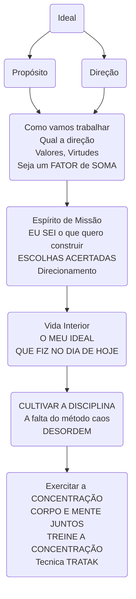
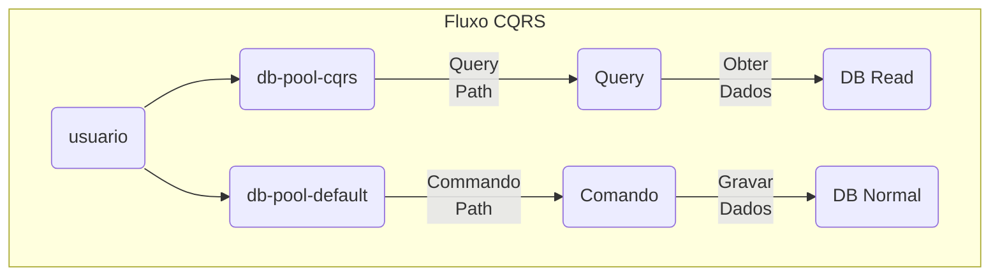

# Architectural Decision Records - ADR
<p align="justify">WILLIAM GLASSER - Aplicou sua teoria da escolha para a educação, na qual o professor é um guia para o aluno e não um chefe. Ele, explica que não se deve trabalhar apenas com memorização, porque a maioria dos alunos simplesmente esquecem os conceitos após a aula, em vez disso, nós aprendemos efetivamente fazendo.</p>

Segundo a teoria nós aprendemos:
<div class="mdx-columns2" markdown>
- [x] 10% quando lemos;
- [x] 20% quando ouvimos;
- [x] 30% quando observamos;
- [x] 50% quando vemos e ouvimos;
- [x] 70% quando discutimos com outros;
- [x] 80% quando fazemos;
- [x] **95%** quando ensinamos aos outros.
</div>

<div class="center-table" markdown>

</div>

## Por fim: Sejamos a pior `EQUIPE DE DESENVOLVIMENTO`
{width="900" height="500" style="display: block; margin: 0 auto"}

### Oportunidade única de aprendizado
- [x] Adotar a **humildade** como ferramenta de crescimento;
- [x] Aprendizado **participativo** e não por comando;
- [x] Conhecimento **estratégico** para um mercado competitivo e processos **internos e sem prestígio**;
- [x] Inventário de **riscos**, pode ser uma estratégia bem pensada(LGPD, ESG, InnerSource, Inclusão Social, Ética de dados);
- [x] Melhorar não por competição, mas por inspiração;
- [x] "Ser o pior" não é sinônimo de ser ineficiência ou incompetência, mas sim de reconhecer que sempre há algo novo para aprender;
- [x] O motivo de qualquer um de nós: `Ter a coragem de mudar e começar de novo`, para mim, é  quando eu me sinto  que estou  desatualizado em relação às demandas mais modernas do mercado;
- [x] A diferença entre : `Entregar qualquer coisa` vs `Entregar a coisa certa`;
- [x] Mude a ROTA, mas nunca desista de MUDAR;
- [x] Única ferramenta para o Desenvolvedor;
      - [x] Teams como ferramenta de Comunicação;
      - [x] Webhook, Gráficos e Abertura de Tickets;
      - [x] PowerBI para acompanhamento;
- [x] Mudar as Métricas da Efitec;
      - [x] Incidentes;
      - [x] Projetos;

- [x] Uniformizar os Projetos;
- [x] Planejar por Equipes e não por indivíduos;
      - [x] Capacitação e Amarração de Pessoas a Produtos;
- [x] Treinador;
- [x] Forçar mudanças organizacionais;
    - [x] Digitação no PWA;
    - [x] Integração com o Teams;
    - [x] Tudo em um Board no PowerBI;
    - [x] Planilha de Competências, Habilidades e Atitudes;
    - [x] Planilha com o Mapa de Férias e Ausências;
- [x] Problemas;
  - [x] Handoffs são uma área chave de risco e dispersão de conhecimento (Concept to Cash).
  - [x] Multifuncional e capaz de entregar de ponta a ponta;
  - [x] Dedicado (sem recursos fracionários); 
      - [x] Essa superalocação de pessoas vai causar multitarefa e troca de contexto..
  - [x] Molde O Ambiente
      - [x] Processos manuais onerosos e sujeitos a erros;
      - [x] Superalocação de pessoas para projetos, hora-extra diminuir;
  - [x] Treine Pessoas E Equipes
      - [x] Treinar equipes para resolver seus próprios problemas;
      - [x] Evitar Abordagens De Comando E Controle;
  - [x] Unificação da Ferramenta
      - [x] Supravizio, OTRS, SysAid, Gitlab e Azure-Devops;
  - [x] Quem faz parte do time? 
  - [x] Quem faz o que, ou seja, matriz de responsabilidade. Conseguimos identificar das competências necessárias?
  - [x] Como está o nosso conhecimento?
### Ainda Sem Solução
- [x] DONO (PRODUCT OWNER/PRODUCT MANAGER) ou que possa ser engajado e capacitado para gerenciar esse backlog;
- [x] Ter um  backlog claro e priorizado;
- [x] Técnico só ASSUMIR, quando PEGAR (Puxar ao invés de EMPURRAR) e ter o hábito de finalizar ao final do dia.
### Livros
O livro de Brooks é considerado uma **leitura obrigatória** para gerentes de projetos de software. 

- [x] A Lei de Brooks é uma observação sobre o gerenciamento de projetos de software que afirma que adicionar pessoas a um projeto atrasado o torna ainda mais atrasado. A frase foi cunhada por Fred Brooks no seu livro de 1975, **The Mythical Man-Month**.
- [x] Leva tempo para novas pessoas se tornarem produtivas (ramp up).
- [x] Gargá-los de comunicação aumenta quando o número de pessoas aumenta.
- [x] A divisibilidade de tarefas pode causar mais caos.
- [x] Alguns trabalhos à serem feitos não podem ser divisiveis e paralelizados.

- [x] Brooks afirma que o número máximo de pessoas em um projeto deve ser determinado de acordo com o número de tarefas que podem ser divididas de forma independente. 
- [ ] Algumas exceções à Lei de Brooks incluem:
<div class="mdx-columns2" markdown>
- [x] Substituir pessoas em vez de adicioná-las;
- [x] Delegar trabalho já delimitado para as novas pessoas;
</div>

## Estrutura do Banco de Dados Oracle
<p align="justify">Padronizar System Identifier, ServiceName, DBName e DB Unique Name é crucial para garantir consistência, facilidade de gerenciamento e integração entre sistemas em ambientes corporativos. A padronização desses elementos facilita a automação de processos, como backup, recuperação e monitoramento, minimizando erros humanos e garantindo que os serviços de banco de dados sejam acessíveis de maneira uniforme. A uniformidade também contribui para uma gestão mais eficiente, especialmente em ambientes complexos e de grande escala.</p>
{width="900" height="600" style="display: block; margin: 0 auto"}

## Estrutura Diretórios Docker
<p align="justify">A padronização da estrutura de diretórios no Docker é essencial para garantir a organização e a eficiência no gerenciamento de containers e imagens. Ao seguir convenções consistentes, como separar os arquivos de configuração, volumes e scripts em diretórios específicos, facilita-se a manutenção e a escalabilidade de projetos. 
A estrutura organizada também melhora a portabilidade e a colaboração entre equipes, tornando o ambiente mais previsível e seguro.</p>
{width="900" height="600" style="display: block; margin: 0 auto"}

## Estrutura do IaM/IdM
<p align="justify">O Keycloak é uma plataforma de gerenciamento de identidades e acesso (IAM) que oferece autenticação e autorização centralizadas. Com a utilização de três Realms, é possível separar e gerenciar diferentes domínios de usuários de forma isolada. 
O Realm Administrativo é utilizado para gerenciar a infraestrutura do Keycloak e controlar permissões de admin. O Realm B2B serve para gerenciar acesso de usuários externos, como parceiros e clientes, com diferentes requisitos de segurança.
Já o Realm de Aplicações Internas gerencia os acessos dos usuários internos, proporcionando controle sobre sistemas corporativos e garantindo a segurança das interações internas.</p>
{width="900" height="600" style="display: block; margin: 0 auto"}

## Padrão CQRS
<p align="justify">A estrutura CQRS (Command Query Responsibility Segregation) visa separar claramente as operações de leitura (queries) e escrita (commands) dentro de um sistema, melhorando a escalabilidade e a manutenção. Com essa abordagem, diferentes modelos de dados podem ser usados para otimizar cada tipo de operação, resultando em maior eficiência e desempenho. A padronização facilita o desenvolvimento e a integração, pois define convenções para a organização de handlers, repositórios e eventos. Também promove uma melhor segurança e controle, já que comandos e consultas podem ser isolados e auditados de forma independente. Em sistemas complexos, essa estrutura permite evoluções mais ágeis e maior flexibilidade nas soluções implementadas.</p>
{width="900" height="600" style="display: block; margin: 0 auto"}

## Padrão SAGA
É uma abordagem para gerenciar transações distribuídas em arquiteturas de Microserviços, garantindo consistência sem a necessidade de um banco de dados centralizado. 
Existem duas abordagens principais: **Coreografia**, onde os microserviços se comunicam diretamente entre si, e **Orquestração**, onde um serviço central coordena as transações. 
É essencial para a escalabilidade e a resiliência de sistemas baseados em microserviços, mantendo a consistência eventual sem comprometer o desempenho.
{width="900" height="600" style="display: block; margin: 0 auto"}

## Estruturação das Actions/Pipelines
<p align="justify">A estruturação adequada das actions e pipelines em repositórios GitHub ou Azure DevOps é essencial para garantir a automação eficiente de testes, builds e deploys, aumentando a qualidade e consistência do código. Além disso, uma boa estrutura facilita a manutenção e escalabilidade dos fluxos de trabalho, garantindo que diferentes ambientes e branches sejam tratados de forma organizada. A padronização também melhora a colaboração entre equipes, permitindo que os desenvolvedores sigam práticas consistentes.</p>
{width="200" height="125" style="display: block; margin: 0 auto"}

## Divisão das Aplicações (OSS, COTS, MOTS, Internas)
<p align="justify">Padronizar um modelo que leve em consideração aplicações MOTS (Modificable Of The Shelf), COTS (Commercial Off-The-Shelf), OSS (Open Source Software) e Internas é fundamental para garantir uma integração eficaz, reduzir complexidade e aumentar a interoperabilidade entre diferentes soluções tecnológicas.</p>
A padronização assegura que todas essas soluções possam coexistir de forma coesa, sem sobrecarga ou redundância.  
<p align="justify">Esse modelo também contribui para a escalabilidade, já que um framework padronizado permite a fácil adição de novas soluções conforme a necessidade da empresa, sem comprometer a estabilidade ou a performance do ambiente tecnológico como um todo.</p>
{width="900" height="600" style="display: block; margin: 0 auto"}

## Static Site Generatos - Document as Code vs Wiki
<p align="justify">Ao utilizar um Static Site Generator (SSG) junto com o conceito de Document as Code traz benefícios significativos para o desenvolvimento de documentação técnica. O SSG permite gerar sites rápidos, leves e facilmente hospedados, onde a documentação é gerada de forma automática a partir de arquivos de texto simples, como Markdown.</p>
<p align="justify">O Document as Code trata a documentação como parte do processo de desenvolvimento, permitindo que ela seja versionada, testada e revisada junto ao código-fonte, promovendo maior consistência e colaboração entre equipes. Essa abordagem facilita a automação de atualizações e integrações com o fluxo de CI/CD. Combinando essas práticas, a documentação torna-se mais ágil, acessível e integrada ao ciclo de vida do software.</p>
{width="900" height="600" style="display: block; margin: 0 auto"}

Com isso, seria uma abordagem que aplica os princípios do desenvolvimento de software e práticas de engenharia de software ao processo de documentação, tratando a documentação como código.

- [x] Versionamento e Controle de Mudanças;
- [x] Automação de Build e Deploy, juntamente com o ATDD(Acceptance Test-Driven Development +  UAT (User Acceptance Testing));
- [x] Testes de Documentação;
- [x] Colaboração e Controle de Qualidade;
- [x] Escalabilidade e Manutenção (Tudo em ÚNICO ponto, mas mantendo a INDEPENDÊNCIA).

## Observabilidade com OpenTelemetry
<p align="justify">OpenTelemetry coleta métricas, logs e traces de aplicações distribuídas, enquanto o SignOz fornece ferramentas avançadas de visualização e análise. Com isso, é possível monitorar o desempenho e identificar problemas rapidamente em sistemas complexos. A integração facilita o rastreamento de requisições, análise de latências e diagnóstico de erros. Juntas, as ferramentas oferecem uma solução poderosa para melhorar a eficiência operacional e a resolução de incidentes.</p>

|        |    |
|        |    |
| {width="300" height="200" style="display: block; margin: 0 auto"} | {width="300" height="200" style="display: block; margin: 0 auto"} |
| {width="300" height="200" style="display: block; margin: 0 auto"} | {width="300" height="200" style="display: block; margin: 0 auto"} |

## Arquitetura Unica (MOTS, COTS, INT, OSS, CQRS)
<p align="justify">Integrar o modelo CQRS (Command Query Responsibility Segregation) com aplicações MOTS (Modificable Of The Shelf), COTS (Commercial Off-The-Shelf), OSS (Open Source Software) e sistemas internos em ambientes operacionais cria uma base sólida para arquiteturas escaláveis e flexíveis. A padronização entre esses sistemas e a definição clara de interfaces e processos operacionais proporcionam maior coesão e governança no ambiente. Isso resulta em um ambiente operacional robusto, onde todos os componentes, internos e externos, colaboram de maneira eficiente, escalável e segura. A abordagem permite que mudanças sejam implementadas de forma ágil, mantendo o controle e a consistência entre sistemas diversos.</p>

{width="900" height="600" style="display: block; margin: 0 auto"}
## Ciclo de Vida de um Produto
<p align="justify">O Ciclo do software, começa com a ideia, onde identificam-se necessidades ou problemas que o software irá resolver, levando à definição dos requisitos iniciais. Em seguida, entra-se na fase de desenvolvimento, que envolve o design, programação, testes e implementação do software, garantindo que ele atenda aos requisitos definidos. Após a implementação, o software passa pela manutenção, onde são feitas correções, atualizações e melhorias. Com o tempo, o software pode se tornar obsoleto devido a novas tecnologias ou mudanças nas necessidades de mercado, levando à sua descontinuação. Durante todo o ciclo, é importante realizar revisões contínuas para garantir que o software permaneça relevante e eficaz até seu fim.</p>
Tudo começa com ideias,necessidades ou hipóteses. Em um fluxo de valor não há requisitos, apenas ideias,necessidades ou hipóteses e quais serão os resultados. 
<div class="mdx-columns3" markdown>
- [x] Requisitos;
- [x] Capacitação;
- [x] Motivação;
- [x] Qualidade;
- [x] Manutenibilidade;
</div>

{width="800" height="500" style="display: block; margin: 0 auto"}

## Estruturação do Azure-Devops
Para estruturar ideias em um projeto no Azure DevOps sem uma **SQUAD**, mas com pessoas alocadas a diversos times de desenvolvimento, é essencial criar um planejamento flexível e organizado. Entendeu-se que a URL base para acessar os recursos de um Azure DevOps Organization e seus projects na plataforma.

- [x] https://devops.azure.com/: Esta é a URL base para acessar os serviços de DevOps na nuvem da Microsoft. Todos os recursos relacionados ao Azure DevOps estão acessíveis por meio dessa URL.
- [x] {organization}: Representa o nome da organização dentro do Azure DevOps. Uma organização no Azure DevOps é uma coleção de projetos e recursos, geralmente vinculada a uma empresa ou equipe. Exemplo: https://devops.azure.com/mycompany.
- [x] {projects}: Refere-se ao nome do projeto específico dentro da organização. Cada organização pode ter múltiplos projetos, que são as unidades de trabalho e colaboração no Azure DevOps, com diferentes repositórios, pipelines, boards e outros recursos. Exemplo: https://devops.azure.com/mycompany/myproject.
- [x] [Outras informações importantes](recipe_60pportunities_conc_projetos_modelo.md)

- [x] Um produto no Azure DevOps representa uma **solução contínua** que está em desenvolvimento constante, com evolução, melhorias e manutenção regulares. Em vez de ter uma data de término definida como em um projeto, o produto é algo que existe de forma contínua, que precisa ser mantido, evoluído e documentado.

{width="700" height="500" style="display: block; margin: 0 auto" }

### Criação de Projetos
Desenvolvido duas scripts para a uniformização dos projetos,  que seguem a estrutura:

{width="900" height="500" style="display: block; margin: 0 auto" }

```
usage: git-azcesuc -h|help|?
 onde: https://dev.azure.com/{yourorganization}/{project}
      - yourorganization   = {yourorganization}
      - project            = Sistemas MOTS, INTERNOS,  OSS ou DSS.
 OPCOES:
  -p, --produto    Nome do MOTS, INTERNOS, OSS ou DSS            (Exemplo: -p E_BUSINESS_SUITE, GESCON, PEOPLESOFT)
  -t, --projeto    Projeto do PDTIC,DEMANDA                      (Exemplo: -t PROJETO)
  -d, --data       Data Incial da Iteracao dd-mm-yyyy            (Exemplo: -d 01-06-2023)
  -i, --iteracao   Número de Iterações                           (Exemplo: -i 5 (MÁXIMO: 12))
  -q, --query      Share Queries padrões                         (Exemplo: -q)
  -r, --repos      secao1-secao2-secao3                          (Exemplo: -r po,po,po-html,plsql,req-front,back,lib)
  -m, --maven      Estrutura Maven (maven-archetype-quickstart)  (Exemplo: -m)
  -l, --liqui      Estrutura Liquibase                           (Exemplo: -l)
  -u, --subm       Submodule Project                             (Exemplo: -u https://github.com/horaciovasconcellos/Teste.git)
  -y, --codes      Arquivos Padronizados de Estilo               (Exemplo: -y)
  -a, --admin      Adicionar Administradores                     (Exemplo: -a horacio@60pportunities.com.br,carlos@60pportunities.com.br)
  -o, --organ      Organismo/Membro do Projeto                   (Exemplo: -a horacio@60pportunities.com.br,carlos@60pportunities.com.br)
  Exemplo: git-azcesuc -s -p SISGEN -t p23001 -d 01-03-2023 -i 10 -q -l -m -r po,po-req,plsql-docs,sql  OU
           git-azcesuc -p SISGEN -t p23001 -c
```

Observação:

* Para o perfeito funcionamento da estrutura e há a necessidade dos softwares git, mkdocs e Material for MkDocs, estarem instalados.
* As data inicial deverá ser sempre segunda-feira e somará de duas(2) semanas.

```
usage: git-azanual -h|help|?
 onde: https://dev.azure.com/{yourorganization}/{project}
      - yourorganization   = {yourorganization}
      - project            = Sistemas MOTS, INTERNOS,  OSS ou DSS.
  -p, --produto    Nome do MOTS, INTERNOS, OSS ou DSS            (Exemplo: -p E_BUSINESS_SUITE, GESCON, PEOPLESOFT)
  -a, --ano        Ano                                           (Exemplo: 2023, 2024)
```

```
usage: git-azestatistica-json -h|help|?
 onde: https://dev.azure.com/{yourorganization}/{project}
      - yourorganization   = {yourorganization}
      - dataSearch         = 'yyyy-mm-dd hh24:mi:ss'

Identifica os commits realizados a partir de uma determinada data e os arquivos alterados.
- Follow de Code.
```
## Uma Lista De Parar De Fazer E Começar A Fazer Para Liderança

| Fazendo agora/Por favor pare  | Não estou fazendo agora/por favor comece |
| -----                         | -----                                    |
| Mudando as prioridades dentro de um sprint  | Não mude as prioridades: proteja as equipes para que possam se concentrar. Aprenda e apoie as regras do scrum |
| Substituindo as prioridades que o proprietário do negócio definiu para a equipe     | Colabore com o negócio |
| Forçar as equipes a cumprir prazos irrealistas e criar dívidas técnicas             | Definir data ou escopo, não ambos |
| Retirar pessoas das equipes para trabalhar em simulações de incêndio ou projetos especiais | Deixe as equipes trabalharem em seu ritmo ideal |

## Camada de Persistência (PL/SQL)
Estratégia CI/CD (Integração Contínua/Entrega Contínua) para a camada de persistência utilizando Liquibase, será da seguinte forma.

{width="600" height="300" style="display: block; margin: 0 auto"}

## ORDS Padronização
<div class="center-table" markdown>
[](https://mermaid.live/edit#pako:eNqVVF9vokAQ_yobHi6YlKu-mqYJLGiNWqmLJnfYh1VGJcXd3gLt2drP0w_SL3bDgka4S9PjCWZ-f2aG2X01VjICo2tsFH_cksBdCIKP3Q5pEoPI4J4Qy7omNqsSoaPkcwoK4zpxuAnGowNxwp6SIrNARGQ2uC_BDjl7SpXQzjOp4heexVIQBuoJpUr02PXm5BtiNPxKi2fyAcTV5VJdy_U6iQUchjQc2GMdGsJ-lUj-UPGH9Nzt-4lOItBwvoI0lYfC5r8Ip9bb5Et4Gtr-gPR5Bs98XxYqxea8yS9olGjaHCBlIeUZT-RG6uHFH-9S8yo74jqVEWUN6t3Mm_4wo6X1KGVi_cpBlcX1vaCFY6eTsX3rTk6AldxxEZXi_iy4dL2RF3iX_oQFrdJBC547eA5rm2A5rNDzWS9om37RDS--mT__2TZ7Sf5bFp-Oi9hJnime6qzXb5sMNrni4uOdVw5VTTWHTs2h03Do1Bw6dYfO3w5FyfUpUdYzqRRpnmRcN4-Bgn83uJ3XExioVHRvNRVvNG6obPmOR7Ii6OHUCDe0QcCAtu1N-vVEb-Lb_TPjTn0_MGLSmXtVIPUoqqOI06hvEkaOwGJKMj3-Vmy46rc6ha6DYwpNFxdvydNyT6cygbR12jV0PYpXFAx9SkF70qC4n5roKmqM6YjBMjWn8tkawRMkeCJWuYqzfevIwCKaDAx9xmhWhYxiUP9gGBfGDtSOxxHenq8Ff2FkW9jBwujiawRrjv9sYSzEG0I5XntsL1ZGN1M5XBj5Y4Qn1o053rs7o7vmSQpvfwBV0Y6I)
</div>

### Modelo Simplificado
<div class="center-table" markdown>

</div>

## Final de Pipeline
{width="900" height="600" style="display: block; margin: 0 auto"}

## Problemas
- [x] Cada user story é um cheque - Alguem paga ou o que é pior **já está pago**;
- [x] O time esta entregando pouco, eu preciso acelerar? O que é entregar muito? O que precisa ser entregue? Temos uma lista CLARA, do que precisa ser entregue?
- [x] O problema não é trocar prioridade,  o problema é deixar explícito o que não vai ser feito;
- [x] O time de tecnologia tentando apontar prazo;
- [x] inovação acontece quando você tem intolerância a erros. Linus, erro rápido e acerte logo.

## Meta vs Métricas
- [x] Segregar Métricas e Metas;
      - [x] **Métricas**: São medidas quantitativas ou qualitativas utilizadas para avaliar o desempenho de um processo, atividade ou sistema.
      - [x] **Metas**: São objetivos específicos e mensuráveis que uma pessoa ou organização deseja alcançar em um determinado período de tempo.
## Métricas de Mercado
### Dora(DevOps Research and Assessment) matrics
<p align="justify">Elas são baseadas em um estudo realizado pela Google e ajudam a medir a eficácia das equipes de desenvolvimento e operações em várias áreas críticas, como velocidade de entrega, estabilidade e confiabilidade. As 4 principais métricas DORA são:</p>

- [x] **Frequência de implantação**: com que frequência uma equipe de software envia alterações para a produção;
- [x] **Tempo de entrega da alteração**: o tempo que leva para que o código comprometido seja executado na produção;
- [x] **Taxa de falha de alteração**: a parcela de incidentes, reversões e falhas de todas as implantações;
- [x] **Tempo para restaurar o serviço**: o tempo que leva para restaurar o serviço na produção após um incidente;
### Space
<p align="justify">O SPACE é um modelo de métricas desenvolvido para capturar uma visão holística do desempenho das equipes de engenharia, incluindo tanto a produtividade quanto a experiência e satisfação dos desenvolvedores.</p>

- [x] Satisfação e Bem-estar (Satisfaction and well-being):
      - [x] O que mede: A satisfação geral dos desenvolvedores com seu trabalho, incluindo aspectos como equilíbrio entre vida pessoal e profissional, saúde mental e motivação.
      - [x] Por que é importante: A satisfação dos desenvolvedores tem impacto direto na produtividade e qualidade do código produzido.
- [x] Produtividade (Performance):
      - [x] O que mede: A quantidade e a qualidade do trabalho entregue, medido em termos de tarefas completadas, código entregue, ou valor entregue aos usuários.
      - [x] Por que é importante: A produtividade é um reflexo direto da capacidade da equipe de gerar valor e cumprir suas metas.
- [x] Atenção ao Processo (Activity):
      - [x] O que mede: A atividade das equipes no uso de ferramentas e práticas, como commits, revisões de código, reuniões, integração contínua e deploys.
      - [x] Por que é importante: Reflete a eficiência dos processos e a disciplina da equipe no uso de práticas ágeis e de desenvolvimento contínuo.
- [x] Colaboração (Collaboration):
      - [x] O que mede: A capacidade de colaboração dentro da equipe e entre equipes, incluindo interações no código, revisão de código, feedback e outras formas de comunicação.
      - [x] Por que é importante: A colaboração eficaz é um fator crítico para o sucesso de uma equipe de desenvolvimento, pois promove o compartilhamento de conhecimento e a sinergia entre os membros.
- [x] Eficiência (Efficiency):
      - [x] O que mede: Como os recursos são usados de maneira eficiente no processo de desenvolvimento. Pode incluir o tempo gasto em tarefas que realmente agregam valor e a eliminação de desperdícios.
      - [x] Por que é importante: Melhorar a eficiência significa entregar mais valor com menos recursos, tempo ou esforço.
- [x] Segurança e Qualidade (Errors and Security):
      - [x] O que mede: A qualidade e segurança do software desenvolvido, medindo o número de bugs, falhas e vulnerabilidades de segurança.
      - [x] Por que é importante: Alta qualidade e segurança são fundamentais para a confiança do cliente e a estabilidade do sistema.
### Métricas DevEx (Developer Experience)
<p align="justify">Developer Experience (DevEx) se refere à experiência geral dos desenvolvedores durante o ciclo de desenvolvimento, desde a codificação até a implantação e a manutenção de sistemas.</p>

- [x] Tempo para Configuração (Onboarding Time):
      - [x] O que mede: O tempo necessário para que um desenvolvedor se familiarize com as ferramentas, processos e o código base de um projeto.
      - [x] Por que é importante: Um processo de onboarding eficiente reduz o tempo de adaptação e aumenta a produtividade do desenvolvedor.
- [x] Tempo de Feedback (Feedback Time):
      - [x] O que mede: O tempo entre o momento em que o desenvolvedor envia uma alteração de código e o feedback recebido sobre essa alteração (seja uma revisão de código, build, teste, etc.).
      - [x] Por que é importante: Reduzir o tempo de feedback ajuda os desenvolvedores a iterar rapidamente, melhorar a qualidade do código e aumentar a satisfação no processo de desenvolvimento.
- [x] Tempo de Espera (Wait Time):
      - [x] O que mede: O tempo que os desenvolvedores gastam aguardando processos como build, testes, deploys e integrações.
      - [x] Por que é importante: A redução do tempo de espera melhora a eficiência do desenvolvedor e permite ciclos de feedback mais rápidos.
- [x] Satisfação do Desenvolvedor (Developer Satisfaction):
      - [x] O que mede: A satisfação geral do desenvolvedor com as ferramentas, processos e a colaboração dentro da equipe.
      - [x] Por que é importante: Desenvolvedores satisfeitos são mais produtivos e tendem a permanecer por mais tempo na organização, melhorando a retenção e a qualidade do software.
- [x] Eficiência do Fluxo de Trabalho (Workflow Efficiency):
      - [x] O que mede: A facilidade e rapidez com que os desenvolvedores podem completar tarefas, desde a escrita do código até a implantação e a manutenção do software.
      - [x] Por que é importante: Processos de trabalho eficientes aumentam a produtividade e reduzem o tempo gasto em tarefas repetitivas ou burocráticas.
### O que gostaria
- [x] Indicador tem que ser evangelizado com o time; 
      - [x] Se o time não comprar ele na verdade vai trabalhar para melhorar o indicador não o resultado;
      - [x] Sempre tem um jeito de colocar o número bom sem necessariamente ficar bom então é importante que o time entenda na verdade;
- [x] Quando olhei par ao Azure-Wit, vi valores errados e fiquei triste;
      - [x] Início da atividade estava defasada da data de início impostada;
- [x] Portal de Colaboração parecido com o InnerSource;
## Finalizando
<p align="justify">Medir a produtividade do desenvolvimento de software é um tópico delicado e, como tal, decisões de cima para baixo podem facilmente causar alguma controvérsia. 
Por outro lado, sem a direção da liderança de engenharia, é muito fácil desistir.
O papel da liderança é construir um ambiente onde equipes e indivíduos possam ter sucesso. Garantir que alguns ciclos de feedback estejam em vigor é um exemplo perfeito disso. Portanto, faz sentido ser proativo nessa discussão.</p> 
**Os desenvolvedores geralmente têm preocupações sobre rastrear métricas prejudiciais e desempenho individual**.

