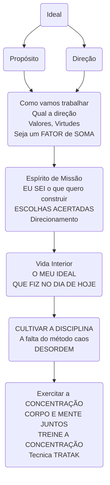
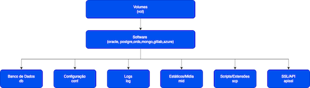
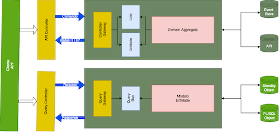
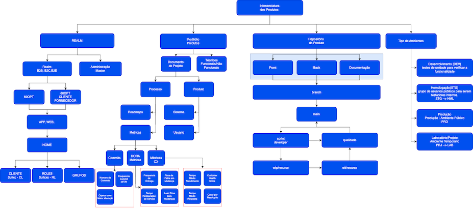
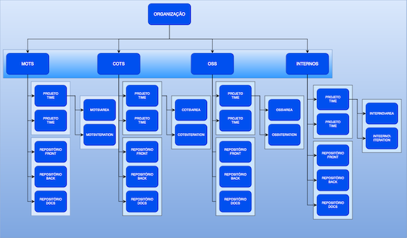
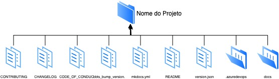
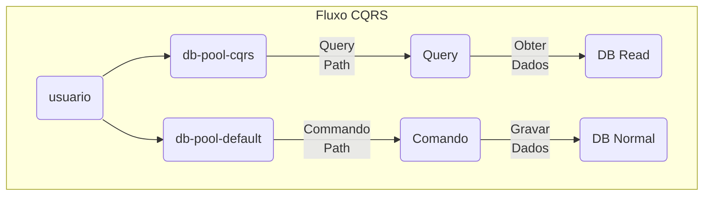

## Migração para Azure-Devops
A migração do GitLab para o Azure DevOps foi uma decisão estratégica tomada com base em diversos fatores que visam melhorar a eficiência, integração e escalabilidade dos nossos processos de desenvolvimento. 

### Gerenciamento de Projetos e Work Items
O Azure DevOps possui uma abordagem poderosa e intuitiva para o gerenciamento de projetos, com funcionalidades como boards, sprints, e acompanhamento de work items. A integração dos boards com as funcionalidades de controle de versões e pipelines permite que as equipes acompanhem o progresso de forma mais precisa e transparente. Além disso, os work items podem ser facilmente ligados a commits, builds e releases, proporcionando uma visão unificada do ciclo de vida do desenvolvimento.

|                                         |                                  |
|                                         |                                  |
|  |  |

- [x] O que seriam **épicos e features**, no conceita da Empresa? 
- [x] Temos **Product Manager, Owner ou Usuário Chave**? 
- [x] Tínhamos a cultura, ou seria, melhor começar de **PBI, Bug, Task, Spike**?
      - [ ] As Wits poderiam ser **EXCLUÍDAS**?
      - [ ] Quais os campos obrigatórios ou opcionais?
- [x] Tínhamos um **SQUAD**?

### Integração e Ecossistema Microsoft
O Azure DevOps oferece uma integração nativa com outras ferramentas do ecossistema Microsoft, como o Teams, Power BI e Office 365.

### Segurança e Governança
O Azure DevOps possui fortes controles de segurança e governança, incluindo autenticação multifatorial (MFA), integrações com Azure Active Directory (AAD), e opções avançadas de controle de permissões.

### Custo
Embora o GitLab ofereça uma solução de código aberto com boas funcionalidades, o Azure DevOps se destaca por seu modelo de preços competitivo e escalável, permitindo ajustar os custos conforme o uso.

## Problemas vistos
- [x] Não tínhamos **conhecimento** no Azure-Devops;
- [x] Não **sabíamos como efetuar alteração e adicionar campos** que eram necessários para atender a unificação das Demandas (Projetos, Demanda Expressa e Bugs);
- [x] Havíamos **automatizado a criação de Projetos no GitLab e voltávamos para o Manual** no Azure-Devops;
- [x] Como poderíamos controlar as horas em um determinado **PROJETO**, sendo que a **maioria** dos projetos são de **INTEGRAÇÃO**.
      - [x] **Environment Management (Gestão dos ambientes)**;
      - [x] **Incident Managment (Gestão de Incidentes)**;
      - [x] **Disaster Recovery (Recuperação de desastres)**;
      - [x] **Reliability Driven Development (Desenvolvimento guiado pela confiabilidade)**;
      - [x] **Informative Workspace (Ambiente Informativo)**: Documentação gerada automaticamente pelo código com um processo de Tech Writer organizado;
      - [x] **Isolated Environments (Ambientes isolados)**: O time de produto dispor de ambientes para validação, desenvolvimento e Sandbox para equipes explorarem os contratos e SLA sobre as APIs;
- [x] Iniciamos com o processo **`xxxx-lab Scrum`**  e desenvolvemos o `xxxxπdev_Scrum`;
- [x] Como fazer o processo de Deploy, sendo que a maioria dos desenvolvimentos eram `legados` e dificilmente entrariam em uma esteira DevSecOps;

[](https://mermaid.live/edit#pako:eNplks2O2jAQgF9l5ENlJCiwR1StShJ-dllVdGFVqcplSAaS4sSRf7RFiIepeugD9BF4sTreBC3Uhyj2fPPZY8-RJTIlNmJbIV-TDJWBp-e4BDfGA76M1g9hB6DXg6WSP8hI7f57vXsIPh9BZ1jRCFKZ6C4I3JAYQcy-5QZKWfOpNTJmp8Y25KuDHudpp7YFdqf7ERUfJz8rRVojtN43OoDL8KtDHsnEFlQaTFB2_oM8FfJAYZlkTTi8iQ75lNBYRdBg8AHCO-6OAtd5Qx9o8yIeZpTspTUQuqtqoOhaPuFr0obgpczN-ZfK2yNOrrEprxXw1aLIzaFhptfMjD-TINSk-4HNRdpQs2tq7jeEtZRCf-pv1P1UYUGvUu0bfn7Du8cktZWqcJVSXfrc3Ska3Lid_PSOj5cPUFtbw8BTPuY-wdCLHvk4odyVmkp40fZ9sY9w8yALHlEl5AEqVOhP6buifkEnXAz4jBSe_5x_u3aRyuTb819xsS088s72xL9Ix-TJW4r3rQzuaS5FSkrXeXHJuqwgV2WeuqY-1qqYmYwKilndnSlt0QoTs7g8ORRdi64OZcJGRlnqMiXtLmOjLQrtZrZK0VCU485d7mW1wvK7lO389A9jEexr)

# Architectural Decision Records - ADR
WILLIAM GLASSER - Aplicou sua teoria da escolha para a educação, na qual o professor é um guia para o aluno e não um chefe. Ele, explica que não se deve trabalhar apenas com memorização, porque a maioria dos alunos simplesmente esquecem os conceitos após a aula, em vez disso, nós aprendemos efetivamente fazendo.

Segundo a teoria nós aprendemos:
<div class="mdx-columns2" markdown>
- [x] 10% quando lemos;
- [x] 20% quando ouvimos;
- [x] 30% quando observamos;
- [x] 50% quando vemos e ouvimos;
- [x] 70% quando discutimos com outros;
- [x] 80% quando fazemos;
- [x] 95% quando ensinamos aos outros.
</div>

<div class="center-table" markdown>

</div>

## Por fim: Sejamos a pior `EQUIPE DE DESENVOLVIMENTO`
{width="900" height="500" style="display: block; margin: 0 auto"}

### Oportunidade única de aprendizado
- [x] Adotar a **humildade** como ferramenta de crescimento;
- [x] Aprendizado **participativo** e não por comando;
- [x] Conhecimento **estratégico** para um mercado competitivo e processos **internos e sem prestígio**;
- [x] Inventário de **riscos**, pode ser uma estratégia bem pensada(LGPD, ESG, InnerSource, Inclusão Social, Ética de dados);
- [x] Melhorar não por competição, mas por inspiração;
- [x] "Ser o pior" não é sinônimo de ser ineficiência ou incompetência, mas sim de reconhecer que sempre há algo novo para aprender;
- [x] O motivo de qualquer um de nós: `Ter a coragem de mudar e começar de novo`, para mim, é  quando eu me sinto  que estou  desatualizado em relação às demandas mais modernas do mercado;
- [x] A diferença entre : `Entregar qualquer coisa` vs `Entregar a coisa certa`;
- [x] Mude a ROTA, mas nunca desista de MUDAR;
- [x] Única ferramenta para o Desenvolvedor;
      - [x] Teams como ferramenta de Comunicação;
      - [x] Webhook, Gráficos e Abertura de Tickets;
      - [x] PowerBI para acompanhamento;
- [x] Mudar as Métricas da Efitec;
      - [x] Incidentes;
      - [x] Projetos;

## Arquitetura Docker
{width="900" height="600" style="display: block; margin: 0 auto"}
## Padrão CQRS
O padrão CQRS divide o aplicativo em duas partes — o lado do comando e o lado da consulta. O lado do comando trata das solicitações create, update e delete. O lado da consulta executa a parte query usando as réplicas de leitura.
{width="900" height="600" style="display: block; margin: 0 auto"}
## Arquitetura Proposta Nomenclaturas
{width="900" height="600" style="display: block; margin: 0 auto"}
## Projetos
Uma visão de um PRODUTO, em vez disso, deve ser entendido que cada **PRODUTO** se destina a alcançar um ou mais resultados de negócios e, para isso, deve mudar e melhorar continuamente.
{width="800" height="500" style="display: block; margin: 0 auto"}
<p align="justify">Um projeto é um “esforço temporário empreendido para criar um produto, serviço ou resultado único” em uma organização. No entanto, para ser verdadeiramente competitiva, uma organização precisa ser capaz de fornecer um fluxo contínuo de mudanças. A estrutura define explicitamente um fim: um ponto em que o projeto será concluído.</p>

{width="700" height="500" style="display: block; margin: 0 auto" }

### Criação de Projetos
Desenvolvido duas scripts para a uniformização dos projetos,  que seguem a estrutura:

{width="900" height="500" style="display: block; margin: 0 auto" }

```
usage: git-azcesuc -h|help|?
 onde: https://dev.azure.com/{yourorganization}/{project}
      - yourorganization   = {yourorganization}
      - project            = Sistemas MOTS, INTERNOS,  OSS ou DSS.
 OPCOES:
  -p, --produto    Nome do MOTS, INTERNOS, OSS ou DSS            (Exemplo: -p E_BUSINESS_SUITE, GESCON, PEOPLESOFT)
  -t, --projeto    Projeto do PDTIC,DEMANDA                      (Exemplo: -t PROJETO)
  -d, --data       Data Incial da Iteracao dd-mm-yyyy            (Exemplo: -d 01-06-2023)
  -i, --iteracao   Número de Iterações                           (Exemplo: -i 5 (MÁXIMO: 12))
  -q, --query      Share Queries padrões                         (Exemplo: -q)
  -r, --repos      secao1-secao2-secao3                          (Exemplo: -r po,po,po-html,plsql,req-front,back,lib)
  -m, --maven      Estrutura Maven (maven-archetype-quickstart)  (Exemplo: -m)
  -l, --liqui      Estrutura Liquibase                           (Exemplo: -l)
  -u, --subm       Submodule Project                             (Exemplo: -u https://github.com/horaciovasconcellos/Teste.git)
  -y, --codes      Arquivos Padronizados de Estilo               (Exemplo: -y)
  -a, --admin      Adicionar Administradores                     (Exemplo: -a horacio@60pportunities.com.br,carlos@60pportunities.com.br)
  -o, --organ      Organismo/Membro do Projeto                   (Exemplo: -a horacio@60pportunities.com.br,carlos@60pportunities.com.br)
  Exemplo: git-azcesuc -s -p SISGEN -t p23001 -d 01-03-2023 -i 10 -q -l -m -r po,po-req,plsql-docs,sql  OU
           git-azcesuc -p SISGEN -t p23001 -c
```

Observação:

* Para o perfeito funcionamento da estrutura e há a necessidade dos softwares git, mkdocs e Material for MkDocs, estarem instalados.
* As data inicial deverá ser sempre segunda-feira e somará de duas(2) semanas.

```
usage: git-azanual -h|help|?
 onde: https://dev.azure.com/{yourorganization}/{project}
      - yourorganization   = {yourorganization}
      - project            = Sistemas MOTS, INTERNOS,  OSS ou DSS.
  -p, --produto    Nome do MOTS, INTERNOS, OSS ou DSS            (Exemplo: -p E_BUSINESS_SUITE, GESCON, PEOPLESOFT)
  -a, --ano        Ano                                           (Exemplo: 2023, 2024)
```

```
usage: git-azestatistica-json -h|help|?
 onde: https://dev.azure.com/{yourorganization}/{project}
      - yourorganization   = {yourorganization}
      - dataSearch         = 'yyyy-mm-dd hh24:mi:ss'

Identifica os commits realizados a partir de uma determinada data e os arquivos alterados.
- Follow de Code.
```
## Portifólio de Produtos (Document as Code (Doc as Code))
Seria uma abordagem que aplica os princípios do desenvolvimento de software e práticas de engenharia de software ao processo de documentação, tratando a documentação como código.

- [x] Versionamento e Controle de Mudanças;
- [x] Automação de Build e Deploy, juntamente com o ATDD(Acceptance Test-Driven Development +  UAT (User Acceptance Testing));
- [x] Testes de Documentação;
- [x] Colaboração e Controle de Qualidade;
- [x] Escalabilidade e Manutenção (Tudo em ÚNICO ponto, mas mantendo a INDEPENDÊNCIA).

{width="900" height="600" style="display: block; margin: 0 auto"}

## Camada de Persistência (PL/SQL)
Estratégia CI/CD (Integração Contínua/Entrega Contínua) para a camada de persistência utilizando Liquibase, será da seguinte forma.

{width="600" height="300" style="display: block; margin: 0 auto"}

## ORDS Padronização
<div class="center-table" markdown>
[](https://mermaid.live/edit#pako:eNqVVF9vokAQ_yobHi6YlKu-mqYJLGiNWqmLJnfYh1VGJcXd3gLt2drP0w_SL3bDgka4S9PjCWZ-f2aG2X01VjICo2tsFH_cksBdCIKP3Q5pEoPI4J4Qy7omNqsSoaPkcwoK4zpxuAnGowNxwp6SIrNARGQ2uC_BDjl7SpXQzjOp4heexVIQBuoJpUr02PXm5BtiNPxKi2fyAcTV5VJdy_U6iQUchjQc2GMdGsJ-lUj-UPGH9Nzt-4lOItBwvoI0lYfC5r8Ip9bb5Et4Gtr-gPR5Bs98XxYqxea8yS9olGjaHCBlIeUZT-RG6uHFH-9S8yo74jqVEWUN6t3Mm_4wo6X1KGVi_cpBlcX1vaCFY6eTsX3rTk6AldxxEZXi_iy4dL2RF3iX_oQFrdJBC547eA5rm2A5rNDzWS9om37RDS--mT__2TZ7Sf5bFp-Oi9hJnime6qzXb5sMNrni4uOdVw5VTTWHTs2h03Do1Bw6dYfO3w5FyfUpUdYzqRRpnmRcN4-Bgn83uJ3XExioVHRvNRVvNG6obPmOR7Ii6OHUCDe0QcCAtu1N-vVEb-Lb_TPjTn0_MGLSmXtVIPUoqqOI06hvEkaOwGJKMj3-Vmy46rc6ha6DYwpNFxdvydNyT6cygbR12jV0PYpXFAx9SkF70qC4n5roKmqM6YjBMjWn8tkawRMkeCJWuYqzfevIwCKaDAx9xmhWhYxiUP9gGBfGDtSOxxHenq8Ff2FkW9jBwujiawRrjv9sYSzEG0I5XntsL1ZGN1M5XBj5Y4Qn1o053rs7o7vmSQpvfwBV0Y6I)
</div>

### Modelo Simplificado
<div class="center-table" markdown>

</div>

## Final de Pipeline
{width="900" height="600" style="display: block; margin: 0 auto"}

## Problemas
- [x] Cada user story é um cheque - Alguem paga ou o que é pior **já está pago**;
- [x] O time esta entregando pouco, eu preciso acelerar? O que é entregar muito? O que precisa ser entregue? Temos uma lista CLARA, do que precisa ser entregue?
- [x] O problema não é trocar prioridade,  o problema é deixar explícito o que não vai ser feito;
- [x] O time de tecnologia tentando apontar prazo;
- [x] inovação acontece quando você tem intolerância a erros. Linus, erro rápido e acerte logo.

## Meta vs Métricas
- [x] Segregar Métricas e Metas;
      - [x] Métricas: São medidas quantitativas ou qualitativas utilizadas para avaliar o desempenho de um processo, atividade ou sistema.
      - [x] Metas: São objetivos específicos e mensuráveis que uma pessoa ou organização deseja alcançar em um determinado período de tempo.
### Dora(DevOps Research and Assessment) matrics
Elas são baseadas em um estudo realizado pela Google e ajudam a medir a eficácia das equipes de desenvolvimento e operações em várias áreas críticas, como velocidade de entrega, estabilidade e confiabilidade. As 4 principais métricas DORA são:

- [x] **Frequência de implantação**: com que frequência uma equipe de software envia alterações para a produção;
- [x] **Tempo de entrega da alteração**: o tempo que leva para que o código comprometido seja executado na produção;
- [x] **Taxa de falha de alteração**: a parcela de incidentes, reversões e falhas de todas as implantações;
- [x] **Tempo para restaurar o serviço**: o tempo que leva para restaurar o serviço na produção após um incidente;
### Space
O SPACE é um modelo de métricas desenvolvido para capturar uma visão holística do desempenho das equipes de engenharia, incluindo tanto a produtividade quanto a experiência e satisfação dos desenvolvedores.

- [x] Satisfação e Bem-estar (Satisfaction and well-being):
      - [x] O que mede: A satisfação geral dos desenvolvedores com seu trabalho, incluindo aspectos como equilíbrio entre vida pessoal e profissional, saúde mental e motivação.
      - [x] Por que é importante: A satisfação dos desenvolvedores tem impacto direto na produtividade e qualidade do código produzido.
- [x] Produtividade (Performance):
      - [x] O que mede: A quantidade e a qualidade do trabalho entregue, medido em termos de tarefas completadas, código entregue, ou valor entregue aos usuários.
      - [x] Por que é importante: A produtividade é um reflexo direto da capacidade da equipe de gerar valor e cumprir suas metas.
- [x] Atenção ao Processo (Activity):
      - [x] O que mede: A atividade das equipes no uso de ferramentas e práticas, como commits, revisões de código, reuniões, integração contínua e deploys.
      - [x] Por que é importante: Reflete a eficiência dos processos e a disciplina da equipe no uso de práticas ágeis e de desenvolvimento contínuo.
- [x] Colaboração (Collaboration):
      - [x] O que mede: A capacidade de colaboração dentro da equipe e entre equipes, incluindo interações no código, revisão de código, feedback e outras formas de comunicação.
      - [x] Por que é importante: A colaboração eficaz é um fator crítico para o sucesso de uma equipe de desenvolvimento, pois promove o compartilhamento de conhecimento e a sinergia entre os membros.
- [x] Eficiência (Efficiency):
      - [x] O que mede: Como os recursos são usados de maneira eficiente no processo de desenvolvimento. Pode incluir o tempo gasto em tarefas que realmente agregam valor e a eliminação de desperdícios.
      - [x] Por que é importante: Melhorar a eficiência significa entregar mais valor com menos recursos, tempo ou esforço.
- [x] Segurança e Qualidade (Errors and Security):
      - [x] O que mede: A qualidade e segurança do software desenvolvido, medindo o número de bugs, falhas e vulnerabilidades de segurança.
      - [x] Por que é importante: Alta qualidade e segurança são fundamentais para a confiança do cliente e a estabilidade do sistema.
### Métricas DevEx (Developer Experience)
Developer Experience (DevEx) se refere à experiência geral dos desenvolvedores durante o ciclo de desenvolvimento, desde a codificação até a implantação e a manutenção de sistemas. 

- [x] Tempo para Configuração (Onboarding Time):
      - [x] O que mede: O tempo necessário para que um desenvolvedor se familiarize com as ferramentas, processos e o código base de um projeto.
      - [x] Por que é importante: Um processo de onboarding eficiente reduz o tempo de adaptação e aumenta a produtividade do desenvolvedor.
- [x] Tempo de Feedback (Feedback Time):
      - [x] O que mede: O tempo entre o momento em que o desenvolvedor envia uma alteração de código e o feedback recebido sobre essa alteração (seja uma revisão de código, build, teste, etc.).
      - [x] Por que é importante: Reduzir o tempo de feedback ajuda os desenvolvedores a iterar rapidamente, melhorar a qualidade do código e aumentar a satisfação no processo de desenvolvimento.
- [x] Tempo de Espera (Wait Time):
      - [x] O que mede: O tempo que os desenvolvedores gastam aguardando processos como build, testes, deploys e integrações.
      - [x] Por que é importante: A redução do tempo de espera melhora a eficiência do desenvolvedor e permite ciclos de feedback mais rápidos.
- [x] Satisfação do Desenvolvedor (Developer Satisfaction):
      - [x] O que mede: A satisfação geral do desenvolvedor com as ferramentas, processos e a colaboração dentro da equipe.
      - [x] Por que é importante: Desenvolvedores satisfeitos são mais produtivos e tendem a permanecer por mais tempo na organização, melhorando a retenção e a qualidade do software.
- [x] Eficiência do Fluxo de Trabalho (Workflow Efficiency):
      - [x] O que mede: A facilidade e rapidez com que os desenvolvedores podem completar tarefas, desde a escrita do código até a implantação e a manutenção do software.
      - [x] Por que é importante: Processos de trabalho eficientes aumentam a produtividade e reduzem o tempo gasto em tarefas repetitivas ou burocráticas.
### O que gostaria
- [x] Indicador tem que ser evangelizado com o time; 
      - [x] Se o time não comprar ele na verdade vai trabalhar para melhorar o indicador não o resultado;
      - [x] Sempre tem um jeito de colocar o número bom sem necessariamente ficar bom então é importante que o time entenda na verdade;
- [x] Quando olhei par ao Azure-Wit, vi valores errados e fiquei triste;
      - [x] Início da atividade estava defasada da data de início impostada;
