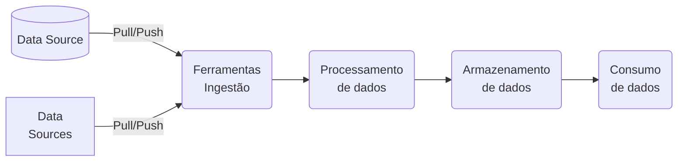
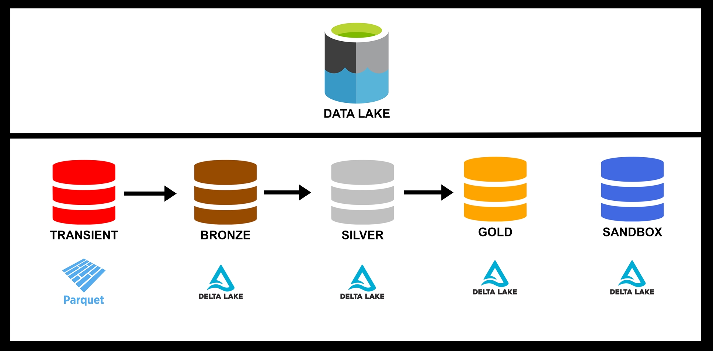
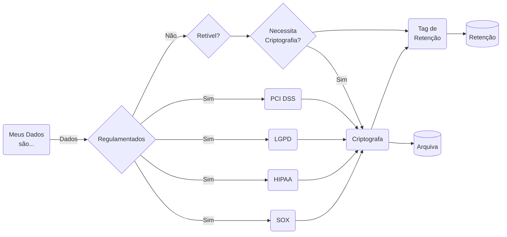
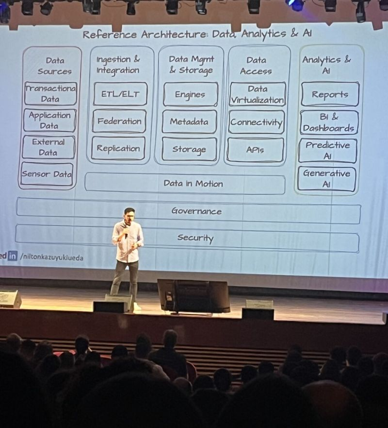
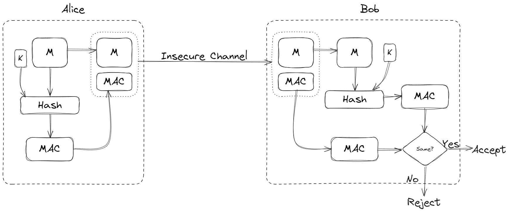
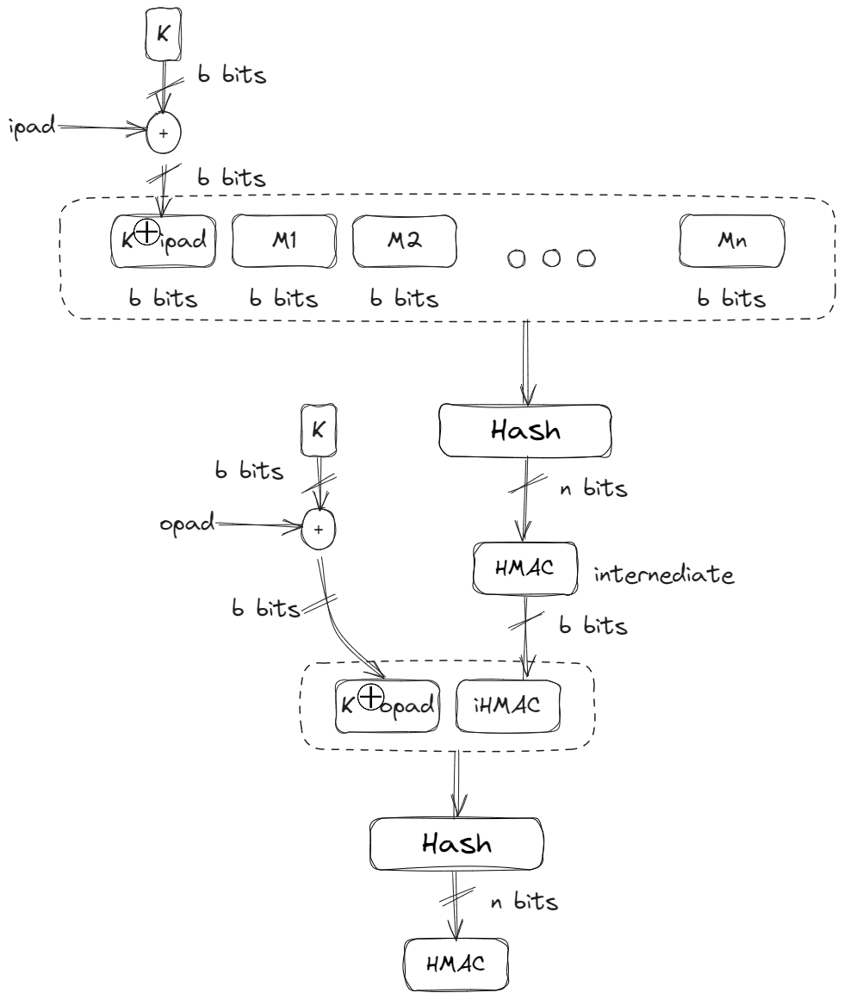

"Quem nunca ouviu uma área de negócio reclamar que precisa analisar alguma informação importante, mas que a devs/areas de desenvolvimento estão demorando muito pra entregar. Hoje, em uma conversa, disseram TCU."

- [x] **Falta dos responsáveis pelos dados**: Quem são os responsáveis pelos dados?
- [x] **Problemas de Qualidade dos dados**: O time de infraestrutura é responsável pela qualidade, mas não conhece os dados tão bem, pois não estão intimamente ligados com o time de negócio.
- [x] **Escalabilidade Organizacional**: O time centralizado de ETL se torna o gargalo na democratização dos dados na empresa.

Integridade de dados refere-se à garantia de que os dados permanecerão precisos, inalterados e consistentes durante todo o seu ciclo de vida.

| **Característica**      | **Data Warehouse**                                          | **Data Lake**                                                  | **Data Mesh**                                               |
| :------ | :--------- | :-------- | :----|
| **Tipo de Dados**        | Dados estruturados                                          | Dados estruturados e não estruturados                          | Dados distribuídos, por domínio                              |
| **Processamento**        | ETL (Extração, Transformação e Carga antes do armazenamento)| ELT (Extração, Carga e Transformação após o armazenamento)     | Processamento descentralizado por cada domínio               |
| **Objetivo Principal**   | Análises de Business Intelligence (BI) e relatórios         | Armazenamento de grandes volumes de dados brutos para análise posterior | Escalabilidade e autonomia na gestão de dados por domínio  |
| **Exemplo de Uso**       | Relatórios financeiros, dashboards e KPIs                  | Análises de dados não estruturados, machine learning, logs    | Grandes organizações com múltiplos departamentos e sistemas distribuídos |
| **Escalabilidade**       | Limitada, pois depende de uma estrutura centralizada        | Alta, permite armazenamento de dados em grande escala         | Muito alta, cada domínio pode escalar independentemente      |
| **Governança**           | Centralizada, controlada por uma equipe de TI               | Menos rigorosa, exige boas práticas de governança              | Descentralizada, cada domínio gerencia seus próprios dados   |
| **Vantagens**            | Consultas rápidas, alta performance para BI                 | Flexibilidade no armazenamento de dados e baixo custo         | Autonomia, escalabilidade e alinhamento com as necessidades de negócios |
| **Desvantagens**         | Rigidez na estrutura de dados, dificuldades com dados não estruturados | Governança e consultas podem ser mais difíceis de gerenciar    | Complexidade de gestão e padronização entre os domínios     |
| **Tecnologias Comuns**   | Google BigQuery, Amazon Redshift, Snowflake, Microsoft SQL Server | Hadoop, Apache Spark, AWS S3, Azure Data Lake, Google Cloud Storage | Arquitetura distribuída, com ferramentas como Kubernetes, Kafka, etc. |

## Arquitetura Integração de Dados
As arquiteturas de integração de dados tornam-se canais para coletar e fornecer insights sobre processos e dados de negócios.

## Arquitetura Integração de Dados
A economia digital colocou mais demanda por serviços de dados dentro de uma organização, sobrecarregando a TI para fornecer esses serviços, acarretando uma proliferação de integrações não governadas na verdade piora na entrega e manutenção da mesma.

Arquiteturas de integração de dados consistem em múltiplas tecnologias que também podem ser alinhadas a outras áreas, como gerenciamento de dados ou governança de dados. No entanto, vale a pena abordar essas tecnologias para e

As arquiteturas de integração de dados tornam-se canais para coletar e fornecer insights sobre processos e dados de negócios.

A integração de dados geralmente é uma tarefa dentro de um projeto maior, sendo um método que fornece dados que podem suportar algum conjunto de requisitos de negócios, objetivando uma melhorara na eficiência geral das organizações comerciais e técnicas, validando efetivamente seus pipelines e resultados de dados e análises.

Uma arquitetura de integração auxuliará a organizar as integrações em um ambiente coerente e estruturado.

Para podermos iniciar o trabalho, foi necessário efetuar um mapeamento dos dados mestres e referêmcia, propondo uma higienização durante o processo de implantação de um novo sistema de Gestão Empresarial. Nosso objetivo foi a promoção da higienização, designação do gestor, background check e seus metadados.

Foram identificados neste trabalho, ciclos viciosos de desenvolvimento em uma arquitetura acidental,que não garantiam a qualidade dos dados, aumentavam as dívida técnica e de processo. 

Eventualmente, surgem perguntas sobre como os resultados foram derivados, a qualidade dos dados, a fonte dos dados e por que as mesmas métricas têm resultados diferentes em diferentes operações de negócios.

Uma arquitetura de integração de dados consiste nas tecnologias, dados e padrões, processos de negócios, necessidades de armazenamento e requisitos operacionais que permitem a entrega da integração de dados.

| Requisitos             | Tecnologia   | Design               | Implementação       | Monitoramento |
| -----                  | ----         | ----                 | -----               | ----          |
| Dados Estruturados     | Mensageria   | Replicação           | Data Pipeline       | Custo         |
| Dados Não Estruturados | ETL/ELT/ETLT | Preparação           | Integração Metadata | Adminitração  |
| Processos de Negócio   | Orquestração | Transformação        | Armazenagem         | Suporte       |
| Metadata               | DatOps       | Orquestraçãp         |                     |               |
| Temporalidade          | Catalogação  | ETL/ELT/ETLT         |                     |               |
| Performance            |              |  Pipeline Integração |                     |               |

## Base de governança de dados e gerenciamento de informações: 
Crie uma base de governança de dados e gerenciamento de informações para dar suporte ao gerenciamento de dados mestres e gerenciamento de metadados para dar suporte a casos de uso de governança de dados e análises; desenvolva novas habilidades e práticas recomendadas; e estabeleça segurança, privacidade e conformidade no gerenciamento de dados.

## Arquitetura e modernização de gerenciamento de dados: 
Implante uma infraestrutura de gerenciamento de dados escalável e confiável e arquitete a arquitetura de dados moderna mais adequada, incluindo gerenciamento de dados local, nativo da nuvem e híbrido para oferecer suporte a volume, velocidade e variedade de dados extremos.

## Princípios e implantações de gerenciamento de dados
Selecione, projete, implante e operacionalize sistemas de gerenciamento de dados usando tendências emergentes em armazenamentos de dados para fins especiais, como armazenamentos não relacionais, gráficos e de objetos, e migre bancos de dados para executar cargas de trabalho híbridas, multicloud e de borda.

## Integração de dados de última geração
Desenvolva as melhores práticas e arquitetura para integração de dados, aproveitando os princípios de engenharia de dados e as tecnologias de virtualização de dados para oferecer suporte a casos de uso de streaming em lote e em tempo real.

## Design de integrações usando métodos apropriados
O design de uma arquitetura de integração pega os processos de negócios definidos e os traduz em pipelines de integração. As fontes de dados e processos se tornam o pipeline de integração; o uso de dados e os tipos de dados se tornam os métodos de integração e transformações; e a usabilidade e o acesso aos dados se torna

Insights sobre formatos de dados, uso dos dados, métodos de armazenamento,  podem determinar o método de integração.

Processos de negócios e regras de transformação

As perguntas a serem respondidas pelos requisitos do processo incluem:

| Perguntas                                                | Perguntas                                              |
| -----                                                    | ----                                                   |
| Qual é a fonte dos dados ?                               | Existe algum Orgão regulador? Há contratos?            |
| Quem criará os dados?                                    | Quem poderá ler, consultar ou manter?                  |
| Dados históricos deverão ser mantidos, por quanto tempo? | Dados históricos precisarão ser modificados?           |
| Quais os tipos de validações, serão necessárias?         | Como os dados serão usados?                            |
| Que tipo de metadados devem ser capturados?              | Como os usuários consumirão/acessarão os dados finais? |

Os metadados contêm as informações necessárias para fornecer informações sobre definições de dados ou dicionários, linhagem de dados, pipelines de dados para usuários corporativos e desenvolvedores. 
Esses tipos incluem metadados operacionais (relacionados a operações da arquitetura de integração, como tempos de execução de pipeline, número de falhas, transformações, agregações e junções executadas em dados) e metadados de negócios (como dicionários de dados e linhagem).

## Métodos de integração
Existem vários métodos de integração de dados, dependendo do formato, caso de uso e volume. Há plataformas de integração que fornecem recursos que vão além de apenas extrair, transformar e carregar (ETL/ELT/ETLT), como catálogos de dados, recursos de IA, governança de dados e suporte a DataOps, integração de fluxo ou virtualização.

| Técnica de Integração | Descrição                                                                                   | 
| -----                 | ----                                                                                        |
| Replicação            | Pode ser considerada a forma mais básica de integração, pois envolve a cópia direta de dados de um sistema para outro. |
| Virtualização         | Executa consultas em várias fontes de dados para criar visualizações virtuais integradas de dados sob demanda.         | 
| ETL/ELT               | Os dados de origem são extraídos e podem ser gravados como um arquivo em lote ou processados em trânsito, aproveitando uma ferramenta ou plataforma de integração de dados.|
| ETLT                  | Mesmos conceitos fundamentais de ETL, porem, o processo de integração envolve várias etapas de extração, transformação e carga, e também pode incluir etapas adicionais de carregamento e transformação. |
| Stream Data Processing| É um método para ingerir, integrar e processar dados em tempo real assim que são produzidos. A latência entre a criação e o processamento de dados é extremamente baixa em comparação ao processamento em lote. |

## Plataformas de integração
As plataformas de integração visam ser uma plataforma única para recursos de dados. 
Com as permissões e acesso adequados, os usuários podem acessar dicionários de dados, entender a precisão e a qualidade dos dados, integrar dados mestres, visualizar a linhagem de dados e ver transformações, validações e quaisquer consolidações de dados até a fonte. 

## Scheduler e Workflow Manager
O agendamento de pipeline de integração e o gerenciamento de fluxo de trabalho, como execução de frequência de trabalhos, alertas e automação são padrão, definidas nestas plataformas.

## Catálogos de dados
Os catálogos de dados armazenam metadados, tanto operacionais quanto comerciais, que complementam as transformações de dados ou análises para visualizar a jornada de dados.

CI/CD, DataOps, Orquestração
Orquestração é o processo de criação de uma unidade lógica de pipelines de dados relacionados, fluxos de trabalho e componentes associados que produzem os conjuntos de dados desejados, incluindo seus artefatos (por exemplo, metadados, dicionário de dados, qualidade de dados e estatísticas de validação).

HA, DR, Escalabilidade
O foco principal em alta disponibilidade (HA) e recuperação de desastres (DR) é manter o sistema operacional o tempo todo. No entanto, a principal diferença é que a HA aborda o problema enquanto o sistema é executado, enquanto a DR entra depois que ele falha. 

Independentemente de quão altamente disponível um sistema seja, qualquer aplicativo de produção precisa ter planos de recuperação de desastres, pois alta disponibilidade e recuperação de desastres não são mutuamente exclusivas.

## Integração
A implementação dependerá das funções e recursos da ferramenta, que deveriam ter sido avaliados.

- [x] Qual a melhor forma de implementar o CDC e onde?
- [x] Como lidamos com dados atrasados/duplicados?
- [x] Em caso de falha do pipeline, o processo deve ser executado novamente ou precisa continuar de onde falhou? Quais verificações de integridade de dados são necessárias?
- [x] Como acompanhamos as métricas e monitoramos os pipelines de qualidade de dados (DQ)/SLAs?
- [x] Como maximizamos o desempenho — taxa de transferência ou latência?
- [x] Como orquestramos pipelines de dados de ponta a ponta?
- [x] Como podemos depurar a lógica de transformação em um ambiente altamente distribuído?
- [x] Como o sistema lida com a propagação de alterações upstream?
- [x] Como gerenciamos a configuração e o estado do pipeline?
- [x] Como a reutilização será gerenciada/integrada às equipes de desenvolvimento?
- [x] Qual é o processo de implantação?
- [x] O que é o ambiente de desenvolvimento?
- [x] Como o aterro será realizado?
- [x] Como implementamos pipelines de dados orientados por metadados?

| Tipo               | Descricao |
| ----               | ----      |
| Microlotes         | Divide o conjunto de dados resultante em lotes menores, agendando as extrações várias vezes ao longo do dia e da noite.  |
| Integração em lote | Método tradicional, onde o processo começa assim que todos os dados a serem integrados são identificados, seja de um arquivo ou consultando o sistema de origem.  |
| Streaming de eventos  | Fluxos de eventos de alta frequência que precisam ser processados dentro de SLAs muito rígidos – por exemplo, na detecção de fraudes, monitoramento de rede, consistência transacional ou monitoramento da cadeia de suprimentos – podem aproveitar o streaming de eventos. À medida que os eventos são processados no pipeline do fluxo de eventos, eles podem ser mesclados/atualizados/adicionados aos dados históricos armazenados para análise em tempo real. |
| Virtualização | Método eficaz para combinar fontes de dados diferentes em uma única camada de acesso sem precisar mover dados fisicamente. |
| Replicação    | Método que pega os dados da origem e os copia diretamente para o destino especificado. |
|

## Armazenamentos de dados e modelos de dados
Do ponto de vista da integração de dados, os armazenamentos de dados podem servir a várias finalidades. Eles podem ser uma área central que armazena todos os dados de origem em vários formatos, armazenamentos intermediários para dados processados, armazenamentos temporários para integrações e agregações temporárias ou o produto de dados final em que os dados estão prontos para serem consumidos pelos usuários finais.

- [x] Os dados residirão em uma tabela existente ou em uma nova tabela?
- [x] Como os dados serão usados?
- [x] Existem preocupações com a segurança dos dados/informações de identificação pessoal (LGPF, GPDR, HIPAA)?
- [x] A quais dimensões os dados serão associados se empregar um esquema em estrela?
  
## Fluxo de trabalho de agendamento e integração
Os pipelines de integração precisarão de alguma forma de agendamento para serem executados em um agendamento ou janela designada. Alguns pipelines de integração também terão dependências de outros pipelines antes de serem executados. 

O desenvolvimento da ingestão de dados é a base para a extração de dados de sistemas de dados de origem e orquestração de diferentes métodos de integração de gerenciamento de dados.

## Monitorar/Suporte
Métricas bem definidas podem ser aproveitadas para avaliar a qualidade dos dados. Métricas operacionais sobre tempo de atividade, tempo defuncionamento, tempo para resolver problemas e monitoramento proativo de possíveis problemas também podem ser coletadas.

Os aspectos de administração podem exigir a integração de novas administrações e suporte ao conhecimento de novas ferramentas de integração e metodologias de desenvolvimento, como implantação rápida. Existem duas áreas distintas de administração de suporte: a administração de infraestrutura, operações e aplicativos e a administração dos pipelines de integração e aplicativos relacionados.

## Plataforma de Dados
Implantar a plataforma de dados significa abrir as válvulas para permitir a entrada dos dados (lote/streaming).
Essa deve ser a última etapa da implantação e deve ser feita no final do provisionamento da plataforma de processamento/ingestão.

- [x] Verifique se o armazenamento de dados é provisionado com políticas de capacidade/acesso a dados.
- [x] Verifique se um agente de streaming está provisionado e pronto.
- [x] Verifique as qualidade dos dados são implantadas;
- [x] Orquestração de dados seja provisionada;
- [x] Ferramentas de gerenciamento e controle de versão do ciclo de vida dos dados estejam implantadas e prontas.
- [x] Ferramentas de detecção de descompasso de dados estejam em vigor e ativas.
- [x] Defina métricas a serem monitoradas em cada camada.
- [x] Defina o intervalo normal de métricas.
- [x] Armazene métricas em um repositório de configuração.
- [x] Selecione ferramentas para monitoramento e observabilidade de dados — não há uma ferramenta única.
- [x] Obtenha respostas para estas perguntas no sistema de monitoramento:
    - [x] O processamento/ingestão de dados está ocorrendo na taxa/latência esperada?
    - [x] Existem problemas de qualidade de dados na ingestão, postagem, pré-processamento e pós-processamento?
    - [x] As variáveis de ambiente/sistema/aplicativo são otimizadas para o fluxo e o processamento de dados?
- [x] Realize o monitoramento de esquema.
- [x] Realize o monitoramento da qualidade dos dados.
- [x] Taxas de transferência;
- [x] Taxas de erro;
- [x] Tempo de execução por estágio;
- [x] Erros de estrutura;
- [x] Detecção de informações de identificação pessoal (PII);
- [x] Alertas de desvio de esquema;
- [x] Alertas de desvio semântico;
- [x] Métricas de execução de trabalho e metadados correspondentes;
- [x] O tempo para iterar representa a capacidade de entender, monitorar e depurar pipelines existentes e criar novos;
- [x] Hora de implantar;
- [x] Hora de resolver problemas;
- [x] Frequência de implantação;
- [x] Tempo médio de restauração (MTTR);
- [x] Prazo de entrega para alterações;
- [x] Hora de restaurar os serviços;
- [x] Taxa de falha de alteração;

## Automação

## Avaliando as opções de arquitetura para bancos de dados multicloud
As arquiteturas centradas em dados multicloud são complexas.

### O que é multicloud?
No contexto de arquiteturas multicloud, é útil entender a distinção entre "híbrido" e "intercloud":
- [x] Híbrido refere-se a componentes locais que são combinados com componentes baseados em nuvem.
- [x] Intercloud refere-se a componentes de solução baseados em nuvem que estão sendo implantados em vários ambientes de nuvem.

## Data Lake

- [x] **Transient/Staging**: Camada onde os dados são recebidos e armazenados em seu formato original.
- [x] **Bronze/Raw**: Camada onde os dados são transformados para um formato padronizado e carregados no data lake.
- [x] **Silver/Trusted**: Camada onde os dados são limpos, corrigidos e enriquecidos com metadados.
- [x] **Gold/Refined**: Camada onde os dados são preparados para análise e visualização.
- [x] **Sandbox**: Camada onde os dados são usados para desenvolvimento, testes e experimentação.

### Existem três grupos principais em um ecossistema de dados moderno:

- [x] **Produtores de dados**: Os especialistas de domínio que possuem os sistemas ou fontes de dados recebidos (pedidos, faturas, inventário e assim por diante).
- [x] **Construtores de Plataforma de Dados**: Um segmento da equipe de TI com diversas habilidades de dados, dependendo da maturidade da empresa.
- [x] **Consumidores de Dados**: Analistas e operadores que usam dados para otimizar os negócios, tomar decisões e definir estratégias.

## Data Mesh (Zhamak Dehghani)

O gerenciamento é conduzido no nível da unidade, onde os indivíduos mais familiarizados com os dados em suas respectivas áreas determinam os métodos de processamento ideais. Sua proximidade com os dados e familiaridade com os requisitos permitem que eles garantam sua qualidade.

Responsabilidade das unidades individuais que produzem os dados.

Capacitar equipes de domínio para assumir a responsabilidade por seus próprios produtos de dados e garantir que os princípios de governança, como qualidade e segurança de dados, sejam respeitados.

A organização precisa dar suporte a uma mudança cultural em que as equipes de domínio sejam capacitadas para assumir a propriedade de seus pipelines de dados e entregar dados como um produto.

Uma infraestrutura robusta de ferramentas de dados de autoatendimento é essencial, permitindo que as unidades de negócios consumam, analisem e obtenham insights de dados de forma independente.

O Data Mesh oferece um novo paradigma para cumprir o valor prometido dos dados. Ela rejeita padrões de longa data arquiteturas de dados centralizadas, como o `data lake` e o `data warehouse` e seus associados equipes centralizadas. Em vez disso, ele descentraliza tanto a propriedade dos dados quanto os dados em si, transferindo-os para os domínios funcionais que criam e usam dados para administrar seus negócios.

Seus quatro pilares:

- [x] **Propriedade de domínio**: Uma equipe de domínio está próxima dos principais processos de negócios, conhece os dados que o domínio produz e as análises que seus stakeholders precisam para resolver problemas e capitalizar oportunidades.
- [x] **Dados como um produto**: Os produtos de dados consistem em mais do que apenas dados. Eles incluem código para coletar e transformar dados e habilitar acesso gerenciado por meio de APIs. Eles incluem metadados que descrevem o produto, como esquema, semântica e métricas de qualidade.
- [x] **Plataforma de dados self-service**: As equipes de domínio precisam de uma plataforma de autoatendimento para entregar e gerenciar dados produtos. Eles precisam provisionar infraestrutura de armazenamento e computação, construir, implantar e gerenciar versões de produtos de dados, limpar e transformar dados, fornecer acesso seguro a dados e cumprir políticas e regulamentações.
- [x] **Governança computacional Federada**: Órgão federado composto por representantes de equipes de domínio e aqueles com responsabilidades globais de dados, como conformidade regulatória e gerenciamento de qualidade. Preocupações comuns, como o que constitui qualidade,classificações de dados e como lidar com diferentes níveis de sensibilidade, modelagem de dados que abrangem domínios e padrões para metadados de produtos de dados.

A malha de dados (Data Mesh) aborda essas dimensões, fundadas em quatro princípios:

- [x] **Arquitetura de dados descentralizada orientada ao domínio**:
    - [x] Os diferentes domínios de negocios (produtores de dados) sao responsaveis ​​por curar, validar, publicar, manter e gerenciar o ciclo de vida dos dados que possuem.
    - [x] Data lakes que são gerenciados centralmente pela TI;
- [x] **Dados disponibilizados como produto**:
    - [x] Em um data lake típico, o data lake e os pipelines de dados são o produto. Em uma malha de dados, os dados e o domínio e a expertise do produtor que reúne e publica os dados são o produto.
    - [x] Cada domínio deve ter um proprietário do produto de dados, responsável por garantir que os dados sejam entregues como um produto.
    - [x] Qualidade de dados, menor tempo de espera de consumo de dados e, em geral, satisfação do usuário de dados.
    - [x] Quem são os usuários dos dados;
- [x] **Infraestrutura para disponibilizar os dados como self-service**: (Plataforma de dados self-service)
    - [x] armazenamento de dados escalável;
    - [x] esquema de produtos de dados;
    - [x] construção e orquestração de pipeline de dados;
    - [x] linhagem de dados;
- [x] **Controle de acesso granular e escalável**
    - [x] Os produtores especificam políticas de acesso, governança e retenção e quaisquer políticas de acesso personalizadas com base na granularidade dos dados.
    - [x] Interoperabilidade por meio de padronização global,
    - [x] Topologia dinâmica;

## Quais ferramentas:

- [x] Dataflow:
    - [x] Google Cloud Dataflow
    - [x] AWS Data Pipeline/AWS Glue/Amazon Kinesis Data Streams
    - [x] Azure Data Factory/Azure Stream Analytics
    - [x] Oracle Cloud Data Flow
    - [x] Snowflake Data Cloud
    - [x] Apache Kafka
    - [x] Apache Nifi
    - [x] Apache Airflow e porque não Rundeck.
- [x] Data Catalog:
    - [x] [Google Cloud Data Catalog](https://cloud.google.com/data-catalog/docs/concepts/overview?hl=pt-br)
    - [x] [Microsoft Azure Purview](https://learn.microsoft.com/pt-br/purview/purview)
    - [x] [DataHub](https://datahubproject.io/)
    - [x] [Metacat](https://github.com/Netflix/metacat)
    - [x] [Egeria](https://egeria-project.org/)
## Por onde começar?

- [x] Mapeie os domínios da sua organização;
- [x] Avalie os impulsionadores do negócio e comece pequeno (Agencias do Banco do Brasil e Terceiros);
- [x] Defina padrões de produtos de dados;
- [x] Atribuir proprietários de produtos de dados;
- [x] Crie a plataforma de dados de autoatendimento;

## Definida onde queremos
- [x] Defina uma estratégia de dados;
      - [x] Qual é a natureza dos dados?
             - [x] Diferenciar informações sensíveis (como dados de clientes ou funcionários) de informações não sensíveis (como informações de produtos).
      - [x] Quando os dados foram criados ou alterados?
      - [x] Quem realizou operações nos dados?
      - [x] Por que esses dados estão sendo armazenados? (Dados pessoais devem ser armazenados apenas para um propósito comercial legítimo.)
      - [x] Quanto tempo esses dados estão sendo armazenados?
      - [x] Como esses dados estão sendo usados?
             - [x] Descrever todos os aplicativos que têm dependência desses dados.
- [x] Desenvolver um modelo de governança;
- [x] Avalie a maturidade do Agile e do DevOps;
- [x] Plataformas de design e padrões técnicos.

# Gerenciamento de Dados

É uma estratégia usada por organizações para tornar os dados seguros, eficientes e disponíveis para quaisquer propósitos comerciais relevantes.

Gerenciamento de dados se refere tanto a processos quanto a tecnologia. Processos são geralmente definidos pela estrutura de governança de dados da organização, e cada um desses processos é implementado com as ferramentas de software relevantes.

## Estratégia de Gerenciamento de Dados
### Definição

 - [x] Resumo da estratégia corporativa e de negócios;
 - [x] Níveis de maturidade atuais e desejados da análise de dados;
 - [x] Visão, missão e valores da análise de dados;
 - [x] Objetivos estratégicos e KPIs para atingir nossa visão;
 - [x] Equipe e orçamento;
 - [x] Princípios orientadores.

### Maturidade

- [x] Gerenciamento e infraestrutura de dados;
      - [x] Qual/is as fontes e aquisição de dados?
      - [x] Como avalio a qualidade e limpeza de dados?
      - [x] Como são as soluções de armazenamento e processamento de dados?
      - [x] Como faço a Integração, Transformação e Disponibilização?
      - [x] Como faço a escalabilidade e desempenho da infraestrutura de dados?
      - [x] Quais são as Tecnologias em gestão e infraestrutura de dados?
      - [x] Como posso avaliar se a implementações foi/esta bem-sucedida?
- [x] Governança e conformidade de dados
      - [x] Como a governança de dados permite que uma organização se torne orientada por dados?
      - [x] Como DIVIDIR, os dados e dividir a responsabilidade da governação de dados?
      - [x] Como tratar a questão da privacidade e segurança de dados?
      - [x] Como gerir a conformidade de dados?
      - [x] Como estabelecer a definição de ética de dados e seu uso responsável?
      - [x] Como implementar a governança e conformidade de dados?
- [x] Ferramentas e técnicas de análise;
      - [x] Como padronizar e estabelecer o uso de ferramentas e técnicas de visualização de dados?
      - [x] Como padronizar e estabelecer o uso de modelos e técnicas de análise estatística?
      - [x] Como padronizar e estabelecer o uso de Ferramentas e técnicas de Machine learning?
      - [x] Como padronizar e estabelecer o uso de Ferramentas e técnicas de big data?
      - [x] Como padronizar e estabelecer o uso de Ferramentas e técnicas de preparação de dados?
      - [x] Como padronizar e estabelecer o uso de Matriz de seleção de ferramentas analíticas?
- [x] Organização orientada a dados
      - [x] Como posso afirmar, que a organização ESTÁ orientada À dados?
      - [x] Como posso construindo uma cultura baseada em dados na organização?
      - [x] Como podemos criar uma infraestrutura de dados fácil de usar, consumir e distribuir?
      - [x] Como podemos fomentar a experimentação e a inovação, com os Dados?

|  Dimensão                               | Emergente - Nível 1  | Pré-Adoção Nível 2    | Areas - Nível 3    | Corporativa- (Nível 4)  | Maduro - (Nível 5)  |
|  -------                                | -------  |   -------  |   -------  |   -------   |   -------  |
| Governança e conformidade de dados      |          |            |            |             |            |
| Gerenciamento e infraestrutura de dados |          |            |            |             |            |
| Ferramentas e técnicas de análise       |          |            |            |             |            |
| Organização orientada a dados           |          |            |            |             |            |

#### Estratégia de Dados

| Estratégia   | Entenda |
| -----        | -----   |
| Ingestão | Os dados devem ser adquiridos de fontes confiáveis, como bancos de dados de produção ou terceiros confiáveis. |
| Data Lineage | Linhagem de dados é o nome de um tipo específico de metadados que contém o histórico completo de seu assunto. Metadados de linhagem descrevem a origem dos dados aos quais se referem e fornecem detalhes de quaisquer operações desde o início. A linhagem de dados funciona como um tipo de changelog para esses dados, registrando cada operação que ocorreu. |
| Acesso  | Supervisionar a criação de funções de usuário e garantir que cada usuário receba acesso de leitura e gravação apropriados. |
| Integração | Processo de pegar dados de várias fontes diferentes e agrupá-los em um único local. Processos: ETL, ELT, ETLT. |
|            | Validação : verificar a precisão dos dados comparando-os a um esquema. |
|            | Consolidação : centralizar o armazenamento de dados para melhorar a eficiência ou armazenar big data de forma mais econômica. |
|            | Habilitação de processo: novo processo que só é possível com uma fonte de dados integrada. |
|            | Gerenciamento de dados mestres (MDM) : técnicas de integração para produzir dados mestres. |
|            | Análise e inteligência empresarial (BI) : fonte de dados unificada para fins de análise, bem como outras aplicações de BI. |
| Metadados  | Reunir e indexar metadados relevantes, e que esses metadados estejam disponíveis quando necessário.
| Conformidade | Gerenciamento de dados deve refletir todos os requisitos regulatórios e garantir que a organização permaneça no lado certo da lei. (LGPD (Regulamento Geral de Proteção de Dados), PCI DSS (Padrão de Segurança de Dados do Setor de Cartões de Pagamento), HIPAA (Portabilidade e Responsabilidade de Seguro Saúde)) e SOX (Sarbanes-Oxley) |
| Análise  | análises para impulsionar suas tomadas de decisão. uporte aos esforços do tempo de análise e garantir que os dados disponíveis sejam oportunos, relevantes e completos. |
| Segurança | Gerente de dados é responsável por trazer problemas de segurança à tona e também por organizar auditorias e testes regulares.  |
| Arquivamento | Recomendará soluções preferenciais para que a organização tenha uma abordagem unificada para armazenamento de dados de longo prazo. |
| Eficiência | Revisar regularmente sua estratégia de gerenciamento de dados para perguntar se a abordagem atual é econômica e sustentável. |
| Escala     | gerenciamento de dados deve planejar escalar facilmente quando necessário.(ex."IoT,Logs) |

### BuzzWord - Organizacional e Estratégia de IA

- [x] Resumo da estratégia corporativa e de negócios
- [x] Fundamentos da IA
- [x] Níveis de maturidade atuais e DESEJADOS da IA
- [x] Visão, missão e valores da IA
- [x] Objetivos estratégicos e KPIs para atingir nossa visão
- [x] Princípios orientadores
- [x] Centro de dados de IA
- [x] Machine Learning/Deep Learning
- [x] NLP(Natural Language Processing) & Prompt Engineering
- [x] Equipe e Orçamento

#### Delivery e Responsibility

- [x] Estratégia de gerenciamento de mudanças
- [x] Planos de gerenciamento de mudanças
- [x] Avaliação pós-programa/projetos mudanças e como reuno(PDCA) lições aprendidas
- [x] Análise dos stakeholders
- [x] Estratégia de engajamento dos stakeholders
- [x] Plano detalhado de engajamento dos stakeholders

## Data Mesh vs. Data Fabric
- [x] Data Fabric é uma solução centralizada e orientada por tecnologia, que visa criar uma plataforma unificada para gerenciar e acessar dados onde quer que eles residam.
- [x] Data Mesh, por outro lado, descentraliza os dados e sua propriedade.
- [x] Em um data mesh equipes individuais ou unidades de negocios sao responsaveis ​​por seus próprios dados e sao encarregadas de criar produtos de dados, para seu proprio consumo e presumivelmente o consumo de outros na organizacao.

## Dados Links
### Linhagem de Dados

- [x] [SAS](https://www.sas.com/)
- [x] [Informática](https://www.informatica.com/)
- [x] [Octopai](https://www.octopai.com/) Adquirida recentemente pela [Cloudera](https://www.cloudera.com/about/news-and-blogs/press-releases/2024-11-14-cloudera-to-acquire-octopais-platform.html)
- [x] [Datahub](http://datahub.io/)

### Dados Abertos

- [x] [Microdados ENEM](http://portal.inep.gov.br/microdados)
- [x] [Portal Brasileiro de Dados Abertos](http://dados.gov.br/)
- [x] [NASA](http://data.nasa.gov/)
- [x] [The World Bank](http://data.worldbank.org/)
- [x] [United States Government](http://www.data.gov/)

# Conceitos
## Fundamentais

- [x] Modularidade: Deve ser construída com componentes independentes que se integram facilmente, promovendo flexibilidade e escalabilidade.
- [x] Data as a Product: Cada conjunto de dados é tratado como um produto, com “donos” responsáveis, SLAs definidos e interfaces claras para consumo.
- [x] Interoperabilidade: Capaz de suportar diferentes tecnologias e padrão para facilitar integração.
- [x] Replicabilidade: Processos como ingestão de dados, transformação e monitoramento devem ser automatizados para reduzir erros e aumentar a eficiência.
- [x] Segurança e Governança: Proteção de dados, rastreabilidade e conformidade regulatória são fundamentais e não podem ficar de fora.

## Componentes Importantes

- [x] Sources: Pontos de origem dos dados, como bancos de dados transacionais, APIs, logs.
- [x] Ingestion: Ferramentas para capturar e transferir dados de fontes para ambiente de armazenamento.
- [x] Storage: Foco em armazenamento de dados em formatos brutos e também estruturado e otimizado para análises.
- [x] Processing: Processamento em lote (batch) e em tempo real (streaming).
- [x] Transformation (ETL/ELT): Preparação e transformação e limpeza dos dados usando pipelines.
- [x] Governance & Metadata Management: Controle de qualidade, catálogo de dados e gerenciamento de metadados.
- [x] Orchestration: Coordenação de workflows de dados.
- [x] Consumption: Interfaces e ferramentas para acessar dados em dashboards.
- [x] Monitoring & Observability: Rastreamento de desempenho, latência e falhas.
- [x] Security & Compliance: Criptografia, autenticação (IAM) e controle de acessos.

# Tools
➤ Ab Initio
↳ Gerenciamento abrangente de dados com recursos avançados de qualidade de dados.
↳ Principais recursos: Análise automatizada de dados, definição de regras, emissão de tíquetes, controle centralizado.

➤ Qualidade de dados SAS
↳ Melhora a precisão, consistência e integridade dos dados com ferramentas abrangentes.
↳ Principais recursos: Perfil de dados, fusão duplicada, padronização, Base de Conhecimento de Qualidade SAS.

➤ Plataforma DQLabs
↳ Ferramenta holística de qualidade e observabilidade de dados usando IA e aprendizado de máquina.
↳ Principais recursos: Perfil de dados automatizado, detecção de anomalias, monitoramento proativo.

➤ Abrir Refinar
↳ Uma ferramenta gratuita e de código aberto para limpar e transformar dados confusos.
↳ Principais recursos: Consistência de dados, correção de erros, transformações de dados versáteis.

➤ Precisamente Data Integrity Suite
↳ Um conjunto modular fornece qualidade, governança e domínio de dados.
↳ Principais recursos: Criação de perfil, limpeza, padronização, visualização de dados em tempo real.

➤ Qualidade de dados corporativos Oracle
↳ Solução abrangente para governança de dados e gerenciamento de qualidade.
↳ Principais recursos: Perfil de dados, recursos extensíveis, processamento em lote e em tempo real.

➤ Malha de dados Talend
↳ Plataforma unificada para integração de dados e gestão da qualidade.
↳ Principais recursos: Perfil de dados, limpeza, integração, monitoramento em tempo real.

➤ Serviços de dados SAP
↳ Ferramenta avançada para integração e qualidade de dados em diversas fontes.
↳ Principais recursos: Transformação de dados, limpeza, criação de perfil, integração com sistemas SAP.

➤ Ataccama ONE
↳ Uma plataforma baseada em IA que integra governança de dados, qualidade e gerenciamento de dados mestres.
↳ Principais recursos: Perfil de dados, monitoramento em tempo real, catálogo de dados integrado.

➤ Qualidade de dados da Informatica Cloud
↳ Solução de qualidade de dados orientada por IA para ambientes de nuvem e híbridos.
↳ Principais recursos: Perfil de dados, limpeza, detecção automatizada de anomalias, mecanismo CLAIRE.

Código de detecção de mensagem (MDC)

Quando precisamos enviar dados críticos para uma pessoa pela internet, os dados trocam de mãos, saltando entre roteadores e servidores, e cada etapa traz o risco potencial de alterações não intencionais.

Note que estamos falando sobre a integridade e não sobre a confidencialidade dos dados.

Um modify detection code (MDC) é um resumo de mensagem ou uma soma de verificação que pode provar a integridade de uma mensagem: que a mensagem não foi alterada.

o Message Authentication Code (MAC) não só garantem a integridade da mensagem, detectando quaisquer alterações não autorizadas, mas também fornecem um mecanismo para autenticar a origem dos dados. Em outras palavras, os MACs oferecem garantia de que a mensagem é de fato originária de Alice e não de outra pessoa.

HMAC ou um MAC baseado em Hash é um método específico para construir um algoritmo MAC a partir de uma função hash resistente a colisões. HMAC usa duas passagens de computação de hash e fornece uma melhor imunidade contra ataques de extensão de comprimento. A figura abaixo explica a construção de HMACs.

- [x] Behrouz A. Forouzan - Introdução à Criptografia e Segurança de Redes
- [x] Novas direções na criptografia, Whitfield Diffie e Martin E. Hellman diffie.hellman.pdf (jhu.edu)
- [x] Codificação de funções hash para autenticação de mensagens, Mihir Bellare, Ran Canetti, Hugo Krawczyk

Resumo da captura de dados de alteração (CDC)

CDC é uma técnica usada em bancos de dados para capturar e replicar alterações (como operações INSERT, UPDATE e DELETE) em tempo real ou quase em tempo real. Em vez de consultar tabelas inteiras em busca de atualizações, o CDC permite que os sistemas detectem e processem automaticamente apenas os dados alterados, melhorando a eficiência e o desempenho.

📍 Principais benefícios:

- Análise em tempo real: fornece insights imediatos capturando alterações de dados ao vivo.

- Eficiência de recursos: reduz a carga no banco de dados de origem rastreando apenas as alterações
.
- Sincronização de dados: garante que todos os sistemas estejam atualizados com os dados mais recentes.

- Recuperação do sistema: facilita a reconstrução dos estados do sistema usando uma sequência de alterações.

📍 Tipos de CDC:

1. Baseado em gatilho: usa gatilhos de banco de dados para capturar alterações.

2. Baseado em log: lê as alterações diretamente dos logs de transações.

3. Baseado em carimbo de data/hora: Usa colunas de carimbo de data/hora para identificar registros modificados.

📍 Desafios:

- Integridade dos dados: Garantir que todas as alterações sejam capturadas com precisão.

- Escalabilidade: Adaptando-se ao crescente volume de dados.

- Latência: Minimizando o atraso na propagação de dados.

📍 Ferramentas:

- Kafka: Ideal para gerenciar o fluxo de eventos de mudança.

- Debezium: uma ferramenta CDC de código aberto que se integra ao Kafka para transmitir alterações de vários bancos de dados.

O CDC é cada vez mais vital para estratégias de dados modernas, garantindo dados em tempo real, consistência e auxiliando nos processos de recuperação.

Você pode explicar a diferença entre Event Sourcing e Change Data Capture (CDC)?

Event Sourcing e CDC são conceitos relacionados que os sistemas distribuídos usam para propagar alterações de dados para consumidores interessados e serviços downstream.

Ambos lidam com eventos, mas servem a propósitos diferentes.

Fornecimento de eventos

Com o Event Sourcing, o log de eventos é a fonte da verdade. Em vez de armazenar apenas o estado mais recente, você persiste cada alteração de estado como um evento.

Isso permite:

•Auditoria
•Depuração
• Reconstrução do Estado

Captura de dados de alteração (CDC)

O CDC escuta as alterações no nível do banco de dados e as propaga para outros serviços. Ele garante a consistência dos dados entre os sistemas sem exigir que eles consultem o banco de dados de origem diretamente.

Isso funciona no nível do banco de dados e rastreia:
•Insere
•Atualizações
•Exclui

Embora distintos, esses conceitos podem ser complementares:

• Você pode usar o Event Sourcing para gerenciar eventos de domínio interno e preservar o histórico.
• E use o CDC para capturar alterações relevantes e distribuí-las para sistemas externos.

Exemplo:

1. Um aplicativo fintech registra eventos TransactionInitiated e TransactionCompleted usando Event Sourcing.
2. Um pipeline CDC escuta atualizações no banco de dados de transações e sincroniza dados com relatórios, detecção de fraudes e notificações.

Não consigo pensar em uma analogia melhor do que essa. Você poderia?

O Event Sourcing é como um livro-razão - cada transação é registrada para referência futura.

O CDC é como um mensageiro - ele detecta alterações e notifica outros sistemas, mas não armazena o histórico.
