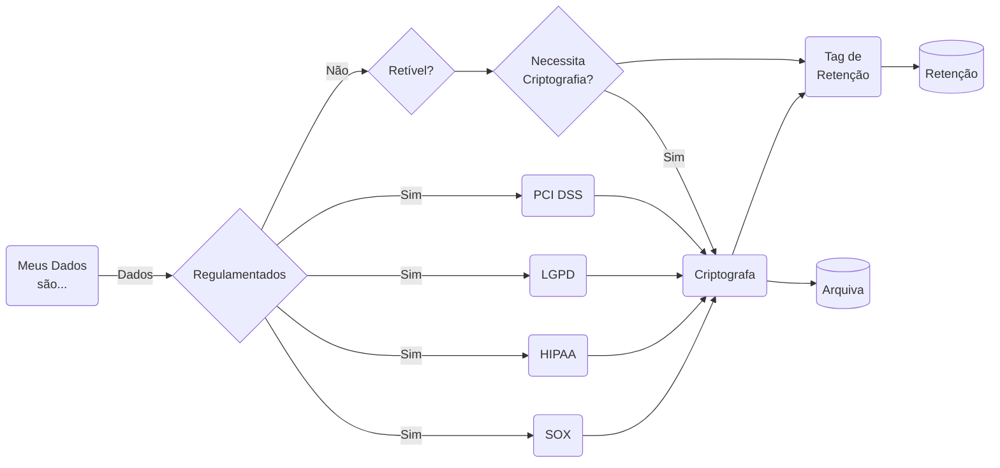

"Quem nunca ouviu uma área de negócio reclamar que precisa analisar alguma informação importante, mas que a devs/areas de desenvolvimento estão demorando muito pra entregar. Hoje, em uma conversa, disseram TCU."

- [x] **Falta dos responsáveis pelos dados**: Quem são os responsáveis pelos dados?
- [x] **Problemas de Qualidade dos dados**: O time de infraestrutura é responsável pela qualidade, mas não conhece os dados tão bem, pois não estão intimamente ligados com o time de negócio.
- [x] **Escalabilidade Organizacional**: O time centralizado de ETL se torna o gargalo na democratização dos dados na empresa.

| **Característica**      | **Data Warehouse**                                          | **Data Lake**                                                  | **Data Mesh**                                               |
| :------ | :--------- | :-------- | :----|
| **Tipo de Dados**        | Dados estruturados                                          | Dados estruturados e não estruturados                          | Dados distribuídos, por domínio                              |
| **Processamento**        | ETL (Extração, Transformação e Carga antes do armazenamento)| ELT (Extração, Carga e Transformação após o armazenamento)     | Processamento descentralizado por cada domínio               |
| **Objetivo Principal**   | Análises de Business Intelligence (BI) e relatórios         | Armazenamento de grandes volumes de dados brutos para análise posterior | Escalabilidade e autonomia na gestão de dados por domínio  |
| **Exemplo de Uso**       | Relatórios financeiros, dashboards e KPIs                  | Análises de dados não estruturados, machine learning, logs    | Grandes organizações com múltiplos departamentos e sistemas distribuídos |
| **Escalabilidade**       | Limitada, pois depende de uma estrutura centralizada        | Alta, permite armazenamento de dados em grande escala         | Muito alta, cada domínio pode escalar independentemente      |
| **Governança**           | Centralizada, controlada por uma equipe de TI               | Menos rigorosa, exige boas práticas de governança              | Descentralizada, cada domínio gerencia seus próprios dados   |
| **Vantagens**            | Consultas rápidas, alta performance para BI                 | Flexibilidade no armazenamento de dados e baixo custo         | Autonomia, escalabilidade e alinhamento com as necessidades de negócios |
| **Desvantagens**         | Rigidez na estrutura de dados, dificuldades com dados não estruturados | Governança e consultas podem ser mais difíceis de gerenciar    | Complexidade de gestão e padronização entre os domínios     |
| **Tecnologias Comuns**   | Google BigQuery, Amazon Redshift, Snowflake, Microsoft SQL Server | Hadoop, Apache Spark, AWS S3, Azure Data Lake, Google Cloud Storage | Arquitetura distribuída, com ferramentas como Kubernetes, Kafka, etc. |

## Data Lake

- [x] **Transient/Staging**: Camada onde os dados são recebidos e armazenados em seu formato original.
- [x] **Bronze/Raw**: Camada onde os dados são transformados para um formato padronizado e carregados no data lake.
- [x] **Silver/Trusted**: Camada onde os dados são limpos, corrigidos e enriquecidos com metadados.
- [x] **Gold/Refined**: Camada onde os dados são preparados para análise e visualização.
- [x] **Sandbox**: Camada onde os dados são usados para desenvolvimento, testes e experimentação.

### Existem três grupos principais em um ecossistema de dados moderno:

- [x] **Produtores de dados**: Os especialistas de domínio que possuem os sistemas ou fontes de dados recebidos (pedidos, faturas, inventário e assim por diante).
- [x] **Construtores de Plataforma de Dados**: Um segmento da equipe de TI com diversas habilidades de dados, dependendo da maturidade da empresa.
- [x] **Consumidores de Dados**: Analistas e operadores que usam dados para otimizar os negócios, tomar decisões e definir estratégias.

## Data Mesh (Zhamak Dehghani)

O gerenciamento é conduzido no nível da unidade, onde os indivíduos mais familiarizados com os dados em suas respectivas áreas determinam os métodos de processamento ideais. Sua proximidade com os dados e familiaridade com os requisitos permitem que eles garantam sua qualidade.

Responsabilidade das unidades individuais que produzem os dados.

Capacitar equipes de domínio para assumir a responsabilidade por seus próprios produtos de dados e garantir que os princípios de governança, como qualidade e segurança de dados, sejam respeitados.

A organização precisa dar suporte a uma mudança cultural em que as equipes de domínio sejam capacitadas para assumir a propriedade de seus pipelines de dados e entregar dados como um produto.

Uma infraestrutura robusta de ferramentas de dados de autoatendimento é essencial, permitindo que as unidades de negócios consumam, analisem e obtenham insights de dados de forma independente.

O Data Mesh oferece um novo paradigma para cumprir o valor prometido dos dados. Ela rejeita padrões de longa data arquiteturas de dados centralizadas, como o `data lake` e o `data warehouse` e seus associados equipes centralizadas. Em vez disso, ele descentraliza tanto a propriedade dos dados quanto os dados em si, transferindo-os para os domínios funcionais que criam e usam dados para administrar seus negócios.

Seus quatro pilares:

- [x] **Propriedade de domínio**: Uma equipe de domínio está próxima dos principais processos de negócios, conhece os dados que o domínio produz e as análises que seus stakeholders precisam para resolver problemas e capitalizar oportunidades.
- [x] **Dados como um produto**: Os produtos de dados consistem em mais do que apenas dados. Eles incluem código para coletar e transformar dados e habilitar acesso gerenciado por meio de APIs. Eles incluem metadados que descrevem o produto, como esquema, semântica e métricas de qualidade.
- [x] **Plataforma de dados self-service**: As equipes de domínio precisam de uma plataforma de autoatendimento para entregar e gerenciar dados produtos. Eles precisam provisionar infraestrutura de armazenamento e computação, construir, implantar e gerenciar versões de produtos de dados, limpar e transformar dados, fornecer acesso seguro a dados e cumprir políticas e regulamentações.
- [x] **Governança computacional Federada**: Órgão federado composto por representantes de equipes de domínio e aqueles com responsabilidades globais de dados, como conformidade regulatória e gerenciamento de qualidade. Preocupações comuns, como o que constitui qualidade,classificações de dados e como lidar com diferentes níveis de sensibilidade, modelagem de dados que abrangem domínios e padrões para metadados de produtos de dados.

A malha de dados (Data Mesh) aborda essas dimensões, fundadas em quatro princípios:

- [x] **Arquitetura de dados descentralizada orientada ao domínio**:
      - [x] Os diferentes domínios de negócios (produtores de dados) são responsáveis ​​por curar, validar, publicar, manter e gerenciar o ciclo de vida dos dados que possuem.
      - [x] Data lakes que são gerenciados centralmente pela TI;
- [x] **Dados disponibilizados como produto**:
      - [x] Em um data lake típico, o data lake e os pipelines de dados são o produto. Em uma malha de dados, os dados e o domínio e a expertise do produtor que reúne e publica os dados são o produto.
      - [x] Cada domínio deve ter um proprietário do produto de dados, responsável por garantir que os dados sejam entregues como um produto.
      - [x] Qualidade de dados, menor tempo de espera de consumo de dados e, em geral, satisfação do usuário de dados.
      - [x] Quem são os usuários dos dados;
- [x] **Infraestrutura para disponibilizar os dados como self-service**: (Plataforma de dados self-service)

- [x] armazenamento de dados escalável;
- [x] esquema de produtos de dados;
- [x] construção e orquestração de pipeline de dados;
- [x] linhagem de dados;

- [x] **Controle de acesso granular e escalável**
      - [x] Os produtores especificam políticas de acesso, governança e retenção e quaisquer políticas de acesso personalizadas com base na granularidade dos dados.
      - [x] Interoperabilidade por meio de padronização global,
      - [x] Topologia dinâmica;

## Quais ferramentas:
- [x] Dataflow:
      - [x] Google Cloud Dataflow
      - [x] AWS Data Pipeline/AWS Glue/Amazon Kinesis Data Streams
      - [x] Azure Data Factory/Azure Stream Analytics
      - [x] Oracle Cloud Data Flow
      - [x] Snowflake Data Cloud
      - [x] Apache Kafka
      - [x] Apache Nifi
      - [x] Apache Airflow e porque não Rundeck.
- [x] Data Catalog:
      - [x] [Google Cloud Data Catalog](https://cloud.google.com/data-catalog/docs/concepts/overview?hl=pt-br)
      - [x] [Microsoft Azure Purview](https://learn.microsoft.com/pt-br/purview/purview)
      - [x] [DataHub](https://datahubproject.io/)
      - [x] [Metacat](https://github.com/Netflix/metacat)
      - [x] [Egeria](https://egeria-project.org/)
## Por onde começar?
- [x] Mapeie os domínios da sua organização;
- [x] Avalie os impulsionadores do negócio e comece pequeno (Agencias do Banco do Brasil e Terceiros);
- [x] Defina padrões de produtos de dados;
- [x] Atribuir proprietários de produtos de dados;
- [x] Crie a plataforma de dados de autoatendimento;

## Definida onde queremos
- [x] Defina uma estratégia de dados;
      - [x] Qual é a natureza dos dados?
             - [x] Diferenciar informações sensíveis (como dados de clientes ou funcionários) de informações não sensíveis (como informações de produtos).
      - [x] Quando os dados foram criados ou alterados?
      - [x] Quem realizou operações nos dados?
      - [x] Por que esses dados estão sendo armazenados? (Dados pessoais devem ser armazenados apenas para um propósito comercial legítimo.)
      - [x] Quanto tempo esses dados estão sendo armazenados?
      - [x] Como esses dados estão sendo usados?
             - [x] Descrever todos os aplicativos que têm dependência desses dados.
- [x] Desenvolver um modelo de governança;
- [x] Avalie a maturidade do Agile e do DevOps;
- [x] Plataformas de design e padrões técnicos.

# Gerenciamento de Dados

É uma estratégia usada por organizações para tornar os dados seguros, eficientes e disponíveis para quaisquer propósitos comerciais relevantes.

Gerenciamento de dados se refere tanto a processos quanto a tecnologia. Processos são geralmente definidos pela estrutura de governança de dados da organização, e cada um desses processos é implementado com as ferramentas de software relevantes.

## Estratégia de Gerenciamento de Dados
### Definição

 - [x] Resumo da estratégia corporativa e de negócios;
 - [x] Níveis de maturidade atuais e desejados da análise de dados;
 - [x] Visão, missão e valores da análise de dados;
 - [x] Objetivos estratégicos e KPIs para atingir nossa visão;
 - [x] Equipe e orçamento;
 - [x] Princípios orientadores.

### Maturidade

- [x] Gerenciamento e infraestrutura de dados;
      - [x] Qual/is as fontes e aquisição de dados?
      - [x] Como avalio a qualidade e limpeza de dados?
      - [x] Como são as soluções de armazenamento e processamento de dados?
      - [x] Como faço a Integração, Transformação e Disponibilização?
      - [x] Como faço a escalabilidade e desempenho da infraestrutura de dados?
      - [x] Quais são as Tecnologias em gestão e infraestrutura de dados?
      - [x] Como posso avaliar se a implementações foi/esta bem-sucedida?
- [x] Governança e conformidade de dados
      - [x] Como a governança de dados permite que uma organização se torne orientada por dados?
      - [x] Como DIVIDIR, os dados e dividir a responsabilidade da governação de dados?
      - [x] Como tratar a questão da privacidade e segurança de dados?
      - [x] Como gerir a conformidade de dados?
      - [x] Como estabelecer a definição de ética de dados e seu uso responsável?
      - [x] Como implementar a governança e conformidade de dados?
- [x] Ferramentas e técnicas de análise;
      - [x] Como padronizar e estabelecer o uso de ferramentas e técnicas de visualização de dados?
      - [x] Como padronizar e estabelecer o uso de modelos e técnicas de análise estatística?
      - [x] Como padronizar e estabelecer o uso de Ferramentas e técnicas de Machine learning?
      - [x] Como padronizar e estabelecer o uso de Ferramentas e técnicas de big data?
      - [x] Como padronizar e estabelecer o uso de Ferramentas e técnicas de preparação de dados?
      - [x] Como padronizar e estabelecer o uso de Matriz de seleção de ferramentas analíticas?
- [x] Organização orientada a dados
      - [x] Como posso afirmar, que a organização ESTÁ orientada À dados?
      - [x] Como posso construindo uma cultura baseada em dados na organização?
      - [x] Como podemos criar uma infraestrutura de dados fácil de usar, consumir e distribuir?
      - [x] Como podemos fomentar a experimentação e a inovação, com os Dados?

|  Dimensão                               | Emergente - Nível 1  | Pré-Adoção Nível 2    | Areas - Nível 3    | Corporativa- (Nível 4)  | Maduro - (Nível 5)  |
|  -------                                | -------  |   -------  |   -------  |   -------   |   -------  |
| Governança e conformidade de dados      |          |            |            |             |            |
| Gerenciamento e infraestrutura de dados |          |            |            |             |            |
| Ferramentas e técnicas de análise       |          |            |            |             |            |
| Organização orientada a dados           |          |            |            |             |            |

#### Estratégia de Dados

| Estratégia   | Entenda |
| -----        | -----   |
| Ingestão | Os dados devem ser adquiridos de fontes confiáveis, como bancos de dados de produção ou terceiros confiáveis. |
| Data Lineage | Linhagem de dados é o nome de um tipo específico de metadados que contém o histórico completo de seu assunto. Metadados de linhagem descrevem a origem dos dados aos quais se referem e fornecem detalhes de quaisquer operações desde o início. A linhagem de dados funciona como um tipo de changelog para esses dados, registrando cada operação que ocorreu. |
| Acesso  | Supervisionar a criação de funções de usuário e garantir que cada usuário receba acesso de leitura e gravação apropriados. |
| Integração | Processo de pegar dados de várias fontes diferentes e agrupá-los em um único local. Processos: ETL, ELT, ETLT. |
|            | Validação : verificar a precisão dos dados comparando-os a um esquema. |
|            | Consolidação : centralizar o armazenamento de dados para melhorar a eficiência ou armazenar big data de forma mais econômica. |
|            | Habilitação de processo: novo processo que só é possível com uma fonte de dados integrada. |
|            | Gerenciamento de dados mestres (MDM) : técnicas de integração para produzir dados mestres. |
|            | Análise e inteligência empresarial (BI) : fonte de dados unificada para fins de análise, bem como outras aplicações de BI. |
| Metadados  | Reunir e indexar metadados relevantes, e que esses metadados estejam disponíveis quando necessário.
| Conformidade | Gerenciamento de dados deve refletir todos os requisitos regulatórios e garantir que a organização permaneça no lado certo da lei. (LGPD (Regulamento Geral de Proteção de Dados), PCI DSS (Padrão de Segurança de Dados do Setor de Cartões de Pagamento), HIPAA (Portabilidade e Responsabilidade de Seguro Saúde)) e SOX (Sarbanes-Oxley) |
| Análise  | análises para impulsionar suas tomadas de decisão. uporte aos esforços do tempo de análise e garantir que os dados disponíveis sejam oportunos, relevantes e completos. |
| Segurança | Gerente de dados é responsável por trazer problemas de segurança à tona e também por organizar auditorias e testes regulares.  |
| Arquivamento | Recomendará soluções preferenciais para que a organização tenha uma abordagem unificada para armazenamento de dados de longo prazo. |
| Eficiência | Revisar regularmente sua estratégia de gerenciamento de dados para perguntar se a abordagem atual é econômica e sustentável. |
| Escala     | gerenciamento de dados deve planejar escalar facilmente quando necessário.(ex."IoT,Logs) |

### BuzzWord - Organizacional e Estratégia de IA

- [x] Resumo da estratégia corporativa e de negócios
- [x] Fundamentos da IA
- [x] Níveis de maturidade atuais e DESEJADOS da IA
- [x] Visão, missão e valores da IA
- [x] Objetivos estratégicos e KPIs para atingir nossa visão
- [x] Princípios orientadores
- [x] Centro de dados de IA
- [x] Machine Learning/Deep Learning
- [x] NLP(Natural Language Processing) & Prompt Engineering
- [x] Equipe e Orçamento

#### Delivery e Responsibility

- [x] Estratégia de gerenciamento de mudanças
- [x] Planos de gerenciamento de mudanças
- [x] Avaliação pós-programa/projetos mudanças e como reuno(PDCA) lições aprendidas
- [x] Análise dos stakeholders
- [x] Estratégia de engajamento dos stakeholders
- [x] Plano detalhado de engajamento dos stakeholders

## Data Mesh vs. Data Fabric
- [x] Data Fabric é uma solução centralizada e orientada por tecnologia, que visa criar uma plataforma unificada para gerenciar e acessar dados onde quer que eles residam.
- [x] Data Mesh, por outro lado, descentraliza os dados e sua propriedade. Em um data mesh, equipes individuais ou unidades de negócios são responsáveis ​​por seus próprios dados e são encarregadas de criar "produtos de dados", para seu próprio consumo e presumivelmente o consumo de outros na organização.

## Dados Links
### Linhagem de Dados

- [x] [SAS](https://www.sas.com/)
- [x] [Informática](https://www.informatica.com/)
- [x] [Octopai](https://www.octopai.com/) Adquirida recentemente pela [Cloudera](https://www.cloudera.com/about/news-and-blogs/press-releases/2024-11-14-cloudera-to-acquire-octopais-platform.html)
- [x] [Datahub](http://datahub.io/)

### Dados Abertos

- [x] [Microdados ENEM](http://portal.inep.gov.br/microdados)
- [x] [Portal Brasileiro de Dados Abertos](http://dados.gov.br/)
- [x] [NASA](http://data.nasa.gov/)
- [x] [The World Bank](http://data.worldbank.org/)
- [x] [United States Government](http://www.data.gov/)

# Conceitos
## Fundamentais

- [x] Modularidade: Deve ser construída com componentes independentes que se integram facilmente, promovendo flexibilidade e escalabilidade.
- [x] Data as a Product: Cada conjunto de dados é tratado como um produto, com “donos” responsáveis, SLAs definidos e interfaces claras para consumo.
- [x] Interoperabilidade: Capaz de suportar diferentes tecnologias e padrão para facilitar integração.
- [x] Replicabilidade: Processos como ingestão de dados, transformação e monitoramento devem ser automatizados para reduzir erros e aumentar a eficiência.
- [x] Segurança e Governança: Proteção de dados, rastreabilidade e conformidade regulatória são fundamentais e não podem ficar de fora.

## Componentes Importantes

- [x] Sources: Pontos de origem dos dados, como bancos de dados transacionais, APIs, logs.
- [x] Ingestion: Ferramentas para capturar e transferir dados de fontes para ambiente de armazenamento.
- [x] Storage: Foco em armazenamento de dados em formatos brutos e também estruturado e otimizado para análises.
- [x] Processing: Processamento em lote (batch) e em tempo real (streaming).
- [x] Transformation (ETL/ELT): Preparação e transformação e limpeza dos dados usando pipelines.
- [x] Governance & Metadata Management: Controle de qualidade, catálogo de dados e gerenciamento de metadados.
- [x] Orchestration: Coordenação de workflows de dados.
- [x] Consumption: Interfaces e ferramentas para acessar dados em dashboards.
- [x] Monitoring & Observability: Rastreamento de desempenho, latência e falhas.
- [x] Security & Compliance: Criptografia, autenticação (IAM) e controle de acessos.
