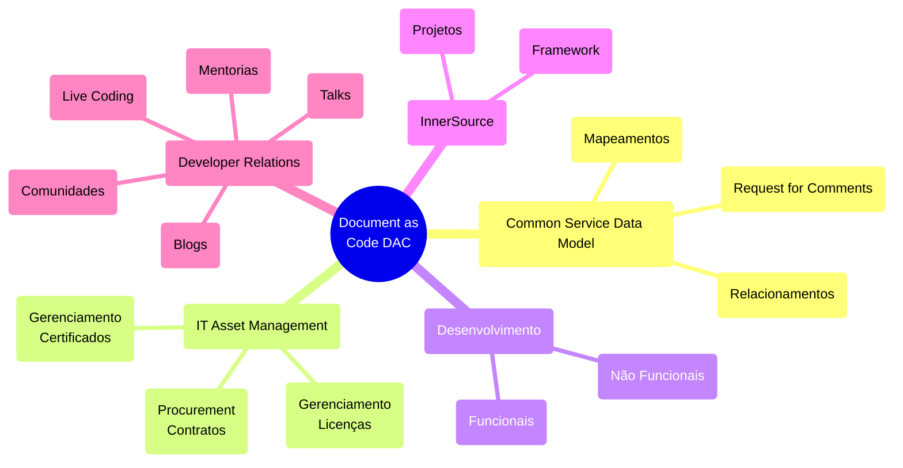

“Um jogador que faz um time grande é mais valioso do que um grande jogador. Perder-se no grupo para o bem do grupo, isso é trabalho em equipe.” John Wooden (ex-técnico de basquete do UCLA Bruins) 

Princípios da InnerSource

Plataformas de gerenciamento de código-fonte desempenham um papel crítico no desenvolvimento de software moderno, fornecendo um repositório central para armazenar, gerenciar e versionar código-fonte e documentação, bem como colaborar com o desenvolvimento de aplicações.
Neste guia, exploraremos as melhores práticas para proteger essas plataformas, abrangendo tópicos que incluem autenticação de usuário, controle de acesso, permissões, monitoramento e registro. 

## Quem pode ver o quê?
A transparência desempenha um papel vital em promover a colaboração e encorajar a participação. O projeto deve ser estruturado para permitir que o maior número possível de indivíduos contribua, sendo assim, é importante reconhecer que certas restrições e considerações podem impedir que tudo seja abertamente acessível dentro da empresa.
Isso pode envolver a configuração de diferentes repositórios ou controles de acesso com base na sensibilidade do código, tipo de projeto ou funções individuais dentro da organização.

## Security-First
- [x] Código sensível é transmitido para fora da empresa.
- [x] Todos os repositórios devem ser seu próprio silo. 
- [x] O acesso para saber que cada repositório existe é concedido apenas individualmente pela alta gerência.
- [x] Repositórios sensíveis: aqueles cujo lançamento tem impacto no mercado ou é uma infraestrutura central com implicações de segurança.

## Com ​​quais áreas em sua organização você gostaria de começar ao adotar estrategicamente o InnerSource?

!  Tipo                                                                            | Área |
| ----                                                                             | ---- |
| Aprendizagem, copiar e colar (exemplos, modelos)                                 |   x  |
| Use ferramentas reutilizáveis ​​criadas para as circunstâncias da empresa.         |   x  |
| Alteração, correção, adição ou atualização de conteúdo (sites, documentação)     |   x  |
| Construir dentro do serviço interno de outra pessoa                              |   x  |
| Deduplicação. Não construa a mesma coisa duas vezes, construa uma solução geral. | x    |
| Garantir o alinhamento entre projetos relacionados                               | x    |
| Não se deixe atrasar por quem é o dono                                           | x    |

## Nível de dificuldade
qui estão os grupos que podem ser usados ​​para definir permissões de repositório ordenadas pelo processo de trabalho a ser ingressado:

- [x] Todos atrás do firewall da empresa
- [x] Visibilidade interna (todos na plataforma estão neste grupo)
- [x] Grupo de segurança criado automaticamente
- [x] Grupo de segurança com autoadesão e SEM renovação forçada após X período de tempo
- [x] Grupo de segurança com autoadesão e renovação forçada após X período de tempo
- [x] Grupo de segurança autoiniciado, mas requer espera pela permissão do gerente.
- [x] Grupo de segurança que requer o envio de um e-mail para alguém para adicioná-lo manualmente

## Diretriz de Alto Nível
É aconselhável prever a necessidade de vários níveis de compartilhamento, desde toda a empresa até pequenos grupos, para repositórios dentro de grandes organizações de plataforma.

Conceder aos proprietários do repositório a autoridade para gerenciar a visibilidade e as permissões é mais eficaz do que ter proprietários de organizações ou empresas definindo-as. Essa abordagem evita que políticas estreitas definidas em níveis mais altos se tornem onerosas ao longo do tempo, conforme as necessidades evoluem.

Os esforços colaborativos geralmente começam com propostas de valor incertas. Consequentemente, até mesmo pequenos obstáculos processuais podem encerrar prematuramente essas iniciativas. Para mitigar isso, estabeleça processos que permitam a descoberta e avaliação do repositório sem exigir solicitações de permissão sempre que possível.

## Políticas de repositório definidas no nível empresarial
### Permissões básicas
Permissões básicas definidas no nível empresarial são aplicadas a todos os repositórios de uma empresa.

Ferramentas
Abaixo está uma lista não exaustiva de possíveis ferramentas que podem ser usadas para auxiliar na revisão de repositórios de código-fonte.

Allstar - https://github.com/ossf/allstar
Um projeto de código aberto do OpenSSF que escaneia organizações do GitHub em busca de configurações incorretas de “nível de repositório”. O Allstar detecta um subconjunto das políticas de “nível de repositório” sugeridas por este documento. Ele pode ser configurado para escanear todos os repositórios em uma organização ou um subconjunto deles e é suportado pelos seguintes SCMs:

Nuvem GitHub
Legitify - https://github.com/Legit-Labs/legitify
Um projeto de código aberto da Legit Security que escaneia ativos de SCM para encontrar configurações incorretas, problemas de segurança e melhores práticas não seguidas. O Legitify detecta todas as políticas sugeridas por este documento e oferece suporte aos seguintes SCMs:

Nuvem GitHub
Servidor empresarial GitHub
Nuvem GitLab
Servidor GitLab
Scorecard - https://github.com/ossf/scorecard
Um projeto de código aberto do OpenSSF que escaneia repositórios em busca de problemas de segurança e fornece métricas de saúde de segurança. O Scorecard detecta muitas das políticas de “nível de repositório” sugeridas por este documento e suporta os seguintes SCMs:

Integração Contínua / Implantação Contínua
A configuração padrão do GitHub Actions permite que os fluxos de trabalho aprovem solicitações de pull. Isso pode permitir que os usuários ignorem as restrições de revisão de código.

As ações do GitHub devem ser restritas a repositórios selecionados
Ao não limitar o GitHub Actions a repositórios específicos, cada usuário na organização pode executar fluxos de trabalho arbitrários. Isso pode permitir atividades maliciosas, como acessar segredos da organização, criptomineração, etc.

A permissão do token de fluxo de trabalho padrão deve ser somente leitura
permissão padrão do token de fluxo de trabalho do GitHub Action é definida como leitura-gravação. Ao criar tokens de fluxo de trabalho, é altamente recomendável seguir o Princípio do Menor Privilégio e forçar os autores do fluxo de trabalho a especificar explicitamente quais permissões eles precisam.

O Runner Group deve ser limitado a repositórios privados
Os fluxos de trabalho de repositórios públicos podem ser executados no GitHub Hosted Runners. Ao usar o GitHub Hosted Runners, é recomendável permitir que apenas fluxos de trabalho de repositórios privados sejam executados nesses executores para evitar ficar vulnerável a agentes mal-intencionados usando fluxos de trabalho de repositórios públicos para invadir sua rede privada. 

O Runner Group deve ser limitado a repositórios selecionados
Não limitar o grupo runner a repositórios selecionados permite que qualquer usuário na organização execute fluxos de trabalho nos runners do grupo.

Enterprise
O requisito de autenticação de dois fatores deve ser imposto no nível empresarial. 

A empresa não deve permitir que os membros alterem a visibilidade do repositório
A política de alteração de visibilidade do Repositório da empresa deve ser definida como DESATIVADA. Isso impedirá que os usuários criem repositórios privados e os alterem para públicos.

A organização deve ter menos de três proprietários
Os proprietários de organizações são altamente privilegiados e podem criar grandes danos se forem comprometidos

Os administradores da organização devem ter atividade nos últimos 6 meses
Um membro com permissões de administrador organizacional não realizou nenhuma ação nos últimos 6 meses. Usuários administradores são extremamente poderosos e padrões comuns de conformidade exigem manter o número de administradores no mínimo. Considere revogar as credenciais de administrador deste membro, rebaixando-o para usuário regular ou removendo o usuário completamente.

O repositório deve ser atualizado pelo menos trimestralmente
Um projeto que não é mantido ativamente pode não ser corrigido contra problemas de segurança em seu código e dependências e, portanto, corre maior risco de incluir vulnerabilidades conhecidas.

Os fluxos de trabalho não devem ter permissão para aprovar solicitações de pull
A configuração padrão do GitHub Actions permite que os fluxos de trabalho aprovem solicitações de pull. Isso pode permitir que os usuários ignorem as restrições de revisão de código.

Branch padrão deve exigir revisão de código
Para cumprir com o princípio de separação de tarefas e impor práticas de código seguras, uma revisão de código deve ser obrigatória usando a aplicação interna do sistema de gerenciamento de código-fonte. Esta opção é encontrada na configuração de proteção de branch do repositório.

Branch padrão deve exigir histórico linear
Impedir que confirmações de mesclagem sejam enviadas para ramificações protegidas.

O branch padrão deve exigir revisão de código por pelo menos dois revisores
Para cumprir com o princípio de separação de tarefas e impor práticas de código seguras, uma revisão de código deve ser obrigatória usando a aplicação interna de gerenciamento de código-fonte. Esta opção é encontrada na configuração de proteção de branch do repositório.

O branch padrão deve exigir que todas as verificações sejam aprovadas antes da mesclagem
A proteção de branch está habilitada. No entanto, as verificações que validam a qualidade e a segurança do código não precisam passar antes de enviar novas alterações. A verificação padrão garante que o código esteja atualizado para evitar mesclagens defeituosas e comportamentos inesperados, bem como outras verificações personalizadas que testam a segurança e a qualidade. É aconselhável ativar esse controle para garantir que qualquer verificação existente ou futura precise passar.

O ramo padrão deve ser protegido
A proteção de branch não está habilitada para o branch padrão deste repositório. Proteger branches garante que novas alterações de código devem passar por um processo de mesclagem controlado e permite a aplicação de revisão de código, bem como outros testes de segurança. Esse problema é levantado se a proteção de branch padrão estiver desativada.

A proteção padrão contra exclusão de ramificação deve ser habilitada
Reescrever o histórico do projeto pode dificultar o rastreamento de quando bugs ou problemas de segurança foram introduzidos, tornando-os mais difíceis de corrigir.

Webhooks devem ser configurados com um segredo
Os webhooks não são configurados com um segredo compartilhado para validar a origem e o conteúdo da solicitação. Isso pode permitir que seu webhook seja acionado por qualquer ator mal-intencionado com a URL.

O branch padrão deve exigir que todos os commits sejam assinados
Exigir que todos os commits sejam assinados e verificados

