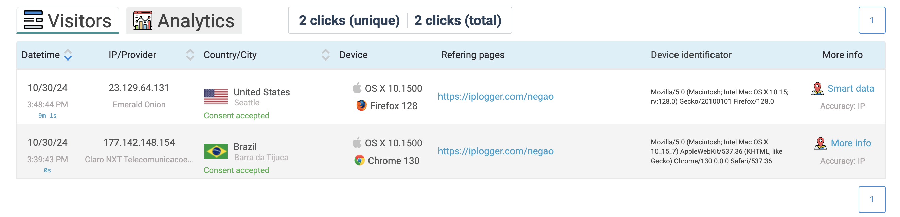

Entenda que hackers, não são so do mau. Existem os hackers éticos, são especialistas em segurança onde realizam análises de vulnerabilidades cibernéticas.

Respeite a sensibilidade dos dados: Dependendo da sensibilidade dos dados, os hackers éticos podem ter que concordar com um acordo de confidencialidade, além de outros termos e condições exigidos pela organização avaliada.
Defina o escopo: Determine o escopo da avaliação para que o trabalho do hacker ético permaneça legal e dentro dos limites aprovados pela organização.
Relatar vulnerabilidades: Notifique a organização sobre todas as vulnerabilidades descobertas durante a avaliação.

## Links Maliciosos

Acesso um site de encurtamento de Link, como por exemolo: [IPLOGGER](https://iplogger.org)
- Possibilita a coleta de informações: Estado, Pais e outras informações.
- Ligue as informações que desejar recolher do usuário:
  - [x] Recolher dados SMART
  - [ ] Recolha de consentimento
  - [x] Recolher dados GPS
  - [ ] Notificações (para E-mail/para Telegrama) (Somente se houver conta)
  - [ ] Parâmetros Forward GET
  - [ ] Destination preview
  - [ ] Coloque aqui as suas notas

## Como se proteger
- Instale o Tor Browser para se proteger. [Tor](https://www.torproject.org/download/). Ele não impedirá que você seja hackeado, mas dará outras informações de IP.

- Verifique o remetente;
- Verifique se o link passado é o mesmo, fazendo o `check short url', como por [exemplo](https://checkshorturl.com).
