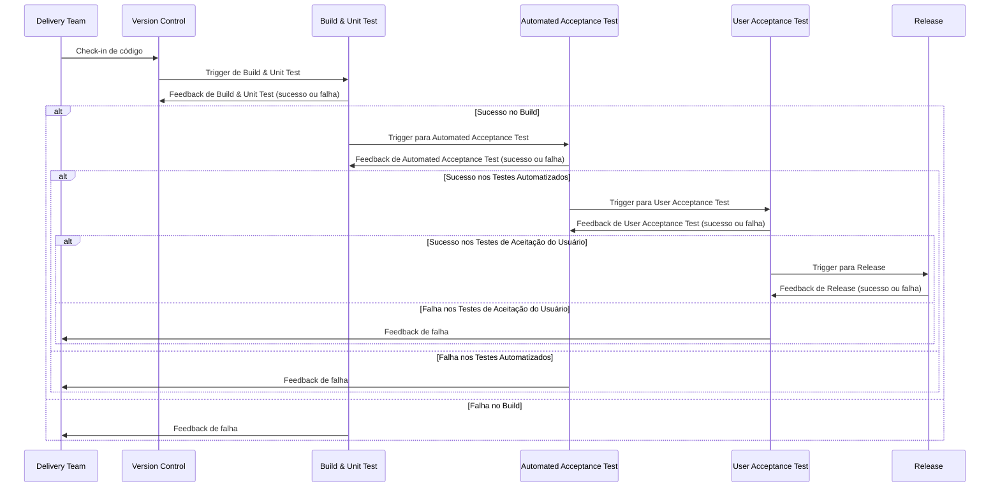

## Conceitos Básicos
### Roadmap de Produtos
Um roadmap de produto é um instrumento estratégico que alinha visão, planejamento e execução, garantindo que todas as partes interessadas (stakeholders) compreendam o direcionamento do produto. Sua elaboração é essencial por vários motivos:

- [x] Alinhamento Estratégico e de Prioridades
- [x] Comunicação Transparente com Stakeholders
- [x] Adaptação a Mudanças e Riscos
- [x] Otimização de Recursos e Tempo
- [x] Mensuração de Resultados

Um roadmap de produto não é apenas um cronograma, mas uma ferramenta dinâmica que:

- [x] Alinha times em torno de objetivos comuns.
- [x] Comunica o plano de forma visual e acessível.
- [x] Adapta-se a mudanças sem perder o foco estratégico.

Sem ele, a gestão do produto fica **reativa, fragmentada e sujeita a falhas** de execução.
Portanto, sua elaboração é não apenas necessária, mas crítica para o sucesso sustentável.

#### Definir Formato (Tático vs. Estratégico)

| Roadmap Estratégico (Longo Prazo) | Roadmap Tático (Curto Prazo) |
| ----                              | ----                         |
| Foco em objetivos macro (ex: expansão para novos mercados).| Foco em entregas imediatas (ex: lançamento de feature X). |
| Escopo flexível, sem prazos rígidos.	    | Cronograma detalhado (sprints, milestones).  |
| Público-alvo: liderança e investidores.	| Público-alvo: equipes de desenvolvimento e operação. |

#### Matriz de Priorização

| Iniciativa    | Impacto (1-5) | Esforço (1-5) | Alinhamento Estratégico | Pontuação  |
| ----          | ----:         | ----:         | ----:                   | :----:     |
| Integrar API  | 	5	        | 3	            | 4	                      | 12 (5+3+4) |
| Redesign da UI|	4	        | 5	            | 3	                      | 12 (4+5+3) |

#### **Exemplo Estratégico 202X**
##### Objetivo Principal: [Ex: Liderança de mercado em X]

| Trimestre | Iniciativa              | Métrica de Sucesso       | Dados de Apoio          |
|-----------|-------------------------|--------------------------|-------------------------|
| Q1        | Lançamento do Módulo A  | +15% de retenção         | Pesquisa com 200 clientes|
| Q2        | Integração com Plataforma B | 20 parceiros onboardados | Benchmarking competitivo|

##### **Roadmap Tático - Q1 202X**

| Sprint | Tarefa                   | Responsável | Status       |
|--------|--------------------------|-------------|--------------|
| 1      | Protótipo da Feature X   | Time Dev    | Em andamento |
| 2      | Testes de Usabilidade    | UX          | Planejado    |

**Observação**: Este modelo garante clareza, adaptabilidade e decisões baseadas em dados, essenciais para um produto competitivo.

### [Yaml](https://github.com/yaml/yaml-grammar)
O Githun utiliza a especificação YAML 1.2 contém a gramática formal para YAML 1.2. As 211 regras gramaticais são formatadas no HTML da página da web, juntamente com muitas descrições textuais da linguagem e gramática.

A gramática usa um formato raro "Parameterized Backus-Naur form (BNF)", e alguns dos componentes da regra são apenas comentários textuais indicando o que deve acontecer.

Compreender completamente a gramática YAML é uma tarefa e tanto para a maioria dos mortais.

- [x] [Interative Parse](http://ben-kiki.org/ypaste/)

### Autenticação e Autorização
### Versionamento Semantico
### Estratégias de Branches
### Estratégias de implantação
### Documet as Code
### Infrastructure as a Code
### Qualidade do Código
Manter um alto nível de qualidade de código é crucial para qualquer projeto de software, pois garante que o código seja legível, sustentável e menos propenso a erros.

Linting é uma prática comum empregada por desenvolvedores para verificar automaticamente padrões de codificação, melhores práticas e problemas potenciais em seu código.

A qualidade do código e o linting são aspectos essenciais e destacamos alguns motivos:

- [x] **Legibilidade e Manutenibilidade**: Garantir que o código siga um estilo consistente e cumpra as melhores práticas estabelecidas torna mais fácil para os membros da equipe ler, entender e manter o código.
- [x] **Erros reduzidos**: Ferramentas de linting podem detectar problemas potenciais, como erros de sintaxe, variáveis não utilizadas ou chamadas de função incorretas antes que causem problemas no aplicativo.
- [x] **Revisões de código mais rápidas**: Ao impor padrões de codificação e melhores práticas por meio do linting, os desenvolvedores podem se concentrar em aspectos mais críticos das revisões de código, como lógica e funcionalidade, em vez de gastar tempo em questões estilísticas ou de formatação.
- [x] **Colaboração simplificada**: O linting como parte do CI ajuda a garantir que todo o código contribuído para o projeto cumpra os mesmos padrões, levando a uma base de código mais coesa e consistente.

Em resumo, a qualidade do código e o linting são aspectos vitais da implementação da Integração Contínua. Eles fornecem vários benefícios, como melhor legibilidade e manutenibilidade, redução de erros, revisões de código mais rápidas, colaboração e on-boarding.

Ao selecionar cuidadosamente um linter que atenda aos requisitos do seu projeto e configurar para executá-lo automaticamente, você pode criar um pipeline de CI robusto que aplica padrões de codificação e práticas recomendadas, ao mesmo tempo em que detecta possíveis problemas no início do processo de desenvolvimento.

### Segurança de Código

### Testes
O teste automatizado é um componente central da Integração Contínua, pois permite que os desenvolvedores validem novas alterações de código em relação à base de código existente de forma rápida e eficiente.
#### Por que o teste automatizado é crucial para CI
Os testes automatizados desempenham um papel crítico no processo de CI por vários motivos:

- [x] **Feedback mais rápido**: executar testes automaticamente como parte do seu pipeline de CI fornece feedback imediato sobre o impacto de novas alterações de código, permitindo que os desenvolvedores resolvam problemas antes que se tornem problemas mais significativos.
- [x] **Esforço manual reduzido**: automatizar testes elimina a necessidade de testes manuais, liberando tempo dos desenvolvedores para se concentrarem na implementação de novos recursos e na correção de bugs.
- [x] **Ambiente de teste consistente**: testes automatizados são executados em um ambiente consistente, reduzindo a probabilidade de discrepâncias entre execuções de teste e garantindo um processo de validação confiável.
- [x] **Colaboração aprimorada**: com testes automatizados em vigor, os membros da equipe podem ter mais confiança na estabilidade da base de código, facilitando a colaboração em novos recursos e correções de bugs.

Existem vários tipos de testes que você pode incorporar em seus fluxos de trabalho de CI, dependendo dos requisitos do seu projeto e do nível de validação necessário:

- [x] **Testes de unidade**: Os testes de unidade focam em pequenos pedaços isolados de código, como funções ou classes individuais. Esses testes garantem que cada componente funcione conforme o esperado isoladamente.
- [x] **Testes de integração**: Os testes de integração examinam as interações entre diferentes componentes do seu aplicativo para garantir que eles funcionem juntos corretamente.
- [x] **Testes Funcionais**: Os testes funcionais validam a funcionalidade geral do seu aplicativo da perspectiva do usuário, geralmente por meio de interações de IU automatizadas ou chamadas de API.
- [x] **Testes de Desempenho**: Os testes de desempenho avaliam a capacidade de resposta, a escalabilidade e a estabilidade do seu aplicativo sob várias condições de carga.

### Cobertura e Relatórios de código
A cobertura de código é uma métrica importante que mede a porcentagem do seu código que é executada durante o teste.

Ela ajuda os desenvolvedores a identificar áreas do código que podem não ser testadas adequadamente e exigem testes adicionais para garantir a correção e a confiabilidade.

### Introdução à Cobertura de Código
A cobertura de código é uma métrica que quantifica o grau em que o código-fonte de um programa é testado por um conjunto de testes específico.

Geralmente é expressa como uma porcentagem e representa a proporção de linhas de código, ramificações, funções ou outras unidades lógicas que foram executadas durante o processo de teste.

A cobertura de código fornece insights valiosos sobre a eficácia do seu conjunto de testes, destacando áreas do código que podem não ser testadas adequadamente e potencialmente abrigando bugs ou problemas não descobertos.

Ao medir a cobertura de código, os desenvolvedores podem identificar lacunas em sua cobertura de teste e priorizar a criação de novos testes para garantir que a funcionalidade crítica seja completamente testada.

É importante observar, no entanto, **que uma alta porcentagem de cobertura de código não garante a ausência de bugs ou a qualidade geral do software**. É apenas um indicador da extensão em que o código foi exercido pelo conjunto de testes.

Outros fatores, como a minúcia dos próprios testes, também desempenham um papel crucial na confiabilidade e na manutenibilidade da base de código.

No contexto da Integração Contínua, a cobertura de código serve como uma métrica útil para monitorar a eficácia contínua do seu conjunto de testes e orientar melhorias na sua estratégia de testes.

#### Importância da cobertura de código em CI
A cobertura de código desempenha um papel crucial na Integração Contínua (CI) por vários motivos:

- [x] **Detecção precoce de código não Testado**: Ao medir regularmente a cobertura de código como parte do seu pipeline de CI, você pode identificar rapidamente áreas do código que não foram suficientemente testadas. Isso permite que os desenvolvedores abordem problemas potenciais antes que se tornem problemas mais significativos e ajuda a manter uma base de código robusta e confiável.
- [x] **Monitoramento da eficácia do conjunto de Testes**: As métricas de cobertura de código fornecem insights sobre a eficácia geral do seu conjunto de testes, garantindo que ele continue a fornecer cobertura adequada conforme a base de código evolui. Isso permite que os desenvolvedores tomem decisões informadas sobre onde concentrar seus esforços de teste, garantindo que as partes mais críticas do código sejam completamente testadas.
- [x] **Qualidade de código Aprimorada**: Um conjunto de testes abrangente, combinado com análise regular de cobertura de código, incentiva os desenvolvedores a escrever código mais limpo e modular, mais fácil de testar e manter. Isso resulta em uma base de código de maior qualidade com menos bugs e problemas.
- [x] **Maior confiança nas alterações de Código**: Ao manter um alto nível de cobertura de código, os desenvolvedores podem ter maior confiança de que suas alterações não introduzirão novos bugs ou regressões. Isso pode levar a ciclos de desenvolvimento mais rápidos e melhor colaboração entre os membros da equipe, pois há menos risco associado a fazer alterações no código.
- [x] **Responsabilidade e Visibilidade**: Integrar métricas de cobertura de código em seu pipeline de CI fornece uma medida transparente e objetiva da eficácia do conjunto de testes. Isso pode ajudar a estabelecer expectativas claras e responsabilidade para a equipe, garantindo que os testes permaneçam uma prioridade durante todo o processo de desenvolvimento.

Em resumo, a cobertura de código é um aspecto essencial da implementação da Integração Contínua, pois ajuda a garantir uma base de código confiável e de alta qualidade.

Ao medir e monitorar regularmente a cobertura de código como parte de seu pipeline de CI, você pode identificar lacunas em sua cobertura de teste, priorizar os esforços de teste e manter um conjunto de testes abrangente que minimiza o risco de bugs e regressões.

### Container
##### Escanear Dockerfile
##### Assinar contêiner
### Monitoramento
### Segurança
#### Tratamento de Segredos
#### Dados Confidenciais
### Implantação em várias plataformas
#### Implantando em servidores locais
A implantação local se refere à hospedagem de seu aplicativo em seus próprios servidores físicos ou virtuais, em vez de utilizar plataformas de nuvem.

Embora a implantação em servidores locais possa exigir mais gerenciamento de infraestrutura em comparação às plataformas de nuvem, ela pode oferecer maior controle sobre sua infraestrutura, segurança aprimorada e possíveis economias de custos.

Certifique-se de criar um ambiente dedicado para cada estágio do seu pipeline de implantação (desenvolvimento, preparação e produção).

## Introdução
O GitHub Actions é um serviço CI/CD (Integração Contínua/Implantação Contínua) versátil, poderoso e totalmente integrado que permite automatizar várias tarefas e processos dentro do seu ciclo de vida de desenvolvimento de software.

Também abordaremos alguns casos de uso e cenários comuns em que o GitHub Actions pode agilizar seu processo de desenvolvimento de software, melhorando a eficiência e reduzindo o erro humano.

Ao final, você terá uma sólida compreensão dos conceitos fundamentais por trás do GitHub Actions e uma perspectiva clara sobre como ele pode beneficiar seus projetos de desenvolvimento.

Esta base preparará o cenário para a exploração aprofundada do GitHub Actions nos capítulos subsequentes, onde nos aprofundaremos em tópicos mais avançados e implementações práticas.

| **Aspecto**                | **Continuous Integration (CI)**                                  | **Continuous Delivery (CD)**                                       | **Continuous Deployment (CD)**                                        |
|----------------------------|------------------------------------------------------------------|--------------------------------------------------------------------|-----------------------------------------------------------------------|
| **Objetivo**                | Integrar e testar código frequentemente para detectar erros cedo | Garantir que o código esteja sempre pronto para ser liberado       | Automatizar a liberação do código diretamente para produção          |
| **Frequência de Deploy**    | Nenhum deploy automático; apenas integração e testes contínuos  | Deploy manual para produção, mas o código está sempre pronto      | Deploy automático em produção após testes e validações automáticas   |
| **Ação Manual**             | Não envolve deploy ou release manual                            | A liberação para produção é manual ou por aprovação                | Nenhuma ação manual; o deploy ocorre automaticamente para produção   |
| **Ponto de Feedback**       | Feedback imediato após integração e testes unitários             | Feedback contínuo com a garantia de que o código está pronto para produção | Feedback rápido com liberação contínua após aprovação de testes      |
| **Exemplo de Ferramentas**  | Jenkins, Travis CI, CircleCI, GitLab CI                          | Jenkins, Spinnaker, GitLab CI, Bamboo                               | Jenkins, CircleCI, GitLab CI, AWS CodePipeline                        |
| **Benefício Principal**     | Identificação precoce de problemas de integração e qualidade do código | Liberação mais rápida e controlada para produção, com menos risco de falhas | Entrega contínua, com mudanças sendo rapidamente disponibilizadas para os usuários |
| **Foco**                    | Automatizar testes e integração de código                       | Garantir que o código esteja pronto para produção a qualquer momento | Automatizar todo o processo, incluindo o deploy em produção          |
| **Exemplo de Workflow**     | Desenvolvedor envia código → Testes e integração contínuos      | Código aprovado → Pré-produção → Aprovação manual → Deploy em produção | Código aprovado → Deploy automático em produção                       |

## GitHub Actions
GitHub Actions é uma plataforma de integração contínua e entrega contínua (CI/CD) que permite automatizar a sua compilação, testar e pipeline de implantação.

Esta plataforma possui recursos oferecendo uma maneira versátil e flexível de definir e executar tarefas, incluindo integração contínua (CI), implantação contínua (CD), teste de código, linting, projetos, gerenciamento de problemas e muito mais.

O GitHub Actions simplifica o processo de automatização de fluxos de trabalho ao fornecer um ambiente onde essas tarefas podem ser configuradas e executadas diretamente em seus repositórios GitHub.

GitHub Actions vai além de apenas DevOps e permite que você execute fluxos de trabalho quando outros eventos ocorrerem no seu repositório.  Em sua essência, o GitHub Actions usa uma série de **fluxos de trabalho orientados a eventos** para executar tarefas em resposta a gatilhos específicos.

Esses fluxos de trabalho são definidos usando **arquivos YAML**, que são armazenados em um diretório especial dentro do seu repositório **(.github/workflows/)**.

Cada arquivo de fluxo de trabalho consiste em um conjunto de instruções que definem as condições sob as quais o fluxo de trabalho deve ser executado (o gatilho), as tarefas ou "ações" a serem executadas e o ambiente de execução para essas ações.

O GitHub Actions pode ser acionado por vários eventos do GitHub, como enviar código para um repositório, abrir uma solicitação de pull, criar um problema ou até mesmo em uma base programada.

Um dos principais pontos fortes do GitHub Actions é seu design modular.

As ACTIONS **podem ser criadas e compartilhadas** como componentes individuais e reutilizáveis que podem ser facilmente integrados aos seus fluxos de trabalho.

Você pode usar ações pré-construídas fornecidas pelo GitHub, criar suas próprias ações personalizadas ou aproveitar as ações contribuídas pela comunidade disponíveis no GitHub Actions Marketplace.

Essa abordagem modular permite que os desenvolvedores criem fluxos de trabalho sofisticados combinando várias ações de maneira lógica e simplificada, resultando em maior produtividade e eficiência.

Como ele é construído diretamente na plataforma, não há necessidade de configurar serviços externos ou lidar com chaves de API e outras credenciais. Essa integração estreita com o GitHub permite que os desenvolvedores criem fluxos de trabalho eficientes que automatizam tarefas, como construir e implantar código, executar testes e gerenciar problemas, diretamente na interface familiar do GitHub.

Além disso, o GitHub Actions Marketplace oferece uma ampla gama de ações contribuídas pela comunidade que podem ser facilmente integradas aos seus fluxos de trabalho, fornecendo acesso a uma biblioteca crescente de componentes reutilizáveis.

O GitHub Actions também fornece amplo suporte para personalizar a execução de fluxos de trabalho. Isso inclui a capacidade de controlar o fluxo de tarefas usando instruções condicionais, criar caminhos de execução paralelos e gerenciar dependências entre trabalhos.

Além disso, você pode usar variáveis de ambiente e segredos para armazenar com segurança dados confidenciais e passá-los entre ações, garantindo que seus fluxos de trabalho permaneçam seguros e suas informações confidenciais permaneçam protegidas.

Em resumo, o GitHub Actions é uma plataforma de automação poderosa e flexível que permite que os desenvolvedores criem, compartilhem e reutilizem fluxos de trabalho personalizados para automatizar uma ampla gama de tarefas dentro do processo de desenvolvimento de software.

Sua natureza orientada a eventos, design modular, integração perfeita com o ecossistema GitHub e opções de personalização extensivas o tornam uma ferramenta essencial para equipes modernas de desenvolvimento de software.

O GitHub Actions oferece uma variedade de "executores" predefinidos que servem como ambientes de execução para seus fluxos de trabalho.Estas máquinas virtuais do Linux, Windows e macOS para executar seus fluxos de trabalho, ou você pode hospedar seus próprios executores auto-hospedados na sua própria infraestrutura de dados ou na nuvem.

O GitHub fornece executores hospedados e gratuitos para repositórios públicos, enquanto repositórios privados recebem uma certa quantidade de uso gratuito a cada mês, com a opção de comprar minutos adicionais, se necessário.

Você também pode escolher hospedar seus próprios executores autogerenciados se precisar de mais controle sobre o ambiente de execução ou precisar cumprir com requisitos de segurança específicos.

{width="600" height="450" style="display: block; margin: 0 auto"}

### GitHub Actions Custo
O GitHub Actions é gratuito se uma ou ambas as duas condições a seguir forem atendidas:

- [x] Os repositórios que você usa com ações são públicos.
- [x] Os sistemas nos quais você executa as ações (os executores) são seus (em vez de usar os fornecidos pelo GitHub).

#### Modelo Pago
Repositórios privados
Clientes corporativos/empresariais do GitHub podem frequentemente usar esse modelo.

Existem dois tipos de itens pelos quais você paga com o GitHub Action:

- [x] Armazenamento: Ações permitem que você armazene artefatos e pacotes nos recursos do GitHub.
- [x] Minutos: As ações exigem tempo de processamento em sistemas virtuais.

#### Planos e Preços

| Planejar	                         | Armazenamento | Minutos (por mês) |
| ------                            | ----:         | ----:             |
| GitHub Free	                      | 500 MB        | 2.000             |
| GitHub Pro	                       | 1 GB          | 3.000             |
| GitHub Free para organizações	    | 500 MB        | 2.000             |
| GitHub Team	                      | 2 GB	         | 3.000             |
| GitHub Enterprise Cloud	          | 50 GB	        | 50.000            |

| Sistema Operacional |  Multiplicador de minutos | Taxa por minuto (USD) |
| ----                | -----:                    | -----:                |
| Linux               | 1                         |  0,008                |
| MacOs               | 10                        | 0,008                 |
| Windows             | 2                         | 0,016                 |

Observação: Eles só podem funcionar quando executados pelo mecanismo do GitHub.

{width="600" height="450" style="display: block; margin: 0 auto"}

## O que são GitHub Actions?

# Termos

- [x] Nightly Builds (ou compilações noturnas) são processos automatizados de construção, teste e deploy de um software que são executados todas as noites, geralmente em um horário programado (ex.: 2h da manhã). Eles são uma prática essencial no desenvolvimento contínuo (Continuous Integration/Delivery - CI/CD) para garantir a estabilidade do código.
