## Continuous Learning (Aprendizado Contínuo)
É o processo de aprendizado constante, onde indivíduos e organizações buscam adquirir e aprimorar conhecimentos e habilidades ao longo do tempo.

### Pílula do Conhecimento
São conteúdos curtos e direcionados para aprendizado rápido e objetivo sobre um tema específico.
#### Carreira
<div class="center-table" markdown>
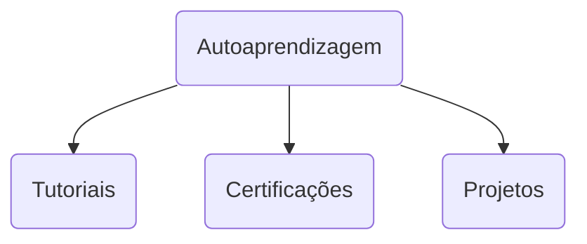
</div>
#### Tecnologia da Informação
<div class="center-table" markdown>
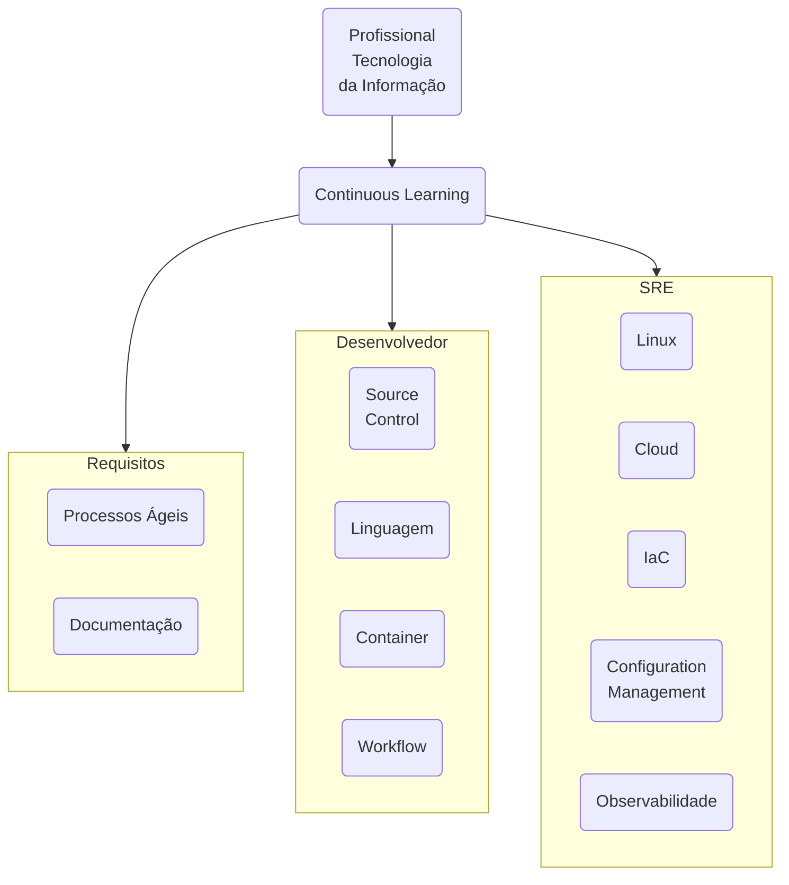
</div>
#### Linux
<div class="center-table" markdown>
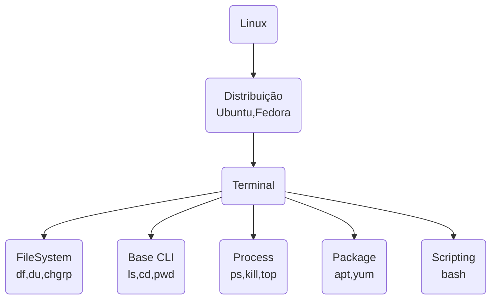
</div>
#### Cloud
<div class="center-table" markdown>
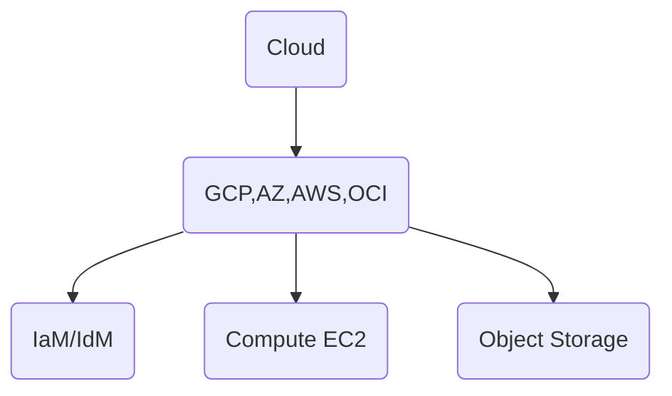
</div>
#### Controle de Versão
<div class="center-table" markdown>
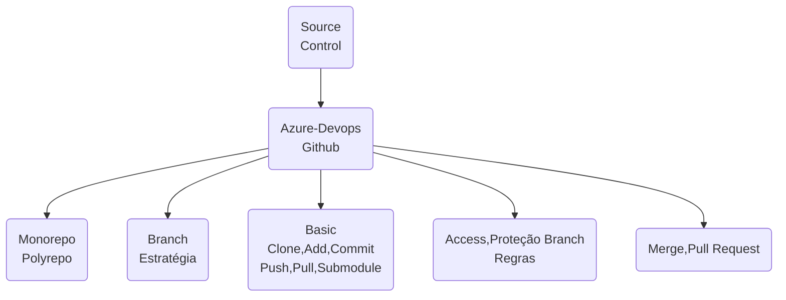
</div>
#### Infraestrutura como Código
<div class="center-table" markdown>
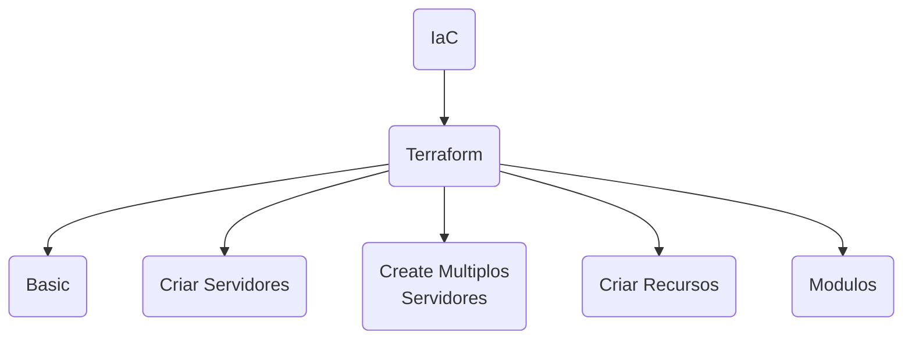
</div>
#### Container
<div class="center-table" markdown>
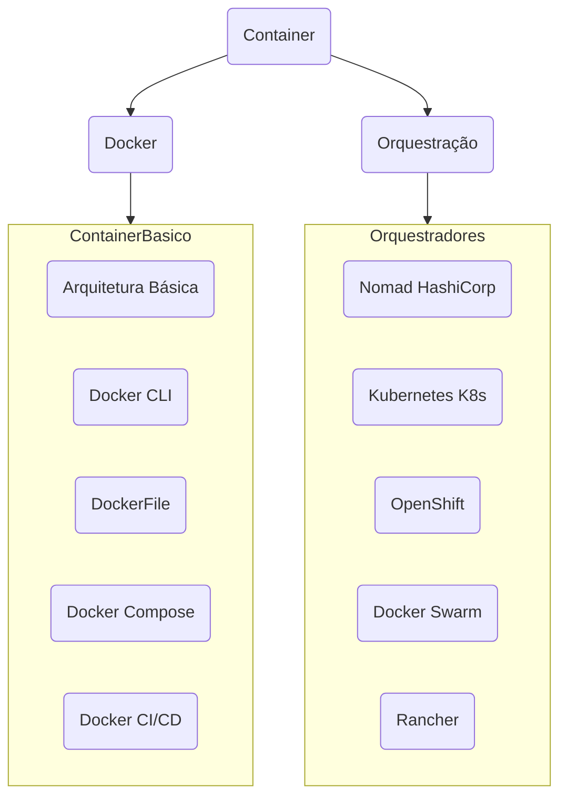
</div>
#### Pipelines/Workflows
<div class="center-table" markdown>
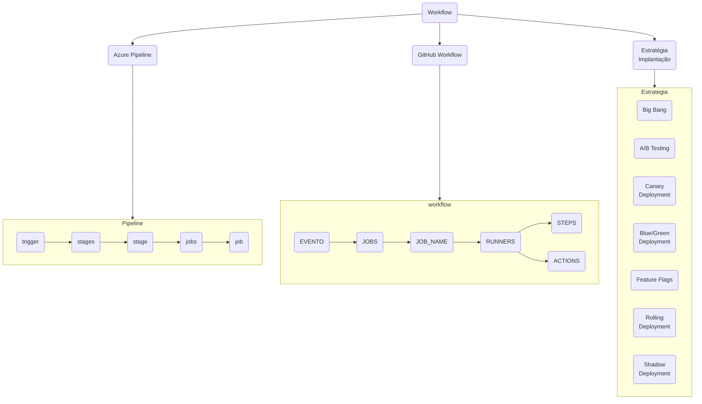
</div>
#### Gerenciamento de Configuração
<div class="center-table" markdown>
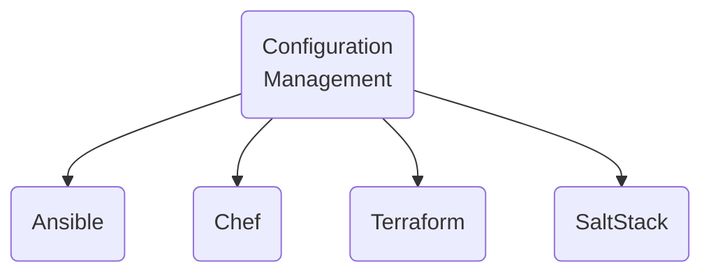
</div>
#### Processos Ágeis
<div class="center-table" markdown>
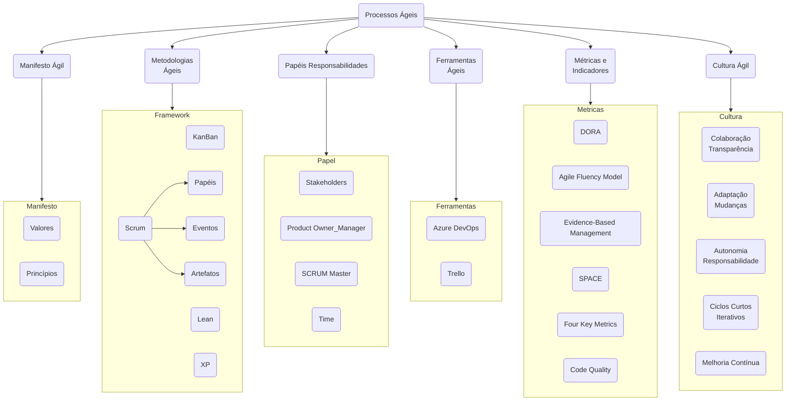

</div>

#### Documentação
<div class="center-table" markdown>
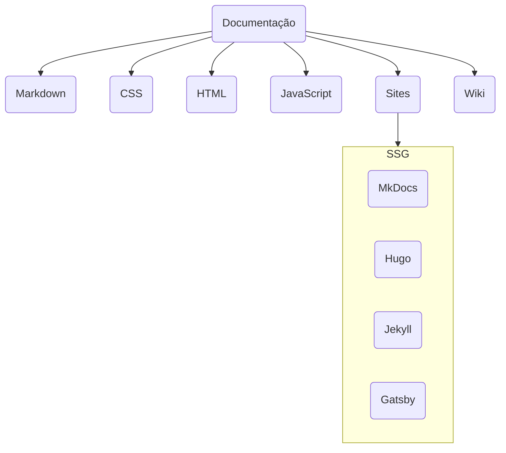
</div>
#### Linguagem Tecnologia
<div class="center-table" markdown>
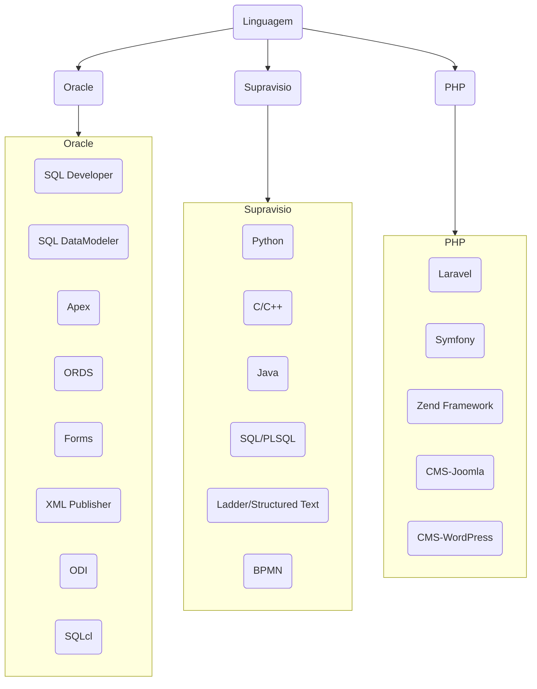
</div>
#### Linguagem Tecnologia
<div class="center-table" markdown>
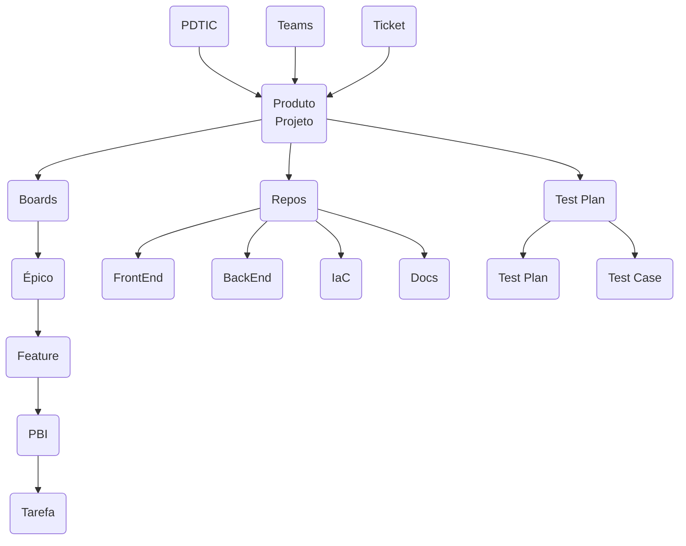
</div>
#### Integração Contínua e Entrega Contínua
<div class="center-table" markdown>
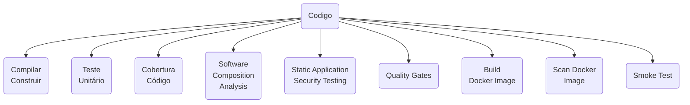
</div>
#### Observabilidade
<div class="center-table" markdown>
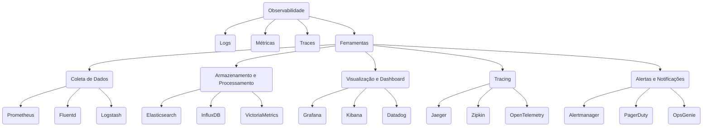
</div>

### Estratégia de Branch
<div class="center-table" markdown>
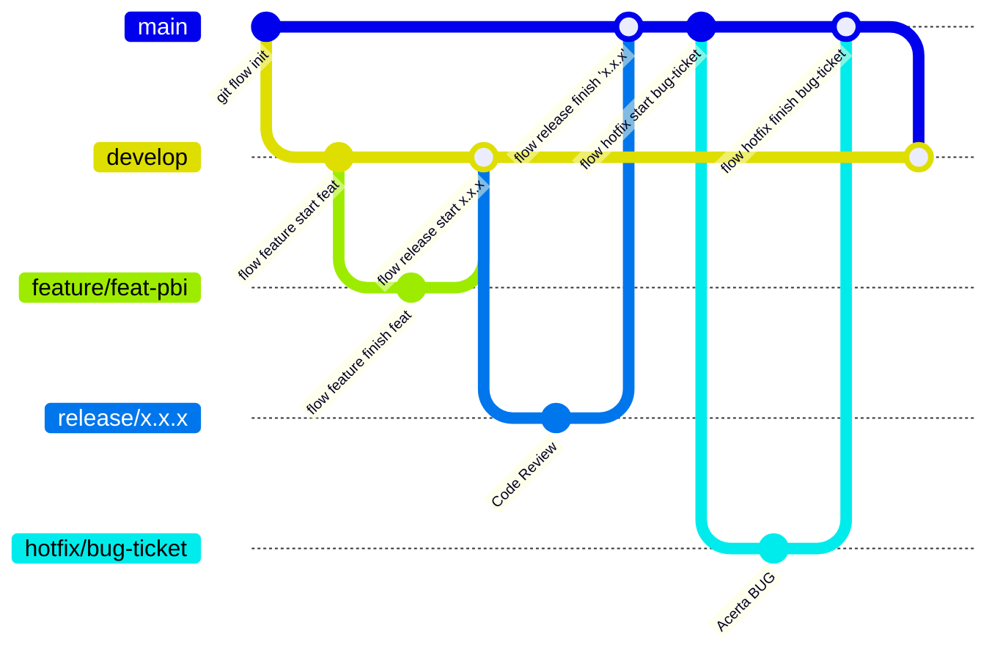
</div>

```
name: CI/CD - GitFlow Go App

on:
  push:
    branches:
      - main
      - develop
      - 'feature/*'
      - 'release/*'
      - 'hotfix/*'
  pull_request:
    branches:
      - main
      - develop
      - 'release/*'
      - 'hotfix/*'

jobs:
  sca-security:
    name: SCA Security Scan
    runs-on: ubuntu-latest

    steps:
      - name: Checkout do código
        uses: actions/checkout@v4

      - name: Instalar Trivy (Ferramenta SCA)
        run: |
          sudo apt update
          sudo apt install -y wget
          wget https://github.com/aquasecurity/trivy/releases/latest/download/trivy_0.50.1_Linux-64bit.tar.gz
          tar zxvf trivy_0.50.1_Linux-64bit.tar.gz
          sudo mv trivy /usr/local/bin/

      - name: Rodar análise SCA
        run: |
          trivy fs --exit-code 1 --severity HIGH,CRITICAL .

  unit-tests:
    name: Testes Unitários
    runs-on: ubuntu-latest
    needs: sca-security  # Só roda após a análise SCA passar

    steps:
      - name: Checkout do código
        uses: actions/checkout@v4

      - name: Configurar Go
        uses: actions/setup-go@v5
        with:
          go-version: '1.21'

      - name: Instalar dependências
        run: go mod tidy

      - name: Rodar testes unitários
        run: go test ./... -v -cover

  docker-build:
    name: Build Docker Image
    runs-on: ubuntu-latest
    needs: unit-tests  # Só roda após os testes unitários passarem

    steps:
      - name: Checkout do código
        uses: actions/checkout@v4

      - name: Build da imagem Docker
        run: docker build -t my-go-app:latest .

      - name: Testar execução do container
        run: docker run --rm my-go-app:latest

  deploy:
    name: Deploy (Somente em releas
```
<div class="center-table" markdown>
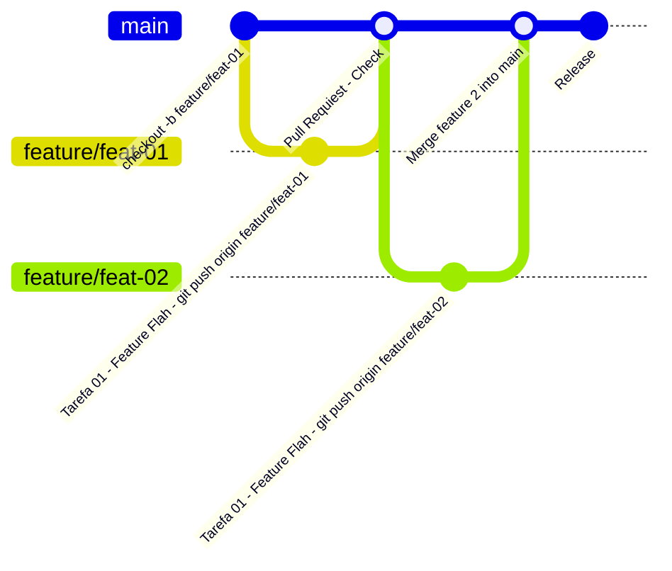
</div>

## Exemplo de Workflow
```
.
├── .github/workflows/ci.yml  # Workflow do GitHub Actions
├── Dockerfile                # Dockerfile para build da aplicação
├── go.mod                    # Dependências do projeto Go
├── main.go                   # Código principal
├── app/                      # Código fonte
└── tests/                    # Testes unitários

```

```
# Usa a imagem base do Golang
FROM golang:1.21

# Define o diretório de trabalho
WORKDIR /app

# Copia os arquivos do projeto
COPY . .

# Baixa as dependências
RUN go mod tidy

# Compila a aplicação
RUN go build -o main .

# Define o comando de execução
CMD ["/app/main"]
```


```
name: CI - Go App

on:
  push:
    branches:
      - main
      - 'feature/*'
  pull_request:
    branches:
      - main

jobs:
  sca-security:
    name: SCA Security Scan
    runs-on: ubuntu-latest

    steps:
      - name: Checkout do código
        uses: actions/checkout@v4

      - name: Instalar Trivy (Ferramenta SCA)
        run: |
          sudo apt update
          sudo apt install -y wget
          wget https://github.com/aquasecurity/trivy/releases/latest/download/trivy_0.50.1_Linux-64bit.tar.gz
          tar zxvf trivy_0.50.1_Linux-64bit.tar.gz
          sudo mv trivy /usr/local/bin/

      - name: Rodar análise SCA
        run: |
          trivy fs --exit-code 1 --severity HIGH,CRITICAL .

  unit-tests:
    name: Testes Unitários
    runs-on: ubuntu-latest
    needs: sca-security  # Só roda após a análise SCA passar

    steps:
      - name: Checkout do código
        uses: actions/checkout@v4

      - name: Configurar Go
        uses: actions/setup-go@v5
        with:
          go-version: '1.21'

      - name: Instalar dependências
        run: go mod tidy

      - name: Rodar testes unitários
        run: go test ./... -v -cover

  docker-build:
    name: Build Docker Image
    runs-on: ubuntu-latest
    needs: unit-tests  # Só roda após os testes unitários passarem

    steps:
      - name: Checkout do código
        uses: actions/checkout@v4

      - name: Build da imagem Docker
        run: docker build -t my-go-app:latest .

      - name: Testar execução do container
        run: docker run --rm my-go-app:latest
```

##
```
mvn liquibase:validate
mvn liquibase:update -Dliquibase.labels=v1.2.0 -Dliquibase.contexts=hml

# This is a basic workflow to help you get started with Actions

name: Liquibase_Maven_GitHub-Hosted

on: [push]

# For more control over when the action will run, comment out (or delete) the above and trigger the workflow on master-branch push or pull request
# by uncommenting the appropriate section below.
# on:
# workflow_dispatch:
#   push:
#     branches: [ main ]
#   pull_request:
#     branches: [ main ]

# A workflow run is made up of one or more jobs that can run sequentially or in parallel
jobs:
  # This workflow contains jobs called "LBJobMaven"
  LBJobMaven:
    # The type of runner that the job will run on
    runs-on: ubuntu-latest

    # Steps represent a sequence of tasks that will be executed as part of the job
    steps:

      - name: RunLiquibaseMavenCommands
        uses: actions/checkout@v2
      - run: |
          cd extra/SalesManager_h2_version
          mvn -version
          mvn clean package
          #Uncomment the line below to save changes.  Also, see environment variables under "env" and assign variables accordingly
          #git config --global user.email $user.email; git config --global user.name $user.name; git config pull.rebase false; git add .; git commit -m $"message"; git push -u origin $branch
          mvn liquibase:status -Dliquibase.verbose
          mvn liquibase:updateTestingRollback


        env:
            user.email: "<email>"
            user.name: "<user name>"
            message: "<commit message>"
            branch: "<branch name>"
```
