## Continuous Learning (Aprendizado Contínuo)
É o processo de aprendizado constante, onde indivíduos e organizações buscam adquirir e aprimorar conhecimentos e habilidades ao longo do tempo.

### Pílula do Conhecimento
São conteúdos curtos e direcionados para aprendizado rápido e objetivo sobre um tema específico.
#### Carreira

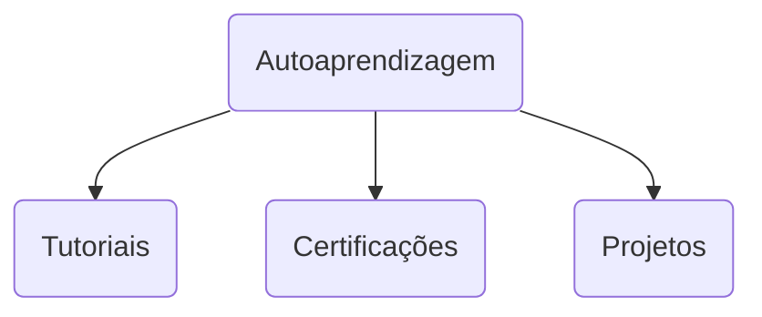
#### Tecnologia da Informação

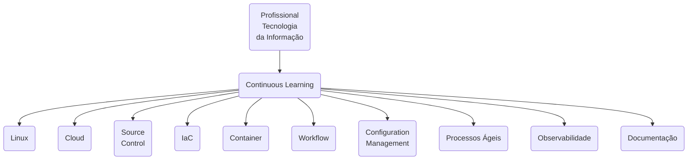
#### Linux
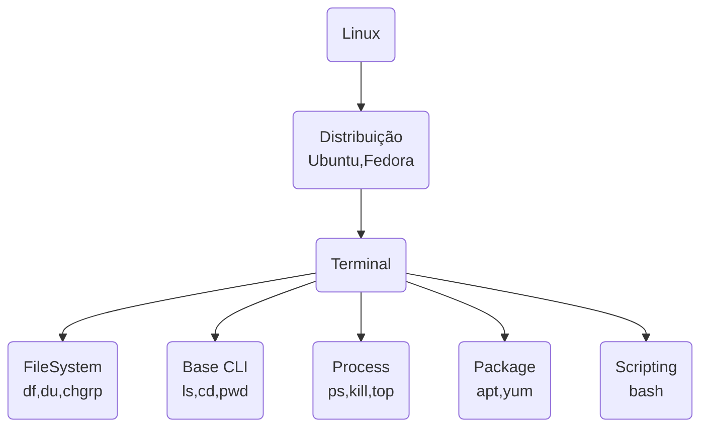
#### Cloud
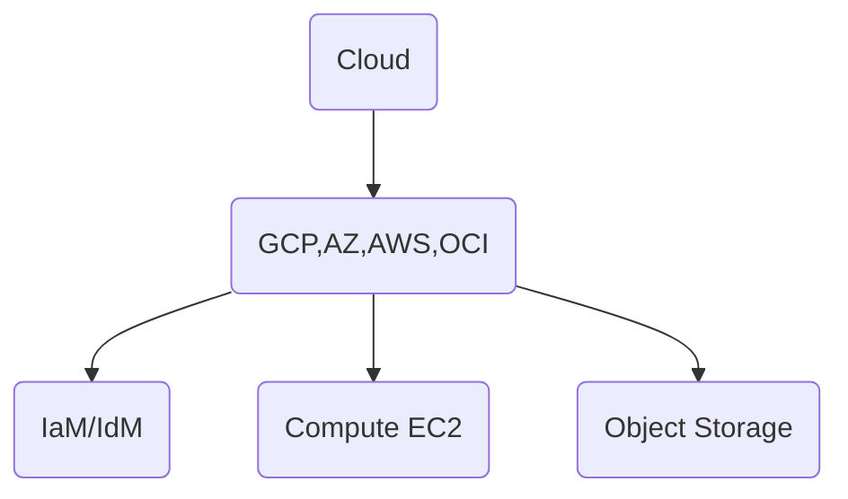
#### Controle de Versão
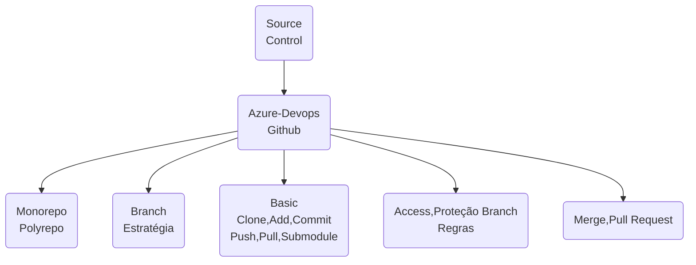
#### Infraestrutura como Código
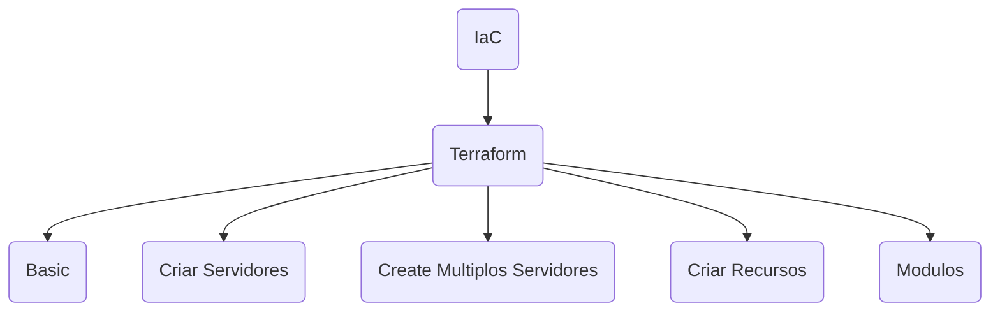
#### Container
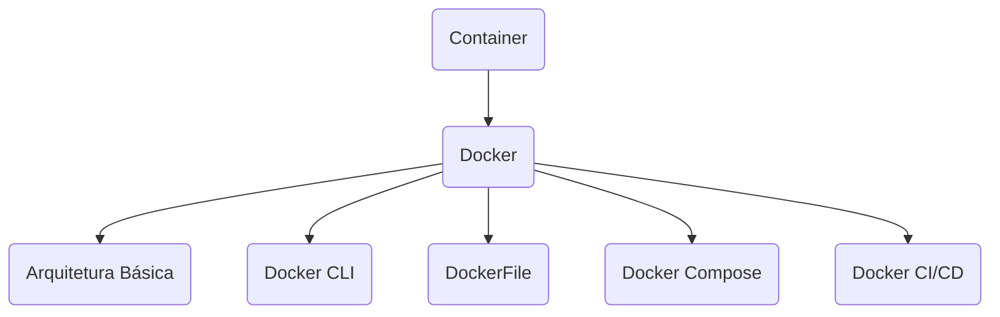
#### Pipelines/Workflows
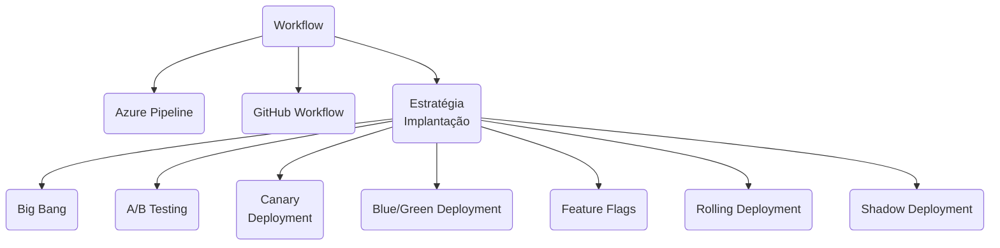
#### Gerenciamento de Configuração
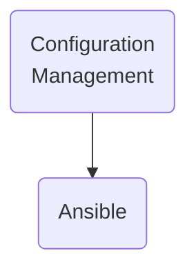
#### Processos Ágeis
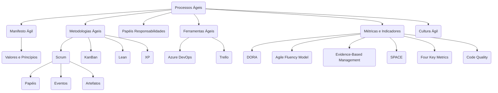
#### Observabilidade
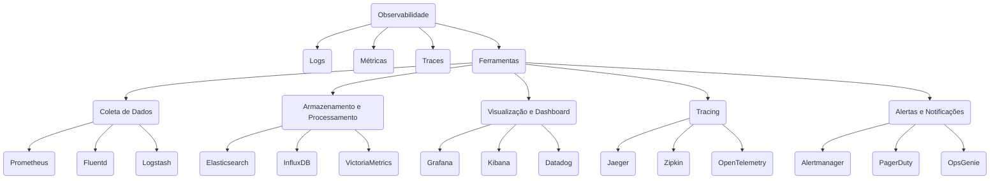
#### Documentação
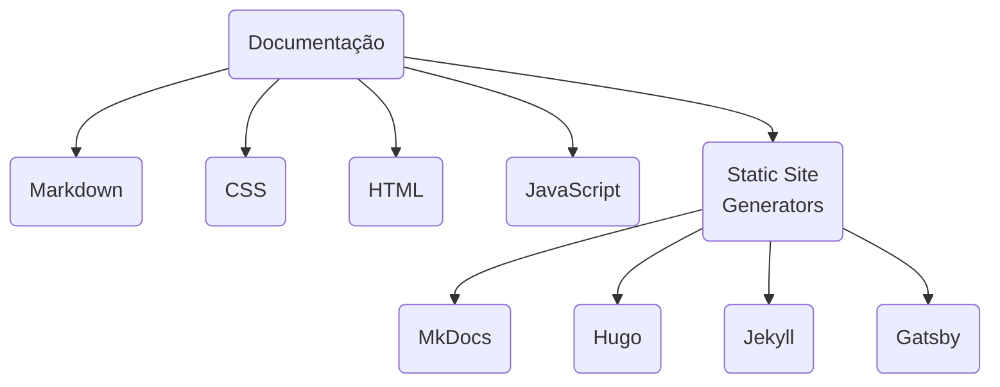
