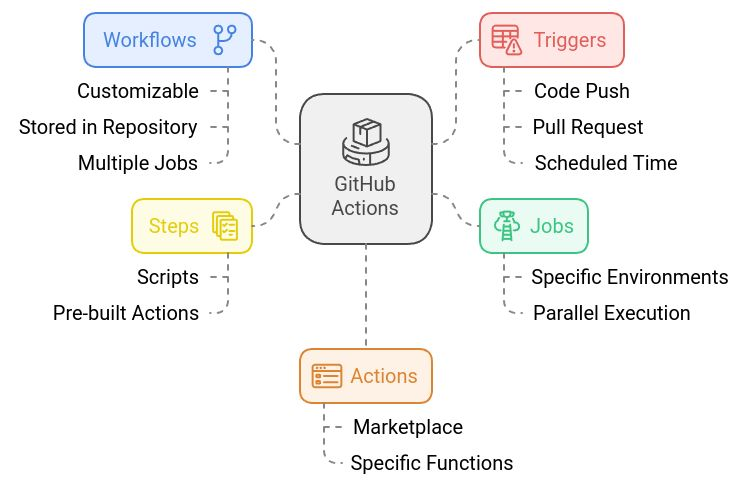
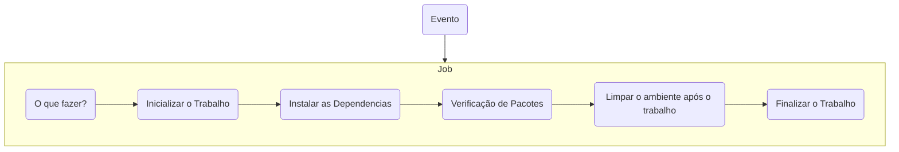
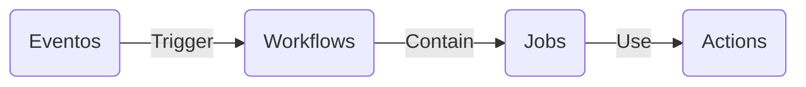

`A automação é boa, desde que você saiba exatamente onde coloca-la`.

A Implantação Contínua (CD) está revolucionando a maneira como os desenvolvedores pensam e agem, e se você está ansioso para elevar seu jogo de codificação, este guia é para você! 

## Automação: O Coração da Implantação
Automação não é apenas uma opção; é uma necessidade no mundo do CD. Ao automatizar tarefas, os desenvolvedores liberam tempo, reduzem erros e aumentam a consistência. 
## Colaboração: Todos a postos
Trabalhar em conjunto não é bom apenas para o moral, é crucial para o sucesso do CD. 
## Monitoramento e Feedback: Olhos no Processo
O monitoramento contínuo é essencial para detectar quaisquer problemas precocemente e aprender com eles.
## Teste: Não há espaço para erros
O teste é uma fase crucial que garante a qualidade e a confiabilidade do produto.
## Segurança e conformidade: seguro e sólido
Na era das ameaças cibernéticas, garantir a segurança e a conformidade do seu aplicativo é uma prioridade.
## Adotando uma cultura de aprendizagem e melhoria: cresça com o fluxo
A Implantação Contínua é uma jornada, não apenas um processo. 
## ACT "Pense globalmente, act localmente"
Feedback rápido - Em vez de ter que fazer commit/push toda vez que quiser testar as alterações que está fazendo em seus .github/workflows/arquivos você pode usar `act` ara executar as ações localmente. 
As variáveis ​​de ambiente e o sistema de arquivos são todos configurados para corresponder ao que o GitHub fornece.
Local Task Runner - Com act, você pode usar as GitHub Actions definidas em seu .github/workflows/para substituir seu Makefile!

- [x] `brew install act`
- [ ] Alguns comandosl

| Comando                                    | Descrição                                                                 |
|--------------------------------------------|---------------------------------------------------------------------------|
| `act`                                       | Executa o workflow GitHub Actions localmente usando a configuração padrão. |
| `act --list`                                | Lista os nomes dos eventos disponíveis no repositório.                    |
| `act --secret <SECRET_NAME>=<value>`        | Define uma variável de ambiente secreta a ser usada durante a execução do workflow. |
| `act --event <evento>`                      | Especifica o tipo de evento a ser disparado para o workflow (por exemplo, `push`, `pull_request`, etc.). |
| `act --platform <nome_da_imagem>`           | Define a imagem Docker a ser usada para o runner.                         |
| `act --verbose`                             | Exibe informações detalhadas sobre a execução do workflow.                |
| `act --job <job_name>`                     | Executa um job específico dentro do workflow (em vez de rodar o workflow completo). |
| `act --docker-args <args>`                  | Passa argumentos personalizados para o Docker quando o workflow é executado. |
| `act --secret-file <caminho_do_arquivo>`    | Especifica um arquivo de segredos a ser usado durante a execução do workflow (em vez de definir segredos manualmente). |
| `act --dry-run`                             | Realiza uma execução de teste sem fazer mudanças (dry-run), útil para verificar o que o workflow faria sem executar de fato. |
| `act --reuse`                               | Reutiliza containers e caches de execuções anteriores para acelerar a execução. |
| `act --entrypoint <entrypoint>`             | Substitui o ponto de entrada do container, útil se você precisar personalizar o processo de execução. |
| `act --no-cache`                            | Impede que o cache de execução seja reutilizado, forçando o workflow a ser executado do zero. |
| `act --artifact-server <endereco>`          | Define um servidor para hospedar artefatos durante a execução dos jobs. |

act --container-architecture linux/amd64 --env-file==env_01.env

|  Parametros   | Entenda             |
| -------       | ---------           |
| Events        | Suporte básico a eventos, ele tentará obter o máximo de informações possível do repositório local, embora isso possa não ser suficiente para certos tipos de eventos. Defaul: `push` |
| Workflows     | Todos os fluxos de trabalho serão executados em `.github/workflows`, mas poderá ser modificado por `-W/ --workflows`.  |
| Jobs          | Todos os trabalhos em todos os fluxos de trabalho que são acionados pelo pushevento, mas poderá ser modificado em todos os fluxos de trabalho que são acionados pelo pushevento `act -j 'nome-job'`. |
| Vars          | 
| Secrets       |
| GITHUB_TOKEN  | 

```
~/
├── .actrc          # Arquivo de configuração do `act`
├── .act/
│   ├── secrets.env # Arquivo de segredos
│   └── variables.env # Arquivo de variáveis
└── .github/
    └── workflows/
        └── workflow.yml
```

act pull_request
act -l
act --job <name-of-your-job>
act --job 'show'
act --container-architecture linux/amd64 --graph
act --container-architecture linux/amd64 --env-file=~/.act/env_01.env
act  --env-file env_01.env
 act  --env-file env_01.env

## Validação Linter
O yamllint não verifica apenas a validade da sintaxe, mas também estranhezas como repetição de teclas e problemas estéticos como comprimento de linhas, espaços finais, recuo, etc.
`yamllint .github/workflows/*.yml`

Esta action-validator é uma ferramenta autônoma projetada para "lint" os arquivos YAML usados ​​para definir GitHub Actions e Workflows. Ela garante que eles sejam bem formados, verificando-os em relação aos esquemas JSON publicados, e garante que quaisquer globs usados ​​em paths/ paths-ignorecorrespondam a pelo menos um arquivo no repositório.
`action-validator .github/workflows/04_wf_nada.yml`

## GitHub Actions
As ações do GitHub Actions são scripts empacotados para automatizar tarefas em um fluxo de trabalho de desenvolvimento de software no GitHub. Consiste em scripts que aderem a um formato de dados yml. Você pode pesquisar GitHub Marketplace, projetos open-source e gravar suas próprias ações do GitHub Actions do zero.




- [x] GitHub Actions refere-se a toda a plataforma e ecossistema para criar e executar fluxos de trabalho automatizados dentro do ambiente GitHub;
- [x] Uma ação é um script invocado de dentro de um fluxo de trabalho;
- [x] GitHub Actions é uma plataforma de integração contínua e entrega contínua (CI/CD) que permite automatizar a sua compilação, testar e pipeline de implantação.
- [x] Oferecem três sabores de ambientes virtuais: Ubuntu, macOS e Windows.
- [x] Os runners vêm com uma variedade de softwares e ferramentas pré-instalados comumente usados no
desenvolvimento de software.

Pipeline de Build
<div class="mdx-columns2" markdown>
- [x] Processo de compilação;
- [ ] Testes unitários
- [ ] Análise de qualidade
- [ ] Geração do artefato;
</div>
Pipeline de Segurança
<div class="mdx-columns2" markdown>
- [ ] Analisar dependências, 
- [ ] Analisar secrets, 
- [ ] Analisar vulnerabilidades.
</div>
Pipeline de Deployment
<div class="mdx-columns2" markdown>
- [ ] Configuração de ambiente
- [ ] Implantação da aplicação, 
- [ ] Testes de fumaça. 
</div>
Pipeline de Infra as Code
<div class="mdx-columns2" markdown>
- [ ] Processo de infraestrutura em nuvem ou até mesmo no seu Ambiente On-premises. 
</div>

### Types of GitHub actions
Há três tipos de ações do GitHub: **ações de contêiner** (Estas ações só podem ser executadas num ambiente Linux que o GitHub aloja), **ações JavaScript** (não incluem o ambiente no código, você terá que especificar o ambiente para executar essas ações, as ações JavaScript suportam ambientes Linux, macOS e Windows) e **ações compostas**(permitem combinar várias etapas do fluxo de trabalho em uma única ação).




- [x] O principal mecanismo de automação no GitHub.
- [x] As actions são o mecanismo usado para fornecer automação de fluxo de trabalho dentro do ambiente GitHub.




### Workflow (Fluxo de Trabalho)
Um fluxo de trabalho é um processo automatizado configurável que executará um ou mais trabalhos.
Os fluxos de trabalho são definidos no diretório .github/workflows
Um workflow é processo bem-definido que será executado no repositório ao qual ele pertence
Ele é definido a partir de um arquivo YAML dentro da pasta .github/workflows
É comum definir workflows para testagem de pacotes, geração de documentação, atualização de dados, etc.
O workflow é, essencialmente, um duende mágico que baixa o nosso repositório em um servidor do GitHub e executa os comandos especificados.

| **Categoria**               | **Palavra-chave**            | **Descrição**                                                                 |
|-----------------------------|------------------------------|-------------------------------------------------------------------------------|
| **Configuração**             | `workflow`                   | Arquivo YAML que define o conjunto de ações automatizadas a serem executadas. |
|                             | `job`                        | Uma unidade de trabalho dentro de um workflow; pode consistir em várias etapas (steps). |
|                             | `step`                       | Um comando individual dentro de um job, que pode ser uma execução de script ou uma ação. |
|                             | `action`                     | Uma tarefa reutilizável que pode ser incorporada em um step, como uma ação pré-configurada do GitHub ou personalizada. |
|                             | `event`                      | O gatilho (trigger) que inicia o workflow, como `push`, `pull_request`, `schedule`, entre outros. |
| **Execução**                 | `run`                        | Comando executado em um step, geralmente contendo um script ou uma linha de código. |
|                             | `uses`                       | Referência a uma ação específica ou repositório de ações dentro de um step.   |
|                             | `with`                       | Passa parâmetros para uma ação ou comando dentro de um step.                  |
| **Ambiente**                 | `env`                        | Variáveis de ambiente definidas no workflow, job ou step.                    |
|                             | `secrets`                    | Variáveis de ambiente seguras, geralmente usadas para armazenar senhas e tokens. |
| **Condicional**              | `if`                         | Condição que permite a execução de um step ou job baseado em expressões.      |
|                             | `continue-on-error`          | Define se o fluxo de trabalho deve continuar após um erro em um step.        |
| **Matrix**                   | `matrix`                     | Permite a execução paralela de jobs com diferentes combinações de variáveis, como diferentes versões de Node.js ou Python. |
| **Fluxo de Execução**        | `needs`                      | Define a dependência entre jobs, indicando que um job deve ser executado após a conclusão de outro. |
|                             | `runs-on`                    | Define o ambiente de execução para um job, como `ubuntu-latest`, `windows-latest`, etc. |
| **Artefatos e Resultados**   | `artifacts`                  | Arquivos gerados durante a execução do workflow que podem ser arquivados e acessados posteriormente. |
|                             | `upload-artifact`            | Ação que faz o upload de artefatos gerados no workflow para armazenamento.     |
|                             | `download-artifact`          | Ação que baixa artefatos previamente carregados em um job anterior.           |
| **Execução Condicional**     | `if`                         | Define uma condição para a execução de um job ou step com base em variáveis e resultados de etapas anteriores. |
| **Notificações**             | `status`                     | A visualização do estado do job (sucesso, falha, cancelado) nas interfaces do GitHub. |
| **Cancelamento e Timeout**   | `timeout-minutes`            | Define o tempo máximo de execução para um job antes que ele seja cancelado automaticamente. |
|                             | `cancel`                     | Gatilho para cancelar a execução de um workflow ou job, útil em fluxos mais complexos. |

- [x] workflow: O arquivo principal em YAML que descreve todo o fluxo de trabalho.
- [x] job: Cada trabalho dentro de um fluxo de trabalho pode ser executado em paralelo ou sequencialmente.
- [x] step: Etapas que são executadas dentro de um job, podem ser comandos run ou ações.
- [x] action: Conjunto de comandos reutilizáveis. Podem ser criadas por qualquer usuário e compartilhadas no GitHub.
- [x] run: Um comando ou script executado no ambiente de execução.
- [x] matrix: Permite a execução simultânea de vários jobs com diferentes combinações de parâmetros, útil para testes em várias plataformas.
- [x] secrets: Variáveis protegidas que podem ser usadas para armazenar senhas, tokens e outras informações sensíveis.
- [x] needs: Define que um job só será executado após a conclusão de outro job especificado.

#### Workflow para Eventos Agendados
O evento schedule permite que você dispare um fluxo de trabalho para ser executado em horários UTC específicos, para obter ajuda: [CRONTAB](https://crontab.guru/)

```
on:
  schedule:
    - cron:  '*/15 * * * *'
OU
on:
  schedule:
    - cron:  '0 3 * * SUN'
```
#### Workflow Eventos Manuais
O evento `workflow_dispatch` ou `repository_dispatch` você pode disparar manualmente um fluxo de trabalho. 
```
on:
  workflow_dispatch:
    inputs:
      logLevel:
        description: 'Log level'     
        required: true
        default: 'warning'
      tags:
        description: 'Test scenario tags'

OU

on:
  repository_dispatch:
    types: [opened, deleted
```
Usando: `curl -X POST -H "Accept: application/vnd.github.v3+json" https://api.github.com/repos/{owner}/{repo}/dispatches -d '{"event_type":"event_type"}'`

#### Workflow Eventos webhooks
Quando eventos de webhook específicos ocorrerem no GitHub.
```
on:
  check_run:
    types: [rerequested, requested_action]
```
#### Palavras-chave condicionais
Você pode acessar informações de contexto e avaliar expressões. [Veja a sintaxe](https://docs.github.com/pt/actions/writing-workflows/workflow-syntax-for-github-actions#jobsjob_idstepsif).
```
on: push
jobs:
  prod-check:
    if: github.ref == 'refs/heads/main'
    runs-on: ubuntu-latest
    steps:
      ...
```
#### Modelos
a consistência em toda a sua organização usando um modelo de fluxo de trabalho definido no repositório .github da organização. Para encontrar esses fluxos de trabalho, navegue até a guia Ações de um repositório dentro da organização, selecione Novo fluxo de trabalho e encontre a seção de modelo de fluxo de trabalho da organização intitulada "Fluxos de trabalho criados por nome da organização". 
#### Versões específicas de uma ação
Ao fazer referência a uma versão específica, você está criando uma proteção contra alterações inesperadas enviadas para a ação que poderiam interromper o fluxo de trabalho. 
```
steps:    
  - uses: actions/setup-node@c46424eee26de4078d34105d3de3cc4992202b1e
  - uses: actions/setup-node@v1
  - uses: actions/setup-node@v1.2
  - uses: actions/setup-node@main
```

### Eventos
Um evento é uma atividade específica em um repositório que dispara a execução de um fluxo de trabalho.
uma atividade pode originar-se de GitHub quando alguém cria uma solicitação de pull request, abre um problema ou faz envio por push de um commit para um repositório ou agendamentos.
Eventos: Um evento é uma atividade que aciona um fluxo de trabalho. Por exemplo:
Quando o repositório recebe uma alteração (on: push)
Quando um Pull Request é criado (em outras palavras, alguém está enviando uma contribuição para o repositório) (on: pull_request)

https://docs.github.com/pt/actions/reference/events-that-trigger-workflows

Eventos programados. Ex: a cada hora, todos os dias, uma vez por semana, uma vez por mês, etc. O site CronTab é muito útil para isso.
Use a chave `on` para especificar os eventos que disparam o fluxo de trabalho.
- Unico: on: push
- Usando eventos múltiplos:  on: [push, fork]
- Usando tipos de atividade e filtros com vários eventos
- push,pull_request,issues,release,fork,star,status,

| **Evento**                | **Descrição**                                                       | **Exemplo**                                                     |
|---------------------------|---------------------------------------------------------------------|-----------------------------------------------------------------|
| `push`                    | Disparado quando há um push de código para o repositório.           | `on: push`                                                      |
| `pull_request`            | Disparado quando uma pull request é aberta, fechada ou sincronizada. | `on: pull_request`                                              |
| `issues`                  | Disparado quando uma issue é aberta, editada ou fechada.            | `on: issues`                                                    |
| `issue_comment`           | Disparado quando um comentário é feito em uma issue ou PR.          | `on: issue_comment`                                             |
| `release`                 | Disparado quando uma release é criada, publicada ou deletada.       | `on: release`                                                   |
| `fork`                    | Disparado quando um repositório é bifurcado (forked).               | `on: fork`                                                      |
| `star`                    | Disparado quando alguém dá ou retira uma estrela (star).            | `on: star`                                                      |
| `status`                  | Disparado quando o status de um commit muda (ex: CI).               | `on: status`                                                    |
| `workflow_run`            | Disparado quando a execução de outro workflow é concluída.         | `on: workflow_run`                                              |
| `watch`                   | Disparado quando um usuário começa ou para de "seguir" o repositório. | `on: watch`                                                     |
| `repository_dispatch`     | Disparado quando um evento externo envia um payload para o repositório. | `on: repository_dispatch`                                       |
| `schedule`                | Disparado de acordo com um cronograma (expressões cron).            | `on: schedule`                                                  |
| `workflow_dispatch`       | Disparado manualmente, com entradas personalizadas.                 | `on: workflow_dispatch`                                          |
| `label`                   | Disparado quando um rótulo (label) é adicionado ou removido.       | `on: label`                                                     |
| `milestone`               | Disparado quando um milestone é criado, fechado ou reaberto.       | `on: milestone`                                                 |
| `deployment`              | Disparado quando um deployment é criado ou atualizado.             | `on: deployment`                                                |
| `deployment_status`       | Disparado quando o status de um deployment muda (sucesso ou falha). | `on: deployment_status`                                         |
| `push` (tag)              | Disparado quando um tag é enviado para o repositório.              | `on: push: tags: ['v*.*.*']`                                    |
| `github_app`              | Disparado por ações de GitHub Apps no repositório.                 | `on: github_app`                                                |
| `secret_scanning_alert`   | Disparado quando um alerta de vazamento de segredo é gerado.       | `on: secret_scanning_alert`                                     |

### Runners
O GitHub Actions oferece [ambientes virtuais](https://docs.github.com/en/actions/using-github-hosted-runners/using-github-hosted-runners/about-github-hosted-runners) gerenciados para executar fluxos de trabalho. 
Para act executar seus fluxos de trabalho localmente, ele deve executar um contêiner para o runner definido no seu arquivo de fluxo de trabalho. (act --container-architecture linux/amd64 ou act -P ubuntu-latest=-self-hosted)

Você pode identificar o código-fonte usado para criar as imagens de VM para executores hospedados no GitHub usados ​​para Actions, bem como para agentes hospedados pela Microsoft usados ​​para Azure Pipelines. 

- [x] [Imagens Runners](https://github.com/actions/runner-images)

#### Runners Específicos - Auto-hospedados
Crie os grupos necessários para efetuar o isolamento de seus runners.
- [x] Settings --> Actions --> Runner Groups --> APP-xxx

Você pode adicionar um executor auto-hospedado a um repositório, a uma organização ou a uma empresa. Os executores auto-hospedados a nível da organização ou empresa. Esta abordagem torna o executor disponível para vários repositórios na sua organização ou empresa, e também permite gerenciar seus executores em um só lugar.

Settings --> Actions --> Runners

Arquiteturas
As seguintes arquiteturas de processador são compatíveis com o aplicativo do executor auto-hospedado.

x64 – Linux, macOS e Windows.
ARM64 – Linux, macOS, Windows (atualmente em versão prévia pública).
ARM32 – Linux.

```
# Create a folder
$ mkdir actions-runner && cd actions-runner
Copied!# Download the latest runner package
$ curl -o actions-runner-osx-arm64-2.321.0.tar.gz -L https://github.com/actions/runner/releases/download/v2.321.0/actions-runner-osx-arm64-2.321.0.tar.gz
Copied!# Optional: Validate the hash
$ echo "fbee07e42a134645d4f04f8146b0a3d0b3c948f0d6b2b9fa61f4318c1192ff79  actions-runner-osx-arm64-2.321.0.tar.gz" | shasum -a 256 -c
# Extract the installer
$ tar xzf ./actions-runner-osx-arm64-2.321.0.tar.gz
Copied!
Configure
# Create the runner and start the configuration experience
$ ./config.sh --url https://github.com/60pportunities --token BMFODSGMACOJCOS5W7HYTKLHKAQPM
Copied!# Last step, run it!
$ ./run.sh
Using your self-hosted runner
# Use this YAML in your workflow file for each job
runs-on: self-hosted
```


### Job
Um job é um conjunto de etapas em um fluxo de trabalho executadas no mesmo executor.
Um evento aciona automaticamente o fluxo de trabalho, que contém um trabalho. Em seguida, o trabalho usa etapas para controlar a ordem em que as ações são executadas. 
O trabalho usa etapas para controlar a ordem em que as ações são executadas

| Chave          |  Entenda                                              |
| ----           | ----                                                  |
| jobs:          | Palavra-chave para declarar um trabalho               |
| job_name       | Identificador do Job (Texto Simples)                  |
| name: XXXXX    | Nome do Job                                           |
| runs-on: XXXXX | Runner type (e.g., ubuntu-latest, windows-latest, self-hosted runner name) |
| steps:         | Lista de etapas a serem executadas dentro do trabalho |

#### Steps
Definir tarefas individuais a serem executadas dentro de um trabalho.

| Chave               |  Entenda                                              |
| ----                | ----                                                  |
| steps:              | Keyword to declare steps within a job
| name: (Optional)    | Custom name for the step
| run:                | Execute a shell command within the step
| uses:               | (Optional) Use a pre-built action from the GitHub Actions marketplace
| action_name:        | Name of the action to use
| version: (Optional) | Specific version of the action to use
| with: (Optional)    | Input values for the action
| command_to_execute: Shell command to be executed

### Secure Workflow Data
Proteger informações confidenciais como senhas, tokens de acesso e chaves de API é crucial
As violações de dados podem ter consequências graves para organizações e indivíduos
O GitHub Actions fornece vários recursos para manuseio seguro de dados

Definição: Armazenamento seguro para dados sensíveis como chaves de API
Uso: Acessível por fluxos de trabalho no mesmo repositório
Configuração: GitHub.com > Configurações > Segredos > Novo segredo do repositório

### Variáveis ​​de ambiente padrão

### Actions
Uma ação é um aplicativo personalizado para a plataforma GitHub Actions que executa uma tarefa complexa, mas frequentemente repetida.

Types of GitHub Actions : 

- [x] Pushes: Trigger on any push 
- [x] Pull Requests: Trigger on PR events 
- [x] Issues: Trigger on issue activities 
- [x] Releases: Trigger on new releases 
- [x] Scheduled Events: Cron expressions for scheduling 
- [x] Manual Triggers: Trigger manually via GitHub UI/CLI

### Runners (Executores)
Um executor é um servidor que executa seus fluxos de trabalho quando eles são disparados. Cada executor pode executar um único trabalho por vez. GitHub fornece executores Ubuntu Linux, Microsoft Windows e macOS para executar seus fluxos de trabalho. 

Secrets (ou segredos, em português) são variáveis de ambiente que não podem ser compartilhadas com ninguém que não seja autorizado. São dados sigilosos, geralmente específicos de um contexto, por exemplo, de uma organização, um repositório, uma equipe… 

Exemplos de secrets:

- [x] O usuário e uma senha para acessar uma ferramenta;
- [x] A chave para consumir uma API;
- [x] Um token ou uma credencial de acesso; 
- [x] O número de um documento (CPF, Passaporte etc).

O Github Action é orientado por eventos, onde cada evento pode acionar (trigger) automaticamente um ou mais workflows. um workflow após cada push, pull request ou comentário, para uma branch específica ou para todas, e é customizável.

## JOB 
Um job é um conjunto de etapas em um fluxo de trabalho que são executadas no mesmo runner (um runner é um servidor que executa seus fluxos de trabalho quando acionado). Os fluxos de trabalho têm jobs, e os jobs têm etapas. Os passos são executados em ordem e são dependentes uns dos outros. Você adicionará etapas ao seu fluxo de trabalho mais adiante no curso. Para ler mais sobre jobs, consulte " Jobs".
    
Os trabalhos, por sua vez, são compostos de etapas. Uma etapa executa um comando shell ou invoca uma
ação predefinida do GitHub. Todas as etapas em um trabalho são executadas em um runner. O runner é um
servidor (virtual ou físico) ou um contêiner que foi configurado para entender como interagir com o GitHub

 gh workflow --repo https://github.com/horaciovasconcellos/estudo list

Etapa 1: definir o gatilho do fluxo de trabalho
O pipeline é acionado toda vez que há um evento,. mas podemos ter algumas exceções:

```
on:
  push:
    branches:
      - main
    paths-ignore:
      - 'README.md'
  ```
Etapa 2: Construindo e testando o aplicativo
  Este trabalho configura o ambiente, instala e executa os testes para o backend.

jobs:
  build-and-test-fastapi:
    runs-on: ubuntu-latest
    defaults:
      run:
        working-directory: ./api

    steps:
      - name: Checkout repository
        uses: actions/checkout@v4

      - name: Setup Python
        uses: actions/setup-python@v5
        with:
          python-version: '3.11'

      - name: Install dependencies
        run: |
          python -m pip install --upgrade pip
          pip install -r requirements.txt


Etapa 3: Construindo e testando o frontend Next.js
 build-and-test-front-end-nextjs:
    runs-on: ubuntu-latest
    defaults:
      run:
        working-directory: ./front-end-nextjs

    steps:
      - name: Checkout repository
        uses: actions/checkout@v4

      - name: Setup Node.js
        uses: actions/setup-node@v4
        with:
          node-version: '20'

      - name: Install Dependencies
        run: npm ci


Etapa 4: Construindo e enviando imagens do Docker

build-and-push-images:
    needs: [build-and-test-fastapi, build-and-test-front-end-nextjs]
    runs-on: ubuntu-latest

    steps:
      - name: Checkout repository
        uses: actions/checkout@v4

      - name: Set up Docker Buildx
        uses: docker/setup-buildx-action@v3

      - name: Login to DockerHub
        uses: docker/login-action@v3
        with:
          username: ${{ secrets.DOCKERHUB_USERNAME }}
          password: ${{ secrets.DOCKERHUB_TOKEN }}

      - name: Build and Push FastAPI image
        uses: docker/build-push-action@v5
        with:
          context: ./api
          file: ./api/Dockerfile
          push: true
          tags: ${{ secrets.DOCKERHUB_USERNAME }}/qr-api:${{ github.sha }}

      - name: Build and Push Next.js image
        uses: docker/build-push-action@v5
        with:
          context: ./front-end-nextjs
          file: ./front-end-nextjs/Dockerfile
          push: true
          tags: ${{ secrets.DOCKERHUB_USERNAME }}/qr-frontend:${{ github.sha }}

Etapa 4: Configurando segredos de ambiente para Dockerhub

Etapa 5: Confirmar e executar o fluxo de trabalho

build-and-push-images:
    needs: [build-and-test-fastapi, build-and-test-front-end-nextjs]
    runs-on: ubuntu-latest

    steps:
      - name: Checkout repository
        uses: actions/checkout@v4

      - name: Set up Docker Buildx
        uses: docker/setup-buildx-action@v3

      - name: Login to DockerHub
        uses: docker/login-action@v3
        with:
          username: ${{ secrets.DOCKERHUB_USERNAME }}
          password: ${{ secrets.DOCKERHUB_TOKEN }}

      - name: Build and Push FastAPI image
        uses: docker/build-push-action@v5
        with:
          context: ./api
          file: ./api/Dockerfile
          push: true
          tags: ${{ secrets.DOCKERHUB_USERNAME }}/qr-api:${{ github.sha }}

      - name: Build and Push Next.js image
        uses: docker/build-push-action@v5
        with:
          context: ./front-end-nextjs
          file: ./front-end-nextjs/Dockerfile
          push: true
          tags: ${{ secrets.DOCKERHUB_USERNAME }}/qr-frontend:${{ github.sha }}


Neste guia, implementamos um pipeline de CI/CD para automatizar o processo de teste, construção e implantação do nosso backend FastAPI e frontend Next.js. Ao integrar o Docker, GitHub Actions e DockerHub, otimizamos nosso fluxo de trabalho para construções consistentes e confiáveis.


Elabore um Dockerfile com os seguintes componentes: 
markdown-include
mike
mkdocs
mkdocs-autorefs
mkdocs-git-authors-plugin
mkdocs-git-committers-plugin-2
mkdocs-git-revision-date-localized-plugin
mkdocs-glightbox
mkdocs-include-markdown-plugin
mkdocs-material
mkdocs-mermaid2-plugin
mkdocs-minify-plugin
mkdocs-render-swagger-plugin
mkdocs-swagger-ui-tag
mkdocs-table-reader-plugin
pymdown-extensions

Após efetuar a instalação, copiar os

FROM python:3

RUN pip install mkdocs
RUN mkdocs new letscloud

EXPOSE 8000

WORKDIR /letscloud

ENTRYPOINT ["mkdocs"]

CMD ["serve", "--dev-addr=0.0.0.0:8000"]

FROM python:3-alpine

ARG USER=1001

RUN adduser -h /usr/src/mkdocs -D -u $USER mkdocs \
&& apk add bash \
&& apk add git 

ENV PATH="${PATH}:/usr/src/mkdocs/.local/bin"

USER mkdocs
RUN mkdir -p /usr/src/mkdocs/build
WORKDIR /usr/src/mkdocs/build

RUN pip install --upgrade pip

RUN pip install pymdown-extensions \
&& pip install mkdocs \
&& pip install mkdocs-material \
&& pip install mkdocs-rtd-dropdown \
&& pip install mkdocs-git-revision-date-plugin \
&& pip install mkdocs-git-revision-date-localized-plugin


ENTRYPOINT ["/usr/src/mkdocs/.local/bin/mkdocs"]

docker build -t exmaple-mkdocs:v1 --build-arg=USER=$(id -u) .

docker run -it -v /root/test-delete/:/usr/src/mkdocs/build example-mkdocs:v2 gh-deploy
cat docs/CNAME 
60pportunities.com.br

docker run -it --rm \
-v /home/mkdocs/.git-credentials:/usr/src/mkdocs/.git-credentials \
-v /home/mkdocs/Documents/mkdocs/jvincze84.github.io/:/usr/src/mkdocs/build \
mkdocs:1 gh-deploy


```
60pportunities-actions/
  ├── python-linter/
  │   ├── Dockerfile
  │   ├── action.yaml
  │   ├── entrypoint.sh
  │   └── requirements.txt
  ├── security-scanner/
  │   ├── Dockerfile
  │   ├── action.yaml
  │   ├── scanner.py
  │   └── ... 
```

```
python-linter/
  ├── Dockerfile
  ├── action.yaml
  ├── entrypoint.sh
  └── requirements.txt
```

Dockerfile
```
FROM python:3.9-slim
RUN pip install --no-cache-dir black
COPY entrypoint.sh /entrypoint.sh
RUN chmod +x /entrypoint.sh
ENTRYPOINT ["/entrypoint.sh"] 
```

action.yml
```
name: "Python Linter with Black"
description: "A GitHub Action to lint Python code using Black."
inputs:
  directory:
    description: "Directory to lint"
    required: true
    default: "."
outputs:
  formatted:
    description: "Indicates if any files were reformatted"
runs:
  using: "docker"
  image: "Dockerfile"
branding:
  icon: "code"
  color: "blue" 
```

entrypoint.sh
```
#!/bin/bash
set -e

echo "Running Black Linter on $1"
OUTPUT=$(black --check "$1" || true)

if [[ "$OUTPUT" == *"reformatted"* ]]; then
  echo "Some files need reformatting:"
  echo "$OUTPUT"
  echo "::set-output name=formatted::true"
else
  echo "All files are formatted correctly."
  echo "::set-output name=formatted::false"
fi 
```

requirements.txt
```
```


Example Usage in a Workflow
```
name: Lint Python Code

on: [push, pull_request]

jobs:
  lint:
    runs-on: ubuntu-latest
    steps:
      - name: Checkout Code
        uses: actions/checkout@v3

      - name: Run Python Linter
        uses: your-org/org-actions/python-linter@v1
        with:
          directory: "./src" 
```

No mundo em rápida evolução do desenvolvimento de software, pipelines de Integração Contínua/Entrega Contínua (CI/CD) são essenciais para automatizar e agilizar processos.
É importante ressaltar que proteger o ambiente de CI/CD não é o mesmo que apenas escanear seu código com SAST, DAST e SCA.

1. Controle de fluxo insuficientes: Esses controles devem proteger repositórios de artefatos, ferramentas de CI e sistemas de gerenciamento de código-fonte (SCM) para reforçar a segurança, por exemplo, exigindo etapas adicionais de revisão ou aprovação.
2. Gerenciamento de Identidade e Acesso (IAM) Baixo ou Inexistente: Políticas e controles fracos de IAM expõem o sistema de CI/CD a ataques.
3. Cadeia de dependências: Explorações de cadeia de dependência podem fazer com que o sistema busque e execute pacotes maliciosos localmente.
4. Execução de Pipeline Envenenado (PPE): Invasores podem injetar comandos maliciosos em configurações de pipeline de construção para “envenenar” o pipeline. O código malicioso é executado como parte do processo de CI/CD. 
5. Controles de acesso insuficientes baseados em pipeline (PBAC - Policy-Based Access Control): Os invasores podem executar código malicioso em um pipeline aproveitando PBACs fracos e abusando das permissões de acesso do pipeline para se mover lateralmente pelo ambiente CI/CD.
6. Credenciais gerenciadas incorretamente: Credenciais ruim permite que invasores roubem e explorem segredos e tokens de acesso no pipeline de CI/CD.
7. Problemas de configuração incorreta do sistema: Essas configurações inseguras fornecem frutos fáceis que os invasores podem explorar para se infiltrar no ambiente de CI/CD.
8. Uso descontrolado de serviços de terceiros: Organizações fornecem acesso fácil a terceiros para usar seus sistemas críticos, introduzindo um risco de acesso não governado e aumentando a superfície de ataque do sistema CI/CD. 
9. Validação inadequada de artefatos: Sem mecanismos adequados de validação de artefatos e códigos, os invasores podem empurrar artefatos maliciosos para o pipeline sem serem detectados.
10. Visibilidade e registro insuficientes : Logs insuficientes dificultam a identificação e o rastreamento de ataques ou a investigação de incidentes de segurança depois que eles ocorrem.

Proteger ambientes de CI/CD vai além de proteger o código; abrange proteger todo o pipeline, da integração à implantação. 

DataStudio - Criação de relatórios sonoros e interativos para análise de dados, com integração ao Google Analytics, Google Sheets e outras.  
Coblue/Weekdone - Plataforma brasileira dedicada  à metodologia OKR. 
UIPATH - Plataforma líder em automação robótica (RPA) que usa IA para tornar as operações mais ágeis e eficientes.
PIPEFY - Automatizar processos de trabalho. 
FIS Global/Anaplan/NIBO -  Plataforma preditiva de gestão de risco para instituições financeiras em geral. 
ZENDESK - Intercom - Integração de IA  para automação de suporte ao cliente.
BambooHR/WorkDay/PyMetrics - Recrutamento, Desempenho e análise de personalidade (muita gente não passaria).
RunRun.it/Gupy - Produtividade e Recrutamento e seleção
Sisense - BI com IA
Monkeylearn - IA para análise de textos

https://lovable.dev/

Objetivo:
Desenvolver um aplicativo que auxilie usuários e compartilhe dúvidas e compartilhamento de trechos de códigos em Java, PHP, PL/SQL, Typescript, Zig, Deno, Node, C++ e Python.

Este aplicativo deve ser um implementação de referência para listar todos os projetos InnerSource de uma empresa de forma interativa e fácil de usar. 

O arquivo innersource.json.contém um array de objetos. Cada objeto representa um projeto que você deseja exibir no portal.

Para cada projeto  adicione uma chave com um objeto contendo os seguintes metadados sobre o projeto: topics , participation e guidelines.


topics: Consulte tópicos do GitHub e adicione a matriz de tópicos com a chave topicspara cada repositório para permitir a pesquisa de projetos por tópico e exibi-los no pop-up de detalhes.
participation: Consulte o GitHub para obter a contagem de commits semanais (subconjunto "all") e adicione-a com a chave participation. Uma visualização das estatísticas de participação dos 12 meses anteriores agora é mostrada na página de detalhes do projeto.
guidelines: Verifique se o repositório contém diretrizes de contribuição e adicione o nome do arquivo com a chave guidelines(por exemplo, CONTRIBUTING.md). Se especificado, o botão Contribuir para este projeto vinculará a este arquivo em vez da raiz do repositório.

Diariamente é gerado um arquivo com as informações dos repositórios que estão aceitando contribuições e colocados em um arquivo innersource.json.  Como exemplo:
[
{
    "id": Identificador Interno
    "name": "Nome do Projeto",
    "full_name": "Nome Extenso",
    "html_url": URL do Projeto",
    "description": "Informações do Projeto, contribuições, percepções.",
    "created_at": "Data da Criaçãop",
    "updated_at": "Data da Ultima Atualização",
    "pushed_at": "Ultima atualização",
    "stargazers_count": Número de Curtidas,
    "watchers_count": Número de Observadores,
    "language": "Linguagem de Programação Principal",
    "forks_count": Numero de Forks que o repositório teve,
    "open_issues_count": Quantas PBIs ,
    "license": "TERMO E LICENÇA",
    "default_branch": "NOME DA BRANCH MAIN",
    "owner": {
      "login": "DONO DO PROJETO",
      "avatar_url": "AVATAR DO DONO DO PROJETO"
    },
    "_InnerSourceMetadata": {
      "participation": [
          lista de usuários que estão contribuindo ou assumindo uma atividade
      ],
      "logo": "LOGO",
      "score": ,
      "topics": [
        "Topicos Liberados para contribuicão"
      ]
    }
  },
]

Cada bloco no portal do projeto representa um projeto InnerSource. 
A lista de projetos pode ser filtrada por linguagem de programação, classificada por vários KPIs e pesquisada usando uma palavra-chave. Os critérios de filtro e pesquisa são persistidos na URL para permitir o compartilhamento fácil de um subconjunto de projetos. 

As entradas no portal podem ser classificadas pelo Repository Activity Score.
 
Principais Funcionalidades:
Formulário de Entrada de Dados:
Uma tela simples onde os usuários podem inserir manualmente as informações constantes no innersource.json.


Considere adicionar um script de crawler automatizado que busque todos os projetos do InnerSource conforme descrito na figura a seguir. Para construir seu próprio crawler, revise a Documentação de Crawling .


Geração de Relatório Mensal em PDF:
O aplicativo cria um relatório em PDF com base nos dados do mês, incluindo um resumo das finanças, total de gastos por categoria, saldo final e gráficos de evolução. O PDF é estruturado com cabeçalhos, seções e uma formatação padrão para facilitar a leitura.
I
Bibliotecas para geração de PDF: Utilize bibliotecas como pdf-lib ou jsPDF em Node.js ou JavaScript para a criação do relatório.
 


Everyone bom|a dia|tarde|noite...
 
O que vocês acham? No dia 17/12/2024 o pessoal do Rio de Janeiro, almoçar em uma churrascaria estilo RioSul, com o objetivo de se conhecer pessoalmente e comemorar mais um ano...
 
Fica a dica. APENAS PARA LEMBRANÇA:

09/12/2024    - Churrascaria Rio SUL - Luiz Izoton
09-13/12/2024 - Eu Não posso, mas se vocês acharem conveniente.. Façam.
17/12/2024    - Foi a data proposta.

Perfil --> Seguranca --> BB Code --> Habilitar e Siga


DESAFIOS DO GESTOR DE TI

VOCÊ FOI CONTRATADO COMO GESTOR DE TI EM UMA PEQUENA EMPRESA.
Logo no início dos trabalhos você percebeu a necessidade de ov 5152200000 900011 implantar um modelo de qualidade, pois os projetos estão 00 1000100 sendo entregues fora dos prazos acordados e, em alguns deles, houve reclamação por parte do cliente quanto à expectativa não alcançada. 001001100000011
Para essa implantação você conta com poucos recursos financeiros; 11000 001110 porém, já tem o apoio da sua 11000100 100000 diretoria para iniciar o projeto.
