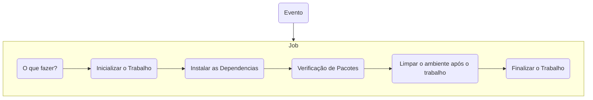
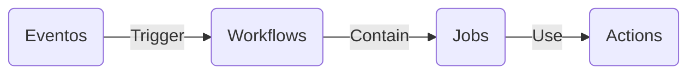

`A automação é boa, desde que você saiba exatamente onde coloca-la`.

A Implantação Contínua (CD) está revolucionando a maneira como os desenvolvedores pensam e agem, e se você está ansioso para elevar seu jogo de codificação, este guia é para você! 

## Automação: O Coração da Implantação
Automação não é apenas uma opção; é uma necessidade no mundo do CD. Ao automatizar tarefas, os desenvolvedores liberam tempo, reduzem erros e aumentam a consistência. 
## Colaboração: Todos a postos
Trabalhar em conjunto não é bom apenas para o moral, é crucial para o sucesso do CD. 
## Monitoramento e Feedback: Olhos no Processo
O monitoramento contínuo é essencial para detectar quaisquer problemas precocemente e aprender com eles.
## Teste: Não há espaço para erros
O teste é uma fase crucial que garante a qualidade e a confiabilidade do produto.
## Segurança e conformidade: seguro e sólido
Na era das ameaças cibernéticas, garantir a segurança e a conformidade do seu aplicativo é uma prioridade.
## Adotando uma cultura de aprendizagem e melhoria: cresça com o fluxo
A Implantação Contínua é uma jornada, não apenas um processo. 

## GitHub Actions
- [x] GitHub Actions refere-se a toda a plataforma e ecossistema para criar e executar fluxos de trabalho automatizados dentro do ambiente GitHub;
- [x] Uma ação é um script invocado de dentro de um fluxo de trabalho;
- [x] GitHub Actions é uma plataforma de integração contínua e entrega contínua (CI/CD) que permite automatizar a sua compilação, testar e pipeline de implantação.
- [x] Oferecem três sabores de ambientes virtuais: Ubuntu, macOS e Windows.
- [x] Os runners vêm com uma variedade de softwares e ferramentas pré-instalados comumente usados no
desenvolvimento de software.

```mermaid
flowchart
EVE(Evento) --> Job(JOB)
subgraph Job
  A1(O que fazer?) --> A2(Inicializar o Trabalho)
  A2               --> A3(Instalar as Dependencias)
  A3               --> A4(Verificação de Pacotes)
  A4               --> A5(Limpar o ambiente após o trabalho)
  A5               --> A6(Finalizar o Trabalho)
end
```

- [x] O principal mecanismo de automação no GitHub.
- [x] As actions são o mecanismo usado para fornecer automação de fluxo de trabalho dentro do ambiente GitHub.

```mermaid
flowchart LR
    A(Eventos) -->|Trigger| B(Workflows)
    B          -->|Contain|C(Jobs)
    C          -->|Use| D(Actions)
```

### Workflow 
Um fluxo de trabalho é um processo automatizado configurável que executará um ou mais trabalhos.
Os fluxos de trabalho são definidos no diretório .github/workflows
Um workflow é processo bem-definido que será executado no repositório ao qual ele pertence
Ele é definido a partir de um arquivo YAML dentro da pasta .github/workflows
É comum definir workflows para testagem de pacotes, geração de documentação, atualização de dados, etc.
O workflow é, essencialmente, um duende mágico que baixa o nosso repositório em um servidor do GitHub e executa os comandos especificados

### Eventos

Um evento é uma atividade específica em um repositório que dispara a execução de um fluxo de trabalho.
uma atividade pode originar-se de GitHub quando alguém cria uma solicitação de pull request, abre um problema ou faz envio por push de um commit para um repositório ou agendamentos.
Eventos: Um evento é uma atividade que aciona um fluxo de trabalho. Por exemplo:
Quando o repositório recebe uma alteração (on: push)
Quando um Pull Request é criado (em outras palavras, alguém está enviando uma contribuição para o repositório) (on: pull_request)

Eventos programados. Ex: a cada hora, todos os dias, uma vez por semana, uma vez por mês, etc. O site CronTab é muito útil para isso.
Use a chave `on` para especificar os eventos que disparam o fluxo de trabalho.
- Unico: on: push
- Usando eventos múltiplos:  on: [push, fork]
- Usando tipos de atividade e filtros com vários eventos
- push,pull_request,issues,release,fork,star,status,

| **Evento**                | **Descrição**                                                       | **Exemplo**                                                     |
|---------------------------|---------------------------------------------------------------------|-----------------------------------------------------------------|
| `push`                    | Disparado quando há um push de código para o repositório.           | `on: push`                                                      |
| `pull_request`            | Disparado quando uma pull request é aberta, fechada ou sincronizada. | `on: pull_request`                                              |
| `issues`                  | Disparado quando uma issue é aberta, editada ou fechada.            | `on: issues`                                                    |
| `issue_comment`           | Disparado quando um comentário é feito em uma issue ou PR.          | `on: issue_comment`                                             |
| `release`                 | Disparado quando uma release é criada, publicada ou deletada.       | `on: release`                                                   |
| `fork`                    | Disparado quando um repositório é bifurcado (forked).               | `on: fork`                                                      |
| `star`                    | Disparado quando alguém dá ou retira uma estrela (star).            | `on: star`                                                      |
| `status`                  | Disparado quando o status de um commit muda (ex: CI).               | `on: status`                                                    |
| `workflow_run`            | Disparado quando a execução de outro workflow é concluída.         | `on: workflow_run`                                              |
| `watch`                   | Disparado quando um usuário começa ou para de "seguir" o repositório. | `on: watch`                                                     |
| `repository_dispatch`     | Disparado quando um evento externo envia um payload para o repositório. | `on: repository_dispatch`                                       |
| `schedule`                | Disparado de acordo com um cronograma (expressões cron).            | `on: schedule`                                                  |
| `workflow_dispatch`       | Disparado manualmente, com entradas personalizadas.                 | `on: workflow_dispatch`                                          |
| `label`                   | Disparado quando um rótulo (label) é adicionado ou removido.       | `on: label`                                                     |
| `milestone`               | Disparado quando um milestone é criado, fechado ou reaberto.       | `on: milestone`                                                 |
| `deployment`              | Disparado quando um deployment é criado ou atualizado.             | `on: deployment`                                                |
| `deployment_status`       | Disparado quando o status de um deployment muda (sucesso ou falha). | `on: deployment_status`                                         |
| `push` (tag)              | Disparado quando um tag é enviado para o repositório.              | `on: push: tags: ['v*.*.*']`                                    |
| `github_app`              | Disparado por ações de GitHub Apps no repositório.                 | `on: github_app`                                                |
| `secret_scanning_alert`   | Disparado quando um alerta de vazamento de segredo é gerado.       | `on: secret_scanning_alert`                                     |

### Job
Um job é um conjunto de etapas em um fluxo de trabalho executadas no mesmo executor.
Um evento aciona automaticamente o fluxo de trabalho, que contém um trabalho. Em seguida, o trabalho usa etapas para controlar a ordem em que as ações são executadas. 
O trabalho usa etapas para controlar a ordem em que as ações são executadas

### Actions
Uma ação é um aplicativo personalizado para a plataforma GitHub Actions que executa uma tarefa complexa, mas frequentemente repetida.

Types of GitHub Actions : 

- [x] Pushes: Trigger on any push 
- [x] Pull Requests: Trigger on PR events 
- [x] Issues: Trigger on issue activities 
- [x] Releases: Trigger on new releases 
- [x] Scheduled Events: Cron expressions for scheduling 
- [x] Manual Triggers: Trigger manually via GitHub UI/CLI

### Runners (Executores)
Um executor é um servidor que executa seus fluxos de trabalho quando eles são disparados. Cada executor pode executar um único trabalho por vez. GitHub fornece executores Ubuntu Linux, Microsoft Windows e macOS para executar seus fluxos de trabalho. 

Secrets (ou segredos, em português) são variáveis de ambiente que não podem ser compartilhadas com ninguém que não seja autorizado. São dados sigilosos, geralmente específicos de um contexto, por exemplo, de uma organização, um repositório, uma equipe… 

Exemplos de secrets:

- [x] O usuário e uma senha para acessar uma ferramenta;
- [x] A chave para consumir uma API;
- [x] Um token ou uma credencial de acesso; 
- [x] O número de um documento (CPF, Passaporte etc).

O Github Action é orientado por eventos, onde cada evento pode acionar (trigger) automaticamente um ou mais workflows. um workflow após cada push, pull request ou comentário, para uma branch específica ou para todas, e é customizável.

## JOB 
Um job é um conjunto de etapas em um fluxo de trabalho que são executadas no mesmo runner (um runner é um servidor que executa seus fluxos de trabalho quando acionado). Os fluxos de trabalho têm jobs, e os jobs têm etapas. Os passos são executados em ordem e são dependentes uns dos outros. Você adicionará etapas ao seu fluxo de trabalho mais adiante no curso. Para ler mais sobre jobs, consulte " Jobs".
    
Os trabalhos, por sua vez, são compostos de etapas. Uma etapa executa um comando shell ou invoca uma
ação predefinida do GitHub. Todas as etapas em um trabalho são executadas em um runner. O runner é um
servidor (virtual ou físico) ou um contêiner que foi configurado para entender como interagir com o GitHub

 gh workflow --repo https://github.com/horaciovasconcellos/estudo list

recipe_60pportunities_ghas_03_resumo.md