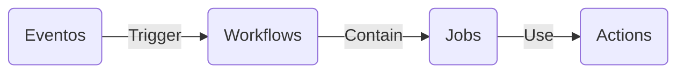
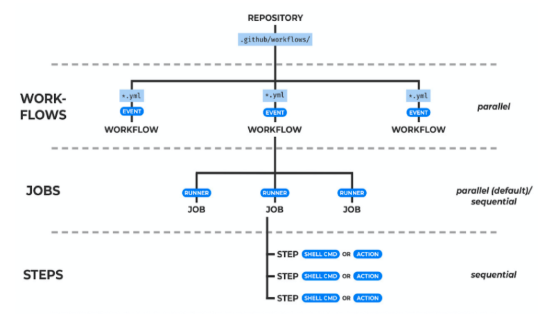

O principal mecanismo de automação no GitHub.As actions são o mecanismo usado para fornecer automação de fluxo de trabalho dentro do ambiente GitHub.

Secrets (ou segredos, em português) são variáveis de ambiente que não podem ser compartilhadas com ninguém que não seja autorizado. São dados sigilosos, geralmente específicos de um contexto, por exemplo, de uma organização, um repositório, uma equipe… 

Exemplos de secrets:

- [x] O usuário e uma senha para acessar uma ferramenta;
- [x] A chave para consumir uma API;
- [x] Um token ou uma credencial de acesso; 
- [x] O número de um documento (CPF, Passaporte etc).
