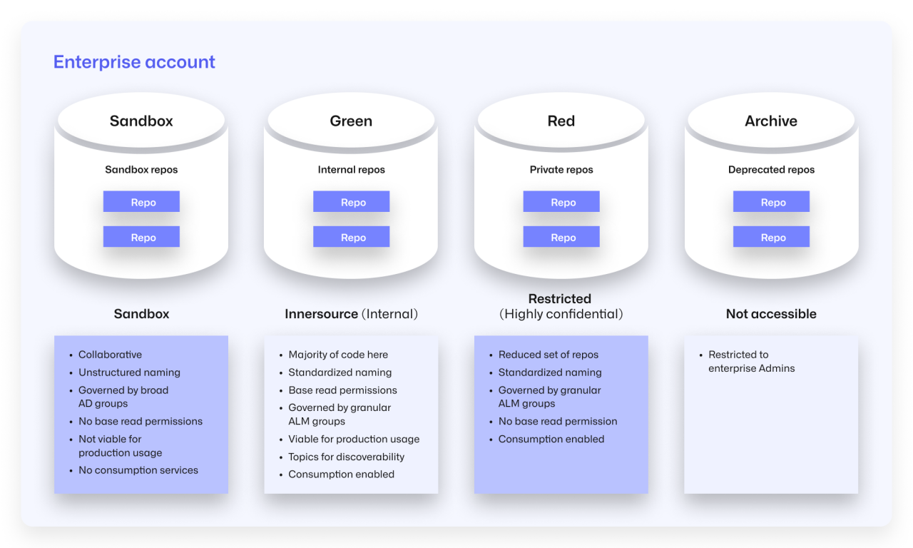
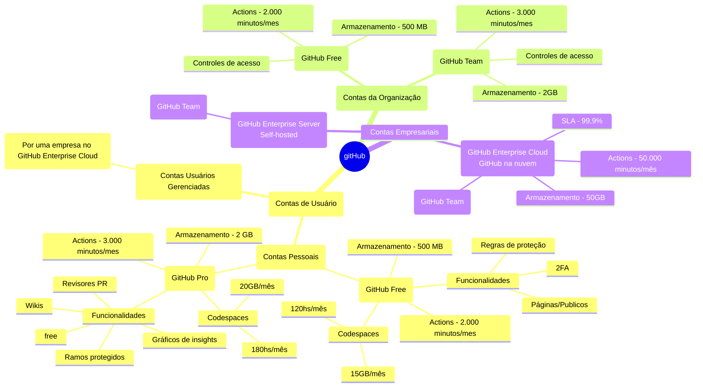

Para começar a usar o GitHub, será necessário criar uma conta pessoal gratuita e verificar o seu endereço de email.

- [x] Acessando o Site: Primeiro, vá até o site do [GitHub](https://github.com).
- [x] Criando uma Conta: Na página inicial, você verá um botão que diz "Sign up" (Inscrever-se). Clique nele para iniciar o processo de registro.
- [x] Preenchendo os Dados: Você precisará fornecer algumas informações básicas:
      - [x] Username (Nome de usuário): Escolha um nome de usuário que você gostaria de usar. Este será seu identificador no GitHub.
      - [x] Email: Insira um endereço de e-mail válido, pois você precisará confirmá-lo para ativar sua conta.
      - [x] Password (Senha): Crie uma senha forte para proteger sua conta.
- [x] Verificação de Segurança: O GitHub pode pedir que você complete um captcha para verificar que você não é um robô.

| Tipo de Conta | Entenda |
| -----         | -----   |
| [Pessoais](https://docs.github.com/pt/get-started/learning-about-github/types-of-github-accounts#user-accounts) | Todas as pessoas que utilizam o GitHub.com se conectam a uma conta pessoal (às vezes chamada de conta de usuário). como criar um problema ou revisar uma solicitação de pull, são atribuídas à sua conta pessoal. Cada conta pessoal utiliza o GitHub Free ou o GitHub Pro. GitHub Free, os repositórios privados pertencentes a sua conta pessoal terão um conjunto limitado de recursos. |
|               | Conta pessoal usa o GitHub Free ou o GitHub Pro. Todas as contas pessoais podem ter um número ilimitado de repositórios públicos e privados, com um número ilimitado de colaboradores nesses repositórios. |
| [Organização](https://docs.github.com/pt/get-started/learning-about-github/types-of-github-accounts#personal-accounts) | São contas compartilhadas em que um número ilimitado de pessoas pode colaborar em vários projetos uma vez. As organizações podem ser proprietárias de recursos como repositórios, pacotes e projetos. **Você não pode entrar em uma organização**. A pessoa toma sobre os recursos da organização são atribuídas à sua conta pessoal. Cada conta pessoal pode ser um integrante de múltiplas organizações. **Somente os proprietários da organização e os gerenciadores de segurança** podem gerenciar as configurações da organização e controlar o acesso aos dados da organização. |
| [Corporativa](https://docs.github.com/pt/get-started/learning-about-github/types-of-github-accounts#-data-variablesenterpriseprodname_managed_users_caps-) | Permitem que os administradores gerenciem de forma **centralizada as políticas e a cobrança para várias organizações e habilitem o fornecimento interno entre suas organizações**. Uma conta corporativa deve ter um identificador, como uma organização ou conta de usuário no GitHub. Nas configurações da conta corporativa, **os proprietários da empresa podem convidar organizações existentes para ingressar em sua conta corporativa**, transferir organizações entre contas corporativas ou criar organizações.|     

 

- [x] [Entenda Mais sobre Tipo de Conta](https://learn.microsoft.com/pt-br/training/modules/github-introduction-products/2-what-are-github-products)
- [x] [Geração de Octocat - Imagem](https://myoctocat.com/build-your-octocat/)

## Planos
- [x] GitHub Free para contas pessoais e organizações: 
      - [ ] Conta de usuário pessoal. Uma conta de usuário pessoal inclui repositórios públicos e privados ilimitados e colaboradores ilimitados. Controles de acesso da equipe para gerenciamento de grupos;
- [x] GitHub Pro para contas pessoais;
- [x] GitHub para equipes (Team);
- [x] GitHub Enterprise;
      - [x] Modelo 1: Organização única: Neste modelo, uma única organização é usada para todos ou para a grande maioria dos repositórios. Muitas organizações de pequeno e médio porte (menos de 5.000 desenvolvedores) usam essa abordagem para gerenciar seu ambiente GitHub.
      - [ ] Modelo 2: Red-green-sandbox-archive
      - [ ] Modelo 3: Portfólio de empresa

| TIPO | | Funcionalidade |
| ----- | | ------------ |
| Gratuito | | O básico para indivíduos e organizações |
| | | O$ USD por usuário/mês |
| | | Crie uma organização gratuita |
| | Repositórios públicos/privados ilimitados | Hospede projetos de código aberto em repositórios públicos do GitHub, acessíveis via web ou linha de comando. Os repositórios públicos são acessíveis a qualquer pessoa no GitHub.com. |
| | Atualizações automáticas de segurança e versão | Mantenha os projetos seguros abrindo automaticamente solicitações de pull que atualizam dependências vulneráveis ​​para versões seguras e atualizam dependências desatualizadas. |
| | 2.000 minutos de CI/CD/mês | Gratuito para repositórios públicos |
| | | Use minutos de execução com GitHub Actions para automatizar seus fluxos de trabalho de desenvolvimento de software. Escreva tarefas e combine-as para criar, testar e implantar qualquer projeto de código no GitHub. |
| | 500 MB de armazenamento de pacotes | Gratuito para repositórios públicos |
| | | Hospede seus próprios pacotes de software ou use-os como dependências em outros projetos. Hospedagem privada e pública disponíveis. |
| |Problemas e Projetos | Dê aos seus desenvolvedores recursos flexíveis para gerenciamento de projetos que se adaptam a qualquer equipe, projeto e fluxo de trabalho - tudo junto com seu código. |
| | Suporte da comunidade | Obtenha ajuda com a maioria das suas perguntas e problemas do GitHub em nosso Fórum da Comunidade. |
| | ADD-ONS EM DESTAQUE | |
| | GitHub Copilot Access | Com o GitHub Copilot, obtenha sugestões para linhas inteiras ou funções inteiras - direto no seu editor. |
| | GitHub Codespaces Access | Com o GitHub Codespaces, obtenha um ambiente de desenvolvimento instantâneo na nuvem, para que você possa codificar em qualquer lugar e em qualquer dispositivo. |
| Equipe | | Colaboração avançada para indivíduos e organizações |
|        | | US$ 4 por usuário/mês |
| | Acesso ao GitHub Codespaces | Ambientes de desenvolvedor em nuvem extremamente rápidos com computação flexível e contêineres pré-configurados, os desenvolvedores podem codificar, colaborar e depurar de qualquer navegador. Pague apenas pelo que usar, com taxas de computação a partir de US$ 0,18/hora e taxas de armazenamento de US$ 0,07/GB por mês. |
| | Ramos protegidos | Aplique restrições sobre como os ramos de código são mesclados, incluindo a exigência de revisões por colaboradores selecionados ou permitindo que apenas colaboradores específicos trabalhem em um ramo específico. |
| | Vários revisores em solicitações de pull | Atribua vários usuários ou uma equipe para revisar uma solicitação de pull |
| | Rascunhe solicitações de pull | Discuta e colabore facilmente em solicitações de pull antes de enviar para revisão formal.
| | Proprietários do código | Solicite revisões automaticamente ou exija aprovação de colaboradores selecionados quando forem feitas alterações em seções de código de sua propriedade. |
| | Revisores obrigatórios | Garanta que as solicitações de pull tenham um número específico de revisões de aprovação antes que os colaboradores possam fazer alterações em uma ramificação protegida. |
| | Páginas e wikis | Hospede documentação e sites simples para seu projeto em um formato wiki que os colaboradores podem editar facilmente na web ou na linha de comando.|
| | Ramificações e segredos de implantação de ambiente | Um trabalho não pode acessar segredos definidos em um ambiente, a menos que esteja em execução na ramificação especificada. |
| | 3.000 minutos de CI/CD/mês | Gratuito para repositórios públicos |
| | | Use minutos de execução com o GitHub Actions para automatizar seus fluxos de trabalho de desenvolvimento de software. Escreva tarefas e combine-as para criar, testar e implantar qualquer projeto de código no GitHub. |
| | 2 GB de armazenamento de pacotes | Gratuito para repositórios públicos |
| | | Hospede seus próprios pacotes de software ou use-os como dependências em outros projetos. Hospedagem privada e pública disponível. |
| | Suporte baseado na web | O suporte do GitHub pode ajudar você a solucionar problemas que você encontrar ao usar o GitHub. |
| Enterprise | | Segurança, conformidade e implantação flexível |
| || 21 USD por usuário/mês |
| | | Tudo incluso no Team, mais... |
| | Usuários gerenciados pelo Enterprise | Tenha e controle as contas de usuário dos membros do seu Enterprise por meio do seu provedor de identidade (IDP). |
| | Provisionamento de usuários por meio do SCIM | Convide membros automaticamente para ingressar na sua organização ao conceder acesso no seu IdP. Se você remover o acesso de um membro à sua organização do GitHub no seu IdP SAML, o membro será removido automaticamente da organização do GitHub. |
| | Conta Enterprise para gerenciar centralmente várias organizações | O GitHub Enterprise Cloud inclui a opção de criar uma conta Enterprise, que permite a colaboração entre várias organizações, fornece aos administradores um único ponto de visibilidade e gerenciamento e traz economia de custos de licença para usuários idênticos em várias organizações. |
| | Regras de proteção do ambiente | Quando um trabalho de fluxo de trabalho faz referência a um ambiente, o trabalho não será iniciado até que todas as regras de proteção do ambiente sejam aprovadas. |
| | Regras de repositório | Aplique restrições de ramificação e tag em toda a sua organização, garantindo a proteção de ramificação e tag em todos os seus repositórios. Avalie as regras para avaliar o impacto antes da aplicação. |
| | API de log de auditoria | Como administrador de uma organização do GitHub Enterprise Cloud, agora você pode acessar eventos de log usando nossa API GraphQL e monitorar a atividade em sua organização. |
| | Relatórios SOC1, SOC2, tipo 2 anualmente | O GitHub oferece relatórios AICPA System and Organization Controls (SOC) 1 Tipo 2 e SOC 2 Tipo 2 com IAASB International Standards on Assurance Engagements, ISAE 3000 e ISAE 3402. |
| | FedRAMP Tailored Authority to Operate (ATO) | Usuários governamentais podem hospedar projetos no GitHub Enterprise Cloud com a confiança de que nossa plataforma atende à linha de base de software como serviço (SaaS) de baixo impacto dos padrões de segurança definidos por nossos parceiros do governo federal dos EUA. |
| | Logon único SAML | Use um provedor de identidade para gerenciar as identidades de usuários e aplicativos do GitHub. |
| | Auditoria avançada | Revise rapidamente as ações realizadas por membros da sua organização. Mantenha cópias dos dados do log de auditoria para garantir um IP seguro e manter a conformidade da sua organização. |
| | GitHub Connect | Compartilhe recursos e fluxos de trabalho entre sua instância do GitHub Enterprise Server e o GitHub Enterprise Cloud. |
| | 50.000 minutos de CI/CD/mês | Gratuito para repositórios públicos |
| | | Use minutos de execução com o GitHub Actions para automatizar seus fluxos de trabalho de desenvolvimento de software. Escreva tarefas e combine-as para criar, testar e implantar qualquer projeto de código no GitHub. |
| | 50 GB de armazenamento de pacotes | Gratuito para repositórios públicos |
| | | Hospede seus próprios pacotes de software ou use-os como dependências em outros projetos. Hospedagem privada e pública disponíveis. |
| | COMPLEMENTOS EXCLUSIVOS | |
| | GitHub Advanced Security | Encontre e corrija vulnerabilidades automaticamente antes que elas sejam colocadas em produção. Seja notificado se seus segredos forem expostos em sua base de código. |
| | Suporte Premium | Com o Premium, obtenha um SLA de 30 minutos em tickets urgentes e suporte 24 horas por dia, 7 dias por semana, pela web e por telefone, por meio de solicitação de retorno de chamada. Com o Premium Plus, obtenha tudo o que há no Premium, um engenheiro de confiabilidade do cliente designado e muito mais. Saiba mais sobre o Suporte Premium |

## Permissões de acesso no GitHub
Uma permissão é a capacidade de executar uma ação específica. uma pessoa deve ter acesso suficiente à conta ou recurso relevante. 

| Tipo e Conta    | Entenda |
| -----           | ----    |
| Pessoais        | O proprietário do repositório e os colaboradores.                    |
|                 | Settings --> Opções de moderação --> clique em Limites de interação. |
|  Organização    | Os membros roles/funções de proprietário , gerente de cobrança ou membro. |
|  Empresariais   | Os proprietários corporativos têm poder máximo sobre a conta corporativa. |
|                 | Os gerentes de cobrança podem gerenciar as configurações de cobrança da sua conta corporativa. |

|                 |          |                                     | Repositorios |        |            |       | Issue/PR  |          |           |
|----             | ----     | ----                                | ----         | -----  |  ----      | ----  | ----      | ----     | ----      |
|                 |          | Limite                              | Ler          | Clonar | Enviar     | Confg | Abrir     | Comentar | Gerenciar |
| Pessoais        |          | Usuario, Contribuinte e Colaborador |              |        |            |       |           |          |           |   
| Organização     | Read     |                                     |  X           |    X   |            |       |   X       | X        |           |
|                 | Triage   |                                     |  X           |    X   |            |       |   X       | X        |     X     |
|                 | Write    |                                     |  X           |    X   |  X         |       |   X       | X        |     X     |
|                 | Maintain |                                     |  X           |    X   |  X         |  x    |   X       | X        |     X     |
|                 | Admin    |                                     |  X           |    X   |  X         |  X    |   X       | X        |     X     |

[Leia-me](https://learn.microsoft.com/pt-br/training/modules/github-introduction-products/2-what-are-github-products)

| Tipo de Conta | GitHub Free                                                  | GitHub Pro                                                |
| -----         | -----                                                        | -----                                                     |
| Pessoal       | Suporte da Comunidade GitHub                                 | Suporte do GitHub por e-mail                              |
|               | Alertas Dependabot                                           | 3.000 minutos de GitHub Actions por mês                   |
|               | Regras de proteção de implantação para repositórios públicos |                                                           |
|               | Aplicação de autenticação de dois fatores                    |                                                           |
|               | 500 MB de armazenamento de pacotes do GitHub                 | 2 GB de armazenamento de pacotes do GitHub                |
|               | 120 horas de núcleo do GitHub Codespaces por mês             | 180 horas de núcleo do GitHub Codespaces por mês          |
|               | 15 GB de armazenamento GitHub Codespaces por mês             |  20 GB de armazenamento GitHub Codespaces por mês         |
|               | Recursos do GitHub Actions:                                  | Ferramentas e insights avançados em repositórios privados:|
|               | 2.000 minutos por mês                                        |  Revisores de solicitação de pull necessários             |
|               | Regras de proteção de implantação para repositórios públicos | Vários revisores de solicitação de pull,Ramos protegidos,Proprietários do código,Referências vinculadas automaticamente.|
|               | Páginas do GitHub em repositórios públicos                   |  Páginas do GitHub                                        |
|               |                                                              | Wikis                                                     |
|               |                                                              | Gráficos de insights do repositório: pulso, colaboradores, tráfego, confirmações, frequência de código, rede e bifurcações |
| Organização   | = Pessoal Conta                                              |                                                           |
|               | Suporte da Comunidade GitHub                                 |                                                           |
|               | Controles de acesso de equipe para gerenciamento de grupos   |                                                           |
|               | 2.000 minutos de GitHub Actions por mês                      |                                                           |
|               | 500 MB de armazenamento de pacotes do GitHub                 |                                                           |
|               | = GitHub Team                                                | GitHub Free for organizations, GitHub Team includes       |
|               | GitHub Support via email                                     |                                                           |
|               | 3,000 GitHub Actions minutes per month                       |                                                           |
|               | 2 GB GitHub Packages storage                                 |    |
|               | Advanced tools and insights in private repositories: Required pull request reviewers,Multiple pull request reviewers,Draft pull requests,Team pull request reviewers,Protected branches,Code owners, Scheduled reminders,GitHub Page, Wikis |  |
|               | GitHub Enterprise                                            | GitHub Enterprise Cloud ou GitHub Enterprise Server |
|               |  GitHub Enterprise Support                                   |                                                           |
|               |  Additional security, compliance, and deployment controls    |                                                           |
|               |  Authentication with SAML single sign-on                     |                                                           |
|               |  Access provisioning with SAML or SCIM                       |                                                           |
|               |  Deployment protection rules with GitHub Actions for private or internal repositories|                                   |
|               |  GitHub Connect                                              |                                                           |
|               |  GitHub Enterprise Cloud specifically includes:              |                                                           |
|               |  50,000 GitHub Actions minutes per month                     |                                                           |
|               |  Included minutes can be used with standard GitHub-hosted runners only. |                                                |
|               |  50 GB GitHub Packages storage                               |                                                           |
|               |  A service level agreement for 99.9% monthly uptime               |                                                      |  

### Cobrança do GitHub
 GitHub cobra separadamente por cada conta. Você recebe uma fatura separada para sua conta pessoal e para cada conta corporativa ou de organização que você possui. A cobrança de cada conta é uma combinação de cobranças:

 - [x] **Assinaturas** : GitHub Pro ou o GitHub Team, como o GitHub Copilot e aplicativos do GitHub Marketplace.
 - [x] **A cobrança baseada no uso**: depende de quantos minutos seus trabalhos passam em execução e da quantidade de armazenamento que seus artefatos utilizam.

### Perfil
Perfil conta a história do seu trabalho por meio de repositórios nos quais você está interessado, das contribuições que fez e das conversas que teve.
Personalização do Perfil: Você pode personalizar seu perfil adicionando uma foto, um link para seu site pessoal ou portfólio e outros detalhes que ajudem a apresentar seu trabalho e interesses.

Existem três tipos de contas do GitHub: Pessoal, Organizacional, Empresarial

| Tipo      | Entenda |
| --------- | -------------- |
| Contas Pessoais | São contas individuais com um nome de usuário e perfil. |
| | Elas podem possuir recursos como repositórios e projetos, e as ações tomadas são atribuídas à conta pessoal. |
| | Elas podem usar o GitHub Free ou o GitHub Pro. |
| Contas Organizacionais | Contas compartilhadas onde várias pessoas colaboram em projetos. |
| | Elas também podem possuir recursos como repositórios, mas são gerenciadas por meio de contas pessoais individuais. |
| | As organizações oferecem diferentes funções com vários níveis de acesso e vêm com recursos de segurança. |
| Contas Empresariais | Parte do GitHub Enterprise Cloud and Server, essas contas permitem o gerenciamento central de várias organizações. |
| | Elas são voltadas para configurações maiores que precisam de gerenciamento centralizado de políticas e cobranças. |

## GitHub Free vs Pro

| GitHub Free                                         | GitHub Pro                                 |
| -----------                                         | ---------                                  |
| GitHub Community Support                            | Everything from GitHub FREE and....        |
| Dependabot alerts                                   | GitHub Support via email                   |
| Deployment protection rules for public repositories | 3,000 GitHub Actions minutes per month     |
| Two-factor authentication enforcement               | 2 GB GitHub Packages storage               |
| 500 MB GitHub Packages storage                      | 180 GitHub Codespaces core hours per month | 
| 120 GitHub Codespaces core hours per month          | 20 GB GitHub Codespaces storage per month  |
| 15 GB GitHub Codespaces storage per month           | Advanced tools and insights in private repositories: |
| GitHub Actions features:                            | Required pull request reviewers            |
| 2,000 minutes per month                             | Multiple pull request reviewers            |
| Deployment protection rules for public repositories | Protected branches                         |
|                                                     | Code owners                                |
|                                                     | Auto-linked references                     |
|                                                     | GitHub Pages                               |
|                                                     | Wikis                                      |
|                                                     | Repository insights graphs                 |

## GitHub Organizations Plans
Github Organizations has three plans: Free, Teams and *Enterprise*.

|  FREE                           | Teams                          |
| -----------                     | --------                       |
| Everything from GitHub FREE and....      | Everything from GitHub Organizations FREE and... |
| Team access controls for managing groups | GitHub Support via email                         |
| 2,000 GitHub Actions minutes per month   | 3,000 GitHub Actions minutes per month           |
| 500 MB GitHub Packages storage           | 2 GB GitHub Packages storage                     |
|                                          | Advanced tools and insights in private repositories |
|                                          | Required pull request reviewers |
|                                          | Multiple pull request reviewers |
|                                          | Draft pull requests |
|                                          | Team pull request reviewers |
|                                          | Protected branches |
|                                          | Code owners |
|                                          | Scheduled reminders |
|                                          | GitHub Pages |
|                                          | Wikis |
|                                          | Repository insights graphs |
|                                          | The option to enable or disable GitHub Codespaces |

## GitHub Enterprise Deployments Options

- [x] GitHub Enterprise includes two deployment options GitHub Enterprise Cloud (hosted on GitHub.com) 
- [x] GitHub Enterprise Server (self-hosted)

| GitHub Enterprise (both Cloud and Server)   | GitHub Enterprise Cloud (specific features) |
| ----                                        | ----          |
| Everything from GitHub Organizations Team   | 50,000 GitHub Actions minutes per month |
| GitHub Enterprise Support                   |  50 GB GitHub Packages storage |
| Additional security, compliance, and deployment controls  | A service level agreement for 99.9% monthly uptime  |
| Authentication with SAML single sign-on  | option to centrally manage policy and billing for multiple GitHub.com organizations with an enterprise account. |
| Access provisioning with SAML or SCIM   | option to provision and manage the user accounts for your developers, by using Enterprise Managed Users |
| Deployment protection rules with GitHub Actions for private or internal repositories   |  |
| GitHub Connect  | |
| option to purchase GitHub Advanced Security  | |
