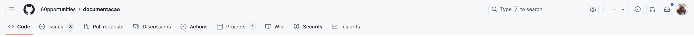
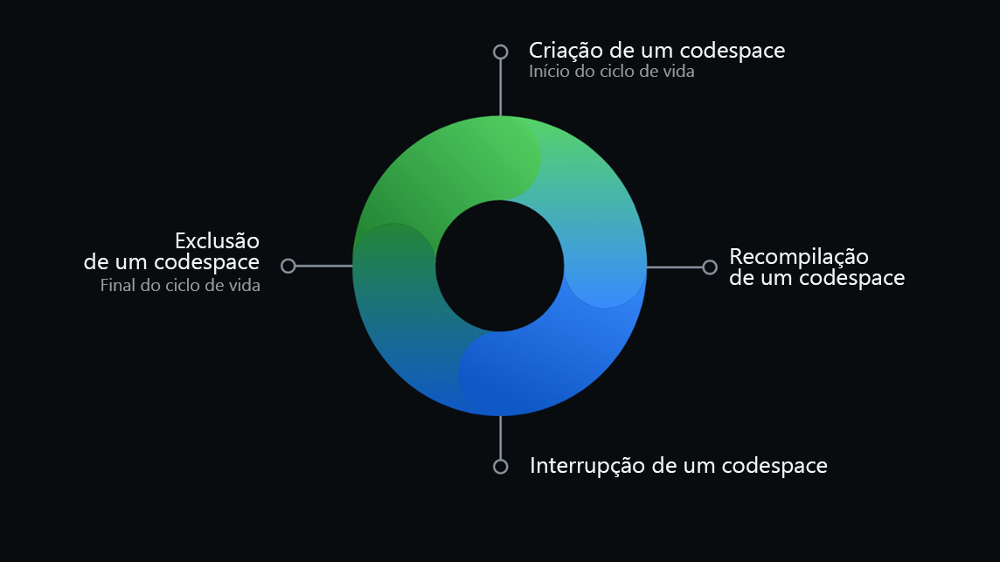
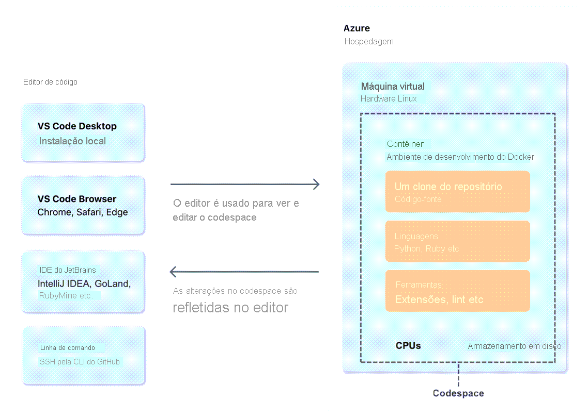
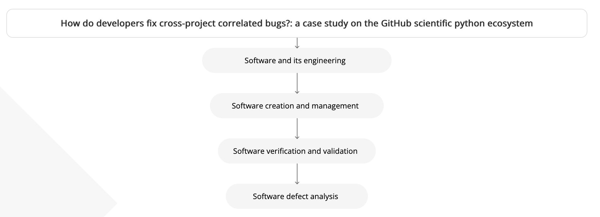
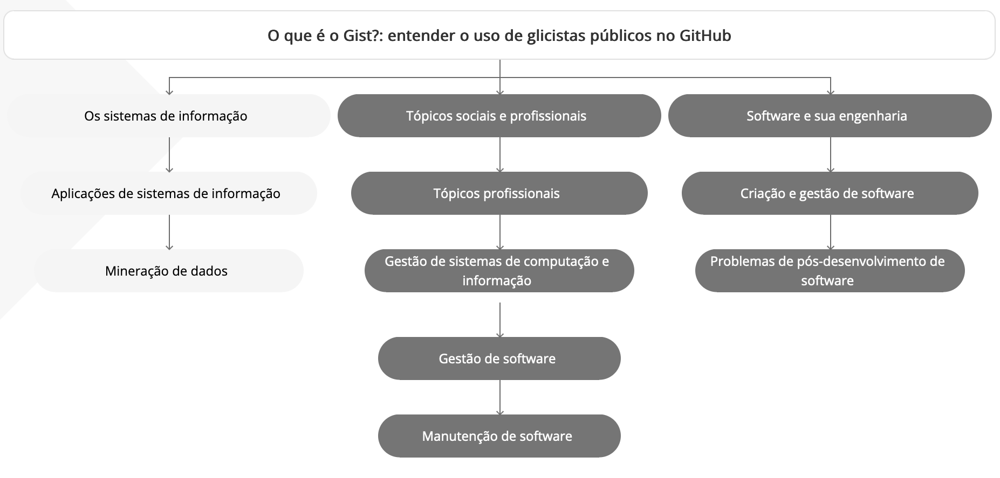
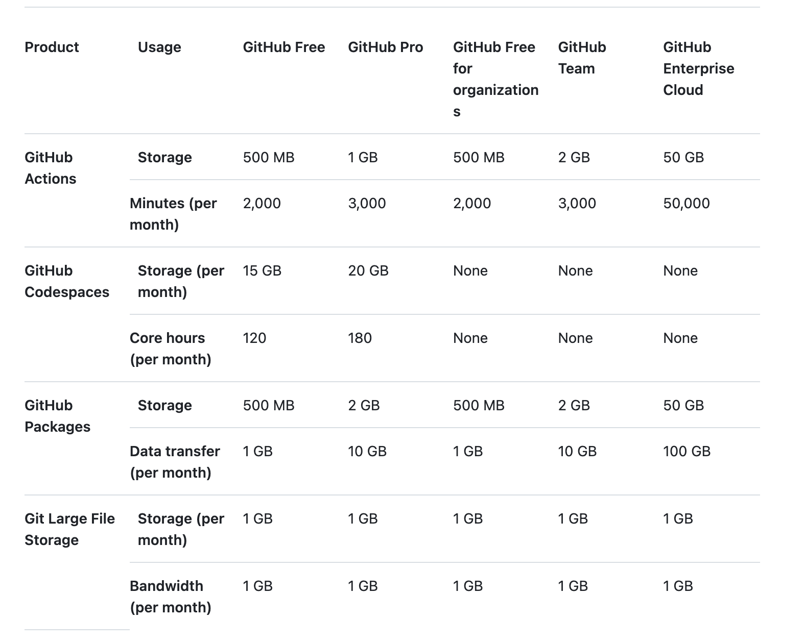
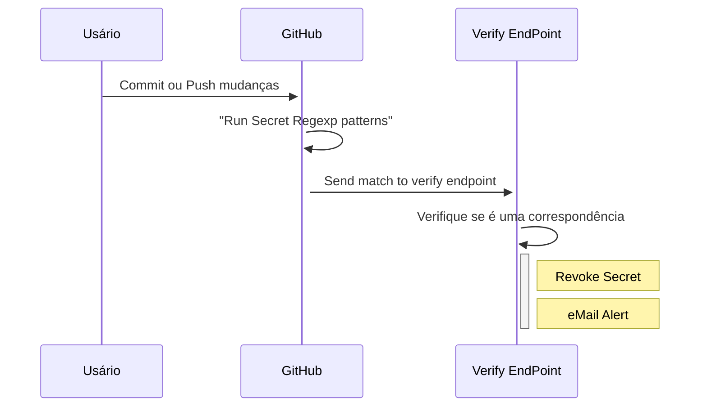
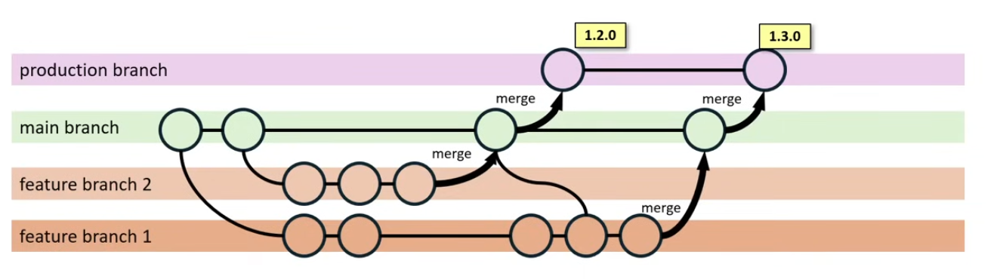
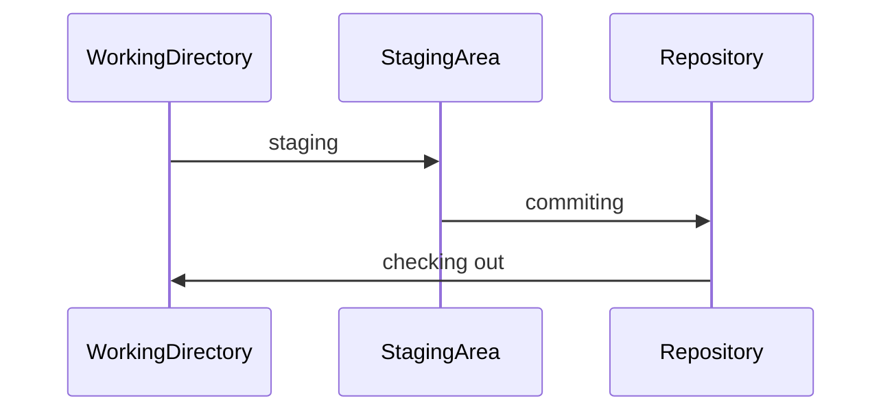
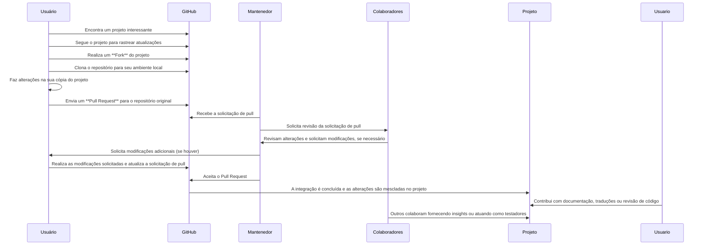

GitHub é uma plataforma popular para hospedagem e colaboração em projetos de programação, permitindo que desenvolvedores trabalhem juntos de forma eficaz, para iniciar o seu uso, crie uma [Conta](recipe_60pportunities_ghf_02_conta).
O GitHub foi criado em 2008 para hospedar projetos Git e agora é uma subsidiária da Microsoft. O GitHub não se limita a projetos de código aberto; empresas e desenvolvedores individuais podem criar repositórios privados acessíveis somente a eles.

## Como o Git e o GitHub funcionam juntos? 
<p align="justify">GitHub hospeda repositórios do Git e fornece aos desenvolvedores ferramentas para enviar um código melhor por meio das funcionalidades de linha de comando, problemas(discussões encadeadas), pull requests, revisão de código ou o uso de uma coleção de aplicativos grátis e para compra em GitHub Marketplace. </p>

<p align="justify">Ao enviar arquivos para o GitHub, você os armazenará em um "repositório Git". Isso significa que quando você fizer alterações (ou "commits") nos seus arquivos no GitHub, o Git começará automaticamente a rastrear e gerenciar suas alterações.</p>

|                   | Git                                               | GitHub                                                   |
| -----------       | ------------                                      | ------------                                             |
| Natureza          | Sistema de controle de versão distribuído (DVCS)  | Controle de versão como serviço (VCaaS)                  |
| Funcionalidade    | Gerencia o histórico do código-fonte              | Fornece armazenamento em nuvem para repositórios Git     |
| Acesso            | Instalação do sistema local                       | Acessado via interface da web                            |
| Escopo            | Gerenciamento de repositório local                | Colaboração online e hospedagem de repositório           |
| Colaboração       | Alterações locais, requer compartilhamento manual | Ferramentas integradas para colaboração (problemas, PRs) |
| Uso               | Interface de linha de comando                     |                                                          |
|                   | É um software     |  É um serviço |
|                   | É uma ferramenta de linha de comando | É uma interface gráfica |
|                   | É mantido pela Comunidade  | É mantido pela Microsoft |
|                   | É um sistema de controle de versão para gerenciar o histórico do código fonte | É um serviço de hospedagem para repositórios GIT |

Os principais recursos fornecidos pelo GitHub incluem:
<div class="mdx-columns3" markdown>
- [x] Issues;
- [x] Discussões;
- [x] Pull Request;
- [x] Notificações;
- [x] Labels;
- [x] Actions;
- [x] Branch;
- [x] Projetos;
</div>

### Configuração Básica - GitHub
Você pode acessar Repositórios Remotos no GitHub a partir da linha de comando de duas maneiras: HTTPS e SSH.
O HTTPS usa nome de usuário e PAT (Personal Access Token) como uma abordagem de verificação de conta.

- [x] HTTPS é considerado mais rápido que SSH e você geralmente pode trabalhar com todos os repositórios no GitHub via HTTPS, mesmo se estiver atrás de um firewall ou proxy.
- [x] O SSH usa um par de chaves secretas e públicas. Você precisa gerar um par de chaves e carregar a chave pública no site da conta do GitHub.
#### SSH (Secure Shell)
- [x] Gerar e Adicionar Chaves SSH: Crie um par de chaves SSH (pública e privada) e adicione a chave pública ao seu perfil no GitHub.
- [x] Isso permite uma conexão segura sem precisar inserir sua senha a cada operação1
- [x] Proteger a Chave Privada: Mantenha sua chave privada em segredo e protegida por uma senha adicional1
- [x] Não compartilhe sua chave privada com ninguém1
- [x] Usar SSH Agent: Adicione sua chave SSH ao SSH agent para facilitar a gestão das chaves e evitar a necessidade de inserir a senha manualmente.
- [x] Para estabelecer uma conexão SSH, você precisa de um par de chaves SSH (uma chave privada e uma chave pública) e carregar a chave pública na plataforma GitHub.
- [x] `ssh-keygen -t ed25519 -C "seu endereço de e-mail"`(GitHub recomaneda)
- [ ] `ssh-keygen -t rsa -b 4096 -C "seu endereço de e-mail"`
- [x] Quando o comando é executado, os arquivos das chaves pública e privada são gerados sob o diretório .ssh sob seu diretório home de usuário.
- [x] Imagem --> Settings --> SSH and GPG keys
- [ ] Para testar a conexão, use: `ssh -T git@github.com`

```
The authenticity of host 'github.com (20.201.28.151)' can't be established.
ED25519 key fingerprint is SHA256:+DiY3wvvV6TuJJhbpZisF/zLDA0zPMSvHdkr4UvCOqU.
This key is not known by any other names.
Are you sure you want to continue connecting (yes/no/[fingerprint])? yes
Warning: Permanently added 'github.com' (ED25519) to the list of known hosts.
Hi horaciovasconcellos! You've successfully authenticated, but GitHub does not provide shell access.
```
#### GPG (GNU Privacy Guard)
- [x] Gerar e Adicionar Chaves GPG: Crie um par de chaves GPG (pública e privada) e adicione a chave pública ao seu perfil no GitHub;
- [x] Assinar Commits e Tags: Configure seu Git para assinar commits e tags com sua chave GPG;
- [x] Isso garante a integridade e autenticidade dos seus commits;
- [x] Proteger a Chave Privada: Assim como com SSH, mantenha sua chave privada em segredo e protegida por uma senha adicional;
- [x] O GPG usa o método de chaves pública e privada (secreta) para assegurar a transferência de informações entre pares. 

```
gpg --list-keys
gpg --delete-secret-keys 9866D9A3416A4D889A5AC9F7D408E252533D5692
gpg --delete-keys 9866D9A3416A4D889A5AC9F7D408E252533D5692
gpg --default-new-key-algo rsa4096 --gen-key
gpg --list-secret-keys --keyid-format=long
gpg --armor --export C67812FF37F0AD86
git config --global gpg.program gpg2
```

- [x] Imagem --> Settings --> SSH and GPG keys

#### Personal Access Tokens (PATs)
Existem dois tipos de PAT: Tokens (clássico) e tokens refinados (versão beta em setembro de 2023).

- [x] Imagem --> Settings --> Developer Settings --> Tokens (Use token refinados)

PAT é usado quando você estabelece uma conexão HTTPS com seu Repositório Remoto. 
Através dos comandos: `git clone, git remote, git push e git pull`.

- [x] Criar e Usar PATs: Crie tokens de acesso pessoal no GitHub para substituir senhas ao autenticar-se em APIs e na linha de comando;
- [x] Defina permissões mínimas necessárias para a tarefa em questão;
- [x] Tratar PATs como Senhas: Sempre trate seus PATs como senhas e nunca compartilhe com ninguém;
- [x] Rotacione regularmente e remova tokens que não são mais necessários.
- [X] GitHub possuoi dois tipos de PATs: 
      - [x] Tokens clássicos: Eles são menos seguros e não são mais recomendados para uso. Clientes com sistemas legados podem ainda estar usando token clássico
      - [x] Tokens de acesso pessoal refinados: Concederam permissões específicas. Deve ter uma data de expiração, pode acessar apenas repositórios específicos, pode acessar apenas recursos de propriedade de um único usuário ou organização.

### Criação das Chaves

| Como                   | Entenda |
| ----                   | ------- |
| ssh                    | ssh-keygen -t ed25519 -C "horacio.vasconcellos@gmail.com"                           |
|                        | Copia da chave Pública - pbcopy < ~/.ssh/id_ed25519.pub                     |
|                        | settings --> SSH keys --> New Key --> Titulo --> Adicionar                  |
| gh                     | Github CLI - gh auth login -w                                               |
| git-credential-manager | git config --global credential.helper manager                               |
|                        | git config --global credential.microsoft.visualstudio.com.interactive never |
|                        | git config --global credential.helper osxkeychain  --replace-all            |

### Navegação Básica.

Dentro de um repositório do Github, você terá uma barra de navegação para os vários recursos do seu repositório do GitHub:

* Código: A aba principal onde o código-fonte, arquivos e pastas do repositório estão localizados.
* Problemas: Rastreia problemas ou ideias para o projeto, permitindo colaboração e discussão.
* Solicitações de pull: Usadas para gerenciar contribuições de outros usuários, permitindo revisão de código e discussão antes de mesclar alterações.
* Discussões: É um fórum aberto para conversa entre mantenedores e a comunidade de um projeto no GitHub.
* Ações: Gerencia fluxos de trabalho de integração contínua e implantação contínua (CI/CD).
* Projetos: Um quadro para organizar e priorizar o trabalho, semelhante ao kanban ou quadros de gerenciamento de tarefas. (Table, Board ou Roadmap)
* Wiki: Um espaço para a documentação do projeto.
* Segurança: Apresenta recursos relacionados à segurança, incluindo políticas de segurança e relatórios de vulnerabilidade.
* Insights: Fornece estatísticas e insights sobre a atividade e as contribuições do projeto.
* Configurações: Contém configurações do repositório, incluindo controles de acesso, webhooks e outras configurações

## Ferramentas GitHub

|                 | GitHub.com                          | github.dev                           | Codespaces                                         | GitHub Desktop               | IDE ou Edito | GitHub CLI                                                 | GitHub API                                                                                               |
| ----            | ----                                | ----                                 | -----                                              | ----                         | -------      | ----                                                       | ----                                                                                                     |
| Acesso          | Browser                             |  Browser                             | Browser ou desktop                                 | Desktop                      |  Desktop     | Desktop                                                    | Browser ou desktop                                                                                       |
|                 | Mudanças Rápidas                    | Mudanças Complexas                   | Nuvem, Testes, Complexos                           | Local e interface visual Git | Um só lugar  | Git complexo que não está integrado em interfaces visuais. | Automatizar tarefas comuns, como fazer backup de seus dados, ou criar integrações que estendam o GitHub. | 
| Custo           | Ver contas                          | Gratuita	                           | Cota mensal gratuita de uso para contas pessoais.  |                              |              |                                                            |                                                                                                          |
| Disponibilidade | Todos com conta.                    | Todos com conta.                     | Todos com conta.                                   |                              |              |                                                            |                                                                                                          |
| Start           |                                     | Não configuração ou instalação.      | Container base em arquivo: `devcontainer.json`     |                              |              |                                                            |                                                                                                          |
| Computação      |                                     |                                      | VM dedicada                                        |                              |              |                                                            |                                                                                                          |
| Terminal access |                                     | Nenhum.                              | Você Terminal exatamente como faria local.         |                              |              |                                                            |                                                                                                          |
| Extensions      |                                     | Subconjunto de extensões             | Maioria das extensões do Visual Studio Code        |                              |              |                                                            |                                                                                                |

### Inspiração GitHub
Explore o GitHub para encontrar: repositórios, tópicos, códigos, pessoas e organizações.

| Você pode            | Valor                                                                                     | Sites |
| -----                | -----                                                                                     |  ---- |
| Estrela(Star)        | Repositório ou tópico para que você possa encontrá-lo facilmente mais tarde.              | https://github.com/explore ou https://github.com/stars |
| Follow (Siga)        | Pessoas ou organizações para que você possa se manter atualizado sobre suas atividades.   |
| Download             | Repositórios ou códigos,  personalize-os para seu próprio uso.                            |
| Contribua            | Para o projeto de outro usuário abrindo uma solicitação de pull.                          |

### Permissões de acesso
Uma permissão é a capacidade de executar uma ação específica. 

|  Tipo           | Permissão        | Ação
| -------         | ----------       | ----------                                            |
| Pessoal         | Proprietário     | não podem ser compartilhadas com outra conta pessoal. |
|                 | Colaboradores    | Ler, extrair o conteúdo, enviar, escrever alterações para o repositório. |
| Organização     | Proprietário     | Acesso administrativo completo                                           |
|                 | Gerente cobrança | Gerenciam as configurações de cobrança                                   |
|                 | Membro           |                                                                          |
| Empresariais    | Proprietários    | Podem tomar todas as ações                                               |
|                 | Gerentes de cobrança | gerenciar as configurações de cobrança da sua conta corporativa.     |
|                 | Membros          | são automaticamente membros da conta corporativa,embora não tenham acesso à conta corporativa em si ou às suas configurações. os membros serão provisionados como novas contas pessoais                |
|                 | colaboradores externos  | são automaticamente membros da conta corporativa,embora não tenham acesso à conta corporativa em si ou às suas configurações. |

#### FunçÕes da Organização
- [x] All-repository read....: Conceder acesso de leitura a todos os repositórios da organização.
- [x] All-repository write...: Conceder acesso de gravação a todos os repositórios da organização.
- [x] All-repository triage..: Conceder acesso de triagem a todos os repositórios da organização.
- [x] All-repository maintain: Conceder acesso de manutenção a todos os repositórios da organização.
- [x] All-repository admin...: Conceder acesso de administrador a todos os repositórios da organização.
#### Funções de repositório para organizações
- [x] Read : Recomendado para contribuidores não codificados que desejam visualizar ou discutir seu projeto
- [x] Triage : recomendado para colaboradores que precisam gerenciar proativamente problemas, discussões e solicitações de pull sem acesso de gravação
- [x] Write: Recomendado para colaboradores que contribuem ativamente para o seu projeto
- [x] Maintain: Recomendado para gerentes de projeto que precisam gerenciar o repositório sem acesso a ações sensíveis ou destrutivas
- [x] Admin: Recomendado para pessoas que precisam de acesso total ao projeto, incluindo ações sensíveis e destrutivas, como gerenciar a segurança ou excluir um repositório.

### Comunicação
GitHub fornece ferramentas de comunicação colaborativa embutidas que permitem que você interaja de perto com sua comunidade. 

| Ferramenta         | Discutir detalhes               |
| ------             | ----------                      |
| GitHub Issues      | Relatórios de bugs, melhorias e feedbacks planejados, específicos para um repositório e geralmente têm um proprietário claro. | 
| Pull requests      | Propor alterações específicas, comente diretamente as alterações propostas por outros e específicos para um repositório |
| [GitHub Discussions](https://github.com/orgs/community/discussions) | fórum e são mais utilizados para ideias e discussões de formato aberto, muitos repositórios,  não têm um proprietário claro e muitas vezes não resultam em uma tarefa prática. |

Exemplos:

- [x] O usuário criou um problema no repositório, sugerindo correção, uma discussão se inicia e há um consenso a aplicar.Um colaborador pode então solicitação de pull com a correção. (Issues)
- [x] Você pode marcar problemas com rótulos para uma busca mais rápida e criar modelos de problemas para ajudar os colaboradores
- [x] O usuário percebe erro,  cria uma solicitação de pull , mantenedor do repositório analisa a solicitação de pull, comenta e a mescla. (PR)
- [x] Você pode criar solicitações de pull de rascunho se suas alterações propostas ainda estiverem em andamento.
- [x] O mantenedor da comunidade iniciou uma discussão para dar boas-vindas à comunidade e pedir que os membros se apresentem. (Discussions)
- [x] Você pode configurar um código de conduta e fixar discussões que contenham informações importantes para sua comunidade
### Lançamentos
Você pode usar a visualização de recursos para ver produtos ou recursos que estão disponíveis na visualização pública e para habilitar ou desabilitar cada recurso para sua conta pessoal.

- [x] Prévia privada: O recurso está disponível para fins de demonstração e teste, mas pode não estar documentado.
- [x] Prévia pública: Os lançamentos de pré-visualização pública podem ser públicos ou privados, são documentados.
- [x] Disponibilidade geral (GA): As versões do GA estão prontas para uso em produção.
### Problemas de Conexão
O GitHub possui uma ferramenta de teste de validação de rede, chamada [GitHub Debug](https://github-debug.com/)
```
GIT_TRACE=1 GIT_TRANSFER_TRACE=1 GIT_CURL_VERBOSE=1 clone git https://github.com/github/debug-repo /tmp/debug-repo-http
GIT_TRACE=1 GIT_TRANSFER_TRACE=1 GIT_CURL_VERBOSE=1 clone do git git@github.com:github/debug-repo /tmp/debug-repo-ssh          
ping -c 10 github.com
traceroute github.com
curl -s -o/dev/null -w "velocidade de download: %{speed_download} | dnslookup: %{time_namelookup} | conexão: %{time_connect} | conexão de aplicativo: %{time_appconnect} | pré-transferência: %{time_pretransfer} | transferência inicial: %{time_starttransfer} | total: %{time_total} | tamanho: %{size_download}\n" https://github.com
```
### [GitHub Advanced Security](https://docs.github.com/en/enterprise-cloud@latest/get-started/learning-about-github/about-github-advanced-security)
O GitHub Advanced Security está disponível para contas corporativas no GitHub Enterprise Cloud e GitHub Enterprise Server. Alguns recursos do GitHub Advanced Security também estão disponíveis para repositórios públicos no GitHub.

- [x] Alguns deles estão incluídos em todos os planos, como gráfico de dependência e alertas do Dependabot.
- [x] O GitHub limita o número de pessoas que podem ser convidadas para um repositório dentro de um período de 24 horas.
      - [x] Settings --> Colaboradores --> Adicionar pessoas 

- [x] GitHub Advanced Security:
      - [x] Code scanning: Potenciais vulnerabilidades de segurança e erros de codificação em seu código
      - [x] CodeQL CLI: Localmente em projetos de software ou para gerar resultados de varredura de código para upload no GitHub Enterprise Cloud.
      - [x] Secret scanning: Detecte segredos, por exemplo, chaves e tokens, que foram verificados no repositório.
      - [x] Regras de triagem automática personalizadas (Custom auto-triage rules): gerenciar seus alertas do Dependabot em escala. 
      - [x] Revisão de dependência (Dependency review): Mostre o impacto total das alterações nas dependências e veja detalhes de quaisquer versões vulneráveis ​​antes de mesclar uma solicitação de pull.
- [x] Os recursos do GitHub Advanced Security estão habilitados para todos os repositórios públicos no GitHub.com. Organizações que usam o GitHub Enterprise Cloud com Advanced Security podem habilitar adicionalmente esses recursos para repositórios privados e internos.
- [x] Com uma licença do GitHub Copilot Enterprise, você também pode pedir ajuda ao GitHub Copilot Chat para entender melhor os alertas de segurança em repositórios na sua organização

|                                             | Repositório público	| Repositório privado sem Advanced Security | Repositório privado com Advanced Security |
| ----                                        | :----:              | :----:                                    |  :----:                                   |
| Code scanning                             	| X                   |                                           |		x                                       |
| CodeQL CLI				                          | X                   |                                           |		x                                       |
| Secret scanning       			              	| X                   |                                           |		x                                       |
| Regras de triagem automática personalizadas	| X                   |                                           |		x                                       |
| Análise de dependência				              | X                   |                                           |		x                                       |

#### Fase 1: Alinhe sua estratégia de implementação e metas

<div class="mdx-columns2" markdown>
- [x] Reduzir o número de vulnerabilidades;
- [x] Identificação de repositórios de alto risco;
- [x] Aumento das taxas de correção;
- [x] Atender aos requisitos de conformidade;
- [x] Prevenção de vazamento de segredos;
</div>

#### Fase 2: Preparação para habilitar em escala
<p align="justify">Preparar os desenvolvedores e coletar dados sobre seus repositórios para garantir que suas equipes estejam prontas e que você tenha tudo o que precisa para programas piloto e implementação de varredura de código e varredura secreta.</p>

- [x] Treinamento para varredura de código;
- [x] Habilitar Secret scanning, cada novo repositório e ir tratando o legado.
      - [x] Cria um alerta na aba Segurança do repositório;
      - [x] Adiciona o evento de bypass ao log de auditoria;
      - [x] Envia um alerta por e-mail gerentes de segurança;

#### Fase 3: Programas piloto
Isso permite que um grupo inicial dentro da sua empresa se familiarize  e construa uma base sólida antes de implementá-lo para o restante da sua empresa.
#### Fase 4: Criar documentação interna
Você deve criar uma documentação interna que defina processos para as equipes seguirem.

- [x] precisam saber o que fazer quando recebem um alerta de segurança;
- [x] use as experiências e o feedback das equipes envolvidas nesses pilotos para influenciar sua documentação. 
- [x] A educação é provavelmente a parte mais crucial da implementação, pois ensina aos desenvolvedores o que fazer em diferentes situações.
#### Fase 5: Implementação e digitalização de código em escala
#### Fase 6: Implementação e dimensionamento da varredura secreta
- [x] Concentre-se nos segredos recentemente revelados
      - [x] Notificar : Use webhooks para garantir que quaisquer novos alertas secretos sejam vistos pelas equipes certas o mais rápido possível. 
      - [x] Acompanhamento : Crie um processo de correção de alto nível que funcione para todos os tipos de segredo.
      - [x] Educar : Crie um documento de treinamento interno atribuído ao desenvolvedor que cometeu o segredo. 
- [x] Habilitar proteção push: A varredura secreta verifica os pushs para segredos suportados e bloqueia os pushs para o GitHub antes que os segredos sejam expostos a outros usuários.
      - [x] Fornecer orientação : configure um link personalizado na mensagem que os colaboradores verão se o push deles for bloqueado por varredura secreta. 
      - [x] Notificar : Defina um webhook que rastreie especificamente alertas de varredura secreta criados quando alguém ignora a proteção push usando a propriedade alerta.
      - [x] Monitor : Use a visão geral de segurança para visualizar métricas sobre o desempenho da proteção por push em repositórios em sua organização.
- [x] Corrija os segredos previamente comprometidos, começando pelos mais críticos
- [x] Expanda o programa para incluir mais tipos secretos e padrões personalizados
### Escrevendo no GitHub
<p align="justify">Markdown é uma linguagem fácil de ler e escrever para formatar texto simples. Você pode usar a sintaxe Markdown, junto com algumas tags HTML adicionais, para formatar sua escrita no GitHub, em lugares como READMEs de repositórios e comentários em pull requests e issues.</p>

#### Sessões
```
<details>
<summary>Tips for collapsed sections</summary>
### You can add a header
You can add text within a collapsed section. 
You can add an image or a code block, too.
</details>
```
#### Blocos
````
```
Blocos
```
````
#### Diagramas
Você pode criar diagramas em Markdown usando quatro sintaxes diferentes: **mermaid, geoJSON, topoJSON e ASCII STL**.

<div class="mdx-columns3" markdown>
- [x] GitHub Issues
- [x] GitHub Discussions
- [x] Pull requests
- [x] Wikis
- [x] Arquivos Markdown
</div>

#### Expressões Matemáticas
<p align="justify">Escrevendo expressões matemáticas: GitHub Enterprise Cloud oferece suporte à matemática formatada em LaTeX. Para adicionar uma expressão matemática como um bloco, inicie uma nova linha e delimite a expressão com dois símbolos de cifrão `$$` ou  usando o bloco: ```math```. </p>

#### Referências e URLs autolinkadas
| Tipo de referência	| Referência bruta	| Link curto |
| ----                | ----              | ------     |
| URL de solicitação de emissão ou pull	                                   | `https://github.com/jlord/sheetsee.js/issues/26` |  `#26`  |
| #e emitir ou número de solicitação de pull                               |	`#26`                             |	`#26`                             |
| GH-e emitir ou número de solicitação de pull	                           | `GH-26`                            | `GH-26`                           |
| Username/Repository#e emitir ou número de solicitação de pull	           | `jlord/sheetsee.js#26`             | `jlord/sheetsee.js#26`            |
| Organization_name/Repository#e emitir ou número de solicitação de pull	 | `github-linguista/linguista#4039`	| `github-linguista/linguista#4039` |

#### Etiquetas (Labels)
É possivel no texto - Issues, Discussions, PR, Wikis, Markdown, inserir o rótulo, colocando apenas a sua URL.
A URL de um rótulo pode ser encontrada navegando até a página de rótulos e clicando em um rótulo. (https://github.com/60pportunities/documentacao/labels/enhancement)
#### Commits
Ao hash SHA de um commit são automaticamente convertidas em links encurtados para o commit no GitHub Enterprise Cloud.
o SHA do commit só será abreviado se pelo menos um dos autores ou committers do commit tiver pelo menos acesso de leitura ao commit referenciado.
#### Anexando Arquivos
Folhas de dicas, exames práticos e flash cards. O tamanho máximo do arquivo é:

- [x] 10 MB para imagens e gifs;
- [x] 10 MB para vídeos enviados para um repositório de propriedade de um usuário ou organização em um plano gratuito do GitHub;
- [x] 100 MB para vídeos enviados para um repositório de propriedade de um usuário ou organização em um plano pago do GitHub; 
- [x] 25 MB para todos os outros arquivos;

Arquivos suportados:

<div class="mdx-columns3" markdown>
- [x] PNG (.png)
- [x] GIF (.gif)
- [x] JPEG (.jpg, .jpeg)
- [x] SVG (.svg)
- [x] Arquivos de log (.log)
- [x] Arquivos Markdown (.md)
- [x] Microsoft Word (.docx) PowerPoint (.pptx)
- [x] Documentos Excel (.xlsx)
- [x] Arquivos de texto (.txt)
- [x] PDFs (.pdf)
- [x] ZIP (.zip,.gz, .tgz)
</div>
Você consegue enviar para copiando e colando as imagens.

#### Sobre listas de tarefas
- [x] Você não pode criar itens de lista de tarefas em **problemas fechados ou problemas com solicitações de pull vinculadas**.
- [x] Você pode reorganizar a lista de tarefas.
#### Vinculando ao código
Esse tipo de link permanente será renderizado como um trecho de código somente no repositório em que foi originado.
#### Trabalhando com arquivos não codificados
O GitHub Enterprise Cloud pode exibir vários formatos de imagem comuns, incluindo PNG, JPG, GIF, PSD e SVG.
### Arquivos grandes no GitHub
O GitHub Enterprise Cloud tenta fornecer armazenamento abundante para todos os repositórios Git, embora haja limites rígidos para tamanhos de arquivo e repositório.
#### Limites de tamanho de arquivo
- [x] O GitHub Enterprise Cloud limita o tamanho dos arquivos permitidos em repositórios.
- [x] O github possui uma ferramenta para verificar o tamanho do repositorio, chamado: `git-sizer`.
- [x] Para evitar o preenchimento de um repositório com dependências externas, recomenda-se o uso de um gerenciador de pacotes.
- [x] Idealmente inferior a 1 GB, e o tamanho inferior a 1 GB é altamente recomendado. 
- [x] Diferentes limites de tamanho máximo para o Git LFS se aplicam conforme o seu plano do GitHub.
- [x] Limites de diff 20 mil linhas ou  500 KB de dados de comparação brutos.
- [x] O número máximo de arquivos em uma só comparação é limitado a 300.
- [x] O número máximo de arquivos renderizáveis (como imagens, PDFs e arquivos GeoJSON) em uma só comparação é limitado a 25.
- [x] Limites de listas de commits: são limitadas a 250 commits. 
- [x] Arquivos
      - [x] Um arquivo a um repositório por meio de um navegador, o arquivo não poderá ser maior que 25 MiB.
      - [x] Um arquivo adicionado ou atualizado um arquivo maior do que 50 MiB, você receberá um aviso do Git.
      - [x] O GitHub Enterprise Cloud bloqueia arquivos maiores que 100 MiB.
      - [x] GitHub bloqueia arquivos maiores que 100 MiB. Para rastrear arquivos além desse limite, você deverá usar Git Large File Storage (Git LFS).
- [x] Distribuindo binários grandes: Se você precisar distribuir arquivos grandes dentro do seu repositório, você pode criar releases no GitHub.com.
      - [x] Não limitamos o tamanho total dos arquivos binários na versão ou a largura de banda usada para entregá-los. No entanto, cada arquivo individual deve ser menor que 2 GiB.

| Produto                 | Máximo/Arquivo |
| -----                   | ----           |
| GitHub Free	            | 2 GB           |
| GitHub Pro	            | 2 GB           |
| GitHub Team             | 4 GB           |
| GitHub Enterprise Cloud | 5 GB           |

- [x] Quando você excede o limite por arquivo de 5 GB, o arquivo é rejeitado pelo Git LFS com uma mensagem de erro.
- [x] O Git LFS está disponível para cada repositório do GitHub, sua conta ou organização tendo ou não uma assinatura paga.

- [x] Largura de banda e uso de armazenamento contam apenas na conta do proprietário do repositório. Na bifurcação, largura de banda e o uso do armazenamento contam contra a raiz da rede do repositório. 
- [x] Qualquer pessoa com acesso para gravação a um repositório pode fazer push de arquivos para o Git LFS sem afetar suas compras de pacotes de dados ou cotas de bandwidth e armazenamento pessoais
- [x] Dependências externas podem fazer com que os repositórios Git fiquem muito grandes. Para evitar encher um repositório com dependências externas, recomendamos que você use um gerenciador de pacotes.
- [x] O Git não foi projetado para servir como uma ferramenta de backup. 
#### Removendo arquivos do histórico de um repositório
##### Antes de Envia-lo para o principal
```
$ git rm --cached GIANT_FILE
$ git commit --amend -CHEAD
$ git push
```
##### Antes de Enviado para o principal
Se você adicionou um arquivo em um commit anterior, você precisa removê-lo do histórico do repositório, para recriar o histórico e o DAG do commit.
você pode usar o BFG Repo-Cleaner ou o git filter-repocomando. 
```
git clone https://github.com/YOUR-USERNAME/YOUR-REPOSITORY
cd YOUR-REPOSITORY
git filter-repo --invert-paths --path PATH-TO-YOUR-FILE-WITH-SENSITIVE-DATA
echo "YOUR-FILE-WITH-SENSITIVE-DATA" >> .gitignore
git add .gitignore
git commit -m "Add YOUR-FILE-WITH-SENSITIVE-DATA to .gitignore"
git remote add origin https://github.com/OWNER/REPOSITORY.git
git push origin --force --all
git push origin --force --tags
``` 

OU 
```
bfg --strip-blobs-bigger-than 100M --replace-text banned.txt repo.git
```

### [GitHub Roadmap](https://github.com/github/roadmap#github-public-roadmap)
Cada item no roteiro é um problema, com um rótulo que indica cada um dos seguintes:

- [x] Fase de lançamento, Área de recurso, Rótulos de SKU de produto, Modelos de implantação, preview ou GA.
### [GitHub Móvel](https://github.com/mobile)
O GitHub Mobile está disponível como um aplicativo para Android e iOS:

- [x] Gerenciar Notificações, problemas e solicitações de pull, interaja com usuários, repositórios e organizações, receba uma notificação push quando alguém mencionar seu nome de usuário,Pesquisar código, proteja sua conta GitHub.com com autenticação de dois fatores,verifique suas tentativas de login em dispositivos não reconhecidos  e Use o GitHub Copilot Chat para fazer e receber respostas sobre questões relacionadas à codificação.

### [GitHub Dev](https://github.dev/horaciovasconcellos/estudo)
<p align="justify">O editor baseado na web `github.dev` é uma experiência de edição leve que roda inteiramente no seu navegador.É uma maneira rápida de editar e navegar no código.</p>
<p align="justify">É especialmente útil se você quiser editar vários arquivos ao mesmo tempo ou aproveitar todos os poderosos recursos de edição de código do `Visual Studio Code` ao fazer uma alteração rápida. Para obter mais informações, consulte nossa documentação.Você pode abrir qualquer repositório GitHub em github.dev de uma das seguintes maneiras:</p>

- [x] Para abrir o repositório na mesma aba do navegador, pressione `.`, enquanto navega em qualquer repositório ou pull request no GitHub.
- [x] Para abrir o repositório em uma nova aba do navegador, pressione `>`.
- [x] Altere a URL de `"github.com"` para `"github.dev"`.
- [x] Ao visualizar um arquivo, selecione o menu suspenso e clique em github.dev `.`.

### [GitHub Codespace](https://obscure-zebra-4jw6jvx4wx7gf44.github.dev/)
<p align="justify">Um codespace é um ambiente de desenvolvimento hospedado na nuvem. Personalize seu projeto para o GitHub Codespaces configurando arquivos de contêiner dev para seu repositório (geralmente conhecido como configuração como código), o que cria uma configuração de codespace repetível para todos os usuários do seu projeto.</p>

<p align="justify">Codespaces é um ambiente de desenvolvimento instantâneo e baseado em nuvem que usa um contêiner para fornecer linguagens, ferramentas e utilitários de desenvolvimento comuns. Permitindo que você crie um ambiente de desenvolvimento personalizado para seu projeto. O ciclo de vida de um Codespace começa quando você cria um Codespace e termina quando você o exclui.</p>



Você pode criar um Codespace no GitHub.com, no Visual Studio Code ou usando a CLI do GitHub:
<div class="mdx-columns2" markdown>
- [x] Uso de modelos do GitHub;
- [x] Branch em seu repositório;
- [x] Pull request aberto;
- [x] Usando um commit no histórico do repositório para investigar um bug em um momento específico;
- [x] Há limites quanto ao número de Codespaces que você pode criar e o que você pode executar ao mesmo tempo;
- [x] Se estiver iniciando um novo projeto, crie um Codespace usando um modelo e publique-o em um repositório no GitHub posteriormente;
- [x] Administradores de repositório podem habilitar pré-compilações do GitHub Codespaces para um repositório para acelerar a criação do Codespace.
</div>



 - [x] O período de tempo limite de inatividade padrão é de **30 minutos**.
 - [x] Você pode definir sua configuração de tempo limite pessoal para os Codespaces que criar, mas isso pode ser anulado por uma política de tempo limite da organização.
 
### Codespaces versus editor GitHub.dev
<p align="justify">Você pode usar GitHub.dev para navegar por arquivos e repositórios de código-fonte do GitHub e fazer e confirmar alterações de código. Você pode abrir qualquer repositório, bifurcação ou PR no editor GitHub.dev.</p>

- [x] Inicialização: GitHub.dev abre instantaneamente com o pressionar de uma tecla e você pode começar a usá-lo imediatamente, sem ter que esperar pela configuração ou instalação.	
- [x] Inicialização: Quando você cria ou retoma um Codespace, uma VM é atribuída ao Codespace. O contêiner é então configurado com base no conteúdo de um arquivo `devcontainer.json`. Essa configuração leva alguns minutos para criar o ambiente de desenvolvimento.
- [x] Computação: Não há recursos de computação associados, portanto você não pode criar e executar seu código ou usar o terminal integrado.	
- [x] Computação: Com o GitHub Codespaces, você tem a potência de uma VM dedicada para executar e depurar seu aplicativo.
- [x] Acesso ao terminal:	Nenhum	
- [x] Acesso ao terminal: O GitHub Codespaces fornece um conjunto comum de ferramentas por padrão, o que significa que você pode usar o Terminal exatamente como faria no ambiente local.
- [x] Extensões: Apenas um subconjunto de extensões que podem ser executadas na Web aparecerão na visualização de extensões e poderão ser instaladas	
- [x] Extensões: Com o GitHub Codespaces, você pode usar a maioria das extensões do Marketplace do Visual Studio Code.

### [Gists](https://gist.github.com/)
Os gists são uma forma simplificada de compartilhar trechos de código com outras pessoas. Se você enviar a URL de um gist de segredo para um amigo, ele poderá vê-lo.
Os Gists fornecem uma maneira simples de compartilhar trechos de código com outras pessoas.
https://gist.github.com/

- [x] Cada gists é um repositorio git. O gists podem ser publicos ou secretos, secret gists, não são privados.
- [x] Não pode converter publico para privado, mas pode privado para publico. Os gists ficam associados a conta pessoal.
- [x] Você pode incorporar gists, clonar e compartilhar, por ele ser um repositório.
- [x] Você pode favoritar os gists, https://gist.github.com/YOUR_USERNAME/starred.
- [x] São uma característica do GitHub, que os define como "uma maneira simples de compartilhar trechos e pastas com os outros". Este estudo de três partes explora como os usuários estão usando o Gists. 
- [x] A primeira parte é uma análise quantitativa de metadados e conteúdos de Gist. 
- [x] A segunda parte investiga as informações contidas em um Gist: Amostramos 750 mil usuários e seus Gists (totalizando 762k Gists), depois categorizamos manualmente o conteúdo de 398. 
- [x] A terceira parte do estudo investiga o que os usuários estão dizendo que Gists são para leitura do conteúdo de páginas da web e feeds do Twitter. 
- [x] Os resultados indicam que os Gists são usados por uma pequena porção dos usuários do GitHub, e aqueles que os usam normalmente têm apenas alguns. 





- [x] Gists fornecem uma maneira simples de compartilhar trechos de código com outras pessoas. Cada gist é um repositório Git, o que significa que pode ser bifurcado e clonado.
https://gist.github.com

Um gist público em gist.github.com

- [x] Gists públicos são pesquisáveis
- [x] Gists públicos aparecem no Discover - https://gist.github.com/discover
- [x] Gists secretos não são pesquisáveis ​​e não aparecem no discovery Gists secretos não são privados
- [x] Você pode compartilhar a URL com amigos
- [x] Gists secretos podem ser alterados para público
- [x] Gists públicos não podem ser alterados para privados
- [x] Você pode fixar Gists em seu perfil para que outros os encontrem facilmente
- [x] Gists permitem que outros usuários comentem
- [x] Gists permitem que você navegue facilmente pelas revisões

Se um Gist for um arquivo markdown, ele renderizará o HTML. Esta é uma ótima maneira de compartilhar documentação única:

<div class="mdx-columns2" markdown>
- [x] Fork e Clone Gists
- [x] Você pode clonar URL ao soltar embed
- [x] O que você gostaria de fazer?
- [x] Incorpore este gist em seu site.
- [x] Copie o link compartilhável para este gist.
- [x] Clone via HTTPS
- [x] Clone com Git ou faça checkout com SVN usando o endereço da web do repositório.
- [x] Para repositórios Gist diferentes do seu, você os bifurca.
</div>

### InnerSource 
- [x] InnerSource é a organização e as melhores práticas de desenvolvimento de software não open-source e/ou proprietário.
- [x] InnerSource não é uma diretriz rígida, mas uma estratégia flexível para estabelecer uma cultura de código aberto dentro das organizações.
- [x] O [InnerSourceCommons](https://Innersourcecommons.org) fornece vários recursos estruturados gratuitos para ajudar a entender como adotar InnerSource.

|                  | Innersource | Opensource |
| ---------        | ----------- | ------- |
| Escopo           | Dentro de uma organização | Comunidade pública e global |
| Acessibilidade   | Limitado a funcionários da empresa | Aberto a qualquer pessoa |
| Propósito        | Melhorar a colaboração e a eficiência internamente | Compartilhar e colaborar em projetos globalmente |
| Contribuição     | Funcionários da organização | Qualquer pessoa (desenvolvedores, usuários, etc.) |
| Visibilidade     | Código e discussões geralmente privados para a organização | Disponível e visível publicamente |
| Governança       | Ditado por políticas e cultura internas | Geralmente regido por licenças de código aberto e regras da comunidade |

### Fork
Os repositórios de bifurcação permitem que você crie uma cópia de um repositório. A bifurcação permite que você:

- [x] Pegue um repositório de código aberto ou de código disponível e siga seu próprio caminho;
- [x] Aplique rapidamente bugs e correções de patches;
- [x] Um repositório bifurcado é indicado abaixo do nome do repositório;
- [x] Você pode preferir usar um repositório bifurcado em vez do original;
- [x] Você pode encontrar projetos originais abandonados e uma bifurcação se tornando o repositório de referência para o projeto;
- [x] A bifurcação ajuda a manter os projetos públicos vivos, no limite e colaborativos;
- [x] Um repositório separado para trabalhar nas contribuições da comunidade;
- [x] Você pode criar solicitações de pull entre repositórios para ser aceito no repositório original;
- [x] Usando o **Network Graph em Repo Insights**, você pode frequentemente encontrar soluções da comunidade para bugs ou recursos ausentes.

### Descobrindo Repositorios
- [x] O Github Repos pode ser definido como público, tornando os repositórios facilmente pesquisáveis ​​no GitHub e por meio de mecanismos de busca. 
- [x] Os repositórios públicos atendem a um propósito comunitário para compartilhamento de conhecimento, recursos educacionais e projetos de código aberto.
- [x] Além de apenas pesquisar, o Github seleciona conteúdo por meio de suas páginas da comunidade:
      - [x] https://github.com/explore
      - [x] https://github.com/trending

### Respostas salvas
- [x] Profile --> Settings --> Code, planning, and automation --> Saved Replies  
- [x] As respostas salvas permitem criar uma resposta reutilizável para problemas e pull requests. Uma resposta salva é adicionada, ela pode ser usada em problemas, solicitações de pull e discussões.  
- [x] As respostas salvas são associadas a sua conta pessoal no máximo, **100 respostas salvas**.  
- [x] Saved Replies: Propósito: Criar respostas reutilizáveis para problemas e solicitações de pull.
- [x] Templates: Propósito: Criar modelos de mensagens que podem ser usados em diferentes contextos.

## Permissões e funções da organização
- [x] A função de membro é o padrão, e você pode atribuir funções de proprietário e de gerente de cobrança, bem como permissões de "mantenedor da equipe".
- [x] Os membros da organização podem enviar notificações para uma equipe ou solicitar revisões, e as equipes podem ser **visíveis ou secretas**. Para obter mais informações, confira "Sobre equipes".

## Contribuiçoes
- [x] A história do seu trabalho por meio dos repositórios e dos gists que você fixou, as associações à organização que você optou por divulgar, as contribuições que você fez e os projetos que você criou.
- [x] Você pode aplicar o rótulo **good first issue** aos problemas no seu repositório público para que as pessoas possam encontrá-los ao pesquisar rótulos.

## Time
No GitHub, um Time (ou "Equipe") é uma forma de organizar e gerenciar grupos de colaboradores dentro de uma organização. As equipes são usadas para agrupar membros de uma organização com base em suas funções, responsabilidades ou projetos, permitindo uma gestão mais eficiente de permissões, tarefas e colaboração dentro de repositórios.
Cada time pode ter funções (roles) atribuídas aos seus **membros**, como "Membro" ou "Líder de equipe" (**Team Maintainer**).

## [Preparando seu projeto](https://opensource.guide/building-community/)
- [x] Facilite o uso do seu projeto para alguém. Um README amigável e exemplos de código claros facilitarão o início para qualquer um que acessar seu projeto.
- [x] Explique claramente como contribuir , usando seu arquivo CONTRIBUTING e mantendo seus problemas atualizados.
- [x] Bons primeiros problemas : para ajudar novos colaboradores a começar, considere rotular explicitamente os problemas que são simples o suficiente para iniciantes resolverem.
- [x] Uma boa documentação convida as pessoas a interagir com seu projeto. Eventualmente, alguém abrirá um problema ou pull request. Use essas interações como oportunidades para movê-los para baixo no funil.
- [x] Quando alguém novo chega ao seu projeto, agradeça pelo interesse! 
- [x] Seja responsivo. Se você não responder ao problema deles por um mês, é provável que eles já tenham esquecido do seu projeto.
- [x] Tenha a mente aberta sobre os tipos de contribuições que você aceitará. Muitos colaboradores começam com um relatório de bug ou uma pequena correção. Há muitas maneiras de contribuir para um projeto. Deixe as pessoas ajudarem como quiserem.
- [ ] Se houver alguma contribuição com a qual você não concorda, agradeça pela ideia e explique por que ela não se encaixa no escopo do projeto, vinculando-a à documentação relevante, se houver.

## Atalhos de teclado

<div class="mdx-columns2" markdown>
- [x] Atalhos para todo o site;
- [x] Repositórios;
- [x] Edição de código fonte;
- [x] Navegação pelo código fonte;
- [x] Navegando em arquivos de código;
</div>

## Perfil
Informações pessoais sobre si mesmo na bio, como locais em que trabalhou, os projetos com os quais contribuiu ou interesses que você tem que outras pessoas talvez gostem de saber. Você pode ocultar em `Achievements` e inibir a visualização.

- [x] Repositórios e gists que você possui ou com os quais contribui. 
- [x] Repositórios que você marcou com estrela e organizou em listas. 
- [x] Visão Geral das atividades (vc pode ocultar).

## Recursos no perfil do usuário
Para usar um arquivo CODEOWNERS, crie um arquivo chamado CODEOWNERS na raiz, em .github/ ou no diretório docs/ do repositório, no branch em que deseja adicionar os proprietários de código.

|Arquivo                    | Descrição                                                                                                                           |
| ----------                | ---------                                                                                                                           | 
| CODE_OF_CONDUCT.md        | Um arquivo CODE_OF_CONDUCT define padrões de como se envolver em uma comunidade. Possui duas templates.                             | 
| CONTRIBUTING.md	          | Um arquivo CONTRIBUINDO comunica como as pessoas devem contribuir para seu projeto. Contém diretrizes para contribuir com o projeto.| 
| Discussion category forms | Os formulários de categorias de discussão personalizam os modelos que estão disponíveis para os membros da comunidade usarem quando abrem novas discussões no seu repositório.| 
| CODEOWNERS                | Os arquivos CODEOWNERS devem ter menos de 3 MB. Um arquivo CODEOWNERS acima deste limite não será carregado, o que significa que as informações do proprietário do código não serão mostradas e não será solicitado que os proprietários do código apropriado revise as alterações em um pull request.@username ou o formato @org/team-name. |
| FUNDING.yml               | Um arquivo FUNDING exibe um botão de patrocinador no seu repositório para aumentar a visibilidade das opções de financiamento para seu projeto de código aberto.                      | 
| GOVERNANCE.md             | Um arquivo de GOVERNANÇA permite que as pessoas saibam como seu projeto é governado. Por exemplo, ele pode discutir as funções do projeto e como as decisões são tomadas.           | 
| Issue and pull request templates and config.yml | Os modelos de problemas e solicitações de pull personalizam e padronizam as informações que você gostaria que os colaboradores incluíssem quando abrissem problemas e solicitações de pull no seu repositório.                                                                  | 
| README.md	                | Um arquivo README é um guia que fornece aos usuários uma descrição detalhada do seu projeto.                                     |  
| SECURITY.md               | Um arquivo SECURITY fornece instruções sobre como relatar uma vulnerabilidade de segurança em seu projeto.                       | 
| SUPPORT.md                | Um arquivo de SUPORTE permite que as pessoas saibam sobre maneiras de obter ajuda com seu projeto.                               | 
| LICENCE.md                | Especifica os termos sob os quais o código do projeto pode ser utilizado, modificado e redistribuído. Vc pode escolher o modelo. |

.github
├── CODEOWNERS
├── FUNDING.yml
├── ISSUE_TEMPLATE
│   ├── bug_report.md
│   ├── feature_request.md
├── PULL_REQUEST_TEMPLATE.md
├── SECURITY.md
└── workflows
    ├── ci.yml
    └── cd.yml

### Exemplo de Templates

<details>

<summary>Exemplos de Templates</summary>

#### .github/ISSUE_TEMPLATE/ISSUE_TEMPLATE.md

```
---
nome: Solicitação de recurso
sobre: ​​Sugira uma ideia para este projeto
título: ''
rótulos: ''
destinatários: ''
---

**Sua solicitação de recurso está relacionada a um problema? Descreva.**
Uma descrição clara e concisa do problema. Ex. Fico sempre frustrado quando [...]

**Descreva a solução que você gostaria**
Uma descrição clara e concisa do que você quer que aconteça.

**Descreva as alternativas que você considerou**
Uma descrição clara e concisa de quaisquer soluções ou recursos alternativos que você tenha considerado.

**Contexto adicional**
Adicione qualquer outro contexto ou capturas de tela sobre a solicitação de recurso aqui.
```

#### .github/ISSUE_TEMPLATE/config.yml

```
blank_issues_enabled: true
contact_links:
  - name: Contact GitHub Support
    url: https://support.github.com/request
    about: Contact Suppor
```

#### .github/dependabot.yml

```
version: 2
updates:
  - package-ecosystem: npm
    directory: "/"
    reviewers:
      - "github/codeql-production-shield"
    schedule:
      interval: weekly
    labels:
      - Update dependencies
    # Ignore incompatible dependency updates
    ignore:
      # There is a type incompatibility issue between v0.0.9 and our other dependencies.
      - dependency-name: "@octokit/plugin-retry"
        versions: ["~6.0.0"]
      # v7 requires ESM
      - dependency-name: "del"
        versions: ["^7.0.0"]
      # This is broken due to the way configuration files have changed. 
      # This might be fixed when we move to eslint v9.
      - dependency-name: "eslint-plugin-import"
        versions: [">=2.30.0"]
    groups:
      npm:
        patterns:
          - "*"
  - package-ecosystem: github-actions
    directory: "/"
    reviewers:
      - "github/codeql-production-shield"
    schedule:
      interval: weekly
    groups:
      actions:
        patterns:
          - "*"
  - package-ecosystem: github-actions
    directory: "/.github/actions/setup-swift/" # All subdirectories outside of "/.github/workflows" must be explicitly included.
    reviewers:
      - "github/codeql-production-shield"
    schedule:
      interval: weekly
    groups:
      actions-setup-swift:
        patterns:
          - "*"
```

#### .github/pull_request_template.md

```
### Merge / deployment checklist

- [ ] Confirm this change is backwards compatible with existing workflows.
- [ ] Confirm the [readme](https://github.com/github/codeql-action/blob/main/README.md) has been updated if necessary.
- [ ] Confirm the [changelog](https://github.com/github/codeql-action/blob/main/CHANGELOG.md) has been updated if necessary.
```
#### .github/actions/check-codescanning-config/action.yml

```
name: Check Code-Scanning Config
description: |
    Checks the code scanning configuration file generated by the
    action to ensure it contains the expected contents
inputs:
  languages:
    required: false
    description: The languages field passed to the init action.

  packs:
    required: false
    description: The packs field passed to the init action.

  queries:
    required: false
    description: The queries field passed to the init action.

  config-file-test:
    required: false
    description: |
      The location of the config file to use. If empty,
      then no config file is used.

  expected-config-file-contents:
    required: true
    description: |
      A JSON string containing the exact contents of the config file.

  tools:
    required: true
    description: |
      The version of CodeQL passed to the `tools` input of the init action.
      This can be any of the following:

      - A local path to a tarball containing the CodeQL tools, or
      - A URL to a GitHub release assets containing the CodeQL tools, or
      - A special value `linked` which is forcing the use of the CodeQL tools
        that the action has been bundled with.

      If not specified, the Action will check in several places until it finds
      the CodeQL tools.

runs:
  using: composite
  steps:
    - uses: ./../action/init
      with:
        languages: ${{ inputs.languages }}
        config-file: ${{ inputs.config-file-test }}
        queries: ${{ inputs.queries }}
        packs: ${{ inputs.packs }}
        tools: ${{ inputs.tools }}
        db-location: ${{ runner.temp }}/codescanning-config-cli-test
      env:
        CODEQL_ACTION_TEST_MODE: 'true'

    - name: Install dependencies
      shell: bash
      run: npm install --location=global ts-node js-yaml

    - name: Check config
      working-directory: ${{ github.action_path }}
      shell: bash
      run: ts-node ./index.ts "${{ runner.temp }}/user-config.yaml" '${{ inputs.expected-config-file-contents }}'

    - name: Clean up
      shell: bash
      if: always()
      run: |
        rm -rf ${{ runner.temp }}/codescanning-config-cli-test
        rm -rf ${{ runner.temp }}/user-config.yaml
```
####     .github/actions/release-branches/action.yml

```
name: 'Release branches'
description: 'Determine branches for release & backport'
inputs:
  major_version:
    description: 'The version as extracted from the package.json file'
    required: true
  latest_tag:
    description: 'The most recent tag published to the repository'
    required: true
outputs:
  backport_source_branch:
    description: "The release branch for the given tag"
    value: ${{ steps.branches.outputs.backport_source_branch }}
  backport_target_branches:
    description: "JSON encoded list of branches to target with backports"
    value: ${{ steps.branches.outputs.backport_target_branches }}
runs:
  using: "composite"
  steps:
    - id: branches
      run: |
        python ${{ github.action_path }}/release-branches.py \
            --major-version ${{ inputs.major_version }} \
            --latest-tag ${{ inputs.latest_tag }}
      shell: bash
```
</details>

### Contas Usuário
Não é possível criar contas pessoais em nome de outra pessoa.
Depois que você tiver nomes de usuário para cada pessoa que deseja adicionar à sua organização, você poderá adicionar os usuários às equipes.
As organizações que usam o GitHub Enterprise Cloud podem usar o logon único do SAML para gerenciar centralmente o acesso que as contas pessoais têm aos recursos da organização por meio de um IdP (provedor de identidade). 

- [x] Contas Pessoais: se você se inscreveu para sua própria conta no GitHub.com, você está usando uma conta pessoal. 
- [x] Contas usuários Gerenciadas: se sua conta foi criada para você por uma empresa no GitHub Enterprise Nuvem, você está usando uma conta de usuário gerenciada.
### Contas Organizações
Organizações são contas compartilhadas onde empresas e projetos de código aberto podem colaborar em muitos projetos ao mesmo tempo, com recursos sofisticados de segurança e administrativos.
Organizações são contas compartilhadas onde um grande número de pessoas pode colaborar em  muitos projetos ao mesmo tempo. Todas as organizações podem possuir um número ilimitado de repositórios públicos e privados.
Cada pessoa faz login em uma conta pessoal, e várias contas pessoais podem colaborar em projetos compartilhados ao ingressar na mesma conta da organização.
Pessoas recebem FUNÇÕES dentro da Organização (read,write,triage,maintain, admin e CI/CD).
Se uma organização exceder 100.000 pode ter um problema de performance UI.
Para simplificar o gerenciamento de acesso e aprimorar a colaboração, é possível criar equipes aninhadas que reflitam a estrutura do grupo, com permissões e menções de acesso em cascata.
#### Painel da sua organização
Atividade recentes(feed de notícias,Alguém fez um comentário,um problema ou pull request,roblema ou pull request foi reaberto,revisão foi solicitada em uma pull request.Você foi atribuído a um problema ou uma pull request,referenciou um problema ou uma pull request por meio de um commit, fez comentários em um problema ou em uma pull request.)
### Organizações e contas corporativas
As contas corporativas são um recurso do GitHub Enterprise Cloud que permitem que os proprietários gerenciem centralmente a política e a cobrança para várias organizações. 
o GitHub Enterprise Cloud e o GitHub Enterprise Server incluem contas corporativas, que permitem que os administradores gerenciem centralmente as políticas e o faturamento de várias organizações e possibilitem o internalsourcing entre as organizações
#### Melhores práticas para organizações
- [x] Atribua a pelo menos duas pessoas em cada organização a função de proprietário. 
- [ ] Uso de equipes para facilitar a colaboração na organização. 
      - [ ] Recomenda-se manter as equipes visíveis sempre que possível e reservar equipes secretas para situações confidenciais.
#### Perfil da Organização
Exibição member ou public dos repositórios fixados e do LEIAME quando visitarem a página de perfil da sua organização.
A exibição usa member como padrão se um LEIAME ou repositórios fixados somente para membros estiverem presentes, e usa public caso contrário.
Os usuários que não são membros da sua organização verão uma exibição public.
- [x] Somente os proprietários da organização podem fixar repositórios.
##### Personalizando o perfil da sua organização
Público: Crie um repositório .github          e adicione um arquivo no diretório: profile/README.md
Membros: Crire um repositorio .github-private e adicione um arquivo no diretório: profile/README.md
##### Feed de notícias 
O feed de notícias de uma organização mostra a atividade de outras pessoas nos repositórios que pertencem a essa organização.
##### Visualizando métricas do GitHub Actions para sua organização ()
As métricas do GitHub Actions fornecem insights sobre como seus fluxos de trabalho e tarefas estão se saindo nos níveis de organização e repositório.
- [x] Métricas de uso do GitHub Actions : as métricas de uso ajudam você a rastrear quantos minutos seus fluxos de trabalho e trabalhos consomem. 
- [x] Métricas de desempenho do GitHub Actions (Actions Performance Metrics): as métricas de desempenho focam na eficiência e confiabilidade dos seus fluxos de trabalho e trabalhos.

 Você pode exibir informações de uso relacionadas a: Workflows, Jobs, Repositórios, RunTime OS e Runner Type.
#### Gerenciar a associação
Os integrantes removidos perderão o acesso às bifurcações privadas dos repositórios privados da sua organização, mas ainda poderão ter cópias locais. No entanto, eles não conseguem sincronizar as cópias locais com os repositórios da organização.
Quando repositórios privados são bifurcados para outras organizações, elas são capazes de controlar o acesso à rede de bifurcação.
### O SSO (logon único) do SAML 
Proporciona aos proprietários da organização e da empresa que usam o GitHub Enterprise Cloud uma forma de controlar e proteger o acesso aos recursos da organização, como repositórios, problemas e solicitações de pull. Os membros de sua organização continuarão fazendo logon nas respectivas contas pessoais do GitHub.com. o GitHub o redireciona para seu IdP a fim de realizar a autenticação.
SAML e SCIM disponíveis para GitHub Enterprise Cloud e GitHub Enterprise Server.
o GitHub cria automaticamente um registro que vincula sua organização, a conta do membro no GitHub e a conta do membro no seu IdP. 
Se os integrantes estiverem conectados com uma sessão SAML SSO, ao criarem um novo repositório, a visibilidade-padrão desse repositório será privada.
### Sistema para gerenciamento de identidades entre domínios (SCIM, System for Cross-domain Identity Management),
Se organização usa o SSO do SAML, você pode implementar o SCIM para adicionar, gerenciar e remover o acesso dos membros da organização ao GitHub Enterprise Cloud. 

### Funções 
Uma função é um conjunto de permissões que você pode atribuir a indivíduos ou equipes.
Os proprietários da organização podem atribuir funções a indivíduos e equipes, dando-lhes diferentes conjuntos de permissões na organização.
Uma permissão é a capacidade de executar uma ação específica. 
#### Nível de repositório:
Proprietário: Possui plenos direitos administrativos
Admin: Pode gerenciar as configurações do repositório
Mantenedor: um mantenedor normalmente gerencia o acesso
Colaborador: Pode contribuir para o repositório
Contribuidor: Não é uma função oficial, mas geralmente se refere aos usuários que contribuem
#### Nível de organização:
Proprietário: Tem controle total sobre a organização
Gerente de faturamento: gerencia o faturamento, mas não tem acesso ao repositório
Membro: Tem acesso padrão com base na política da organização

- [x] Proprietários de organizações: Os proprietários da organização têm acesso administrativo completo à sua organização.
- [x] Membros da organização:  Têm uma série de permissões, incluindo a capacidade de criar repositórios e projetos.
- [x] Moderadores da organização: Podem bloquear e desbloquear contribuidores não membros.
- [x] Gerentes de cobrança: usuários que podem gerenciar as configurações de cobrança da sua organização, como informações de pagamento.
- [x] Gerentes de segurança: função de nível de organização que os proprietários da organização podem atribuir a qualquer equipe em uma organização.
- [x] Colaboradores externos: é uma pessoa que tem acesso a um ou mais repositórios da organização, mas não é explicitamente um membro da organização, como um consultor ou funcionário temporário.

## Funções de repositório para uma organização
Você pode conceder aos integrantes da organização, colaboradores externos, e equipes de pessoas de diferentes níveis de acesso a repositórios pertencentes a uma organização, atribuindo-lhes funções.

- [x] Leitura: recomendado para colaboradores que não modificam o código e que desejam ver ou discutir o projeto
- [x] Triagem: recomendado para colaboradores que precisam gerenciar proativamente problemas, discussões e PRs sem acesso de gravação
- [x] Gravação: recomendado para colaboradores que efetuam push ativamente para o projeto
- [x] Manutenção: recomendado para gerentes de projetos que precisam gerenciar o repositório sem acesso a ações confidenciais ou destrutivas
- [x] Administrador: recomendado para aqueles que precisam ter acesso completo ao projeto, incluindo ações confidenciais e destrutivas como gerenciar a segurança ou excluir um repositório

- [x] Se a sua organização usar o GitHub Enterprise Cloud, você poderá criar funções de repositórios personalizadas. 
- [x] Os proprietários da organização têm acesso de administrador a todos os repositórios pertencentes à organização.

## Funções predefinidas
- [x] Leitura de todos os repositórios : concede acesso de leitura a todos os repositórios da organização.
- [x] Gravação em todos os repositórios : concede acesso de gravação a todos os repositórios da organização.
- [x] Triagem de todos os repositórios : concede acesso de triagem a todos os repositórios da organização.
- [x] Manutenção de todos os repositórios : concede acesso de manutenção a todos os repositórios da organização.
- [x] Administrador de todos os repositórios : concede acesso de administrador a todos os repositórios da organização.
- [x] Administrador de CI/CD : concede acesso de administrador para gerenciar políticas de ações, executores, grupos de executores, configurações de rede de computação hospedada, segredos, variáveis ​​e métricas de uso para uma organização.

### Resumo dos Planos



## Times/Equipes
As equipes são grupos de membros da organização que refletem a estrutura da sua empresa ou do grupo com menções e permissões de acesso em cascata.
Os proprietários da organização e os mantenedores da equipe podem conceder às equipes acesso de administrador, de leitura ou de gravação aos repositórios da organização. 
As equipes só podem ser compostas por membros da sua organização. **Colaboradores externos não podem estar em uma equipe**.

## Tipos de Repositórios
Um repositório contém todos os arquivos do seu projeto e o histórico de revisão de cada arquivo. Um repositório contém todos os arquivos do seu projeto e o histórico de revisão de cada arquivo.  Ao criar um repositório, você pode definir um proprietário, normalmente é o da conta.

- [x] Os repositórios públicos são acessíveis a todos na Internet;
- [x] Os repositórios privados só podem ser acessados por você, por pessoas com quem você compartilha explicitamente o acesso no caso de repositórios de organizações, por determinados membros da organização.

Uma vez que sua conta estiver ativa, você poderá criar repositórios. Existem dois tipos principais:

- [x] Repositórios Públicos: Qualquer pessoa pode ver e contribuir. Ideal para projetos open source ou quando você deseja compartilhar seu trabalho com a comunidade.
- [x] Repositórios Privados: Apenas você e as pessoas que você convidar poderão ver o conteúdo. Útil para projetos que requerem confidencialidade.

### Repositórios

| Tipo de Repositório | Descrição                                                                                         | Visibilidade                                                   | Exemplos de Uso                                                                                           |
|---------------------|---------------------------------------------------------------------------------------------------|-----------------------------------------------------------------|-----------------------------------------------------------------------------------------------------------|
| **Público**         | Qualquer pessoa na internet pode acessar o repositório, mesmo sem uma conta no GitHub.            | Aberto ao público em geral. Qualquer um pode visualizar e fazer fork. | Ideal para projetos open source, onde a colaboração e transparência são desejadas.                         |
| **Privado**         | Acesso restrito apenas a colaboradores designados. Somente usuários autorizados podem visualizá-lo.| Totalmente restrito, apenas convidados podem ver.              | Usado para projetos fechados, onde a privacidade e segurança são essenciais.                              |
| **Interno**         | Visível apenas para membros autenticados dentro da mesma organização no GitHub.                   | Acesso limitado aos membros da organização no GitHub Enterprise. | Adequado para projetos internos de uma organização, onde o acesso externo não é desejado, mas a colaboração interna é. |

## Comparação de Funcionalidades

| Funcionalidade        | Público       | Privado       | Interno         |
|-----------------------|---------------|---------------|-----------------|
| Visibilidade          | Global        | Restrita      | Somente organização |
| Colaboração Externa   | Sim           | Somente convidados | Não            |
| Segurança de Dados    | Baixa         | Alta          | Média           |
| Controle de Acesso    | Limitado      | Total         | Interno à organização |
| Exemplos de Aplicação | Open Source   | Projetos confidenciais | Projetos internos |

| Termo	     | Definição	   | Caso de uso  |
| ------     | -----         |  -------     |
| Download   | Para salvar um instantâneo dos arquivos de um repositório no computador local. | Você deseja usar ou personalizar o conteúdo dos arquivos, mas não tem interesse em aplicar controle de versão. |
| Clone      | Para fazer uma cópia completa dos dados de um repositório, incluindo todas as versões de cada arquivo e pasta. | Você deseja trabalhar em uma cópia dos arquivos no computador local, usando o Git para rastrear e gerenciar suas alterações.  |
| Fork       | Para criar um novo repositório no GitHub, vinculado à sua conta pessoal, que compartilhe configurações de código e visibilidade com o repositório original ("upstream"). | Você deseja usar os dados do repositório original como base para seu próprio projeto no GitHub. |

- 
- [x] [GitHub Exemplo](github.com/horaciovasconcellos/estudo)
- [x] Você pode atribuir proprietários de código diferentes para diferentes branches, como @octo-org/codeowners-team para uma base de código no branch padrão e @octocat para um site do GitHub Pages no branch gh-pages.
- [x] Para proteger totalmente um repositório contra alterações não autorizadas, você também precisa definir um proprietário para o próprio arquivo CODEOWNERS. O método mais seguro é definir um arquivo CODEOWNERS no diretório .github do repositório e definir o proprietário do repositório como o proprietário do arquivo CODEOWNERS (/.github/CODEOWNERS @owner_username) ou de todo o diretório (/.github/ @owner_username).
- [ ] Você pode criar um repositório `especial`, colocando o mesmo nome da conta: `s60pportunities`.

```
**/logs @octocat
/apps/ @octocat
/apps/* @octocat
/scripts/ @doctocat @octocat
```

- [x] IA: a produtividade por meio do Copilot e a segurança automatizando verificações de segurança mais rapidamente.
Colaboração: Repositórios, Problemas, Pull Requests e outras ferramentas ajudam a habilitar desenvolvedores, gerentes de projeto, líderes de operações e outros na mesma empresa.
- [x] Produtividade: a plataforma oferece aos usuários a capacidade de configurar tarefas e esquecê-las, cuidando da administração rotineira e acelerando o trabalho diário.
- [x] Segurança: recursos de segurança nativos e internos que minimizam o risco de segurança com uma solução de segurança criada internamente.seu código permanece privado dentro da sua organização. usufruir da visão geral de segurança e o Dependabot.
Escala: 

Na sua página de repositório do Github você pode:

| Lugar                                       | O que                                              |
| ----                                        | ---------                                          |
| Ver no Principal                            | Ver diferentes branches                            |
|                                             | Ver tags                                           |
|                                             | Ver histórico de commits                           |
|                                             | Explorar arquivos do repositório                   |
|                                             | Ver releases                                       |
|                                             | Ver detalhamento da linguagem da base de código    |
| Ver os arquivos markdown de nível superior  | Readme.md                                          | 
|                                             | Licence.md                                         |
| Você pode executar ações como:              | Fixar (Pinning)                                    |
|                                             | Observar (Watching)                                |
|                                             | Bifurcar (Fork)                                    |
|                                             | Marcar com estrela (Starring)                      |
|                                             | Clonar (baixar)                                    |

- [x] Commit: Um commit no Git é como uma captura de tela do seu repositório em um momento específico. Quando você faz um commit, está salvando o estado atual do seu projeto, incluindo todas as alterações feitas nos arquivos. Cada commit tem um identificador único (um hash SHA) e geralmente inclui uma mensagem de commit que descreve as alterações realizadas.
- [x] Branching: Branching permite que você se desvie da linha principal de desenvolvimento e continue trabalhando sem afetar essa linha principal. Você pode criar um branch para trabalhar em uma nova funcionalidade, corrigir um bug ou experimentar novas ideias. Uma vez que seu trabalho no branch esteja completo, você pode mesclá-lo de volta ao branch principal (geralmente chamado de main ou master).
- [x] Remote: Um remote no Git é uma versão do seu projeto que está hospedada na internet ou em outra rede. Ele permite que você colabore com outras pessoas, enviando seus commits para o repositório remoto e puxando alterações dele. Repositórios remotos comuns incluem GitHub, GitLab e Bitbucket.
- [x] GitHub Flow: O GitHub Flow é um fluxo de trabalho leve, baseado em branches, que suporta equipes e projetos onde os deploys são feitos regularmente. Aqui está uma versão simplificada dos passos envolvidos:

    - [x] Criar um branch: Comece criando um novo branch a partir do branch main para o seu trabalho.
    - [x] Adicionar commits: Faça alterações e faça commits no seu branch.
    - [x] Abrir um pull request: Quando seu trabalho estiver pronto, abra um pull request para mesclar suas alterações no branch main.
    - [x] Discutir e revisar: Os membros da equipe revisam o pull request, discutem as alterações e fazem as atualizações necessárias.
    - [x] Mesclar: Após a aprovação, mescle o pull request no branch main.
    - [x] Deploy: Faça o deploy das alterações para a produção.

## Danger Zone
A Danger Zone contém ações que você precisa pensar duas vezes porque elas não podem ser desfeitas.
- [x] Alterar a visibilidade do repositório
      - [x] Quando você torna um repositório privado privado para público:
      - [x] O código ficará visível para todos que podem visitar
- [x] Qualquer um pode bifurcar seu repositório.
- [x] Todos os conjuntos de regras de push serão desabilitados.
- [x] Suas alterações serão publicadas como atividade.
- [x] Desabilitar regras de proteção de branch
- [x] As regras de proteção de branch são regras rígidas de fluxo de trabalho, como proibir qualquer pessoa de fazer push para o principal.
- [x] Você pode desabilitar todas as proteções temporariamente, por exemplo. Para correções rápidas
- [x] Transferir propriedade
      - [x] Quando você quer que outra pessoa seja a proprietária do repositório.
Danger Zone
- [x] Alterar a visibilidade do repositório
- [x] Este repositório é público no momento.
- [x] Desabilitar regras de proteção de branch
- [x] Desabilitar a aplicação de regras de proteção de branch e APIs
- [x] Transferir propriedade
- [x] Alterar a visibilidade
- [x] Desabilitar regras de proteção de branch 
## Como criar um modelo de repositório
- [x] Crie um repositório: comece criando um novo repositório ou usando um existente que você deseja transformar em um modelo.
Marcar como modelo: vá para as configurações do repositório e marque a caixa rotulada "Repositório de modelo".
Use o modelo: ao criar um novo repositório, você pode selecionar o repositório de modelo para copiar sua estrutura e arquivos.
- [x] Quando você cria um novo repositório a partir de um modelo, o GitHub copia os arquivos e diretórios do modelo para o novo repositório. Isso inclui:
      - [x] Todos os arquivos e diretórios: toda a estrutura do arquivo é replicada.
      - [x] Ramificações: todas as ramificações do modelo são copiadas.
      - [x] Commits: O histórico de commits não é copiado, garantindo que o novo repositório comece com um histórico limpo.

- [x] Iniciadores de projeto: Crie modelos para diferentes tipos de projetos (por exemplo, aplicativos da web, bibliotecas, documentação) para garantir consistência.
- [x] Integração: Novos membros da equipe podem se atualizar rapidamente começando com uma configuração de projeto padronizada.
- [x] Melhores práticas: Incorpore as melhores práticas e as configurações necessárias no modelo para garantir que todos os projetos as sigam.

- [x] Os modelos de repositório são uma ótima maneira de otimizar seu fluxo de trabalho e manter a consistência em vários projetos. Se você tiver alguma dúvida específica sobre o uso de modelos de repositório, sinta-se à vontade para perguntar!
- [ ] 
## Repositório Especial do Perfil
Crie um repositório com o MESMO nome do usuario e adicione o arquivo README.md, ele sempre aparecerá no perfil do usuário logado, não sendo apenas um BIO e podendo escrever mais sobre você.
## Arquivos Comuns
| **Arquivo de Configuração**  | **Localização Comum**    | **Descrição**    | **Ordem de Busc (do GitHub)** |
| ------- | ---------------- |----------------------------------------------------------|-------------------------|
| `.gitignore`                     | Raiz do repositório (`/`)                   | Arquivo que especifica quais arquivos ou pastas devem ser ignorados pelo Git.                      | Sempre na raiz do repositório.  |
| `.gitattributes`                 | Raiz do repositório (`/`)                   | Arquivo para definir atributos específicos de arquivos, como formatação de linha ou mesclagem.      | Sempre na raiz do repositório.  |
| `CODEOWNERS`                     | `.github/` ou raiz do repositório (`/`)      | Define os responsáveis por revisar o código em diferentes partes do repositório.                  | Primeiro busca em `.github/`; se não encontrar, busca na raiz (`/`). |
| `README.md`                      | Raiz do repositório (`/`)                   | Documento de descrição do projeto, suas funcionalidades, como usá-lo e outras informações gerais.   | Sempre na raiz do repositório.  |
| `.prettierrc`                    | Raiz do repositório (`/`)                   | Arquivo de configuração para o Prettier, uma ferramenta de formatação automática de código.        | Sempre na raiz do repositório.  |
| `dependabot.yml`                 | `.github/dependabot.yml`                    | Arquivo de configuração para o Dependabot, responsável pela atualização de dependências automatizada. | Sempre em `.github/`.           |
| `.github/workflows/*`            | `.github/workflows/`                        | Arquivos de configuração para GitHub Actions, usados para configurar pipelines de CI/CD.           | Sempre em `.github/workflows/`. |
| `templates/*`                    | `.github/templates/` ou `/templates`         | Arquivos de template para issues, pull requests ou outros itens, que o GitHub usa para gerar conteúdo padronizado. | Pode estar em `.github/templates/` ou diretamente em `/templates`. |
| `.editorconfig`                  | Raiz do repositório (`/`)                   | Arquivo de configuração para ambientes de desenvolvimento (editor) para garantir consistência na formatação. | Sempre na raiz do repositório.  |
| `.github/`                       | `.github/`                                  | Pasta que pode conter configurações específicas do GitHub, como `CODEOWNERS`, workflows de Actions, templates, etc. | Sempre em `.github/`.           |
| `.github/ISSUE_TEMPLATE/*`       | `.github/ISSUE_TEMPLATE/`                   | Arquivos de template para a criação de issues (problemas) no repositório.                          | Sempre em `.github/ISSUE_TEMPLATE/`. |
| `.github/PULL_REQUEST_TEMPLATE/*`| `.github/PULL_REQUEST_TEMPLATE/`            | Arquivos de template para a criação de pull requests no repositório.                              | Sempre em `.github/PULL_REQUEST_TEMPLATE/`. |
| `.github/release.yml`            |                      | Sempre em   `.github/release.yml`  |
| `.devcontainer`                  | .devcontainer.json  | .devcontainer/devcontainer.json ou .devcontainer.json ou .devcontainer/SUBDIRECTORY/devcontainer.json  |

## Repositórios
Um repositório é o elemento mais básico do GitHub. 

| Termo	 | Definição |
| ------ | ------    |
| Branch | Uma versão paralela do código que está contida dentro do repositório, mas não afeta a ramificação primária ou principal. |
| Clone | Baixar uma cópia completa dos dados de um repositório de GitHub.com, incluindo todas as versões de cada arquivo e pasta. |
| Fork | Um novo repositório que compartilha configurações de código e visibilidade com o repositório "upstream" original. |
| Mesclar | Pegar as alterações de um branch e aplicá-las à outra. |
| Solicitação de pull	Uma solicitação para mesclar as alterações de um branch em outro. |
| Remoto | Um repositório armazenado no GitHub, não no seu computador. |
| Upstream | O branch em um repositório original em que foi criado um fork ou clonado. O branch correspondente no branch clonado ou em que o fork foi criado é chamado de "downstream". |

### Práticas Recomendadas
- [x] Um README, junto com uma licença de repositório, um arquivo de citação, diretrizes de contribuição e um código de conduta, comunica as expectativas do projeto e ajuda você a gerenciar contribuições.
- [ ] Os arquivos README são um ótimo lugar para descrever o projeto com mais detalhes ou adicionar alguma documentação (por exemplo, como instalar ou usar o projeto). O conteúdo do arquivo README é mostrado automaticamente na página inicial do repositório.
- [x] Recomenda-se que os colaboradores regulares trabalhem em um único repositório, criando solicitações de pull entre branches em vez de entre repositórios.
- [ ] O uso de fork é mais adequado para aceitar contribuições de **pessoas não afiliadas a um projeto**, como colaboradores de código aberto.
- [ ] Para otimizar o desempenho recomenda-se usar o Git Large File Storage (Git LFS).
- [x] Você pode criar um repositório através de uma URL, por exemplo: `https://github.com/new?name=sabado&owner=xxxxx&description=sabado+manha&visibility=private`
  
### Repositórios de modelos
Você pode criar um modelo a partir de um repositório existente. Qualquer pessoa com acesso ao repositório de modelos pode criar um novo repositório baseado no modelo com a mesma estrutura de diretórios, branchs e arquivos.

- [ ] Criar um repositório a partir de um modelo é semelhante a bifurcar um repositório, porem um modelo começa com um único commit, um repositório criado de um modelo aparecem no gráfico de contribuição.
- [ ] Em ma bifurcação pode ser uma maneira temporária de contribuir com código em um projeto existente, enquanto criar um repositório de um modelo inicia um novo projeto rapidamente.
### Repositório somente com problemas
O GitHub não fornece permissões de acesso somente a problemas. Para contornar isso, sugere-se que seja criado um repositório privado para o projeto e outro segundo repositório com as permissões que deseja para hospedar o rastreador de problema.
Se você efetuar push de um commit para o branch padrão do repositório privado com a mensagem Fixes organization/public-repo#12, o problema será fechado, mas apenas os usuários com as permissões adequadas verão a referência entre repositórios indicando o commit que fechou o problema. Sem as permissões, uma referência continua aparecendo, mas os detalhes são omitidos.
### Duplicar um repositório
Para manter um espelho de um repositório sem a bifurcação, é possível executar um comando especial de clone e, em seguida, fazer push do espelho para o novo repositório.
```
git clone --bare https://github.com/EXAMPLE-USER/OLD-REPOSITORY.git
cd OLD-REPOSITORY
git push --mirror https://github.com/EXAMPLE-USER/NEW-REPOSITORY.git
cd ..
rm -rf OLD-REPOSITORY
OU
cd REPOSITORY-TO-MIRROR
git remote set-url --push origin https://github.com/EXAMPLE-USER/MIRRORED
git fetch -p origin
git push --mirror
```
### Clonar um repositório
Ao clonar um repositório, ele é copiado do GitHub.com para seu computador local.
```
gh repo clone REPOSITORY
gh repo clone https://github.com/PATH-TO/REPOSITORY
```
### Renomear um repositório
Você poderá renomear um repositório se for proprietário da organização ou tiver permissões de administrador no repositório.
Quando você renomear um repositório, todas as informações existentes, com exceção das URLs do site do projeto, serão automaticamente redirecionadas para o novo nome, incluindo: **Problemas, Wikis,Estrelas e Seguidores**.
Se você planeja renomear um repositório que tenha um site do GitHub Pages , recomendamos usar um **domínio personalizado** para o seu site.
Caso seja necessário ajuste: `git remote set-url origin NEW_URL`
### Transferir um repositório
É possível transferir repositórios para outros usuários ou contas da organização.
Para transferir um repositório, você deve ter acesso de administrador ao repositório.
Para transferir um repositório que você possui para uma organização, é preciso ter permissão para criar um repositório na organização de destino.
O proprietário original do repositório é adicionado como colaborador no repositório transferido. Outros colaboradores do repositório transferido ficam intactos.
#### O que é transferido com um repositório?
Quando você transfere um repositório, também são transferidos problemas, pull requests, wiki, estrelas e inspetores.
Quando você transfere um repositório de uma organização para uma conta pessoal, os colaboradores somente leitura do repositório não serão transferidos. 
### Transferências de repositório e organizações
Para transferir repositórios para uma organização, é preciso ter permissões de criação de repositórios na organização recebedora. 
### Transferir um repositório pertencente à sua conta pessoal
Quando um repositório é transferido entre duas contas pessoais, o proprietário e os colaboradores do repositório original são automaticamente adicionados como colaboradores ao novo repositório.
## Excluir um repositório
Você poderá excluir qualquer repositório ou bifurcação se for proprietário da organização ou tiver permissões de administrador para o repositório ou a bifurcação. A exclusão de um repositório bifurcado não elimina o repositório upstream.
Alguns repositórios excluídos podem ser restaurados **dentro de 90 dias de exclusão**. 
## Gerenciar configurações do repositório
### README
Adicionar um arquivo README a um repositório para comunicar informações importantes sobre o seu projeto.
Os arquivos README geralmente incluem informações sobre:
- [x] O que o projeto faz
- [x] Por que o projeto é útil
- [x] Como os usuários podem começar a usar o projeto
- [x] Onde os usuários podem obter ajuda com seu projeto
- [x] Quem mantém e contribui com o projeto

- [ ] Se um repositório contiver mais de um arquivo README, o arquivo mostrado nos links será escolhido nos locais na seguinte ordem: o diretório `.github`, o `diretório raiz` do repositório e, por fim, o diretório `docs`.
- [ ] README for visualizado no GitHub, qualquer conteúdo além de 500 KiB será truncado.

## Stars Repo
Semelhante ao bookmarking, é uma maneira de marcar um repositório como interessante ou de acompanhá-lo para referência. As estrelas são públicas e podem ser vistas por todos, geralmente usadas como uma medida da popularidade de um projeto.
Você encontra facilmente as páginas que marcou com estrela em: https://github.com/stars
## Watch Repo 
Observar um repositório permite que você fique informado sobre as atividades que ocorrem dentro de um repositório.
Na sua conta do Github, você pode especificar como deseja ser notificado: On Github ou e-mail.
## Features Preview
As visualizações de recursos permitem que você habilite ou desabilite recursos que estão em beta na sua conta pessoal.
## Tags
A marcação(tag) é usada para capturar um ponto no histórico para marcar o lançamento da versão da sua base de código.
O GitHub facilita a exploração de versões marcadas do repositório Git.
Versões são iterações de software implementáveis que você pode empacotar e disponibilizar para um público mais amplo para baixar e usar. As versões são baseadas em tags do Git, que marcam um ponto específico no histórico do repositório. 
Qualquer pessoa com acesso de leitura a um repositório pode ver e comparar versões, mas somente pessoas com permissões de gravação a um repositório podem gerenciar versões.
Se uma versão consertar uma vulnerabilidade de segurança, você deverá publicar uma consultoria de segurança no seu repositório, pode enviar notificação aos repositórios através dependabot alert.

#### Gerenciar versões em repositórios
criar versões com notas sobre a versão, @mentions de colaboradores e links para arquivos binários, além de editar ou excluir as versões existentes.  O GitHub incluirá automaticamente links para baixar um arquivo zip e um tarball contendo o conteúdo do repositório no ponto de criação da tag.

```
gh release create TAG
gh release create v1.3.2 --title "v1.3.2 (beta)" --notes "this is a versão prévia pública release" --prerelease
gh release edit TAG -t "NEW-TITLE"
gh release delete TAG -y
```
Ver as versões lançadas: `gh release view`

#### Pesquisar sintaxe para versões em um repositório

- [x] draft:true	  
- [x] draft:false	
- [x] prerelease:true	
- [x] prerelease:false
- [x] tag:TAG
- [x] created:DATE

#### Vincular versões
Você pode compartilhar um link para a versão mais recente de um repositório adicionando releases/latest ao final da URL de um repositório. Por exemplo, o URL da versão mais recente do octo-org/octo-repo é https://github.com/octo-org/octo-repo/releases/latest.
Para vincular diretamente a um download do seu ativo de versão mais recente que foi carregado manualmente, o sufixo é /releases/latest/download/asset-name.zip
#### Comparando versões
Você pode comparar as tags de versão para ver as alterações no seu repositório entre diferentes versões.
#### Gerenciando equipes e pessoas
 Na visão geral, você também pode convidar novas equipes ou pessoas, alterar a função de cada equipe ou pessoa para o repositório ou remover o acesso ao repositório.
#### Gerenciando a política de bifurcação para seu repositório
Você pode permitir ou impedir a criação de fork de um repositório particular pertencente a uma organização.

#### Gerenciando avaliações de pull request no seu repositório
Por padrão, em repositórios públicos, qualquer usuário pode enviar análises que aprovem ou solicitem alterações em um pull request.
Você pode limitar os usuários que podem enviar análises que aprovem ou solicitem alterações em pull requests no seu repositório público. 

**Ao habilitar os limites de revisão de código, qualquer pessoa pode comentar sobre pull requests no seu repositório público, mas apenas as pessoas com acesso de leitura ou superior podem aprovar pull requests ou solicitar alterações.**

#### Gerenciar a política de aprovação de confirmação para seu repositório
As aprovações de commit permitem que os usuários afirmem que um commix    t está em conformidade com as regras e o licenciamento que regem um repositório.

#### Gerenciar a política de push do repositório
É possível limitar o número de branches e marcas que podem ser atualizados em um único push para bloquear pushes potencialmente destrutivos. Isso pode evitar ou limitar a perda de dados. O default é 5. O valor mínimo é 2 porque o Git requer duas atualizações de branch para renomear um branch em um único push: excluir branch e criar branch.

#### Gerenciando objetos LFS do Git
Por padrão, os objetos Git LFS não estão incluídos nesses arquivos, apenas os arquivos de ponteiro para esses objetos. 
Para serem incluídos, os objetos Git LFS devem ser cobertos por regras de rastreamento em um arquivo .gitattributes com commit no repositório. Cada download desses arquivos contará para o uso de largura de banda de sua conta. 

##### Cota de largura de banda
Se você usar mais de 1 GiB de largura de banda por mês sem comprar um pacote de dados, o suporte do Git LFS será desabilitado na sua conta até o próximo mês.

#### Notificações de e-mail para pushes no seu repositório
Você pode optar por enviar notificações por email automaticamente para um endereço de email específico quando alguém fizer push para o repositório. 

#### links automáticos para fazer referência a recursos externos
Os links automáticos estão disponíveis em repositórios com o GitHub Pro, o GitHub Team, o GitHub Enterprise Cloud e o GitHub Enterprise Server

### Arquivar repositórios
Arquivar um repositório a fim de torná-lo somente leitura para todos os usuários e indicar que ele não está mais sendo mantido ativamente. 
Quando um repositório é arquivado, seus problemas, pull requests, código, etiquetas, marcos, projetos, wiki, versões, commits, tags, branches, reações, alertas de varredura de código, comentários e permissões tornam-se somente leitura.

### Referenciar e citar conteúdo
Você pode usar ferramentas de terceiros para citar e referenciar conteúdo no GitHub. 

- [x] Use a ferramenta de arquivamento de dados Zenodo para arquivar um repositório no GitHub e emitir um DOI para os arquivos.
- [x] Os projetos de pesquisa acadêmica podem usar o serviço de gerenciamento de dados Figshare

### Branches e Mesclagem
Você pode É possível renomear um branch em um repositório ou através do comando.

```
git branch -m OLD-BRANCH-NAME NEW-BRANCH-NAME
git fetch origin
git branch -u origin/NEW-BRANCH-NAME NEW-BRANCH-NAME
git remote set-head origin -a
git remote prune origin
```
#### Alterar o branch-padrão
O branch-padrão é o branch de base para pull requests e commits de código.

### Configurar PR
Você pode permitir que os contribuidores com acesso push no repositório mesclem as pull requests com diferentes opções de mesclagem ou apliquem um método de mesclagem específico a todas as pull requests do repositório.

Para mesclar as solicitações de pull, você precisa ter permissões de gravação no repositório.
O método de merge padrão cria um commit de mesclagem. 

#### Combinar por squash os commits de merge
Combinar por squash e mesclar em uma solicitação de pull, os commits da solicitação de pull são combinados por squash em um só commit.

Para mesclar por squash e mesclar solicitações de pull, você precisa ter permissões de gravação no repositório, e o repositório precisa permitir a mesclagem squash.

##### Fazer rebase e merge de seus commits
Quando você seleciona a opção Troca de base e mesclagem em uma solicitação de pull, todos os commits da ramificação do tópico (ou da ramificação principal) são adicionados à ramificação base individualmente, sem um commit de mesclagem.

##### Como gerenciar uma fila de mesclagem
Uma fila de mesclagem ajuda a aumentar a velocidade automatizando mesclagens de solicitação de pull em um branch ocupado e garantindo que o branch nunca seja interrompido por alterações incompatíveis.

Uma fila de mesclagem pode usar GitHub Actions ou o próprio provedor de CI para executar as verificações necessárias nas solicitações de pull em uma fila de mesclagem. Para obter mais informações, confira "Documentação do GitHub Actions".
#### Notas de versão geradas automaticamente

|  Parâmetro               | Descrição           |
| -----                    | -----               |
| changelog.exclude.labels | Uma lista de etiquetas que excluem um pull request de aparecer nas notas de versão. |
| changelog.exclude.authors | Uma lista de usuários ou servidores de login com os quais os pull requests devem ser excluídos das notas de versão. |
| changelog.categories[*].title	|  Necessário. O título de uma categoria de alterações nas notas sobre a versão.
| changelog.categories[*].labels	| Necessário.Rótulos que qualificam uma solicitação de pull para essa categoria. Use * como um catch-all para as solicitações de pull que não correspondem a nenhuma das categorias anteriores. |
| changelog.categories[*].exclude.labels | Uma lista de etiquetas que excluem um pull request de aparecer nesta categoria. |
| changelog.categories[*].exclude.authors | Uma lista gerenciamento de login de sessão de usuários ou bot, cujos pull requests devem ser excluídos desta categoria. |


```
# .github/release.yml
changelog:
  exclude:
    labels:
      - ignore-for-release
    authors:
      - octocat
  categories:
    - title: Mudanças Importantes 🛠
      labels:
        - Semver-Major
        - breaking-change
    - title: Novas Funcionalidades 🎉
      labels:
        - Semver-Minor
        - enhancement
    - title: Outras Mudanças
      labels:
        - "*"
```

### Licenciar ([LICENSE.md](https://choosealicense.com/))
Uma licença de software descreve o que pode e não pode ser feito com seu código-fonte, assim é importante tomar uma decisão fundamentada.

Alguns projetos incluem as informações sobre a licença no README. 

| Licença                                                         | Palavra-chave da licença |
| ----------                                                      | -----------------------  |
| Licença Academic Free v3.0	                                  | AFL-3.0                  |
| Licença do Apache 2.0	                                          | Apache-2.0               |
| Licença artística 2.0	                                          | Artistic-2.0             |
| Boost Software License 1.0	                                  | BSL-1.0                  |
| Licença "Simplificada" de duas cláusulas do BSD	              | BSD-2-Clause             |
| Licença "Nova" ou "Revisada" de três cláusulas do               | BSD	BSD-3-Clause         |
| Licença Completa de três cláusulas do BSD	                      | BSD-3-Clause-Clear       |
| Licença "original" ou "antiga" de quatro cláusulas do BSD	      | BSD-4-Clause             |
| Licença de zero cláusula do BSD	                              | 0BSD                     |
| Família de licenças do Creative Commons	                      | CC                       |
| Creative Commons Zero v1.0 Universal	                          | CC0-1.0                  |
| Atribuição Creative Commons 4.0	                              | CC-BY-4.0                |
| Creative Commons Attribution ShareAlike 4.0	                  | CC-BY-SA-4.0             |
| Licença pública WTFPL	                                          | WTFPL                    |
| Licença Educational Community v2.0	                          | ECL-2.0                  |
| Licença Pública do Eclipse 1.0	                              | EPL-1.0                  |
| Licença Pública do Eclipse 2.0	                              | EPL-2.0                  |
| Licença Pública da União Europeia 1.1	                          | EUPL-1.1                 |
| Licença Pública Geral do LGNU Affero v3.0	                      | AGPL-3.0                 |
| Família de Licenças Públicas Gerais do GNU	                  | GPL                      |
| Família de Licenças Públicas Gerais Menores do GNU              |	LGPL                     |
| Licença Pública Geral Menor do GNU v2.1	                      | LGPL-2.1                 | 
| Licença Pública Geral Menor do GNU v3.0	                      | LGPL-3.0                 |
| ISC	                                                          | ISC                      |
| Licença Pública do LaTeX Project v1.3c	                      | LPPL-1.3c                |
| Licença Pública da Microsoft	                                  | MS-PL                    |
| MIT	                                                          | MIT                      |
| Licença Pública Mozilla 2.0	                                  | MPL-2.0                  |

### Botão de patrocinador no repositório
Pode adicionar um botão do patrocinador no repositório para aumentar a visibilidade das opções de financiamento do seu projeto de código aberto.
Configure o botão de patrocinador editando um arquivo `FUNDING.yml` na pasta .github do repositório, no branch padrão. 
### Classificando seu repositório com tópicos
Para ajudar outras pessoas a encontrar e contribuir com seu projeto, você pode adicionar tópicos ao seu repositório relacionados à finalidade pretendida do seu projeto, área de assunto, grupos de afinidade ou outras qualidades importantes.
Os administradores do repositório podem adicionar quaisquer tópicos que desejarem a um repositório.
Repositórios públicos e privados podem ter tópicos, embora você só verá repositórios privados aos quais você tem acesso nos resultados da pesquisa de tópicos.
Você pode contribuir para o conjunto de tópicos em destaque do GitHub no repositório github/explore.
Os administradores de repositório podem adicionar qualquer tópico que desejarem a um repositório. 
Os repositórios público e privado podem ter tópicos, embora você veja apenas repositórios privados aos quais você tem acesso nos resultados de pesquisa de tópicos.x`
### CODEOWNERS 
Para definir indivíduos ou equipes responsáveis ​​pelo código em um repositório. As pessoas que você escolher como donos do código devem ter permissões de gravação para o repositório. 
Pessoas com permissões de administrador ou proprietário podem exigir que as solicitações de pull sejam aprovadas pelos donos do código antes que possam ser mescladas.
Os proprietários do código são automaticamente solicitados para revisão quando alguém abre uma solicitação de pull que modifica o código que eles possuem.
Quando você marca uma **solicitação de pull de rascunho** como pronta para revisão, os proprietários do código são automaticamente notificados. Se você converter uma solicitação de pull em um
Crie um arquivo chamado CODEOWNERS `na raiz`, em `.github/` ou no diretório `docs/` do repositório, no branch em que deseja adicionar os proprietários de código.
Para que os proprietários do código recebam **solicitações de revisão**, o arquivo CODEOWNERS deve estar no branch base da **pull request**.
O usuário receberá solicitações de revisão quando uma solicitação de pull com alterações em arquivos .js for aberta entre o branch principal e gh-pages.
#### Tamanho do arquivo CODEOWNERS
Os arquivos CODEOWNERS devem ter menos de 3 MB.  Para reduzir o tamanho do seu arquivo CODEOWNERS, considere o uso de padrões curinga para consolidar múltiplas entradas em uma única entrada.
usa um padrão que segue a maioria das mesmas regras usadas em arquivos `.gitignore`.
O padrão é seguido por um ou mais nomes de usuário ou nomes de equipes do GitHub usando o padrão @username ou o formato @org/team-name ou user@example.com.Não é possível usar um endereço de email para se referir a um conta de usuário gerenciada.
Quando houver MAIS proprietários de código precisam estar na mesma linha.
Os usuários e as equipes precisam ter acesso write explícito ao repositório, mesmo se os membros da equipe já têm acesso.
Os caminhos dos CODEOWNERS diferenciam maiúsculas de minúsculas, porque GitHub usa um sistema de arquivos que diferencia maiúsculas e minúsculas. 

O método mais seguro é definir um arquivo CODEOWNERS no diretório `.github` do repositório e definir o proprietário do repositório como o proprietário do arquivo CODEOWNERS `(/.github/CODEOWNERS @owner_username)` ou de todo o diretório `(/.github/ @owner_username)`.
### Proteger seu repositório

##### Proprietários de código
As pessoas que você escolhe como proprietários do código devem ter **permissões de gravação** para o repositório. Quando o proprietário do código é uma equipe, essa equipe deverá ser visível e ter **permissões de gravação**, ainda que todos os **membros individuais da equipe já tenham permissões de gravação diretamente**, por meio da associação da organização ou por meio de outra associação à equipe.

###### Local do arquivo CODEOWNERS
Para usar um arquivo CODEOWNERS, crie um arquivo chamado CODEOWNERS na raiz, em .github/ ou no diretório docs/ do repositório, **no branch em que deseja adicionar** os proprietários de código.

Se arquivos CODEOWNERS existirem em mais de um desses locais, o GitHub os procurará nessa ordem e usará o primeiro que encontrar.
Cada arquivo CODEOWNERS atribui os proprietários do código para um único branch no repositório.
Os arquivos CODEOWNERS devem ter menos de 3 MB. Um arquivo CODEOWNERS acima deste limite não será carregado, o que significa que as informações do proprietário do código não serão mostradas e não será solicitado que os proprietários do código apropriado revise as alterações em um pull request.

Os caminhos dos CODEOWNERS diferenciam maiúsculas de minúsculas.
Se contiver uma sintaxe inválida, essa linha será ignorada.

Para reduzir o tamanho do seu arquivo CODEOWNERS, considere o uso de padrões curinga para consolidar múltiplas entradas em uma única entrada.

##### Proteção de branch e de CODEOWNERS
Para proteger totalmente um repositório contra alterações não autorizadas, você também precisa definir um proprietário para o próprio arquivo CODEOWNERS. 
O método mais seguro é definir um arquivo CODEOWNERS no diretório .github do repositório e definir o proprietário do repositório como o proprietário do arquivo CODEOWNERS (/.github/CODEOWNERS @owner_username) ou de todo o diretório (/.github/ @owner_username).

### Linguagens do repositório
O GitHub usa a biblioteca Linguist de código aberto para determinar as linguagens do arquivo para realce de sintaxe e estatísticas de repositório.
O GitHub usa a **biblioteca Linguist** de código aberto para determinar as linguagens do arquivo para realce de sintaxe e estatísticas de repositório.
Linguist só funciona nos repositórios com menos de 100 mil arquivos.

#### Linguagens markup
#### Arquivos de CITATION
Você pode adicionar um arquivo `CITATION.cff` à raiz de um repositório para que outras pessoas saibam como você deseja que elas citem seu trabalho. O formato do arquivo de citação é um texto simples com informações de citação legíveis por pessoas e máquinas.

### Desabilitar problemas
Se você não aceita contribuições ou relatórios de erros, convém desativar problemas do seu repositório.
Configurações --> "Recursos", desmarque Problemas. 
### Desabilitar projetos em um repositório
Os administradores do repositório poderão desativar projects para um repositório se você ou sua equipe tiverem optado por não usar projetos.
### Gerenciando as configurações do GitHub Actions para um repositório
Por padrão, o GitHub Actions é habilitado em todos os repositórios e organizações. 
### GitHub Discussions
Como GitHub Discussions é um fórum aberto, há a oportunidade de trazer uma colaboração que não seja de código para o repositório ou a organização de um projeto e coletar diversos comentários e ideias mais rapidamente. 

Pessoas com **permissões de administrador** para um repositório podem habilitar as Discussões do GitHub para o repositório.
Você também pode usar discussões de organização para facilitar conversas que abrangem vários repositórios em sua organização.

- [x] Você deseja manter correções de erros, solicitações de recursos e conversas gerais separadas
- [x] Você quer medir o interesse em novas ideias e avaliar a opinião da comunidade usando votações
- [ ] Discussões da organização OU REPOSITÓRIO.
- [ ] Verifique se o repositório tem diretrizes de colaboração - CONTRIBUTING.md
- [ ] É possível acessar facilmente todas as discussões que você criou ou participou. (home --> Discussions)
- [ ] Contribuidores mais úteis dos últimos 30 dias são destacados;
- [ ] Fechar uma discussão quando a discussão foi resolvida, não é mais relevante ou é uma duplicata. 
- [ ] Se um administrador de repositório ou mantenedor do projeto habilitar GitHub Discussions para um repositório, qualquer pessoa que tiver acesso ao repositório poderá criar e participar de discussões do repositório. 
- [ ] Os administradores de repositório e mantenedores de projetos podem gerenciar as discussões e categorias de discussão em um repositório e fixar discussões para aumentar a visibilidade da discussão.
- [ ] Pessoas com **acesso de leitura* a um repositório** podem participar de discussões e enquetes no repositório. - - [ ] Pessoas com acesso de leitura ao repositório de origem para discussões da organização podem participar de discussões e enquetes naquela organização.
- [ ] Você pode bloquear usuários e reportar conteúdo disruptivo para manter um ambiente seguro e agradável para você mesmo em GitHub. 
- [ ] Administradores de repositório e pessoas com triagem ou maior acesso a um repositório podem gerenciar discussões no repositório. 
- [ ] Administradores de repositório e pessoas com triagem ou maior acesso ao repositório de origem para discussões da organização podem gerenciar discussões na organização.
- [ ] Os proprietários da organização podem escolher as permissões necessárias para criar uma discussão em repositórios pertencentes à organização. 
#### Práticas recomendadas para GitHub Discussions
- [x] Como integrante ou mantenedor da comunidade, inicie uma discussão para fazer uma pergunta ou discutir informações que afetem a comunidade. 
- [ ] Se um problema for uma pergunta ou conversa aberta em vez de um item de trabalho para rastrear e priorizar, você poderá converter o problema em uma discussão. 
- [ ] você pode criar um novo problema a partir de uma discussão.

### Configurações de segurança e análise do repositório
Pessoas com permissões de administrador para um repositório podem gerenciar as configurações de segurança e análise do repositório.
Os alertas de segurança de um repositório são visíveis para pessoas com acesso de gravação, manutenção ou administração ao repositório e, quando o repositório pertencer a uma organização, para os proprietários da organização. 
### Gerenciar configurações do repositório
#### Tornar um repositório privado
- [x] GitHub desanexará os forks públicos do repositório público e os colocará em uma nova rede.(Bifurcações públicas não se tornam privadas).
- [ ] Alguns recursos não estarão disponíveis no repositório depois de alterar a visibilidade para privada. (Free vs Pro)
- [x] Qualquer site publicado do GitHub Pages terá sua publicação cancelada automaticamente. 
- [ ] Code scanning, irão parar de funcionar Para obter mais informações.
#### Tornar um repositório público
- [x] Receberá acesso aos recursos de GitHub Advanced Security;
- [ ] O histórico e logs do Actions ficarão visíveis para todos.
#### Entenda as Consequencias
##### Alterar de público para privado
- [x] Estrelas e observadores deste repositório serão apagados permanentemente, o que afetará as classificações do repositório.
- [x] regras de alerta personalizadas de Dependabot serão desabilitadas;
- [x] A verificação de código ficará indisponível.
##### Alterar de privado para público
- [x] O código ficará visível para todos
- [x] Qualquer pessoa pode bifurcar seu repositório.
- [x] Suas alterações serão publicadas como atividade.
- [x] O histórico e os logs do Actions ficarão visíveis para todos.
- [x] Estrelas e observadores deste repositório serão apagados permanentemente.
##### Alterar de privado para interno
- [x] Todos os membros da empresa terão acesso de leitura.
- [x] Colaboradores externos não podem mais ser adicionados a bifurcações, a menos que sejam adicionados à raiz.
- [x] Estrelas e observadores deste repositório serão apagados permanentemente.
##### Alterar de interno para privado
- [x] Estrelas e observadores deste repositório serão apagados permanentemente,
- [x] As regras de alerta personalizadas Dependabot serão desabilitadas,
- [x] Verificação de código ficará indisponível.
##### Alterar de interno para público
- [x] Estrelas e observadores deste repositório serão apagados permanentemente.
- [x] O histórico e os logs do Actions ficarão visíveis para todos

### Equipes e pessoas com acesso ao seu repositório
### Política de aprovação de confirmação para seu repositório
Proprietários de organizações e administradores de repositórios podem exigir que todos os commits em um repositório sejam assinados pelo autor do commit.
### Política de push do repositório
É possível limitar quantos branches e marcas podem ser atualizados em um único push.
### Gerenciando objetos LFS do Git em arquivos do seu repositório
Estão incluídos nos arquivos de código-fonte, como arquivos ZIP e tarballs que GitHub cria para seu repositório.
### Notificações de e-mail para pushes no seu repositório
Pessoas com permissões de administrador em um repositório podem habilitar notificações por e-mail para envios para seu repositório. Cada notificação de e-mail para um push no repositório lista os novos commits e os vincula a um diff contendo apenas esses commits. 
## Pesquisa no GitHub
É possível criar consultas que correspondam a palavras e números específicos. Com qualificadores de código especializados, expressões regulares e operações boolianas.
### Repositórios
| Tipo                                         | Entenda                                              |
| ----                                         | ----                                                 |
| fork:true ou fork:only ou forks:>n           | Repositórios forqueados.                             |
| language:LANGUAGE                            | Repositórios que tenham a LANGUAGE.                  |
| xxxxx in:name ou in:description ou in:topics ou in:readme ou repo:owner/name | Contenha na :LOCAL.  | 
| user:USERNAME ou org:ORGNAME                 | Usuario X com Y forks. `user:defunkt forks:>=100`    |
| size:n ou size:<n ou size:>n ou size:n..n    | Tamanho <, >, = ou entre.                            |
| followers:>=n ou followers:n..n              | Seguidores >=N ou entre.                             |
|forks:n ou forks:>n ou forks:<n ou forks:n..n |  Quantas vezes foi forqueado.                        |
| stars:n ou stars:n..n size:<n stars:>=n fork:true language:LANGUAGE | Numero de Estrelas.           |
| created:<YYYY-MM-DD ou pushed:>YYYY-MM-DD pushed:>=YYYY-MM-DD fork:only |                           |
| topic:TOPIC   ou topics:n ou topics:>n       | Repositórios pelo número de tópicos. |
| license:LICENSE_KEYWORD                      | Tipo de licença nos repositórios. |
| is:public ou is:private                      | Visibilidade dos repositórios. |
| mirror:true ou mirror:false                  | Repositório espelhado? |
| template:true ou template:false              | Repositórios serem modelos.   |
| archived:true archived:false                 | Repositórios estarem ou não arquivados. |
| good-first-issues:>n ou help-wanted-issues:>n | Observação (**) |

- [x] Good First Issue : Identificar problemas que são adequados para novos contribuidores ou aqueles que não têm muita experiência com o projeto. Use este rótulo quando você tiver problemas que deseja que novos contribuidores abordem.
- [x] Help Wanted :  Indicar que um projeto precisa de ajuda em geral, podendo ser para uma variedade de tarefas. Use este rótulo quando precisar de ajuda adicional no projeto, seja para problemas mais complexos ou tarefas que ainda não foram atribuídas a ninguém.
  
| Search Syntax             | Descrição                                 |
| -----                     | ----                                      |
| language:python           |  Finds repositories written in Python.    |
| tars:>100                 | Repositories with more than 100 stars.    |
| orks:>=50                 | Repositories forked at least 50 times.    |
| size:<1000                | Repositories smaller than 1000 KB.        |
| ser:username              |  Repositories owned by a specific user.   |
| epo:username/repository   | Specific repository from a user.          |
| filename:file.ext         |   Search for a specific file.             |
| path:/docs/               |  Files in a specific directory.           |
| extension:py              | Files with a .py extension. Open issues.  | 
| s:issue is:open           | Open Issues                               |
| s:pr is:closed            | Closed pull requests.                     |

### Topicos

| Tipo                                         | Entenda                                              |
| ----                                         | ----                                                 |
| is:featured                                  | |
| is:curated                                   | |
| repositories:n                               | |
| created:YYYY-MM-DD                           | |

### Problemas e Pull Request

| Tipo                                         | Entenda                                              |
| ----                                         | ----                                                 |
| type:issue	                               |    |
| is:pr	                                       |    |
| is:issue                                     |    |
| in:body                                      |    |
| in:comments                                  |    |
| in:title                                     |    |
| state:open ou state:closed                   |    |
| is:open ou is:closed                         |    |
| is:queued                                    |    |
| reason:completed	                           |    |
| reason:"not planned"                         |    |
| assignee:USERNAME                            |    |
| assignee:*                                   |    |
| mentions:USERNAME                            |    |
| team:ORGNAME/TEAMNAME ou team:ORGNAME/TEAMNAME is:open is:pr   |    |
| reactions:n ou                               |    |

### Ordenações

| Tipo                                             | Entenda                                              |
| ----                                             | ----                                                 |
| sort:interactions ou sort:interactions-desc      |                                                      |
| sort:interactions-asc                            |                                                      |
| sort:reactions ou sort:reactions-desc            |                                                      |
| sort:reactions-reaction                          |                                                      |
| sort:author-date ou sort:author-date-desc        |                                                      |
| sort:author-date-asc                             |                                                      |
| sort:committer-date ou sort:committer-date-desc  |                                                      |
| sort:updated ou sort:updated-desc                |                                                      |

### Excluir resultados que correspondam a um qualificador

| Tipo                                             | Entenda                                              |
| ----                                             | ----                                                 |
| -QUALIFIER                                       | cats stars:>10 -language:javascript                  |

### Excluir resultados com palavras-chave específicas

| Tipo                                             | Entenda                                              |
| ----                                             | ----                                                 |
| NOT	                                           | hello NOT world corresponde aos repositórios que têm a palavra "hello", mas não a palavra "world". |

## Limitações no tamanho da consulta
Há alguns limites no tamanho das consultas ao pesquisar no GitHub:

- [x] Não são aceitas consultas com mais de 256 caracteres;
- [x] Não é possível construir uma consulta usando mais de cinco operadores AND, OR ou NOT;

## Palavras chaves no PR
Você pode utilizar as palavras chaves no PR e terá ação, quando este for executado para a branch principal.

| Palavra                    | Ação                                                         |
| ---------                  | ------------                                                 |
| fix, fixes, fixed          | fix #NUMEBER                                                 |
| close, closes, closed      | Fixes octo-org/octo-repo#100                                 | 
| resolve, resolves,resolved | Resolves #10, resolves #123, resolves octo-org/octo-repo#100 |

## Criando um link permanente para um snippet de código
No GitHub, navegue até a página principal do repositório.
Localize o código que você gostaria de vincular:
Escolha se deseja selecionar uma única linha ou um intervalo.
À esquerda da linha ou intervalo de linhas, clique em `...`. No menu suspenso, clique em Copiar permalink.
Navegue até a conversa onde você deseja criar um link para o snippet de código.
Cole seu permalink em um comentário e clique em Comentar .
Acrescente #Lo número da linha ou números no final da url. Por exemplo, github.com/<organization>/<repository>/blob/<branch_name>/README.md?plain=1#L14

## Usando palavras-chave em problemas e solicitações de pull
Para vincular uma solicitação de pull a um problema para mostrar que uma correção está em andamento e para fechar o problema automaticamente quando alguém mesclar a solicitação de pull, digite uma das seguintes palavras-chave seguidas por uma referência ao problema. Por exemplo, Closes #10ou Fixes octo-org/octo-repo#100.

| Problema vinculado | Sintaxe | Exemplo |
| ----               |  ----   |  ----   | 
| Problema no mesmo repositório	| PALAVRA-CHAVE #NÚMERO-DA-EDIÇÃO | Closes #10 |
| Problema em um repositório diferente	| PALAVRA-CHAVE PROPRIETÁRIO/REPOSITÓRIO#NÚMERO-DE-EDIÇÃO	| Fixes octo-org/octo-repo#100 |
|  Múltiplos problemas	| Use a sintaxe completa para cada problema | Resolves #10, resolves #123, resolves octo-org/octo-repo#100 |

## Comandos Barra
Os comandos de barra "/" em qualquer campo de descrição ou de comentário em problemas, solicitações de pull ou discussões em que há suporte para o comando de barra "/".

## Comandos de Barra
Os comandos Slash (dentro das caixas de comentários) no GitHub.com fornecem recursos convenientes, como formatação de markdown. Os comandos de barra facilitam a digitação de Markdown mais complexos, como tabelas, listas de tarefas e blocos de código.

| Comando       | Descrição                                                                                  |
| ----          | -----        |
| /code	        | Insere um bloco de código Markdown. Você escolhe o idioma.                                     |
| /details      | Insere uma área de detalhes recolhível. Você escolhe o título e o conteúdo.                    |
| /saved-replies| Insere uma resposta salva. Você escolhe entre as respostas salvas para sua conta de usuário.   |
| /table        | Insere uma tabela Markdown. Você escolhe o número de colunas e linhas.                         |
| /template     | Mostra todos os modelos no repositório. Você escolhe o modelo para inserir.                    | 

## Github FLow
- [x] Comece criando uma ramificação para que as alterações, recursos e correções que você criar não afetem a ramificação principal.
- [x] Em seguida, faça suas alterações. Recomendamos implantar alterações no branch do recurso antes de mesclar no branch principal. Fazer isso garante que as alterações sejam válidas em um ambiente de produção.
- [x] Agora, crie uma solicitação de pull para pedir feedback aos colaboradores. A revisão de pull request é tão valiosa que alguns repositórios exigem uma revisão de aprovação antes que os pull requests possam ser mesclados.
- [x] Em seguida, revise e implemente o feedback dos seus colaboradores.
- [x] Quando você se sentir satisfeito com suas alterações, é hora de aprovar sua solicitação de pull e mesclá-la ao branch principal.
- [x] Por fim, você pode excluir sua ramificação. Excluir sua ramificação sinaliza que seu trabalho nela foi concluído e evita que você ou outras pessoas usem ramificações antigas acidentalmente.
O fluxo de GitHub é um fluxo de trabalho leve e baseado no branch. 
Por meio de plataformas como GitHub, o Git também oferece mais oportunidades para transparência e colaboração do projeto. Repositórios públicos ajudam as equipes a trabalhar juntas para criar o melhor produto final possível.
### Desenvolvimento Colaborativo
Existem duas formas principais por meio das quais as pessoas colaboram em GitHub: 
- [x] Repositório compartilhado:  os indivíduos e as equipes são explicitamente designados como contribuidores com acesso de leitura, gravação ou administrador
- [x] Bifurcação e pull

# Comparações

| Característica         | GitHub Codespaces                      | github.dev                         |
|------------------------|----------------------------------------|------------------------------------|
| Tipo                   | Ambiente de desenvolvimento completo   | Editor de código leve              |
| Funcionalidade         | Edição, execução, e depuração          | Edição e visualização de código    |
| Integração             | Total com GitHub, extensões do VS Code| Visualização direta de repositórios |
| Complexidade           | Requer configuração de ambiente        | Acesso imediato sem configuração    |
| Uso ideal              | Desenvolvimento colaborativo           | Edição rápida de arquivos           |

## Trabalhar com Arquivos

| Transação     | Local     |  Opção                                |
| --------      | -----     | ----------------------------          |
| Criar         | GitHub    | Adicionar arquivo --> Create New File  --> Create New Branch --> Create Pull Request |
| Adicionar     | GitHub    | Adicionar arquivo --> Upload --> Create New Branch --> Create Pull Request |

## Maneiras de contribuir
Acesse github.com/topics/<topic>. Por exemplo, se você estiver interessado em machine learning, encontre projetos relevantes e bons primeiros problemas acessando https://github.com/topics/machine-learning.

Se você já souber em qual projeto deseja trabalhar, encontre problemas para iniciantes nesse repositório acessando github.com/<owner>/<repository>/contribute. Por exemplo, você pode encontrar maneiras de fazer sua primeira contribuição com electron/electron em https://github.com/electron/electron/contribute.

Abrir um problema: Verifique se o problema já não esta aberto.
Testando um pull request
Você pode contribuir para um projeto de código aberto, fazendo o merge de um pull request na sua cópia local do projeto e testando as alterações. Adicione o resultado do seu teste em um comentário no pull request.

Opcionalmente, selecione Copiar somente o branch PADRÃO. Para muitos cenários de bifurcação, como contribuir para projetos de código aberto, você só precisa copiar o branch padrão. Se você não selecionar essa opção, todos os branches serão copiados para o novo fork.

Para fazer isso, acesse o repositório GitHub onde seu projeto encontra-se. Neste exemplo, ele estará em https://github.com/<your_username>/Spoon-Knife. Você verá uma notificação indicando que o branch está um commit à frente de octocat:main. Clique em Contribuir e em Abrir uma solicitação de pull.

O GitHub levará você para uma página que mostra as diferenças entre o fork e o repositório octocat/Spoon-Knife. Clique em Criar solicitação de pull.

GitHub levará você a uma página onde você pode inserir um título e uma descrição das suas alterações. É importante fornecer tantas informações úteis e uma razão para o motivo de você estar fazendo este pull request. O proprietário do projeto deve poder determinar se a sua alteração é tão útil para todos quanto você pensa. Por fim, clique em Criar solicitação de pull.

 O proprietário do projeto deve poder determinar se a sua alteração é tão útil para todos quanto você pensa. Por fim, clique em Criar solicitação de pull.

 Não se ofenda se o proprietário do projeto peça mais informaçõees,

### Salvar repositórios como favoritos
A estrela facilita a localização posterior de um repositório ou tópico. Você pode ver todos os repositórios e tópicos marcados com estrelas acessando sua página de estrelas.

https://github.com/USERNAME?tab=stars

### Organizar repositórios favoritos com listas
Se você adicionar um repositório privado a uma lista, o repositório privado só será exibido na sua lista para as pessoas com acesso read no repositório.

### Seguir pessoas
É possível seguir pessoas no GitHub para receber notificações sobre as atividades delas e descobrir projetos nas comunidades em que estão inseridas. você verá as atividades públicas delas em seu painel pessoal.

### Como seguir organizações
Ao seguir as organizações em GitHub, você verá a atividade pública no painel pessoal. Essa atividade inclui novas discussões, patrocínios e repositórios. Para obter mais informações, confira "Sobre seu painel pessoal".

# Issues (Problemas)
Os problemas do GitHub foram criados para acompanhar ideias, comentários, tarefas ou bugs relacionados ao trabalho no GitHub. 
Se você for um mantenedor de projeto, poderá atribuir o problema a alguém, adicioná-lo a um quadro de projetos, associá-lo a um marco ou aplicar um rótulo.
## Para a criação de Milestone e Lables, tenho que ir nos repositorios e depois issues.
Controlar a visibilidade do seu projeto
- [x] Projeto será público ou privado. 
      - [ ] Quando seu projeto é público, todos na Internet podem exibi-lo. 
      - [ ] Quando o projeto é privado, somente os usuários que receberam pelo menos acesso de leitura podem vê-lo.

Você verá uma barra de progresso no topo da página do marco. Esta barra de progresso indica quantas issues já foram fechadas em comparação com o total de issues associadas ao marco. Essa barra de progresso fornece uma visão rápida do percentual de conclusão.

## Issues vs Discussions vs Pull Requests

| Issues                                                          |  Discussions |  Pull Requests |
| -----                                                           | ------       |  ----          |
| Acompanhamento de tarefas, bugs, melhorias e outros itens acionáveis. | Facilitação de conversas e perguntas e respostas sobre uma ampla gama de tópicos relacionados ao projeto. | Proposição, revisão e mesclagem de alterações de código na base de código. |
| Frequentemente vinculado a alterações de código | Categorizado por tópicos | Diretamente vinculado a alterações de código |
| Pode ser vinculado a PRs | Pode ser "convertido" em problema | Pode ser vinculado a problemas |
| | Na verdade, apenas cria um problema com um link suave para o problema | |
| | Não diretamente vinculado a alterações de código | |

## Issue Template
Os Issues Templates são modelos de markdown que são pré-carregados para novos Issues. Eles ajudam a garantir que os usuários que criam issues forneçam todas as informações relevantes e esperadas.

Você pode criar vários modelos de problemas para melhorar o contexto dos problemas:
### Etapas para reproduzir
```
<!-- (Diretrizes para criar um relatório de bug estão [disponíveis
aqui] (https://edgeguides.rubyonrails.org/contributing_to_ruby_on_ra
<!-- Cole seu caso de teste executável criado a partir de um dos scripts (https://edgeguides.rubyonrails.org/contributing_to_ruby_on_rails.ht

# Seu script de reprodução vai aqui
Relatório de bug
Crie um relatório para nos ajudar a melhorar
Solicitação de recurso
Sugira uma ideia para este projeto
### Comportamento esperado
<!-- Diga-nos o que deve acontecer -->
### Comportamento real
<!-- Diga-nos o que acontece em vez disso -->
### Configuração do sistema
**Versão do Rails**:
**Versão do Ruby**:
Reportar uma vulnerabilidade de segurança Reportar uma vulnerabilidade de segurança.
Reportar uma vulnerabilidade
```
Os modelos de problemas são armazenados como arquivos markdown na pasta .github/ISSUE_TEMPLATES em seu repositório
.github/ISSUE_TEMPLATE

## Issues Forms
Issues Forms is the evolution of Issues Templates. You use a YAML formatted file to create Issue forms for stricter entry of issue information.

```
name: Bug Report
description: File a bug report
title: "[Bug]:
labels: ["bug", "triage"]
projects: ["octo-org/1", "octo-org/44"]
assignees:
-
body:
octocat
- type: markdown
attributes:
value: |
Thanks for taking the time to fill out
- type: input
id: contact
attributes:
label: Contact Details
description: How can we get in touch with
email@example.com
placeholde5:409:54:07 GitHub Issues >
validations:
Issue: Bug Report
File a bug report. If this doesn't look right, choose a different type.
[Bug]:
Thanks for taking the time to fill out this bug report!
Contact Details
How can we get in touch with you if we need more info?
ex. email@example.com
What happened?
Also tell us, what did you expect to happen?
A bug happened!
Version
BETA
HD
||
What version of our software are you running?
```
### Pinning Issue
Até *3 problemas podem ser fixados* para que apareçam no topo da página do problema.

### Create Branch from a Issue
De um Issue, você pode criar uma ramificação associada.
Criar uma ramificação para esta issue ou vincular uma solicitação de pull.
Criar uma ramificação para esta issue

Um fluxo de trabalho comum é criar branches de Recurso ou Bug. Ao definir seus Problemas antecipadamente, você cria rapidamente esses branches:

- [x] Definir Recurso ou Bug como Problema
- [x] Criar Branch de Recurso/Bug
- [ ] 
## Label
GitHub Labels are used to categorize issues, pull requests, and discussions enhancement
You can manage your labels or create new labels on the Labels page for your repo
https://github.com/<username/org>/<repo-name>/labels


Creating a label as simple as providing a:
Name
Description 
Colour

Github CLI provides commands for labels:

```
gh label clone
gh label create
gh label delete
gh label edit
gh label list
gh label create bug  --description "Something isn't working" --color E99695
```
### Milestones
Permite que você agrupe vários problemas em uma meta final que mostre a conclusão em direção à meta para cada problema fechado.

# Pull Request
Um Pull Request (PR) é um processo formal para apresentar alterações, que podem ser revisadas manual ou automaticamente antes de serem aceitas em sua ramificação base (principal).

- [x] Benefícios de um Pull Request
- [x] Revisão Colaborativa: Melhora a qualidade do código por meio de discussões em equipe e feedback de colegas.
- [x] Rastreamento de Alterações: Fornece um registro de alterações de código e discussões relacionadas.
- [x] Teste Automatizado: Permite a integração com ferramentas para verificações e testes automatizados.
- [x] Integração Controlada: Gerencia a mesclagem segura e revisada de alterações de código.
- [x] Amigável com Código Aberto: Simplifica as contribuições e a colaboração em projetos de código aberto.
- [x] Um pull request não é um recurso do git, mas um fluxo de trabalho. Serviços como o GitHub podem automatizar o fluxo  de trabalho do Pull Request

Podemos usar o Github CLI para criar uma solicitação de pull de uma ramificação.

```
git checkout -b cool-feature-branch git commit -am "Your commit message"
git push -u origin cool-feature-branch
gh pr create --base main --head cool-feature-branch
```

Definimos:
- [x] Base - quem iremos fundir
- [x] Cabeça - as mudanças a serem puxadas

#### Base e Compare
- [x] Base e Compare determinam a direção da mesclagem para uma solicitação de pull
- [x] Base é quem você quer mesclar
- [x] Isso geralmente é o branch principal ou um branch específico do ambiente
- [x] Compare é o que será mesclado no Base
- [x] Compare é escolher uma referência de Head
- [x] Isso geralmente é um branch de bug ou recurso

Você também pode comparar entre forks, é assim que um fork se mantém atualizado, ou como forks podem sugerir que você aceite suas alterações.
Escolha dois branches para ver o que mudou ou para iniciar uma nova solicitação de pull. Se precisar, você também pode comparar entre forks ou aprender

Base e Compare determinam a direção da mesclagem para uma solicitação de pull
Base é quem você quer mesclar: Este é geralmente o branch principal ou um Compare é o que será mesclado no Base
Compare está escolhendo um Head ref ramificação específica do ambiente

Você também pode comparar entre forks, é assim que um fork se mantém atualizado, ou como forks podem sugerir que você aceite suas alterações.
Escolha dois branches para ver o que mudou ou para iniciar uma nova solicitação de pull. Se precisar, você também pode comparar entre forks ou aprender
repositório base: omenking/github-dump
base: main▾
repositório head: omenking/github-dump
Capaz de mesclar. Esses branches podem ser mesclados automaticamente. Agora você poderá escolher repositórios de forks
compare: my-feature

### Draft Pull Request
Um Draft Pull Request no GitHub é um recurso que permite que você abra um pull request, mas o marque como um trabalho em andamento (WIP).

Equipe Aprenda a abrir um rascunho de pull request sem pedir revisão formal ou correr o risco de mesclagens indesejadas:

- [x] Indicando Work-in-Progress: Comunica que o pull request não está pronto para revisão ou mesclagem. 
- [x] Impedindo mesclagem prematura: Garante que o trabalho incompleto não seja mesclado acidentalmente.
- [x] Facilitando o feedback e a colaboração antecipados: Permite o compartilhamento e a discussão antecipados de alterações de código.
- [x] Teste de integração contínua: Habilita testes de Cl durante o processo de desenvolvimento.
- [x] Transição para um estado pronto: Fácil troca de rascunho para pronto para revisão final e mesclagem.
- [x] Organizando trabalho e prioridades: Ajuda a gerenciar e rastrear o trabalho em andamento em grandes projetos.

Draft Pull Requests é um recurso somente para Github Organizations Teams
Os rascunhos de solicitações de pull não podem ser mesclados
Os proprietários do código não são solicitados automaticamente a revisar os rascunhos de solicitações de pull

## Status de Um Pull Request

| Status | Descricao |
| -----  | -----     |
| Open | The default status when a pull request is created. It's open for discussion and review.  |
| Draft | Indicates the pull request is a work-in-progress and not yet ready for review. |
| Closed  | The pull request has been closed without being merged. This status is used when the proposed changes are no longer needed or if the branch has been rejected. |
| Merged |  The pull request's changes have been merged into the target branch. This status indicates a successful conclusion of the pull request process. |
| Changes Requested | This status is used during the review process when a reviewer requests changes before the pull request can be merged. |
| Review Required | Indicates that the pull request requires a review before it can be merged. This status is common in repositories where reviews are a mandatory part of the workflow. |
|  Approved |  The pull request has been reviewed and approved for merging by the required number of reviewers. |
| Conflict | Indicates that there are conflicts between the pull request's branch and the target branch that need to be resolved before merging. |
| Ready for Review | A pull request initially marked as draft can be changed to this status once ready for review. |

Ao comentar, você está enviando uma revisão para ser considerada antes que um Pull Request seja aceito.
Se você não for o autor, mas também um revisor designado, você pode solicitar alterações ou marcar o Pull Request como Aprovado para que ele possa ser considerado para mesclagem.

#### Commentando Pull Request

Ao mesclar uma solicitação de pull, há algumas opções
1. Criar um commit de mesclagem: 
Todos os commits serão adicionados
Mesclar solicitação de pull
2. Esmagar e mesclar 1 commit será adicionado
3. Rebasear e mesclar
1 commit será adicionado e rebaseado

Criar um commit de mesclagem
Todos os commits desta ramificação serão adicionados à ramificação base por meio de um commit de mesclagem.
Esmagar e mesclar O 1 commit desta ramificação será adicionado à ramificação base.

Rebasear e mesclar
O 1 commit desta ramificação será rebaseado e adicionado à ramificação base.
O caso de uso depende do fluxo de trabalho da sua equipe. Eles podem preferir que apenas um único commit seja adicionado para manter a árvore git da ramificação base limpa e legível.


Merge Commit
Descrição: Esta opção cria um novo commit de merge que une as branches.
Comando Git: Após fazer o pull request e quando estiver pronto para fazer o merge, você pode usar:
```
bash
# Certifique-se de estar na branch de destino
git checkout main
# Puxe as alterações mais recentes da branch de destino
git pull origin main
# Faça o merge da branch de origem (ex: feature/nova-funcionalidade)
git merge feature/nova-funcionalidade
# Resolva quaisquer conflitos, se necessário
# Faça o push das alterações
git push origin main
```

### Squash and Merge
Descrição: Combina todos os commits da branch de origem em um único commit.
Comando Git: Para realizar um squash localmente antes de enviar, você pode usar:
```
bash
# Certifique-se de estar na branch de destino
git checkout main
# Puxe as alterações mais recentes da branch de destino
git pull origin main
# Faça o merge com squash
git merge --squash feature/nova-funcionalidade
# Isso prepara as alterações para um único commit
# Adicione as alterações
git add .
# Crie um único commit
git commit -m "Adiciona nova funcionalidade (squash)"
# Faça o push das alterações
git push origin main
```

### Rebase and Merge
Descrição: Reaplica os commits da branch de origem sobre a branch de destino, criando um histórico linear.
Comando Git: Para realizar um rebase localmente, você pode usar:
```
bash
# Certifique-se de estar na branch de destino
git checkout main
# Puxe as alterações mais recentes da branch de destino
git pull origin main
# Faça o rebase da branch de origem
git rebase feature/nova-funcionalidade
# Resolva quaisquer conflitos, se necessário
# Depois do rebase, faça o push das alterações
git push origin main
```

### Resumo

```
Merge Commit: git merge feature/nova-funcionalidade
Squash and Merge: git merge --squash feature/nova-funcionalidade seguido de git commit
Rebase and Merge: git rebase feature/nova-funcionalidade
```

| Opção            | Histórico               | Quando Usar                                    |
| ----             | -----                   | -----                                          |
| Merge Commit     | Mantém todos os commits | Projetos que precisam de um histórico completo |
| Squash and Merge | Um único commit         | Para manter o histórico limpo                  |
| Rebase and Merge | Histórico linear	     | Para um histórico mais fácil de seguir         |

#### Pull Request Template
Os modelos de solicitação de pull são semelhantes aos modelos de problema. Eles preencherão a área de texto da solicitação de pull com o modelo especificado:

```
.github/pull_request_template.md
```

- [x] Pull Request Template: .github/pull_request_template.md
- [x] Issue Templates: .github/ISSUE_TEMPLATE/bug_report.md, .github/ISSUE_TEMPLATE/feature_request.md
- [x] Múltiplas Opções de Issue Template: .github/ISSUE_TEMPLATE/config.yml

- [x] Pull Request Template : `.github/pull_request_template.md`
- [x] Issue Template : `.github/ISSUE_TEMPLATE/bug_report.md e .github/ISSUE_TEMPLATE/feature_request.md`
- [x] Issue Template com múltiplas opções : .github/ISSUE_TEMPLATE/


Solicitação de pull é o mecanismo usado para sinalizar que as confirmações de um branch estão prontas para serem mescladas em outro branch.
Uma pull request é uma proposta para mesclar as alterações de um branch em outro. Os colaboradores podem revisar e discutir o conjunto de alterações proposto antes de integrá-las à base de código principal. 

|  pull requests |  pull requests de rascunho |
| ----             | ----                       |
| trabalho está pronto para revisão | trabalhando em uma funcionalidade e não está pronto para revisão formal. |
| revisores podem comentar, sugerir alterações e eventualmente aprovar ou rejeitar o PR. | Revisores podem ver o rascunho e dar feedback, mas o rascunho não é considerado para mesclagem até que seja marcado como pronto. |  

É possível criar solicitações de pull no GitHub.com, com o GitHub Desktop, em GitHub Codespaces, no GitHub Mobile e por meio da CLI do GitHub.

## Diferenças entre commits em páginas de comparação e pull request
- [x] As páginas de comparação mostram a diferença entre a ponta do ref principal e o ancestral comum atual (ou seja, a base de merge) do ref principal e de base.

- [x] As páginas de pull request mostram a diferença entre a ponta do ref principal e o ancestral comum do ref principal e de base no momento em que o pull request foi criado. Consequentemente, a base de merge utilizada para a comparação pode ser diferente.

Depois de realizar o merge do seu pull request, exclua o branch. Isso indica que o trabalho no branch foi concluído e impede que você ou outras pessoas de usar os branches antigos acidentalmente. 

# Discussões
Se destinam a conversas que precisam ser acessíveis a todos e não estão relacionadas ao código.
GitHub Discussions é uma ferramenta de comunicação da comunidade para seus repositórios públicos ou privados do GitHub.

<div class="mdx-columns3" markdown>
- [x] Conversas encadeadas;
- [x] Categorização;
- [x] Interação da comunidade Suporte a Markdown;
- [x] Fixar discussões;
- [x] Enquetes de conversa;
- [x] Votação de discussão;
- [x] Conversão para problemas;
- [x] Notificações;
- [x] Pesquisável e vinculável;
- [x] Integração com o GitHub;
</div>

Quando alguém cria uma discussão, precisa escolher uma categoria.
O GitHub fornece algumas categorias, mas os proprietários do repositório do GitHub podem criar as suas próprias.
Ao criar uma nova categoria, você escolherá um formato de discussão: discussão aberta, sem votação da melhor resposta, apenas discussões abertas/

Você pode "converter" uma Discussão em um Problema

Na discussão, escolha criar problema. Ele preencherá previamente um Problema e colocará um link de Discussão na descrição

### Notification Filters Options

You can filter notifications using a filter syntax:
Filter notifications
```
repo: filter by repository
is: filter by status or discussion type
reason: filter by notification reason 
author: filter by notification author 
org: filter by organization
```
There are predefined saved filters
```
Filter inbox by...
Assigned
Participating
Mentioned
```
### Menções em Tópicos
Se alguém menciona você em um tópico, você pode encontrar essas menções nos Filtros de Menção. Uma menção é quando alguém usa um @ seguido do seu `@nome de usuário`.

### Caixa de entrada de notificações
A caixa de entrada de notificações fornece uma lista cronológica de tópicos de notificações.
Isso permite que você fique por dentro de todas as atividades assinadas com repositórios GitHub associados.
https://github.com/notifications

### Notification Watching
Você pode assistir repositórios para ser notificado sobre atividades.
Seus próprios repositórios que você já definiu como assistindo.
Você pode ver uma lista de assistindo em notificações
https://github.com/watching

### Assinaturas de Notificação
As assinaturas permitem que você acompanhe atividades para um Pull Request ou Issue específico.
Você pode ver todas as suas assinaturas em Notificações.
https://github.com/notifications/subscriptions
### Habilitar uma discussão em seu repositório
Os proprietários do repositório e as pessoas com acesso de gravação podem habilitar o GitHub Discussions. 
Configurações --> Recursos e, em Discussões, selecione Configurar as discussões.
### Criar uma nova discussão
**Qualquer usuário** autenticado que possa visualizar um repositório pode criar uma discussão nesse repositório.
## Como gerenciar assinaturas e notificações
Uma conversa em um problema específico, pull request ou gist, atividade de CI, como o status de fluxos,Problemas de repositório, solicitações de pull, versões, alertas de segurança ou discussões (se habilitados) e Todas as atividades em um repositório.

# Integrações
Integrações são ferramentas que estendem os recursos de GitHub. As integrações podem realizar tarefas em GitHub como abrir problemas, fazer comentários sobre solicitações de pull e gerenciar projetos.

## Integrações do GitHub em destaque
Com o GitHub para a extensão do Visual Studio, você pode trabalhar em repositórios do GitHub sem sair do Visual Studio. 
### Integração com o Microsoft Teams e GitHub
O aplicativo GitHub para Teams permite que você assine seus repositórios ou organizações e obtenha atualizações em tempo real sobre a atividade para os recursos a seguir em sua GitHub.com.

# CI/CD and DevOps

## GitHub Actions
O GitHub Actions é uma plataforma de integração e entrega contínua (CI/CD) que permite automatizar seu pipeline de build, teste e implantação. O GitHub Actions vai além do DevOps e permite que você execute fluxos de trabalho quando outros eventos acontecem no seu repositório.

O GitHub fornece máquinas virtuais Linux, Windows e macOS para executar seus fluxos de trabalho, ou você pode hospedar seus próprios executores auto-hospedados em seu próprio data center ou infraestrutura de nuvem.

Github Actions permite automatizar:
- [x] Executar suítes de teste
- [x] Construir imagens
- [x] Compilar sites estáticos
- [x] Implantar código em servidores e mais...

Você pode configurar um fluxo de trabalho do GitHub Actions para ser acionado quando um evento ocorrer no seu **repositório, como uma solicitação de pull sendo aberta ou um problema sendo criado**.

### Fluxos de Trabalho (Workflow)
Um fluxo de trabalho é um processo automatizado configurável que executará um ou mais trabalhos. 
Definidos por um arquivo YAML;
Os fluxos de trabalho são definidos no `.github/workflows`.
Reutilizar fluxos de trabalho evita duplicação.
Um fluxo de trabalho que usa outro fluxo de trabalho é chamado de fluxo de trabalho "chamador".

| Atributo | Entenda                                                                           |
| ----     | ----------                                                                        |
| name     | O nome do fluxo de trabalho.                                                      |
| run-name | O nome para execuções de fluxo de trabalho geradas a partir do fluxo de trabalho. |
|          | Este valor pode incluir expressões e pode fazer referência aos contextos githube inputs.|
| on       | Definir quais eventos podem fazer com que o fluxo de trabalho seja executado.     |

O GitHub Actions é uma ferramenta de automação e integração contínua (CI/CD) oferecida pelo GitHub. Ele permite que você crie, teste e implemente (deploy) seu código automaticamente, através de workflows (fluxos de trabalho) baseados em eventos no repositório, como push, pull requests, ou agendamentos.

#### Estrutura Básica do GitHub Actions

- [x] Workflows: São arquivos YAML (localizados na pasta .github/workflows do repositório) que definem uma sequência de tarefas para automatizar.
- [x] Jobs: São as etapas que compõem um workflow e rodam de forma paralela ou sequencial. Cada job roda em um ambiente isolado, que pode ser uma máquina virtual ou container.
- [x] Steps: São as ações individuais dentro de um job, como instalar dependências, executar testes ou fazer deploy. Os steps podem usar comandos shell ou ações pré-configuradas.
- [x] Actions: São scripts reutilizáveis que realizam tarefas específicas. Você pode usar ações da comunidade, da GitHub Marketplace, ou criar ações personalizadas para seu projeto.

#### Exemplo Simples de Workflow
Este exemplo básico executa testes sempre que um push é feito para a branch main.

```
name: CI Pipeline

on:
  push:
    branches: [ "main" ]

jobs:
  build:
    runs-on: ubuntu-latest
    steps:
    - name: Checkout repository
      uses: actions/checkout@v3
    - name: Run tests
      run: npm test
```

#### Principais Vantagens
Automação: Facilita a automação de processos repetitivos, como testes e deploy.
Personalização: Workflows altamente customizáveis, ajustando para o pipeline específico.
Integração com GitHub: Totalmente integrado ao repositório GitHub, simplificando a automação sem configurações complexas.
O GitHub Actions é especialmente útil para integrar e testar mudanças no código de maneira rápida, antes de ir para produção.

Exemplos de ações comuns do GitHub que podem ser acionadas:
- [x] Pushes: acione uma ação em qualquer push para o repositório.
- [x] Pull Requests: execute ações quando pull requests forem abertas, atualizadas ou mescladas.
- [x] Issues: execute ações com base em atividades de problemas, como criação ou rotulagem.
- [x] Releases: automatize fluxos de trabalho quando uma nova versão for publicada.
- [x] Scheduled Events: agende ações para serem executadas em horários específicos.
- [x] Manual Triggers: permita o acionamento manual de ações por meio da interface do usuário do GitHub

Olhar: 

- [x] O GitHub Actions é habilitado em todos os repositórios e organizações. 
- [x] O GitHub Actions é uma plataforma de integração e entrega contínua (CI/CD) que permite automatizar seu pipeline de construção, teste e - [x]implantação.
- [x] Você pode configurar um fluxo de trabalho do GitHub Actions para ser acionado quando um evento ocorrer em seuAÇÕES DO GITHUB repositório, como uma solicitação de pull sendo aberta ou um problema sendo criado.

##### Workflows e Events
Um fluxo de trabalho é um processo automatizado configurável que executará um ou mais trabalhos. Fluxos de trabalho são definidos por um arquivo YAML registrado em seu repositório e serão executados quando acionados por um evento no seu repositório, ou eles podem ser acionados manualmente ou em um cronograma definido.

Os fluxos de trabalho são definidos no diretório `.github/workflows` em um repositório. Um repositório pode ter vários fluxos de trabalho.

##### Evento
Um evento é uma atividade específica em um repositório que aciona uma execução de fluxo de trabalho.
Por exemplo, uma atividade pode se originar do GitHub quando alguém cria uma solicitação de pull, abre um problema ou envia um commit para um repositório. 

Eventos que acionam fluxos de trabalho


| Carga útil do evento Webhook	 | Tipos de atividade	    | GITHUB_SHA	                    | GITHUB_REF         |
| ----------                     | -----                  | -----                           | ----               |
| branch_protection_rule	       | - created              | Último commit no branch padrão  | Ramificação padrão |
|                                | - edited               |                                 |                    |
|                                | -deleted		            |                                 |                    |
| check_run	                     | - created              |	Último commit no branch padrão	| Ramificação padrão |
|                                | - rerequested          |                                 |                    |
|                                | - completed            |                                 |                    |
|                                | -requested_action      |                                 |                    |
| check_suite	                   | -completed	            | Último commit no branch padrão	| Ramificação padrão |
| create	                       | Não aplicável	        | Último commit no branch ou tag criado	| Ramificação ou tag criada |
| 
| delete	                       | Não aplicável	| Último commit no branch padrão	|  Ramificação padrão |
| deployment	                   | Não aplicável	| Comprometa-se a ser implantado	| Ramificação ou tag a ser implantada (vazio se criado com um commit SHA)|
| deployment_status 	           | Não aplicável	| Comprometa-se a ser implantado	| Ramificação ou tag a ser implantada (vazio se confirmado)| 
|discussion	                      | - created      | Último commit no branch padrão	| Ramificação padrão |
                                  | - edited       |    |
                                  | - deleted      |   |
                                  | - transferred  |       |
                                  | - pinned       |   |
                                  | - unpinned     |   |
                                  | - labeled      |   |
                                  | - unlabeled    |     |
                                  | - locked       |   |
                                  | - unlocked     |   |
                                  | - category_changed |   |    
                                  | - answered     |   |
                                  | -unanswered    |   |
| discussion_comment	            |- created    | Último commit no branch padrão	Ramificação padrão |
|                                 | - edited    |   |
|                                 | - deleted    |   |
| fork	| Não aplicável	| Último commit no branch padrão	| Ramificação padrão |
| issue_comment	                 | - created | Último commit no branch padrão | Ramificação padrão |
|                                | - edited |  | 
|                                |  -deleted |  | 
| label                          |    


##### Job
Um job é um conjunto de etapas em um fluxo de trabalho que é executado no mesmo runner. Cada etapa é um script de shell que será executado ou uma ação que será executada.
##### Ações
Uma ação é um aplicativo personalizado para a plataforma GitHub Actions que executa uma tarefa complexa, mas frequentemente repetida. Uma ação pode extrair seu repositório Git do GitHub, configurar a cadeia de ferramentas correta para seu ambiente de build ou configurar a autenticação para seu provedor de nuvem.
##### Runners
Um runner é um servidor que executa seus fluxos de trabalho quando eles são acionados. Cada runner pode executar um único trabalho de cada vez.
O GitHub fornece runners do Ubuntu Linux, Microsoft Windows e macOS para executar seus fluxos de trabalho .   
Os executores criam e testam automaticamente as alterações de código em resposta a eventos como pushes, pull solicitações ou gatilhos agendados, garantindo que o novo código não interrompa a funcionalidade existente.
Os corredores também podem lidar com a implantação de aplicativos para ambientes de preparação ou produção.
No seu arquivo de fluxo de trabalho do GitHub Actions, especifique runner na chave runs-on: `runs-on: [self-hosted, linux, x64, gpu]`


#### Gerenciando as configurações de segurança e análise do repositório
Role para baixo até a seção "Recursos" e selecione Discussões. Para desabilitar discussões, em "Recursos", desmarque Discussões.

## GitHub Packages
GitHub Packages é uma plataforma para hospedar e gerenciar pacotes, incluindo contêineres e outras dependências. Enviando contêiner Docker para GitHub Packages
```
GH_USERNAME="andrew-wc-brown" IMAGE_NAME="hello-world"
VER="1.0.0"
# Entre no docker
echo $GH_TOKEN | docker login ghcr.io -u $GH_USERNAME --password-stdin # Tag docker container
docker tag $IMAGE_NAME: $VER ghcr.io/$GH_USERNAME/$IMAGE_NAME: $VER # Enviar para pacotes do Docker
docker push ghcr.io/$GH_USERNAME/$IMAGE_NAME: $VER
```

Registro de pacotes suportados:
```
Javascript (pacote npm)
Ruby (gems)
Java (pacotes maven e gradle) .Net (não faça net de pacotes)
Imagens do Docker
```

## GitHub Pages
GitHub Pages permite que você hospede diretamente um site estático por meio de um repositório GitHub.
Você precisa criar um repositório público com o nome do repositório sendo <username>.github.io

- [x] jekylly
- [x] Você simplesmente adiciona arquivos HTML e ativos ao seu repositório.
- [x] Jekyll é um gerador de site estático que permite que você crie sites estáticos complexos ou blogs com facilidade.
- [x] Jekyll usa arquivos yaml com formato frontmatter.
- [x] Jekyll utiliza arquivos markdown
- [x] Jekyll integra-se diretamente com GitHub Pages e é um projeto GitHub

### GitHub Pages oferece duas opções principais para sites
- [x] **Site de usuário ou organização** (username.github.io ou organization.github.io): Esse tipo de site está associado ao nome de usuário ou à organização no GitHub. 
    - [ ] Criar um repositório com o nome da organização, seguido por .github.io (exemplo: organization.github.io).
- [ ] **Site de repositório** (username.github.io/repository-name): Esse tipo de site é associado a um repositório específico no GitHub e é usado para hospedar um site para um único projeto ou produto.
- [ ] 

# GitHub Copilot
O GitHub Copilot é uma ferramenta de desenvolvedor AI que pode ser usada com vários IDEs por meio de uma extensão
Conclusão de código
Bate-papo no IDE e no celular
Assistência CLI
Referência de código
Filtro de código público
Indenização de IP

Você pode experimentar o GitHub Copilot gratuitamente com um teste único de 30 dias.
AVALIAÇÃO O GitHub Copilot é gratuito para uso por alunos, professores e mantenedores verificados de projetos populares de código aberto.


|                                           | Copilot Individuals  | Copilot Business           |
| -------                                   | --------             | -------                    |
| Pricing                                   | $10 USD per month    | $19 USD per user per month |
|                                           |  $100 USD per year   |                            |
| Types of GitHub accounts                  | Personal accounts    | Organization or enterprise accounts |
| Telemetry                                 |        ✓             |             x                       |
| Blocks suggestions matching public code   | ✓                    | ✓ |
| Plugs right into your editor              | ✓                    | ✓ |
| Offers multi-line function suggestions    | ✓                    | ✓ |
| Organization-wide policy management       | X  |                   ✓ |
| Exclude specified files                   | X  |                   ✓ |
| Audit logs                                | X  |                   ✓ |
| HTTP proxy support via custom certificates| X  |                   ✓ |

## GitHub Copilot 
Ferramenta de desenvolvedor de IA em escala do mundo que pode ajudar você a escrever código mais rapidamente com menos trabalho.
O OpenAI criou modelo de linguagem pré-treinado generativo do GitHub Copilot, da plataforma **OpenAI Codex**. 
A extensão está disponível para Visual Studio Code, Visual Studio, Neovim e o pacote JetBrains de IDEs (ambientes de desenvolvimento integrados).

O GitHub Copilot é um serviço que fornece um programador em pares de IA que funciona com todas as linguagens de programação populares e acelera drasticamente a produtividade geral do desenvolvedor. 

### GitHub Copilot Business
- [x] **Foco em equipes**           : Destinado a equipes de desenvolvimento em empresas de médio a grande porte.
- [x] **Recursos de colaboração**   : Inclui funcionalidades para gerenciamento de usuários e permissões, permitindo que as equipes trabalhem de forma integrada.
- [x] **Integração com ferramentas**: Funciona bem com diversas ferramentas de desenvolvimento e CI/CD.

### GitHub Copilot Enterprise
- [x] **Soluções personalizadas** : Focado em organizações maiores ou que têm necessidades específicas de segurança e conformidade.
- [x] **Gerenciamento avançado**  : Oferece controle mais rigoroso sobre a implementação e uso do Copilot, com suporte a políticas corporativas.
- [x] **Segurança e conformidade**: Pode incluir opções de segurança adicionais, como integração com sistemas de autenticação empresarial e conformidade com regulamentos específicos.

Desde ler documentos a escrever código até enviar solicitações de pull e além, o GitHub está trabalhando para personalizar o GitHub Copilot para cada equipe, projeto e repositório em que ele é usado, criando um ciclo de vida de desenvolvimento de software radicalmente aprimorado. 

# Projetos
Embora nem todos os projetos tenham os documentos CONTRIBUTING e CODE_OF_CONDUCT, a presença deles é uma boa indicação do quanto um projeto é amigável e acolhedor.
- [x] Uma boa maneira de se familiarizar com a comunidade é ler alguns destes canais de comunicação:
- [x] Issue tracker: local em que as pessoas discutem problemas e tarefas relacionados ao projeto. Para encontrar os problemas no GitHub, você pode ir até a página principal do repositório no GitHub e adicionar **/issues** ao final da URL, por exemplo, https://github.com/jupyter/notebook/issues.
- [x] Pull request: local em que as pessoas discutem e examinam as alterações do projeto. Encontre-a no GitHub adicionando **pulls** à URL do projeto, por exemplo, https://github.com/jupyter/notebook/pulls.
Char channels and forums: alguns projetos usam canais de chat, como Slack, Gitter e IRC, ou fóruns, como o Discourse, para conversas e discussões.

## Gerenciar seu trabalho com projetos do GitHub
Projetos versus Projetos Clássicos

| O que             | Projetos	                                                                                                           | Projetos (Clássico) |
| -----             | -----                                                                                                                | --------            |
| Tabelas e quadros	| Quadros, Listas, Layout da Linha do Tempo	                                                                           | Boards              |
| Dados             | Classificar, priorizar e agrupar itens por campos personalizados, como texto, número, data, iteração e seleção única.| Colunas e Cartões   | 
| Insights	        | Crie visuais para ajudar a entender seu trabalho por meio de gráficos históricos e atuais com Projetos	             | Barra de progresso  | 
| Automação	        | Use a API do GraphQL, ações e predefinições de coluna para gerenciar seu projeto.	| Configurar Predefinições de coluna para quando problemas e solicitações pull forem adicionados, editados ou fechados|

### Tabelas e Quadros
- [x] Planejar e controlar o trabalho em uma exibição de tabela ou quadro
- [x] Classificar, priorizar e agrupar dentro de uma tabela por qualquer campo personalizado
- [x] Crie esboços de problemas com descrições e metadados detalhados
- [x] Materialize qualquer perspectiva com filtragem tokenizada e visualizações salvas
- [x] Personalizar cartões e agrupar por em quadros de projeto
- [x] Atualizações de projeto em tempo real e indicadores de presença do usuário
### Automação
- [x] API do GraphQL ProjectsV2
- [x] Escopos do projeto do aplicativo GitHub
- [x] Eventos de webhooks para atualizações de metadados de itens do * projeto
- [x] GitHub Action para automatizar a adição de problemas a projetos
## Projeto no nível da organização
- [x] Sem acesso: Somente os proprietários e usuários da organização que receberam acesso individual podem ver o projeto. 
- [ ] Os **proprietários da organização também são administradores do projeto**.
      - [x] Ler: Todos na organização podem ver o projeto. Os proprietários da organização também são administradores do projeto.
      - [x] Gravação: Todos na organização podem ver e editar o projeto. Os proprietários da organização também são administradores do projeto.
      - [x] Administrador: Todos na organização são administradores do projeto.
## Projeto no nível pessoal/de usuário
- [x] Ler: O indivíduo pode ver o projeto.
- [x] Gravação: O indivíduo pode ver e editar o projeto.
- [x] Administrador: O indivíduo pode ver, editar e adicionar novos colaboradores ao projeto.

Para vincular um projeto a um repositório, entre no repositório e projetos e vinvule.

## Adicionando um campo de iteração
Coloque na visualização de tabela, no cabeçalho do campo mais à direita, clique em +:


## Fixando um problema no seu repositório
navegue até a página principal do repositório. --> Problemas (Issues) --> Fixar problema.
## Marcando problemas ou solicitações de pull como duplicados
Para marcar um problema ou solicitação de pull como duplicado, digite "Duplicate of #nnn"
## Desmarcando duplicatas
Você pode desmarcar problemas duplicados e solicitações de pull clicando em Desfazer na linha do tempo.
## Transferindo um problema aberto para outro repositório
principal do repositório --> Problemas --> Escolha o Problema -->  Problema de transferência --> Repositório para o qual deseja transferir o problema. -->  Transferir problema .
## Fechando um problema
Problemas  --> Opcionalmente, para alterar o motivo do encerramento do problema, ao lado de "Fechar problema", selecione e clique em um motivo --> Fechar Problema
## Excluir Problemas
o problema que você deseja excluir. --> "Notificações", clique em Excluir problema --> clique em Excluir este problema.
## Desabilitar projetos em um repositório
Quando você desabilitar projects em um repositório, os projetos vinculados não estarão mais disponíveis na guia  Projetos do repositório. Os projetos vinculados permanecerão acessíveis no nível de organização ou de usuário.


## Insights
O Insights com Projetos permite que você visualiza, crie e personalize gráficos que usam itens adicionados ao seu projeto como dados de origem.  Ao criar um gráfico, você define os filtros, o tipo de gráfico e as informações exibidas.
Para um repositório do Github na aba Insights, você pode obter muitos gráficos estatísticos sobre o repositório.
Insights contém:

- [x] Pulse: Visão geral da atividade recente (problemas, solicitações de pull). Fornece uma visão geral das atividades recentes no repositório, incluindo pull requests, issues e commits.
      - [ ] Pull requests open/close ratio Issues open/close ratio Summary of activity
      - [ ] Graph of top contributors
      - [ ] List of merged pull requests List of issues closed
      - [ ] List of issues opened
      - [ ] List of unresolved conversations
- [x] Contribuidores: Lista os contribuidores e suas estatísticas de atividade.Lista os principais contribuidores do repositório e a quantidade de commits feitos por cada um.
      - [ ] Gráfico de todos os commits em um período de tempo;
      - [ ] Gráfico de commits de colaboradores específicos em um período de tempo;
- [x] Padrões da comunidade: Verifica arquivos essenciais de saúde da comunidade. Exibe dados sobre a atividade da comunidade no repositório, como issues abertas, pull requests, interações e comentários.
      - [ ] Este gráfico só será exibido para repositórios que tenham perfis de comunidade.
      - [ ] Perfis de comunidade são para projetos de código aberto no GitHub.
      - [ ] Uma lista de verificação dos padrões recomendados da comunidade e o quanto um perfil da comunidade concluiu;
- [x] Traffic: Mostra o tráfego de visitantes e clones no repositório, incluindo origens de referência e arquivos mais visualizados.
- [x] Commits: Histórico de todos os commits no repositório.
      - [ ] Número de commits por semana nas últimas 52 semanas. (por um ano)
      - [ ] O número médio de commits por dia da semana para a semana selecionada
- [x] Frequência do código: Gráfico de adições e exclusões de código ao longo do tempo. 
      - [ ] A quantidade de adições e exclusões de código em um relatório por mês.
- [x] Gráfico de dependência: Visualiza dependências de código.
      - [ ] Lista de dependências
      - [ ] Lista de dependentes Exportar listas de materiais de software (SBOMs)
      - [ ] As equipes de segurança e conformidade solicitam cada vez mais listas de materiais de software (SBOMS) para identificar os componentes de código aberto de seus projetos de software, avaliar sua vulnerabilidade a ameaças emergentes e verificar o alinhamento com as políticas de licença.
- [x] Rede: Mostra relacionamentos e variações de bifurcação.
      - [ ] 100 forks mais recentemente enviados;
      - [ ] Você pode ler os commits para determinar a diferença entre esses forks.
- [x] Bifurcações (Forks): Número e links para bifurcações do repositório.
      - [ ] Contém uma lista de forks filtráveis
- [x] Actions Performance Metrics: Analisa o desempenho dos workflows configurados no GitHub Actions, incluindo o tempo médio de execução e falhas ocorridas.
- [x] People: Exibe a lista de colaboradores e membros da organização que têm acesso ao repositório, com seus respectivos níveis de permissão (admin, write, read, etc.).

## Insigghts Usuario
- [x] Actions Performance Metrics: Métricas de desempenho que avaliam a eficiência e a velocidade dos workflows do GitHub Actions no repositório.
- [x] Actions Usage Metrics: Métricas de uso que monitoram o consumo dos recursos do GitHub Actions, especialmente útil para gerenciar os custos e limites de execução.

### Gráficos atuais
Você pode criar gráficos atuais para visualizar itens do projeto.

### Gráficos históricos
Os gráficos históricos estão disponíveis com o GitHub Team e o GitHub Enterprise Cloud para organizações.

## Automação com projetos
Há três maneiras diferentes possibilitando você a fazer isso:

- [x] Fluxos de trabalho automatizados internos
- [x] API GraphQL
- [x] GitHub Actions com fluxos de trabalho

# Wiki
Um README deve conter apenas as informações necessárias para desenvolvedores começarem a usar e a contribuir para o seu projeto. A documentação mais longa é mais adequada para wikis.
A documentação mais longa é mais adequada para `wikis`.
GitHub.com vem equipado com uma seção para hospedagem da documentação, chamada wiki.
Você pode clonar o repositório da Wiki, observando `https://github.com/username/repository.wiki.git`.

- [x] Um Wiki é uma forma colaborativa de criar documentação rapidamente com várias páginas aninhadas
- [x] Um wiki serviria como uma base de conhecimento para seu repositório ou organização.
- [x] Ative o recurso Wiki para seu repositório do GitHub.
- [x] Recursos
- [x] Vá para a página Wiki do seu repositório
- [x] Crie sua primeira página!
- [x] Wikis hospedam documentação para seu repositório.
- [x] ✓ Restringir edição somente para colaboradores Wikis públicos ainda poderão ser lidos por todos.
- [x] Wiki
- [x] mapa do seu projeto, mostre o
- [x] Crie a primeira página
- [x] Você pode escolher qual o markup language.
- [x] Se você criar um wiki em um repositório público, o wiki estará disponível ao público.
- [ ] https://github.com/USERNAME/REPOSITORIO/wiki
- [ ] https://github.com/usuario/meu-projeto.wiki
      - [ ] Além disso, pode clonar esse repositório para trabalhar localmente e sincronizar as alterações com a versão online.
- [x] Se você criar um wiki em um repositório privado, somente pessoas com acesso ao repositório poderão acessar o wiki.

# Segurança

2FA: Exija que todos os colaboradores habilitem a autenticação de dois fatores para aumentar a segurança da conta
RBAC: Atribuir permissões com base em funções para limitar o acesso
Regras de proteção: configure a proteção de branch para impor revisões e evitar confirmações diretas
Visibilidade: Mantenha os repositórios privados e exponha apenas o necessário ao público.
Auditoria: Revise regularmente os registros de acesso para monitorar atividades suspeitas ou não autorizadas
Revisões de código: exija solicitações de pull e revisões de código antes da mesclagem, garantindo que o código qualidade e supervisão.

| Protocolo | Comando | O que saber |
| -----     | -----   | -----       |
| HTTPS | git clone https://github.com/omenking/terraform-beginner-bootcamp-2023.git | Você fornece o nome de usuário e a senha do Github no clone, você precisa definir o git para armazenar credenciais em cache |
| SSH | git clone git@github.com:omenking/terraform-beginner-bootcamp-2023.git | A autorização é baseada no par de chaves SSH, você precisa enviar a chave pública para sua conta do GitHub
| Github CLI | gh repo clone omenking/terraform-beginner-bootcamp-2023 | A autorização é baseada nas credenciais quando o gh fez login |

## CodeQL (O que é varredura de código)
Sua empresa acabou de adquirir uma licença do **GitHub Advanced Security** que ajuda a economizar tempo e esforço, permitindo que você use a varredura de código.
CodeQL para analisar o código em um repositório GitHub para encontrar vulnerabilidades de segurança e erros de codificação.
Varredura de código **está disponível para todos os repositórios públicos e para repositórios privados pertencentes a organizações em que a Segurança Avançada do GitHub está habilitada**. 

Você pode **agendar** varreduras para determinados dias e horas ou disparar varreduras **quando ocorre um evento específico no repositório** como um push.

| Configuração | Entenda                         |
| --------     | --------                        |
| Padrão       | Manipula a escolha dos idiomas a serem analisados, o pacote de consultas a ser executado e os eventos que disparam verificações com a opção de configurar manualmente os idiomas e os pacotes de consultas. |
| Avançada     | Adicionar o fluxo de trabalho do CodeQL diretamente ao seu repositório. `.github/codeql/codeql-config.yml` |
| Execute a CLI do CodeQL  | Diretamente em um sistema de CI externo e carregue os resultados no GitHub. |

```
name: "CodeQL config"
queries: 
  - name: Run custom queries
    uses: ./queries
  - uses: security-experimental
  - uses: security-extended
  - uses: security-and-quality
paths-ignore:
  - tests
  - lib
```

O CodeQL trata o código como dados, permitindo que você encontre possíveis vulnerabilidades em seu código com maior confiança do que os analisadores estáticos tradicionais.  

Segurança --> Code Scan Alerts

### Habilitar a verificação de código com ferramentas de Terceiros
Você pode carregar arquivos **SARIF (Static Analysis Results Interchange Format  - Formato de Intercâmbio de Resultados de Análise Estáticos)** gerados fora do GitHub ou com GitHub Actions para ver alertas de verificação de código de ferramentas de terceiros em seu repositório.

Por padrão, somente os alertas com o nível de gravidade Error ou o nível de gravidade de segurança Critical ou High causam uma falha de verificação de pull request. 

#### API de Verificação de Código

```
curl -L  -H "Accept: application/vnd.github+json"  -H "Authorization: Bearer <YOUR-TOKEN>" -H "X-GitHub-Api-Version: 2022-11-28"  https://api.github.com/orgs/ORG/code-scanning/alerts
ou
https://api.github.com
ou
https://docs.github.com/pt/rest/code-scanning/code-scanning?apiVersion=2022-11-28
```

#### CLI do CodeQL
brew install codeql
https://docs.github.com/pt/code-security/codeql-cli

codeql database create /codeql-dbs/example-repo --language=javascript-typescript --source-root /checkouts/example-repo
A CLI do CodeQL é um produto autônomo que você pode usar para analisar o código. 

| Idioma                 | Identificador          | Identificadores alternativos opcionais (se houver)   |
| ------                 | ---------              | -----------                                          |
| C/C++	                 | c-cpp	                | c ou cpp                                             |
| C#	                   | csharp	                |                                                      | 
| go 	                   | go	                    |                                                      |
| Java/Kotlin	           | java-kotlin	          | java ou kotlin                                       |
| JavaScript/TypeScript	 | javascript-typescript	| javascript ou typescript                             | 
| Python                 | python		              |                                                      |
| Ruby	                 | ruby		                |                                                      |
| Swift	                 | swift	                |                                                      |

```
codeql database create codeql-js --source-root=. --no-run-unnecessary-builds --language=javascript-typescript 
codeql database analyze codeql-dbs/python python-code-scanning.qls   --format=sarif-latest --sarif-category=python --output=python-results.sarif
codeql database create codeql-dbs --source-root=src --db-cluster     --language=java,python --command=./myBuildScript
codeql database analyze codeql-dbs/java java-code-scanning.qls       --format=sarif-latest --sarif-category=java --output=java-results.sarif
codeql database analyze codeql-dbs/python python-code-scanning.qls   --format=sarif-latest --sarif-category=python --output=python-results.sarif
# Upload the SARIF file with the Java results: 'java-results.sarif'
# The GitHub App or personal access token created for authentication
# with GitHub's REST API is available in the `GITHUB_TOKEN` environment variable.
codeql github upload-results \
    --repository=my-org/example-repo \
    --ref=refs/heads/main --commit=deb275d2d5fe9a522a0b7bd8b6b6a1c939552718 \
    --sarif=java-results.sarif
# Upload the SARIF file with the Python results: 'python-results.sarif'
codeql github upload-results \
    --repository=my-org/example-repo \
    --ref=refs/heads/main --commit=deb275d2d5fe9a522a0b7bd8b6b6a1c939552718 \
    --sarif=python-results.sarif
```
Os gatilhos **on:pull_request e on:push** são o padrão para a verificação de código.

Dependabot alerts. Com regras de triagem automática personalizadas você tem controle sobre os alertas que deseja ignorar, adiar ou acionar uma atualização de segurança para.

### Dependabot
É uma ferramenta de automação integrada ao GitHub que ajuda a manter as dependências de projetos de código-fonte atualizadas e seguras.
Principais Funcionalidades: Atualizações de Dependências, Segurança de Dependências, Compatibilidade de versões, Suporte a múltiplos ecossistemas (linguagens)
Arquivo de configuração do Dependabot (dependabot.yml): O arquivo `dependabot.yml` permite personalizar como o Dependabot funcionará no seu repositório. 
Esse arquivo é colocado no diretório `.github` do seu repositório e permite definir aspectos: 
Frequência das verificações de dependência (diária, semanal, mensal), versões, Excluir determinados pacotes de serem atualizados.
o Dependabot cria um pull request com a atualização necessária. O pull request inclui informações sobre o que foi alterado, links para a documentação relevante e, se for o caso, detalhes sobre a correção de segurança.

consiste em três recursos:
- [x] Dependabot alerts: informam você sobre vulnerabilidades nas dependências usadas em um repositório.
- [x] Dependabot security updates: geram automaticamente solicitações de pull para atualizar as dependências usadas que possuem vulnerabilidades de segurança conhecidas.
- [x] Dependabot version updates: geram automaticamente solicitações de pull para manter as dependências atualizadas.

## Regras na Branch
Branches -->  Branch protection rules --> Add rule --> Branch name pattern"

| Tipo | Contexto | Requisitos de mesclagem	| Considerações |
| ---- | ----     | -----  | ------- |
| Strict | A caixa de seleção Exigir que as ramificações estejam atualizadas antes da mesclagem está marcada. |  O branch deve estar atualizado com o branch base antes da mesclagem. | Este é o comportamento padrão para verificações de status necessárias. Mais builds podem ser necessárias, pois você precisará atualizar o branch principal depois que outros colaboradores atualizarem o branch de destino. |
| Loose | A caixa de seleção Exigir que as ramificações estejam atualizadas antes da mesclagem não está marcada. | A ramificação não precisa estar atualizada com a ramificação base antes da mesclagem. | A ramificação não precisa estar atualizada com a ramificação base antes da mesclagem. |
| Disabled | A caixa de seleção Exigir que as verificações de status sejam aprovadas antes da mesclagem não está marcada. | A filial não tem restrições de mesclagem. | Se as verificações de status necessárias não estiverem habilitadas, os colaboradores podem mesclar o branch a qualquer momento, independentemente de ele estar atualizado com o branch base. Isso aumenta a possibilidade de alterações incompatíveis. |

Exigir confirmações assinadas: Usando GPG, SSH ou S/MIME,


# Insights

# Settings

# Client apps
## GitHub CLI
O GitHub CLI (gh) é uma ferramenta de linha de comando oficial do GitHub que permite interagir com o GitHub diretamente do seu terminal. Aqui estão alguns pontos principais sobre o GitHub CLI:

- [x] Instalação: `brew install gh`
- [x] Exemplo:
      - [ ] gh auth login
      - [ ] gh repo create nome_do_repositorio --public
      - [ ] gh issue create --title "Issue title" --body "Issue body" 
      - [ ] gh pr review --comment -b "interesting"

Você pode instalar rapidamente a CLI para GitHub Codespaces por meio de Recursos: "features": {"ghcr.io/devcontainers/features/github-cli:1": {} }

| Core commands  |  Additional commands | Github Action Commands |
| -----------    |  ---------           | ----------             |
| gh auth        | gh alias             | gh cache               |
| gh browse      | gh api               | gh run                 |
| gh codespace   | gh completion        | gh workflow            |
| gh gist        | gh extension         |                        |
| gh issue       | gh label             |                        |
| gh org         | gh ruleset           |                        |
| gh pr          | gh search            |                        |
| gh project     | gh secret            |                        |
| gh release     | gh ssh-key           |                        |
| gh repo        | gh status            |                        |
|                | gh variable          |                        |
|                | gh gpg-key           |                        |
|                | gh config            |                        |

```

Diretório Seguro: `git config --global --add safe.directory /caminho/para/seu/diretorio`, garantir que você possa trabalhar no repositório sem enfrentar problemas de permissão.

#!/bin/bash
clear screen
gh auth login
gh repo fork firstcontributions/first-contributions
git switch -c add-john-doe
git push origin -u your-branch-name
gh pr create --repo firstcontributions/first-contributions
gh repo create "60pportunities" --add-readme --public --license "Apache-2.0" --description "Paginas de Documentação da 60pportunities"
GITHUB_SHA=$(gh api repos/s60pportunities/60pportunities/commits/main | jq -r '.sha')
echo "SHA= ${GITHUB_SHA}"
gh api -X POST /repos/s60pportunities/60pportunities/git/refs -f ref=refs/heads/gh-pages -f sha="${GITHUB_SHA}"
gh repo edit --enable-pages
gh repo edit --pages-branch gh-pages --pages-folder /
#gh repo edit --set-pages-domain "60pportunities.com.br"
gh repo view --web
gh label create "documentação" --color "0099cc" --description "Para questões relacionadas à criação ou atualização de documentos."
gh label create "documentação" --color "0099cc" --description "Para questões relacionadas à criação ou atualização de documentos."
gh label create "documentação" --color "0099cc" --description "Para questões relacionadas à criação ou atualização de documentos."
gh label create "documentação" --color "0099cc" --description "Para questões relacionadas à criação ou atualização de documentos."
gh label create "melhoria" --color "0099cc" --description "Para sugestões de melhorias na documentação existente.
gh label create "novo recurso" --color "0099cc" --description "Para a documentação de novas funcionalidades ou recursos."
gh label create "atualização" --color "0099cc" --description "Para tarefas que envolvem a atualização de informações já existentes."
gh label create "exemplo" --color "0099cc" --description "Para questões que envolvem a adição ou revisão de exemplos de código ou uso."
gh label create "tradução" --color "0099cc" --description "Para questões relacionadas à tradução da documentação para outros idiomas."
gh label create "urgente" --color "0099cc" --description "Para problemas que precisam de atenção imediata."
gh label create "feedback" --color "0099cc" --description "Para sugestões ou comentários gerais sobre a documentação."
gh label create "formatação" --color "0099cc" --description "Para problemas relacionados à formatação ou estilo da documentação."
```

## GitHub Mobile

## GitHub Desktop
O GitHub Desktop é um aplicativo independente para interagir com repositórios do GitHub sem o navegador ou via código.
Operações comuns do Git e do Github podem ser realizadas via GUI para uma experiência fácil de usar.
Os desktops do GitHub são compatíveis com:

- [x] MacOS;
- [x] Windows;
- [x] Linux;


|  | Github.com | Github Desktop |
| ------------ | ------------- | ------------- |
| Interface | Interface baseada na Web acessada via navegador | Aplicativo de desktop autônomo |
| Acessibilidade | Acessível em qualquer lugar com internet | Acessível somente no computador instalado |
| Gerenciamento de repositório | Gerencia repositórios diretamente online | Gerencia cópias locais de repositórios |
| Operações básicas do Git | Executa operações como fork, star, watch | Interface simplificada para commit, pull, push |
| Colaboração | Ferramentas de colaboração direta como issues, PRs | Foca no gerenciamento de repositório local |
| Recursos avançados do Git | Suporta recursos avançados via comandos | Experiência simplificada para recursos básicos |
| Integração com ferramentas | Integra-se com várias ferramentas de CI/CD online | Limitado a ferramentas locais do Git|

### Mobile vs Desktop
O GitHub para Dispositivos Móveis é uma maneira segura e protegida de acessar seus dados no GitHub por meio de um aplicativo cliente confiável, criado pela própria plataforma, com :

 - [x] Gerencie, faça triagem e limpe notificações
 - [x] Ler, revisar e colaborar em problemas e solicitações de pull
 - [x] Editar arquivos em solicitações de pull
 - [x] Pesquisar, navegar e interagir com usuários, repositórios e organizações
 - [x] Receber uma notificação push quando alguém menciona seu nome de usuário
 - [x] Pesquisar por código em um repositório específico
 - [x] Proteger sua conta GitHub.com com autenticação de dois fatores

O GitHub para Desktop é um aplicativo autônomo de código aberto, facilita a colaboração entre você e sua equipe e o compartilhamento de boas práticas do Git e do GitHub dentro da sua equipe.

|     Mobile                                                                      | Desktop         |
| -----                                                                           | -------         |
| Ler, analisar e colaborar em problemas e solicitações de pull.                  | Adicionar e clonar repositórios. |
| Editar arquivos nas solicitações de pull.                                       | Adicionar alterações ao seu commit de forma interativa. |
| Pesquisar, navegar e interagir com usuários, repositórios e organizações.       |  Adicione rapidamente coautores ao seu commit. |
| Receber uma notificação por push quando alguém mencionar seu nome de usuário.   | Fazer o checkout de branches com solicitações de pull e conferir os status de CI. |
| Agende suas notificações por push para horários personalizados específicos.     | Comparar imagens alteradas. |
| Proteger sua conta no GitHub.com com uma autenticação de dois fatores.          | |
| Verificar suas tentativas de login em dispositivos não reconhecidos.            | |

## Github.dev
Use o editor baseado na Web do github.dev para editar arquivos e fazer commit das alterações.
O editor do github.dev apresenta uma experiência leve de edição, que é executada inteiramente no navegador.
O editor do github.dev é executado inteiramente na área restrita do navegador.
- [x] Para chama-lo, basta ir para o repositório e digitar `.` ou `https://github.dev/USERNAME/repositorio`.

## GitHub Codespaces
Um codespace é um ambiente de desenvolvimento hospedado na nuvem. Cada codespace criado é hospedado por GitHub em um contêiner do Docker em execução em uma máquina virtual. 
Não há suporte para sistemas operacionais **Windows e macOS** para o contêiner de desenvolvimento remoto.
Você pode trabalhar em um codespace usando seu navegador, Visual Studio Code, um IDE JetBrains ou um shell de comando.
Você pode verificar os seus codespaces em : `https://github.com/codespaces`

O GitHub Codespaces é uma plataforma que oferece um ambiente de desenvolvimento na nuvem, permitindo que você trabalhe em seus projetos diretamente do seu navegador. Aqui estão algumas das principais funções e benefícios do Codespaces:
Principais Funções:

    Ambiente Pré-configurado: Você pode iniciar rapidamente um espaço de trabalho com todas as dependências e ferramentas necessárias para o seu projeto, sem precisar configurar nada localmente.

    Colaboração em Tempo Real: É possível compartilhar seu espaço de trabalho com outros desenvolvedores, facilitando a colaboração em projetos.

    Acesso de Qualquer Lugar: Como é uma solução baseada na nuvem, você pode acessar seus projetos de qualquer dispositivo com conexão à internet.

    Integração com o GitHub: Codespaces se integra perfeitamente com os repositórios do GitHub, permitindo que você faça push, pull e gerencie suas alterações facilmente.

    Personalização: Você pode personalizar o ambiente de desenvolvimento usando o arquivo devcontainer.json, onde pode definir configurações específicas para seu projeto.

Benefícios:

    Agilidade: Reduz o tempo de configuração e permite que você comece a codificar rapidamente.
    Menos Dependências Locais: Minimiza a necessidade de instalar software e gerenciar ambientes localmente.
    Experiência Consistente: Oferece uma experiência uniforme para todos os desenvolvedores, independentemente do sistema operacional que utilizam.


GitHub Codespaces é um Cloud Developer Environment (CDE) integrado ao seu repositório GitHub. Um ambiente é conhecido como codespace.
Um codespace é executado:
⚫no contêiner docker do Ubuntu Linux
⚫em uma máquina virtual
⚫hospedado e gerenciado pelo GitHub

Ao criar um novo codespace, você escolhe:

- [x] O repositório
- [x] A ramificação
- [x] A região
- [x] Tipo de máquina

#### Região
Seu codespace será executado na região selecionada. As regiões que você pode escolher:

- [x] Leste dos EUA
- [x] Oeste dos EUA
- [x] Oeste da Europa
- [x] Sudeste da Ásia


You can start a Codespace via your GitHub repo via the Code button

You can also use the GitHub CLI to create an open a codespace
```
gh codespace create
gh codespace open
```

Há um limite de codespaces simultâneos permitidos para executar. Se você atingir o limite, pode ser necessário interromper outros codespaces

Você escolhe criar um codespace ou reabrir um existente (Criar, Reabrir)
O trabalho persistirá na máquina virtual, desde que não seja excluído. Para garantir que não haja perda de dados, você precisa confirmar seu trabalho no repositório para realmente salvá-lo. (Salvando)

VS Code Browser: salvamento automático ativado por padrão e VS Code Desktop: o salvamento automático precisa ser ativado (salvamento automático)

parar congela o estado do seu workspace para que você possa usá-lo novamente mais tarde. (Parar)

Quando você exclui seu codespace e o trabalho não confirmado em seu repositório também será excluído. (Excluindo)

Se você fez alterações na configuração do seu contêiner de desenvolvimento. Você precisa reconstruir seu codespace para que elas tenham efeito (Reconstruir)

O codespace por padrão expirará após 30 minutos de atividade. O codespace será interrompido para conservar os gastos. Suas alterações persistirão na máquina virtual. (Tempos limite)


Quando você cria um codespace, ele recebe um nome de exibição gerado automaticamente, por exemplo: shiny-space-chainsaw-jjgx4w5r3q9xj

Você pode renomear o nome gerado automaticamente no caso de ter vários codespaces para identificar facilmente o propósito ou estado do seu codespace.

Você pode ver todos os seus codespaces em: https://github.com/codespaces
Os GitHub Codespaces também são configuráveis, o que permite criar um ambiente de desenvolvimento personalizado para o projeto.
Você pode se conectar aos seus codespaces por meio do navegador, por meio do Visual Studio Code, do aplicativo JetBrains Gateway ou usando a GitHub CLI, você pode:
Você pode criar um codespace no GitHub, no Visual Studio Code, ou usando a GitHub CLI.
A clonagem é feita no diretório `/workspaces` da VM e, posteriormente, montada no contêiner de desenvolvimento.

- [x] Escolha seu editor 
      - [ ] Visual Studio Code (aplicativo da área de trabalho - Editor padrão)
      - [ ] Visual Studio Code (aplicativo Web cliente)
      - [ ] JetBrains Gateway – Para abrir codespaces em um IDE do JetBrains
      - [ ] JupyterLab – A interface Web do Project Jupyter;
      - [ ] GitHub CLI
- [x] Trabalhe em vários projetos
- [x] Se você trabalhar em um codespace do VS Code, poderá usar o **Live Share**
- [x] Reduz o tempo de instalação;

- [x] npm install -g @devcontainers/cli


- [x] 
- [x] 
- [x] 
  
Observação: 

- Você não pode excluir um codespace de dentro do JetBrains Gateway ou do aplicativo cliente do JetBrains nem de dentro do JupyterLab.
- Em configuração vc pode modificar o período de retenção, timeout e a região.
- Você pode adicionar o endereço desta página aos favoritos caso deseje voltar a ela rapidamente para retomar seu codespace. Como alternativa, você pode usar o endereço em um link para fornecer a outras pessoas uma forma rápida de criar e retomar os respectivos codespaces desse repositório.
- O Visual Studio Live Share permite fazer edição e depuração colaborativamente com outras pessoas em tempo real, dentro de um codespace. Você pode compartilhar com segurança o codespace atual ou acessar um codespace criado por outra pessoa.
- Todas as tarefas do git ou comandos do VSCode, são os mesmos.
- Por padrão, GitHub Codespaces usa o protocolo HTTPS para transferir dados de e para um repositório remoto e autentica com um GITHUB_TOKEN;
- Você não precisa bifurcar o repositório antes de criar o codespace.   
- gh codespace stop - Interrompe o codespace
- gh codespace code ou gh codespace open --web -  Reinicializa
- gh codespace create -b  main -l EastUs --repo "60pportunities/documentacao" --web
- gh codespace ports forward CODESPACE-PORT:LOCAL-PORT

### Ciclo de vida do codespace
O ciclo de vida de um codespace começa quando você cria um código e termina quando você o exclui. 
Você pode desconectar-se e reconectar-se, parar e reiniciar.

- Há limites de codespaces. 
- Você pode  e deve, trabalhar com o codespace em branchs diferentes da main.
- No entanto, se você excluir um codespace não publicado ou ele for excluído automaticamente por não ser usado durante o período de retenção, seu trabalho também será excluído. Para manter seu trabalho e permitir que outras pessoas trabalhem no projeto, publique o codespace em um repositório no GitHub.

### Limites de tempo 
30 minutos de inatividade.

Interrompendo um codespace: o histórico do terminal será mantido.
```
// .devcontainer/devcontainer.json

{
	"name": "MkDocs Material editor",
	"dockerFile": "Dockerfile",
	"workspaceMount": "source=${localWorkspaceFolder},target=/docs,type=bind",
	"workspaceFolder": "/docs",
	"settings": {
		"terminal.integrated.shell.linux": "/bin/sh"
	},
	"extensions": [
		"davidanson.vscode-markdownlint",
	],
	"forwardPorts": [
		8000
	]
}
```
### Recompilar um contêiner
Quando você trabalha em um codespace, seu ambiente de desenvolvimento é um contêiner do Docker executado em uma máquina virtual. Se você fizer alterações na configuração do contêiner de desenvolvimento de dentro de um codespace e quiser aplicar essas alterações ao codespace atual, precisará recompilar o contêiner.

- [x] GitHub Codespaces pode reutilizar imagens em seu cache em vez de reposicioná-las de registros de contêiner.
- [x] Entre no VSCode e peça: `rebuild container`.
- [x] gh codespace rebuild

### Versionamento Semantivo

| Mudança | Ex               | Semântica |
| -----   | -------          | -------   |
| MAJOR   | breaking-change/ |  vX.0.0   | Usada para mudanças que quebram a compatibilidade (breaking changes). Pode incluir grandes refatorações, mudanças na API ou remoções de funcionalidades existentes. | 
| MINOR   | feature/         |  vX.Y.O   | Usada para novas funcionalidades que são retrocompatíveis. Não altera o comportamento atual dos consumidores, apenas adiciona melhorias ou funcionalidades. |
| PATCH   | hotfix/          | vX.Y.Z     | Usada para correção de bugs ou pequenos ajustes que não afetam a compatibilidade do sistema. As mudanças geralmente são correções de erros em produção. |

### Variáveis Padronizadas

| Variável de ambiente	| Descrição  |
| ------                | -----      |
| CODESPACE_NAME	      | O nome do codespace Por exemplo, octocat-literate-space-parakeet-mld5 |
| CODESPACES	          | Sempre true em um codespace |
| GIT_COMMITTER_EMAIL	  | O email para o campo "autor" de commits git futuros. |
| GIT_COMMITTER_NAME	  | O nome do campo "autor do commit" de commits git futuros. |
| GITHUB_CODESPACES_PORT_FORWARDING_DOMAIN	| Retorna o domínio da porta encaminhada de GitHub Codespaces. Por exemplo, app.github.dev. |
| GITHUB_API_URL        | Retorna a URL da API. Por exemplo, https://api.github.com.                 |
| GITHUB_GRAPHQL_URL	  | Retorna a URL API do GraphQL. Por exemplo, https://api.github.com/graphql. |
| GITHUB_REPOSITORY	    | Nome do repositório e o proprietário. Por exemplo, octocat/Hello-World.    |
| GITHUB_SERVER_URL	    | Retorna a URL do servidor GitHub. Por exemplo, https://github.com.         |
| GITHUB_TOKEN	        | Um token de autenticação assinado que representa o usuário no codespace.   | 
|                       | Você pode usar isso para fazer chamadas autenticadas para a API do GitHub. | 
|                       | Para obter mais informações, confira "Segurança no GitHub Codespaces".     |
| GITHUB_USER	          | O nome do usuário que iniciou o codespace. Por exemplo, octocat.            |

### Variáveis de ambiente persistentes e arquivos temporários
- Variável de ambiente no arquivo ~/.bashrc, ou em um arquivo de configuração equivalente se não estiver usando o shell do Bash. Por exemplo, adicione a instrução VARNAME=value.
- Você pode editar o arquivo de configuração `devcontainer.json` do repositório.
  - `{"remoteEnv": { "VARNAME": "value"}}`
- Você pode usar um Dockerfile personalizado.
  - `ENV VARNAME=value`
- É possível usar segredos do ambiente de desenvolvimento.
### Como impedir que arquivos temporários sejam excluídos automaticamente
Se você tiver arquivos temporários que deseja que estejam disponíveis da próxima vez que iniciar o codespace, não os salve no diretório /tmp.
### Conectando-se a uma rede privada
Você pode usar uma VPN para acessar recursos por trás de uma rede privada de dentro do seu codespace.
Recomendamos o uso de ferramentas de VPN como o OpenVPN para acessar recursos em uma rede privada. 
### Aprendizado de máquina
Você vai criar um classificador de imagens simples, aprender mais sobre algumas das ferramentas que vêm pré-instaladas no GitHub Codespaces e descobrir como abrir seu codespace no Jupyter.
Acesse o repositório de modelos `github/codespaces-jupyter`, escolha uma `template: Open in codespace`,
### Visual Studio Code
Instalar e efetuar o login na extensão dos GitHub Codespaces com as suas credenciais do GitHub. 
### Renomear um codespace
 - [x] Shift + Command + P: Codespaces: detalhes 
 - [x] Comandos gh-cli
       - [x[ gh codespace list
       - [x] gh codespace edit -c PERMANENT-CODESPACE-NAME -d 'NEW-DISPLAY-NAME'
 - [ ] Através da página https://github.com/codespaces
### Configuração 
- [x] Alterar o Shell do Codespace : `"terminal.integrated.profiles.linux": {"csh": {"path": "csh"}}`
- [ ] `"terminal.integrated.defaultProfile.OPERATING-SYSTEM": "SHELL"`
### Contêineres de desenvolvimento
Podemos configurar o contêiner de desenvolvimento para um repositório para que os codespaces criados para esse repositório forneçam um ambiente de desenvolvimento personalizado, completo com todas as ferramentas e runtimes necessários para trabalhar em um projeto específico.

- [x] `devcontainer.json`: O arquivo principal em uma configuração de contêiner de desenvolvimento. NORMALMENTE, ele fica no diretório `.devcontainer` do repositório.
      - [ ] Opções de configurações devem estar localizadas em seu subdiretório no caminho `.devcontainer/SUBDIRECTORY/devcontainer.json.`.
      - [ ] `.devcontainer/database-dev/devcontainer.json` ou `.devcontainer/gui-dev/devcontainer.json`
      - [ ] Configuração: `https://containers.dev/implementors/spec/`
- [x] `Dockerfile`
- [ ] O Dockerfile para um contêiner de desenvolvimento geralmente está localizado na pasta .devcontainer, ao lado do devcontainer.json ao qual ele faz referência.
      - [ ] Para usar um Dockerfile como parte de uma configuração de contêiner de desenvolvimento, faça referência a ele em seu arquivo devcontainer.json usando a propriedade dockerfile.
            - [ ] `{"build": { "dockerfile": "Dockerfile" },}`
- [x] Definindo uma especificação mínima de máquina: `"hostRequirements": `{"cpus": 8,"memory": "8gb","storage": "32gb"}`
- [x] Podemos adicionar mais recursos utilizando o editor do codespaces no guia Marketplace,, ou "features": `{"ghcr.io/devcontainers/features/terraform:1": {"version": "1.1","tflint": "latest"}, }`
- [x] Configurar arquivos para serem abertos automaticamente:  `"customizations": {codespaces": {"openFiles": ["README.md","scripts/tsconfig.json","docs/main/CODING_STANDARDS.md"]}}`
      - O valor da propriedade openFiles é uma matriz de um ou mais arquivos do seu repositório.
- [x] Adicionando Chaves/Segredos: Se um projeto precisar de segredos específicos do usuário para ser configurado, você poderá solicitar que as pessoas façam isso ao criar um codespace. No botão  CODE, clicando na guia Codespaces, selecionando  e clicando em Novo com opções, posteriormente `segredos recomendados`.
    - [ ] Após informado os segredos, configure o arquivo `.devcontainer.json`, para recuperar os segredos: `"secrets": {"NAME_OF_SECRET_1": {"description": "This is the description of the secret.","documentationUrl": "https://example.com/link/to/info"},"NAME_OF_SECRET_2": { }}`
- [x] Facilitando a criação rápida e a retomada de codespaces:Você pode facilitar para as pessoas trabalharem no seu repositório em um codespace fornecendo um link para a página de criação do codespace. Faça isso no Arquivo README.md.
      - [ ] Crie um codespace para o branch padrão do repositório: https://codespaces.new/OWNER/REPO-NAME
      - [ ] Crie um codespace para um branch específico do repositório: https://codespaces.new/OWNER/REPO-NAME/tree/BRANCH-NAME
      - [ ] Crie um codespace para o branch do tópico de uma solicitação de pull: https://codespaces.new/OWNER/REPO-NAME/pull/PR-SHA
  
- [x] [Gias](https://docs.github.com/pt/codespaces/guides)
  


## GitHub Markdown
É uma linguagem de marcação que oferece uma abordagem enxuta para edição de conteúdo, fornece uma sintaxe abreviada para formatar informações em HTML, protegendo os criadores de conteúdo da sobrecarga do HTML. Extensão .md e .markdown.

Um caso de uso comum para uma linguagem de marcação é apresentar dados em HTML.
Também abordaremos recursos do GFM (GitHub-Flavored Markdown), que são extensões de sintaxe que permitem integrar recursos do GitHub ao conteúdo.

| Comando                 | O que                                                                                             |
| ---------               | -------------------------                                                                         |
| Negrito e Itálico       | Facilmente torne o texto em negrito(`**TEXTO** ou __TEXTO__` ) ou itálico (`*TEXTO* ou _TEXTO_`). |
| Cabeçalhos              | Crie cabeçalhos para organizar seu conteúdo. `# ou ## ou ###`                                     |
| Links                   | Insira hyperlinks. ``                                                                 |
| Listas                  | Crie listas ordenadas e não ordenadas. `- Item 1, 1. Primeiro item`                               |
| @-menções               | Mencione outros **usuários ou equipes**** para trazê-los para a conversa. `@nome_do_usuário`      |
| Listas de Tarefas       | Adicione caixas de seleção para acompanhar tarefas. `- [ ] Tarefa não concluída`                  |
| Blocos de Código        | Formate trechos de código. \`código em linha\`                                                    |
| Links para Issues e PRs | Vincule a outras issues e pull requests.  `#Número_da_issue`                                        |
| Footnote                | `[^1]`                        |
| Highlight               |   `==TEXTO==`                 |
| Strikethrought          | `~~TEXTO~~`                   |
| Definition List         | `term :definition`            |
| Emoji                   | `:emoji: `                    |
| Subscrito               | `H~2~O`                       |
| Superscript             | `X^2^`                        |

## GitHub Flavored Markdown 
Github Flavoured Markdown (GFM) é o dialeto do Markdown que atualmente é suportado para conteúdo de usuário no GitHub.com e GitHub Enterprise. O GFM fornece funcionalidade poderosa:

- [x] Seções recolhíveis;
- [x] Incorporar expressões matemáticas
- [x] Incorporar diagramas
- [x] Caminhos relativos ou vinculação a arquivos no mesmo repositório
- [x] Listas de tarefas podem ser convertidas em problemas
- [x] Formatação estendida para tabelas
- [x] Abreviações para vinculação automática a problemas, solicitações de pull e repositórios
- [x] Renderizar trechos de código de outra base de código por meio de vinculação

A especificação detalhada do GFM está localizada aqui: [GFM](https://github.github.com/gfm/)
Preliminaries - Characters and lines  - Tabs  - Insecure characters 
Blocks and inlines  - Precedence  - 
Leaf blocks 
ATX headings 
Setext headings 
Indented code blocks 
HTML blocks 

* `<details><summary></sumary></details>`
* Mermaid
* GeoJson
* Ascii Stl
* Expressões Matemáticasl ($$)
* APONTAR PARA UM COMMIT
* 

- [X] [CONSULTE O MARKDOWN](docs.github.com/en/get-started/writing-on-github/working-with-advanced-formatting/)

## GitHub APIs
GitHub has two APIs REST API and GraphQL API

|                               | REST API              | GraphQL API             |
|                               | ----------            | -------------           |
| Design Philosophy             | Baseado em recursos. Diferentes pontos de extremidade por recurso | Ponto de extremidade único, consulta para solicitações de dados precisas | 
| HTTP Methods                  | Usa GET, POST, PUT, DELETE para operações | Usa principalmente POST para todas as operações |
| Busca de dados                | Várias solicitações para dados relacionados | Solicitação única para dados complexos e relacionados |
| Busca excessiva/busca insuficiente | Pode ter busca excessiva ou insuficiente | Busca precisa de dados, sem busca excessiva/insuficiente |
| Desempenho | Menos eficiente para sistemas complexos | Mais eficiente para consultas complexas |
| Armazenamento em cache | Mais fácil devido aos métodos HTTP | Mais desafiador devido ao método POST |
| Curva de aprendizado | Geralmente mais fácil de aprender | Mais íngreme, mas oferece recursos poderosos |
| Flexibilidade | Estrutura orientada ao servidor | Orientada ao cliente, altamente flexível |
| Controle de versão | Frequentemente requer controle de versão da API | Menos necessidade de controle de versão |
| Ecossistema | Maduro, com ferramentas abrangentes | Crescendo, com ferramentas exclusivas para consultas |

- [x] [GitHub Rest API](https://docs.github.com/en/rest?apiVersion=2022-11-28)
- [x] [GitHub GraphQL API documentation](https://docs.github.com/en/graphql)
- [x] [Chatgpt](https://www.chtgpt.com) - Escreva um GraphQL que retornará o nome do repositório público ruby para a API GraphQL do Github?

## GitHub SDKs
Atualmente, o GitHub mantém SDKs para os seguintes idiomas/frameworks/plataformas:


- [x] JavaScript / TypeScript
- [x] C# / .NET
- [x] Ruby
- [x] Terraform provider

Também temos 2 SDKs que são gerados a partir das descrições do OpenAPI do GitHub!

- [x] C# / .NET
- [x] Go

Docmentação: - [x] https://github.com/octokit

```md
terraform {
  required_providers {
    github = {
      source = "integrations/github"
      version = "5.44.0"
    }
  }
}
provider "github" {
}
resource "github_branch" "development" {
  repository = "documentacao"
  branch     = "sdks"
}
```

## Features GHAS


| | Public repository | Private repository without Advanced Security |  Private repository with Advanced Security |
| | ----------        | ------------                                 | ------------ |
| Code scanning       | x         |  - | x |
| Secret scanning     | x         |  - | x |
| Dependency review   | x         |  - | x |

Há recursos adicionais disponíveis para as empresas que usam o GitHub Advanced Security (GHAS). (Para comprar uma licença do GitHub Advanced Security você precisa usar o GitHub Enterprise).
GitHub Advanced Security fornece os seguintes recursos adicionais:
- [x] Code scanning: Procure possíveis vulnerabilidades de segurança e erros de codificação no código usando CodeQL ou uma ferramenta de terceiro. Análise de código-fonte que verifica automaticamente o código em busca de vulnerabilidades de segurança e outros problemas de qualidade. pode ser configurado para rodar automaticamente em todos os pushs e pull requests no repositório.Totalmente automatizado dentro do GitHub. Code Scanning é ideal para equipes que querem uma solução simples, rápida e integrada ao GitHub.
- [ ] CodeQL CLI - Execute processos do CodeQL localmente em projetos de software ou para gerar resultados da code scanning para upload no GitHub. (CodeQL CLI permite que você faça uma análise estática de código). CodeQL CLI é melhor para quem precisa de análises mais profundas e personalizadas, ou para projetos que exigem uma abordagem de análise fora do GitHub, como projetos privados ou repositórios que não são hospedados no GitHub, ou quem deseja escrever consultas específicas para tipos de vulnerabilidade particulares.
- [x] Secret scanning - Detectar segredos, por exemplo, chaves e tokens, que foram verificados em repositórios privados. Se a proteção por push estiver habilitada, GitHub também detectará segredos quando eles forem enviados por push para o repositório. Estão disponíveis e são gratuitos para todos os repositórios públicos em GitHub.com
- [ ] Regras de triagem automática personalizadas: Ajudar a gerenciar em escala seus dados 
  
- [x] Dependency review with Dependabot
- [x] Code Scanning
- [x] CodeQL scans from the command line
- [x] Scret Scanning
- [x] Triage Rules for Dependabot alerts
- [x] [Implementando Devops](https://microsoft.github.io/TechExcel-Implementing-DevOps-practices-to-accelerate-developer-productivity/)

## Disponível com GitHub Advanced Security
Os recursos a seguir do GitHub Advanced Security estão disponíveis e são gratuitos para repositórios públicos no GitHub.
- [x] Code scanning: Detectar automaticamente vulnerabilidades de segurança e erros de codificação em códigos novos ou modificados.
- [ ] Alertas de verificação de segredo para usuários: Detectar automaticamente tokens ou credenciais que foram verificados em um repositório.
- [ ] Regras de triagem automática personalizadas: 
- [ ] Análise de dependência: Mostre o impacto completo das alterações nas dependências e veja detalhes de qualquer versão vulnerável antes de fazer merge de um pull request. 

#### Números de identificação CVE
GitHub Security Advisories baseia-se na base da lista de Vulnerabilidades e Exposições Comuns (CVE).

GitHub é uma Autoridade de Numeração CVE (CNA) e está autorizada a atribuir números de identificação CVE. Para obter mais informações, confira "Sobre o CVE" e "Autoridades de Numeração do CVE" no site do CVE.


# Comandos Git e GitHub CLI



## Git

- [x] Controle de versão Colaboração
- [x] Gerenciamento de Código Automação
- [x] Documentação e Auditoria
- [x] Segurança e Backup
- [x] Flexibilidade e Controle

### MOTIVAÇÃO PARA CRIAÇÃO DO GIT
#### Controle Desentralizado
Antes do Git, o desenvolvimento do kernel Linux utilizava um sistema de controle de versão centralizado chamado
Bitkeeper.
#### Ferramentas Proprietárias
O Bitkeeper era uma ferramenta proprietária. Em 2005, houve uma disputa entre a comunidade do kernel Linux e a empresa que desenvolvia Bitkeeper.
##### Desempenho e Eficiência
Linus Torvalds queria uma ferramenta que fosse rápida e eficiente para grandes projetos de software.
##### Branching e Merging
Um dos principais problemas com os sistemas de controle de versão anteriores era a dificuldade em lidar com branching e merging.

### Principais recursos do Git e serviços de repositório remoto
Controle de versão: usando o Git, você pode registrar, rastrear e recuperar seus históricos de codificação.
Codificação colaborativa: no Git e nos serviços de repositório remoto, você pode compartilhar seu código, obter códigos de outras pessoas e trabalhar em equipe.
Gerenciamento e automação de tarefas: a maioria dos repositórios remotos do Git:  Os serviços fornecem recursos adicionais para gerenciar tarefas e automatizar o fluxo de trabalho, como implantação automática.


Um repositório é um local onde diferentes versões de códigos são armazenadas. Existem dois tipos de repositórios:

- [ ] Repositório Local: é instalado no seu computador local. 
- [ ] Repositório Remoto: geralmente é criado em uma plataforma web, como o GitHub, na Internet.
- [ ] Commit cria um snapshot para registrar o status da codificação em um repositório.
- [ ] O Git usa hashes que têm 160 bits de comprimento.
- [ ] Objeto: um repositório Git contém quatro tipos de objetos, cada um exclusivamente identificado por um hash SHA-1. 
      - [ ] Um objeto de blob contém um arquivo comum. 
      - [ ] Um objeto de árvore representa um diretório; ele contém nomes, hashes e permissões. 
      - [ ] Um objeto de commit representa uma versão específica da árvore de trabalho. 
      - [ ] Uma marca é um nome anexado a um commit;
- [ ] Os comandos são frequentemente acompanhados por opções, que usam hifens (-) ou hifens duplos (--). Por exemplo, git reset --hard.
- [ ] A Working Tree (diretório de trabalho) é usada para editar seu arquivo de trabalho.Os arquivos e diretórios que você normalmente vê no diretório do projeto.
- [ ] Staging Area (INDEX) é uma área de buffer usada para preparar seus arquivos de trabalho para commit.(git add)
- [ ] O Repositório Local é um lugar onde os arquivos confirmados são armazenados com históricos de versão. (git commit)
- [ ] A codificação colaborativa é tipicamente gerenciada por meio de um Repositório Remoto.
- [ ] Um Branch no Git é uma linha independente de desenvolvimento com um histórico de commits. Cada branch fornece um espaço de gravação dedicado e tem seu próprio histórico de codificação (uma linha de commits).

## Separe
- [x] Fork é um recurso fornecido pelo GitHub usado para criar uma réplica de um Repositório Remoto no GitHub. Após implementar o Fork, o repositório  replicado será separado do repositório original.  Fork não é um comando git. 
- [x] Clone: Clone é usado para criar uma cópia local de um Repositório Remoto. Para implementar Clone, você precisa executar git clone com o nome do Repositório Remoto e a URL do Repositório Remoto.
- [x] Working Tree (Working Directory) é usado para editar seus arquivos de trabalho. Os arquivos e diretórios que você geralmente vê no diretório do projeto são a Working Tree.
- [x] Staging Area é uma área de buffer usada para preparar seus arquivos de trabalho para commit. O comando para trazer os arquivos de trabalho para a Staging Area é git add.
- [x] Repositório Local é um lugar onde os arquivos confirmados são armazenados com seus históricos de versão.
- [x] O último commit (a versão mais recente) é chamado HEAD. Para indicar um commit antes de HEAD, você pode usar HEAD~ (til) ou HEAD^ (acento circunflexo). O significado de ~ e ^ será diferente
- [x] INDEX é outro termo para a área de preparação. A partir desta página, usamos INDEX em vez de Staging Area.
- [x] Untracked Files --> Quando você não executou uma confirmação antes e não preparou nenhum arquivo, os
arquivos podem ter os status mostrados na ilustração abaixo.
- [x] No Staged Files --> Arquivos modificados mas ainda não foram para o INDEX
- [x] Index --> Arquivos adicionados
- [x] HEAD --> Arquivos confirmados.

```
git init --initial-branch=main
git diff HEAD~1
+ código adicionado
- código excluído
git restore [ caminho do arquivo ou caminho do diretório ] ou git restore [caminho do arquivo ou caminho do diretório] -s [Hash de confirmação]
```


 clonando repositórios do GitHub usando HTTPS, recomendamos você usar o GitHub CLI ou o Git Credential Manager (GCM) para lembrar suas credenciais.
 Quando o Git solicitar sua senha, insira seu personal access token.
 Em um sistema de controle de versão distribuído, cada desenvolvedor tem uma cópia completa do projeto e do histórico do projeto

```
Diferenças entre .git/info/exclude e .gitignore:

Para impedir que determinados arquivos sejam exibidos em comparações por padrão, ou que sejam considerados na linguagem do repositório, você poderá marcá-los com o atributo linguist-generated em um arquivo .gitattributes.

O .gitignore é compartilhado entre todos os desenvolvedores que clonavam o repositório, ou seja, ele é versionado e sincronizado no repositório.

O .git/info/exclude é específico para o repositório local. Ele não é versionado e não afeta outros colaboradores. Ou seja, o que você coloca ali só vale para o seu ambiente local.

Revise edições e crie uma transação de commit

$ git status

Lista todos os arquivos novos ou modificados para serem commitados

$ git diff

Mostra diferenças no arquivo que ainda não foram preparadas

$ git add [arquivo]

Faz o snapshot de um arquivo na preparação para versionamento

$ git diff --staged

Mostra a diferença entre arquivos preparados e suas últimas versões

$ git reset [arquivo]

Retira o arquivo da área de preparação, mas preserva seu conteúdo

$ git commit -m "[mensagem descritiva]"

Grava o snapshot permanentemente do arquivo no histórico de versão

Mudanças em grupo
Nomeie uma série de commits e combine os esforços completos

$ git branch

Lista todos os branches locais no repositório atual

$ git branch [nome-do-branch]

Cria um novo branch

$ git switch -c [nome-do-branch]

Muda para o branch especificado e atualiza o diretório de trabalho

$ git merge [nome-do-branch]

Combina o histórico do branch especificado ao branch atual

$ git branch -d [nome-do-branch]

Exclui o branch especificado

Navegue e inspecione a evolução dos arquivos do projeto

$ git log

Lista o histórico de versões para o branch atual

$ git log --follow [arquivo]
Lista o histórico de versões para um arquivo, incluindo mudanças de nome
$ git diff [primerio-branch]...[segundo-branch]
Mostra a diferença de conteúdo entre dois branches
$ git show [commit]
Retorna mudanças de metadata e conteúdo para o commit especificado
Desfaça commit
Apague enganos e crie um histórico substituto
$ git reset [commit]
Desfaz todos os commits depois de [commit], preservando mudanças locais
$ git reset --hard [commit]
Descarta todo histórico e mudanças para o commit especificado
Sincronize mudanças
Registre um repositório remoto e troque o histórico de versão
$ git fetch [nome-remoto]
Baixe todo o histórico de um repositório remoto
$ git merge [nome-remoto]/[branch]
Combina o branch remoto ao branch local atual
$ git push [alias] [branch]
Envia todos os commits do branch local para o GitHub
$ git pull
Baixa o histórico e incorpora as mudanças
Refatore nomes de arquivos
Mude e remova os arquivos versionados
$ git rm [arquivo]
Remove o arquivo do diretório de trabalho e o prepara a remoção

$ git rm --cached [arquivo]

Remove o arquivo do controle de versão mas preserva o arquivo localmente

$ git mv [arquivo-original] [arquivo-renomeado]

Muda o nome do arquivo e o prepara para o commit

Suprima o monitoramento
Ignore arquivos e diretórios temporários

*.log
build/
temp-*
Um arquivo de texto chamado .gitignore suprime o versionamento acidental de arquivos e diretórios correspondentes aos padrões especificados

$ git ls-files --others --ignored --exclude-standard

Lista todos os arquivos ignorados neste projeto

Salve fragmentos
Arquive e restaure mudanças incompletas

$ git stash

Armazena temporariamente todos os arquivos monitorados modificados

$ git stash pop

Restaura os arquivos recentes em stash

$ git stash list

Lista todos os conjuntos de alterações em stash

$ git stash drop

Descarta os conjuntos de alterações mais recentes em stash

git remote -v
git remote add origin https://github.com/octocat/Spoon-Knife.git
git remote set-url origin https://github.com/OWNER/REPOSITORY.git
git remote rename origin destination
git remote rm destination
git config --global user.name "Mona Lisa"
git config --global core.editor "code --wait"
git config --global core.autocrlf input
git config --global core.autocrlf input
# push changes to github
git push --set-upstream origin main
git push REMOTE-NAME LOCAL-BRANCH-NAME:REMOTE-BRANCH-NAME
git push REMOTE-NAME TAG-NAME 
git push REMOTE-NAME --tags (Push de todas as suas tags)
git push REMOTE-NAME :BRANCH-NAME (Excluir uma tag)
git remote add upstream THEIR_REMOT (Adiciona outro remoto)

git push origin main
git fetch origin
git merge origin YOUR_BRANCH_NAME
git pull origin YOUR_BRANCH_NAME

```

### .gitattributes
Opcionalmente, você pode configurar um arquivo .gitattributes para gerenciar como o Git lê delimitadores de linha em um repositório específico.

```
# Set the default behavior, in case people don't have core.autocrlf set.
* text=auto
# Explicitly declare text files you want to always be normalized and converted
# to native line endings on checkout.
*.c text
*.h text
# Declare files that will always have CRLF line endings on checkout.
*.sln text eol=crlf
# Denote all files that are truly binary and should not be modified.
*.png binary
```

- [x] text=auto O Git vai manipular os arquivos da forma que achar melhor. Essa é uma boa opção padrão.
- [x] text eol=crlf O Git sempre converterá delimitadores de linha em CRLF no check-out. Você deve usar isso para arquivos que devem manter finais CRLF, mesmo no OSX ou Linux.
- [x] text eol=lf O Git sempre converterá delimitadores de linha em LF no check-out. Você deve usar isso para arquivos que devem manter os delimitadores LF, mesmo no Windows.
- [x] binary O Git entenderá que os arquivos especificados não são texto e não deverá tentar alterá-los. A configuração binary também é um alias para -text -diff.

### .gitignore 
- [x] Cancela o rastreamento de um determinado arquivo: `git rm --cached FILENAME`
- [ ] Para sempre ignorar um determinado arquivo ou diretório, adicione-o a um arquivo chamado ignore que está localizado dentro do diretório ~/.config/git. 
- [ ] Como excluir arquivos locais sem criar um arquivo .gitignore
      - [ ] Abrir o arquivo chamado .git/info/exclude na raiz do repositório Git. 

## Adicionar um arquivo ao seu repositório
No campo do nome de arquivo, digite o nome e a extensão do arquivo. Para criar subdiretórios, digite o separador de diretório .
## Branches
Branch é um lugar seguro para experimentar novos recursos ou correções.
 `git checkout -b newBranchName` 
## Commits
Uma confirmação é uma alteração em um ou mais arquivos de um branch. confirmação é criada, é atribuído a ela uma ID exclusiva.
O commit semântico possui os elementos estruturais abaixo (tipos), que informam a intenção do seu commit ao utilizador(a) de seu código.

- [x] feat  : Commits do tipo feat indicam que seu trecho de código está incluindo um novo recurso (se relaciona com o MINOR do versionamento semântico).
- [x] fix   : Commits do tipo fix indicam que seu trecho de código commitado está solucionando um problema (bug fix), (se relaciona com o PATCH do versionamento semântico).
- [x] docs  : Commits do tipo docs indicam que houveram mudanças na documentação, como por exemplo no Readme do seu repositório. (Não inclui alterações em código).
- [x] test  : Commits do tipo test são utilizados quando são realizadas alterações em testes, seja criando, alterando ou excluindo testes unitários. (Não inclui alterações emcódigo)
- [x] build : Commits do tipo build são utilizados quando são realizadas modificações em arquivos de build e dependências.
- [x] perf  : Commits do tipo perf servem para identificar quaisquer alterações de código que estejam relacionadas a performance.
- [x] style : Commits do tipo style indicam que houveram alterações referentes a formatações de código, semicolons, trailing spaces, lint... (Não inclui alterações em código).
- [x] refactor : Commits do tipo refactor referem-se a mudanças devido a refatorações que não alterem sua funcionalidade, como por exemplo, uma alteração no formato como éprocessada determinada parte da tela, mas que manteve a mesma funcionalidade, ou melhorias de performance devido a um code review.
- [x] chore : Commits do tipo chore indicam atualizações de tarefas de build, configurações de administrador, pacotes... como por exemplo adicionar um pacote no gitignore.(Não inclui alterações em código)
- [x] ci : Commits do tipo ci indicam mudanças relacionadas a integração contínua (continuous integration).
- [x] raw : Commits do tipo raw indicam mudanças relacionadas a arquivos de configurações, dados, features, parâmetros.
- [x] cleanup : Commits do tipo cleanup são utilizados para remover código comentado, trechos desnecessários ou qualquer outra forma de limpeza do código-fonte, visando aprimorar sua legibilidade e manutenibilidade.
- [x] remove : Commits do tipo remove indicam a exclusão de arquivos, diretórios ou funcionalidades obsoletas ou não utilizadas, reduzindo o tamanho e a complexidade do projeto e mantendo-o mais organizado.

## Estados primários de um arquivo (lazygit)
Os estados primários de um arquivo em um repositório Git são Não rastreado e Rastreado.

https://learn.microsoft.com/pt-br/training/modules/introduction-to-github/3-components-of-github-flow

- [x] Não rastreado: Um estado inicial de um arquivo quando ele ainda não faz parte do repositório Git. O Git desconhece a existência dele.
- [x] Rastreado: Um arquivo rastreado é aquele que o Git está monitorando ativamente. A imagem pode estar em um dos seguintes subestados:
      - [x] Não modificado: O arquivo é rastreado, mas não foi modificado desde a última confirmação.
      - [x] Modificado: O arquivo foi alterado desde o último commit, mas essas alterações ainda não foram preparadas para o próximo commit.
      - [x] Encenado: O arquivo foi modificado e as alterações foram adicionadas à área de preparo (também conhecida como índice). Essas mudanças estão prontas para serem confirmadas.
      - [x] Empenhado: O arquivo está no banco de dados do repositório. Ele representa a versão confirmada mais recente do arquivo.


## Configuração Básica - Git

Configurações do usuário do Git – git config

```
git config --global user.name   "nome"
git config --global user.email  "nome"
git config --global core.editor "nome" --wait
git config --global --list 
git config --global unset core.editor
git config --global --get user.email
```
## Fluxo de Contribuição
Normalmente elaboramos dois fluxos a serem tratados no GitHub, um que você começa e outro que você participa de um outro projeto.
O `gh auth login`, poderá ser abandonado caso a variável `GH_TOKEN`, esteja definida.

## Criando um repositório
```
gh auth login
gh repo create ghf --public --description "Estudo prova de Certificação - GitHub Foundations" --add-readme --gitignore "Java" --license mit
gh project create "projeto-ghf" --owner "@me" --title "Projeto Estudo GitHub Foundation"
gh issue create --title "Falha na Documentação" --body "O corpo da documentação não esta com acentuação" --label documentation --project "Projeto Estudo GitHub Foundation" --repo "https://github.com/s60pportunities/ghf"
Associar a Issu a uma branch (criar uma branch)
git clone https://github.com/seu-usuario/prova-foundations.git  -b nome_da_branch
cd prova-foundations
git checkout -b nova-branch
echo "Conteúdo do novo arquivo" >> novo-arquivo.txt
git add novo-arquivo.txt
git commit -m "Adiciona novo arquivo"
git push origin nova-branch
gh pr create --base main --head  1-falha-na-documentao --title "Adiciona novo arquivo" --body "Descrição do que foi feito fix #1" --draft
gh pr edit <NÚMERO_DO_PR> --body "Descrição do que foi feito. Relacionado à #<NÚMERO_DA_ISSUE>"
gh issue close <NÚMERO_DA_ISSUE>
```
## Forkeando um Repositório
```
gh auth login
gh repo fork usuario/original-repositorio --clone
cd original-repositorio
git checkout -b nova-branch
echo "Conteúdo do novo arquivo" >> novo-arquivo.txt
git add novo-arquivo.txt
git commit -m "Adiciona novo arquivo"
git push origin nova-branch

gh pr create --base main --head nova-branch --title "Adiciona novo arquivo" --body "Descrição do que foi feito" --draft
gh issue create --title "Título da Issue" --body "Descrição da issue"
gh pr edit <NÚMERO_DO_PR> --body "Descrição do que foi feito. Relacionado à #<NÚMERO_DA_ISSUE>"
gh issue close <NÚMERO_DA_ISSUE>
```
### Com o github e git
```md
git clone https://github.com/owner/repo.git
cd repo
git branch my-branch
git checkout my-branch
git add file1.md file2.md
git commit -m "my snapshot"
git push --set-upstream origin my-branch

```
### Com o GiHhub CLI

```
gh repo fork https://github.com/octocat/Spoon-Knife
gh repo set-default s60pportunities/Spoon-Knife
gh repo clone s60pportunities/Spoon-Knife
cd Spoon-Knife
git checkout -b feature
vi LICENsE.md
git add .
git commit -m "Descrição das alterações feitas"
git push origin feature
gh pr create --draft --base main --head origin/feature --title "Título do PR" --body "Descrição do que foi feito"
gh pr ready --draft
```


#### Sobre merges de subárvore do Git
Uma subárvore é usado para conter um repositório dentro de outro repositório. O

```
mkdir test
cd test
git init
touch .gitignore
git add .gitignore
git commit -m "initial commit"
git remote add -f spoon-knife https://github.com/octocat/Spoon-Knife.git
git merge -s ours --no-commit --allow-unrelated-histories spoon-knife/main
git read-tree --prefix=spoon-knife/ -u spoon-knife/main
git commit -m "Subtree merged in spoon-knife"
```
#### Sincronizar com atualizações e alterações
```
git pull -s subtree REMOTE-NAME BRANCH-NAME
```
#### Rebase
- [x] Editar mensagens anteriores do commit
- [x] Combinar vários commits em um
- [x] Excluir ou reverter commits que não são mais necessários

`git rebase --interactive OTHER-BRANCH-NAME`
`git rebase --interactive HEAD~7`

### Dividir uma subpasta em um novo repositório
Você pode transformar uma pasta em um repositório do Git repository em um novo repositório.
```
git clone https://github.com/USERNAME/REPOSITORY-NAME
cd REPOSITORY-NAME
git filter-repo --path FOLDER-NAME/
git filter-repo --subdirectory-filter FOLDER-NAME
crie um repositório
git remote add origin https://github.com/USERNAME/REPOSITORY-NAME.git
git remote -v
git push -u origin BRANCH-NAME
```


Há uma pasta oculta chamada `.git` que informa que nosso projeto é um repositório git.



Se quiséssemos criar um repositório git em um novo projeto, criaríamos a pasta e inicializaríamos esse repositório usando:
 `git init`

```
mkdir /workspaces/tmp/new-project
cd /workspaces/tmp/new-project
git init
touch Readme.md
code Readme.md
git status
git add Readme.md
git commit -m "add readme file"
```

## Clonagem
Podemos clonar de três maneiras: HTTPS, SSH, Github CLI. Como estamos usando o GitHub Codespaces, criaremos um diretório temporário em nosso workspace

```sh
mkdir /workspace/tmp
cd /workspace/tmp
```

### HTTPS

```sh
git clone https://github.com/horaciovasconcellos/estudo.git
cd estudo
```

> Você precisará gerar um Token de Acesso Pessoal (PAT): ```https://github.com/settings/token```


Você usará o PAT como sua senha ao fazer login

- Dê a ele acesso ao Conteúdo para Commits

### SSH

```ssh
git clone git@github.com:horaciovasconcellos/estudo.git
cd estudo
```

Precisaremos criar nosso próprio par de chaves SSH rsa

```sh
sshe-keygen -t rsa
```

Para usuários do WSL e se você criar uma chave não padrão, pode ser necessário adicioná-la

```sh
eval `ssh-agent`
ssh-add /home/horaciovasconcellos/.ssh/alt-github_id_rsa
```

Podemos testar nossa conexão aqui:
```
ssh -T git@github.com
```

### Github CLI

Instale o CLI por exemplo, Linux (Ubuntu)

```sh
brew install gh
```

```
gh auth login
gh repo clone horaciovasconcellos/estudo
```

## Commits
Quando queremos fazer commit de código, podemos escrever git commit, que abrirá a mensagem de edição de commit no editor de sua escolha.

```sh
git commit
```

Definir o editor global
```
git config --global core.editor code
```

Criar um commit e uma mensagem de commit sem abrir um editor
```sh
git commit -m "<doc>: Adicionar outra exclamação"
```

## Branches

- [x] Lists all local branches            : `git branch`
- [x] Creates a new branch                : `git branch [branch-name]`
- [x] Checkout (switch to) a branch       : `git checkout [branch-name]`
- [x] Create and checkout a branch        : `git checkout -b [branch name]`
- [x] Deletes a branch                    : `git branch -d [branch-name]`
- [x] Renames a branch                    : `git branch -m [old-name] [new-name]`
- [x] Lists both remote and local branches: `git branch -a`

## Remotes
Podemos adicionar remoto, mas geralmente você adicionará remoto via upsteam ao adicionar um branch

```sh
git remote -v
git remote add origin https://github.com/OWNER/REPOSITORY.git
git remote add ...
git branch -u origin new-feature
```

## Stashing

```
git stash list
git stash
git stash save my-name
git stash apply
git stash pop
```

## Mesclando

```
git checkout dev
git merge main
```

## Adicionar
Quando queremos preparar alterações que serão incluídas no commit
Podemos usar o . para adicionar todos os arquivos possíveis.

```
git add Readme.md
git add .
```

## Redefinir
Redefinir permite que você mova alterações preparadas para não preparadas.
Isso é útil quando você deseja reverter todos os arquivos para não serem confirmados

```
git add .
git reset
```

> git reset irá revogar um git add.

## Status

O status do Git mostra quais arquivos serão ou não confirmados.

```
git status
```


## Arquivo Gitconfig

O arquivo gitconfig é o que armazena suas configurações globais para o git, como e-mail, nome, editor e muito mais.

Exibindo o conteúdo do nosso arquivo .gitconfig
```
git config --list
```

Quando você instala o Git pela primeira vez em uma máquina, você deve configurar seu nome e e-mail

```sh
git config --global user.name "Usuário"
git config --global user.email "usuario@dominio.com.br"
```

## Log

git log mostrará os commits recentes do git para a árvore git

## Push

Quando queremos enviar um repositório para nossa origem remota

```
git push
```


# GitHub Classroom
É uma ferramenta de ensino que permite que professores e administradores escolares criem e gerenciem salas de aula e tarefas digitais.

- [x] Modelos de tarefa: 
Proprietários de organizações que são administradores de uma sala de aula podem criar uma tarefa a partir de um repositório de modelos que seja público ou de propriedade da organização.

# GitHub Apps 
Os GitHub Apps são ferramentas que estendem a funcionalidade do GitHub. Os GitHub Apps podem fazer coisas no GitHub como abrir problemas, fazer comentários sobre solicitações de pull e gerenciar projetos.



# Passos de um projeto
Quando você encontra um projeto que gosta, pode segui-lo e rastrear
Fork
clone
fazer todas as alterações na sua cópia do projeto
enviar uma solicitação de pull para o mantenedor do projeto
Outros colaboradores revisam suas alterações e podem solicitar algumas modificações adicionais.
Depois que todas as partes concordam com as alterações, a solicitação de pull é aceita e suas alterações se tornam parte do projeto!
Você pode contribuir para projetos escrevendo documentação, fornecendo traduções ou revisando as alterações feitas por
outros colaboradores.
precisam de testadores e indivíduos para oferecer insights




1. Mantenedor (Maintainer)
Responsabilidades:
Gestão do Projeto: O mantenedor é responsável por guiar o desenvolvimento do projeto, definindo a direção do código, as funcionalidades e as versões.
Revisão de Pull Requests (PRs): Avaliar e aceitar ou rejeitar contribuições de outros desenvolvedores. Isso inclui validar o código, garantir que ele siga as diretrizes do projeto e que não quebre funcionalidades existentes.
Gestão de Releases: Criar e manter as versões do projeto, incluindo a gestão de versões estáveis e beta.
Decisões Estratégicas: Tomar decisões sobre novas funcionalidades, mudanças no design e outras alterações importantes no projeto.
Comunicação com a Comunidade: Representar o projeto e interagir com a comunidade de desenvolvedores e usuários. Muitas vezes, o mantenedor responde a questões, problemas e solicitações de usuários.
2. Contribuidores (Contributors)
Responsabilidades:
Desenvolvimento de Código: Contribuir com novos recursos, correções de bugs e melhorias no código. Os contribuidores normalmente fazem fork de um repositório e enviam pull requests com suas alterações.
Testes e Revisões: Testar funcionalidades e revisar o código de outros colaboradores, fornecendo feedback útil.
Documentação: Contribuir com a documentação do projeto, seja para funcionalidades específicas, tutoriais ou guias de uso.
Discussões Técnicas: Participar de discussões sobre as direções do projeto e discutir questões técnicas.
3. Colaboradores (Collaborators)
Responsabilidades:
Colaborar no Código e nas Revisões: Embora o termo "colaborador" possa ser usado de forma geral para descrever qualquer pessoa que contribua para o projeto, em alguns projetos open-source, colaboradores têm permissões especiais no repositório, como a capacidade de revisar e mesclar pull requests.
Gerenciamento de Issues: Ajudar a gerenciar as issues, atribuindo, comentando e priorizando os problemas que precisam ser resolvidos no projeto.
Moderadores de Discussões: Em alguns casos, colaboradores ajudam a moderar discussões em fóruns ou em plataformas como GitHub Discussions ou Slack.
4. Usuários (Users)
Responsabilidades:
Uso do Software: A principal responsabilidade dos usuários é utilizar o software e reportar bugs ou problemas encontrados.
Feedback: Fornecer feedback sobre o uso do software e sugerir melhorias.
Relatar Issues: Informar sobre falhas ou erros encontrados, além de documentar problemas de forma útil para os desenvolvedores.
Testadores Beta: Usuários também podem testar versões beta ou candidatas a lançamento de novas versões do software, fornecendo informações críticas sobre o comportamento do sistema em diferentes cenários.
5. Testadores (Testers)
Responsabilidades:
Testar Funcionalidades: Validar se as funcionalidades estão funcionando como esperado, testar novos recursos e reportar falhas ou inconsistências.
Automação de Testes: Em projetos maiores, os testadores podem colaborar na criação de testes automatizados, garantindo que o código seja continuamente verificado e que erros sejam detectados rapidamente.
Revisão de Testes: Revisar e validar os testes existentes, sugerindo melhorias ou atualizações conforme o projeto evolui.
6. Documentadores (Documenters)
Responsabilidades:
Documentação Técnica: Criar e manter a documentação técnica do projeto, que pode incluir guias de instalação, manuais de uso, exemplos de código e explicações detalhadas sobre como o código funciona.
Tutoriais e Guias: Criar tutoriais ou guias para novos usuários ou desenvolvedores interessados em contribuir.
Melhoria da Documentação: Revisar e melhorar a documentação existente, corrigindo erros ou tornando as informações mais claras.
7. Designers (Designers)
Responsabilidades:
Design de Interface: Trabalhar na interface do usuário (UI), criando protótipos e layouts que melhoram a experiência do usuário.
Design de Marca: Criar elementos visuais para o projeto, como logotipos, esquemas de cores e outros recursos gráficos que ajudam a estabelecer uma identidade visual para o projeto.
Experiência do Usuário (UX): Focar na experiência geral de interação do usuário com o software, sugerindo alterações no design para torná-lo mais intuitivo.
8. Gerentes de Comunidade (Community Managers)
Responsabilidades:
Gerenciamento da Comunidade: Estabelecer e cultivar a comunidade de colaboradores e usuários em torno do projeto. Isso pode incluir moderar fóruns, criar canais de comunicação e facilitar discussões produtivas.
Engajamento e Crescimento da Comunidade: Criar estratégias para aumentar o envolvimento da comunidade, como campanhas para novos contribuidores, organização de eventos, e promover boas práticas de colaboração.
Resolução de Conflitos: Gerenciar disputas ou conflitos dentro da comunidade, garantindo que todos os envolvidos sigam as normas do projeto e que a colaboração seja respeitosa e produtiva.
9. Revisores de Código (Code Reviewers)
Responsabilidades:
Revisão de Pull Requests: Avaliar as alterações de código propostas por outros desenvolvedores, procurando por erros, oportunidades de melhorias e garantindo que o código siga as convenções do projeto.
Sugestões e Aprovação: Fornecer sugestões para melhorar o código e aprovar pull requests para integração ao projeto principal.
Garantir Qualidade: Manter a qualidade do código do projeto, garantindo que novos recursos ou correções não introduzam falhas ou quebras.
10. Tradutores (Translators)
Responsabilidades:
Tradução de Documentação e Software: Traduzir o software e sua documentação para diferentes idiomas, para tornar o projeto acessível a uma audiência global.
Revisão de Traduções: Garantir que as traduções sejam precisas e que a terminologia usada no contexto do projeto seja consistente.
11. Patrocinadores (Sponsors)
Responsabilidades:
Patrocinar o Projeto: Empresas ou indivíduos podem financiar o projeto ou oferecer recursos como infraestrutura (servidores, ferramentas, etc.), permitindo que o projeto continue seu desenvolvimento.
Apoio em Promoção e Divulgação: Em alguns casos, patrocinadores ajudam a divulgar o projeto, garantindo mais visibilidade e apoio financeiro.
12. Gerentes de Projeto (Project Managers)
Responsabilidades:
Coordenação das Tarefas: Organizar e coordenar o trabalho entre os diferentes colaboradores, garantindo que as metas sejam atingidas e os prazos sejam cumpridos.
Planejamento e Prioridade: Trabalhar com a comunidade para definir o que será desenvolvido em cada release, priorizando as funcionalidades mais importantes.


# 
O arquivo README deve apresentar o projeto e transmitir os problemas que ele pretende resolver.

man gittutorial

# GitHub no Enterprise geralmente usam SCIM e funcionam com IdPs como Microsoft Entra e Okta, 
