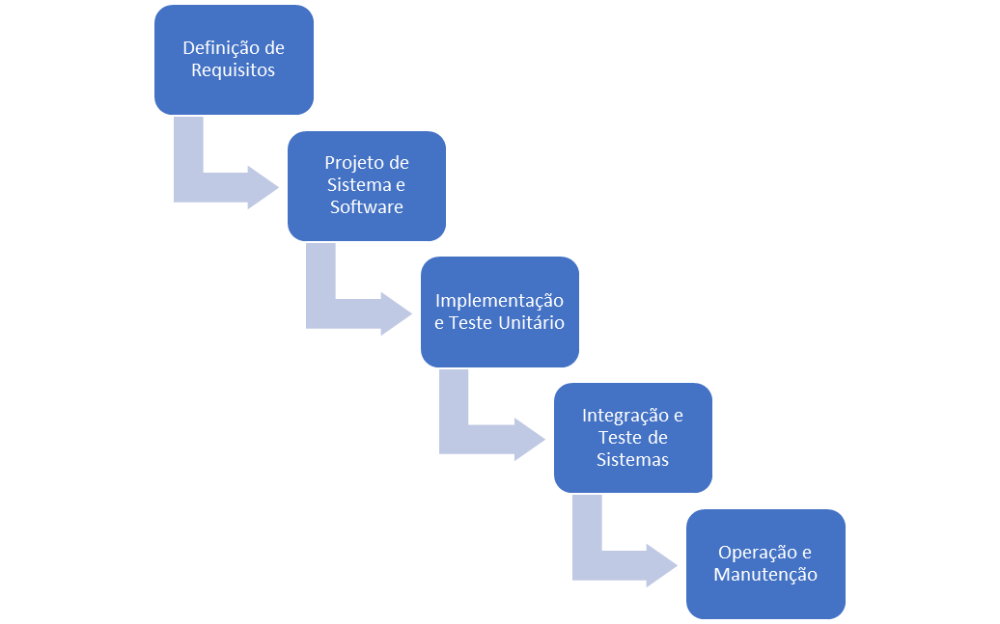
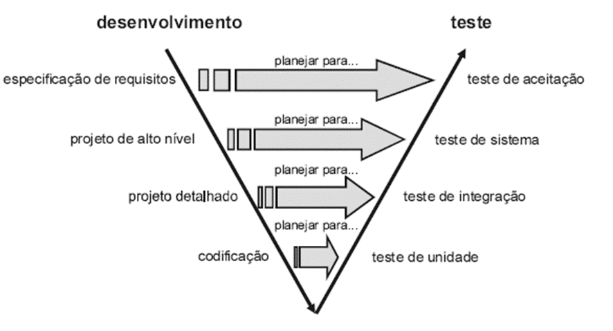

Desde o surgimento dos primeiros computadores, os projetos de software têm desempenhado um papel crucial na evolução da tecnologia e na forma como interagimos com o mundo digital. Nos primeiros dias da computação, os projetos de software eram frequentemente limitados a programas simples e específicos, desenvolvidos por pioneiros da computação que trabalhavam com máquinas enormes e de capacidade limitada. Essas iniciativas iniciais eram marcadas por uma abordagem artesanal, onde cada linha de código tinha que ser meticulosamente escrita e testada.

Com o avanço da tecnologia, especialmente durante as décadas de 1950 e 1970, o desenvolvimento de software começou a se expandir, tanto em termos de complexidade quanto de importância.

{width="600" height="20" style="display: block; margin: 0 auto"}

- [X] 1950: Alan Turing publica o famoso artigo "Computing Machinery and Intelligence";
- [x] Década de 50, surgiram as linguagens de 1ª geração, programação lógica (abstração do hardware), linguagens montadoras como assembler (ainda exigiam conhecimentos do hardware), ênfase em cálculos matemáticos. Linguagens: Fortran, Lisp e Algol 58.
 - [x] 1950 a 1960: Métodos tradicionais de Desenvolvimento.A ideia principal era seguir um processo linear e sequencial onde cada fase fosse completada antes de passar para a próxima.
- [x] Kanban foi desenvolvido por Taiichi Ohno - Toyota Production System (TPS) na década de 1940. 1950s-1960s: O Kanban foi refinado e integrado no Toyota Production System. 2007: David Anderson publicou o livro "Kanban: Successful Evolutionary Change for Your Technology Business".
- [X] 1951: O matemático Christopher Strachey (futuro diretor do Departamento de Software da Universidade de Oxford) escreve o primeiro programa de IA para jogar damas em um computador de tubo de vácuo.
- [x] 1952: Autocode;
- [X] 1956: Durante a conferência de Dartmouth, os pesquisadores John McCarthy, Marvin Minsky, Nathaniel Rochester e Claude Shannon cunham o termo **"Inteligência Artificial"**.
- [X] 1956: O governo dos EUA proíbe a AT&T de entrar no comércio de software (isso levou, posteriormente, o Bell Labs a distribuir livremente o seu Unix).
- [x] 1957: FORTRAN: FORmula TRANslation foi criada por John Backus é considerada a linguagem de programação mais antiga em uso atualmente.
- [x] 1958: ALGOL (Linguagem algorítmica)
- [x] 1958: McCarthy desenvolve o LISP (List Processing). O LISP libertou os hackers do ITS ('Incompatible Time-sharing System').
- [x] 1958-1962: CPM (Critical Path Method) – Primeira abordagem computacional para controle de projetos.
- [x] 1959: COBOL (Common Business Oriented Language)

Foi durante este período que surgiram as primeiras metodologias formais de desenvolvimento de software, como a programação estruturada e a análise de sistemas.

- [x] 1960: Introdução ao Fluxo de Dados e Processos. O desenvolvimento das ideias de Fluxo de Dados (DFD), tenha ocorrido ao longo de várias décadas, o trabalho de Larry LeRoy Constantine foi fundamental na consolidação dessas abordagens no campo da engenharia de software.
- [x] 1960: O software é distribuído com seu código-fonte e sem nenhuma restrição em grupos de software como SHARE (IBM) e DECUS (DEC).

Essas metodologias foram introduzidas como uma resposta à crescente demanda por software mais complexo e confiável, à medida que empresas e governos começaram a perceber o potencial dos computadores para automatizar processos e resolver problemas complexos.

A necessidade de integrar novos recursos e melhorar a funcionalidade fez com que o software se tornasse cada vez mais intrincado, o que complicava sua construção, teste e manutenção.

As abordagens de desenvolvimento eram muitas vezes informais, e havia um foco em programas escritos de maneira ad hoc, sem muita consideração para arquitetura, modularização ou usabilidade. A falta de padrões e metodologias levaram a uma grande quantidade de erros e falhas afetando custos, credibilidade, confiabilidade e robustez dos mesmos.

- [x] 1961: MIT adquiriu o primeiro PDP-1. O termo "hackers" do Tech Model Railroad Club se tornaram o núcleo do Laboratório de Inteligência Artificial do MIT;
- [X] 1961: Unimate, o primeiro robô industrial;
- [x] 1961: LANPAR (LANguage for Programming Arrays at Random) – Um dos primeiros sistemas de planilha, desenvolvido para mainframes. Utilizado principalmente em empresas de telecomunicação.
- [x] 1964: BASIC (Beginners All-Purpose Symbolic Instruction Code). Thomas Kurtz, co-inventor da linguagem de programação BASIC, aos 96 anos, 17/11/2024.
- [X] 1964: O computador ELIZA, criado por Joseph Weizenbaum, é um dos primeiros programas a simular uma conversa em linguagem natural;
- [X] 1964:RUNOFF – Primeiro editor de texto formatado, criado para o sistema CTSS.
- [x] 1965: Lawrence Roberts e Thomas Marill realizaram a primeira comunicação entre dois computadores usando uma linha telefônica dedicada. O experimento foi publicado no artigo “Toward a Cooperative Network of Time-Shared Computers” na Fall Joint Computer Conference (FJCC).
- [x] 1966: A memória Moby é adquirida e o dispositivo TTY adiciona mais quatro teletipos; preparando-se para o compartilhamento de tempo?
- [X] 1966: O chatbot SHRDLU, desenvolvido por Terry Winograd, é um dos primeiros sistemas de IA a manipular objetos em um ambiente virtual utilizando linguagem natural.
- [x] Em 1966, Böhm e Jacopini publicaram o teorema que é considerado a base teórica da programação estruturada, mostrando que qualquer programa pode ser escrito usando apenas três estruturas de controle:
      - [x] Sequência: Executando um subprograma e depois outro subprograma;
      - [x] Seleção: Executando um dos dois subprogramas de acordo com o valor de uma expressão booleana;
      - [x] iteração: Executar repetidamente um subprograma enquanto uma expressão booleana for verdadeira;
- [x] 1966: PERT (Program Evaluation Review Technique) – Popularizado pela Marinha dos EUA;
- [X] 1967: TECO (Text Editor and Corrector) – Um dos primeiros editores amplamente usados em sistemas DEC.
## 1968: A Crise do Software

Evidenciado a necessidade urgente de novos processos, metodologias e técnicas para o desenvolvimento de software, surge a Conferência de Garmisch, realizada em 1968 na Alemanha, que foi organizada pela ACM (Association for Computing Machinery).

Como resultado desta conferência, houve a publicação de "Software Engineering", que descrevia os desafios da indústria de software e sugeria que a engenharia de software se tornasse uma disciplina acadêmica formal, com metodologias e práticas rigorosas.

- [x] Em 1969, a OTAN (Organização do Tratado do Atlântico Norte) organizou outra conferência, focada no desenvolvimento de software e suas deficiências. Nesse evento, discutiu-se a criação da *Engenharia de Software* como uma resposta à crescente crise. Neste encontro enfatizou-se a necessidade em desenvolver software de maneira científica, utilizando métodos formais de análise e design estruturado.

As indústrias começaram, incorretamente, a ver o **desenvolvimento de software como previsível e repetível** – algo aparentemente comum.

- [X] 1960s-1970s: O conceito de banco de dados relacional foi proposto por Edgar F. Codd em 1970, enquanto ele trabalhava para a IBM.
- [x] HP entrou no mercado de computadores com a HP 2116A, em 1966.
- [x] 1969: A ARPANET (Advanced Research Projects Agency Network) foi a primeira rede de computadores, construída em 1969 pela ARPA e também foi o ano em que um hacker da Bell Labs chamado Ken Thompson inventou o Unix.
- [x] 1969: O Unix nasceu em 1969, criado por Ken Thompson, Dennis Ritchie e outros pesquisadores nos Laboratórios Bell (Bell Labs), uma divisão de pesquisa da AT&T.
- [x] 1969, a HP foi a comercialização de um sistema de computador timesharing e continuou a emitir novos produtos, incluindo a sua HP-35 calculadora de mão e vários computadores na década de 1970.
- [x] Outro nó importante da cultura foi o XEROX PARC, o famoso Palo Alto Research Center. Por mais de uma década, do início dos anos 1970 até meados dos anos 1980, o PARC produziu um volume surpreendente de inovações revolucionárias de hardware e software. Os mouses, windows e ícones de interface de software,impressora a laser e a rede local foram inventados lá.

Fundada em 1969, nos Estados Unidos, Project Management Institute (PMI),  por um grupo de profissionais que reconheceu a necessidade de uma abordagem mais estruturada e eficiente para gerenciar projetos, que estavam se tornando cada vez mais complexos à medida que as indústrias e tecnologias evoluíam.

O PMI é uma organização global dedicada à prática e ao desenvolvimento da Gestão de Projetos.

{width="400" height="500" style="display: block; margin: 0 auto"}

## 1970: Modelo Cascata: A Primeira Estrutura Formal
"Acredito nesse conceito, mas a implementação descrita acima é arriscada e convida ao fracasso." -  Winston Royce.

A conceituação do modelo Waterfall foi supostamente "inventado" pelo artigo [Managing the Development of Large Software Systems](pdf/royce1970.pdf) do Dr. Winston W. Royce em 1970.

Winston Royce,  propõe o que é agora popularmente designado no modelo em cascata como um conceito inicial, um modelo no qual ele argumentava ser defeituoso e defendia uma abordagem iterativa para o desenvolvimento de software, porém há citações da criação do  Modelo em Cascata (Waterfall) sendo criado por ele Winston Royce.

Pois bem, nesta publicação, ele propõe o que é agora popularmente designado no modelo em Waterfall como um conceito inicial, um modelo no qual ele argumentava ser **defeituoso** e defendia uma abordagem iterativa para o desenvolvimento de software, porém há citações da criação do Modelo em Waterfall sendo criado por ele Winston Royce.

De certa forma, acredito que todos os processos de Engenharia, mesmo não documentados explicitamente existam e ele apenas transcreve o que vê. Suas preocupações estavam focadas principalmente em testes ocorrendo no final do processo, com isso sua conclusão me parece óbvia, é que testes tardios poderiam levar a estouro do cronograma e dos custos.

Analisando o modelo e sua publicação Royce, ele consegue incluir alguns pensamentos,  que poderíamos classifica-lo como **pensamentos ágeis**, tais como: design do programa, planejar, controlar,monitorar testes, envolva o cliente e descarte a primeira versão e produto de software for original, a versão entregue ao seu cliente deve ser, na verdade, a segunda versão do produto.

### Características
- [x] Requisitos claros e bem definidos desde o início.
- [x] Baixo risco de mudanças ao longo do desenvolvimento.
- [x] Cenários onde erros identificados tardiamente podem ser corrigidos sem grande impacto.
- [x] Porém, suas limitações incluem:
      - [x] Pouca capacidade de adaptação às mudanças de requisitos durante o processo.
      - [x] Longo tempo até a entrega do produto final.
      - [x] Alto risco associado ao atraso na identificação de problemas ou inconsistências.

Quando essas limitações começam a impactar a eficiência e a entrega de valor aos stakeholders, as organizações buscam métodos mais flexíveis, como o modelo Incremental.

- [x] Em 1970, o conceito ganhou força com a publicação de artigos e livros de Edsger W. Dijkstra, um dos pioneiros da programação estruturada, que argumentava contra o uso indiscriminado de comandos goto e defendendo a organização do código em blocos estruturados.
      - [x] Pascal (1970): Projetada por Niklaus Wirth, focava na simplicidade e na estruturação do código.
      - [x] C (1972): Ampliou a programação estruturada em sistemas de software, consolidando seu uso.
- [x] 1970: Os Beatles anunciam seu próprio fim e lançam o derredeiro album, Let it Be.
- [x] 1970: IBM e HP começam a vender diretamente ao público microcomputadores baseados em transistores e microchips;
- [x] 1970: O Brasil conquista o tricampeonato mundial de futebol;
- [X] 1970: IBM's System R — A IBM desenvolveu o System R, um dos primeiros sistemas de banco de dados relacional, que foi uma das inspirações para a criação de SQL (Structured Query Language).
- [x] 1971: Conectado à ARPANET, versão ~670
- [X] 1971, eles começaram a reescrever o Unix em C, uma linguagem de programação que Dennis Ritchie.
- [x] 1971: Adquiri da Inglaterra as fragatas da classe Niteroi;
- [x] 1971: Ray Tomlinson, envia uma mensagem para si mesmo, mas de outro computador, criando assim ium novo meio de comunicação via computadores: eletronic mail, ou simplesmente, e-mail. Foi Ray que decidiu que o nome do usuario, seria separado do nome do computador, pelo simbolo "@".
- [x] 1971: O parque de computadores instalado no Brasil, chega a impressionante marca de seiscentas máquinas, com o valore estimado em 60 milhões de dolares;
- [x] 1971: Abertura da filial da HP Brasil em Porto Alegre
- [x] 1971: ED – Um editor de texto simples para Unix.
- [x] 1972: JUnit predecessor (Conceitos iniciais) – Embora o JUnit só surgisse nos anos 90, conceitos de teste unitário começaram a ser explorados nessa época, especialmente no desenvolvimento de sistemas embarcados e metodologias estruturadas.
- [x] 1972: Criada pelo governo brasileiro a Comissão de Coordenação das Atividades de Processamento Eletrônico (CAPRE), destinada a controlar a importação e exportação de componentes eletrônicos para equipamentos de processamento de dados e também traçar diretrizes para um Programa Nacional de Ensino da Computação, para diminuir o déficit de profissionais na área de informática no país.
- [x] Nasce o G-10 ou vulgarmente conhecido como "Patinho Feio", o primeiro microcomputador brasileiro, criado pelos professores e alunos da Escola Politécnica da USP, como resultado de um curso ministrado pelo professor Glen Langdon Jr. O "G" era uma homenagem ao Comandante Guaranys, que morrera quase ao final da empreitada.
- [x] O [Patinho Feio](https://pt.wikisource.org/wiki/Contos_de_Andersen/O_patinho_feio), numa óbvia referencia a fábula do autor dinamarques do século XIX, Hans Christian Andersen,escrita em 1844.
- [x] Primeira demonstração pública da Arpanet conecta quarenta computadores;
- [x] O Brasil ingressa na era da TV em cores e oo Bem Amado, de Dias Gomes, é a primeira telenovela nacional totalmente colorida.
- [x] 1972: Smalltalk, C, 1972: SQL (SEQUEL na época)
- [x] 1972: Portagem do Unix para outros PDP. A equipe de Ken Thompson tenta reescrever o Unix em outra linguagem (B ou BCPL). A equipe melhora a linguagem B e cria a linguagem C para reescrever o Unix; Unix começa a ser distribuído em universidades e centros de pesquisa.
- [X] 1973: Ingres — Criado por pesquisadores da Universidade da Califórnia, Berkeley. Inicia-se a história do Unix BSD com a chegada do Unix à Universidade de Berkeley, na Califórnia; SPICE é colocado por Donald Pederson em domínio público.
- [x] 1973–1975: A primeira lista de gíria, as primeiras sátiras, as primeiras discussões autoconscientes sobre a ética hacker, 1973–1975. The Dicionário do Hacker em 1983;
- [X] 1973: O Unix foi reescrito em C, o que facilitou a portabilidade e a distribuição do sistema.
- [x] 1973: Primeira conexão internacional da Arpanet, liga a Inglaterra à Noruega;
- [x] Engenheiros da Xerox, desenvolvem uma interface gráfica, bem próximas dos atuais Windows e MAC OS, chamado de ALTO, usando mouse, ícones para representar programas e documentos, e apta a operar em rede. Ela nunca foi lançada, pois a empres não acreditava naquela ideia.
- [x] Criação do Curso de formação de tecnologos em processamento de dados na PUC-RJ;
- [x] 1974: Nasce em 18 de julho a Empresa Computadores Brasileiros - COBRA -, da União do BNDES, EE Eletrônica e da inglesa Ferranti;
- [x] Criada a empresa Dataprev, o centro de processamento de dados da Previdência.O presidente Ernesto Geisel sanciona a lei 6.125, que constitui a Empresa de Processamento de Dados da Previdência Social (Dataprev).
- [ ] 1974: Vint Cerf e Bob Kahn publicaram o artigo seminal “A Protocol for Packet Network Intercommunication” no IEEE Transactions on Communications, introduzindo o conceito de TCP/IP, que se tornaria o padrão para comunicação em redes distribuídas.
- [x] 1975: A Cobra lança seu Cobra 700;
- [x] 1975: Criada a primeira unidade produtiva da HP Brasil, em Campinas - SP, para a produção da linha de instrumentação eletrônica e de calculadoras voltadas à área de computação, como a HP-35 e a HP-45.
- [x] Dois amigos de infancia, Bill Gates e Paul Allen, fundam a Microsoft, cujo primeiro software foi uma versão de BASIC para microcomputadores, produzida ainda quando Bill Gates estudava em Harvard.
- [x] Operando apenas no pequeno trecho de sete estações, entre Jabaquara e Vila Mariana, entra em circulação a primeira linha de metrô do Brasil, em São Paulo.
- [x] O contrato entre o INPS e a Burroughs Eletrônica é transferido para a Dataprev, que passa a gerir o parque de computadores instalados no Rio de Janeiro e em São Paulo.
- [x] O primeiro protótipo da empresa foi o Apple I que foi demonstrado na Homebrew Computer Club em 1975.
- [X] 1975: A MITS Altair 8800 é lançada e considerada por muitos como o primeiro verdadeiro "computador pessoal".
- [X] 1975: Lançada a primeira versão do Ingres, banco de dados livre (o ancestral do PostgreSQL).
- [X] 1975: **The Mythical Man-month**, Fred Brook’s
       - [X] **Feature Teams**, multidisciplinar com um Líder Técnico, de no máximo 10 pessoas;
       - [x] Principal causa de fiasco de projetos - COMUNICAÇÃO;
       - [x] **Harlan Mills** programação deveria ser um processo público, e que expor todo o trabalho  pra todo mundo ajuda o controle de qualidade;
       - [x] Cunha o conceito de "Integridade conceitual" é a coisa MAIS importante a se considerar em design de sistemas. É melhor um sistema omitir certas features e melhorias, mas  refletir apenas Um conjunto de idéias de design;
       - [x] Aristocrata (poder político e privilégios) - Ditador Benevolente - PRODUCT OWNER;
       - [x] Planeje jogar um FORA (A primeira versão será sempre a pior). Prepare o gerenciamento do PROJETO para aceitar as MUDANÇAS.
- [X] 1976: Bill Gates escreve a “carta aberta aos hobistas”.
- [x] 1976: A CAPRE lança a Resolução no.1, ínicio da política de reserva de mercado no Brasil;
- [x] A Apple foi fundada em 1 de abril de 1976 por Steve Wozniak, Steve Jobs e Ronald Wayne com o nome de Apple Computers, na Califórnia.
- [ ] 1976: Emacs – Criado por Richard Stallman, um editor de texto avançado e extensível, ainda popular entre programadores.

## Modelo em V (V-Model)
Seria a evolução do modelo em cascata, onde a validação ocorre ao longo de todo o desenvolvimento. Cada etapa da esquerda corresponde a uma validação na direita. Veja que o fluxo é um enorme V, fazendo jus ao nome.

{width="400" height="500" style="display: block; margin: 0 auto"}

- [X] 1977: A Apple Computer, fundada por Steve Jobs e Steve Wozniak, lança o Apple II; Lançamento do Apple II, primeiro projeto de computador pessoal da Apple Computers, baseado no Apple I, protótipo criado por Steve Jobs na garagem de sua casa.
- [X] 1977: A Commodore lança o Commodore PET;
- [X] 1977: O TRS-80 é lançado pela Tandy/RadioShack; O TRS-80 Micro Computer System (TRS-80, posteriormente renomeado como Modelo I para distingui-lo dos sucessores) é um microcomputador de mesa lançado em 1977 e vendido pela Tandy Corporation por meio de suas lojas RadioShack.
- [x] 1977: Lançamento do Cobra 400;
- [x] 1977: Star Wars (Briefing da Estrela da Morte)
- [x] 1977: Apesar de atuar no Brasil desde a década de 1960, a HP passa a produzir pela primeira vez na América Latina, com uma fábrica  em Campinas (SP).
- [x] 1977: Equipe da HP Brasil transfere-se para Alphaville, inaugurando o primeiro edifício do centro comercial da região.
- [x] 1977: Atari lança seu Video Computer System (VCS), mais tarde renomeado para Atari 2600.
- [x] 1977: C3PO e R2D2 desempenham um papel crítico no filme de sucesso de bilheteria Star Wars de 1977.
- [x] 1977: O Commodore 1530 Datasette (dados+cassete) integrado é o dispositivo de armazenamento primário para o recém-lançado Commodore PET.
- [x] 1977: Criação da Edisa Eletrônica Digital S/A com a participação de 16 empresas nacionais, com apoio do Banco Nacional de Desenvolvimento Econômico Social – BNDES.
- [x] 1977:  A TELESP lançou para Bebedouro a oferta do serviço automático de telefonia, com a implantação do sistema de DDD e DDI – Discagem Direta à Distância e Discagem Direta Internacional.
- [x] 1978: Implantação dos sistemas de processamento, possibilitando a centralização das atividades administrativas da HP Brasil em Alphaville SP.
- [x] Lançamento do COBRA 400 II
- [x] O primeiro bebê de proveta do mundo foi Louise Joy Brown, nascida em 25 de julho de 1978, em Bristol, na Inglaterra.
- [x] O LaserDisc é introduzido como “Discovision” pela MCA e Philips. O primeiro LaserDisc vendido na América do Norte foi o filme Jaws.
- [x] A unidade de disco flexível de 5 ¼ polegadas e o disquete foram introduzidos pela Shugart Associates em 1976. Isso foi o resultado de uma solicitação da Wang Laboratories para produzir uma unidade de disco pequena o suficiente para ser usada com um computador de mesa, já que unidades de disquete de 8 polegadas eram consideradas grandes demais para esse propósito. Em 1978, mais de 10 fabricantes estavam produzindo unidades de disquete de 5 ¼ polegadas.
- [x] Rob Barnaby cria o WordStar enquanto estava na MicroPro International.
- [X] 1978: Donald Knuth, da Universidade de Stanford, começou a trabalhar no TeX, distribuído como software livre.
- [ ] 1978: WordStar – Um dos primeiros editores comerciais populares para CP/M e, posteriormente, MS-DOS.
- [x] 1978-1980: Proposta do modelo OSI (Open Systems Interconnection) pela ISO. O documento final foi publicado em 1980 como uma recomendação técnica para comunicação entre sistemas heterogêneos.
- [x] 1979: O microprocessador Motorola 68000 exibia uma velocidade de processamento muito maior do que seus contemporâneos.
- [x] Ascensão dos serviços online e BBSs. A maioria dos donos de computadores não se incomoda, mas em 1979 um subconjunto de corajosos ou teimosos está assinando os primeiros serviços online como MicroNet (mais tarde CompuServe Information Service) e The Source, ou se conectando a Bulletin Board Services (BBSs) hospedados no minicomputador ou PC de outra pessoa.
- [X] 1979: AT&T começa a forçar licenças restritivas ao decidir que poderia lucrar através do sistema Unix.
- [X] 1979: Oracle Database — Lançado pela Oracle Corporation, fundado por Larry Ellison, Bob Miner e Ed Oates;
- [x] 1979: VisiCalc – Criado por Dan Bricklin e Bob Frankston, foi o primeiro software de planilha eletrônica amplamente popular, lançado para o Apple II. É frequentemente considerado o precursor das planilhas modernas.
- [x] O Stanford Cart foi um projeto de pesquisa de longo prazo realizado na Universidade de Stanford entre 1960 e 1980. Em 1979, ele cruzou com sucesso uma sala sozinho enquanto contornava uma cadeira colocada como obstáculo.
- [x] O candidato ao MBA de Harvard Dan Bricklin e o programador Bob Frankston desenvolvem o VisiCalc.
