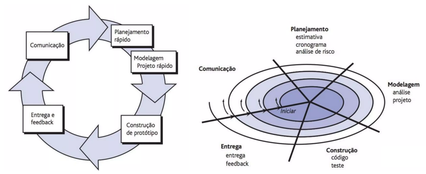
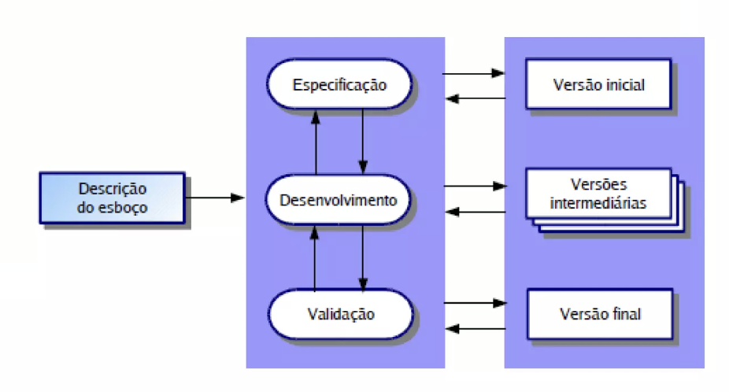

A década de 1980 marcou um ponto de inflexão significativo na história dos projetos de software, com a popularização dos computadores pessoais. Isso democratizou o acesso à tecnologia e criou uma nova onda de inovação no desenvolvimento de software. Empresas como Microsoft e Apple começaram a desenvolver sistemas operacionais e aplicações que se tornaram fundamentais para o uso diário dos computadores. Durante este período, o conceito de engenharia de software começou a ganhar popularidade, trazendo uma abordagem mais disciplinada e sistemática para o desenvolvimento de software.

{width="600" height="20" style="display: block; margin: 0 auto"}

- [x] Em 1980, foi aprovada a documentação da linguagem de programação Ada, criada em homenagem a Ada Lovelace, considerada a primeira programadora do mundo.
- [x] 1980: PMBOK (Project Management Body of Knowledge): Criado pelo PMI na década de 1980, com a primeira edição publicada em 1996, como um guia de boas práticas para gerenciamento de projetos.
- [X] 1980: A IA começa a se revitalizar com a introdução de Redes Neurais Artificiais (RNAs);
- [x] 1980: A Commodore lança o computador doméstico VIC-20 como sucessor do computador pessoal Commodore PET.
- [x] Em 1980, Tim Berners-Lee, do laboratório de física do CERN, cria o Enquire, um sistema de hipertexto em rede usado para gerenciamento de projetos, mas com ambições muito maiores.
- [X] 1981: A IBM lança o IBM PC;
- [X] 1981: O sistema operacional MS-DOS da Microsoft é lançado,MS-DOS, ou Microsoft Disk Operating System, o software básico para o recém-lançado IBM PC, é o início de uma longa parceria entre a IBM e a Microsoft, que Bill Gates e Paul Allen fundaram apenas seis anos antes.
- [x] 1980s: Introdução do paradigma Cliente-Servidor, promovendo a separação entre consumidores de serviços e provedores.
- [x] 1981: A Sony apresenta as primeiras unidades de disquete e disquetes de 3 ½ polegadas.
- [x] Joyce Worley Katz, Arnie Katz e Bill Kunkel co-fundaram a Electronic Games , a primeira revista de videogame dos Estados Unidos.
- [x] O IBM PC revolucionou a computação empresarial ao se tornar o primeiro PC a ganhar ampla adoção pela indústria.
- [x] A France Telecom oferece terminais Minitel gratuitos para cada assinante de telefone, lançando a primeira "Web" em massa.
- [x] 1982: A revista TIME altera sua tradição anual de nomear um "Homem do Ano", escolhendo, em vez disso, nomear o computador pessoal como sua "Máquina do Ano".
- [x] Mitch Kapor desenvolve o Lotus 1-2-3, um conjunto de software para o IBM PC baseado em um processador de texto, planilha e banco de dados.
- [x] A Sun Microsystems é fundada.A Sun ajudou a consolidar o modelo de uma estação de trabalho com uma interface Ethernet, bem como gráficos de alta resolução e o sistema operacional UNIX.
- [x]  O “Friendly Robotic Educational Device” (FRED), projetado para crianças de 6 a 15 anos, nunca chegou ao mercado.
- [x] 1982: Multiplan – Desenvolvido pela Microsoft, inicialmente lançado para sistemas CP/M e mais tarde para MS-DOS, mas perdeu espaço para concorrentes como Lotus 1-2-3.
- [x] 1983: ADB (Advanced Debugging Tool) – Primeira ferramenta de depuração amplamente usada em sistemas Unix, essencial para testes iniciais.
- [x] 1983: C++, Objetivo-C;
- [X] Em 1983, a IBM lançou o DB2, um banco de dados relacional que se tornaria um dos líderes do mercado, inicialmente voltado para mainframes e sistemas corporativos de grande porte.
- [X] 1983: O movimento por software livre começa com Richard Stallman, um programador do MIT (Massachusetts Institute of Technology). Stallman inicia o projeto GNU (GNU's Not Unix);Richard Stallman, um programador do Laboratório de Inteligência Artificial do MIT, decidiu desenvolver uma alternativa livre ao popular sistema operacional Unix. Stallman fundou a Free Software Foundation (FSF) com base nessa filosofia em 1985.
- [x] 1983: A Apple apresenta o Lisa é o primeiro computador pessoal comercial com uma interface gráfica de usuário (GUI).
- [x] A Compaq Computer Corporation apresenta o Compaq Portable;
- [x] A Microsoft anuncia o Word, originalmente chamado de Multi-Tool Word.
- [x] 1983: Lotus 1-2-3 – Desenvolvido pela Lotus Development Corporation, tornou-se o software de planilha mais popular da década, com funcionalidades avançadas para a época.
- [x] 1984: MacProject – Um dos primeiros softwares para Macintosh, focado em planejamento de projetos.
- [X] 1984: Richard Stallman lança a Free Software Foundation (FSF) com a missão de promover o software livre;
- [x] 1984: O comercial “ 1984 ” da Apple foi ao ar durante o Super Bowl XVIII em 22 de janeiro de 1984. O comercial, que custou pelo menos trezentos mil dólares, foi baseado em parte no romance 1984 de George Orwell , com o papel do Big Brother.
- [x] A Apple apresenta o Macintosh com um comercial de televisão durante o Super Bowl de 1984.
- [x] Para música, o CD (Compact Disk), a multimídia decola;
- [x] Fujio Masuoka inventa a memória flash em 1984 enquanto trabalhava para a Toshiba.
- [x] A Heathkit apresenta o kit de robô doméstico Hero Jr., um dos vários robôs que vendia na época.
- [x] Anunciado em março de 1984, o novo sistema de fita de cartucho 3480 da IBM buscava substituir os tradicionais rolos de fita magnética no centro de computadores por um cartucho de 4 polegadas por 5 polegadas que continha mais informações (200 MB) e oferecia acesso mais rápido a elas.
- [x] IBM lança seu PC Jr. e PC/AT
- [x] Matlab (Matrix Laboratory), uma linguagem de programação de alto nível, é lançada. Ela foi projetada pelo Professor Cleve Moler da Universidade do Novo México e foi inicialmente planejada para ajudar os alunos a usar bibliotecas de software matemático sem exigir conhecimento da linguagem de programação científica FORTRAN.
- [x] Padrão OSI publicado: Protocol Wars;
- [x] William Gibson cunhou o termo "ciberespaço".
- [x] Phil Moorby e Prabhu Goel da Gateway Design Automation criam o Verilog, uma linguagem de descrição de hardware que é usada no design de circuitos digitais.
- [x] Em 1984, Michael Dell cria a PC's Limited enquanto ainda era estudante da Universidade do Texas em Austin.
- [x] 1984: MacWrite – Primeiro editor de texto gráfico, lançado para Macintosh.
- [x] 1984: Publicação dos padrões iniciais do protocolo DNS (Domain Name System) em dois artigos principais:
      - [x] RFC 882: “Domain Names - Concepts and Facilities” por P. Mockapetris.
      - [x] RFC 883: “Domain Names - Implementation and Specification” por P. Mockapetris.
- [x] 1985: Publicação do livro “Distributed Operating Systems” por Andrew S. Tanenbaum, uma referência inicial para a área de sistemas distribuídos.
- [X] 1985: A Microsoft lança o Windows 1.0;
- [X] 1985: Stallman publica o Manifesto do Software Livre, no qual define a filosofia por trás do movimento.
- [x] 1985: A linguagem de programação C++ surge como a linguagem orientada a objetos dominante na indústria de computadores quando Bjarne Stroustrup publica o livro The C++ Programming Language .
- [x] A Aldus anuncia seu programa PageMaker para uso em computadores Macintosh, lançando a revolução da editoração eletrônica.
- [x] Denning, de Boston, projetou o robô Sentry como um guarda de segurança patrulhando por até 14 horas a 3 mph.
- [x] Fundação Media Lab foi inaugurado em um prédio projetado por IM Pei, inicialmente com foco na "Revolução Digital";
- [x] Nintendo lança o Nintendo Entertainment System (NES) nos EUA;
- [x] O brinquedo robô programável controlado remotamente Omnibot 2000 podia se mover, falar e carregar objetos.
- [x] O termo SCRUM, ele foi retirado do livro [Wicked problems, righteous solutions](https://books.google.com.br/books/about/Wicked_Problems_Righteous_Solutions.html?id=__omAAAAMAAJ&redir_esc=y), de 1990. Sendo neste livro que trouxe pela primeira vez a ideia de utilizarmos no desenvolvimento de software o conjunto de práticas descritas pelos dois autores japoneses na reconhecida revista. E foi nesse mesmo livro que seus autores, DeGrace e Stahl, batizaram essa nova forma de trabalhar de “Scrum“.
- [x] 1985: Excel (Versão Mac) – A Microsoft lançou o Excel para Macintosh, destacando-se por sua interface gráfica e facilidade de uso.
- [x] 1985: LaTeX – Ferramenta avançada para a produção de documentos científicos e técnicos.
- [x] 1986: A Compaq bate a IBM no mercado quando anuncia o Deskpro 386, o primeiro computador do mercado a usar o novo chip 80386 da Intel, um microprocessador de 32 bits com 275.000 transistores em cada chip.
- [x] IBM lança a primeira estação de trabalho comercial baseada em RISC;
- [x] A estação de trabalho LMI Lambda LISP é introduzida. LISP, a linguagem preferida para IA, rodava lentamente em computadores convencionais caros.
- [x] Pixar era originalmente chamada de Special Effects Computer Group na Lucasfilm (lançada em 1979).
- [x] O padrão SCSI-1 é adotado e formaliza a interface que teve suas raízes no SASI, que foi introduzido pela Shugart Associates vários anos antes.
- [x] 1987: SQA Robot – Um dos primeiros softwares automatizados para teste funcional, precursor de ferramentas modernas.
- [x] 1987: Microsoft Project – Tornou-se o principal software de gestão de projetos da Microsoft.
- [x] 1987: Padrão GSM formalmente acordado
- [x] O primeiro sistema IBM a incluir o chip 80386 da Intel, a empresa enviou mais de 1 milhão de unidades até o final do primeiro ano.
- [x] Perl (Practical Extraction and Report Language) foi escrito por Larry Wall. Ele foi criado para facilitar o processamento de relatórios e poderia escanear e extrair informações de arquivos de texto e, finalmente, criar relatórios gerados a partir dessas informações.
- [x] O engenheiro da Apple William Atkinson projeta o HyperCard, uma ferramenta de software que simplifica o desenvolvimento de aplicativos internos.
- [x] 1987: Excel (Versão Windows) – Lançado para Windows, começou a ganhar mercado com o crescimento do sistema operacional da Microsoft.
- [x] 1988: O Tin Toy da Pixar se torna o primeiro filme de animação por computador a ganhar um Oscar, levando o Oscar de Melhor Curta-Metragem de Animação.
- [x] Steve Jobs, forçado a sair da Apple em 1985, funda uma nova empresa – NeXT. O computador que ele criou, um cubo todo preto, foi uma inovação importante.
- [x] A Creative Arts lança o primeiro SoundBlaster;
- [x] A VTech, fundada em Hong Kong, era uma fabricante de jogos do tipo Pong e brinquedos educativos quando introduziu o computador Laser 128.
- [x] Mathematica foi criado por Stephen Wolfram, um cientista britânico.
- [x] Robert T. Morris, de 23 anos, filho de um especialista em segurança de computadores da Agência de Segurança Nacional, envia um worm não destrutivo pela Internet, causando grandes problemas por dias para cerca de 6.000 dos 60.000 hosts conectados à rede.
- [x] 1989: David Levy é o primeiro mestre enxadrista a ser derrotado por um computador. O programa Deep Thought derrota Levy, que havia derrotado todos os outros colegas de computador anteriores desde 1968.
- [x] A Intel lançou o microprocessador 80486 e o ​​chip RISC/coprocessador i860, cada um contendo mais de 1 milhão de transistores.
- [x] A Internet conecta mais de um milhão de pessoas até o final da década de 1980 e está crescendo rapidamente.
- [x] Nintendo lança o console portátil Game Boy;

## 1980-2000: Modelo Iterativo/Incremental

O Modelo Iterativo foi descrito pela primeira vez de forma significativa na publicação de Barry W. Boehm, no artigo intitulado [A Spiral Model of Software Development and Enhancement](pdf/A_spiral_model_of_software_development_a.pdf), publicado em 1986.

Embora o modelo iterativo já existisse em teoria, a descrição de Barry W. Boehm o formalizou ao integrar ciclos iterativos e gerenciamento de riscos. Com uma abordagem dinâmica e flexível para o desenvolvimento de software, basicamente, divide o projeto em pequenos ciclos (iterações), onde cada iteração resulta em uma versão funcional do produto que pode ser avaliada e aprimorada.

## 1980-Final dos Anos: Prototipação
{width="200" height="200" style="display: block; margin: 0 auto"}

A prototipação, nasce em resposta à crescente complexidade dos sistemas de software e às limitações dos métodos tradicionais de desenvolvimento, como o Modelo em Cascata. Durante esse período, as demandas por sistemas mais interativos e adaptados às necessidades do usuário começaram a crescer, especialmente em áreas como design de interfaces gráficas e desenvolvimento de sistemas de informação.

O conceito de prototipação já era utilizado em áreas como design industrial e engenharia antes de ser adaptado ao desenvolvimento de software.

A prototipação envolve a criação de versões preliminares (protótipos) do sistema para ajudar na definição de requisitos e funcionalidades. O protótipo é desenvolvido rapidamente para que os usuários possam interagir com ele e dar feedback, o que ajuda na refinamento contínuo dos requisitos.

É um processo que tem como objetivo facilitar o entendimento dos requisitos de uma aplicação. Além disso, ele permite apresentar conceitos e funcionalidades do software de modo simplificado. Com a prototipação, é possível propor uma solução adequada para o problema do cliente, aumentando sua percepção de valor.

A prototipação dá-se basicamente com a comunicação que ocorre através de uma reunião com todos os envolvidos, a fim de definir objetivos gerais do software e identificar quais requisitos já estão bem conhecidos, e esquematizar as áreas que realmente necessitam de uma definição mais ampla.

## Incremental - Final dos anos 1980 e 1990
{width="400" height="500" style="display: block; margin: 0 auto"}

Desenvolvido para superar as limitações do Waterfall, o modelo Incremental envolve a construção do sistema de forma gradual e por partes (incrementos). O software é desenvolvido em pequenos módulos que vão sendo entregues ao longo do tempo. Cada módulo acrescenta mais funcionalidades.

O modelo incremental não tem um único criador específico, pois ele evoluiu gradualmente como uma abordagem prática para o desenvolvimento de software a partir das limitações do modelo em cascata (Waterfall).

Podemos dizer que houve por parte de Barry Boehm (modelo espiral (1986)), Prototipagem Evolutiva e  [DoD-STD-2167A](pdf/dod-std-2167a.pdf), um padrão para desenvolvimento de software militar.

## Modelo Evolucionário
Ao contrário do modelo incremental, o desenvolvimento do software ocorre integralmente aos poucos, como em uma espécie de evolução. Divide-se em Prototipagem (criação do protótipo ajuda na validação do cliente) ou Espiral (iteração repetida, de maneira circular).

Entendi que não há um autor, porem podemos dizer que segue a junção dos modelos apresentados por Winston Royce, Barry Boehm e Tom Gilb.

{width="400" height="500" style="display: block; margin: 0 auto"}
