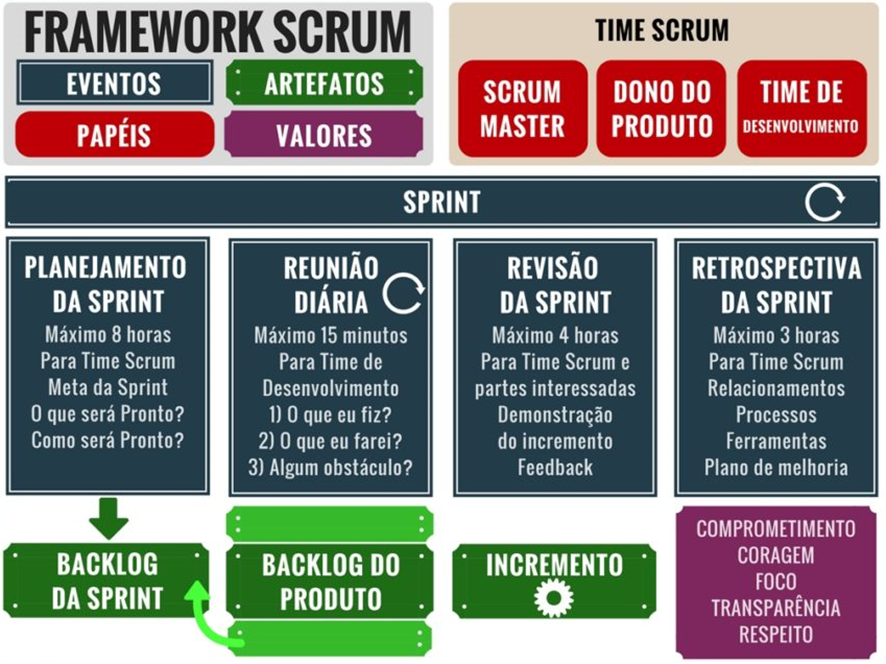
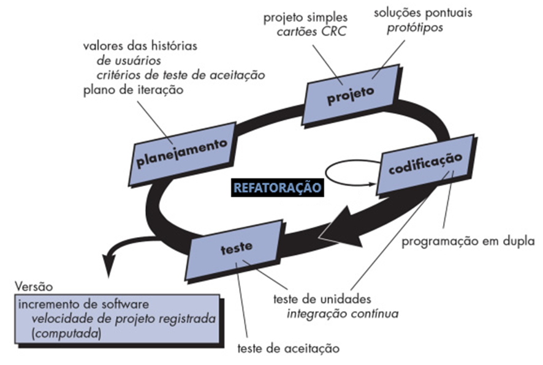

Anos anos 1990, a internet começou a transformar radicalmente o cenário dos projetos de software. O surgimento da web como uma plataforma global levou ao desenvolvimento de novos tipos de software, incluindo navegadores, servidores web e, eventualmente, aplicações web. A conectividade global proporcionada pela internet também possibilitou o surgimento de modelos de desenvolvimento colaborativo, como o software de código aberto, que permitiu que desenvolvedores de todo o mundo trabalhassem juntos em projetos de software.

{width="600" height="20" style="display: block; margin: 0 auto"}

- [x] 1990: A Microsoft envia o Windows 3.0. Compatível com programas DOS, a primeira versão bem-sucedida do Windows finalmente ofereceu desempenho bom o suficiente para satisfazer os usuários de PC.
- [x] O Photoshop é lançado. Criado pelos irmãos John e Thomas Knoll, o Photoshop era um programa de edição de imagens e o programa de software mais popular publicado pela Adobe Systems.
- [x] No maior laboratório de física do mundo, o CERN na Suíça, o programador e físico inglês Tim Berners-Lee submete duas propostas para o que se tornará a Web, começando em março de 1989.
- [x] 1990: Primeiros scripts de automação – Surgem ferramentas básicas de automação baseadas em scripts, como AutoIt, voltadas para tarefas repetitivas em sistemas operacionais.
- [x] 1990: Quattro Pro – Lançado pela Borland, era conhecido por sua interface gráfica inovadora e funcionalidades avançadas.
- [x] 1990: Notepad – Incluído no Windows 1.0, um editor de texto básico.

## 1991: RAD (Rapid Application Development)
{width="400" height="500" style="display: block; margin: 0 auto"}

O desenvolvimento rápido de aplicativos, geralmente abreviado como RAD, refere-se a uma metodologia de desenvolvimento de software adaptável e focada no desenvolvimento acelerado de aplicativos por meio de várias iterações e rodadas rápidas de feedback.

Começando com as ideias de Barry Boehm e outros, James Martin desenvolveu a abordagem de desenvolvimento rápido de aplicativos durante a década de 1980 na IBM e finalmente a formalizou publicando um livro em 1991, Rapid Application Development.

Essencialmente, Boehm e Martin viam o software como algo que poderia ser trabalhado continuamente e não como um recurso finito, o que levou à criação do RAD.

- [x] Definir os requisitos do projeto: o foco não é obter uma lista detalhada de especificações de todos os envolvidos, mas sim definir os requisitos essenciais do projeto.
- [x] Prototipagem: A essência do RAD é agir rapidamente, portanto, logo após a definição dos requisitos do projeto, a equipe de desenvolvimento começa a criar um protótipo que pode ser apresentado às partes interessadas e aos clientes.
- [x] Ciclo de feedback: A equipe coleta feedback detalhado sobre todos os aspectos do produto e seus recursos, desde a funcionalidade até o design.
- [x] Implementação: Após a incorporação do feedback e o aprimoramento do protótipo – já mais funcional e com a maioria dos recursos essenciais – a equipe se concentrará na implementação final do software.

Se a sua equipe é formada principalmente por desenvolvedores experientes que estão acostumados a trabalhar em projetos de ritmo acelerado, então o RAD pode ser uma boa opção. No entanto, para softwares mais complexos que demandam manuseio cuidadoso e um conhecimento técnico aprofundado, os ciclos de feedback dos usuários finais, que podem não possuir essas habilidades, tornam o RAD uma opção menos indicada.

Características: Ciclo de vida rápido, com protótipos e iteração contínua. Envolve um forte envolvimento do cliente durante o processo.
Limitações: Pode ser difícil de aplicar em projetos grandes e complexos devido à falta de estrutura rígida.

- [x] 1991: Linus Torvalds lança o kernel Linux;
- [x] Pretty Good Privacy, ou PGP, um programa de criptografia de chave pública, é introduzido e usado para proteger textos, e-mails e arquivos.
- [x] O Macintosh Portable da Apple encontra pouco sucesso no mercado e leva a um redesenho completo da linha de computadores portáteis da Apple.
- [x] O navegador-editor GUI de Tim Berners-Lee de 1990 roda apenas em raros computadores NeXT.
- [x] 1991: WinRunner – Desenvolvido pela Mercury Interactive, uma das primeiras ferramentas comerciais para automação de testes funcionais.
- [x] 1992: O Joint Photographic Expert Group havia determinado um conjunto de regras para o que se tornou o formato jpeg (ou .jpg).
- [x] Um protótipo de módulo de disco de estado sólido (SSD) é feito para avaliação pela IBM.
- [x] 1993: Doom é lançado;
- [x] O assistente digital pessoal Apple Newton. Apelidado de “Personal Digital Assistant” pelo presidente da Apple.
- [x] FreeBSD, um sistema operacional completo semelhante ao Unix é lançado. Era a variante BSD (Berkeley Software Distribution) de código aberto mais amplamente usada.
- [x] O Pentium é a quinta geração da linha 'x86' de microprocessadores da Intel, a base para o IBM PC e seus clones.
- [x] O Microsoft Windows NT é lançado.
- [x] Mosaic, o primeiro navegador suportado por uma grande instituição, inicia a Web na estrada do projeto de pesquisa ao sucesso de bilheteria.
- [x] Os anúncios online marcam o início lento da Web comercial;
- [x] O formato PDF foi desenvolvido pela Adobe Systems.
- [x] 1993: Lotus 1-2-3 para Windows – Lançado para competir com o Excel, mas perdeu popularidade devido ao avanço das versões do Excel.
- [x] 1993: WordPerfect (Windows) – Apesar de sua popularidade nos anos 80, perdeu espaço para o Microsoft Word.
- [x] 1994: Quando o principal inventor da Web, Tim Berners-Lee, forma o World Wide Web Consortium (W3C) em 1994, a sede europeia é programada para o local de nascimento da Web, o CERN na Suíça, com a sede nos EUA no MIT em Boston.
- [x] 1994: SilkTest – Ferramenta para automação de testes de interface gráfica.

## 1994: DSDM(Dynamic Systems Development Method)
{width="400" height="500" style="display: block; margin: 0 auto"}
O DSDM foi criado em 1994 como uma alternativa ao método de Desenvolvimento Rápido de Aplicações (RAD). O DSDM foi a primeira estrutura ágil a incorporar recursos de gerenciamento de projetos
O DSDM não é um método tradicional, mas sim um framework de controles, com o objetivo de entregar soluções rapidamente.
Define um processo e um conjunto de produtos, mantidos num nível alto para permitir a adaptação a qualquer ambiente técnico e de negócios.
Não prescreve técnicas específicas, mas oferece caminhos sugeridos para implementações estruturadas e orientadas a objetos. É centrado nas pessoas, na compreensão das necessidades do negócio e na entrega de soluções que funcionam rapidamente e de forma económica.
### Princípios Fundamentais do DSDM
- [x] Envolvimento Ativo do Utilizador: A participação dos utilizadores é crucial para o sucesso do projeto.
- [x] Empoderamento da Equipa: As equipas DSDM devem ter autonomia para tomar decisões.
- [x] Entrega Frequente de Produtos: O foco é a entrega regular de produtos funcionais.
- [x] Adequação ao Propósito do Negócio: A adequação aos objetivos de negócio é o critério essencial para a aceitação de entregas.
- [x] Desenvolvimento Iterativo e Incremental: É necessário para chegar a uma solução de negócio precisa.
- [x] Mudanças Reversíveis: Todas as mudanças durante o desenvolvimento são reversíveis.
- [x] Requisitos de Alto Nível: Os requisitos são definidos numa fase inicial num nível mais abstrato.
- [x] Testes Integrados: Os testes são incorporados ao longo de todo o ciclo de vida do projeto.
- [x] Abordagem Colaborativa: É essencial a cooperação entre todas as partes interessadas.
### Processo DSDM:
- [x] Estudo de Viabilidade: Avalia se o DSDM é adequado para o projeto, considerando questões técnicas e organizacionais.
- [x] O estudo de viabilidade avalia "se o DSDM é a melhor forma de construir o sistema."
- [x] Estudo de Negócio: Define o problema a ser abordado, o impacto nos processos de negócios e o valor do projeto.
- [x] Iteração do Modelo Funcional: Desenvolve protótipos funcionais, com foco na interação com o utilizador.
- [x] Iteração de Design e Construção: Cria protótipos de design com base no modelo funcional.
- [x] Implementação: Coloca o sistema em funcionamento e treina os utilizadores.
- [x] Pós-Projeto: Avalia o projeto e realiza manutenção e melhorias contínuas.
### Timeboxing:
- [x] Os timeboxes são períodos de tempo fixos (normalmente 2-6 semanas) para entrega de incrementos.
- [x] Os projetos são divididos em timeboxes aninhados para gerir a entrega.
- [x] O conceito de timeboxing permite estimar melhor os recursos e o tempo necessário para alcançar os objetivos.
- [x] A priorização dos requisitos é crucial. A abordagem MoSCoW (Must have, Should have, Could have, Won't have) ajuda a definir o que é essencial dentro do timebox. Se tudo a ser produzido num timebox é um 'must have', não há espaço para manobras se as coisas não correrem bem."
- [x] Se um requisito "must have" surgir durante o desenvolvimento, é necessário fazer uma renegociação rápida de prioridades.
- [x] "Os entregáveis de um timebox são testados e/ou revisados dentro do timebox, e não depois."
### Prototipagem
- [x] Os protótipos DSDM não são meramente demonstrações, são componentes parciais do sistema a ser desenvolvido.
- [x] São construídos usando a plataforma de desenvolvimento e seguindo os padrões de qualidade.
- [x] O objetivo da prototipagem é ter protótipos evolutivos, que vão se transformar no sistema final, não apenas protótipos a serem descartados.
- [x] Os protótipos ajudam a colmatar as barreiras de linguagem entre desenvolvedores e utilizadores.
### Funções e Pessoas
- [x] As equipas DSDM são compostas por desenvolvedores e utilizadores trabalhando em conjunto, fomentando uma cultura de colaboração e sem culpas.
- [x] Não há distinções entre as diferentes funções de TI. Todos os envolvidos no desenvolvimento são designados como 'Developers'. A função de "Tester" providencia testes independentes dos aspetos técnicos.
- [x] A função "Ambassador User" garante a representação dos utilizadores. Existe também a função de "Advisor User", que engloba qualquer pessoa com interesse no projeto.
### Qualidade:
- [x] O DSDM busca software "bom o suficiente" para ser utilizado, com um nível aceitável de imperfeição.
- [x] É possível desabilitar componentes com mau funcionamento e adiar a sua entrega, desde que não seja parte do requisito principal.
- [x] As atividades de qualidade são integradas no processo de desenvolvimento, testando dentro do timebox, não depois.
- [x] Gestão de Projetos:
      - [x] A gestão de projetos DSDM é baseada em timeboxes e na priorização de requisitos.
      - [x] Os riscos associados a estouros de tempo e custo são mitigados pelos princípios do DSDM.
      - [x] O progresso é monitorizado diariamente, focando na entrega de valor ao negócio.

O DSDM é um framework ágil que se concentra na entrega rápida de valor ao negócio. Ao aplicar os seus princípios, técnicas e processos, as equipas podem criar sistemas que satisfazem as necessidades dos utilizadores e que podem evoluir em conjunto com o negócio. A ênfase na colaboração, no envolvimento dos utilizadores e na entrega iterativa e incremental, permite que os projetos sejam bem-sucedidos num ambiente de constante mudança. A obra também destaca a importância da adaptação do método para diferentes contextos, como e-business ou ambientes offshore.

## 1995: SCRUM
{width="400" height="500" style="display: block; margin: 0 auto"}

O Scrum foi inserido pela primeira vez em um artigo publicado pela The Harvard Business Review,, em 1986. A obra foi realizada por Hirotaka Takeuchi e Ikujiro Nonaka, nomeado de "The New New Product Development Game", que traduzido para o português significa "O Novo Jogo de Desenvolvimento de Novos Produtos".

Essa metáfora de "novo jogo" utilizada pelos autores, foi com o intuito de descrever uma abordagem de desenvolvimento e de gerenciamento de projetos ou de produtos. Além disso, os autores utilizaram a estratégia baseado no jogo de Rugby.

O framework SCRUM foi desenvolvido por Ken Schwaber e Jeff Sutherland, fizeram a primeira co-apresentação do Scrum na conferência OOPSLA de 1995. Scrum junta conceitos de Lean, desenvolvimento iterativo e do estudo de Hirotaka Takeuchi e Ikujiro Nonaka.

Sendo o SCRUM um framework ágil focado em sprints (iterações curtas), trabalho em equipe e melhoria contínua. O trabalho é organizado em ciclos (sprints) e há uma forte ênfase na comunicação e entrega incremental de valor.

Requer forte comprometimento e maturidade da equipe, e pode ser desafiador para equipes novas ou com pouco conhecimento em práticas ágeis.

- [x] 1995: Guerra dos navegadores II: Netscape vs. Microsoft
- [x] 1995: Primavera Project Planner (P3) – Voltado para projetos complexos em grandes empresas.
- [x] Homer Simpson animado por computador aparece em Os Simpsons;
- [x] Java 1.0 é introduzido pela Sun Microsystems.
- [x] JavaScript, uma linguagem de script baseada em objeto, é desenvolvida na Netscape Communications por Brendan Eich.
- [x] O  drone MQ-1 Predator é introduzido e colocado em ação pela Força Aérea dos Estados Unidos e pela Agência Central de Inteligência.

O objetivo é fornecer uma visão abrangente e prática de como aplicar o Scrum, abordando desde os fundamentos até as nuances de implementação em diferentes contextos. O Scrum não propõe um plano rígido, mas sim um ciclo de planejamento contínuo e ajustável.

- [x] Planejamento da Release: Define o que os stakeholders podem esperar do projeto, como as equipes irão trabalhar juntas e o progresso esperado ao final de cada Sprint.
- [x] Planejamento da Sprint: Detalha o trabalho a ser realizado durante a Sprint, com base nas prioridades do Product Backlog.
- [x] Scrums Diários: Permitem ajustes diários no plano de trabalho, garantindo que a equipe esteja sempre alinhada.
- [x] Adaptação Contínua: A flexibilidade é essencial. O "Practical Guide" enfatiza que o planejamento é indispensável, embora os planos possam mudar: "Ao me preparar para a batalha, sempre descobri que os planos são inúteis, mas o planejamento é indispensável." (Dwight D. Eisenhower)
- [x] Pain-Gain Matrix, Análise de Valor Financeiro e AHP: Métodos para priorização de trabalho e tomada de decisões:
- [x] Pain-Gain Matrix (Roger Burlton): Avalia o benefício para os stakeholders e a dor causada pelo método atual de trabalho, com diferentes pesos para opiniões de diferentes stakeholders.
- [x] Análise de Valor Financeiro (Steve Tockey): Prioriza o investimento em software com base no valor financeiro, usando técnicas comuns a startups para demonstrar a viabilidade do plano de negócios.
- [x] Analytic Hierarchy Process: Comparação de soluções com base em condições ponderadas, como número de clientes, tamanho do mercado potencial, riscos da tecnologia e impacto em outros produtos.

### As Pessoas e os Papéis no Scrum:
O sucesso do Scrum depende fortemente das pessoas envolvidas e de suas interações.

- [x] Autonomia da Equipe: O "Practical Guide" enfatiza a importância do team ownership, ou seja, a equipe ser dona do seu trabalho e comprometida com as estimativas que ela mesma gera.
- [x] ScrumMaster como Líder Servidor: O "Scrum in Action" destaca as qualidades essenciais de um ScrumMaster: "Conhecimento teórico e prático profundo do Scrum, ótima capacidade de liderança servidora, fortes habilidades organizacionais, ótimas habilidades de comunicação, excelentes habilidades de apresentação, habilidades de resolução de conflitos, ótimas habilidades de desenvolvimento humano."
- [x] Product Owner: O "Scrum in Action" detalha as responsabilidades do Product Owner, incluindo gerenciar as expectativas dos stakeholders, priorizar o backlog e manter uma visão clara do produto. Ter uma visão e conhecimento claros do produto, saber como coletar requisitos para o Product Backlog, tornar-se sempre disponível, saber como ser um bom organizador, saber como se comunicar melhor do que a pessoa média, saber que tudo se resume à liderança servidora.
- [x] Tipos de Temperamento de Keirsey: O "Scrum in Action" menciona como a compreensão dos tipos de personalidade pode influenciar a dinâmica da equipe: Remontando a ideia de temperamento aos gregos antigos, David Keirsey desenvolveu uma teoria de temperamento moderna, que é composta por 16 tipos de temperamento, chamada Keirsey Temperament Sorter.
### Implementação e Métodos Práticos
- [x] Estimativa: O "Scrum in Action" detalha um método de estimativa baseado em critérios objetivos, considerando regras de negócio, número de entidades manipuladas e dimensões ambientais.Um processo de estimativa baseado em critérios objetivos.
- [x] CUTFIT Rules: Consistente, Unambíguo, Testável, Viável, Independente, Rastreável.
- [x] Reuniões: Técnicas para tornar as reuniões do Scrum mais eficazes, como reuniões de pré-planejamento, com foco na quebra de histórias de usuário.
- [x] Visualização de Requisitos: Uma abordagem visual para coletar requisitos, usando a analogia de "árvore, galhos e folhas" (Product Backlog).
- [x] Fatiamento Horizontal e Vertical: O "Scrum in Action" apresenta duas opções para o desenvolvimento de releases, por meio do fatiamento horizontal (criação da base para os elementos de dados) ou vertical (divisão por funcionalidades).
- [x] A Importância dos Testes: Destaca a necessidade de testes automatizados, de regressão e de integração para garantir a qualidade do software.
### Adaptação do Scrum

ScrumBut é uma expressão que se refere a uma abordagem do Scrum que omite ou modifica elementos ou regras do framework. A necessidade de adaptar o Scrum às particularidades de cada organização, evitando "ScrumButs" negativos.

- [x] Adaptação Contextual: A importância de adaptar as práticas Scrum a diferentes dimensões, incluindo organização, infraestrutura, equipe, tecnologia, processo e negócio.
- [x] "ScrumButs" Positivos: Adaptações positivas que ajudam a equipe a avançar apesar de restrições.
- [x] "ScrumButs" Negativos: Adaptações inadequadas que servem como desculpas para não seguir os princípios do Scrum.Como adaptar o Scrum sem fazer "ScrumButs" negativos com desculpas.
### O Scrum no Contexto da Empresa
O Scrum pode ser escalado e aplicado em grandes organizações, abordando temas como:

- [x] Compromisso: O livro começa com uma reflexão sobre a importância do compromisso nas empresas e o perigo de compromissos sem conhecimento. Os negócios funcionam com base em compromissos. Quando você se compromete com outra pessoa, você deu sua palavra.
- [x] "Humongous" e "Wingtip": Exemplos de empresas utilizando Scrum em diferentes níveis de maturidade.
- [x] Backlog por Linha de Negócio: Organização do Product Backlog por linha de negócio, operação, atividade e tarefa.
- [x] Analogia do Restaurante: O "The Enterprise and Scrum" utiliza a analogia de um restaurante para explicar como o Scrum funciona: Coma apenas aquilo que você tem fome; mantenha apenas o que você precisa. Isso resume o conceito de entrega iterativa, e somente aquilo que tem valor para o cliente.
- [x] Entrega Iterativa de Valor: Os clientes comem o que têm fome - nada mais, nada menos. O foco está em entregar incrementos de valor funcional.

O sucesso do Scrum depende de um planejamento flexível, da autonomia da equipe, da liderança servidora, da adaptação contextual e, acima de tudo, do compromisso com a entrega contínua de valor. Ao aplicar os conceitos e técnicas apresentados, as organizações podem aumentar a eficiência, a qualidade e a satisfação de seus clientes e usuários.

## 1996: XP (Extreme Programming)
{width="400" height="500" style="display: block; margin: 0 auto"}
A agilidade é apresentada como uma resposta à necessidade de adaptabilidade em projetos de software.

- [x] Simplicidade e Colaboração: A essência do XP é caracterizada pela simplicidade e pela colaboração intensa entre os membros da equipe e o cliente. A comunicação aberta e o feedback contínuo são elementos-chave.
- [x] Definição: Uma metáfora do sistema é descrita como "uma história que todos – clientes, programadores e gerentes – podem contar sobre como o sistema funciona" (Beck, 2000). Ela serve como um vocabulário compartilhado para o projeto, ajudando a alinhar o entendimento de todos.
- [x] Importância: A metáfora facilita a comunicação, o design e o desenvolvimento do sistema, fornecendo um contexto compreensível para todos os envolvidos.
- [x] Testes de Cliente (Acceptance Tests): Os testes de cliente são "declarações não ambíguas do que se espera que o programa faça." Eles são cruciais para a confiança do cliente e servem como base para a melhoria dos testes de unidade. É enfatizado que "executar sem testes de aceitação é executar fora de controle."
- [x] Testes de Programador (Unit Tests): Os testes de unidade são criados pelo desenvolvedor e focam em testar as partes menores do código. Ron Jeffries defende que esses testes devem ser nomeados "testes de programador" para refletir a sua responsabilidade.
- [x] Propriedade dos Testes: Os clientes são considerados os "donos" dos testes de aceitação, e os desenvolvedores são os "donos" dos testes de unidade.
Testes como Guia: Os testes não são apenas uma ferramenta de verificação; eles servem como um guia para o desenvolvimento, promovendo a coragem de fazer mudanças e refatorações.
- [x] Automação: É discutida a importância da automação dos testes, especialmente os testes funcionais e de aceitação, para garantir um ciclo de feedback rápido.
### Refatoração
- [x] Objetivo: A refatoração é um processo contínuo para melhorar a estrutura interna do código sem alterar seu comportamento externo. Isso mantém o código limpo, flexível e mais fácil de manter.
- [x] Refatoração de Testes: O livro também aborda a refatoração do código de teste. Testes que não falham quando modificados podem indicar que o teste é redundante ou que há um bug no código.
- [x] Identificação de Necessidade: Métricas de qualidade de código, como o uso de ferramentas como JavaNCSS, podem ajudar a identificar áreas do código que precisam ser refatoradas.
### O Papel do Cliente em XP
- [x] Cliente On-Site: A presença constante do cliente na equipe é vital para a comunicação clara e para a definição contínua dos requisitos do sistema através de "user stories".
- [x] Priorização e Valor de Negócio: O cliente prioriza as "user stories" a serem implementadas em cada iteração, baseando-se no valor de negócio, enquanto os desenvolvedores estimam o tempo necessário para a implementação.
- [x] Requisitos de Feedback: O feedback do cliente é crucial para ajustar o curso do desenvolvimento e assegurar que o sistema atenda às necessidades.
### Test Tester
- [x] Função: O Jester é uma ferramenta para testar a eficácia dos testes unitários, introduzindo alterações no código e verificando se os testes falham. Se os testes não falham, indica que os testes são insuficientes ou que o código é redundante.
- [x] Benefícios: Essa ferramenta ajuda a garantir que os testes cubram todos os aspectos do código e identifiquem áreas que necessitam de mais testes.
### Holmes: Uma Ferramenta para Integração
- [x] Arquitetura: Holmes é construído sobre uma arquitetura de quadro negro e invocação implícita, utilizando um espaço de tuplas Linda.
- [x] Fontes de Informação: Incorpora cinco fontes principais de informação: definição de domínio, caracterização de domínio, escopo de domínio, modelagem de domínio e desenvolvimento de estrutura de domínio.
- [x] Objetivo: O Holmes visa a auxiliar no mapeamento de requisitos para o design do sistema, o que facilita o processo de desenvolvimento.
### XP e a Economia da Flexibilidade
- [x] Mudança como Aliada: A filosofia do XP é abraçar a mudança e não combatê-la. O livro enfatiza que a mudança é inevitável e o XP é capaz de criar valor ao se adaptar a ela.
- [x] Opções Reais: XP é apresentado como um processo orientado a opções. A flexibilidade proporcionada pelo XP permite que as empresas tomem decisões com base em novas informações, maximizando o valor do investimento.
- [x] Valorização de Opções: O livro explora como a teoria de opções financeiras pode ser aplicada para avaliar os benefícios de adiar decisões e manter opções abertas.
- [x] Modelo Black-Scholes: É usado o modelo Black-Scholes para exemplificar como o valor de uma opção pode ser calculado, ilustrando a importância de manter a flexibilidade em um ambiente de desenvolvimento ágil.
- [x] YAGNI (You Aren't Gonna Need It - Você não vai precisar disso): O princípio YAGNI é analisado através da perspectiva da teoria de opções, mostrando como adiar a implementação de funcionalidades não essenciais pode criar valor ao reduzir os custos iniciais.
### Desenvolvimento Baseado em Padrões de Análise (SAPs)
- [x] SAPs e XP: Os padrões de análise (SAPs) são vistos como uma forma de estruturar o desenvolvimento em XP, permitindo que aspectos globais como distribuição, segurança e testabilidade sejam considerados.
- [x] Modelos Conceituais: SAPs ajudam a criar modelos conceituais incrementais e garantem a aplicação de princípios de bom design.
### Métricas e Avaliação
- [x] GQM (Goal, Question, Metrics): É destacado o uso do método GQM para definir o que medir, focando nos objetivos, nas perguntas e nas métricas.
- [x] Medição com Propósito: É ressaltado que não se deve ficar obcecado por métricas, mas sim usá-las para atingir objetivos específicos.
- [x] Base de Dados de Defeitos: O uso de uma base de dados de defeitos como uma fonte de informações para medir a qualidade e comparar a eficácia de diferentes equipes é sugerido.
- [x] Qualidade da Implementação: Métricas como tamanho do código, média de métodos por classe e complexidade ciclômática são usadas para avaliar a qualidade da implementação.

## 1997: Feature Driven Development (FDD)
{width="400" height="500" style="display: block; margin: 0 auto"}

Ele é apresentado como uma metodologia de desenvolvimento de software que divide projetos complexos em partes menores e gerenciáveis, chamadas "funcionalidades" ou "features". O FDD é descrito como um "abordagem sistemática e orientada ao cliente que transforma projetos complexos em uma série de marcos alcançáveis". O objetivo principal é entregar essas funcionalidades de forma incremental, com foco na melhoria contínua e na demonstração de progresso passo a passo.

Criado durante o projeto em Java para o “United Overseas Bank”, em Cingapura. Nascendo a partir da experiência de análise e modelagem orientadas por objetos de Peter Coad, e de gerenciamento de projetos de Jeff De Luca.  Foi inicialmente publicada em 1999, no capítulo 6 do livro “Java Modeling in Color with UML”, de Peter Coad, Eric Lefebvre e Jeff De Luca.

O FDD possui um ciclo de vida curto e é mais indicado para sistemas que podem mudar de requisitos rapidamente; incorpora muitas das boas práticas de desenvolvimento já reconhecidas pela indústria em um conjunto coeso. Estas práticas todas são orientadas a funcionalidades, que é um conceito de valor do ponto de vista do cliente.

### Principais Conceitos e Princípios do FDD
- [x] Funciona como um guia para a equipe de desenvolvimento, gestores de produto e stakeholders, definindo o escopo do projeto.
- [x] As funcionalidades são categorizadas e priorizadas, frequentemente usando técnicas como MoSCoW (Must-haves, Should-haves, Could-haves, e Wont-haves).
- [x] Fornece um roteiro claro para o desenvolvimento e ajuda na alocação eficaz de recursos e agendamento.
### Modelo Geral
- [x] Refere-se ao design e arquitetura de alto nível de todo o sistema, definindo a estrutura, subsistemas, módulos e suas interações.
- [x] O modelo evolui iterativamente conforme as funcionalidades são desenvolvidas.
- [x] "Facilita um entendimento compartilhado da arquitetura do sistema entre os membros da equipe. Suporta o desenvolvimento eficiente de funcionalidades, fornecendo uma estrutura para a integração."
### Equipes de Funcionalidades (Feature Teams)
- [x] Equipes multifuncionais responsáveis pelo desenvolvimento de funcionalidades específicas, desde os requisitos até a implementação e teste.
- [x] Promove a colaboração entre membros da equipe com diversas habilidades (desenvolvedores, testadores, designers).
- [x] "Aprimora a responsabilidade e a propriedade de funcionalidades específicas."
- [x] Programador Chefe: Lidera todos os aspetos técnicos do projeto.
- [x] Gestor de Projeto: Lida com a comunicação, planeamento e cumprimento dos prazos.
- [x] Arquiteto Chefe: Define a estrutura do software e as normas técnicas.
- [x] Gestor de Desenvolvimento: Supervisiona os recursos e mantém um ambiente colaborativo.
- [x] Responsável pela Classe: Garante que o código esteja de acordo com as funcionalidades.
- [x] Especialista de Domínio: Garante que o software esteja alinhado com a indústria ou domínio pretendido.
### Benefícios do FDD
- [x] Acompanhamento de Performance e Correção de Bugs: Devido às mudanças regulares e adição de funcionalidades pequenas, os desenvolvedores podem acompanhar seu desempenho e corrigir bugs rapidamente.
- [x] Satisfação do Cliente: As atualizações constantes e a entrega incremental de funcionalidades melhoram a satisfação do cliente.
- [x] Escalabilidade e Documentação Detalhada: O FDD é particularmente benéfico para grandes equipes e clientes devido à documentação detalhada do trabalho realizado, facilitando a escalabilidade.
- [x] Foco nas Necessidades do Usuário: A metodologia permite que as equipes trabalhem em dores específicas dos usuários e entreguem soluções rapidamente.
- [x] Redução de Reuniões: A documentação detalhada e a organização do FDD reduzem o número de reuniões necessárias, economizando tempo.
- [x] Entrega Rápida de Soluções: As equipes são capazes de trabalhar em pontos problemáticos específicos dos usuários e entregar soluções em um prazo de 2 a 10 dias.
### Processo de Desenvolvimento do FDD
- [x] Passo Zero - Walkthrough do Domínio: A equipe de desenvolvimento adquire conhecimentos sobre os negócios, objetivos e expectativas do cliente. "Os pontos problemáticos do cliente são apontados e isso ajuda a decidir as principais funcionalidades do produto."
- [x] Desenvolver um Modelo Geral: Define-se o objetivo do desenvolvimento do software e os pontos problemáticos. As ideias são discutidas tendo em conta as preferências do público-alvo. "O modelo deve ser aberto de forma a manter o caminho aberto para outras oportunidades."
- [x] Criação da Lista de Funcionalidades: Envolve identificar as necessidades do cliente e o valor comercial. "A criação da lista de funcionalidades envolve identificar as necessidades do cliente e o valor do negócio. Cada funcionalidade é especificada em termos de nome, descrição e dependências de outras funcionalidades, etc."
- [x] Planejar por Funcionalidade: Os membros da equipe colaboram para criar um mapa do projeto, discutindo horas, recursos e prazos. "Todas as funcionalidades são divididas em várias pequenas tarefas e o número de horas, esforços e orçamento necessários são estimados."
- [x] Design por Funcionalidade: O gestor do produto ou o programador-chefe supervisiona o processo e delega as tarefas às pessoas específicas. "Dessa forma, toda a equipe começa a trabalhar de forma iterativa e em conjunto para conceber as funcionalidades."
- [x] Construir por Funcionalidade: Todas as equipes trabalham de forma interfuncional. São realizadas experiências e recolhidos feedback dos utilizadores para ter uma ideia das futuras iterações. "Todas estas etapas ajudam na construção de produtos que sejam escaláveis e adaptados às necessidades dos utilizadores."

### Abordagem Centrada no Usuário vs. Abordagem Liderada pelo Usuário
Há uma abordagem centrada no usuário em vez de uma abordagem liderada pelo usuário.

- [x] Crítica à Abordagem Liderada pelo Usuário: O artigo argumenta que, se um produto for construído exclusivamente com base nas opiniões dos usuários, ele pode não atender às suas necessidades reais. "Só porque os usuários lhe dizem o que querem, não significa que eles saibam realmente o que precisam."
- [x] Defesa da Abordagem Centrada no Usuário: É defendido que se deve focar na identificação das necessidades subjacentes dos usuários e, em seguida, encontrar soluções. "Observar os seus utilizadores e como eles interagem com o seu produto" é essencial, de acordo com Benjamin Ramhofer. O artigo recomenda iniciar com pesquisa de mercado, observar os usuários e confirmar as necessidades através de protótipos e feedback do cliente.

### Outsourcing para FDD
O outsourcing fornece acesso a talentos especializados e permite uma entrega mais rápida e econômica.
Podemos concluir que o FDD é uma metodologia ágil eficaz para o desenvolvimento de software, focada na entrega de funcionalidades de forma sistemática e eficiente. Ela enfatiza a importância de um processo de desenvolvimento bem definido, melhoria contínua, design centrado no usuário e adaptabilidade.

- [x] 1997: Deep Blue derrota Garry Kasparov
- [x] Deep Blue da IBM derrota o campeão mundial de xadrez Garry Kasparov;
- [x] Microsoft apresenta o Visual Studio.
- [x] 1997: Artemis – Sistema focado em gerenciamento de projetos corporativos.
- [x] 1997: JUnit – Framework de teste unitário para Java, criado por Kent Beck e Erich Gamma.
- [x] 1998: Furby desperta frenesi de compras
- [x] O iMac, uma linha de computadores de mesa Macintosh tudo-em-um, é lançado;
- [x] 1998: Rational Robot – Ferramenta de automação de testes da IBM, integrada ao Rational Unified Process (RUP).
- [x] 1999: Matrix foi lançado;
- [x] A IBM lança o Microdrive em capacidades de 170 MB e 340 MB.
- [x] Nvidia lança a GeForce 256;
- [x] O Sony AIBO, o “Artificial Intelligence RoBOt”, o cão de estimação robótico;
- [x] A Web móvel chega ao Japão
- [x] WiFi, chega nas casas  padrão de rede de rádio de curto alcance IEEE 802.11b é renomeado como “Wi-Fi” pela Wi-Fi Alliance.
- [x] 1999: Gnumeric – Um software de planilha de código aberto desenvolvido como parte do projeto GNOME.
- [x] 1999: AbiWord – Um editor de texto leve e de código aberto.
