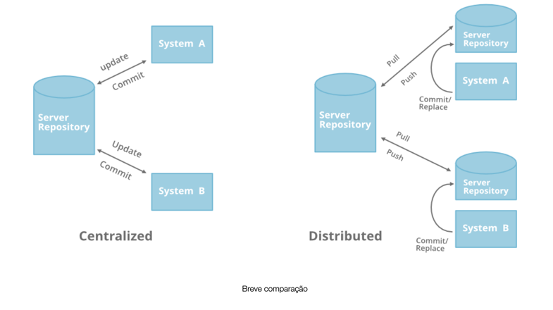
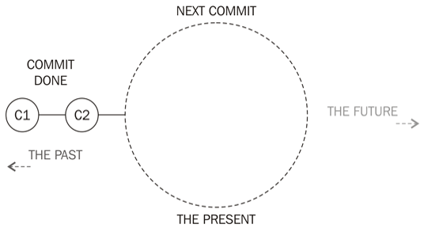
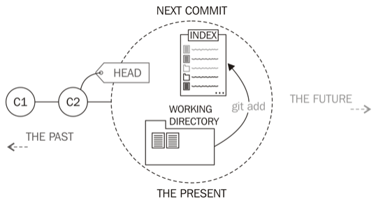
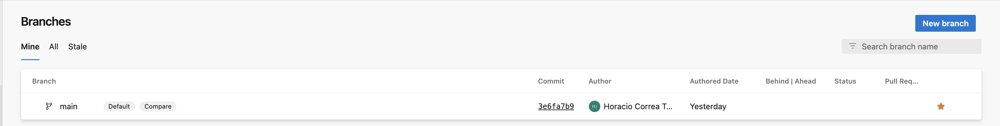
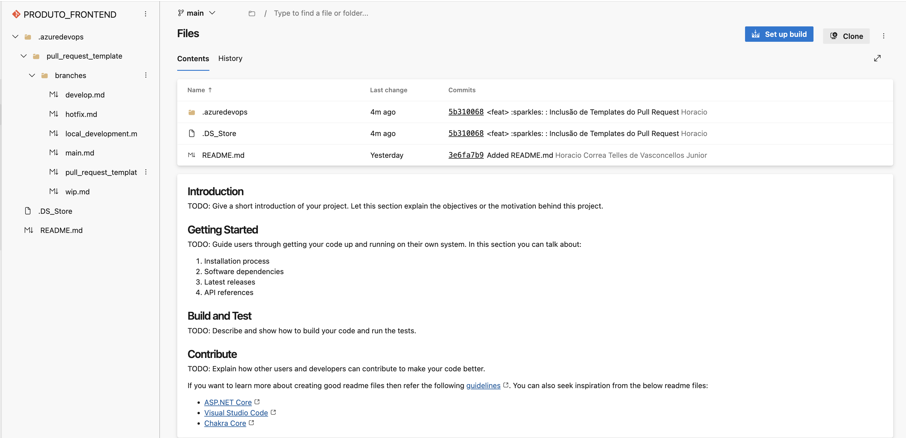
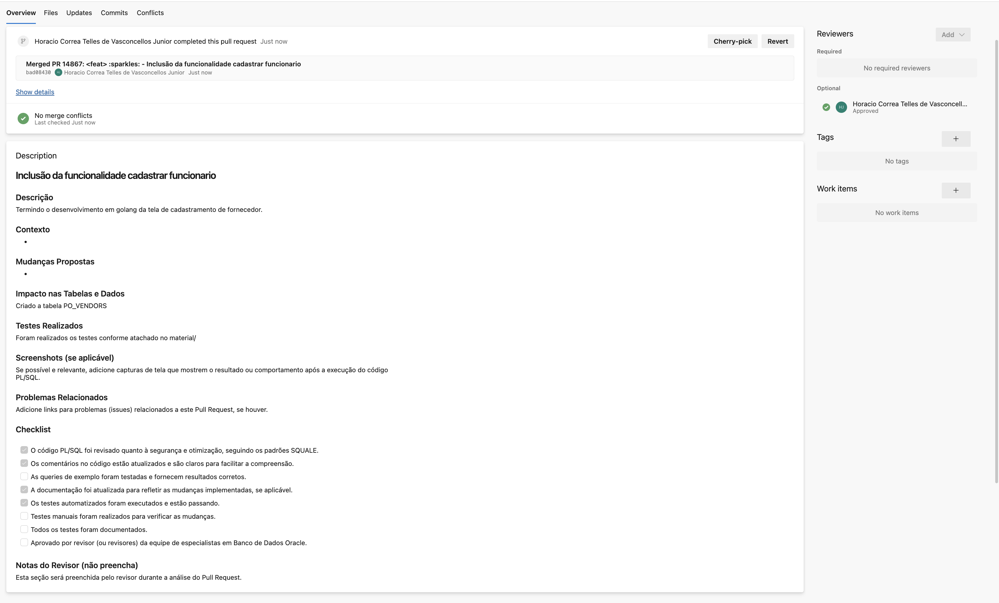
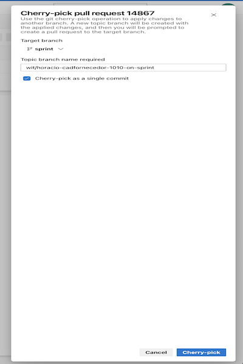
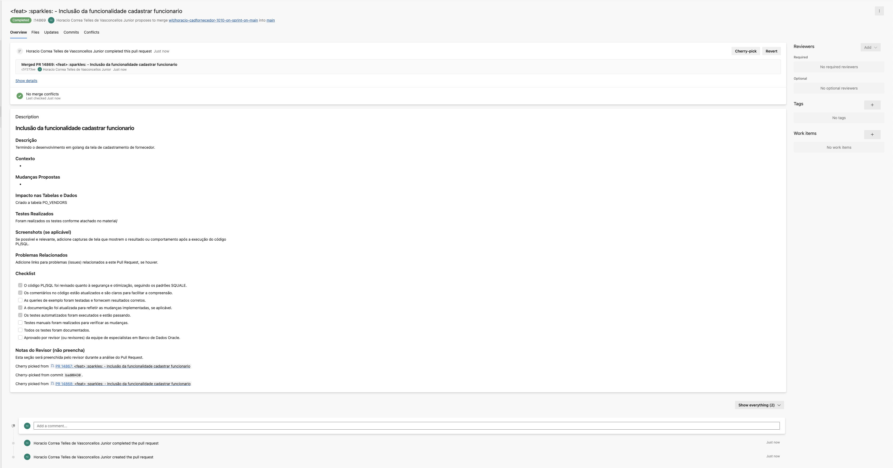

{width="200" height="200" style="display: block; margin: 0 auto"}
## Version Control System (SCCS, RCS, CVS, VCS e DVCS)
Segundo Bolinger e Bronson (1995), o primeiro sistema de controle de versões foi desenvolvido em 1972, no laboratório Bell Labs, por Marc. J Rochkind e se chamava Source Code Control System (SCCS). 

Apesar de ser considerado obsoleto, ele foi o principal sistema de controle de versão até o surgimento do RCS (Revision Control System) e uma de suas principais contribuições foi uma técnica de armazenamento chamada interleaved deltas, considerada por vários desenvolvedores de SCVs como a chave para o surgimento de técnicas de junção.

O RCS foi desenvolvido em 1982 por Walter F. Tichy, utilizando técnicas mais avançadas do que o SCCS e ainda é mantido pelo GNU Project. Segundo Spain (2001), o CVS (Concurrent Versions System) foi desenvolvido com base no RCS, mas com a possibilidade de gerenciar projetos inteiros e não só um arquivo individualmente, como no RCS. Seu projeto foi iniciado em 1986 por Dick Grune e tinha o nome de CMT. 

O atual CVS, que se tornou muito popular, teve início com Brian Berliner em 1989. O Subversion, desenvolvido, pela empresa CollabNet, foi desenvolvido com a proposta de melhorar as funcionalidades do CVS e também obteve uma grande aceitação no mercado (SUSSMAN, FITZPATRICK e PILATO, 2009).

Paralelamente ao desenvolvimento e surgimento de novas ferramentas de controle de versão, que trabalhavam de forma centralizada, a SUN começou a desenvolver o TeamWare, para controlar projetos internos da empresa. Ele trabalhava de forma distribuída e posteriormente passou a não ser mais utilizado, devido à comunidade de desenvolvedores da SUN ter optado por softwares que trabalhavam com o mesmo conceito de distribuição, mas com funcionalidades mais modernas, como o Mercurial. 

Dos sistemas de controle de versão que trabalham de forma distribuída, dois dos que mais ganharam adeptos e tiveram maior aceitação, foram o Mercurial, criado por Matt Mackall e o Git, criado por Linus Torvalds, o também criador do sistema operacional Linux.

Historicamente, o Git era fornecido como um conjunto de muitos aplicativos simples, distintos e autonomos comandos desenvolvidos de acordo com a filosofia Unix toolkitb: build ferramentas pequenas e interoperaveis. Cada comando ostentava um nome hifenizado, como como git-commit e git-log.

No entanto, as instalacoes modernas do Git nao suportam os comandos hifenizados e, em vez disso, usam um unico git com um subcomando.

### Que acrônimo é este?
Um Sistema de Controle de Versão (Version Control System - VCS) é uma metodologia ou ferramenta que ajuda a rastrear alterações dos arquivos. 

Um Sistema de Controle de Versão Distribuído (ou Distributed Version Control Systems - DVCSs) não é diferente do Sistema de Controle de Versão nesse sentido. 

No controle de origem centralizado, há um servidor e um cliente. O servidor é o repositório principal que contém todas as versões do código. Para trabalhar em qualquer projeto, primeiro o usuário ou cliente precisa obter o código do repositório mestre ou servidor.  Assim, depois de obter a versão mais recente do código, você começa a fazer suas próprias alterações no código e, depois disso, simplesmente precisa enviar essas alterações diretamente para o repositório principal.

Com isso, haverá apenas um repositório e que conterá todo o histórico ou versão do código e diferentes ramos do código. Portanto, o fluxo de trabalho básico envolve o controle centralizado de origem, obtendo a versão mais recente do código de um repositório central que conterá o código de outras pessoas também, fazendo suas próprias alterações no código e, em seguida, consolidando ou mesclando essas alterações no repositório central.

No controle de versão distribuída, a maior parte do mecanismo ou modelo se aplica da mesma forma que o centralizado.

### Qual é a diferença?
A grande diferença é que em vez de um único repositório que é o servidor, aqui cada desenvolvedor ou cliente terá seu próprio servidor e eles terão uma cópia de todo o histórico ou versão do código e todos os seus ramos em seu servidor ou máquina local.

Basicamente, cada cliente ou usuário pode trabalhar localmente e desconectado, o que é mais conveniente do que o controle de origem centralizado e é por isso que é chamado de distribuído.

Ah, tá então: __Você não precisa depender do servidor central, você pode clonar todo o histórico ou copiar o código para o seu disco rígido. Então, você confirma todas as alterações em seu próprio servidor ou repositório e, em seguida, o "conjunto de alterações" irá mesclar para o repositório mestre__.



| Controle de Versão | Vantagens | Desvantagens |
| ---- | ---- | ---- |
| CVS (Centralizado) | Considerado uma tecnologia madura | Mover ou renomear arquivos não inclui uma atualização de versão; |
| SVN (Centralizado) | Operações atômicas e de banchs | Ampla variedade de plug-ins para IDEs; | Ainda contém erros relacionados à renomeação de arquivos e diretórios; Velocidade mais lenta. |
| Git (Distribuído) | Velocidade de operação; Árvore de histórico completo disponível off-line; Modelo distribuído.| Não é ideal para desenvolvedores únicos e curva de aprendizado para aqueles usados no SVN. |
| Mercurial (hg) (Distribuído) | Velocidade de operação; Árvore de histórico completo disponível off-line; Modelo distribuído.| |
| Fóssil (Distribuído) | Rastreamento de bugs integrado, Wiki, Robusto e confiável | |

O Subversion, Git e o Mercurial possuem dezenas de comandos, porem nem todos são usado:s com a mesma frequência. Os que normalmente são utilizados, são: Os comandos selecionados são: add, backout, blame, branch, cat, checkout, clone, commit, copy, diff, log, merge, mv, pull, push, rebase, reset, revert, rm, show, status, update e tag.

### Como auxilia o desenvolvedor?
Os sistemas de controle de versões são responsáveis pela identificação de itens de configuração e devem permitir que eles evoluam de forma distribuída, concorrente e disciplinada.

O Controle de versão apoia o desenvolvimento de diversas maneiras:

- [x] **Registro do Histórico**: Registra toda a evolução do projeto, cada alteração sobre cada arquivo. (Features, Bugs, Hotfix ou Support);
- [x] **Colaboração**: Possibilita que vários desenvolvedores trabalhem em paralelo sobre os mesmos arquivos sem que um sobrescreva o código de outro.
- [x] **Ramificação de projeto**: a maioria das implementações possibilita a divisão do projeto em várias linhas de desenvolvimento, que podem ser trabalhadas paralelamente, sem que uma interfira na outra.
- [x] **Marcação e resgate de versões estáveis**: a maioria dos sistemas permite marcar onde é que o documento estava com uma versão estável, podendo ser facilmente resgatado no futuro.

| Espaço de Trabalho | Ambiente de Desenvolvimento de Software | | | | |
| ---- | ---- | ---- | ---- | ---- | ---- |
| Processos | Identificação | Controle | Contabilização | Avaliação |Liberação |
| Sistemas  | Controle de Modificações | | | | |
|           | Controle de Versões | | | | | |
|           | Gerenciamento de Contrução | | | | |

A perspectiva de desenvolvimento é dividida em três diferentes sistemas:

- [x] Sistema de controle de versões, que deve permitir a identificação dos Itens de Configuração e a evolução dos mesmos, de forma distribuída, concorrente e disciplinada. Ele é o responsável por cuidar que as diversas solicitações de modificação possam ser tratadas em paralelo, sem corromper o sistema de GCS;
- [x] Sistema de controle de modificações, que é responsável pelo controle da configuração, armazenando as informações das solicitações de modificação e relatando essas informações aos outros participantes;
- [x] Sistema de gerenciamento de construção, que é responsável por automatizar o processo de transformação dos artefatos de software em um arquivo executável e estruturar as linhas bases selecionadas para a liberação.

### Andam dizendo *Git História*
[BitKeeper, Linux e disputas de licenciamento: como Linus escreveu o Git em 14 dias](https://graphite.dev/blog/bitkeeper-linux-story-of-git-creation)
<p align="justify">Durante os primeiros dez anos de desenvolvimento, antes do uso do BitKeeper, a ferramenta de controle de versão do Linux Kernel escolhida era o próprio Linus.</p>

<p align="justify">O sistema funcionava assim: os desenvolvedores enviavam tarballs e patches para um punhado de tenentes de confiança de Linus. Após a verificação, os patches que passavam na revisão eram enviados para Linus. Finalmente, o próprio Linus os incorporava manualmente em sua própria árvore de código-fonte e, então, cortava o lançamento.</p>

Claro, o Linus-como-um-serviço-de-controle-de-versão estava longe de ser um produto perfeito. Em 1998, quando Larry McVoy [esboçou pela primeira vez a ideia por trás do BitKeeper](https://lkml.org/lkml/1998/9/30/122) na Linux Kernel Mailing List, ele escreveu "Está claro que nosso líder destemido [Linus] está, no momento, um pouco sobrecarregado, então os patches podem estar se perdendo".

Embora esse fluxo de trabalho manual pareça estúpido, para nós hoje, na época, Linus via esse fluxo de trabalho como superior às alternativas — ou seja, CVS. Muito mais tarde, [quando Linus deu uma palestra no Google em 2007 sobre o Git](https://www.youtube.com/watch?v=4XpnKHJAok8) , ele mencionou um de seus princípios básicos de design: "WWCVSND" ou "O que o CVS não faria?" Claro que esse ódio naturalmente se estendeu ao SVN também; na mesma palestra, ele continuou dizendo com um sorriso: 

- [x] Se houver usuários do Subversion na plateia, você pode querer sair. Meu ódio pelo CVS significa que vejo o Subversion como o projeto mais inútil já iniciado. O slogan inteiro do Subversion por um tempo foi CVS feito corretamente ou algo assim. E se você começar com esse slogan, não há para onde ir. É como se não houvesse maneira de fazer o CVS corretamente.

<p align="justify">O cerne da crítica de Linus contra o CVS era sua natureza centralizada. Dadas as centenas de desenvolvedores Linux por aí, Linus sentiu que era essencial que cada um deles tivesse sua própria cópia discreta do repositório em que pudessem desenvolver suas próprias ramificações.</p>

<p align="justify">Isso facilitou o trabalho offline e ajudou com a política interna; cada desenvolvedor era livre para fazer commit do que quisesse em seu próprio repositório e, então, teria a oportunidade de convencer a comunidade de que suas alterações eram valiosas. Isso impediu que um único conjunto de colaboradores com acesso de commit controlasse o único repositório.</p>

<p align="justify">O BitKeeper contrastava fortemente com o CVS. No pitch de 1998 mencionado anteriormente para o BitKeeper, Larry McVoy esboçou um sistema que, embora lembrasse como pensamos sobre controle de versão hoje, era radicalmente diferente para a época. McVoy escreveu:</p>

O mecanismo que permite que tudo isso aconteça é uma fonte distribuída sistema de gestão. As principais características do sistema são:

- [x] Todos recebem um repositório (contraste com o repositório único modelo de CVS);
- [x] As alterações podem ser enviadas por correio como 'super-patches', também conhecidos como conjuntos de alterações. Um conjunto de alterações é apenas um arquivo de patch que contém:
- [x] Todas as alterações divididas em uma revisão de cada vez
- [x] Um identificador que mostra onde o patch deve ser aplicado na árvore (os patches falharão se você não estiver atualizado como o remetente do patch)
- [x] Todo o histórico de revisão das alterações
- [x] Metadados como alterações de nome de caminho, tags simbólicas (como alpha2 ou linux-2.1.133), etc.
- [x] Um novo conceito chamado linha de desenvolvimento (LOD).

É logicamente um branch, mas não precisa estar em um branch.

<p align="justify">Os patches podem (e irão) ser seu próprio LOD. Você pode executar operações em um LOD como 'aplicar isto ao tronco'.</p>

<p align="justify">Mais tarde, Linus daria grande crédito ao BitKeeper por mudar sua visão e inspirar o Git: </p>

<p align="justify">'O BitKeeper não foi apenas o primeiro sistema de controle de versão que eu senti que valia a pena usar, mas também foi o sistema de controle de versão que me ensinou por que há um ponto neles e como você realmente pode fazer as coisas. Então o Git, de muitas maneiras, embora de um ângulo técnico seja muito, muito diferente do BitKeeper, que era outro objetivo de design porque eu queria deixar claro que não era um clone do BitKeeper, muitos dos fluxos que usamos com o Git vêm diretamente dos fluxos que aprendemos com o BitKeeper.'</p>

<p align="justify">Embora o próprio Linus tivesse o BitKeeper em alta conta, sua decisão de usar a ferramenta internamente para Linux em 2002 levou a grandes discussões na Lista de Discussão do Kernel Linux.</p>

<p align="justify">Por que os problemas? Quando Larry McVoy construiu o BitKeeper, ele o fez como parte de um empreendimento comercial de código fechado (BitMover). Embora as pessoas pudessem usar a versão comunitária gratuita do BitKeeper, isso veio com uma licença restritiva.</p>

<p align="justify">Da entrada da Wikipédia do BitKeeper : A licença para a versão 'comunitária' do BitKeeper permitiu que desenvolvedores usassem a ferramenta sem custo para projetos de software livre ou de código aberto, desde que esses desenvolvedores não participassem do desenvolvimento de uma ferramenta concorrente (como Concurrent Versions System, GNU arch, Subversion ou ClearCase) durante o uso do BitKeeper mais um ano. Essa restrição se aplicava independentemente de a ferramenta concorrente ser gratuita ou proprietária.</p>

<p align="justify">Até mesmo Richard Stallman, o último dos verdadeiros hackers e evangelista do software livre, entrou na conversa : </p>

<p align="justify">O espírito da licença Bitkeeper é o espírito da mão do chicote. É o espírito que diz: Você não tem o direito de usar o Bitkeeper, apenas privilégios temporários que podemos revogar. Seja grato por permitirmos que você use o Bitkeeper. Seja grato e não faça nada que não gostemos, ou podemos revogar esses privilégios. ... A indignação com esse espírito é a razão do movimento do software livre.</p>

<p align="justify">Mas Linus tinha uma visão muito mais pragmática; da perspectiva dele, ele só queria a melhor ferramenta para o trabalho, independentemente de onde viesse. Em 2007, ele diria : E eu estava feliz com o acordo do BitKeeper, apesar da licença, porque, francamente, no que me diz respeito, eu faço código aberto porque acho que é a única maneira certa de fazer software. Mas, ao mesmo tempo, usarei a melhor ferramenta para o trabalho e, francamente, o BitKeeper era isso.</p>

<p align="justify">Em 2005, um dos desenvolvedores do kernel Linux, Andrew Tridgell, forçou a questão quando violou a licença e fez engenharia reversa no BitKeeper para que ele pudesse retirar coisas das árvores BK sem concordar com a licença BK.</p>

<p align="justify">Da perspectiva de Tridgell, isso era completamente ético; Eu não usei o BitKeeper para escrever esta ferramenta e, portanto, nunca estive sujeito à licença BitKeeper.</p>

<p align="justify">De sua parte, Linus tentou por três meses bancar o pacificador. (E, se alguma coisa, seus comentários futuros de fato pareciam sugerir mais frustração com Andrew do que com Larry.) Mas, no final das contas, não havia como reconciliar essas diferenças.</p>

<p align="justify">Em 6 de abril de 2005, Linus enviou um e-mail para a Linux Kernel Mailing List, com o assunto “Kernel SCM saga…” , dando início à cadeia de eventos que mudaria uma indústria:</p>

<p align="justify">“Ok, como várias pessoas já sabem, estamos tentando resolver um conflito sobre o uso do BK nos últimos dois meses (e parece mais tempo). Isso não está funcionando e, como resultado, a equipe do kernel está procurando alternativas.'</p>

<p align="justify">Ele brincou sobre a história — “Não é como se minha escolha de BK tivesse sido totalmente livre de conflitos ('Não, sério? Conte! Ah, você quer dizer os gigabytes e mais gigabytes de flames que tínhamos?')' — e enfatizou sua contínua gratidão à equipe do BitKeeper.</p>

<p align="justify">
Na verdade, um impacto que o BK teve foi nos fazer (e a mim em particular) mudar fundamentalmente a maneira como fazemos as coisas. Isso varia do rastreamento de conjunto de alterações de granulação fina até como acabei confiando a submantenedores coisas muito maiores, e não tendo mais que trabalhar em uma base de patch por patch. Então os três anos com o BK definitivamente não foram desperdiçados: estou convencido de que ele nos fez fazer as coisas de maneiras melhores, e uma das coisas que estou analisando é garantir que essas coisas continuem funcionando.
</p>

<p align="justify">Então, eu só queria dizer que estou pessoalmente muito feliz com o BK [BitKeeper], e com o Larry. Não deu certo, mas com certeza fez uma grande diferença no desenvolvimento do kernel. E resolveremos o problema temporário de ter que descobrir um conjunto de ferramentas que nos permita continuar a fazer as coisas que o BK nos permitiu fazer.
</p>

#### Linus sai de férias
<p align="justify">Na realidade, enquanto ele postava a notícia pública do rompimento na lista de discussão em 6 de abril, Linus já estava trabalhando duro. Três dias antes, logo após o lançamento do 2.6.12-rc2, ele havia interrompido seu trabalho no kernel do Linux e mudado seu foco total para encontrar uma alternativa ao BitKeeper.</p>

<p align="justify">O objetivo de Linus era ter "algo utilizável em duas semanas". Como parte do e-mail de 6 de abril, ele anunciou "Vou ficar efetivamente off-line por uma semana (pense nisso como um evento normal "Linus saiu de férias") e estou apenas pedindo que as pessoas que continuam a manter as árvores BK pelo menos tentem também se certificar de que podem me enviar o resultado como patches (individuais), já que eventualmente terei que mesclar de outra forma".</p>

<p align="justify">Os e-mails de Linus transmitiam uma clara sensação de urgência; afinal, o próximo lançamento do kernel Linux estava bloqueado até que ele pudesse descobrir isso.</p>

<p align="justify">Em um e-mail em 7 de abril, ele até observou que, no pior cenário, o kernel do Linux pode até mesmo migrar para um sistema de controle de versão centralizado : "NOTA! Eu detesto o modelo SCM centralizado, mas se a situação ficar crítica e não conseguirmos fazer uma mesclagem paralela razoável em um curto espaço de tempo (por exemplo, um ou dois meses), usarei algo como o SVN em um site confiável com apenas alguns colaboradores e, pelo menos, tentarei distribuir a mesclagem entre algumas pessoas, em vez de me fazer ser o acelerador."</p>

<p align="justify">Embora o resultado seja claro para nós em retrospecto, na época, os e-mails mostram que escrever um sistema de controle de versão personalizado estava longe de ser algo garantido. Dos 205 e-mails na cadeia que abrangeu do primeiro e-mail em 6 de abril ao último em 12 de abril, houve muita discussão sobre outras alternativas de código aberto — Monotone, GNU arch, Bazaar-ng, Darcs — com alguns dos criadores dessas ferramentas entrando para defender seu projeto.</p>

<p align="justify">A principal consideração, especialmente de Linus, parecia ser o desempenho geral de cada uma dessas ferramentas. No geral, de todos os 205 e-mails, houve muita conversa sobre desempenho e eficiência das várias ferramentas.</p>

A maior questão na mente de todos parecia ser: alguma das ferramentas existentes funcionaria para um projeto do tamanho do kernel do Linux?

<p align="justify">Em 8 de abril, dois dias após seu e-mail inicial e cinco dias após começar a trabalhar seriamente, Linus compartilhou uma atualização: “Enquanto isso (e porque o monotone realmente é muito lento), aqui vai um desafio rápido para você e qualquer hacker maluco por aí: se você quiser brincar com algo realmente desagradável (mas também muito, muito rápido), dê uma olhada em kernel.org :/pub/linux/kernel/people/torvalds/.'</p>

#### As primeiras linhas do Git
<p align="justify">Quando ouvimos falar que Linus escreveu o Git original em duas semanas, vale a pena acrescentar uma grande ressalva: quando pensamos no Git hoje, pensamos nos comandos voltados para o usuário e no fluxo de trabalho geral, mas, na época, os objetivos — e a missão — eram muito diferentes e muito mais limitados em escopo.</p>

<p align="justify">Enquanto diferentes pessoas debatiam os méritos de várias ferramentas e abordagens na lista de e-mail, uma pessoa escreveu , descrevendo aproximadamente o que era necessário: “Está tudo bem ser um pouco lento, desde que não seja pateticamente lento. O propósito da solução provisória é apenas colocar o processo de fluxo de patch de volta online.'</p>

<p align="justify">O Git original de Linus era muito mais um sistema de arquivos endereçável por conteúdo do que um sistema de gerenciamento de controle de fonte completo. Aqui está sua explicação de outro e-mail:</p>

<p align="justify">
(*) Eu chamo isso de "commit", mas é algo muito mais simples. É realmente apenas um "Agora tenho <estado deste diretório>, cheguei aqui de <coleção de estados de diretório anteriores> e o motivo foi <motivo>".</P>

<p align="justify">Aliás, esse é o tipo de design. "git" realmente não se importa com coisas como mesclagens. Você pode usar qualquer SCM para fazer uma mesclagem. O que "git" faz é rastrear o estado do diretório (e como você chegou a esse estado), e nada mais. Ele não mescla, ele realmente não faz muita coisa.</p>

<p align="justify">Então, quando você "puxa" ou "empurra" um arquivo Git, você obtém a "união" de todos os estados de diretório no destino. A coisa HEAD é um ponteiro para o "mar de estados de diretório", mas você realmente tem que usar outra coisa para mesclar dois estados de diretório.</p>

<p align="justify">Quando houve discussão sobre um fluxo de trabalho de seleção seletiva e movimentação de confirmações no tópico de e-mail, Linus extrapolou isso do cliente que ele estava construindo.</p>

<p align="justify">No geral, Linus comentaria "'Git' é realmente trivial, escrito em quatro dias. A maior parte disso não foi realmente gasto codificando, mas pensando sobre as estruturas de dados."</p>

<p align="justify">É um sentimento que ele mais tarde ecoaria repetidas vezes e às vezes é tirado do contexto, mas soa verdadeiro — a escolha da estrutura de dados na época era a parte nova do código que Linus havia escrito. Depois que Linus compartilhou seus primeiros commits, não houve discussão sobre fluxo de trabalho (o que a maioria vem à mente quando se pensa no Git hoje). Em vez disso, a maioria das discussões se concentrou na arquitetura que agora tomamos como certa: a interface direta do Git com o sistema de arquivos e sua abordagem baseada em hash para dizer quais arquivos foram alterados (e garantir a integridade dos dados).</p>

<p align="justify">Mas também houve alguns que viram a visão e estavam ansiosos para começar a trabalhar em Git. No mesmo dia em que Linus pediu às pessoas para verificar as mudanças em seu diretório, algumas pessoas enviaram scripts que construíram funcionalidades adicionais sobre sua fundação.</p>

<p align="justify">Duas semanas depois de ter começado, em 17 de abril de 2005, Linus enviou um e-mail para a lista de e-mails: 'Primeira fusão real do kernel Git!'</p>

#### Vislumbres do futuro
<p align="justify">A parte mais satisfatória de ler a cadeia de e-mails inicial, quase vinte anos depois de todos esses eventos terem ocorrido, é ver as dicas do futuro, desconhecidas pelos autores na época.</p>

Ao avaliar uma das alternativas de controle de origem propostas, **monótono**, um usuário escreveu:

<p align="justify">Uma coisa um pouco irritante é que o monotone não parece ter uma interface web. Eu costumava usar o bk muito para rastrear bugs, porque era muito rápido ter uma janela do navegador web aberta e clicar nas revisões de um arquivo, ler comentários de check-in, etc. Alguém sabe se um está sendo trabalhado?</p>

<p align="justify">Na época, as UIs da web para controle de origem e revisão de código estavam apenas se tornando populares; no Google, Guido van Rossum estava construindo sua primeira peça dedicada de ferramenta de revisão de código na web no Mondrian . E, dois anos depois desse tópico de e-mail, o GitHub seria fundado.</p>

Há também uma ironia em toda essa discussão sobre desempenho na cadeia de e-mails.

<p align="justify">Uma breve discussão paralela expressando preocupação sobre como o Git poderia funcionar se apoiado por um sistema de arquivos baseado em rede foi invertida nos dias atuais; para gigantes como Google (FUSE) e Meta (EdenFS), esses sistemas de arquivos baseados em rede e com controle de origem são uma parte crítica de como eles continuam a dimensionar o controle de origem e as compilações em seus enormes monorepos.</p>

<p align="justify">E a principal preocupação na época que inspirou Linus a escrever o Git em primeiro lugar — que nenhuma das alternativas de controle de revisão existentes teria desempenho suficiente para suportar o grande histórico e a taxa de transferência de confirmações do repositório do kernel Linux?</p>

Isso se repetiria alguns anos depois , quando o Meta migrou seu repositório principal do Git, exatamente pelo mesmo motivo.

É claro que, na época, tudo isso era desconhecido para as várias pessoas que participaram da cadeia de e-mails original **Kernel SCM Saga**.

<p align="justify">O Git foi criado como uma ferramenta para desbloquear futuros lançamentos do kernel Linux — não foi concebido como uma reinvenção global de todo o gerenciamento de código-fonte; os comentários de Linus destacam que ele viu explicitamente o gerenciamento de código-fonte como o domínio de outras ferramentas que então interagiriam com o Git.</p>

<p align="justify">Quando pensamos em história, frequentemente a romantizamos como tendo nascido de um golpe repentino de inspiração. Mas a criação do Git mostra a realidade muito mais dura da invenção: um desacordo lentamente crescente sobre uma licença; a necessidade de uma solução de backup fragmentada para desbloquear o trabalho; e então polimento e iteração contínuos ao longo de anos e anos, liderados não pelo inventor, mas sim por uma comunidade.</p>

#### Epílogo
Por fim, a BitMover tornou o BitKeeper de código aberto. Amarrando um laço em toda a situação, um comentarista do HN (Bryan Cantrill, agora CTO da Oxide) deixou um comentário fantástico quando a BitMover fez o anúncio em 2016:

<p align="justify">A grande ironia é que Larry foi um dos primeiros defensores do código aberto do sistema operacional na Sun — e acreditava que, quando a Sun finalmente descobriu coletivamente e fez acontecer (em 2005), já era uma década ou mais tarde.</p>

Então, por um lado, você pode ver a história do BitKeeper com relação ao código aberto como quase grega em seu escopo trágico: cada razão que Larry descreveu para **sourceware** para a Sun se aplicava tanto ao BK quanto ao SunOS — com até mesmo o mesmo tecnólogo (Torvalds) liderando a alternativa de código aberto!

E você pode dizer ao BK e a Larry agora que é **tarde demais**, assim como Larry disse à Sun em 2005, mas também acho que isso representa uma dicotomia forçada de "vencedores" e "perdedores". 

<p align="justify">Ao contrário, eu gostaria de acreditar que a inovação contínua nas comunidades illumos (SmartOS, OmniOS, etc.) prova que nunca é tarde demais para software de código aberto -- que comunidades de código aberto (como cidades) podem ser pequenas, mas vibrantes, desempenhando um papel crítico para seus constituintes.</p>

<p align="justify">Em um universo alternativo, poderíamos estar executando o BK no SunOS em vez do Git no Linux? Claro -- mas ser capaz de executar um BK de código aberto em um illumos de código aberto também é muito bom;</p>

<p align="justify">O futuro de dois sistemas inovadores foi garantido, mesmo que tenha demorado um pouco mais do que todos gostariam.</p>

Uma resposta foi postada por outro usuário do HN, **luckydude** — o próprio Larry McVoy.

<p align="justify">Sim, essa ironia não passou despercebida para mim. Mas em ambos os casos, as empresas agiram em interesse próprio. Nenhuma delas teve coragem de abandonar seu fluxo de receita existente. É difícil dizer o que teria acontecido.</p>

<p align="justify">Foi uma jornada interessante e, no mínimo, BK foi a inspiração para Git e Hg, o que é uma contribuição para o campo.</p>

### Origem do Nome

Git é uma variação do Inglês britânico para a palavra de origem escocesa **get**, significa **um filho ilegítimo**.

E dependendo do humor do Linus, o nome também pode significar: 

- [x] Apenas uma combinação randômica de letras;
- [x] Estúpido, abjeto, desprezível;
- [x] “Global Information Tracker”;
- [x] E finalmente, quando dá algum problema (ei, nada é perfeito): **Goddamn idiotic truckload of sh*t, simplesmente, o sinônimo: bastard**
- [x] Exemplo de uso: **Shut up you git!**
- [x] Um coloquialismo para descrever alguém com muita sorte: **You won the lottery? You lucky git!**

{width="200" height="200" style="display: block; margin: 0 auto"}

Em resumo:

- [x] Git foi criado por um programador para ser usado por programadores;
- [x] Linus Torvalds, o criador do kernel Linux, começou a escrever Git em 2005 com o objetivo de ter um sistema de controle de versão distribuído, de código aberto, de alto desempenho e difícil de corromper para o projeto do kernel Linux usar;
- [x] Em uma semana, o código-fonte do Git foi hospedado dentro do sistema de controle de versão Git; e em dois meses e meio, a versão 2.6.12 do kernel Linux foi lançada usando Git;

### Termos mais comuns

| Item                 | Descricao |
| ----                 | ----      |
| Item de configuração | São elementos de informação que são criados, ou que são necessários, durante o desenvolvimento de um produto de software. |
| Repositório          | Local de armazenamento de todas as versões dos arquivos ou itens de configuração.|
| Versão               | Estado de um item de configuração que está sendo modificado. Toda versão deve possuir um identificador único, ou VID (Version Identifier). |
| Revisão              | É uma versão que resulta de correção de defeitos (hotfix,datafix,bugfix) e/ou  a implementação de uma nova funcionalidade. |
| Branch (Ramo)        | Versão paralela a máster, não substituem as versões anteriores, apenas é um processo de desenvolvimento. |
| Clone                | É o ato de criar uma cópia de trabalho local do repositório que encontra-se no servidor. |
| Commit               | Ação de criar ou atualizar um artefato quando este passar por uma modificação. |

### Comandos Plumbing vs Porcelain
É claro, pela rapidez desenvolvida, não seria simples. Por isso conta a lenda, que todos os comandos ou fontes do git, eram **PLUMBING**, que era a forma de implementar este controle de forma objetiva por programadores. Posteriormente os comandos **PORCELAIN**, foram aparecendo no mundo GIT.

<p align="justify">A aplicação dos termos estranhamente vem de vasos sanitários (sim, esses), tradicionalmente feitos de porcelana, e da infraestrutura de encanamento (canos e ralos). Podemos dizer que a camada de porcelana fornece uma interface amigável para o encanamento. A maioria das pessoas só lida com porcelana.</p>

A utilização dessa terminologia em analogia, para separar os comandos de baixo nível que os usuários geralmente não precisam usar diretamente (comandos de **encanamento**) dos comandos de alto nível mais amigáveis (comandos de **porcelana**).

- [x] O que é Git e sua importância.

### Controlando Versão com o Git
<p align="justify">O controle de versão envolve o gerenciamento de múltiplas versões de um projeto, rastreando as alterações realizadas nos arquivos de projetos, onde cada alteração é registrada permitindo desfazer ou reverter facilmente.</p>

#### Repositório
Olhando para o Sistema Operacional, uma pasta de trabalho, diretório e repositório, servem para armazenar arquivos e consequentemente é um local para armazenar arquivos, no final todos são sinônimos mesmo, porém a grande diferença é que no controle de versão (git ou outros),  um repositório é um local onde **os arquivos são armazenados e monitorados**, já em uma pasta ou diretório qualquer da sua máquina isso não acontece a menos que você inicialize um no repositório. O controle de versão é composto de duas partes:

- [x] Repositório e a área de trabalho. O repositório armazena todo o histórico de evolução do projeto, registrando toda e qualquer alteração feita em cada item versionado. O desenvolvedor não trabalha diretamente nos arquivos do repositório. Ao invés disso, usa uma área de trabalho que contém a cópia dos arquivos do projeto e que é monitorada para identificar as mudanças realizadas. Essa área é individual e isolada das demais áreas de trabalho.
- [x] Uma pasta que contém um repositório Git inicializado é um diretório de trabalho. Você pode mover o diretório de trabalho em seu sistema de arquivos sem perder ou corromper o repositório.
- [x] No diretório de trabalho, você também entedeu que existe um diretório .git. Vamos chamá-lo de diretório `git` de agora em diante. No diretório `git`, existem arquivos e pastas que compõem nosso repositório.
- [x] Normalmente, você cria um novo repositório baixando outro repositório que já existe (conhecido como clonagem pelo Git mas vamos começar inicializando um novo repositório local vazio.

```
Exemplo:
cd ~ && mkdir workDirectory1 && cd ~/workDirectory1 && git init
OU
cd ~ && git init workDirectory1
OU
cd ~ && mkdir workDirectory1 && cd ~/workDirectory1 && git init --bare
OU
cd ~ && git init workDirectory1 –bare
```

- [x] Quando inicializamos um repositório com o `git init`, vários arquivos e diretórios, são criados:

| Arquivo/Diretório |  Descrição                                                                                         |
| ----              | ----                                                                                               |
| .git/config       | Arquivo de configuração                                                                            |
| .git/description  | Arquivo de Descrição                                                                               |
| .git/HEAD         | Apontador HEAD                                                                                     |
| .git/hooks/       | Diretório de scripts Hooks                                                                         |
| .git/info/exclude | Contém arquivos que devem ser excluídos do repositório.                                            |
| .git/objects/info | Contêm informações de objeto que são usados para armazenamento de objeto e referência.             |
| .git/objects/pack | Contêm informações de arquivos de pacote, que são usados para armazenamento de objeto e referência |
| .git/refs/heads   | Contem ponteiro para os branchs.                                                                   |
| . git/refs/tags   | Contem ponteiro para as tags.                                                                      |

{width="600" height="400" style="display: block; margin: 0 auto"}

#### Status do Arquivo em um diretório de Trabalho
Quando você cria ou copia um novo arquivo no diretório de trabalho, o primeiro estado do arquivo não é rastreado (**untracked**). 
Isso significa que o Git vê que há algo **novo**, mas não cuidará disso (**não rastreará o novo arquivo**). 
Se você deseja incluir o arquivo em seu repositório, você deve adicioná-lo usando o comando `git add nome_do_arquivo`. 

Depois de adicionado, o estado do arquivo não é modificado (**unmodified**). Isso significa que o arquivo é novo (o Git diz que não foi modificado porque nunca rastreou as alterações) e está pronto para ser confirmado ou atingiu a **staging area** (também **chamada de índice**). 
Se você modificar um arquivo que já foi adicionado ao índice, ele mudará seu status para modificado (**modified**). A captura de tela a seguir explica o ciclo de vida do status do arquivo:

{width="600" height="400" style="display: block; margin: 0 auto"}

A staging area ou índice é um local virtual que coleta todos os arquivos que você deseja incluir no próximo commit. Todos os arquivos (**novos ou modificados**) que você deseja incluir no próximo commit devem ser incluidos usando o comando git add. Se você adicionou um arquivo acidentalmente, terá que retira-lo, para removê-lo do próximo commit.

Para retornar para retornar o arquivo ao status não rastreado:  `git reset HEAD <file>`

- [x] Crie um diretório, como por exemplo: `mkdir ~/desenvolvimento`
- [x] Vá para o diretório: `cd ~/desenvolvimento`
- [x] Inicialize o diretório para torna-lo um repositório: `git init .`
- [x] Crie um arquivo nome_do_arquivo.txt e inclua qualquer informação que desejar;
- [x] Execute o comando `git status` ou entre no diretório `cd .git` e repare que não há entrada em **index e no diretório objects**;
- [x] Adicione o arquivo para o controle do git através do comando: `git add nome_do_arquivo.txt`
- [x] Observe agora, no diretório .git, a criação do arquivo index e a arvore criada no diretório objects.

#### Conceituando
- [x] Todas as informações necessárias para representar a história do projeto são armazenados em arquivos referenciados por um "nome do objeto" de 40 dígitos. 
- [x] Em cada caso, o nome é calculado baseado no valor hash SHA-1(Secure Hash Algorithm) do conteúdo do objeto, o que torna impossível de encontrar dois objetos diferentes com o mesmo nome.
- [x] Todo objeto consiste de 3 coisas - um tipo, um tamanho e conteúdo. 
- [x] O tamanho é simplesmente o tamanho do conteúdo, o conteúdo depende do tipo que o objeto é, e existem quatro tipos diferentes de objetos: “blob", "tree", "commit", and “tag".
- [x] Um "blob" é usado para armazenar dados do arquivo - é geralmente um arquivo. Um objeto "blob" não é nada mais que um grande pedaço de dados binários. Ele não se referencia a nada ou possui atributos de qualquer tipo, nem mesmo um nome de arquivo.
- [x] Um "tree" é basicamente como um diretório - ele referencia um conjunto de outras trees e/ou blobs. Ele possui um conjunto de ponteiros para blobs e outras trees - ele geralmente representa o conteúdo de um diretório ou sub diretório
- [x] Um "commit" aponta para uma simples tree, fazendo com que o projeto se parecesse em um determinado ponto no tempo. Ele contém meta informações sobre aquele ponto no tempo, por exemplo um timestamp, o autor das modificações desde o último commit, um ponteiro para um commit anterior, etc. O objeto "commit" liga o estado físico de uma árvore com a descrição de como a conseguimos e porque.
- [x] Uma "tag" é uma forma de marcar um commit específico de alguma forma como especial. Ele é normalmente usado para identificar certos commits como versões/revisões específicas ou alguma coisa junto a aquelas linhas. contém um nome de objeto (chamado simplesmente de 'object'), tipo de objeto, nome da tag, o nome da pessoa ('tagger') que criou a tag.
- [x] Eles são organizados dentro se seu próprio sistema de arquivos que estão sobre o sistema de arquivos de sua máquina.
Usando `git gc`, o Git fará alguma limpeza interna, incluindo compressão de arquivos de revisão.

#### A metáfora do tempo
- [x] Usando o comando `git reset`, também entramos em contato com outro elemento fundamental do Git, o ponteiro HEAD. 
##### Passado
- [x] O passado é representado pelos commits anteriores que fizemos, conforme mostrado por C1 e C2 na tabela:
{width="4   00" height="400" style="display: block; margin: 0 auto"}

- [x] O ponteiro HEAD é a referência ao último commit que fizemos ou o pai do próximo commit que faremos, conforme mostrado no diagrama:

{width="400" height="400" style="display: block; margin: 0 auto"}

- [x] Portanto, o ponteiro HEAD é o sinal de trânsito que indica o caminho para voltar um passo no passado.

##### Presente
- [x] O presente é onde trabalhamos. Quando um commit anterior é feito, ele se torna parte do passado e o presente se mostra como este diagrama:

{width="400" height="400" style="display: block; margin: 0 auto"}

- [x] Temos uma referência HEAD que aponta de onde viemos (o commit 2). 
- [x] Reiniciar para HEAD como fizemos anteriormente é uma maneira de voltar a este estado inicial, onde ainda não houve modificações. 
- [x] Então, temos o diretório de trabalho. Este diretório coleta arquivos adicionados ao repositório nos commits anteriores. Agora, está no estado UNTRACKED. Neste local, fazemos nosso trabalho em arquivos e pastas, adicionando, removendo ou modificando-os.

{width="400" height="400" style="display: block; margin: 0 auto"}

- [x] Nosso trabalho permanece no diretório de trabalho até decidirmos colocá-lo no próximo commit que realizaremos. 
- [x] Usando o comando `git add`, adicionamos o que queremos promover para o próximo commit, marcando-os no índice, conforme mostrado neste diagrama:

{width="400" height="400" style="display: block; margin: 0 auto"}

Com `git rm --cached <arquivo ou pasta>`, você pode descompactar um arquivo removendo-o do índice, conforme mostrado aqui:

{width="400" height="400" style="display: block; margin: 0 auto"}

- [x] Com `git reset --hard HEAD`, voltaremos ao estado inicial, perdendo todas as mudanças que fizemos no diretório de trabalho. 
- [x] No final, uma vez que você se commita, o presente se torna parte do passado. O diretório de trabalho volta ao estado inicial, onde tudo é intocado e o índice é esvaziado, conforme mostrado neste diagrama:

{width="400" height="400" style="display: block; margin: 0 auto"}

##### Anatomia de um Commit
- [x] Os commits são os blocos de construção de um repositório. Cada repositório nada mais é do que uma sequência ordenada de commits.
- [x] Toda vez que commitamos algo, o Git envolve todos os arquivos incluídos em um arquivo blob binário. Esta é uma das características mais importantes do Git. Enquanto outros sistemas de controle de versão salvam arquivos um por um, o Git produz um snapshot toda vez que você confirma, armazenando todos os arquivos que você incluiu nele. Você pode assumir que um snapshot é um commit e vice-versa.
- [x] O hash de confirmação é a string de 40 caracteres que vimos nos registros. Essa string é a placa do commit, a forma como podemos nos referir a ela de forma inequívoca.

##### Mensagem boa e legível **SEMPRE**
- [x] [Conventional Commits](https://www.conventionalcommits.org/pt-br/v1.0.0/)
- [x] [Diretrizes Angular](https://github.com/angular/angular.js/blob/main/DEVELOPERS.md#-git-commit-guidelines)
- [x] [Semantic Commit Messages](https://sparkbox.com/foundry/semantic_commit_messages)
- [x] [Karma-Semantic Messages](https://karma-runner.github.io/6.4/intro/installation.html)
- [x] Adicionar uma mensagem de confirmação não é apenas uma boa prática, é obrigatório. 
- [x] Como sugestão, monte um arquivo padrão de mensagem. 
      - [x] Não suponha que o revisor entenda qual era o problema original.
      - [x] Não presuma que o revisor tenha acesso a sites / serviços da web externos.
      - [x] Não assuma que o código é auto-evidente / auto-documentado.
      - [x] Descreva por que uma alteração está sendo feita.
      - [x] Leia a mensagem do commit e veja se esta clara, sobre as mudanças realizadas ou apromoradas.
      - [x] Garanta informações suficientes para decidir se deve revisar.
      - [x] A primeira linha de confirmação é a mais importante.
      - [x] Descreva quaisquer limitações do código atual.

A principal regra a seguir é:

- [x] A mensagem de confirmação deve conter todas as informações necessárias para entender e revisar completamente o patch para correção. 
- [x] Menos não é mais. Mais é mais;
- [x] Utilize no comentário : (refs | references | IssueID) #Numero_da_tarefa ou #Numero_do_chamados Incidente/Demanda;
- [x] O sucesso de longo prazo de um projeto repousa em sua manutenção e um mantenedor, tem poucas ferramentas, a maior delas é o log de seu projeto;
- [x] O que pode ser um aborrecimento a princípio logo se torna um hábito e, eventualmente, uma fonte de orgulho e produtividade para todos os envolvidos;
- [x] Para criar um histórico útil, as equipes devem primeiro concordar com uma convenção de mensagem de confirmação que defina pelo menos as três itens:
      - [x] Estilo ⇒ Sintaxe de marcação, margens de quebra automática, gramática, letras maiúsculas e pontuação.
      - [x] Conteúdo ⇒ Que tipo de informação o corpo da mensagem de confirmação (se houver) deve conter? O que não deve conter?
      - [x] Metadados ⇒ Como devem ser referenciados os IDs de rastreamento, os números de solicitação pull, etc.
- [x] Para iniciar o nosso processo, podemos definir algumas regras.
      - [x] Separe o assunto do corpo com uma linha em branco;
      - [x] Limite a linha de assunto para 50 caracteres;
      - [x] Coloque em maiúscula a linha de assunto;
      - [x] Use o corpo para explicar o que e por que versus como;

###### Mudando o Ultimo Commit
Após a execução de um git commit, você  percebe que cometeu um erro - talvez você tenha esquecido de incluir um novo arquivo ou tenha deixado alguns comentários de fora. 

- [x] Exemplo: git commit –amend

O recurso `–amend`, faz com que commit do  branch atual tem um ponteiro para o commit anterior, seu pai; isso é tudo o que o liga ao resto do ramo.

Em particular, nenhum commit aponta para este, então nenhum outro commit é afetado (lembre-se de que os commits apontam para seus pais, mas não para seus filhos). Assim, descartar o commit de ponta consiste apenas em mover o ponteiro do branch de volta para o anterior; nada mais precisa ser feito.

O `git commit --amend` funciona com merge commits também; então, há vários pais e ramos envolvidos em vez de apenas um, mas funciona de forma análoga.

###### Descartando o Ultimo Commit
Após a execução de um git commit, você  percebe você só quer “descomitar” e continuar trabalhando. Isso é simples; apenas faça:

- [x] Exemplo: `git reset HEAD ~`

O HEAD ref refere-se à ponta do branch atual como sempre, e o til final nomeia o commit anterior àquele. 

Assim, o efeito deste comando é mover o branch para trás um commit, descartando o último. Uma vez que ele também redefine o índice para coincidir, quaisquer alterações correspondentes em sua árvore de trabalho agora não são testadas novamente.
	
###### Descartando o Qualquer numero de Commits
Após a execução de um git commit, você  percebe você só quer “descomitar” e continuar trabalhando. Isso é simples; apenas faça: 

- [x] Exemplo: `git reset HEAD ~n`
- [x] HEAD ~ n refere-se ao n-ésimo commit de volta, porque essa sintaxe de numeração começa em zero; HEAD e HEAD ~ 0 são equivalentes.

###### Revertendo um Commit
Suponha que você queira desfazer o efeito de um commit anterior - você não quer editar o histórico para fazer isso, mas sim fazer um novo commit desfazendo as alterações do commit anterior. O comando git revert torna isso fácil; apenas dê a ele o commit que você deseja desfazer:

- [x] Exemplo: `git revert hash`

Isto irá computar a diferença entre aquele commit e o anterior, reverter, e então tentar aplicá-lo à sua árvore de trabalho. O Git irá preparar uma mensagem de commit indicando o commit sendo revertido e seu assunto, que você pode editar.

##### Ignorando Arquivos e Diretórios
Frequentemente, trabalhamos com arquivos temporários ou pessoais que não queremos enviar para o repositório, no git, há a possibilidade de se pular certos tipos de arquivos ou pastas. 
Para alcançar este resultado, podemos criar um arquivo .gitignore no repositório. 

O Git irá lê-lo e então pular os arquivos e pastas que listamos dentro dele.

A variável de configuração opcional core. excludesFileindica um caminho para um arquivo que contém padrões de nomes de arquivo a serem excluídos, semelhantes aos `$GIT_DIR/info/exclude`. 
Os padrões no arquivo de exclusão são usados além daqueles em `$GIT_DIR/info/exclude`.

OBSERVAÇÃO: 

- [x] Há padrões já desenvolvidos que podem ser utilizados, bastando que você encontre o modelo em [.gitignore](https://github.com/github/gitignore)
- [x] Observe que o arquivo `.gitignore` não é retroativo, OU SEJA, se você adicionou alguns arquivos `* .tmp` ao índice antes de introduzir o arquivo `.gitignore`, eles permanecerão sob controle de revisão.

##### Diretórios vazios
Git não rastreia diretórios como entidades separadas; em vez disso, ele cria diretórios na árvore de trabalho conforme necessário para criar os caminhos para os arquivos retirados e remove diretórios se não houver mais nenhum arquivo neles. 

Isso implica que você não pode representar um **diretório vazio** diretamente para o Git; 

Você precisa colocar pelo menos um arquivo de espaço reservado no diretório para que o Git crie a entrada.

##### Versionamento de Aplicações
Versionamento é o processo de atribuição de nomes de qualquer versão única ou números de versão única para estados únicos de arquivos e diretórios de computador. O versionamento normalmente é realizado por um servidor de controle de versão, que responde a requisições feitas por clientes que implementam a tecnologia deste controle de versão.

Os números das versões irão refletir fatos ocorridos dentro do processo de desenvolvimento e irão demonstrar sua utilidade na verificação de compatibilidades. Dentro do ciclo de vida de um software (ALM), as principais razões que podem criar a necessidade de uma nova versão são:

- [x] [Versionamento Semântico](https://semver.org/lang/pt-BR/)
- [x] Inclusão ou extensão de requisitos;
- [x] Correções de bugs ou falhas;
- [x] Fatoração completa do software ou mudança de arquitetura;
- [x] Correções menores e ajustes estéticos.

<p align="justify">Dentro do processo estabelecido, no desenvolvimento de soluções, há a necessidade em se controlar, a liberação de versões e de correções em todo o processo de desenvolvimento, obtendo com isso o controle de recursos, como evidenciados a seguir: </p>

- [x] Rastreamento de alterações desde a versão inicial de um artefato;
- [x] Percorrer o histórico de alterações, com a possibilidade de voltar a uma versão anterior;
- [x] Controle de acesso que permita o trabalho em paralelo de grandes equipe;
- [x] Definição de versões em múltiplos escopos, desde pequenas alterações até versões terminadas;
- [x] Ramificação de versões, permitindo uma linha paralela de desenvolvimento.

##### Tipos de Versionamento 
**Versionamento linear** : Dentro de uma determinada categoria de número de versão (maior, menor), esses números são geralmente atribuídos em ordem crescente e correspondem a modificações realizadas em um diretório, como o de um software. 
**Versionamento distribuído**: Cada conjunto de modificações (chamado de changeset) recebe um hash que identifica unicamente aquele conjunto. Permite aos usuários combinar livremente as modificações, sem restrição de ordem como no versionamento linear.

###### Regras de Versionamento
- [x] Por padrão seguir: [Versionamento Semântico](https://semver.org/lang/pt-BR/)
- [x] No início do desenvolvimento, a versão ‘maior’ deve ser zero (0.menor.z).
- [x] A versão 1.0.0 define o desenvolvimento como público, ou seja, o desenvolvimento esta liberado no repositório de artefados.
- [x] Uma vez que um pacote versionado foi lançado (released), o conteúdo desta versão não pode ser modificado. Qualquer modificação gerará uma nova release.
- [x] A versão maior - M (vM.m.p | M > 0) deve ser incrementada, caso sejam introduzidas mudanças incompatíveis, com a versão anterior.
- [x] A versão menor - m (vM.m.p | M > 0) deve ser incrementada se uma funcionalidade nova e compatível, for introduzida na versão relesed. Deve ser incrementada se qualquer funcionalidade for definida como descontinuada. Deve ser incrementada se uma nova funcionalidade ou melhoria substancial for introduzida dentro do código. Quando menor, for incrementada, a coreção patch (p) deve  ser redefinida para 0(zero).
- [x] A versão de  Correção(patch)  (V{maior.menor[.patch[-release]]} onde  M > 0, deve ser incrementado apenas se mantiver compatibilidade e introduzir correção de bugs.
- [x] Uma correção de bug é definida como uma mudança interna que corrige um comportamento incorreto.
- [x] Uma versão de temporária (pre-release) pode ser identificada adicionando um hífen e uma série de identificadores separados por ponto imediatamente após a versão de Correção (patch).
- [x] O identificador deve incluir como prefixo uma das seguintes palavras: snapshot,pré-alpha,alpha, beta e Release Candidate.

| Item | Descrição |
| ---- | ---- |
| Pré-Alpha | Refere-se a todas as atividades realizadas durante o projeto de software anteriores aos testes. Tais atividades podem incluir análise de requisitos, projeto de software, desenvolvimento e teste de unidade. |
| Snapshot  | Versão de testes isolada ou não da estrutura  de desenvolvimento para ser testada por usuário(s) interessado(s) a localizar e corrigir bugs, ou testar as novidades da nova versão com antecedência. |
| Alpha | Os desenvolvedores geralmente realizam testes caixa-branca. Validações adicionais são feitas com testes caixa-preta por uma equipe específica de testes. |
| Beta | Inicia-se quando não há mais funcionalidades a serem implementadas no software. |
| Release Candidate | Simplesmente RC, refere-se a uma versão com potencial para ser o produto final, pronta para ser lançada a menos que algum bug sério apareça. A versão de pré-Lançamento tem precedência inferior à versão normal a que está associada. Uma versão de pré-Lançamento (pre-release) indica que a versão é instável e pode não satisfazer os requisitos de compatibilidade pretendidos, como indicado por sua versão normal associada. |

###### Estrutura da Mudança
<p align="justify">A regra principal para criar boas commits é garantir que haja apenas uma "alteração lógica" por confirmação. Há muitas razões pelas quais essa é uma regra importante:</p>

- [x] Quanto menor a quantidade de código sendo alterada, mais rápido e fácil será revisar e identificar possíveis falhas;
- [x] Se uma alteração apresentar falhas posteriormente, pode ser necessário reverter a confirmação interrompida. Isso é muito mais fácil se não houver outras alterações de código não relacionadas emaranhadas com a confirmação original;
- [x] Ao navegar no histórico usando a anotação, pequenas alterações bem definidas também ajudam a isolar exatamente de onde e por que um código veio.

### Trabalhando com Branches
<p align="justify">Branches são ramos de desenvolvimento onde podemos alterar nossos arquivos de modo que fiquem separados uns dos outros, para que mais tarde possamos fundir o seu conteúdo com outra outra branch, de por exemplo, código de produção, ou apagar a branch se fizemos alguma coisa que não ficou correta, sem alterar qualquer outro ponto.</p>

Um branch Git é a coisa mais simples possível: **um ponteiro para um commit**, como um **ref**. O branch em si é definido como todos os pontos alcançáveis no gráfico de commit. 

A referência especial **HEAD** determina em qual branch você está; se HEAD for uma referência simbólica para uma ramificação existente, então você está “nessa” ramificação.

Se, por outro lado, HEAD é um simples ref nomeando diretamente um commit por seu SHA-1 ID, então você não está "em" nenhum branch, mas sim no modo **desanexado HEAD**, o que acontece quando você verifica alguns anteriores comprometa-se a examinar.

- [x] `git symbolic-ref HEAD refs/heads/main`
- [x] `git rev-parse HEAD`,busca o commit atual.

<p align="justify">O commit HEAD também é freqüentemente referido como o commit "atual". Se você estiver em um branch, ele também pode ser chamado de último commit ou "ponta" do branch.</p>

<p align="justify">Uma ramificação evolui com o tempo; portanto, se você estiver no branch main e fizer um commit, o Git fará o seguinte:</p>

- [x] Cria um novo commit com suas mudanças no conteúdo do repositório;
- [x] Torna o commit na ponta atual do branch main o pai do novo commit;
- [x] Adiciona o novo commit ao armazenamento de objeto;
- [x] Altera o branch main (especificamente, `refs/heads/main`) para apontar para o novo commit;

Em outras palavras, o Git adiciona o novo commit ao final do branch usando o ponteiro pai do commit e avança o branch ref para o novo commit.

Observe algumas consequências deste modelo:

- [x] Considerado individualmente, um commit não é intrinsecamente parte de nenhum branch. Não há nada no próprio commit para informar pelo nome em quais branches ele está ou pode ter estado; a associação do branch é uma consequência do gráfico de confirmação e dos ponteiros do branch atual.
- [x] “Excluir” um branch significa simplesmente excluir a referência correspondente; não tem efeito imediato no armazenamento de objetos. Em particular, deletar um branch não deleta nenhum commit. 
- [x] O que ele pode fazer, entretanto, é tornar certos commits desinteressantes, pois eles não estão mais em nenhum branch (ou seja, não podem mais ser acessados ​​no gráfico de commit a partir de qualquer ponta ou tag do branch). 

##### Navegando pelas Branches
A maneira usual de fazer um novo branch chamado novo_branch é:

- [x] `git checkout -b novo_branch` - "Switched to a new branch 'novo_branch’"

<p align="justify">Isso cria o branch 'novo_branch’ apontando para o commit atual e muda para ele. Quaisquer alterações existentes no índice ou na árvore de trabalho são preservadas e agora serão enviadas para o 'novo_branch’ ao invés do branch anterior.</p>

<p align="justify">Até que um branch progrida, ambos os branches apontam para o mesmo commit. Até que ambos progridam independentemente, um branch ainda aponta para um commit anterior no outro.</p>

Você também pode especificar um commit para iniciar o novo branch, em vez do atual, por exemplo:

- [x] `git checkout -b 'novo_branch’ 9c6a1fad`

Mudou para um novo ramo 'novo_branch’

Isso inicia um novo branch no commit nomeado e alterna para ele. No entanto, se houver alterações não confirmadas conflitantes, você terá que lidar com elas primeiro. Se você deseja criar o novo branch, mas não alternar para ele, use `git branch 'novo_branch’`.

##### Índices
<p align="justify">O índice é uma estrutura de dados independente, separada de sua árvore de trabalho e de qualquer commit. É simplesmente uma lista de nomes de caminho de arquivo junto com atributos associados, geralmente incluindo o ID de um blob no banco de dados de objetos que contém os dados para uma versão desse arquivo.</p>

<p align="justify">O índice é a fonte implícita do conteúdo para um commit normal. Quando você usa o git commit, você pode pensar que ele cria o novo commit baseado em seus arquivos de trabalho.</p>

Isso não, em vez disso, ele simplesmente percebe o índice atual como um novo objeto de árvore e faz o novo commit a partir dele. É por isso que você precisa **preparar** um arquivo alterado no índice com git add para que ele faça parte do próximo commit.

<p align="justify">O índice não contém apenas mudanças a serem feitas no próximo commit; é o próximo commit, um catálogo completo dos arquivos que serão incluídos na árvore do próximo commit.</p>

<p align="justify">Quando você faz check-out de um branch, Git redefine o índice para corresponder ao commit de ponta daquele branch; você então modifica o índice com comandos como git add para indicar as mudanças que farão parte do próximo commit.</p>

O `git add` ele adiciona o conteúdo do arquivo atual ao banco de dados de objetos como um novo blob e atualiza a entrada de índice desse arquivo para se referir a esse blob.

<p align="justify">É por isso que o git commit é sempre rápido, mesmo se você estiver fazendo muitas alterações: todos os dados reais já foram armazenados pelos comandos git add anteriores.</p>

<p align="justify">Semelhante ao git commit, git diff sem argumentos também possui o índice como um operando implícito; ele mostra as diferenças entre sua árvore de trabalho e o índice, ao invés do commit atual.</p>

Inicialmente, eles são os mesmos, já que o índice corresponde ao último commit após um checkout limpo ou commit. 

<p align="justify">Conforme você faz alterações em seus arquivos de trabalho, eles aparecem na saída do git diff e desaparecem conforme você adiciona os arquivos correspondentes.</p>

<p align="justify">A ideia é que git diff mostre mudanças ainda não commitadas, então você pode ver com o que você ainda precisa lidar enquanto prepara o próximo commit.</p>

O `git diff --staged` mostra o oposto: as diferenças entre o índice e o commit atual (ou seja, as mudanças que estão prestes a ser confirmadas).

##### Merge
<p align="justify">A mesclagem é o complemento da ramificação no controle de versão: uma ramificação permite que você trabalhe simultaneamente com outras pessoas em um determinado conjunto de arquivos, enquanto a mesclagem permite combinar posteriormente o trabalho separado em duas ou mais ramificações que divergiram.</p>

O que significa **mesclar** com sucesso dois ou mais conjuntos de alterações no mesmo arquivo depende da natureza do conteúdo. O Git tentará mesclar automaticamente, e geralmente considerará isso um sucesso se os dois conjuntos de alterações alteraram partes não sobrepostas do arquivo.

<p align="justify">O Git tem mecanismos muito sofisticados para apresentar conflitos de mesclagem e ajudá-lo a resolvê-los. Você pode escolher interativamente conjuntos de alterações para aplicar, ignorar ou editar posteriormente.</p>

<p align="justify">Para lidar com mesclagens complexas, o Git funciona perfeitamente com ferramentas de mesclagem externas, emerge e kdiff, ou com ferramentas de mesclagem personalizadas que você mesmo escreve.</p>

Lembre-se de **The Object Store** que um commit tem uma lista de zero ou mais **commits pai**. 

O commit inicial em um repositório não tem pais, e um commit simples em um branch tem apenas um. 

Quando você faz um commit como parte de um merge, o Git lista os commits de ponta de todos os branches envolvidos no merge como os pais do novo commit. 

##### Push e Pull
Use os comandos `git pull` e `git push` para atualizar o estado de um repositório. 

O ponto central a lembrar é que, em relação ao conteúdo, um repositório consiste em duas coisas: 

- [x] Um armazenamento de objeto e um conjunto de refs - ou seja, um gráfico de commit;
- [x] Um conjunto de nomes de branch e tags que chamam aqueles commits que são de interesse;

Quando você clona um repositório, como com git clone, Git faz:

- [x] Cria um novo repositório (diretório e working tree).
- [x] Adiciona um controle remoto chamado “origem” para se referir ao repositório que está sendo clonado em `.git/config`: ”

```
[“remote "origem"]
	url     = http://servidor/usuario/repositorio.git
	pushurl = http://servidor/usuario/repositorio.git
	fetch   = +refs/heads/main:refs/remotes/origem/main
	push    = +refs/heads/main:refs/remotes/origem/main
```

O valor de busca aqui, chamado de refspec, especifica uma correspondência entre conjuntos de refs nos dois repositórios:

- [x] No lado esquerdo dos dois pontos nomes refs no remoto e a especificação indica com o padrão 
- [x] No lado direito onde o correspondente refs deve aparecer no repositório local.
- [x] Nesse caso, significa: “Mantenha cópias dos refs do branch da origem remota em seu namespace local neste repositório, refs / remotes/origin/.”
- [x] Executa git fetch origin, que atualiza nossos refs locais para os branches do remoto (criando-os neste caso), e pede ao remoto para enviar todos os objetos que precisamos para completar o histórico para esses refs (no caso deste novo repositório, todos eles).
- [x] Finalmente, o Git verifica o branch atual do remoto (sua referência HEAD), deixando você com uma árvore de trabalho para olhar. Você pode selecionar um branch inicial diferente para fazer check-out com --branch ou suprimir o checkout totalmente com -n.

##### Pull
O git pull na realidade, executa `git fetch` no remoto para o branch atual, atualizando as referências de rastreamento local do remoto e obtendo quaisquer novos objetos necessários para completar o histórico desses refs: ou seja, todos os commits, tags, árvores e blobs acessíveis a partir das dicas do novo branch.

<p align="justify">Em seguida, ele tenta atualizar o branch local atual para coincidir com o branch correspondente no remoto. Se apenas um lado adicionou conteúdo ao branch, isso terá sucesso e comumente chamado de fast-forward.</p>

<p align="justify">Porem, se ambos os lados se comprometeram com o branch, entretanto, o Git tem que fazer algo para incorporar as duas versões do histórico do branch em uma versão compartilhada.</p>

<p align="justify">Por padrão, isso é uma merge: o Git merge o branch remoto no local, produzindo um novo commit que se refere a ambos os lados do histórico por meio de seus ponteiros-pai. </p>

##### Push
<p align="justify">Tenta atualizar a ramificação correspondente no remoto com seu estado local, enviando todos os objetos de que o remoto precisa para completar o novo histórico. Isso falhará se a atualização não for de fast-forward.</p>

<p align="justify">E o Git irá sugerir que você primeiro faça o `pull` para resolver as discrepâncias e produzir uma atualização aceitável.</p>

##### Removendo Arquivos
<p align="justify">Git efetua a remoção da entrada do arquivo do índice, agendando-o para remoção no próximo commit e exclui o arquivo de trabalho. Exemplo: git rm arquivo02.txt; git status
A remoção só vale para arquivos que já estão no controle do Git, arquivos que não estiverem no controle do Git, poderão ser removidos com o comando `rm`ou `delete`;</p>
##### Renomeando Arquivos
Renomear um arquivo é, de certa forma, equivalente a excluir esse arquivo e criar um novo com um nome diferente e o mesmo conteúdo - mas isso também pode ocorrer sem que você queira renomear nada, se o novo arquivo apenas coincidir com o antigo.

- [x] Exemplo: `git mv arquivo004.txt arquivo04.txt`

A distinção é de intenção e,portanto, deve ser representada separadamente pelo sistema para que seja capturada. 

E pode ser muito importante fazer isso, porque as pessoas geralmente desejam que o histórico de um arquivo renomeado seja preservado; até mesmo chamando o que fizemos de "renomear", estamos implicitamente dizendo que este é realmente "o mesmo arquivo, apenas com um nome diferente".
Após o rename, verifique o status e observe o que o git faz.

##### Unstaging Alterações
O git reset redefine o índice para corresponder ao commit atual, desfazendo quaisquer alterações feitas com git add. git reset relata os arquivos com alterações pendentes após sua ação. Exemplo: `git reset`

##### Entendendo os Patches
Um “patch” é uma representação compacta das diferenças entre dois arquivos, destinada ao uso com arquivos de texto orientados por linha.

- [x] Ele descreve como transformar um arquivo em outro, e é assimétrico: o patch de file1 para file2 não é o mesmo que o patch para a outra direção (diria para deletar e adicionar linhas opostas, como veremos). 
- [x] O formato do patch usa contexto, bem como números de linha para localizar regiões de arquivo diferentes, de modo que um patch pode frequentemente ser aplicado a uma versão um pouco anterior ou posterior do primeiro arquivo do que aquela de onde foi derivado, desde que o programa aplicador ainda pode localizar o contexto da mudança. 
- [x] Os termos “patch” e “diff” são frequentemente usados de forma intercambiável, embora haja uma distinção, pelo menos historicamente. 
- [x] Um diff precisa apenas mostrar as diferenças entre dois arquivos e pode ser mínimo ao fazê-lo. Um patch é uma extensão de um diff, acrescido de informações adicionais, como linhas de contexto e nomes de arquivos, que permitem que seja aplicado de forma mais ampla. Atualmente, o programa diff do Unix pode produzir patches de vários tipos.

Aqui está um patch simples, gerado por git diff:

- [x] Este é o cabeçalho Git diff; 
- [x] diff --git não é um comando literal, mas apenas sugere a noção de um diff específico do Git no estilo de comando Unix. a / foo.c eb / foo.c 
- [x] São os arquivos que estão sendo comparados, com nomes de diretórios iniciais adicionados a e b para distingui-los no caso de serem iguais (como estão aqui; este patch mostra as mudanças de uma versão para outra do mesmo arquivo). Para gerar esse patch, mudei o arquivo foo.c e executei git diff, que mostra as mudanças não testadas entre a árvore de trabalho e o índice. Na verdade, não há diretórios nomeados a e b no repositório; eles são apenas convenção:

índice 30cfd169..8de130c2 100644

- [x] Esta é uma linha de cabeçalho estendida, uma das várias formas possíveis, embora haja apenas uma neste patch. Esta linha fornece informações do índice Git sobre este arquivo: 30cfd169 e 8de130c2 são os IDs de blob das versões A e B do conteúdo do arquivo sendo comparados e 100644 são os "bits de modo", indicando que este é um arquivo normal: não executável e não um link simbólico (o uso de .. aqui entre os IDs de blob é apenas um separador e não tem nada a ver com seu uso na nomeação de conjuntos de rotações ou para git diff). Outras linhas de cabeçalho podem indicar os modos antigo e novo se isso tiver mudado, nomes de arquivo novos e antigos se o arquivo estiver sendo renomeado, etc.  
- [x] Os IDs de blob são úteis se este patch for aplicado posteriormente pelo Git ao mesmo projeto e houver conflitos ao aplicá-lo. Se esses blobs estiverem no banco de dados de objetos, o Git pode usá-los para realizar uma fusão de três vias com essas duas versões e a cópia de trabalho, para ajudá-lo a resolver os conflitos. O patch ainda faz sentido para outras ferramentas além do Git; eles simplesmente ignorarão esta linha e não poderão usar as informações extras.

Os patches formatados são muito semelhantes aos diffs de arquivo gerados por outras ferramentas, contendo muito mais informações, incluindo seu nome e endereço de e-mail, e para cada commit, o carimbo de data/hora do commit, a mensagem, o autor e etc. 
         
Eles permitem que qualquer pessoa importe os *changesets* incluídos diretamente no Git, onde todas as informações de commit são preservadas.

- [x] `$ git format-patch --binary --stdout origin/master..HEAD > feature_branch.patch` 

Após gerar o arquivo de patch, você pode anexá-lo ao um relatório de ISSUE. Os desenvolvedores ou outros usuários podem importar esse conjunto de patches para seus repositórios locais usando o seguinte comando, substituindo novamente o nome de arquivo apropriado:

- [x] `$ git am --signoff feature_branch.patch`

##### Cherry-pick
O comando `git cherry-pick` permite que os desenvolvedores selecionem e apliquem commits específicos de uma branch para outra. Isso é especialmente útil quando um desenvolvedor deseja incorporar alterações específicas sem a necessidade de mesclar todas as mudanças de uma branch, evitando assim a introdução de alterações indesejadas ou não testadas.

Exemplo: `git cherry-pick <commit_hash>`

##### Rebase
O comando `git rebase` é utilizado para reorganizar o histórico de commits. Ele permite que você aplique commits de uma branch em outra, mantendo um histórico linear e mais limpo. Isso é especialmente útil quando você deseja incorporar alterações da branch principal sem criar um commit de merge.

Exemplo: `git rebase <branch_destino>`

##### Reset
O comando git reset permite desfazer alterações e manipular o histórico de commits. Você pode usá-lo para voltar o HEAD para um commit específico, desfazendo os commits indesejados.

Exemplo: `git reset --hard <commit_hash>`

##### Stash
O git stash é utilizado para salvar temporariamente alterações não comprometidas, permitindo que você mude de branch ou aplique correções emergenciais sem perder seu trabalho atual.

- [x] Antes de usar o git stash, é bom verificar quais alterações você fez: `git status`
- [x] Para armazenar suas alterações, use o comando: `git stash save "Trabalho em progresso: correções em file1 e file2"`
- [x] Isso cria um novo stash e limpa seu diretório de trabalho, revertendo-o ao último commit.
- [x] Para ver os stashes que você criou, execute: `git stash list`
- [x] Agora que suas alterações estão salvas, você pode mudar para a branch main: `git checkout main`
- [x] Aqui, você pode fazer as correções necessárias e realizar commits conforme necessário. 
- [x] Após resolver o problema, volte para a branch onde estava trabalhando: `git checkout feature`
- [x] Para aplicar as alterações que você salvou anteriormente, use: `git stash apply`
- [x] Isso aplicará o stash mais recente ao seu diretório de trabalho. Se você quiser aplicar um stash específico, use: `git stash apply stash@{0}`
- [x] Se você deseja aplicar e remover o stash da lista ao mesmo tempo, utilize: `git stash pop`
- [x] Por fim, verifique se suas alterações foram aplicadas corretamente: `git status`

##### Bisect
Esse comando é uma ferramenta poderosa para depuração que ajuda a identificar qual commit introduziu um bug, permitindo que você navegue por commits anteriores para encontrar a origem do problema.

- [x] Primeiro, você deve iniciar o processo de bisect: `git bisect start`
- [x] Indique qual é o commit ruim (o último commit que você sabe que está com problemas): `git bisect bad`
- [x] Agora, você precisa indicar um commit bom (um commit anterior onde os testes estavam passando). Você pode usar o hash do commit ou uma referência como HEAD~5 para indicar um commit anterior: `git bisect good <commit_hash>`
- [x] O Git agora selecionará um commit entre os dois pontos (bom e ruim) e mudará para esse commit. Você deve testar se ele é bom ou ruim. Após testar, se o commit estiver bom, execute: `git bisect good` e caso estiver ruim, execute: `git bisect bad`
- [x] Continue testando os commits conforme indicado pelo Git. O processo continuará até que você encontre o commit que introduziu o bug. Se você testar e marcar como bom, o Git irá escolher outro commit mais antigo, se marcar como ruim, ele escolherá um commit mais recente.
- [x] Quando você encontrar o commit problemático, finalize a sessão de bisect com: `git bisect reset`

##### Reflog
O comando git reflog mantém um registro de todas as ações que afetaram a estrutura do repositório, permitindo recuperar commits perdidos ou branches excluídos acidentalmente.

- [x] Primeiro, verifique o estado atual do seu repositório: `git status`
- [x] Para visualizar o histórico das referências, execute: `git reflog`
- [x] Identifique o commit perdido, Com base na saída do reflog, identifique o hash do commit que você deseja recuperar. Neste caso, vamos recuperar. 
- [x] Para retornar ao estado desse commit, use o comando git checkout com o hash do commit: `git checkout hash`
- [x] Agora você está no estado do repositório correspondente ao commit perdido.
- [x] Crie uma nova branch, se você quiser manter esse estado e continuar trabalhando a partir dele, crie uma nova branch: `git checkout -b recuperado-feature`

##### Submodule
O git submodule permite incluir repositórios Git dentro de outro repositório, sendo útil para gerenciar dependências ou bibliotecas externas. Um exemplo típico da utilização do submodule, poderia ser a de Integração.
Para ilustrar a utilização de submódulos no Git com dois repositórios, um para o Back-office e outro para a Integração com o Banco de Dados, podemos considerar os seguintes repositórios:
Repositório Back-office e outro de Repositório de Integração com o Banco de Dados

- [x] Primeiro, crie um repositório principal: `mkdir meu_projeto && cd meu_projeto &&  git init .`
- [x] Adicione o repositório do back-office: `git submodule add https://github.com/xxxxx/back-office backoffice`
- [x] Adicione o repositório da integração com o banco de dados: `git submodule add https://github.com/xxxx/Queen-Back-Office integracao_banco_dados`
- [x] Após adicionar os submódulos, verifique a estrutura do projeto: `ls -l`
- [x] `git submodule update --init --recursive`
- [x] O arquivo .gitmodules deve conter informações sobre os submódulos:
```
[submodule "backoffice"]
    path = backoffice
    url = https://github.com/Planning-Inspectorate/back-office
[submodule "integracao_banco_dados"]
    path = integracao_banco_dados
    url = https://github.com/InseeFr/Queen-Back-Office
```
##### Worktree
O comando git worktree permite que você crie múltiplas árvores de trabalho a partir de um único repositório  Git. Isso significa que você pode trabalhar em diferentes branches simultaneamente, cada uma em seu próprio diretório, sem precisar alternar entre elas constantemente. 

- [x] Para criar um novo worktree a partir de uma branch existente, você pode usar o seguinte comando: `git worktree add <caminho/para/novo/worktree> <nome-da-branch>`
- [x] Você também pode criar uma nova branch diretamente a partir de um worktree. Para isso, use a opção -b: `git worktree add -b nova-feature ../nova-feature`
- [x] Para ver todos os worktrees criados, utilize o comando: `git worktree list`
- [x] Quando você terminar de trabalhar em um worktree, pode removê-lo com: `git worktree remove <caminho/para/worktree>`

Possibilidades do seu uso:
- [x] Hotfixes: Se um bug crítico for descoberto enquanto você está trabalhando em uma nova funcionalidade, você pode rapidamente criar um novo worktree para implementar o hotfix sem interromper seu trabalho atual.
- [x] Desenvolvimento Paralelo: Quando estiver desenvolvendo várias funcionalidades que não estão interligadas, crie um worktree separado para cada uma delas. Isso evita a necessidade de alternar entre branches e mantém seu ambiente de desenvolvimento limpo.
- [x] Testes: Você pode criar um ambiente dedicado para testar uma branch específica sem afetar seu espaço de trabalho principal.

##### Sparse-checkout
O comando git sparse-checkout permite que você faça checkouts de um subconjunto de arquivos em um repositório Git, em vez de baixar todos os arquivos. Isso é útil em repositórios grandes, como monorepos, onde você pode não precisar de todos os arquivos para trabalhar em uma parte específica do projeto. 

- [x] Para começar a usar o sparse checkout, você deve inicializá-lo: `git sparse-checkout init`
- [x] Após a inicialização, você pode definir quais arquivos ou diretórios deseja incluir: `git sparse-checkout set <padrão1> <padrão2>`, por exemplo: `git sparse-checkout set 'src/**/*.js' 'docs/**'`
- [x] Para ver quais padrões estão atualmente definidos no seu arquivo de sparse-checkout: `git sparse-checkout list`
- [x] Se você já estiver em um modo de sparse checkout e quiser adicionar mais diretórios: `git sparse-checkout add <novo_diretorio>`
- [x] Para repopular seu diretório de trabalho com todos os arquivos novamente: `git sparse-checkout disable`

##### Resolvendo alguns Problemas
###### Conflitos
- [x] Após tentar realizar um merge ou pull que resultou em conflitos, o primeiro passo é verificar o status do seu repositório. Use o comando: `git status`, esse comando mostrará quais arquivos estão em conflito.
- [x] Os arquivos que estão em conflito serão listados sob "Unmerged paths". Você pode também usar o comando git diff para ver as diferenças entre as versões e entender melhor os conflitos: `git diff`
- [x] Abra os arquivos listados em conflito em um editor de texto. O Git marca as seções conflitantes com os seguintes delimitadores: 

```<<<<<<< HEAD
Conteúdo da sua branch atual
=======
Conteúdo da branch que está sendo mesclada
>>>>>>> nome-da-branch
```
- [x] Você deve editar o arquivo para resolver o conflito, mantendo apenas as partes desejadas e removendo os marcadores.
- [x] Após resolver os conflitos, adicione os arquivos resolvidos ao stage: `git add <nome_do_arquivo>`
- [x] Depois, finalize o merge com um commit: `git commit -m "Resolvendo conflitos"`
- [x] Para garantir que tudo foi resolvido corretamente, você pode verificar o histórico de commits: `git log`
###### Quebrando de Produto na Branch sprint
- [x] Identifique o último commit estável;
- [x] Crie uma nova ramificação com base neste commit estável: `git checkout -b develop-fix hash`;
- [x] Envie esta ramificação "estável" como o novo desenvolvimento: `git push origin develop-fix --force`
###### Revertendo uma implementação
- [x] Identifique o hash de confirmação da mesclagem problemática;
- [x] Reverter a mesclagem: `git revert -m 1 merge123` O sinalizador -m 1 indica que o primeiro pai (geralmente o principal) deve ser a base para a reversão.
- [x] Empurre o commit de reversão: `git push origin main`
- [x] Mais tarde, quando o recurso estiver pronto para ser relançado, use uma mesclagem reversa para reintroduzi-lo:` git checkout feature-branch git merge main`
###### Ressuscitando `após git reset --hard`
- [x] Execute `git reflog` para visualizar o histórico do seu repositório
- [x] Encontre o hash de confirmação que você deseja recuperar;
- [x] Restaure-o usando `git reset --hard: `git reset --hard hash`
- [x] Seus commits perdidos estão de volta, e você pode respirar novamente.

##### Merge e Rebase
No Git, **merge** e **rebase** são duas técnicas utilizadas para integrar alterações de diferentes branches. Ambas têm seus próprios propósitos, vantagens e desvantagens. Abaixo, apresentamos uma comparação detalhada entre merge e rebase.

- [x] O **merge** é uma operação que combina as alterações de duas branches. Ao realizar um merge, o Git cria um novo commit que une as duas linhas de desenvolvimento. `git checkout main && git merge feature-branch`
- [x] O **rebase** é uma operação que aplica as alterações de uma branch em cima de outra branch, reescrevendo o histórico de commits. Em vez de criar um commit de merge, o rebase "move" a base da branch. `git checkout feature-branch && git rebase main` 

A integração de código em projetos colaborativos é uma parte essencial do desenvolvimento de software, e tanto o GitHub quanto o Azure DevOps oferecem métodos para realizar merges. Abaixo, apresentamos uma comparação entre os métodos de merge disponíveis em ambas as plataformas.

| **Característica**          | **GitHub**                                      | **Azure DevOps**                               |
|-----------------------------|-------------------------------------------------|------------------------------------------------|
| **Tipos de Merge**          | - Merge Commit<br>- Squash and Merge<br>- Rebase and Merge | - Merge (no fast-forward)<br>- Squash merge<br>- Rebase (não é padrão) |
| **Interface de Pull Request** | Interface amigável com comentários e revisões. Permite discussões sobre mudanças antes do merge. | Interface de Pull Request similar, com opções de revisão e comentários. Suporta políticas de branch. |
| **Resolução de Conflitos**  | Conflitos podem ser resolvidos diretamente na interface do GitHub ou localmente antes do merge. | Resolução de conflitos pode ser feita na interface ou localmente, com suporte a ferramentas externas. |
| **Proteção de Branches**    | Permite definir regras para branches protegidas, como exigir revisões antes do merge. | Suporta políticas de branch que podem exigir builds bem-sucedidos, revisões obrigatórias e outras regras antes do merge. |
| **Histórico de Commits**    | O método "Merge Commit" preserva o histórico completo, enquanto "Squash" combina commits em um único commit. | O "Merge" padrão preserva o histórico, enquanto o "Squash" também combina commits em um único commit. |
| **Integração Contínua (CI)** | Integração com GitHub Actions para automação após merges. | Integração com Azure Pipelines para automação e CI/CD após merges. |
| **Notificações e Relatórios**| Notificações por email e integração com outras ferramentas como Slack. Relatórios sobre Pull Requests disponíveis. | Notificações configuráveis por email e integração com Teams/Slack. Relatórios detalhados sobre builds e Pull Requests. |
| **Suporte a Branch Policies**| Permite definir políticas para branches, como exigência de revisões ou builds bem-sucedidos antes do merge. | Suporte robusto a políticas de branch, permitindo configurações detalhadas para controle de qualidade antes do merge. |

##### Fluxos de Trabalho com Git
<p align="justify">A realização de pipelines requer uma abordagem estruturada, semelhante a projetar, desenvolver, testar e implementar aplicações, mas não há muitas informações disponíveis que possam ajudá-lo nessa jornada. Como faço para projetar um pipeline caso a equipe use estratégia de ramificação X, estratégia de teste Y e estratégia de lançamento Z? Com a introdução da infraestrutura como código (IaC), o pipeline deve tratar o código da infraestrutura de forma semelhante ao código da aplicação. O código da infraestrutura deve ser validado de acordo com as políticas de segurança e diretrizes da organização.</p>

<p align="justify">Ao começar, é melhor manter as coisas simples e, portanto, inicialmente o GitHub Flow ou o desenvolvimento baseado em Trunk podem funcionar melhor. Eles também são ideais para equipes menores que exigem a manutenção de apenas uma única versão de um lançamento.</p>

| Tipo de produto e seu método de lançamento                                   | Equipe                          | Maturidade                       | Modo de filial                                  |
| -------------                                                                | -----                           | -------------                    | -------------                                   |
| Todos                                                                        | Equipe pequena	                 | Alto	                            | Trunk-Based Development (TBD)                   |
| Produtos que suportam implantação e lançamento contínuos, como produtos SaaS | Meio	                           | Moderado	                        | GitHub-Flow e TBD                               |
| Produtos com uma janela de lançamento definida e uma cadência periódica      | Meio	                           | Moderado	                        | Git-Flow and GitLab-Flow com release branch     |
| Produtos que exigem qualidade e suportam implantação e lançamento contínuos, | Meio	                           | Moderado	                        | GitLab-Flow                                     |
| Produtos que exigem qualidade e longo ciclo de manutenção                    |	Grande                         | Moderado	                        | Git-Flow                                        |

Não existe estratégia perfeita. A estratégia que você escolher dependerá da sua equipe e da natureza e complexidade do seu projeto e por isso deve ser avaliada caso a caso.
## Estruturas de Repositório Git
Quando iniciamos um projeto, podemos seguir algumas práticas recomendadas para organizar o repositório para uma melhor contribuição da equipe e uma estrutura de projeto mais elegante. Utilizamos para a criação dos repositórios GIT, conforme configuração dos servidores, que são mantidos pelo 60pportunities.

!!! Definições

    === "Monorepo"
        É um único repositório que armazena todo o seu código e recursos para cada projeto;
        O repositório contém mais de um projeto lógico (por exemplo, um cliente iOS, Android e um aplicativo da Web);
        Esses projetos provavelmente **não estão relacionados**, estão conectados livremente ou podem ser conectados por outros meios (por exemplo, via dependência ferramentas de gerenciamento).
        O repositório é grande de várias maneiras:
        
        - [x] Número de commits;
        - [x] Número de ramificações e/ou tags;
        - [x] Número de arquivos rastreados;
        - [x] Tamanho do conteúdo rastreado (conforme medido observando o diretório .git do repositório);
        - [x] Empresas usam monorepo, porque ele tem bons benefícios relacionados à manutenção de código, integração, reutilização de código, refatoração e mudanças em larga escala.
        - [x] Código compartilhado: Reutilize código de validação, componentes de interface do usuário e tipos na base de código. 
        - [x] Reutilize o código entre o back-end e o front-end.
        - [x] Revisões de código mais eficaz: A maioria dos desenvolvedores agora entende a plataforma de ponta a ponta, levando a que mais bugs sejam identificados e corrigidos no estágio de revisão do código.
        - [x] **Mudanças atômicas**: Mude a API de um servidor e modifique os clientes que consomem essa API no mesmo commit. Você pode alterar um componente de botão em uma biblioteca  compartilhada e os aplicativos que usam esse componente no mesmo commit. Isso evita o incômodo de tentar coordenar confirmações em vários repositórios.
        - [x] Compartilhamento de componentes comuns. Os desenvolvedores têm uma visão do que está acontecendo em todos os serviços e podem efetivamente criar componentes comuns.

        === "Ferramentas Monorepo"

            |  Tool | Entenda                 |
            | ----- | --------------          |
            | [Bazel](https://bazel.build/?hl=pt-br)  | Se destaca em repositórios grandes e multilíngues com processos de construção complexos. |
            | Gradle Build Tool                       | É particularmente adequado para linguagens JVM e fornece suporte nativo para caches de construção locais, o que pode acelerar significativamente o tempo de construção. |
            | Lerna |   otimiza o fluxo de trabalho de gerenciamento de repositórios de vários pacotes com git e npm.  |
            | Nx    | completo de ferramentas de desenvolvimento que oferece uma gama impressionante de recursos, como orquestração avançada de tarefas, execução distribuída de tarefas e cache de construção inteligente. |
            | Pants Build | Sistema de construção projetado para grandes monorepos que podem conter múltiplas linguagens e frameworks.      |
            | Rush        | orquestrador de construção escalonável para monorepos, que pode gerenciar projetos JavaScript e não JavaScript. |
            | Turborepo   | Alto desempenho para bases de código JavaScript e TypeScript.  |
            | Bit         | Ferramenta de gerenciamento de monorepo, mas oferece uma experiência tão excelente que pode resolver todas as “dificuldades” de monorepo com o novo fluxo de trabalho que fornece. |

    === "Multi-repos ou Polyrepo" 
        Refere-se à organização de seus projetos, cada um em seus próprios repositórios separados.
        Esta é a arquitetura **mais comum em uso** e pode ser vista em grandes empresas e possui algumas vantagens:
       
        - [x] Propriedade: Como a base de código imita a arquitetura, uma pequena equipe pode possuir e desenvolver e implantar de forma independente a pilha completa de um microsserviço.
        - [x] Melhor escala: Bases de código menores são mais fáceis de gerenciar e levam a menos instâncias de ""Ninguém gosta de um conflito de mesclagem. (merge hell)"".
        - [x] Clones pequenos: A maioria dos SCMs, incluindo git, não oferece suporte à clonagem de partes de um repositório. Para grandes bases de código, clones, pulls e pushs levam   uito tempo, o que é ineficiente.
        - [x] Controle de acesso: Pode ser aplicado no nível do projeto, pois cada funcionário tem acesso a uma pequena seção de projetos.
   
    === "Estratégia 60pportunities - Nomenclatura do Repositório"
        Por padrão iremos impedir que certos caracteres sejam incluídos no nome do repositório.
        Embora não haja uma maneira errada de nomear um repositório, alguns nomes são melhores que outros.
        O comprimento   do repositório não deve conter mais de 64 caracteres Unicode e não pode ser idêntico a nenhum outro nome de repositório Git no projeto.
        Todas essas sugestões estão sendo seguidas pelo criador automático.
        Usando isso como diretriz, dividimos o repositório em 3(três) seções separadas por underscore. Esse formato consiste em seções que definem:
        
        * PRODUTO, FINALIDADE e ESTRUTURA DA LINGUAGEM.
        
        | Definição  |Conceito                                                      |
        | ----       |------                                                        |
        | PRODUTO    | Informe a SIGLA do Sistema.                                  |
        | FINALIDADE | Utilizado para aplicações monolíticas (MONO),BACK_END, FRONT_END, MOBILE e LIB (Biblioteca de Documentos). |
        | ESTRUTURA  | Linguagem(PHP,JAVA,Python),Sistema |Operacional(IOS,Android),DOC(Documentaçao).  |
        
        Deve se perceber as seguintes características:  descritivo, legibilidade, consistência, contextual, extensibilidade, reuzabilidade e sucinto.
        
        | ----          | SEÇÃO 01      | ----               | SEÇÃO 02            | SEÇÃO 03   |
        | ----          | ----          | ----               | ----                | ----       |
        | PRODUTO       | SIGLA         | FINALIDADE         | SIGLA               | LINGUAGEM  |
        | ----          | -----         | ------             | -----               | --------   |
        | PPPPPPPPPPP   | XXXXXXX       | RESTAPI            | RESTAPI             | JAVA       |
        | PPPPPPPPPPP   | XXXXXXX       | BACK-END           | BACK                | PHP        |
        | PPPPPPPPPPP   | XXXXXXX       | FRONT-END          | FRONT               | NODE       |
        | PPPPPPPPPPP   | XXXXXXX       | SCRIPT             | SCRIPT              | SHELL      |
        | PPPPPPPPPPP   | XXXXXXX       | MOBILE             | MOBILE              |  IOS       |
        | PPPPPPPPPPP   | XXXXXXX       | LIB                | DOCUMENTACAO        | DOC        |
            
        | SEÇÃO 01      | SEÇÃO 02      | SEÇÃO 03           | SIGLA               |            |
        | ----          | ----          | ----               | ----                |            |
        | SSSSSSSSSS    | RESTAPI       | JAVA               | SSSS_RESTAPI_JAVA    |            |
        | SSSSSSSSSS    | BACK          | PHP                | SSSS_BACK_PHP        |            |
        | SSSSSSSSSS    | LIB           | DOC                | SSSS_LIB_DOC         |            |
        | SSSSSSSSSS    | LIB           | DOC                | GESCON_LIB_DOC      |            | 

!!! Estratégias

    === "Branch"
        <p align="justify">As ramificações do Git permitem que os desenvolvedores diverjam da ramificação principal criando ramificações separadas para isolar alterações de código. O branch padrão no Git é o branch `main`. A maior vantagem de um branch Git é que ele é 'leve', o que significa que os dados consistem em uma série de snapshots, portanto, a cada commit que você faz, o Git tira uma foto da aparência dos seus arquivos naquele momento e armazena uma referência para esse snapshot. Isso significa que essas ramificações não são apenas cópias do sistema de arquivos, mas simplesmente um ponteiro para o commit mais recente. Um branch é essencialmente uma referência ou um ponteiro para o último commit em um determinado contexto. À medida que você cria novos commits no novo branch, o Git cria novos ponteiros para rastrear as alterações. As ramificações do Git, então, podem ser vistas como um ponteiro para um instantâneo de suas alterações.</p>

        | Nome           | Descrição da Branch                                                                                                                                  | SVN    | Gitflow | GitHubFlow | TBD  |
        | -------------- | ------------------                                                                                                                                   | :----: | :----:  | :----:     | :----: |
        | main           | É a ramificação que estará com o código da versão do ambiente de produção. Uma versão já testada e validada.                                                   | - | X | X | X |
        | develop        | Tem objetivo de manter os desenvolvimentos realizados pela equipe. Podemos chamar de branch de integração, pois nela a equipe centralizam os desenvolvimentos. | - | X | X | - |
        | sprint         | Tem objetivo de manter os desenvolvimentos realizados pela equipe. Podemos chamar de branch de integração, pois nela a equipe centralizam os desenvolvimentos. | - | X | X | - |
        | trunk          | Esta área representa o desenvolvimento do trabalho em andamento em uma solução.                                                                                | X | - | - | - |
        | branch         | Normalmente criada a partir do Tronco, esta área representa as versões testadas e aprovadas dos objetos pós-desenvolvimento.                                   | X | - | - | - |
        | hotfix         | É uma branch de emergência para correções de bug diagnosticado do ambiente de produção.                                                                        | - | X | X | - |
        | feature        | Cada funcionalidade desenvolvida é uma branch feature criada.                                                                                                  | - | X | X | - |
        | release        | É a branch antes de levar a versão para o ambiente de produção (ou para a branch main). Em outras palavras, podemos considerar como a versão do ambiente de homologação.| - | X | X | - |
        | wip/usuario-feature-nnnn | São conhecidos como branches de tópico. Os branches de recursos isolam o trabalho em andamento do trabalho concluído no branch principal.                     | - | - | - | X |
        | wit/usuario-feature-nnnn | São conhecidos como branches de tópico. Os branches de recursos isolam o trabalho em andamento do trabalho concluído no branch principal.                     | - | - | - | X |
        | tags           | Esta é uma maneira conveniente de declarar um instantâneo no tempo de um projeto no tronco ou em uma ramificação. Eles são úteis para marcos no desenvolvimento do seu projeto, permitindo que você tenha um registro do estado de um projeto em um momento importante. | X | - | - | - |
        | qualidade      | Pré-Produção, qualidade processo de homologação independente da pipeline.                                                                             | - | X | X | X |

    === "Gitando"

        | Id   | emoji	     | Tipo      | Descricao                                        |
        | --   | -----       | -----     | ------------------------                         |
        | ✨    | :sparkles: | feat	    | Introduzir novos recursos                        |
        | 🐛    | :bug:	     | bug	     | Corrigir bug                                     |
        | 🚑    | :ambulance:| hotfix	   | Correção crítica                                 |
        | 📝    | :memo:	   | docs      | Adicionar ou atualizar documentação              |
        | 🌀    | :cyclone:  | refactor  | Refatorar código                                 |
        | ⏪	   | :rewind:   | revert    | Reverter alterações                              |
        | 🔨    | :hammer:   | script	   | Adicione ou atualize scripts de desenvolvimento  |
        | 🔖    | :bookmark: | release   | Tags de lançamento/versão                        |
        | 🚮    | :trash:    | deadcode  | Remover código morto                             |
        | 🔇    | :mute:	   | rmlog	   | Remover registros                                |

    === "Segurança"
        Imaginemos que tenhamos um repositório em: http://localhost:3000/horacio.vasconcellos/casa.git, e gostaria de alem de ter um backup no repositório central, pudesse ficar com um repositório fora do meu hd/ssd? Efetuo a clonagem do meu repositório remoto, para um disco local de trabalho.
        
        * git clone http://localhost:3000/horacio.vasconcellos/casa.git ou git clone --branch "main" http://localhost:3000/horacio.vasconcellos/casa.git

        Criado o repositório local, vou para o diretório criado e efetuo o clone para um outro diretório, de preferencia um pendrive ou um hd/ssd externo.
        
        * cd casa
        * git clone --bare . /Volumes/SAMSUNG_T3/backupgit/casa.git
        
        Informo ao repositório, que existirão dois remotos: O origin que será o meu remoto do repositório central e um local, que será o meu backup local.
        
        * git remote add local /Volumes/SAMSUNG_T3/backupgit/casa.git
        * git remote -v
        
        ```
        local	/Volumes/SAMSUNG_T3/backupgit/casa.git (fetch)
        local	/Volumes/SAMSUNG_T3/backupgit/casa.git (push)
        origin	http://localhost:3000/horacio.vasconcellos/casa.git (fetch)
        origin	http://localhost:3000/horacio.vasconcellos/casa.git (push)
        ```
        Agora vamos construir uma aplicaçõa e verificar se esta tudo de acordo, como imaginávamos. Criaremos um arquivo unico chamado horacio.txt e efetuaremos os passos normais.

        
        ```
        > vi horacio.txt
        > ls -al
        drwxr-xr-x⠀staff⠀224 ⠀Feb  1 08:37:12⠀ﱮ⠀.
        drwxr-xr-x⠀staff⠀1536⠀Feb  1 08:14:00⠀ﱮ⠀..
        drwxr-xr-x⠀staff⠀384 ⠀Feb  1 08:27:06⠀⠀.git/
        -rw-r--r--⠀staff⠀394 ⠀Feb  1 08:14:00⠀⠀.gitignore
        -rw-r--r--⠀staff⠀32  ⠀Feb  1 08:37:12⠀⠀horacio.txt
        -rw-r--r--⠀staff⠀1077⠀Feb  1 08:14:00⠀⠀LICENSE
        -rw-r--r--⠀staff⠀13  ⠀Feb  1 08:14:00⠀⠀README.md
        
        > git add horacio.txt
        > git status
        On branch main
        Your branch is up to date with 'origin/main'.
        
        Changes to be committed:
          (use "git restore --staged <file>..." to unstage)
        	new file:   horacio.txt
        
        > git commit -m "<doc>(ptb) Inclusão do arquivo horacio.txt"
        [main 193b33b] <doc>(ptb) Inclusão do arquivo horacio.txt
         1 file changed, 3 insertions(+)
         create mode 100644 horacio.txt
        
        > git push (irá sempre mandar para o origin)
        Enumerating objects: 5, done.
        Counting objects: 100% (5/5), done.
        Delta compression using up to 10 threads
        Compressing objects: 100% (2/2), done.
        Writing objects: 100% (3/3), 970 bytes | 970.00 KiB/s, done.
        Total 3 (delta 1), reused 0 (delta 0), pack-reused 0
        To http://localhost:3000/horacio.vasconcellos/casa.git
           193b33b..be3129f  main -> main
        
        > git push local
        Enumerating objects: 5, done.
        Counting objects: 100% (5/5), done.
        Delta compression using up to 10 threads
        Compressing objects: 100% (2/2), done.
        Writing objects: 100% (3/3), 970 bytes | 970.00 KiB/s, done.
        Total 3 (delta 1), reused 0 (delta 0), pack-reused 0
        To /Volumes/SAMSUNG_T3/backupgit/casa.git
           193b33b..be3129f  main -> main
        ```

         === "Recuperando o repositório perdido"
             Aqui é outro chopp, mas vamos iniciar explicando o que é o Ngrok. Ngrok é uma ferramenta que te permite a criação de um túnel seguro, atrás de NATs(Network Address Translation) e Firewalls, que expõem serviços locais para a Internet.

         === "Compartilhando o diretório com outras pessoas"
             Entre no diretório `/Volumes/SAMSUNG_T3/backupgit/horacio/.git` e execute o comando `git --bare update-server-info` e depois "mv hooks/post-update.sample hooks/post-update".

    === "Solicitações Pull Request"
        <p align="justify">Escrever boas descrições de solicitações pull request é uma ótima maneira de ajudar os revisores a saber o que esperar ao revisar o código e documentações obrigatórias. Um modelo de solicitação pull é um arquivo contendo texto Markdown que é adicionado à descrição da solicitação pull quando a solicitação pull é criada. O Azure Repos permite criar diversos tipos de templates, porem iremos utilizar Modelos de pull request para específicas branches.Os modelos de solicitação pull específicos de ramificação podem ser configurados para solicitações pull direcionadas a uma ramificação específica, ```<repositoryroot>/.azuredevops/pull_request_template/branches/```, como exemplo foram criados:</p>

        | Arquivo                  | Branch    | Entenda                                                                                               |
        | -------                  | ------    | -------                                                                                               |
        | develop.md               | develop   | Este é normalmente o modelo padrão, mas pode ser substituido pelo modelo específico - nome da branch. |
        | additional.md            | -         | Este é um modelo adicional.                                                                           |
        | main.md                  | main      | Este é o modelo específico do branch main.                                                            |
        | wip.md                   | wip/xxxxx | Work in Progress acordado.                                                                            |
        | wit.md                   | wit/xxxxx | Item de trabalho finalizado.                                                                          |

!!! Exemplo

    === "Template de Documentos"
        Verifique se já há no repositório(s) os templates criados para as branches `<repository root>/.azuredevops/pull_request_template/branches/`.

        

        - [x] Efetue a criação dos templates do Pull Request
                - [x] `git add . `
                - [x] `git commit -m "<feat> :sparkles: : Inclusão de Templates do Pull Request"`

        

    === "Exemplo de Template"

        ``` 
        #  Inclusão da funcionalidade cadastrar funcionario
        
        ## Descrição
        Termindo o desenvolvimento em golang da tela de cadastramento de fornecedor.
        
        ## Contexto
        -
        
        ## Mudanças Propostas
        -
        
        ## Impacto nas Tabelas e Dados
        Criado a tabela PO_VENDORS
        
        ## Testes Realizados
        Foram realizados os testes conforme atachado no material/
        
        ## Screenshots (se aplicável)
        Se possível e relevante, adicione capturas de tela que mostrem o resultado ou comportamento após a execução do código PL/SQL.
        
        ## Problemas Relacionados
        Adicione links para problemas (issues) relacionados a este Pull Request, se houver.
        
        ## Checklist
        - [X] O código PL/SQL foi revisado quanto à segurança e otimização, seguindo os padrões SQUALE.
        - [X] Os comentários no código estão atualizados e são claros para facilitar a compreensão.
        - [ ] As queries de exemplo foram testadas e fornecem resultados corretos.
        - [X] A documentação foi atualizada para refletir as mudanças implementadas, se aplicável.
        - [X] Os testes automatizados foram executados e estão passando.
        - [ ] Testes manuais foram realizados para verificar as mudanças.
        - [ ] Todos os testes foram documentados.
        - [ ] Aprovado por revisor (ou revisores) da equipe de especialistas em Banco de Dados Oracle.
        
        ## Notas do Revisor (não preencha)
        Esta seção será preenchida pelo revisor durante a análise do Pull Request.
        ```

        
        
        * Após a validação do pessoal de Qualidade, este deverá efetuar um cherry-pick, da branch de Qualidade para a Sprint.
        
        
        
        * Após a validação do pessoal de Qualidade, este deverá efetuar um cherry-pick, da branch de Sprint para a main.
        
        
        
        Em resumo: 
        
        * Durante o sprint, todas as alterações de código são enviadas para esse branch.
        * E sempre que o código quiser ser testado no ambiente de desenvolvimento, basta criar Pull Request para o branch qualidade;

    === "Branches"
        - [x] Quando o sprint começar, crie um conjunto de branches, que serão aqui discutidas.
               - [x] sprint (Inicial e que deverá ser atualizado no término da Sprint)
               - [x] O Tech Leader deverá efetuar a criação das branches diretamente da main;
        - [x] wit|wip/ (Static Application Security Testing (SAST) e Unit Test devem ser realizados.)
               - [x] wip (Working in progress): O desenvolvedor esta efetuando a criação de um objeto.
               - [x] wit (Working Item): Work Item liberado para o pessoal de qualidade.         
        - [x] qualidade (Processo de qualidade, onde os testes: PlanTest, CyPress e Security Test (IAST(Interactive Application Security Testing), MAST(Mobile Application Security Test), DAST(Dynamic Application Security Testing)), RAST (Re Application Security Testing);

        

        

        O desenvolvedor deverá efetuar o clone do repositório criado :  `git clone --branch <branchname> --single-branch <remote-repo-url>`

        ```
        * git clone --branch <branchname> --single-branch <remote-repo-url>
        * git clone --branch "wip/horacio-cadfornecedor-1010" https://bbts-lab@dev.azure.com/bbts-lab/EXEMPLO_PROJETO_PLSQL/_git/PRODUTO_FRONTEND
        * git branch -a
            * wip/horacio-cadfornecedor-1010
              remotes/origin/HEAD -> origin/main
              remotes/origin/main
              remotes/origin/qualidade
              remotes/origin/sprint
              remotes/origin/wip/cristiane-cadfornecedor-1010
              remotes/origin/wip/horacio-cadfornecedor-1010
              remotes/origin/wip/leonam-cadfornecedor-1011
        * git fetch
        * git pull 
        ```
        * Ao terminar o desenvolvimento, o desenvolvedor deverá renomear a branch `wip` e torna-la `wit`, indicando que o mesmo foi finalizado.
        ```
        * vi horacio.txt
        * git add horacio.txt
        * git commit -m "<feat> :sparkles: - Inclusão da funcionalidade cadastrar funcionario"
        * git push origin main
        ```

        

        * Continuei as atividades até completa-la, efetuando os Testes Unitários e de validação. (Não demonstrarei o SAST);
        * Como nós terminamos o trabalho, precisamos renomear a branch

        ```
        * git branch -m "wit/horacio-cadfornecedor-1010"
        * git push origin -u "wit/horacio-cadfornecedor-1010"
        ```
        
        
        
        * Repare que ao subir a nova branch, a antiga branch, ficou lá também, por isso há a necessidade de exclui-la do repositório.
        
        * `git push origin --delete "wip/horacio-cadfornecedor-1010"`
        
        * Deleta a branch de trabalho, podemos agora solicitar um Pull Request para informar ao pessoal de Qualidade, que o processo, finalizou e agora há a necessidade de validação por esta equipe. O pessoal de qualidade, acatará o recebimento do Pull Request.

        
        
        Observação: Eu esqueci de efetuar o arquivo Markdown, Qualidade e Sprint. Como NÃO havia sido criado, podemos optar em utilizar o template pull_request_template.md
        
        

!!! Exemplo

    === "Modifiable off-the-shelf Software (MOTS)"

        

    === "Documentation as Code (DaC)"
        Usar um repositório de sistema de controle de versão de gerenciamento de documentação unificada. A ideia deste repositório é simular um monorepo significa usar um repositório, em vez de vários repositórios.
        Este repositório contem um diretório de `documentacao` para os outros repositórios de documentação.
        Como efetuar esta configuração:
        
        - [x] git clone https://bbts-lab@dev.azure.com/bbts-lab/CESUC_ADMINISTRACAO/_git/PORTIFOLIO
        - [x] cd PORTIFOLICO/
        - [x] cd documentacao/
        - [x] git submodule add --name NOME_DO_DIRETORIO https://dev.azure.com/bbts-lab/ANALYTICS_SOLUTIONS/_git/ANALYTICS_DOCUMENTACAO_LIB NOME_DO_DIRETORIO
        - [x] git submodule update --remote
        
        
 
##### Git Hooks
Como os scripts são infinitamente personalizáveis, você pode usar ganchos Git para automatizar ou otimizar virtualmente qualquer aspecto de seu fluxo de trabalho de desenvolvimento.

- [x] pre-commit: O hook pre-commit é executado antes de um commit ser criado. Ele é ideal para realizar verificações ou validações nos arquivos que estão prestes a ser comitados.
- [x] prepare-commit-msg: O hook prepare-commit-msg é chamado antes da edição da mensagem de commit. Ele permite modificar a mensagem de commit que será apresentada ao usuário.
- [x] commit-msg: O hook commit-msg é executado após a mensagem de commit ser criada, mas antes do commit ser finalizado. Ele pode validar a mensagem de commit e impedir que o commit ocorra se a mensagem não atender a certos critérios.
- [x] post-commit:  O hook post-commit é executado após um commit ter sido criado com sucesso. Ele é útil para executar ações que não devem interferir no processo de commit.
- [x] post-checkout: O hook post-checkout é chamado após uma operação de checkout ter sido concluída. Ele pode ser usado para executar ações específicas quando uma branch ou um arquivo específico é verificado.
- [x] pre-rebase: O hook pre-rebase é executado antes de um rebase ser iniciado. Ele permite que você execute verificações ou ações antes que as alterações sejam reordenadas.
  
Os ganchos podem residir em repositórios locais e/ou globais ou do lado do servidor e só são executados em resposta a ações nesse repositório. 

- [x] Os ganchos residem no diretório `.git/hooks` de cada repositório Git. 
- [x] Git preenche automaticamente este diretório com scripts de exemplo quando você inicializa um repositório. 
- [x] Se você der uma olhada dentro `.git/hooks`, encontrará os seguintes arquivos:
- [x] Os ganchos precisam ser executáveis, portanto, você pode precisar alterar as permissões de arquivo do script se estiver criando do zero. 
- [x] Os scripts embutidos são principalmente scripts de shell e PERL, mas você pode usar qualquer linguagem de script que desejar, desde que possa ser executada como um executável.

##### Ganchos Locais
- [x] Os ganchos locais afetam apenas o repositório no qual residem. 
- [ ] Conforme você lê esta seção, lembre-se de que cada desenvolvedor pode alterar seus próprios ganchos locais, então você não pode usá-los como uma forma de impor uma política de commit. 
- [ ] Eles podem, no entanto, tornar muito mais fácil para os desenvolvedores aderir a certas diretrizes.
- [x] Os primeiros 4 ganchos permitem que você se conecte a todo o ciclo de vida do commit, e os 2 finais permitem que você execute algumas ações extras ou verificações de segurança para os comandos git checkoute git rebase, respectivamente.
- [x] Todos os pre-ganchos permitem alterar a ação que está prestes a ocorrer, enquanto os post-ganchos são usados ​​apenas para notificações.

#### Trabalho em Equipe e Mentalidades:
O trabalho deve ser sempre motivado por um desejo de melhorar a experiência do usuário final, evitando regressões e mantendo a segurança.
Controlo de Acesso: O Git em si não possui controlo de acesso, mas este pode ser implementado via sistemas de hospedagem como Bitbucket ou GitLab.
Modelo de acesso: O Git permite que todos em uma equipe tenham acesso de escrita, e depende de outras ferramentas para controlar isso.
"O Git não acomoda permissões e, em vez disso, depende de outros sistemas para conceder ou negar acesso de escrita a um repositório."
"As regras que restringem a distribuição e obras derivadas de uma base de código são definidas pela sua licença de software."
Estratégias de Branching:
Definição de Branch: Uma branch é uma maneira de separar diferentes linhas de pensamento sobre a evolução do código.

Mainline Branch Development: Desenvolvimento direto na branch principal (main).
Branch-per-Feature: Criação de branches separadas para cada funcionalidade.
State Branching: Uso de branches para refletir estados do projeto (por exemplo, "maint", "main", "next", "pu" usado no Git).
"Em controlo de versão, uma branch é uma forma de separar pensamentos paralelos sobre como uma parte do código pode evoluir."
Fluxos de Trabalho:
Documentação: A importância de documentar o processo de trabalho, incluindo decisões codificadas e progressão de tickets.
Fluxo de Trabalho Básico: O livro apresenta um exemplo de fluxo de trabalho que visa colaboração eficaz.
Evolução: Os fluxos de trabalho devem evoluir com a equipe e o projeto.
Trabalhando Sozinho:
Controlo de Versão Baseado em Issues: O uso de issues como base para o trabalho individual.
Criação de Repositórios Locais: O livro descreve como criar repositórios Git a partir de repositórios existentes, pastas de arquivos não rastreados ou diretórios vazios.
git clone [URL] - para clonar repositório remoto.
git init - para iniciar um novo repositório em um diretório.
Adição e Commits: O livro detalha o processo de adicionar arquivos ao repositório, incluindo staging, commits e uso de mensagens de commit.
Ignorar Arquivos: Como configurar arquivos e padrões a serem ignorados pelo Git através de .gitignore.
Tags: Como utilizar tags para marcar commits específicos.
Comandos Git: Uma lista de comandos básicos do Git, tais como clone, init, status, add, commit, log, branch, checkout, tag, etc.
Rollbacks, Reverts, Resets e Rebasing:
Comandos: O livro descreve como utilizar comandos como reset, revert e rebase para desfazer, corrigir e remodelar o histórico de commits.
Atenção ao Detalhe: É importante usar diagramas para visualizar os efeitos dos comandos antes de os executar.
Reflog: O reflog é uma história privada que rastreia tudo o que foi feito, incluindo coisas que não impactaram o código, como o checkout de uma branch.
"Esta é uma história privada. Só você pode vê-la, graças a Deus! Ela conterá tudo o que você fez, incluindo coisas que não têm impacto no código, como verificar uma branch."
Reset: O comando reset é utilizado para apontar para o HEAD de um branch, e pode ser utilizado para simular um squash em commits.
Equipes com Mais de Uma Pessoa:
Configuração do Projeto: Como configurar um projeto para múltiplos colaboradores, incluindo permissões, uploads e documentação.
README: A importância de documentar o projeto num ficheiro README.
Licença: A necessidade de usar uma licença para que seja claro como o seu projeto pode ser utilizado.
Consumidores e Contribuidores: Diferentes maneiras pelas quais os developers podem interagir com um projeto no Git.
"Um consumidor de um projeto não tem intenção consciente de contribuir para um projeto. Eles não esperam ter acesso de escrita à base de código e não conseguem imaginar um futuro possível onde gostariam de fazer upload de suas mudanças para um projeto."
Revisão de Código:
Tipos de Revisão: O livro aborda diferentes formas de revisão e como prepará-las.
Formatos de Patch: Utilização de git diff para visualizar alterações propostas num ficheiro de "patch".
"Um patch permite que você compare uma versão de um código com outra para ver o que foi alterado. Os patches podem então ser aplicados ao código."
Revisores: O livro discute diferentes tipos de revisores e seus impactos.
Encontrando e Corrigindo Bugs:
Stash: O uso do stash para colocar trabalho em andamento de lado temporariamente.
Blame: Como usar o blame para ver a história das mudanças linha a linha.
Bisect: Como usar o bisect para encontrar o commit que introduziu um bug.
“Depois que encontrar o ponto onde as coisas deram errado, poderá corrigir o histórico nesse exato momento. É como ‘De Volta para o Futuro’— e o Git é o seu DeLorean.'
"O comando blame permite analisar um arquivo linha a linha, mostrando a última vez que cada linha foi alterada, por quem e em qual commit ela foi alterada"
Projetos de Código Aberto no GitHub:
GitHub: Uma breve descrição da plataforma.
Repositórios: Como criar repositórios pessoais e adicionar arquivos.
Snapshots: Como baixar snapshots de repositórios.
Colaboração: Como colaborar com outros em um projeto, incluindo forks e pull requests.
git remote add [nome-de-usuario] git://github.com/[nome-de-usuario]/[nome-do-repositorio] - adicionar o repositório remoto.
git fetch [nome-de-usuario] - baixar as branches de um repositório remoto.
Colaboração Auto-Hospedada com GitLab:
GitLab: Uma breve descrição da plataforma, com configurações e painel administrativo.
Milestones: Como gerir marcos em um projeto.
Apêndices:

Receitas: Uma comparação entre duas receitas de butter tarts para ilustrar a ideia de branch, diferentes variantes da mesma receita.
Instalação do Git: Detalhes sobre como instalar e atualizar o Git em diferentes sistemas operacionais.
Configuração do Git: Detalhes sobre como configurar o Git, incluindo nome, email, configurações do .gitignore e line endings.
git config --global user.name 'Seu Nome' - Definir o nome global.
git config --global user.email 'seu-email@example.com' - Definir o email global.
Chaves SSH: Como gerar e configurar chaves SSH para conexões seguras.
Conclusão:

Este livro oferece uma visão completa sobre o uso do Git em equipes, cobrindo desde conceitos básicos até funcionalidades mais avançadas. O foco na experiência do usuário e nas melhores práticas torna-o um guia valioso para qualquer equipe que deseje trabalhar de forma eficiente e colaborativa com Git.


Criando develop

git branch develop
git push -u origin develop
Criando feature
git checkout develop
git checkout -b feature_branch
....
git checkout develop
git merge feature_branch
Release branch
git checkout develop
git checkout -b release/0.1.0
...
git checkout main
git merge release/0.1.0
...
Hotfix
git checkout main
git checkout -b hotfix_branch
...
git checkout main
git merge hotfix_branch
git checkout develop
git merge hotfix_branch
git branch -D hotfix_branch


git checkout main
git checkout -b develop
git checkout -b feature_branch
# work happens on feature branch
git checkout develop
git merge feature_branch
git checkout main
git merge develop
git branch -d feature_branch

git checkout main
git checkout -b hotfix_branch
# work is done commits are added to the hotfix_branch
git checkout develop
git merge hotfix_branch
git checkout main
git merge hotfix_branch
