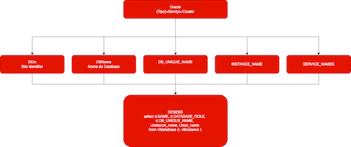
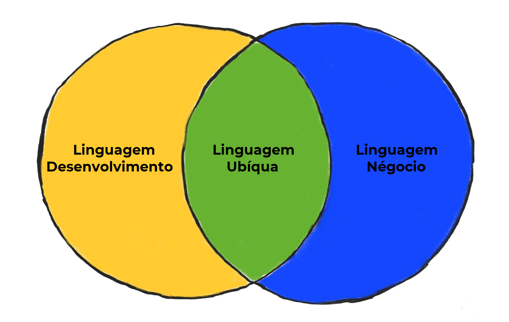

<p align="justify">A crescente demanda por informação em tempo real e a necessidade de digitalização pressionam as empresas a melhorar a eficiência no tratamento de dados.</p>

O conceito de DataOps surge como resposta à ineficiência das abordagens tradicionais.

<p align="justify">Um processo automatizado do tipo DevOps para dados, conhecido DataOps, aplica ferramentas e técnicas de DevOps aos dados. A DataOps propõe uma nova perspectiva sobre os problemas enfrentados pelos departamentos de dados, focando em resultados, colaboração e melhoria contínua.</p>

<p align="justify">A DataOps valoriza a criação de processos que previnam problemas em vez de apenas lidar com eles quando surgem, evitando a cultura de heróis que trabalham constantemente em apagar incêndios.</p>

É crucial ter um entendimento claro do objetivo final e não apenas das necessidades imediatas.

### SCOPE
O processo  **SCOPE** para definição de requisitos. O processo inclui:

| Requisito       | Pergunta                                                    |
| -------         | ---------                                                   |
| **Storyboards** | Como os usuários irão interagir com o sistema?              |
| **Content**     | Qual o conteúdo necessário para satisfazer os requisitos?   |
| **Output**      | Quais saídas o sistema produzirá (relatórios, feeds etc.)?  |
| **Process**     | Qual o processo que os dados devem seguir?                  |


| Requisito                        | Entenda                                                     |
| -------                          | ---------                                                   |
| **Arquitetura Flexível**         | A necessidade de uma arquitetura de dados flexível, que permita a extensão e adaptação a novas necessidades. A arquitetura deve ser capaz de lidar com variações de requisitos e não deve ficar presa a uma única configuração. |
| **Instrumentação da Pipeline**   | A importância da instrumentação da pipeline de dados para detectar erros antecipadamente e garantir a qualidade dos dados. |
| **Schema Extensível**            | Criação de schemas que podem ser estendidos de forma controlada, possibilitando a inclusão de informações conforme elas surgem e adaptando-se a novas necessidades. |
| **Dados como Produto**           | A importância de tratar dados como **produtos** que devem ser continuamente melhorados e refinados. |
| **Governança como Facilitadora** | A governança deve ser um facilitador e não um obstáculo. Ela deve ajudar as pessoas a fazerem as coisas certas em um ambiente seguro. |
| **Metadados**                    | Captura e uso de metadados para melhorar o entendimento dos dados e otimizar as decisões. Os metadados devem ser mantidos de forma integrada com o processo de construção de soluções. |
| **Empoderamento Controlado**     | Equilíbrio entre a autonomia das equipes e o controle da qualidade e governança dos dados. Os usuários finais devem estar envolvidos no processo de definição e validação dos dados. |
| **Entregas Intermediárias**      | É fundamental que os projetos de dados tenham entregas intermediárias, permitindo um feedback contínuo e ajustes na direção do projeto. Os protótipos e demonstrações são importantes para mostrar o que é possível. |
| **Falhar Rápido**                | A importância de experimentar e falhar em um ambiente de baixo custo para aprender e adaptar. |
| **Comunicação**                  | Manter uma comunicação aberta e constante entre os times de desenvolvimento, negócio e outros stakeholders. |
| **Design Baseado em Requisitos** | A escolha de tecnologias deve ser baseada nos requisitos do projeto e não o contrário. É necessário entender bem o problema antes de selecionar a tecnologia. |
| **Compromissos**                 | A equipe de desenvolvimento deve entender os compromissos de cada tecnologia e fazer escolhas conscientes para equilibrar funcionalidade, desempenho e custo. |

Em resumo - IMPACT:

| Requisito                   | Entenda                                                             |
| -------                     | ---------                                                           |
| **Interaction (Interação)** | Colaboração e comunicação entre as equipes.                         |
| **Meaning (Significado)**   | Entender o significado dos dados e requisitos.                      |
| **Process (Processo)**      | Processos claros e eficientes.                                      |
| **Automation (Automação)**  | Automatizar tarefas repetitivas para otimizar o fluxo de trabalho.  |
| **Control (Controle)**      | Manter a qualidade e governança dos dados.                          |
| **Target (Objetivo)**       | Definir o destino desejado do projeto e da jornada DataOps.         |

<p align="justify">Quando se trata de implementação, o modelo começa com a limpeza dos dados brutos e o desenvolvimento de uma infraestrutura de tecnologia que os torne disponíveis.</P>

<p align="justify">Investir na alfabetização de dados capacita os usuários a aproveitar os dados de forma eficaz, criando um ciclo de feedback contínuo que reúne insights para melhorar a qualidade dos dados e priorizar as atualizações da infraestrutura de dados.</p>

<p align="justify">A modelagem de sistemas envolve a definição da arquitetura, componentes e interação entre diferentes partes de uma aplicação ou sistema. Em relação a bancos de dados, a modelagem envolve:</p>

- [x] Escolha do tipo de banco de dados: relacional (SQL) ou NoSQL, dependendo das necessidades do sistema
- [x] Modelo de dados: definir como os dados serão armazenados, as tabelas, relacionamentos entre elas, normalização, etc;
- [x] Integração com serviços: como o banco de dados se comunicará com os diferentes serviços, incluindo operações CRUD (Create, Read, Update, Delete) eficientes.

## Escala de Banco de Dados
<p align="justify">A escalabilidade de bancos de dados é fundamental para garantir que o sistema consiga lidar com o aumento da carga de trabalho, seja em termos de volume de dados ou número de requisições.</p>

<p align="justify">No contexto de bancos de dados, existem várias estratégias para escalar o sistema, como réplicas de leitura, views materializadas e cacheamento ou pinagem de informações.</p>

<p align="justify">Essas abordagens ajudam a distribuir a carga de trabalho, melhorar a performance e garantir a alta disponibilidade.</p>

## Escalonamento Vertical (Vertical Scaling)
<p align="justify">Escalonamento vertical ou scaling up refere-se ao processo de aumentar os recursos de uma máquina existente, como CPU, memória RAM ou armazenamento. Quando o banco de dados ou o servidor de aplicação não está atendendo à carga de trabalho, podemos escalar verticalmente, aumentando a capacidade de processamento do servidor.</p>

<p align="justify">Escala vertical significa dar ao seu aplicativo mais recursos em uma única máquina. É a estratégia de escala mais simples e, muitas vezes, o primeiro passo mais eficaz. Antes de mergulhar em sistemas distribuídos complexos, considere se atualizar sua infraestrutura existente pode resolver seus problemas de desempenho.</p>

Saber quando ir além do escalonamento vertical é crucial. Fique atento a estes indicadores:

- [x] Os custos estão crescendo mais rápido do que sua base de usuários;
- [x] Você precisa de melhor redundância e tolerância a falhas;
- [x] O tempo de inatividade da sua implantação está afetando as operações comerciais;
- [x] O maior tamanho de instância disponível está se aproximando de 70% de utilização;

## Escalonamento Horizontal (Horizontal Scaling)
<p align="justify">Escalonamento horizontal ou scaling out envolve adicionar mais servidores para distribuir a carga de trabalho. Em vez de aumentar a capacidade de um único servidor, você adiciona mais servidores para que a carga seja compartilhada entre várias instâncias. Esse tipo de escalonamento é essencial para lidar com sistemas de alta demanda e crescimento.</p>

<p align="justify">O dimensionamento horizontal executa várias instâncias do seu aplicativo por trás de um balanceador de carga. É o próximo passo quando o dimensionamento vertical atinge seus limites. Ele oferece tolerância a falhas aprimorada e recursos de dimensionamento quase linear.</p>

A escala horizontal oferece vários benefícios importantes:

- [x] Melhor tolerância a falhas por meio de redundância;
- [x] Capacidade de lidar com mais usuários simultâneos;
- [x] Implantações contínuas com tempo de inatividade zero;
- [x] Escalonamento econômico (reduza a escala quando o tráfego estiver baixo);


## Réplicas de Leitura
<p align="justify">Réplicas de leitura são frequentemente seu primeiro passo no dimensionamento do banco de dados, mas vêm com compensações significativas. Réplicas de leitura mantêm uma cópia do seu banco de dados primário que atende tráfego somente leitura.</P>

<p align="justify">As réplicas de leitura são configuradas para sincronizar com o banco de dados primário, mas com um pequeno atraso, o que significa que elas refletem os dados do banco de dados primário com um "gap" temporal.</p>

<p align="justify">Quando você executa uma consulta em uma réplica, você não está competindo com gravações no seu banco de dados primário. Ao implementar réplicas de leitura, considere:</p>

- [x] Latência:
    - [x] A localização geográfica afeta a latência;
    - [x] Pequeno atraso entre o banco de dados primário e as réplicas;
- [x] Sincronização:
    - [x] O atraso na replicação afeta a atualização dos dados;
    - [x] O volume de gravação afeta a velocidade de replicação

## Views Materializadas
<p align="justify">Uma view materializada é uma visão persistente de uma consulta SQL, cujos resultados são armazenados em uma tabela real no banco de dados.</p>
<p align="justify">Podemos dizer que é um conjunto de dados pré-computado armazenado como uma tabela. Diferentemente das views que computam seus resultados a cada consulta, as views materializadas armazenam seus resultados.Isso as torna muito mais rápidas de consultar, mas introduz um novo desafio:</p>

- [x] Mantê-las atualizadas;
- [x] Requer mais espaço em disco, pois os resultados das consultas são armazenados fisicamente.

As visualizações materializadas se destacam em:

- [x] Consultas analíticas complexas, pois os dados já estão pré-calculados e armazenados, evitando cálculos repetitivos;
- [x] Reduz a carga no banco de dados, pois a consulta não precisa ser reprocessada a cada requisição.
- [x] Dados desnormalizados para visualizações específicas

## Armazenamento em cache
O cache é uma das maneiras mais eficazes de melhorar o desempenho do seu sistema.

<p align="justify">Uma estratégia de cache bem implementada pode reduzir drasticamente a carga do banco de dados e melhorar os tempos de resposta ao armazenar dados acessados ​​com frequência na memória.</p>

<p align="justify">O cache moderno acontece em vários níveis, objetos e sessões, navegador, cdn,aplicativo e o cache de consulta de banco de dados reduz cálculos caros.</p>

## Filas de mensagens
<p align="justify">As filas de mensagens são uma ferramenta poderosa para dimensionar seu monólito. Elas permitem que você adie operações demoradas e distribua o trabalho entre vários processadores. Isso mantém sua API responsiva enquanto lida com tarefas pesadas em segundo plano.</p>

</p>Em vez de processar tudo de forma síncrona, você pode enfileirar o trabalho para mais tarde. Esse padrão funciona especialmente bem para operações como:</p>

- [x] Processando arquivos enviados;
- [x] Envio de e-mails e notificações;
- [x] Geração de relatórios;
- [x] Atualizando índices de pesquisa;
- [x] Executando operações em lote;

## Gerenciando Banco de Dados
### Fluxos

??? info "Database Flow"

    === "Alto Nível"

         ```mermaid
         flowchart LR
             A(Início</br>Sprint) -->B(Desenvolvedor</br>Tarefas) --> C(Desenvolvedor</br>Commita) --> D(Desenvolvedor</br>Code Review) --> E(Desenvolvedor</br>Aprovam</br>Merge para Main) --> F(Sprint Finaliza</br>Versão Criada) --> G(Versão Released</br>DEV/HML/PRD)
         ```

    === "Drill Down - Geral"

         ```mermaid
         flowchart TD
             A(fa:fa-user-plus Início</br> Sprint):::inicio --> B(fa:fa-list-check Desenvolvedor</br>Tarefas )
             classDef inicio fill:#65ff99
             classDef termino fill:#008d5e
             B     --> C(fa:fa-code-branch</i> Branch</br>Pull Sprint</br>Cria Branch)
             C     --> C1(fa:fa-keyboard Desenvolvedores</br>Escrevem</br>Código)
             C1    --> D(fa:fa-code-pull-request Solicitam</br>Pull Request)
             D     --> E(fa:fa-list-check Code Review</br>COPS)
             E     --> F{fa:fa-square-check Revisão</br>Completa  }
             F     --> |Sim|F1(fa:fa-circle-check Code Review</br>Liberado)
             F     --> |Nao|F2(fa:fa-trash-can-arrow-up Rejeitado)
             F2    --> DD(fa:fa-stopwatch Atraso Sprint) --> B
             F1    --> CL(fa:fa-clone Database</br>Clone</br>Editionable)
             CL    --> DBCL(fa:fa-database Clone PDB/CDB) --> DBFT(fa:fa-toggle-on Feature</br>Toogle)
             CL    --> FTED(fa:fa-lightbulb Criar Edição/Release) --> FTCR(fa:fa-toggle-on Feature</br>Toogle) -->          FTSE(fa:fa-link-slash Create</br>Service)
             FTSE  --> TEAB(fa:fa-table-columns Teste AB</br>Por serviço)
             DBFT  --> TV1{fa:fa-spell-check Feature</br>Validada}
             TEAB  --> TV1
             TV1   --> MM(fa:fa-code-merge COPS</br>Merge Main)
             MM    --> DBR(fa:fa-trash Delete Branch Sprint)
             DBR   --> VRCR(fa:fa-code-commit Release Criada pelo COPS)
             VRCR  --> RN(fa:fa-toggle-off Desliga Feature Toggle)
             RN    --> FIM(fa:fa-flag-checkered Fim da Sprint):::termino
         ```

### [Princípio do menor privilégio](https://en.wikipedia.org/wiki/Principle_of_least_privilege)
Conceder a qualquer conta ou processo de usuário apenas os privilégios que são essencialmente vitais para executar as funções pretendidas.

**Observação**: Nos ERPs (e-Business Suite e Peoplesoft) TODOS devem solicitar a Equipe da Jailma o acesso ao PRODUTO. Isso envolve CUSTO e AUDITORIA.
{width="400" height="250" style="display: block; margin: 0 auto"}

### Padrões de Gerenciamento de Estratégias/[Tempo de vida de uma Feature Flag](https://www.objective.com.br/insights/feature-flags/)

| Conceitos               | Entenda                                                                                                                                   |
| ------                  | --------                                                                                                                                  |
| Feature toggle          | São interruptores que ativam e desativam recursos e funcionalidades.                                                                      |
| Feature flag            | São trechos de código lógico que gerenciam toda a vida útil de um recurso – desde a criação até o lançamento e a descontinuação. (Trace)  |
| Estratégia de Branchs   | Veja documentação realizada.                                                                                                              |
| Código boilerplate ou boilerplate | Seções de código que devem ser incluídas em muitos lugares com pouca ou nenhuma alteração. Ele é muitas vezes usado quando se refere a linguagens que são consideradas detalhadas, onde o programador deve escrever muito código para fazer tarefas mínimas. |

**Observação**: Se estamos falando de BOILERPLATE, a medidas de segurança no GraphQL não são tão maduras quanto as da API REST. Os desenvolvedores precisam criar métodos de autenticação e autorização enquanto utilizam recursos existentes, como validação de dados no GraphQL - RLS (Implementar políticas de segurança em nível de linha, ou seja, restringir o acesso aos dados de uma tabela ou de uma view de acordo com critérios definidos pelo administrador do banco de dados.)

## Ferramentas Básicas
Quais seriam as ferramentas para começar?

| Ferramenta                                                                                                              | Ferramenta                |
| -----                                                                                                                   | -----                     |
| Mermaid ([Editor](https://mermaid.live), [Imagens](https://fontawesome.com/start)) e [Cores](https://icolorpalette.com) |                           |
|Repositório Git                                                                                                          | Maven(Apache Maven 3.9.6) |
| SQLcl (Interface de linha de comando baseada em Java para Oracle Database. - Não instalar)                              |                           |
| Liquibase (Biblioteca independente de banco de dados de código aberto para rastrear, gerenciar e aplicar alterações no esquema do banco de dados - Não instalar) |
| utPLSQL (Testar pacotes, funções, procedimentos, gatilhos, visualizações e outros objetos que podem ser usados em PL/SQL. - Chamado de Instalacão) |                           |
| PlDoc (Gerador de documentação para PL/SQL inspirado na forma como a documentação é gerada na linguagem de programação Java/Go. - Durante o Maven) |                           |

## [Oracle Optimal Flexible Architecture (OFA)](https://docs.oracle.com/en/database/oracle/oracle-database/19/ladbi/optimal-flexible-architecture-file-path-examples.html#GUID-BB3EE4F7-50F4-4A2D-8A0D-96B7CC44029B)
São um conjunto de diretrizes de configuração criadas para garantir instalações Oracle bem organizadas, o que simplifica a administração, o suporte e a manutenção.

- [x] Oracle Database oferece suporte a vários Oracle Homes.
- [x] Oracle Inventory (oraInventory) armazena um inventário de todos os softwares instalados no sistema.
- [x] Oracle Base é o diretório inicial do banco de dados para proprietários de instalação do Oracle Database e o local do arquivo de log para proprietários do Oracle Grid Infrastructure.
- [x] Oracle Universal Installer configura os diretórios iniciais do Oracle usando essas convenções do Oracle Optimal Flexible Architecture.

{width="800" height="500" style="display: block; margin: 0 auto"}

## Identificadores no Banco de Dados Oracle
 <p align="justify">Identificadores são fundamentais para a configuração, administração e operação do Oracle Database, pois ajudam a distinguir entre diferentes instâncias e bancos de dados em um ambiente de servidor Oracle.</p>
 <p align="justify">Configurar esses identificadores corretamente é crucial para garantir a conectividade adequada dos clientes e a operação eficiente do banco de dados.</p>

{width="800" height="500" style="display: block; margin: 0 auto"}

## Dados contêiner e Banco de dados conectável
Oracle pode funcionar como um “banco de dados contêiner multilocatário”, também conhecido como CDB. Este CDB pode incluir zero ou mais “bancos de dados conectáveis” ou PDBs.

- [x] Um PDB é uma coleção de esquemas e objetos que atuam como um banco de dados “normal” para aplicativos;
- [x] Dentro do CDB existem dois contêineres:
    - [x] Raiz, denominada CDB$ROOT. Contém metadados Oracle e usuários comuns.
    - [x] SEED PDB, denominado PDB$SEED. Este é um modelo que pode ser usado para criar novos PDBs. Você não pode adicionar ou modificar objetos neste PDB.
- [x] Você pode, mas os benefícios de usar esta arquitetura são:
    - [x] Melhor uso de recursos : PDBs e CDBs usam recursos no servidor de forma mais eficaz em comparação com VMs (que duplicam o sistema operacional) e bancos de dados separados (que não compartilham processos);
    - [x] Movimentação mais fácil de dados e código : se você precisar mover um banco de dados conectável de um banco de dados contêiner para outro, isso é bastante fácil;
    - [x] Gerenciamento e monitoramento mais fáceis : para administradores, aplicar patches, atualizações, monitorar o banco de dados, realizar backups e outras tarefas são muito mais fáceis.

## Como fazer CI/CD em uma Pipeline de Banco de Dados
### Copia/CLone/PDBs e CDBs
<p align="justify">PDBs são bancos de dados independentes que compartilham processos de segundo plano e estruturas de memória comuns.A clonagem de PDBs entre CDBs pode ajudá-lo na migração, backup e restauração de bancos de dados, recuperação de desastres, testes e muito mais.</p>

<p align="justify">A clonagem a quente de PDBs é uma técnica em que seu PDB de origem permanece no modo leitura-gravação enquanto você o clona.</p>

{width="400" height="450" style="display: block; margin: 0 auto"}

## Schema e Usuários?
### Usuário

- [x] É uma conta através da qual você pode se conectar ao banco de dados.(CREATE SESSION)
- [x] Possui um nome de usuário e uma senha e está associado a um ESQUEMA.
- [x] São usados ​​para autenticar e autorizar o acesso ao banco de dados.
- [x] Podem possuir objetos de banco de dados, como tabelas, views, procedures e etc.
- [x] Podem receber privilégios para acessar objetos pertencentes a outros usuários.
- [x] Realizar operações dentro do esquema atribuído e em objetos aos quais receberam acesso.

**Observação**: Não é prática comum ter um único usuário possuindo vários esquemas. Em vez disso, normalmente você criaria usuários separados para cada esquema para manter o isolamento e gerenciar as permissões de maneira mais eficaz.

## Estratégia de Design
 <p align="justify">Um banco de dados é geralmente controlado por um sistema de gerenciamento de banco de dados (DBMS). Juntos, os dados e o DBMS, juntamente com os aplicativos associados a eles, são chamados de sistema de banco de dados, geralmente abreviados para apenas banco de dados.</p>

### Quais as Estratégias de Design de Banco de Dados

| Regra                              | Entenda                                                                                                                                     |
| -------                            | -----------                                                                                                                                 |
| Normalização de Dados              | Aplicar as formas normais de normalização ajuda a reduzir a redundância de dados e a manter a consistência.                                 |
| Escolha Adequada de Tipos de Dados | Selecionar os tipos de dados apropriados para cada coluna pode economizar espaço de armazenamento e melhorar o desempenho.                  |
| Índices Eficientes                 | Criar índices em colunas frequentemente usadas em cláusulas WHERE, JOIN e ORDER BY pode melhorar drasticamente o desempenho das consultas.  |
| Particionamento de Tabelas         | Para tabelas grandes, particionar os dados com base em critérios como intervalo de valores, lista ou hash pode melhorar o desempenho de consultas e operações de manutenção, além de facilitar a gestão de dados. |
| Gerenciamento de Espaço            | Planejar e gerenciar o espaço de armazenamento de forma eficiente é crucial para o desempenho e a disponibilidade do banco de dados.        |
| Segurança de Dados                 | Implementar medidas de segurança adequadas, como controle de acesso baseado em funções (RBAC), criptografia de dados sensíveis, auditoria e monitoramento de atividades, é essencial para proteger os dados contra acessos não autorizados e violações de segurança. |
| Backup e Recuperação               | Desenvolver e implementar uma estratégia abrangente de backup e recuperação é fundamental para garantir a disponibilidade e a integridade dos dados em caso de falha do sistema, erro humano ou desastre. |
| Monitoramento e Otimização de Desempenho | Utilizar ferramentas e técnicas de monitoramento de desempenho para identificar e resolver gargalos de desempenho, ajustar parâmetros do sistema, otimizar consultas e  índices, e realizar ajustes de hardware e configuração conforme necessário. |
| ISO/IEC 27002                            | [BS EN ISO/IEC 27002 Tecnologia da informação, segurança cibernética e proteção da privacidade](https://www.iso.org/standard/75652.html) |
| Objetivo de Desenvolvimento Sustentável 9 da ONG | [Objetivo de Desenvolvimento Sustentável 9 da ONU](https://sdgs.un.org/goals/goal9)    |

<p align="justify">Impor as melhores práticas arquitetônicas com limites de módulos e padrões de comunicação bem definidos. O isolamento de dados garante que os módulos sejam independentes e fracamente acoplados.</p>

Existem quatro abordagens de isolamento de dados para monólitos modulares:

- [x] Separate table;
- [x] Separate schema;
- [x] Separate database;
- [x] Different persistence;

## Isolamento de dados
Um monolito modular possui regras rígidas para integridade de dados:

- [x] Cada módulo só pode acessar suas próprias tabelas;
- [x] Sem compartilhamento de tabelas ou objetos entre módulos;
- [x] Joins só são permitidas entre tabelas do mesmo módulo;
- [x] Os módulos dentro de um monólito modular devem ser independentes. Cada módulo lida com seus próprios dados. Outros módulos podem acessar esses dados usando a API pública do módulo.

- [x] Quais são os benefícios deste design?
      - [x] Manter os módulos isolados uns dos outros promove modularidade e baixo acoplamento. Torna mais fácil introduzir novas alterações no sistema. Há menos efeitos colaterais indesejados quando os componentes estão fracamente acoplados.

### Separate table
<p align="justify">As tabelas para todos os módulos residem dentro de um banco de dados. Não é fácil determinar quais tabelas pertencem a qual módulo. Estou mencionando essa abordagem apenas por uma questão de integridade.</p>

<p align="justify">No entanto, quanto mais tabelas você tiver, mais difícil será mantê-las isoladas entre os módulos. Você pode melhorar isso adicionando isolamento lógico entre tabelas.</p>

{width="400" height="300" style="display: block; margin: 0 auto"}

### Separate schema
<p align="justify">Agrupar tabelas relacionadas no banco de dados é uma forma de introduzir isolamento lógico. Você pode implementar isso usando esquemas de banco de dados. Cada módulo possui um esquema exclusivo contendo as tabelas do módulo.</p>

{width="400" height="300" style="display: block; margin: 0 auto"}

### Separate database
<p align="justify">é mover os dados de cada módulo para bancos de dados separados. Esta abordagem tem mais restrições do que o isolamento de dados usando esquemas. Este é o caminho a seguir se você precisar de regras rígidas de isolamento de dados entre módulos. Mas a desvantagem é a maior complexidade operacional. Você precisa gerenciar a infraestrutura de vários bancos de dados.</p>

<p align="justify">Primeiro, você move as tabelas do módulo que deseja extrair para um banco de dados separado. Isso também força você a resolver quaisquer problemas de acoplamento de banco de dados entre seus módulos. Você estará pronto para extrair o módulo assim que mover as tabelas para um banco de dados separado.</p>

Podemos levar mais longe o isolamento dos dados do módulo?

{width="400" height="300" style="display: block; margin: 0 auto"}

### Different persistence
<p align="justify">Quem disse que você precisa usar o mesmo tipo de banco de dados para todos os módulos? Os bancos de dados relacionais são incríveis e resolvem uma ampla gama de problemas.</p>

<p align="justify">No entanto, você pode introduzir um tipo de banco de dados diferente para resolver problemas específicos. Por exemplo, você pode usar um banco de dados relacional para um módulo. E um banco de dados gráfico ou de armazenamento de colunas para outro módulo. Você também precisa manter diferentes modelos de persistência em seu aplicativo.</p>

<p align="justify">Por fim: Eu sempre busco o isolamento lógico usando esquemas. É fácil de implementar e me ajuda a entender melhor meus limites. Dependendo dos requisitos, posso introduzir bancos de dados separados posteriormente.</p>

## Monolito para microsserviços
O sistema cresce com o tempo e os requisitos estão em constante mudança.

<p align="justify">O primeiro passo para passar de um monólito para microsserviços é identificar os Contexto Delimitado (Contexto Delimitado é um padrão central no Design Orientado a Domínio).</p>

- [x] [Usando análise de domínio para modelar microsserviços](https://learn.microsoft.com/en-us/azure/architecture/microservices/model/domain-analysis)
- [x] [Contexto Limidatos - Bounded Context](https://martinfowler.com/bliki/BoundedContext.html)

<p align="justify">Segundo Fowler, os contextos limitados definem os limites explícitos entre os módulos e separam as responsabilidades. Este é um dos maiores desafios na migração para microsserviços. A identificação de bons limites entre módulos garantam que os microsserviços se concentrem estritamente em um Domínio de problema.</p>

{width="400" height="300" style="display: block; margin: 0 auto"}

<p align="justify">Uma das principais ferramentas contidas no design estratégico, o Bounded Context ou Contexto Delimitado, nos apoia a lidar com grandes modelos de domínio, estabelecendo limites ao dividi-los em contextos menores, criando inter-relacionamento explícito entre eles.</p>

## Design Tático
<p align="justify">Agrupa um conjunto de ferramentas a serem utilizados na construção do seu modelo de domínio, aplicados em um único contexto delimitado, refinando o resultado do trabalho realizado através das ferramentas de Design Estratégico.</p>

{width="400" height="300" style="display: block; margin: 0 auto"}

### Domain Models ou Modelo de domínio
<p align="justify">O conhecimento estruturado do problema a ser resolvido com o software, representando o vocabulário e conceitos-chave do domínio, identificando os relacionamentos entre todas as entidades, atuando como uma ferramenta de comunicação, em conjunto com a linguagem ubíqua(Linguagem comum, compartilhada entre toda a equipe, indiferente do seu papel no projeto. A fim de reduzir o enigma exposto pelo James Shore no texto abaixo).</p>

{width="400" height="300" style="display: block; margin: 0 auto"}

### Tudo junto e misturado
<p align="justify">O usuário que possui esse esquema recebe todos os objetos de um banco de dados, como Tabelas, Indices, Programas e Schedulers;</p>

- [x] **Separar Dados e Índices em Tablespaces Diferentes**: Isso envolve colocar tabelas e índices em tablespaces separados. Isso pode ajudar na administração do espaço e no desempenho de consultas, especialmente em casos onde há diferentes padrões de acesso aos dados e índices.
- [x] **Criação de Tablespaces de LOBs dedicados**  : Criar tablespaces dedicados exclusivamente para armazenar LOBs pode permitir um gerenciamento mais granular do espaço de armazenamento e facilitar a realização de operações de manutenção e backup específicas para LOBs.

### [Smart Database Paradigm (SmartDB)](https://www.salvis.com/blog/2018/08/28/smartdb-as-of-2018-08-21/)
__Qualquer sistema de TI que utilize um banco de dados deve fazer o máximo possível do seu processamento dentro do Banco de Dados e o mínimo possível do seu processamento nas outras camadas__.

<p align="justify">Esta abordagem é que isso levaria a menos complexidade, menos componentes, menos idas e vindas, menos sobrecarga e solução de problemas menos complicada.</p>

 <p align="justify">O usuário que possui esse esquema vazio recebe exatamente e apenas executa privilégios em um conjunto bem definido de subprogramas PL/SQL que foram projetados para ser a API do back-end do aplicativo que o banco de dados hospeda para o mundo externo.</p>

{width="800" height="500" style="display: block; margin: 0 auto"}

### Esquema
- [x] É uma coleção de objetos de banco de dados (como tabelas, visualizações, índices, sequências, etc.) que pertencem a um usuário específico.
- [x] Contêiner lógico para objetos de banco de dados.
- [x] Associado a uma conta de usuário, que é usada para conectar-se ao banco de dados e acessar os objetos dentro desse esquema.
- [x] É um namespace para objetos de banco de dados e fornece uma maneira de organizar e gerenciar objetos dentro do banco de dados.

### Oracle e-Business Suite
#### Versão 11/11i
<p align="justify">Nas versões 11i anteriores do Oracle E-Business Suite, cada produto recebia duas tablespaces, um para dados e outro para índices.</p>
#### Versão 12
<p align="justify">Uma instalação do Oracle E-Business Suite Release 12.2 inclui duas edições (versões) do código do aplicativo e dos dados iniciais. O sistema de arquivos contém duas cópias completas do Oracle E-Business Suite e dos arquivos de tecnologia da camada de aplicativo.</p>

<p align="justify">No banco de dados, usamos o recurso Redefinição baseada em edição para criar uma nova edição do banco de dados para cada ciclo de aplicação de patches online.</p>

<p align="justify">Run Edition é o código e os dados usados ​​pelo aplicativo em execução. A Run Edition inclui um sistema de arquivos completo na camada de aplicativo junto com todos os objetos e dados visíveis na edição padrão do banco de dados. Como desenvolvedor, você se conectará à Run Edition sempre que estiver envolvido em atividades normais de desenvolvimento no sistema.</p>

<p align="justify">Patch Edition é uma cópia alternativa do código e dos dados iniciais do Oracle E-Business Suite que é atualizada pelo Online Patching. A Patch Edition inclui uma cópia completa do sistema de arquivos da camada de aplicativo e objetos de código de banco de dados editados. A Patch Edition só pode ser usada quando uma sessão de Patching Online está em andamento. Os usuários finais não podem acessar o Oracle E-Business Suite Patch Edition, mas como desenvolvedor você pode precisar se conectar ao Patch Edition de um sistema ao aplicar patches ou depurar problemas com o processamento de Patch Online.</p>

<p align="justify">A arquitetura de banco de dados do Oracle E-Business Suite é altamente complexa e envolve vários esquemas de banco de dados para diferentes módulos e componentes da aplicação.</p>

{width="800" height="500" style="display: block; margin: 0 auto"}

  | Schema               | Definição                                                 |
  | -----                | --------                                                  |
  | SYS e SYSTEM         | Estes esquemas são parte do banco de dados Oracle em si e são usados para armazenar metadados do sistema, como informações sobre usuários, privilégios, estrutura do banco de dados, etc. |
  | APPS                 | É o esquema principal usado pelo Oracle E-Business Suite. Ele contém objetos compartilhados e dados para vários módulos e componentes da aplicação. |
  | Módulos Funcionais   | Cada módulo funcional do Oracle E-Business Suite geralmente tem seu próprio schema de banco de dados. |
  | Schemas Customizados | Iniciam-se por XXEMPRESA e são esquemas de banco de dados adicionais para personalizações e extensões feitas pelos usuários, desenvolvedores ou consultores. |
  | Outros Esquemas      | Outros esquemas no banco de dados do Oracle E-Business Suite para fins específicos, como auditoria, armazenamento de dados temporários, etc. |

#### Custom Applications
O código customizado deve ser desenvolvido de acordo com os padrões publicados pela Oracle e o que chamamos de `CEMLI`.

<p align="justify">Para manter os arquivos personalizados segregados dos arquivos padrão da Oracle ou da funcionalidade CORE, a Oracle recomenda criar um aplicativo personalizado e obter os arquivos da camada do aplicativo personalizado, como formulários, relatórios, etc., no CUSTOM_TOP.</p>

<p align="justify">Os aplicativos deverão ser pré-fixados por `XX`e criados através do `AD Splice`. Quaisquer novos objetos de aplicativos personalizados serão armazenados em APPS_TS_TX_DATA e APPS_TS_TX_IX, independentemente das configurações newprods.txt, izuterr.txt.</p>

**Observação** :

- [x] Tenho ORIENTADO todos os schemas nascidos e criados pela Instituição, mesmo FORA do Schema/Usuario da Instancia e-Business, sejam préfixados com `XXEMPRESA`, que identificaria que são CUSTOMIZADOS.
- [x] Todas as conexões de Banco de Dados Oracle, são obtidas através do servidor: `\\Servidor\tn$`;

#### Gateway de Banco de Dados (xxGATE)
<p align="justify">Gateway pode ser classificado como “portal”, ele é considerado uma passagem entre dois ambientes distintos. Para que este portal pudesse fazer isso, seria necessário a criação de DBLINKs, que é um objeto criado em um esquema que possibilita o acesso a objetos de outro banco de dados.</p>

* Diminuir o tempo de liberação e clonagem;
    * Todos os schemas possuiam database link, logo demora em ajustar os acessos;
    * Controle de Acesso e Password das instancias;
    * Permitir de um único banco de dados Principal (Oracle), acessar o MySQL, SQL Server, PostgreSQL através do Transparente-Gateway.
        * Homogêneo   - Quando acessa outros bancos de dados Oracle    (xxxEBS,xxxFOLHA,xxxBDS,xxxAPPXXX)
        * Heterogêneo – Quando acessam outros tipos de bancos de dados (xxxODBC)

{width="400" height="350" style="display: block; margin: 0 auto"}

* A ideia era NÃO trazer dados de uma instancia, diminuir o numero de database links, o que facilitaria a clonagem, pois teríamos um único ponto de comunicação.

<p align="justify">Esta conexão é conhecida como Sistema de Banco de Bados Distribuídos e pode ser Homogêneo - quando acessa outros bancos de dados Oracle - e Heterogêneo - quando acessam outros tipos de bancos de dados.</p>

Porem todos deveriam avaliar as queries e hintar os objetos com `/*+ DRIVING_SITE(tabela) */ `, para evitar volume de tráfego de rede.

#### [Banco de Dados Rosa](https://www.salvis.com/blog/2018/07/18/the-pink-database-paradigm-pinkdb-2/)
<p align="justify">É uma arquitetura de aplicativo para aplicativos centrados em banco de dados, ou seja, quando essas APIs é chamadas, o trabalho do banco de dados chamadas a SQL e PL/SQL, são todos executados por meio deste usuário. As APIs nunca fariam CRUDs diretos em uma tabela, mas simplesmente chamariam programas PL/SQL para fazer esse trabalho.</p>

{width="230" height="230" style="display: block; margin: 0 auto"}

Um aplicativo que implementa PinkDB possui os seguintes recursos:

- [x] O usuário conectado não possui objetos de banco de dados. O usuário connect é usado por componentes do aplicativo fora do banco de dados para interagir com o banco de dados.(100% idêntico ao SmartDB)
- [x] O usuário conectado tem acesso apenas a objetos de API. O usuário conectado não deve ter privilégios para acessar objetos que não fazem parte da API, por exemplo, através de SELECT ANY TABLEprivilégios ou similares.
- [x] A API consiste em objetos e visualizações armazenados;O acesso é concedido com base no princípio dos privilégios mínimos. A API consiste em objetos e visualizações armazenados, mas não em tabelas.
- [x] Os dados são processados ​​por operações baseadas em conjunto. Menos loops, mais SQL baseado em conjuntos.

#### Diferenças para SmartDB
SmartDB tem como alvo PL/SQL e, portanto, foca em bancos de dados Oracle. A API no SmartDB consiste apenas em unidades PL/SQL. Sem exceções. PinkDB permite visualizações.

{width="400" height="350" style="display: block; margin: 0 auto"}

* Liquibase é uma biblioteca independente de banco de dados de código aberto para rastrear, gerenciar e aplicar alterações no esquema do banco de dados.

## Segurança no Banco De Dados
A escolha de se utilizar a autenticação com ORDS OAuth ou Kong API Gateway depende de vários fatores, incluindo requisitos específicos do seu projeto, infraestrutura existente e preferências da equipe de desenvolvimento. A segurança de dados é a prática de proteger as informações digitais contra o acesso não autorizado, a distorção ou o furto ao longo de todo o ciclo de vida. A complexidade cria uma superfície de ataque mais ampla, tornando-se um desafio para o monitoramento e a segurança.

| Requisito                   | Entenda                                                                                                                                                                         |
| -------                     | ----------                                                                                                                                                                      |
| Requisitos de Segurança     | Ambos ORDS OAuth e Kong API Gateway oferecem recursos de segurança robustos.                                                                                                    |
| Facilidade de Implementação | Gerenciamento do ORDS OAuth mais direto, por outro lado, Kong API Gateway oferece uma camada de abstração que pode simplificar a gestão de múltiplos serviços e microsserviços. |
| Ecossistema e Integrações   | ORDS OAuth pode se integrar mais facilmente com o ecossistema Oracle, enquanto Kong API Gateway pode ter integrações mais amplas com outras tecnologias e serviços de nuvem.    |
|                             | Maior facilidade em se construir **Database Management System Row-Level Security**, predicados de política e controle centralizado.                                             |
