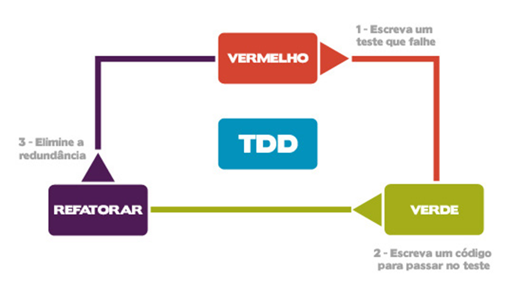

**Para podermos reivindicar sucesso real em qualquer empreendimento, precisamos levar em conta as necessidades e desejos de todas as partes interessadas e equilibrar essas necessidades e desejos de modo que todos fiquem satisfeitos em certos limites ou acima deles**.

## Conclusão
Seguimos praticamente a mesma estratégia , uma estratégia que orienta as mudanças :
- [x] Entenda o que os clientes realmente querem.
      - [x] Pedidos recém-chegados são inseridos em um backlog em execução, de acordo com algum esquema de priorização, enquanto todo o departamento trabalha para preparar cada elemento dos pedidos de maior prioridade. 
      - [x] Conforme os elementos ficam prontos, são verificados por TDD/BDD,CI/CD e etc.
      - [x] Benefícios:
            - [x] Os pedidos recebidos chegam com variações imprevisíveis, por exemplo, em tamanho, prazo, prioridade e personalizações solicitadas.
            - [x] Há um acúmulo de pedidos pendentes em constante mudança em toda a empresa.
            - [x] Pense nisso, de quando esta em um restaurante e pede entradae e o prato principal: Você gostaria de receber a entrada e o prato principal que toda a refeição chegue de uma só vez.
- [x] Altere as ofertas para atender melhor a essa demanda.
- [x] Faça com que a gerência e os trabalhadores se importem novamente com o que estão fazendo (motivação intrínseca).
- [x] Organize o *ambiente* , para que ela tenha capacidade e funcionalidade para atender ao aumento esperado na demanda.

## Desenvolvimento de produtos eficaz
O que torna o desenvolvimento de produtos eficaz? Atender às necessidades das partes interessadas.

Para chegar a um desenvolvimento de produto altamente eficaz, toda a organização deve estar envolvida. 

Em organizações compartimentadas (a norma), pode haver um silo de desenvolvimento de produtos. Embora isso em si seja bastante incomum – desenvolvimento de produtos fragmentados e aprimoramento de produtos sendo muito mais comuns, com o trabalho fatiado e enfiado nos silos existentes de marketing, vendas, TI, finanças, etc.

E, finalmente, isso significa quebrar os silos, libertar os especialistas presos dentro de cada um e reuni-los para desenvolver novos “produtos inteiros”.

Fazer isso efetivamente dentro de uma organização em silos – focada em ótimos locais – é um desafio ainda maior. 

Talvez ser altamente eficaz nessas condições simplesmente não seja possível. 

Acredito que tentar mudar para um lugar de desenvolvimento de produto altamente eficaz tem implicações profundas para a organização como um todo. E não menos importante para a mentalidade que sustenta o modelo em silos – ou seja, a mentalidade analítica.

Princípios de Gestão de Engenharia de Software - https://www.amazon.co.uk/Principles-Software-Engineering-Management-Gilb/dp/0201192462
Engenharia Competitiva: Um Manual para Engenharia de Sistemas, Engenharia de Requisitos e Engenharia de Software Usando Planguage - https://www.amazon.co.uk/Competitive-Engineering-Handbook-Requirements-Planguage/dp/0750665076
Comunicação Não Violenta: Uma Linguagem de Vida - https://www.amazon.co.uk/Nonviolent-Communication-Language-Marshall-Rosenberg/dp/1892005034

# Relato de Experiência
Como podemos melhorar a maneira como priorizamos para melhorar nossas chances de entregar valor rapidamente? 
Como sabemos que não estamos apenas construindo a coisa errada mais rápido?
Estamos desperdiçando nossa preciosa capacidade de inovar?

Só porque somos cegos não significa que devemos correr em um quarto escuro que sabemos que contém facas.

## Opinião da pessoa mais bem paga
Acho intrigante que pensemos que é perfeitamente justificado ignorar a economia e seguir o instinto ou, mais comumente, o HiPPO ( Highest Paid Person’s Opinion ). Embora alguns HiPPOs tendam a se sair muito bem aqui, eu sugeriria que essas são as exceções que comprovam a regra. 

## Limite o tamanho do WIP
Uma alternativa mais sensata seria limitar nossa desvantagem limitando o tamanho do lote ou incremento. 
O objetivo de fazer isso é obter mais informações sobre a probabilidade de a opção ser benéfica.
Este é o "Construir, Medir, Aprender" do  Método Lean Startup.

“Se você não está se movendo na velocidade do mercado, você já está morto – você apenas não parou de respirar ainda.” – Jack Welch

"Cost of Delay é a chave de ouro  que abre muitas portas.  os humanos não são muito bons em distinguir. 

O Scrum não tem nada a dizer sobre quais projetos começar, e nada a dizer sobre quando parar e passar para outra coisa. 

Todas as outras metodologias de gerenciamento de projetos focam nas três restrições:

| Natural (Restrição)  | Pensamento     |
| -----                | ----           |
| críticas de custo    |  não valor     |
| tempo                |  velocidade    |
| escopo               |  feedback      |

Estamos loucos, fazendo a mesma coisa repetidamente, mas esperando resultados diferentes? 

- [X] Nos últimos vinte anos, as organizações se tornaram viciadas na falsa promessa de que a melhor maneira de controlar a entrega de software é o veículo do projeto. 
- [X] Nós nos encontramos otimizando para eficiência e fazendo promessas de entregar um escopo especificado em uma data específica e com um orçamento especificado. 
- [X] Quando não funciona, culpamos a equipe, culpamos a falta de tempo e esforço no planejamento e no "gerenciamento de riscos".
- [X] Em vez disso, devemos nos concentrar em descobrir, nutrir e acelerar a entrega de valor.
- [X] Nossa missão deve ser limitar nossas desvantagens e maximizar a oportunidade de capitalizar eventos positivos.

Isso requer uma compreensão da economia do fluxo (filas, WIP, tamanhos de lote, etc.), a natureza da demanda e oferta (ideias e a capacidade de executá-las). 

precisaria entender a complexidade do desenvolvimento de uma ideia e a natureza semi-caótica de um sistema que envolve humanos imprevisíveis e ideias imprevisíveis. 

Vamos dar uma olhada primeiro no lado esquerdo: a parte upstream, antes que alguém tenha escrito uma linha de código ou começado a construir qualquer coisa...

- [x] 2015: Canva Presentations – Expansão da plataforma de design para incluir apresentações.
- [x] 2016: Kofax RPA – A Kofax lança sua plataforma de automação para capturar, processar e gerenciar dados empresariais.
- [ ] 2016: Postman – Ganhou popularidade como ferramenta para testes de APIs, permitindo automação e documentação;
- [x] 2017: Microsoft Power Automate (anteriormente Microsoft Flow) – Microsoft entra no mercado de RPA com integração ao ecossistema Office 365.
- [x] 2018: Blue Prism – Introduz funcionalidades de inteligência artificial (AI) e aprendizado de máquina em sua plataforma.
- [x] 2019: UiPath – Alcança status de “unicórnio” (empresa avaliada em mais de 1 bilhão de dólares), tornando-se líder do setor.
- [x] 2020: Microsoft Power Automate Desktop – Microsoft lança uma versão gratuita da ferramenta para Windows 10, democratizando o acesso ao RPA.
- [ ] 2020: Cypress – Ferramenta moderna para automação de testes de front-end, voltada para aplicações web.
- [x] 2021: NICE RPA – NICE amplia sua solução de RPA com foco em automação assistida e não assistida.
- [ ] 2021: Excel Power Automate – Microsoft intensificou a integração do Excel com ferramentas de automação e Power BI, melhorando sua capacidade de análise de dados e integração.
- [ ] 2021: ClickUp – Ferramenta all-in-one para gerenciamento de projetos e produtividade.
- [ ] 2021: Playwright – Desenvolvido pela Microsoft, competindo com Selenium e Cypress em testes de aplicações web.
- [x] 2022: Testim.io – Ferramenta baseada em inteligência artificial para automação de testes funcionais.
- [x] 2022: Automation Anywhere AARI – Introdução de uma interface de RPA centrada no usuário, permitindo maior acessibilidade para negócios.
- [x] 2023: UiPath Automation Cloud – Expansão das soluções baseadas em nuvem para facilitar a automação escalável.

Nove técnicas essenciais de refatoração de arquitetura que podem ajudá-lo a criar sistemas que resistam ao teste do tempo:

🔘 Modularização: Divida sistemas monolíticos extensos em módulos menores e gerenciáveis para melhor controle e flexibilidade.

🔘 Camadas: organize seu sistema em camadas, como apresentação, negócios e dados, para manter as coisas claras e separadas.

🔘 Microsserviços: transforme aplicativos monolíticos em microsserviços para aumentar a escalabilidade e a capacidade de manutenção.

🔘 Arquitetura orientada a serviços (SOA): use serviços que se comunicam por uma rede para facilitar a reutilização e a integração.

🔘 Arquitetura orientada a eventos: use eventos para desacoplar componentes, tornando seu sistema mais responsivo e flexível.

🔘 DDD (Design Orientado a Domínio): para estruturar seu sistema de forma eficaz, concentre-se nas principais necessidades de negócios e na lógica de domínio.

🔘 Desacoplamento: Reduza as dependências entre os componentes para maior flexibilidade e manutenção mais fácil.

🔘 Refatoração para padrões: aplique padrões de design para resolver problemas comuns e melhorar a estrutura do seu sistema.

🔘 Migração de dados: mude de estruturas de banco de dados antigas para estruturas modernas e eficientes.

Obrigada!

Metodologias de Desenvolvimento de Software Prescritivas X Ágeis

“O pensamento sistêmico é… baseado na crença de que as partes componentes de um sistema podem ser melhor compreendidas no contexto de relacionamentos entre si e com outros sistemas,  em vez de isoladamente ”. [ênfase minha.]

- [x] Metodologias prescritivas são mais presas a etapas, ou seja, o software passa por alguns estágios acordados entre a equipe até ficar pronto.
- [x] 
As metodologias ágeis surgiram e ganharam espaço no mercado porque os usuários demoravam muito a receber o produto pelas metodologias prescritivas. Além disso, nem sempre o software tinha o comportamento desejado pelo cliente.

