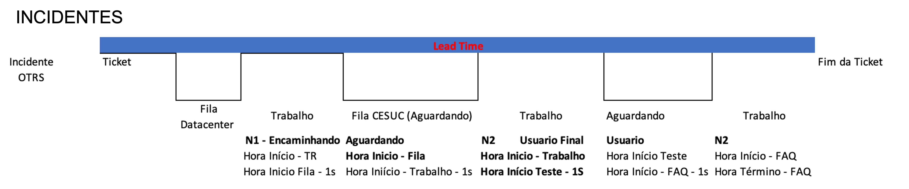
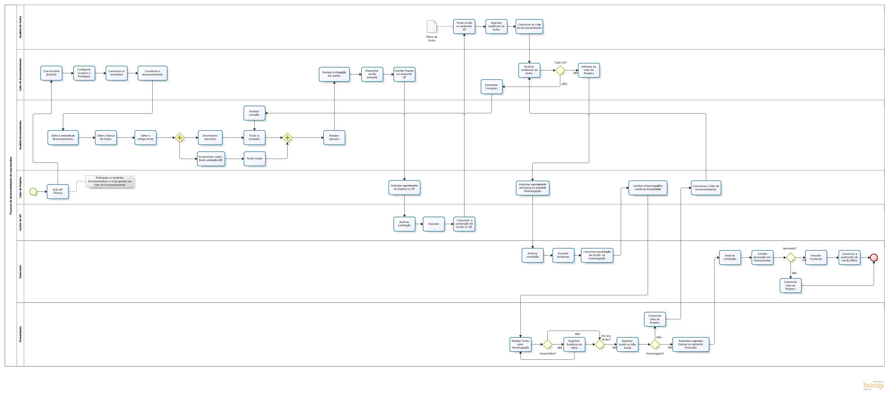
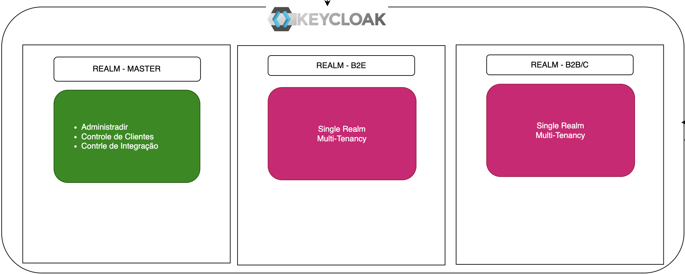
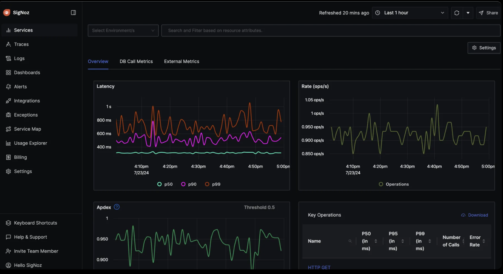
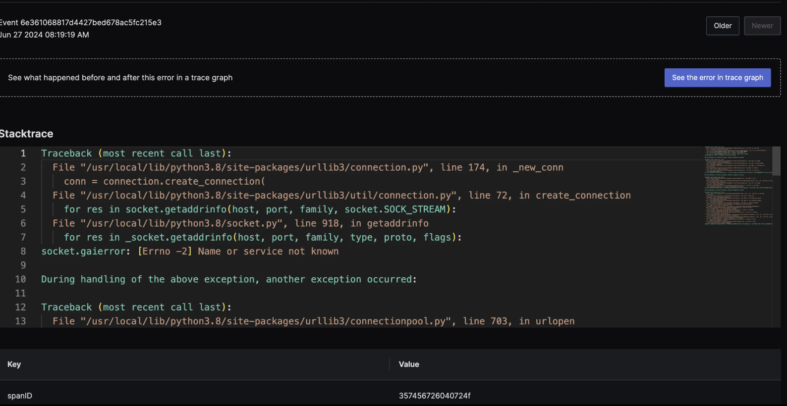

???+ info "Do Problema, há solução?"

    === "Problema"

        | Registro    |           Numero         |
        | ----------  |          -----           |
        | Adotar ações para Aprimorar Demandas Expressas   |     RA-2112/02-A   |
        | Estoque de Solicitações Demandas expressas       |     RA-2112/02-B-1 |
        | Adotar ações, relativas ao gerenciamento de incidentes afeto a fila de sistemas corporativos  |   RA-2112/02-C1  |
        | Projetos do PDTIC   |   Projeto        |

        ## Histórico XXXXXXX
         - [x] Perda do QUADRO de FUNCIONÁRIOS com o devido conhecimento - **DÉBITO TÉCNICO** e incremento de **BUGS**;
               - [x] NÃO FIZ e NÃO CONHEÇO;
        ## Onde esta(áva)mos desperdiçando tempo, falhando nos Prazos ou Bloqueados?
         - [x] William Thomson: "Aquilo que não se pode medir, não se pode melhorar."
         - [x] Será que?
             - [x] Ausência de Engajamento?
             - [x] WIP desbalanceado?
             - [x] Débito Técnico?
             - [x] Diminuição da Força de Trabalho?
             - [x] Trabalho Remoto?
         - [x] O conceito de Projeto esta alinhado?
             - [x] O gerenciamento de recurso compartilhado - O QUE RECEBÍAMOS PARA DAR UM PRAZO?
         - [x] Histórico:
             - [x] Incidente (Supravizio, OTRS, Outlook, GERENCIA, e TEAMS);
             - [x] Demanda   (Supravizio, OTRS, Outlook, GERENCIA, TEAMS, PDTIC (PEOPLE ANALYTICS, OPERADOR  LOGISTICO, PROVISÃO E REVERSÃO) E ÁREAS INTERNAS (COBAN, BOTs, OLAP/DATA LAKES).
         - [x] Ausência de Planejamento
             - [x] Ferramentas - Supravizio, OTRS, Gitlab, Azure-Devops, TEAMS, Outlook e ÁREAS INTERNAS (COBAN, BOTs, OLAP/DATA LAKES).
             - [x] Recursos em outros projetos e NÃO estão sendo vistos?
        ## Como melhorar?
        - [x] MÉTRICAS DE FLUXO - KANBAN
             - [x] Quais metas e métricas a utilizar? Fluxo, Codificação,  Qualidade e/ou Produção ?
           - [x] Peças unificadas do NOC/SOC/Central de Incidentes a Equipe de Sustentação.

           

        - [x] Scrum
           - [x] Iterativo e Incremental(Definição de Papéis, Cerimônias e Artefato)
           - [x] Resumimos o Scrum, fizemos um framework CESUC, Treinamento e foco.
           - [x] Sprints com 2(duas) semanas;
           - [x] Nenhuma alteração seria realizada, para colocar risco na meta da Sprint;

           

         | Dica 1                                      | Motivo                                            |
         | ------                                      | --------                                          |
         | Integração inadequada de novos membros      | Sem o devido treinamento ou clareza sobre processos,     ferramentas ou expectativas                   |
         | Falta de documentação ou processos claros   | Não tem uma boa documentação ou processos definidos     para a integração de novos colaboradores. |
         | Falta de acompanhamento e feedback contínuo | Feedback adequado ou acompanhamento no início da   jornada. |
         | Nenhum experiência para manter o legado     | Inexistencia de conhecimento.                    |

        !!! pied-piper "Modelo Pensado"

            === "Principal"
                 

            === "Desenvolver Requisitos"
                 

            === "Desenvolver Tarefas"
                 

            === "Identificar Projetos"
                 

            === "Desenvolver Solução"
                 

            === "Implementar Solução"
                 

            === "Planejar Deploy"
                 

            === "Estratégia de Branch"
                 

    === "Origem"

         <p align="justify">A Equipe do XXXXXX, passou a adotar o Supravizio como ferramenta  - ITSM e   DEMANDAS, tendo para cada tipo de TICKET, um fluxo diferenciado. Os fluxos na maioria das vezes, estavam desassociados do processo de desenvolvimento de software.</p>

         {width="600" height="350" style="display: block; margin: 0 auto"}

          **Observação**: O processo de diferimento de software é uma estratégia frequentemente adotada por  equipes de desenvolvimento para adiar ou postergar a implementação de certas funcionalidades   ou melhorias em        software. Este processo pode ser aplicado tanto em projetos de longo prazo   quanto em demandas expressas        (geralmente solicitadas por clientes ou usuários internos de   forma mais imediata).

         As Equipes de Desenvolvimento, NÃO acolheram o modelo apresentado em 2014. Cada Equipe desenvolveu o seu próprio processo e a utilizaram de inúmeras ferramentas:

         - [x] **Projetos**: [Redmine](https://www.redmine.org/)
         - [x] **Gerenciador de Artefatos**: [Nexus](https://www.sonatype.com/products/sonatype-nexus-repository)
         - [x] **Servidor de automação**: [Jenkins](https://www.jenkins.io/)
         - [x] **Análise Estática de Código (SAST)**: [SonarQube](https://www.sonarsource.com/products/sonarqube/)
         - [x] [Documentação na Intranet](https://intranet.bbts.com.br/index.php?option=com_content&view=article&id=700:teste-teste&catid=112&Itemid=423)

        ## Controle de Processo GitHub
         <p align="justify">A estrutura de Organização no GitHub é menos hierárquica, mas permite   gerenciar        múltiplos repositórios com configurações e permissões centralizadas:</p>

         - [x] **Organização**: É uma conta compartilhada que permite gerenciar repositórios e permissões em   um        único lugar.
         - [x] **Repositórios**: Representam os projetos de código dentro da organização, podendo ser   atribuídos a        uma ou mais equipes, cada uma com suas permissões.

         {width="225" height="125" style="display: block; margin: 0 auto"}

        ## Controle de Processo [GitLab](https://scm.bbts.com.br/users/sign_in)
         <p align="justify">A estrutura de Grupos e Subgrupos no GitLab é hierárquica e organiza os projetos   de        forma aninhada:</p>
         - [x] **Grupo**: É o nível mais alto da hierarquia. Agrupa projetos relacionados e permite   gerenciar        permissões e configurações compartilhadas entre eles.
         - [x] **Subgrupos**: São grupos dentro de um grupo principal. Servem para organizar melhor   projetos        complexos, dividindo-os por áreas, equipes ou módulos específicos.
         - [x] **Projetos**: Ficam dentro dos grupos ou subgrupos. Representam o repositório de código e   incluem        todas as ferramentas de desenvolvimento, como issues, merge requests e CI/CD   pipelines.

         {width="225" height="125" style="display: block; margin: 0 auto"}

         <p align="justify">É um gerenciador de repositório de software baseado em git, com suporte a Wiki, gerenciamento de tarefas e CI/CD. Similar ao GitHub, mas o GitLab permite que os desenvolvedores armazenem o código em seus próprios servidores, ao invés da nuvem.</p>

        ### Constatação
         - [x] Nenhuma norma da série de desenvolvimento estava sendo seguida;
         - [x] Nenhuma norma de Dados, estavam sendo seguidas;
         - [x] Não havia uniformização das áreas;
         - [x] Documentos, Códigos espalhados.

        {width="900" height="500" style="display: block; margin: 0 auto"}

        ## Togaf/IT4IT

         |  *Aspecto*                 | *TOGAF* (The Open Group Architecture Framework)                          | *IT4IT* (IT for IT Framework)                               |
         |-----------------------------|---------------------------------------------------------------------------|--------------------------------------------------------------|
         | *Foco Principal*          | Estruturação e governança da arquitetura corporativa (Enterprise Architecture). | Gestão do ciclo de vida de serviços de TI, com foco na cadeia de valor de TI. |
         | *Objetivo*                | Fornecer uma abordagem sistemática para projetar, planejar, implementar e governar a arquitetura corporativa. | Melhorar a eficiência e a entrega de serviços de TI com um modelo de referência padronizado. |
         | *Base Conceitual*         | Framework de desenvolvimento arquitetural baseado em fases (ADM).         | Modelo de referência baseado em quatro cadeias de valor: Strategy to Portfolio, Requirement to Deploy, Request to Fulfill, Detect to Correct. |
         | *Área de Aplicação*       | Organização como um todo, integrando TI e negócios.                      | Focado exclusivamente na organização e automação dos processos de TI. |
         | *Abordagem*               | Top-down, com foco em alinhamento estratégico entre TI e negócios.         | Orientada à cadeia de valor, com uma visão prática e baseada em automação. |
         | *Benefícios*              | - Alinhamento entre objetivos de negócios e TI.<br>- Governança abrangente.<br>- Flexibilidade na adaptação a diferentes indústrias. | - Padronização na entrega de serviços de TI.<br>- Eficiência operacional.<br>- Melhor rastreabilidade e visibilidade do ciclo de vida de TI. |
         | *Principais Componentes*  | - Arquitetura corporativa.<br>- ADM (Architecture Development Method).<br>- Building Blocks.<br>- Enterprise Continuum. | - Cadeias de valor.<br>- Service Backbone.<br>- Ferramentas integradas para gestão de TI.<br>- Automação. |
         | *Público-Alvo*            | Arquitetos corporativos, estrategistas de TI, CIOs e líderes empresariais. | Profissionais de TI, gerentes de operações, equipes de desenvolvimento e líderes de TI. |
         | *Complexidade*            | Alta, devido à ampla abrangência e nível de personalização.                | Moderada, com foco em padronização e automação prática.       |
         | *Adesão a Ferramentas*    | Independente de ferramentas específicas, permitindo maior flexibilidade.  | Promove o uso de ferramentas integradas para automação e rastreamento. |
         | *Alinhamento com Padrões* | Baseado em padrões amplamente aceitos para arquitetura corporativa.        | Baseado na IT Value Chain e no IT Operating Model.            |
         | *Cenários Ideais de Uso*  | - Transformação digital.<br>- Integração de negócios e TI.<br>- Estruturação de arquiteturas complexas. | - Operações de TI orientadas à eficiência.<br>- Melhorias contínuas no ciclo de vida de serviços de TI.<br>- Integração de ferramentas DevOps e ITSM. |

        ## Migração para Azure-Devops
         <p align="justify">A migração do GitLab para o Azure DevOps foi uma decisão estratégica tomada com  base em diversos fatores que visam melhorar a eficiência, integração e escalabilidade dos   nossos processos de  desenvolvimento.</p>

        ### Integração e Ecossistema Microsoft
         <p align="justify">O Azure DevOps oferece uma integração nativa com outras ferramentas do   ecossistema        Microsoft, como o Teams, Power BI e Office 365.</p>
         {width="370" height="320" style="display: block; margin: 0 auto"}

        ### Segurança e Governança
         <p align="justify">O Azure DevOps possui fortes controles de segurança e governança, incluindo   autenticação        multifatorial (MFA), integrações com Azure Active Directory (AAD), e opções   avançadas de controle de        permissões.</p>

        ### Custo
         <p align="justify">Embora o GitLab ofereça uma solução de código aberto com boas funcionalidades, o Azure DevOps se destaca pois toda a instituição já estava usando esta ferramenta.</p>
        ### Gerenciamento de Projetos e Work Items
         <p align="justify">O Azure DevOps possui uma abordagem poderosa e intuitiva para o gerenciamento   de projetos, com funcionalidades como boards, sprints, e acompanhamento de work items. A   integração dos boards com as funcionalidades de controle de versões e pipelines permite que   as equipes acompanhem o progresso de  forma mais precisa e transparente. Além disso, os work   items podem ser facilmente ligados a commits, builds e releases, proporcionando uma visão   unificada do ciclo de vida do desenvolvimento.</p>

         |                                         |                                  |
         |                                         |                                  |
         |  |  |

        ## Problemas a serem enfrentados
         - [x] Não tínhamos **conhecimento** no Azure-Devops;
         - [x] Temos **Product Manager, Owner ou Usuário Chave**?
         - [x] Não **sabíamos como efetuar alteração e adicionar campos** que eram necessários para atender a unificação das Demandas (Projetos, Demanda Expressa e Bugs);
         - [x] O que seriam **épicos e features**, no conceita da Empresa?
         - [x] Tínhamos a cultura, ou seria, melhor começar de **PBI, Bug, Task, Spike**?
         - [x] Iniciamos com o processo **`xxxx-lab Scrum`**  e desenvolvemos o `xxxxπdev_Scrum`;
         - [x] As Wits poderiam ser **EXCLUÍDAS**? Quais os campos obrigatórios ou opcionais?
         - [x] Como efetuar uma Hierarquia e tornar um Produto único, documentado e transparente?
         - [x] Como anda o nosso processo de Documentação onde elas estão? Consigo pegar de forma   coorporativa?
         - [x] Tínhamos um **SQUAD**? Trabalhamos bem com o Git, SVN ou só colocamos porque é conveniente?
         - [x] Como incluir as métricas de fluxo (Kanban) e eficiência (DORA Metrics) para uma equipe que   mudava constantemente de ferramentas?
         - [x] Métricas de Fluxo (ex: Kanban) medem como as tarefas se movem através de um sistema, com   ênfase no tempo de entrega e na capacidade de conclusão.
         - [x] Métricas de Eficiência (ex: DORA Metrics) medem a capacidade de uma equipe de entregar de   maneira  rápida e confiável, com foco em resultados de produção e manutenção.
         - [x] Framework DevEx como estabelecer um método que se concentra na satisfação dos desenvolvedores  em  relação ao seu trabalho?
         - [x] Framework Space como criar um espaço centralizado onde times podem colaborar, acessar recursos e compartilhar conhecimento?
         - [x] InnerSource como quebrar silos internos e permitir que diferentes equipes colaborem em   projetos internos como fariam em um ambiente open source?

        ## Qual era o foco?

        [](https://mermaid.live/edit#pako:eNplks2O2jAQgF9l5ENlJCiwR1StShJ-dllVdGFVqcplSAaS4sSRf7RFiIepeugD9BF4sTreBC3Uhyj2fPPZY8-RJTIlNmJbIV-TDJWBp-e4BDfGA76M1g9hB6DXg6WSP8hI7f57vXsIPh9BZ1jRCFKZ6C4I3JAYQcy-5QZKWfOpNTJmp8Y25KuDHudpp7YFdqf7ERUfJz8rRVojtN43OoDL8KtDHsnEFlQaTFB2_oM8FfJAYZlkTTi8iQ75lNBYRdBg8AHCO-6OAtd5Qx9o8yIeZpTspTUQuqtqoOhaPuFr0obgpczN-ZfK2yNOrrEprxXw1aLIzaFhptfMjD-TINSk-4HNRdpQs2tq7jeEtZRCf-pv1P1UYUGvUu0bfn7Du8cktZWqcJVSXfrc3Ska3Lid_PSOj5cPUFtbw8BTPuY-wdCLHvk4odyVmkp40fZ9sY9w8yALHlEl5AEqVOhP6buifkEnXAz4jBSe_5x_u3aRyuTb819xsS088s72xL9Ix-TJW4r3rQzuaS5FSkrXeXHJuqwgV2WeuqY-1qqYmYwKilndnSlt0QoTs7g8ORRdi64OZcJGRlnqMiXtLmOjLQrtZrZK0VCU485d7mW1wvK7lO389A9jEexr)

    === "Mudando"

         - [x] Havíamos **automatizado a criação de Projetos no GitLab e voltávamos para o Manual** no Azure-Devops;
         - [x] **Gestão de Recursos**: Como alocar as pessoas certas nas atividades certas? Como efetuar a distribuição equilibrada de tarefas?
         - [x] **Monitoramento de Progresso**: Como controlar a relação ao cronograma e ao orçamento? Como detectar atrasos ou problemas antes que se tornem críticos?
         - [x] **Cálculo de Custos**: Como calcular os custos de mão de obra baseados no tempo efetivamente dedicado a cada atividade ou fase do projeto?
         - [x] **Cumprimento de Prazos**: Como o controle de atividades poderá  auxiliar no cumprimento de marcos, reduzindo o risco de atrasos?
         - [x] **Identificação de Gargalos e Melhorias**: Como identificar atividades que consomem mais tempo do que o planejado?
         - [x] Como poderíamos controlar as horas em um determinado **PROJETO**?
               - [x] Boards, Columns e Fields?
               - [x] Como o Time efetua o preenchimento das WITs? No horário? Posteriormente?
         - [x] Como controlar os Estados de fluxo no Board, no SCRUM?
               - [x] Como marcar os itens para gerar um BI?
               - [x] Como controlar os commits, identificando os ICs mais alterados?
         - [x] Como controlar os Estados de fluxo no Board, pelas atividades da Instituição?
         - [x] Como fazer o processo de Deploy, sendo que a maioria dos desenvolvimentos eram **legados** e dificilmente entrariam em uma esteira **DevSecOps**;
         - [x] Qual a estratégia de ramificação?
               - [x] Comprometa-se com pequenas mudanças?
               - [x] Como efetuar as revisões de código para fortalecer a colaboração?
               - [x] Como automatizar os testes com integração contínua?
               - [x] Como padronizar as diretrizes de controle de versão?
               - [x] Como manter o repositório limpo e organizado?
         - [x] O que fazer quando um projeto de software essencial está atrasado?
               - [x] Reserve tempo suficiente no novo cronograma para garantir que o trabalho possa ser feito de          formacuidadosa e completa e que a reprogramação não precise ser feita novamente.
         - [x] Mudança de Percepção
               - [x] Qual a intenção?
               - [x] Qual o design?
               - [x] Qual o código?
         - [x] Desorganização <> Bagunça
               - [x] Qual é a diferença entre desorganização e bagunça?
               - [x] A desorganização é quando você não tem um lugar define para as coisas.
               - [x] A bagunça é quando você tem o lugar mas não coloca.
         - [x] Eficiência vs Eficácia
               - [x] Eficiência é fazer certas coisas;
               - [x] Eficácia é fazer as coisas certas;
         - [x] OnBoarding vs OffBoarding:
               - [x] Como garantir que os novos sejam produtivos, engajados e conectados.
               - [x] Como garantir que não perdessemos produtividade com por exemplo, o término de contrato de terceiros? Saída por cessão?
         - [x] Priorização por Decibéis
               - [x] Vamos fazer isso...aquilo...prioridade é esta...
               - [x] Atende aquilo e não isso.
         - [x] Entrega de Valor alinhado com a Vida.
               - [ ] Lobotomia (Egas Moniz em 1935), passa por desordem mental, não consegue pensar onde você tá, só sabe que esta cheio de demanda e não termina nada.

        ## Produtividade
         <p align="justify">Refere-se a eficiência e eficácia com que time consegue entregar software de qualidade, atingindo os requisitos e prazos, utilizando de forma eficaz os recursos disponíveis, como tempo, ferramentas, tecnologias e conhecimento,  estando relacionada à capacidade de produzir código de alta qualidade e entregar funcionalidades ou produtos de software de forma rápida e eficiente, minimizando desperdícios.</p>

         - [x] Onde estão os grandes ladrões de ineficiência?
         - [x] Onde o processo parou?
               - [x] Parou em requisitos?
               - [x] Parou em codificação?
               - [x] Parou em Teste de Aceitação?
         - [x] Explicite o seu fluxo de trabalho;
         - [x] A única maneira de controlar um projeto grande e de agenda apertada é tendo uma agenda.Defina milestones, datas, prioridades.
         - [x] Mítico Homem-mês: Ensaios Sobre Engenharia de Software;
               - [x] Conhecer as dificuldades inerentes ao trabalho torna mais fácil suportá-las quando elas surgirem;
               - [x] Projeto de software depende de pessoas;
               - [x] Não se pode dimensionar um software em termos de homem-mês; A adição de mais força de trabalho não implica na redução do tempo de entrega daquela tarefa;
         - [x] Melhoria do Product Manager/Owner/Key User
               - [x] Como conseguir engajar a área demandante e a área usuária, para evitar destruição do Time;
               - [x] Integridade Conceitual - Alguém definiu exatamente o que seria cada produto.
               - [x] O PO simplesmente ignora a fase de homologação e esta é uma restrição para a próxima fase;
               - [x] Cada release é uma surpresa, por falta de engajamento do PO;
               - [x] Aumento do Pacote, ou seja, não entrego na Sprint correta e aumento o risco na Sprint seguinte;
         - [x] Comunicação
               - [x] Comunicação franca entre equipe de arquitetura e equipe de construção, sem influenciar a clara divisão de tarefas.
         - [x] Se esta pronto, porque esperar até o final da SPRINT? Usar Feature Toggle ou Flag.
               - [x] Deploy é o processo técnico de colocar ou instalar uma versão do software em um ambiente específico, como servidores de produção ou de staging, para que ele esteja disponível para execução.
               - [x] Release refere-se ao processo de tornar o software disponível para os usuários.
         - [x] Quais as pessoas de gargalo no Time de Desenvolvimento?
               - [x] O que dependente dele.
               - [x] Só ele conhece.
               - [x] A quantidade de trabalho em paralelo.
         - [x] Como CONFIRMAR, que o GARGALO é o TIME DE DESENVOLVIMENTO?
               - [x] Como atacar o sintoma e não a causa? O gargalo é móvel?
               - [x] A Teoria das Restrições foi desenvolvida por Eliyahu Goldratt em 1984.
               - [x] O gargalo é um ponto no processo onde a capacidade é menor que a demanda, o que significa que ele limita o desempenho do sistema como um todo.
               - [x] Você resolve Requisitos, para em Código, Code Review e assim vai.
         - [X] Contratação de MAIS desenvolvedores resolve o problema?
               - [x] Quem não passou pela experiência de contratar um Developer ficar um tempão pensando cara tem tanto trabalho para fazer?
               - [x]  Quem nunca contratou por conhecimento e demitiu por atitude?
               - [x] Começa a colocar item no backlog mas item no backlog que não agrega valor.
               - [x] Features que NÃO entregam valor e colocar para ele fazer.
               - [x] O Time tem a capacidade de PUXAR tarefas?

    === "Ciclo de Vida"
         <p align="justify">Tudo o que faz parte do ciclo de vida do aplicativo deve ser verificado no controle de versão.Isso inclui, mas não está limitado a:</p>

         - [x] Código-fonte;
         - [x] Scripts de construção;
         - [x] Definição de pipeline;
         - [x] Valores de configuração;
         - [x] Testes e dados de teste;
         - [x] Esquemas de banco de dados;
         - [x] Scripts de atualização de banco de dados;
         - [x] Scripts de definição de infraestrutura;
         - [x] Scripts de limpeza/instalação/expurgo;
         - [x] Documentação associada;
         - [x] Requisitos Não Funcionais(cross)

         | Sq  |  Melhores práticas | Categoria | Importância |
         | ----: | :----            | :-----:   | :----:      |
         |  1  | Todos os ativos do projeto estão no controle de versão | Artefatos | Crítico |
         |  2  | Um único artefato é produzido para todos os ambientes | Artefatos | Alta |
         |  3  | Os artefatos se movem dentro dos pipelines (e não nas revisões de origem)| Artefatos | Alta |
         |  4  | O desenvolvimento do aplicativo acontece com ramificações de curta duração (uma por recurso) | Artefatos | Altura |
         |  5  | As compilações podem ser executadas em uma única etapa | Compilar | Alta |
         |  6  | As compilações são rápidas (menos de 5 minutos) | Compilar | Médio |
         |  7  | Armazene suas dependências | Compilar |Alta |
         |  8  | Os testes são automatizados | Testes | Alta |
         |  9  | Os testes são rápidos | Testes | Alta |
         | 10   | Os testes limpam automaticamente seus efeitos colaterais | Testes | Alta |
         | 11   | Existem vários conjuntos de testes | Testes | Médio |
         | 12   | Ambientes de teste sob demanda | Testes | Médio |
         | 13  | Executando suítes de teste simultaneamente | Teste | Médio |
         | 14   | A varredura de segurança faz parte do processo | Qualidade e auditoria | Alto |
         | 15   | A varredura de qualidade/revisões de código fazem parte do processo | Qualidade e auditoria | Médio |
         | 16   | As atualizações do banco de dados têm seu ciclo de vida | Banco de dados | Alto |
         | 17   | As atualizações do banco de dados são automatizadas | Banco de dados | Alto |
         | 18   | As atualizações do banco de dados são compatíveis com versões anteriores e posteriores | Banco de dados | Alto |
         | 19   | As implantações acontecem por meio de um único caminho (servidor CI/CD) | Implantações | Crítico |
         | 20   | As implantações acontecem gradualmente em estágios  | Implantações | Alto   |
         | 21   | Métricas e logs podem detectar uma implantação ruim | Implantações | Alto   |
         | 22   | Reversões automáticas estão em vigor                | Implantações | Médio  |
         | 23   | A preparação corresponde à produção                 | Implantações  | Médio |

        ## Requisitos NÃO funcionais

         | Requisitos Cross | Exemplo  |
         | ------           | ------   |
         | Desempenho       | Tempo de resposta esperado para diferentes funcionalidades. |
         |                  | Capacidade de lidar com uma quantidade específica de usuários ou transações simultâneas. |
         |Segurança         |  Controle de acesso e autenticação de usuários. |
         |                  | Proteção contra ataques, como injeção de código, negação de serviço e ataques de força bruta. |
         |                  | Criptografia de dados sensíveis em repouso e em trânsito. |
         | Usabilidade      | Interface amigável e intuitiva para os usuários. |
         |                  | Conformidade com padrões de acessibilidade, como Web Content Accessibility Guidelines (WCAG). |
         |                  | Disponibilidade de tutoriais e suporte ao usuário. |
         | Manutenibilidade | Código modular, legível e documentado. |
         |                  | Facilidade de atualização e correção de bugs. |
         |                  | Uso de padrões de design e boas práticas de programação. |
         | Escalabilidade   | Capacidade de adicionar recursos ou aumentar o número de usuários sem afetar o desempenho. |
         |                  | Suporte a escalabilidade horizontal (adição de servidores) ou vertical (upgrade de servidores existentes). |
         | Portabilidade    | Compatibilidade com diferentes sistemas operacionais e navegadores. |
         |                  | Suporte para migração entre diferentes ambientes ou plataformas. |
         | Confiabilidade   | Tolerância a falhas e capacidade de recuperação. |
         |                  | Alta disponibilidade (SLA para uptime, como 99,9%). |
         |                  | Testes rigorosos para minimizar erros. |
         |  Interoperabilidade | Integração com outros sistemas ou APIs. |
         |                     | Adesão a padrões abertos para comunicação, como REST ou SOAP. |
         | Conformidade        | Atendimento a regulamentações legais e normas específicas (por exemplo, LGPD, GDPR, HIPAA). |
         |                     | Respeito a padrões da indústria, como ISO ou IEEE.                  |
         | Auditabilidade      | Registro de logs detalhados para rastreamento de atividades.        |
         |                     | Facilidade para auditorias e geração de relatórios.                 |
         | Sustentabilidade    | Eficiência energética no uso de hardware e recursos computacionais. |
         |                     | Design voltado para minimizar o impacto ambiental.                  |

    === "SSG com Dac"
        Os geradores de sites estáticos (SSGs) são mecanismos de software que usam arquivos de entrada de texto para gerar páginas da Web estáticas.

        | Característica                    | MkDocs                                 |          Hugo                                 |
        |------------------------------------|----------------------------------------|         --------------------------------------|
        | **Objetivo Principal**             | Focado em documentação                | Focado em sites estáticos em          geral   |
        | **Facilidade de Uso**              | Muito simples e direto, especialmente para quem usa Markdown | Mais          complexo, com maior curva de aprendizado |
        | **Sintaxe de Conteúdo**            | Markdown                              | Markdown (padrão), mas permite          outros formatos |
        | **Temas e Design**                 | Temas prontos, como o "Material for MkDocs" | Grande variedade de temas,          mas com mais customização necessária |
        | **Funcionalidade de Pesquisa**     | Pesquisa integrada sem configurações extras | Requer configuração          externa (como Lunr.js ou Algolia) |
        | **Velocidade de Geração**          | Rápido, mas não tão rápido quanto o Hugo | Extremamente rápido, ideal          para sites grandes |
        | **Deploy para GitHub Pages**       | Suporte nativo fácil de configurar    | Também suporta, mas pode          requerer mais configuração |
        | **Extensibilidade (Plugins)**      | Plugins limitados, focados em documentação | Plugins altamente          extensíveis, permite muita personalização |
        | **Ideal para**                     | Sites de documentação, blogs simples  | Blogs, portfólios, sites grandes          e dinâmicos |

        <p align="justify">Ao utilizar um Static Site Generator (SSG) junto com o conceito de Document as Codetraz benefícios significativos para o desenvolvimento de documentação técnica. O SSG permite gerar sitesrápidos, leves e facilmente hospedados, onde a documentação é gerada de forma automática a partir dearquivos de texto simples, como Markdown.</p>
        <p align="justify">O Document as Code trata a documentação como parte do processo de desenvolvimento,permitindo que ela seja versionada, testada e revisada junto ao código-fonte, promovendo maiorconsistência e colaboração entre equipes. Essa abordagem facilita a automação de atualizações eintegrações com o fluxo de CI/CD. Combinando essas práticas, a documentação torna-se mais ágil, acessívele integrada ao ciclo de vida do software.</p>

        {width="900" height="600" style="display: block; margin: 0 auto"}

        Com isso, seria uma abordagem que aplica os princípios do desenvolvimento de software e práticas deengenharia de software ao processo de documentação, tratando a documentação como código.

        - [x] Versionamento e Controle de Mudanças;
        - [x] Automação de Build e Deploy, juntamente com o ATDD(Acceptance Test-Driven Development +  UAT (UserAcceptance Testing));
        - [x] Testes de Documentação;
        - [x] Colaboração e Controle de Qualidade;
        - [x] Escalabilidade e Manutenção (Tudo em ÚNICO ponto, mas mantendo a INDEPENDÊNCIA).

    === "Banco de Dados"

        <p align="justify">Padronizar System Identifier, ServiceName, DBName e DB Unique Name é crucial paragarantir consistência, facilidade de gerenciamento e integração entre sistemas em ambientes corporativos.A padronização desses elementos facilita a automação de processos, como backup, recuperação emonitoramento, minimizando erros humanos e garantindo que os serviços de banco de dados sejam acessíveisde maneira uniforme. A uniformidade também contribui para uma gestão mais eficiente, especialmente em ambientes complexos e de grande escala.</p>

        {width="900" height="600" style="display: block; margin: 0 auto"}

    === "IaM/IdM"

        <p align="justify">O Keycloak é uma plataforma de gerenciamento de identidades e acesso (IAM) que ofereceautenticação e autorização centralizadas. Com a utilização de três Realms, é possível separar e gerenciardiferentes domínios de usuários de forma isolada.</p>
        <p align="justify">O Realm Administrativo é utilizado para gerenciar a infraestrutura do Keycloak e controlar permissões deadmin. O Realm B2B serve para gerenciar acesso de usuários externos, como parceiros e clientes, comdiferentes requisitos de segurança.</p>
        <p align="justify">Já o Realm de Aplicações Internas gerencia os acessos dos usuários internos, proporcionando controlesobre sistemas corporativos e garantindo a segurança das interações internas.</p>

        {width="900" height="600" style="display: block; margin: 0 auto"}

    === "CQRS"

        <p align="justify">A estrutura CQRS (Command Query Responsibility Segregation) visa separar claramente asoperações de leitura (queries) e escrita (commands) dentro de um sistema, melhorando a escalabilidade e amanutenção. Com essa abordagem, diferentes modelos de dados podem ser usados para otimizar cada tipo deoperação, resultando em maior eficiência e desempenho. A padronização facilita o desenvolvimento e aintegração, pois define convenções para a organização de handlers, repositórios e eventos. Também promoveuma melhor segurança e controle, já que comandos e consultas podem ser isolados e auditados de formaindependente. Em sistemas complexos, essa estrutura permite evoluções mais ágeis e maior flexibilidadenas soluções implementadas.</p>
        {width="900" height="600" style="display: block; margin: 0auto"}

    === "SAGA"

        <p align="justify">É uma abordagem para gerenciar transações distribuídas em arquiteturas de Microserviços, garantindoconsistência sem a necessidade de um banco de dados centralizado.</p>
        Existem duas abordagens principais: **Coreografia**, onde os microserviços se comunicam diretamente entresi, e **Orquestração**, onde um serviço central coordena as transações.
        É essencial para a escalabilidade e a resiliência de sistemas baseados em microserviços, mantendo aconsistência eventual sem comprometer o desempenho.

        {width="900" height="600" style="display: block; margin: 0 auto"}

    === "Observabilidade"

        <p align="justify">OpenTelemetry coleta métricas, logs e traces de aplicações distribuídas, enquanto oSignOz fornece ferramentas avançadas de visualização e análise. Com isso, é possível monitorar odesempenho e identificar problemas rapidamente em sistemas complexos. A integração facilita orastreamento de requisições, análise de latências e diagnóstico de erros. Juntas, as ferramentas oferecemuma solução poderosa para melhorar a eficiência operacional e a resolução de incidentes.</p>

        |        |    |
        |        |    |
        | {width="450" height="300" style="display: block; margin: 0 auto"} | {width="450" height="300" style="display: block; margin: 0 auto"} |
        | {width="450" height="300" style="display: block; margin: 0 auto"} | {width="450" height="300" style="display: block; margin: 0 auto"} |


    === "Produto"

         <p align="justify">O Ciclo do software, começa com a ideia, onde identificam-se necessidades ou problemasque o software irá resolver, levando à definição dos requisitos iniciais. Em seguida, entra-se na fase dedesenvolvimento, que envolve o design, programação, testes e implementação do software, garantindo queele atenda aos requisitos definidos. Após a implementação, o software passa pela manutenção, onde são feitas correções, atualizações e melhorias.</p>
         <p align="justify">Com o tempo, o software pode se tornar obsoleto devido anovas tecnologias ou mudanças nas necessidades de mercado, levando à sua descontinuação. Durante todo ociclo, é importante realizar revisões contínuas para garantir que o software permaneça relevante e eficazaté seu fim.</p>
         <p align="justify">Tudo começa com ideias,necessidades ou hipóteses. Em um fluxo de valor não há requisitos, apenas ideiasnecessidades ou hipóteses e quais serão os resultados.</p>

         - [x] Requisitos;
         - [x] Capacitação;
         - [x] Motivação;
         - [x] Qualidade;
         - [x] Manutenibilidade;

         {width="800" height="500" style="display: block; margin: 0 auto"}

         - [x] Dorothy Sayers, em seu excelente livro, **A mente do criador (The Mind of the Maker)**, divide a atividade criativa em três estágios: a ideia, a implementação e a interação.

    === "Azure-Devops"

        <p align="justify">Para estruturar ideias em um projeto no Azure DevOps sem uma **SQUAD**, mas com pessoas alocadas adiversos times de desenvolvimento, é essencial criar um planejamento flexível e organizado. Entendeu-seque a URL base para acessar os recursos de um Azure DevOps Organization e seus projects na plataforma.</p>

        - [x] https://devops.azure.com/: Esta é a URL base para acessar os serviços de DevOps na nuvem daMicrosoft. Todos os recursos relacionados ao Azure DevOps estão acessíveis por meio dessa URL.
        - [x] {organization}: Representa o nome da organização dentro do Azure DevOps. Uma organização no AzureDevOps é uma coleção de projetos e recursos, geralmente vinculada a uma empresa ou equipe. Exemplo:https://devops.azure.com/mycompany.
        - [x] {projects}: Refere-se ao nome do projeto específico dentro da organização. Cada organização podeter múltiplos projetos, que são as unidades de trabalho e colaboração no Azure DevOps, com diferentesrepositórios, pipelines, boards e outros recursos. Exemplo: https://devops.azure.com/mycompany/myproject.

        - [x] Um produto no Azure DevOps representa uma **solução contínua** que está em desenvolvimentoconstante, com evolução, melhorias e manutenção regulares. Em vez de ter uma data de término definidacomo em um projeto, o produto é algo que existe de forma contínua, que precisa ser mantido, evoluído edocumentado.

        ## Treinamento Em Agile E Scrum
        <p align="justify">O 60PPORTUNITIES possui colaboradores capacitados e certificados em Scrum Master e Scrum Product Owner (Scrum.org, ScrumStudy), e estamos focando no treinamento *Agile for Teams e Leaders* para que entendamos e apoiemos mais as equipes.</p>
        ## Melhoria no 60PPORTUNITIES
        - [x] Para usar o Scrum com eficácia, fizemos um  planejamento inicial para garantir que teríamos as pessoas, processos, suporte e ferramentas certas. Este planejamento contou com: Cristiane Valardan (Scrum Leader) com diversos treinamento em SCRUM e lançamento de Horas, Marcus Pessoa (Capacitação em Teste de Software) e Antonio Aureliano/Denis Medina (Gráficos).
        - [x] Definimos que iríamos utilizar o Microsoft Azure-Devops e que havia a necessidade em treinar o pessoal. Todos passaram a ter licenças de Stakeholder para Basic;
        - [x] No início criamos PROJETOS e posteriormente chamamos de PRODUTOS. Pedimos que TODOS os PRODUTOS, fossem devidamente migrados do Gitlab para o Azure-Devops.
        - [x] Melhoramos, não mudamos o processo MÃE do Azure-Devops e mantivemos TUDO em Inglês, igualamos as queries, Dashboards e a forma de pensar.
        - [x] Todos os produtos com pelo menos 2(dois) repositórios, sendo:
                - [x] Front-End;
                - [x] Back-End;
                - [x] Documentação;
        - [x] Os projetos com DOCUMENTAÇÃO deveriam se ligar ao repositório de PORTIFÓLIO.

        ## Defina o Produto
        <p align="justify">O problema não está na eficiência do time e sim na eficácia das suas entregas, ou seja, entregar algo de valor e impacto para o cliente, dessa forma, ele utiliza o produto e só então consegue dar feedback sobre o quão próximo ou distante estamos de resolver seus problemas.</p>

        Meça o progresso com base no valor entregue:

        - [x] Sucesso não é marcar uma caixinha;
        - [x] Sucesso é ter impacto;

        Se você completa todas as tarefas e nada melhora, isso não é sucesso.

        ## Time multidisciplinar
        <p align="justify">Com o tempo, deixamos de ter profissionais do tipo Especialistas em parte, passamos a ter Profissionais do Tipo Especialistas-Generalistas e podemos até ter profissionais do Tipo Especialista em várias áreas do Produto.</p>

        {width="700" height="500" style="display: block; margin: 0 auto" }

        ## Produto no Azure-DevOps
        <p align="justify">Um PRODUTO é local para os usuários planejarem, acompanharem o progresso e colaborarem na criação de soluções de software. Um PRODUTO representa um contêiner fundamental em que você pode armazenar dados e código-fonte.</p>
        <p align="justify">Um PRODUTO terá pelo menos DOIS times/equipes BASE, um sendo SUSTENTAÇÃO e pelo menos UM TIME para a realização de NOVAS FEATURES e/ou PROJETOS controlados na BBTS.</p>

        - [x] Exemplo: `https://dev.azure.com/ORGANIZAÇÃO/PRODUTO`

        ## Equipe/Time
        <p align="justify">Você cria uma equipe que corresponde a um grupo de colaboradores focado em produtos, serviços ou áreas de recursos específicos.  Você adiciona equipes para fornecer as ferramentas necessárias para gerenciar a lista de pendências, planejar sprints, configurar painéis, definir alertas e definir favoritos da equipe.</p>

         - [x] Equipe **SUSTENTAÇÃO** : As Sprints serão MENSAIS, lançamentos de horas;
         - [x] Equipe **PROJETO**     : As Sprints serão de 2(duas) semanas.

        ## Diferença de Modelos

        - [x] [Waterfall](https://agile.pub/assuntos-diversos/a-grande-mentira-do-waterfall/)
        - [x] [Ágeis](https://www.lumis.com.br/a-lumis/blog/metodos-ageis.htm#:~:text=uma%20cultura%20ágil.-,O%20que%20são%20métodos%20ágeis%3F,e%20os%20planejamentos%20serem%20revistos.)
        - [x] [#NoProjects](https://noprojects.org) e [A Culture of Continuous Value](https://www.infoq.com/minibooks/noprojects-value-culture/)
        - [x] [IT4IT](https://pubs.opengroup.org/it4it/3.0/standard/)

        ## Criação de Projetos
         Desenvolvido duas scripts para a uniformização dos projetos,  que seguem a estrutura:

        {width="900" height="500" style="display: block; margin: 0 auto" }

        ```
        usage: git-azcesuc -h|help|?
        onde: https://dev.azure.com/{yourorganization}/{project}
               - yourorganization   = {yourorganization}
               - project            = Sistemas MOTS, INTERNOS,  OSS ou DSS.
        OPCOES:
        -p, --produto    Nome do MOTS, INTERNOS, OSS ou DSS            (Exemplo: -p E_BUSINESS_SUITE, GESCON,         PEOPLESOFT)
        -t, --projeto    Projeto do PDTIC,DEMANDA                      (Exemplo: -t PROJETO)
        -d, --data       Data Incial da Iteracao dd-mm-yyyy            (Exemplo: -d 01-06-2023)
        -i, --iteracao   Número de Iterações                           (Exemplo: -i 5 (MÁXIMO: 12))
        -q, --query      Share Queries padrões                         (Exemplo: -q)
        -r, --repos      secao1-secao2-secao3                          (Exemplo: -r po,po,po-html,plsql,         req-frontback,lib)
        -m, --maven      Estrutura Maven (maven-archetype-quickstart)  (Exemplo: -m)
        -l, --liqui      Estrutura Liquibase                           (Exemplo: -l)
        -u, --subm       Submodule Project                             (Exemplo: -u https://github.         comhoraciovasconcellos/Teste.git)
        -y, --codes      Arquivos Padronizados de Estilo               (Exemplo: -y)
        -a, --admin      Adicionar Administradores                     (Exemplo: -a horacio@60pportunities.com.         brcarlos@60pportunities.com.br)
        -o, --organ      Organismo/Membro do Projeto                   (Exemplo: -a horacio@60pportunities.com.         brcarlos@60pportunities.com.br)
        Exemplo: git-azcesuc -s -p SISGEN -t p23001 -d 01-03-2023 -i 10 -q -l -m -r po,po-req,plsql-docs,sql  OU
        git-azcesuc -p SISGEN -t p23001 -c
        ```

        Observação:

        * Para o perfeito funcionamento da estrutura e há a necessidade dos softwares git, mkdocs e Material for MkDocs, estarem instalados.
        * As data inicial deverá ser sempre segunda-feira e somará de duas(2) semanas.
        ```
        usage: git-azanual -h|help|?
        onde: https://dev.azure.com/{yourorganization}/{project}
               - yourorganization   = {yourorganization}
               - project            = Sistemas MOTS, INTERNOS,  OSS ou DSS.
         -p, --produto    Nome do MOTS, INTERNOS, OSS ou DSS            (Exemplo: -p E_BUSINESS_SUITE, GESCON,         PEOPLESOFT)
         -a, --ano        Ano                                           (Exemplo: 2023, 2024)
        ```

        * Identificação de Commits (Um projeto atrasa DIARIAMENTE.)
        ```
         usage: git-azestatistica-json -h|help|?
         onde: https://dev.azure.com/{yourorganization}/{project}
               - yourorganization   = {yourorganization}
               - dataSearch         = 'yyyy-mm-dd hh24:mi:ss'
         Identifica os commits realizados a partir de uma determinada data e os arquivos alterados.
         - Follow de Code.
        ```

        ## Uma Lista De Parar De Fazer E Começar A Fazer Para Liderança

         | Fazendo agora/Por favor pare  | Não estou fazendo agora/por favor comece |
         | -----                         | -----                                    |
         | Mudando as prioridades dentro de um sprint  | Não mude as prioridades: proteja as equipes para quepossam          se concentrar. Aprenda e apoie as regras do scrum |
         | Substituindo as prioridades que o proprietário do negócio definiu para a equipe     | Colabore com          onegócio |
         | Forçar as equipes a cumprir prazos irrealistas e criar dívidas técnicas             | Definir data          ouescopo, não ambos |
         | Retirar pessoas das equipes para trabalhar em simulações de incêndio ou projetos especiais | Deixe          asequipes trabalharem em seu ritmo ideal |

        ## Desenvolvimento
         - [x] Primeiro, minimizar a reinvenção;
         - [x] Segundo , minimizar  o retrabalho;
         - [x] Terceiro, trabalhar de forma inteligente quando necessário, em vez de trabalhar duro.
         - [x] Regra prática para agendar uma tarefa de desenvolvimento de software;

         | Atividade      | Plano e tempo gasto |    %     | Objetivo                           |
         | -----          | -----               | -----    | ----                               |
         | Planejamento   | tempo / 3           | 0,33     | Produzir uma especificação detalhada e sólida, e nãoo          suficiente para incluir a pesquisa ou exploração de técnicas totalmente novas.         |
         | Codificação    | tempo / 6           | 0,17     |                                    |
         | Teste Inicial  | tempo / 4           | 0,25     | O nosso e não repetitível          |
         | Teste Sistema  | tempo / 4           | 0,25     | ATDD ou UAT                        |

        ## Sustentação

         - [x] Porque defeitos não são corrigidos melhor?
               - [x] Primeiro, porque mesmo um defeito pequeno que parece local tem ramificações pelo sistema todo.
               - [x] Qualquer tentativa de consertar com pouco esforço vai reparar o defeito local e  óbvio, mas a          menos que a estrutura seja pura ou muito bem documentada, os efeitos  do reparo vão passar          despercebidos.
               - [x] Segundo, porque o reparador é normalmente  alguém que não escreveu o código original e          normalmente é um junior ou trainee. … Como consequência da introdução de novos bugs,
               - [x] Programas de manutenção requerem mais testes de  sistemas.
               - [x] Teoricamente, depois de cada correção você deve rodar a suíte inteira de casos de teste,  para          garantir que o sistema não foi danificado.

        ## Camada de Persistência (PL/SQL)
         Estratégia CI/CD (Integração Contínua/Entrega Contínua) para a camada de persistência utilizandoLiquibase,          será da seguinte forma.
         {width="600" height="300" style="display: block; margin: 0 auto"}

        ## ORDS Padronização

        ### Requisições síncronas e assíncronas
         Uma plataforma de microsserviço é um sistema distribuído executado em vários processos ou serviços, em          vários servidores ou hosts. Por um processo de entendimento, hoje, temos apenas um servidor para que possui          inúmeros pools de conexão.

         Os serviços podem se comunicar por meio de diversos tipos de comunicação, cada um visando um cenário e          objetivos diferentes. Inicialmente, esses tipos de comunicações podem ser classificados em dois eixos. O          primeiro eixo define se o protocolo é síncrono ou assíncrono:

         |  Eixo                |           Entenda                                                                                                                                                                        | Qtdade   |
         | ------------         |           ------------                                                                                                                                                                   |  ------- |
         | Síncrono   | O ponto importante aqui é que o protocolo (HTTP/HTTPS) é síncrono e o código do cliente só          pode continuar sua tarefa quando receber a resposta do servidor HTTP. |    <= 2  |
         | Assíncrono | O código do cliente ou remetente da mensagem geralmente não espera por uma resposta. Ele          apenas envia a mensagem como se estivesse enviando uma mensagem para uma fila ou qualquer outro          intermediário de mensagens. | > 2 |

        ### Processamento Sincrono
         - [x] No processamento síncrono, uma requisição é enviada ao servidor e o cliente aguarda a resposta antes          de continuar sua execução.
         - [x] Durante o tempo de espera pela resposta do servidor, a execução do cliente fica bloqueada, o que          significa que ele não pode prosseguir com outras tarefas.
         - [x] O cliente só pode iniciar uma nova requisição após receber a resposta da requisição anterior.
         - [x] Limitado a 50 Registros de Processamento;

        #### Diagrama de Sequencia

         [](https://mermaid.live/edit#pako:eNplks1qwkAUhV_lMtuqlS5TEESlFCmKka6yuczc6GAyY-dHsOLDlC58EF-sN8bUvyyGMDnnO_dkZiekVSQS4ekrkpE01LhwWGYG-BkUmkygdq_3NKatLCyukmYTvC201AEBLTRfIZYQ7IoMKAKU5L2tSY2gfcv6JKdzLRGkI8XxGrW_M_R658DkkkKl5gEes6Da5IFCxEJ_4_Fw_LWwRodgIfp4_HHa3jcbW7O4lDpxEPrTd1g74omWZJQFaUtG3KW9nidlQF3rRKpW2HC-wkfLlYMNc1tKDGdLcGh8To6l_7_2poAnt9HHg61o88nHoD-vaTWl4k1mwzSBUU7c38GMT1R7XTO4Q3r2165KW3lGRk2tNjzF22gOz9Dp8JJe59f6Rnd9Hi_dLov7zuEWuO2NCzIjWqIkV6JWfL92FSYTYUklZSLhV0U5xiJkIjN7lmIMNt0aKZLgIrVEXCsMzXUUSY6Fp_0fg-rwTQ)

        ### Processamento Assíncrono
         - [x] No processamento assíncrono, uma requisição é enviada ao servidor, mas o cliente não espera imediatamente pela resposta.
         - [x] Em vez disso, o cliente pode continuar sua execução normalmente, sem ficar bloqueado aguardando a resposta do servidor.
         - [x] O servidor processa a requisição em segundo plano e, quando a resposta estiver pronta, ela é enviada de volta ao cliente.
         - [x] O cliente pode lidar com a resposta quando ela chegar, mas pode continuar realizando outras tarefas enquanto espera.
         - [x] Não há limite de Processamento;

        ### **Desafios**
         Configurar um recurso para ser protegido por um privilégio específico requer a criação de um mapeamento de privilégios.

         Um mapeamento de privilégios define um conjunto de padrões que identifica os recursos que um privilégio protege. Podemos dizer que existem dois desafios que atrapalham os esforços de segurança da API:

         | Desafio             | Entenda                                                                                                   |
         | -------             | ----------                                                                                                |
         | Padronização de API |  Existem cinco etapas fundamentais a serem seguidas ao desenvolver sua estratégia de segurança de API.    |
         | Expansão de APIs    |  Um aumento drástico no número de APIs resultou em menos visibilidade das APIs em seu patrimônio digital. |
         | Telemetria          |  Refere-se aos dados emitidos por um sistema, sobre seu comportamento. Os dados podem vir na forma de rastreamentos , métricas e logs.     |

         <p align="justify">Devemos orientar a organização no desenvolvimento de uma estratégia abrangente de segurança de API e demonstrar por que sua estratégia deve ser desenvolvida o mais rápido possível.</p>

         | Etapas                   | Entenda                 |
         | ------                   | ---------               |
         | Proteção de API          | Definir as permissões e controle quanto acesso um indivíduo/aplicação tem ao acessar uma API.                             |
         | Governança de API        | As equipes de TI devem abordar proativamente a segurança de API por meio da padronização.                                 |
         | Segurança de dados da API| Ao controlar quais dados estão acessíveis em uma API, as equipes de TI podem empregar uma camada adicional de proteção, garantindo que a API não libere todos os dados para todos os |suários que a acessam.|
         | Teste de segurança de API| Os testes contínuos para identificar vulnerabilidades de APIs.                                                           |
         | Descoberta de API        | **APIs ocultas** ficam escondidas e as equipes de TI não conseguem proteger o que você não consegue encontrar.           |

        ### Monitorando Oracle REST Data Services
        <p align="justify">ORDS pode ser configurado para fornecer dados de telemetria (métricas, logs e rastreamentos) por meio do OpenTelemetry. OpenTelemetry, também conhecido como OTEL, é uma estrutura de observabilidade de código aberto, neutra em termos de fornecedor, para instrumentação, geração, coleta e exportação de dados de telemetria para auxiliar na análise e ajuste de sistemas de software. Como padrão da indústria, ele é suportado nativamente por vários fornecedores.</p>

        ### **Desempenho dos Serviços ORDS-REST**
        <p align="justify">Os problemas de desempenho podem estar ligados ao SQL ou PL/SQL com baixo desempenho, antes de liberar um endpoint, execute uma análise com um plano SQL.</p>

        ### Divisão das APIs
        Em geral, os dados estão classificados em três categorias:

        | Tipo | Descrição                                                               |
        | ----- | -----                                                                  |
        | Dados Transacionais | São dados gerados por vários aplicativos durante a execução ou suporte de processos de negócios diários.                                                                           |
        | Dados Analíticos    | São dados que surgem por meio de cálculos ou análises executados nos dados transacionais.                                                                     |
        | Dados Mestres       | São os objetos de negócios reais e críticos sobre os quais essas transações são realizadas, levando em consideração também os parâmetros nos quais a análise de dados é conduzida. |

        ### **REPR - Request-Endpoint-Response**
         <p align="justify">É um padrão muito mais simples para desenvolver endpoints de API. Os únicos modelos com os quais você se importa são a Solicitação e a Resposta.</p>

         | Componente API REST	      | Definição	                                                                                                 | Melhores Práticas |
         | -----------               | -----------                                                                                                | -----------       |
         | HTTPS	                    | Um protocolo de segurança para comunicação entre aplicações web	                                           | Proteja as credenciais de autenticação em trânsito fornecendo apenas endpoints HTTPS e adicione segurança adicional por meio de certificados do lado do cliente autenticados mutuamente. |
         | Tokens da Web JSON (JWT)	| Um formato padrão para tokens de segurança que carregam declarações de autenticação                        |	Sempre proteja a integridade do JWT com assinaturas criptográficas.                                                                                                                     |
         | Controle de acesso	      | Um método de segurança para regular quais usuários ou sistemas acessam um dispositivo, software ou recurso |	Use um provedor de identidade (IdP) para gerar tokens de autenticação e localizar decisões de controle de acesso para endpoints REST.                                                   |

         Observação: Estabeleça um padrão para REVOGAÇÃO DO SECRET_ID.

    === "Mudança de Rumo"

        <p align="justify">Explorar a mentalidade lean como um modelo mental para design e entrega de produtos que encantam os clientes, podem mudar a nossa forma de desenvolver sistemas.</p>

        - [x] Qual é o propósito de um negócio?
        - [x] Que tipo de sistemas de trabalho são mais adequados para atingir esse propósito?
        - [x] Como criar ambientes de trabalho que energizem os colaboradores, cujas inteligências e criatividade são essenciais para criar ótimos produtos.
        - [x] Como obter a eficiência genuína no desenvolvimento de produtos significa construir o produto certo, criar um fluxo constante de novos conhecimentos e ligar os processos de design e entrega para obter feedback rápido do cliente?
        - [x] Foco em trabalhadores energizados buscando atingir seu potencial máximo por meio de desafios que requerem habilidades e conhecimentos.

        - [x] Confirmação de que nós confundimos ser ágil, em ser rápido, agilidada não é isso, e sim Adaptável.
        - [x] Nós queremos aqui trazer é a rapidez de se adaptar a uma situação diferente, a rapidez de se adaptar é a alma circunstância externa e interna.

        ### "Pense, Construa, Envie e Ajuste"
        - [x] Cada estágio tem seu próprio propósito e a duração de cada estágio varia por projeto.
        - [x] Precisamos entender profundamente as vidas, necessidades e valores dos clientes e projetar produtos e serviços que atendam a essas necessidades.
        - [x] O lucro não deve ser o foco primário, mas sim a consequência de atender às necessidades dos clientes de forma eficaz.
        - [x] "Eles não estavam nisso pelas opções de ações. Eles não estavam nisso pela fama. Eles estavam nisso porque não suportavam a ideia de um mundo não ter o que eles estavam construindo. Era essa profunda orientação de missão para entregar algo que fosse útil." -  Todd Park

        

        ### Pense nisso
        Uma pequena equipe com pelo menos um designer, um desenvolvedor e um estrategista.Nosso cliente participa da equipe como Product Owner do projeto e está totalmente envolvido em todas as etapas do processo.

        - [x] Think It” é: Vale a pena construir este produto? Visão de produto com um roteiro inicial com objetivos e resultados-chave organizamos vários workshops e criamos vários protótipos — protótipos de papel “lo-fi” e demonstrações de cliques “hi-fi” ou protótipos executáveis ​.

        ### Construa-o
        No estágio “Construa-o”, expandimos a equipe para uma equipe Agile Scrum completa. O propósito deste estágio é construir um Produto Viável Mínimo (MVP) — conforme definido no roteiro — que seja bom o suficiente para ser lançado para usuários externos.
        ### Enviar
        Agora podemos finalmente testar se a hipótese definida no estágio Enviar era verdadeira e melhorar iterativamente o produto conforme necessário. É quase impossível acertar na primeira tentativa, e parte da força dessa abordagem é que não precisamos fazer isso.
        ### Tweak it
        Este é o estágio mais importante, pois é onde todos os produtos acabam — e, portanto, passam a maior parte de sua vida útil digital. Claro, o produto já se provou no estágio Ship It, mas sempre há espaço para melhorias.
        ## Re-pense-o
        Chegará um momento no futuro em que o produto será ótimo. A maioria das melhorias são feitas e — com base nas métricas — a relação custo/benefício do desenvolvimento de novos recursos é menos atraente. Pode ser que o produto esteja atingindo seu máximo local.

        ```mermaid
        flowchart TD
            A10(Sprint</br>Jake Knapp)     --> A01(Pré-Projeto)
            A20(Lean</br>Mary Ponppendiek) --> A01
            AA22(Demanda</br>Decibel)      --> A01
            A01                            --> A30(Core Domain)
            subgraph Design
            C10(Stack Tecnológico)         --> C20(Arquitetura</br>Base)
            C20                            --> C30(Infraestrutura)
            C30                            --> C40(Qualidade)
            C40                            --> C50(Observabilidade)
            end
            A30                            --> Design
            Design                         --> A40(Experimentação</br>RFCs) & A50(Configiração</br>Ci/CD)
            A40 & A50                      --> A60(MVP Interno)
            A60                            --> A70(Entrega para</br>Usuários</br>Feedback)
            A70                            --> A80(Revisão Arquitetural)
            A80                            --> A90(Revisão de</br> Domínio) & A92(Experimentação</br>RFCs) & A91(Nova</br>Jornada)
            A90 & A92                      --> A100(Ajustes</br>Necessários)
            A91                            --> A110(Configuração</br>Setup</br>Observabilidade)
            A100 & A110                    --> A120(Liberação Aplicação</br>Usuários Externos)
            A120                           --> A130(Feedback sobre os produtos)
            A130                           --> A140(Revisão do Domínio</br>Revisão Arquitetura)
            A140                           --> A150(Ajuste Arquitetura</br>Baseada no Feedback)
            A150                           <--> A130
        ```
    === "Em resumo"
        [Por que 95% dos novos produtos lançados no mercado falham (e como você pode evitar que isso aconteça com você)](https://www.larazon.es/educacion/20211213/qez3zu3nyfgaborsrn44ngvvey.html)

        No saco dos fracassos estão o Google Glass (depois de milhões de dólares de investimento ninguém sabe o que aconteceu com eles), a New Coke que a Coca-Cola lançou no mercado em 1985 (na verdade era uma nova fórmula na qual substituiu o açúcar comum pelo milho rico em frutose) ou o lançamento em 1982 da Colgate Kitchen Entrees (aliás, a Colgate, empresa que se dedica à venda de produtos de higiene oral, decidiu lançar a sua gama de alimentos prontos).

        Por esta razão, 92% das startups afundam nos primeiros 3 anos após o início.

        “Muitas inovações falham porque introduzem produtos e/ou soluções sem que haja realmente necessidade. “Não há mercado para as soluções que eles criaram.”

        Steve Jobs levou a Apple ao topo porque sabia o que o consumidor queria . O que era importante para ele não era a tecnologia, mas sim a experiência do usuário . Em 2006 ele disse: “Há muita tecnologia em busca de cliente .

        Por outras palavras, muitas empresas fazem coisas porque é tecnicamente possível, mas no final ninguém se importa e ninguém quer comprá-las. Acho que o difícil é descobrir o que pode ser feito e o que as pessoas querem.”

        ## Se você tem que motivar funcionários, você não está contratando direito.

        - [x] **CRIE** um ambiente onde profissionais motivados:
        - [x] **Produto em si**: A chave é identificar e comunicar o que torna seu produto significativo, seja qual for esse significado. Quando os desenvolvedores entendem completamente essa responsabilidade e importância, isso geralmente leva a um engajamento e dedicação mais profundos ao seu trabalho. Eu vi equipes transformarem sua atitude quando realmente entenderam como seu código impacta a vida de pessoas reais.
        - [x] **Artesanato Técnico**: Equipes se orgulham de construir um código excelente. Resolvendo problemas algorítmicos complexos ou implementando soluções arquitetônicas elegantes, a excelência técnica.
        - [x] **Espírito de Equipe**: Senso de pertencimento a algo especial. Envolve construir uma cultura onde a participação na equipe seja significativa e valorizada.

        ## Dizer “não” não é tão ruim
           Consistência de Compromisso (CC): O desafio é fazer perguntas que permitam respostas positivas e negativas, onde um "não" naturalmente convida à explicação.

          - [x] Você gosta de picles em conserva? Elaborar perguntas para encorajar explicações em vez de respostas rápidas de "sim" é uma ótima maneira de aprofundar conversa. PENSE NISSO.
          - [x] Baca-Motes, K., Brown, A., Gneezy, A., Keenan, E., & Nelson, L. (2013). Comprometimento e mudança de comportamento: evidências do campo. Journal of Consumer Research , 1070 - 1084.
          - [x] Fisher, W., Ury, WL, & Patton, B. (2011). Chegando ao Sim: Negociando Acordos Sem Ceder. Penguin Books.

        ## Product Owner a uma equipe, por que não capacitá-lo?
          Ela tinha uma visão cristalina e metas fortes, mas não escrevia cada item do Product Backlog sozinha. Limitar um Product Owner a uma equipe em um produto grande não torna as coisas mais fáceis – cria mais burocracia. Em vez de pensar em limitar, pense em empoderar!

          Deixe o Product Owner guiar várias equipes quando fizer sentido e dê a eles os recursos para delegar. Dessa forma, eles permanecem focados na visão e as equipes permanecem alinhadas na entrega de valor.

        ## Pensamento de Produto
          - [x] As equipes recebem problemas para resolver em vez de projetos para concluir.
          - [x] Se envolvem na entrega de soluções que beneficiam os clientes e os negócios.
          - [x] Ponderam as decisões sobre novos recursos e trabalho de suporte em relação ao valor geral do produto.
          - [x] Se adaptam às necessidades do cliente continuamente, criando melhores resultados para todos.
          - [x] Criando uma Visão de Produto
          - [x] Quem eles VOCÊS veêm como seus usuários e quais desafios específicos esses usuários enfrentavam?
          - [x] Como vocês poderiam fornecer **valor** que abordasse diretamente esses desafios?
          - [x] Quais seriam os benefícios comerciais, para esta visão?
          - [x] Definida a jornada, qual seria a a Meta do Produto?
          - [x] O Time define uma meta concreta e atingível;
          - [x] Os primeiros itens identificados focaram no que os usuários queriam fazer.
          - [x] A equipe construiu mais itens do Product Backlog em torno do trabalho de infraestrutura
          - [x] Se a equipe está enfrentando dificuldades com prioridades pouco claras e dívida técnica crescente, é hora de abandonar a mentalidade de projeto e adotar uma abordagem focada no produto, liberando o potencial da sua equipe e entregar valor contínuo.
