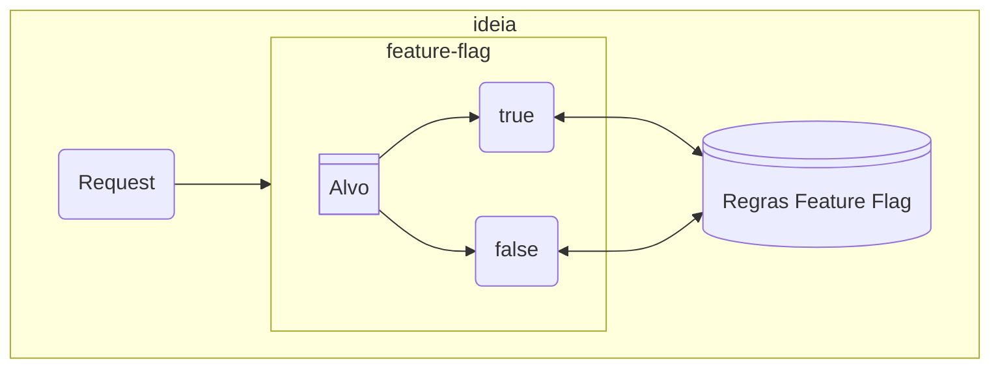
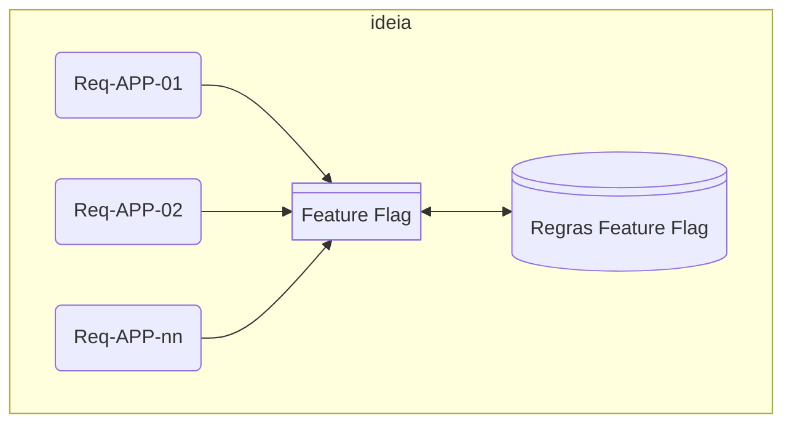

<!-- https://www.bennadel.com/books/feature-flags/28-an-opinionated-guide-to-pull-requests-prs.htm#main-->
<p align="justify">A Metodologia Ágil pega a Metodologia Cascata, reduz seu escopo e a repete várias vezes até que o trabalho esteja completo. A pedra angular de um fluxo de trabalho de desenvolvimento ágil é uma forte ênfase em "Pessoas acima de processos e ferramentas" usando um loop de feedback contínuo:</p>
<div class="mdx-columns2" markdown>
- [x] Construa pequeno;
- [x] Mostre seu trabalho;
- [x] Refatore com base no feedback;
- [x] Repita;
</div>
## Projeto Greenfield
Metodologia Ágil é fantástica, dentro de um projeto **greenfield** em que não existe arte anterior. Mas, assim que você libera um produto para os clientes, todas as mudanças subsequentes estão sendo feitas dentro de um projeto **brownfield**.

- [x] Se há implantação tensa, há o medo;
- [x] O medo corrói a confiança, sem confiança, não nos sentimos seguros, a única motivação que nos resta é a da autopreservação;
 - [x] Eles começaram a pensar demais em seu código e a não cumprir seus compromissos. Isso não era bom para o produto;
- [x] E não era bom para a equipe;
- [x] Sem mencionar o fato de que isso criou uma tensão doentia entre nossa Equipe de Liderança Executiva e todos os outros;
- [x] Vamos imaginar: Refatorar uma consulta de banco de dados SQL;
```
A refatoração envolve executar uma consulta EXPLAIN , observar os gargalos do plano de consulta e, em seguida, atualizar o SQL em um esforço para aproveitar melhor os índices de tabela existentes.`

O código de consulta atualizado é então implantado no servidor de produção.

Mas imagine, se esta mudança NÃO causar o efeito esperado no ambiente de Produção. Se você vir esse cenário começando a se desenrolar em suas métricas, você pode tentar reverter a implantação.

Ou você pode tentar reverter o código e reimplantá-lo.

Em ambos os casos, é uma corrida contra o tempo.

Puxar imagens, aquecer contêineres, iniciar aplicativos, executar compilações, executar testes de unidade: tudo isso leva tempo — tempo que você não tem.

Nessa abordagem, tanto a consulta SQL existente quanto a consulta SQL otimizada são implantadas na produção.

Os mesmos problemas inesperados de desempenho de SQL existem neste cenário.

Neste ponto, essa latência começa a aumentar. Mas, em vez do banco de dados travar, o sinalizador de recurso é desativado, imediatamente re-gating o código e desviando o tráfego de volta para a consulta SQL original.
```

- [x] Como identificar as equipes necessárias?
- [x] Como avisar as equipes necessárias, acordando-as se necessário?
- [x] Como sair efetuando o escalonamento?
- [x] Como iniciar a chamada de Zoom ou Teams em uma "sala de guerra"?
- [x] Como comunicar efetivamente o status da interrupção e o tempo estimado para correção?
- [x] Como elaborar Análise de Causa Raiz (Root Cause Analysis - RCA)?
      - [x] Cada RCA incluía uma discussão técnica sobre o que aconteceu, como tomamos conhecimento do problema, como identificamos a causa raiz e as etapas que pretendíamos tomar para evitar que ocorresse novamente.
- [x] Como criar uma equipe Change Control Board (CCB)?
      - [x] Deve revisar e aprovar todas as mudanças feitas no produto com a esperança de que decisões, causadoras de interrupções, sejam pegas antes que causem um problema.

## Feature Flag
O termo "feature flag" ou "feature toggle" ou "feature switch" ou "Sinalizadores de Recursos", é uma técnica de desenvolvimento de software que permite ativar ou desativar funcionalidades de um sistema em tempo real, sem a necessidade de modificar o código ou realizar deploys.

O desenvolvimento de produtos é um processo colaborativo.

E construímos nossos melhores produtos quando trabalhamos juntos em harmonia.

Quanto mais cedo pudermos todos começar a nos mover na mesma direção com as mesmas prioridades, mais cedo poderemos começar a enviar produtos com confiança e sem medo.

Os sinalizadores de recursos ajudam a preencher a lacuna de sofisticação entre equipes pequenas e fragmentadas e equipes grandes e verticalmente integradas.

Os sinalizadores de recursos são um conceito enganosamente simples. Pode ser difícil entender a extensão do impacto que eles têm em sua equipe porque as implicações não são apenas técnicas.

No entanto, o verdadeiro valor do que estou compartilhando aqui está na mudança cultural holística que os sinalizadores de recursos podem trazer para cada parte do seu ciclo de vida de desenvolvimento de produto.

- [x] **Implementação controlada** : as equipes podem lançar um novo recurso primeiro para um pequeno
grupo e depois para todos;
- [x] **Soluções rápidas** : se algo quebrar, as equipes podem desativar o recurso sem reimplantar
todo o sistema.
- [x] **Teste A/B**: os sinalizadores de recursos ajudam a testar diferentes versões de um recurso para ver
qual funciona melhor;
- [x] **Atualizações do servidor**: os sinalizadores de recursos permitem que as equipes testem as alterações em alguns servidores antes de atualizar todos;
- [x] **Controle de custos da nuvem**: as empresas os utilizam para desativar serviços extras quando não necessário;
- [x] **Recursos de segurança**: as equipes podem implementar novas configurações de segurança passo a passo, verificando se há problema.

se há problemas.

## Sinalizadores de Recursos
É um mecanismo de controle nomeado para alguma parte do seu código. Um sinalizador de recurso normalmente compõe um identificador (ex.: new-checkout-workflow), um tipo (ex.: Boolean), um conjunto de variantes (ex.: truee false), uma série de regras de segmentação e uma estratégia de implementação.

[](https://mermaid.live/edit#pako:eNp1UcFqwzAM_RWhw0ghOWTHMMY6Sm-D0t2GL2qsNAbHzhy7o4T8-5x0NEvYdLPe09N7Vo-llYwFwk9V2n6VNTkPwsBcXTidHbU1KMmKFhC4PDnyZ-DObyDLnqFi8sFxVmk6L5l3lf8p25ceuppaLkCqS-a49CloOrEuQOBWX6xAGFYz09pDnngXePMn9phUpLs1yEYuG4ccHiIZnsah19mKViYrr_qXkyPHJB3sb0FgPwZZG4vygCk27BpSMn5yP8ICfc0NCxxlJFcUtBcozBCpFLx9v5oSizFKis6Gc43F5D3F0EryvFMUVzf3bkvmw9r5zVJ5695uZ52uO3wDzqOKzQ)
<!--

-->
Os sinalizadores de recursos booleanos são, de longe, os mais comuns. No entanto, um sinalizador de recurso pode representar qualquer tipo de dado: booleanos, strings, números, datas, JSON, etc.

Para tornar nosso sistema de sinalizadores de recursos dinâmico, precisamos substituir a estrutura de dados codificada por algo como:
<div class="mdx-columns2" markdown>
- [x] Consulta de banco de dados;
- [x] Comando GET;
</div>
Alterações feitas no "Regras Feature Flag" levam a alterações quase em tempo real no mecanismo de regras do aplicativo associado.

Observação: Os efeitos colaterais de um fluxo de trabalho de desenvolvimento baseado em sinalizadores de recursos ecoarão por toda a sua organização.

## Gerundiando
   - [x] Implantação
   - [x] Implantar é o ato de enviar código para um servidor de produção.
   - [x] "Implantado" se refere apenas à localização do código, não à sua participação no fluxo de controle do aplicativo. O código atrás de um sinalizador de recurso e nenhum usuário estiver sendo visado, então nenhum usuário estará realmente executando esse código implantado.
   - [x] Liberação
   - [x] Liberar é o ato de expor código e funcionalidade implantados para seus usuários.

Com os sinalizadores de recursos, no entanto, essas duas ações agora podem ser desacopladas e controladas de forma independente. A capacidade de separar "release" de "deployment" é o motivo de estarmos aqui — é o recurso transformador dos feature flags.

<!--

-->
[](https://mermaid.live/edit#pako:eNqFkcFqwzAQRH9l2UNpwIImR1NKDSG3QEhuRZeNtLYFsuTKUkMw_vcqKcRJe-je9o1mGLQjKq8ZS4R5autPqqUQQbo7PKRjE6hvwWg29CDlCcvnPX-KarcTL8sFPEFYzWB1Be4GnFuAEG9Q_U6p3kcYWuq5BG2-RGAVC7B0ZFuCxA1TTIFhY6mRCNMf93o7-61xQp3tnX3Puf8A_6bAa-6Wsx4EdhqwwI5DR0bnDxsvssTYcscSL_maa0o2SpRuyk8pRX84O4VlDIkLDD41LZY12SFvqdcUeW0od-putCf34f28szbRh-3Pia6Xmr4Baox7lA)
## Segmentação de Sinalizadores de Recursos
Há dois grupos de pessoas afetadas pela segmentação de sinalizadores de recursos: as pessoas que usam seu produto; e as pessoas que gerenciam seu sistema de sinalizadores de recursos.
### Tipos de dados
Qualquer tipo de dado que pode ser serializado para armazenamento pode ser usado em um sinalizador de recurso.
## Tipos conceituais
Os sinalizadores de recurso se dividem em dois tipos conceituais.

- [x] Um sinalizador de recurso de produto deve ser usado durante o desenvolvimento de um novo recurso de produto. Os sinalizadores de recurso de produto devem ter um cronograma finito. Um sinalizador de recurso de "produto" nunca será lançado para 100% dos usuários;
- [x] Os sinalizadores de recursos de operações, por outro lado, estão vinculados à operação contínua do próprio aplicativo e não têm cronograma inerente. Não há intenção de remover esse sinalizador de recurso do código.
### Variantes
É um dos valores distintos contidos em uma configuração de sinalizador de recurso. Uma variante é o que é retornado quando um sinalizador de recurso é avaliado dentro do contexto de uma determinada solicitação.
### Distribuição
É um pouco mais complicado de implementar. Em nosso objeto de configuração, estamos definindo a distribuição variante como uma distribuição ponderada com base em uma alocação percentual.

```
{
	variants: [ "error", "warn", "info", "debug", "trace" ],
	distribution: [ 0, 0, 0, 100, 0 ]
}
```
### Regras
Contém um operador, dois operandos e a distribuição ponderada que será usada se — e somente se — a solicitação passar na asserção do operador.

```
rule: {
		operator: "IsOneOf",
		input: "UserID",
		values: [ 1, 16, 34, 2009 ],
		distribution: [ 0, 0, 0, 100, 0 ]
}
```
#### Operadores
É um símbolo ou palavra que indica uma operação a ser realizada sobre um ou mais operandos.
<div class="mdx-columns2" markdown>
- [x] contains( search, item )
- [x] startsWith( searchString, searchValue )
- [x] endsWith( searchString, searchValue )
- [x] NotIsOneOf
</div>
#### Input
No contexto de um conjunto de campos armazenados, pode ser definido como os dados que o usuário fornece ou interage em uma aplicação, e que são armazenados localmente.
#### Valores
De forma geral, valores representam qualquer dado ou informação atribuída a algo, seja em código, decisões pessoais, registros de sistemas ou até interações em um site.
## Segmentação
É o mecanismo que determina qual variante de sinalizador de recurso é servida a um determinado usuário. As regras de segmentação incluem asserções positivas e negativas, sobre o usuário solicitante e uma estratégia de implementação.
## Rollout
É um termo sobrecarregado no contexto de sinalizadores de recursos. O termo rollout geralmente é usado para descrever o cronograma no qual um recurso será habilitado dentro do produto. Há dois tipos de rollouts: `imediato` e `gradual`.

- [x] Imediato, o código implantado é liberado para todos os usuários ao mesmo tempo.
- [x] Gradual, o código implantado é liberado para um número crescente de usuários ao longo do tempo.
## Roll-back
Significa reverter uma alteração de configuração recente.
## Entrega progressiva
Esta é a combinação de dois conceitos: implantar um recurso incrementalmente e liberar um recurso incrementalmente. Poderíamos construir situações, do tipo:

```
{
	variants: [ false, true ],
	distribution: [ 90, 10 ]
}
```
Uma regra contém um operador, dois operandos e a distribuição ponderada que será usada se — e somente se — a solicitação passar na asserção do operador.

```
{
	variants: [ "error", "warn", "info", "debug", "trace" ],
	distribution: [ 100, 0, 0, 0, 0 ],
	rule: {
		operator: "IsOneOf",
		input: "UserID",
		values: [ 1, 16, 34, 2009 ],
		distribution: [ 0, 0, 0, 100, 0 ]
	}
}
{
	variants: [ "error", "warn", "info", "debug", "trace" ],
	distribution: [ 100, 0, 0, 0, 0 ],
	rules: [
		{
			operator: "IsOneOf",
			input: "UserID",
			values: [ 1, 16, 34, 2009 ],
			distribution: [ 0, 0, 0, 100, 0 ]
		},
		{
			operator: "IsOneOf",
			input: "CompanySubdomain",
			values: [ "example-inc" ],
			distribution: [ 0, 0, 0, 100, 0 ]
		}
	]
}
sinalizadorRecurso( userID    => fnd_user.user_id  ,
            userEmail => fnd_user.email_address
          );
```

- [x] Sinalizador de recurso esteja ativado somente para usuários com um endereço de e-mail interno da empresa.
- [x] Sinalizador de recurso seja habilitado apenas para uma pequena porcentagem de usuários.

## Implantação
Imagine uma implementação muito mais graduada usando sinalizadores de recursos:

- [x] Implante código inativo em servidores de produção — nenhum usuário vê qualquer diferença ou impacto inicial no aplicativo.
- [x] Habilitar sinalizador de recurso para seu ID de usuário .
- [x] Recurso de teste em produção.
- [x] Descubra um bug.
- [x] Corrija o bug e reimplante o código (ainda ativo apenas para seu usuário).
- [x] Examine os logs de erros.
- [x] Habilitar sinalizador de recurso para usuários internos da empresa .
- [x] Examine registros de erros e métricas.
- [x] Descobrir bug(s).
- [x] Corrigir bugs e reimplementar o código (ainda ativo apenas para usuários internos da empresa).
- [x] Habilitar sinalizador de recurso para 10% de todos os usuários.
- [x] Examine registros de erros e métricas.
- [x] Habilitar sinalizador de recurso para 25% de todos os usuários.
- [x] Examine registros de erros e métricas.
- [x] Habilitar sinalizador de recurso para 50% de todos os usuários.
- [x] Examine registros de erros e métricas.
- [x] Habilitar sinalizador de recurso para 75% de todos os usuários.
- [x] Examine registros de erros e métricas.
- [x] Habilitar sinalizador de recurso para todos os usuários.
- [x] Comemore um lançamento de recurso bem-sucedido.


## Conclusão
Os sinalizadores de recursos ajudam as equipes a controlar melhor seus softwares. Eles permitem testar, corrigir e implementar mudanças com segurança e rapidez:

- [x] **Controle simples**: Ative ou desative recursos sem alterar o código;
- [x] **Testes Inteligentes**: Experimente coisas novas sem quebrar o sistema;
- [x] **Melhores Decisões**:Use dados reais antes de tornar os recursos permanentes;
