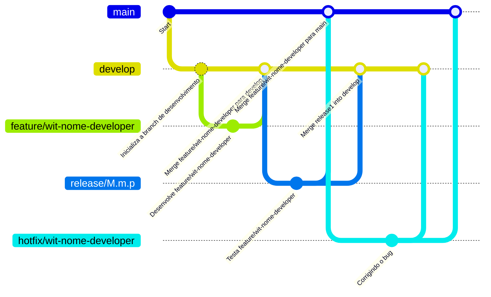
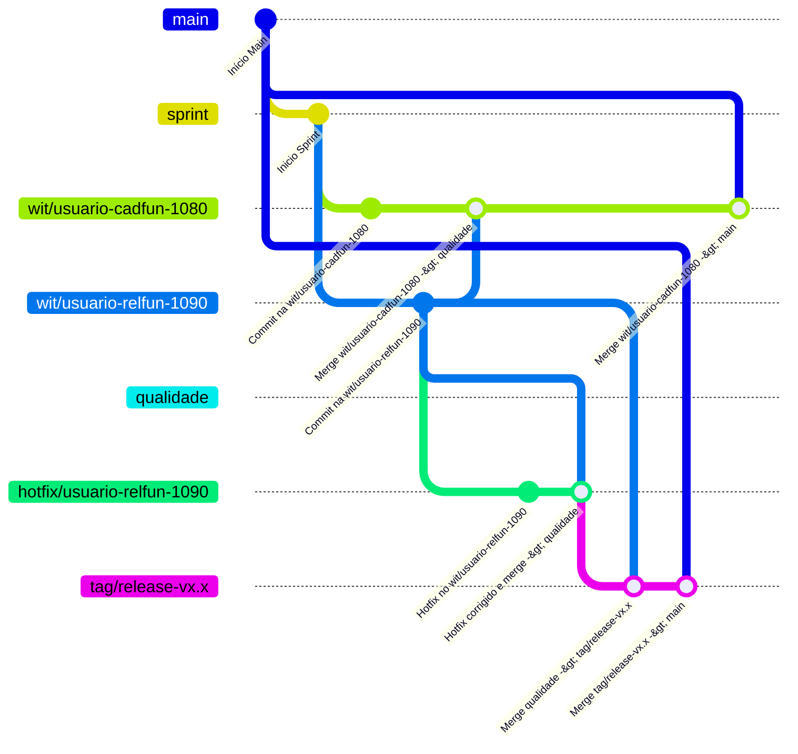
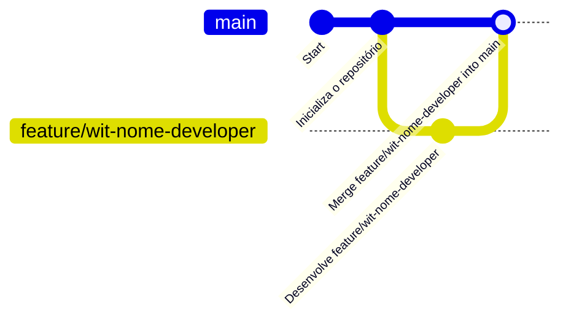

Há uma razão pela qual o TBD é amplamente usado em equipes ágeis.

Algumas boas práticas ágeis, como Desenvolvimento Orientado a Testes (TDD), Integração Contínua (CI) são essenciais para o TBD.

O TDD tem dois caracteres: curto e correto.

O ciclo de desenvolvimento do TDD é muito curto, o que torna possível o commit frequente.

E, por outro lado, os testes garantem que o código atenda aos requisitos.

A cobertura do teste também é garantida com o TDD. Com a ajuda do TDD, os membros da equipe conseguem fazer commit no branch trunk com frequência e confiança.

Outro benefício é que, como a equipe sempre trabalha na base de código mais recente, a possibilidade de grandes conflitos de mesclagem é reduzida.

## Flow MOTS
<!--

-->
[](https://mermaid.live/edit#pako:eNqVU7tuwzAM_BVBc5Ogq9cGKDpkSqfCC2PRNlFLNGgqfQT59yqJm4eRp-FF4vGOdxBXtmCHNrMV6atAW-fBpK9g70kNuczkdq4gmttdZSEQito4XGLDbY-usfjkqIPbY463QAVBQ79g4MCR_g7DkpsleQzKA5ESQaPg5It0FNjjqOdHGejeBB6PMv3XxGt99po1j1Jd6-6VZrdgLQjsmU-9CzYIHU5mYz8exnyuduzwHTuFR8x5oHDs7ETgITNbpjuyu6zQV54NpQcxDOfMxH1eNWtJ3_e9gBcWoYqCY8NmEat7Br7FfynKi332ySZEgru0fatNS261Ro-53czosITYbNdunaAQlec_obCZSsQnKxyr2mYlNF06xdaB4pSgEvD72xbCB_PhjI6UZbbb9-3ar_8A35VioQ)

## Flow MOTS II
<!--

-->
[](https://mermaid.live/edit#pako:eNqVlMFSgzAQhl8lk3Ox9aYcvOiMeuipN4fLmgTYEbIYEq3T6SP5FL6YKTBChgL2Rjb___3ZHZIDFyQVj3mG9tFAlSeaMSaoLNEylDFL-LP--RZIbAuoE97svxrQImd1ZVDb1pEr8UbOBrWQgifIrt0OMJ9o1652YJAiATJ1Orre3GymJEYVreR2E0bPcYKz3LcLDZMWPk0exS-Th5ag83cHBUqQ6v-NlMpkqjd2udumOuFj0d0g6YLWulPmZFPcL89_STcc1FOjZZoWBnW-3c4tyBjMUBJTnfBMp10TFrK1xyuoVfSxv9qHRz-7OzfqvuojR24-T2cDfOlvVUAeiX1A2V-9C36SEXrm_2gT-Ip7q_-W_kU4nFAJt7kq_SxPFKlScEVze49eCs7S7ksLHlvj1IobclnO4xSK2q9cJcGqB4TMQPlXrUC_EPVrJdGS2bZvUPMUHX8BmNiO8A)

## TBD Novos
<!--

-->
[](https://mermaid.live/edit#pako:eNqFUbtuwzAM_BWBc4LungMUGTJlK7ywEm0RtUSDphy0Qb6qn5Afq_LoA0WbcOLjeAce9-AlEDTQsz0qjrHNroaXlNgch8a1sDVUa-E6ieRfpJhLyPkP8DqzZxz4DZ04pVEmtuO7snwSPCtmH11HaEXpYce2zJJoGWimQUbSXzp3gT_VVzRRnmWY6dbe_6ck0v7W6lVmcxeWTS60AAuorDUP1eX9SaYFi5SohRNVoA7LcLb3UKFYTLav2UNjWmgBKqWP0HQ4TLUqY0CjFWOvmL66I-Ynke-aApvo5vLX83sPH8fgqiU)

## Passo a Passo
- [x] Imagine estar em uma entrevista e tentar explicar como implantar um contêiner com um pipeline. Isso costumava me assustar nos meus primeiros dias de devops. A chave é entender como cada peça se encaixa e, antes que você perceba, você se tornará um especialista no sybjet. O objetivo deste artigo é fornecer um roteiro para qualquer pessoa na área ou recém-chegada à área, de forma simples. Vamos lá!
- [x] Code Commit.  Antes mesmo de falarmos sobre pipeline, um código é necessário! Um código deve ser confirmado (armazenado) em um repositório (scm). Esse código é confirmado usando a estratégia de ramificação de fluxo do GitHub , onde um branch master e um branch de recurso são criados. O branch master é onde o código final será implantado, mas o branch de recurso é onde eles/desenvolvedores trabalharão sempre que um novo recurso for adicionado. Para que o novo branch de recurso seja mesclado ao branch master, uma solicitação de pull para o branch master deve ser gerada assim que todas as atualizações no branch de recurso forem concluídas, enviando esse recurso para um repositório. Nota lateral : um pull request é simplesmente uma solicitação para integrar um branch de recurso com o branch master.
- [x] Gitguardian.  Uma vez que o código é enviado para o Master, ele precisará ser protegido . Para evitar que segredos sejam expostos ou enviados para o repositório, o Gitguardian é então usado. O Gitguardian escaneará os commits em busca de informações sensíveis e bloqueará o código de ser enviado acidentalmente se alguma informação sensível for encontrada.
- [x] Linters e formatadores de código.  Outra maneira de proteger nosso código é aplicando práticas fortes entre as equipes, utilizando linters e formatadores de código, como black para python e linters como plynt . Esses formatadores de código são usados ​​por desenvolvedores para formatar os códigos e colocá-los em um formato legível. Facilitando para os desenvolvedores detectar qualquer inconsistência no código.
- [x] Webhook.  Depois que tudo acima for feito, começaremos a planejar o pipeline em si. Depois que o PR for aprovado, o pipeline será acionado com webhook
- [x] Githcheckout.  É aqui que o pipeline começa. Pegaremos o código, testaremos e colocaremos no servidor. Então, um gitcheckout será executado, aqui o código é puxado do repositório de código-fonte , no meu ambiente fazemos isso com Jenkins.
- [x] Estágio de construção. Uma vez que o código é clonado, precisaremos construí-lo, por construir queremos dizer simplesmente baixar as dependências do projeto, que é a essência do estágio de construção. Para executar a construção, usamos Maven (para Java), pip (para projeto Python) e NPM (PARA projeto NodeJS ), todos esses são projetos de construção que usei em diferentes projetos. Discutiremos sobre eles mais tarde.
- [x] O teste de unidade é então realizado. Este teste é onde uma parte individual do código é testada . Ele é feito usando várias estruturas de texto de unidade, como JUNIT para Java , PYTEST para Python e jest para NodeJS ou ReactJS.
- [x] Teste SAST. Uma vez que o teste de unidade é feito, com a segurança em mente, nós realizaremos um teste de segurança de aplicativo estático (SAST ) usando sonarqube (instalar no ec2) ou sonarcloud (precisa apenas de credenciais para efetuar login), nós também podemos usar o Fortify para fazer o teste. Esses testes são feitos para verificar o código para quaisquer vulnerabilidades de segurança, assim como informações sensíveis codificadas. Nós também podemos verificar a cobertura do código com testes de unidade.
- [x] Depois que tudo isso for feito, agora podemos verificar as dependências do código executando a análise de composição de software usando OWASP Dependency check . Isso ajudará a verificar se alguma vulnerabilidade ainda está presente nas dependências que estamos usando para o projeto. Isso também concluirá a parte de teste do código até depois da implantação, quando um teste de integração será fornecido.
- [x] Estágio de construção do Docker.   Agora que o teste foi feito, podemos fazer o estágio de construção do Docker . Aqui, executaremos os comandos de construção do Docker (docker build . -t tag details) para construir o aplicativo de arquivo do Docker e, posteriormente, a imagem do Docker com a marcação adequada. A imagem do Docker é o que usamos para implantar o contêiner.
- [x] Trivy scan . assim que construirmos a imagem, como uma camada extra de segurança, escanearemos a imagem que construímos para as vulnerabilidades, para ver se há alguma vulnerabilidade importante daquele contêiner de imagem base que usamos. Para fazer isso, faremos uso do trivy scan.
- [x] Dockerhub. Se tudo der certo, podemos salvar a imagem no repositório como aws ECR ou dockerhub ou até mesmo nexus antifactory para armazenar o artefato.
- [x] Terraform.  Em seguida, usaremos o pipeline de infraestrutura do Terraform para criar o recurso de infraestrutura e implantar o aplicativo.
- [x] Kubernetes.  Em seguida, acionaremos o arquivo de manifesto do Kubernetes usando o comando (kubetcl apply -f mais o nome do arquivo de manifesto) ou o arquivo de gráficos do helm por meio de nossos pipelines.
- [x] Namespace do Kubernetes... então configuraremos os estágios com detalhes individuais do cluster ou detalhes do namespace do Kubernetes se estivermos usando o mesmo cluster, para promover para outros ambientes como dev, stage, production.
- [x] DAST. Depois que tudo estiver pronto, podemos nos concentrar em executar alguns testes de integração para o APIS END -TO END Testing usando frameworks como selenium e karate framework. Nesta fase, podemos executar DAST SCANS SE NECESSÁRIO USANDO OSWAPS
- [x] Os testes de integração  também ocorrerão após a implantação, onde todo o código será enviado por texto.

## GitHub YAML
```
name: CI/CD Pipeline for GitFlow and TBD
on:
  pull_request:
    branches:
      - main
    paths:
      - '**/*'
    types:
      - opened
      - synchronize
      - reopened

jobs:
  secret_scan:
    runs-on: ubuntu-24.04

    steps:
      - name: Checkout repository
        uses: actions/checkout@v2

      - name: Check for exposed secrets
        uses: github/super-linter@v4
        with:
          run-local: true

  # Etapa 2: Escaneamento de commits em busca de informações sensíveis
  scan_commits:
    runs-on: ubuntu-latest
    needs: secret_scan  # Certifique-se que a verificação de segredos passou antes de continuar
    steps:
      - name: Checkout repository
        uses: actions/checkout@v2
      - name: Check commits for sensitive information
        run: |
          git log --oneline --pretty=format:"%h" | while read commit_hash; do
            git show --name-only $commit_hash | grep -iE 'password|secret|api_key|token|password' &&  echo "Sensitive information found in commit $commit_hash" && exit 1;
          done
  # Etapa 3: Linter e Formatter
  linter:
    runs-on: ubuntu-latest
    needs: scan_commits  # Executa só se o escaneamento de commits for bem-sucedido
    steps:
      - name: Checkout repository
        uses: actions/checkout@v2
      - name: Set up Node.js
        uses: actions/setup-node@v2
        with:
          node-version: '14'
      - name: Install linters and formatters
        run: |
          npm install eslint prettier
      - name: Run ESLint and Prettier
        run: |
          npm run lint
          npm run format
  # Etapa 4: Construção e Execução de Testes
  build_and_test:
    runs-on: ubuntu-latest
    needs: linter  # Executa só se o código passar pela verificação do linter
    steps:
      - name: Checkout repository
        uses: actions/checkout@v2
      - name: Set up JDK 11
        uses: actions/setup-java@v2
        with:
          java-version: '11'
      - name: Install dependencies using Maven
        run: mvn install
      - name: Run Unit Tests
        run: |
          bash scripts/testeUnitario.sh
        continue-on-error: false  # Se o teste falhar, o processo será interrompido
  # Etapa 5: Análise de Segurança (SAST - SonarQube)
  security_analysis:
    runs-on: ubuntu-latest
    needs: build_and_test  # Executa só se o teste unitário for bem-sucedido
    steps:
      - name: Checkout repository
        uses: actions/checkout@v2
      - name: Install SonarQube Scanner
        run: |
          curl -sSLo sonarqube-scanner.zip https://binaries.sonarsource.com/Distribution/sonar-scanner-cli/sonar-scanner-cli-4.6.2.2472-linux.zip
          unzip sonarqube-scanner.zip
          mv sonar-scanner-* /usr/local/sonar-scanner
     - name: Run SonarQube Static Analysis
       run: |
         sonar-scanner \
           -Dsonar.projectKey=my_project_key \
           -Dsonar.sources=. \
           -Dsonar.host.url=https://sonarcloud.io \
           -Dsonar.login=$SONAR_TOKEN

 # Etapa 6: Verificação de dependências com OWASP Dependency Check
  dependency_check:
    runs-on: ubuntu-latest
    needs: security_analysis  # Executa só se a análise de segurança for bem-sucedida

    steps:
      - name: Checkout repository
        uses: actions/checkout@v2

      - name: Install OWASP Dependency Check
        run: |
          curl -sSLo owasp-dependency-check-cli.zip https://github.com/jeremylong/DependencyCheck/releases/download/v6.5.0/dependency-check-6.5.0-release.zip
          unzip owasp-dependency-check-cli.zip
          mv dependency-check-* /usr/local/dependency-check
      - name: Run OWASP Dependency Check
         run: |
           /usr/local/dependency-check/bin/dependency-check.sh --scan . --out . --format HTML

# Etapa 7: Construção da Imagem Docker
docker_build:
  runs-on: ubuntu-latest
  needs: dependency_check  # Executa só se a análise de dependências for bem-sucedida

  steps:
    - name: Checkout repository
      uses: actions/checkout@v2

    - name: Set up Docker
      uses: docker/setup-buildx-action@v2

    - name: Build Docker Image
      run: |
        docker build -t my-app:latest .

# Etapa 8: Escaneamento da Imagem Docker com Trivy
docker_scan:
  runs-on: ubuntu-latest
  needs: docker_build  # Executa só se a construção do Docker for bem-sucedida

  steps:
    - name: Install Trivy
      run: |
        curl -sfL https://github.com/aquasecurity/trivy/releases/download/v0.34.0/trivy_0.34.                   0_Linux-64bit.deb -o trivy.deb
                             sudo dpkg -i trivy.deb

    - name: Scan Docker image for vulnerabilities
      run: |
        trivy image my-app:latest

# Etapa 9: Deploy e Publicação de Docker no DockerHub
docker_publish:
  runs-on: ubuntu-latest
  needs: docker_scan  # Executa só se o escaneamento do Docker for bem-sucedido

  steps:
    - name: Checkout repository
      uses: actions/checkout@v2

    - name: Log in to DockerHub
      uses: docker/login-action@v2
      with:
        username: ${{ secrets.DOCKER_USERNAME }}
        password: ${{ secrets.DOCKER_PASSWORD }}

    - name: Push Docker Image to DockerHub
      run: |
        docker tag my-app:latest my-dockerhub-repo/my-app:latest
        docker push my-dockerhub-repo/my-app:latest

# Etapa 10: Notificação por Email
send_notification:
  runs-on: ubuntu-latest
  needs: docker_publish  # Executa só se o Docker for publicado com sucesso

  steps:
    - name: Send email notification
      uses: dawidd6/action-send-mail@v3
      with:
        server_address: smtp.gmail.com
        server_port: 587
        username: ${{ secrets.GMAIL_USERNAME }}
        password: ${{ secrets.GMAIL_PASSWORD }}
        to: "recipient@example.com"
        subject: "CI/CD Pipeline Completed"
        body: "The latest version of the application is ready for deployment and has been pushed to DockerHub."
```
<!--
http://qszhuan.github.io/agile/2018/10/09/the-things-you-need-to-know-about-trunk-based-development
https://www.linkedin.com/pulse/migrating-from-trunk-based-development-git-flow-workflow-alam/
-->
