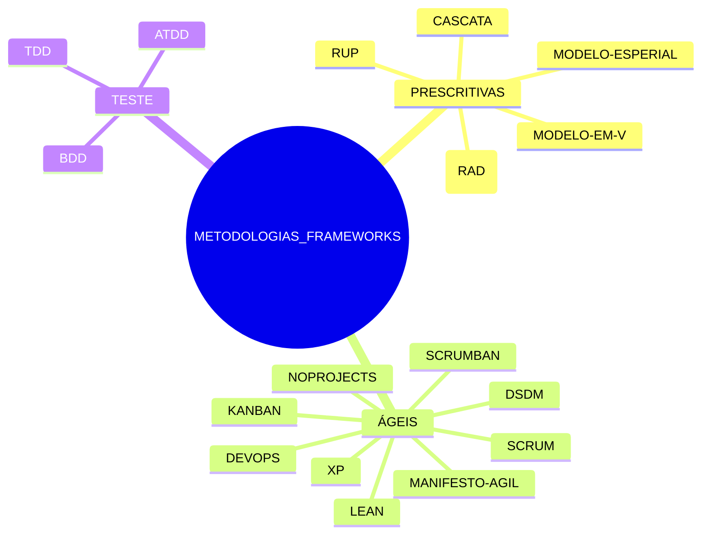

## Da Crise do Software à Era da Inteligência Artificial

Ao chegarmos ao fim desta exploração abrangente sobre o mundo do software, somos levados a refletir sobre a extraordinária jornada que a tecnologia percorreu desde 1958 até os dias atuais. A evolução dos projetos de software é marcada por uma série de inovações que transformaram não apenas o modo como vivemos, mas também a forma como entendemos o potencial humano de criar e inovar.

Desde os primeiros passos com linguagens de programação rudimentares e sistemas operacionais básicos, até o desenvolvimento de inteligência artificial e a ubiquidade da computação em nuvem, cada década trouxe consigo novos desafios e oportunidades. A capacidade de adaptação e a busca incessante por soluções mais eficientes foram fundamentais para superar obstáculos e abraçar as transformações inevitáveis do futuro.

Os desafios enfrentados ao longo do tempo, como a gestão de equipes multidisciplinares, a integração de sistemas complexos e a segurança da informação, continuam a ser temas centrais na construção de soluções tecnológicas. No entanto, a colaboração global, impulsionada pela conectividade digital, tem possibilitado a criação de comunidades de prática que compartilham conhecimentos e experiências, enriquecendo o campo de desenvolvimento de software.

Olhando para o futuro, é essencial que continuemos a cultivar um ambiente que fomente a inovação, a ética e a sustentabilidade nas práticas de desenvolvimento de software. Ao incentivar uma cultura de aprendizado contínuo e adaptabilidade, estaremos melhor equipados para enfrentar os desafios emergentes e aproveitar as oportunidades que surgirem.

Assim, este pequeno lembrete não apenas registra a história dos projetos de software, mas também serve como um convite para que cada leitor se torne um protagonista na próxima fase desta narrativa em constante evolução.
### Uma Jornada pelos Paradigmas e Práticas do Desenvolvimento de Software

A evolução tecnológica desde o cartão perfurado até a inteligência artificial representa uma trajetória rica e complexa, marcada por avanços significativos em computação, algoritmos e capacidade de processamento.

O cartão perfurado, introduzido no final do século XIX, foi uma das primeiras formas de armazenamento de dados e processamento automatizado. Utilizado inicialmente para tabulação de dados no censo dos Estados Unidos de 1890, os cartões perfurados permitiram a entrada e armazenamento de dados de forma mecânica, constituindo um marco importante na mecanização do processamento de informações.

Com o advento dos computadores eletrônicos na década de 1940, como o ENIAC, os cartões perfurados continuaram a ser utilizados como um meio de entrada de dados, mas as máquinas agora podiam realizar cálculos e processar informações em velocidades sem precedentes. Este período também viu o desenvolvimento dos primeiros softwares e linguagens de programação, que permitiram aos usuários interagir com as máquinas de forma mais eficiente e flexível.

Nas décadas seguintes, o surgimento de computadores pessoais e a miniaturização dos componentes eletrônicos transformaram o uso da tecnologia, tornando-a acessível a um público muito mais amplo. A transição dos cartões perfurados para discos magnéticos e, posteriormente, para armazenamento digital, refletiu a necessidade crescente de armazenamento de dados em maior escala e com maior eficiência. Este período também testemunhou o surgimento de redes de computadores e, eventualmente, da internet, que revolucionou a forma como os dados são compartilhados e processados globalmente.

Nos anos 2000, o foco começou a se deslocar para o desenvolvimento de tecnologias de inteligência artificial. Com raízes que remontam à década de 1950, a inteligência artificial passou a ganhar destaque com o aumento da capacidade computacional e a disponibilidade de grandes volumes de dados. Algoritmos de aprendizado de máquina, em particular, começaram a demonstrar habilidades notáveis em tarefas como reconhecimento de fala, visão computacional e processamento de linguagem natural.

Atualmente, a inteligência artificial está integrada em muitos aspectos da vida cotidiana, desde assistentes pessoais em smartphones até sistemas de recomendação em plataformas de streaming e comércio eletrônico. O desenvolvimento contínuo de redes neurais profundas e outras técnicas avançadas continua a expandir os limites do que é possível com a inteligência artificial, prometendo transformar setores como saúde, transporte e manufatura.

O panorama histórico da evolução tecnológica, portanto, não é apenas uma progressão linear de invenções e descobertas, mas um testemunho da interação complexa entre inovação, necessidade e oportunidade. A jornada desde o cartão perfurado até a inteligência artificial reflete a capacidade humana de conceber e implementar soluções tecnológicas que não apenas atendem às necessidades imediatas, mas também abrem caminho para possibilidades futuras ainda inimagináveis.

