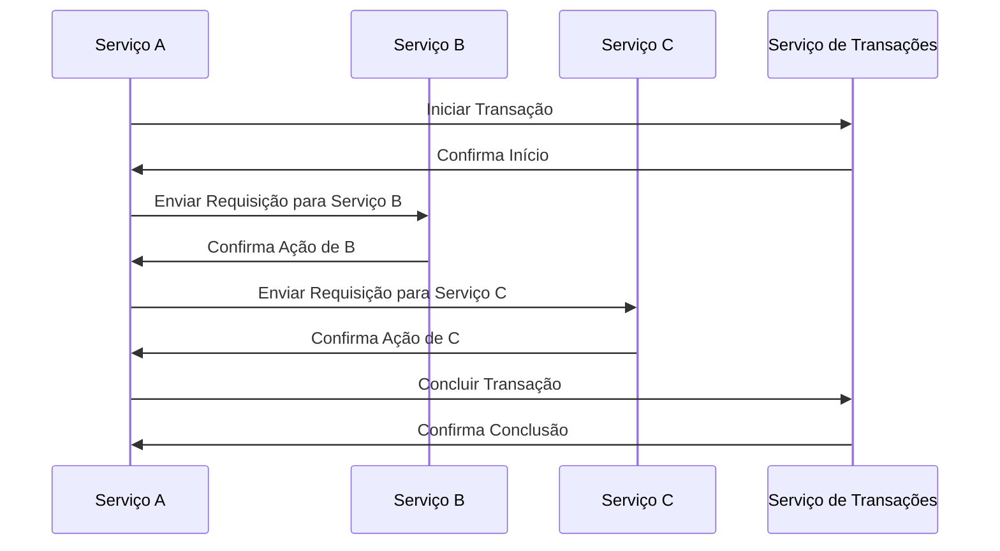
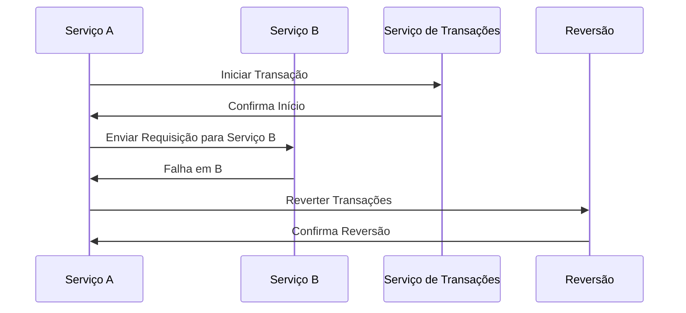
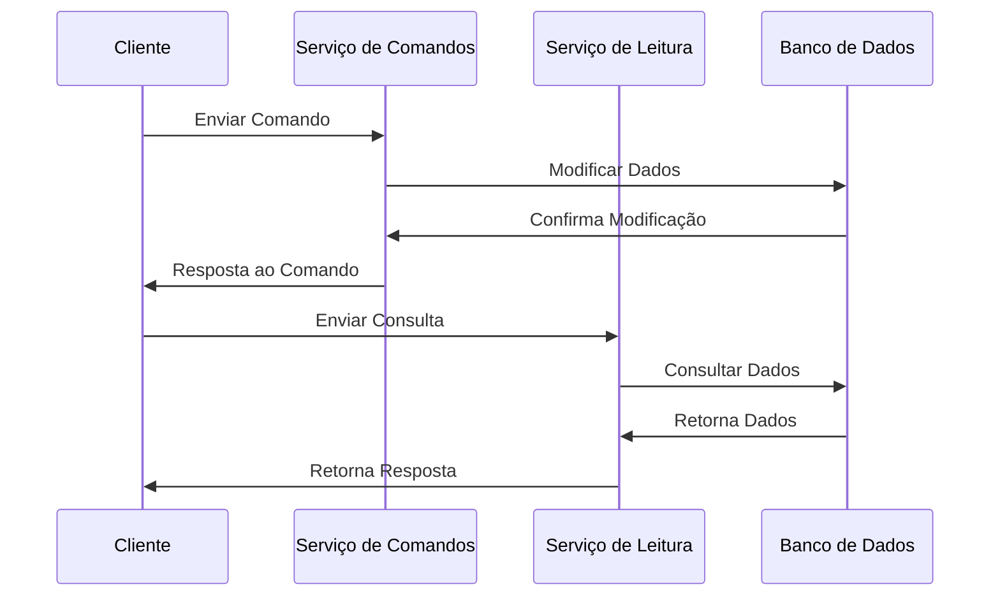
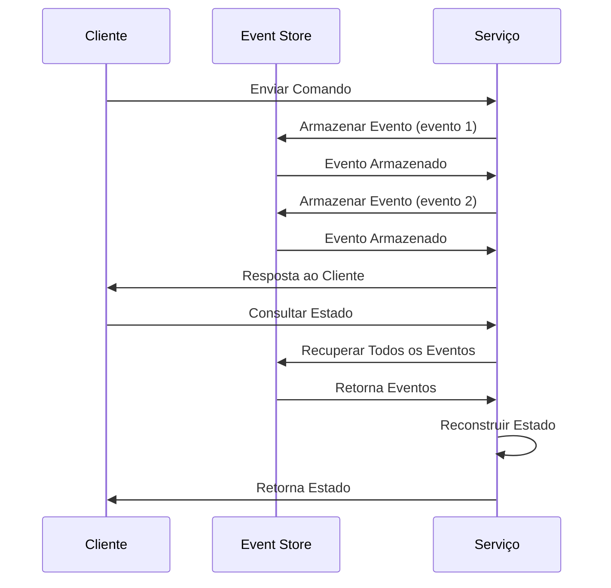
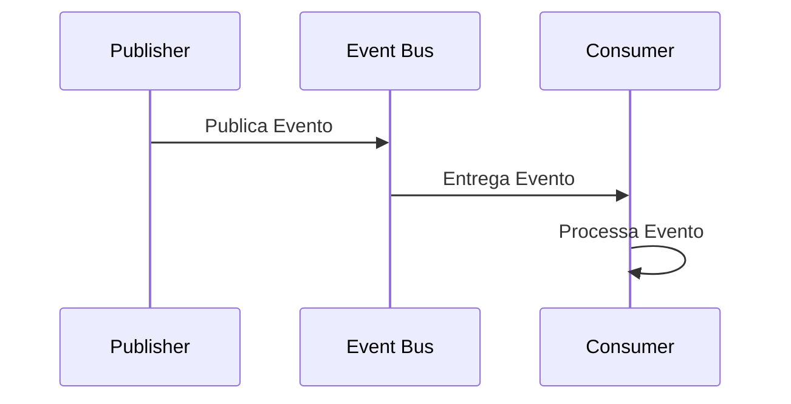
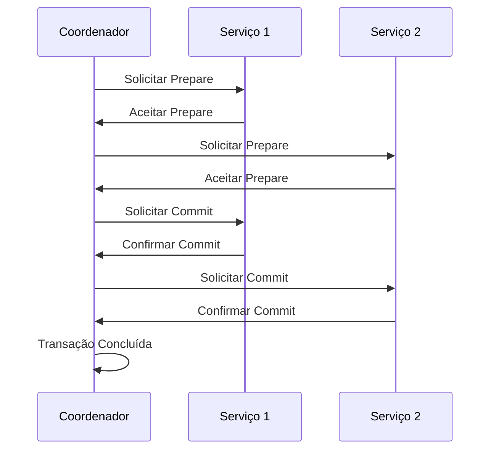
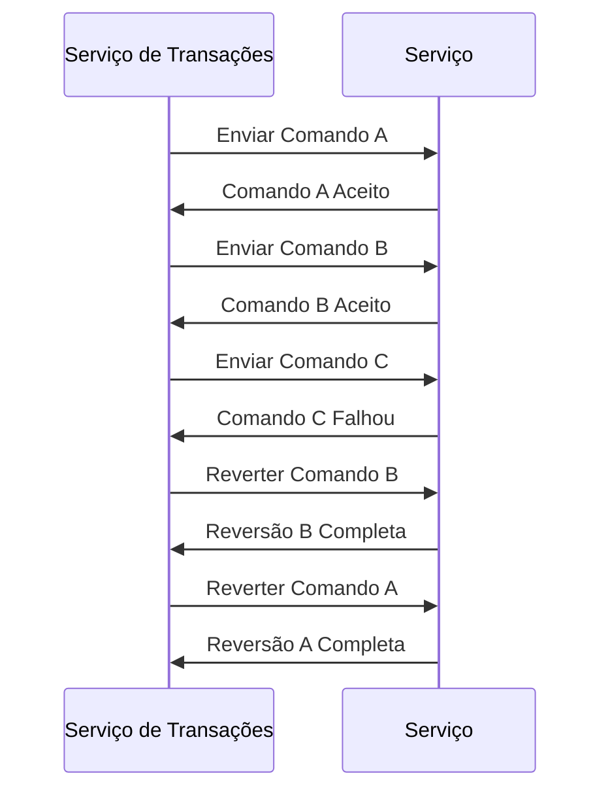

## Saga Pattern
O padrão Saga é uma maneira de gerenciar transações distribuídas em sistemas, onde uma série de transações menores são realizadas e podem ser revertidas caso algo falhe.

Em caso de falha em um dos serviços, há um processo de compensação para reverter as ações anteriores:

## CQRS (Command Query Responsibility Segregation)
O CQRS separa as responsabilidades de leitura e escrita. Os comandos são usados para alterar o estado, enquanto as consultas (queries) são usadas para leitura.

## Event Sourcing
Event Sourcing envolve armazenar todos os eventos que alteram o estado do sistema, ao invés de armazenar o estado atual. O sistema reconstruí o estado através desses eventos.

## Arquitetura Orientada a Eventos (Event-Driven Architecture - EDA)
Na Arquitetura Orientada a Eventos, o sistema reage aos eventos em vez de realizar chamadas diretas entre os serviços.

Aqui, o Publisher envia eventos para um barramento de eventos (Event Bus), que então entrega esses eventos aos consumidores interessados.

## Transações Distribuídas
Em um sistema distribuído, as transações podem ser complexas devido à latência e à falha de serviços. Aqui, você pode usar abordagens como o Two-Phase Commit (2PC) ou o Three-Phase Commit (3PC).

### Two-Phase Commit (2PC):

### Compensação de Transações
Quando há falha em uma transação e a reversão das etapas anteriores é necessária, pode-se usar a compensação para desfazer as ações.

