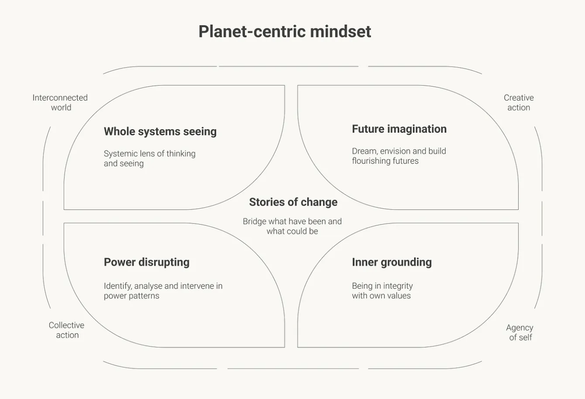

## Desafiando o paradigma atual
Na minha prática de nutrir uma mentalidade centrada no planeta, a essência é que precisamos nos libertar ou desaprender dos modelos mentais majoritários que criaram os atuais problemas sistêmicos de consumo excessivo, polarização, desigualdade, solidão e estresse.

Na comunidade regenerativa, há diferentes maneiras de explicar a falácia do paradigma atual. Laura Storm e Giles Hutchins explicam a teoria da separação como a separação entre o humano e a natureza, o masculino e o feminino, o interno e o externo e o hemisfério cerebral esquerdo e o hemisfério cerebral direito.

Eu foco em três modelos mentais dos quais precisamos nos libertar para transformar nossa maneira de pensar: Separação da natureza e dos humanos, separação dos humanos na sociedade e separação do eu. Destrinchar isso em detalhes requer um post inteiro próprio, o que farei em algum momento. Enquanto isso, você pode ver a essência no modelo abaixo.


Três visualizações da separação para a interconexão. 

- [x] A primeira é a separação da natureza e dos humanos para a interconexão dos humanos como parte da natureza. 
- [x] A segunda é a separação dos humanos para que todos os humanos sejam iguais. 
- [x] A última é a separação do eu para o ser inteiro.

## A base de uma mentalidade centrada no planeta
Nos últimos 5+ anos, eu explorei, estudei e experimentei explicar o que é necessário para que possamos começar a construir essa maneira de ver, ser e fazer. Isso é um aprendizado contínuo também para mim. O que mais ressoa é explicar assim:

```Uma mentalidade centrada no planeta está reacendendo e nutrindo nosso senso de interconexão entre a natureza e os humanos, construindo pontes entre as pessoas nas comunidades e nos vendo como seres inteiros, nos mostrando humanos autênticos e destemidos.```

Deixe-me apresentar a vocês a base de uma mentalidade centrada no planeta. (Primeiro, o que significa base, e por que não chamá-la simplesmente de etapas ou características?)

A palavra bedrock é nova para mim, mas realmente ressoou. Bedrock forma a fundação sólida abaixo da superfície da Terra. Ela representa a camada mais alta da crosta terrestre que é sólida e não intemperizada, ficando abaixo de materiais superficiais como solo e sedimentos. Ela representa o elemento mais fundamental, confiável e imutável de um sistema, organização ou conceito.

Acredito que há algo fundamental e universal sobre o que é necessário para nutrir uma mentalidade centrada no planeta. Mas este não é um guia passo a passo ou caixas para marcar para consertar rapidamente. Será um processo contínuo e eu mesmo não sou um mestre, mas ficaria grato em ser seu guia.



## A base da mentalidade centrada no planeta, ilustração de idun@respira. 2024.
A base da nossa experiência humana é conhecer a nós mesmos. Quem somos certamente não está desconectado da nossa comunidade ou do mundo, mas conhecer e viver em integridade com nossos próprios valores é o que nos dá o fundamento interno para nos conectarmos profundamente e doarmos aos outros. Requer trabalho contínuo e níveis de autoconsciência para olhar profundamente para dentro e identificar tanto nossas capacidades internas quanto os medos que às vezes nos impedem de viver nosso verdadeiro potencial.

Nossa lente sistêmica nos ajuda a ampliar, encontrar os problemas certos para resolver e ampliar para resolvê-los. Pensar em sistemas, pensar em sistemas integrais , fortalece o senso de interconexão entre humanos, sociedades e natureza e nos mostra o quão importante é a colaboração para resolver problemas. Afinal, somos um.

Uma vez que vemos todo o sistema, precisamos prestar atenção às relações de poder que existem dentro dele. Nenhum sistema é neutro, e identificar quem tem o poder de definir, ditar e decidir o que é a norma é fundamental. E com o conhecimento, vem a ação. Uma vez que a injustiça é vista, temos a responsabilidade de agir e intervir. Este será o nosso caminho para a justiça. Tornar o invisível visível, o não ouvido ouvido, é parte do que a transparência (consciente) pode fazer.

Quando crianças, nossa imaginação flui livremente e sonhamos com coisas maiores e melhores sem julgamento. Conforme crescemos, a maioria de nós para de sonhar. Priorizamos nossa mente analítica e racional, pois é isso que é valorizado na sociedade. Dizem que é mais fácil imaginar o fim do mundo do que o fim do capitalismo. Estamos cercados por cenários futuros negativos, visões distópicas do que está por vir se continuarmos em nosso caminho. E honestamente, algumas delas estão se tornando bastante realistas. Se queremos um mundo diferente, precisamos começar a imaginar um caminho diferente , e imaginá-lo tão vividamente que começamos a sentir, cheirar e acreditar nele. Napoleon Hill disse isso lindamente: Os sonhos são as sementes da realidade. É isso, há esperança para um futuro melhor. Não ignorando os fatos, mas nos permitindo sonhar com algo diferente.

Nem todos verão o que é necessário ao mesmo tempo. A transformação não é linear. Se quisermos atingir o ponto de inflexão social que nos leva a um futuro próspero, precisamos respeitar que as jornadas das pessoas podem parecer diferentes. Ao observar os arredores e praticar a escuta profunda, podemos criar histórias de mudança que capacitarão pessoas diferentes, dependendo de seu contexto, maturidade e ambição. Somente pela dignidade como um valor podemos construir pontes para todos, do que foi para o que poderia ser.

Para mim, esta é a base de uma mentalidade centrada no planeta. As diretrizes que nos ajudam a ser, ver, desafiar, sonhar e contar para a ação coletiva.

# Produção vs. Resultados
As empresas se fixam em entregar mais, sejam produtos, recursos ou tarefas, sem fazer a pergunta fundamental: esses esforços estão fazendo uma diferença significativa? 

No mundo acelerado dos negócios, é fácil igualar atividade com progresso. Muitas empresas rastreiam o sucesso pelo número de tarefas concluídas, recursos lançados ou prazos cumpridos. Essas métricas orientadas por resultados são tentadoras porque são fáceis de medir e fornecem uma imagem clara e tangível da produtividade. 

As equipes geralmente comemoram o cumprimento de metas semestrais ou trimestrais sem refletir se esses esforços alcançaram algo além de marcos de curto prazo.

Esse foco na produção em vez do resultado é uma armadilha em que muitas empresas caem. Estratégias orientadas à produção podem criar a ilusão de progresso, mas perder o alvo no que realmente importa: entregar valor. O sucesso não é apenas produzir mais; é fazer um impacto significativo que impulsione objetivos de negócios de longo prazo, seja melhorando a satisfação do cliente, aumentando a participação de mercado ou impulsionando a inovação.

Por que os resultados são mais importantes

Os resultados são a verdadeira medida do sucesso porque refletem o impacto real dos esforços de uma empresa em seus clientes, funcionários e resultados. 

Enquanto as saídas nos dizem o que foi feito, quantos produtos foram enviados ou quantos recursos foram adicionados, os resultados nos dizem por que isso importa. Por exemplo, entregar um novo recurso de produto é uma saída, mas melhorar a retenção ou a satisfação do cliente por causa desse recurso é um resultado.

A distinção entre saídas e resultados é mais do que apenas semântica.

Um foco em resultados alinha as atividades comerciais com objetivos estratégicos mais amplos.

Ele força as equipes a pensar criticamente sobre o valor que estão entregando em vez de simplesmente concluir tarefas. Em vez de celebrar o quanto foi produzido, as empresas que priorizam os resultados perguntam: 

* "Este trabalho criou um resultado significativo?"

Uma mentalidade orientada para resultados geralmente leva a vitórias de curto prazo, mas perdas de longo prazo. 

As empresas se tornam tão focadas em entregar mais que perdem de vista se estão entregando as coisas certas. 

Essa abordagem pode mascarar problemas mais profundos, como declínio na satisfação do cliente ou falta de inovação. As equipes podem atingir suas metas e entregar no prazo, mas sem considerar se seu trabalho está gerando resultados significativos, elas correm o risco de desperdiçar recursos em esforços que não movem a agulha.


Equipes que são recompensadas por atingir KPIs orientados a resultados, como o número de lançamentos de produtos ou o volume de tarefas concluídas, são incentivadas a focar na quantidade em vez da qualidade. Essa pressão pode levar a ciclos de desenvolvimento apressados, soluções incompletas e produtos que não atendem às necessidades do cliente.

## Mudando para uma abordagem orientada para resultados
A transição de uma mentalidade orientada para resultados para uma focada em resultados requer uma mudança fundamental em como o sucesso é medido. Em vez de rastrear o quanto foi feito, as empresas precisam se concentrar em se seu trabalho impulsiona uma mudança real. 

Isso requer repensar KPIs, práticas de gerenciamento de projetos e como as equipes são incentivadas.

Um dos maiores desafios na mudança para uma cultura orientada a resultados é encontrar as métricas certas para medir o sucesso. Saídas, como o número de recursos lançados, são fáceis de rastrear, mas os resultados exigem uma medição mais matizada. 

Métricas como pontuações de satisfação do cliente (CSAT), Net Promoter Scores (NPS) e valor de vida útil do cliente (LTV) oferecem uma imagem mais clara sobre se uma empresa está entregando valor real.

Ferramentas para Medir Resultados

Para mudar efetivamente para uma abordagem orientada a resultados, as empresas precisam das ferramentas e estruturas certas para medir o sucesso. Aqui estão algumas estratégias para fazer essa mudança:

- [x] Redefina KPIs: em vez de medir o sucesso por quantas tarefas são concluídas ou produtos são enviados, mude o foco para os resultados do cliente. Métricas como retenção, satisfação e engajamento do cliente fornecem uma imagem mais clara sobre se seu trabalho está criando valor duradouro.

- [x] Capacite equipes com autonomia: equipes orientadas a resultados precisam de liberdade para experimentar, iterar e ajustar seu trabalho com base no feedback. A autonomia permite que as equipes se concentrem em resolver problemas reais, em vez de apenas atingir metas.

- [x] Promova uma cultura de feedback: o feedback contínuo de clientes e funcionários é essencial para entender se seus resultados estão gerando os resultados desejados. Estabeleça ciclos de feedback que permitam que as equipes ajustem sua abordagem com base em resultados do mundo real.

- [x] Use Objetivos e Resultados-Chave (OKRs): OKRs alinham equipes em torno de metas orientadas a resultados. Em vez de focar em quantos recursos são entregues, OKRs encorajam equipes a pensar se seu trabalho melhora a experiência do cliente, aumenta o engajamento ou gera receita.

### Encontrando o equilíbrio entre  Produção vs. Resultados
A chave é encontrar um equilíbrio. 

A produção são necessárias para impulsionar o progresso, mas devem estar alinhados com os resultados que realmente importam. Quando os resultados são vinculados a resultados claros e estratégicos, eles se tornam medidas significativas de progresso. 

A velocidade do experimento é uma métrica que eu particularmente gosto para isso.

### Conclusão: Priorizando o que realmente importa
A mudança de uma mentalidade orientada por produção  para uma mentalidade orientada por resultados não é apenas um ajuste tático, é um imperativo estratégico para empresas que buscam sucesso a longo prazo. 

Embora entregar mais recursos, produtos ou serviços possa criar a aparência de progresso, é o impacto dessas saídas que realmente define o sucesso. As empresas devem ir além de simplesmente medir o quanto produzem e se concentrar em vez disso em se seus esforços estão fazendo uma diferença significativa. Essa mudança de foco requer repensar os KPIs, promover uma cultura de inovação e capacitar as equipes para alinhar seu trabalho com objetivos estratégicos de longo prazo.

Ao priorizar resultados em vez de produtos, as empresas podem garantir que seus esforços não sejam desperdiçados em atividades que não conseguem fazer a diferença.

Essa abordagem incentiva um engajamento mais profundo dos funcionários, melhor alinhamento com as necessidades do cliente e uma compreensão mais clara de como cada iniciativa contribui para a missão mais ampla da empresa. Também ajuda as organizações a evitar a armadilha de confundir ocupação com produtividade, garantindo que o trabalho que está sendo feito não esteja apenas sendo feito, mas causando um impacto duradouro. As empresas que prosperam são aquelas que conseguem equilibrar produtos e resultados, impulsionando o progresso de uma forma sustentável e significativa.

A jornada em direção ao sucesso orientado a resultados requer paciência, comprometimento e disposição para reavaliar continuamente o que está funcionando. No entanto, as recompensas, maior satisfação do cliente, posições de mercado mais fortes e equipes mais motivadas valem o esforço.

Na busca por aumentar a produtividade e acelerar a entrega, muitas empresas se concentram exclusivamente na eficiência, medindo o sucesso pela quantidade de código escrito ou pela rapidez com que as tarefas são concluídas. 

Mas há uma compensação crítica quando a experiência do desenvolvedor (DevEx) é negligenciada. Uma cultura que enfatiza apenas a produção pode levar ao esgotamento, dívida técnica e desengajamento entre os engenheiros.


