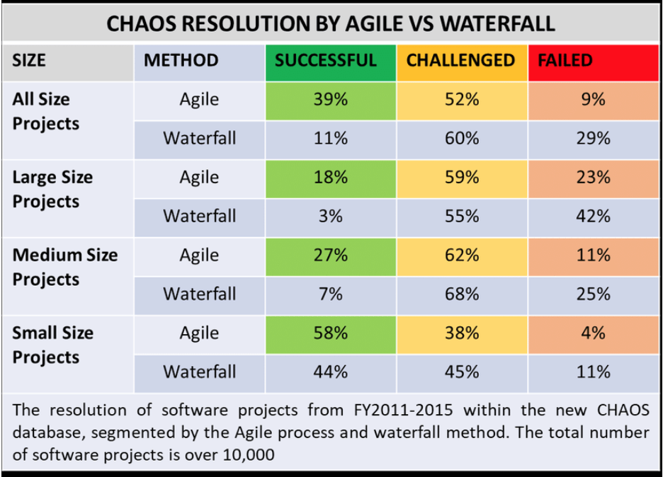
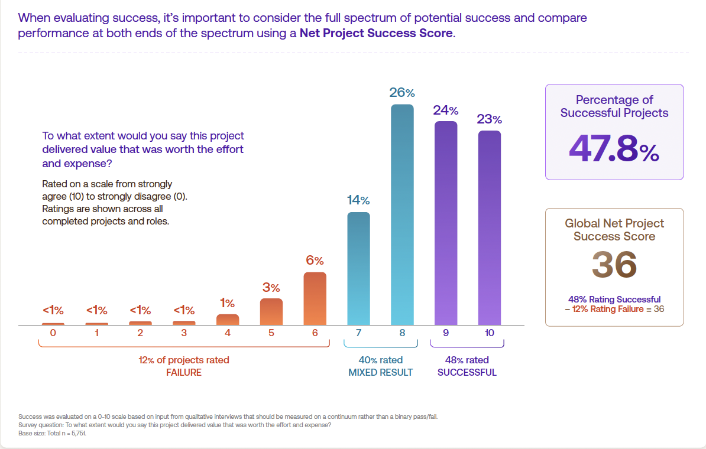

O fracasso de projetos de software é uma realidade comum na indústria de tecnologia, e as razões para isso são complexas e multifacetadas. Embora as metodologias e ferramentas de desenvolvimento tenham evoluído ao longo do tempo, os fatores que levam ao insucesso de projetos de software ainda são frequentemente os mesmos. Neste artigo, exploramos algumas das principais razões pelas quais os projetos de software falham, abordando questões técnicas, de gestão, e humanas.

Mais projetos de software deram errado por falta de tempo no calendário do que por todas as outras causas combinadas. Por que essa causa de desastre é tão comum?

- [x] Nossas técnicas de estimativa são mal desenvolvidas;
- [x] Confundimos falaciosamente esforço com progresso, escondendo a suposição de que homens e meses são intercambiáveis.
- [x] O progresso do cronograma é mal monitorado;
- [x] Quando o atraso no cronograma é reconhecido, a resposta natural (e tradicional) é adicionar mão de obra;

Somos mais otimistas do que realistas.

- [x] "Desta vez com certeza vai rodar" ou "Acabei de encontrar o último bug".
- [ ] É assim que escrever, experimentar, "trabalhar fora" são disciplinas essenciais para o teórico.
- [ ] O programador constrói a partir de puro pensamento: conceitos e representações muito flexíveis dos mesmos.
- [ ] São muitas tarefas ou junções, logo, a probabilidade de que cada um dê certo torna-se extremamente pequena.
- [ ] Isso implica que homens e meses NÃO são intercambiáveis.
      - [ ] uma tarefa não pode ser particionada devido a restrições sequenciais, a aplicação de mais esforço não tem efeito sobre o cronograma;
      - [ ] Em tarefas que podem ser particionadas, mas que requerem comunicação entre as subtarefas, o esforço de comunicação deve ser adicionado à quantidade de trabalho a ser realizado.
- [ ] Carga adicional de comunicação é composta de duas partes, treinamento (esforço adicionado varia linearmente com o número de trabalhadores) e intercomunicação (o esforço aumenta à medida que
n (n -1) / 2)
- [ ] Adicionar mais pessoas aumenta, não encurta, o cronograma.
- [ ] Planeje-se em

## Standish Group e "Chaos Report"
O Standish Group iniciou o Chaos Report em 1994, desde então, o relatório tem sido uma referência análise do sucesso e fracasso de projetos de software.
## Standish Group - [CHAOS Report](https://vitalitychicago.com/)
O Standish Group, responsável por elaborar o relatório CHAOS, propôs em 2018 uma mudança de perspectiva.

- [x] Para o grupo, prazo-custo-escopo não definem o sucesso do projeto.
- [x] O que essa tríade define, na verdade, é o sucesso do gerenciamento do projeto.
- [x] Todo projeto começa com uma ideia, uma necessidade ou uma oportunidade.

## The Standish Group 202x Chaos Report
Em 2020, com 25 anos de dados e mais de 50.000 projetos em seu banco de dados, os dados contam uma história diferente. Resumindo, os dados mostram que para ter sucesso com software você deve:

- [x] Pare de usar o Waterfall e comece a usar o Agile;
- [x] Pare de usar gerentes de projeto;
- [x] Pare de usar ferramentas de gerenciamento de projetos.

## Standish Group Chaos Report (2020) Beyond Infinity
Olhando para trás, para 1999, o Standish Group chamou o gerente de projeto de “chave” para o sucesso. Isso mudou no relatório de 2020. No relatório de 2020, eles vinculam o sucesso do projeto a três fatores além dos gerentes de projeto:

- [x] Patrocinador executivo;
- [x] Time;
- [x] Ambiente.

## Melhore a Solução/Tempo dos Projetos
Ter um bom patrocinador, boa equipe e bom local são as únicas coisas que precisamos melhorar e desenvolver, para melhorar o desempenho do projeto.

| Dicas            | Entenda                                                                 |
| ----------       | --------------                                                          |
| Bom Patrocinador | O patrocinador dá vida a um projeto, e sem patrocinador não há projeto; |
| Bom Time         | O patrocinador dá vida ao projeto, mas a equipe absorve esse fôlego e o utiliza para criar um produto viável que a organização possa usar e do qual extraia valor; |
| Bom Local        | É onde o patrocinador e a equipe trabalham para criar o produto. É formado pelas pessoas que apoiam o patrocinador e a equipe. Essas pessoas podem ser úteis ou destrutivas. É imperativo que a organização trabalhe para melhorar suas habilidades para que um projeto seja bem-sucedido; |

## Plano Diretor de Tecnologia da Informação e Comunicação
Somos convocados para estimar custos e prazos para o período seguinte, logicamente as previsões são demoradas e imprecisas, tendo o principal alvo no que se consegue VISUALIZAR em termos de FEATURES.

- [x] Métodos de estimativa, geram uma enganosa sensação de previsão, como por exemplo: Análise de Ponto de Função;
- [x] Ficam de fora do escopo: treinamentos,  débitos técnicos, riscos, testes unitários, estruturação e correção de bugs;
- [x] As estimativas viram compromissos que irão levar a stress e desvio de conduta;
- [x] O time acaba trabalhando mais na ENTREGA (Escopo, Prazo, Custo), promovem a baixa qualidade, Programação Orientada a Gambiarras (POG ou WOP – Workaround-oriented programming).
- [x] Métricas em relação a desempenho de códigos;
- [x] E para colocar qualquer exemplo: Os orçamentos e a previsibilidade colocam GORDURA.

- [x] Por qualquer critério, um projeto de TI apresenta um risco significativo de ultrapassar o **tempo, o custo ou o escopo**.

- [x] Por fim erramos até na pergunta: “Quanto custa?” é muito mais fácil de responder do que “Quanto vale?”.
- [x] Na maioria das empresas, o foco na entrega bem-sucedida de projetos distanciou-as do foco na entrega de valor aos seus clientes.
- [x] Por que no desenvolvimento de software adotou-se a realização de projetos?
- [x] No passado, tudo era quase impossível, por limitação do software.
- [x] Para tentar imitar a precisão e a previsibilidade da engenharia construção civil e a mecânica;
- [x] Acreditou-se que a disciplina e o espírito de planejamento dos projetos pudessem trazer ao desenvolvimento de software elementos que resolvessem a chamada ESCOPO, PRAZO e CUSTO.

## [70% Projetos - Fora do Prazo](https://www.usehaystack.io/blog/haystack-introduces-solution-to-end-chronic-software-delays-worrying-89-of-us-business-leaders)
- [x] 14 de dezembro de 2023 - Uma pesquisa descobriu que 70% dos projetos de software não são entregues no prazo, apesar de 83% dos engenheiros de software classificarem a importância da conclusão no prazo como alta ou muito alta.

## [Taxas de falha 268% mais altas em projetos de software ágeis](https://www.engprax.com/post/268-higher-failure-rates-for-agile-software-projects-study-finds)
Um estudo composto por 600 engenheiros de software do Reino Unido e dos EUA descobriu que os projetos que adotam as práticas do Manifesto Ágil têm 268% mais probabilidade de falhar do que aqueles que fazem o oposto.

- [x] O Manifesto Ágil existe há mais de 21 anos, mas continua a existir uma lacuna na investigação empírica quanto ao impacto real dos seus valores na indústria, apesar de pesquisas recentes terem descoberto que 81% dos decisores empresariais no Reino Unido e 89% nos EUA estão preocupados com a entrega pontual de projetos de software em suas organizações.
- [x] Projetos nos quais o engenheiro de software relatou sentir-se psicologicamente seguro para discutir e resolver problemas rapidamente quando eles surgiram tiveram 87% mais chances de sucesso aqueles que não o fizeram.
- [x] Os projetos onde os requisitos foram baseados com precisão em um problema do mundo real tiveram 54% mais chances de sucesso do que aqueles que não o fizeram.
- [x] As seguintes práticas de engenharia de software tiveram os seguintes aumentos nas taxas de sucesso em comparação com quando não são usadas:

| Prática de engenharia       | Aumento no sucesso ao usar versus não usar a prática (%) |
| ----------          | ----------                                               |
| Os requisitos do projeto estavam claros antes do início do processo de desenvolvimento de software | 97% |
| Ser capaz de discutir e resolver problemas rapidamente               | 87% |
| Os requisitos do projeto foram baseados com precisão no problema do mundo real  | 54% |
| O projeto tinha uma especificação completa ou documento de requisitos antes do início do desenvolvimento | 50% |
| Mudanças significativas foram feitas nos requisitos no final do processo de desenvolvimento        | 7% |
| O engenheiro de software relatou não ter que trabalhar em mais de um projeto ao mesmo tempo  | Sem diferença estatisticamente significativa (-3%, p = 0,558). |

## Maximizing Project Success/2024

O relatório é um chamado para que os profissionais de projeto ampliem sua perspectiva e foquem na entrega de valor, promovendo mudanças significativas na forma como o sucesso é medido e alcançado na disciplina de gerenciamento de projetos.
Maximizando o Sucesso do Projeto" aborda a evolução na definição de sucesso em gerenciamento de projetos, enfatizando a importância de entregar valor tangível e percebido, além de simplesmente cumprir prazos, orçamento e escopo. O relatório sugere que os profissionais de projeto devem assumir a responsabilidade pelo sucesso do projeto como um todo, não apenas pelo gerenciamento eficaz.

### Net Project Success Score

O sucesso foi classificado em uma escala que varia de 0 a 10, com 0 representando discordo totalmente e 10 representando concordo totalmente.

- [x] Doze por cento (12%) dos entrevistados disseram que seu projeto foi um fracasso (0–6);
- [x] Quarenta por cento (40%) dos projetos foram classificados como produzindo um resultado misto (7–8);
- [x] Quarenta e oito por cento (48%) foram classificados como bem-sucedidos (9–10).

Para calcular o NPSS Global, pegamos os 48% dos projetos classificados como bem-sucedidos e subtraímos os 12% classificados como fracasso, para uma pontuação geral do NPSS de 36.

Quando questionados sobre quais perspectivas contribuem para a determinação do sucesso, os entrevistados da pesquisa indicaram que os beneficiários pretendidos do projeto devem obter o dobro da parcela de influência em comparação com outras funções, destacando a importância da centralidade no cliente.

### NPSS por indústria, tipo de projeto e fonte de financiamento

