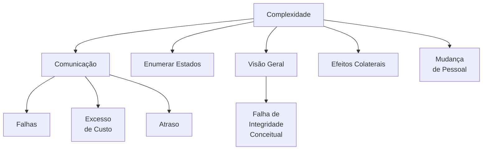

Para promover o trabalho em equipe eficaz em ambientes distribuídos, os líderes devem priorizar a **comunicação contínua**, ferramentas digitais robustas e uma cultura de equipe **inclusiva**.

Em qualquer equipe, a clareza em relação aos objetivos, funções e planos de execução é fundamental para o sucesso.

| Estrutura           | Objetivo |
| -----               | ----     |
| Aumento da Eficiência |  Com objetivos claros, funções bem definidas e planos transparentes, a equipe pode trabalhar de maneira mais eficiente, evitando retrabalhos e mal-entendidos. |
| Melhoria na Comunicação | A transparência na estrutura da equipe promove uma comunicação mais aberta. Os membros se sentem mais à vontade para compartilhar ideias e informações, contribuindo para um ambiente colaborativo. |
|                         | As ferramentas digitais desempenham um papel central na conexão de membros remotos da equipe, permitindo uma colaboração eficiente no projeto: Microsoft Teams, Planner ou Azure-Devops. |
|                         | Check-ins regulares da equipe, agendas claras para reuniões e o uso de canais de bate-papo para tópicos específicos contribuem para uma comunicação mais suave e melhor transparência. |
| Redução de Conflitos | Uma compreensão clara dos papéis e responsabilidades diminui a probabilidade de conflitos dentro da equipe.  |
|                | Cada membro sabe o que esperar dos outros, criando um ambiente mais harmonioso. |
| Maior Inovação | Com uma estrutura bem definida, os membros da equipe podem se concentrar mais em aspectos inovadores de seu trabalho, sabendo que suas contribuições estão alinhadas aos objetivos globais. |
| Promova a confiança | Quando os membros da equipe são confiáveis, cria-se uma atmosfera de confiança.  |
|                     | Se cada membro da equipe sabe que pode contar com os outros para cumprir suas responsabilidades, o nível de confiança aumenta. |
|                     | Isso, por sua vez, pode levar a uma colaboração mais eficaz e produtiva.        |
| Cultive uma cultura de inclusão | priorizar a experiência dos participantes remotos, com práticas como uso de vídeo, designação de facilitadores e uso de ferramentas como o [Front Row](https://learn.microsoft.com/en-us/microsoftteams/rooms/manage-front-row) no Microsoft Teams. |
| Facilita o planejamento | Se todos os membros da equipe são confiáveis, fica mais fácil planejar e alocar recursos, pois você pode ter certeza de que as tarefas serão concluídas conforme planejado. |
| Melhora a produtividade | Equipes com alto nível de confiabilidade são mais produtivas, pois menos tempo é gasto verificando o trabalho uns dos outros e mais tempo é gasto na execução eficaz do trabalho. |
| Cria um ambiente positivo | A confiabilidade contribui para um ambiente de trabalho positivo, pois reduz a incerteza e o estresse relacionado ao cumprimento de prazos e à qualidade do trabalho. |
|                           | Evite expectativas de trabalho “sempre ativo” definindo limites. |
| Motivação Sustentável | A convicção de que o trabalho importa alimenta uma motivação intrínseca mais sustentável, permitindo que os colaboradores superem desafios com resiliência. |
| Engajamento Elevado | Colaboradores que acreditam no impacto de seu trabalho tendem a se envolver mais ativamente nas tarefas, buscando constantemente maneiras de melhorar e inovar. |
| Superando sentimentos de isolamento | Check-ins regulares, atividades de formação de equipe e encontros virtuais informais (como coffee breaks ou happy hours) ajudam a manter um senso de pertencimento.|
| Acesso consistente aos recursos | Priorizar a disponibilidade de recursos, seja por meio de espaços de trabalho digitais ou equipes de suporte remoto, para garantir que todos os funcionários possam acessar ferramentas e informações essenciais. |
|                       | Os gerentes devem incentivar os funcionários a usar ferramentas que acomodam horários flexíveis, como o recurso de mensagem de status do Microsoft Teams, permitindo que os membros da equipe sinalizem sua disponibilidade. |
| Cultura de Alto Desempenho | A crença coletiva no impacto do trabalho contribui para uma cultura de alto desempenho, onde os membros da equipe se esforçam para alcançar objetivos comuns. |

- [x] A estrutura e clareza são elementos essenciais para o sucesso de uma equipe.

| time de sucesso | Essência | Objeto |
| ----            | ----     | ---    |
Indicadores de Impacto no Trabalho | Conexão com Objetivos Organizacionais | A compreensão clara de como as tarefas individuais contribuem para os objetivos organizacionais é fundamental para perceber o impacto do trabalho. |
| | Feedback Positivo | O reconhecimento e o feedback positivo sobre as contribuições dos colaboradores reforçam a crença no impacto do trabalho, alimentando uma cultura de apreciação. |
| | Alinhamento com Valores Pessoais | Projetos que ressoam com os valores pessoais de cada membro da equipe são mais propensos a serem percebidos como significativos. |
| Benefícios | Motivação Sustentável | A convicção de que o trabalho importa alimenta uma motivação intrínseca mais sustentável, permitindo que os colaboradores superem desafios com resiliência. |
|            | Engajamento Elevado | Colaboradores que acreditam no impacto de seu trabalho tendem a se envolver mais ativamente nas tarefas, buscando constantemente maneiras de melhorar e inovar. |
|            | Cultura de Alto Desempenho | A crença coletiva no impacto do trabalho contribui para uma cultura de alto desempenho, onde os membros da equipe se esforçam para alcançar objetivos comuns. |

