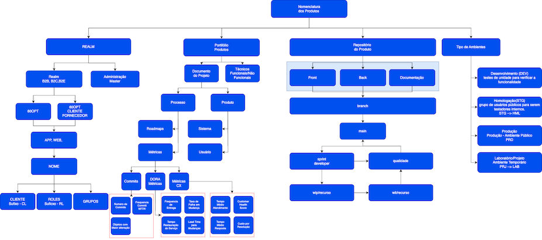
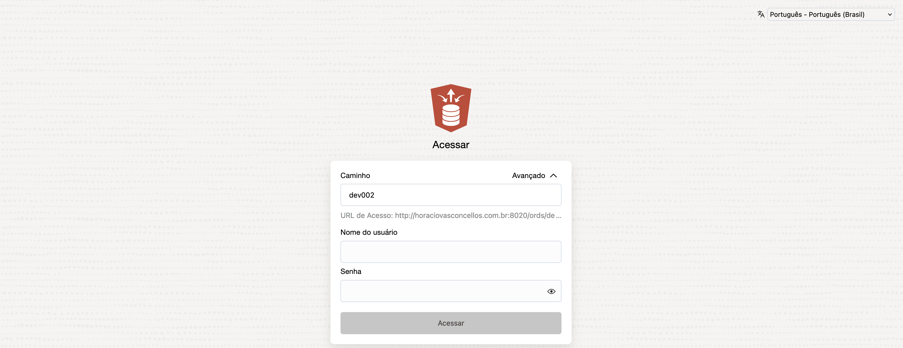
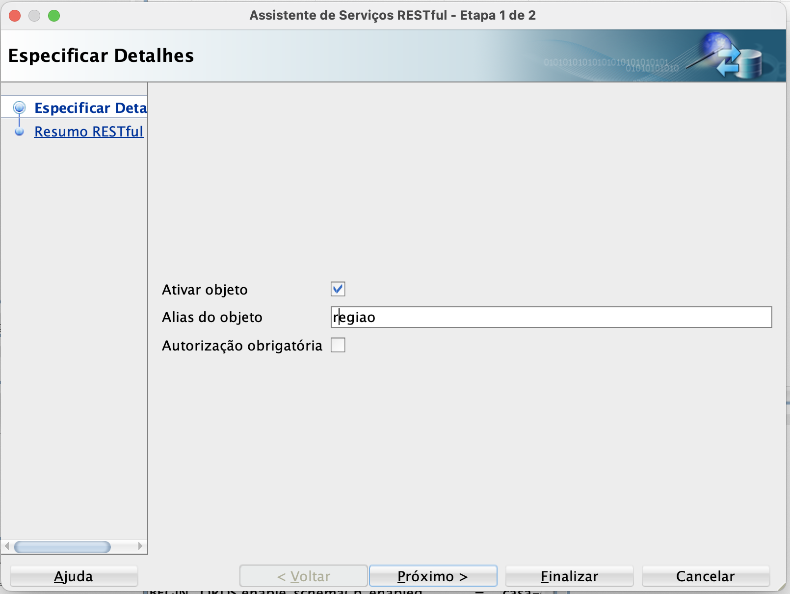

<p align="justify">O controle de versão envolve o gerenciamento de múltiplas versões de um projeto, rastreando as alterações realizadas nos arquivos de projetos, onde cada alteração é registrada permitindo desfazer ou reverter facilmente.</p>

{width="600" height="450" style="display: block; margin: 0 auto" }

Os scripts de hook do Git são úteis para identificar problemas simples antes do envio para revisão de código.

<div class="mdx-columns2" markdown>
- [X] lazygit
- [X] git-sim commit
- [X] git worktree
- [X] brew install git-secrets
- [X] https://gitleaks.io/
- [x] brew install git-lfs
- [x] pip install pre-commit
- [ ] https://github.com/linear-b/gitstream
</div>

## Fork este repositório
Fork este repositório clicando no botão fork no canto superior direito desta página. Isso criará uma cópia deste repositório em sua conta do GitHub.


## Clone seu repositório
A próxima etapa é clonar seu repositório para sua máquina para que você possa começar a fazer alterações. O VS Code precisa do URL do seu repositório, então clique no botão "clone" e depois clique no ícone "copiar para a área de transferência".


- [x] git clone url-do-repositorio-no-github - Clona um repositório remoto existente no GitHub/Azure-Devops/Gitlab para o seu ambiente local.

ou

- [x] git init - Inicializa um novo repositório Git no diretório atual.
- [x] git add . - Adiciona todos os arquivos e alterações no diretório atual para a área de stage (preparando-os para o commit).
- [x] git remote add originurl-do-repositorio-no-github - Adiciona um repositório remoto chamado origin ao repositório local. H.
- [x] git push -u origin main - Envia os commits da branch main do repositório local para o repositório remoto origin e define main como a branch padrão para futuros push e pull. O -u (ou --set-upstream) configura a branch upstream para facilitar os próximos comandos git push e git pull e eliminar a necessidade de especificar a branch.

ou

- [x] git remote add origin git@github.com:usuario/projeto.git 
- [x] git branch -M main 
- [x] git push -u origin main - Quando você já tem um repositório local e quer conectá-lo a um repositório remoto no GitHub, adiciona o repositório remoto, renomeia a branch principal para main e envia os commits iniciais.

### Visual Studio Code.


- [x] Agora digite `git clone`, apenas `git` ou `clone` (funciona como uma pesquisa).
- [x] Selecione a entrada `Git: Clone` e pressione `Entrar`


Cole a URL do seu repositório e pressione `Entrar`. Isso abrirá um File Explorer onde você pode escolher onde o repositório Git deve ser armazenado.


Você deve ver um pop-up de status no canto inferior direito do Visual Studio Code. Depois de terminar, você pode abrir o repositório clonado (agora uma pasta em sua máquina) usando os botões da caixa de diálogo.

## Criar uma branch
Abra a paleta de comandos novamente pressionando `F1`. Digite `branch` e selecione o comando `criar branch` a partir daí. Na próxima etapa digite o nome do seu novo branch, por exemplo `wit/60opt-nnnnnnn`. 

Pressione enter e a ramificação será criada. A filial também já foi verificada. [O que significa checkout?](https://www.git-scm.com/docs/git-checkout)


## Faça as alterações necessárias

Abra `Contributors.md` e adicione seu nome em qualquer lugar do arquivo. 
Este arquivo contém GFM (GitHub Flavored Markdown), que é um sabor proprietário da sintaxe <a href="https://en.wikipedia.org/wiki/Markdown">markdown</a>.


## Confirmar e enviar alterações para o GitHub
No lado esquerdo do VS Code há um menu com 5 ícones exibidos. Selecione o ícone de controle de versão/Controle de origem.
(Atalho: Ctrl + Shift + G)


O explorador de arquivos exibe todos os arquivos que foram alterados após o último commit. Ao passar o mouse sobre os arquivos e clicar em `+` (mais), os arquivos são encenados.


Digite algo na linha na parte superior do explorer e pressione a marca de seleção. As alterações agora estão confirmadas em sua cópia local. Agora as alterações precisam ser enviadas de volta ao GitHub.


Use o ícone de três pontos para abrir o menu onde você seleciona a opção `Publicar Branch`. Isso deve abrir uma caixa de diálogo para colocar suas credenciais do GitHub.


## Envie suas alterações para revisão

Neste ponto, você concluiu sua alteração, mas ela ainda reside apenas em seu repositório. Esta etapa mostrará como enviar uma solicitação ao administrador do repositório de nível superior para mesclar sua alteração.

Em seu repositório no GitHub, você verá o botão `Comparar & pull request` ao lado da nova notificação de branch. Clique nesse botão.


Agora envie a solicitação PR - pull request.


# Bifurcação no caminho para o fluxo

- [x] Quais seriam as técnicas de otimização, para que economizassemos custo e tempo? 
- [x] Como podemos usar as nossas habilidades e desafios, levando ao máximo engajamento e desempenho?
- [x] Como encontrar o "estado de flow" na Equipe? Os músicos chamam isso de encontrar seu groove (indicando quando os sons encaixam ou combinam de forma satisfatória).

      - [x] O estado do fluxo pode desbloquear vários benefícios para indivíduos e organizações
      - [x] Aumentar as capacidades, permitindo-lhes adquirir novas competências rapidamente;
      - [x] Alinha as pessoas a uma missão e progresso coletivos;
      - [x] Levar a uma maior alegria e satisfação no trabalho;
      - [x] Uma maior sensação de controle sobre os desafios;
      - [x] Alta produtividade, elevada motivação e confiança.

## Como estimular o fluxo em suas equipes?

- [x] Sem uma direção clara, as equipes se debatem em confusão em vez de fluir(FLUXO). 
      - [x] Painéis de medição para vincular o progresso de volta às metas. (Métricas DORA, Planilha Calendário, CHA e etc.)
- [x] Sempre um CERTO desafio. 
      - [x] O fluxo surge quando há um equilíbrio adequado entre desafio e habilidade. 
      - [x] Pouco desafio leva ao tédio, enquanto muito pode sobrecarregar as pessoas.
- [x] As distrações são inimigas naturais do fluxo. 
      - [x] Elimine obstáculos que quebrem o foco, como reuniões fora do projeto e outras atividades.(Problema com as GMUDs)
      - [x] Proteger o valor do trabalho profundo e do foco pode ajudar os membros da sua equipe a encontrar o fluxo naturalmente.
- [x] Atividade rápida:
      - [x] Identifique uma ou duas maneiras de habilitar um estado de fluxo focado em suas equipes. 
      - [x] Como você define metas claras para a equipe, projetos e progresso com as necessidades de negócios em mudança?

### **PENSAMENTO:**

- [x] Embora o fluxo exija FOCO, a mudança das necessidades dos negócios requerem **AGILIDADE**. 
- [x] Como incorporar o fluxo com agilidade?

# Estabeleça visibilidade de ponta a ponta
A visibilidade antecipada dos problemas é crítica, de preferência à medida que elas codificam, declaram dependências e verificam os artefatos.
Depois que a visibilidade for estabelecida e a equipe estiver alinhada à avaliação padronizada de risco e segurança, a disseminação do conhecimento necessário para corrigir rapidamente os problemas torna-se crucial.
Alertar os desenvolvedores sobre novos problemas
Fornecer orientação abrangente sobre correção.

# Padronização das Branches
Branch é uma linha de desenvolvimento separada que permite aos desenvolvedores trabalharem em recursos. Ou simplesmente um ponteiro móvel para um desses commits. 
Um branch geralmente começa com um commit no branch padrão; neste caso, em main. A ramificação desenvolve uma cadeia de histórico separada à medida que os commits são adicionados. Eventualmente, as alterações no branch são mescladas novamente no main.

{width="550" height="550" style="display: block; margin: 0 auto"}

## Quais os Tipos que **EU** havia pensado?
### Document as Code(DaC)
Cada PRODUTO com a sua **DOCUMENTAÇÃO** e um repositório aglutinador - PORTIFÓLIO (coleção de trabalhos realizados).

{width="1050" height="900" style="display: block; margin: 0 auto"}

**Exemplo**:

- [x] mkdir /Users/horaciovasconcellosDIRETORIO
- [x] cd /Users/horaciovasconcellosDIRETORIO
- [x] [Clonar o Repositório de Documentação](https://60opt-lab@dev.azure.com/60opt-lab/HORAROSA/_git/MKDOCS_SSG_LIB)

No repositório PORTIFOLIO, use o diretório documentacao e crie uma entrada utilizando o submodule, para cada produto a ser documentado.

Caso o produto seja novo, ajuste o arquivo de DOCUMENTAÇÃO - mkdocs.yml, para incluir o seu submodule.
Adicionando um repositório a Documentação, ao repositório 60PPORTUNITIES ADMINISTRAÇÃO no repositório PORTIFOLIO.

- [x] git submodule deinit -f documentacao/PRODUTO_DOCUMENTACAO_LI  (excluir um submódulo Git)
- [x] git rm --force documentacao/PRODUTO_DOCUMENTACAO_LIB (Remove the submodule directory from Git)
- [X] rm -rf .git/modules/PRODUTO/  (Remove the submodule directory from .git/modules/)
- [x] git rm -r --cached documentacao/PRODUTO_DOCUMENTACAO_LIB
- [x] mkdir documentacao && cd documentacao
- [x] git submodule add --name PRODUTO https://60opt-lab@dev.azure.com/60opt-lab/PRODUTO/_git/PRODUTO_DOCUMENTACAO_LIB (Adiciono o submodulo)
- [X] Alterando o mkdocs.yml, para inclusão da Documentação
- [X] Vá até a entrada nav e procure o seu sistema.
- [X] - 'PRODUTO'                                  : '!include ./documentacao/PRODUTO_DOCUMENTACAO_LIB/mkdocs.yml'
- [X] `git submodule update --remote --merge`

### Modified Off-the-Shelf ou Commercial off-the-shelf
Em teoria, eu NÃO vou MODIFICAR o produto, mas irei fazer integrações com ele ou entre produtos OSS, COTS, MOTS, SI.

{width="1200" height="800" style="display: block; margin: 0 auto"}

- [x] git submodule deinit -f documentacao/PRODUTO_DOCUMENTACAO_LI  (excluir um submódulo Git)
- [x] git rm --force documentacao/PRODUTO_DOCUMENTACAO_LIB (Remove the submodule directory from Git)
- [X] rm -rf .git/modules/PRODUTO/  (Remove the submodule directory from .git/modules/)
- [x] git rm -r --cached documentacao/PRODUTO_DOCUMENTACAO_LIB
- [x] mkdir documentacao && cd documentacao
- [X] git submodule add --name PRODUTO https://60opt-lab@dev.azure.com/60opt-lab/PRODUTO/_git/PRODUTO_DOCUMENTACAO_LIB (Adiciono o submodulo)

# Banco de Dados
Gerenciamento de Dados, Infraestrutura de Ambientes, Dificuldade em automatizar migração. 

- [X] Aplicação (front, back) envolve dados;
- [X] Diferença de Dados
      - [X] Desenvolvimento DEVE SER diferente de PRODUÇÃO
- [X] Dificuldade em automatizar a migração
      - [X] [DBDeploy](https://www.dbdeployer.com/)
      - [X] [SubSet de Dados de TESTE ao invés de Dados de Produção](https://www.delphix.com/br/solutions/oracle)
- [X] Complexidade de Dados
      - [X] Dificuldades;
      - [X] Criar Scripts - Schema, Tabelas, Dados de Referencia, Dados transacionais e etc;
      - [X] Passos: Apague o que esta lá, Cria a estrutura, Carrega os Dados;

- [X] Uma aplicação que acesse vários Banco de Dados?
      - [X] Ressincronização de TODOS os ambientes...
            - [X]  Pré-produção de Todos os ambientes? Sincronizados?
            - [X]  Manter o registro de rotina, usa que dados... que banco de dado, quais os serviços, em um primeiro momento, podemos pensar em um SErvice Discovery (quando for necessário, quem precisar enviar uma requisição perguntará para o Service Discovery qual o serviço está em execução)
      - [X]  Trabalhar com as equipes de outras aplicações.
- [X] Como versionar o Banco de Dados
      - [X] Contenha um numero de versão
      - [X] Como controlar a versão x para a x+1
      - [X] Pensar no rollback da x+1 para x
      - [X] Configurar a aplicação da X para X+1

- [X] Rollback sem perda de dados
      - [X] Recovery Point Objective (RPO) - quantidade limite de dados que uma organização toleraria perder em caso de pane ou de paralisação?
      - [X] Recovery Time Objective  (RTO) - qual o tempo que o sistema levará para voltar a operar após uma parada ou pane.

### Trunk Based development

{width="900" height="800" style="display: block; margin: 0 auto"}

- [x] Cada desenvolvedor começaria a trabalhar na história do usuário e criaria ramificações de recursos a partir das ramificações `sprint`;
- [x] `git clone -b sprint --single-branch https://60opt-lab@dev.azure.com/60opt-lab/DESAFIO_CESUC/_git/BACK_LANG_PLSQL`
- [x] `git checkout -b wip/numberwit-description` (Inicio dos trabalhos na WIT-100)
- [x] Como o DESENVOLVIMENTO é curto, vamos criar o cenário, na qual você NÃO termina o trabalho em 15 minutos e precisa **GUARDAR** no repositório central/remoto;
- [x] Baixe : 03_habilita_esquema_para_ords.sql, 04_criacao_tabela_regiao.sql
- [x] Acesse o SQL Developer, via WEB: https://ords0.60opt.com.br/ords/sql-developer

- [x] Posso efetuar um curl usando SQL diretamente na tabela?
`curl -u usuario006:USUARIO006 -X "POST" "https://ords0.60opt.com.br/ords/dev006/_/sql" -H "Content-Type: application/sql" -d $'SELECT * FROM tb_regiao;' | jq`
- [x] Posso habilitar a tabela de região e expor o serviço:

- [x] Posso consultar o registro - LIST (https://ords0.60opt.com.br/ords/dev006/regiao/) ou **Chave** (https://ords0.60opt.com.br/ords/dev006/regiao/1) ou **Filtragem em Consultas** dinamicas, tipo selecione todas as [regiões nome que iniciam por Asia](https://ords0.60opt.com.br/ords/dev006/regiao/?q={%22regiao_nome%22:%20{%22$instr%22:%22Asia%22}}). 
- [x] [Quais os comandos dinamicos que possuímos?](https://docs.oracle.com/en/database/oracle/oracle-rest-data-services/24.1/orddg/developing-REST-applications.html#GUID-091748F8-3D14-402B-9310-25E6A9116B47)
- [x] Como seria executar uma função, que veja a SIMILARIDADE de NOMES, diretamente via curl?
  
```
create or replace function fc_60opt_abrevia (p_palavra1 in varchar2, p_palavra2 in varchar2) return varchar2 
as 
l_retorno            varchar2(4000);
l_numero             number;
begin
   l_numero   := UTL_MATCH.edit_distance_similarity(p_palavra1, p_palavra2);
   l_retorno  := 'Dist.Similarity = ' || TO_CHAR(l_numero); 
   
   l_numero   := UTL_MATCH.edit_distance(p_palavra1, p_palavra2);
   l_retorno  :=  l_retorno  || ', Levenshtein Distance = ' || l_numero;
   
   l_numero   :=  UTL_MATCH.jaro_winkler(p_palavra1, p_palavra2);
   l_retorno  :=  l_retorno  || ',Jaro-Winkler Algorithm = '  || l_numero;
   
   l_numero   :=   UTL_MATCH.jaro_winkler_similarity(p_palavra1, p_palavra2);
   l_retorno  :=  l_retorno  || ',Jaro-Winkler Similarity = '  || l_numero;
   
  return l_retorno ;
end fc_60opt_abrevia;
```


```curl -i -X POST -d '{ "p_palavra1": "HORACIO", "p_palavra2": "ORACIO" }' -H "Content-Type: application/json" "https://ords0.60opt.com.br/ords/dev006/abrevia/"```

- [x] Como poderia inserir um registro na tabela?

```curl -i -H "Content-Type: application/json" -X POST -d '{ "regiao_cod" : 150, "sub_regiao" : 1901, "regiao_nome" : "Horacio" }' "https://ords0.60opt.com.br/ords/dev006/regiao/"```

```curl -i -H "Content-Type: application/json" -X PUT -d '{ "regiao_nome": "HORACIO VASCONCELLOS", "sub_regiao" : 201, "regiao_cod" : 200 }' "https://ords0.60opt.com.br/ords/dev006/regiao/21"```

## **Correção e Atualização sem Inatividade**
Há uma distinção entre patch e atualização: em uma situação ideal, todos os requisitos de um programa são implementados no programa real e o programa implementa exatamente a especificação escrita.

- [x] O patch deve deixar o programa à **altura dos requisitos de funcionalidade** CORRIGE um funcionalidade;
- [x] A atualização entra em ação quando os **requisitos mudam** após a criação da funcionalidade.

### Rollover
As alterações são feitas na privacidade de uma nova edição.
Diferentes projeções das tabelas comuns são obtidas usando uma visualização de edição.
O acionador de edição cruzada manterá as alterações de dados sincronizadas entre as diferentes edições durante o período de hot rollover.

<div class="center-table" markdown>
| Rollover      | Entenda             |
| ------        | --------            |
| hot rollover  | Significa que a infraestrutura é completamente espelhada em outro site e que o site de backup está sempre ativo e atualizado com o site primário. |
| warm rollover | Significa que todos os elementos do site de backup estão instalados mas o sistema não está em execução ativa ou necessariamente configurado.      |
| cold rollover | Site está disponível, mas há poucos recursos disponíveis imediatamente para configurá-lo.      |
</div>

O tempo de **inatividade zero** precisa ser projetado deliberadamente no banco de dados Oracle e no servidor de aplicação, bem como na aplicação cliente.

## Conectando ao Banco de Dados

- [x] Como posso me conectar a um banco de dados e a uma edição/versão:
      - [x] SQLPlus: 
            `sqlplus username/password@adb EDITION=an_edition_name`
            `sqlplus /nolog conn username/password@adb EDITION=an_edition_name`
      - [x] Database Access Descriptor (DAD) Configuration

            ```
            begin  
             dbms_epg.set_dad_attribute('APEX', 'database-edition',  ULN_EDITION_2');  
            end;
            dads.conf file:  PlsqlDatabaseEdition*   
            ```

      - [x] JDBC/Sql Developer: `jdbc:oracle:thin:@hostname:1521/desenvolvimento?oracle.jdbc.editionName=v2`    

- [x] Criei uma edição chamada v2;

      - [x] create edition v2 as child of ora$base;
            ```select * from dba_editions```
      - [x] O meu usuário tem acesso a EDIÇÃO ou eu preciso dar a permissão?
            ```
            grant USE on edition v2 to usuario006;
            /
            select grantee, owner, table_name AS edition_name, privilege
              from dba_tab_privs
             where 1         = 1
               and grantee   = 'USUARIO006'
               and privilege = 'USE'
               and owner     = 'SYS'
               and table_name IN (select edition_name from dba_editions);
            ```
      - [x] Em qual edição estou?      
            `SELECT SYS_CONTEXT('USERENV', 'CURRENT_EDITION_NAME'), SYS_CONTEXT('USERENV', 'SESSION_USER') from dual`
      - [x] Criação de Objetos a serem Versionados.
            ```
            alter session set edition = ora$base
            /
            create or replace function fc_60opt_abrevia (p_palavra1 in varchar2, p_palavra2 in varchar2) return varchar2 
            as 
            l_retorno            varchar2(4000);
            l_numero             number;
            l_edicao             varchar2(100);
            l_cripto             varchar2(1000);
            begin
               select sys_context('userenv', 'current_edition_name') into l_edicao  from dual;
               l_numero   := UTL_MATCH.edit_distance_similarity(p_palavra1, p_palavra2);
               l_retorno  := 'Dist.Similarity = ' || TO_CHAR(l_numero); 
            
               l_numero   := UTL_MATCH.edit_distance(p_palavra1, p_palavra2);
               l_retorno  :=  l_retorno  || ', Levenshtein Distance = ' || l_numero;
            
               l_numero   :=  UTL_MATCH.jaro_winkler(p_palavra1, p_palavra2);
               l_retorno  :=  l_retorno  || ',Jaro-Winkler Algorithm = '  || l_numero;
            
               l_numero   :=   UTL_MATCH.jaro_winkler_similarity(p_palavra1, p_palavra2);
               l_retorno  :=  l_retorno  || ',Jaro-Winkler Similarity = '  || l_numero;
            
               --l_cripto   := sys.dbms_crypto.hash(utl_raw.cast_to_raw(upper(l_retorno) || l_edicao), dbms_crypto.hash_sh1);
            
               
              return l_edicao || '  :  ' || l_retorno ;
            end fc_60opt_abrevia;

            SELECT grantee, owner, table_name AS edition_name, privilege
              FROM dba_tab_privs
              WHERE 1         = 1
                and grantee   = 'USUARIO006'
                and privilege = 'USE'
                and owner     = 'SYS'
                and table_name IN (SELECT edition_name FROM dba_editions); 
              /
              SELECT SYS_CONTEXT('USERENV', 'CURRENT_EDITION_NAME'), SYS_CONTEXT('USERENV', 'SESSION_USER') from dual
              /
              CREATE OR REPLACE PROCEDURE PR_EXEMPLO_EDICAO authid definer
              IS
              l_edition           VARCHAR2(240);
              l_usuario           VARCHAR2(240);
              BEGIN
              SELECT SYS_CONTEXT('USERENV', 'CURRENT_EDITION_NAME'), SYS_CONTEXT('USERENV', 'SESSION_USER') INTO l_edition, l_usuario FROM DUAL;
              DBMS_OUTPUT.PUT_LINE('Usuario e Edição '|| l_usuario ||  ' - ' || l_edition);
              END PR_EXEMPLO_EDICAO;
              /
              set serveroutput on
              /
              exec PR_EXEMPLO_EDICAO;
              /
              ALTER SESSION SET EDITION = v2;
              /
              exec PR_EXEMPLO_EDICAO;
              /
              SELECT object_name, object_type, edition_name  FROM user_objects_ae
              where 1            = 1 
                and object_name  = 'PR_EXEMPLO_EDICAO'
              ORDER BY object_name, edition_name;
            ```

- [x] Altere a função retirando o comentário.

            ```
            alter session set edition = v2
            /
            create or replace function fc_60opt_abrevia (p_palavra1 in varchar2, p_palavra2 in varchar2) return varchar2 
            as 
            l_retorno            varchar2(4000);
            l_numero             number;
            l_edicao             varchar2(100);
            l_cripto             varchar2(1000);
            begin
               select sys_context('userenv', 'current_edition_name') into l_edicao  from dual;
               l_numero   := UTL_MATCH.edit_distance_similarity(p_palavra1, p_palavra2);
               l_retorno  := 'Dist.Similarity = ' || TO_CHAR(l_numero); 
               l_numero   := UTL_MATCH.edit_distance(p_palavra1, p_palavra2);
               l_retorno  :=  l_retorno  || ', Levenshtein Distance = ' || l_numero;
               l_numero   :=  UTL_MATCH.jaro_winkler(p_palavra1, p_palavra2);
               l_retorno  :=  l_retorno  || ',Jaro-Winkler Algorithm = '  || l_numero;
               l_numero   :=   UTL_MATCH.jaro_winkler_similarity(p_palavra1, p_palavra2);
               l_retorno  :=  l_retorno  || ',Jaro-Winkler Similarity = '  || l_numero;
               l_cripto   := sys.dbms_crypto.hash(utl_raw.cast_to_raw(upper(l_retorno) || l_edicao), dbms_crypto.hash_sh1);
              return l_edicao || '  :  ' || l_cripto ;
            end fc_60opt_abrevia;
            ```

- [x] Identifique os objetos que sofreram alteração.

            ```
            select object_name, object_type, edition_name from user_objects_ae
            where 1            = 1 
              and object_name  in ( 'PR_EXEMPLO_EDICAO', 'FC_60opt_ABREVIA')
            order by object_name, edition_name;
            ``` 

- [x] Construa uma aplicação em Java para validar o contexto.

            ```
            begin
              dbms_service.create_service( service_name => 'DEVGATE_V01',
                                           network_name => 'DEVGATE_V01',
                                           edition      => 'V01.00.01'
                                        );
              dbms_service.start_service( service_name => 'DEVGATE_V01' );
            end;
            /

            testAB.sh

            #!/bin/bash
            clear screen
            javac testAB.java
            java -classpath .:ojdbc11.jar testAB
            ```

            ```
            import java.sql.*;
            import java.util.*;
             
            public class testAB {
                public static void main(String[] args) throws SQLException, ClassNotFoundException {
                    Class.forName("oracle.jdbc.OracleDriver");
                    Properties p = new Properties();
                    p.put("user", "USUARIO006");
                    p.put("password", "USUARIO006");
                    Connection conn1 = DriverManager.getConnection("jdbc:oracle:thin:@hostname:1521/desenvolvimento", p);
                    System.out.println(conn1.getMetaData().getDriverVersion());
                    p.put("oracle.jdbc.editionName", "V2");
                    Connection conn2 = DriverManager.getConnection("jdbc:oracle:thin:@hostname:1521/desenvolvimento", p);
                    test(conn1);
                    test(conn2);
                }
                public static void test(Connection conn) throws SQLException {
                    String funcao="begin ? := fc_60opt_abrevia(?, ?); end;";
                    CallableStatement st= conn.prepareCall(funcao);
                    st.registerOutParameter(1, java.sql.Types.VARCHAR);
                    st.setString(2,"HORACIO");
                    st.setString(3,"ORACIUS");
                    st.execute();
                    String retorno= st.getString(1);
                    System.out.println("Retorno da Função: " + retorno);
                    ResultSet rs = conn.createStatement().executeQuery("select sys_context('userenv', 'current_edition_name'), tb_regiao.* from tb_regiao");
                    while (rs.next())
                      System.out.println("Registro: " + rs.getString(1) + " " + rs.getString(5) + "  " + rs.getDate(6));
                }
            }
            ```

- [x] `git add 03_habilita_esquema_para_ords.sql 04_criacao_tabela_regiao.sql fc_60opt_abrevia.sql`
- [x] `git status`
- [x] `git commit -m "<feat> Nome da Feature/PBI para trabalhar 15 minutos"`
- [x] `git push origin wip/numberwit-description`
- [x] `git pull --rebase origin wip/numberwit-description` (Verifique se no repositório foi criado algo)
- [x] `git checkout wip/numberwit-description`
- [x] Como o DESENVOLVIMENTO é curto, vamos fingur em terminar o trabalho e efetuar a solicitação pull deve ser gerada;
- [x] `git branch -m wit/numberwit-description` (Renomeia a WIP e gere um WIT)
- [x] `git push origin -u wit/numberwit-description` (Mande para o Central)
- [x] `git push origin --delete wip/numberwit-description` (Delete do repositorio central)
- [x] Efetue a criação de um PULL REQUEST;      
- [x] Escolha de um a dois membro(s) da equipe para efetuar a revisão de código;
- [x] As alterações de código são incorporadas com base em comentários de revisão e enviados;
- [x] As alterações são confirmadas no `main`;
- [x] Exclua a branch de recurso;
      
- [x] Crie os objetos MANUALMENTE no BANCO DE DADOS
- [x] DBeaver ou  SQL Developer ou VS Code;
- [x] Acesse o seu usuário e execute as scripts;

- [x] Teste os Serviços disponibilizados;
      - [x] SQL;
      - [x] GraphQL;
      - [x] Query by URI;
      - [x] Tabela;

- [x] Elabore um stress test utilizando o Apache JMeter;4

 FOR EACH ROW
  FORWARD CROSSEDITION
  DISABLE
    
FOR EACH ROW
REVERSE CROSSEDITION

alter database default edition = v2;

Como os dados precisam ser mantidos sincronizados entre as edições, o método a ser usado é o gatilho de edição cruzada.
 
 show user
 
 FOR EACH ROW
  FORWARD CROSSEDITION
  DISABLE
    
FOR EACH ROW
REVERSE CROSSEDITION

alter database default edition = v2;

## **Mínimo Produto Viável COM Autenticação**

- [x] Como o DESENVOLVIMENTO é curto, vamos criar o cenário, na qual você NÃO termina o trabalho em 15 minutos e precisa **GUARDAR** no repositório central/remoto;
- [x] Baixe : 05_criacao_tabela_pais.sql 05_01_criacao_mvp_tabela_pais.sql 06_criacao_ords_modulos.sql 07_criacao_ords_templates.sql 08_criacao_ords_handler.sql 13_habilita_seguranca_ords.sql 14_criacao_de_roles_e_usuarios.sql
- [x] `git add 05_criacao_tabela_pais.sql 05_01_criacao_mvp_tabela_pais.sql 06_criacao_ords_modulos.sql 07_criacao_ords_templates.sql 08_criacao_ords_handler.sql 13_habilita_seguranca_ords.sql 14_criacao_de_roles_e_usuarios.sql`
- [x] `git status`
- [x] `git commit -m "<feat> Nome da Feature/PBI para trabalhar 15 minutos"`
- [x] `git push origin wip/numberwit-description`
- [x] `git pull --rebase origin wip/numberwit-description` (Verifique se no repositório foi criado algo)
- [x] `git checkout wip/numberwit-description`
- [x] Como o DESENVOLVIMENTO é curto, vamos fingur em terminar o trabalho e efetuar a solicitação pull deve ser gerada;
- [x] `git branch -m wit/numberwit-description` (Renomeia a WIP e gere um WIT)
- [x] `git push origin -u wit/numberwit-description` (Mande para o Central)
- [x] `git push origin --delete wip/numberwit-description` (Delete do repositorio central)
- [x] Efetue a criação de um PULL REQUEST;     
- [x] Escolha de um a dois membro(s) da equipe para efetuar a revisão de código;
- [x] As alterações de código são incorporadas com base em comentários de revisão e enviados;
- [x] As alterações são confirmadas no `main`;
- [x] Exclua a branch de recurso;
- [x] Efetue a geração da Documentação do Swagger;
- [x] Efetue a documentação do Aplicativo;
- [x] Teste os Serviços disponibilizados;
      - [x] SQL;
      - [x] GraphQL;
      - [x] Query by URI;
      - [x] Tabela;

## **Recurso de Linha**

- [x] Como o DESENVOLVIMENTO é curto, vamos criar o cenário, na qual você NÃO termina o trabalho em 15 minutos e precisa **GUARDAR** no repositório central/remoto;
- [x] Efetue alteração nas rotinas para que possamos estabelecer o contexto no ato da chamada da API;
- [x] Como o DESENVOLVIMENTO é curto, vamos criar o cenário, na qual você NÃO termina o trabalho em 15 minutos e precisa **GUARDAR** no repositório central/remoto;
- [x] Baixe : 05_criacao_tabela_pais.sql 05_01_criacao_mvp_tabela_pais.sql 06_criacao_ords_modulos.sql 07_criacao_ords_templates.sql 08_criacao_ords_handler.sql 13_habilita_seguranca_ords.sql 14_criacao_de_roles_e_usuarios.sql
- [x] `git add 09_criacao_de_contexto.sql 10_criacao_de_politica.sql`
- [x] `git status`
- [x] `git commit -m "<feat> Nome da Feature/PBI para trabalhar 15 minutos"`
- [x] `git push origin wip/numberwit-description`
- [x] `git pull --rebase origin wip/numberwit-description` (Verifique se no repositório foi criado algo)
- [x] `git checkout wip/numberwit-description`
- [x] Como o DESENVOLVIMENTO é curto, vamos fingur em terminar o trabalho e efetuar a solicitação pull deve ser gerada;
- [x] `git branch -m wit/numberwit-description` (Renomeia a WIP e gere um WIT)
- [x] `git push origin -u wit/numberwit-description` (Mande para o Central)
- [x] `git push origin --delete wip/numberwit-description` (Delete do repositorio central)
- [x] Efetue a criação de um PULL REQUEST;     
- [x] Escolha de um a dois membro(s) da equipe para efetuar a revisão de código;
- [x] As alterações de código são incorporadas com base em comentários de revisão e enviados;
- [x] As alterações são confirmadas no `main`;
- [x] Exclua a branch de recurso;
- [x] Efetue a geração da Documentação do Swagger;
- [x] Efetue a documentação do Aplicativo;
- [x] Teste os Serviços disponibilizados;
      - [x] SQL;
      - [x] GraphQL;
      - [x] Query by URI;
      - [x] Tabela;

   ```
   GRANT CREATE ANY EDITION, DROP ANY EDITION to usuario006;
   /
   ALTER USER usuario006  ENABLE EDITIONS;
   /
   alter session set edition = ora$base;
   /
   create edition "hor01.00.00" as child of ora$base;
   /
   select name, network_name from dba_services order by 1;
   /
   select * from dba_editions
   select name, network_name from dba_services order by 1;
   /
   create edition "hor01.00.00" as child of ora$base;
   
   PROCEDURE create_service( service_name        => 'DEVELOPER',
                             network_name        => 
                             edition             => 
                           );
   
   begin
     dbms_service.create_service( service_name => 'DEVELOPER',
                                  network_name => 'DEVELOPER',
                                  edition      => 'hor01.00.00'
                               );
   
   end;
   
   SHOW USER
   
   ALTER SESSION SET EDITION = "V01.00.01";
   
   select * from dba_editions;
   /
   GRANT execute ON dbms_service TO USUARIO006;
   /
   GRANT alter system TO USUARIO006;
   /
   GRANT select ON v_$session TO USUARIO006;
   /
   show pdbs
   /
   select * from dba_editionable
   /
   select o.object_type,o.object_name, o.status,o.edition_name,nullif(  d.referenced_name || ' [' || lower(d.referenced_type) || ']',  ' []') depends_on
      from   user_objects      o,
             user_dependencies d
      where 1         = 1 
        and d.name(+) = o.object_name
        and d.type(+) = o.object_type
        and d.referenced_owner(+) = user 
   order by nvl2(o.edition_name, 2, 1),o.object_type,o.object_name, d.referenced_name;
   /
   dbms_editions_utilities.clean_unusable_editions();
   /
   CREATE OR REPLACE PROCEDURE PR_EXEMPLO_EDICAO authid definer
   IS
   l_edition           VARCHAR2(240);
   l_usuario           VARCHAR2(240);
   BEGIN
   SELECT SYS_CONTEXT('USERENV', 'CURRENT_EDITION_NAME'), SYS_CONTEXT('USERENV', 'SESSION_USER') INTO l_edition, l_usuario FROM DUAL;
   DBMS_OUTPUT.PUT_LINE('Usuario e Edição '|| l_usuario ||  ' - ' || l_edition);
   END PR_EXEMPLO_EDICAO;
   /
   ALTER SESSION SET EDITION = "HOR01.00.00";
   /
   ALTER DATABASE DEFAULT EDITION = ora$base;
   /
   SELECT name, network_name FROM v$active_services ORDER BY 1;
   /
   ```

- [x] Como o DESENVOLVIMENTO é curto, vamos criar o cenário, na qual você NÃO termina o trabalho em 15 minutos e precisa **GUARDAR** no repositório central/remoto;
- [x] Baixe : 05_criacao_tabela_pais.sql 05_01_criacao_mvp_tabela_pais.sql 06_criacao_ords_modulos.sql 07_criacao_ords_templates.sql 08_criacao_ords_handler.sql 13_habilita_seguranca_ords.sql 14_criacao_de_roles_e_usuarios.sql
- [x] `git add 09_criacao_de_contexto.sql 10_criacao_de_politica.sql`
- [x] `git status`
- [x] `git commit -m "<feat> Nome da Feature/PBI para trabalhar 15 minutos"`
- [x] `git push origin wip/numberwit-description`
- [x] `git pull --rebase origin wip/numberwit-description` (Verifique se no repositório foi criado algo)
- [x] `git checkout wip/numberwit-description`
- [x] Como o DESENVOLVIMENTO é curto, vamos fingur em terminar o trabalho e efetuar a solicitação pull deve ser gerada;
- [x] `git branch -m wit/numberwit-description` (Renomeia a WIP e gere um WIT)
- [x] `git push origin -u wit/numberwit-description` (Mande para o Central)
- [x] `git push origin --delete wip/numberwit-description` (Delete do repositorio central)
- [x] Efetue a criação de um PULL REQUEST;     
- [x] Escolha de um a dois membro(s) da equipe para efetuar a revisão de código;
- [x] As alterações de código são incorporadas com base em comentários de revisão e enviados;
- [x] As alterações são confirmadas no `main`;
- [x] Exclua a branch de recurso;
- [x] Efetue a geração da Documentação do Swagger;
- [x] Efetue a documentação do Aplicativo;


## pipeline de CI deverá ser acionado mediante a criação do **PULL REQUEST**
- [x] No repositório PL/SQL na pasta de Scripts/Init, crie uma script que receba o numero de versão;
- [x] O código do tronco principal é implantado nos ambientes de SIT ou UAT;
      - [x] Deverá ser criada uma release no Banco de Dados;
      - [x] Deverá ser criada uma versão do serviço do Banco de Dados;
      - [x] A branch de recurso poderá ser eliminada durante o rebase;
- [x] Testes e validações adicionais são realizados nesses ambientes;
      - [x] Deverá ser escolhido de forma ALEATÓRIA, um conjunto de usuarios que acessarão a Versão X e X+1;
      - [x] Deverá ser realizada uma análise e possivelmente desligar o sinalizadores de recursos;
      - [x] Deverá ser realizada uma análise e possivelmente religar o sinalizadores de recursos;
- [x] Após a conclusão do teste, o recurso é implantado no ambiente de produção;
- [x] O recurso pode ser decidido quando precisa ser lançado e disponibilizado no ambiente de produção;

# **Observação POSSIVELMENTE deverá haver TROCA DE USUÁRIOS e/ou AJUSTE em ROTINAS**
## Fase 01 - Scripts Diversos para DBA

- [x] 00_database_tamanho_crescimento.sql
- [x] 00_devops_database_traceability.sql
- [x] 00_grants_apex_e_seguranca.sql

## Fase 02 - Criação de Estrutura de DBA - SQL

- [x] 01_elimina_schema
- [x] 02_criacao_do_esquema
- [x] 03_habilita_esquema_para_ords

## Fase 03 - Criação de Estrutura Exemplo

- [x] 04_criacao_tabela_regiao
- [x] 05_criacao_tabela_pais
- [x] 05_01_criacao_mvp_tabela_pais

## Fase 03 - Liberação de Serviços ORDS sem Autenticação

- [x] 06_criacao_ords_modulos
- [x] 07_criacao_ords_templates
- [x] 08_criacao_ords_handler
- [x] 08_01_estrategia_padronizacao

## Fase 04 - Liberação de Serviços - Segurança em Nível de Linha (RLS)

- [x] 09_criacao_de_contexto
- [x] 10_criacao_de_politica

## Fase 05 - REST Enabled SQL (NoSecurity e Security)

Permite executar instruções DML e DDL (via REST) ​​em um banco de dados Oracle remoto.

- [x] 11_criacao_ords_enable_objects
- [x] 12_criacao_ords_query_graphiql

## Fase 06 - Adicionando OAuth ao ORDS

- [x] 13_habilita_seguranca_ords
- [x] 14_criacao_de_roles_e_usuarios
- [x] 15_criacao_de_exemplos
- [x] 16_requisicao_codigo_do_pais

## **Fase 07 - Clonagem a Quente do Banco de Dados (NÃO executar este procedimento)**

- [x] 17_clonagem_quente_de_bancodedados

## Fase 08 - Edição dos Objetos no Banco de Dados

- [x] 18_estrategia_de_git_vscode
- [x] 19_versionamento_no_banco_de_dados
- [x] 20_aplicando_codigo_na_pipeline_oracle

## Fase 10 - Maven

- [x] Arquétipo
- [x] Maven Pl/Doc
- [x] Maven UtPL/SQL
- [x] Maven Liquibase
- [x] Maven Flyway
- [ ] 
## Fase 11 - Documentação

- [x] PL/SQL Documentação
- [x] Caso de Uso
- [x] PL/SQL Linter

## Fase 12 - Teste de Stress

- [x] Stress Mensagem
- [x] Banco de Dados

## Fase 13 - Todos os Arquivos deverão ter POR OBJETO

```
--liquibase formatted sql
--changeset HoracioVasconcellos:100 runOnChange:true stripComments:false context:"dev,hom,prd" labels:"v01.00.00"
--preconditions onFail:WARN
--precondition-sql-check expectedResult:0 SELECT COUNT(*) FROM all_tables WHERE table_name = 'TB_REGIAO'
--comment Criação da Tabela de Região

CREATE TABLE TB_REGIAO (

)
/
-- rollback  drop table  TB_PAIS;

--changeset HoracioVasconcellos:200 runOnChange:true stripComments:false context:"dev,hom,prd" labels:"v01.00.00"
--preconditions onFail:WARN
--precondition-sql-check expectedResult:0 SELECT COUNT(*) FROM all_tables WHERE table_name = 'TB_PAIS'
--comment Criação da Tabela de País

CREATE TABLE TB_PAIS (

)
/
-- rollback  drop table  TB_PAIS;

--changeset HoracioVasconcellos:300 runOnChange:true stripComments:false context:"dev,hom,prd" labels:"v01.00.00"
--preconditions onFail:WARN
--precondition-sql-check expectedResult:0 SELECT COUNT(*) FROM all_tables WHERE table_name = 'VW_PAIS'
--comment Criação da Tabela de País

CREATE TABLE VW_PAIS (

)
/
-- rollback  drop View VW_PAIS;

--changeset HoracioVasconcellos:320 runOnChange:true stripComments:false context:"dev,hom,prd" labels:"v01.00.00"
--preconditions onFail:WARN
--comment Insere na tabela de Regioes

-- rollback  delete from tb_regiao where trunc(creation_date,'dd') = trunc(sysdate,'dd')

--changeset HoracioVasconcellos:420 runOnChange:true stripComments:false context:"dev,hom,prd" labels:"v01.00.00"
--comment Secure dml proc first version
create or replace procedure secure_dml
is
begin
   if TO_CHAR(SYSDATE, 'HH24:MI') not between '08:00' and '18:00'
      or TO_CHAR(SYSDATE, 'DY') in ('SAT', 'SUN')
   then
      RAISE_APPLICATION_ERROR(-20205,
                              'You may only make changes during normal office hours');
   end if;
end secure_dml;
/

```

- [x] [Liquibase](https://docs.liquibase.com/concepts/connections/creating-config-properties.html)

## Fase 14 - Maven
Se você já sonhou com Entrega Contínua (CD), certamente pensou em uma implantação totalmente automatizada. Implica gerenciamento automatizado de scripts de banco de dados. No entanto, há uma pequena desvantagem na implementação do Liquibase que torna um pouco mais complicado executar peças PL/SQL.

Liquibase é fornecido em diversos sabores (liquibase, sqlCl, maven e etc), bastando adicionar uma dependência desse plugin ao pom.xml e essa foi a forma preferida.  O único formato que pude usar foi o SQL formatado e este demonstra o exemplo:

- [x] mvn clean install -X
- [x] mvn clean install
- [x] mvn process-resources –P generate-sql-migration-script
- [x] mvn -B archetype:generate -DarchetypeGroupId=br.com.60opt.archetypes -DarchetypeArtifactId=cesuc-archetype-plsql -DarchetypeVersion=1.0-SNAPSHOT -DgroupId=br.com.60opt -DartifactId=exemploplsql
mvn -B archetype:generate -DarchetypeGroupId=br.com.60opt.archetypes -DarchetypeArtifactId=cesuc-archetype-plsql -DarchetypeVersion=1.0-SNAPSHOT -DgroupId=br.com.60opt -DartifactId=exemplo2
- [x] mvn clean install -DskipTests liquibase:update -Pprod
- [x] mvn clean install -DskipTests liquibase:update -Pprod -Dcontext-filter="dev,homolog"
- [x] mvn clean install -DskipTests liquibase:update -Pprod -Dcontext-filter="dev,homolog,prod"
- [x] mvn clean install -DskipTests liquibase:update -Pprod -Dcontext-filter="dev"
- [x] mvn clean install -DskipTests liquibase:update -Pdev
- [x] mvn liquibase:updateSQL
- [x] export DB_PASS_DEV=developer
- [x] export DB_USER_DEV=developer
- [x] export DB_URL_DEV=jdbc:oracle:thin:@horaciovasconcellos.com.br:1521/ORCLPDB1
- [x] export DB_PASS_HML=developer
- [x] export DB_USER_HML=developer
- [x] export DB_URL_HML=jdbc:oracle:thin:@horaciovasconcellos.com.br:1521/ORCLPDB1
- [x] export DB_PASS_PRD=developer
- [x] export DB_USER_PRD=developer
- [x] export DB_URL_PRD=jdbc:oracle:thin:@horaciovasconcellos.com.br:1521/ORCLPDB1

## Fase 15 - Documentação

```
./pldoc.sh -doctitle \"Sistema de Exemplo\" -inputencoding ISO-8859-15 -d "/Users/horaciovasconcellos/mkdocs/CESUC_PORTIFOLIO/docs/exemplo/objetos/" -keywordsuppercase -savesourcecode -driver oracle.jdbc.OracleDriver -url "jdbc:oracle:thin:@horaciovasconcellos.com.br:1521/ORCLPDB1" -user "USUARIO001" -password "USUARIO001" -verbose -types "CLUSTER,CONTEXT,DIRECTORY,FUNCTION,INDEX,INDEX,JOB,PACKAGE,PACKAGE_BODY,PROCEDURE,QUEUE,RULE,SCHEDULE,SEQUENCE,SYNONYM,TABLE,TRIGGER,TYPE,VIEW" -sql %
```

# Tipos de Implantação

| Tipo | Entenda |
| ---- | ------  |
| Big bang | Consiste na ideia de que o PRODUTO começou em um único ponto. Os modelos de gerenciamento de liberação onde nenhuma preparação prévia é necessária. Entra TUDO. |
| Lançamento contínuo | Melhorias de software são desenvolvidas em etapas incrementais e contínuas, em vez de lançamentos de versões discretas. |
| Blue/Green          | Um ambiente (azul) executa a versão existente do programa e outro (verde) executa a nova. Depois que os testes são aprovados no ambiente verde, o tráfego de aplicativos ativos é direcionado para lá e o ambiente azul é depreciado. |
| Canary              | Envolve inicialmente a introdução da nova versão em um subconjunto de usuários antes de expandir sua implantação para toda a base de usuários. |

{width="600" height="450" style="display: block; margin: 0 auto" }

## Repositório Seguro

A segurança do software é sempre importante e abrange todo o ciclo de vida do desenvolvimento do software.

- [x] A segurança cibernética é uma disciplina em constante evolução. Um programa de educação e treinamento contínuos é essencial.
- [ ] O desenvolvimento seguro deve fazer parte de cada estágio do ciclo de vida do desenvolvimento de software. 
- [ ] Precisamos ter certeza de que o código foi criado corretamente e implementa com segurança os recursos necessários.
- [ ] Precisamos garantir que o código esteja em conformidade com as regras e regulamentos necessários. Temos que testar a conformidade durante a construção do código e, em seguida, testar novamente periodicamente, mesmo após a implantação.

git init repo
cd repo
git commit --allow-empty --message 'Inicial commit'
git branch feature
cat .git/HEAD tree .git/refs
cat .git/regs/heads/feature   
cat .git/regs/heads/main

git init --ref-format-reftable repo
cd repo
tree .git
cat .git/HEAD (invalid)
cat .git/regs/heads/ (reftable)

cat .git/config
```
[core]
	repositoryformatversion = 1
	filemode = true
      bare = false     
      logallrefupdates = false
[extensions]
  refstorage = reftable
```

Normalmente a TI - Propriedade equipamento (Servidores) , Licenças de software, Atualizações ou revisões da infraestrutura de TI, normalmente maiores salários. Já OpEx a assinaturas SaaS, manutenção (desde que NÃO haja muita customização) e suporte, seriam despesas recorrentes mensais e/ou contratuais. O grande barato, disso tudo a meu ver, é que deixamos de imputar a responsabilidade da evolução equipamentos e etc, a um uunico orgão, desde que haja *gestão*.

