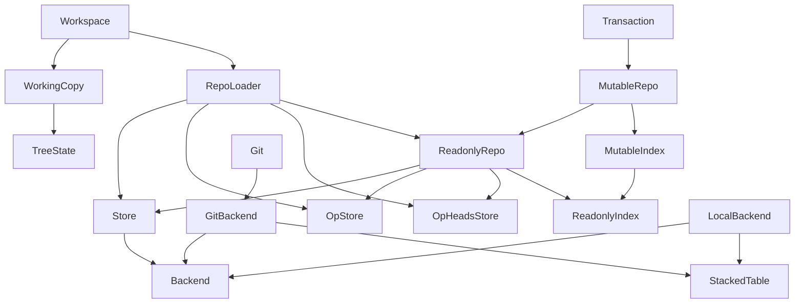

Jujutsu é um poderoso sistema de controle de versão para projetos de software. 

O Jujutsu é diferente da maioria dos outros sistemas, porque internamente ele abstrai a interface do usuário e os algoritmos de controle de versão dos sistemas de armazenamento usados para servir seu conteúdo. Isso permite que ele sirva como um VCS com muitos backends físicos possíveis, que podem ter seus próprios dados ou modelos de rede — como Mercurial ou Breezy , ou sistemas híbridos como o design baseado em nuvem do Google, Piper/CitC.

- [x] [Jujutsu](https://steveklabnik.github.io/jujutsu-tutorial/)
- [ ] [Documentação](https://martinvonz.github.io/jj/v0.24.0/)

## Data model

O modelo de dados de commit é semelhante ao [modelo de objeto do Git](https://git-scm.com/book/en/v2/Git-Internals-Git-Objects), mas com algumas diferenças.

## Visão geral¶
Aqui está um diagrama mostrando alguns tipos importantes na caixa de biblioteca. As seções a seguir descrevem cada componente.

