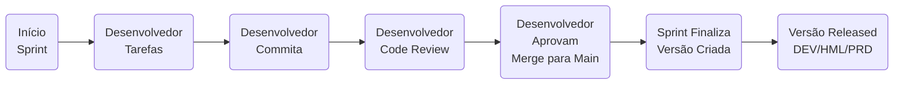
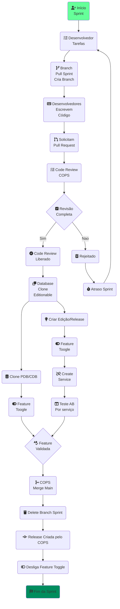
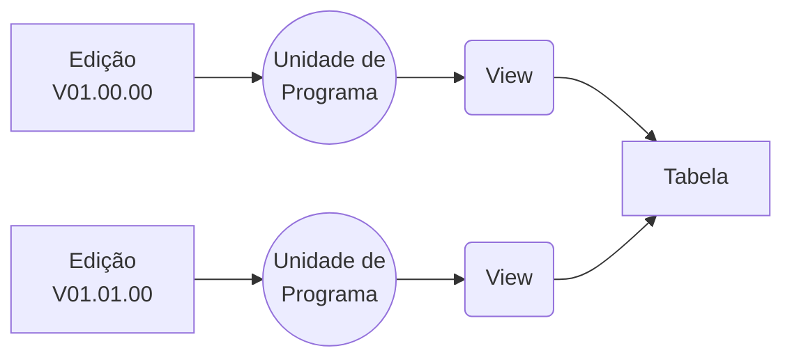

## [Princípio do menor privilégio](https://en.wikipedia.org/wiki/Principle_of_least_privilege)
Conceder a qualquer conta ou processo de usuário apenas os privilégios que são essencialmente vitais para executar as funções pretendidas.

**Observação**: Nos ERPs (e-Business Suite e Peoplesoft) TODOS devem solicitar a Equipe da Jailma o acesso ao PRODUTO. Isso envolve CUSTO e AUDITORIA.
{width="400" height="250" style="display: block; margin: 0 auto"}
## Microserviços
É um tipo de Arquitetura de Software que permite aos desenvolvedores construam diferentes componentes do mesmo aplicativo em módulos. Os aplicativos de microsserviços oferecem descentralização da propriedade dos dados para garantir que cada serviço tenha um banco de dados separado. Cada módulo utiliza uma API para se comunicar com o banco de dados de diferentes serviços.
### Padrões de Gerenciamento de Dados de Microsserviços
Os padrões de gerenciamento de dados facilitam a comunicação entre bancos de dados de dois ou mais componentes de software.

| Tipo                         | Entenda                                                                                                          |
| ----                         | -----                                                                                                            |
| Padrão de Serviço            | Uso de  APIs bem definidas para facilitar a comunicação entre os bancos de dados de dois ou mais microsserviços. |
| **Banco de dados compartilhado*- [x] | As transações no padrão de microsserviços de banco de dados compartilhado estão em conformidade com as propriedades ACID para garantir a validade e consistência dos dados. |
| Saga                         | É uma sequência de transações locais no banco de dados em que o resultado de cada transação depende de um evento da anterior. |
| **CQRS*- [x]                     | Oferece maior desempenho e melhor escalabilidade de microsserviços ao não invocar o banco de dados original durante as consultas.  |
| Fornecimento de eventos      | O evento armazena dados agregados como uma sequência de eventos de mudança de estado. A origem do evento armazena esses dados e cria um novo evento durante qualquer atualização ou inserção.  |
| Composição da API            | MODIFICADO PARA : GraphQL pode otimizar chamadas de API RESTful que oferecem uma forma declarativa de atualizar e buscar seus dados. Os desenvolvedores precisam criar métodos de autenticação e autorização enquanto utilizam recursos existentes, como validação de dados no GraphQL. |

### Padrões de Gerenciamento de Estratégias/[Tempo de vida de uma Feature Flag](https://www.objective.com.br/insights/feature-flags/)

| Conceitos               | Entenda                                                                                                                                   |
| ------                  | --------                                                                                                                                  |
| Feature toggle          | São interruptores que ativam e desativam recursos e funcionalidades.                                                                      |
| Feature flag            | São trechos de código lógico que gerenciam toda a vida útil de um recurso – desde a criação até o lançamento e a descontinuação. (Trace)  |
| Estratégia de Branchs   | Veja documentação realizada.                                                                                                              |
| Código boilerplate ou boilerplate | Seções de código que devem ser incluídas em muitos lugares com pouca ou nenhuma alteração. Ele é muitas vezes usado quando se refere a linguagens que são consideradas detalhadas, onde o programador deve escrever muito código para fazer tarefas mínimas. |


**Observação**: Se estamos falando de BOILERPLATE, a medidas de segurança no GraphQL não são tão maduras quanto as da API REST. Os desenvolvedores precisam criar métodos de autenticação e autorização enquanto utilizam recursos existentes, como validação de dados no GraphQL - RLS (Implementar políticas de segurança em nível de linha, ou seja, restringir o acesso aos dados de uma tabela ou de uma view de acordo com critérios definidos pelo administrador do banco de dados.)

## CI/CD com Banco de Dados e com APEX
Quais seriam as ferramentas para começar?

| Ferramenta                                                                                                              | Ferramenta                |
| -----                                                                                                                   | -----                     |
| Mermaid ([Editor](https://mermaid.live), [Imagens](https://fontawesome.com/start)) e [Cores](https://icolorpalette.com) |                           |
|Repositório Git                                                                                                          | Maven(Apache Maven 3.9.6) |
| SQLcl (Interface de linha de comando baseada em Java para Oracle Database. - Não instalar)                              |                           |
| Liquibase (Biblioteca independente de banco de dados de código aberto para rastrear, gerenciar e aplicar alterações no esquema do banco de dados - Não instalar) |
| utPLSQL (Testar pacotes, funções, procedimentos, gatilhos, visualizações e outros objetos que podem ser usados em PL/SQL. - Chamado de Instalacão) |                           |
| PlDoc (Gerador de documentação para PL/SQL inspirado na forma como a documentação é gerada na linguagem de programação Java/Go. - Durante o Maven) |                           |

### Fluxo Alto Nível - Geral


### Fluxo Drill Down - Geral



## [Oracle Optimal Flexible Architecture (OFA)](https://docs.oracle.com/en/database/oracle/oracle-database/19/ladbi/optimal-flexible-architecture-file-path-examples.html#GUID-BB3EE4F7-50F4-4A2D-8A0D-96B7CC44029B)
São um conjunto de diretrizes de configuração criadas para garantir instalações Oracle bem organizadas, o que simplifica a administração, o suporte e a manutenção.

- [x] Oracle Database oferece suporte a vários Oracle Homes.
- [x] Oracle Inventory (oraInventory) armazena um inventário de todos os softwares instalados no sistema.
- [x] Oracle Base é o diretório inicial do banco de dados para proprietários de instalação do Oracle Database e o local do arquivo de log para proprietários do Oracle Grid Infrastructure.
- [x] Oracle Universal Installer configura os diretórios iniciais do Oracle usando essas convenções do Oracle Optimal Flexible Architecture.

{width="800" height="500" style="display: block; margin: 0 auto"}

## Identificadores no Banco de Dados Oracle
 <p align="justify">Identificadores são fundamentais para a configuração, administração e operação do Oracle Database, pois ajudam a distinguir entre diferentes instâncias e bancos de dados em um ambiente de servidor Oracle.</p>
 <p align="justify">Configurar esses identificadores corretamente é crucial para garantir a conectividade adequada dos clientes e a operação eficiente do banco de dados.</p>

{width="800" height="500" style="display: block; margin: 0 auto"}

## Dados contêiner e Banco de dados conectável
Oracle pode funcionar como um “banco de dados contêiner multilocatário”, também conhecido como CDB. Este CDB pode incluir zero ou mais “bancos de dados conectáveis” ou PDBs.

- [x] Um PDB é uma coleção de esquemas e objetos que atuam como um banco de dados “normal” para aplicativos;
- [x] Dentro do CDB existem dois contêineres:
    - [x] Raiz, denominada CDB$ROOT. Contém metadados Oracle e usuários comuns.
    - [x] SEED PDB, denominado PDB$SEED. Este é um modelo que pode ser usado para criar novos PDBs. Você não pode adicionar ou modificar objetos neste PDB.
- [x] Você pode, mas os benefícios de usar esta arquitetura são:
    - [x] Melhor uso de recursos : PDBs e CDBs usam recursos no servidor de forma mais eficaz em comparação com VMs (que duplicam o sistema operacional) e bancos de - [x]     dados separados (que não compartilham processos);
    - [x] Movimentação mais fácil de dados e código : se você precisar mover um banco de dados conectável de um banco de dados contêiner para outro, isso é bastante - [x]     fácil;
    - [x] Gerenciamento e monitoramento mais fáceis : para administradores, aplicar patches, atualizações, monitorar o banco de dados, realizar backups e outras tarefas são muito mais fáceis.

## Como fazer CI/CD em uma Pipeline de Banco de Dados

### Copia/CLone/PDBs e CDBs
PDBs são bancos de dados independentes que compartilham processos de segundo plano e estruturas de memória comuns.A clonagem de PDBs entre CDBs pode ajudá-lo na migração, backup e restauração de bancos de dados, recuperação de desastres, testes e muito mais.

A clonagem a quente de PDBs é uma técnica em que seu PDB de origem permanece no modo leitura-gravação enquanto você o clona.

{width="400" height="450" style="display: block; margin: 0 auto"}

## Schema e Usuários?
### Usuário

- [ ] É uma conta através da qual você pode se conectar ao banco de dados.(CREATE SESSION)
- [ ] Possui um nome de usuário e uma senha e está associado a um ESQUEMA.
- [ ] São usados ​​para autenticar e autorizar o acesso ao banco de dados.
- [ ] Podem possuir objetos de banco de dados, como tabelas, views, procedures e etc.
- [ ] Podem receber privilégios para acessar objetos pertencentes a outros usuários.
- [ ] Realizar operações dentro do esquema atribuído e em objetos aos quais receberam acesso.

**Observação**: Não é prática comum ter um único usuário possuindo vários esquemas. Em vez disso, normalmente você criaria usuários separados para cada esquema para manter o isolamento e gerenciar as permissões de maneira mais eficaz.

### Estratégia de Design
 <p align="justify">Um banco de dados é geralmente controlado por um sistema de gerenciamento de banco de dados (DBMS). Juntos, os dados e o DBMS, juntamente com os aplicativos associados a eles, são chamados de sistema de banco de dados, geralmente abreviados para apenas banco de dados.</p>

### Quais as Estratégias de Design de Banco de Dados

| Regra                              | Entenda                                                                                                                                     |
| -------                            | -----------                                                                                                                                 |
| Normalização de Dados              | Aplicar as formas normais de normalização ajuda a reduzir a redundância de dados e a manter a consistência.                                 |
| Escolha Adequada de Tipos de Dados | Selecionar os tipos de dados apropriados para cada coluna pode economizar espaço de armazenamento e melhorar o desempenho.                  |
| Índices Eficientes                 | Criar índices em colunas frequentemente usadas em cláusulas WHERE, JOIN e ORDER BY pode melhorar drasticamente o desempenho das consultas.  |
| Particionamento de Tabelas         | Para tabelas grandes, particionar os dados com base em critérios como intervalo de valores, lista ou hash pode melhorar o desempenho de consultas e operações de manutenção, além de facilitar a gestão de dados. |
| Gerenciamento de Espaço            | Planejar e gerenciar o espaço de armazenamento de forma eficiente é crucial para o desempenho e a disponibilidade do banco de dados.        |
| Segurança de Dados                 | Implementar medidas de segurança adequadas, como controle de acesso baseado em funções (RBAC), criptografia de dados sensíveis, auditoria e monitoramento de atividades, é essencial para proteger os dados contra acessos não autorizados e violações de segurança. |
| Backup e Recuperação               | Desenvolver e implementar uma estratégia abrangente de backup e recuperação é fundamental para garantir a disponibilidade e a integridade dos dados em caso de falha do sistema, erro humano ou desastre. |
| Monitoramento e Otimização de Desempenho | Utilizar ferramentas e técnicas de monitoramento de desempenho para identificar e resolver gargalos de desempenho, ajustar parâmetros do sistema, otimizar consultas e  índices, e realizar ajustes de hardware e configuração conforme necessário. |
| ISO/IEC 27002                            | [BS EN ISO/IEC 27002 Tecnologia da informação, segurança cibernética e proteção da privacidade](https://www.iso.org/standard/75652.html) |
| Objetivo de Desenvolvimento Sustentável 9 da ONG | [Objetivo de Desenvolvimento Sustentável 9 da ONU](https://sdgs.un.org/goals/goal9)    |

Impor as melhores práticas arquitetônicas com limites de módulos e padrões de comunicação bem definidos. O isolamento de dados garante que os módulos sejam independentes e fracamente acoplados.

Existem quatro abordagens de isolamento de dados para monólitos modulares:

- [x] Separate table
- [x] Separate schema
- [x] Separate database
- [x] Different persistence

## Isolamento de dados
Um monólito modular possui regras rígidas para integridade de dados:

- [x] Cada módulo só pode acessar suas próprias tabelas
- [x] Sem compartilhamento de tabelas ou objetos entre módulos
- [x] Joins só são permitidas entre tabelas do mesmo módulo
- [x] Os módulos dentro de um monólito modular devem ser independentes. - - [x] Cada módulo lida com seus próprios dados. Outros módulos podem acessar esses dados usando a API pública do módulo.

Quais são os benefícios deste design?

- [x] Manter os módulos isolados uns dos outros promove modularidade e baixo acoplamento. Torna mais fácil introduzir novas alterações no sistema.
- [x] Há menos efeitos colaterais indesejados quando os componentes estão fracamente acoplados.

poderá manter a integridade referencial.

### Separate table
As tabelas para todos os módulos residem dentro de um banco de dados. Não é fácil determinar quais tabelas pertencem a qual módulo. Estou mencionando essa abordagem apenas por uma questão de integridade.

No entanto, quanto mais tabelas você tiver, mais difícil será mantê-las isoladas entre os módulos. Você pode melhorar isso adicionando isolamento lógico entre tabelas.

{width="400" height="300" style="display: block; margin: 0 auto"}

### Separate schema
Agrupar tabelas relacionadas no banco de dados é uma forma de introduzir isolamento lógico. Você pode implementar isso usando esquemas de banco de dados. Cada módulo possui um esquema exclusivo contendo as tabelas do módulo.

{width="400" height="300" style="display: block; margin: 0 auto"}

### Separate database
é mover os dados de cada módulo para bancos de dados separados. Esta abordagem tem mais restrições do que o isolamento de dados usando esquemas. Este é o caminho a seguir se você precisar de regras rígidas de isolamento de dados entre módulos. Mas a desvantagem é a maior complexidade operacional. Você precisa gerenciar a infraestrutura de vários bancos de dados.

Primeiro, você move as tabelas do módulo que deseja extrair para um banco de dados separado. Isso também força você a resolver quaisquer problemas de acoplamento de banco de dados entre seus módulos. Você estará pronto para extrair o módulo assim que mover as tabelas para um banco de dados separado.

Podemos levar mais longe o isolamento dos dados do módulo?

{width="400" height="300" style="display: block; margin: 0 auto"}

### Different persistence
Quem disse que você precisa usar o mesmo tipo de banco de dados para todos os módulos? Os bancos de dados relacionais são incríveis e resolvem uma ampla gama de problemas.

No entanto, você pode introduzir um tipo de banco de dados diferente para resolver problemas específicos. Por exemplo, você pode usar um banco de dados relacional para um módulo. E um banco de dados gráfico ou de armazenamento de colunas para outro módulo. Você também precisa manter diferentes modelos de persistência em seu aplicativo.

Por fim: Eu sempre busco o isolamento lógico usando esquemas. É fácil de implementar e me ajuda a entender melhor meus limites. Dependendo dos requisitos, posso introduzir bancos de dados separados posteriormente.

## Monolito para microsserviços
O sistema cresce com o tempo e os requisitos estão em constante mudança.

O primeiro passo para passar de um monólito para microsserviços é identificar os Contexto Delimitado (Contexto Delimitado é um padrão central no Design Orientado a Domínio).

- [x] [Usando análise de domínio para modelar microsserviços](https://learn.microsoft.com/en-us/azure/architecture/microservices/model/domain-analysis)
- [x] [Contexto Limidatos - Bounded Context](https://martinfowler.com/bliki/BoundedContext.html)


Segundo Fowler, os contextos limitados definem os limites explícitos entre os módulos e separam as responsabilidades. Este é um dos maiores desafios na migração para microsserviços. A identificação de bons limites entre módulos garantam que os microsserviços se concentrem estritamente em um Domínio de problema.

{width="400" height="300" style="display: block; margin: 0 auto"}

Uma das principais ferramentas contidas no design estratégico, o Bounded Context ou Contexto Delimitado, nos apoia a lidar com grandes modelos de domínio, estabelecendo limites ao dividi-los em contextos menores, criando inter-relacionamento explícito entre eles.

## Design Tático
Agrupa um conjunto de ferramentas a serem utilizados na construção do seu modelo de domínio, aplicados em um único contexto delimitado, refinando o resultado do trabalho realizado através das ferramentas de Design Estratégico.

{width="400" height="300" style="display: block; margin: 0 auto"}

### Domain Models ou Modelo de domínio
O conhecimento estruturado do problema a ser resolvido com o software, representando o vocabulário e conceitos-chave do domínio, identificando os relacionamentos entre todas as entidades, atuando como uma ferramenta de comunicação, em conjunto com a linguagem ubíqua(Linguagem comum, compartilhada entre toda a equipe, indiferente do seu papel no projeto. A fim de reduzir o enigma exposto pelo James Shore no texto abaixo.)

{width="400" height="300" style="display: block; margin: 0 auto"}

### Tudo junto e misturado
O usuário que possui esse esquema recebe todos os objetos de um banco de dados, como Tabelas, Indices, Programas e Schedulers;

- [ ] **Separar Dados e Índices em Tablespaces Diferentes**: Isso envolve colocar tabelas e índices em tablespaces separados. Isso pode ajudar na administração do espaço e no desempenho de consultas, especialmente em casos onde há diferentes padrões de acesso aos dados e índices.
- [ ] **Criação de Tablespaces de LOBs dedicados*- [x]  : Criar tablespaces dedicados exclusivamente para armazenar LOBs pode permitir um gerenciamento mais granular do espaço de armazenamento e facilitar a realização de operações de manutenção e backup específicas para LOBs.

### [Smart Database Paradigm (SmartDB)](https://www.salvis.com/blog/2018/08/28/smartdb-as-of-2018-08-21/)
__Qualquer sistema de TI que utilize um banco de dados deve fazer o máximo possível do seu processamento dentro do Banco de Dados e o mínimo possível do seu processamento nas outras camadas__.

Esta abordagem é que isso levaria a menos complexidade, menos componentes, menos idas e vindas, menos sobrecarga e solução de problemas menos complicada.

 <p align="justify">O usuário que possui esse esquema vazio recebe exatamente e apenas executa privilégios em um conjunto bem definido de subprogramas PL/SQL que foram projetados para ser a API do back-end do aplicativo que o banco de dados hospeda para o mundo externo.</p>

{width="800" height="500" style="display: block; margin: 0 auto"}

#### API PL/SQL lidam com transações
 <p align="justify">As instruções insert, update, delete e commit claro, e select devem ser emitidas para implementar o propósito da aplicação, elas só podem sair do código PL/SQL dentro do banco de dados.</p>

- [ ] O usuário conectado não possui objetos de banco de dados;
- [ ] O usuário conectado pode executar apenas unidades de API PL/SQL;
- [ ] Unidades de API PL/SQL lidam com transações;
- [ ] As instruções SQL exploram todo o poder do SQL baseado em conjunto;

Logo:

- [ ] O acesso direto a tabelas ou visualizações é indesejado;

### Esquema

- [ ] É uma coleção de objetos de banco de dados (como tabelas, visualizações, índices, sequências, etc.) que pertencem a um usuário específico.
- [ ] Contêiner lógico para objetos de banco de dados.
- [ ] Associado a uma conta de usuário, que é usada para conectar-se ao banco de dados e acessar os objetos dentro desse esquema.
- [ ] É um namespace para objetos de banco de dados e fornece uma maneira de organizar e gerenciar objetos dentro do banco de dados.

### Oracle e-Business Suite
#### Versão 11/11i
Nas versões 11i anteriores do Oracle E-Business Suite, cada produto recebia duas tablespaces, um para dados e outro para índices.
#### Versão 12
Uma instalação do Oracle E-Business Suite Release 12.2 inclui duas edições (versões) do código do aplicativo e dos dados iniciais. O sistema de arquivos contém duas cópias completas do Oracle E-Business Suite e dos arquivos de tecnologia da camada de aplicativo.

No banco de dados, usamos o recurso Redefinição baseada em edição para criar uma nova edição do banco de dados para cada ciclo de aplicação de patches online.

- [x] "Run Edition" é o código e os dados usados ​​pelo aplicativo em execução. A Run Edition inclui um sistema de arquivos completo na camada de aplicativo junto com todos os objetos e dados visíveis na edição padrão do banco de dados. Como desenvolvedor, você se conectará à Run Edition sempre que estiver envolvido em atividades normais de desenvolvimento no sistema.

- [x] "Patch Edition" é uma cópia alternativa do código e dos dados iniciais do Oracle E-Business Suite que é atualizada pelo Online Patching. A Patch Edition inclui uma cópia completa do sistema de arquivos da camada de aplicativo e objetos de código de banco de dados editados. A Patch Edition só pode ser usada quando uma sessão de Patching Online está em andamento. Os usuários finais não podem acessar o Oracle E-Business Suite Patch Edition, mas como desenvolvedor você pode precisar se conectar ao Patch Edition de um sistema ao aplicar patches ou depurar problemas com o processamento de Patch Online.

<p align="justify">A arquitetura de banco de dados do Oracle E-Business Suite é altamente complexa e envolve vários esquemas de banco de dados para diferentes módulos e componentes da aplicação.</p>
{width="800" height="500" style="display: block; margin: 0 auto"}

  | Schema               | Definição                                                 |
  | -----                | --------                                                  |
  | SYS e SYSTEM         | Estes esquemas são parte do banco de dados Oracle em si e são usados para armazenar metadados do sistema, como informações sobre usuários, privilégios, estrutura do banco de dados, etc. |
  | APPS                 | É o esquema principal usado pelo Oracle E-Business Suite. Ele contém objetos compartilhados e dados para vários módulos e componentes da aplicação. |
  | Módulos Funcionais   | Cada módulo funcional do Oracle E-Business Suite geralmente tem seu próprio schema de banco de dados. |
  | Schemas Customizados | Iniciam-se por XX60OPT e são esquemas de banco de dados adicionais para personalizações e extensões feitas pelos usuários, desenvolvedores ou consultores. |
  | Outros Esquemas      | Outros esquemas no banco de dados do Oracle E-Business Suite para fins específicos, como auditoria, armazenamento de dados temporários, etc. |

#### Custom Applications
O código customizado deve ser desenvolvido de acordo com os padrões publicados pela Oracle e o que chamamos de `CEMLI`.

<p align="justify">Para manter os arquivos personalizados segregados dos arquivos padrão da Oracle ou da funcionalidade CORE, a Oracle recomenda criar um aplicativo personalizado e obter os arquivos da camada do aplicativo personalizado, como formulários, relatórios, etc., no CUSTOM_TOP.</p>

Os aplicativos deverão ser pré-fixados por `XX`e criados através do `AD Splice`. Quaisquer novos objetos de aplicativos personalizados serão armazenados em APPS_TS_TX_DATA e APPS_TS_TX_IX, independentemente das configurações newprods.txt, izuterr.txt.

**Observação*- [x] :

- [x] Tenho ORIENTADO todos os schemas nascidos e criados pela 60OPT, mesmo FORA do Schema/Usuario da Instancia e-Business, sejam préfixados com `XX60OPT`, que identificaria que são CUSTOMIZADOS.
- [x] Todas as conexões de Banco de Dados Oracle, são obtidas através do servidor: `\\server1\tn$`;

#### Gateway de Banco de Dados (COBGATE ou XX60OPTGATE)
Gateway pode ser classificado como “portal”, ele é considerado uma passagem entre dois ambientes distintos. Para que este portal pudesse fazer isso, seria necessário a criação de DBLINKs, que é um objeto criado em um esquema que possibilita o acesso a objetos de outro banco de dados.

- [x] Diminuir o tempo de liberação e clonagem;
    - [x] Todos os schemas possuiam database link, logo demora em ajustar os acessos;
    - [x] Controle de Acesso e Password das instancias;
    - [x] Permitir de um único banco de dados Principal (Oracle), acessar o MySQL, SQL Server, PostgreSQL através do Transparente-Gateway.
        - [x] Homogêneo   - Quando acessa outros bancos de dados Oracle    (xxxEBS,xxxFOLHA,xxxBDS,xxxCAREF)
        - [x] Heterogêneo – Quando acessam outros tipos de bancos de dados (xxxODBC)

{width="400" height="350" style="display: block; margin: 0 auto"}

- [x] A ideia era NÃO trazer dados de uma instancia, diminuir o numero de database links, o que facilitaria a clonagem, pois teríamos um único ponto de comunicação.

Esta conexão é conhecida como Sistema de Banco de Bados Distribuídos e pode ser Homogêneo – quando acessa outros bancos de dados Oracle - e Heterogêneo – quando acessam outros tipos de bancos de dados.

Porem todos deveriam avaliar as queries e hintar os objetos com `/*+ DRIVING_SITE(tabela) */ `, para evitar volume de tráfego de rede.

#### [Banco de Dados Rosa](https://www.salvis.com/blog/2018/07/18/the-pink-database-paradigm-pinkdb-2/)
É uma arquitetura de aplicativo para aplicativos centrados em banco de dados, ou seja, quando essas APIs é chamadas, o trabalho do banco de dados chamadas a SQL e PL/SQL, são todos executados por meio deste usuário. As APIs nunca fariam CRUDs diretos em uma tabela, mas simplesmente chamariam programas PL/SQL para fazer esse trabalho.

{width="230" height="230" style="display: block; margin: 0 auto"}

Um aplicativo que implementa PinkDB possui os seguintes recursos:

- [ ] O usuário conectado não possui objetos de banco de dados. O usuário connect é usado por componentes do aplicativo fora do banco de dados para interagir com o banco de dados.(100% idêntico ao SmartDB)
- [ ] O usuário conectado tem acesso apenas a objetos de API. O usuário conectado não deve ter privilégios para acessar objetos que não fazem parte da API, por exemplo, através de SELECT ANY TABLEprivilégios ou similares.
- [ ] A API consiste em objetos e visualizações armazenados;O acesso é concedido com base no princípio dos privilégios mínimos. A API consiste em objetos e visualizações armazenados, mas não em tabelas.
- [ ] Os dados são processados ​​por operações baseadas em conjunto. Menos loops, mais SQL baseado em conjuntos.

#### Diferenças para SmartDB
SmartDB tem como alvo PL/SQL e, portanto, foca em bancos de dados Oracle. A API no SmartDB consiste apenas em unidades PL/SQL. Sem exceções. PinkDB permite visualizações.

{width="400" height="350" style="display: block; margin: 0 auto"}

- [x] Liquibase é uma biblioteca independente de banco de dados de código aberto para rastrear, gerenciar e aplicar alterações no esquema do banco de dados.

## Segurança no Banco De Dados
A escolha de se utilizar a autenticação com ORDS OAuth ou Kong API Gateway depende de vários fatores, incluindo requisitos específicos do seu projeto, infraestrutura existente e preferências da equipe de desenvolvimento. A segurança de dados é a prática de proteger as informações digitais contra o acesso não autorizado, a distorção ou o furto ao longo de todo o ciclo de vida. A complexidade cria uma superfície de ataque mais ampla, tornando-se um desafio para o monitoramento e a segurança.

| Requisito                   | Entenda                                                                                                                                                                         |
| -------                     | ----------                                                                                                                                                                      |
| Requisitos de Segurança     | Ambos ORDS OAuth e Kong API Gateway oferecem recursos de segurança robustos.                                                                                                    |
| Facilidade de Implementação | Gerenciamento do ORDS OAuth mais direto, por outro lado, Kong API Gateway oferece uma camada de abstração que pode simplificar a gestão de múltiplos serviços e microsserviços. |
| Ecossistema e Integrações   | ORDS OAuth pode se integrar mais facilmente com o ecossistema Oracle, enquanto Kong API Gateway pode ter integrações mais amplas com outras tecnologias e serviços de nuvem.    |
|                             | Maior facilidade em se construir **Database Management System Row-Level Security**, predicados de política e controle centralizado.                                             |

## [Visão Geral do HTTP](https://developer.mozilla.org/en-US/docs/Web/HTTP/Overview) e [Design da API REST](https://blog.restcase.com/4-maturity-levels-of-rest-api-design/)
{width="400" height="350" style="display: block; margin: 0 auto"}

Diretrizes básicas de design que compõem uma API RESTful :

| Design                     | Entenda                                                                                                                                                          |
| -----                      | -----                                                                                                                                                            |
| Recursos (URIs)            | Para descrever seus recursos, use nomes concretos e não verbos de ação. Veja a [RFC3986](https://datatracker.ietf.org/doc/html/rfc3986)                          |
| Métodos HTTP               | Devemos usar quais ações são executadas nos recursos e facilitar o trabalho do desenvolvedor no tratamento de operações CRUD recorrentes. GET, POST, PUT, DELETE |
| Cabeçalhos HTTP            | Os campos de cabeçalho HTTP fornecem informações necessárias sobre a solicitação ou resposta ou sobre o objeto enviado no corpo da mensagem.                     |
| Parâmetros de consulta     | Paginação,Filtragem,Ordenação,                                                                                                                                   |
| Códigos de status          | Você use os códigos de status HTTP adequados, especialmente ao zombar da API RESTful.                                                                            |


## Oracle Rest Data Services (Trade off)

O trade off é o nome que se dá a uma decisão que consiste na escolha de uma opção em detrimento de outra, ou seja, SmartDB, PinkDB ou RestDB?


| Regra               | Texto                                                                                | Descrição                                                           |
| :---------:         | -----------                                                                          | ---------                                                           |
| nº 1                | Barra final (/) não deve ser incluída em URIs                                        | Uma barra (/) não adiciona valor semântico e pode causar confusão.  |
| nº 2                | O separador de barra (/) deve ser usado para indicar um relacionamento hierárquico.  |                                                                     |
| nº 3                | Hífens (-) devem ser usados ​​para melhorar a legibilidade dos URIs.                   |                                                                     |
| nº 4                | Sublinhados (_) não devem ser usados ​​em URIs.                                        |                                                                     |
| nº 5                | Letras minúsculas devem ser preferidas em caminhos URI.                              |                                                                     |
| nº 6                | Extensões de arquivo não devem ser incluídas em URIs                                 |                                                                     |
| nº 7                | O nome do endpoint deve ser singular ou plural?                                      | UMA única instância de um recurso usando o plural, a resposta pragmática é manter o formato do URI consistente e sempre usar o plural.|

???+ tip "Variáveis Implícitas"

    - [x] Por padrão todas as variáveis de SAÍDA, são pré-fixadas por `X`;
      - [x] :status_code      - X-ORDS-STATUS-CODE: O código de status HTTP retornado por ORDS (18.3 em diante).
      - [x] :forward_location - X-ORDS-FORWARD....: A localização do recurso atualizado (18.3 em diante)

    - [x] [List of Implicit Parameters](https://docs.oracle.com/en/database/oracle/oracle-rest-data-services/24.1/orddg/implicit-parameters.html#GUID-A5F6FF18-0204-4901-BD3B-056BF7CDA63D)

## Redefinição Baseada em Edição/Edition Based Redefinition(EBR)

{width="600" height="600" style="display: block; margin: 0 auto"}

- [x] Arquitetura de Disponibilidade Máxima (MAA) da Oracle.
- [x] EBR oferece a possibilidade de diferentes versões que podem ser acessados e concedidos individualmente;
- [x] O EBR fornece atualizações on-line e permite migrações sem tempo de inatividade;
- [x] Se um pacote (ou outro tipo de unidade de programa) fizer referência a uma **tabela**, adicionar uma nova coluna à tabela poderá invalidar o pacote.
- [x] As edições são criadas no nível do PDB, não no nível do esquema;
- [x] Risco: Depois que uma edição for habilitada para um esquema, ele não pode ser desativado novamente;
- [x] Permite fazer qualquer alteração em sistemas de produção;
- [x] Desde uma pequena correção de bug até uma atualização de versão importante – de forma on-line, usando hot rollover:
- [x] Expomos uma nova versão (uma nova edição) enquanto os usuários ainda estão usando a versão antiga , e usuários diferentes podem usar duas (ou mais) versões ao mesmo tempo.
- [x] Podemos fazer o upgrade a qualquer momento, não necessariamente dentro de uma janela, deixando o  "hot rollover" ou switchover para a noite.

- [x] Deve haver pelo menos uma edição no banco de dados;
- [x] E cada edição poderá ter no máximo uma edição filha.

- [x] As edições são objetos no nível do banco de dados (como funções e diretórios), e não em nível de esquema (como tabelas e pacotes).
- [x] A edição inicial é ORA$BASE.Cada nova edição é criada como filha de uma edição existente.
- [x] Em outras palavras, não podemos ter uma árvore de edições; apenas um (único) ramo de edições.
- [x] Cada sessão usa uma edição específica a qualquer momento. Por padrão, quando abrimos uma sessão ela é associada à edição padrão no nível do banco de dados.
- [x] Cada objeto editado no contexto de uma edição específica é real ou herdado .
- [x] Logo após a criação de uma nova edição ele herda todos os objetos editados de sua edição pai e não possui nenhum objeto real.
- [x] Por definição, quando estamos no contexto de uma edição específica, vemos e usamos os objetos que são reais nesta sessão e os objetos herdados das edições ancestrais, mas nunca objetos das edições descendentes.
- [x] Uma atualização online significa que os usuários do aplicativo poderão continuar trabalhando ininterruptamente.
- [x] Os objetos de código que eles usam devem permanecer válidos e disponíveis a qualquer momento.
- [x] Seria bom se pudéssemos compilar todos esses objetos em uma única transação, como uma operação atômica, para que a qualquer momento os usuários vissem apenas uma visão consistente de todos os objetos – e todos eles em um estado “Válido”
- [x] Por definição, quando estamos no contexto de uma edição específica, vemos e usamos os objetos que são reais nesta sessão e os objetos herdados das edições ancestrais, mas nunca objetos das edições descendentes.
- [x] Antes de expor uma nova edição, sempre atualize explicitamente todos os objetos dependentes;
- [x] Há casos em que a invalidação não ocorrerá e o pacote permanecerá válido. No meu exemplo, por exemplo, se eu qualificasse o nome do parâmetro na instrução DELETE, adicionar a coluna eye_color não causaria invalidação.
- [x] Mas há casos em que a invalidação é inevitável. Por exemplo, se table%rowtype for usado no pacote.
- [x] E o mesmo vale para outras alterações na estrutura da tabela, não apenas para adições de colunas.

### Trade-off
- [x] Podemos eliminar a invalidação adicionando uma view entre o pacote e a tabela;
- [x] Se a visualização simplesmente projetar as colunas da tabela e o pacote fizer referência à visualização em vez da tabela, adicionar uma nova coluna à tabela não causará nenhuma invalidação à visualização e, portanto, o pacote também permanecerá válido;
- [x] Mas adicionar a coluna à tabela é apenas a primeira parte da tarefa. Também precisamos fazer as alterações correspondentes no código do pacote, e para isso também precisamos projetar a nova coluna da tabela na view. Bem, isso é fácil, pois as visualizações são editáveis. Podemos fazer essas alterações – tanto na visualização quanto no pacote – em uma nova edição;
- [x] Isso significa que devemos criar uma visualização para cada tabela e que devemos fazer referência a essas visualizações (em vez das tabelas) em todo o nosso código? Sim, é verdade, mas não apenas “uma visão” – um tipo especial de visão.
- [x] É por isso que o EBR introduziu um novo e especial tipo de visualizações – Visualizações de edição .
- [x] Só pode haver uma visualização de edição por tabela;
- [x] Uma visualização de edição pode conter apenas as cláusulas SELECT e FROM;
- [x] A cláusula FROM pode referir-se apenas a uma única tabela
- [x] A lista SELECT pode conter apenas colunas e aliases (sem expressões), e cada coluna pode aparecer apenas uma vez;
- [x] Afirmando que o código da aplicação nunca deve fazer referência direta a tabelas; em vez disso, cada tabela deve ser coberta por uma visualização de edição e o código do aplicativo deve fazer referência às visualizações.

- [x] Se os gatilhos forem definidos nas tabelas, eles deverão ser eliminados e recriados nas visualizações de edição correspondentes;
- [x] Se as políticas **VPD forem definidas nas tabelas**, elas deverão ser eliminadas e recriadas nas visualizações de edição correspondentes;
- [x] Se quaisquer privilégios forem concedidos nas tabelas, eles deverão ser revogados e concedidos novamente nas visualizações de edição correspondentes;
- [x] Observe que outras entidades, como índices e restrições, permanecem pertencentes às tabelas.



## A tarefa
Para isso devemos mudar a edição da nossa sessão para "v01.00.00" , e podemos fazer assim:

- [x] Enquanto os clientes trabalham com a versão base, nós (o desenvolvedor) compilaremos a nova versão do corpo do pacote pg_60OPT_pais_dml na nova edição V1 .
- [x] Precisamos mudar a implementação do pacote pg_60OPT_pais_dml, ou seja, precisamos alterar o corpo do pacote.
Não há alterações na API (a especificação do pacote não é alterada) e nenhuma alteração na tabela.
Os objetos de código que eles usam devem permanecer válidos e disponíveis a qualquer momento.
Uma das muitas vantagens de usar pacotes PL/SQL é que o corpo do pacote não possui objetos dependentes.
Isso significa que compilar o corpo de um pacote nunca invalida outros objetos de código.Um problema é que para compilar o corpo do pacote temos que bloqueá-lo exclusivamente – para garantir que nenhuma outra sessão o esteja usando enquanto ele está sendo compilado. Significa que


### EBR – Hierarquia de Edições
- [x] As edições são criadas em uma hierarquia.
- [x] Todo banco de dados Oracle já possui o padrão edição ORA$BASE.
- [x] Cada nova edição é criada como filha de outra edição e herda todos os seus objetos.

### Casos de uso de EBR

| Conceito               | Entenda |
| -----                  | ----    |
| Objetos editados       | Estão vinculados tanto a um esquema quanto a uma edição. |
| Objetos não editados   | São visíveis para todas as edições e não estão vinculados a uma edição específica. Tabelas e índices são exemplos de tipos de objetos não editados. |

| Tipo de alteração                | Recurso                                              |
| -----                            | ------                                               |
| Alterações em objetos PL/SQL     |  Edições                                             |
| Mudanças na estrutura da tabela  | Edições e visualizações de edição                    |
| Alterações nos dados da tabela   | Edições, Editioning views and Cross-edition triggers |

Vários aplicativos que são consumidores!

Oferece a possibilidade de aplicar atualizações sem invalidar o sistema. Usando a Redefinição Baseada em Edição, você pode construir o sistema novo ou melhorado e fazer com que os usuários comecem a usá-lo sem que o sistema “antigo” fique inativo.

Cada esquema possui pelo menos uma edição (ORA$BASE), mas cada edição pode ter uma edição filha. Neste momento apenas um único filho, mas se olharmos a sintaxe para criar tal edição. Os seguintes objetos são editáveis, portanto podem ter diferentes implementações em diferentes edições do esquema:

- [ ] Synonym
- [ ] View
- [ ] Function
- [ ] Procedure
- [ ] Package (specification and body)
- [ ] Type (specification and body)
- [ ] Library
- [ ] Trigger

Quando você cria uma nova edição, todos os objetos editáveis ​​são herdados do pai. Se você fizer alterações nos objetos, a herança será interrompida.  As edições são criadas em toda a instância e não no nível do usuário ou do esquema.

#### TRADE-OFF
- [x] O EBR faz parte da migração? Adiciona complexidade para o desenvolvedor?
- [x] O EBR faz parte de sua Pipeline. O desenvolvedor não precisa pensa na complexidade do EBR

- [x] AUTHID DEFINER.....:  Funções e procedimentos em um pacote com direitos de definidor são executados sob os privilégios do usuário que define o pacote.
- [x] AUTHID CURRENT_USER: funções e procedimentos são executados sob os privilégios do usuário que os invoca.

Como é o processo de CI com EBR?

{width="900" height="600" style="display: block; margin: 0 auto"}

E no JAVA, como podemos
Fonte de dados JPA com edição

O lado do aplicativo também pode definir a edição por meio de fontes de dados JPA. O nome da edição pode ser especificado na propriedade oracle.jdbc.editionName. Esta edição será então usada ao estabelecer uma conexão através da fonte de dados JPA.

```
@Bean
       @Primary
       protected DataSource dataSource() {
             DriverManagerDataSource dataSource = new DriverManagerDataSource();

             dataSource.setDriverClassName(driver);
             dataSource.setUsername(user);
             dataSource.setPassword(pwd);
             dataSource.setUrl(url);

             Properties properties = new Properties();
             properties.setProperty("oracle.jdbc.editionName", edition);
             dataSource.setConnectionProperties(properties);

             log.debug("dataSource:{}", dataSource);
             return dataSource;
       }
```
