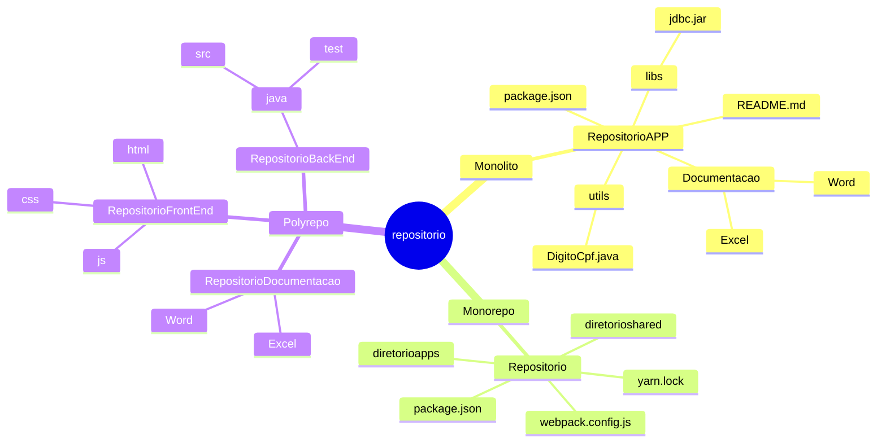

<p align="justify">Quando iniciamos um projeto, podemos seguir algumas práticas recomendadas para organizar o repositório para uma melhor contribuição da equipe e uma estrutura de projeto mais elegante.</p>

<p align="justify">Utilizamos para a criação dos repositórios GIT, conforme configuração dos servidores, que são mantidos pelo 60pportunities.</p>

### Nomenclatura do Repositório
<p align="justify">Por padrão iremos impedir que certos caracteres sejam incluídos no nome do repositório.</p>

Embora não haja uma maneira errada de nomear um repositório, alguns nomes são melhores queoutros.

<p align="justify">O comprimento   do repositório não deve conter mais de 64 caracteres Unicode e não pode seridêntico a nenhum outro nome de repositório Git no projeto.</p>

Todas essas sugestões estão sendo seguidas pelo criador automático.

<p align="justify">Usando isso como diretriz, dividimos o repositório em 3(três) seções separadas porunderscore. Esse formato consiste em seções que definem:</p>

- [x] PRODUTO, FINALIDADE e ESTRUTURA DA LINGUAGEM.

| Definição  |Conceito                                                      |
| ----       |------                                                        |
| PRODUTO    | Informe a SIGLA do Sistema.                                  |
| FINALIDADE | Utilizado para aplicações monolíticas (MONO),BACK_END, FRONT_END, MOBILE eLIB (Biblioteca de Documentos). |
| ESTRUTURA  | Linguagem(PHP,JAVA,Python),Sistema |Operacional(IOS,Android),DO(Documentaçao).  |

- [x] Deve se perceber as seguintes características:  **Descritivo, Legibilidade, Consistência, Contextual, Extensibilidade, Reuzabilidade e Sucinto**.

| ----          | SEÇÃO 01      | ----               | SEÇÃO 02            | SEÇÃO 03   |
| ----          | ----          | ----               | ----                | ----       |
| PRODUTO       | SIGLA         | FINALIDADE         | SIGLA               | LINGUAGEM  |
| ----          | -----         | ------             | -----               | --------   |
| PPPPPPPPPPP   | XXXXXXX       | RESTAPI            | RESTAPI             | JAVA       |
| PPPPPPPPPPP   | XXXXXXX       | BACK-END           | BACK                | PHP        |
| PPPPPPPPPPP   | XXXXXXX       | FRONT-END          | FRONT               | NODE       |
| PPPPPPPPPPP   | XXXXXXX       | SCRIPT             | SCRIPT              | SHELL      |
| PPPPPPPPPPP   | XXXXXXX       | MOBILE             | MOBILE              | IOS        |
| PPPPPPPPPPP   | XXXXXXX       | LIB                | DOCUMENTACAO        | DOC        |

| SEÇÃO 01      | SEÇÃO 02      | SEÇÃO 03           | SIGLA               |            |
| ----          | ----          | ----               | ----                |            |
| SSSSSSSSSS    | RESTAPI       | JAVA               | SSSS_RESTAPI_JAVA   |            |
| SSSSSSSSSS    | BACK          | PHP                | SSSS_BACK_PHP       |            |
| SSSSSSSSSS    | LIB           | DOC                | SSSS_LIB_DOC        |            |
| SSSSSSSSSS    | LIB           | DOC                | GESCON_LIB_DOC      |            |



### Monorepo
É um único repositório que armazena todo o seu código e recursos para cada projeto;

O repositório contém mais de um projeto lógico (por exemplo, um cliente iOS, Android e umaplicativo da Web);

Esses projetos provavelmente **não estão relacionados**, estão conectados livremente oupodem ser conectados por outros meios (por exemplo, via dependência ferramentas degerenciamento).

O repositório é grande de várias maneiras:

- [x] Número de commits;
- [x] Número de ramificações e/ou tags;
- [x] Número de arquivos rastreados;
- [x] Tamanho do conteúdo rastreado (conforme medido observando o diretório .git do repositório);
- [x] Empresas usam monorepo, porque ele tem bons benefícios relacionados à manutenção de código, integração, reutilização de código, refatoração e mudanças em larga escala;
- [x] **Código compartilhado**: Reutilize código de validação, componentes de interface do usuário e tipos na base de código;
- [x] Reutilize o código entre o back-end e o front-end;
- [x] **Revisões de código mais eficaz**: A maioria dos desenvolvedores agora entende a plataforma de ponta a ponta, levando a que mais bugs sejam identificados e corrigidos noestágio de revisão do código;
- [x] **Mudanças atômicas**: Mude a API de um servidor e modifique os clientes que consomem essa API no mesmo commit. Você pode alterar um componente de botão em uma biblioteca compartilhada e os aplicativos que usam esse componente no mesmo commit. Isso evita o incômodo de tentar coordenar confirmações em vários repositórios;
- [x] **Compartilhamento de componentes comuns**: Os desenvolvedores têm uma visão do que está acontecendo em todos os serviços e podem efetivamente criar componentes comuns;

### Ferramentas Monorepo

|  Tool | Entenda                 |
| ----- | --------------          |
| [Bazel](https://bazel.build/?hl=pt-br)  | Se destaca em repositórios grandes emultilíngues com processos de construção complexos. |
| Gradle Build Tool                       | É particularmente adequado para linguagens JVMe fornece suporte nativo para caches de construção locais, o que pode acelerarsignificativamente o tempo de construção. |
| Lerna | Otimiza o fluxo de trabalho de gerenciamento de repositórios de vários pacotescom git e npm.  |
| Nx    | Completo de ferramentas de desenvolvimento que oferece uma gama impressionante derecursos, como orquestração avançada de tarefas, execução distribuída de tarefas e cache deconstrução inteligente. |
| Pants Build | Sistema de construção projetado para grandes monorepos que podem contermúltiplas linguagens e frameworks.      |
| Rush        | Orquestrador de construção escalonável para monorepos, que pode gerenciarprojetos JavaScript e não JavaScript. |
| Turborepo   | Alto desempenho para bases de código JavaScript e TypeScript.  |
| Bit         | Ferramenta de gerenciamento de monorepo, mas oferece uma experiência tãoexcelente que pode resolver todas as “dificuldades” de monorepo com o novo fluxo detrabalho que fornece. |

### Multirepo ou Polyrepo
Refere-se à organização de seus projetos, cada um em seus próprios repositórios separados.
Esta é a arquitetura **mais comum em uso** e pode ser vista em grandes empresas e possui algumas vantagens:

- [x] **Propriedade**: Como a base de código imita a arquitetura, uma pequena equipe pode possuir e desenvolver e implantar de forma independente a pilha completa de um microsserviço.
- [x] **Melhor escala**: Bases de código menores são mais fáceis de gerenciar e levam a menos instâncias de ""Ninguém gosta de um conflito de mesclagem. (merge hell)"".
- [x] **Clones pequenos**: A maioria dos SCMs, incluindo git, não oferece suporte à clonagem de partes de um repositório. Para grandes bases de código, clones, pulls e pushs levam   uito tempo, o que é ineficiente.
- [x] **Controle de acesso**: Pode ser aplicado no nível do projeto, pois cada funcionário tem acesso a uma pequena seção de projetos.

## Modelo de Ramificação
<p align="justify">Ao começar, é melhor manter as coisas simples e, portanto, inicialmente o GitHub Flow ou o desenvolvimento baseado em Trunk podem funcionar melhor. Eles também são ideais para equipes menores que exigem a manutenção de apenas uma única versão de um lançamento.</p>

| Tipo de produto e seu método de lançamento  | Equipe  | Maturidade  | Modo de filial  |
| -------------   | -----         | -------------    | -------------      |
| Todos   | Equipe pequena	    | Alto	       | Trunk-Based Development (TBD) |
| Produtos que suportam implantação e lançamento contínuos, como produtos SaaS | Meio	 | Moderado	 | GitHub-Flow e TBD  |
| Produtos com uma janela de lançamento definida e uma cadência periódica      | Meio	 | Moderado	                        | Git-Flow and GitLab-Flow com release branch   |
| Produtos que exigem qualidade e suportam implantação e lançamento contínuos, | Meio	| Moderado	  | GitLab-Flow    |
| Produtos que exigem qualidade e longo ciclo de manutenção |	Grande   | Moderado| Git-Flow  |

- [X] Não existe estratégia perfeita;
- [X] A estratégia que você escolher dependerá da sua equipe e da natureza e complexidade do seu projeto e por isso deve ser avaliada caso a caso;

### Estratégias Branch
<p align="justify">A maior vantagem de um branch Git é que ele é 'leve', o que significa que os dados consistem em uma série de snapshots, portanto, a cada commit que você faz, o Git tira uma foto da aparência dos seus arquivos naquele momento earmazena uma referência para esse snapshot.</p>

Isso significa que essas ramificações não são apenas cópias do sistema de arquivos, mas simplesmente um ponteiro para o commit mais recente.

Um branch é essencialmente uma referência ou um ponteiro para o último commit em umdeterminado contexto.

<p align="justify">À medida que você cria novos commits no novo branch, o Git cria novos ponteiros para rastrear as alterações. As ramificações do Git, então, podem ser vistas como um ponteiro para um instantâneo de suas alterações.</p>

<p align="justify">As ramificações do Git permitem que os desenvolvedores diverjam da ramificação principal criando ramificações separadas para isolar alterações de código.</p>

- [x] O branch padrão no Git é o branch `main`;
- [x] Diversas estratégias de ramificação são usadas NÃO há um modelo correto ou errado;

| Nome           | Descrição da Branch | SVN    | Gitflow | GitHubFlow | TBD  |
| -------------- | ------------------  | :----: | :----:  | :----:     | :----: |
| main           | É a ramificação que estará com o código da versão do ambiente de produção. Uma versão já testada e validada.                                                   | - | X | X | X |
| sprint         | Tem objetivo de manter os desenvolvimentos realizados pela equipe. Podemos chamar de branch de integração, pois nela a equipe centralizam os desenvolvimentos. | - | X | X | - |
| qualidade      | Pré-Produção, qualidade processo de homologação independente da pipeline.  | - | X | X | X |
| hotfix/usuario-feature-nnnn | É uma branch de emergência para correções de bug diagnosticado do ambiente de produção.                                                                        | - | X | X | - |
| wip/usuario-feature-nnnn | São conhecidos como branches de tópico. Os branches de recursos isolam o trabalho em andamento do trabalho concluído no branch principal.  | - | - | - | X |
| wit/usuario-feature-nnnn | São conhecidos como branches de tópico. Os branches de recursos isolam o trabalho em andamento do trabalho concluído no branch principal. | - | - | - | X |
| release           | Esta é uma maneira conveniente de declarar um instantâneo no tempo de um projeto no tronco ou em uma ramificação. Eles são úteis para marcos no desenvolvimento do seu projeto, permitindo que você tenha um registro do estado de um projeto em um momento importante. | X | - | - | - |

### Gitando
| Id   | emoji	     | Tipo      | Descricao                                        |
| --   | -----       | -----     | ------------------------                         |
| ✨    | :sparkles: | feat	    | Introduzir novos recursos                        |
| 🐛    | :bug:	     | bug	     | Corrigir bug                                     |
| 🚑    | :ambulance:| hotfix	   | Correção crítica                                 |
| 📝    | :memo:	   | docs      | Adicionar ou atualizar documentação              |
| 🌀    | :cyclone:  | refactor  | Refatorar código                                 |
| ⏪	   | :rewind:   | revert    | Reverter alterações                              |
| 🔨    | :hammer:   | script	   | Adicione ou atualize scripts de desenvolvimento  |
| 🔖    | :bookmark: | release   | Tags de lançamento/versão                        |
| 🚮    | :trash:    | deadcode  | Remover código morto                             |
| 🔇    | :mute:	   | rmlog	   | Remover registros                                |

### Solicitações Pull Request
<p align="justify">Escrever boas descrições de solicitações pull request é uma ótima maneira de ajudar os revisores a saber o que esperar ao revisar o código e documentações obrigatórias.</p>

<p align="justify">Um modelo de solicitação pull é um arquivo contendo texto Markdown que é adicionado à descrição da solicitação pull quando a solicitação pull é criada.</p>

<p align="justify">O Azure Repos permite criar diversos tipos de templates, porem iremos utilizar Modelos de pull request para específicas branches.</p>

| Arquivo        | Branch    | Entenda |
| -------        | ------    | ------- |
| develop.md     | develop   | Este é normalmente o modelo padrão, mas pode ser substituido pelo modelo específico - nome da branch. |
| additional.md  | -         | Este é um modelo adicional.                  |
| main.md        | main      | Este é o modelo específico do branch main.   |
| wip.md         | wip/xxxxx | Work in Progress acordado.                   |
| wit.md                   | wit/xxxxx | Item de trabalho finalizado.       |

#### Template de Documentos
Verifique se já há no repositório(s) os templates criados para as branches:

- [x] No Azure-Devops: `<repository root>/.azuredevops/pull_request_template/branches/`;
- [x] No GitHub: `<repository root>/.github/ISSUE_TEMPLATE/`;

#### Exemplo de Template

```
#  Inclusão da funcionalidade cadastrar funcionario

## Descrição
Termindo o desenvolvimento em golang da tela de cadastramento de fornecedor.

## Contexto
-

## Mudanças Propostas
-

## Impacto nas Tabelas e Dados
Criado a tabela XXXXXXXXX

## Testes Realizados
Foram realizados os testes conforme atachado no material:

## Screenshots (se aplicável)
Se possível e relevante, adicione capturas de tela que mostrem o resultado ou comportamentoapós a execução do código PL/SQL.

## Problemas Relacionados
Adicione links para problemas (issues) relacionados a este Pull Request, se houver.

## Checklist
- [ ] O código PL/SQL foi revisado quanto à segurança e otimização, seguindo os padrõesSQUALE;
- [ ] Os comentários no código estão atualizados e são claros para facilitar a compreensão;
- [ ] As queries de exemplo foram testadas e fornecem resultados corretos;
- [ ] A documentação foi atualizada para refletir as mudanças implementadas, se aplicável;
- [ ] Os testes automatizados foram executados e estão passando;
- [ ] Testes manuais foram realizados para verificar as mudanças;
- [ ] Todos os testes foram documentados;
- [ ] Aprovado por revisor (ou revisores) da equipe de especialistas em Banco de DadosOracle;

## Notas do Revisor (não preencha)
Esta seção será preenchida pelo revisor durante a análise do Pull Request.
```

- [x] Após a validação do pessoal de Qualidade, este deverá efetuar um **cherry-pick**, da branch de **qualidade** para a **sprint**.
- [x] Após a validação do pessoal de Qualidade, este deverá efetuar um cherry-pick, da branch de **sprint** para a **main**.
- [x] Em resumo:
      - [x] Durante o sprint, todas as alterações de código são enviadas para esse branch;
      - [x] E sempre que o código quiser ser testado no ambiente de desenvolvimento, basta criar Pull Request para o branch qualidade;
